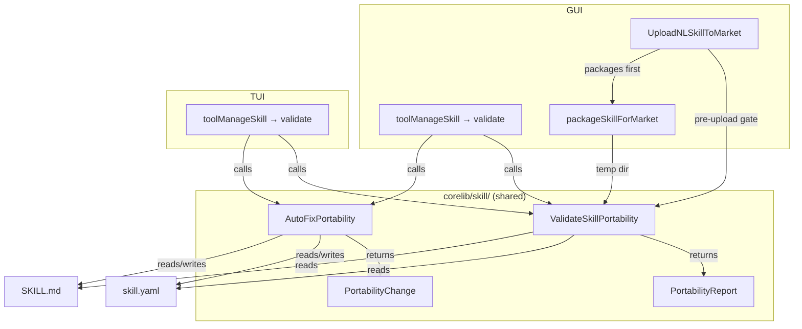
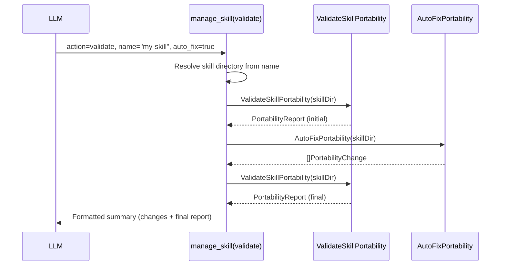
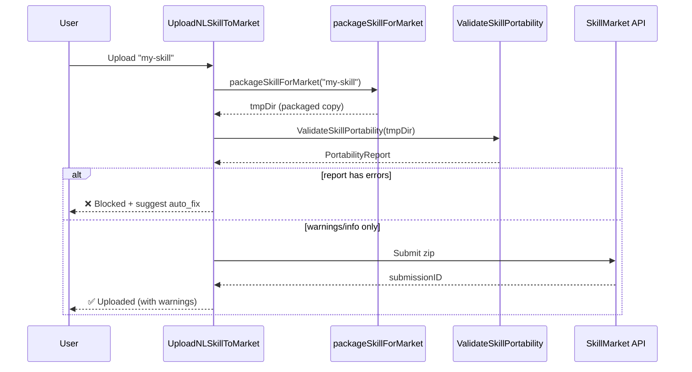

# Design Document: Skill Market Portability

## Overview

This feature adds a portability validation and auto-fix pipeline to the skill ecosystem. The pipeline catches common issues — hardcoded absolute paths, missing platform declarations, platform-specific syntax, undeclared dependencies — that prevent skills from working on machines other than the author's. It consists of three core components:

1. **Validation Engine** (`ValidateSkillPortability`) — scans a skill directory and produces a structured report of portability issues
2. **Auto-Fixer** (`AutoFixPortability`) — applies safe, reversible fixes to the most common issues (path normalization, metadata defaults, placeholder insertion)
3. **Integration Points** — a pre-upload gate in `UploadNLSkillToMarket`, a `validate` action in the `manage_skill` tool, and shared corelib functions consumed by both GUI and TUI

All validation and fix logic lives in `corelib/skill/` so that GUI and TUI share a single implementation. The `manage_skill` tool dispatchers in both `gui/im_tools_misc.go` and `tui/agent_tools.go` add a `validate` case that delegates to the shared corelib functions.

## Architecture



### Data Flow: Validate Action



### Data Flow: Pre-Upload Gate



## Components and Interfaces

### 1. Portability Report Types (`corelib/skill/portability_types.go`)

```go
package skill

import "time"

// IssueSeverity represents the severity level of a portability issue.
type IssueSeverity string

const (
    SeverityError   IssueSeverity = "error"
    SeverityWarning IssueSeverity = "warning"
    SeverityInfo    IssueSeverity = "info"
)

// PortabilityIssue represents a single portability problem found in a skill.
type PortabilityIssue struct {
    Severity   IssueSeverity `json:"severity"`
    Category   string        `json:"category"`
    Message    string        `json:"message"`
    File       string        `json:"file"`
    Line       int           `json:"line,omitempty"`
    Suggestion string        `json:"suggestion,omitempty"`
}

// IssueSummary holds counts of issues by severity.
type IssueSummary struct {
    Errors   int `json:"errors"`
    Warnings int `json:"warnings"`
    Infos    int `json:"infos"`
}

// PortabilityReport is the structured result of portability validation.
type PortabilityReport struct {
    SkillName   string             `json:"skill_name"`
    SkillDir    string             `json:"skill_dir"`
    Issues      []PortabilityIssue `json:"issues"`
    Summary     IssueSummary       `json:"summary"`
    MarketReady bool               `json:"market_ready"`
    Timestamp   time.Time          `json:"timestamp"`
}

// PortabilityChange records a single auto-fix modification.
type PortabilityChange struct {
    File        string `json:"file"`
    Field       string `json:"field,omitempty"`
    Original    string `json:"original"`
    Replacement string `json:"replacement"`
}
```

**Design decisions:**
- `IssueSeverity` is a typed string rather than an int enum for JSON readability and forward compatibility.
- `MarketReady` is computed from `Summary.Errors == 0` at report construction time, not as a method, so it serializes naturally.
- `PortabilityChange` includes `File` to distinguish changes in `skill.yaml` vs `SKILL.md`.
- `Line` is optional (zero value omitted) because not all checks can pinpoint a line number.

### 2. Validation Engine (`corelib/skill/portability_validator.go`)

```go
package skill

// ValidateSkillPortability scans a skill directory for portability issues.
// It reads skill.yaml and optionally SKILL.md, checking bash step commands
// for hardcoded paths, platform-specific syntax, missing metadata, and
// undeclared dependencies. Returns a PortabilityReport.
func ValidateSkillPortability(skillDir string) (*PortabilityReport, error)
```

**Internal structure — checker functions:**

Each category of check is implemented as a private function that appends issues to a shared slice:

| Checker | Category | Severity | What it detects |
|---------|----------|----------|-----------------|
| `checkHardcodedPaths` | `hardcoded_path` | error | Absolute paths in bash commands (Unix `/home/...`, Windows `C:\...`) — excludes system binary paths (`/usr/bin/`, `/bin/`, `/usr/local/bin/`) |
| `checkMissingBaseDir` | `missing_basedir` | error | Absolute paths pointing inside the skill directory that should use `{baseDir}` — runs before `checkHardcodedPaths`; matched paths are excluded from `checkHardcodedPaths` to avoid duplicate reporting |
| `checkMetadata` | `missing_platforms`, `incomplete_metadata` | warning | Empty platforms, short description (<10 chars), empty triggers |
| `checkPathSeparators` | `path_separator` | warning | Backslash path separators in bash commands |
| `checkPlatformCompat` | `platform_compat` | warning/info | `python3` without fallback, `%VAR%` Windows env vars, shebangs, POSIX-only commands on Windows-targeted skills, PowerShell syntax on Unix-targeted skills |
| `checkShellMismatch` | `shell_mismatch` | warning | `preferred_shell` conflicts with declared platforms |
| `checkDependencies` | `undeclared_dependency`, `runtime_install` | warning/info | Undeclared runtime commands (python, node, pip, npm), `pip install`/`npm install` in commands |

**Path detection strategy:**

Absolute paths are detected using regex patterns:
- Unix: `/(home|usr|opt|tmp|var|etc)/` or `/Users/` (macOS)
- Windows: `[A-Za-z]:\\` (drive letter)
- Home directory: `/home/<username>/` or `C:\Users\<username>\` where `<username>` is extracted from `os.UserHomeDir()`
- **Excluded (system binaries):** Paths matching `/usr/bin/`, `/bin/`, `/usr/local/bin/`, `/usr/sbin/`, `/sbin/` are NOT flagged — these are legitimate runtime references, not portability issues

The `checkMissingBaseDir` checker runs **before** `checkHardcodedPaths` and claims matching paths. `checkHardcodedPaths` only reports paths that were NOT already reported by `checkMissingBaseDir`, avoiding duplicate issues for the same path.

**SKILL.md support:**

The validator checks for `SKILL.md` (or `skill.md`) in the skill directory. If found, it uses the existing `extractAllBashBlocksFromMarkdown()` function to extract bash code blocks, then runs the same path/platform checks on each block. Issues reference `file: "SKILL.md"` instead of `file: "skill.yaml"`.

**Platform-aware checks:**

Cross-platform checks (6.2, 6.3) are conditional on the skill's declared platforms:
- POSIX-only commands (`chmod`, `ln -s`, `chown`, `grep -P`) trigger warnings only when platforms include `"windows"` or `"universal"` or is empty
- Windows-specific syntax (`$env:`, `[Console]::`, `.ps1`, `cmd.exe`) triggers warnings only when platforms include `"linux"`, `"macos"`, or `"universal"` or is empty

**Dependency detection:**

The validator maintains a list of common runtime commands: `python`, `python3`, `node`, `npm`, `npx`, `pip`, `pip3`, `java`, `go`, `cargo`, `ruby`, `perl`. For each bash step command, it extracts the first word (the command) and checks if it appears in `required_env`, `description`, or `triggers`. The check uses simple substring matching (case-insensitive) — not exact word boundary matching — to avoid false positives on compound words.

### 3. Auto-Fixer (`corelib/skill/portability_fixer.go`)

```go
package skill

// AutoFixPortability applies safe, reversible fixes to a skill directory.
// It reads skill.yaml (and optionally SKILL.md), detects fixable issues
// internally (does not require a pre-computed report), applies fixes for
// hardcoded paths, missing metadata, and path separators, then writes
// the modified files back. Creates .bak backups before modifying.
// Returns the list of changes made.
func AutoFixPortability(skillDir string) ([]PortabilityChange, error)
```

**Fix strategies:**

| Issue Category | Fix Applied |
|---------------|-------------|
| `missing_basedir` | Replace absolute path with `{baseDir}/relative/path` |
| `hardcoded_path` (home dir) | Replace `/home/<user>/...` or `C:\Users\<user>\...` with `$HOME/...` |
| `missing_platforms` | Set `platforms: ["universal"]` |
| `path_separator` | Replace `\` with `/` in file path references within commands |

**What is NOT auto-fixed:**
- Generic absolute paths that don't point inside the skill dir or home dir (too risky to guess intent)
- Platform-specific commands (chmod, PowerShell syntax) — these require manual rewriting
- Undeclared dependencies — the fixer can't know what to add to `required_env`
- Shebangs — removing them would break the script on Unix

**Backup strategy:**

Before modifying any file, the fixer copies the original to `<filename>.bak` in the same directory. If a `.bak` already exists, it is overwritten (the most recent original is always preserved).

**Extra field preservation:**

The fixer uses `ParseSkillYAMLFile()` to read and `FormatSkillYAMLFile()` to write, which already handles the `Extra` map for unknown YAML fields. This ensures custom fields added by skill authors are preserved through the fix cycle.

**SKILL.md fix strategy:**

For SKILL.md files, the fixer performs string replacement on the raw markdown content (not parsed AST). It finds absolute paths within ` ```bash ` blocks using the same regex patterns as the validator, then replaces them with `{baseDir}`-relative paths. The replacement is done on the raw text to preserve markdown formatting, comments, and non-bash content.

### 4. Report Formatter (`corelib/skill/portability_format.go`)

```go
package skill

// FormatPortabilityReport returns a human-readable text summary of the report
// with severity indicators (❌ error, ⚠️ warning, ℹ️ info) and fix suggestions.
func FormatPortabilityReport(report *PortabilityReport) string

// FormatPortabilityChanges returns a human-readable summary of auto-fix changes.
func FormatPortabilityChanges(changes []PortabilityChange) string
```

The formatter produces output like:

```
📋 Portability Report: my-skill
━━━━━━━━━━━━━━━━━━━━━━━━━━━━━━

❌ [hardcoded_path] skill.yaml: Command contains absolute path "/home/user/scripts/run.py"
   💡 Use {baseDir}/scripts/run.py instead

⚠️ [missing_platforms] skill.yaml: No platforms declared
   💡 Add platforms: ["universal"] or specify target platforms

ℹ️ [platform_compat] skill.yaml: Command uses python3, which may not be available on Windows
   💡 Consider using python3/python conditional or document the requirement

━━━━━━━━━━━━━━━━━━━━━━━━━━━━━━
Summary: 1 error, 1 warning, 1 info
Market Ready: ❌ No (fix errors before uploading)
```

### 5. manage_skill Validate Action

**GUI** (`gui/im_tools_misc.go`):

```go
func (h *IMMessageHandler) toolValidateSkill(args map[string]interface{}) string {
    name := stringVal(args, "name")
    autoFix, _ := args["auto_fix"].(bool)
    // 1. Resolve skill directory from name
    // 2. Run ValidateSkillPortability(skillDir)
    // 3. If autoFix: run AutoFixPortability(skillDir), then re-validate
    // 4. Return FormatPortabilityReport + FormatPortabilityChanges
}
```

**TUI** (`tui/agent_tools.go`):

```go
func (h *TUIAgentHandler) toolValidateSkill(args map[string]interface{}) string {
    // Identical logic — both call the same corelib functions
}
```

Both dispatchers add `case "validate"` to their existing `toolManageSkill` switch statement.

### 6. Pre-Upload Gate

The gate is inserted into `UploadNLSkillToMarket` in `gui/app_nl_skills.go`, after `packageSkillForMarket` creates the temp directory but before the zip is submitted:

```go
func (a *App) UploadNLSkillToMarket(skillName string) (string, error) {
    // ... existing setup ...
    
    zipPath, err := a.packageSkillForMarket(skillName)
    // ... existing error handling ...
    
    // NEW: Pre-upload portability validation on the packaged copy
    // Extract zip to temp dir for validation, or validate before zipping
    report, err := skill.ValidateSkillPortability(tmpDir)
    if err != nil {
        return "", fmt.Errorf("portability validation failed: %w", err)
    }
    if report.Summary.Errors > 0 {
        return "", fmt.Errorf("upload blocked: %d portability error(s) found.\n%s\n\n💡 Run manage_skill(action=\"validate\", name=\"%s\", auto_fix=true) to attempt automatic fixes",
            report.Summary.Errors, skill.FormatPortabilityReport(report), skillName)
    }
    
    // ... existing upload logic ...
}
```

**Implementation note:** The validation runs on the temp directory created by `packageSkillForMarket`, not the original skill directory. This means the packaged copy (which has `SkillDir` cleared and `skill.yaml` regenerated) is what gets validated. The `packageSkillForMarket` function needs a minor refactor to expose the temp directory path before zipping, or the validation can run on the extracted zip contents.

### 7. Tool Definition Update

The `manage_skill` tool definition in `gui/im_tool_definitions.go` is updated:

- Description: add `validate` to the action list
- New parameter: `auto_fix` with type `boolean` and description for the validate action
- The `name` parameter is already present (used by run/upload)

## Data Models

### PortabilityReport

```json
{
  "skill_name": "my-pdf-converter",
  "skill_dir": "/home/user/.maclaw/data/skills/my-pdf-converter",
  "issues": [
    {
      "severity": "error",
      "category": "hardcoded_path",
      "message": "Command contains absolute path \"/home/user/scripts/convert.py\"",
      "file": "skill.yaml",
      "line": 0,
      "suggestion": "Use {baseDir}/scripts/convert.py instead"
    },
    {
      "severity": "warning",
      "category": "missing_platforms",
      "message": "No platforms declared in skill.yaml",
      "file": "skill.yaml",
      "suggestion": "Add platforms: [\"universal\"] or specify target platforms"
    }
  ],
  "summary": {
    "errors": 1,
    "warnings": 1,
    "infos": 0
  },
  "market_ready": false,
  "timestamp": "2025-07-15T10:30:00Z"
}
```

### PortabilityChange

```json
{
  "file": "skill.yaml",
  "field": "steps[0].params.command",
  "original": "/home/user/skills/my-pdf-converter/scripts/convert.py",
  "replacement": "{baseDir}/scripts/convert.py"
}
```

### Issue Categories

| Category | Severity | Auto-Fixable | Description |
|----------|----------|-------------|-------------|
| `hardcoded_path` | error | Partial (home dir → `$HOME`, skill dir → `{baseDir}`) | Absolute path in bash command |
| `missing_basedir` | error | Yes | Absolute path inside skill dir should use `{baseDir}` |
| `missing_platforms` | warning | Yes (→ `["universal"]`) | Empty/missing platforms field |
| `incomplete_metadata` | warning | No | Short description or empty triggers |
| `path_separator` | warning | Yes (→ `/`) | Backslash path separators |
| `platform_compat` | warning/info | No | Platform-specific syntax (python3, %VAR%, shebang, POSIX/Windows commands) |
| `shell_mismatch` | warning | No | preferred_shell conflicts with platforms |
| `undeclared_dependency` | warning | No | Runtime command not in required_env/description |
| `runtime_install` | info | No | pip install/npm install in commands |

## Correctness Properties

*A property is a characteristic or behavior that should hold true across all valid executions of a system — essentially, a formal statement about what the system should do. Properties serve as the bridge between human-readable specifications and machine-verifiable correctness guarantees.*

### Property 1: Validate-Fix-Validate Round-Trip

*For any* valid skill directory containing any combination of auto-fixable portability issues (hardcoded paths inside the skill dir, missing platforms, backslash separators), running `ValidateSkillPortability` then `AutoFixPortability` then `ValidateSkillPortability` again SHALL produce a report with zero "error" severity issues.

**Validates: Requirements 1.12**

### Property 2: Absolute Path Detection

*For any* bash step command containing an absolute path (Unix `/home/...`, `/Users/...`, `/opt/...` or Windows `C:\...`), `ValidateSkillPortability` SHALL include at least one issue with severity "error" and category "hardcoded_path" or "missing_basedir" in the returned report.

**Validates: Requirements 1.2, 1.3**

### Property 3: Missing BaseDir Suggestion

*For any* bash step command containing an absolute path that is a prefix match of the skill directory path, `ValidateSkillPortability` SHALL include an issue with category "missing_basedir" whose suggestion contains the string `{baseDir}`.

**Validates: Requirements 1.4**

### Property 4: Metadata Validation Completeness

*For any* `SkillYAMLFile` where platforms is empty, or description is shorter than 10 characters, or triggers is empty, `ValidateSkillPortability` SHALL include at least one issue with severity "warning" and category "missing_platforms" or "incomplete_metadata" for each violated condition.

**Validates: Requirements 1.5, 1.6, 1.7**

### Property 5: Upload Gate Decision

*For any* `PortabilityReport`, the upload gate SHALL block the upload if and only if `Summary.Errors > 0`. Equivalently, `MarketReady` SHALL equal `Summary.Errors == 0`.

**Validates: Requirements 3.2, 3.3**

### Property 6: SKILL.md Bash Block Validation

*For any* skill directory containing a SKILL.md file with bash code blocks that contain absolute paths, `ValidateSkillPortability` SHALL include at least one issue with `File` equal to "SKILL.md" and category "hardcoded_path" or "missing_basedir".

**Validates: Requirements 5.1, 5.2**

### Property 7: Cross-Platform Construct Detection

*For any* bash step command containing a platform-specific construct (shebang, POSIX-only command, PowerShell syntax, Windows env var `%VAR%`, `python3`) combined with a platform declaration that conflicts with that construct, `ValidateSkillPortability` SHALL include at least one issue with category "platform_compat" or "shell_mismatch".

**Validates: Requirements 1.8, 1.9, 1.10, 6.1, 6.2, 6.3, 6.4**

### Property 8: Dependency Declaration Validation

*For any* bash step command whose first token is a known runtime command (python, node, npm, pip, etc.) and whose skill's `required_env` and `description` do not mention that command, `ValidateSkillPortability` SHALL include an issue with category "undeclared_dependency".

**Validates: Requirements 7.1, 7.2**

### Property 9: Extra Field Preservation

*For any* `SkillYAMLFile` with non-empty `Extra` fields, running `AutoFixPortability` SHALL produce a `skill.yaml` that, when parsed with `ParseSkillYAMLFile`, contains the same `Extra` keys and values as the original.

**Validates: Requirements 2.9**

### Property 10: Report JSON Round-Trip

*For any* `PortabilityReport` instance, serializing to JSON with `json.Marshal` then deserializing with `json.Unmarshal` SHALL produce a report with identical `SkillName`, `SkillDir`, `Issues`, `Summary`, and `MarketReady` fields.

**Validates: Requirements 8.4**

### Property 11: MarketReady Invariant

*For any* `PortabilityReport`, the `MarketReady` field SHALL be `true` if and only if the number of issues with severity "error" is zero.

**Validates: Requirements 8.3**

## Error Handling

| Scenario | Handling |
|----------|----------|
| Skill directory does not exist | `ValidateSkillPortability` returns `os.ErrNotExist` wrapped error |
| Skill directory not readable (permissions) | `ValidateSkillPortability` returns permission error |
| `skill.yaml` missing from directory | Validator still checks SKILL.md if present; if neither exists, returns error |
| `skill.yaml` parse failure | Returns parse error from `ParseSkillYAMLFile` |
| SKILL.md parse failure | Logs warning, continues with skill.yaml-only validation |
| Auto-fixer cannot write backup | Returns error, no changes made |
| Auto-fixer cannot write modified file | Returns error; backup exists for recovery |
| Skill name not found in `manage_skill validate` | Returns descriptive error: `"skill %q not found. Use manage_skill(action=\"list\") to see installed skills"` |
| `FormatSkillYAMLFile` fails during auto-fix | Returns error; backup exists for recovery |

**Backup recovery:** If the auto-fixer fails mid-write, the `.bak` file contains the original. The fixer creates the backup atomically (write to `.bak` first, then modify the original) so that a crash at any point leaves at least one valid copy.

## Testing Strategy

### Property-Based Tests (PBT)

**Library:** [rapid](https://github.com/flyingmutant/rapid) (Go property-based testing library)

**Configuration:** Minimum 100 iterations per property test.

Each property from the Correctness Properties section maps to a single property-based test:

| Property | Test | Generator Strategy |
|----------|------|-------------------|
| P1: Round-trip | Generate random skill dirs with fixable issues → validate → fix → validate | Generate SkillYAMLFile with random absolute paths (inside skill dir), empty platforms, backslash paths |
| P2: Absolute path detection | Generate bash commands with embedded absolute paths | Random Unix/Windows absolute paths spliced into command templates |
| P3: Missing baseDir suggestion | Generate commands referencing files inside the skill dir | Construct skill dir path, then embed it in commands |
| P4: Metadata validation | Generate SkillYAMLFile with varying metadata completeness | Random strings for description (0-20 chars), random platform lists (empty/non-empty), random trigger lists |
| P5: Upload gate decision | Generate PortabilityReport with varying error counts | Random issue lists with mixed severities |
| P6: SKILL.md validation | Generate SKILL.md content with bash blocks containing absolute paths | Random markdown with embedded bash blocks |
| P7: Cross-platform detection | Generate commands with platform-specific constructs + platform declarations | Pairs of (construct, conflicting platform) |
| P8: Dependency detection | Generate commands with runtime commands + varying required_env/description | Random command names from known list, random required_env contents |
| P9: Extra field preservation | Generate SkillYAMLFile with random Extra fields + fixable issues | Random string→any maps for Extra |
| P10: Report JSON round-trip | Generate random PortabilityReport instances | Random issues, summaries, timestamps |
| P11: MarketReady invariant | Generate PortabilityReport with varying error counts | Random issue lists |

**Tag format:** `Feature: skill-market-portability, Property {N}: {title}`

### Unit Tests (Example-Based)

| Test | What it verifies |
|------|-----------------|
| `TestValidate_NonExistentDir` | Returns error for missing directory |
| `TestValidate_CleanSkill` | Returns zero issues for a well-formed skill |
| `TestAutoFix_NoChanges` | Returns empty change list for clean skill |
| `TestAutoFix_CreatesBackup` | Verifies `.bak` file creation |
| `TestAutoFix_SKILLMDBackup` | Verifies `SKILL.md.bak` file creation |
| `TestValidateAction_MissingName` | Returns error when name param is missing |
| `TestValidateAction_SkillNotFound` | Returns descriptive error for unknown skill |
| `TestValidateAction_AutoFixFlow` | Verifies validate → fix → validate flow via tool action |
| `TestUploadGate_BlocksOnErrors` | Verifies upload is blocked with error-severity issues |
| `TestUploadGate_PassesWithWarnings` | Verifies upload proceeds with warning-only issues |
| `TestFormatReport_SeverityIndicators` | Verifies ❌/⚠️/ℹ️ in formatted output |

### Integration Tests

| Test | What it verifies |
|------|-----------------|
| `TestGUI_TUI_Equivalence` | Both dispatchers produce identical results for the same input |
| `TestUploadFlow_ValidationOrder` | Validation runs on packaged copy, not original |
