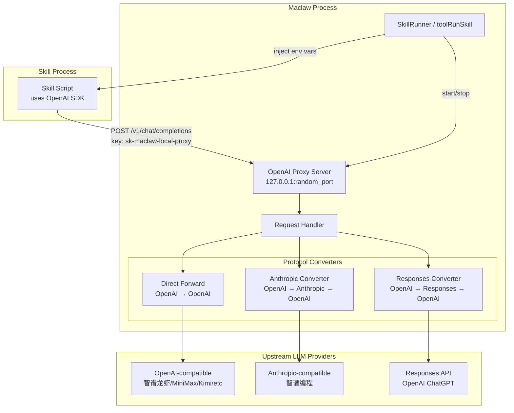

# Design Document: Skill OpenAI Proxy

## Overview

本设计实现一个轻量级本地 HTTP 代理服务器，在 Skill 执行期间提供 OpenAI 兼容的 `/v1/chat/completions` 端点。代理按需启动（仅当 Skill 声明 `required_env: ["OPENAI_API_KEY"]` 时），自动将请求转发到当前配置的 LLM 服务商，并处理三种协议路径：

1. **直通转发**：OpenAI 协议服务商（免费/智谱龙虎/MiniMax/Kimi/讯飞/Custom）
2. **Anthropic → OpenAI 转换**：Anthropic 协议服务商（智谱编程 glm-5.1）
3. **Responses API → OpenAI 转换**：Responses API 服务商（OpenAI ChatGPT via responses-ws）

代理生命周期与 Skill 执行绑定：启动于第一步执行前，关闭于最后一步完成后（或取消时）。

## Architecture



**设计决策**：

1. **新文件 `corelib/openai_proxy.go`**：代理逻辑放在 corelib 包中，GUI 和 TUI 共享同一实现，避免代码重复。
2. **随机端口 `net.Listen("tcp", "127.0.0.1:0")`**：避免端口冲突，OS 自动分配可用端口。
3. **非流式强制**：所有转发请求设置 `stream: false`，简化协议转换逻辑（无需处理 SSE）。
4. **固定 Dummy Key `sk-maclaw-local-proxy`**：Skill 脚本使用此 key 连接本地代理，无真实认证作用，仅满足 OpenAI SDK 的 key 非空校验。
5. **用户覆盖优先**：当用户通过 `extra_env` 提供 `OPENAI_API_KEY` 或 `OPENAI_BASE_URL` 时，不启动代理，直接使用用户配置。

## Components and Interfaces

### 1. `OpenAIProxy` (corelib/openai_proxy.go)

核心代理服务器结构体，管理 HTTP server 生命周期和请求路由。

```go
// OpenAIProxyConfig holds the upstream LLM configuration for the proxy.
type OpenAIProxyConfig struct {
    URL      string // upstream base URL (e.g. "https://open.bigmodel.cn/api/anthropic")
    Key      string // upstream API key
    Model    string // model name to use
    Protocol string // "" or "openai" or "anthropic"
    WireAPI  string // "" or "chat" or "responses" or "responses-ws"
}

// OpenAIProxy is a local HTTP proxy that provides an OpenAI-compatible
// /v1/chat/completions endpoint, forwarding requests to the configured
// upstream LLM provider with protocol conversion as needed.
type OpenAIProxy struct {
    config   OpenAIProxyConfig
    server   *http.Server
    listener net.Listener
    port     int
    client   *http.Client // upstream HTTP client with 120s timeout
}

// NewOpenAIProxy creates a new proxy instance with the given config.
func NewOpenAIProxy(cfg OpenAIProxyConfig) *OpenAIProxy

// Start binds to a random port on 127.0.0.1 and begins serving.
// Returns the allocated port number or an error.
func (p *OpenAIProxy) Start() (int, error)

// Stop gracefully shuts down the proxy server.
func (p *OpenAIProxy) Stop() error

// Port returns the port the proxy is listening on.
func (p *OpenAIProxy) Port() int
```

### 2. Protocol Handlers (internal to openai_proxy.go)

```go
// handleChatCompletions is the main HTTP handler for POST /v1/chat/completions.
func (p *OpenAIProxy) handleChatCompletions(w http.ResponseWriter, r *http.Request)

// forwardOpenAI forwards the request directly to an OpenAI-compatible upstream.
func (p *OpenAIProxy) forwardOpenAI(body map[string]interface{}) ([]byte, int, error)

// forwardAnthropic converts OpenAI request to Anthropic format, sends it,
// and converts the response back to OpenAI format.
func (p *OpenAIProxy) forwardAnthropic(body map[string]interface{}) ([]byte, int, error)

// forwardResponses converts OpenAI request to Responses API format, sends it,
// and converts the response back to OpenAI format.
func (p *OpenAIProxy) forwardResponses(body map[string]interface{}) ([]byte, int, error)
```

### 3. Conversion Functions (internal)

```go
// openaiToAnthropic converts an OpenAI Chat Completions request body
// to an Anthropic Messages API request body.
func openaiToAnthropic(body map[string]interface{}, model string) map[string]interface{}

// anthropicToOpenAI converts an Anthropic Messages API response body
// to an OpenAI Chat Completions response body.
func anthropicToOpenAI(resp map[string]interface{}, model string) map[string]interface{}

// openaiToResponses converts an OpenAI Chat Completions request body
// to a Responses API request body.
func openaiToResponses(body map[string]interface{}, model string) map[string]interface{}

// responsesToOpenAI converts a Responses API response body
// to an OpenAI Chat Completions response body.
func responsesToOpenAI(resp map[string]interface{}, model string) map[string]interface{}
```

### 4. SkillRunner Integration

**GUI 侧** (`gui/skill_runner.go`):

```go
// In executeAsync(), before executing steps:
// 1. Check if skill.RequiredEnv contains "OPENAI_API_KEY"
// 2. Check if extraEnv already provides OPENAI_API_KEY or OPENAI_BASE_URL
// 3. If needed, create and start OpenAIProxy
// 4. Inject env vars into extraEnv
// 5. defer proxy.Stop()
```

**TUI 侧** (`tui/agent_tools.go`):

```go
// In toolRunSkill(), same logic:
// 1. Check required_env for OPENAI_API_KEY
// 2. Check extra_env for user overrides
// 3. Start proxy if needed
// 4. Inject env vars
// 5. defer proxy.Stop()
```

### 5. Helper: `NeedsOpenAIProxy`

```go
// NeedsOpenAIProxy determines if a skill needs the local OpenAI proxy.
// Returns true if required_env contains OPENAI_API_KEY and the user
// has not provided OPENAI_API_KEY or OPENAI_BASE_URL via extra_env.
func NeedsOpenAIProxy(requiredEnv []string, extraEnv map[string]string) bool
```

## Data Models

### OpenAI Chat Completions Request (incoming from Skill)

```json
{
  "model": "gpt-4",
  "messages": [
    {"role": "system", "content": "You are helpful."},
    {"role": "user", "content": "Hello"}
  ],
  "temperature": 0.7,
  "max_tokens": 1000,
  "stream": true
}
```

### Anthropic Messages Request (converted)

```json
{
  "model": "glm-5.1",
  "system": "You are helpful.",
  "messages": [
    {"role": "user", "content": "Hello"}
  ],
  "max_tokens": 4096,
  "stream": false
}
```

### Anthropic Messages Response

```json
{
  "id": "msg_xxx",
  "type": "message",
  "role": "assistant",
  "content": [
    {"type": "text", "text": "Hello! How can I help?"}
  ],
  "stop_reason": "end_turn",
  "usage": {
    "input_tokens": 25,
    "output_tokens": 15
  }
}
```

### Responses API Request (converted)

```json
{
  "model": "gpt-5.4",
  "input": [
    {"role": "system", "content": "You are helpful."},
    {"role": "user", "content": "Hello"}
  ],
  "stream": false
}
```

### Responses API Response

```json
{
  "id": "resp_xxx",
  "output": [
    {
      "type": "message",
      "role": "assistant",
      "content": [
        {"type": "output_text", "text": "Hello! How can I help?"}
      ]
    }
  ],
  "usage": {
    "input_tokens": 25,
    "output_tokens": 15
  }
}
```

### OpenAI Chat Completions Response (returned to Skill)

```json
{
  "id": "chatcmpl-xxx",
  "object": "chat.completion",
  "model": "glm-5.1",
  "choices": [
    {
      "index": 0,
      "message": {
        "role": "assistant",
        "content": "Hello! How can I help?"
      },
      "finish_reason": "stop"
    }
  ],
  "usage": {
    "prompt_tokens": 25,
    "completion_tokens": 15,
    "total_tokens": 40
  }
}
```

### Protocol Routing Decision

```go
func (p *OpenAIProxy) routeProtocol() string {
    if strings.EqualFold(p.config.Protocol, "anthropic") {
        return "anthropic"
    }
    w := strings.ToLower(strings.TrimSpace(p.config.WireAPI))
    if w == "responses" || w == "responses-ws" {
        return "responses"
    }
    return "openai" // default: direct forward
}
```

## Correctness Properties

*A property is a characteristic or behavior that should hold true across all valid executions of a system—essentially, a formal statement about what the system should do. Properties serve as the bridge between human-readable specifications and machine-verifiable correctness guarantees.*

### Property 1: User-provided env vars bypass proxy

*For any* Skill with `required_env` containing `OPENAI_API_KEY`, and *for any* non-empty `OPENAI_API_KEY` or `OPENAI_BASE_URL` value provided via `extra_env`, the Skill_Runner SHALL NOT start the Proxy and SHALL preserve the user-provided values in the Skill step environment.

**Validates: Requirements 2.4, 2.5, 2.6**

### Property 2: OpenAI direct forward preserves request structure

*For any* valid OpenAI Chat Completions request body and *for any* `OpenAIProxyConfig` with Protocol `""` or `"openai"` and WireAPI `""` or `"chat"`, the forwarded request body SHALL be identical to the incoming body except: (a) the `model` field is replaced with the config's Model value, and (b) the `stream` field is set to `false`.

**Validates: Requirements 3.1, 3.2, 6.6**

### Property 3: Anthropic conversion round-trip structural completeness

*For any* valid OpenAI Chat Completions request containing messages with `system`, `user`, and `assistant` roles, converting to Anthropic format, receiving a valid Anthropic response, and converting back to OpenAI format SHALL produce a response containing all required structural fields: `id`, `object`, `model`, `choices` (with `message.role`, `message.content`, `finish_reason`), and `usage` (with `prompt_tokens`, `completion_tokens`, `total_tokens`).

**Validates: Requirements 8.1, 4.1, 4.8**

### Property 4: Responses API conversion round-trip structural completeness

*For any* valid OpenAI Chat Completions request, converting to Responses API format, receiving a valid Responses API response, and converting back to OpenAI format SHALL produce a response containing all required structural fields: `id`, `object`, `model`, `choices` (with `message.role`, `message.content`, `finish_reason`), and `usage` (with `prompt_tokens`, `completion_tokens`, `total_tokens`).

**Validates: Requirements 8.2, 5.1, 5.6**

### Property 5: Multiple content blocks concatenation

*For any* Anthropic response with N text content blocks (N ≥ 1), the converted OpenAI response's `choices[0].message.content` SHALL equal the concatenation of all text blocks. Similarly, *for any* Responses API response with M message output items (M ≥ 1), the converted OpenAI response's `choices[0].message.content` SHALL equal the concatenation of all text content from those items.

**Validates: Requirements 8.3, 8.4**

### Property 6: Stream field forced to false

*For any* incoming request to the proxy (with `stream` set to `true`, `false`, or absent), the request forwarded to the upstream provider SHALL always have `stream` set to `false`.

**Validates: Requirements 6.6**

### Property 7: Invalid JSON returns 400

*For any* HTTP request body that is not valid JSON, the proxy SHALL return HTTP 400 with a JSON error body containing an `error` object with `message` and `type` fields.

**Validates: Requirements 6.3**

### Property 8: Non-OPENAI skills unaffected

*For any* Skill whose `required_env` field does NOT contain `OPENAI_API_KEY`, the Skill_Runner SHALL NOT start the Proxy and SHALL NOT inject `OPENAI_API_KEY`, `OPENAI_BASE_URL`, or `OPENAI_MODEL` into the Skill step environment.

**Validates: Requirements 7.1, 7.2**

## Error Handling

| Scenario | Behavior |
|----------|----------|
| Port binding failure | Log error, skip proxy, let Skill fail naturally (Req 1.4) |
| Invalid request path | HTTP 404 + JSON error (Req 6.1) |
| Wrong HTTP method | HTTP 405 + JSON error (Req 6.2) |
| Malformed JSON body | HTTP 400 + JSON error with parse detail (Req 6.3) |
| Upstream unreachable | HTTP 502 + JSON error with detail (Req 6.4) |
| Upstream timeout (>120s) | HTTP 502 + JSON error "upstream timeout" (Req 6.5) |
| Upstream 4xx/5xx | Forward status code and body as-is (Req 3.5) |
| Context cancelled | `proxy.Stop()` called, server shuts down gracefully (Req 1.3) |

Error response format (consistent with OpenAI API error format):

```json
{
  "error": {
    "message": "descriptive error message",
    "type": "invalid_request_error | server_error"
  }
}
```

## Testing Strategy

### Property-Based Tests (using `testing/quick` or `rapid`)

Property-based testing is appropriate for this feature because:
- Protocol conversion functions are pure transformations with clear input/output
- The input space (valid OpenAI request bodies) is large and varied
- Universal properties (round-trip, structural completeness) should hold across all inputs

**Library**: `pgregory.net/rapid` (Go property-based testing library)

**Configuration**: Minimum 100 iterations per property test.

Each property test references its design document property:

- **Feature: skill-openai-proxy, Property 1**: User-provided env vars bypass proxy
- **Feature: skill-openai-proxy, Property 2**: OpenAI direct forward preserves request structure
- **Feature: skill-openai-proxy, Property 3**: Anthropic conversion round-trip structural completeness
- **Feature: skill-openai-proxy, Property 4**: Responses API conversion round-trip structural completeness
- **Feature: skill-openai-proxy, Property 5**: Multiple content blocks concatenation
- **Feature: skill-openai-proxy, Property 6**: Stream field forced to false
- **Feature: skill-openai-proxy, Property 7**: Invalid JSON returns 400
- **Feature: skill-openai-proxy, Property 8**: Non-OPENAI skills unaffected

### Unit Tests (example-based)

- Proxy lifecycle: start, serve, stop
- Specific protocol routing decisions
- `stop_reason` → `finish_reason` mapping (`end_turn` → `stop`, `max_tokens` → `length`)
- `anthropic-version` header value
- Endpoint URL construction for each protocol
- `NeedsOpenAIProxy()` helper with various input combinations
- Error responses for 404, 405, 502 scenarios

### Integration Tests

- Full round-trip with mock upstream server (all three protocol paths)
- GUI SkillRunner proxy lifecycle integration
- TUI toolRunSkill proxy lifecycle integration
- Concurrent Skill executions with separate proxy instances
- Proxy startup latency measurement (< 200ms)

### Test File Location

- `corelib/openai_proxy_test.go` — property tests + unit tests for conversion functions
- `corelib/openai_proxy_integration_test.go` — integration tests with mock HTTP servers
