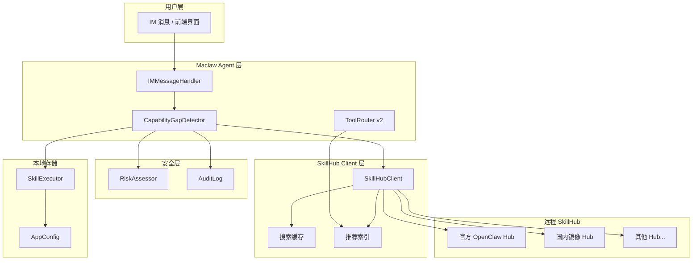
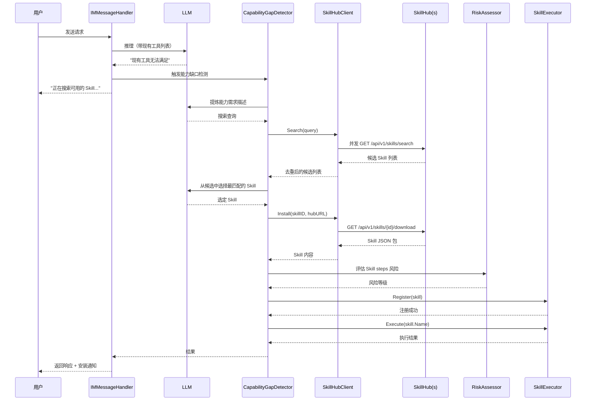

# 设计文档：SkillHub 自主发现与安装

## 概述

本设计文档描述 Maclaw 如何通过已配置的 SkillHub 自主发现、下载和安装 Skill，实现运行时能力动态扩展。设计分为三层：Hub 侧 Catalog API、客户端 SkillHub Client、Agent 层能力缺口检测与自动安装。

### 设计目标

1. **Hub 侧**：在现有 Hub HTTP API 框架中新增 Skill Catalog 端点，支持搜索、查询和下载
2. **客户端**：新增 `SkillHubClient` 组件，并发查询多 Hub、缓存结果、下载安装 Skill
3. **Agent 层**：在 `IMMessageHandler` 的 LLM 调用链中集成能力缺口检测，触发自动搜索和安装
4. **安全层**：复用现有 `RiskAssessor` + `AuditLog` 对 Hub Skill 进行安装前审查
5. **前端**：在 `SkillsManagementPanel` 中新增 Hub 市场浏览界面

### 设计原则

- **增量扩展**：所有新组件通过接口与现有代码集成，不修改现有公共 API 签名
- **不限制死规则**：能力缺口检测由 LLM 自主判断，不硬编码触发条件
- **容错优先**：Hub 不可达时静默降级，不阻塞正常流程
- **安全可控**：trust_level 分级审查，critical 操作必须用户确认

## 架构

### 高层架构



### 核心数据流：自动发现与安装



## 组件与接口

### 1. Hub 侧 — Skill Catalog API

#### 1.1 数据模型

```go
// hub/internal/skill/types.go

// HubSkillMeta 是 SkillHub 中 Skill 的元数据。
type HubSkillMeta struct {
    ID          string   `json:"id"`
    Name        string   `json:"name"`
    Description string   `json:"description"`
    Tags        []string `json:"tags"`
    Version     string   `json:"version"`
    Author      string   `json:"author"`
    TrustLevel  string   `json:"trust_level"` // "official", "community", "unknown"
    Downloads   int      `json:"downloads"`
    CreatedAt   string   `json:"created_at"`
    UpdatedAt   string   `json:"updated_at"`
}

// HubSkillFull 包含完整的 Skill 定义，用于下载。
type HubSkillFull struct {
    HubSkillMeta
    Triggers []string      `json:"triggers"`
    Steps    []NLSkillStep `json:"steps"`
    Manifest SkillManifest `json:"manifest"`
}

// SkillManifest 描述 Skill 的依赖和兼容性。
type SkillManifest struct {
    MinMaclawVersion string   `json:"min_maclaw_version,omitempty"`
    RequiredMCP      []string `json:"required_mcp,omitempty"`      // 依赖的 MCP Server 类型
    Permissions      []string `json:"permissions,omitempty"`       // 需要的权限（如 "file_write", "shell_exec"）
}

// SkillSearchResult 搜索结果的分页包装。
type SkillSearchResult struct {
    Skills []HubSkillMeta `json:"skills"`
    Total  int            `json:"total"`
    Page   int            `json:"page"`
}
```

#### 1.2 HTTP 端点（`hub/internal/httpapi/skill_handlers.go`）

```go
// GET /api/v1/skills/search?q=xxx&tags=xxx&page=1
func (h *SkillHandlers) SearchSkills(w http.ResponseWriter, r *http.Request)

// GET /api/v1/skills/{id}
func (h *SkillHandlers) GetSkill(w http.ResponseWriter, r *http.Request)

// GET /api/v1/skills/{id}/download
func (h *SkillHandlers) DownloadSkill(w http.ResponseWriter, r *http.Request)

// GET /api/v1/skills/popular — 热门推荐
func (h *SkillHandlers) PopularSkills(w http.ResponseWriter, r *http.Request)

// POST /api/v1/skills — 发布 Skill（需认证）
func (h *SkillHandlers) PublishSkill(w http.ResponseWriter, r *http.Request)
```

#### 1.3 存储层（`hub/internal/skill/store.go`）

```go
// SkillStore 管理 Hub 侧的 Skill 存储。
// MVP 阶段使用 JSON 文件存储，后续可迁移到数据库。
type SkillStore struct {
    mu     sync.RWMutex
    dir    string            // Skill JSON 文件目录
    index  []HubSkillMeta    // 内存索引
}

func NewSkillStore(dir string) *SkillStore
func (s *SkillStore) Search(query string, tags []string, page int) SkillSearchResult
func (s *SkillStore) Get(id string) (*HubSkillFull, error)
func (s *SkillStore) Publish(skill HubSkillFull) error
func (s *SkillStore) RebuildIndex() error
```

### 2. 客户端 — SkillHubClient

#### 2.1 核心结构（`skillhub_client.go`）

```go
// SkillHubClient 并发查询多个 SkillHub，缓存结果，下载安装 Skill。
type SkillHubClient struct {
    app      *App
    mu       sync.RWMutex
    cache    map[string]cachedSearchResult // query -> cached result
    cacheTTL time.Duration                 // 5 分钟
    recIndex []HubSkillMeta               // 推荐 Skill 本地索引
}

type cachedSearchResult struct {
    results   []HubSkillMeta
    expiresAt time.Time
}

func NewSkillHubClient(app *App) *SkillHubClient

// Search 并发查询所有配置的 Hub，去重合并结果。
// 每个 Hub 超时 8 秒，全部不可达时返回空列表。
func (c *SkillHubClient) Search(ctx context.Context, query string) ([]HubSkillMeta, error)

// Install 从指定 Hub 下载 Skill 并返回 NLSkillEntry。
// 下载失败时自动回退到其他 Hub。
func (c *SkillHubClient) Install(ctx context.Context, skillID string, hubURL string) (*NLSkillEntry, error)

// CheckUpdate 检查本地 Hub Skill 是否有新版本。
func (c *SkillHubClient) CheckUpdate(ctx context.Context, skillID string, currentVersion string) (*HubSkillMeta, error)

// RefreshRecommendations 从 Hub 拉取热门 Skill 到本地推荐索引。
func (c *SkillHubClient) RefreshRecommendations(ctx context.Context) error

// GetRecommendations 返回本地缓存的推荐 Skill 列表。
func (c *SkillHubClient) GetRecommendations() []HubSkillMeta
```

#### 2.2 Hub 选择策略

```go
// selectBestHub 根据 PingSkillHub 的延迟数据选择最快的 Hub。
// 用于下载时优先选择低延迟 Hub，失败时回退到下一个。
func (c *SkillHubClient) selectBestHub(skillID string) []string // 返回按延迟排序的 Hub URL 列表

// mergeResults 合并多个 Hub 的搜索结果，按 Skill ID 去重，保留延迟最低的来源。
func mergeResults(results map[string][]HubSkillMeta, latencies map[string]int64) []HubSkillMeta
```

### 3. Agent 层 — 能力缺口检测

#### 3.1 CapabilityGapDetector（`capability_gap_detector.go`）

```go
// CapabilityGapDetector 检测 Agent 的能力缺口并触发 Hub 搜索。
type CapabilityGapDetector struct {
    app           *App
    hubClient     *SkillHubClient
    skillExecutor *SkillExecutor
    riskAssessor  *RiskAssessor
    auditLog      *AuditLog
    llmConfig     MaclawLLMConfig
}

func NewCapabilityGapDetector(
    app *App,
    hubClient *SkillHubClient,
    skillExecutor *SkillExecutor,
    riskAssessor *RiskAssessor,
    auditLog *AuditLog,
    llmConfig MaclawLLMConfig,
) *CapabilityGapDetector

// Detect 判断 LLM 响应是否表明能力缺口。
// 不硬编码规则，由 LLM 自主判断。
func (d *CapabilityGapDetector) Detect(llmResponse string) bool

// Resolve 尝试通过 Hub 搜索和安装 Skill 来填补能力缺口。
// 返回安装的 Skill 名称和执行结果，或空字符串表示未找到合适 Skill。
func (d *CapabilityGapDetector) Resolve(
    ctx context.Context,
    userMessage string,
    conversationHistory []map[string]interface{},
    sendStatus func(string), // 回调：向用户发送状态消息
) (skillName string, result string, err error)
```

#### 3.2 Resolve 内部流程

```go
// Resolve 的伪代码实现：
func (d *CapabilityGapDetector) Resolve(...) (string, string, error) {
    // 1. 调用 LLM 提炼能力需求
    query := d.extractCapabilityQuery(ctx, userMessage, conversationHistory)

    // 2. 搜索 Hub
    sendStatus("正在搜索可用的 Skill...")
    candidates, err := d.hubClient.Search(ctx, query)
    if len(candidates) == 0 {
        return "", "", nil // 无结果，静默返回
    }

    // 3. LLM 选择最匹配的 Skill
    chosen := d.llmSelectBestSkill(ctx, userMessage, candidates)
    if chosen == nil {
        return "", "", nil
    }

    // 4. 下载 Skill
    sendStatus(fmt.Sprintf("正在安装 Skill: %s ...", chosen.Name))
    skill, err := d.hubClient.Install(ctx, chosen.ID, chosen.HubURL)
    if err != nil {
        return "", "", err
    }

    // 5. 安全审查
    riskLevel := d.assessSkillRisk(skill, chosen.TrustLevel)
    if riskLevel == RiskCritical {
        // 记录审计日志，拒绝安装
        d.auditLog.Log(...)
        return "", "", fmt.Errorf("Skill 包含高风险操作，已拒绝自动安装")
    }

    // 6. 注册到本地
    skill.Source = "hub"
    skill.SourceProject = chosen.HubURL
    d.skillExecutor.Register(*skill)

    // 7. 立即执行
    result, err := d.skillExecutor.Execute(skill.Name)
    d.auditLog.Log(...) // 记录安装和执行

    return skill.Name, result, err
}
```

#### 3.3 集成到 IMMessageHandler

在 `im_message_handler.go` 的 `runAgentLoop` 中，LLM 返回结果后增加能力缺口检测分支：

```go
// 在 LLM 推理完成后，检查是否存在能力缺口
if h.capabilityGapDetector != nil && h.capabilityGapDetector.Detect(llmResponse) {
    skillName, result, err := h.capabilityGapDetector.Resolve(
        ctx, userMessage, conversationHistory,
        func(status string) { h.sendToUser(status) },
    )
    if skillName != "" {
        // 将结果追加到响应中
        h.sendToUser(fmt.Sprintf("✅ 已自动安装并执行 Skill「%s」\n%s", skillName, result))
        return // 请求已处理
    }
}
```

### 4. 安全审查集成

#### 4.1 Skill 风险评估

复用现有 `RiskAssessor`，新增 Skill 级别的评估方法：

```go
// AssessSkill 评估整个 Skill 的风险等级（取所有 steps 中最高的风险等级）。
func (a *RiskAssessor) AssessSkill(skill *NLSkillEntry, trustLevel string) RiskAssessment {
    maxRisk := RiskLow
    var factors []string

    for _, step := range skill.Steps {
        stepRisk := a.Assess(RiskContext{
            ToolName:  step.Action,
            Arguments: step.Params,
        })
        if riskOrder(stepRisk.Level) > riskOrder(maxRisk) {
            maxRisk = stepRisk.Level
            factors = append(factors, stepRisk.Factors...)
        }
    }

    // trust_level 调整
    if trustLevel == "official" && maxRisk == RiskMedium {
        maxRisk = RiskLow // 官方 Skill 降级
    }
    if trustLevel == "unknown" && maxRisk == RiskLow {
        maxRisk = RiskMedium // 未知来源 Skill 升级
    }

    return RiskAssessment{Level: maxRisk, Factors: factors}
}
```

### 5. NLSkillEntry 扩展

```go
type NLSkillEntry struct {
    Name          string        `json:"name"`
    Description   string        `json:"description"`
    Triggers      []string      `json:"triggers"`
    Steps         []NLSkillStep `json:"steps"`
    Status        string        `json:"status"`
    CreatedAt     string        `json:"created_at"`
    Source        string        `json:"source"`          // "manual" | "learned" | "hub"
    SourceProject string        `json:"source_project"`
    HubSkillID    string        `json:"hub_skill_id,omitempty"`   // Hub 侧 Skill ID
    HubVersion    string        `json:"hub_version,omitempty"`    // Hub 侧版本号
    TrustLevel    string        `json:"trust_level,omitempty"`    // 安装时的信任等级
}
```

### 6. ToolRouter v2 — 推荐 Skill 集成

扩展 `ToolRouter`，在工具筛选时将推荐 Skill 纳入匹配范围：

```go
// Route v2: 除了现有工具，还检查推荐 Skill 索引
func (r *ToolRouter) Route(userMessage string, allTools []map[string]interface{}) []map[string]interface{} {
    // ... 现有逻辑 ...

    // 额外：检查推荐 Skill 是否匹配
    if r.hubClient != nil {
        recommendations := r.hubClient.GetRecommendations()
        matched := r.matchRecommendations(userMessage, recommendations)
        if len(matched) > 0 {
            // 在结果中追加一个特殊的 "install_recommended_skill" 工具提示
            // LLM 可以选择调用它来触发安装
        }
    }
}
```

### 7. 前端 — Hub 市场界面

#### 7.1 新增 Wails 绑定

```go
// SearchSkillHub 搜索 SkillHub（Wails 绑定）
func (a *App) SearchSkillHub(query string) []HubSkillMeta

// InstallHubSkill 从 Hub 安装 Skill（Wails 绑定）
func (a *App) InstallHubSkill(skillID string, hubURL string) error

// CheckHubSkillUpdates 检查所有 Hub Skill 的更新（Wails 绑定）
func (a *App) CheckHubSkillUpdates() []HubSkillUpdateInfo

// UpdateHubSkill 更新指定 Hub Skill（Wails 绑定）
func (a *App) UpdateHubSkill(skillName string) error
```

#### 7.2 SkillsManagementPanel 扩展

在 `SkillsManagementPanel.tsx` 中新增 "Hub 市场" Tab：
- 搜索框 + 搜索结果列表
- 每个结果卡片：名称、描述、标签、trust_level 徽章、下载量、安装按钮
- 已安装 Skill 显示"已安装"状态
- 有更新的 Skill 显示"更新"按钮

## 数据模型

### HubSkillMeta

```go
type HubSkillMeta struct {
    ID          string   `json:"id"`
    Name        string   `json:"name"`
    Description string   `json:"description"`
    Tags        []string `json:"tags"`
    Version     string   `json:"version"`
    Author      string   `json:"author"`
    TrustLevel  string   `json:"trust_level"`
    Downloads   int      `json:"downloads"`
    HubURL      string   `json:"hub_url"` // 客户端侧追加：来源 Hub
}
```

### NLSkillEntry v3（扩展）

```go
type NLSkillEntry struct {
    // 现有字段
    Name          string        `json:"name"`
    Description   string        `json:"description"`
    Triggers      []string      `json:"triggers"`
    Steps         []NLSkillStep `json:"steps"`
    Status        string        `json:"status"`
    CreatedAt     string        `json:"created_at"`
    Source        string        `json:"source"`
    SourceProject string        `json:"source_project"`
    // 新增字段
    HubSkillID    string        `json:"hub_skill_id,omitempty"`
    HubVersion    string        `json:"hub_version,omitempty"`
    TrustLevel    string        `json:"trust_level,omitempty"`
}
```

### cachedSearchResult

```go
type cachedSearchResult struct {
    results   []HubSkillMeta
    expiresAt time.Time
}
```
