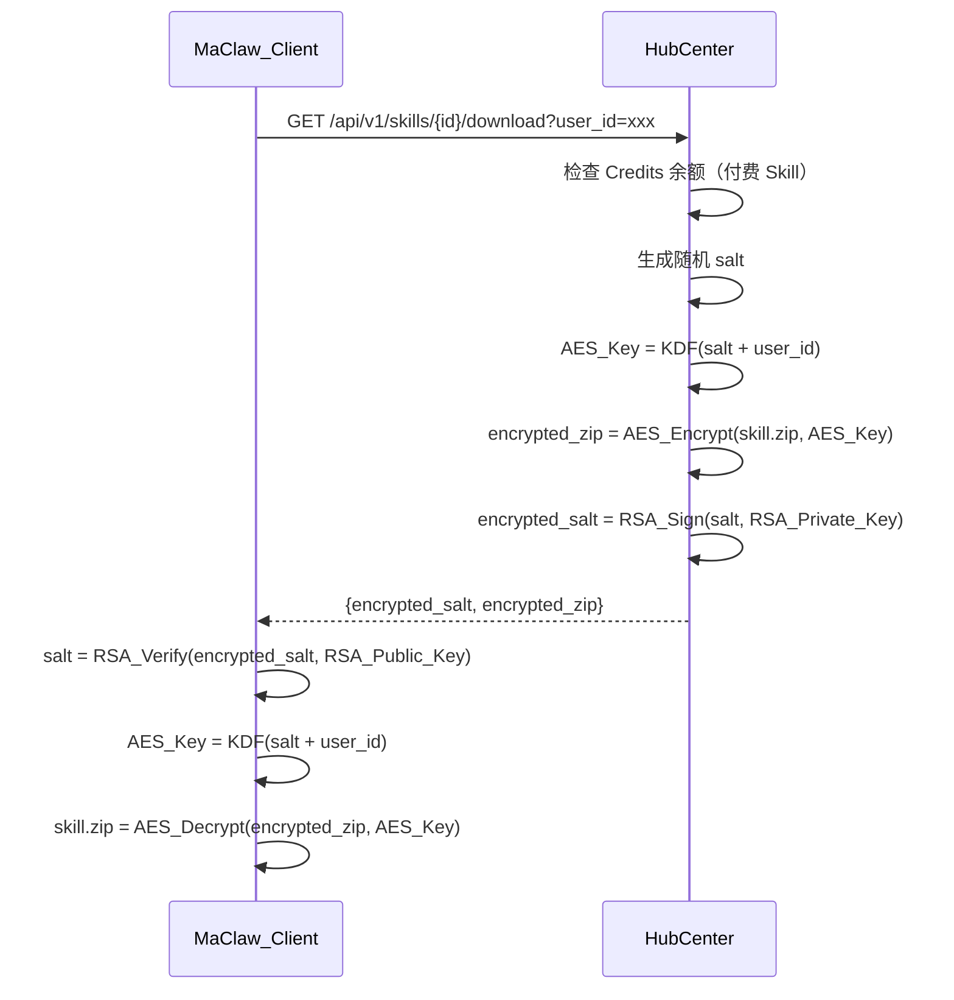
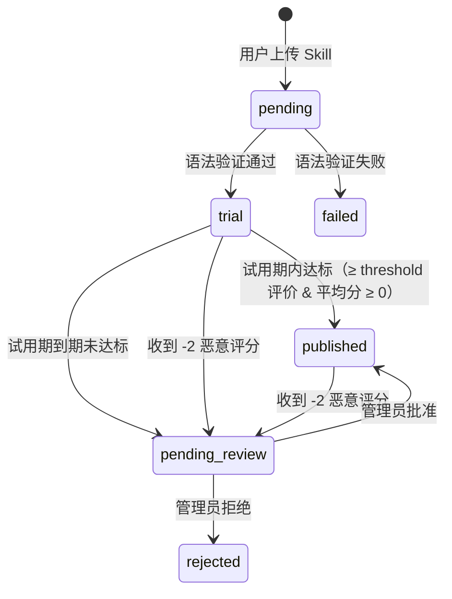
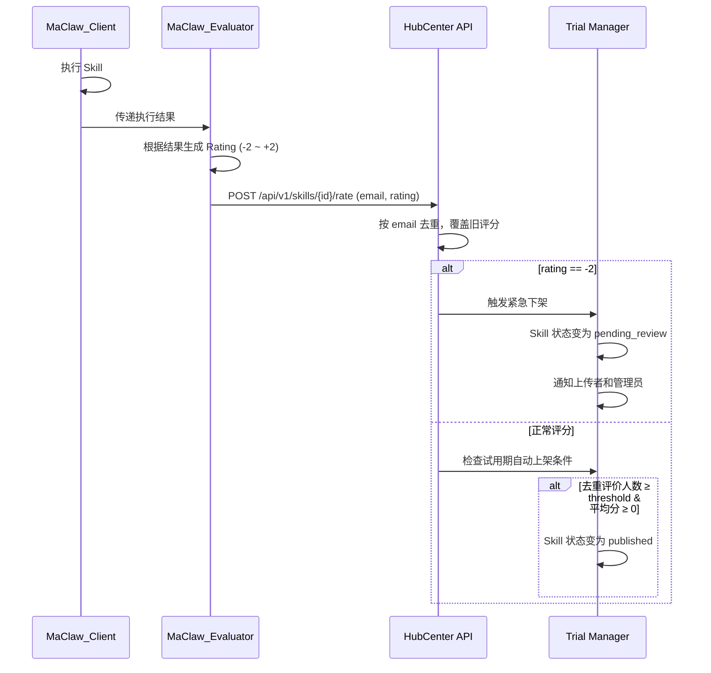
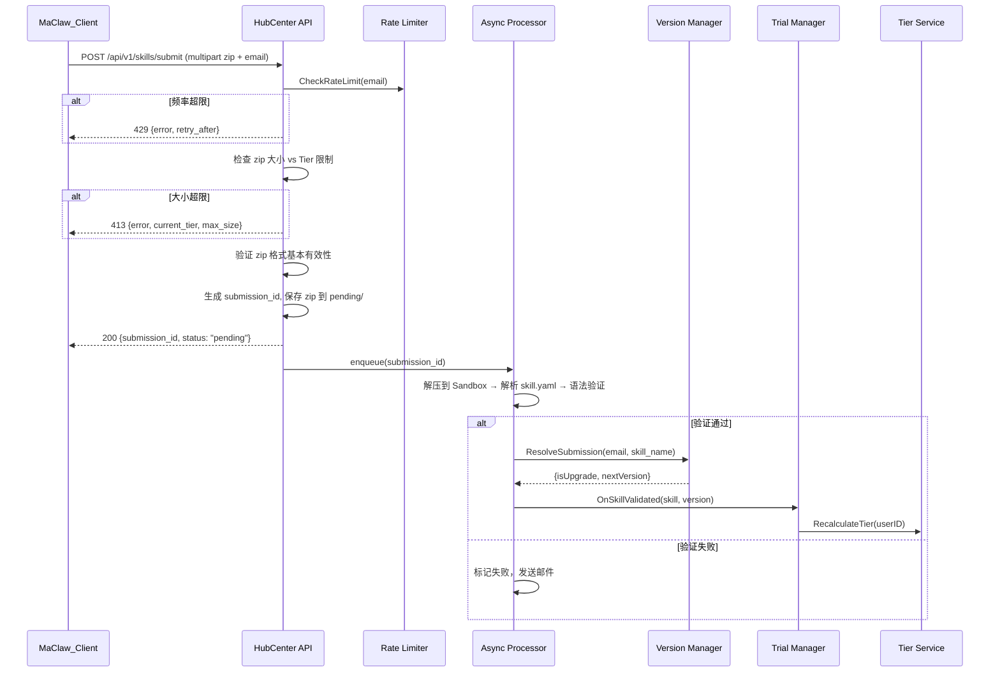
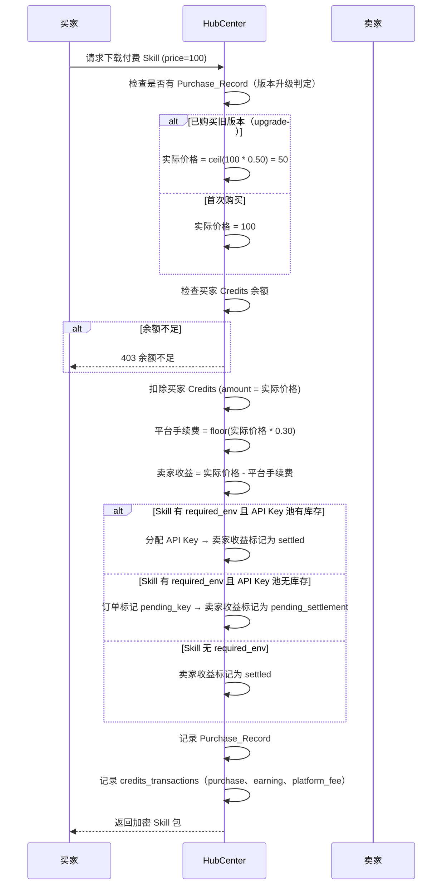
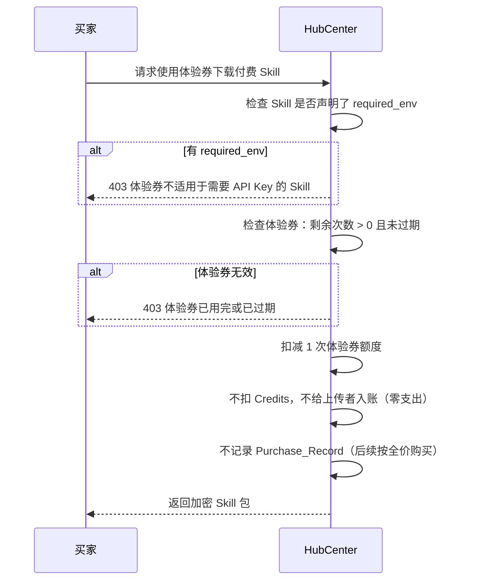
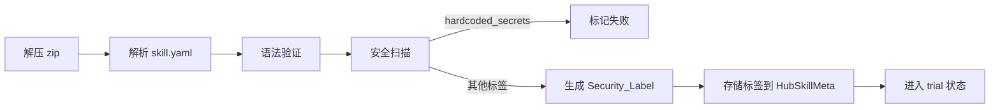
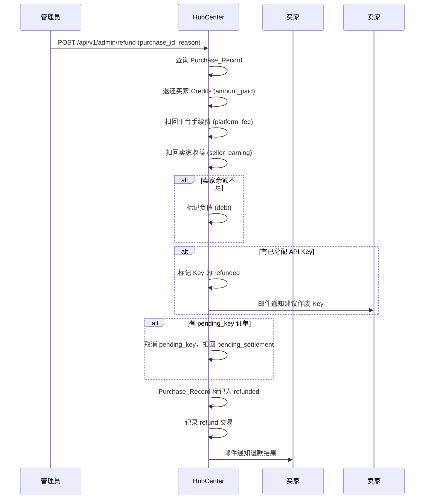

# Design Document: SkillMarket 安全上传

## Overview

本设计文档描述 MaClaw SkillMarket 安全上传功能的技术架构，涵盖异步上传流程、服务器端验证、下载加密、延迟验证账户体系、Credits 计费、Skill 试用期生命周期和 MaClaw 自动评分体系。

### 系统架构约束

```
┌─────────────┐         ┌──────────────┐
│  Hub (内网)  │◄───────►│ MaClaw_Client│
└─────────────┘         └──────┬───────┘
                               │
                               ▼
                        ┌──────────────┐
                        │  HubCenter   │
                        │  (公网服务器) │
                        └──────────────┘
```

- Hub 与 HubCenter 不能直连
- MaClaw_Client 可同时访问 Hub 和 HubCenter
- HubCenter 独立处理所有 SkillMarket 业务逻辑

### 核心变更

1. **上传协议变更**: 从 JSON body 改为 multipart/form-data zip 上传 + 异步处理
2. **新增用户账户体系**: HubCenter 侧新增 SkillMarket 用户表，支持延迟验证
3. **新增 Credits 体系**: 虚拟货币余额、交易记录
4. **下载加密**: RSA + AES 混合加密方案
5. **skill.yaml 解析**: 新增 YAML 元数据解析和验证管道
6. **自动上传触发**: MaClaw 侧新增 Auto_Upload_Trigger，根据使用频率和评分自主决定上传
7. **版本管理与去重**: HubCenter 侧基于 (uploader_email, skill_name) 去重，重复上传自动作为版本升级
6. **Skill 试用期生命周期**: 语法验证通过后进入 trial 状态，满足条件自动上架或转人工审核
7. **MaClaw 自动评分**: Skill 执行后自动生成 -2 到 +2 评分，按 email 去重，驱动试用期上架决策

## Architecture

    subgraph MaClaw_Client
        CLI[CLI/GUI 上传命令]
        DL[下载解密模块]
        ACCT[账户状态展示]
        AUT[Auto Upload Trigger]
    endgraph MaClaw_Client
        CLI[CLI/GUI 上传命令]
        DL[下载解密模块]
        ACCT[账户状态展示]
        EVAL[MaClaw Evaluator 自动评分]
    end

    subgraph HubCenter
        API[HTTP API Layer]
        AUTH[SkillMarket Auth]
        UPLOAD[Upload Handler]
        PROC[Async Processor]
        CRYPTO[Crypto Module]
        STORE[Skill Store]
    CLI -->|multipart/form-data zip| API
    AUT -->|auto trigger| CLI
        CSTORE[Credits Store]
        RSTORE[Rating Store]
        TRIAL[Trial Manager]
        RATING[Rating Service]
        MAIL[Mail Service]
        WEB[Web Frontend]
        ADMIN[Admin Panel]
    end

    CLI -->|multipart/form-data zip| API
    API --> AUTH
    AUTH --> USTORE
    API --> UPLOAD
    UPLOAD -->|submission_id| CLI
    UPLOAD -->|enqueue| PROC
    PROC -->|验证通过 trial| TRIAL
    PROC --> MAIL
    DL -->|GET /download| API
    API --> CRYPTO
    CRYPTO --> STORE
    ACCT -->|GET /account| API
    EVAL -->|POST /rate| API
    API --> RATING
    RATING --> RSTORE
    RATING -->|检查自动上架| TRIAL
    TRIAL --> STORE
    WEB --> USTORE
    WEB --> CSTORE
    ADMIN -->|审核| TRIAL
```

### 异步上传处理流程
    alt 验证通过
        Q->>Q: 检查 Skill_Fingerprint 去重
        alt 新 Skill
            Q->>S: Create(skill, version=1)
        else 版本升级
            Q->>S: CreateVersion(skill, version++)
            Note over S: 旧版本继续可用直到新版本 published
        end
        Q->>M: 发送成功通知邮件
    else 验证失败nt C as MaClaw_Client
    participant H as HubCenter API
    participant Q as Async Processor
    participant S as Skill Store
    participant M as Mail Service

    C->>H: POST /api/v1/skills/submit (multipart zip + email)
    H->>H: 验证 zip 格式基本有效性
    H->>H: 生成 submission_id, 保存 zip 到 pending/
    H-->>C: 200 {submission_id, status: "pending"}
    H->>Q: enqueue(submission_id)
    Q->>Q: 解压到 Sandbox
    Q->>Q: 解析 skill.yaml
    Q->>Q: 语法验证 (YAML/Python/Shell)
    alt 验证通过
        Q->>S: SetStatus(skill, "trial"), 设置试用期到期时间
        Q->>M: 发送进入试用期通知邮件
    else 验证失败
        Q->>M: 发送失败通知邮件（含错误详情）
    end
```

### 下载加密流程



### Skill 试用期生命周期流程



### 自动评分与试用期判定流程



## Components and Interfaces

### 1. HubCenter 新增组件

#### 1.1 SkillMarket User Service (`hubcenter/internal/skillmarket/user_service.go`)

负责延迟验证账户的创建和管理。

```go
type UserService struct {
    repo UserRepository
    mail *mail.Service
}

// EnsureAccount 延迟创建：如果 email 不存在则创建 unverified 账户
func (s *UserService) EnsureAccount(ctx context.Context, email string) (*SkillMarketUser, error)

// VerifyAccount 将账户从 unverified 升级为 verified
func (s *UserService) VerifyAccount(ctx context.Context, email string, method string) error

// GetAccount 获取账户信息
func (s *UserService) GetAccount(ctx context.Context, email string) (*SkillMarketUser, error)
```

#### 1.2 Credits Service (`hubcenter/internal/skillmarket/credits_service.go`)

管理 Credits 余额和交易。

```go
type CreditsService struct {
    repo   CreditsRepository
    users  UserRepository
}

// GetBalance 查询余额
func (s *CreditsService) GetBalance(ctx context.Context, userID string) (int64, error)

// Debit 扣款（购买 Skill）
func (s *CreditsService) Debit(ctx context.Context, userID string, amount int64, reason string) error

// Credit 入账（Skill 被购买时给上传者）
func (s *CreditsService) Credit(ctx context.Context, userID string, amount int64, reason string) error

// TopUp 充值（仅 verified 用户）
func (s *CreditsService) TopUp(ctx context.Context, userID string, amount int64) error

// Withdraw 提现（仅 verified 用户）
func (s *CreditsService) Withdraw(ctx context.Context, userID string, amount int64) error
```

#### 1.3 Submission Processor (`hubcenter/internal/skillmarket/processor.go`)

异步处理上传的 Skill 包。

```go
type Processor struct {
    pendingDir   string
    skillStore   *skill.SkillStore
    trialManager *TrialManager
    mail         *mail.Service
    queue        chan string // submission_id channel
}

// Enqueue 将 submission_id 加入处理队列
func (p *Processor) Enqueue(submissionID string)

// Run 启动后台处理 goroutine
func (p *Processor) Run(ctx context.Context)

// processOne 处理单个提交：解压 -> 解析 skill.yaml -> 语法验证 -> 进入 trial 或标记失败
func (p *Processor) processOne(submissionID string) error
```

#### 1.4 Skill Validator (`hubcenter/internal/skillmarket/validator.go`)

验证上传包中的文件语法。

```go
type ValidationResult struct {
    Valid  bool
    Errors []ValidationError
}
#### 1.7 Version Manager (`hubcenter/internal/skillmarket/version_manager.go`)

服务器端去重与版本管理。

```go
// ResolveSubmission 根据 Skill_Fingerprint 判断是新建还是版本升级
// 返回 isUpgrade=true 时，prevSkillID 为旧版本的 Skill_ID
func (m *VersionManager) ResolveSubmission(ctx context.Context, uploaderEmail, skillName string) (isUpgrade bool, prevSkillID string, nextVersion int, err error)

// SupersedeOldVersion 新版本 published 后，将旧版本标记为 superseded
func (m *VersionManager) SupersedeOldVersion(ctx context.Context, prevSkillID string) error

// GetVersionHistory 获取某个 Skill_Fingerprint 的所有版本记录
func (m *VersionManager) GetVersionHistory(ctx context.Context, uploaderEmail, skillName string) ([]SkillVersionRecord, error)
```

### 2. MaClaw_Client 变更

#### 2.0 Auto Upload Trigger (`gui/auto_upload_trigger.go`)

MaClaw 侧自动上传触发策略。

```go
type AutoUploadTrigger struct {
    tracker  *SkillUsageTracker  // 跟踪执行次数和评分
    client   *SkillHubClient
    email    string
}

// CheckAndTrigger 在每次 Skill 执行完成后调用，判断是否触发上传
func (t *AutoUploadTrigger) CheckAndTrigger(ctx context.Context, skillName string, rating int) error

// ShouldUpload 判断 Skill 是否满足自动上传条件
// 条件：执行次数 ≥ 3 且最近评分平均 ≥ +1 且本地版本有变更
func (t *AutoUploadTrigger) ShouldUpload(skillName string) bool
```

#### 2.1 SkillHubClient 扩展 (`gui/skillhub_client.go`)
    Line    int
    Message string
}

// ValidatePackage 验证解压后的 Skill 包
func ValidatePackage(sandboxDir string) (*ValidationResult, error)

// ValidateYAML 验证 YAML 语法
func ValidateYAML(path string) []ValidationError

// ValidatePython 使用 py_compile 验证 Python 语法
func ValidatePython(path string) []ValidationError

// ValidateShell 使用 bash -n 验证 Shell 脚本语法
func ValidateShell(path string) []ValidationError
```

#### 1.5 Crypto Module (`hubcenter/internal/skillmarket/crypto.go`)

下载加密模块，参考现有 `clawnet_key_handler.go` 的 AES-GCM 模式。

```go
// EncryptForDownload 为指定用户加密 Skill zip 包
func EncryptForDownload(zipData []byte, userID string, rsaPrivKey *rsa.PrivateKey) (*EncryptedPackage, error)

// DecryptDownload 客户端解密下载包（在 MaClaw_Client 侧实现）
func DecryptDownload(pkg *EncryptedPackage, userID string, rsaPubKey *rsa.PublicKey) ([]byte, error)

type EncryptedPackage struct {
    EncryptedSalt string `json:"encrypted_salt"` // base64, RSA 加密的 salt
    EncryptedZip  string `json:"encrypted_zip"`  // base64, AES-GCM 加密的 zip
}
```

#### 1.6 SkillMetadata Parser (`hubcenter/internal/skillmarket/metadata.go`)

skill.yaml 解析与格式化。

```go
type SkillMetadata struct {
    Name        string            `yaml:"name"`
    Description string            `yaml:"description"`
    Tags        []string          `yaml:"tags"`
    Triggers    []string          `yaml:"triggers"`
    Version     string            `yaml:"version"`
    Author      string            `yaml:"author"`
    Extra       map[string]any    `yaml:"-"` // 保留未识别字段
}

// ParseSkillYAML 解析 skill.yaml 为 SkillMetadata
func ParseSkillYAML(data []byte) (*SkillMetadata, error)

// FormatSkillYAML 将 SkillMetadata 格式化为 YAML 文本
func FormatSkillYAML(meta *SkillMetadata) ([]byte, error)
```

#### 1.7 Trial Manager (`hubcenter/internal/skillmarket/trial_manager.go`)

管理 Skill 试用期生命周期，包括自动上架判定和到期处理。

```go
type TrialConfig struct {
    TrialDuration        time.Duration // 试用期时长，默认 7 天
    AutoPublishThreshold int           // 自动上架所需最少评价人数，默认 5
}

type TrialManager struct {
    skillStore  *skill.SkillStore
    ratingRepo  RatingRepository
    config      TrialConfig
    mail        *mail.Service
}

// OnSkillValidated 语法验证通过后调用，将 Skill 状态设为 trial 并设置到期时间
func (m *TrialManager) OnSkillValidated(ctx context.Context, skillID string) error

// CheckAutoPublish 检查是否满足自动上架条件（≥ threshold 评价 & 平均分 ≥ 0）
func (m *TrialManager) CheckAutoPublish(ctx context.Context, skillID string) (bool, error)

// ProcessExpiredTrials 定期扫描到期的 trial Skill，转为 pending_review
func (m *TrialManager) ProcessExpiredTrials(ctx context.Context) error

// AdminApprove 管理员批准，pending_review -> published
```go
type HubSkillMeta struct {
    // ... 现有字段 ...
    Price       int    `json:"price"`        // Credits 价格，0 = 免费
    UploaderID  string `json:"uploader_id"`  // 上传者 user_id
    Version     int    `json:"version"`      // 版本号，首次上传为 1，升级递增
    Status      string `json:"status"`       // pending/trial/published/pending_review/rejected/superseded
    Fingerprint string `json:"fingerprint"`  // uploader_email + skill_name 唯一标识
}
```# 1.8 Rating Service (`hubcenter/internal/skillmarket/rating_service.go`)

管理 Skill 评分的提交、去重和查询。

```go
type Rating struct {
    SkillID   string    `json:"skill_id"`
    Email     string    `json:"email"`
    Score     int       `json:"score"`     // -2, -1, 0, +1, +2
    CreatedAt time.Time `json:"created_at"`
    UpdatedAt time.Time `json:"updated_at"`
}

type RatingStats struct {
    SkillID      string  `json:"skill_id"`
    UniqueRaters int     `json:"unique_raters"` // 去重后的评价人数
    AverageScore float64 `json:"average_score"` // 平均分（含 0 分）
}

type RatingService struct {
    repo         RatingRepository
### 6. RSA 密钥对管理

- HubCenter 首次启动时检查 `data/rsa_private.pem` 和 `data/rsa_public.pem` 是否存在
- 如果不存在：自动生成 RSA-2048 密钥对并写入文件
- 如果已存在：直接加载，不覆盖（防止密钥轮换导致已加密包无法解密）
- 公钥通过 API 端点 `GET /api/v1/crypto/pubkey` 分发给 MaClaw_Client
- MaClaw_Client 本地无公钥时调用该 API 获取并缓存到本地（如 `~/.maclaw/skillmarket_pubkey.pem`）
- 后续下载解密直接使用本地缓存的公钥，无需每次请求

```go
// EnsureRSAKeyPair 首次启动时生成密钥对（已有则跳过）
func EnsureRSAKeyPair(dataDir string) (*rsa.PrivateKey, *rsa.PublicKey, error)
```itRating(ctx context.Context, skillID string, email string, score int) error

// GetStats 获取 Skill 的评分统计（去重后的评价人数和平均分）
func (s *RatingService) GetStats(ctx context.Context, skillID string) (*RatingStats, error)

// GetRatings 获取 Skill 的所有去重后评分列表
func (s *RatingService) GetRatings(ctx context.Context, skillID string) ([]Rating, error)
```

#### 1.9 MaClaw Evaluator (`gui/skill_evaluator.go`)

MaClaw 客户端侧的自动评分模块，在 Skill 执行后根据结果生成评分。

```go
type SkillExecutionResult struct {
    Success       bool
    HasEffect     bool   // 是否产生了有意义的效果
    Exceeded      bool   // 是否超出预期
    Error         error
    SecurityAlert bool   // 是否触发安全告警
}

// Evaluate 根据 Skill 执行结果生成评分
// 安全告警 -> -2, 错误/崩溃 -> -1, 无效果 -> 0, 成功 -> +1, 超预期 -> +2
func Evaluate(result *SkillExecutionResult) int

// SubmitRating 将评分提交到 HubCenter
func (c *SkillHubClient) SubmitRating(ctx context.Context, skillID string, email string, score int) error
```

### 2. MaClaw_Client 变更

#### 2.1 SkillHubClient 扩展 (`gui/skillhub_client.go`)

```go
// SubmitSkill 上传 Skill zip 包到 HubCenter（替代原 Publish 方法）
func (c *SkillHubClient) SubmitSkill(ctx context.Context, zipPath string, email string) (*SubmissionResult, error)

// GetSubmissionStatus 查询提交状态
func (c *SkillHubClient) GetSubmissionStatus(ctx context.Context, submissionID string) (*SubmissionStatus, error)

// DownloadEncrypted 下载加密的 Skill 包并解密
func (c *SkillHubClient) DownloadEncrypted(ctx context.Context, skillID string, userID string) ([]byte, error)

// GetAccountInfo 获取 SkillMarket 账户信息
func (c *SkillHubClient) GetAccountInfo(ctx context.Context, email string) (*AccountInfo, error)
```

### 3. HubCenter HTTP API 新增端点

| 方法 | 路径 | 说明 |
|------|------|------|
| POST | `/api/v1/skills/submit` | multipart 上传 zip + email |
| GET | `/api/v1/skills/submissions/{id}` | 查询提交状态 |
| GET | `/api/v1/skills/{id}/download` | 加密下载（需 user_id 参数） |
| POST | `/api/v1/skills/{id}/rate` | 提交评分（email + score） |
| GET | `/api/v1/skills/{id}/ratings` | 查询 Skill 评分统计 |
| POST | `/api/v1/account/ensure` | 延迟创建/获取账户 |
| GET | `/api/v1/account/{email}` | 获取账户信息 |
| POST | `/api/v1/account/verify` | 验证账户（Web 前端） |
| GET | `/api/v1/credits/balance` | 查询 Credits 余额 |
| GET | `/api/v1/credits/transactions` | 查询交易记录 |
| POST | `/api/v1/credits/topup` | 充值（仅 verified） |
| POST | `/api/v1/credits/withdraw` | 提现（仅 verified） |
| POST | `/api/v1/admin/skills/{id}/approve` | 管理员批准 Skill |
| POST | `/api/v1/admin/skills/{id}/reject` | 管理员拒绝 Skill |
| GET | `/api/v1/admin/skills/pending-review` | 查询待审核 Skill 列表 |
| PUT | `/api/v1/admin/config/trial` | 更新试用期配置参数 |

## Data Models

### 1. SkillMarket 用户表 (`skillmarket_users`)

```sql
CREATE TABLE skillmarket_users (
    id          TEXT PRIMARY KEY,
    email       TEXT NOT NULL UNIQUE,
    status      TEXT NOT NULL DEFAULT 'unverified', -- 'unverified', 'verified'
    verify_method TEXT,                              -- 'email', 'phone', NULL
    credits     INTEGER NOT NULL DEFAULT 0,
    created_at  DATETIME NOT NULL DEFAULT CURRENT_TIMESTAMP,
    updated_at  DATETIME NOT NULL DEFAULT CURRENT_TIMESTAMP,
    verified_at DATETIME
);
```

### 2. Credits 交易记录表 (`credits_transactions`)

```sql
CREATE TABLE credits_transactions (
    id          TEXT PRIMARY KEY,
    user_id     TEXT NOT NULL REFERENCES skillmarket_users(id),
    type        TEXT NOT NULL, -- 'purchase', 'earning', 'topup', 'withdraw'
    amount      INTEGER NOT NULL, -- 正数入账，负数扣款
    balance     INTEGER NOT NULL, -- 交易后余额
    skill_id    TEXT,             -- 关联的 Skill ID（如适用）
    description TEXT,
    created_at  DATETIME NOT NULL DEFAULT CURRENT_TIMESTAMP
);
```

### 3. Submission 记录表 (`skill_submissions`)

```sql
CREATE TABLE skill_submissions (
    id          TEXT PRIMARY KEY,  -- submission_id
    email       TEXT NOT NULL,
    user_id     TEXT REFERENCES skillmarket_users(id),
    skill_id    TEXT,              -- 处理成功后生成的 Skill_ID
    status      TEXT NOT NULL DEFAULT 'pending', -- 'pending', 'processing', 'success', 'failed'
    zip_path    TEXT NOT NULL,     -- 上传 zip 的存储路径
    error_msg   TEXT,              -- 失败原因
    created_at  DATETIME NOT NULL DEFAULT CURRENT_TIMESTAMP,
    updated_at  DATETIME NOT NULL DEFAULT CURRENT_TIMESTAMP
);
```

### 4. HubSkillMeta 扩展字段

在现有 `HubSkillMeta` 基础上新增：

```go
type HubSkillMeta struct {
    // ... 现有字段 ...
    Price         int       `json:"price"`          // Credits 价格，0 = 免费
    UploaderID    string    `json:"uploader_id"`    // 上传者 user_id
    Status        string    `json:"status"`         // "pending", "trial", "published", "pending_review", "rejected"
    TrialExpireAt time.Time `json:"trial_expire_at"` // 试用期到期时间
}
```

### 5. SkillMetadata (skill.yaml 结构)

```go
type SkillMetadata struct {
    Name        string         `yaml:"name"`
    Description string         `yaml:"description"`
    Tags        []string       `yaml:"tags,omitempty"`
    Triggers    []string       `yaml:"triggers,omitempty"`
    Version     string         `yaml:"version,omitempty"`
    Author      string         `yaml:"author,omitempty"`
    Price       int            `yaml:"price,omitempty"`
    Extra       map[string]any `yaml:"-"` // 保留未识别字段，round-trip 安全
}
```

### 6. RSA 密钥对管理

- HubCenter 启动时加载或生成 RSA-2048 密钥对
- 私钥存储在 HubCenter 配置目录（`data/rsa_private.pem`）
- 公钥通过 API 端点 `GET /api/v1/crypto/pubkey` 分发给 MaClaw_Client
- MaClaw_Client 首次连接时获取并缓存公钥

### 7. 加密方案详细设计

参考现有 `clawnet_key_handler.go` 的 AES-256-GCM 模式：

1. **密钥派生**: `AES_Key = PBKDF2(salt, user_id, 100000, 32, SHA256)`
2. **对称加密**: AES-256-GCM（与现有 ClawNet 密钥备份一致）
3. **Salt 保护**: RSA-OAEP 加密 salt（使用私钥签名，公钥验证）
4. **Nonce**: 每次加密随机生成 12 字节 nonce，前置于密文

### 8. 评分表 (`skill_ratings`)

```sql
CREATE TABLE skill_ratings (
    skill_id    TEXT NOT NULL,
    email       TEXT NOT NULL,
    score       INTEGER NOT NULL CHECK (score >= -2 AND score <= 2), -- -2, -1, 0, +1, +2
    created_at  DATETIME NOT NULL DEFAULT CURRENT_TIMESTAMP,
    updated_at  DATETIME NOT NULL DEFAULT CURRENT_TIMESTAMP,
    PRIMARY KEY (skill_id, email)  -- 按 email 去重，UPSERT 覆盖旧评分
);
```

### 9. 管理员配置表 (`admin_config`)

```sql
CREATE TABLE admin_config (
    key         TEXT PRIMARY KEY,
    value       TEXT NOT NULL,
    updated_at  DATETIME NOT NULL DEFAULT CURRENT_TIMESTAMP
);

-- 默认配置
INSERT INTO admin_config (key, value) VALUES ('trial_duration', '168h');        -- 7 天
INSERT INTO admin_config (key, value) VALUES ('auto_publish_threshold', '5');   -- 5 个不同 email
```

### 10. Skill 状态流转规则

| 当前状态 | 触发条件 | 目标状态 |
|---------|---------|---------|
| pending | 语法验证通过 | trial |
| pending | 语法验证失败 | failed |
| trial | 满足自动上架条件（≥ threshold 评价 & 平均分 ≥ 0） | published |
| trial | 试用期到期未达标 | pending_review |
| trial | 收到 -2 恶意评分 | pending_review |
| published | 收到 -2 恶意评分 | pending_review |
| pending_review | 管理员批准 | published |
| pending_review | 管理员拒绝 | rejected |

### 11. 评分规则说明

| 分数 | 含义 | 触发条件 |
|-----|------|---------|
| -2 | 恶意（malicious） | 危险操作、数据窃取尝试 |
| -1 | 有问题（problematic） | 错误、崩溃、结果不正确 |
| 0 | 无害但没用（harmless but useless） | 无明显效果（计入评价人数和平均分） |
| +1 | 有用（useful） | 完成预期功能 |
| +2 | 优秀（excellent） | 超出预期 |

## Correctness Properties

*A property is a characteristic or behavior that should hold true across all valid executions of a system — essentially, a formal statement about what the system should do. Properties serve as the bridge between human-readable specifications and machine-verifiable correctness guarantees.*

### Property 1: 上传提交返回唯一 ID 且状态为 pending

*For any* 有效的 zip 文件（包含 skill.yaml）上传到 HubCenter，返回的 submission 应包含一个唯一的 submission_id，且初始状态为 "pending"。对于 N 次独立上传，应产生 N 个不同的 submission_id。

**Validates: Requirements 1.1, 1.2**

### Property 2: 缺少 skill.yaml 的 zip 包被拒绝

*For any* 不包含 skill.yaml 文件的 zip 包，提交到 HubCenter 时应被拒绝，并返回包含描述性信息的错误响应。

**Validates: Requirements 2.2, 2.3**

### Property 3: skill.yaml 解析 round-trip

*For any* 有效的 SkillMetadata 对象（包括含有未识别额外字段的情况），将其格式化为 YAML 文本后再解析回 SkillMetadata，应产生与原始对象等价的结果。额外字段不应丢失。

**Validates: Requirements 13.1, 13.2, 13.3, 13.4**

### Property 4: 语法验证检测错误并报告文件名

*For any* 包含语法错误的文件（YAML、Python 或 Shell），验证器应检测到错误，且验证结果中应包含出错的文件名和错误描述信息。

**Validates: Requirements 4.1, 4.2, 4.3, 4.4**

### Property 5: 下载加密 round-trip

*For any* Skill zip 数据、任意 user_id 和有效的 RSA 密钥对，使用 EncryptForDownload 加密后再使用 DecryptDownload 解密，应恢复出与原始 zip 数据完全相同的字节序列。

**Validates: Requirements 5.2, 5.3, 5.4, 5.6**

### Property 6: 延迟账户创建的幂等性与唯一性

*For any* email 地址，多次调用 EnsureAccount 应返回相同的账户（相同 user_id），且账户状态为 "unverified"。不同的 email 应产生不同的 user_id。

**Validates: Requirements 6.1, 6.2**

### Property 7: 未验证用户权限范围

*For any* 处于 unverified 状态的用户，应被允许执行浏览、下载免费 Skill、上传 Skill 和积累 Credits 操作，但应被拒绝执行充值和提现操作。

**Validates: Requirements 6.3, 6.4, 6.5, 6.6, 8.5**

### Property 8: 账户验证升级并保留数据

*For any* 拥有已上传 Skill 和已积累 Credits 的 unverified 账户，完成验证后账户状态应变为 "verified"，且原有的 Skill 和 Credits 数据应完整保留。

**Validates: Requirements 7.2, 7.3**

### Property 9: 已验证用户完整权限

*For any* 处于 verified 状态的用户，应被允许执行充值、提现和购买付费 Skill 操作。

**Validates: Requirements 7.4, 7.5, 7.6**

### Property 10: 付费下载的 Credits 守恒

*For any* 付费 Skill 下载交易，购买者的 Credits 余额应减少 Skill 价格的数额，上传者的 Credits 余额应增加相同数额。交易前后系统中 Credits 总量守恒。

**Validates: Requirements 8.2, 8.3**

### Property 11: Credits 不足通知包含完整信息

*For any* Credits 不足的通知消息，应包含目标 Skill 名称、所需 Credits 数量和用户当前余额三项信息。

**Validates: Requirements 9.2**

### Property 12: Skill_ID 唯一性

*For any* 成功处理的 Submission，生成的 Skill_ID 应在系统中唯一，不与任何已有 Skill_ID 冲突。

**Validates: Requirements 3.3**

### Property 13: 语法验证通过后进入 trial 而非 published

*For any* 通过语法验证的 Skill_Package，处理完成后 Skill 的状态应为 "trial"，而非 "published"。Skill 应被标注 "试用中" 标识，且所有用户可浏览和下载。

**Validates: Requirements 14.1, 14.2, 14.3**

### Property 14: 试用期自动上架条件判定

*For any* 处于 trial 状态的 Skill，当且仅当满足以下全部条件时应自动变更为 "published"：（a）去重后的评价人数 >= auto_publish_threshold，且（b）所有去重后 Rating 的平均分 >= 0。未满足任一条件时状态不应变更。

**Validates: Requirements 14.5, 14.7**

### Property 15: 试用期到期未达标转人工审核

*For any* 处于 trial 状态且试用期已到期的 Skill，如果未满足自动上架条件，状态应变更为 "pending_review"。

**Validates: Requirements 14.6**

### Property 16: 评分去重一致性

*For any* Skill，同一 email 多次提交 Rating 后，该 email 仅保留最新一次 Rating。GetStats 返回的 unique_raters 应等于提交过评分的不同 email 数量。

**Validates: Requirements 17.1, 17.2**

### Property 17: 0 分评价计入统计

*For any* Skill 的评分统计，Rating 为 0 的评价应计入评价人数（unique_raters）和平均分（average_score）的计算。平均分应为所有去重后 Rating 的算术平均值。

**Validates: Requirements 17.3, 17.4**

### Property 18: -2 恶意评分触发紧急下架

*For any* 处于 "trial" 或 "published" 状态的 Skill，当收到任意一个 -2 Rating 时，状态应立即变更为 "pending_review"。

**Validates: Requirements 18.1**

### Property 19: MaClaw 评分映射正确性

*For any* Skill 执行结果，MaClaw_Evaluator 应根据以下规则生成 Rating：安全告警 -> -2，错误/崩溃 -> -1，无效果 -> 0，成功 -> +1，超预期 -> +2。评分范围始终在 [-2, +2] 内。

**Validates: Requirements 16.1, 16.2, 16.3, 16.4, 16.5**

### Property 20: 管理员审核状态流转

*For any* 处于 "pending_review" 状态的 Skill，管理员批准后状态应变为 "published"，管理员拒绝后状态应变为 "rejected"。非 "pending_review" 状态的 Skill 不应被批准或拒绝。

**Validates: Requirements 15.2, 15.3**

### Property 21: 试用期平均分低于 0 转人工审核

*For any* 处于 trial 状态的 Skill，当试用期结束时如果平均 Rating 低于 0，状态应变更为 "pending_review"。

**Validates: Requirements 18.3**


## 新增组件设计（Req 21-24）

### 8. Uploader Tier 信誉等级体系

#### 8.1 数据模型

```sql
-- 上传者信誉等级表
CREATE TABLE uploader_tiers (
    user_id       TEXT PRIMARY KEY REFERENCES skillmarket_users(id),
    tier          INTEGER NOT NULL DEFAULT 1,  -- 1-4
    published_count INTEGER NOT NULL DEFAULT 0,
    avg_rating    REAL NOT NULL DEFAULT 0.0,
    total_downloads INTEGER NOT NULL DEFAULT 0,
    updated_at    DATETIME NOT NULL DEFAULT CURRENT_TIMESTAMP
);

-- 管理员可配置的等级阈值
-- 存储在 admin_config 表中，key 格式：tier_{n}_min_published, tier_{n}_min_rating, tier_{n}_min_downloads
-- 默认阈值：
--   Tier 2: published >= 3, avg_rating >= 0.5, downloads >= 50
--   Tier 3: published >= 10, avg_rating >= 1.0, downloads >= 500
--   Tier 4: published >= 25, avg_rating >= 1.5, downloads >= 2000
```

#### 8.2 Tier 计算逻辑

```go
// hubcenter/internal/skillmarket/tier_service.go

type TierService struct {
    repo       TierRepository
    configRepo ConfigRepository
}

type TierThreshold struct {
    MinPublished  int     // 最少已发布 Skill 数
    MinAvgRating  float64 // 最低平均评分
    MinDownloads  int     // 最低总下载量
}

type TierLimits struct {
    MaxUploadSize   int64 // 最大上传大小（字节）
    MaxPerHour      int   // 每小时最大提交数
    MaxPerDay       int   // 每天最大提交数
}

// 默认等级限制
// Tier 1: 10MB, 5/hour, 20/day
// Tier 2: 20MB, 10/hour, 40/day
// Tier 3: 50MB, 20/hour, 80/day
// Tier 4: 100MB, 50/hour, 200/day

// RecalculateTier 重新计算上传者等级（在 Skill 状态变更时调用）
func (s *TierService) RecalculateTier(ctx context.Context, userID string) (int, error)

// GetTier 获取当前等级
func (s *TierService) GetTier(ctx context.Context, userID string) (int, error)

// GetLimits 获取当前等级对应的限制
func (s *TierService) GetLimits(ctx context.Context, userID string) (*TierLimits, error)
```

Tier 可升可降：每次 Skill 状态变更（published、rejected、withdrawn、superseded、收到新评分）时触发 `RecalculateTier`，根据当前实际指标重新计算等级。

#### 8.3 Tier 降级触发场景

- Skill 被管理员拒绝（rejected）→ published_count 减少
- Skill 被下架（withdrawn）→ published_count 减少
- Skill 收到低评分 → avg_rating 下降
- 旧版本被 superseded → published_count 不变（新版本替代）

### 9. 上传频率限制

#### 9.1 Rate Limiter 设计

```go
// hubcenter/internal/skillmarket/rate_limiter.go

type RateLimiter struct {
    submissionRepo SubmissionRepository
    tierService    *TierService
}

// CheckRateLimit 检查上传频率是否超限
// 返回 nil 表示允许，返回 error 包含下次可提交时间
func (r *RateLimiter) CheckRateLimit(ctx context.Context, email string) error

// 内部逻辑：
// 1. 查询该 email 最近 1 小时和 24 小时内的有效提交数（排除 failed）
// 2. 获取该用户的 Uploader Tier 对应的频率限制
// 3. 比较并返回结果
```

#### 9.2 集成点

在 `POST /api/v1/skills/submit` handler 中，zip 格式验证之前先调用 `RateLimiter.CheckRateLimit`。

### 10. 上传大小限制

#### 10.1 集成点

在 `POST /api/v1/skills/submit` handler 中：
1. 读取 Content-Length 或实际 zip 大小
2. 查询上传者 Uploader Tier 对应的 MaxUploadSize
3. 超限则返回 413 + 错误信息（当前等级、允许最大大小）

### 11. 上传者主动下架

#### 11.1 Skill 状态扩展

在现有状态枚举中新增 `withdrawn` 状态：

```
pending → trial → published → withdrawn（上传者主动下架）
                → pending_review → published / rejected
                                 → withdrawn（上传者主动下架）
```

#### 11.2 下架 API

```go
// POST /api/v1/skills/{id}/withdraw
// 请求体: { "email": "uploader@example.com" }
// 权限检查: email 必须匹配 Skill 的 uploader_email
// 状态限制: 仅 trial 或 published 状态可下架
```

#### 11.3 下架后行为

- withdrawn 状态的 Skill 不出现在列表和搜索结果中
- 已下载的用户不受影响（本地已有副本）
- 下架后触发 `TierService.RecalculateTier`（published_count 减少可能导致降级）

### 12. 被拒绝 Skill 重新提交

#### 12.1 处理逻辑

在 `VersionManager.ResolveSubmission` 中扩展：
- 如果同 Fingerprint 的最新版本状态为 `rejected`，仍然作为版本升级处理
- 新版本 version++ → 进入 trial，被拒绝的旧版本保持 rejected 状态不变
- 新版本的试用期评价从零开始，不继承旧版本的评分

### 13. 新增 HTTP API 端点

| 方法 | 路径 | 说明 |
|------|------|------|
| POST | `/api/v1/skills/{id}/withdraw` | 上传者主动下架 |
| GET | `/api/v1/account/{email}/tier` | 查询上传者信誉等级 |
| PUT | `/api/v1/admin/config/tiers` | 管理员配置等级阈值和限制 |

### 14. 异步上传处理流程（更新）




## 新增组件设计（Req 24-31）

### 15. Sandbox 清理与 Zip 炸弹防护

#### 15.1 清理策略

在 `Processor.processOne` 中使用 `defer os.RemoveAll(sandboxDir)` 确保无论成功或失败都清理临时目录。

#### 15.2 Zip 炸弹防护

在解压逻辑中增加三重保护：

```go
type UnzipLimits struct {
    MaxRatio      int   // 解压比率上限，默认 20x
    MaxTotalSize  int64 // 解压后总大小上限，默认 500MB
    MaxFileSize   int64 // 单文件大小上限，默认 50MB
    MaxFileCount  int   // 文件数量上限，默认 1000
}

// SafeUnzip 安全解压，超限时返回错误并中止
func SafeUnzip(zipPath string, destDir string, limits UnzipLimits) error
```

集成点：在 `Processor.processOne` 中，解压步骤替换为 `SafeUnzip`。

### 16. Skill 搜索与列表 API

#### 16.1 新增端点

| 方法 | 路径 | 说明 |
|------|------|------|
| GET | `/api/v1/skills` | Skill 列表/搜索（支持分页、筛选） |
| GET | `/api/v1/skills/{id}` | Skill 详情 |

#### 16.2 查询参数

```
GET /api/v1/skills?q=keyword&status=trial,published&price=free&min_rating=0&page=1&per_page=20
```

- `q`: 关键词搜索（匹配 name、description、tags）
- `status`: 状态筛选，默认 `trial,published`
- `price`: `free` / `paid` / 不传则全部
- `min_rating`: 最低平均评分
- `page` / `per_page`: 分页

#### 16.3 响应中的限免标识

trial 状态的 Skill 在 API 响应中额外返回 `trial_free: true`，客户端和 Web 前端据此展示限免标识。

### 17. 下载量统计

在 `GET /api/v1/skills/{id}/download` handler 中，加密包生成成功后，原子递增 `download_count`：

```go
// 在 HubSkillMeta 中新增字段
DownloadCount int `json:"download_count"`

// 下载成功后
skillStore.IncrementDownloadCount(ctx, skillID)
```

`TierService.RecalculateTier` 中查询上传者所有 published Skill 的 download_count 总和。

### 18. 上传者自评限制

在 `RatingService.SubmitRating` 中增加检查：

```go
func (s *RatingService) SubmitRating(ctx context.Context, skillID, email string, score int) error {
    // 查询 Skill 的 uploader_email
    skill, _ := s.skillStore.Get(ctx, skillID)
    if skill.UploaderEmail == email {
        return ErrSelfRatingNotAllowed
    }
    // ... 正常 UPSERT 逻辑
}
```

### 19. Withdrawn Skill 重新上架

#### 19.1 状态流转扩展

```
withdrawn → trial（如果下架前是 trial）
withdrawn → published（如果下架前是 published）
```

需要在 HubSkillMeta 中记录 `pre_withdrawn_status` 字段，下架时保存，重新上架时恢复。

#### 19.2 重新上架条件

- 仅原始上传者可操作
- 该 Fingerprint 没有更新的版本存在（即 withdrawn 的版本仍是最新版本）

#### 19.3 新增端点

| 方法 | 路径 | 说明 |
|------|------|------|
| POST | `/api/v1/skills/{id}/relist` | 重新上架 withdrawn Skill |

### 20. 并发安全设计

#### 20.1 Credits 扣款事务

```go
func (s *CreditsService) Debit(ctx context.Context, userID string, amount int64, reason string) error {
    return s.repo.WithTransaction(ctx, func(tx *sql.Tx) error {
        balance, err := s.repo.GetBalanceForUpdate(tx, userID) // SELECT ... FOR UPDATE
        if balance < amount {
            return ErrInsufficientCredits
        }
        return s.repo.DeductBalance(tx, userID, amount, reason)
    })
}
```

SQLite 使用 `BEGIN IMMEDIATE` 事务模式确保写锁。

#### 20.2 Rating UPSERT

使用 SQLite 的 `INSERT ... ON CONFLICT(skill_id, email) DO UPDATE SET score = excluded.score, updated_at = excluded.updated_at`，数据库级别原子操作。

#### 20.3 Skill 状态变更

使用乐观锁：`UPDATE skills SET status = ? WHERE id = ? AND status = ?`，检查 affected rows，为 0 则表示并发冲突，返回错误。

### 21. HubCenter Web 前端约束

Web 前端定位为浏览和管理平台，不提供下载功能：

- Skill 详情页展示完整信息（name、description、tags、rating、download_count、version）
- 所有 Skill 详情页底部标注 "仅 MaClaw 自动下载"
- trial 状态 Skill 标注 "试用中·限免"
- 不渲染任何下载按钮或下载链接
- 下载 API 仅接受 MaClaw_Client 的请求（可通过 User-Agent 或 API Key 区分）


## 8. 智能搜索设计（Requirement 32）

### 8.1 搜索架构

```
MaClaw_Client                          HubCenter
┌──────────────────┐                  ┌──────────────────────┐
│ 任务执行中发现    │                  │                      │
│ 需要某项能力      │                  │  SQLite FTS5 索引    │
│       │          │                  │  (name, desc, tags)  │
│       ▼          │                  │       │              │
│ 本地 LLM 提炼    │  GET /search     │       ▼              │
│ 关键词 + tags ───┼─────────────────►│  FTS5 文本匹配       │
│                  │                  │       │              │
│                  │  top_n 结果      │       ▼              │
│ 本地 LLM 精选  ◄─┼──────────────────┤  质量排序 (score)    │
│       │          │                  │                      │
│       ▼          │                  └──────────────────────┘
│ 自动下载安装使用  │
└──────────────────┘
```

核心原则：服务端零 LLM 依赖，FTS5 粗筛 + MaClaw 端 LLM 精选。

### 8.2 FTS5 全文索引

在 HubCenter SQLite 中创建 FTS5 虚拟表：

```sql
CREATE VIRTUAL TABLE skill_fts USING fts5(
    skill_id UNINDEXED,
    name,
    description,
    tags,
    content='hub_skill_meta',
    content_rowid='rowid'
);

-- 触发器保持 FTS 索引与主表同步
CREATE TRIGGER skill_fts_insert AFTER INSERT ON hub_skill_meta BEGIN
    INSERT INTO skill_fts(rowid, skill_id, name, description, tags)
    VALUES (new.rowid, new.id, new.name, new.description, new.tags);
END;

CREATE TRIGGER skill_fts_delete BEFORE DELETE ON hub_skill_meta BEGIN
    INSERT INTO skill_fts(skill_fts, rowid, skill_id, name, description, tags)
    VALUES ('delete', old.rowid, old.id, old.name, old.description, old.tags);
END;

CREATE TRIGGER skill_fts_update AFTER UPDATE ON hub_skill_meta BEGIN
    INSERT INTO skill_fts(skill_fts, rowid, skill_id, name, description, tags)
    VALUES ('delete', old.rowid, old.id, old.name, old.description, old.tags);
    INSERT INTO skill_fts(rowid, skill_id, name, description, tags)
    VALUES (new.rowid, new.id, new.name, new.description, new.tags);
END;
```

### 8.3 搜索 API 设计

```
GET /api/v1/skills/search?q={keywords}&tags={tag1,tag2}&top_n=20
```

服务端处理流程：

```go
type SearchService struct {
    db *sql.DB
}

type SearchResult struct {
    SkillID       string   `json:"skill_id"`
    Name          string   `json:"name"`
    Description   string   `json:"description"`
    Tags          []string `json:"tags"`
    Score         float64  `json:"score"`
    Price         int      `json:"price"`
    Status        string   `json:"status"`
    AvgRating     float64  `json:"avg_rating"`
    DownloadCount int64    `json:"download_count"`
}

// Search 执行 FTS5 搜索 + 质量排序
func (s *SearchService) Search(ctx context.Context, query string, tags []string, topN int) ([]SearchResult, error)
```

排序公式 SQL 实现：

```sql
SELECT
    m.id, m.name, m.description, m.tags,
    m.price, m.status, m.avg_rating, m.download_count,
    (
        fts.rank * -0.5 +
        COALESCE(m.avg_rating, 0) * 0.2 +
        LOG(m.download_count + 1) * 0.2 +
        (1.0 - MIN(CAST((julianday('now') - julianday(m.created_at)) AS REAL) / 365.0, 1.0)) * 0.1
    ) AS score
FROM skill_fts fts
JOIN hub_skill_meta m ON fts.skill_id = m.id
WHERE skill_fts MATCH ?
  AND m.status IN ('trial', 'published')
ORDER BY score DESC
LIMIT ?
```

注意：FTS5 的 `rank` 值为负数（越小越相关），所以乘以 -0.5 转为正数。`recency` 使用 `1 - min(age_days/365, 1)` 归一化到 0~1。

### 8.4 MaClaw 端智能搜索流程

```go
// SkillSearcher MaClaw 端智能搜索模块
type SkillSearcher struct {
    llm       LLMHelper
    hubClient *SkillHubClient
}

// SearchAndInstall 全自动搜索安装流程
func (s *SkillSearcher) SearchAndInstall(ctx context.Context, taskContext string) (*InstalledSkill, error) {
    // 1. 本地 LLM 提炼关键词和 tags
    keywords, tags := s.llm.ExtractSearchTerms(taskContext)
    // 2. 调用 HubCenter 搜索 API
    candidates, _ := s.hubClient.Search(ctx, keywords, tags, 20)
    // 3. 本地 LLM 从候选中精选最匹配的
    best := s.llm.SelectBestSkill(candidates, taskContext)
    // 4. 自动下载安装
    return s.hubClient.DownloadAndInstall(ctx, best.SkillID)
}
```

## 9. 自动 Tag 生成设计（Requirement 33）

### 9.1 Tag 生成流程

```
MaClaw_Client 本地处理（上传前）
┌─────────────────────────────────────┐
│ 1. 读取 skill.yaml + 关联脚本文件   │
│ 2. 本地 LLM 分析内容               │
│ 3. 生成/补全 name, desc, tags,     │
│    triggers                         │
│ 4. tags 分类：功能类 + 领域类       │
│ 5. 写回 skill.yaml                  │
│ 6. 打包上传到 HubCenter             │
└─────────────────────────────────────┘
```

### 9.2 Tag 生成器设计

```go
// TagGenerator MaClaw 端自动 Tag 生成模块
type TagGenerator struct {
    llm LLMHelper
}

type GeneratedMetadata struct {
    Name        string   `yaml:"name"`
    Description string   `yaml:"description"`
    Tags        []string `yaml:"tags"`        // 功能类 + 领域类混合
    Triggers    []string `yaml:"triggers"`
}

// GenerateTags 分析 Skill 内容并生成元数据
func (g *TagGenerator) GenerateTags(ctx context.Context, skillDir string) (*GeneratedMetadata, error) {
    // 1. 读取 skill.yaml 现有内容
    existing := readExistingMetadata(skillDir)
    // 2. 读取关联脚本文件内容
    scripts := readScriptFiles(skillDir)
    // 3. 本地 LLM 分析并生成
    generated := g.llm.AnalyzeSkillContent(existing, scripts)
    // 4. 合并：保留已有非空字段，仅补全缺失字段
    return mergeMetadata(existing, generated)
}
```

### 9.3 Tag 分类规范

Tags 分为两类，在 skill.yaml 中统一存储在 `tags` 数组中，通过命名约定区分：

- 功能类 tags：描述 Skill 的具体功能，如 `file-management`、`data-processing`、`http-request`、`text-analysis`
- 领域类 tags：描述 Skill 的应用领域，如 `dev-tools`、`office-automation`、`sysops`、`data-science`

LLM prompt 中明确要求生成两类 tags，每类至少 1 个，总数建议 3~8 个。

### 9.4 集成到上传流程

修改 `Auto_Upload_Trigger` 的 `CheckAndTrigger` 方法：

```go
func (t *AutoUploadTrigger) CheckAndTrigger(ctx context.Context, skill *LocalSkill) error {
    if !t.ShouldUpload(skill) {
        return nil
    }
    // 新增：上传前自动生成 Tag
    tagGen := &TagGenerator{llm: t.llm}
    metadata, err := tagGen.GenerateTags(ctx, skill.Dir)
    if err != nil {
        log.Warn("tag generation failed, uploading with existing metadata", "err", err)
    } else {
        writeMetadataToYAML(skill.Dir, metadata)
    }
    // 继续原有上传流程
    return t.upload(ctx, skill)
}
```

## 10. 排行榜设计（Requirement 34）

### 10.1 排行榜 API 设计

```
GET /api/v1/skills/top?sort=rating|downloads|newest&limit=10
```

```go
type LeaderboardService struct {
    db *sql.DB
}

type LeaderboardEntry struct {
    SkillID       string   `json:"skill_id"`
    Name          string   `json:"name"`
    Description   string   `json:"description"`
    Tags          []string `json:"tags"`
    AvgRating     float64  `json:"avg_rating"`
    DownloadCount int64    `json:"download_count"`
    Price         int      `json:"price"`
    UploaderEmail string   `json:"uploader_email"`
    CreatedAt     string   `json:"created_at"`
}

// GetTop 获取排行榜
func (s *LeaderboardService) GetTop(ctx context.Context, sortBy string, limit int) ([]LeaderboardEntry, error)
```

### 10.2 排序 SQL

```sql
-- sort=rating
SELECT * FROM hub_skill_meta WHERE status = 'published'
ORDER BY avg_rating DESC, download_count DESC
LIMIT ?;

-- sort=downloads
SELECT * FROM hub_skill_meta WHERE status = 'published'
ORDER BY download_count DESC, avg_rating DESC
LIMIT ?;

-- sort=newest
SELECT * FROM hub_skill_meta WHERE status = 'published'
ORDER BY created_at DESC
LIMIT ?;
```

limit 参数范围：1~50，默认 10。

### 10.3 MaClaw 端排行榜浏览

```go
// BrowseLeaderboard MaClaw 主动浏览排行榜
func (c *SkillHubClient) BrowseLeaderboard(ctx context.Context, sortBy string, limit int) ([]LeaderboardEntry, error) {
    url := fmt.Sprintf("%s/api/v1/skills/top?sort=%s&limit=%d", c.baseURL, sortBy, limit)
    // ... HTTP GET ...
}
```

## 11. 经济系统设计（Requirement 35）

### 11.1 平台抽成机制

修改下载扣费逻辑（在 `GET /api/v1/skills/{id}/download` handler 中）：

```go
func (h *SkillMarketHandler) handleDownload(w http.ResponseWriter, r *http.Request) {
    // ... 省略前置检查 ...

    price := skill.Price
    if skill.Status == "trial" {
        price = 0 // 试用期免费
    }

    // 每日免费下载检查
    if price > 0 {
        freeUsed, _ := h.credits.GetDailyFreeDownloadCount(ctx, userID)
        if freeUsed < 1 {
            price = 0 // 每日 1 次免费
            h.credits.IncrementDailyFreeDownload(ctx, userID)
        }
    }

    if price > 0 {
        // 平台抽成 30%
        platformFee := int64(float64(price) * 0.30)
        uploaderEarning := int64(price) - platformFee

        // 扣买家 Credits
        err := h.credits.Debit(ctx, userID, int64(price), "purchase:"+skill.ID)
        if err != nil { /* 余额不足 */ }

        // 上传者入账 70%
        h.credits.Credit(ctx, skill.UploaderID, uploaderEarning, "earning:"+skill.ID)

        // 平台收入记录
        h.credits.RecordPlatformFee(ctx, platformFee, skill.ID)
    }

    // ... 加密下载 ...
}
```

### 11.2 新用户 Bonus Credits

修改 `EnsureAccount` 逻辑：

```go
func (s *UserService) EnsureAccount(ctx context.Context, email string) (*SkillMarketUser, error) {
    existing, err := s.repo.GetByEmail(ctx, email)
    if err == nil {
        return existing, nil
    }
    // 创建新账户
    user := &SkillMarketUser{
        ID:     generateID(),
        Email:  email,
        Status: "unverified",
    }
    s.repo.Create(ctx, user)

    // 赠送 50 bonus Credits
    s.credits.CreditBonus(ctx, user.ID, 50, "new_user_bonus")
    return user, nil
}
```

### 11.3 Credits 类型扩展

扩展 `credits_transactions` 表以支持 bonus 标记：

```sql
ALTER TABLE credits_transactions ADD COLUMN credit_type TEXT NOT NULL DEFAULT 'normal';
-- credit_type: 'normal' | 'bonus'
```

扩展 `skillmarket_users` 表以支持 bonus 余额追踪：

```sql
ALTER TABLE skillmarket_users ADD COLUMN bonus_credits INTEGER NOT NULL DEFAULT 0;
-- bonus_credits: 不可提现的 bonus 余额
-- credits: 总余额（含 bonus）
-- 可提现余额 = credits - bonus_credits
```

提现时检查：

```go
func (s *CreditsService) Withdraw(ctx context.Context, userID string, amount int64) error {
    user, _ := s.users.GetByID(ctx, userID)
    if user.Status != "verified" {
        return ErrNotVerified
    }
    withdrawable := user.Credits - user.BonusCredits
    if amount > withdrawable {
        return fmt.Errorf("可提现余额不足: 可提现 %d, 请求 %d", withdrawable, amount)
    }
    // ... 执行提现 ...
}
```

### 11.4 上传者奖励机制

#### 首次 Published 奖励

在 Trial Manager 的状态变更逻辑中：

```go
func (tm *TrialManager) transitionToPublished(ctx context.Context, skill *HubSkillMeta) error {
    // ... 状态变更 ...

    // 检查是否为该 Skill 首次 published（非版本升级的重新 published）
    if skill.Version == 1 || !tm.hasBeenPublishedBefore(ctx, skill.Fingerprint) {
        tm.credits.Credit(ctx, skill.UploaderID, 10, "first_publish_reward:"+skill.ID)
    }
    return nil
}
```

#### 下载量里程碑奖励

在下载计数递增后检查里程碑：

```go
var downloadMilestones = map[int64]int64{
    100:  20,  // 100 次下载奖励 20 Credits
    500:  50,  // 500 次下载奖励 50 Credits
    1000: 100, // 1000 次下载奖励 100 Credits
}

func (h *SkillMarketHandler) checkDownloadMilestone(ctx context.Context, skill *HubSkillMeta, newCount int64) {
    for milestone, reward := range downloadMilestones {
        if newCount >= milestone && (newCount - 1) < milestone {
            // 刚好达到里程碑
            h.credits.Credit(ctx, skill.UploaderID, reward,
                fmt.Sprintf("milestone_%d_reward:%s", milestone, skill.ID))
        }
    }
}
```

### 11.5 每日免费下载

新增 `daily_free_downloads` 表：

```sql
CREATE TABLE daily_free_downloads (
    user_id    TEXT NOT NULL,
    date       TEXT NOT NULL, -- 'YYYY-MM-DD'
    count      INTEGER NOT NULL DEFAULT 0,
    PRIMARY KEY (user_id, date)
);
```

```go
// GetDailyFreeDownloadCount 获取用户当日已使用的免费下载次数
func (s *CreditsService) GetDailyFreeDownloadCount(ctx context.Context, userID string) (int, error)

// IncrementDailyFreeDownload 递增用户当日免费下载计数
func (s *CreditsService) IncrementDailyFreeDownload(ctx context.Context, userID string) error
```

### 11.6 经济系统数据流总览

```
┌─────────────────────────────────────────────────────────┐
│                    经济系统数据流                         │
├─────────────────────────────────────────────────────────┤
│                                                         │
│  新用户注册 ──► +50 bonus Credits                       │
│                                                         │
│  Skill 首次 published ──► 上传者 +10 Credits            │
│                                                         │
│  付费下载:                                              │
│    买家 -price ──► 平台 +30% ──► 上传者 +70%            │
│    (每日首次免费)                                        │
│                                                         │
│  下载里程碑:                                             │
│    100 次 ──► 上传者 +20 Credits                        │
│    500 次 ──► 上传者 +50 Credits                        │
│    1000 次 ──► 上传者 +100 Credits                      │
│                                                         │
│  提现: 仅 normal Credits 可提现                          │
│        可提现 = total_credits - bonus_credits            │
│                                                         │
└─────────────────────────────────────────────────────────┘
```

### 11.7 新增 API 端点汇总

| 方法 | 路径 | 说明 |
|------|------|------|
| GET | `/api/v1/skills/search?q=...&tags=...&top_n=20` | FTS5 智能搜索 |
| GET | `/api/v1/skills/top?sort=...&limit=10` | 排行榜 |
| GET | `/api/v1/credits/daily-free` | 查询当日免费下载剩余次数 |


---

## 以下内容为 Req 35-40 新增设计，部分内容替代上方 Section 11 的经济系统设计

> **重要**：上方 Section 11（经济系统设计 Requirement 35）中的 bonus Credits、每日免费下载、下载里程碑奖励等设计已被 Req 35 的"平台零支出原则"废弃。以下为最新的经济系统设计，以本节为准。

---

## 12. 经济系统重新设计（Requirement 35）— 替代 Section 11

### 12.1 核心原则

- **平台零支出**：平台不发放任何 bonus Credits、奖励、里程碑奖金、每日免费下载
- **买断制**：用户付费下载后永久可用该版本，版本升级需再次付费（50% 折扣）
- **平台抽成 30%**：每笔付费交易，平台抽取 30%，上传者获得 70%
- **Free_Trial_Voucher**：新用户 3 次体验券（7 天有效），不是 Credits，不产生提现负债
- **settled vs pending_settlement**：卖家收益区分已交付（可提现）和待交付（不可提现）

### 12.2 交易流程



### 12.3 Free_Trial_Voucher 流程



### 12.4 数据模型变更

#### 12.4.1 `skillmarket_users` 表变更（替代 Section 11.3 的 bonus_credits 方案）

```sql
ALTER TABLE skillmarket_users ADD COLUMN voucher_count INTEGER NOT NULL DEFAULT 0;
ALTER TABLE skillmarket_users ADD COLUMN voucher_expires_at DATETIME;
ALTER TABLE skillmarket_users ADD COLUMN settled_credits INTEGER NOT NULL DEFAULT 0;
ALTER TABLE skillmarket_users ADD COLUMN pending_settlement INTEGER NOT NULL DEFAULT 0;
ALTER TABLE skillmarket_users ADD COLUMN debt INTEGER NOT NULL DEFAULT 0;  -- 退款负债
```

完整建表语句（含新字段）：

```sql
CREATE TABLE skillmarket_users (
    id                  TEXT PRIMARY KEY,
    email               TEXT NOT NULL UNIQUE,
    status              TEXT NOT NULL DEFAULT 'unverified',
    verify_method       TEXT,
    credits             INTEGER NOT NULL DEFAULT 0,          -- 买家可用余额
    settled_credits     INTEGER NOT NULL DEFAULT 0,          -- 卖家已交付收益（可提现）
    pending_settlement  INTEGER NOT NULL DEFAULT 0,          -- 卖家待交付收益（不可提现）
    debt                INTEGER NOT NULL DEFAULT 0,          -- 退款负债（后续收入自动抵扣）
    voucher_count       INTEGER NOT NULL DEFAULT 0,          -- 体验券剩余次数
    voucher_expires_at  DATETIME,                            -- 体验券过期时间
    created_at          DATETIME NOT NULL DEFAULT CURRENT_TIMESTAMP,
    updated_at          DATETIME NOT NULL DEFAULT CURRENT_TIMESTAMP,
    verified_at         DATETIME
);
```

#### 12.4.2 `credits_transactions` 表变更

```sql
CREATE TABLE credits_transactions (
    id              TEXT PRIMARY KEY,
    user_id         TEXT NOT NULL REFERENCES skillmarket_users(id),
    type            TEXT NOT NULL,  -- 'purchase','earning','topup','withdraw','upgrade','refund','platform_fee'
    amount          INTEGER NOT NULL,
    balance         INTEGER NOT NULL,
    skill_id        TEXT,
    purchase_id     TEXT,           -- 关联的 Purchase_Record ID（退款时引用）
    description     TEXT,
    created_at      DATETIME NOT NULL DEFAULT CURRENT_TIMESTAMP
);
```

#### 12.4.3 新增 `purchase_records` 表

```sql
CREATE TABLE purchase_records (
    id                  TEXT PRIMARY KEY,
    buyer_email         TEXT NOT NULL,
    buyer_id            TEXT NOT NULL REFERENCES skillmarket_users(id),
    skill_id            TEXT NOT NULL,
    purchased_version   INTEGER NOT NULL,
    purchase_type       TEXT NOT NULL,  -- 'purchase', 'upgrade'
    amount_paid         INTEGER NOT NULL,  -- 买家实际支付的 Credits
    platform_fee        INTEGER NOT NULL,  -- 平台手续费
    seller_earning      INTEGER NOT NULL,  -- 卖家收益
    seller_id           TEXT NOT NULL REFERENCES skillmarket_users(id),
    key_status          TEXT,              -- NULL, 'delivered', 'pending_key', 'key_delivered', 'refunded'
    api_key_id          TEXT,              -- 关联的 API Key 分配 ID
    status              TEXT NOT NULL DEFAULT 'active',  -- 'active', 'refunded'
    created_at          DATETIME NOT NULL DEFAULT CURRENT_TIMESTAMP
);

CREATE INDEX idx_purchase_buyer_skill ON purchase_records(buyer_id, skill_id);
CREATE INDEX idx_purchase_seller ON purchase_records(seller_id);
CREATE INDEX idx_purchase_pending_key ON purchase_records(key_status) WHERE key_status = 'pending_key';
```

#### 12.4.4 删除 `daily_free_downloads` 表（废弃）

Section 11.5 中的 `daily_free_downloads` 表不再需要，平台零支出原则下无每日免费下载。

### 12.5 EnsureAccount 变更（替代 Section 11.2）

```go
func (s *UserService) EnsureAccount(ctx context.Context, email string) (*SkillMarketUser, error) {
    existing, err := s.repo.GetByEmail(ctx, email)
    if err == nil {
        return existing, nil
    }
    user := &SkillMarketUser{
        ID:               generateID(),
        Email:            email,
        Status:           "unverified",
        Credits:          0,  // 不赠送 bonus Credits
        VoucherCount:     3,  // 赠送 3 次体验券
        VoucherExpiresAt: time.Now().Add(7 * 24 * time.Hour), // 7 天有效
    }
    return user, s.repo.Create(ctx, user)
}
```

### 12.6 Credits Service 变更

```go
type CreditsService struct {
    repo   CreditsRepository
    users  UserRepository
}

// PurchaseSkill 处理付费下载的完整交易流程
func (s *CreditsService) PurchaseSkill(ctx context.Context, buyerID, sellerID, skillID string, price int64, isUpgrade bool) (*PurchaseResult, error)

// UseVoucher 使用体验券下载（不涉及 Credits 流转）
func (s *CreditsService) UseVoucher(ctx context.Context, userID string) error

// Withdraw 提现（仅 settled 部分）
func (s *CreditsService) Withdraw(ctx context.Context, userID string, amount int64) error

// SettlePending 将 pending_settlement 转为 settled（API Key 交付后调用）
func (s *CreditsService) SettlePending(ctx context.Context, userID string, amount int64) error

// DeductDebt 从新收入中自动抵扣负债
func (s *CreditsService) DeductDebt(ctx context.Context, userID string, earning int64) int64

type PurchaseResult struct {
    PurchaseID     string
    AmountPaid     int64
    PlatformFee    int64
    SellerEarning  int64
    IsSettled      bool   // true=settled, false=pending_settlement
}
```

### 12.7 下载 Handler 变更（替代 Section 11.1）

```go
func (h *SkillMarketHandler) handleDownload(w http.ResponseWriter, r *http.Request) {
    skillID := r.PathValue("id")
    userID := r.URL.Query().Get("user_id")
    useVoucher := r.URL.Query().Get("voucher") == "true"

    skill, _ := h.skillStore.Get(ctx, skillID)
    price := int64(skill.Price)

    // 试用期免费
    if skill.Status == "trial" {
        price = 0
    }

    // 已购买同版本：免费重新下载
    if price > 0 {
        existing, _ := h.purchases.GetLatestPurchase(ctx, userID, skillID)
        if existing != nil && existing.PurchasedVersion >= skill.Version {
            price = 0 // 已购买，免费下载
        } else if existing != nil && existing.PurchasedVersion < skill.Version {
            // 版本升级：50% 折扣
            price = int64(math.Ceil(float64(price) * 0.50))
        }
    }

    if price > 0 && useVoucher {
        // 体验券逻辑
        if len(skill.RequiredEnv) > 0 {
            skillError(w, http.StatusForbidden, "体验券不适用于需要 API Key 的 Skill")
            return
        }
        if err := h.credits.UseVoucher(ctx, userID); err != nil {
            skillError(w, http.StatusForbidden, err.Error())
            return
        }
        // 不记录 Purchase_Record，不给卖家入账
    } else if price > 0 {
        // 正常付费
        result, err := h.credits.PurchaseSkill(ctx, userID, skill.UploaderID, skillID, price, isUpgrade)
        if err != nil {
            skillError(w, http.StatusForbidden, err.Error())
            return
        }
        // API Key 分配（如需要）
        if len(skill.RequiredEnv) > 0 {
            h.apiKeyPool.AssignOrPend(ctx, result)
        }
    }

    // 加密下载...
}
```

### 12.8 经济系统数据流总览（替代 Section 11.6）

```
┌─────────────────────────────────────────────────────────────┐
│                    经济系统数据流（v2）                       │
├─────────────────────────────────────────────────────────────┤
│                                                             │
│  新用户注册 ──► 3 次 Free_Trial_Voucher（7 天有效）          │
│                 不赠送 Credits（零支出）                      │
│                                                             │
│  体验券下载:                                                 │
│    扣 1 次体验券 → 不扣 Credits → 不给卖家入账               │
│    不记录 Purchase_Record → 后续按全价购买                    │
│    不适用于有 required_env 的 Skill                          │
│                                                             │
│  付费下载（首次购买）:                                       │
│    买家 -price ──► 平台 +30% ──► 卖家 +70%                  │
│    记录 Purchase_Record                                      │
│                                                             │
│  付费下载（版本升级）:                                       │
│    买家 -ceil(price*50%) ──► 平台 +30% ──► 卖家 +70%        │
│    记录 Purchase_Record (type=upgrade)                       │
│                                                             │
│  已购买版本重新下载: 免费                                    │
│                                                             │
│  卖家收益:                                                   │
│    无 required_env 的 Skill → settled（可提现）               │
│    有 required_env + Key 已分配 → settled                    │
│    有 required_env + Key 未分配 → pending_settlement         │
│    Key 交付后 → pending_settlement 转 settled                │
│                                                             │
│  提现: 仅 settled 部分可提现                                 │
│  退款负债: 余额不足时标记 debt，后续收入自动抵扣             │
│                                                             │
│  禁止项: 无 bonus、无奖励、无里程碑、无每日免费              │
│                                                             │
└─────────────────────────────────────────────────────────────┘
```

### 12.9 新增/变更 API 端点

| 方法 | 路径 | 说明 |
|------|------|------|
| GET | `/api/v1/skills/{id}/download?user_id=...&voucher=true` | 下载（支持体验券参数） |
| GET | `/api/v1/account/{email}/vouchers` | 查询体验券状态 |
| GET | `/api/v1/purchases?buyer_id=...&skill_id=...` | 查询购买记录 |


## 13. 自动定价模块设计（Requirement 36）

### 13.1 定价模式配置

MaClaw 系统设置中新增 `pricing_mode` 配置项：

```go
// corelib/config/manager.go 中新增配置项
type SkillMarketConfig struct {
    PricingMode string `json:"pricing_mode"` // "auto"(默认), "free", "fixed"
    FixedPrice  int    `json:"fixed_price"`  // pricing_mode=fixed 时使用
}
```

### 13.2 定价逻辑

定价在 Tag 生成时顺便完成，复用同一次 LLM 调用，不额外增加 LLM 请求。

```go
// gui/tag_generator.go 扩展

type GeneratedMetadataWithPrice struct {
    GeneratedMetadata
    Price int `yaml:"price,omitempty"`
}

// GenerateTagsAndPrice 分析 Skill 内容并生成元数据 + 定价（单次 LLM 调用）
func (g *TagGenerator) GenerateTagsAndPrice(ctx context.Context, skillDir string, pricingMode string, fixedPrice int) (*GeneratedMetadataWithPrice, error) {
    existing := readExistingMetadata(skillDir)
    scripts := readScriptFiles(skillDir)

    switch pricingMode {
    case "free":
        meta := g.generateTagsOnly(ctx, existing, scripts)
        meta.Price = 0
        return meta, nil
    case "fixed":
        meta := g.generateTagsOnly(ctx, existing, scripts)
        meta.Price = fixedPrice
        return meta, nil
    case "auto":
        fallthrough
    default:
        // 如果已有非零 price，保留
        if existing.Price > 0 {
            meta := g.generateTagsOnly(ctx, existing, scripts)
            meta.Price = existing.Price
            return meta, nil
        }
        // LLM 同时生成 tags + price（单次调用）
        return g.llm.AnalyzeSkillContentWithPricing(existing, scripts)
    }
}
```

### 13.3 LLM Prompt 定价参考区间

在 LLM prompt 中包含以下定价指导：

| 复杂度 | 特征 | 建议价格 |
|--------|------|---------|
| 极简 | 单文件、简单逻辑、无外部依赖 | 0 Credits（免费） |
| 普通 | 多文件、中等逻辑、少量依赖 | 5~15 Credits |
| 复杂 | 多文件、外部依赖、复杂逻辑 | 20~50 Credits |

### 13.4 skill.yaml 扩展

```go
type SkillMetadata struct {
    Name        string         `yaml:"name"`
    Description string         `yaml:"description"`
    Tags        []string       `yaml:"tags,omitempty"`
    Triggers    []string       `yaml:"triggers,omitempty"`
    Version     string         `yaml:"version,omitempty"`
    Author      string         `yaml:"author,omitempty"`
    Price       int            `yaml:"price,omitempty"`
    PricingMode string         `yaml:"pricing_mode,omitempty"` // 仅本地使用，不上传
    Permissions []string       `yaml:"permissions,omitempty"`  // Req 37
    RequiredEnv []string       `yaml:"required_env,omitempty"` // Req 37/38
    Extra       map[string]any `yaml:"-"`
}
```

### 13.5 集成到上传流程

修改 `AutoUploadTrigger.CheckAndTrigger`：

```go
func (t *AutoUploadTrigger) CheckAndTrigger(ctx context.Context, skill *LocalSkill) error {
    if !t.ShouldUpload(skill) {
        return nil
    }
    config := t.configManager.GetSkillMarketConfig()
    tagGen := &TagGenerator{llm: t.llm}
    // 单次 LLM 调用同时生成 tags + price
    metadata, err := tagGen.GenerateTagsAndPrice(ctx, skill.Dir, config.PricingMode, config.FixedPrice)
    if err != nil {
        log.Warn("tag/price generation failed", "err", err)
    } else {
        writeMetadataToYAML(skill.Dir, metadata)
    }
    return t.upload(ctx, skill)
}
```

## 14. 安全扫描模块设计（Requirement 37）

### 14.1 静态安全扫描器

```go
// hubcenter/internal/skillmarket/security_scanner.go

type SecurityLabel string

const (
    LabelNetworkAccess    SecurityLabel = "network_access"
    LabelFileSystemAccess SecurityLabel = "file_system_access"
    LabelShellExec        SecurityLabel = "shell_exec"
    LabelHardcodedSecrets SecurityLabel = "hardcoded_secrets"
    LabelDatabaseAccess   SecurityLabel = "database_access"
)

type ScanResult struct {
    Labels   []SecurityLabel
    Findings []ScanFinding
    HasFatal bool // hardcoded_secrets 为 fatal，导致提交失败
}

type ScanFinding struct {
    File    string
    Line    int
    Label   SecurityLabel
    Pattern string // 匹配到的模式描述
}

// ScanPackage 对 Skill 包内所有脚本文件执行静态安全扫描
func ScanPackage(sandboxDir string) (*ScanResult, error)
```

### 14.2 扫描规则（正则匹配）

```go
var securityPatterns = map[SecurityLabel][]string{
    LabelHardcodedSecrets: {
        `(?i)(api[_-]?key|secret[_-]?key|access[_-]?token|password)\s*[:=]\s*["'][A-Za-z0-9+/=]{16,}["']`,
        `(?i)sk-[A-Za-z0-9]{32,}`,           // OpenAI key pattern
        `(?i)ghp_[A-Za-z0-9]{36}`,            // GitHub PAT
        `(?i)AKIA[0-9A-Z]{16}`,               // AWS Access Key
    },
    LabelNetworkAccess: {
        `(?i)\b(curl|wget|http\.Get|http\.Post|requests\.(get|post)|fetch|urllib)\b`,
        `(?i)\b(net\.Dial|socket\.connect|http\.client)\b`,
    },
    LabelShellExec: {
        `(?i)\b(os\.system|subprocess\.(run|call|Popen)|exec\.Command|eval|exec)\b`,
        `(?i)\$\(.*\)`,  // shell command substitution
    },
    LabelFileSystemAccess: {
        `(?i)\b(os\.(remove|rmdir|rename|chmod)|shutil\.(rmtree|move)|rm\s+-rf)\b`,
        `(?i)\b(open|os\.Open|ioutil\.ReadFile|os\.WriteFile)\b`,
    },
    LabelDatabaseAccess: {
        `(?i)\b(DROP\s+TABLE|DELETE\s+FROM|TRUNCATE|sql\.Open|sqlite3\.connect)\b`,
    },
}
```

### 14.3 扫描集成到异步处理流程

在 `Processor.processOne` 中，语法验证之后、状态变更之前执行安全扫描：



```go
func (p *Processor) processOne(submissionID string) error {
    // ... 解压、解析、语法验证 ...

    // 安全扫描
    scanResult, err := ScanPackage(sandboxDir)
    if err != nil {
        return err
    }
    if scanResult.HasFatal {
        // hardcoded_secrets → 提交失败
        return p.failSubmission(submissionID, "安全扫描失败：检测到硬编码密钥/Token，请移除后重新提交")
    }

    // 存储安全标签
    skillMeta.SecurityLabels = scanResult.Labels
    // ... 继续 trial 流程 ...
}
```

### 14.4 HubSkillMeta 扩展

```go
type HubSkillMeta struct {
    // ... 现有字段 ...
    SecurityLabels []string `json:"security_labels,omitempty"` // ["network_access", "shell_exec"]
    Permissions    []string `json:"permissions,omitempty"`     // 上传者声明的权限需求
    RequiredEnv    []string `json:"required_env,omitempty"`    // 运行所需环境变量/API Key
}
```

### 14.5 MaClaw 端安全策略

```go
// corelib/security/skill_policy.go

type SkillSecurityPolicy struct {
    NetworkAccess    string `json:"network_access"`     // "allow", "deny", "ask"
    FileSystemAccess string `json:"file_system_access"` // "allow", "deny", "ask"
    ShellExec        string `json:"shell_exec"`         // "allow", "deny", "ask"
    DatabaseAccess   string `json:"database_access"`    // "allow", "deny", "ask"
}

// DefaultPolicy 默认策略
func DefaultPolicy() SkillSecurityPolicy {
    return SkillSecurityPolicy{
        NetworkAccess:    "ask",
        FileSystemAccess: "ask",
        ShellExec:        "deny",
        DatabaseAccess:   "deny",
    }
}

type PolicyDecision string
const (
    DecisionAllow PolicyDecision = "allow"
    DecisionDeny  PolicyDecision = "deny"
    DecisionAsk   PolicyDecision = "ask"
)

// EvaluatePolicy 根据 Skill 的 Security_Label 和用户策略决定执行权限
func EvaluatePolicy(labels []string, policy SkillSecurityPolicy) PolicyDecision
```

执行流程：

```go
func (e *SkillExecutor) Execute(ctx context.Context, skill *InstalledSkill) error {
    decision := EvaluatePolicy(skill.SecurityLabels, e.policy)
    switch decision {
    case DecisionDeny:
        log.Warn("skill execution blocked by security policy", "skill", skill.ID, "labels", skill.SecurityLabels)
        return ErrBlockedByPolicy
    case DecisionAsk:
        allowed, err := e.im.AskUser(ctx, fmt.Sprintf(
            "Skill %s 需要以下权限: %v，是否允许执行？", skill.Name, skill.SecurityLabels))
        if err != nil || !allowed {
            return ErrUserDenied
        }
    }
    // 执行 Skill...
    return e.run(ctx, skill)
}
```


## 15. API Key 池分发设计（Requirement 38）

### 15.1 数据模型

#### 15.1.1 API Key 池表 (`api_keys`)

```sql
CREATE TABLE api_keys (
    id          TEXT PRIMARY KEY,
    skill_id    TEXT NOT NULL,
    env_name    TEXT NOT NULL,              -- 对应 skill.yaml 中的 required_env 条目
    encrypted_key BLOB NOT NULL,            -- AES-256-GCM 加密存储
    nonce       BLOB NOT NULL,              -- 加密 nonce
    status      TEXT NOT NULL DEFAULT 'available',  -- 'available', 'assigned', 'refunded'
    assigned_to TEXT,                       -- 买家 email
    assigned_at DATETIME,
    purchase_id TEXT,                       -- 关联的 Purchase_Record ID
    created_at  DATETIME NOT NULL DEFAULT CURRENT_TIMESTAMP,
    updated_at  DATETIME NOT NULL DEFAULT CURRENT_TIMESTAMP
);

CREATE INDEX idx_api_keys_skill_status ON api_keys(skill_id, status);
CREATE INDEX idx_api_keys_assigned ON api_keys(assigned_to);
```

#### 15.1.2 API Key 加密方案

复用 HubCenter 已有的 AES-256-GCM 加密基础设施：

```go
// hubcenter/internal/skillmarket/apikey_crypto.go

type APIKeyCrypto struct {
    masterKey []byte // 32 bytes, 从 HubCenter 配置加载
}

// Encrypt 加密 API Key 明文
func (c *APIKeyCrypto) Encrypt(plaintext string) (ciphertext, nonce []byte, err error)

// Decrypt 解密 API Key
func (c *APIKeyCrypto) Decrypt(ciphertext, nonce []byte) (string, error)
```

Master Key 存储在 HubCenter 配置文件中（`data/apikey_master.key`），首次启动时自动生成。

### 15.2 API Key Pool Service

```go
// hubcenter/internal/skillmarket/apikey_service.go

type APIKeyPoolService struct {
    repo       APIKeyRepository
    crypto     *APIKeyCrypto
    mail       *mail.Service
    notifier   *NotificationService  // 指数回退通知
    purchases  PurchaseRepository
    credits    *CreditsService
}

// BatchUpload 卖家批量上传 API Key
func (s *APIKeyPoolService) BatchUpload(ctx context.Context, skillID, envName string, keys []string) (int, error)

// AssignOrPend 购买时分配 Key 或标记 pending
func (s *APIKeyPoolService) AssignOrPend(ctx context.Context, purchase *PurchaseResult, skill *HubSkillMeta) error

// FulfillPendingOrders 补货后自动分配 pending_key 订单
func (s *APIKeyPoolService) FulfillPendingOrders(ctx context.Context, skillID string) (int, error)

// GetPoolStats 获取 Key 池统计
func (s *APIKeyPoolService) GetPoolStats(ctx context.Context, skillID string) (*PoolStats, error)

// GetAssignmentHistory 获取分配记录
func (s *APIKeyPoolService) GetAssignmentHistory(ctx context.Context, skillID string, page int) ([]AssignmentRecord, error)

// MarkRefunded 退款时标记 Key 为 refunded
func (s *APIKeyPoolService) MarkRefunded(ctx context.Context, purchaseID string) error

type PoolStats struct {
    Total     int    `json:"total"`
    Available int    `json:"available"`
    Assigned  int    `json:"assigned"`
    Refunded  int    `json:"refunded"`
    Status    string `json:"status"` // "充足", "紧张", "缺货"
}

type AssignmentRecord struct {
    KeyID       string `json:"key_id"`
    BuyerEmail  string `json:"buyer_email"`
    AssignedAt  string `json:"assigned_at"`
    Status      string `json:"status"`
    PurchaseID  string `json:"purchase_id"`
}
```

### 15.3 分配与 pending 流程

```go
func (s *APIKeyPoolService) AssignOrPend(ctx context.Context, purchase *PurchaseResult, skill *HubSkillMeta) error {
    return s.repo.WithTransaction(ctx, func(tx *sql.Tx) error {
        // 尝试获取一个 available 的 Key
        key, err := s.repo.ClaimAvailableKey(tx, skill.ID)
        if err == ErrNoAvailableKey {
            // 无库存：标记 pending_key
            s.purchases.UpdateKeyStatus(tx, purchase.PurchaseID, "pending_key")
            // 卖家收益标记为 pending_settlement
            s.credits.MarkPendingSettlement(tx, skill.UploaderID, purchase.SellerEarning)
            // 检查是否需要通知卖家补货
            s.checkAndNotifyLowStock(ctx, skill)
            return nil
        }
        if err != nil {
            return err
        }

        // 有库存：分配 Key
        plainKey, _ := s.crypto.Decrypt(key.EncryptedKey, key.Nonce)
        s.repo.AssignKey(tx, key.ID, purchase.BuyerEmail, purchase.PurchaseID)
        s.purchases.UpdateKeyStatus(tx, purchase.PurchaseID, "delivered")
        // 卖家收益标记为 settled
        s.credits.MarkSettled(tx, skill.UploaderID, purchase.SellerEarning)
        // 发送邮件给买家
        s.mail.SendAPIKeyDelivery(ctx, purchase.BuyerEmail, plainKey, key.EnvName, skill.Name)
        return nil
    })
}
```

### 15.4 补货自动分配

```go
func (s *APIKeyPoolService) FulfillPendingOrders(ctx context.Context, skillID string) (int, error) {
    fulfilled := 0
    for {
        // 按购买时间先后获取最早的 pending_key 订单
        pending, err := s.purchases.GetOldestPendingKey(ctx, skillID)
        if err != nil || pending == nil {
            break
        }
        // 尝试分配 Key
        key, err := s.repo.ClaimAvailableKey(ctx, skillID)
        if err != nil {
            break // 无更多可用 Key
        }
        plainKey, _ := s.crypto.Decrypt(key.EncryptedKey, key.Nonce)
        s.repo.AssignKey(ctx, key.ID, pending.BuyerEmail, pending.ID)
        s.purchases.UpdateKeyStatus(ctx, pending.ID, "key_delivered")
        // pending_settlement → settled
        s.credits.SettlePending(ctx, pending.SellerID, pending.SellerEarning)
        // 邮件通知买家
        s.mail.SendAPIKeyDelivery(ctx, pending.BuyerEmail, plainKey, key.EnvName, pending.SkillName)
        fulfilled++
    }
    return fulfilled, nil
}
```

### 15.5 库存状态计算

```go
func (s *APIKeyPoolService) GetPoolStats(ctx context.Context, skillID string) (*PoolStats, error) {
    stats, _ := s.repo.CountByStatus(ctx, skillID)
    status := "充足"
    threshold := max(int(float64(stats.Total)*0.20), 5)
    if stats.Available == 0 {
        status = "缺货"
    } else if stats.Available < threshold {
        status = "紧张"
    }
    return &PoolStats{
        Total:     stats.Total,
        Available: stats.Available,
        Assigned:  stats.Assigned,
        Refunded:  stats.Refunded,
        Status:    status,
    }, nil
}
```

### 15.6 低库存通知触发

```go
func (s *APIKeyPoolService) checkAndNotifyLowStock(ctx context.Context, skill *HubSkillMeta) {
    stats, _ := s.GetPoolStats(ctx, skill.ID)
    threshold := max(int(float64(stats.Total)*0.20), 5)
    if stats.Available < threshold {
        s.notifier.TriggerSequence(ctx, NotificationSequence{
            Type:           "api_key_low_stock",
            TargetEmail:    skill.UploaderEmail,
            TriggerContext: skill.ID,
            StopCondition: func() bool {
                current, _ := s.GetPoolStats(ctx, skill.ID)
                return current.Available >= threshold
            },
        })
    }
}
```

### 15.7 MaClaw 端 API Key 配置

```go
// MaClaw 首次执行需要 API Key 的 Skill 时
func (e *SkillExecutor) ensureAPIKey(ctx context.Context, skill *InstalledSkill) error {
    for _, envName := range skill.RequiredEnv {
        if e.config.HasEnv(envName) {
            continue // 已配置
        }
        // 通过 IM 询问用户
        key, err := e.im.AskForInput(ctx, fmt.Sprintf(
            "Skill %s 需要 %s，请提供 API Key（可从购买邮件中获取）：", skill.Name, envName))
        if err != nil {
            return fmt.Errorf("未提供 %s: %w", envName, err)
        }
        // 存入本地配置
        e.config.SetEnv(envName, key)
        e.memory.Store(ctx, "api_key:"+envName, key) // 持久化到本地记忆
    }
    return nil
}
```

### 15.8 新增 API 端点

| 方法 | 路径 | 说明 |
|------|------|------|
| POST | `/api/v1/skills/{id}/api-keys` | 卖家批量上传 API Key |
| GET | `/api/v1/skills/{id}/api-keys/stats` | 查询 Key 池统计 |
| GET | `/api/v1/skills/{id}/api-keys/assignments` | 查询分配记录 |
| GET | `/api/v1/skills/{id}/api-keys/pending-orders` | 查询待发 Key 订单 |

### 15.9 卖家管理页面

HubCenter Web 前端在 "我的 Skill" 管理页面中，对声明了 `required_env` 的 Skill 展示：

- API Key 管理入口（批量上传、查看库存状态）
- 分配记录列表（Key ID 脱敏、买家 email、分配时间、状态）
- 待发 Key 订单列表（买家 email、购买时间、等待时长）
- 库存状态指示器（充足 / 紧张 / 缺货 ）

## 16. 指数回退邮件通知设计（Requirement 39）

### 16.1 数据模型

```sql
CREATE TABLE notification_sequences (
    id              TEXT PRIMARY KEY,
    type            TEXT NOT NULL,       -- 'api_key_low_stock', 'pending_key_backlog', etc.
    target_email    TEXT NOT NULL,
    trigger_context TEXT NOT NULL,       -- 如 skill_id
    sent_count      INTEGER NOT NULL DEFAULT 0,
    max_count       INTEGER NOT NULL DEFAULT 10,
    next_send_at    DATETIME NOT NULL,
    is_active       BOOLEAN NOT NULL DEFAULT 1,
    created_at      DATETIME NOT NULL DEFAULT CURRENT_TIMESTAMP,
    updated_at      DATETIME NOT NULL DEFAULT CURRENT_TIMESTAMP
);

CREATE INDEX idx_notif_active ON notification_sequences(is_active, next_send_at);
CREATE UNIQUE INDEX idx_notif_unique ON notification_sequences(type, target_email, trigger_context) WHERE is_active = 1;
```

### 16.2 通知服务

```go
// hubcenter/internal/skillmarket/notification_service.go

type NotificationService struct {
    repo NotificationRepository
    mail *mail.Service
}

type NotificationSequence struct {
    Type           string
    TargetEmail    string
    TriggerContext string
    StopCondition  func() bool
}

// TriggerSequence 触发一个新的通知序列（如果同类型已有活跃序列则忽略）
func (s *NotificationService) TriggerSequence(ctx context.Context, seq NotificationSequence) error

// ProcessDueNotifications 处理到期的通知（由后台调度器调用）
func (s *NotificationService) ProcessDueNotifications(ctx context.Context) error

// StopSequence 停止一个通知序列
func (s *NotificationService) StopSequence(ctx context.Context, seqID string) error
```

### 16.3 间隔计算

```go
// calcNextSendAt 计算下一封邮件的发送时间
// 第 1 封：立即发送（next_send_at = now）
// 第 n 封（n >= 2）：间隔 = 2^(n-2) 小时
func calcNextSendAt(sentCount int) time.Time {
    if sentCount == 0 {
        return time.Now() // 第 1 封立即发送
    }
    // sentCount 已发送数量，下一封是第 sentCount+1 封
    // 间隔 = 2^(sentCount-1) 小时
    hours := 1 << (sentCount - 1) // 2^(n-2) where n = sentCount+1, so 2^(sentCount-1)
    return time.Now().Add(time.Duration(hours) * time.Hour)
}

// 发送序列示例：
// 第 1 封: 立即
// 第 2 封: +1h
// 第 3 封: +2h
// 第 4 封: +4h
// 第 5 封: +8h
// 第 6 封: +16h
// 第 7 封: +32h
// 第 8 封: +64h (~2.7天)
// 第 9 封: +128h (~5.3天)
// 第 10 封: +256h (~10.7天)
// 总跨度约 21 天
```

### 16.4 后台调度器集成

复用试用期到期扫描的后台 goroutine（`TrialManager.ProcessExpiredTrials` 所在的定时任务）：

```go
// hubcenter/internal/skillmarket/scheduler.go

type Scheduler struct {
    trialManager *TrialManager
    notifier     *NotificationService
    interval     time.Duration // 默认 5 分钟
}

func (s *Scheduler) Run(ctx context.Context) {
    ticker := time.NewTicker(s.interval)
    defer ticker.Stop()
    for {
        select {
        case <-ctx.Done():
            return
        case <-ticker.C:
            // 复用同一个 goroutine 处理多种定时任务
            s.trialManager.ProcessExpiredTrials(ctx)
            s.notifier.ProcessDueNotifications(ctx)
        }
    }
}
```

### 16.5 ProcessDueNotifications 实现

```go
func (s *NotificationService) ProcessDueNotifications(ctx context.Context) error {
    // 查询所有 is_active=true 且 next_send_at <= now 的序列
    dueSequences, _ := s.repo.GetDueSequences(ctx, time.Now())

    for _, seq := range dueSequences {
        // 检查停止条件
        if seq.CheckStopCondition() {
            s.repo.Deactivate(ctx, seq.ID)
            continue
        }

        // 检查是否达到最大发送次数
        if seq.SentCount >= seq.MaxCount {
            s.repo.Deactivate(ctx, seq.ID)
            continue
        }

        // 发送邮件
        err := s.mail.SendNotification(ctx, seq.TargetEmail, seq.Type, seq.TriggerContext, seq.SentCount+1)
        if err != nil {
            log.Error("failed to send notification", "seq_id", seq.ID, "err", err)
            continue
        }

        // 更新序列状态
        seq.SentCount++
        seq.NextSendAt = calcNextSendAt(seq.SentCount)
        s.repo.Update(ctx, seq)
    }
    return nil
}
```

### 16.6 停止条件注册

不同通知类型的停止条件在触发时注册：

| 通知类型 | 停止条件 |
|---------|---------|
| `api_key_low_stock` | API Key available 数量恢复到阈值以上 |
| `pending_key_backlog` | 该 Skill 的 pending_key 订单清零 |
| `trial_expiry_warning` | Skill 状态不再是 trial |

## 17. 退款流程设计（Requirement 40）

### 17.1 退款流程



### 17.2 退款服务

```go
// hubcenter/internal/skillmarket/refund_service.go

type RefundService struct {
    purchases  PurchaseRepository
    credits    *CreditsService
    users      UserRepository
    apiKeys    *APIKeyPoolService
    mail       *mail.Service
}

type RefundRequest struct {
    PurchaseID string `json:"purchase_id"`
    Reason     string `json:"reason"`
}

type RefundResult struct {
    BuyerRefund    int64  `json:"buyer_refund"`
    PlatformFeeBack int64 `json:"platform_fee_back"`
    SellerDeduction int64 `json:"seller_deduction"`
    SellerDebt     int64  `json:"seller_debt"`     // 卖家余额不足时的负债
    APIKeyRefunded bool   `json:"api_key_refunded"`
    PendingKeyCancelled bool `json:"pending_key_cancelled"`
}

// ProcessRefund 执行退款（仅管理员可调用）
func (s *RefundService) ProcessRefund(ctx context.Context, req RefundRequest) (*RefundResult, error)
```

### 17.3 退款核心逻辑

```go
func (s *RefundService) ProcessRefund(ctx context.Context, req RefundRequest) (*RefundResult, error) {
    return s.repo.WithTransaction(ctx, func(tx *sql.Tx) error {
        purchase, _ := s.purchases.GetByID(tx, req.PurchaseID)
        if purchase.Status == "refunded" {
            return ErrAlreadyRefunded
        }

        result := &RefundResult{}

        // 1. 退还买家 Credits
        result.BuyerRefund = purchase.AmountPaid
        s.credits.CreditInTx(tx, purchase.BuyerID, purchase.AmountPaid, "refund:"+req.PurchaseID)

        // 2. 扣回平台手续费
        result.PlatformFeeBack = purchase.PlatformFee
        s.credits.DeductPlatformFeeInTx(tx, purchase.PlatformFee, req.PurchaseID)

        // 3. 扣回卖家收益
        seller, _ := s.users.GetByIDForUpdate(tx, purchase.SellerID)
        result.SellerDeduction = purchase.SellerEarning

        switch purchase.KeyStatus {
        case "delivered", "key_delivered":
            // 已分配 Key：从 settled 扣回
            if seller.SettledCredits >= purchase.SellerEarning {
                s.credits.DeductSettledInTx(tx, purchase.SellerID, purchase.SellerEarning)
            } else {
                // 余额不足：扣完 settled，剩余标记为负债
                debt := purchase.SellerEarning - seller.SettledCredits
                s.credits.DeductSettledInTx(tx, purchase.SellerID, seller.SettledCredits)
                s.users.AddDebt(tx, purchase.SellerID, debt)
                result.SellerDebt = debt
            }
            // 标记 API Key 为 refunded
            if purchase.APIKeyID != "" {
                s.apiKeys.MarkRefundedInTx(tx, purchase.APIKeyID)
                result.APIKeyRefunded = true
                // 通知卖家作废 Key
                s.mail.SendAPIKeyRefundNotice(ctx, seller.Email, purchase)
            }

        case "pending_key":
            // 待发 Key：取消 pending，扣回 pending_settlement
            s.credits.DeductPendingInTx(tx, purchase.SellerID, purchase.SellerEarning)
            s.purchases.UpdateKeyStatus(tx, req.PurchaseID, "cancelled")
            result.PendingKeyCancelled = true

        default:
            // 无 API Key 的 Skill：从 settled 扣回
            if seller.SettledCredits >= purchase.SellerEarning {
                s.credits.DeductSettledInTx(tx, purchase.SellerID, purchase.SellerEarning)
            } else {
                debt := purchase.SellerEarning - seller.SettledCredits
                s.credits.DeductSettledInTx(tx, purchase.SellerID, seller.SettledCredits)
                s.users.AddDebt(tx, purchase.SellerID, debt)
                result.SellerDebt = debt
            }
        }

        // 4. 标记 Purchase_Record 为 refunded
        s.purchases.MarkRefunded(tx, req.PurchaseID)

        // 5. 记录退款交易
        s.credits.RecordRefundTx(tx, purchase, req.Reason)

        // 6. 通知买家
        s.mail.SendRefundNotice(ctx, purchase.BuyerEmail, result, req.Reason)

        return result, nil
    })
}
```

### 17.4 卖家负债自动抵扣

在卖家每次获得新收入时自动抵扣负债：

```go
func (s *CreditsService) CreditSeller(ctx context.Context, sellerID string, earning int64, reason string) error {
    return s.repo.WithTransaction(ctx, func(tx *sql.Tx) error {
        seller, _ := s.users.GetByIDForUpdate(tx, sellerID)

        if seller.Debt > 0 {
            // 自动抵扣负债
            deduction := min(earning, seller.Debt)
            earning -= deduction
            s.users.ReduceDebt(tx, sellerID, deduction)
            s.recordTx(tx, sellerID, "debt_repayment", -deduction, "auto_deduct:"+reason)
        }

        if earning > 0 {
            s.users.AddSettledCredits(tx, sellerID, earning)
            s.recordTx(tx, sellerID, "earning", earning, reason)
        }
        return nil
    })
}
```

### 17.5 管理后台退款界面

HubCenter Web 管理后台新增退款操作页面：

- 搜索购买记录（按买家 email、Skill 名称、购买时间）
- 展示购买详情：买家 email、Skill 名称/版本、支付金额、平台手续费、卖家收益、API Key 分配状态
- 退款确认对话框：展示退款影响（买家退还金额、卖家扣回金额、API Key 处理方式）
- 退款原因输入（必填）
- 退款执行后展示结果（含卖家负债情况）

### 17.6 新增 API 端点

| 方法 | 路径 | 说明 |
|------|------|------|
| POST | `/api/v1/admin/refund` | 管理员执行退款 |
| GET | `/api/v1/admin/purchases?email=...&skill=...` | 搜索购买记录 |
| GET | `/api/v1/admin/purchases/{id}` | 查询购买详情 |


## 新增 Correctness Properties（Req 35-40）

*以下属性补充 Req 35-40 的正确性验证，编号从 Property 22 开始，延续上方已有的 Property 1-21。*

### Property 22: 平台抽成 30/70 分成

*For any* 付费下载交易（price > 0），平台手续费应等于 `floor(price * 0.30)`，卖家收益应等于 `price - floor(price * 0.30)`，且 `platform_fee + seller_earning == price` 恒成立。

**Validates: Requirements 35.1**

### Property 23: 版本升级 50% 折扣计算

*For any* 已购买旧版本的用户下载同一 Skill 的新版本，实际支付金额应等于 `ceil(new_price * 0.50)`。升级后的 Purchase_Record 应记录 purchase_type 为 "upgrade"。

**Validates: Requirements 35.5**

### Property 24: 已购买版本免费重新下载

*For any* 用户和已购买的 Skill 版本，重新下载同一版本不应扣除 Credits，买家和卖家余额均不变。

**Validates: Requirements 35.4**

### Property 25: 付费下载创建 Purchase_Record

*For any* 成功的付费下载（非体验券），系统应创建一条 Purchase_Record，包含正确的 buyer_email、skill_id、purchased_version、purchase_type 和金额信息。

**Validates: Requirements 35.6**

### Property 26: 新账户获得 3 次体验券

*For any* 新创建的账户（通过 EnsureAccount），voucher_count 应为 3，voucher_expires_at 应为创建时间 + 7 天。Credits 余额应为 0（不赠送 bonus）。

**Validates: Requirements 35.7**

### Property 27: 体验券下载不产生 Credits 流转和 Purchase_Record

*For any* 使用体验券的下载，买家 Credits 不变，卖家 Credits 不变，voucher_count 减少 1，且不创建 Purchase_Record。后续该用户购买同一 Skill 时应按全价收费。

**Validates: Requirements 35.9, 35.12**

### Property 28: 体验券不适用于 required_env Skill

*For any* 声明了 required_env 的 Skill，使用体验券下载应被拒绝，voucher_count 不变。

**Validates: Requirements 35.10**

### Property 29: Credits 交易类型完整性

*For any* Credits 交易记录，type 字段应为以下枚举值之一：purchase、earning、topup、withdraw、upgrade、refund、platform_fee。

**Validates: Requirements 35.15**

### Property 30: 提现仅限 settled 部分

*For any* 提现请求，提现金额不应超过用户的 settled_credits。如果请求金额超过 settled_credits，应被拒绝。pending_settlement 部分不可提现。

**Validates: Requirements 35.16**

### Property 31: 定价模式 free 和 fixed 的确定性

*For any* Skill 上传，当 pricing_mode 为 "free" 时 price 应为 0；当 pricing_mode 为 "fixed" 时 price 应等于配置的 fixed_price 值。

**Validates: Requirements 36.5, 36.6**

### Property 32: auto 模式保留已有非零 price

*For any* skill.yaml 中已存在非零 price 字段且 pricing_mode 为 "auto"，上传后 price 应保持不变。

**Validates: Requirements 36.8**

### Property 33: 安全扫描器检测危险模式并生成有效标签

*For any* 包含已知危险模式（如硬编码密钥、网络调用、Shell 执行）的脚本文件，安全扫描器应检测到对应模式并生成正确的 Security_Label。生成的标签应为有效枚举值的子集（network_access、file_system_access、shell_exec、hardcoded_secrets、database_access）。

**Validates: Requirements 37.2, 37.3**

### Property 34: 安全策略执行正确性

*For any* Skill 的 Security_Label 集合和用户安全策略配置，EvaluatePolicy 应返回：如果任一标签对应 deny 策略则返回 deny；如果无 deny 但有标签对应 ask 策略则返回 ask；否则返回 allow。deny 优先级最高。

**Validates: Requirements 37.8, 37.9**

### Property 35: API Key 加密 round-trip

*For any* API Key 明文字符串，使用 APIKeyCrypto.Encrypt 加密后再使用 APIKeyCrypto.Decrypt 解密，应恢复出与原始明文完全相同的字符串。

**Validates: Requirements 38.3**

### Property 36: API Key 批量上传后状态为 available

*For any* 批量上传的 API Key 列表，上传后每个 Key 的状态应为 "available"，assigned_to 应为空，总数应等于上传数量。

**Validates: Requirements 38.2, 38.4**

### Property 37: 有库存时购买立即分配 Key

*For any* 购买声明了 required_env 的 Skill 且 Key 池有 available 的 Key，购买后应有一个 Key 从 available 变为 assigned，绑定买家 email，且卖家收益标记为 settled。

**Validates: Requirements 38.5**

### Property 38: 无库存时购买创建 pending_key 订单

*For any* 购买声明了 required_env 的 Skill 且 Key 池 available 数量为 0，购买应成功（扣除买家 Credits），订单标记为 pending_key，卖家收益标记为 pending_settlement。

**Validates: Requirements 38.8**

### Property 39: 补货按 FIFO 顺序分配 pending_key 订单

*For any* 存在 N 个 pending_key 订单的 Skill，当卖家补充 M 个新 Key 时，应按购买时间先后顺序分配 min(N, M) 个 Key，对应订单从 pending_key 变为 key_delivered，卖家收益从 pending_settlement 转为 settled。

**Validates: Requirements 38.9**

### Property 40: 指数回退间隔计算

*For any* 通知序列中的第 n 封邮件（2 ≤ n ≤ 10），发送间隔应等于 2^(n-2) 小时。第 1 封应立即发送。序列最多 10 封。

**Validates: Requirements 39.3, 39.4**

### Property 41: 停止条件终止通知序列

*For any* 活跃的通知序列，当停止条件满足时，序列应被标记为 is_active=false，不再发送后续邮件。

**Validates: Requirements 39.5**

### Property 42: 重新触发创建新序列

*For any* 已停止的通知序列，当同类型触发条件再次满足时，应创建新的序列（sent_count=0），不复用旧序列。

**Validates: Requirements 39.7**

### Property 43: 退款 Credits 三方回退一致性

*For any* 退款操作，买家应收到 amount_paid 的退款，平台应扣回 platform_fee，卖家应被扣回 seller_earning。且 `buyer_refund == platform_fee_back + seller_deduction` 恒成立。

**Validates: Requirements 40.2, 40.3, 40.4**

### Property 44: 退款 API Key 状态处理

*For any* 退款涉及已分配 API Key 的购买记录，Key 状态应变为 refunded。*For any* 退款涉及 pending_key 状态的订单，订单应被取消，pending_settlement 应被扣回。Purchase_Record 状态应变为 refunded。

**Validates: Requirements 40.5, 40.6, 40.7**

### Property 45: 仅管理员可执行退款

*For any* 非管理员身份的退款请求，应被拒绝。退款 API 应验证管理员身份。

**Validates: Requirements 40.1**

## Error Handling（Req 35-40 补充）

### 经济系统错误处理

| 错误场景 | 处理方式 |
|---------|---------|
| Credits 余额不足 | 返回 403 + 余额不足提示，包含当前余额和所需金额 |
| 体验券已用完 | 返回 403 + 提示充值购买 |
| 体验券已过期 | 返回 403 + 提示体验券已过期 |
| 体验券用于 required_env Skill | 返回 403 + 提示体验券不适用 |
| 提现超过 settled 余额 | 返回 400 + 可提现余额信息 |
| 重复退款 | 返回 409 + 已退款提示 |
| 卖家退款后余额不足 | 标记负债，不阻塞退款流程 |

### API Key 池错误处理

| 错误场景 | 处理方式 |
|---------|---------|
| Key 池耗尽 | 购买成功但标记 pending_key，通知卖家补货 |
| 批量上传格式错误 | 返回 400 + 具体行号和错误信息 |
| 加密/解密失败 | 返回 500 + 内部错误日志，不暴露密钥信息 |
| 补货时无 pending 订单 | 正常存储 Key，不触发分配 |

### 通知系统错误处理

| 错误场景 | 处理方式 |
|---------|---------|
| 邮件发送失败 | 记录错误日志，不更新 sent_count，下次调度重试 |
| 停止条件检查异常 | 记录错误日志，保持序列活跃，下次重试 |

## Testing Strategy（Req 35-40 补充）

### 属性测试（Property-Based Testing）

使用 Go 的 `testing/quick` 或 `github.com/leanovate/gopter` 库，每个属性测试至少 100 次迭代。

#### 经济系统属性测试

```go
// Feature: skillmarket-secure-upload, Property 22: 平台抽成 30/70 分成
func TestProperty22_PlatformFeeSplit(t *testing.T) { /* gopter, 100+ iterations */ }

// Feature: skillmarket-secure-upload, Property 23: 版本升级 50% 折扣计算
func TestProperty23_UpgradeDiscount(t *testing.T) { /* gopter, 100+ iterations */ }

// Feature: skillmarket-secure-upload, Property 24: 已购买版本免费重新下载
func TestProperty24_RepurchaseFree(t *testing.T) { /* gopter, 100+ iterations */ }

// Feature: skillmarket-secure-upload, Property 27: 体验券下载不产生 Credits 流转
func TestProperty27_VoucherNoCreditsFlow(t *testing.T) { /* gopter, 100+ iterations */ }

// Feature: skillmarket-secure-upload, Property 30: 提现仅限 settled 部分
func TestProperty30_WithdrawSettledOnly(t *testing.T) { /* gopter, 100+ iterations */ }

// Feature: skillmarket-secure-upload, Property 43: 退款三方回退一致性
func TestProperty43_RefundConsistency(t *testing.T) { /* gopter, 100+ iterations */ }
```

#### 安全扫描属性测试

```go
// Feature: skillmarket-secure-upload, Property 33: 安全扫描器检测危险模式
func TestProperty33_SecurityScannerDetection(t *testing.T) { /* gopter, 100+ iterations */ }

// Feature: skillmarket-secure-upload, Property 34: 安全策略执行正确性
func TestProperty34_PolicyEvaluation(t *testing.T) { /* gopter, 100+ iterations */ }
```

#### API Key 池属性测试

```go
// Feature: skillmarket-secure-upload, Property 35: API Key 加密 round-trip
func TestProperty35_APIKeyEncryptionRoundTrip(t *testing.T) { /* gopter, 100+ iterations */ }

// Feature: skillmarket-secure-upload, Property 37: 有库存时购买立即分配 Key
func TestProperty37_PurchaseAssignsKey(t *testing.T) { /* gopter, 100+ iterations */ }

// Feature: skillmarket-secure-upload, Property 39: 补货按 FIFO 分配
func TestProperty39_RestockFIFO(t *testing.T) { /* gopter, 100+ iterations */ }
```

#### 通知系统属性测试

```go
// Feature: skillmarket-secure-upload, Property 40: 指数回退间隔计算
func TestProperty40_ExponentialBackoffInterval(t *testing.T) { /* gopter, 100+ iterations */ }

// Feature: skillmarket-secure-upload, Property 41: 停止条件终止序列
func TestProperty41_StopConditionTerminates(t *testing.T) { /* gopter, 100+ iterations */ }
```

### 单元测试（补充）

| 测试场景 | 类型 | 说明 |
|---------|------|------|
| 新用户体验券初始化 | example | 验证 voucher_count=3, expires_at=+7d |
| 体验券过期后拒绝使用 | edge-case | 设置过期时间为过去 |
| 体验券用完后拒绝使用 | edge-case | voucher_count=0 |
| hardcoded_secrets 导致提交失败 | edge-case | 包含 AWS Key 模式的脚本 |
| 空 Key 池购买创建 pending_key | example | 验证订单状态和收益状态 |
| 退款卖家余额不足标记负债 | edge-case | settled=0 时退款 |
| 负债自动抵扣 | example | 有 debt 时新收入先抵扣 |
| 通知序列达到 10 封上限 | edge-case | sent_count=10 时不再发送 |
| pricing_mode 默认值为 auto | example | 未配置时检查默认值 |

