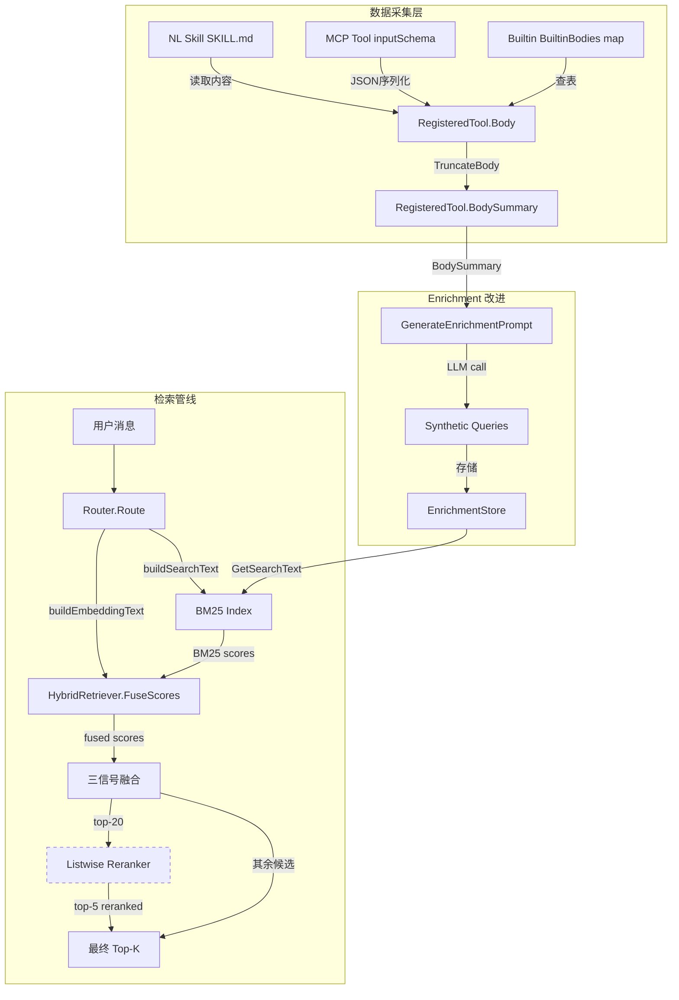

# 设计文档：SkillRouter Body-Aware Retrieval

## Overview

基于阿里 SkillRouter 论文的核心发现，对 maclaw 工具检索管线进行四层递进改进。当前 `Router` 和 `DynamicToolBuilder` 仅使用 `name + description + tags + synthetic_queries` 构建检索文本，完全缺失工具实现代码（body）信息。论文实验表明 body 是决定检索准确率的关键信号。

本设计在不破坏现有 API 和行为的前提下，增量引入以下能力：

1. **Body 数据层**：扩展 `RegisteredTool` 增加 `Body` / `BodySummary` 字段，实现 markdown-aware 截断
2. **Body 采集层**：NL Skill 从 SKILL.md 读取、MCP Tool 从 inputSchema 序列化、Builtin Tool 从硬编码 map 获取
3. **Enrichment 改进**：`GenerateEnrichmentPrompt` 注入 BodySummary，生成更具区分度的 synthetic queries
4. **检索分叉**：BM25 继续使用原有文本（避免长文档稀释短查询匹配），embedding 使用包含 BodySummary 的富文本
5. **LLM Listwise 重排序**：可选的 LLM 重排序步骤，从 top-20 候选中精选 top-5

关键设计约束：当 Body 为空时，所有路径回退到现有行为，保证零破坏升级。

## Architecture



虚线框表示可选组件（Reranker 未配置时跳过）。

### 数据流（单次 Route 调用）

1. `Router.Route(userMessage, allTools)` 被调用
2. 分离 core tools 和 candidate tools（现有逻辑不变）
3. 对每个 candidate：
   - `buildSearchText()` → BM25 文本（name + desc + tags + synthetic queries，**不含 body**）
   - `buildEmbeddingText()` → embedding 文本（name + desc + BodySummary）
4. BM25 索引使用 searchText 计算稀疏分数
5. HybridRetriever 使用 embeddingText 计算向量分数，与 BM25 分数融合
6. 三信号融合：α*retrieval + β*experience + γ*priority
7. 如果 Reranker 已配置且候选数 > MaxToolBudget：
   - 取 top-20 候选，调用 LLM listwise rerank
   - 将 reranked top-5 提升到结果前列
8. 填充至 MaxToolBudget 返回

## Components and Interfaces

### 1. RegisteredTool 扩展（`corelib/tool/types.go`）

```go
type RegisteredTool struct {
    // ... 现有字段 ...
    Body        string `json:"body,omitempty"`         // 工具实现代码或详细参数描述
    BodySummary string `json:"body_summary,omitempty"` // Body 截断后的摘要（≤1500 字符）
}
```

### 2. TruncateBody 函数（`corelib/tool/truncate.go`）

```go
// TruncateBody 对 body 进行 markdown-aware 截断。
// 优先保留 markdown 标题、参数列表项和代码块内容。
// 当截断发生时追加 "..." 标记。
func TruncateBody(body string, maxChars int) string

// DefaultBodyMaxChars 是 BodySummary 的默认最大字符数。
const DefaultBodyMaxChars = 1500
```

截断策略：
1. 如果 `len([]rune(body)) <= maxChars`，原样返回
2. 按行分割，逐行累加字符数
3. 优先保留：markdown 标题行（`#` 开头）、列表项（`-` 或 `*` 开头）、代码块边界（`` ``` `` 行）
4. 不在行中间截断
5. 截断时追加 `\n...`

### 3. BuiltinBodies Map（`corelib/tool/enrichment.go`）

```go
// BuiltinBodies 为内置工具提供硬编码的 body 内容。
var BuiltinBodies = map[string]string{
    "bash": `Parameters:
- command (string, required): Shell command to execute
- timeout (int, optional): Timeout in seconds, default 30
Typical usage: Run shell commands, check system status, install packages`,
    "read_file": `Parameters:
- path (string, required): File path to read
- encoding (string, optional): File encoding, default utf-8
Typical usage: Read source code, config files, logs`,
    // ... 其他内置工具 ...
}
```

### 4. Body 采集流程

#### NL Skill Body 采集

在 `SkillExecutor.Register()` 和相关注册路径中，读取 SKILL.md 内容填充 Body：

```go
// 伪代码：在 skill 注册时
body, err := os.ReadFile(skillMDPath)
if err != nil {
    log.Printf("[SkillRegister] WARN: cannot read SKILL.md for %s: %v", name, err)
}
tool.Body = string(body)
tool.BodySummary = TruncateBody(tool.Body, DefaultBodyMaxChars)
```

#### MCP Tool Body 采集

在 MCP 工具注册时，从 inputSchema 构建 body：

```go
// BuildMCPToolBody 从 MCP 工具的 inputSchema 构建可读的 body 文本。
func BuildMCPToolBody(schema map[string]interface{}) string
```

格式示例：
```
Parameters:
- query (string): The SQL query to execute
- database (string): Target database name
- timeout (integer): Query timeout in seconds
```

#### Builtin Tool Body 采集

在 `Registry.Register()` 中，如果 Body 为空且工具名在 `BuiltinBodies` 中有条目，自动填充：

```go
if tool.Body == "" {
    if body, ok := BuiltinBodies[tool.Name]; ok {
        tool.Body = body
        tool.BodySummary = TruncateBody(body, DefaultBodyMaxChars)
    }
}
```

### 5. Enrichment Prompt 改进（`corelib/tool/enrichment.go`）

```go
// GenerateEnrichmentPrompt 现在接受 bodySummary 参数。
func GenerateEnrichmentPrompt(toolName, description, bodySummary string) (system, user string)
```

新的 system prompt 指示 LLM：
- 基于 body 中的实现细节生成查询
- 生成能区分该工具与同类工具的查询

当 bodySummary 为空时，user prompt 仅包含 name + description（向后兼容）。

### 6. buildEmbeddingText（`corelib/tool/router.go`）

```go
// buildEmbeddingText 返回用于 embedding 的富文本。
// 包含 name + description + BodySummary。
// 当 BodySummary 为空时回退到 name + description。
func (r *Router) buildEmbeddingText(name, description string) string
```

与 `buildSearchText()` 的区别：
- `buildSearchText()` → BM25 用：name + desc + tags + synthetic queries（**不含 body**）
- `buildEmbeddingText()` → embedding 用：name + desc + BodySummary

### 7. Reranker 接口（`corelib/tool/reranker.go`）

```go
// CandidateSummary 描述一个候选工具的摘要信息，用于 reranker 输入。
type CandidateSummary struct {
    Name        string
    Description string
    BodySummary string
}

// Reranker 定义 LLM listwise 重排序接口。
type Reranker interface {
    // Rerank 对候选工具列表进行重排序，返回按相关性排序的工具名列表。
    // candidates 最多 20 个，返回最多 topK 个。
    Rerank(userMessage string, candidates []CandidateSummary, topK int) ([]string, error)
}
```

### 8. Router 扩展（`corelib/tool/router.go`）

```go
type Router struct {
    // ... 现有字段 ...
    reranker Reranker // nil 时跳过重排序
}

// SetReranker 配置 LLM listwise 重排序器。传入 nil 禁用重排序。
func (r *Router) SetReranker(rr Reranker)
```

Route() 中的重排序逻辑：
1. 在三信号融合排序后，如果 `reranker != nil` 且候选数 > MaxToolBudget
2. 取 top-20 候选构建 `[]CandidateSummary`
3. 调用 `reranker.Rerank(userMessage, candidates, 5)`
4. 将 reranked 结果提升到候选列表前列
5. 失败时回退到融合分数排序，记录 warning

### 9. DynamicToolBuilder 扩展（`corelib/tool/builder.go`）

与 Router 对称：
- 新增 `reranker Reranker` 字段
- 新增 `SetReranker(rr Reranker)` 方法
- `Build()` 中使用 `buildEmbeddingText()` 构建 embedding 文本
- 可选调用 reranker

### 10. 可观测性扩展（`corelib/tool/router.go`）

`writeRouteLog` 新增字段：
- `body_aware bool`：是否使用了 body-enhanced embedding text
- reranker 输入/输出日志
- reranker 失败时的错误原因和回退动作

## Data Models

### RegisteredTool 扩展字段

| 字段 | 类型 | 说明 |
|------|------|------|
| Body | `string` | 工具完整实现代码或详细参数描述 |
| BodySummary | `string` | Body 截断后的摘要，≤1500 字符 |

### CandidateSummary（Reranker 输入）

| 字段 | 类型 | 说明 |
|------|------|------|
| Name | `string` | 工具名称 |
| Description | `string` | 工具描述 |
| BodySummary | `string` | Body 摘要 |

### Reranker Prompt 格式

```
User query: {userMessage}

Candidate tools (numbered):
1. {name}: {description}
   Body: {bodySummary}
2. ...
...

Select the top 5 most relevant tools for the user query.
Output ONLY a JSON array of indices, e.g. [3, 1, 7, 2, 5]
```

### 文本构建对比

| 用途 | 函数 | 包含内容 | 原因 |
|------|------|----------|------|
| BM25 索引 | `buildSearchText()` | name + desc + tags + synthetic queries | 避免长 body 稀释短查询的 BM25 匹配 |
| Embedding 向量 | `buildEmbeddingText()` | name + desc + BodySummary | 语义模型能从 body 中提取深层语义 |
| Reranker 输入 | `CandidateSummary` | name + desc + BodySummary | LLM 需要实现细节来判断相关性 |

### 文件变更清单

| 文件 | 变更类型 | 说明 |
|------|----------|------|
| `corelib/tool/types.go` | 修改 | RegisteredTool 增加 Body, BodySummary 字段 |
| `corelib/tool/truncate.go` | 新建 | TruncateBody 函数 |
| `corelib/tool/enrichment.go` | 修改 | GenerateEnrichmentPrompt 增加 bodySummary 参数；新增 BuiltinBodies map |
| `corelib/tool/router.go` | 修改 | 新增 buildEmbeddingText()、SetReranker()、reranker 调用逻辑 |
| `corelib/tool/builder.go` | 修改 | 新增 buildEmbeddingText()、SetReranker()、reranker 调用逻辑 |
| `corelib/tool/reranker.go` | 新建 | Reranker 接口、CandidateSummary 类型 |
| `corelib/tool/registry.go` | 修改 | Register() 中自动填充 BuiltinBodies |
| `gui/app_nl_skills.go` | 修改 | Skill 注册时读取 SKILL.md 填充 Body |
| `gui/tool_router.go` | 修改 | 透传 SetReranker |
| `gui/tool_builder.go` | 修改 | 透传 SetReranker |

## Correctness Properties

*A property is a characteristic or behavior that should hold true across all valid executions of a system — essentially, a formal statement about what the system should do. Properties serve as the bridge between human-readable specifications and machine-verifiable correctness guarantees.*

### Property 1: TruncateBody 短文本恒等

*For any* body string whose rune 长度 ≤ maxChars，`TruncateBody(body, maxChars)` 应返回与 body 完全相同的字符串。

**Validates: Requirements 1.4, 11.4**

### Property 2: TruncateBody 输出不变量

*For any* body string 和任意 maxChars > 0，`TruncateBody(body, maxChars)` 的输出应满足：
1. rune 长度 ≤ maxChars + len("...")
2. 输出中的每一行都是输入中某一完整行的精确副本（不在行中间截断）
3. 当且仅当发生了截断时，输出以 `\n...` 结尾

**Validates: Requirements 1.3, 1.6, 11.2, 11.3, 11.5**

### Property 3: BM25 文本不包含 Body

*For any* RegisteredTool（无论 Body 是否为空），`buildSearchText()` 返回的文本不应包含 Body 或 BodySummary 的内容（当 Body 长度 > 50 字符时，Body 子串不应出现在 searchText 中）。

**Validates: Requirements 6.1, 6.2**

### Property 4: Embedding 文本包含 BodySummary

*For any* RegisteredTool with non-empty BodySummary，`buildEmbeddingText()` 返回的文本应包含该工具的 BodySummary 内容。当 BodySummary 为空时，embedding 文本应仅包含 name 和 description。

**Validates: Requirements 7.1, 7.3**

### Property 5: MCP Body 构建包含 Schema 信息

*For any* MCP inputSchema（包含至少一个 property），`BuildMCPToolBody(schema)` 返回的文本应包含 schema 中每个 property 的名称和类型。当 inputSchema 为空或 nil 时，返回空字符串。

**Validates: Requirements 3.1, 3.3**

### Property 6: Enrichment Prompt 包含 Body Summary

*For any* non-empty toolName、description 和 bodySummary，`GenerateEnrichmentPrompt(toolName, description, bodySummary)` 返回的 user prompt 应包含 bodySummary 内容。当 bodySummary 为空时，user prompt 不应包含 body 相关内容。

**Validates: Requirements 5.1, 5.2**

### Property 7: Builtin Body 自动填充

*For any* tool name 存在于 `BuiltinBodies` map 中，通过 `Registry.Register()` 注册一个 Body 为空的 RegisteredTool 后，该工具的 Body 应等于 `BuiltinBodies[name]`，且 BodySummary 应等于 `TruncateBody(BuiltinBodies[name], DefaultBodyMaxChars)`。

**Validates: Requirements 4.2, 4.3**

### Property 8: Reranker 调用契约

*For any* Router 配置了 Reranker 且候选工具数 > MaxToolBudget，`Route()` 应调用 Reranker，传入的候选列表长度 ≤ 20，请求的 topK = 5。当 Reranker 未配置时，不应有任何 Reranker 调用。

**Validates: Requirements 8.1, 8.2, 8.4, 9.3**

### Property 9: Reranker 失败优雅回退

*For any* Router 配置了一个总是返回 error 的 Reranker，`Route()` 的结果应与未配置 Reranker 时的结果完全相同。类似地，当 Reranker 返回少于 5 个结果时，Router 应从融合分数列表中补充候选，使最终结果数量不低于无 Reranker 时的结果数量。

**Validates: Requirements 8.5, 8.6**

### Property 10: 空 Body 向后兼容

*For any* 一组 Body 和 BodySummary 均为空的 RegisteredTool，且 Embedder 为 NoopEmbedder、Reranker 为 nil 时，`Router.Route()` 和 `DynamicToolBuilder.Build()` 的输出应与当前实现（无 Body 字段）完全相同。

**Validates: Requirements 10.1, 10.2, 10.3, 10.4**

### Property 11: Router 与 Builder 行为一致性

*For any* 相同的工具集和用户消息，Router 和 DynamicToolBuilder 在 BM25 文本构建和 embedding 文本构建上应使用相同的逻辑：对同一工具，两者的 `buildSearchText()` 输出相同，`buildEmbeddingText()` 输出相同。

**Validates: Requirements 6.3, 7.4, 10.5**

## Error Handling

### Body 采集错误

| 场景 | 处理方式 |
|------|----------|
| NL Skill 的 SKILL.md 文件不可读 | 记录 warning 日志，Body 留空，不影响注册 |
| MCP Tool 的 inputSchema 序列化失败 | Body 留空，不影响注册 |
| BuiltinBodies 中无对应条目 | Body 留空（正常情况） |

### TruncateBody 错误

| 场景 | 处理方式 |
|------|----------|
| body 为空字符串 | 返回空字符串 |
| maxChars ≤ 0 | 返回空字符串 |
| body 全部为单行且超长 | 截断到 maxChars 字符边界，追加 "..." |

### Enrichment Prompt 错误

| 场景 | 处理方式 |
|------|----------|
| bodySummary 为空 | 回退到仅使用 name + description（现有行为） |
| LLM 调用失败 | 不生成 enrichment，使用基础文本（现有行为） |

### Reranker 错误

| 场景 | 处理方式 |
|------|----------|
| Reranker.Rerank() 返回 error | 记录 warning，回退到融合分数排序 |
| Reranker 返回空列表 | 等同于错误，回退到融合分数排序 |
| Reranker 返回 < 5 个结果 | 从融合分数列表中补充至目标数量 |
| Reranker 返回未知工具名 | 忽略未知名称，从融合分数列表补充 |
| Reranker 调用超时 | 由 LLMCaller 实现控制超时，Router 视为 error |

### 向后兼容边界

| 场景 | 处理方式 |
|------|----------|
| 所有工具 Body 为空 | 完全等同于当前行为 |
| Embedder 为 NoopEmbedder | 仅使用 BM25，与当前行为相同 |
| Reranker 为 nil | 跳过重排序，与当前行为相同 |
| 候选数 ≤ MaxToolBudget | 直接返回所有工具，不触发评分/重排序 |

## Testing Strategy

### 测试框架

- 单元测试：Go 标准 `testing` 包
- 属性测试：[`pgregory.net/rapid`](https://github.com/flyingmutant/rapid)（Go 属性测试库）
- 每个属性测试配置最少 100 次迭代

### 属性测试

每个属性测试必须以注释标注对应的设计属性：

```go
// Feature: skillrouter-body-aware-retrieval, Property 1: TruncateBody 短文本恒等
func TestProperty_TruncateBodyIdentity(t *testing.T) { ... }
```

属性测试覆盖：

| 属性 | 测试文件 | 生成器 |
|------|----------|--------|
| Property 1: TruncateBody 短文本恒等 | `corelib/tool/truncate_property_test.go` | 随机字符串（rune 长度 ≤ maxChars） |
| Property 2: TruncateBody 输出不变量 | `corelib/tool/truncate_property_test.go` | 随机 markdown 文档（含标题、列表、代码块） |
| Property 3: BM25 文本不包含 Body | `corelib/tool/router_body_property_test.go` | 随机 RegisteredTool（含随机 Body） |
| Property 4: Embedding 文本包含 BodySummary | `corelib/tool/router_body_property_test.go` | 随机 RegisteredTool（含随机 BodySummary） |
| Property 5: MCP Body 构建包含 Schema 信息 | `corelib/tool/reranker_property_test.go` | 随机 inputSchema map |
| Property 6: Enrichment Prompt 包含 Body Summary | `corelib/tool/enrichment_body_property_test.go` | 随机 name/desc/bodySummary 字符串 |
| Property 7: Builtin Body 自动填充 | `corelib/tool/registry_body_property_test.go` | 从 BuiltinBodies keys 中随机选取 |
| Property 8: Reranker 调用契约 | `corelib/tool/router_body_property_test.go` | 随机工具集 + mock reranker（计数调用） |
| Property 9: Reranker 失败优雅回退 | `corelib/tool/router_body_property_test.go` | 随机工具集 + error-returning mock reranker |
| Property 10: 空 Body 向后兼容 | `corelib/tool/router_body_property_test.go` | 随机工具集（Body 全空）+ NoopEmbedder |
| Property 11: Router/Builder 一致性 | `corelib/tool/router_body_property_test.go` | 随机工具集 + 随机用户消息 |

### 单元测试

| 测试 | 文件 | 覆盖内容 |
|------|------|----------|
| TestTruncateBody_Empty | `corelib/tool/truncate_test.go` | 空字符串输入 |
| TestTruncateBody_ExactLimit | `corelib/tool/truncate_test.go` | 恰好等于限制的输入 |
| TestTruncateBody_PreservesHeadings | `corelib/tool/truncate_test.go` | 验证标题行优先保留 |
| TestBuildMCPToolBody_EmptySchema | `corelib/tool/reranker_test.go` | 空 inputSchema 返回空 |
| TestBuildMCPToolBody_NestedSchema | `corelib/tool/reranker_test.go` | 嵌套 object 类型参数 |
| TestGenerateEnrichmentPrompt_WithBody | `corelib/tool/enrichment_test.go` | 带 bodySummary 的 prompt 生成 |
| TestGenerateEnrichmentPrompt_EmptyBody | `corelib/tool/enrichment_test.go` | 空 bodySummary 回退 |
| TestRouter_Reranker_NotConfigured | `corelib/tool/router_body_test.go` | 未配置 reranker 时跳过 |
| TestRouter_Reranker_Error | `corelib/tool/router_body_test.go` | reranker 返回 error 时回退 |
| TestRouter_Reranker_PartialResults | `corelib/tool/router_body_test.go` | reranker 返回 < 5 结果时补充 |
| TestRouter_BodyAware_LogField | `corelib/tool/router_body_test.go` | writeRouteLog 包含 body_aware 字段 |
| TestRegistry_AutoPopulateBody | `corelib/tool/registry_test.go` | 注册时自动填充 BuiltinBodies |

### Mock 组件

```go
// mockReranker 用于测试 reranker 集成。
type mockReranker struct {
    callCount  int
    lastInput  []CandidateSummary
    returnNames []string
    returnErr   error
}

func (m *mockReranker) Rerank(userMessage string, candidates []CandidateSummary, topK int) ([]string, error) {
    m.callCount++
    m.lastInput = candidates
    return m.returnNames, m.returnErr
}
```

### 测试原则

- 属性测试覆盖通用规则（所有输入都应满足的不变量）
- 单元测试覆盖具体示例和边界情况
- 两者互补：属性测试发现意外输入下的 bug，单元测试验证已知场景的正确性
- 每个属性测试对应设计文档中的一个 Property，通过注释标注关联

