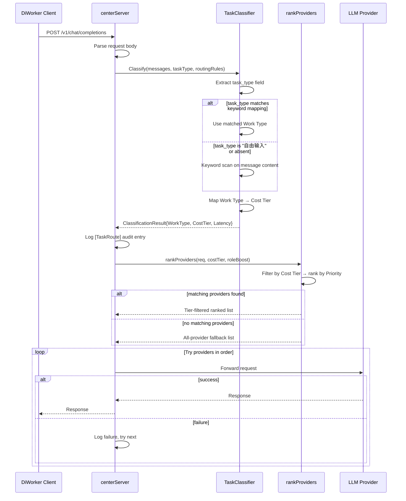

# Design Document: Smart Task Routing

## Overview

Smart Task Routing 在 iWorkerCenter 的 LLM 代理转发路径中增加一个纯内存的 **TaskClassifier** 组件。它在 `handleChatCompletions` 收到请求后、调用 `rankProviders` 之前执行，完成三步操作：

1. **Work Type 检测** — 从请求的 `task_type` 字段或消息内容关键词推断工作类型
2. **Cost Tier 映射** — 根据可配置规则将 Work Type 映射到 `high`/`medium`/`low` 成本等级
3. **Provider 过滤与排序** — 优先选择匹配 Cost Tier 的 Provider，保留现有 fallback 机制

整个分类过程不做任何外部调用，严格控制在 10ms 以内。分类结果通过 Go 标准 logger 以 `[TaskRoute]` 前缀记录审计日志。路由规则存储在 `~/.iworkercenter/settings.json` 中，每次请求时随 `refreshProviders` 一起重新加载。

### Design Rationale

- **不新建模块目录**：TaskClassifier 是 `handleChatCompletions` 转发路径的内联逻辑，不涉及数据库、不暴露 HTTP 端点，不适合放入 `internal/modules/` 的 domain/repo/service/handler 四层结构。将其作为 `server.go` 同包的独立文件（`task_classifier.go`、`routing_rules.go`）更符合职责边界。
- **纯函数设计**：分类逻辑设计为纯函数 `Classify(input) → result`，便于单元测试和 property-based testing，不依赖 centerServer 实例状态。
- **配置热加载**：路由规则随 `refreshProviders` 一起从 settings.json 重新读取，无需重启服务。

## Architecture



### Integration Point

The classifier inserts into `handleChatCompletions` between request parsing and the existing `rankProviders` call. The modified flow:

1. Parse request body (existing)
2. **NEW**: Build `ClassifyInput` from request
3. **NEW**: Call `Classify()` → get `ClassificationResult`
4. **NEW**: Log `[TaskRoute]` audit entry
5. **MODIFIED**: Call `rankProviders(req)` → `rankProvidersWithTier(req, result.CostTier, roleBoost)`
6. Fallback loop (existing, unchanged)

## Components and Interfaces

### 1. TaskClassifier (Pure Functions)

File: `iWorkerCenter/task_classifier.go`

```go
// ClassifyInput holds the data extracted from a request for classification.
type ClassifyInput struct {
    TaskType       string   // from request body "task_type" field, may be empty
    MessageContent string   // concatenated user message text
    ColleagueName  string   // optional, extracted from request context
}

// ClassificationResult holds the output of the classification process.
type ClassificationResult struct {
    WorkType  string        // e.g. "document_writing", "simple_qa"
    CostTier  string        // "high", "medium", "low"
    Latency   time.Duration // classification processing time
    Method    string        // "task_type_match", "keyword_match", "default"
}

// Classify determines the WorkType and CostTier for a request.
// Pure function: no side effects, no external calls.
func Classify(input ClassifyInput, rules RoutingRules) ClassificationResult

// classifyByTaskType checks if the task_type field directly maps to a WorkType.
func classifyByTaskType(taskType string, keywords map[string][]string) (string, bool)

// classifyByKeywords scans message content against keyword rules.
// Returns the WorkType with the most keyword hits, or "" if none match.
func classifyByKeywords(content string, keywords map[string][]string) string
```

### 2. RoutingRules (Configuration)

File: `iWorkerCenter/routing_rules.go`

```go
// RoutingRules holds all configurable routing parameters.
type RoutingRules struct {
    WorkTypeKeywords  map[string][]string // work_type → keyword list
    WorkTypeTier      map[string]string   // work_type → cost_tier
    RoleProviderBoost map[string][]string // role_code → preferred provider IDs
    DefaultWorkType   string              // fallback work type (default: "simple_qa")
    DefaultCostTier   string              // fallback cost tier (default: "medium")
}

// DefaultRoutingRules returns the built-in default rules.
func DefaultRoutingRules() RoutingRules

// MergeWithDefaults fills in any missing fields from defaults.
func (r RoutingRules) MergeWithDefaults() RoutingRules

// LookupTier returns the Cost Tier for a given Work Type.
func (r RoutingRules) LookupTier(workType string) string
```

### 3. Extended CenterProvider

The existing `CenterProvider` struct gains one field:

```go
type CenterProvider struct {
    // ... existing fields ...
    CostTier string // "high", "medium", "low"; default "medium"
}
```

Similarly, `centerProviderFile` gains:

```go
type centerProviderFile struct {
    // ... existing fields ...
    CostTier string `json:"cost_tier"` // optional, defaults to "medium"
}
```

### 4. Extended centerSettingsFile

```go
type centerSettingsFile struct {
    Providers        []centerProviderFile   `json:"providers"`
    WorkTypeKeywords map[string][]string    `json:"work_type_keywords,omitempty"`
    WorkTypeTier     map[string]string      `json:"work_type_tier,omitempty"`
    RoleProviderBoost map[string][]string   `json:"role_provider_boost,omitempty"`
}
```

### 5. Modified rankProviders

The existing `rankProviders` method is extended to accept optional tier filtering:

```go
// rankProvidersWithTier filters providers by cost tier, then ranks by priority.
// If no providers match the tier, falls back to ranking all enabled providers.
func (s *centerServer) rankProvidersWithTier(
    req openAIChatRequest,
    costTier string,
    roleBoost map[string][]string,
    roleCode string,
) []CenterProvider
```

The original `rankProviders` method remains as-is for backward compatibility and is called internally when tier filtering yields no results.

## Data Models

### Work Type Enum (String Constants)

```go
const (
    WorkTypeDocumentWriting  = "document_writing"
    WorkTypeDataAnalysis     = "data_analysis"
    WorkTypeQualityReport    = "quality_report"
    WorkTypeProductionReport = "production_report"
    WorkTypeTableFormatting  = "table_formatting"
    WorkTypeLongTextSummary  = "long_text_summary"
    WorkTypeSimpleQA         = "simple_qa"
)
```

### Cost Tier Enum (String Constants)

```go
const (
    CostTierHigh   = "high"
    CostTierMedium = "medium"
    CostTierLow    = "low"
)
```

### Default Keyword Mappings

| Work Type | Keywords |
|-----------|----------|
| `document_writing` | 公文, 通知, 纪要, 日报, 周报, 报告, 文档, 起草, 撰写, 正式 |
| `data_analysis` | 分析, 数据, 统计, 趋势, 对比, 指标, 报表, 归因 |
| `quality_report` | 质量, 异常, 整改, 不良, 缺陷, 质检, 品控, 根因 |
| `production_report` | 生产, 产量, 排产, 工单, 产线, 良率 |
| `table_formatting` | 表格, 格式化, 排版, 整理, 列表 |
| `long_text_summary` | 总结, 摘要, 概括, 提炼, 要点 |
| `simple_qa` | (default fallback — no keywords needed) |

### Default Work Type → Cost Tier Mapping

| Work Type | Cost Tier |
|-----------|-----------|
| `document_writing` | `high` |
| `data_analysis` | `high` |
| `quality_report` | `high` |
| `production_report` | `medium` |
| `table_formatting` | `medium` |
| `long_text_summary` | `medium` |
| `simple_qa` | `low` |

### Extended settings.json Schema

```json
{
  "providers": [
    {
      "id": "office-openai",
      "name": "办公写作服务",
      "protocol": "openai",
      "base_url": "https://office.example.com/v1",
      "api_key": "...",
      "model": "gpt-4.1",
      "priority": 100,
      "features": ["公文", "纪要"],
      "cost_tier": "high",
      "enabled": true,
      "timeout_sec": 60
    }
  ],
  "work_type_keywords": {
    "document_writing": ["公文", "通知", "纪要", "日报"],
    "data_analysis": ["分析", "数据", "统计"]
  },
  "work_type_tier": {
    "document_writing": "high",
    "data_analysis": "high",
    "simple_qa": "low"
  },
  "role_provider_boost": {
    "office": ["office-openai"],
    "quality": ["analysis-anthropic"]
  }
}
```

### Classification Audit Log Format

```
[TaskRoute] ts=2025-01-15T10:30:00Z req_id=chatcmpl-xxx work_type=document_writing cost_tier=high provider=office-openai latency_ms=2 method=keyword_match summary="请帮我起草一份关于本周生产情况的..."
```


## Correctness Properties

*A property is a characteristic or behavior that should hold true across all valid executions of a system — essentially, a formal statement about what the system should do. Properties serve as the bridge between human-readable specifications and machine-verifiable correctness guarantees.*

### Property 1: Classification always returns a valid Work Type

*For any* `ClassifyInput` (with arbitrary `TaskType`, `MessageContent`, and `ColleagueName` strings) and *for any* valid `RoutingRules`, `Classify(input, rules)` SHALL return a `ClassificationResult` whose `WorkType` is one of the known work type constants (`document_writing`, `data_analysis`, `quality_report`, `production_report`, `table_formatting`, `long_text_summary`, `simple_qa`) or a key present in `rules.WorkTypeKeywords`.

**Validates: Requirements 1.1**

### Property 2: Explicit task_type match selects the correct Work Type

*For any* `RoutingRules` with non-empty `WorkTypeKeywords`, and *for any* `(workType, keyword)` pair where `keyword` is an element of `rules.WorkTypeKeywords[workType]`, when `ClassifyInput.TaskType` equals that `keyword`, `Classify` SHALL return `workType` as the `ClassificationResult.WorkType` and `"task_type_match"` as the `Method`.

**Validates: Requirements 1.2**

### Property 3: Absent task_type triggers keyword-based classification

*For any* `RoutingRules` with non-empty `WorkTypeKeywords`, and *for any* message content string that contains at least one keyword from exactly one work type's keyword list, when `ClassifyInput.TaskType` is `""` or `"自由输入"`, `Classify` SHALL return that work type as the `ClassificationResult.WorkType` and `"keyword_match"` as the `Method`.

**Validates: Requirements 1.3**

### Property 4: No keyword match defaults to simple_qa

*For any* `ClassifyInput` where `TaskType` is `""` or `"自由输入"` and `MessageContent` contains none of the keywords in any work type's keyword list, `Classify` SHALL return `"simple_qa"` as the `WorkType` and `"default"` as the `Method`.

**Validates: Requirements 1.5**

### Property 5: LookupTier always returns a valid tier with medium as default

*For any* `RoutingRules` (merged with defaults) and *for any* arbitrary work type string, `LookupTier(workType)` SHALL return exactly one of `"high"`, `"medium"`, or `"low"`. Furthermore, *for any* work type string not present as a key in `rules.WorkTypeTier`, `LookupTier` SHALL return `"medium"`.

**Validates: Requirements 2.1, 2.3**

### Property 6: Tier filtering returns correctly filtered and priority-sorted providers

*For any* non-empty list of `CenterProvider` values with varying `CostTier` and `Priority` fields, and *for any* target `costTier` string where at least one enabled provider matches, `rankProvidersWithTier` SHALL return a list where (a) every provider has `CostTier == costTier` and `Enabled == true`, and (b) the list is sorted by descending `Priority`.

**Validates: Requirements 2.5, 3.1**

### Property 7: Fallback to all providers when no tier match exists

*For any* non-empty list of enabled `CenterProvider` values and *for any* target `costTier` string where no enabled provider has a matching `CostTier`, `rankProvidersWithTier` SHALL return the same result as the existing `rankProviders` (all enabled providers ranked by priority and feature matching).

**Validates: Requirements 3.2**

### Property 8: Role boost affects ranking within the same Cost Tier

*For any* two enabled providers `A` and `B` with the same `CostTier` and the same `Priority`, when `roleBoost` maps a role code to provider `A`'s ID but not `B`'s ID, `rankProvidersWithTier` SHALL rank `A` before `B`.

**Validates: Requirements 4.2**

### Property 9: Cost Tier takes precedence over Role preference

*For any* provider list containing provider `A` (matching the target `costTier`) and provider `B` (not matching the target `costTier` but matching the `roleBoost` preference), `rankProvidersWithTier` SHALL rank `A` before `B` in the result list.

**Validates: Requirements 4.3**

### Property 10: Audit log format contains all required fields

*For any* `ClassificationResult` and *for any* request ID string and message summary string, the formatted audit log string SHALL contain substrings for: `[TaskRoute]`, `work_type=`, `cost_tier=`, `provider=`, `latency_ms=`, `method=`, and `summary=`.

**Validates: Requirements 5.1, 5.2**

### Property 11: MergeWithDefaults fills missing routing rule fields

*For any* `RoutingRules` with one or more nil/empty maps, `MergeWithDefaults()` SHALL return a `RoutingRules` where `WorkTypeKeywords` is non-nil and contains all 7 built-in work types, `WorkTypeTier` is non-nil and contains all 7 default mappings, and `DefaultWorkType` is `"simple_qa"`.

**Validates: Requirements 6.3**

### Property 12: Provider cost_tier normalization defaults to medium

*For any* `centerProviderFile` with an empty `CostTier` field, after normalization through `normalizeCenterProviders`, the resulting `CenterProvider` SHALL have `CostTier == "medium"`.

**Validates: Requirements 6.5**

## Error Handling

| Scenario | Behavior |
|----------|----------|
| Malformed request body (JSON parse fails) | Existing `handleChatCompletions` returns 400; classification is never reached |
| `task_type` field missing or empty | Treated as absent; falls through to keyword matching |
| No keyword matches | Default to `simple_qa` work type |
| Unknown work type in tier lookup | Default to `medium` cost tier |
| No providers match cost tier | Fall back to `rankProviders` (all enabled providers) |
| All providers fail | Existing fallback loop exhausts list, returns 502 (unchanged) |
| Classification exceeds 10ms | Abort classification, use `rankProviders` fallback |
| Audit log write fails | Silently continue; `log.Printf` writes to stderr, non-blocking |
| `settings.json` missing routing fields | `MergeWithDefaults` fills in built-in defaults |
| `settings.json` unreadable | Existing `readCenterSettings` returns defaults |
| Provider `cost_tier` field absent | Normalization sets `"medium"` |

All error paths preserve the existing behavior: the request is always forwarded to at least one provider (as long as any enabled provider exists). Classification errors never block the forwarding path.

## Testing Strategy

### Property-Based Tests (using `rapid` library for Go)

The `rapid` library (`pgregory.net/rapid`) is the recommended PBT framework for Go. Each property test runs a minimum of 100 iterations with randomly generated inputs.

Property tests will be placed in `iWorkerCenter/task_classifier_property_test.go` and `iWorkerCenter/routing_rules_property_test.go`.

Each test is tagged with a comment referencing the design property:
```go
// Feature: smart-task-routing, Property 1: Classification always returns a valid Work Type
```

**Properties to implement:**

1. **Classify invariant** (Property 1): Generate random `ClassifyInput` + `RoutingRules`, assert result `WorkType` is always in the valid set.
2. **task_type match** (Property 2): Generate rules with keywords, pick a random keyword as `TaskType`, assert correct work type returned.
3. **Keyword match path** (Property 3): Generate message containing exactly one work type's keyword with empty `TaskType`, assert correct work type.
4. **Default fallback** (Property 4): Generate keyword-free messages, assert `simple_qa` returned.
5. **LookupTier validity** (Property 5): Generate random work type strings, assert result is always `high`/`medium`/`low` with `medium` default.
6. **Tier filtering correctness** (Property 6): Generate random provider lists + tier, assert filtered list is correct and sorted.
7. **Tier fallback** (Property 7): Generate providers with no tier match, assert fallback equals `rankProviders` output.
8. **Role boost tiebreaker** (Property 8): Generate equal-priority same-tier providers, assert role-boosted one ranks first.
9. **Tier > Role precedence** (Property 9): Generate cross-tier scenario, assert tier-matched provider ranks first.
10. **Log format completeness** (Property 10): Generate random results, assert all required fields present in formatted string.
11. **MergeWithDefaults completeness** (Property 11): Generate partial rules, assert merge fills all defaults.
12. **Provider cost_tier default** (Property 12): Generate providers with empty cost_tier, assert normalization sets `medium`.

### Unit Tests (Example-Based)

Placed in `iWorkerCenter/task_classifier_test.go` and `iWorkerCenter/server_test.go`:

- **Default mappings verification** (Req 2.2): Assert each specific default mapping.
- **Built-in work types smoke test** (Req 1.4): Assert `DefaultRoutingRules` contains all 7 types.
- **Explicit provider ID bypass** (Req 3.4): Set `model` to a provider ID, assert bypass.
- **Malformed body handling** (Req 1.6): Send invalid JSON, assert 400 response.
- **Cross-tier fallback in retry loop** (Req 3.3): Mock providers where first fails, assert next is tried.
- **Role detection from message** (Req 4.1): Test with known colleague names.

### Integration Tests

- **Settings hot-reload** (Req 6.4): Write settings, send request, verify new rules applied.
- **End-to-end classification + forwarding**: Send request through `handleChatCompletions`, verify correct provider selected.
- **Latency benchmark** (Req 7.1): Benchmark `Classify` function, assert < 10ms p99.
