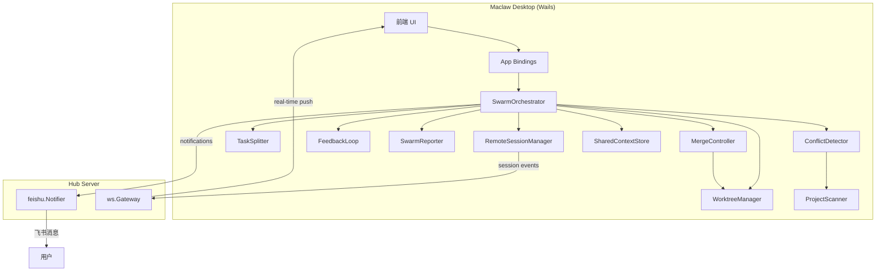
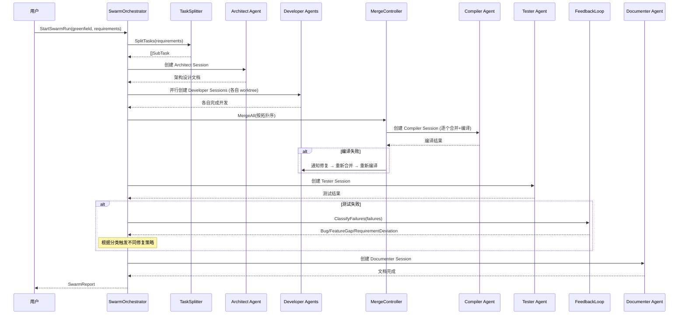
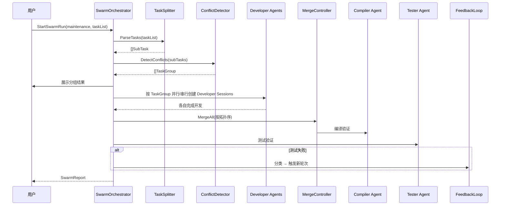

# 技术设计文档：Swarm Orchestrator（蜂群编排器）

## 概述

Swarm Orchestrator 是 Maclaw 桌面应用中的 AI 军团调度系统，通过 git worktree 实现多个编程工具实例（Agent）并行开发同一项目。系统在现有 `Orchestrator` 基础上扩展，复用 `RemoteSessionManager`、`SharedContextStore`、`ProjectScanner`、`feishu.Notifier` 和 `ws.Gateway` 等已有基础设施。

核心设计理念：每个 Swarm Agent 本质上是一个带角色专属 system prompt 的 `RemoteSession`，在独立的 git worktree 中工作。SwarmOrchestrator 作为状态机驱动整个流程，通过监听 Session 状态变化来推进阶段。

### 设计决策

1. **复用 RemoteSessionManager 而非新建会话管理**：每个 Agent 就是一个 RemoteSession，复用现有的 Create/WriteInput/Kill 等方法，避免重复实现进程管理、输出管道、权限处理等逻辑。
2. **状态机驱动而非事件驱动**：SwarmRun 使用显式的阶段状态机（pending → running → paused → completed/failed/cancelled），每个阶段完成后由 Orchestrator 推进到下一阶段，便于暂停/恢复和错误处理。
3. **Worktree 放在项目同级目录**：`../.maclaw-workers/{run_id}/` 避免污染项目目录，同时保持相对路径简短。
4. **编译官按拓扑序逐个合并**：每合并一个分支就编译验证，失败立即回退该分支，避免多个分支同时合并后难以定位问题。
5. **反馈循环使用 LLM 分类**：测试失败后由 LLM 判断失败类型（Bug/Feature Gap/需求偏差），不同类型触发不同修复策略。

## 架构

### 系统架构图



### Greenfield 模式 Pipeline



### Maintenance 模式 Pipeline




## 组件与接口

### 1. SwarmOrchestrator（核心调度器）

SwarmOrchestrator 是整个蜂群系统的入口和状态机驱动器。它管理 SwarmRun 的生命周期，协调各组件完成阶段推进。

```go
// SwarmOrchestrator 蜂群编排器核心
type SwarmOrchestrator struct {
    app            *App
    manager        *RemoteSessionManager
    sharedCtx      *SharedContextStore
    worktreeMgr    *WorktreeManager
    conflictDet    *ConflictDetector
    taskSplitter   *TaskSplitter
    mergeCtrl      *MergeController
    feedbackLoop   *FeedbackLoop
    reporter       *SwarmReporter
    notifier       SwarmNotifier // 抽象通知接口

    mu          sync.RWMutex
    activeRun   *SwarmRun       // 当前活跃的 Run（最多 1 个）
    runHistory  []*SwarmRun     // 历史记录
    maxRounds   int             // 最大反馈轮次，默认 5
    maxAgents   int             // 最大并发 Agent 数，默认 5
}

// StartSwarmRun 启动一个新的蜂群执行
func (o *SwarmOrchestrator) StartSwarmRun(req SwarmRunRequest) (*SwarmRun, error)

// PauseSwarmRun 暂停当前 Run
func (o *SwarmOrchestrator) PauseSwarmRun(runID string) error

// ResumeSwarmRun 恢复暂停的 Run
func (o *SwarmOrchestrator) ResumeSwarmRun(runID string) error

// CancelSwarmRun 取消 Run，清理资源
func (o *SwarmOrchestrator) CancelSwarmRun(runID string) error

// ListSwarmRuns 列出所有 Run（含历史）
func (o *SwarmOrchestrator) ListSwarmRuns() []SwarmRunSummary

// GetSwarmRun 获取指定 Run 的详细信息
func (o *SwarmOrchestrator) GetSwarmRun(runID string) (*SwarmRun, error)

// ProvideUserInput 用户提供输入（用于需求偏差确认等场景）
func (o *SwarmOrchestrator) ProvideUserInput(runID, input string) error
```

### 2. WorktreeManager（Worktree 管理器）

管理 git worktree 的完整生命周期：stash → init → worktree 创建 → 清理 → stash pop。

```go
type WorktreeManager struct {
    baseDir string // 项目同级目录下的 .maclaw-workers/
}

// PrepareProject 确保项目有 git 仓库和至少一个 commit
// 如果有未提交改动则 stash
func (w *WorktreeManager) PrepareProject(projectPath string) (*ProjectState, error)

// CreateWorktree 为指定 Agent 创建独立的 worktree 和分支
func (w *WorktreeManager) CreateWorktree(projectPath, runID, branchName string) (*WorktreeInfo, error)

// RemoveWorktree 删除指定 worktree 和分支
func (w *WorktreeManager) RemoveWorktree(worktreePath string) error

// CleanupRun 清理整个 Run 的所有 worktree
func (w *WorktreeManager) CleanupRun(projectPath, runID string) error

// RestoreProject 恢复项目状态（stash pop）
func (w *WorktreeManager) RestoreProject(projectPath string, state *ProjectState) error
```

### 3. ConflictDetector（冲突检测器）

分析任务间的文件依赖，将有冲突的任务分组。

```go
type ConflictDetector struct {
    scanner *ProjectScanner
}

// DetectConflicts 分析任务列表，返回分组结果
// 同组内的任务有文件交集，需串行执行
func (d *ConflictDetector) DetectConflicts(tasks []SubTask) ([]TaskGroup, error)

// BuildDependencyGraph 构建文件依赖图
func (d *ConflictDetector) BuildDependencyGraph(tasks []SubTask) *DependencyGraph
```

### 4. TaskSplitter（任务分解器）

将用户输入的需求或任务列表分解为可执行的子任务。

```go
type TaskSplitter struct {
    llmConfig MaclawLLMConfig
}

// SplitRequirements 将产品需求分解为子任务（Greenfield 模式）
func (s *TaskSplitter) SplitRequirements(requirements, techStack string) ([]SubTask, error)

// ParseTaskList 解析任务列表（Maintenance 模式）
// 支持手动输入文本、GitHub Issues URL
func (s *TaskSplitter) ParseTaskList(input TaskListInput) ([]SubTask, error)
```

### 5. MergeController（合并控制器）

按拓扑序合并各 worktree 分支，每合并一个就编译验证。

```go
type MergeController struct {
    worktreeMgr *WorktreeManager
}

// MergeAll 按拓扑序逐个合并分支到主分支
// 每合并一个分支后执行编译验证，失败则回退该分支
func (m *MergeController) MergeAll(projectPath string, branches []BranchInfo) (*MergeResult, error)

// RevertBranch 回退指定分支的合并
func (m *MergeController) RevertBranch(projectPath, branchName string) error
```

### 6. FeedbackLoop（反馈循环）

处理测试失败的分类和修复策略决策。

```go
type FeedbackLoop struct {
    llmConfig MaclawLLMConfig
    maxRounds int
    round     int
}

// ClassifyFailures 使用 LLM 对测试失败进行分类
func (f *FeedbackLoop) ClassifyFailures(failures []TestFailure) ([]ClassifiedFailure, error)

// ShouldContinue 检查是否还能继续（未达最大轮次）
func (f *FeedbackLoop) ShouldContinue() bool

// NextRound 递增轮次计数器
func (f *FeedbackLoop) NextRound(reason string)
```

### 7. SwarmReporter（报告生成器）

生成完整的执行报告。

```go
type SwarmReporter struct{}

// GenerateReport 生成所有报告文件
func (r *SwarmReporter) GenerateReport(run *SwarmRun) (*SwarmReport, error)

// WriteReportFiles 将报告写入磁盘
func (r *SwarmReporter) WriteReportFiles(projectPath string, report *SwarmReport) error

// MarshalReport 序列化报告为 JSON
func MarshalReport(report SwarmReport) ([]byte, error)

// UnmarshalReport 反序列化 JSON 为报告
func UnmarshalReport(data []byte) (SwarmReport, error)
```

### 8. SwarmNotifier（通知接口）

抽象通知接口，统一飞书和 WebSocket 推送。

```go
// SwarmNotifier 蜂群通知接口
type SwarmNotifier interface {
    // NotifyPhaseChange 阶段变更通知
    NotifyPhaseChange(run *SwarmRun, phase SwarmPhase) error
    // NotifyAgentComplete Agent 完成通知
    NotifyAgentComplete(run *SwarmRun, agent *SwarmAgent) error
    // NotifyFailure 失败通知
    NotifyFailure(run *SwarmRun, failType string, summary string) error
    // NotifyWaitingUser 等待用户确认通知
    NotifyWaitingUser(run *SwarmRun, message string) error
    // NotifyRunComplete Run 完成通知
    NotifyRunComplete(run *SwarmRun, report *SwarmReport) error
}
```


## 数据模型

### SwarmRun（蜂群执行实例）

```go
type SwarmMode string

const (
    SwarmModeGreenfield  SwarmMode = "greenfield"
    SwarmModeMaintenance SwarmMode = "maintenance"
)

type SwarmStatus string

const (
    SwarmStatusPending   SwarmStatus = "pending"
    SwarmStatusRunning   SwarmStatus = "running"
    SwarmStatusPaused    SwarmStatus = "paused"
    SwarmStatusCompleted SwarmStatus = "completed"
    SwarmStatusFailed    SwarmStatus = "failed"
    SwarmStatusCancelled SwarmStatus = "cancelled"
)

type SwarmPhase string

const (
    PhaseTaskSplit      SwarmPhase = "task_split"
    PhaseArchitecture   SwarmPhase = "architecture"
    PhaseConflictDetect SwarmPhase = "conflict_detect"
    PhaseDevelopment    SwarmPhase = "development"
    PhaseMerge          SwarmPhase = "merge"
    PhaseCompile        SwarmPhase = "compile"
    PhaseTest           SwarmPhase = "test"
    PhaseDocument       SwarmPhase = "document"
    PhaseReport         SwarmPhase = "report"
)

type SwarmRun struct {
    ID          string      `json:"run_id"`
    Mode        SwarmMode   `json:"mode"`
    Status      SwarmStatus `json:"status"`
    Phase       SwarmPhase  `json:"phase"`
    ProjectPath string      `json:"project_path"`
    TechStack   string      `json:"tech_stack,omitempty"`

    // 任务与 Agent
    Tasks       []SubTask    `json:"tasks"`
    TaskGroups  []TaskGroup  `json:"task_groups,omitempty"`
    Agents      []SwarmAgent `json:"agents"`

    // 反馈循环
    CurrentRound int            `json:"current_round"`
    MaxRounds    int            `json:"max_rounds"`
    RoundHistory []SwarmRound   `json:"round_history"`

    // Worktree 状态
    ProjectState *ProjectState `json:"project_state,omitempty"`

    // 时间线
    Timeline    []TimelineEvent `json:"timeline"`
    CreatedAt   time.Time       `json:"created_at"`
    UpdatedAt   time.Time       `json:"updated_at"`
    CompletedAt *time.Time      `json:"completed_at,omitempty"`

    // 用户输入通道（用于需求偏差确认）
    userInputCh chan string `json:"-"`
}
```

### SwarmAgent（蜂群 Agent）

```go
type AgentRole string

const (
    RoleArchitect  AgentRole = "architect"
    RoleDesigner   AgentRole = "designer"
    RoleDeveloper  AgentRole = "developer"
    RoleCompiler   AgentRole = "compiler"
    RoleTester     AgentRole = "tester"
    RoleDocumenter AgentRole = "documenter"
)

type SwarmAgent struct {
    ID           string    `json:"id"`
    Role         AgentRole `json:"role"`
    SessionID    string    `json:"session_id"`    // 对应 RemoteSession.ID
    TaskIndex    int       `json:"task_index"`
    WorktreePath string    `json:"worktree_path"`
    BranchName   string    `json:"branch_name"`
    Status       string    `json:"status"`        // "pending","running","completed","failed"
    RetryCount   int       `json:"retry_count"`
    Output       string    `json:"output,omitempty"`
    Error        string    `json:"error,omitempty"`
    StartedAt    *time.Time `json:"started_at,omitempty"`
    CompletedAt  *time.Time `json:"completed_at,omitempty"`
}
```

### SubTask（子任务）

```go
type SubTask struct {
    Index        int      `json:"index"`
    Description  string   `json:"description"`
    ExpectedFiles []string `json:"expected_files"` // 预期修改的文件列表
    Dependencies []int    `json:"dependencies"`    // 依赖的其他任务 Index
    GroupID      int      `json:"group_id"`        // 所属 TaskGroup
}
```

### TaskGroup（任务分组）

```go
type TaskGroup struct {
    ID             int      `json:"id"`
    TaskIndices    []int    `json:"task_indices"`
    ConflictFiles  []string `json:"conflict_files"` // 冲突文件列表
}
```

### WorktreeInfo / ProjectState

```go
type WorktreeInfo struct {
    Path       string `json:"path"`
    BranchName string `json:"branch_name"`
    RunID      string `json:"run_id"`
}

type ProjectState struct {
    HadGitRepo    bool   `json:"had_git_repo"`
    HadCommits    bool   `json:"had_commits"`
    StashCreated  bool   `json:"stash_created"`
    OriginalBranch string `json:"original_branch"`
}
```

### SwarmRound（反馈轮次）

```go
type SwarmRound struct {
    Number    int       `json:"number"`
    Reason    string    `json:"reason"`    // 触发原因
    StartedAt time.Time `json:"started_at"`
    EndedAt   *time.Time `json:"ended_at,omitempty"`
    Result    string    `json:"result"`    // "success","partial","failed"
}
```

### MergeResult / BranchInfo

```go
type BranchInfo struct {
    Name       string `json:"name"`
    AgentID    string `json:"agent_id"`
    TaskIndex  int    `json:"task_index"`
    Order      int    `json:"order"` // 拓扑序
}

type MergeResult struct {
    Success       bool          `json:"success"`
    MergedBranches []string     `json:"merged_branches"`
    FailedBranches []string     `json:"failed_branches"`
    CompileErrors  []string     `json:"compile_errors,omitempty"`
}
```

### TestFailure / ClassifiedFailure

```go
type FailureType string

const (
    FailureTypeBug                FailureType = "bug"
    FailureTypeFeatureGap         FailureType = "feature_gap"
    FailureTypeRequirementDeviation FailureType = "requirement_deviation"
)

type TestFailure struct {
    TestName    string `json:"test_name"`
    ErrorOutput string `json:"error_output"`
    FilePath    string `json:"file_path,omitempty"`
}

type ClassifiedFailure struct {
    TestFailure
    Type   FailureType `json:"type"`
    Reason string      `json:"reason"`
}
```

### SwarmReport（执行报告）

```go
type SwarmReport struct {
    RunID      string      `json:"run_id"`
    Mode       SwarmMode   `json:"mode"`
    Status     SwarmStatus `json:"status"`
    ProjectPath string     `json:"project_path"`

    // 统计
    Statistics  ReportStatistics `json:"statistics"`

    // 轮次详情
    Rounds     []SwarmRound     `json:"rounds"`

    // Agent 记录
    Agents     []AgentRecord    `json:"agents"`

    // 时间线
    Timeline   []TimelineEvent  `json:"timeline"`

    // 遗留问题
    OpenIssues []string         `json:"open_issues,omitempty"`

    CreatedAt  time.Time        `json:"created_at"`
}

type ReportStatistics struct {
    TotalTasks     int `json:"total_tasks"`
    CompletedTasks int `json:"completed_tasks"`
    FailedTasks    int `json:"failed_tasks"`
    TotalRounds    int `json:"total_rounds"`
    LinesAdded     int `json:"lines_added"`
    LinesModified  int `json:"lines_modified"`
    LinesDeleted   int `json:"lines_deleted"`
}

type AgentRecord struct {
    AgentID     string    `json:"agent_id"`
    Role        AgentRole `json:"role"`
    TaskIndex   int       `json:"task_index"`
    Status      string    `json:"status"`
    Duration    float64   `json:"duration_seconds"`
    DiffSummary string    `json:"diff_summary,omitempty"`
}

type TimelineEvent struct {
    Timestamp time.Time `json:"timestamp"`
    Type      string    `json:"type"`
    Message   string    `json:"message"`
    AgentID   string    `json:"agent_id,omitempty"`
    Phase     string    `json:"phase,omitempty"`
}

// SwarmRunRequest 启动请求
type SwarmRunRequest struct {
    Mode         SwarmMode      `json:"mode"`
    ProjectPath  string         `json:"project_path"`
    Requirements string         `json:"requirements,omitempty"`  // Greenfield 模式
    TechStack    string         `json:"tech_stack,omitempty"`    // Greenfield 模式
    TaskInput    *TaskListInput `json:"task_input,omitempty"`    // Maintenance 模式
    MaxAgents    int            `json:"max_agents,omitempty"`    // 最大并发数，默认 5
    MaxRounds    int            `json:"max_rounds,omitempty"`    // 最大轮次，默认 5
    Tool         string         `json:"tool"`                    // 使用的编程工具
}

type TaskListInput struct {
    Source string `json:"source"` // "manual", "github", "feishu", "jira"
    Text   string `json:"text,omitempty"`
    URL    string `json:"url,omitempty"`
}

// SwarmRunSummary 列表展示用的摘要
type SwarmRunSummary struct {
    ID        string      `json:"run_id"`
    Mode      SwarmMode   `json:"mode"`
    Status    SwarmStatus `json:"status"`
    Phase     SwarmPhase  `json:"phase"`
    TaskCount int         `json:"task_count"`
    Round     int         `json:"current_round"`
    CreatedAt time.Time   `json:"created_at"`
}
```

### Agent 角色 System Prompt 模板

每种角色的 system prompt 通过模板生成，支持变量替换：

```go
type PromptTemplate struct {
    Role     AgentRole
    Template string // Go text/template 格式
}

type PromptContext struct {
    ProjectName   string
    TechStack     string
    TaskDesc      string
    ArchDesign    string   // 架构师的设计文档
    InterfaceDefs string   // 接口定义
    CompileErrors string   // 编译错误日志
    TestCommand   string   // 测试命令
    Requirements  string   // 需求文档
    FeatureList   string   // 已实现功能列表
    ProjectStruct string   // 项目结构
    APIList       string   // API 列表
    ChangeLog     string   // 变更日志
}
```

角色 prompt 要点：
- **Architect**: 接收完整需求，输出目录结构、模块划分、接口定义的 JSON/Markdown
- **Developer**: 接收子任务描述 + 架构设计 + 接口定义，在 worktree 中实现代码
- **Compiler**: 接收编译命令 + 错误日志，解决编译错误和 git 冲突
- **Tester**: 接收测试命令 + 需求文档，运行测试并报告结果
- **Documenter**: 接收项目结构 + API 列表 + 变更日志，生成/更新文档


## 正确性属性（Correctness Properties）

*正确性属性是系统在所有有效执行中都应保持为真的特征或行为——本质上是关于系统应该做什么的形式化陈述。属性是人类可读规范与机器可验证正确性保证之间的桥梁。*

### Property 1: 阶段顺序正确性

*For any* SwarmRun，其阶段推进顺序必须严格匹配其模式定义的阶段序列：Greenfield 模式为 `[task_split, architecture, development, merge, compile, test, document, report]`，Maintenance 模式为 `[task_split, conflict_detect, development, merge, compile, test, document, report]`。

**Validates: Requirements 1.1, 2.4**

### Property 2: 子任务结构完整性

*For any* TaskSplitter 输出的 SubTask，其 Description 字段必须非空，ExpectedFiles 列表必须非空。

**Validates: Requirements 1.2**

### Property 3: 手动输入解析完整性

*For any* 包含 N 行非空文本的手动输入，TaskSplitter.ParseTaskList 应产生恰好 N 个 SubTask，每个 SubTask 的 Description 对应输入的一行。

**Validates: Requirements 2.3**

### Property 4: Maintenance 模式创建正确性

*For any* TaskListInput（无论 Source 为 "manual"、"github"、"feishu" 或 "jira"），StartSwarmRun 创建的 SwarmRun 的 Mode 必须为 "maintenance"。

**Validates: Requirements 2.1**

### Property 5: Worktree 命名规范

*For any* 在 SwarmRun 中创建的 worktree，其路径必须匹配 `{project_parent}/.maclaw-workers/{run_id}/` 前缀，且对应的 git 分支名必须匹配 `swarm/{run_id}/{role}-{task_index}` 格式。

**Validates: Requirements 3.4, 3.5**

### Property 6: Worktree 清理完整性

*For any* 已完成的 SwarmRun，调用 CleanupRun 后，该 Run 创建的所有 worktree 目录和 git 分支都不应存在。

**Validates: Requirements 3.6**

### Property 7: Stash 往返恢复

*For any* 有未提交改动的 git 仓库，PrepareProject（stash）然后 RestoreProject（stash pop）应恢复到与原始工作目录等价的状态。

**Validates: Requirements 3.7**

### Property 8: 冲突分组正确性

*For any* 两个 SubTask，如果它们的 ExpectedFiles 列表存在交集，则它们必须被 ConflictDetector 分配到同一个 TaskGroup 中。

**Validates: Requirements 4.2**

### Property 9: 组间无文件冲突

*For any* 两个不同的 TaskGroup，它们包含的所有任务的 ExpectedFiles 列表的并集不应有交集。

**Validates: Requirements 4.3**

### Property 10: Agent Session 指向 Worktree

*For any* SwarmAgent，其对应 RemoteSession 的 ProjectPath 必须等于该 Agent 的 WorktreePath。

**Validates: Requirements 5.1, 1.4**

### Property 11: 角色 Prompt 包含必要内容

*For any* AgentRole 和 PromptContext，渲染后的 system prompt 必须包含该角色要求的所有关键字段（如 Developer 的 prompt 必须包含 TaskDesc 和 ArchDesign 的内容）。

**Validates: Requirements 5.2, 12.1, 12.2, 12.3, 12.4, 12.5, 12.6**

### Property 12: Agent 重试上限

*For any* 进入 error 状态的 SwarmAgent，其 RetryCount 不应超过 2。

**Validates: Requirements 5.6**

### Property 13: 拓扑序合并

*For any* 有依赖关系的分支集合，MergeController 的合并顺序必须满足：如果分支 A 依赖分支 B，则 B 必须在 A 之前合并。

**Validates: Requirements 6.1**

### Property 14: 失败类型路由正确性

*For any* ClassifiedFailure，当 Type 为 "bug" 时应触发 Maintenance 轮次，当 Type 为 "feature_gap" 时应触发 Mini-Greenfield 流程，当 Type 为 "requirement_deviation" 时应暂停 Run 等待用户输入。

**Validates: Requirements 7.2, 7.3, 7.4**

### Property 15: 轮次计数器单调递增与终止

*For any* FeedbackLoop，每次调用 NextRound 后 round 计数器恰好递增 1，且当 round 达到 maxRounds 时 ShouldContinue 返回 false。

**Validates: Requirements 7.5, 7.6**

### Property 16: 报告序列化往返

*For any* 有效的 SwarmReport 对象，MarshalReport 序列化后再 UnmarshalReport 反序列化应产生与原始对象等价的结果。

**Validates: Requirements 10.1, 10.2, 10.3**

### Property 17: 报告反序列化错误处理

*For any* 缺少 run_id 或 mode 字段的 JSON 数据，UnmarshalReport 必须返回非 nil 的 error。

**Validates: Requirements 10.4**

### Property 18: 单 Run 限制

*For any* 时刻，SwarmOrchestrator 中处于 "running" 状态的 SwarmRun 数量不超过 1 个。当已有 running 的 Run 时，新的 StartSwarmRun 调用必须返回 error。

**Validates: Requirements 11.6**

### Property 19: Agent 并发上限

*For any* SwarmRun 执行过程中的任意时刻，同时处于 "running" 状态的 Developer Agent 数量不超过配置的 maxAgents 值。

**Validates: Requirements 13.1, 13.2**

### Property 20: 并发配置范围验证

*For any* maxAgents 配置值，如果不在 [1, 10] 范围内，则配置操作应被拒绝或钳位到有效范围。

**Validates: Requirements 13.3**

### Property 21: Agent 超时终止

*For any* SwarmAgent，如果其运行时间超过配置的超时时间（默认 30 分钟），则该 Agent 应被终止并标记为 "failed"。

**Validates: Requirements 13.5**

### Property 22: 报告文件完整性

*For any* 已完成的 SwarmRun，生成的报告必须包含 report.md、report.json、timeline.md 三个文件，且存储在 `.maclaw-swarm/{run_id}/` 路径下。

**Validates: Requirements 9.1, 9.6**

### Property 23: 时间线事件有序性

*For any* 生成的 timeline.md 中的事件列表，事件的时间戳必须单调递增（非递减）。

**Validates: Requirements 9.4**

### Property 24: Developer Diff 文件完整性

*For any* 已完成的 SwarmRun，如果有 N 个 Developer Agent 完成了任务，则应生成恰好 N 个独立的 diff 文件。

**Validates: Requirements 9.5**

### Property 25: Run ID 唯一性

*For any* 两个不同的 SwarmRun，它们的 ID 必须不同。

**Validates: Requirements 11.1**


## 错误处理

### 分层错误处理策略

| 层级 | 错误类型 | 处理方式 |
|------|---------|---------|
| Agent 层 | Session 创建失败 | 重试最多 2 次，记录错误到 Timeline |
| Agent 层 | Session 超时 | Kill Session，标记任务失败，通知用户 |
| Agent 层 | Session error 状态 | 重试最多 2 次，失败后标记任务失败 |
| Worktree 层 | git 操作失败 | 返回错误，阻止 Run 启动 |
| Worktree 层 | worktree 创建失败 | 返回错误，清理已创建的 worktree |
| 合并层 | git merge 冲突 | 创建 Compiler Agent 解决冲突 |
| 合并层 | 编译失败 | 回退失败分支，通知 Developer 修复 |
| 反馈层 | 测试失败 | LLM 分类后按类型路由修复策略 |
| 反馈层 | 达到最大轮次 | 终止 Run，生成当前状态报告 |
| 编排层 | 已有 running Run | 拒绝新 Run，返回错误 |
| 编排层 | 内存超限 | 暂停创建新 Agent，等待内存恢复 |
| 资源层 | LLM 调用失败 | 重试 3 次，失败后降级处理 |

### 关键错误场景

1. **Run 启动失败**：验证项目路径、git 状态、资源可用性。任何前置条件不满足都返回明确错误，不创建 Run。

2. **Agent 创建失败**：通过 RemoteSessionManager.Create 返回的 error 判断。记录到 Timeline，重试 2 次。如果所有重试都失败，将任务标记为 failed，继续处理其他任务。

3. **合并冲突**：MergeController 检测到 git merge 冲突时，创建 Compiler Agent 尝试自动解决。如果 Compiler 也无法解决，回退该分支并将任务标记为需要人工干预。

4. **编译失败回退**：按拓扑序逐个合并的好处是可以精确定位哪个分支导致编译失败。回退该分支后重新编译验证，确保其他分支的合并不受影响。

5. **用户取消**：CancelSwarmRun 会 Kill 所有活跃 Session，调用 WorktreeManager.CleanupRun 清理 worktree，然后生成截止当前状态的报告。

6. **Stash 恢复失败**：如果 `git stash pop` 失败（可能因为合并后的代码与 stash 冲突），记录警告但不阻塞 Run 完成。用户可以手动执行 `git stash pop` 或 `git stash show` 查看。

## 测试策略

### 双轨测试方法

本特性采用单元测试 + 属性测试的双轨方法：

- **单元测试**：验证具体示例、边界情况和错误条件
- **属性测试**：验证所有输入上的通用属性

两者互补：单元测试捕获具体 Bug，属性测试验证通用正确性。

### 属性测试配置

- **库选择**：使用 [rapid](https://github.com/flyingmutant/rapid)（Go 语言的属性测试库）
- **每个属性测试最少运行 100 次迭代**
- **每个属性测试必须引用设计文档中的属性编号**
- **标签格式**：`Feature: swarm-orchestrator, Property {number}: {property_text}`
- **每个正确性属性由一个属性测试实现**

### 单元测试重点

| 测试类别 | 覆盖内容 |
|---------|---------|
| WorktreeManager | git init/stash/worktree 创建/清理的具体场景（3.1-3.3 边界情况） |
| ConflictDetector | 无冲突、全冲突、部分冲突的具体示例 |
| MergeController | 合并成功、冲突、编译失败回退的具体场景 |
| FeedbackLoop | Bug/FeatureGap/RequirementDeviation 的具体分类示例 |
| SwarmReporter | 报告文件生成和内容验证 |
| SwarmOrchestrator | 生命周期管理（暂停/恢复/取消）的具体场景 |
| 通知 | 各阶段通知的触发验证 |

### 属性测试重点

| 属性编号 | 测试内容 | 生成器 |
|---------|---------|--------|
| P1 | 阶段顺序 | 随机 SwarmMode + 随机阶段推进 |
| P2 | SubTask 结构 | 随机需求文本 → SubTask 列表 |
| P3 | 手动输入解析 | 随机多行文本 |
| P5 | Worktree 命名 | 随机 runID + role + taskIndex |
| P8-P9 | 冲突分组 | 随机任务列表 + 随机文件列表 |
| P11 | Prompt 渲染 | 随机 PromptContext + 各角色 |
| P13 | 拓扑序合并 | 随机 DAG 依赖图 |
| P15 | 轮次计数器 | 随机 maxRounds + 随机 NextRound 调用序列 |
| P16 | 报告序列化往返 | 随机 SwarmReport 对象 |
| P17 | 反序列化错误 | 随机 JSON（缺少必填字段） |
| P18 | 单 Run 限制 | 随机并发 StartSwarmRun 调用 |
| P19 | Agent 并发上限 | 随机任务数 + 随机 maxAgents |
| P20 | 配置范围 | 随机整数 |
| P25 | Run ID 唯一性 | 批量创建 Run |

### 集成测试

由于蜂群编排器涉及 git 操作和进程管理，需要集成测试验证端到端流程：

1. **Worktree 集成测试**：在临时目录中创建真实 git 仓库，验证 worktree 创建/清理/stash 恢复
2. **合并集成测试**：创建多个 worktree 分支，模拟代码修改，验证合并和编译流程
3. **端到端 Smoke 测试**：使用 mock LLM 和 mock Session，验证完整的 Greenfield/Maintenance 流程

