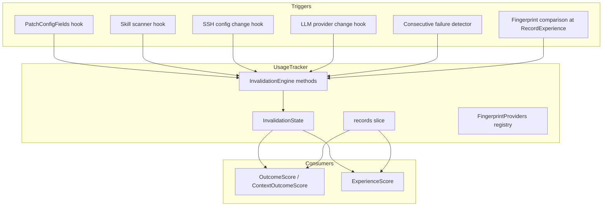

# Design Document: Tool Success Invalidation

## Overview

Tool Success Invalidation adds a decay and suppression layer to the UsageTracker so that `OutcomeScore` and `ContextOutcomeScore` reflect current tool reliability rather than stale historical performance. When tool configuration changes, skills are updated, SSH hosts are modified, or consecutive failures are detected, the system applies time-based decay to pre-invalidation records and fast-tracks broken tool demotion.

The design integrates entirely within the existing `UsageTracker` component—no separate goroutines, no new persistence files. The `InvalidationEngine` is a set of methods on `UsageTracker` that manage invalidation state, fingerprint comparison, and consecutive failure tracking, all protected by the existing `mu` mutex.

### Design Rationale

- **Lazy decay over eager deletion**: Records are never deleted; decay is computed at query time. This allows graceful recovery if an invalidation was a false alarm.
- **Fingerprint-based detection as primary mechanism**: Rather than requiring every configuration path to emit explicit events, the fingerprint comparison at `RecordExperience` time catches changes automatically.
- **Explicit event hooks as supplementary**: `PatchConfigFields`, skill scanner, and SSH config change hooks provide immediate invalidation for known high-impact changes.
- **No external dependencies**: All logic uses stdlib (crypto/sha256, encoding/json, sync, time).

## Architecture



## Components and Interfaces

### InvalidationEngine (methods on UsageTracker)

The invalidation engine is not a separate struct—it's a cohesive set of methods on `UsageTracker`:

| Method | Responsibility |
|--------|---------------|
| `ApplyInvalidation(event InvalidationEvent)` | Persists the event, updates state, triggers save |
| `InvalidateOutcomes(toolName, reason string)` | Public API for manual/programmatic invalidation |
| `checkFingerprint(toolName string)` | Compares current fingerprint against stored; emits event if changed |
| `recordConsecutiveFailure(toolName, contextKey string)` | Increments failure counter; applies suppression at threshold |
| `resetConsecutiveFailure(toolName string)` | Resets counter on success |
| `decayWeight(record UsageRecord, toolName string) float64` | Computes effective weight multiplier at query time |
| `isSuppressed(toolName, contextKey string) bool` | Checks if tool is under consecutive failure suppression |

### FingerprintProvider Interface

```go
// FingerprintProvider computes a fingerprint for a tool's current configuration state.
// Returning "" means "no fingerprint available, skip check".
type FingerprintProvider interface {
    ComputeFingerprint(toolName string) string
}
```

Registered providers:
- **ConfigFingerprintProvider**: Fingerprints tool config fields from `AppConfig` (LLM endpoint, model, API keys)
- **SkillFingerprintProvider**: Fingerprints skill version + directory mtime
- **SSHFingerprintProvider**: Fingerprints SSH host config (host:port:user:keypath)

### Integration Points

| Hook Location | Trigger Condition | Action |
|--------------|-------------------|--------|
| `PatchConfigFields` (gui/app.go) | SSH host fields or LLM provider changed | Call `tracker.InvalidateOutcomes(toolName, reason)` |
| `ScanSkillDir` result comparison | Skill version changed | Call `tracker.ApplyInvalidation(event)` with skill-scoped ScopeTokens |
| `RecordExperience` | Every tool outcome recording | Call `checkFingerprint(toolName)` before recording |
| `outcomeScoreWithCount` | Every score computation | Apply `decayWeight()` and suppression check |

## Data Models

### InvalidationEvent

```go
// InvalidationEvent represents a condition change that should decay stale outcome records.
type InvalidationEvent struct {
    ToolName    string    `json:"tool_name"`
    Timestamp   time.Time `json:"timestamp"`
    Reason      string    `json:"reason"`
    ScopeTokens []string  `json:"scope_tokens,omitempty"` // nil = global invalidation for this tool
}
```

### InvalidationState (per-tool)

```go
// ToolInvalidationState holds the invalidation metadata for a single tool.
type ToolInvalidationState struct {
    LastInvalidation *InvalidationEvent `json:"last_invalidation,omitempty"`
    LastFingerprint  string             `json:"last_fingerprint,omitempty"`
    Suppressions     []SuppressionEntry `json:"suppressions,omitempty"`
}

// SuppressionEntry tracks consecutive failure suppression for a (tool, context) pair.
type SuppressionEntry struct {
    ContextKey   string `json:"context_key"`
    FailureCount int    `json:"failure_count"`
    Active       bool   `json:"active"`
}
```

### Persistence Wrapper

```go
// UsageData is the new top-level persistence structure, replacing the flat []UsageRecord array.
type UsageData struct {
    Records      []UsageRecord                   `json:"records"`
    Invalidations map[string]ToolInvalidationState `json:"invalidations,omitempty"` // keyed by tool name
}
```

Migration: On load, if the file parses as `[]UsageRecord` (flat array), migrate to `UsageData{Records: parsed}`. If it parses as `UsageData`, use directly. This provides backward compatibility.

### Consecutive Failure Tracking

```go
// consecutiveFailureKey builds the context key for tracking:
// sorted first 3 query tokens joined by "|"
func consecutiveFailureKey(queryTokens []string) string {
    tokens := make([]string, 0, 3)
    for _, t := range queryTokens {
        tokens = append(tokens, t)
        if len(tokens) >= 3 {
            break
        }
    }
    sort.Strings(tokens)
    return strings.Join(tokens, "|")
}
```

### Fingerprint Computation

```go
// computeFingerprint generates SHA-256 truncated to 16 hex chars from sorted JSON fields.
func computeFingerprint(fields map[string]interface{}) string {
    // Sort keys lexicographically
    keys := make([]string, 0, len(fields))
    for k := range fields {
        keys = append(keys, k)
    }
    sort.Strings(keys)
    
    sorted := make(map[string]interface{}, len(fields))
    for _, k := range keys {
        sorted[k] = fields[k]
    }
    
    data, err := json.Marshal(sorted)
    if err != nil {
        return ""
    }
    hash := sha256.Sum256(data)
    return hex.EncodeToString(hash[:8]) // first 8 bytes = 16 hex chars
}
```

### Decay Formula

Applied lazily during `outcomeScoreWithCount` / `ExperienceScore`:

```go
// decayWeight computes the effective weight multiplier for a record that
// predates the most recent applicable invalidation.
//
// Formula: effective_weight = base_weight × max(0.1, 1.0 - 0.9 × min(hours_since_invalidation / 48.0, 1.0))
//
// At t=0:   multiplier = 1.0 (grace period)
// At t=24h: multiplier ≈ 0.55
// At t=48h: multiplier = 0.1 (minimum, held constant)
func (t *UsageTracker) decayMultiplier(recordTimestamp time.Time, toolName string, querySet map[string]bool) float64 {
    state, ok := t.invalidations[toolName]
    if !ok || state.LastInvalidation == nil {
        return 1.0
    }
    inv := state.LastInvalidation
    
    // Only decay records that predate the invalidation
    if !recordTimestamp.Before(inv.Timestamp) {
        return 1.0
    }
    
    // Scope check: if invalidation has ScopeTokens, only apply to matching records
    if inv.ScopeTokens != nil && querySet != nil {
        scopeSet := make(map[string]bool, len(inv.ScopeTokens))
        for _, tok := range inv.ScopeTokens {
            scopeSet[tok] = true
        }
        sim := jaccardTokens(scopeSet, keysFromSet(querySet))
        if sim < 0.3 {
            return 1.0 // scope doesn't match, no decay
        }
    }
    
    hoursSinceInvalidation := time.Since(inv.Timestamp).Hours()
    ratio := math.Min(hoursSinceInvalidation/48.0, 1.0)
    return math.Max(0.1, 1.0-0.9*ratio)
}
```

### Integration into outcomeScoreWithCount

The existing `outcomeScoreWithCount` loop gains a decay multiplier:

```go
// Before (simplified):
//   total++
//   if usageRecordSucceeded(r) { successes++ }
//
// After:
//   decay := t.decayMultiplier(r.Timestamp, toolName, querySet)
//   total += decay
//   if usageRecordSucceeded(r) { successes += decay }
//   // retry/abandon penalties also weighted by decay
```

The score computation changes from integer counting to float64 weighted accumulation. This preserves the existing formula semantics while applying decay.

### Integration into ExperienceScore

The existing `ExperienceScore` multiplies each record's contribution by `overlap * recency`. The decay multiplier is an additional factor:

```go
decay := t.decayMultiplier(r.Timestamp, toolName, querySet)
evidence := overlap * recency * decay
```

### Consecutive Failure Suppression in OutcomeScore

```go
func (t *UsageTracker) outcomeScoreWithCount(toolName string, querySet map[string]bool) (float64, int) {
    // ... existing computation ...
    
    score := successRate - retryPenalty - abandonPenalty
    score = clampFloat(score, 0, 1)
    
    // Apply consecutive failure suppression
    contextKey := "" // derived from querySet
    if querySet != nil {
        contextKey = consecutiveFailureKeyFromSet(querySet)
    }
    if t.isSuppressed(toolName, contextKey) {
        score = math.Min(score, 0.2)
    }
    
    return score, total
}
```

### Persistence Format Migration

```go
func (t *UsageTracker) load() error {
    data, err := os.ReadFile(t.path)
    if err != nil {
        return err
    }
    
    // Try new format first
    var ud UsageData
    if err := json.Unmarshal(data, &ud); err == nil && ud.Records != nil {
        t.records = ud.Records
        t.invalidations = ud.Invalidations
        if t.invalidations == nil {
            t.invalidations = make(map[string]ToolInvalidationState)
        }
        return nil
    }
    
    // Fall back to legacy flat array
    var records []UsageRecord
    if err := json.Unmarshal(data, &records); err == nil {
        t.records = records
        t.invalidations = make(map[string]ToolInvalidationState)
        return nil
    }
    
    // Unparseable: start fresh, log warning
    log.Printf("[usage-tracker] warning: cannot parse %s, starting with empty state", t.path)
    t.records = make([]UsageRecord, 0)
    t.invalidations = make(map[string]ToolInvalidationState)
    return nil
}
```

### saveSnapshot Update

```go
func (t *UsageTracker) saveSnapshot(records []UsageRecord) error {
    if t.path == "" {
        return nil
    }
    
    t.saveMu.Lock()
    defer t.saveMu.Unlock()
    
    ud := UsageData{
        Records:      records,
        Invalidations: t.invalidations, // read under saveMu, written under mu
    }
    
    data, err := json.Marshal(ud)
    if err != nil {
        return err
    }
    
    dir := filepath.Dir(t.path)
    if err := os.MkdirAll(dir, 0755); err != nil {
        return err
    }
    
    tmp := t.path + ".tmp"
    if err := os.WriteFile(tmp, data, 0644); err != nil {
        return err
    }
    return os.Rename(tmp, t.path)
}
```


## Correctness Properties

*A property is a characteristic or behavior that should hold true across all valid executions of a system—essentially, a formal statement about what the system should do. Properties serve as the bridge between human-readable specifications and machine-verifiable correctness guarantees.*

### Property 1: Decay Formula Correctness

*For any* non-negative `hours_since_invalidation` value, the decay multiplier SHALL equal `max(0.1, 1.0 - 0.9 × min(hours/48.0, 1.0))`. Specifically: at t=0 the result is 1.0, the function is monotonically non-increasing, and at t≥48 the result is exactly 0.1.

**Validates: Requirements 7.2, 7.3**

### Property 2: Post-Invalidation Records Unaffected

*For any* usage record whose Timestamp is equal to or later than the most recent applicable InvalidationEvent's Timestamp, the decay multiplier SHALL be exactly 1.0 regardless of the event's ScopeTokens, Reason, or ToolName.

**Validates: Requirements 2.5, 7.5**

### Property 3: Most Recent Invalidation Wins (No Compounding)

*For any* tool with N invalidation events (N ≥ 2), the decay multiplier for pre-invalidation records SHALL be computed using only the most recent event's Timestamp. Applying events E1 then E2 (where E2.Timestamp > E1.Timestamp) SHALL produce the same decay as applying only E2.

**Validates: Requirements 2.6, 7.4**

### Property 4: Global Invalidation Decays All Matching Records

*For any* InvalidationEvent with nil ScopeTokens applied to a tool T, all records where `record.ToolName == T` and `record.Timestamp < event.Timestamp` SHALL have decay multiplier < 1.0 (after sufficient time has passed since the invalidation).

**Validates: Requirements 2.1**

### Property 5: Scoped Invalidation Respects Jaccard Threshold

*For any* InvalidationEvent with non-nil ScopeTokens and any record, if `Jaccard(record.QueryTokens, event.ScopeTokens) < 0.3`, the decay multiplier SHALL be 1.0. If `Jaccard >= 0.3` and the record predates the event, the multiplier SHALL be < 1.0 (after sufficient time).

**Validates: Requirements 2.2**

### Property 6: Fingerprint State Machine

*For any* tool with a registered FingerprintProvider: (a) the first-ever recording stores the fingerprint without generating an event; (b) a subsequent recording where the fingerprint differs from the stored value generates an InvalidationEvent before recording; (c) after any successful comparison, the stored LastFingerprint equals the current provider output.

**Validates: Requirements 3.3, 3.4, 3.7**

### Property 7: Consecutive Failure Suppression State Machine

*For any* tool and context key: (a) accumulating 3+ consecutive failures (no intervening success) activates suppression; (b) recording a success in any context resets the failure count for that tool; (c) failures in context key A do not affect suppression status of context key B for the same tool.

**Validates: Requirements 4.1, 4.3, 4.4, 4.5**

### Property 8: Suppression Caps Score

*For any* tool under active consecutive failure suppression, `OutcomeScore` and `ContextOutcomeScore` SHALL return a value ≤ 0.2, regardless of the tool's historical success rate.

**Validates: Requirements 4.2**

### Property 9: Records Never Deleted or Mutated by Invalidation

*For any* sequence of InvalidationEvents applied to the tracker, the number of UsageRecords SHALL remain unchanged, and each record's fields (ToolName, QueryTokens, Success, FollowUp, Timestamp) SHALL be identical to their original values.

**Validates: Requirements 7.1, 7.6**

### Property 10: Persistence Round-Trip

*For any* valid UsageTracker state (records + invalidation states + suppressions + fingerprints), serializing to JSON and deserializing SHALL produce an equivalent state where: record count is preserved, all invalidation timestamps match, all suppression entries match, and all fingerprints match.

**Validates: Requirements 5.3**

### Property 11: InvalidateOutcomes Concurrency Safety

*For any* N concurrent goroutines calling `InvalidateOutcomes` on the same tracker with different tool names and reasons, the final state SHALL contain exactly N invalidation entries (one per tool), with no data races detected by the Go race detector.

**Validates: Requirements 6.4**

### Property 12: Config Change Triggers Invalidation for Tool-Affecting Fields

*For any* config patch containing SSH host fields (host, port, user, key_path) or LLM provider field changes, `InvalidateOutcomes` SHALL be called for the affected tool(s). Config patches containing only non-tool fields (e.g., ui_zoom_factor, chat_font_size) SHALL NOT trigger any invalidation.

**Validates: Requirements 1.1**

## Error Handling

| Scenario | Behavior |
|----------|----------|
| FingerprintProvider panics | `recover()` in `checkFingerprint`, log error, skip fingerprint check, continue recording |
| FingerprintProvider returns "" | Skip fingerprint comparison for this tool, do not update LastFingerprint |
| JSON marshal failure during save | Log error, return error from `saveSnapshot`, tracker remains usable in memory |
| Disk write failure (permissions, space) | Log error, tracker continues in memory; next save attempt may succeed |
| Corrupted invalidation section in JSON file | Parse records normally, start with empty invalidation state, log warning |
| Missing storage file on startup | Start with empty state for everything, log info |
| `InvalidateOutcomes` called for non-existent tool | Create new ToolInvalidationState entry with the event, persist normally |
| Concurrent `RecordExperience` + `InvalidateOutcomes` | Both acquire `mu.Lock()` sequentially; fingerprint check runs under lock; no data races |
| Decay computation with zero-time invalidation event | `time.Since(event.Timestamp)` may be slightly negative due to clock skew; treat as t=0, multiplier=1.0 |

## Testing Strategy

### Property-Based Testing

**Library**: `pgregory.net/rapid` (already used in the project for memory package property tests)

**Configuration**: Minimum 100 iterations per property test.

**Tag format**: `Feature: tool-success-invalidation, Property {number}: {property_text}`

Each of the 12 correctness properties above will be implemented as a single property-based test using `rapid.Check`. Key generators:

- **UsageRecord generator**: Random tool name (from fixed pool of 10), random query tokens (1-5 tokens from word pool), random success/followUp, random timestamp within ±30 days
- **InvalidationEvent generator**: Random tool name, random timestamp, random reason string, optional ScopeTokens (nil or 1-4 tokens)
- **Config patch generator**: Random field names (mix of tool-affecting and non-tool-affecting), random values
- **Fingerprint generator**: Random hex strings of length 16

### Unit Tests (Example-Based)

- Decay formula spot checks: t=0, t=12h, t=24h, t=36h, t=48h, t=72h
- Persistence migration: flat `[]UsageRecord` file → `UsageData` wrapper
- Persistence migration: malformed invalidation section → graceful degradation
- LLM provider switch → exactly 3 events for fixed tool set
- Skill version change → scoped event with skill name in ScopeTokens
- `consecutiveFailureKey` with various token counts (0, 1, 3, 5 tokens)
- Suppression auto-lift when all failures age out of 7-day window
- `computeFingerprint` determinism with reordered keys

### Integration Tests

- End-to-end: `PatchConfigFields` with SSH host change → verify `OutcomeScore` drops for that host context
- End-to-end: `RecordExperience` with fingerprint change → verify decay applied to subsequent score queries
- File round-trip: write state, read back, verify equivalence
- Backward compat: load legacy flat array file, verify migration produces valid `UsageData`
