# 设计文档：TUI/CLI 与 GUI 功能对齐

## 概述

本设计将 TUI Agent（`tui/agent_handler.go`）从当前 6 个工具扩展到 40+ 个工具，并补全 CLI 子命令缺失的功能。核心策略：所有新增工具和命令仅作为 corelib 模块的薄包装层，不引入新的业务逻辑。

变更范围：
- `tui/agent_handler.go` — 扩展 `buildToolDefinitions()` 和 `executeTool()`，集成 Firewall + Router
- `tui/app.go` — 初始化 Firewall、SessionMonitor、DefinitionGenerator、Router
- `tui/commands/clawnet.go` — 补全任务生命周期、身份、排行榜、auto-picker、daemon 管理
- `tui/commands/mcp.go` — 新增 health-check、tools、call-tool
- `tui/commands/nlskill.go` — 新增 execute
- `tui/commands/skillhub.go` — 新增 check-updates、update
- `tui/commands/llm.go` — 新增 set-max-iterations、get-max-iterations

## 架构

```mermaid
graph TD
    subgraph TUI
        AH[agent_handler.go<br/>40+ tools]
        APP[app.go<br/>Kernel + Firewall + Router]
        SM[session_manager.go]
        CLI[commands/*.go]
    end

    subgraph corelib
        FW[security/Firewall]
        RA[security/RiskAnalyzer]
        PE[security/PolicyEngine]
        AL[security/AuditLog]
        LR[security/LLMReview]
        RT[tool/Router]
        DG[tool/DefinitionGenerator]
        SEL[tool/Selector]
        CM[config/Manager]
        MS[memory/Store]
        SCH[scheduler/Manager]
        MON[remote/SessionMonitor]
        SS[remote/screenshot]
        CN[clawnet/Client]
        ATP[clawnet/AutoTaskPicker]
        NM[clawnet/NutshellManager]
    end

    AH -->|Check| FW
    AH -->|Route| RT
    AH -->|Generate| DG
    AH -->|Recommend| SEL
    AH -->|Config| CM
    AH -->|Memory| MS
    AH -->|Schedule| SCH
    AH -->|Sessions| SM
    AH -->|Screenshot| SS
    AH -->|ClawNet| CN
    APP -->|Init| FW
    APP -->|Init| MON
    APP -->|Init| RT
    CLI -->|Wrap| CN
    CLI -->|Wrap| ATP
    CLI -->|Wrap| NM
    CLI -->|Wrap| CM
```



核心设计决策：
1. **Firewall 拦截点**：在 `executeTool()` 入口处统一调用 `Firewall.Check()`，拒绝时将原因作为 tool result 返回给 LLM
2. **Router 集成点**：在 `RunAgentLoop()` 中，当工具总数 > 28 时调用 `Router.Route(userMessage, allTools)` 裁剪
3. **DefinitionGenerator 集成**：替换硬编码的 `buildToolDefinitions()`，改为 `DefinitionGenerator.Generate()` 动态合并 builtin + MCP 工具
4. **onAsk 回调**：TUI 模式下通过 stdin 读取 y/n 实现用户确认；CLI 模式下默认拒绝高风险操作

## 组件与接口

### 1. agent_handler.go 扩展

当前 `buildToolDefinitions()` 返回 6 个硬编码工具。改为：

```go
// TUIAgentHandler 新增字段
type TUIAgentHandler struct {
    sessionMgr    *TUISessionManager
    httpClient    *http.Client
    firewall      *security.Firewall      // 安全防火墙
    defGenerator  *tool.DefinitionGenerator // 动态工具定义
    router        *tool.Router             // 智能路由
    selector      *tool.Selector           // 工具推荐
    configMgr     *config.Manager          // 配置管理
    memoryStore   *memory.Store            // 记忆存储
    schedulerMgr  *scheduler.Manager       // 定时任务
    clawnetClient *clawnet.Client          // ClawNet
    auditLog      *security.AuditLog       // 审计日志
    maxIterations int                      // 可配置迭代上限
}
```

`executeTool()` 改为：
```go
func (h *TUIAgentHandler) executeTool(name, argsJSON string) string {
    // 1. 解析参数
    // 2. Firewall.Check() — 拒绝则返回拒绝原因
    // 3. 执行对应工具
    // 4. AuditLog.Log()
}
```

新增工具列表（按需求分组）：

| 需求 | 工具名 | corelib 调用 |
|------|--------|-------------|
| R1 | create_session | SessionMgr.Create() |
| R1 | get_session_output | SessionMgr.Get() → PreviewLines |
| R1 | get_session_events | SessionMgr.Get() → Events |
| R1 | interrupt_session | SessionMgr.Interrupt() |
| R1 | kill_session | SessionMgr.Kill() |
| R1 | send_and_observe | SessionMgr.WriteInput() + sleep + Get() |
| R1 | control_session | SessionMgr pause/resume/restart |
| R2 | get_config | ConfigManager.GetConfig() |
| R2 | update_config | ConfigManager.UpdateConfig() |
| R2 | batch_update_config | ConfigManager.BatchUpdate() |
| R2 | list_config_schema | ConfigManager.GetSchema() |
| R2 | export_config | ConfigManager.ExportConfig() |
| R2 | import_config | ConfigManager.ImportConfig() |
| R3 | create_template | scheduler file-based |
| R3 | list_templates | scheduler file-based |
| R3 | launch_template | SessionMgr.Create(fromTemplate) |
| R4 | create_scheduled_task | scheduler.Manager.Add() |
| R4 | list_scheduled_tasks | scheduler.Manager.List() |
| R4 | delete_scheduled_task | scheduler.Manager.Delete() |
| R4 | update_scheduled_task | scheduler.Manager.Update() |
| R5 | memory | MemoryStore.Save/List/Search/Delete() |
| R6 | list_mcp_tools | MCPServerProvider.ListServers/GetServerTools() |
| R6 | call_mcp_tool | MCP tool forwarding |
| R7 | list_skills | local skill list |
| R7 | search_skill_hub | SkillHub search |
| R7 | install_skill_hub | SkillHub install |
| R7 | run_skill | skill execution |
| R8 | clawnet_search | ClawNet_Client.SearchKnowledge() |
| R8 | clawnet_publish | ClawNet_Client.PublishKnowledge() |
| R9 | query_audit_log | AuditLog.Query() |
| R10 | send_file | SessionMgr.WriteInput(fileContent) |
| R10 | parallel_execute | goroutine fan-out |
| R10 | switch_llm_provider | ConfigManager.UpdateConfig() |
| R10 | set_max_iterations | update maxIterations field |
| R10 | recommend_tool | Selector.Recommend() |
| R10 | screenshot | remote.CaptureScreenshot() |

### 2. app.go 初始化扩展

```go
func (a *TUIApp) initKernel() tea.Msg {
    // ... existing kernel init ...

    // 新增：安全组件
    riskAnalyzer := security.NewRiskAnalyzer()
    policyEngine := security.NewPolicyEngine()
    auditLog, _ := security.NewAuditLog(dataDir + "/audit")
    firewall := security.NewFirewall(riskAnalyzer, policyEngine, auditLog)

    // 新增：SessionMonitor
    statusCh := make(chan agent.StatusEvent, 32)
    sessionMonitor := remote.NewSessionMonitor(a.sessionMgr, statusCh, 20*time.Second)

    // 新增：DefinitionGenerator + Router
    builtinDefs := buildAllToolDefinitions()
    defGen := tool.NewDefinitionGenerator(mcpProvider, builtinDefs)
    router := tool.NewRouter(defGen)

    // 存储到 TUIApp
    a.firewall = firewall
    a.sessionMonitor = sessionMonitor
    a.router = router
    a.defGenerator = defGen
}
```

### 3. CLI 命令扩展

**tui/commands/clawnet.go** 新增子命令：
- `tasks bid/assign/claim/submit/approve/reject/cancel/board/submissions/pick-winner`
- `identity has-identity/export-identity/import-identity/backup-key/restore-key`
- `leaderboard` / `transactions` / `credits-audit`
- `auto-picker status/configure/trigger`
- `daemon ensure/stop/info`
- `binary install/update/path`
- `profile get/update/set-motto`

**tui/commands/mcp.go** 新增子命令：
- `health-check` / `tools` / `call-tool`

**tui/commands/nlskill.go** 新增子命令：
- `execute <name>`

**tui/commands/skillhub.go** 新增子命令：
- `check-updates` / `update <name>`

**tui/commands/llm.go** 新增子命令：
- `set-max-iterations <n>` / `get-max-iterations`

## 数据模型

无新增数据模型。所有数据结构复用 corelib 已有类型：

- `security.AuditEntry` — 审计日志条目
- `security.AuditFilter` — 审计查询过滤器
- `security.RiskAssessment` — 风险评估结果
- `config.ConfigSection` / `config.ConfigKeySchema` — 配置模式
- `config.ConfigChange` / `config.ImportReport` — 配置变更
- `memory.Entry` / `memory.Category` — 记忆条目
- `scheduler.ScheduledTask` — 定时任务
- `clawnet.Task` / `clawnet.Credits` / `clawnet.KnowledgeEntry` — ClawNet 数据
- `clawnet.AutoTaskPicker` status map — 自动拾取状态
- `remote.LaunchSpec` / `remote.SessionStatus` — 会话规格
- `tool.Profile` — 工具能力画像（Selector 用）

Agent 工具调用的参数和返回值均为 `map[string]interface{}` JSON 序列化，与 LLM function calling 协议一致。

