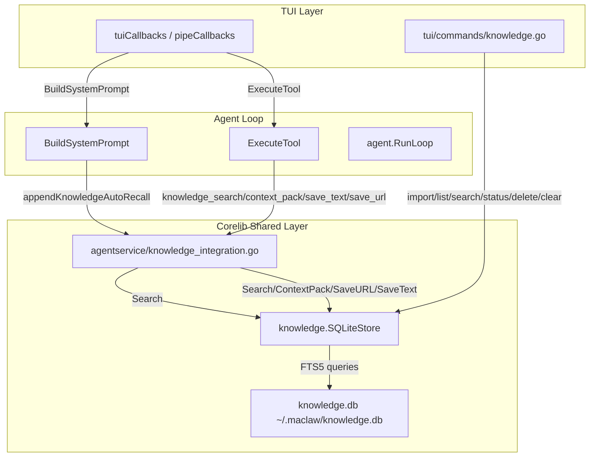

# Design Document: TUI Knowledge Base Integration

## Overview

This feature integrates the existing `corelib/knowledge.SQLiteStore` into the TUI, providing two capabilities:

1. **Auto-Recall**: Automatic RAG retrieval that searches the knowledge base on every user message and injects relevant snippets into the system prompt before the agent loop runs.
2. **Knowledge CLI**: A `maclaw-tui knowledge` subcommand group for importing files/directories, searching, listing sources, and managing the knowledge base from the terminal.

The design reuses the shared `agentservice.KnowledgeStore` interface pattern and `appendKnowledgeAutoRecall` logic already implemented in `corelib/agentservice/knowledge_integration.go`. The TUI does not reimplement any knowledge logic — it wires existing corelib components into the TUI's `agent.RunLoop` callbacks and CLI command infrastructure.

## Architecture



### Key Design Decisions

1. **Cached store connection**: A single `*knowledge.SQLiteStore` instance is opened at TUI startup (if `~/.maclaw/knowledge.db` exists) and held for the process lifetime. This mirrors the GUI's `knowledgeAutoRecallStore` pattern, avoiding open/close overhead per message.

2. **Graceful degradation**: If the database file does not exist, the store pointer remains nil. All code paths check for nil before accessing the store — auto-recall is skipped, tools return descriptive errors, and CLI commands print "knowledge base not initialized" with guidance.

3. **Shared tool handlers via ExtraHandlers**: Knowledge tools (`knowledge_search`, `knowledge_context_pack`, `knowledge_save_text`, `knowledge_save_url`) are registered through `CoreToolDeps.ExtraHandlers` — the same extension mechanism used by `manage_skill` and `screenshot`. This avoids modifying `RegisterCoreTools` or `CoreToolDeps` struct.

4. **CLI reuses SQLiteStore directly**: The `maclaw-tui knowledge` CLI commands operate on `knowledge.SQLiteStore` directly (not through the agent loop), similar to how `tui/commands/memory.go` operates on `memory.Store` directly.

## Components and Interfaces

### 1. TUIApp Knowledge Store Initialization (`tui/app.go`)

```go
// TUIApp struct addition
type TUIApp struct {
    // ... existing fields ...
    knowledgeStore *knowledge.SQLiteStore // cached, nil if DB doesn't exist
}

// initKnowledgeStore opens the knowledge DB if it exists.
// Called during runTUI startup, after dataDir is resolved.
func (app *TUIApp) initKnowledgeStore(dataDir string) {
    dbPath := filepath.Join(dataDir, "knowledge.db")
    if _, err := os.Stat(dbPath); os.IsNotExist(err) {
        return // graceful skip
    }
    store, err := knowledge.NewSQLiteStore(dbPath)
    if err != nil {
        log.Printf("[knowledge] failed to open store: %v", err)
        return
    }
    app.knowledgeStore = store
}
```

### 2. Auto-Recall Integration (`tui/app.go` — `buildSystemPromptDeps`)

```go
func (app *TUIApp) buildSystemPromptDeps() agent.SystemPromptDeps {
    // ... existing code ...
    deps := agent.SystemPromptDeps{
        Config: agent.SystemPromptConfig{
            // ... existing fields ...
            HasKnowledgeBase: app.knowledgeStore != nil,
        },
        // ...
    }

    // Knowledge auto-recall hook
    if app.knowledgeStore != nil {
        deps.KnowledgeAutoRecall = func(b *strings.Builder, userMsg string) {
            app.appendKnowledgeAutoRecall(b, userMsg)
        }
    }

    return deps
}
```

The `appendKnowledgeAutoRecall` method on `TUIApp` mirrors the logic in `corelib/agentservice/knowledge_integration.go`:
- Truncates user message to 200 runes
- Executes search with 3-second timeout
- Filters results by score threshold 0.3
- Injects up to 3 snippets under "知识库参考（自动检索）" section

### 3. Knowledge Tool Registration (`tui/app.go` — tool setup)

Knowledge tools are registered via `CoreToolDeps.ExtraHandlers`:

```go
extraHandlers := map[string]agent.ToolHandler{
    // ... existing handlers (manage_skill, screenshot, etc.) ...
    "knowledge_search":       app.toolKnowledgeSearch,
    "knowledge_context_pack": app.toolKnowledgeContextPack,
    "knowledge_save_text":    app.toolKnowledgeSaveText,
    "knowledge_save_url":     app.toolKnowledgeSaveURL,
}
```

Each handler delegates to the corresponding `agentservice` helper functions (`executeKnowledgeSearch`, etc.) or reimplements the same logic locally using the cached `app.knowledgeStore`.

### 4. Knowledge Tool Definitions

Four new `ToolEntry` registrations in `RegisterCoreTools`:

| Tool Name | Description | Required Params |
|-----------|-------------|-----------------|
| `knowledge_search` | FTS search against knowledge base | `query` |
| `knowledge_context_pack` | Build citation-backed context bundle | `query` |
| `knowledge_save_text` | Save text as new knowledge source | `text` |
| `knowledge_save_url` | Fetch URL and save as knowledge source | `url` |

### 5. Knowledge CLI (`tui/commands/knowledge.go`)

```go
// RunKnowledge executes the knowledge subcommand group.
func RunKnowledge(args []string, dataDir string) error {
    if len(args) == 0 {
        return NewUsageError("usage: maclaw-tui knowledge <import|list|search|status|delete|clear>")
    }
    switch args[0] {
    case "import":
        return knowledgeImport(dataDir, args[1:])
    case "list":
        return knowledgeList(dataDir, args[1:])
    case "search":
        return knowledgeSearch(dataDir, args[1:])
    case "status":
        return knowledgeStatus(dataDir)
    case "delete":
        return knowledgeDelete(dataDir, args[1:])
    case "clear":
        return knowledgeClear(dataDir, args[1:])
    default:
        return NewUsageError("unknown knowledge command: " + args[0])
    }
}
```

#### Import Subcommand

`knowledgeImport` handles both file and directory paths:

```go
func knowledgeImport(dataDir string, args []string) error {
    fs := flag.NewFlagSet("knowledge import", flag.ExitOnError)
    project := fs.String("project", "", "Associate with project path")
    labels := fs.String("labels", "", "Comma-separated labels")
    scope := fs.String("scope", "project", "Save scope: project|personal|local_only")
    includeExts := fs.String("include-exts", "", "Override extension filter (comma-separated)")
    dryRun := fs.Bool("dry-run", false, "Scan only, don't import")
    jsonOutput := fs.Bool("json", false, "Output JSON format")
    fs.Parse(args)

    paths := fs.Args()
    if len(paths) == 0 {
        return NewUsageError("usage: maclaw-tui knowledge import [flags] <path...>")
    }
    // ... open store, detect file vs directory, dispatch ...
}
```

- **File path**: Calls `store.ImportFiles(ctx, []string{path}, opts)` for each file
- **Directory path**: Calls `store.ImportDirectory(ctx, DirectoryImportRequest{...})`
- **Multiple paths**: Processes sequentially, reports per-path results

## Data Models

### Existing Types (no changes needed)

| Type | Package | Usage |
|------|---------|-------|
| `knowledge.SQLiteStore` | `corelib/knowledge` | Main store, opened once per TUI process |
| `knowledge.SearchOptions` | `corelib/knowledge` | FTS search parameters |
| `knowledge.SearchResult` | `corelib/knowledge` | Ranked search result with score |
| `knowledge.ContextPackOptions` | `corelib/knowledge` | Context pack build parameters |
| `knowledge.ContextPackResult` | `corelib/knowledge` | Budgeted context bundle |
| `knowledge.DirectoryImportRequest` | `corelib/knowledge` | Directory import configuration |
| `knowledge.DirectoryImportResult` | `corelib/knowledge` | Import summary with per-file status |
| `knowledge.Source` | `corelib/knowledge` | Persisted knowledge source |
| `knowledge.Stats` | `corelib/knowledge` | Database statistics |
| `knowledge.DefaultIncludeExts` | `corelib/knowledge` | Default file extension filter |

### New Types

```go
// tui/commands/knowledge.go

// knowledgeImportResult is the per-file result for JSON output.
type knowledgeImportResult struct {
    Path     string `json:"path"`
    Status   string `json:"status"` // "imported", "skipped_duplicate", "failed", "unsupported"
    SourceID string `json:"source_id,omitempty"`
    Nodes    int    `json:"nodes,omitempty"`
    Error    string `json:"error,omitempty"`
}

// knowledgeImportSummary is the aggregate result for JSON output.
type knowledgeImportSummary struct {
    TotalFiles   int                    `json:"total_files"`
    Imported     int                    `json:"imported"`
    Skipped      int                    `json:"skipped"`
    Failed       int                    `json:"failed"`
    Results      []knowledgeImportResult `json:"results,omitempty"`
}
```


## Correctness Properties

*A property is a characteristic or behavior that should hold true across all valid executions of a system — essentially, a formal statement about what the system should do. Properties serve as the bridge between human-readable specifications and machine-verifiable correctness guarantees.*

### Property 1: Auto-recall injection respects threshold and count limit

*For any* set of knowledge search results (0–20 results with scores in range 0.0–5.0), the auto-recall function SHALL inject only results with score >= 0.3, inject at most 3 snippets, and include the section header "知识库参考（自动检索）" if and only if at least one result qualifies.

**Validates: Requirements 1.1, 1.4**

### Property 2: Query truncation preserves short messages and caps long ones

*For any* user message string, the query passed to the knowledge store's Search method SHALL have at most 200 runes. Messages with <= 200 runes SHALL be passed unchanged; messages with > 200 runes SHALL be truncated to exactly 200 runes.

**Validates: Requirements 1.3**

### Property 3: HasKnowledgeBase reflects store initialization state

*For any* TUIApp configuration, `SystemPromptDeps.Config.HasKnowledgeBase` SHALL be `true` if and only if `app.knowledgeStore != nil`. When the knowledge database file does not exist, the store SHALL be nil and HasKnowledgeBase SHALL be false.

**Validates: Requirements 1.5, 7.1**

### Property 4: File import success summary contains all required fields

*For any* successful file import (random file name, random source ID, random node count >= 0), the printed summary SHALL contain the file name, the source ID, and the node count.

**Validates: Requirements 3.3**

### Property 5: Directory import summary contains all statistics

*For any* `DirectoryImportResult` (random total/imported/skipped/failed counts where total = imported + skipped + failed), the printed summary SHALL contain all four statistics: total files found, files imported, files skipped, and files failed.

**Validates: Requirements 4.3**

### Property 6: Multiple file import processes all paths sequentially

*For any* list of 1–10 file paths, the import command SHALL invoke the store's import method for each path in order, and the output SHALL contain a per-file result entry for every input path.

**Validates: Requirements 3.1, 3.6**

### Property 7: JSON output mode produces valid structured JSON

*For any* import result (random counts and per-file statuses), when the `--json` flag is active, the output SHALL be valid JSON that deserializes into the expected `knowledgeImportSummary` structure with correct field values.

**Validates: Requirements 5.6**

### Property 8: CLI list output contains all required columns per source

*For any* list of 0–20 `knowledge.Source` entries (random ID, Kind, Title, Status, NodeCount, CardCount, UpdatedAt), the `knowledge list` output SHALL contain all column headers (ID, Kind, Title/Path, Status, Nodes, Cards, Updated) and each source's data SHALL appear in the output.

**Validates: Requirements 6.1**

### Property 9: CLI search output contains score, source, and snippet per result

*For any* set of 1–10 `knowledge.SearchResult` entries (random scores, source titles, snippets), the `knowledge search` output SHALL contain the score, source identifier, and snippet text for each result.

**Validates: Requirements 6.2**

## Error Handling

### Auto-Recall Errors

| Scenario | Handling |
|----------|----------|
| Knowledge DB file doesn't exist | `knowledgeStore` remains nil; auto-recall skipped silently |
| Store open fails (corrupt DB, permissions) | Log warning; `knowledgeStore` remains nil |
| Search times out (>3s) | Context cancelled; auto-recall returns empty (no injection) |
| Search returns error | Log error; auto-recall returns empty |

### Tool Handler Errors

| Scenario | Response to LLM |
|----------|-----------------|
| Store is nil (not initialized) | `"Error: knowledge base is not configured. Import documents first with: maclaw-tui knowledge import <path>"` |
| Search/ContextPack fails | `"Error: knowledge search failed: <error detail>"` |
| SaveURL fails (network, invalid URL) | `"Error: failed to save URL: <error detail>"` |
| SaveText with empty text | `"Error: text parameter is required"` |

### CLI Errors

| Scenario | Behavior |
|----------|----------|
| File not found | Print error with path; exit code 1 |
| Unsupported format | Print error listing supported formats; exit code 1 |
| Directory not found | Print error with path; exit code 1 |
| DB open failure | Print error with guidance; exit code 1 |
| Delete without --force | Prompt for confirmation; abort on "n" |
| Import partial failure | Continue remaining files; report per-file status; exit code 0 if any succeeded |

## Testing Strategy

### Property-Based Tests (fast-check style, Go testing/quick)

Property-based testing is appropriate for this feature because:
- Auto-recall has clear input/output behavior (user message + search results → injected snippets)
- CLI formatters are pure functions (data → formatted string)
- Input space is large (arbitrary strings, arbitrary result sets, arbitrary file paths)

**Library**: Go's `testing/quick` (already used in the project, see `corelib/skill/skill_5patterns_test.go`)

**Configuration**: Minimum 100 iterations per property test.

**Tag format**: `// Feature: tui-knowledge-base, Property N: <property text>`

Each correctness property above maps to a single property-based test:

1. `TestProperty1_AutoRecallThresholdAndCount` — generates random `[]SearchResult`, verifies injection rules
2. `TestProperty2_QueryTruncation` — generates random strings, verifies rune count invariant
3. `TestProperty3_HasKnowledgeBaseReflectsState` — generates random nil/non-nil store, verifies flag
4. `TestProperty4_FileImportSummaryFields` — generates random import results, verifies output format
5. `TestProperty5_DirectoryImportSummaryFields` — generates random DirectoryImportResult, verifies output
6. `TestProperty6_MultipleFileImportSequential` — generates random path lists, verifies per-path processing
7. `TestProperty7_JSONOutputValid` — generates random results, verifies JSON validity
8. `TestProperty8_ListOutputColumns` — generates random Source slices, verifies column presence
9. `TestProperty9_SearchOutputFields` — generates random SearchResult slices, verifies field presence

### Unit Tests (example-based)

- Auto-recall with nil store → no-op
- Auto-recall with empty user message → no-op
- Knowledge DB file doesn't exist → graceful skip
- Tool handlers with nil store → descriptive error
- Import unsupported file format → error with supported list
- Delete without --force → confirmation prompt
- --dry-run flag propagation
- --project, --labels, --scope flag propagation

### Integration Tests

- End-to-end: import a real .txt file → search for content → verify result
- End-to-end: import directory with mixed formats → verify summary counts
- System prompt with HasKnowledgeBase=true contains knowledge tool guidance

### Test File Locations

- `tui/knowledge_autorecall_test.go` — property tests 1-3
- `tui/commands/knowledge_test.go` — property tests 4-9, unit tests for CLI
- `tui/knowledge_tools_test.go` — unit tests for tool handlers
