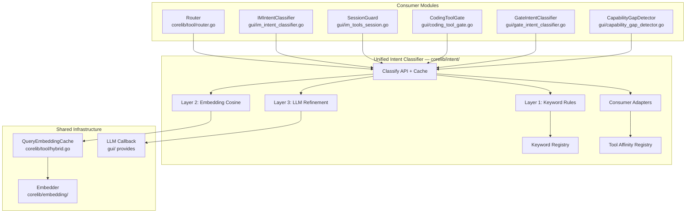
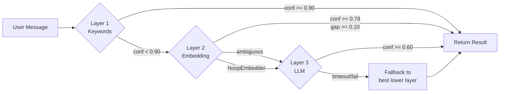

# Design Document: Unified Intent Classifier (UIC)

## Overview

The Unified Intent Classifier replaces 6+ scattered keyword-based intent classification modules with a single, shared three-layer pipeline. It generalizes the existing `GateIntentClassifier` architecture (keywords → embedding cosine → LLM) into a service that all consumers share, producing one `ClassificationResult` per user message.

The UIC lives in a new package `corelib/intent/` to keep it decoupled from both `gui/` (desktop app) and `corelib/tool/` (tool routing). Consumers access it through adapter methods that translate the unified result into their existing output types (`taskIntentResult`, `GateIntentResult`, `conditionalKeepRules` matches).

### Key Design Decisions

1. **New package `corelib/intent/`** rather than `gui/` — the classifier is pure logic with no GUI dependency. The `gui/` package wires it and provides the LLM callback.
2. **Per-message cache keyed by message text** — simple `sync.Map` with manual invalidation after each message cycle. No TTL needed since the cache is cleared explicitly.
3. **Reuse existing `QueryEmbeddingCache`** from `corelib/tool/hybrid.go` for Layer 2 query embeddings, avoiding duplicate embedding computations across UIC and the existing `IntentClassifier`.
4. **Declarative keyword registry** in a separate file (`corelib/intent/keyword_registry.go`) — keywords are data, not code. Each entry specifies intent label and strength (strong/weak).
5. **Consumer adapters as methods on `UnifiedIntentClassifier`** — `ToTaskIntent()`, `ToGateIntent()`, `ToToolAffinity()` — so consumers don't need to understand the full `ClassificationResult`.
6. **LLM Layer 3 timeout defaults to 8 seconds** — configurable via `LLMTimeout` field. Third-party API providers (智谱 GLM, etc.) have higher latency than Anthropic; 3 seconds caused frequent timeouts in the existing `GateIntentClassifier`.

## Architecture



### Pipeline Flow



## Components and Interfaces

### Core Types (`corelib/intent/types.go`)

```go
package intent

// IntentLabel represents a classified user intent.
type IntentLabel string

const (
    LabelCoding           IntentLabel = "coding"
    LabelSSH              IntentLabel = "ssh"
    LabelNonCoding        IntentLabel = "non_coding"
    LabelBrowser          IntentLabel = "browser"
    LabelSearch           IntentLabel = "search"
    LabelDocumentDelivery IntentLabel = "document_delivery"
    LabelBugFix           IntentLabel = "bug_fix"
    LabelContinuation     IntentLabel = "continuation"
    LabelMaintenance      IntentLabel = "maintenance"
    LabelOffice           IntentLabel = "office"
    LabelAmbiguous        IntentLabel = "ambiguous"
    LabelUnknown          IntentLabel = "unknown"
)

// AllLabels returns the complete set of valid intent labels.
func AllLabels() []IntentLabel { ... }

// IsValid returns true if the label is in the taxonomy.
func (l IntentLabel) IsValid() bool { ... }

// KeywordStrength indicates how strongly a keyword signals an intent.
type KeywordStrength int

const (
    Strong KeywordStrength = iota // single match → high confidence
    Weak                          // needs additional signal or Layer 2 confirmation
)

// KeywordEntry is a single entry in the keyword registry.
type KeywordEntry struct {
    Keyword  string
    Label    IntentLabel
    Strength KeywordStrength
}

// ClassificationResult is the structured output of the UIC.
type ClassificationResult struct {
    Primary     IntentLabel            // exactly one primary intent
    Confidence  float64                // [0, 1]
    Secondary   []IntentLabel          // zero or more secondary intents
    ToolNames   []string               // tool names to activate (from Tool Affinity)
    Layer       int                    // 1, 2, or 3
    Reason      string                 // human-readable explanation
}

// MessageContext is the input to the classifier.
type MessageContext struct {
    Text          string   // current user message text
    UserID        string   // for conversation context lookup
    RecentHistory []string // recent conversation messages (for continuation detection)
}

// LLMClassifyFunc is a callback for Layer 3 LLM classification.
// The caller (gui/) provides this based on their LLM config.
// Must respect the provided timeout via context.
type LLMClassifyFunc func(systemPrompt, userText string) (string, error)
```

### Unified Intent Classifier (`corelib/intent/classifier.go`)

```go
package intent

// UnifiedIntentClassifier is the single entry point for all user-intent
// classification. It implements a three-layer pipeline:
//   Layer 1: keyword rules (fast path, <1ms)
//   Layer 2: embedding cosine similarity (~5ms)
//   Layer 3: LLM refinement (up to LLMTimeout)
type UnifiedIntentClassifier struct {
    registry    *KeywordRegistry
    affinity    *ToolAffinityRegistry
    embedder    embedding.Embedder
    queryCache  *tool.QueryEmbeddingCache
    anchors     []intentAnchor
    llmFunc     LLMClassifyFunc
    LLMTimeout  time.Duration // default 8s, configurable

    // Per-message cache: cleared after each message processing cycle.
    cache       sync.Map // map[string]*ClassificationResult

    ready       bool
    mu          sync.RWMutex
}

// Config holds initialization parameters.
type Config struct {
    Embedder   embedding.Embedder
    LLMFunc    LLMClassifyFunc
    LLMTimeout time.Duration // 0 → default 8s
}

// New creates a UnifiedIntentClassifier. Starts background anchor warmup.
func New(cfg Config) *UnifiedIntentClassifier { ... }

// Classify returns the ClassificationResult for the given message.
// Results are cached per message text; subsequent calls with the same
// text return the cached result without recomputation.
func (u *UnifiedIntentClassifier) Classify(msg MessageContext) ClassificationResult { ... }

// InvalidateCache clears the per-message cache. Called once per message
// processing cycle by the consumer (e.g., after IMMessageHandler finishes).
func (u *UnifiedIntentClassifier) InvalidateCache() { ... }

// Ready returns true when Layer 2 anchor embeddings are warmed up.
func (u *UnifiedIntentClassifier) Ready() bool { ... }

// SetLLMFunc sets or replaces the Layer 3 LLM callback.
func (u *UnifiedIntentClassifier) SetLLMFunc(fn LLMClassifyFunc) { ... }

// DiagnoseScores returns all Layer 2 scores for debugging.
// No side effects, no caching.
func (u *UnifiedIntentClassifier) DiagnoseScores(text string) map[IntentLabel]float64 { ... }
```

### Keyword Registry (`corelib/intent/keyword_registry.go`)

```go
package intent

// KeywordRegistry holds all keyword entries organized by IntentLabel.
// This is the single source of truth for all keyword-based classification.
type KeywordRegistry struct {
    entries     []KeywordEntry
    byLabel     map[IntentLabel][]KeywordEntry
    strongIndex map[string]IntentLabel // keyword → label for strong keywords
}

// NewKeywordRegistry creates the registry from the consolidated keyword list.
func NewKeywordRegistry() *KeywordRegistry { ... }

// Match returns all matching keyword entries for the given text.
func (r *KeywordRegistry) Match(text string) []KeywordMatch { ... }

// KeywordMatch represents a keyword hit during classification.
type KeywordMatch struct {
    Entry    KeywordEntry
    Position int // byte offset in text
}
```

The keyword data itself is defined as a `var defaultKeywords = []KeywordEntry{...}` in the same file, consolidating all keywords from:

| Source File | Legacy Variable | Maps To |
|---|---|---|
| `router.go` | `sshIntentKeywords` | `LabelSSH` (Strong) |
| `router.go` | `searchIntentKeywords` | `LabelSearch` (Strong) |
| `router.go` | `documentDeliveryKeywords` | `LabelDocumentDelivery` (Strong) |
| `router.go` | `browserIntentKeywords` | `LabelBrowser` (Strong) |
| `router.go` | `browserPageKeywords` + `browserActionKeywords` | `LabelBrowser` (Weak) |
| `router.go` | `excelKeywords`, `pptxReadKeywords` | `LabelOffice` (Strong) |
| `router.go` | `codingWorkflowDocKeywords` | `LabelCoding` (Strong) |
| `im_intent_classifier.go` | `sshKeywords` | `LabelSSH` (Strong) — deduplicated |
| `im_intent_classifier.go` | `codingKeywords` | `LabelCoding` (Strong/Weak per keyword) |
| `im_intent_classifier.go` | `nonCodingKeywords` | `LabelNonCoding` (Strong) |
| `im_intent_classifier.go` | `ambiguousKeywords` | `LabelAmbiguous` (Weak) |
| `im_tools_session.go` | `nonCodingKeywords` | `LabelNonCoding` (Strong) — deduplicated |
| `im_tools_session.go` | `codingKeywords` | `LabelCoding` (Strong) — deduplicated |
| `im_tools_session.go` | `codingActionPhrases` | `LabelContinuation` (Weak) |
| `coding_tool_gate.go` | `bugFixKeywords` | `LabelBugFix` (Strong) |
| `coding_tool_gate.go` | `creationCodingKeywords` | `LabelCoding` (Strong) |
| `coding_tool_gate.go` | `skipSignalsChinese/English` | `LabelContinuation` (Strong) |
| `capability_gap_detector.go` | `gapKeywords` | Not mapped (response analysis, not user intent) |
| `gate_intent_classifier.go` | `gateContPhrases` | `LabelContinuation` (Weak) |
| `gate_intent_classifier.go` | `gateMaintenanceKeywords` | `LabelMaintenance` (Strong) |

**Conflict Resolution Priority** (Requirement 5.2): `ssh > browser(strong) > coding > non_coding > ambiguous`. When the same keyword appears in multiple lists, the higher-priority label wins in `strongIndex`.

### Tool Affinity Registry (`corelib/intent/tool_affinity.go`)

```go
package intent

// ToolAffinityRegistry maps IntentLabels to tool name sets.
type ToolAffinityRegistry struct {
    mapping map[IntentLabel][]string
}

// NewToolAffinityRegistry creates the default registry.
func NewToolAffinityRegistry() *ToolAffinityRegistry { ... }

// ToolsFor returns the tool names associated with the given label.
func (r *ToolAffinityRegistry) ToolsFor(label IntentLabel) []string { ... }

// Resolve returns the union of tool names for primary + secondary labels.
func (r *ToolAffinityRegistry) Resolve(primary IntentLabel, secondary []IntentLabel) []string { ... }
```

Default mappings:

| Intent Label | Tool Names |
|---|---|
| `ssh` | `ssh` |
| `search` | `web_search` |
| `document_delivery` | `send_file`, `open`, `craft_tool` |
| `browser` | all `browser_*` + `gui_record_*` tools |
| `office` | `office` |
| `coding` | `generate_pdf`, `office` |
| `maintenance` | `generate_pdf`, `office` |
| `bug_fix` | (empty — bug fixes use coding session tools directly) |
| `continuation` | (empty — continuation inherits from session) |
| `non_coding` | (empty) |
| `ambiguous` | (empty) |
| `unknown` | (empty) |

### Consumer Adapters (`corelib/intent/adapters.go`)

```go
package intent

// ToTaskIntent maps a ClassificationResult to the legacy taskIntentResult
// fields used by gui/im_intent_classifier.go.
// Returns (intent string, matched string, evidence []string, reason string, confidence float64).
func (r *ClassificationResult) ToTaskIntent() (intent, matched string, evidence []string, reason string, confidence float64) {
    // coding, bug_fix, maintenance → "coding"
    // ssh → "ssh"
    // non_coding, browser, search, document_delivery, office → "non_coding"
    // ambiguous, unknown → "ambiguous"
    // continuation → "ambiguous" (caller handles context-aware logic)
}

// ToGateIntent maps a ClassificationResult to the legacy GateIntentResult
// fields used by gui/gate_intent_classifier.go.
func (r *ClassificationResult) ToGateIntent() (intent string, confidence float64, gap float64, layer int, reason string) {
    // coding → "new_project" (when creation signals present) or "maintenance"
    // bug_fix → "bug_fix"
    // maintenance → "maintenance"
    // non_coding, search, document_delivery, office, browser → "non_coding"
    // continuation → "continuation"
    // ambiguous, unknown → "unknown"
}

// IsCodingLike returns true if the primary intent indicates a coding task
// (coding, bug_fix, or maintenance).
func (r *ClassificationResult) IsCodingLike() bool { ... }

// IsNonCodingLike returns true if the primary intent indicates a non-coding task.
func (r *ClassificationResult) IsNonCodingLike() bool { ... }
```

### Layer Implementations

#### Layer 1 — Keyword Rules (`corelib/intent/layer1.go`)

```go
// classifyByKeywords performs Layer 1 keyword-based classification.
// Returns (result, true) when confident, or (result, false) to escalate.
func (u *UnifiedIntentClassifier) classifyByKeywords(msg MessageContext) (ClassificationResult, bool) { ... }
```

Logic:
1. Match all keywords via `registry.Match(text)`
2. Group matches by `IntentLabel`, count strong/weak hits per label
3. Apply conflict resolution priority when multiple labels match
4. Apply mixed-intent dominance rules (Requirement 5.3):
   - Creation keywords dominate bug-fix keywords
   - Bug-fix keywords dominate maintenance keywords
   - Non-coding primary action dominates coding context words (reuses `primaryActionIsNonCoding` logic)
5. Browser two-tier detection (Requirement 5.4):
   - Strong browser keywords → confidence 0.92
   - Weak browser keyword combination → confidence 0.55 (requires Layer 2 confirmation)
6. Continuation detection for short messages (≤10 runes) with conversation context
7. Return `(result, true)` when confidence ≥ 0.90, else `(result, false)` to escalate

#### Layer 2 — Embedding Cosine (`corelib/intent/layer2.go`)

```go
// classifyByEmbedding performs Layer 2 embedding-based classification.
// Returns (result, true) when confident, or (result, false) to escalate.
func (u *UnifiedIntentClassifier) classifyByEmbedding(text string) (ClassificationResult, bool) { ... }
```

Reuses the same pattern as `GateIntentClassifier.classifyByEmbedding`:
1. Get query embedding from shared `QueryEmbeddingCache`
2. Compute max cosine similarity per anchor set
3. Find top-1 and top-2 categories
4. Confident if `top1Score >= 0.78 && gap >= 0.10`
5. Ambiguous otherwise → escalate to Layer 3

Anchor sets are a superset of the existing `gateAnchors()` plus anchors for `ssh`, `search`, `document_delivery`, `browser`, `office` (new categories not in the gate classifier).

#### Layer 3 — LLM Refinement (`corelib/intent/layer3.go`)

```go
// classifyByLLM performs Layer 3 LLM-based classification.
func (u *UnifiedIntentClassifier) classifyByLLM(msg MessageContext) (ClassificationResult, error) { ... }
```

- Unified system prompt covering all 12 intent labels (merges `gateClassifierSystemPrompt` and `intentClassifierSystemPrompt`)
- Requests structured JSON: `{"intent": "...", "confidence": 0.0-1.0, "reason": "...", "secondary": [...]}`
- Timeout: `u.LLMTimeout` (default 8s, configurable)
- Confidence < 0.60 → treat as `ambiguous`
- Includes disambiguation rules for known confusing cases ("更新" as software update vs document update, "页面"+"打开" as browser vs game description)

## Data Models

### Keyword Registry Data Structure

```go
// In-memory structure (built at init time from defaultKeywords slice):
type KeywordRegistry struct {
    entries     []KeywordEntry                    // flat list, ~200 entries
    byLabel     map[IntentLabel][]KeywordEntry    // grouped by label
    strongIndex map[string]IntentLabel            // strong keyword → label (conflict-resolved)
    weakByLabel map[IntentLabel][]string           // weak keywords grouped by label
}
```

The `strongIndex` is built with conflict resolution: when the same keyword maps to multiple labels, the priority order (`ssh > browser > coding > non_coding > ambiguous`) determines which label wins.

### Anchor Set Data Structure

```go
type intentAnchor struct {
    Label IntentLabel
    Texts []string      // 6-14 representative sentences per label
    Vecs  [][]float32   // pre-computed embeddings (warmed up in background)
}
```

12 anchor sets (one per non-ambiguous/unknown label), ~120 anchor texts total. Includes all existing `gateAnchors()` texts mapped to the new labels, plus new anchors for `ssh`, `search`, `document_delivery`, `browser`, `office`.

### Per-Message Cache

```go
// sync.Map keyed by message text string, value is *ClassificationResult.
// Cleared by InvalidateCache() after each message processing cycle.
cache sync.Map
```

Simple and sufficient — the cache lifetime is a single message processing cycle (typically <10 seconds). No eviction policy needed.

## Correctness Properties

*A property is a characteristic or behavior that should hold true across all valid executions of a system — essentially, a formal statement about what the system should do. Properties serve as the bridge between human-readable specifications and machine-verifiable correctness guarantees.*

### Property 1: Classification cache idempotence

*For any* message text, calling `Classify` twice with the same `MessageContext` SHALL return identical `ClassificationResult` values, and the underlying pipeline layers SHALL be invoked at most once.

**Validates: Requirements 1.2, 1.3, 1.4**

### Property 2: Classification result structural validity

*For any* `ClassificationResult` returned by `Classify`, the `Primary` field SHALL be a valid `IntentLabel`, the `Confidence` SHALL be in `[0, 1]`, the `Layer` SHALL be 1, 2, or 3, and the `Reason` SHALL be non-empty.

**Validates: Requirements 1.5, 2.2, 4.8**

### Property 3: Intent label taxonomy validity

*For any* `ClassificationResult`, the `Primary` label SHALL be one of the 12 defined labels, and every element in `Secondary` SHALL be a valid label distinct from `Primary`.

**Validates: Requirements 2.1, 2.3**

### Property 4: Tool affinity mapping correctness

*For any* valid `IntentLabel`, `ToolAffinityRegistry.ToolsFor(label)` SHALL return the documented tool set. Specifically: `ssh` → contains `"ssh"`, `search` → contains `"web_search"`, `document_delivery` → contains `"send_file"`, `"open"`, `"craft_tool"`, `browser` → contains all browser tool names, `office` → contains `"office"`, `coding`/`maintenance` → contains `"generate_pdf"` and `"office"`.

**Validates: Requirements 3.1, 3.2, 3.3, 3.4, 3.5, 3.6, 3.7**

### Property 5: Pipeline layer escalation correctness

*For any* message, if Layer 1 produces confidence ≥ 0.90, the final result SHALL have `Layer == 1`. If Layer 1 confidence < 0.90 and Layer 2 produces confidence ≥ 0.78 with gap ≥ 0.10, the final result SHALL have `Layer == 2`. If Layer 3 fails or times out, the final result SHALL fall back to the best available lower-layer result (never returning an error to the caller).

**Validates: Requirements 4.2, 4.3, 4.4, 4.5, 4.7, 7.3**

### Property 6: Keyword classification with priority and dominance

*For any* message containing keywords from multiple intent labels, the Layer 1 result SHALL respect the priority order (`ssh > browser(strong) > coding > non_coding > ambiguous`). *For any* message containing both creation and bug-fix keywords, the result SHALL be `coding` (creation dominates). *For any* message where a single weak keyword is the only signal, Layer 1 SHALL NOT produce confidence ≥ 0.90.

**Validates: Requirements 5.2, 5.3, 5.4, 18.3**

### Property 7: Graceful degradation skips unavailable layers

*For any* message, when the embedder is a `NoopEmbedder`, the result SHALL have `Layer != 2` (Layer 2 is skipped). When no LLM callback is configured, the result SHALL have `Layer != 3`. When both are unavailable, the result SHALL have `Layer == 1`.

**Validates: Requirements 6.4, 14.1, 14.2, 14.3, 14.4**

### Property 8: IMIntentClassifier adapter mapping

*For any* `ClassificationResult`, `ToTaskIntent()` SHALL map `coding`/`bug_fix`/`maintenance` → `"coding"`, `ssh` → `"ssh"`, `non_coding`/`browser`/`search`/`document_delivery`/`office` → `"non_coding"`, and `ambiguous`/`unknown` → `"ambiguous"`.

**Validates: Requirements 9.3, 9.4, 9.5, 9.6**

### Property 9: Session guard allow/block decisions

*For any* `ClassificationResult`, the session guard adapter SHALL allow session creation when `Primary` is `coding`, `bug_fix`, or `maintenance`, and SHALL block when `Primary` is `non_coding`, `search`, `document_delivery`, or `office`.

**Validates: Requirements 10.2, 10.3**

### Property 10: Coding tool gate activation decisions

*For any* `ClassificationResult`, the gate adapter SHALL not activate (bypass three-phase workflow) when `Primary` is `bug_fix`, and SHALL activate when `Primary` is `coding` with creation-oriented signals in the keyword evidence.

**Validates: Requirements 11.2, 11.4**

### Property 11: GateIntentClassifier adapter mapping

*For any* `ClassificationResult`, `ToGateIntent()` SHALL map `coding` (with creation signals) → `"new_project"`, `bug_fix` → `"bug_fix"`, `maintenance` → `"maintenance"`, `non_coding`/`search`/`document_delivery`/`office`/`browser` → `"non_coding"`, and `continuation` → `"continuation"`.

**Validates: Requirements 12.1, 12.2, 12.3**

## Error Handling

| Scenario | Behavior |
|---|---|
| Empty message text | Return `{Primary: LabelUnknown, Confidence: 0, Layer: 1, Reason: "empty message"}` |
| Embedding model is NoopEmbedder | Skip Layer 2, escalate directly from Layer 1 to Layer 3 |
| Embedding computation fails | Skip Layer 2, escalate to Layer 3 |
| LLM callback is nil | Skip Layer 3, use best available lower-layer result |
| LLM call times out (>8s default) | Fall back to Layer 2 result, or Layer 1 if Layer 2 unavailable |
| LLM returns unparseable JSON | Fall back to lower-layer result |
| LLM returns confidence < 0.60 | Treat as `ambiguous`, use lower-layer result if better |
| UIC is nil (not initialized) | Each consumer falls back to its existing keyword-based logic |
| Anchor warmup fails | `Ready()` stays false, Layer 2 is skipped |
| Cache miss after `InvalidateCache()` | Normal — recompute on next `Classify` call |

All errors are logged with `[UnifiedIntentClassifier]` prefix. No error is ever propagated to the caller — the UIC always returns a valid `ClassificationResult`.

## Testing Strategy

### Property-Based Testing

The UIC is well-suited for property-based testing: it's a pure function (message → classification result) with a large input space (arbitrary user text), clear universal properties (structural validity, caching idempotence, mapping correctness), and fast execution (Layer 1 is <1ms, Layers 2/3 can be mocked).

**Library**: `testing/quick` (Go stdlib) supplemented by custom generators for `MessageContext` and `ClassificationResult`.

**Configuration**: Minimum 100 iterations per property test.

**Tag format**: `// Feature: unified-intent-classifier, Property N: <property text>`

Each of the 11 correctness properties above maps to a single property-based test:

1. **Cache idempotence** — generate random messages, classify twice, assert equality and single invocation count
2. **Structural validity** — generate random messages, classify, assert all field constraints
3. **Taxonomy validity** — generate random messages, classify, assert label membership
4. **Tool affinity** — iterate all labels, assert documented tool sets
5. **Pipeline escalation** — mock layers with controlled confidence/gap, assert layer selection
6. **Keyword priority/dominance** — generate messages with mixed keywords, assert priority order
7. **Graceful degradation** — test with NoopEmbedder and nil LLM, assert layer constraints
8. **IMIntentClassifier mapping** — generate random ClassificationResults, assert mapping rules
9. **Session guard decisions** — generate random ClassificationResults, assert allow/block
10. **Gate activation** — generate random ClassificationResults, assert activation rules
11. **GateIntentClassifier mapping** — generate random ClassificationResults, assert mapping rules

### Unit Tests (Example-Based)

- Specific keyword conflict resolution examples (e.g., "ssh" keyword in both `sshKeywords` and `codingKeywords`)
- Browser two-tier detection examples ("浏览器" vs "页面"+"打开")
- Mixed-intent dominance examples ("翻译这段代码的注释" → non_coding)
- Continuation detection with/without coding context
- LLM timeout fallback with mock slow LLM
- Consumer adapter edge cases (e.g., `continuation` with high confidence in gate context)

### Integration Tests

- Router consuming UIC results instead of `conditionalKeepRules`
- Session guard consuming UIC results instead of `classifyTaskIntent()`
- Full pipeline with real embedder (if available in CI)
- Backward compatibility: nil UIC → existing behavior preserved

### Benchmarks

- Layer 1 classification: target <1ms
- Layer 2 classification: target <10ms (with warm cache)
- Full pipeline (Layer 1 + 2): target <15ms
- Cache hit: target <1μs

## Wiring and Initialization

The UIC is created and wired in `gui/app_embedding.go` alongside the existing `IntentClassifier` and `GateIntentClassifier`:

```go
// In activateEmbedderAsync(), after existing IntentClassifier creation:

uic := intent.New(intent.Config{
    Embedder:   emb,
    LLMTimeout: 8 * time.Second,
})
uic.SetLLMFunc(a.buildUICLLMFunc())
a.unifiedClassifier = uic

// Inject into consumers:
if a.toolRouter != nil {
    a.toolRouter.SetUnifiedClassifier(uic)
}
if a.gateIntentClassifier != nil {
    a.gateIntentClassifier.SetUnifiedClassifier(uic)
}
// IMMessageHandler, SessionGuard, CodingToolGate get it via App reference
```

Each consumer receives the UIC via a setter method (`SetUnifiedClassifier`). When the UIC is nil (not yet initialized, or embedding model unavailable), consumers fall back to their existing keyword-based logic — this is the backward compatibility guarantee (Requirement 16).
