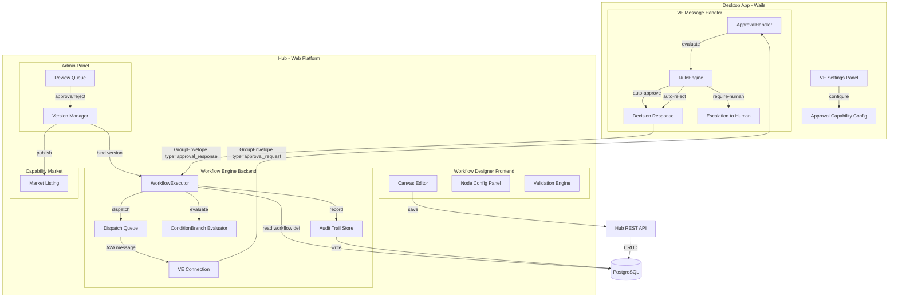
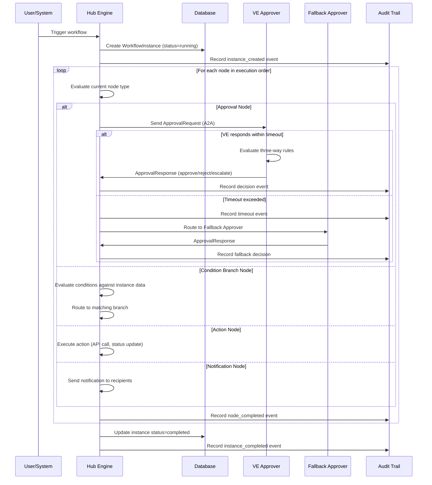

# Design Document: VE Approval Workflow

## Overview

This design implements a complete approval workflow system built on the existing VE (Virtual Employee / 数字员工) infrastructure. The system consists of three major subsystems:

1. **Workflow Designer (Hub Frontend)**: A canvas-based visual editor on Hub (`/approval_workflow`) for designing directed-graph workflows with drag-and-drop node placement, edge connections, and per-node configuration panels.

2. **Workflow Engine (Hub Backend)**: A server-side execution engine that manages workflow instances, evaluates condition branches, dispatches approval requests to VE approvers, enforces timeouts/fallbacks, and maintains an immutable audit trail.

3. **VE Approval Handler (Desktop App)**: An extension to the existing `VEMessageHandler` that receives approval requests via A2A protocol, evaluates three-way routing rules (auto-approve / auto-reject / require-human), and returns structured decisions.

### Key Design Decisions

1. **Hub-centric execution**: Workflow instances execute on Hub (server-side), not on the desktop app. The desktop VE only handles the "approval decision" step. This ensures reliability — workflows continue even if the VE machine is offline.

2. **Reuse existing A2A protocol**: Approval requests are delivered as `GroupEnvelope` messages with a new `Type: "approval_request"`. This reuses the existing Hub→VE communication channel without new transport.

3. **Reuse existing Capability Market**: Published workflows are registered as capabilities with `capability_type: "approval_workflow"` in the existing `hub/internal/capability` service. No new market infrastructure needed.

4. **Version isolation**: Running instances are bound to a specific `Published_Version`. Publishing a new version does not affect in-flight instances.

5. **Rule evaluation on VE side**: Three-way routing rules execute locally on the VE's machine. This keeps rule logic private to the VE owner and avoids sending sensitive rule configurations to Hub.

## Architecture



### Execution Flow



## Components and Interfaces

### 1. Workflow Definition Store (`hub/internal/workflow/store.go`)

```go
// WorkflowDefinition represents a complete workflow graph.
type WorkflowDefinition struct {
    ID          string          `json:"id"`
    OwnerID     string          `json:"owner_id"`
    Name        string          `json:"name"`
    Description string          `json:"description,omitempty"`
    CreatedAt   time.Time       `json:"created_at"`
    UpdatedAt   time.Time       `json:"updated_at"`
}

// WorkflowVersion represents a specific revision of a workflow.
type WorkflowVersion struct {
    ID             string          `json:"id"`
    WorkflowID     string          `json:"workflow_id"`
    VersionNumber  string          `json:"version_number"` // major.minor.patch
    Status         VersionStatus   `json:"status"`
    Graph          WorkflowGraph   `json:"graph"`
    SubmittedAt    *time.Time      `json:"submitted_at,omitempty"`
    PublishedAt    *time.Time      `json:"published_at,omitempty"`
    RejectionReason string         `json:"rejection_reason,omitempty"`
    CreatedAt      time.Time       `json:"created_at"`
    UpdatedAt      time.Time       `json:"updated_at"`
}

type VersionStatus string

const (
    VersionDraft       VersionStatus = "draft"
    VersionPendingReview VersionStatus = "pending_review"
    VersionPublished   VersionStatus = "published"
    VersionRejected    VersionStatus = "rejected"
    VersionSuperseded  VersionStatus = "superseded"
    VersionUnpublished VersionStatus = "unpublished"
)

// WorkflowStore provides CRUD operations for workflow definitions and versions.
type WorkflowStore interface {
    CreateWorkflow(ctx context.Context, def *WorkflowDefinition) error
    GetWorkflow(ctx context.Context, id string) (*WorkflowDefinition, error)
    ListWorkflows(ctx context.Context, ownerID string) ([]WorkflowDefinition, error)
    
    CreateVersion(ctx context.Context, ver *WorkflowVersion) error
    GetVersion(ctx context.Context, id string) (*WorkflowVersion, error)
    GetPublishedVersion(ctx context.Context, workflowID string) (*WorkflowVersion, error)
    UpdateVersionStatus(ctx context.Context, id string, status VersionStatus, reason string) error
    ListVersions(ctx context.Context, workflowID string) ([]WorkflowVersion, error)
    
    ListPendingReviews(ctx context.Context, page, pageSize int) ([]WorkflowVersion, int, error)
}
```

### 2. Workflow Graph Model (`hub/internal/workflow/graph.go`)

```go
// WorkflowGraph is the directed graph of nodes and edges.
type WorkflowGraph struct {
    Nodes []WorkflowNode `json:"nodes"`
    Edges []WorkflowEdge `json:"edges"`
}

type NodeType string

const (
    NodeTrigger         NodeType = "trigger"
    NodeForm            NodeType = "form"
    NodeApproval        NodeType = "approval"
    NodeConditionBranch NodeType = "condition_branch"
    NodeAction          NodeType = "action"
    NodeNotification    NodeType = "notification"
    NodeSubProcess      NodeType = "sub_process"
)

type WorkflowNode struct {
    ID       string          `json:"id"`
    Type     NodeType        `json:"type"`
    Label    string          `json:"label"`
    Position Position        `json:"position"` // canvas x,y
    Config   json.RawMessage `json:"config"`   // type-specific configuration
}

type Position struct {
    X float64 `json:"x"`
    Y float64 `json:"y"`
}

type WorkflowEdge struct {
    ID       string `json:"id"`
    SourceID string `json:"source_id"`
    TargetID string `json:"target_id"`
    Label    string `json:"label,omitempty"`    // for condition branches
    Priority int    `json:"priority,omitempty"` // evaluation order for branches
}

// ApprovalNodeConfig is the configuration for an Approval node.
type ApprovalNodeConfig struct {
    ApproverIDs      []string      `json:"approver_ids"`
    Mode             ApprovalMode  `json:"mode"`
    MinApprovals     int           `json:"min_approvals,omitempty"`  // for AnyNofM
    ApproverOrder    []string      `json:"approver_order,omitempty"` // for Sequential
    TimeoutHours     int           `json:"timeout_hours"`
    FallbackApprover string        `json:"fallback_approver,omitempty"`
}

type ApprovalMode string

const (
    ModeSingle     ApprovalMode = "single"
    ModeCountersign ApprovalMode = "countersign"
    ModeAnyNofM    ApprovalMode = "any_n_of_m"
    ModeSequential ApprovalMode = "sequential"
)

// ConditionBranchConfig is the configuration for a Condition Branch node.
type ConditionBranchConfig struct {
    Branches       []BranchCondition `json:"branches"`
    DefaultBranch  string            `json:"default_branch,omitempty"` // target node ID
}

type BranchCondition struct {
    TargetNodeID string          `json:"target_node_id"`
    Expression   ConditionExpr   `json:"expression"`
    Priority     int             `json:"priority"`
}

type ConditionExpr struct {
    Field    string      `json:"field"`    // e.g. "request.amount"
    Operator string      `json:"operator"` // equals, gt, lt, contains, in_list, etc.
    Value    interface{} `json:"value"`
}
```

### 3. Workflow Executor (`hub/internal/workflow/executor.go`)

```go
// WorkflowExecutor manages the lifecycle of workflow instances.
type WorkflowExecutor struct {
    store       WorkflowStore
    instanceStore InstanceStore
    auditStore  AuditStore
    dispatcher  ApprovalDispatcher
}

// StartInstance creates and begins executing a new workflow instance.
func (e *WorkflowExecutor) StartInstance(ctx context.Context, workflowID, triggerData string) (*WorkflowInstance, error)

// ResumeInstance continues execution after receiving an approval response.
func (e *WorkflowExecutor) ResumeInstance(ctx context.Context, instanceID string, nodeID string, response ApprovalResponse) error

// HandleTimeout processes timeout events for pending approval nodes.
func (e *WorkflowExecutor) HandleTimeout(ctx context.Context, instanceID, nodeID string) error

// ApprovalDispatcher sends approval requests to VE approvers via A2A.
type ApprovalDispatcher interface {
    Dispatch(ctx context.Context, req *ApprovalRequest, approverID string) error
    DispatchFallback(ctx context.Context, req *ApprovalRequest, fallbackID string, reason string) error
}
```

### 4. VE Approval Handler (`gui/ve_approval_handler.go`)

```go
// VEApprovalHandler processes incoming approval requests on the desktop VE.
type VEApprovalHandler struct {
    config    *VEApprovalConfig
    ruleEngine *ApprovalRuleEngine
    queue     *ApprovalQueue
}

// HandleApprovalRequest processes an incoming approval request envelope.
// Returns the decision (approve/reject/escalate) based on three-way routing rules.
func (h *VEApprovalHandler) HandleApprovalRequest(ctx context.Context, req *ApprovalRequest) (*ApprovalDecision, error)

// VEApprovalConfig holds the VE's approval capability configuration.
type VEApprovalConfig struct {
    Enabled          bool              `json:"enabled"`
    ACL              AccessControlList `json:"acl"`
    Rules            ApprovalRules     `json:"rules"`
    MaxQueueSize     int               `json:"max_queue_size"`
    TimeoutHours     int               `json:"timeout_hours"`
    DailyQuota       int               `json:"daily_quota"`
    FallbackApprover string            `json:"fallback_approver,omitempty"`
}

// AccessControlList defines who can submit requests to this VE.
type AccessControlList struct {
    Mode        ACLMode  `json:"mode"` // "whitelist" or "blacklist"
    Departments []string `json:"departments,omitempty"`
    Roles       []string `json:"roles,omitempty"`
    Skills      []string `json:"skills,omitempty"`
    Entities    []string `json:"entities,omitempty"` // specific user/VE IDs
}

type ACLMode string

const (
    ACLWhitelist ACLMode = "whitelist"
    ACLBlacklist ACLMode = "blacklist"
)
```

### 5. Approval Rule Engine (`gui/ve_approval_rules.go`)

```go
// ApprovalRuleEngine evaluates three-way routing rules against a request payload.
type ApprovalRuleEngine struct{}

// Evaluate processes the request against configured rules.
// Priority order: auto-reject → auto-approve → require-human.
// Returns the routing decision and the matched rule (if any).
func (e *ApprovalRuleEngine) Evaluate(rules *ApprovalRules, payload *ApprovalRequestPayload) (RoutingDecision, *ApprovalRule, error)

type RoutingDecision string

const (
    DecisionAutoApprove  RoutingDecision = "auto_approve"
    DecisionAutoReject   RoutingDecision = "auto_reject"
    DecisionRequireHuman RoutingDecision = "require_human"
)

// ApprovalRules contains the three categories of routing rules.
type ApprovalRules struct {
    AutoReject   []ApprovalRule `json:"auto_reject"`
    AutoApprove  []ApprovalRule `json:"auto_approve"`
    RequireHuman []ApprovalRule `json:"require_human"`
}

// ApprovalRule is a single condition-based routing rule.
type ApprovalRule struct {
    ID          string        `json:"id"`
    Name        string        `json:"name"`
    Position    int           `json:"position"` // ordering within category
    Conditions  []RuleCondition `json:"conditions"`
    Reason      string        `json:"reason,omitempty"` // for rejection messages
}

// RuleCondition is a single field comparison.
type RuleCondition struct {
    Field    string      `json:"field"`    // dot-notation path, max depth 3
    Operator Operator    `json:"operator"`
    Value    interface{} `json:"value"`
}

type Operator string

const (
    OpEquals     Operator = "equals"
    OpNotEquals  Operator = "not_equals"
    OpGT         Operator = "greater_than"
    OpLT         Operator = "less_than"
    OpContains   Operator = "contains"
    OpInList     Operator = "in_list"
    OpNotInList  Operator = "not_in_list"
    OpIsEmpty    Operator = "is_empty"
    OpIsNotEmpty Operator = "is_not_empty"
)
```

### 6. Approval Request Payload (`hub/internal/workflow/payload.go`)

```go
// ApprovalRequest is the structured payload sent to VE approvers.
type ApprovalRequest struct {
    ID            string                 `json:"id"`
    InstanceID    string                 `json:"instance_id"`
    NodeID        string                 `json:"node_id"`
    WorkflowName  string                 `json:"workflow_name"`
    Title         string                 `json:"title"`         // max 200 chars
    Summary       string                 `json:"summary"`       // max 2000 chars
    Details       map[string]interface{} `json:"details"`       // structured key-value
    Attachments   []AttachmentRef        `json:"attachments"`   // max 10, total 50MB
    HintRules     []string               `json:"hint_rules"`    // human-readable rule descriptions
    RequesterID   string                 `json:"requester_id"`
    RequesterName string                 `json:"requester_name,omitempty"`
    CreatedAt     time.Time              `json:"created_at"`
}

type AttachmentRef struct {
    URL      string `json:"url"`
    Filename string `json:"filename"`
    MimeType string `json:"mime_type,omitempty"`
    Size     int64  `json:"size_bytes"`
}

// ApprovalResponse is the decision returned by a VE approver.
type ApprovalResponse struct {
    RequestID   string          `json:"request_id"`
    Decision    string          `json:"decision"` // "approve", "reject", "escalate"
    Rationale   string          `json:"rationale,omitempty"` // max 2000 chars
    MatchedRule string          `json:"matched_rule,omitempty"`
    DecidedAt   time.Time       `json:"decided_at"`
    ApproverID  string          `json:"approver_id"`
}
```

### 7. Audit Trail Store (`hub/internal/workflow/audit.go`)

```go
// AuditEntry represents a single immutable audit record.
type AuditEntry struct {
    ID          string    `json:"id"`
    InstanceID  string    `json:"instance_id"`
    NodeID      string    `json:"node_id,omitempty"`
    EventType   string    `json:"event_type"`
    ActorID     string    `json:"actor_id,omitempty"`
    Decision    string    `json:"decision,omitempty"`
    MatchedRule string    `json:"matched_rule,omitempty"`
    Rationale   string    `json:"rationale,omitempty"`
    Details     string    `json:"details,omitempty"` // JSON
    Timestamp   time.Time `json:"timestamp"`         // UTC, millisecond precision
}

// AuditStore provides append-only access to audit records.
type AuditStore interface {
    // Append writes a new audit entry. Entries cannot be modified or deleted.
    Append(ctx context.Context, entry *AuditEntry) error
    
    // QueryByInstance returns all entries for a workflow instance, chronologically.
    QueryByInstance(ctx context.Context, instanceID string, page, pageSize int) ([]AuditEntry, int, error)
    
    // QueryByApprover returns entries where the given VE acted as approver.
    QueryByApprover(ctx context.Context, approverID string, page, pageSize int) ([]AuditEntry, int, error)
    
    // QueryByTimeRange returns entries within a time window.
    QueryByTimeRange(ctx context.Context, start, end time.Time, page, pageSize int) ([]AuditEntry, int, error)
    
    // QueryByDecision returns entries filtered by decision outcome.
    QueryByDecision(ctx context.Context, decision string, page, pageSize int) ([]AuditEntry, int, error)
}
```

### 8. Workflow Instance Store (`hub/internal/workflow/instance.go`)

```go
// WorkflowInstance represents a running execution of a workflow.
type WorkflowInstance struct {
    ID              string         `json:"id"`
    WorkflowID      string         `json:"workflow_id"`
    VersionID       string         `json:"version_id"`
    Status          InstanceStatus `json:"status"`
    CurrentNodeID   string         `json:"current_node_id"`
    InstanceData    map[string]interface{} `json:"instance_data"` // accumulated data
    TriggerData     string         `json:"trigger_data"`
    CreatedAt       time.Time      `json:"created_at"`
    CompletedAt     *time.Time     `json:"completed_at,omitempty"`
}

type InstanceStatus string

const (
    InstanceRunning   InstanceStatus = "running"
    InstanceCompleted InstanceStatus = "completed"
    InstanceFailed    InstanceStatus = "failed"
    InstanceBlocked   InstanceStatus = "blocked"
)

// NodeExecution tracks the state of a single node within an instance.
type NodeExecution struct {
    ID          string          `json:"id"`
    InstanceID  string          `json:"instance_id"`
    NodeID      string          `json:"node_id"`
    Status      NodeStatus      `json:"status"`
    StartedAt   time.Time       `json:"started_at"`
    CompletedAt *time.Time      `json:"completed_at,omitempty"`
    Result      json.RawMessage `json:"result,omitempty"`
    FailReason  string          `json:"fail_reason,omitempty"`
}

type NodeStatus string

const (
    NodePending   NodeStatus = "pending"
    NodeRunning   NodeStatus = "running"
    NodeCompleted NodeStatus = "completed"
    NodeFailed    NodeStatus = "failed"
    NodeBlocked   NodeStatus = "blocked"
    NodeSkipped   NodeStatus = "skipped"
)

type InstanceStore interface {
    Create(ctx context.Context, inst *WorkflowInstance) error
    Get(ctx context.Context, id string) (*WorkflowInstance, error)
    UpdateStatus(ctx context.Context, id string, status InstanceStatus) error
    UpdateCurrentNode(ctx context.Context, id, nodeID string) error
    
    CreateNodeExecution(ctx context.Context, exec *NodeExecution) error
    UpdateNodeExecution(ctx context.Context, id string, status NodeStatus, result json.RawMessage, failReason string) error
    GetPendingApprovals(ctx context.Context, approverID string) ([]NodeExecution, error)
}
```

## Data Models

### Database Schema (Hub PostgreSQL)

```sql
-- Workflow definitions (owned by users)
CREATE TABLE workflow_definitions (
    id              TEXT PRIMARY KEY,
    owner_id        TEXT NOT NULL,
    name            TEXT NOT NULL,
    description     TEXT DEFAULT '',
    created_at      TIMESTAMP NOT NULL DEFAULT NOW(),
    updated_at      TIMESTAMP NOT NULL DEFAULT NOW()
);
CREATE INDEX idx_workflow_def_owner ON workflow_definitions(owner_id);

-- Workflow versions (revisions of a definition)
CREATE TABLE workflow_versions (
    id               TEXT PRIMARY KEY,
    workflow_id      TEXT NOT NULL REFERENCES workflow_definitions(id),
    version_number   TEXT NOT NULL,  -- major.minor.patch
    status           TEXT NOT NULL DEFAULT 'draft',
    graph_json       JSONB NOT NULL, -- WorkflowGraph serialized
    submitted_at     TIMESTAMP,
    published_at     TIMESTAMP,
    rejection_reason TEXT DEFAULT '',
    created_at       TIMESTAMP NOT NULL DEFAULT NOW(),
    updated_at       TIMESTAMP NOT NULL DEFAULT NOW()
);
CREATE INDEX idx_wf_ver_workflow ON workflow_versions(workflow_id);
CREATE INDEX idx_wf_ver_status ON workflow_versions(status);
CREATE UNIQUE INDEX idx_wf_ver_published ON workflow_versions(workflow_id) 
    WHERE status = 'published';

-- Workflow instances (running executions)
CREATE TABLE workflow_instances (
    id              TEXT PRIMARY KEY,
    workflow_id     TEXT NOT NULL,
    version_id      TEXT NOT NULL REFERENCES workflow_versions(id),
    status          TEXT NOT NULL DEFAULT 'running',
    current_node_id TEXT DEFAULT '',
    instance_data   JSONB DEFAULT '{}',
    trigger_data    TEXT DEFAULT '',
    created_at      TIMESTAMP NOT NULL DEFAULT NOW(),
    completed_at    TIMESTAMP
);
CREATE INDEX idx_wf_inst_status ON workflow_instances(status);
CREATE INDEX idx_wf_inst_workflow ON workflow_instances(workflow_id);

-- Node executions within an instance
CREATE TABLE node_executions (
    id           TEXT PRIMARY KEY,
    instance_id  TEXT NOT NULL REFERENCES workflow_instances(id),
    node_id      TEXT NOT NULL,
    status       TEXT NOT NULL DEFAULT 'pending',
    started_at   TIMESTAMP NOT NULL DEFAULT NOW(),
    completed_at TIMESTAMP,
    result_json  JSONB,
    fail_reason  TEXT DEFAULT ''
);
CREATE INDEX idx_node_exec_instance ON node_executions(instance_id);
CREATE INDEX idx_node_exec_status ON node_executions(status);

-- Audit trail (append-only, immutable)
CREATE TABLE audit_trail (
    id           TEXT PRIMARY KEY,
    instance_id  TEXT NOT NULL,
    node_id      TEXT DEFAULT '',
    event_type   TEXT NOT NULL,
    actor_id     TEXT DEFAULT '',
    decision     TEXT DEFAULT '',
    matched_rule TEXT DEFAULT '',
    rationale    TEXT DEFAULT '',
    details_json TEXT DEFAULT '{}',
    timestamp    TIMESTAMP(3) NOT NULL DEFAULT NOW()  -- millisecond precision
);
CREATE INDEX idx_audit_instance ON audit_trail(instance_id);
CREATE INDEX idx_audit_actor ON audit_trail(actor_id);
CREATE INDEX idx_audit_timestamp ON audit_trail(timestamp);
CREATE INDEX idx_audit_decision ON audit_trail(decision);

-- Prevent any UPDATE or DELETE on audit_trail
-- (enforced via database trigger or application-level check)
```

### VE Approval Configuration (Desktop `config.json`)

```json
{
  "ve_approval_config": {
    "enabled": false,
    "acl": {
      "mode": "whitelist",
      "departments": [],
      "roles": [],
      "skills": [],
      "entities": []
    },
    "rules": {
      "auto_reject": [],
      "auto_approve": [
        {
          "id": "rule_001",
          "name": "Low amount auto-approve",
          "position": 0,
          "conditions": [
            {"field": "request.amount", "operator": "less_than", "value": 1000}
          ]
        }
      ],
      "require_human": []
    },
    "max_queue_size": 50,
    "timeout_hours": 24,
    "daily_quota": 100,
    "fallback_approver": ""
  }
}
```

### A2A Message Extensions

```go
// New GroupEnvelope types for approval workflow
const (
    EnvelopeTypeApprovalRequest  = "approval_request"
    EnvelopeTypeApprovalResponse = "approval_response"
)

// The existing GroupEnvelope.Payload field carries:
// - For approval_request: JSON-serialized ApprovalRequest
// - For approval_response: JSON-serialized ApprovalResponse
```

### Capability Market Registration

Published workflows are registered in the existing capability market with:
```json
{
  "capability_type": "approval_workflow",
  "publisher": "user_xxx",
  "display_name": "采购审批流程",
  "description": "适用于企业采购场景的三级审批流程",
  "status": "active",
  "metadata_json": {
    "category": "审批类",
    "node_count": 7,
    "approval_modes": ["countersign", "single"],
    "thumbnail_url": "/api/v1/workflow/xxx/thumbnail"
  }
}
```

