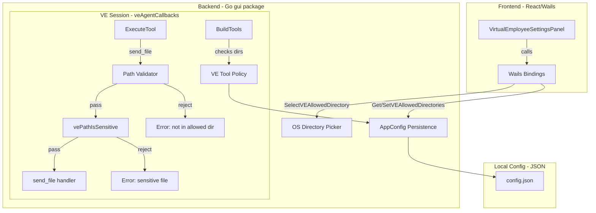
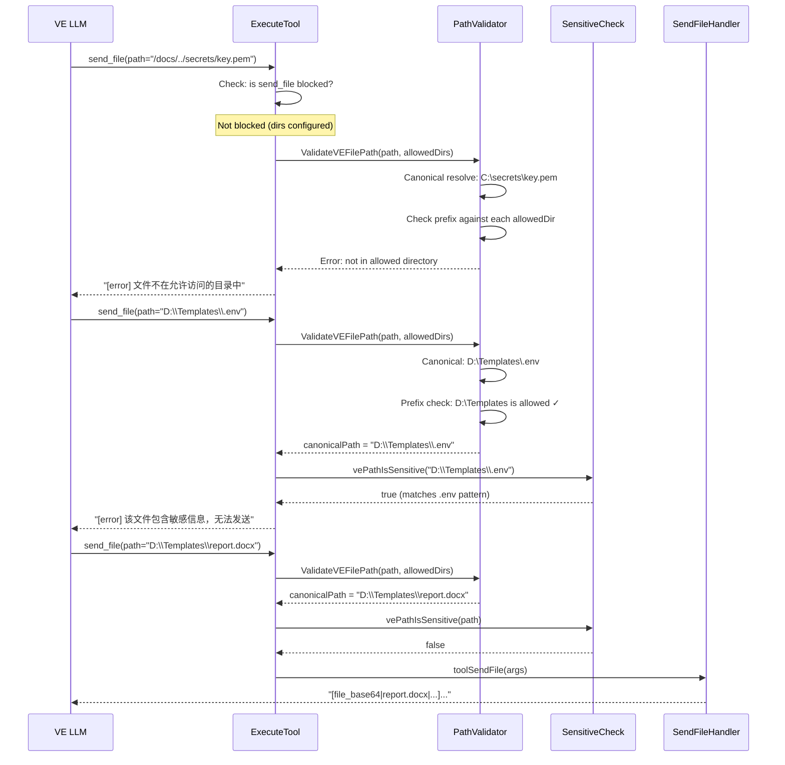

# Design Document: VE File Sharing Directories

## Overview

This design enables the Virtual Employee (VE) to send files from the machine owner's local filesystem to requesting users, scoped to explicitly configured directories. The feature introduces:

1. A configuration UI for the machine owner to declare allowed directories
2. A path validation layer that prevents traversal attacks
3. Conditional unblocking of `send_file` in the VE tool policy
4. Integration with the existing `vePathIsSensitive` second-layer protection

The design follows defense-in-depth: directory containment check → sensitive file check → execution-layer validation. All three layers must pass before a file is sent.

## Architecture



### Key Design Decisions

1. **Config stored locally, not synced to Hub**: Directories are machine-specific paths. Syncing to Hub would be meaningless on other machines.

2. **Canonical path resolution before containment check**: Both the requested file path and each allowed directory are resolved to canonical form (`filepath.EvalSymlinks` + `filepath.Abs`) before the prefix check. This eliminates all traversal vectors (`..`, symlinks, relative paths).

3. **Case-insensitive comparison on Windows**: Windows filesystems are case-insensitive by default. The containment check uses `strings.EqualFold` for path prefix comparison on Windows.

4. **50 MB size limit for VE send_file**: Reduced from the main agent's 200 MB limit. VE sessions serve remote users over IM channels where large files are impractical.

5. **Conditional tool unblocking**: `send_file` is removed from `veBlockedTools` only when `VEAllowedDirectories` is non-empty. When the list is empty, the tool remains blocked (zero-config = zero-risk).

## Components and Interfaces

### 1. AppConfig Extension (`corelib/app_config.go`)

```go
type AppConfig struct {
    // ... existing fields ...
    
    // VEAllowedDirectories is the list of local filesystem directories
    // that the VE is authorized to access for file operations (list, read, send).
    // Machine-specific, not synced to Hub.
    VEAllowedDirectories []string `json:"ve_allowed_directories,omitempty"`
}
```

### 2. Path Validator (`gui/ve_path_validator.go`)

```go
// VEPathValidator validates that a requested file path falls within
// the configured allowed directories. It performs canonical path resolution
// and directory prefix containment checks.
type VEPathValidator struct{}

// ValidateFilePath checks if the given file path is within any of the
// allowed directories. Returns the canonical path on success, or an error.
//
// Algorithm:
// 1. Resolve requestedPath to canonical absolute form (EvalSymlinks + Abs)
// 2. Check file exists (Stat)
// 3. For each allowedDir:
//    a. Resolve allowedDir to canonical absolute form
//    b. Check if canonical requestedPath has canonical allowedDir as prefix
//       (case-insensitive on Windows)
// 4. If no match, return error
func ValidateVEFilePath(requestedPath string, allowedDirs []string) (canonicalPath string, err error)

// IsWithinAllowedDirs checks directory containment without requiring
// the file to exist. Used for list_directory validation.
func IsWithinAllowedDirs(requestedPath string, allowedDirs []string) (canonicalPath string, err error)
```

### 3. VE Tool Policy Extension (`gui/ve_tool_policy.go`)

```go
// filterToolsForVEWithConfig extends filterToolsForVE to conditionally
// unblock send_file when allowed directories are configured.
func filterToolsForVEWithConfig(tools []map[string]interface{}, allowedDirs []string) []map[string]interface{}
```

The existing `filterToolsForVE` is modified to accept the allowed directories list. When `len(allowedDirs) > 0`, `send_file` is not filtered out.

### 4. Wails Bindings (`gui/app_ve.go`)

```go
// SelectVEAllowedDirectory opens the native OS directory picker dialog.
// Returns the selected directory path, or empty string if cancelled.
func (a *App) SelectVEAllowedDirectory() (string, error)

// GetVEAllowedDirectories returns the current allowed directories list.
func (a *App) GetVEAllowedDirectories() ([]string, error)

// SetVEAllowedDirectories persists the updated allowed directories list.
func (a *App) SetVEAllowedDirectories(dirs []string) error
```

### 5. VE Agent Callbacks Extension (`gui/app_ve_handler.go`)

The `veAgentCallbacks` struct gains access to the allowed directories for:
- `BuildTools()`: conditionally include `send_file` in the tool list
- `BuildSystemPrompt()`: declare file-sending capability with directory paths
- `ExecuteTool()`: validate paths before executing `send_file`, `read_file`, `list_directory`

### 6. Frontend Component Extension (`VirtualEmployeeSettingsPanel.tsx`)

New section "允许访问目录" with:
- Directory list display (full absolute paths)
- "添加目录" button → native directory picker
- Remove button per entry
- Duplicate detection (case-insensitive on Windows)

## Data Models

### Configuration Schema

```json
{
  "ve_allowed_directories": [
    "D:\\Documents\\Templates",
    "D:\\SharedFiles\\Public",
    "C:\\Users\\Owner\\Downloads\\ForVE"
  ]
}
```

### Path Validation Flow



### VE System Prompt Injection (when dirs configured)

```
- 你可以发送文件给用户（使用 send_file 工具）
- 允许访问的目录：
  - D:\Documents\Templates
  - D:\SharedFiles\Public
- 发送文件前，先用 list_directory 浏览目录内容，用 read_file 确认文件内容
- 文件大小限制：50 MB
- 敏感文件（.env、私钥等）即使在允许目录中也无法发送
```

## Correctness Properties

*A property is a characteristic or behavior that should hold true across all valid executions of a system—essentially, a formal statement about what the system should do. Properties serve as the bridge between human-readable specifications and machine-verifiable correctness guarantees.*

### Property 1: Conditional tool unblocking

*For any* non-empty list of allowed directories, `filterToolsForVEWithConfig` SHALL include `send_file` in the output tool list. *For any* empty list, `filterToolsForVEWithConfig` SHALL exclude `send_file` from the output tool list.

**Validates: Requirements 3.1, 3.2, 6.1, 6.2**

### Property 2: Path containment after canonical resolution

*For any* file path and any list of allowed directories, if the canonical absolute form of the file path (resolved via `filepath.EvalSymlinks` + `filepath.Abs`) has the canonical absolute form of at least one allowed directory as a prefix, then `ValidateVEFilePath` SHALL return success. If the canonical path does not have any allowed directory's canonical path as a prefix, then `ValidateVEFilePath` SHALL return an error — regardless of whether the original path contained `..` segments, symbolic links, or relative components.

**Validates: Requirements 3.3, 3.4, 3.5, 3.6, 5.1, 5.2, 5.5**

### Property 3: Windows path format and case-insensitivity

*For any* valid file path within an allowed directory on Windows, changing the casing of any path component (drive letter, directory names, file name) SHALL NOT affect the validation result. Additionally, *for any* valid Windows path format (drive letters like `C:\`, UNC paths like `\\server\share`, mixed forward/backward slashes), the path validator SHALL correctly resolve and validate the path.

**Validates: Requirements 5.3, 5.4**

### Property 4: Sensitive file blocking within allowed directories

*For any* file path that passes the directory containment check (is within an allowed directory) AND matches the `vePathIsSensitive` patterns (`.env`, `.pem`, `.key`, `id_rsa`, etc. with any casing), the VE file operation (send_file, read_file) SHALL be rejected with an error message.

**Validates: Requirements 8.1, 8.2, 8.3, 8.4**

### Property 5: Execution-layer path validation for all VE file operations

*For any* VE file operation (`send_file`, `read_file`, `list_directory`) with a path argument that resolves outside all allowed directories after canonicalization, the execution layer (`ExecuteTool`) SHALL return an error and SHALL NOT execute the underlying file operation handler.

**Validates: Requirements 4.1, 4.2, 6.3, 6.4**

### Property 6: Duplicate directory detection (case-insensitive)

*For any* directory path that is already in the allowed directories list, attempting to add the same path with different casing (on Windows) SHALL be rejected, and the list SHALL remain unchanged.

**Validates: Requirements 1.6**

### Property 7: Configuration serialization round-trip

*For any* list of valid absolute directory path strings, serializing to JSON (via `AppConfig` marshal) and deserializing back SHALL produce an identical list.

**Validates: Requirements 2.3**

### Property 8: System prompt capability declaration

*For any* non-empty list of allowed directories, the VE system prompt SHALL contain the file-sending capability declaration and SHALL list each configured directory path.

**Validates: Requirements 4.5**

### Property 9: File size limit enforcement

*For any* file within an allowed directory with size exceeding 50 MB, the `send_file` operation SHALL be rejected with a size-exceeded error message.

**Validates: Requirements 4.3**


## Error Handling

### Path Validation Errors

| Scenario | Error Message (Chinese) | HTTP-equivalent |
|----------|------------------------|-----------------|
| Path is empty | `[error] path 参数不能为空` | 400 |
| File does not exist | `[error] 文件不存在: {path}` | 404 |
| Path resolves outside all allowed dirs | `[error] 文件不在允许访问的目录中` | 403 |
| File matches sensitive pattern | `[error] 该文件包含敏感信息，无法发送` | 403 |
| File exceeds 50 MB size limit | `[error] 文件过大（{size} bytes），VE 模式最大支持 50 MB` | 413 |
| Path is a directory (for send_file) | `[error] 路径是目录，请使用 list_directory` | 400 |
| OS-level read error | `[error] 无法读取文件: {os_error}` | 500 |
| Canonical resolution fails | `[error] 无法解析文件路径: {os_error}` | 400 |

### Configuration Errors

| Scenario | Behavior |
|----------|----------|
| Config file missing | Treat `ve_allowed_directories` as empty `[]` |
| Config file has invalid JSON | Treat `ve_allowed_directories` as empty `[]` |
| `ve_allowed_directories` field missing | Default to empty `[]` (Go zero value) |
| Directory in list no longer exists on disk | Retain in list (owner may reconnect drive) |
| Wails directory picker fails to open | Return `("", error)` to frontend |
| Wails directory picker cancelled | Return `("", nil)` to frontend |

### Defense-in-Depth Error Chain

The execution layer (`ExecuteTool`) applies validations in order. The first failure stops execution:

```
1. Tool blocked check (isVEToolBlocked) → "[error] 工具在数字员工模式下不可用"
2. Path parameter check (empty/missing) → "[error] path 参数不能为空"
3. Directory containment check (ValidateVEFilePath) → "[error] 文件不在允许访问的目录中"
4. Sensitive file check (vePathIsSensitive) → "[error] 该文件包含敏感信息，无法发送"
5. File size check (> 50 MB) → "[error] 文件过大"
6. Actual file read + send → success or OS error
```

## Testing Strategy

### Property-Based Testing (PBT)

**Library**: [rapid](https://github.com/flyingmutant/rapid) (Go property-based testing library, already used in the codebase for memory tests)

**Configuration**: Minimum 100 iterations per property test.

**Tag format**: `Feature: ve-file-sharing-directories, Property {number}: {property_text}`

Each correctness property maps to a single property-based test:

| Property | Test File | Generator Strategy |
|----------|-----------|-------------------|
| P1: Conditional unblocking | `gui/ve_tool_policy_test.go` | Generate random non-empty/empty directory lists, verify send_file presence/absence |
| P2: Path containment | `gui/ve_path_validator_test.go` | Generate random directory trees, create files inside/outside, verify accept/reject |
| P3: Windows path formats | `gui/ve_path_validator_windows_test.go` | Generate paths with random casing, mixed slashes, drive letters |
| P4: Sensitive file blocking | `gui/ve_path_validator_test.go` | Generate sensitive file names (random casing of .env/.pem/.key) within allowed dirs |
| P5: Execution-layer scoping | `gui/app_ve_handler_test.go` | Generate random paths inside/outside allowed dirs, verify ExecuteTool behavior |
| P6: Duplicate detection | `gui/ve_allowed_dirs_test.go` | Generate random paths, add twice with different casing, verify rejection |
| P7: Config round-trip | `corelib/app_config_test.go` | Generate random lists of path strings, marshal/unmarshal, verify equality |
| P8: System prompt declaration | `gui/app_ve_handler_test.go` | Generate random non-empty dir lists, verify prompt contains all paths |
| P9: Size limit | `gui/ve_path_validator_test.go` | Generate random file sizes around 50 MB boundary, verify accept/reject |

### Unit Tests (Example-Based)

- **UI component tests** (`VirtualEmployeeSettingsPanel.test.tsx`): Add/remove directory flow, cancel flow, duplicate warning, empty state
- **Wails binding tests**: SelectVEAllowedDirectory, GetVEAllowedDirectories, SetVEAllowedDirectories
- **Config persistence tests**: Load/save cycle, missing file, corrupt JSON
- **Path validator edge cases**: Empty path, non-existent file, directory instead of file, UNC paths

### Integration Tests

- **End-to-end flow**: Configure directories → VE receives file request → validates → sends file
- **System prompt integration**: Verify prompt content changes when directories are added/removed
- **Tool policy integration**: Verify send_file appears/disappears from VE tool list based on config

### Security-Focused Tests

- **Traversal attack vectors**: `../../../etc/passwd`, `C:\..\..\Windows\System32\config\SAM`
- **Symlink escape**: Symlink inside allowed dir pointing outside
- **Case manipulation** (Windows): `c:\USERS\owner\DOCUMENTS` vs `C:\Users\Owner\Documents`
- **Unicode normalization**: NFC vs NFD path representations (if applicable)
- **Null byte injection**: Paths containing `\x00`
- **Long path names**: Paths exceeding MAX_PATH (260 chars on Windows)
