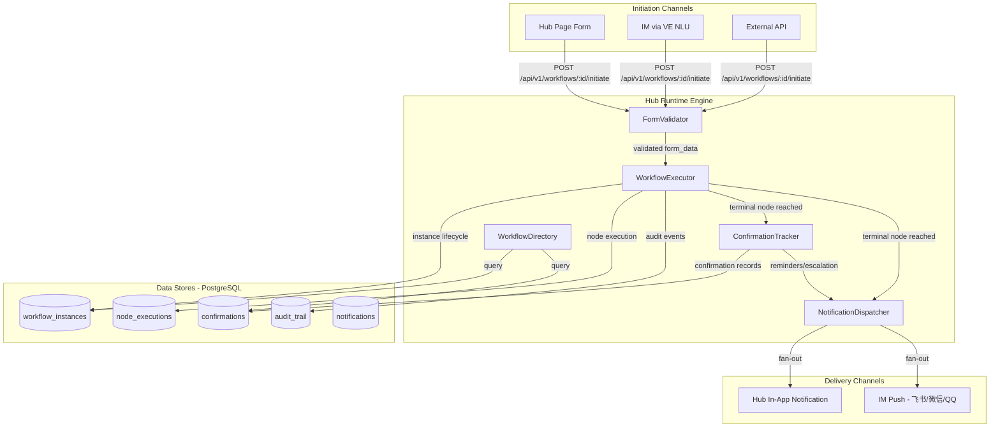
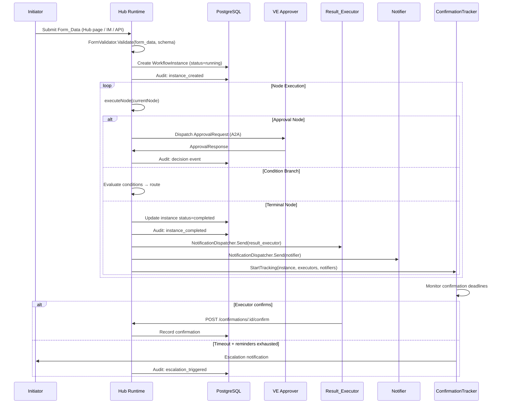
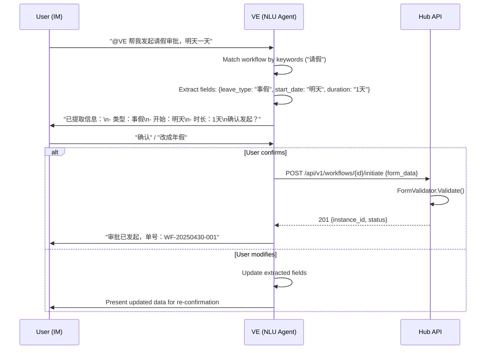

# Design Document: VE Workflow Runtime

## Overview

This design implements the runtime lifecycle of approval workflows after they are designed and published. It extends the existing Hub-side `WorkflowExecutor` (which already handles `StartInstance`, `ResumeInstance`, `HandleTimeout`, approval node dispatch, and condition branch evaluation) with runtime capabilities: form validation, multi-channel initiation (Hub page, IM via VE, API), result delivery to executors/notifiers, confirmation tracking with reminders and escalation, workflow directory views, and withdrawal/cancellation.

### Key Design Decisions

1. **Hub-centric execution (unchanged)**: All runtime state lives on Hub (PostgreSQL). The desktop app and IM channels are thin clients that submit/query data via Hub APIs.

2. **Extend existing executor, don't replace**: The `WorkflowExecutor` already handles node traversal, approval dispatch, timeout, and fallback. We add new node types (`ResultDeliveryNode`) and new instance lifecycle states (`withdrawn`) rather than building a parallel engine.

3. **Reuse existing A2A + IM infrastructure**: IM quick initiation reuses the existing `VEMessageHandler` + `IMMessageHandler` pipeline. VE extracts form data using its existing NLU capability (agent loop with tools).

4. **Confirmation as a post-completion subsystem**: Confirmation tracking is decoupled from the workflow graph execution. Once a workflow reaches a terminal node, the executor hands off to a `ConfirmationTracker` that manages reminders, escalation, and auto-close independently.

5. **Notification via existing Hub notification + IM push**: Hub already has in-app notifications and IM channel connections (飞书/微信/QQ). We add a `NotificationDispatcher` that fans out to both channels simultaneously.

## Architecture



### Runtime Execution Flow



## Components and Interfaces

### 1. Form Validator (`hub/internal/workflow/form_validator.go`)

```go
// FormValidator validates submitted form data against a workflow's Form_Node schema.
type FormValidator struct{}

// FormFieldSchema defines a single field in the form.
type FormFieldSchema struct {
    Name        string      `json:"name"`
    Label       string      `json:"label"`
    Type        FieldType   `json:"type"` // text, number, date, select, file, etc.
    Required    bool        `json:"required"`
    MaxLength   int         `json:"max_length,omitempty"`
    MinValue    *float64    `json:"min_value,omitempty"`
    MaxValue    *float64    `json:"max_value,omitempty"`
    Options     []string    `json:"options,omitempty"` // for select type
    Pattern     string      `json:"pattern,omitempty"` // regex for text validation
}

type FieldType string

const (
    FieldText     FieldType = "text"
    FieldNumber   FieldType = "number"
    FieldDate     FieldType = "date"
    FieldSelect   FieldType = "select"
    FieldFile     FieldType = "file"
    FieldTextarea FieldType = "textarea"
    FieldBoolean  FieldType = "boolean"
)

// ValidationError represents a single field validation failure.
type ValidationError struct {
    Field   string `json:"field"`
    Message string `json:"message"`
}

// Validate checks form_data against the schema, returning all validation errors.
// Returns nil if validation passes.
func (v *FormValidator) Validate(formData map[string]interface{}, schema []FormFieldSchema) []ValidationError

// ExtractFormSchema extracts the FormFieldSchema from a workflow's Form_Node.
func ExtractFormSchema(graph *WorkflowGraph) ([]FormFieldSchema, error)
```

### 2. Runtime Instance API (`hub/internal/workflow/api_runtime.go`)

```go
// RuntimeAPI provides HTTP handlers for workflow runtime operations:
// initiation, withdrawal, confirmation, and directory queries.
type RuntimeAPI struct {
    executor           *WorkflowExecutor
    instanceStore      InstanceStore
    auditStore         AuditStore
    confirmTracker     *ConfirmationTracker
    notifDispatcher    *NotificationDispatcher
    formValidator      *FormValidator
    workflowStore      WorkflowStore
}

// RegisterRoutes registers runtime API routes.
func (api *RuntimeAPI) RegisterRoutes(mux *http.ServeMux, auth func(http.HandlerFunc) http.HandlerFunc) {
    // Initiation
    mux.HandleFunc("POST /api/v1/workflows/{id}/initiate", auth(api.handleInitiateWorkflow))

    // Withdrawal
    mux.HandleFunc("POST /api/v1/instances/{id}/withdraw", auth(api.handleWithdrawInstance))

    // Confirmations
    mux.HandleFunc("POST /api/v1/confirmations/{id}/confirm", auth(api.handleConfirm))
    mux.HandleFunc("GET /api/v1/confirmations/pending", auth(api.handleListPendingConfirmations))

    // Directory views
    mux.HandleFunc("GET /api/v1/directory/initiated", auth(api.handleMyInitiated))
    mux.HandleFunc("GET /api/v1/directory/pending-action", auth(api.handlePendingMyAction))
    mux.HandleFunc("GET /api/v1/directory/pending-confirmation", auth(api.handlePendingMyConfirmation))
    mux.HandleFunc("GET /api/v1/directory/completed", auth(api.handleCompleted))
}
```

#### Initiation Request/Response

```go
// InitiateWorkflowRequest is the payload for creating a new workflow instance.
type InitiateWorkflowRequest struct {
    FormData    map[string]interface{} `json:"form_data"`
    Channel     string                 `json:"channel,omitempty"` // "hub_page", "im_feishu", "im_wechat", "api"
    InitiatorID string                 `json:"-"` // extracted from auth
}

// InitiateWorkflowResponse is returned on successful instance creation.
type InitiateWorkflowResponse struct {
    InstanceID  string    `json:"instance_id"`
    Status      string    `json:"status"`
    CreatedAt   time.Time `json:"created_at"`
    VersionID   string    `json:"version_id"`
}
```

### 3. IM Quick Initiation Handler (`gui/im_message_handler_workflow_initiate.go`)

```go
// WorkflowInitiationHandler processes IM messages that express workflow initiation intent.
// It uses the VE's existing NLU capability (agent loop) to extract structured Form_Data
// from natural language, confirms with the user, then submits to Hub.
type WorkflowInitiationHandler struct {
    app           *App
    hubClient     *HubClient
    sessions      map[string]*initiationSession // key: userID
}

// initiationSession tracks an in-progress IM workflow initiation.
type initiationSession struct {
    UserID       string
    WorkflowID   string
    WorkflowName string
    Schema       []FormFieldSchema
    ExtractedData map[string]interface{}
    MissingFields []string
    Confirmed    bool
    CreatedAt    time.Time
}

// HandleInitiationIntent processes a user message that matches a workflow initiation pattern.
// Flow:
// 1. Match user message against published workflow schemas
// 2. Extract Form_Data fields from natural language using VE agent loop
// 3. Present extracted data to user for confirmation
// 4. On confirmation, submit to Hub API
// 5. On missing fields, ask user for specifics
func (h *WorkflowInitiationHandler) HandleInitiationIntent(
    ctx context.Context, userID, message string,
) (*IMAgentResponse, error)

// matchWorkflowByMessage finds the best-matching published workflow for a message.
// Uses keyword matching against workflow names and form field labels.
func (h *WorkflowInitiationHandler) matchWorkflowByMessage(
    ctx context.Context, message string,
) (*WorkflowMatch, error)

type WorkflowMatch struct {
    WorkflowID   string
    WorkflowName string
    Schema       []FormFieldSchema
    Confidence   float64
}
```

### 4. Notification Dispatcher (`hub/internal/workflow/notification_dispatcher.go`)

```go
// NotificationDispatcher sends notifications to users through multiple channels.
// It fans out to Hub in-app notifications and IM push simultaneously.
type NotificationDispatcher struct {
    hubNotifier  HubInAppNotifier
    imPusher     IMPushNotifier
    auditStore   AuditStore
}

// HubInAppNotifier sends in-app notifications visible on the Hub web UI.
type HubInAppNotifier interface {
    Send(ctx context.Context, recipientID string, notif *InAppNotification) error
}

// IMPushNotifier sends push notifications to connected IM channels.
type IMPushNotifier interface {
    Push(ctx context.Context, recipientID string, msg *IMPushMessage) error
    IsConnected(ctx context.Context, recipientID string) bool
}

// NotificationType distinguishes executor vs notifier notifications.
type NotificationType string

const (
    NotifTypeResultExecutor NotificationType = "result_executor"
    NotifTypeNotifier       NotificationType = "notifier"
    NotifTypeWithdrawal     NotificationType = "withdrawal"
    NotifTypeReminder       NotificationType = "reminder"
    NotifTypeEscalation     NotificationType = "escalation"
)

// WorkflowNotification is the payload delivered to executors/notifiers.
type WorkflowNotification struct {
    ID             string           `json:"id"`
    InstanceID     string           `json:"instance_id"`
    Type           NotificationType `json:"type"`
    RecipientID    string           `json:"recipient_id"`
    WorkflowName   string           `json:"workflow_name"`
    Result         string           `json:"result"` // "approved" / "rejected"
    FormDataSummary string          `json:"form_data_summary"`
    InitiatorID    string           `json:"initiator_id,omitempty"`
    InitiatorName  string           `json:"initiator_name,omitempty"`
    InstanceURL    string           `json:"instance_url"`
    DeliveredAt    *time.Time       `json:"delivered_at,omitempty"`
    DeliveryChannel string          `json:"delivery_channel,omitempty"` // "hub_inapp", "im_feishu", etc.
    CreatedAt      time.Time        `json:"created_at"`
}

// Dispatch sends a notification through all available channels.
// Records delivery status in audit trail.
func (d *NotificationDispatcher) Dispatch(ctx context.Context, notif *WorkflowNotification) error

// DispatchBatch sends notifications to multiple recipients.
func (d *NotificationDispatcher) DispatchBatch(ctx context.Context, notifs []*WorkflowNotification) error
```

### 5. Confirmation Tracker (`hub/internal/workflow/confirmation_tracker.go`)

```go
// ConfirmationTracker manages post-completion confirmation lifecycle:
// tracking pending confirmations, sending reminders, and escalating on timeout.
type ConfirmationTracker struct {
    store           ConfirmationStore
    notifDispatcher *NotificationDispatcher
    auditStore      AuditStore
    ticker          *time.Ticker // runs every 5 minutes to check deadlines
}

// ConfirmationType distinguishes executor confirmation from notifier acknowledgment.
type ConfirmationType string

const (
    ConfirmTypeExecutor ConfirmationType = "executor"
    ConfirmTypeNotifier ConfirmationType = "notifier"
)

// ConfirmationStatus tracks the state of a single confirmation request.
type ConfirmationStatus string

const (
    ConfirmPending   ConfirmationStatus = "pending"
    ConfirmConfirmed ConfirmationStatus = "confirmed"
    ConfirmAutoClosed ConfirmationStatus = "auto_closed"
)

// Confirmation represents a single confirmation/acknowledgment record.
type Confirmation struct {
    ID              string             `json:"id"`
    InstanceID      string             `json:"instance_id"`
    RecipientID     string             `json:"recipient_id"`
    Type            ConfirmationType   `json:"type"`
    Status          ConfirmationStatus `json:"status"`
    Notes           string             `json:"notes,omitempty"` // max 2000 chars, executor only
    TimeoutHours    int                `json:"timeout_hours"`
    MaxReminders    int                `json:"max_reminders"`
    RemindersSent   int                `json:"reminders_sent"`
    LastReminderAt  *time.Time         `json:"last_reminder_at,omitempty"`
    ConfirmedAt     *time.Time         `json:"confirmed_at,omitempty"`
    AutoClosedAt    *time.Time         `json:"auto_closed_at,omitempty"`
    CreatedAt       time.Time          `json:"created_at"`
}

// ConfirmationStore provides CRUD for confirmation records.
type ConfirmationStore interface {
    Create(ctx context.Context, conf *Confirmation) error
    Get(ctx context.Context, id string) (*Confirmation, error)
    UpdateStatus(ctx context.Context, id string, status ConfirmationStatus, notes string) error
    IncrementReminders(ctx context.Context, id string) error
    ListPending(ctx context.Context, recipientID string) ([]Confirmation, error)
    ListByInstance(ctx context.Context, instanceID string) ([]Confirmation, error)
    FindOverdue(ctx context.Context) ([]Confirmation, error)
}

// StartTracking creates confirmation records for all executors and notifiers
// configured on the terminal node.
func (ct *ConfirmationTracker) StartTracking(ctx context.Context, inst *WorkflowInstance, terminalNodeConfig *TerminalNodeConfig) error

// Confirm records a confirmation from an executor or notifier.
func (ct *ConfirmationTracker) Confirm(ctx context.Context, confirmationID, userID, notes string) error

// RunReminderLoop is a background goroutine that checks for overdue confirmations
// and sends reminders or triggers escalation.
func (ct *ConfirmationTracker) RunReminderLoop(ctx context.Context)
```

### 6. Workflow Directory Service (`hub/internal/workflow/directory.go`)

```go
// DirectoryService provides categorized views of workflow instances for a user.
type DirectoryService struct {
    instanceStore     InstanceStore
    confirmStore      ConfirmationStore
    nodeExecStore     NodeExecutionStore
}

// DirectoryFilter contains common filter parameters.
type DirectoryFilter struct {
    Status       string    `json:"status,omitempty"`
    DateFrom     *time.Time `json:"date_from,omitempty"`
    DateTo       *time.Time `json:"date_to,omitempty"`
    WorkflowType string    `json:"workflow_type,omitempty"`
    Role         string    `json:"role,omitempty"` // for completed view
    Result       string    `json:"result,omitempty"` // for completed view
    Page         int       `json:"page"`
    PageSize     int       `json:"page_size"` // default 20
}

// DirectoryItem represents a single item in a directory view.
type DirectoryItem struct {
    InstanceID     string    `json:"instance_id"`
    WorkflowName   string    `json:"workflow_name"`
    Status         string    `json:"status"`
    CurrentNode    string    `json:"current_node,omitempty"`
    InitiatorName  string    `json:"initiator_name,omitempty"`
    InitiatedAt    time.Time `json:"initiated_at"`
    CompletedAt    *time.Time `json:"completed_at,omitempty"`
    Result         string    `json:"result,omitempty"`
    UserRole       string    `json:"user_role,omitempty"` // initiator/approver/executor/notifier
    Urgency        string    `json:"urgency,omitempty"` // normal/approaching_timeout/overdue
    TimeRemaining  *int      `json:"time_remaining_hours,omitempty"`
    ConfirmType    string    `json:"confirm_type,omitempty"` // executor/notifier
}

// MyInitiated returns instances where the user is the initiator.
func (ds *DirectoryService) MyInitiated(ctx context.Context, userID string, filter DirectoryFilter) ([]DirectoryItem, int, error)

// PendingMyAction returns instances with pending approval nodes assigned to the user.
func (ds *DirectoryService) PendingMyAction(ctx context.Context, userID string) ([]DirectoryItem, error)

// PendingMyConfirmation returns instances with pending confirmations for the user.
func (ds *DirectoryService) PendingMyConfirmation(ctx context.Context, userID string) ([]DirectoryItem, error)

// Completed returns instances where the user participated and the instance is terminal.
func (ds *DirectoryService) Completed(ctx context.Context, userID string, filter DirectoryFilter) ([]DirectoryItem, int, error)
```

### 7. Withdrawal Handler (`hub/internal/workflow/withdrawal.go`)

```go
// WithdrawalHandler manages workflow instance withdrawal by the initiator.
type WithdrawalHandler struct {
    instanceStore   InstanceStore
    auditStore      AuditStore
    notifDispatcher *NotificationDispatcher
    confirmTracker  *ConfirmationTracker
}

// Withdraw cancels a running workflow instance.
// Preconditions:
// - Instance status must be "running"
// - Instance must not have reached a terminal node (no result delivered)
// - Requester must be the initiator
//
// Effects:
// - All pending approval nodes are cancelled
// - Instance status set to "withdrawn"
// - All participants with pending actions are notified within 60s
// - Audit trail records withdrawal event
func (wh *WithdrawalHandler) Withdraw(ctx context.Context, instanceID, userID string) error

// ErrAlreadyCompleted is returned when withdrawal is attempted on a completed instance.
var ErrAlreadyCompleted = errors.New("cannot withdraw: instance has already completed")

// ErrNotInitiator is returned when a non-initiator attempts withdrawal.
var ErrNotInitiator = errors.New("only the initiator can withdraw an instance")
```

### 8. Terminal Node Configuration (`hub/internal/workflow/terminal_node.go`)

```go
// TerminalNodeConfig extends the existing WorkflowNode config for terminal nodes.
// It defines who receives results and who gets notified when the workflow completes.
type TerminalNodeConfig struct {
    ResultExecutors []ExecutorConfig `json:"result_executors"`
    Notifiers       []NotifierConfig `json:"notifiers"`
}

// ExecutorConfig defines a single result executor assignment.
type ExecutorConfig struct {
    UserID          string `json:"user_id"`
    TimeoutHours    int    `json:"timeout_hours"`    // 1-720, default 48
    MaxReminders    int    `json:"max_reminders"`    // 1-10, default 3
    ReminderInterval int   `json:"reminder_interval_hours"` // default 24
}

// NotifierConfig defines a single notifier assignment.
type NotifierConfig struct {
    UserID          string `json:"user_id"`
    TimeoutHours    int    `json:"timeout_hours"`    // 1-720, default 72
    MaxReminders    int    `json:"max_reminders"`    // 1-10, default 2
    ReminderInterval int   `json:"reminder_interval_hours"` // default 24
}

// NodeTypeTerminal is the new node type for terminal/end nodes.
const NodeTypeTerminal NodeType = "terminal"
```

## Data Models

### New Database Tables (Hub PostgreSQL)

```sql
-- Extend workflow_instances with initiator and channel info
ALTER TABLE workflow_instances ADD COLUMN initiator_id TEXT NOT NULL DEFAULT '';
ALTER TABLE workflow_instances ADD COLUMN initiation_channel TEXT NOT NULL DEFAULT 'hub_page';
ALTER TABLE workflow_instances ADD COLUMN form_data JSONB DEFAULT '{}';
ALTER TABLE workflow_instances ADD COLUMN workflow_name TEXT NOT NULL DEFAULT '';
ALTER TABLE workflow_instances ADD COLUMN withdrawn_at TIMESTAMP;
ALTER TABLE workflow_instances ADD COLUMN withdrawn_by TEXT DEFAULT '';
CREATE INDEX idx_wf_inst_initiator ON workflow_instances(initiator_id);
CREATE INDEX idx_wf_inst_channel ON workflow_instances(initiation_channel);

-- Add 'withdrawn' to instance status enum
-- (enforced at application level, not DB constraint)

-- Confirmation tracking table
CREATE TABLE confirmations (
    id               TEXT PRIMARY KEY,
    instance_id      TEXT NOT NULL REFERENCES workflow_instances(id),
    recipient_id     TEXT NOT NULL,
    type             TEXT NOT NULL, -- 'executor' or 'notifier'
    status           TEXT NOT NULL DEFAULT 'pending', -- pending/confirmed/auto_closed
    notes            TEXT DEFAULT '',
    timeout_hours    INT NOT NULL DEFAULT 48,
    max_reminders    INT NOT NULL DEFAULT 3,
    reminders_sent   INT NOT NULL DEFAULT 0,
    reminder_interval_hours INT NOT NULL DEFAULT 24,
    last_reminder_at TIMESTAMP,
    confirmed_at     TIMESTAMP,
    auto_closed_at   TIMESTAMP,
    auto_close_reason TEXT DEFAULT '',
    created_at       TIMESTAMP NOT NULL DEFAULT NOW()
);
CREATE INDEX idx_confirm_instance ON confirmations(instance_id);
CREATE INDEX idx_confirm_recipient ON confirmations(recipient_id);
CREATE INDEX idx_confirm_status ON confirmations(status);
CREATE INDEX idx_confirm_pending ON confirmations(status, recipient_id)
    WHERE status = 'pending';

-- Notifications log table
CREATE TABLE notifications (
    id               TEXT PRIMARY KEY,
    instance_id      TEXT NOT NULL,
    type             TEXT NOT NULL, -- result_executor/notifier/withdrawal/reminder/escalation
    recipient_id     TEXT NOT NULL,
    channel          TEXT NOT NULL, -- hub_inapp/im_feishu/im_wechat/im_qq
    payload_json     JSONB NOT NULL DEFAULT '{}',
    delivered        BOOLEAN NOT NULL DEFAULT FALSE,
    delivered_at     TIMESTAMP,
    failure_reason   TEXT DEFAULT '',
    created_at       TIMESTAMP NOT NULL DEFAULT NOW()
);
CREATE INDEX idx_notif_instance ON notifications(instance_id);
CREATE INDEX idx_notif_recipient ON notifications(recipient_id);
CREATE INDEX idx_notif_delivered ON notifications(delivered);
```

### Extended Instance Status

```go
const (
    InstanceRunning   InstanceStatus = "running"
    InstanceCompleted InstanceStatus = "completed"
    InstanceFailed    InstanceStatus = "failed"
    InstanceBlocked   InstanceStatus = "blocked"
    InstanceWithdrawn InstanceStatus = "withdrawn"  // NEW
    InstanceCancelled InstanceStatus = "cancelled"  // NEW (system-initiated)
)
```

### Form Data Persistence Format

```json
{
    "form_data": {
        "leave_type": "annual",
        "start_date": "2025-05-01",
        "end_date": "2025-05-02",
        "reason": "家庭事务"
    },
    "initiator_id": "user_abc123",
    "initiator_name": "张三",
    "submission_timestamp": "2025-04-30T10:30:00.123Z",
    "version_id": "ver_xyz789",
    "channel": "im_feishu"
}
```

### IM Quick Initiation Data Flow



### API Trigger Endpoint

```go
// POST /api/v1/workflows/{id}/initiate
// Headers: Authorization: Bearer <api_key>
// Body: {"form_data": {...}}
//
// Rate limit: 100 requests/minute per authenticated client.
// Returns:
//   201: {"instance_id": "...", "status": "running", "created_at": "..."}
//   400: {"errors": [{"field": "amount", "message": "required field missing"}]}
//   401: {"error": "invalid credentials"}
//   429: {"error": "rate limit exceeded"}
```

### Confirmation Reminder Logic

```go
// RunReminderLoop checks every 5 minutes for overdue confirmations.
// For each overdue confirmation:
//   1. If reminders_sent < max_reminders AND 24h since last reminder:
//      → Send reminder notification, increment reminders_sent
//   2. If reminders_sent >= max_reminders:
//      → For executor: escalate to initiator, record escalation_triggered
//      → For notifier: auto-close, record auto_closed with reason "notifier_timeout"
func (ct *ConfirmationTracker) RunReminderLoop(ctx context.Context) {
    ticker := time.NewTicker(5 * time.Minute)
    defer ticker.Stop()
    for {
        select {
        case <-ctx.Done():
            return
        case <-ticker.C:
            ct.processOverdueConfirmations(ctx)
        }
    }
}
```

### Withdrawal Notification Payload

```json
{
    "type": "withdrawal",
    "workflow_name": "请假审批",
    "initiator_name": "张三",
    "withdrawn_at": "2025-04-30T11:00:00.000Z",
    "message": "发起人已撤回此审批流程，无需进一步操作。"
}
```

### Terminal Node Designer Configuration (Graph Editor Extension)

The existing `WorkflowDesigner` canvas editor is extended with a Terminal Node configuration panel:

```go
// TerminalNodeConfigPanel fields (Hub frontend React component):
// - Result Executors: user search + add (Hub user directory)
//   - Per executor: timeout_hours (1-720, default 48), max_reminders (1-10, default 3)
// - Notifiers: user search + add (Hub user directory)
//   - Per notifier: timeout_hours (1-720, default 72), max_reminders (1-10, default 2)
// - Validation: warning (not error) if no executor configured

// The terminal node config is stored in WorkflowNode.Config as JSON:
// {"result_executors": [...], "notifiers": [...]}
```

### Workflow Directory Desktop App Integration

The desktop app (Wails) exposes directory views through bindings:

```go
// gui/app_workflow_directory.go

// GetWorkflowDirectory returns directory items for the specified view.
func (a *App) GetWorkflowDirectory(view string, filter string) (*DirectoryResponse, error)

// view: "initiated" | "pending_action" | "pending_confirmation" | "completed"
// filter: JSON-encoded DirectoryFilter

type DirectoryResponse struct {
    Items      []DirectoryItem `json:"items"`
    Total      int             `json:"total"`
    Page       int             `json:"page"`
    PageSize   int             `json:"page_size"`
}
```

Frontend component: `gui/frontend/src/components/workflow/WorkflowDirectoryPanel.tsx`
- Tab bar with 4 views: 我发起的 | 待我处理的 | 待我确认的 | 已完成的
- Each tab renders a list with appropriate columns and sorting
- Click navigates to instance detail page (Hub web view)

## Correctness Properties

*A property is a characteristic or behavior that should hold true across all valid executions of a system—essentially, a formal statement about what the system should do. Properties serve as the bridge between human-readable specifications and machine-verifiable correctness guarantees.*

### Property 1: Form validation correctness

*For any* valid form schema and *any* form data submission, the FormValidator SHALL accept the data if and only if all required fields are present and all field values conform to their defined data types and constraints (max_length, min/max_value, pattern, options).

**Validates: Requirements 1.2, 1.3, 3.2, 3.4**

### Property 2: Instance creation data completeness

*For any* successfully created Workflow_Instance (via any channel: Hub page, IM, or API), the persisted record SHALL contain: all submitted form field values, the initiator's user ID, submission timestamp in UTC with millisecond precision, the workflow version ID, and the initiation channel identifier.

**Validates: Requirements 1.4, 1.6, 2.6**

### Property 3: Node execution recording invariant

*For any* node that completes execution within a Workflow_Instance, a node_execution record SHALL exist containing: instance ID, node ID, node type, start timestamp, completion timestamp, and execution status.

**Validates: Requirements 4.1, 4.2**

### Property 4: Instance timeline chronological ordering

*For any* Workflow_Instance, the Instance_Timeline events SHALL be returned in strictly non-decreasing timestamp order, and no two events for the same instance shall have identical timestamps unless they represent truly simultaneous operations.

**Validates: Requirements 4.3**

### Property 5: Terminal node notification delivery

*For any* Workflow_Instance that reaches a Terminal_Node, every configured Result_Executor and every configured Notifier SHALL receive a notification, and both Hub in-app and IM push channels SHALL be attempted for each recipient.

**Validates: Requirements 5.1, 5.3, 6.1, 6.3**

### Property 6: Notification content completeness by type

*For any* notification delivered to a recipient, the payload SHALL contain all type-required fields: Result_Executor notifications include workflow name, approval result, Form_Data summary, initiator identity, and instance URL; Notifier notifications include workflow name, approval result, Form_Data summary, and instance URL. The notification type (executor/notifier) SHALL be correctly recorded in the Instance_Timeline.

**Validates: Requirements 5.2, 6.2, 6.6**

### Property 7: Confirmation recording completeness

*For any* confirmation action (executor "确认已操作" or notifier "确认已知会"), the persisted record SHALL contain: recipient user ID, confirmation timestamp, and type. Executor confirmations SHALL additionally preserve optional notes (up to 2000 characters).

**Validates: Requirements 7.1, 8.1**

### Property 8: Reminder frequency and cap invariant

*For any* pending confirmation, reminders SHALL be sent at intervals of `reminder_interval_hours` (default 24h), and the total number of reminders sent SHALL never exceed `max_reminders` (default 3 for executors, 2 for notifiers). No reminder SHALL be sent before the configured timeout period has elapsed.

**Validates: Requirements 7.3, 7.4, 8.2, 8.3**

### Property 9: Escalation on executor reminder exhaustion

*For any* executor confirmation where `reminders_sent >= max_reminders` and the executor has not confirmed, the system SHALL notify the Initiator with an "escalation_triggered" event recorded in the Instance_Timeline.

**Validates: Requirements 7.5**

### Property 10: Auto-close on notifier reminder exhaustion

*For any* notifier confirmation where `reminders_sent >= max_reminders` and the notifier has not acknowledged, the system SHALL set the confirmation status to "auto_closed" with reason "notifier_timeout" and record an "auto_closed" event in the Instance_Timeline.

**Validates: Requirements 8.4**

### Property 11: Directory view query correctness

*For any* user and *any* set of workflow instances, the directory views SHALL return exactly the correct subset: "我发起的" returns instances where `initiator_id == userID`; "待我处理的" returns instances with pending approval nodes assigned to the user; "待我确认的" returns completed instances with pending confirmations for the user; "已完成的" returns terminal instances where the user participated in any role.

**Validates: Requirements 9.1, 10.1, 11.1, 12.1**

### Property 12: Directory filter correctness

*For any* filter combination applied to a directory view, every returned item SHALL satisfy all active filter criteria (status, date range, workflow type, result, role).

**Validates: Requirements 9.3, 12.3**

### Property 13: Directory sort ordering

*For any* directory view result set, items SHALL be sorted according to the view's defined ordering: "我发起的" and "已完成的" by date descending; "待我处理的" by urgency then date ascending; "待我确认的" by time remaining ascending.

**Validates: Requirements 9.4, 10.3, 11.3, 12.4**

### Property 14: Withdrawal precondition enforcement

*For any* Workflow_Instance, withdrawal SHALL succeed if and only if the instance status is "running" AND the instance has not yet reached a Terminal_Node AND the requester is the initiator. Withdrawal of a completed/withdrawn instance SHALL always be rejected.

**Validates: Requirements 13.1, 13.4**

### Property 15: Withdrawal atomicity and completeness

*For any* successful withdrawal, the system SHALL atomically: set instance status to "withdrawn", cancel all pending approval nodes (setting their status to "skipped"), record a "withdrawal" event in the audit trail, and notify all participants who had pending actions. The withdrawal notification SHALL contain workflow name, initiator identity, and withdrawal timestamp.

**Validates: Requirements 13.2, 13.3, 13.5, 13.6**

### Property 16: Terminal node configuration range validation

*For any* terminal node configuration, timeout_hours SHALL be accepted if and only if it is in range [1, 720], and max_reminders SHALL be accepted if and only if it is in range [1, 10].

**Validates: Requirements 14.4, 14.5**

## Error Handling

### Form Validation Errors

| Error | HTTP Status | Response |
|-------|-------------|----------|
| Missing required field | 400 | `{"errors": [{"field": "leave_type", "message": "required field missing"}]}` |
| Invalid data type | 400 | `{"errors": [{"field": "amount", "message": "expected number, got string"}]}` |
| Value out of range | 400 | `{"errors": [{"field": "days", "message": "value must be between 1 and 30"}]}` |
| Pattern mismatch | 400 | `{"errors": [{"field": "phone", "message": "does not match pattern"}]}` |
| Workflow not published | 409 | `{"error": "workflow does not have a published version"}` |
| Workflow not found | 404 | `{"error": "workflow not found"}` |

### Initiation Errors

| Error | Handling |
|-------|----------|
| IM VE cannot extract fields | VE asks user for missing fields (max 3 rounds) |
| No matching workflow for IM message | VE informs user, suggests available workflows |
| API rate limit exceeded | HTTP 429, `Retry-After` header |
| API auth failure | HTTP 401 |
| Hub database unavailable | HTTP 503, retry with exponential backoff |

### Notification Delivery Errors

| Error | Handling |
|-------|----------|
| IM channel not connected | Deliver via Hub in-app only, record IM failure in timeline |
| Hub notification service down | Retry 3 times with 5s backoff, then record failure |
| Recipient user not found | Skip notification, record error in audit trail |

### Confirmation Errors

| Error | Handling |
|-------|----------|
| Confirm non-existent confirmation | HTTP 404 |
| Confirm already-confirmed | HTTP 409, idempotent (return existing confirmation) |
| Confirm by wrong user | HTTP 403 |
| Notes exceed 2000 chars | HTTP 400, truncation not applied |

### Withdrawal Errors

| Error | Handling |
|-------|----------|
| Withdraw completed instance | HTTP 409, `ErrAlreadyCompleted` |
| Withdraw by non-initiator | HTTP 403, `ErrNotInitiator` |
| Withdraw already-withdrawn | HTTP 409, idempotent |
| Concurrent withdrawal race | Database-level optimistic locking (version column) |

## Testing Strategy

### Dual Testing Approach

- **Unit tests**: Verify specific examples, edge cases, and error conditions
- **Property tests**: Verify universal properties across all inputs (using `testing/quick` or a Go PBT library like `pgregory.net/rapid`)

### Property-Based Testing Configuration

- Library: `pgregory.net/rapid` (Go property-based testing)
- Minimum 100 iterations per property test
- Each property test references its design document property
- Tag format: **Feature: ve-workflow-runtime, Property {number}: {property_text}**

### Test Categories

#### 1. Form Validation (Properties 1, 16)
- Generate random form schemas (varying field types, required/optional, constraints)
- Generate random form data (valid and invalid)
- Verify validation accepts valid data and rejects invalid data with correct error messages
- Verify range validation for terminal node config (timeout 1-720, reminders 1-10)

#### 2. Instance Lifecycle (Properties 2, 3, 4)
- Generate random workflow initiations across all channels
- Verify persisted data completeness (all metadata fields present)
- Verify node execution records created for every completed node
- Verify timeline chronological ordering after random event sequences

#### 3. Notification System (Properties 5, 6)
- Generate random terminal node configurations (varying executor/notifier counts)
- Verify all recipients receive notifications
- Verify notification payloads contain all type-required fields
- Verify dual-channel delivery attempted for each recipient

#### 4. Confirmation Tracking (Properties 7, 8, 9, 10)
- Generate random confirmation scenarios with varying timeouts and reminder configs
- Advance simulated time, verify reminders sent at correct intervals
- Verify reminder count never exceeds max
- Verify escalation triggers for executors, auto-close for notifiers

#### 5. Directory Views (Properties 11, 12, 13)
- Generate random sets of instances with various participants and states
- Verify each view returns exactly the correct subset
- Verify filters produce correct results
- Verify sort ordering invariants

#### 6. Withdrawal (Properties 14, 15)
- Generate instances at various execution stages
- Verify withdrawal succeeds/fails based on preconditions
- Verify atomic state changes on successful withdrawal
- Verify all affected participants notified

### Integration Tests

- Full initiation flow: Hub page form → validation → instance creation → first node execution
- IM initiation flow: natural language → VE extraction → confirmation → API call → instance creation
- API trigger flow: authenticated request → validation → instance creation → response
- Terminal node flow: instance completion → notification dispatch → confirmation tracking → reminders → escalation
- Withdrawal flow: running instance → withdrawal → participant notifications → audit trail
- Directory views: create instances with various states → query each view → verify correctness

### Unit Tests (Example-Based)

- IM workflow matching: specific natural language inputs → correct workflow matched
- Urgency calculation: specific elapsed times → correct urgency classification
- Notification formatting: specific workflow results → correct message content
- Rate limiter: burst of requests → correct throttling behavior
- Auth validation: various credential scenarios → correct accept/reject
