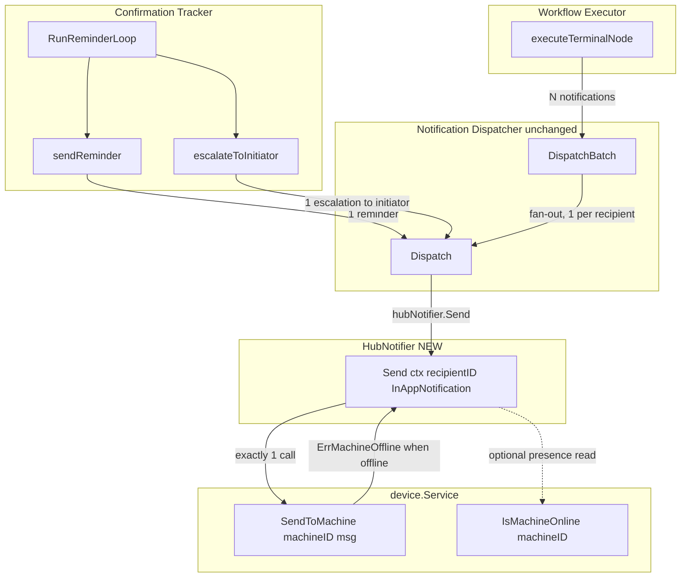
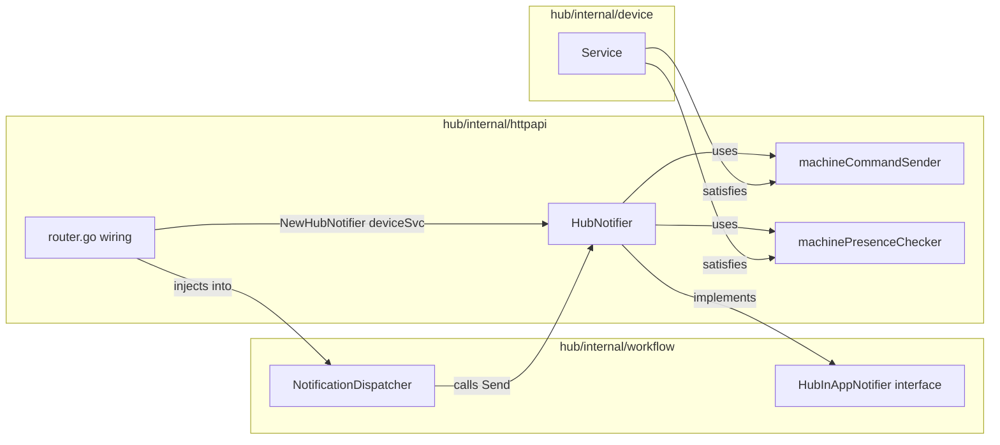
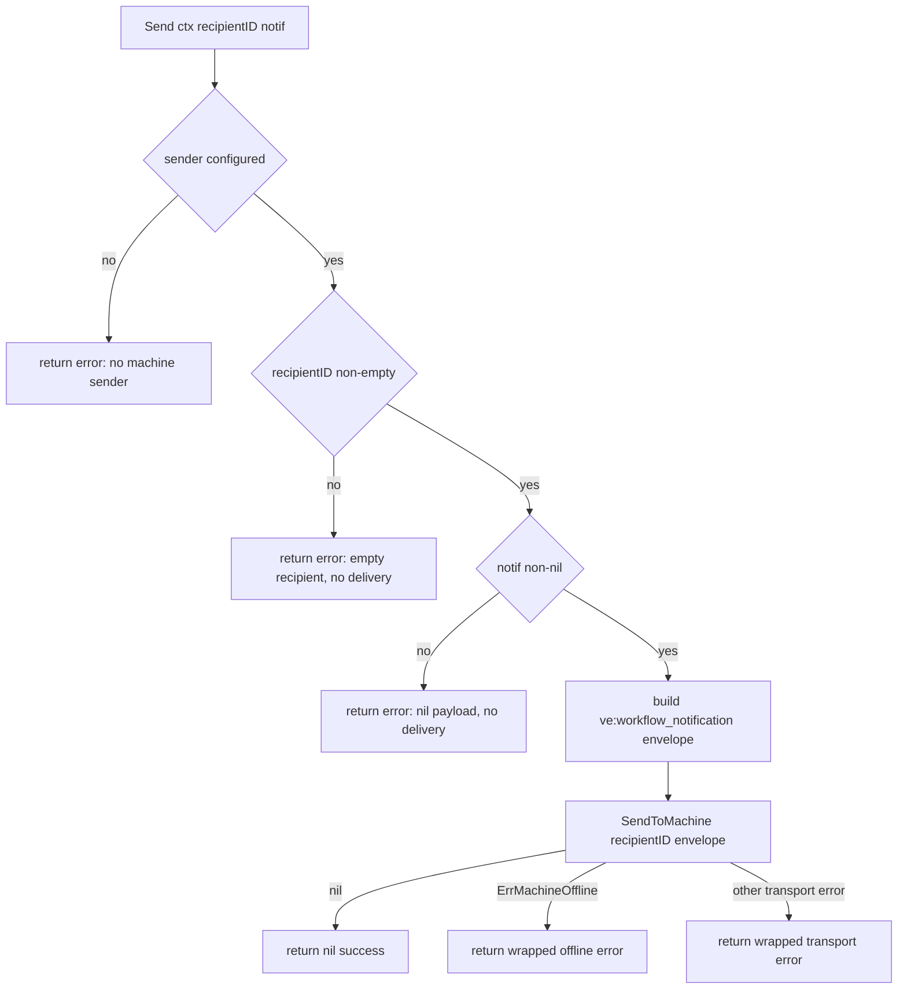

# Design Document

## Overview

The enterprise approval-workflow runtime chain is fully wired into production in `hub/internal/httpapi/router.go` — except for one gap. The `NotificationDispatcher` is constructed with **nil notifiers**:

```go
notifDispatcher := workflow.NewNotificationDispatcher(nil, nil, auditStore, nil)
```

Because no `HubInAppNotifier` is wired, every `Dispatch` call short-circuits at `if d.hubNotifier == nil { return fmt.Errorf("hub notifier not configured") }`. Two delivery paths therefore record-but-deliver-nothing:

1. **Terminal-node completion notifications** — `WorkflowExecutor.executeTerminalNode` → `NotificationDispatcher.DispatchBatch`.
2. **Confirmation reminders / escalations** — `ConfirmationTracker.RunReminderLoop` → `sendReminder` / `escalateToInitiator` → `NotificationDispatcher.Dispatch`.

This feature builds **`HubNotifier`**, a real implementation of the existing `workflow.HubInAppNotifier` interface, backed by `device.Service.SendToMachine` (the same machine-delivery mechanism the production `HubApprovalDispatcher` already uses) with presence available through `device.Service.IsMachineOnline` (the same source `HubAvailabilityChecker` uses). The Router then wires this real notifier into `NewNotificationDispatcher` in place of the first `nil`.

This is a **wiring + new-dependency-implementation** feature, not an interface change. It is the direct sibling of `HubApprovalDispatcher` / `HubAvailabilityChecker` in `hub/internal/httpapi/workflow_runtime_deps.go`, and it follows the same compile-time-assertion pattern:

```go
var _ workflow.HubInAppNotifier = (*HubNotifier)(nil)
```

### Scope decisions (resolving the 7 Open Questions)

The requirements deliberately left seven decisions open. The design resolves each toward **the minimal change that closes the two explicit delivery gaps**, while keeping every existing interface and call site unchanged (Requirement 8). The table below records each decision and its rationale; the body sections elaborate.

| # | Open Question | Decision | Rationale | Requirements |
|---|---------------|----------|-----------|--------------|
| 1 | Offline-recipient behavior (Req 3.5) | **Skip + record.** `HubNotifier.Send` returns a wrapped `ErrMachineOffline`; no re-delivery queue, no scheduled retry. The recipient relies on the next `ConfirmationTracker` reminder tick (which re-dispatches) or the Hub UI. | `SendToMachine` already returns `ErrMachineOffline` and the failure is recorded by the dispatcher today. The reminder loop is the natural retry mechanism — building a separate re-delivery queue duplicates cadence control that `ConfirmationTracker` already owns (Req 2.4, 5.1). Minimal change. | 3.1, 3.4, 3.5 |
| 2 | Notification_Store wiring (Req 7.6) | **Keep nil.** No production `NotificationStore` implementation exists in the hub (only test mocks). The Router continues to pass `nil` for `notifStore`. Audit-trail failure recording (via `auditStore`, already wired) remains the source of delivery observability. | Wiring a store would require building a new `PgNotificationStore` — out of scope for closing the two delivery gaps. The dispatcher already guards every `notifStore` access with `if d.notifStore != nil`, so nil is a supported mode. Audit recording is unaffected. | 4.6, 7.5, 7.6 |
| 3 | IM push scope (Req 9) | **Out of scope.** Only `HubNotifier` (the required `HubInAppNotifier` channel) is implemented. The Router passes `nil` for `imPusher`. | The two delivery gaps are both on the `HubInAppNotifier` path. The dispatcher already skips IM push silently when `imPusher == nil` (`if d.imPusher != nil`). Adding IM push is a clearly-scoped follow-on, not needed to close the gaps. | 9.6, 9.7 |
| 4 | Initiator notifier scope (Req 10) | **Out of scope.** No real `WorkflowNotifier` is provided; the executor keeps its existing nil-guard no-op for blocked-node initiator notifications. | The blocked-node path (`WorkflowNotifier.NotifyInitiator`) is **not** one of the two gaps created by the nil-notifier construction — it is a separate, independently-nil dependency. Note: confirmation *escalation* to the initiator (Req 2.2) flows through `NotificationDispatcher.Dispatch` → `HubNotifier`, so initiators **are** reached on escalation; only the blocked-node path is deferred. Clearly-scoped follow-on. | 10.6, 10.7 |
| 5 | Channel semantics vs. transport (Req 5 / OQ 5) | **Deliver to the desktop machine over `SendToMachine`**, consistent with the approval-request path. The `HubInAppNotifier` interface name describes the *channel* (an in-app notification the recipient sees), and `SendToMachine` is the transport that delivers it to the recipient's connected desktop client — exactly as `HubApprovalDispatcher` delivers approval requests. | The two gaps are on the `HubInAppNotifier` path, and the proven transport for "reach the recipient's machine" is `SendToMachine`. Mapping this transport to `HubInAppNotifier` (rather than inventing a web-UI inbox) is the minimal change and reuses the established pattern. | 1.3, 5 (OQ) |
| 6 | Wire message type (OQ 6) | **`ve:workflow_notification`** envelope, mirroring `ve:approval_request`. Payload is the marshaled `*InAppNotification` (the dispatcher's already-built in-app payload) plus discriminator/context fields, wrapped in the `{type, ts, payload}` envelope. **No `GroupEnvelope`** — a notification is a one-way machine message, not a group-discussion A2A message requiring `ValidateCurrentHub`. | A simpler typed message matches the one-way nature of notifications and avoids forcing notification payloads through `GroupEnvelope.ValidateCurrentHub` (which is built for approval/discussion semantics). The `ve:`-prefixed type keeps desktop-client handler routing consistent. | 1.3, 2.3 |
| 7 | Reminder/timeout/max-count defaults (OQ 7) | **Defer entirely to `ConfirmationTracker`.** `HubNotifier` introduces **no** cadence, counting, interval, or deadline logic. It delivers exactly one machine message per `Send` invocation. | `ConfirmationTracker` already owns `shouldSendReminder`, `IncrementReminders`, `MaxReminders`, and the per-confirmation `Default*` values. Duplicating any of this in the notifier would create two sources of truth. | 2.4, 5.1, 5.2 |

### What changes and what does not

**Changes (exactly two artifacts):**
- A new file `hub/internal/httpapi/workflow_notifier.go` defining `HubNotifier` (alongside `HubApprovalDispatcher`).
- One line in `hub/internal/httpapi/router.go`: the first `nil` argument to `NewNotificationDispatcher` becomes `NewHubNotifier(deviceSvc)`.

**Unchanged (Requirement 8):**
- `HubInAppNotifier`, `IMPushNotifier`, `WorkflowNotifier`, `NotificationDispatcher`, `ConfirmationTracker` — no method added, removed, renamed, or re-typed.
- `NewNotificationDispatcher(hubNotifier, imPusher, auditStore, notifStore)` — same parameter count, order, types.
- All executor and tracker call sites (`Dispatch`, `DispatchBatch`, `NotifyInitiator`, reminder/reconcile paths).
- The existing approval-workflow runtime-chain test suite — no test source file is modified.

## Architecture

### Runtime delivery chain (after this feature)



### Component placement

`HubNotifier` lives in `hub/internal/httpapi`, the same package as `HubApprovalDispatcher` and the `machineCommandSender` / `machinePresenceChecker` abstractions it depends on. The dispatcher, tracker, and executor stay in `hub/internal/workflow` and are untouched. The dependency direction is identical to the approval-dispatcher case: `httpapi` (the wiring layer) implements an interface declared in `workflow`, and `workflow` never imports `httpapi`.



### Delivery decision (single Send invocation)



A single `Send` performs **exactly one** `SendToMachine` call on the happy path and on every failure path that reaches the transport. The empty-recipient and nil-payload guards return before any transport call (zero `SendToMachine` calls).

## Components and Interfaces

### Existing interface (unchanged — implemented by HubNotifier)

```go
// hub/internal/workflow/notification_dispatcher.go (UNCHANGED)
type HubInAppNotifier interface {
    Send(ctx context.Context, recipientID string, notif *InAppNotification) error
}
```

### Existing abstractions reused (unchanged)

```go
// hub/internal/httpapi/user_handlers.go (UNCHANGED)
type machineCommandSender interface {
    SendToMachine(machineID string, msg any) error
}

// hub/internal/httpapi/workflow_runtime_deps.go (UNCHANGED)
type machinePresenceChecker interface {
    IsMachineOnline(machineID string) bool
}
```

`*device.Service` satisfies both (`deviceSvc` in `router.go` is already passed to `NewHubApprovalDispatcher(deviceSvc)` and `NewHubAvailabilityChecker(deviceSvc)`).

### New component: HubNotifier

```go
// hub/internal/httpapi/workflow_notifier.go (NEW)

// workflowNotificationWireType is the WebSocket message type used to deliver a
// workflow completion/reminder notification to a recipient machine. It mirrors
// the `ve:`-prefixed convention used by HubApprovalDispatcher
// (ve:approval_request) so desktop-client handler routing stays consistent.
const workflowNotificationWireType = "ve:workflow_notification"

// HubNotifier is the real HubInAppNotifier. It delivers workflow completion
// notifications and confirmation reminders to recipient machines over the Hub
// machine sender (device.Service.SendToMachine) — the same mechanism
// HubApprovalDispatcher uses for approval requests. It implements the unchanged
// HubInAppNotifier interface so the NotificationDispatcher, ConfirmationTracker,
// and WorkflowExecutor call sites are untouched; only the concrete dependency
// wired into NewNotificationDispatcher changes from nil to a real implementation.
//
// HubNotifier holds NO cadence, counting, interval, deadline, or dedup state.
// It delivers exactly one machine message per Send invocation and defers all
// reminder cadence/counting control to ConfirmationTracker.
type HubNotifier struct {
    sender   machineCommandSender
    presence machinePresenceChecker // optional; nil is supported
}

// Compile-time assertion mirroring var _ workflow.ApprovalDispatcher = (*HubApprovalDispatcher)(nil).
var _ workflow.HubInAppNotifier = (*HubNotifier)(nil)

// NewHubNotifier constructs a real HubInAppNotifier backed by the given machine
// sender (e.g. *device.Service). The presence source is optional and used only
// for an opt-in presence read; SendToMachine already returns ErrMachineOffline
// authoritatively, so delivery correctness does not depend on it.
func NewHubNotifier(sender machineCommandSender) *HubNotifier {
    return &HubNotifier{sender: sender}
}

// WithPresence attaches an optional presence source. Returns the notifier for
// chaining, mirroring ConfirmationTracker.SetWorkflowStore's setter pattern.
func (n *HubNotifier) WithPresence(p machinePresenceChecker) *HubNotifier {
    n.presence = p
    return n
}

func (n *HubNotifier) Send(ctx context.Context, recipientID string, notif *InAppNotification) error {
    if n == nil || n.sender == nil {
        return errors.New("hub notifier has no machine sender configured")
    }
    if notif == nil {
        return errors.New("in-app notification payload is nil")
    }
    recipientID = strings.TrimSpace(recipientID)
    if recipientID == "" {
        return errors.New("recipient id is required")
    }

    payload, err := json.Marshal(notif)
    if err != nil {
        return fmt.Errorf("marshal in-app notification: %w", err)
    }

    sendErr := n.sender.SendToMachine(recipientID, map[string]any{
        "type":    workflowNotificationWireType,
        "ts":      time.Now().Unix(),
        "payload": map[string]any{
            "notification_type": notif.Type, // discriminator (result_executor | notifier | reminder | escalation | ...)
            "notification":      json.RawMessage(payload),
        },
    })
    if sendErr != nil {
        if errors.Is(sendErr, device.ErrMachineOffline) {
            return fmt.Errorf("deliver workflow notification to %s: %w", recipientID, sendErr)
        }
        return fmt.Errorf("deliver workflow notification to %s: %w", recipientID, sendErr)
    }
    return nil
}
```

Notes:
- `import "github.com/RapidAI/CodeClaw/hub/internal/device"` is added so `device.ErrMachineOffline` is matchable via `errors.Is`. `%w` wrapping preserves the sentinel so the dispatcher (or any caller) can distinguish the offline condition (Req 3.1). Both `SendToMachine` failure modes (no live connection, buffer full) return `ErrMachineOffline`, so both are surfaced as the offline condition.
- The discriminator (`notification_type`) distinguishes completion notifications from reminders/escalations at the delivery layer; the `InAppNotification.Type` field (set by `buildInAppNotification` from `WorkflowNotification.Type`) carries it (Req 2.3).
- Presence (`IsMachineOnline`) is **not** consulted as a gate on the delivery path: `SendToMachine` is the single authority for online/offline (it returns `ErrMachineOffline`). `WithPresence` exists so a presence read is *available* (Req 3.4) without introducing a TOCTOU gate that could diverge from the actual send outcome.

### NotificationDispatcher (unchanged) — how it consumes HubNotifier

The dispatcher's `Dispatch` already:
1. Returns early if `hubNotifier == nil` (no longer triggered once wired).
2. Calls `hubNotifier.Send(ctx, notif.RecipientID, inApp)` exactly once per `Dispatch`.
3. On `Send` error: records `FailureReason` in `notifStore` (guarded by `notifStore != nil`, so nil-store is a no-op) and returns the wrapped error.
4. On `Send` success: records delivered status and returns nil.

`DispatchBatch` fans out one `Dispatch` (→ one `Send`) per recipient, collecting errors without aborting (Req 6.1). None of this changes.

### Router wiring (one-line change)

```go
// BEFORE
notifDispatcher := workflow.NewNotificationDispatcher(nil, nil, auditStore, nil)

// AFTER
hubNotifier := NewHubNotifier(deviceSvc).WithPresence(deviceSvc)
notifDispatcher := workflow.NewNotificationDispatcher(hubNotifier, nil, auditStore, nil)
```

- Arg 1 (`hubNotifier`): real `HubNotifier` (Req 7.1, 7.2).
- Arg 2 (`imPusher`): stays `nil` — IM push out of scope (Req 9.6, OQ 3).
- Arg 3 (`auditStore`): unchanged existing store (Req 7.3).
- Arg 4 (`notifStore`): stays `nil` — no production store exists (Req 7.6, OQ 2).
- `WithPresence(deviceSvc)` supplies the same presence source `HubAvailabilityChecker` uses (Req 7.4).

The executor (`WithNotifier`) is **not** given a real `WorkflowNotifier` — blocked-node initiator notification stays nil-guarded (Req 10.6, OQ 4).

## Data Models

### Wire message (delivered by SendToMachine)

```json
{
  "type": "ve:workflow_notification",
  "ts": 1717000000,
  "payload": {
    "notification_type": "reminder",
    "notification": {
      "title": "【提醒】请假审批 - 待确认",
      "body": "请尽快确认",
      "url": "/instances/inst-1",
      "type": "reminder"
    }
  }
}
```

- Envelope: `{type, ts, payload}` — same shape as `HubApprovalDispatcher` (Req 1.3, 2.3, OQ 6).
- `payload.notification` is the marshaled `*InAppNotification` the dispatcher already builds via `buildInAppNotification` (title/body localized by `buildNotificationTitle` / `buildNotificationBody`).
- `payload.notification_type` is the discriminator (Req 2.3) — equals `InAppNotification.Type`.
- No `GroupEnvelope`, no `ValidateCurrentHub` (OQ 6): a notification is a one-way message, not a group-discussion A2A message.

### InAppNotification (existing, unchanged — the Send payload)

```go
type InAppNotification struct {
    Title string `json:"title"`
    Body  string `json:"body"`
    URL   string `json:"url"`
    Type  string `json:"type"` // "result_executor" | "notifier" | "reminder" | "escalation" | ...
}
```

### Type mapping: WorkflowNotification.Type → wire discriminator

| `WorkflowNotification.Type` | Source path | `InAppNotification.Type` (discriminator) |
|------------------------------|-------------|-------------------------------------------|
| `result_executor` | terminal node → `DispatchBatch` | `result_executor` |
| `notifier` | terminal node → `DispatchBatch` | `notifier` |
| `reminder` | tracker `sendReminder` → `Dispatch` | `reminder` |
| `escalation` | tracker `escalateToInitiator` → `Dispatch` | `escalation` |

All four flow through the **same** `HubNotifier.Send` path, distinguished only by the discriminator (Req 2.3).

### State ownership (no notifier-local state)

| Concern | Owner | HubNotifier holds it? |
|---------|-------|------------------------|
| Reminder interval gate (`shouldSendReminder`) | `ConfirmationTracker` | No (Req 5.1) |
| Reminder counter (`IncrementReminders`, `MaxReminders`) | `ConfirmationTracker` | No (Req 5.1) |
| Timeout / deadline | `ConfirmationTracker` (`Default*` values) | No (OQ 7) |
| Per-confirmation sent-timestamp cache | none needed | No (Req 5.2) |
| Already-notified recipient set | none needed | No (Req 5.2) |
| Delivery outcome (per-channel status) | `NotificationDispatcher` + `notifStore` (nil here) | No (Req 4.5) |
| Online/offline authority | `device.Service.SendToMachine` (`ErrMachineOffline`) | No (queried, not cached) |

`HubNotifier` is **stateless** apart from its two injected dependencies (`sender`, `presence`). This is the structural guarantee behind Requirements 2.4, 5.1, and 5.2.

## Correctness Properties

*A property is a characteristic or behavior that should hold true across all valid executions of a system — essentially, a formal statement about what the system should do. Properties serve as the bridge between human-readable specifications and machine-verifiable correctness guarantees.*

PBT applies here because `HubNotifier.Send` (and the dispatcher's batch fan-out) is a function with clear input/output behavior over a large input space (arbitrary recipient ids, arbitrary `InAppNotification` payloads, arbitrary injected sender outcomes, arbitrary batch sizes/failure subsets). The sender is injectable as a counting/erroring test double, so 100+ iterations run in-memory with no external dependency. The properties below were derived from the prework analysis and consolidated to remove redundancy.

Each property is implemented with a single property-based test (Go: `pgregory.net/rapid` or `testing/quick`, ≥100 iterations), using a counting/erroring `machineCommandSender` test double that mirrors the existing `capturingMachineSender` in `workflow_approval_dispatcher_test.go`.

### Property 1: One Send invocation makes exactly one delivery to the recipient

*For any* non-empty recipient id and any non-nil `*InAppNotification` (of any notification type — `result_executor`, `notifier`, `reminder`, or `escalation`), a single `HubNotifier.Send` invocation makes **exactly one** `SendToMachine` call, and that call's machine id equals the (trimmed) recipient id.

**Validates: Requirements 1.2, 2.1, 2.2, 2.4, 5.5**

### Property 2: Delivered message uses the typed envelope with a faithful type discriminator

*For any* non-nil `*InAppNotification` delivered through `Send`, the captured machine message is a `{type, ts, payload}` envelope whose `type` equals `ve:workflow_notification`, whose `ts` is an integer timestamp, and whose `payload` carries a `notification_type` discriminator equal to the notification's `Type` and the marshaled notification body — and this envelope shape is identical across all notification types (completions and reminders share one delivery path).

**Validates: Requirements 1.3, 2.3**

### Property 3: Send's return value mirrors the sender outcome, with offline distinguishable

*For any* valid input (non-empty recipient, non-nil payload) and any injected sender outcome `o`: `Send` returns `nil` if and only if `o == nil`; when `o` is `device.ErrMachineOffline` the returned error is non-nil and `errors.Is(err, device.ErrMachineOffline)` is true; when `o` is any other non-nil error the returned error is non-nil. `Send` never reports success when the sender failed.

**Validates: Requirements 1.6, 2.5, 3.1, 4.5, 6.4**

### Property 4: Invalid input is rejected with an error and zero delivery attempts

*For any* invalid input — an empty or all-whitespace recipient id, OR a nil `*InAppNotification`, OR a `HubNotifier` constructed with a nil sender — `Send` returns a non-nil error and makes **zero** `SendToMachine` calls.

**Validates: Requirements 1.4, 1.5, 1.7**

### Property 5: Batch dispatch attempts delivery to every recipient (attempts == N)

*For any* batch of N ≥ 1 distinct recipients and any subset of those recipients whose sender returns an error, `NotificationDispatcher.DispatchBatch` (with `HubNotifier` as `hubNotifier`) results in **exactly N** `SendToMachine` attempts — one per recipient — without aborting on the first failure.

**Validates: Requirements 6.1**

### Property 6: HubNotifier holds no cadence, counting, or dedup state across invocations

*For any* recipient id, any payload, and any k ≥ 1, invoking `Send` k times for the same recipient and payload results in **exactly k** `SendToMachine` calls — no invocation is suppressed, collapsed, deduplicated, or rate-limited by the notifier (all cadence/counting is deferred to `ConfirmationTracker`).

**Validates: Requirements 2.4, 5.1, 5.2, 5.6**

## Error Handling

| Condition | Detection | HubNotifier behavior | Downstream behavior | Requirements |
|-----------|-----------|----------------------|---------------------|--------------|
| Nil sender (misconfiguration) | `n.sender == nil` guard | Return `errors.New("hub notifier has no machine sender configured")`; no delivery | Dispatcher records failure reason (nil-store no-op) + audit; returns wrapped error | 1.5 |
| Nil payload | `notif == nil` guard | Return error; no delivery | Same as above | 1.7 |
| Empty / whitespace recipient | `strings.TrimSpace(recipientID) == ""` guard | Return error; no delivery | Same as above | 1.4 |
| Recipient machine offline | `SendToMachine` returns `device.ErrMachineOffline` (no live conn OR buffer full) | Return `fmt.Errorf("deliver workflow notification to %s: %w", id, ErrMachineOffline)` — sentinel preserved for `errors.Is` | Dispatcher appends `im_delivery_failed`/hub-failure audit; **executor keeps instance completed (non-fatal)**; reminder loop re-dispatches on next tick (skip + record, OQ 1) | 3.1, 3.3, 3.5, 6.4 |
| Other transport error (e.g. marshal failure) | `SendToMachine` returns non-offline error / `json.Marshal` error | Return wrapped error | Dispatcher records failure + audit; executor non-fatal | 6.4 |
| Successful delivery | `SendToMachine` returns nil | Return nil | Dispatcher records delivered status; sets `DeliveredAt` | 1.6, 4.1 |
| One recipient fails in a batch | `DispatchBatch` collects errors | N/A (per-recipient `Send`) | Dispatcher continues to all N recipients, returns combined error; executor non-fatal, instance stays completed | 6.1, 6.2, 6.3, 6.5 |

**Error-handling principles:**
- **Surface, don't suppress (Req 4.5):** every outcome is the `Send` return value. The notifier never logs-and-swallows.
- **Offline is distinguishable (Req 3.1):** `%w` wrapping of `device.ErrMachineOffline` lets any caller use `errors.Is`. Both `SendToMachine` offline branches (no connection, full buffer) map to the same offline error.
- **Non-fatal at the boundary (Req 3.3, 6.2, 6.5):** the executor's existing `executeTerminalNode` treats `DispatchBatch` errors as non-fatal (records `notification_dispatch_error` audit, returns nil). The tracker's existing `sendReminder`/`escalateToInitiator` log dispatch errors and move on. **Neither is changed** by this feature — the notifier simply returns accurate errors into the existing non-fatal paths.
- **No retry/queue in the notifier (OQ 1):** an offline recipient is handled by the next `ConfirmationTracker` reminder tick (which re-dispatches) and the Hub UI. The notifier adds no scheduling.

## Testing Strategy

### Dual approach

- **Property-based tests** (≥100 iterations each) verify the 6 universal properties above. These cover `HubNotifier.Send` and the `DispatchBatch` fan-out across the full input space.
- **Example / edge / integration / smoke tests** cover specific scenarios, wiring, and regression that are not amenable to PBT (per the prework classification).

### Test library and configuration

- Language: Go. Property library: `pgregory.net/rapid` (already a viable option in this repo's ecosystem) or `testing/quick`. **Do not** hand-roll a property runner.
- Minimum **100 iterations** per property test.
- Each property test carries a tag comment referencing its design property, in the format:
  `// Feature: workflow-confirmation-notifier, Property {number}: {property_text}`
- Test doubles mirror the existing `capturingMachineSender` (`workflow_approval_dispatcher_test.go`): a `machineCommandSender` that records every `SendToMachine` call (machine id + message) and can be configured to return `nil`, `device.ErrMachineOffline`, or an arbitrary error per recipient.

### New test files (no existing test file modified — Req 8.6)

- `hub/internal/httpapi/workflow_notifier_test.go` — Properties 1–4 and 6 (unit-level, drive `HubNotifier.Send` directly with the counting sender), plus examples for nil-sender (1.5), presence read (3.4), and the static assertion (1.1, 8.1).
- `hub/internal/httpapi/workflow_notifier_dispatch_test.go` — Property 5 (drive `NotificationDispatcher.DispatchBatch` with `HubNotifier` + counting sender), plus the `imPusher == nil` skip example (9.6).
- A wiring test (or inspection within the above) asserting the router constructs `NewHubNotifier(deviceSvc).WithPresence(deviceSvc)` and passes it as arg 1 with `auditStore` as arg 3 and `nil` for args 2 and 4 (7.1–7.4, 9.6).

### Property → test mapping

| Property | Test (in `workflow_notifier_test.go` unless noted) | Generators |
|----------|----------------------------------------------------|------------|
| P1 One Send ⇒ one delivery | `TestProp_HubNotifier_SingleDelivery` | recipient ids (non-empty, incl. unicode/whitespace-padded), all `NotifType`s, payload fields |
| P2 Typed envelope + discriminator | `TestProp_HubNotifier_EnvelopeAndDiscriminator` | all `NotifType`s, payload title/body/url |
| P3 Return mirrors sender outcome | `TestProp_HubNotifier_ReturnMirrorsOutcome` | sender outcome ∈ {nil, ErrMachineOffline, arbitrary error}; valid inputs |
| P4 Invalid input rejected, zero delivery | `TestProp_HubNotifier_InvalidInputRejected` | invalid class ∈ {empty/whitespace recipient, nil payload, nil sender} |
| P5 Batch attempts == N | `TestProp_HubNotifier_BatchAttemptsEqualN` (in `..._dispatch_test.go`) | N ≥ 1 distinct recipients, random failing subset |
| P6 No internal state | `TestProp_HubNotifier_NoInternalState` | recipient id, payload, k ≥ 1 repeated invocations |

### Example / edge / integration / smoke coverage (non-PBT)

- **Examples:** nil-sender returns error (1.5); presence read returns source bool (3.4); router wiring args (7.1–7.4); `imPusher == nil` ⇒ dispatch skips IM without error (9.6); nil `WorkflowNotifier` ⇒ executor no-ops blocked node (10.6).
- **Integration:** terminal-node completion delivery offline/failure keeps instance completed (3.3, 6.2, 6.3, 6.5) — exercised by the existing terminal-node tests; the dispatcher's notifStore/audit recording on success/failure (3.2, 4.1–4.4) — covered by existing dispatcher tests (notifStore nil in this wiring, so only the audit path is active).
- **Smoke / regression:** static interface assertion `var _ workflow.HubInAppNotifier = (*HubNotifier)(nil)` (1.1, 8.1); the **existing** `hub/internal/workflow` and `hub/internal/httpapi` suites compile and pass with **no existing test file modified** (8.2–8.6, 5.3, 5.4); design decisions (3.5, 4.6, 5.6, 7.5, 7.6, 9.7, 10.7) and out-of-scope criteria (9.1–9.5, 10.1–10.5) are documented, not tested.

### Out-of-scope confirmation (no notifier-level defaults — OQ 7)

No test introduces or asserts notifier-level reminder intervals, max counts, or timeouts. Those remain governed by `ConfirmationTracker`'s `DefaultExecutorReminderInterval`, `DefaultExecutorMaxReminders`, etc., and are exercised by the existing tracker tests. Property 6 affirmatively guarantees the notifier adds none of this logic.
