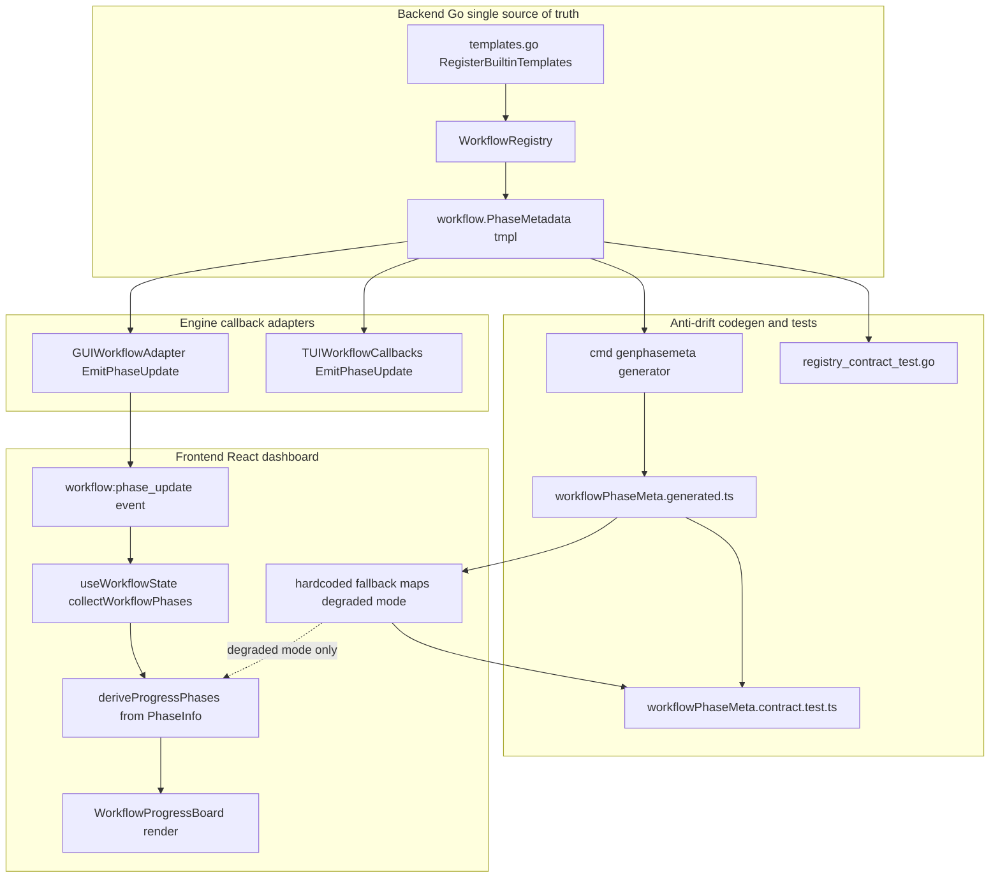
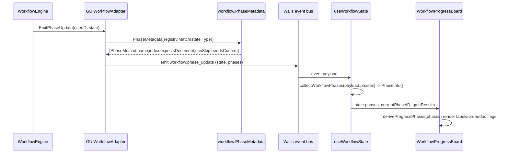
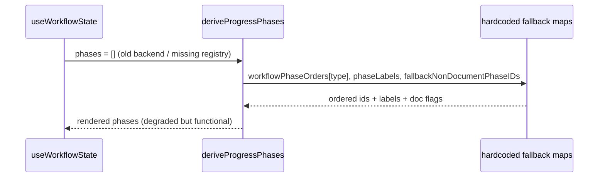

# Design Document: workflow-dashboard-consistency

## Overview

The workflow dashboard (the right-side "Workflow Progress Board" / document preview in the
desktop AI assistant panel, `WorkflowDocPreview.tsx`) renders per-phase metadata — the ordered
list of phases, their display labels, whether each phase produces a preview document, and the
current/active phase plus quality-gate status. Today a large slice of that metadata is duplicated
in the frontend as hand-maintained maps (`phaseLabels` ~100 entries, `workflowPhaseOrders` 19+
ordered lists, `fallbackNonDocumentPhaseIDs`). The authoritative copy already exists in the Go
workflow templates (`corelib/workflow/templates.go`): every `PhaseTemplate` carries `ID`, `Name`
(Chinese label), `ToolPolicy`, `NeedsConfirm`, and `CanSkip`. The two copies must be kept in sync
by hand, which is exactly the drift this codebase's steering rules call out.

This design makes the backend templates the **single source of truth** and has the dashboard derive
all phase metadata from backend-emitted data. The mechanism builds on the partial channel that
already exists: `normalizeWorkflowStateForFrontendWithRegistry` already attaches a derived
`phases: [{id, name, index, expects_document}]` array to the `workflow:phase_update` event, and the
frontend already *prefers* that array (`phaseIDsFromMetadata`, `phaseLabelMap`,
`phaseDocumentExpectationMap`) over the hardcoded maps when present. This design completes that
channel so the dashboard renders **purely from data**, retains the hardcoded maps only as a
degraded-mode fallback, and adds a contract/anti-drift mechanism (a generated artifact plus tests
on both sides) so the retained fallback maps can never silently diverge from the templates.

The fix is mechanism-level: the phase-metadata derivation is extracted into one exported function in
`corelib/workflow` that is fed by the templates and consumed by every renderer (GUI adapter, TUI
adapter, the code generator, and the contract test). Adding a new template or phase requires editing
only `templates.go`; the dashboard, the metadata payload, and the generated fallback all follow
automatically.

## Architecture



The key architectural decision: `workflow.PhaseMetadata(tmpl)` is the **one** place that turns a
template into renderable phase metadata. The GUI adapter (which already holds a `*WorkflowRegistry`),
the TUI adapter, the code generator, and the Go contract test all call it. The frontend never
recomputes phase semantics from phase IDs when metadata is present — it only reads.

## Sequence Diagrams

### Phase-update metadata flow (runtime)



### Graceful degradation (metadata absent)



## Components and Interfaces

### Component 1: `workflow.PhaseMetadata` (corelib/workflow)

**Purpose**: The single mechanism that derives dashboard-ready phase metadata from a template. New
code; it centralizes the rule currently inlined in `normalizeWorkflowPhasesForFrontend`.

**Interface**:

```go
// PhaseMeta is the dashboard-facing projection of a PhaseTemplate.
// It is the single serialized shape consumed by every renderer.
type PhaseMeta struct {
    ID              string `json:"id"`               // canonical phase id (aliases applied)
    Name            string `json:"name"`             // display label (template Name)
    Index           int    `json:"index"`            // 0-based order after dedup
    ExpectsDocument bool   `json:"expects_document"` // produces a preview document
    CanSkip         bool   `json:"can_skip"`         // phase is optional
    NeedsConfirm    bool   `json:"needs_confirm"`    // phase pauses for user confirmation
}

// PhaseMetadata projects a template's phases into ordered, de-duplicated PhaseMeta.
// Returns nil for a nil template.
func PhaseMetadata(tmpl *WorkflowTemplate) []PhaseMeta

// CanonicalPhaseID applies the alias table (tech_design->design, task_breakdown->tasks)
// so backend ids and the dashboard's legacy ids agree on one key.
func CanonicalPhaseID(phaseID string) string

// PhaseExpectsDocument is the single rule for whether a phase yields a preview document.
func PhaseExpectsDocument(p PhaseTemplate) bool
```

**Responsibilities**:
- Apply phase-ID canonicalization (alias table) once, in Go.
- Compute `ExpectsDocument` from `ToolPolicy` (`!= ToolFilterFull && != ToolFilterOpsControlled`).
- De-duplicate phases by canonical ID, preserving template order; re-index from 0.
- Be the only implementation of these rules; the GUI/TUI adapters and codegen call it.

### Component 2: `WorkflowRegistry.All` (corelib/workflow)

**Purpose**: Enumerate every registered template so the code generator and the Go contract test can
iterate the full set without hardcoding the 19+ types.

**Interface**:

```go
// All returns every registered template in a deterministic order (sorted by Type).
// Used by the code generator and contract tests, never on the hot path.
func (r *WorkflowRegistry) All() []*WorkflowTemplate
```

**Responsibilities**: Deterministic enumeration (sorted) so generated output is stable across runs.

### Component 3: `GUIWorkflowAdapter` / `TUIWorkflowCallbacks` (gui, tui)

**Purpose**: Attach the derived metadata to emitted events. `GUIWorkflowAdapter.EmitPhaseUpdate`
already calls `normalizeWorkflowStateForFrontendWithRegistry`; that helper is refactored to call
`workflow.PhaseMetadata`. TUI keeps parity by deriving the same metadata for any future board and by
sharing the identical function.

**Interface** (unchanged `EngineCallbacks`, refactored internals):

```go
func (a *GUIWorkflowAdapter) EmitPhaseUpdate(userID string, state *workflow.WorkflowState) error
```

**Responsibilities**:
- GUI: emit `workflow:phase_update` carrying `{..state.., phases: PhaseMeta[]}`.
- TUI: derive the same `PhaseMeta` slice (parity; rendered or logged structurally rather than
  re-listing phase strings).

### Component 4: `WorkflowDocPreview` / `useWorkflowState` (frontend)

**Purpose**: Render purely from emitted metadata; fall back to the (contract-tested) hardcoded maps
only when metadata is absent.

**Interface**:

```typescript
// Extended PhaseInfo carries the full metadata projection.
export interface PhaseInfo {
    id: string;
    name: string;
    index: number;
    expectsDocument?: boolean;
    canSkip?: boolean;
    needsConfirm?: boolean;
}

// deriveProgressPhases is the single frontend reducer: metadata first, fallback only if empty.
export function deriveProgressPhases(
    workflowType: string | undefined,
    phases: PhaseInfo[] | undefined,
    phaseDocuments: Map<string, string>,
    currentPhaseID: string,
): ProgressPhase[];

interface ProgressPhase {
    id: string;
    label: string;
    expectsDocument: boolean;
}
```

**Responsibilities**:
- Build order/labels/doc-flags from `PhaseInfo[]` when non-empty.
- Append any phase IDs seen only in `phaseDocuments`/`currentPhaseID` (robustness against
  out-of-template doc updates), as the current code already does.
- Retain `workflowPhaseOrders`, `phaseLabels`, `fallbackNonDocumentPhaseIDs`,
  `WorkflowProgressBoard` (the `check-main-ui-guards.mjs` guard requires the
  `WorkflowProgressBoard` and `workflowPhaseOrders` symbols to be present).

### Component 5: Anti-drift codegen + contract tests

**Purpose**: Guarantee the retained frontend fallback maps cannot silently diverge from the
templates.

**Interface**:
- `cmd/genphasemeta`: a Go generator that writes `workflowPhaseMeta.generated.ts` from
  `registry.All()` via `PhaseMetadata`.
- `registry_contract_test.go`: a Go test that regenerates the artifact in memory and fails if it
  differs from the committed file (catches "forgot to regenerate").
- `workflowPhaseMeta.contract.test.ts`: a frontend test asserting the hardcoded fallback maps are a
  subset of (and agree with) the generated artifact.

## Data Models

### Model 1: `PhaseMeta` (Go, emitted payload element)

```go
type PhaseMeta struct {
    ID              string `json:"id"`
    Name            string `json:"name"`
    Index           int    `json:"index"`
    ExpectsDocument bool   `json:"expects_document"`
    CanSkip         bool   `json:"can_skip"`
    NeedsConfirm    bool   `json:"needs_confirm"`
}
```

**Validation rules**:
- `ID` is non-empty and canonical (alias-applied).
- `Index` values within one workflow are `0..n-1`, contiguous, strictly increasing in slice order.
- `Name` is non-empty for every built-in template phase.

This replaces the narrower `frontendWorkflowPhase` (which carries only `id/name/index/
expects_document`); `frontendWorkflowState.Phases` becomes `[]PhaseMeta`.

### Model 2: `frontendWorkflowState` (Go, emitted root)

```go
type frontendWorkflowState struct {
    *workflow.WorkflowState
    Phases []workflow.PhaseMeta `json:"phases,omitempty"`
}
```

**Validation rules**: `Phases` is `omitempty` — when the registry is unavailable the field is
absent and the frontend degrades to fallback. `WorkflowState` is emitted as-is (current behavior),
with `CurrentPhase`, `PhaseOutputs`, and `GateResults` canonicalized.

### Model 3: `PhaseInfo` (TypeScript, parsed)

```typescript
export interface PhaseInfo {
    id: string;
    name: string;
    index: number;
    expectsDocument?: boolean;
    canSkip?: boolean;
    needsConfirm?: boolean;
}
```

**Validation rules**: `collectWorkflowPhases` drops entries with empty/duplicate `id`, sorts by
`index`, and only sets the optional booleans when the payload provides booleans (so `undefined`
cleanly signals "use fallback" per field).

### Model 4: Generated fallback artifact (TypeScript)

```typescript
// AUTO-GENERATED by cmd/genphasemeta. DO NOT EDIT.
export interface GeneratedPhaseMeta {
    id: string; name: string; index: number;
    expectsDocument: boolean; canSkip: boolean; needsConfirm: boolean;
}
export const WORKFLOW_PHASE_META: Record<string, GeneratedPhaseMeta[]>;
```

**Validation rules**: keys are workflow type strings; arrays mirror `PhaseMetadata` output exactly.

## Algorithmic Pseudocode

### Phase metadata derivation (Go)

```pascal
ALGORITHM PhaseMetadata(tmpl)
INPUT: tmpl of type *WorkflowTemplate
OUTPUT: metas of type []PhaseMeta

BEGIN
  IF tmpl = nil OR len(tmpl.Phases) = 0 THEN
    RETURN nil
  END IF

  seen  <- empty set of string
  metas <- empty list of PhaseMeta

  FOR each phase IN tmpl.Phases DO
    ASSERT all previously emitted PhaseMeta have contiguous Index 0..len(metas)-1

    id <- CanonicalPhaseID(phase.ID)
    IF id = "" OR seen.contains(id) THEN
      CONTINUE
    END IF
    seen.add(id)

    metas.append(PhaseMeta{
      ID:              id,
      Name:            phase.Name,
      Index:           len(metas),
      ExpectsDocument: PhaseExpectsDocument(phase),
      CanSkip:         phase.CanSkip,
      NeedsConfirm:    phase.NeedsConfirm,
    })
  END FOR

  ASSERT len(metas) = number of distinct canonical ids in tmpl.Phases
  RETURN metas
END
```

**Preconditions**: `tmpl` is a registered template or nil; `CanonicalPhaseID` is total.
**Postconditions**: result order is the template's phase order after removing duplicate canonical
IDs; `Index` is `0..len-1` contiguous; every entry has a non-empty `ID`.
**Loop invariants**: `len(metas) = |seen|`; emitted indices are contiguous and increasing.

### Document-expectation rule (Go)

```pascal
ALGORITHM PhaseExpectsDocument(p)
INPUT: p of type PhaseTemplate
OUTPUT: expects of type bool
BEGIN
  RETURN p.ToolPolicy <> ToolFilterFull AND p.ToolPolicy <> ToolFilterOpsControlled
END
```

**Preconditions**: `p.ToolPolicy` is one of the defined `ToolFilterPolicy` values.
**Postconditions**: execution phases (`implementation`, `test_execution`, `ppt_generation`,
`bp_doc_generation`, `controlled_execution`) return false; all document phases return true.

### Dashboard derivation (TypeScript)

```pascal
ALGORITHM deriveProgressPhases(workflowType, phases, phaseDocuments, currentPhaseID)
INPUT: phases of type PhaseInfo[] (may be empty), phaseDocuments map, currentPhaseID string
OUTPUT: ordered list of ProgressPhase

BEGIN
  base <- empty list
  IF phases is non-empty THEN
    FOR each p IN sortByIndex(phases) DO
      IF p.id = "" OR base.containsID(p.id) THEN CONTINUE END IF
      base.append({ id: p.id,
                    label: p.name OR fallbackLabel(p.id),
                    expectsDocument: p.expectsDocument ?? fallbackExpectsDocument(p.id) })
    END FOR
  ELSE
    // Graceful degradation: contract-tested hardcoded maps.
    FOR each id IN workflowPhaseOrders[workflowType] DO
      base.append({ id: id,
                    label: fallbackLabel(id),
                    expectsDocument: NOT fallbackNonDocumentPhaseIDs.has(id) })
    END FOR
  END IF

  // Robustness: surface phases that only appear as emitted documents or as the active phase.
  FOR each pid IN phaseDocuments.keys() DO
    IF NOT base.containsID(pid) THEN base.append(deriveSingle(pid)) END IF
  END FOR
  IF currentPhaseID <> "" AND NOT base.containsID(currentPhaseID) THEN
    base.append(deriveSingle(currentPhaseID))
  END IF

  RETURN base
END
```

**Preconditions**: `phases` parsed by `collectWorkflowPhases` (sorted, de-duplicated).
**Postconditions**: when `phases` is non-empty, the leading segment of the result equals the
template's phase order with template labels; appended IDs come only from documents/current phase.
**Loop invariants**: `base` contains no duplicate IDs at every step.

## Key Functions with Formal Specifications

### `func PhaseMetadata(tmpl *WorkflowTemplate) []PhaseMeta`

**Preconditions**: `tmpl == nil` is allowed.
**Postconditions**:
- `tmpl == nil || len(tmpl.Phases) == 0` ⟹ returns `nil`.
- For non-nil `tmpl`: `result[i].Index == i`; `result` IDs are the distinct canonical IDs of
  `tmpl.Phases` in first-occurrence order; no side effects on `tmpl`.
**Loop invariants**: emitted-index contiguity; `seen` size equals emitted count.

### `func (r *WorkflowRegistry) All() []*WorkflowTemplate`

**Preconditions**: `r` initialized via `NewWorkflowRegistry`.
**Postconditions**: returns one pointer per registered type, sorted by `Type`; no mutation; safe for
concurrent callers (read-locked snapshot).

### `function deriveProgressPhases(...): ProgressPhase[]`

**Preconditions**: inputs may be empty/undefined.
**Postconditions**: returns a duplicate-free ordered list; metadata-present output is a superset of
the fallback output for the same workflow type (every fallback phase ID is present, with a label).
**Loop invariants**: no duplicate IDs in the accumulator.

## Example Usage

```go
// GUI adapter: derive metadata at the emission boundary (single source of truth).
func normalizeWorkflowStateForFrontendWithRegistry(
    state *workflow.WorkflowState, registry *workflow.WorkflowRegistry,
) *frontendWorkflowState {
    if state == nil {
        return nil
    }
    cp := *state
    cp.CurrentPhase = canonicalWorkflowPhaseID(cp.CurrentPhase)
    cp.PhaseOutputs = normalizeWorkflowPhaseOutputs(state.PhaseOutputs)
    cp.GateResults = normalizeWorkflowGateResults(state.GateResults)

    var phases []workflow.PhaseMeta
    if registry != nil {
        phases = workflow.PhaseMetadata(registry.Match(state.Type)) // <- the one mechanism
    }
    return &frontendWorkflowState{WorkflowState: &cp, Phases: phases}
}
```

```typescript
// Dashboard: render purely from emitted metadata, fallback only when absent.
const progress = deriveProgressPhases(workflowType, phases, phaseDocuments, currentPhaseID);
return (
    <WorkflowProgressBoard
        phaseIDs={progress.map(p => p.id)}
        phaseLabelMap={new Map(progress.map(p => [p.id, p.label]))}
        phaseDocumentExpectationMap={new Map(progress.map(p => [p.id, p.expectsDocument]))}
        currentPhaseID={currentPhaseID}
        gateResults={gateResults}
    />
);
```

```go
// Anti-drift: regenerate the fallback artifact from templates.
func main() {
    r := workflow.NewWorkflowRegistry()
    out := map[string][]workflow.PhaseMeta{}
    for _, tmpl := range r.All() {
        out[string(tmpl.Type)] = workflow.PhaseMetadata(tmpl)
    }
    writeGeneratedTS("gui/frontend/src/components/ai/workflowPhaseMeta.generated.ts", out)
}
```

## Correctness Properties

These are stated as universally-quantified properties suitable for property-based testing
(Go: `testing/quick` or `pgregory.net/rapid`; TypeScript: `fast-check`). The generator over
templates is `registry.All()`; the generator over phases is each template's `Phases`.

### Property 1: Dashboard-derived phase order equals template phase order

**Validates: Requirements 1.1**

For every registered template `t`, the ordered list of phase IDs the dashboard derives from emitted
metadata equals the template's phase order after canonicalization and de-duplication.

```
∀ t ∈ registry.All():
    map(p -> p.ID, PhaseMetadata(t))
        == dedup(map(p -> CanonicalPhaseID(p.ID), t.Phases))
```

```go
// Property test (Go, over all templates).
func TestProp_PhaseOrderMatchesTemplate(t *testing.T) {
    r := workflow.NewWorkflowRegistry()
    for _, tmpl := range r.All() {
        metas := workflow.PhaseMetadata(tmpl)
        want := dedupCanonical(tmpl.Phases) // []string in first-occurrence order
        got := idsOf(metas)
        if !reflect.DeepEqual(got, want) {
            t.Fatalf("%s: order %v != template %v", tmpl.Type, got, want)
        }
        for i, m := range metas { // index contiguity
            if m.Index != i { t.Fatalf("%s: index %d != %d", tmpl.Type, m.Index, i) }
        }
    }
}
```

### Property 2: Every emitted phaseID has a non-empty label

**Validates: Requirements 1.2**

For every registered template, every derived `PhaseMeta` has a non-empty `Name`, so the dashboard
never renders a bare phase ID for a built-in workflow.

```
∀ t ∈ registry.All(): ∀ m ∈ PhaseMetadata(t): m.Name ≠ ""
```

### Property 3: Metadata-present rendering ⊇ hardcoded-fallback rendering

**Validates: Requirements 3.1**

For every workflow type that has a hardcoded fallback order, the set of phase IDs rendered from
metadata is a superset of the fallback order, and every such ID resolves to a label. (Metadata is at
least as complete as the fallback; switching to metadata never loses a phase.)

```
∀ type with workflowPhaseOrders[type]:
    set(workflowPhaseOrders[type]) ⊆ set(map(p -> p.id, deriveProgressPhases(type, metadata(type), {}, "")))
    ∧ ∀ id ∈ that set: label(id) ≠ ""
```

```typescript
// Property test (fast-check, over known workflow types).
it("metadata rendering is a superset of fallback", () => {
    fc.assert(fc.property(fc.constantFrom(...Object.keys(workflowPhaseOrders)), (type) => {
        const meta = WORKFLOW_PHASE_META[type].map(m => ({ ...m })) as PhaseInfo[];
        const ids = new Set(deriveProgressPhases(type, meta, new Map(), "").map(p => p.id));
        return workflowPhaseOrders[type].every(id => ids.has(id));
    }));
});
```

### Property 4: Fallback maps agree with generated artifact (anti-drift)

**Validates: Requirements 2.1, 2.2**

Every entry in the hardcoded fallback maps that overlaps the generated artifact must agree with it:
same label for a given ID, same document-expectation, and fallback order is a (possibly aliased)
sublist of the generated order. This is the property that prevents silent drift.

```
∀ type, ∀ id ∈ workflowPhaseOrders[type]:
    let g = generatedPhase(type, id) in
    g ≠ ⊥ ⟹ ( phaseLabels[id] = ⊥ ∨ phaseLabels[id] = g.name )
          ∧ ( fallbackNonDocumentPhaseIDs.has(id) = ¬g.expectsDocument )
```

```typescript
it("hardcoded fallback never drifts from generated artifact", () => {
    for (const [type, order] of Object.entries(workflowPhaseOrders)) {
        const gen = new Map(WORKFLOW_PHASE_META[type]?.map(m => [m.id, m]) ?? []);
        for (const id of order) {
            const g = gen.get(id);
            if (!g) continue;
            if (phaseLabels[id] !== undefined) expect(phaseLabels[id]).toBe(g.name);
            expect(fallbackNonDocumentPhaseIDs.has(id)).toBe(!g.expectsDocument);
        }
    }
});
```

### Property 5: Generated artifact is up to date

**Validates: Requirements 2.3**

Regenerating the artifact in memory from the live registry must byte-equal the committed file. This
catches "edited a template but forgot to regenerate".

```
generate(registry.All()) == read("workflowPhaseMeta.generated.ts")
```

```go
func TestProp_GeneratedArtifactUpToDate(t *testing.T) {
    inMemory := renderGeneratedTS(workflow.NewWorkflowRegistry())
    onDisk, _ := os.ReadFile(generatedTSPath)
    if normalizeEOL(inMemory) != normalizeEOL(string(onDisk)) {
        t.Fatal("workflowPhaseMeta.generated.ts is stale; run `go generate ./...`")
    }
}
```

### Property 6: Document-expectation is determined solely by ToolPolicy

**Validates: Requirements 1.3**

For every phase of every template, `ExpectsDocument` is false iff the phase uses a non-document tool
policy. This pins the rule to one definition.

```
∀ t ∈ registry.All(): ∀ p ∈ t.Phases:
    PhaseExpectsDocument(p) = (p.ToolPolicy ≠ ToolFilterFull ∧ p.ToolPolicy ≠ ToolFilterOpsControlled)
```

### Property 7: Round-trip stability of the emitted payload

**Validates: Requirements 1.4**

Marshaling `PhaseMetadata(t)` to JSON and parsing it with `collectWorkflowPhases` preserves IDs,
order, and the three boolean flags (no information loss across the wire).

```
∀ t: collectWorkflowPhases(JSON(PhaseMetadata(t))) ≅ PhaseMetadata(t)   (by id, index, flags)
```

## Error Handling

### Scenario 1: Registry unavailable at emission

**Condition**: `a.engine` or `registry` is nil when `EmitPhaseUpdate` runs (e.g., during early
startup or in a code path without an engine).
**Response**: `Phases` is omitted from the payload (`omitempty`).
**Recovery**: Frontend `deriveProgressPhases` sees an empty `phases` array and uses the hardcoded
fallback maps. The dashboard remains functional (degraded mode).

### Scenario 2: Phase ID emitted that is not in the template

**Condition**: A `workflow:doc_update` or `current_phase` references a phase ID not present in
`PhaseMetadata` (legacy/aliased path).
**Response**: `deriveProgressPhases` appends the phase via `deriveSingle(pid)`, using the metadata
label map first and the hardcoded `phaseLabels`/alias switch as the per-ID fallback.
**Recovery**: The phase still renders with a best-effort label; never crashes, never drops the doc.

### Scenario 3: Stale generated artifact

**Condition**: A template changed but `workflowPhaseMeta.generated.ts` was not regenerated.
**Response**: Go test (Property 5) fails in CI with an actionable message ("run `go generate ./...`").
**Recovery**: Developer regenerates; the contract is restored before merge.

### Scenario 4: Fallback map drift

**Condition**: Someone edits `phaseLabels`/`workflowPhaseOrders` to disagree with templates.
**Response**: Frontend contract test (Property 4) fails.
**Recovery**: Developer reconciles the hardcoded entry with the template (or removes the redundant
hardcoded entry, since metadata now drives rendering).

### Scenario 5: Empty/whitespace phase name in a template

**Condition**: A new template phase ships with an empty `Name`.
**Response**: Go property test (Property 2) fails.
**Recovery**: Author supplies a label in the template (single source of truth), not in the frontend.

## Testing Strategy

### Unit testing approach

- `corelib/workflow`: table tests for `PhaseMetadata` (coding/PPT/ops templates covering
  `ToolFilterFull`, `ToolFilterOpsControlled`, `CanSkip`, alias collapse `tech_design->design`),
  `CanonicalPhaseID`, `PhaseExpectsDocument`, and `All()` determinism.
- `gui`: tests for `normalizeWorkflowStateForFrontendWithRegistry` (metadata present vs nil registry)
  asserting the emitted JSON shape.
- frontend: `collectWorkflowPhases` (drops empty/dup, sorts by index, optional booleans), and
  `deriveProgressPhases` (metadata-first, fallback-when-empty, document/current-phase appending).

### Property-based testing approach

Properties 1–7 above. **Property test library**: Go uses `pgregory.net/rapid` (preferred; falls
back to `testing/quick` if rapid is not yet a dependency) generating over `registry.All()` and over
synthetic templates with randomized phase lists/policies/aliases; TypeScript uses `fast-check`
generating over workflow types and over synthetic `PhaseInfo[]` arrays. The synthetic generators are
what make Properties 1, 6 and 7 hold for *any* template, not just the 19 built-ins -- this is the anti-drift
guarantee at the mechanism level.

### Integration / contract testing approach

- **Go contract test** (Property 5): regenerate `workflowPhaseMeta.generated.ts` in memory and compare to
  the committed file.
- **Frontend contract test** (Property 3, Property 4): assert hardcoded fallback maps are a subset of and agree with
  the generated artifact.
- **UI guard**: extend the existing `scripts/check-main-ui-guards.mjs` invariants —
  `WorkflowProgressBoard` and `workflowPhaseOrders` must still be present (retained as fallback), and
  add a check that `workflowPhaseMeta.generated.ts` exists and is imported by the contract test, so
  the anti-drift wiring cannot be deleted silently.
- **TUI parity test**: assert `TUIWorkflowCallbacks` derives metadata via the same
  `workflow.PhaseMetadata` (no separate phase list).

## Performance Considerations

- `PhaseMetadata` is O(phases-per-workflow) (≤ ~6) and runs once per `EmitPhaseUpdate`; negligible.
- `registry.All()` and the generator run offline (`go generate`) or in tests, never on the hot path.
- The payload grows by two booleans per phase (`can_skip`, `needs_confirm`) — a few bytes per event;
  no measurable impact on the Wails event bus.
- Frontend derivation is memoized (`useMemo` over `phases`/`phaseDocuments`/`currentPhaseID`), as it
  already is for `phaseLabelMap`/`phaseDocumentExpectationMap`.

## Security Considerations

- No new external inputs, network surface, or auth changes. Metadata originates from
  compiled-in Go templates, not user input.
- Phase `Name`/labels are rendered as text in the dashboard (no `dangerouslySetInnerHTML`); the
  existing React text rendering path is unchanged.
- The generator writes only into the repo's frontend source tree at build/dev time; it performs no
  runtime file access in the shipped app.

## Dependencies

- **Backend**: `corelib/workflow` (templates, registry, types) — already present. No new Go modules
  required for the mechanism. Property tests may add `pgregory.net/rapid` (dev/test only); if adding
  a dependency is undesirable, `testing/quick` (stdlib) is the fallback.
- **Frontend**: existing React + Wails runtime; `fast-check` for property tests (dev dependency; add
  if not already present).
- **Tooling**: a new `cmd/genphasemeta` Go program wired via a `//go:generate` directive; the
  existing `scripts/check-main-ui-guards.mjs` prebuild gate (extended, not replaced).
- **Cross-cutting invariants to preserve**:
  - `scripts/check-main-ui-guards.mjs` must still find `WorkflowProgressBoard` and
    `workflowPhaseOrders` in `WorkflowDocPreview.tsx`.
  - `EngineCallbacks` interface signatures are unchanged (`EmitPhaseUpdate(userID, *WorkflowState)`),
    so GUI and TUI adapters stay drop-in compatible.
  - Mermaid keywords are lowercase per steering (all diagrams above use `graph`/`subgraph`/`end`/
    `sequenceDiagram`).
