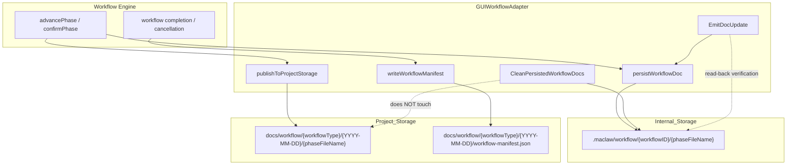
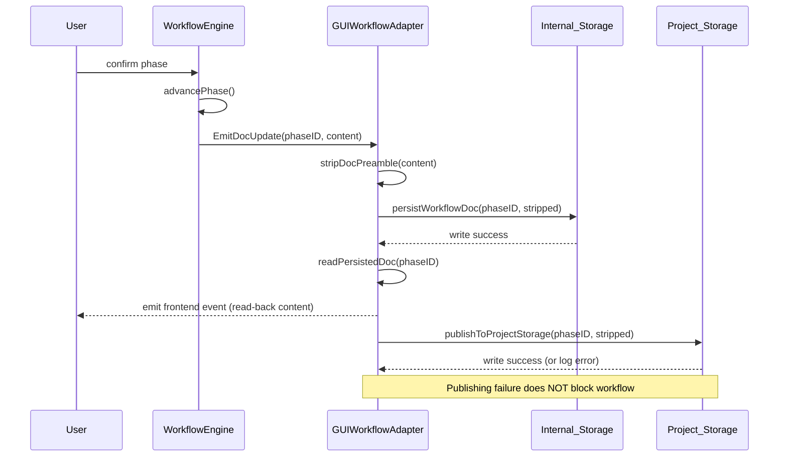
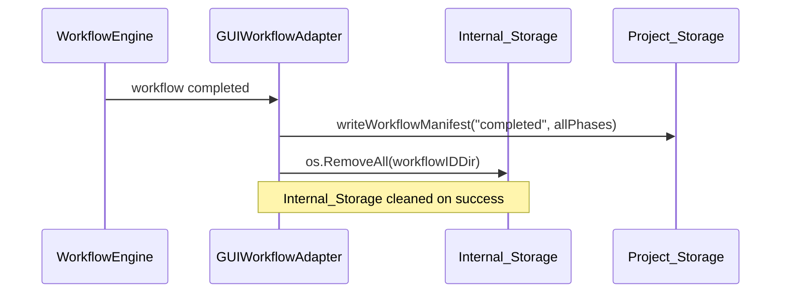

# Design Document: Workflow Document Project Persistence

## Overview

This feature introduces a dual-layer document persistence architecture for MacLaw's workflow engine. Currently, workflow phase documents are stored only in a hidden `.maclaw/workflow/{workflowID}/` directory (Internal_Storage) and are deleted when a new workflow starts. This design adds a user-accessible Project_Storage layer that publishes finalized documents to `{projectPath}/docs/workflow/{workflowType}/{YYYY-MM-DD}/`, preserving them across workflow sessions for version control and reference.

**Key design goals:**
- Non-blocking: publishing failures never interrupt workflow execution
- Predictable: file names are deterministic and consistent across all 22 templates
- Collision-safe: timestamped subdirectories with numeric suffixes prevent overwrites
- Backward-compatible: existing Internal_Storage behavior is preserved

## Architecture



**Two storage layers:**

| Layer | Path | Lifecycle | Purpose |
|-------|------|-----------|---------|
| Internal_Storage | `{workingDir}/.maclaw/workflow/{activeWorkflowID}/` | Cleaned on new workflow start; removed on successful completion | Intermediate persistence for preview panel, crash recovery |
| Project_Storage | `{workingDir}/docs/workflow/{workflowType}/{YYYY-MM-DD}/` | Permanent, never auto-deleted | User-accessible deliverables, version control |

## Components and Interfaces

### Modified: `GUIWorkflowAdapter`

New fields:
```go
type GUIWorkflowAdapter struct {
    // ... existing fields ...
    workingDir        string          // locked working directory (existing)
    activeWorkflowID  string          // current workflow instance ID (existing)
    activeWorkflowType WorkflowType   // workflow type for Project_Storage path
    workflowStartDate time.Time       // start date for date subdirectory
    projectStorageDir string          // cached resolved Project_Storage date directory
    mu               sync.RWMutex    // protects above fields (existing)
}
```

### New method: `publishToProjectStorage(phaseID, content string)`

Publishes a confirmed phase document to Project_Storage. Called from `advancePhase` (or equivalent phase confirmation handler).

```go
func (a *GUIWorkflowAdapter) publishToProjectStorage(phaseID, content string) {
    if strings.TrimSpace(content) == "" {
        return
    }
    dir := a.resolveProjectStorageDir()
    if dir == "" {
        return // no workingDir or no workflow type
    }
    if err := os.MkdirAll(dir, 0755); err != nil {
        log.Printf("[WorkflowAdapter] publish: failed to create dir %s: %v", dir, err)
        return // non-blocking
    }
    fileName := workflowPhaseFileName(phaseID)
    filePath := filepath.Join(dir, fileName)
    if err := os.WriteFile(filePath, []byte(content), 0644); err != nil {
        log.Printf("[WorkflowAdapter] publish: failed to write %s: %v", filePath, err)
    } else {
        log.Printf("[WorkflowAdapter] published to project storage: %s (%d bytes)", filePath, len(content))
    }
}
```

### New method: `resolveProjectStorageDir() string`

Resolves and caches the Project_Storage date directory path. Handles collision avoidance on first call.

```go
func (a *GUIWorkflowAdapter) resolveProjectStorageDir() string {
    a.mu.RLock()
    cached := a.projectStorageDir
    a.mu.RUnlock()
    if cached != "" {
        return cached
    }

    projectPath := a.workflowProjectPath()
    if projectPath == "" {
        return ""
    }
    a.mu.RLock()
    wfType := a.activeWorkflowType
    startDate := a.workflowStartDate
    a.mu.RUnlock()
    if wfType == "" {
        return ""
    }

    typeDir := workflowTypeToKebab(wfType)
    dateStr := startDate.Format("2006-01-02")
    baseDir := filepath.Join(projectPath, "docs", "workflow", typeDir)
    dir := resolveCollisionFreeDir(baseDir, dateStr)

    a.mu.Lock()
    a.projectStorageDir = dir
    a.mu.Unlock()
    return dir
}
```

### New method: `writeWorkflowManifest(status string, phases []ManifestPhaseEntry)`

Writes `workflow-manifest.json` to the Project_Storage date directory.

```go
type WorkflowManifest struct {
    WorkflowType  string               `json:"workflow_type"`
    TemplateName  string               `json:"template_name"`
    StartedAt     string               `json:"started_at"`
    CompletedAt   string               `json:"completed_at"`
    Status        string               `json:"status"` // "completed" or "cancelled"
    Phases        []ManifestPhaseEntry  `json:"phases"`
}

type ManifestPhaseEntry struct {
    PhaseID  string `json:"phase_id"`
    FileName string `json:"file_name"`
    Title    string `json:"title"`
}

func (a *GUIWorkflowAdapter) writeWorkflowManifest(status string, phases []ManifestPhaseEntry) {
    dir := a.resolveProjectStorageDir()
    if dir == "" {
        return
    }
    manifest := WorkflowManifest{
        WorkflowType: string(a.activeWorkflowType),
        TemplateName: a.resolveTemplateName(),
        StartedAt:    a.workflowStartDate.Format(time.RFC3339),
        CompletedAt:  time.Now().Format(time.RFC3339),
        Status:       status,
        Phases:       phases,
    }
    data, err := json.MarshalIndent(manifest, "", "  ")
    if err != nil {
        log.Printf("[WorkflowAdapter] manifest: marshal error: %v", err)
        return
    }
    filePath := filepath.Join(dir, "workflow-manifest.json")
    if err := os.MkdirAll(dir, 0755); err != nil {
        log.Printf("[WorkflowAdapter] manifest: mkdir error %s: %v", dir, err)
        return
    }
    if err := os.WriteFile(filePath, data, 0644); err != nil {
        log.Printf("[WorkflowAdapter] manifest: write error %s: %v", filePath, err)
    } else {
        log.Printf("[WorkflowAdapter] wrote manifest: %s", filePath)
    }
}
```

### New function: `workflowPhaseFileName(phaseID string) string`

Maps phase IDs to predictable file names. Known phases get numbered prefixes; unknown phases are sanitized.

```go
var knownPhaseFileNames = map[string]string{
    // coding workflow
    "requirements":    "01-requirements.md",
    "tech_design":     "02-technical-design.md",
    "task_breakdown":  "03-task-breakdown.md",
    "implementation":  "04-implementation.md",
    "review":          "05-review.md",

    // product_design workflow
    "problem_discovery": "01-problem-discovery.md",
    "solution_design":   "02-solution-design.md",
    "prd":               "03-prd.md",
    "prototype":         "04-prototype.md",

    // innovation workflow
    "opportunity":  "01-opportunity.md",
    "ideation":     "02-ideation.md",
    "validation":   "03-validation.md",
    "roadmap":      "04-roadmap.md",
    "action_plan":  "05-action-plan.md",

    // business_plan workflow
    "bp_requirement":    "01-requirement.md",
    "bp_content":        "02-content.md",
    "bp_structure":      "03-structure.md",
    "bp_visual_design":  "04-visual-design.md",
    "bp_doc_generation": "05-doc-generation.md",

    // testing workflow
    "test_strategy":    "01-test-strategy.md",
    "test_design":      "02-test-design.md",
    "test_environment": "03-test-environment.md",
    "test_execution":   "04-test-execution.md",
    "defect_report":    "05-defect-report.md",

    // literature_review workflow
    "topic_definition":          "01-topic-definition.md",
    "literature_search":         "02-literature-search.md",
    "screening_classification":  "03-screening-classification.md",
    "content_extraction":        "04-content-extraction.md",
    "review_writing":            "05-review-writing.md",

    // research_report workflow
    "requirement_scoping": "01-requirement-scoping.md",
    "source_mapping":      "02-source-mapping.md",
    "report_collection":   "03-report-collection.md",
    "insight_extraction":  "04-insight-extraction.md",
    "synthesis_report":    "05-synthesis-report.md",

    // experiment_design workflow
    "hypothesis_formulation": "01-hypothesis.md",
    "experiment_design":      "02-experiment-design.md",
    "variable_control":       "03-variable-control.md",
    "data_collection":        "04-data-collection.md",
    "analysis_plan":          "05-analysis-plan.md",

    // grant_proposal workflow
    "topic_justification": "01-topic-justification.md",
    "research_status":     "02-research-status.md",
    "research_plan":       "03-research-plan.md",
    "expected_outcomes":   "04-expected-outcomes.md",
    "budget_plan":         "05-budget-plan.md",

    // paper_writing workflow
    "paper_outline":    "01-paper-outline.md",
    "literature_basis": "02-literature-basis.md",
    "methodology":      "03-methodology.md",
    "results_writing":  "04-results.md",
    "paper_polish":     "05-polish.md",

    // project_proposal workflow
    "project_background": "01-background.md",
    "project_objectives": "02-objectives.md",
    "project_plan":       "03-plan.md",
    "resource_budget":    "04-resource-budget.md",
    "risk_assessment":    "05-risk-assessment.md",

    // event_planning workflow
    "event_objectives":  "01-objectives.md",
    "event_concept":     "02-concept.md",
    "event_logistics":   "03-logistics.md",
    "event_promotion":   "04-promotion.md",
    "event_execution":   "05-execution-plan.md",

    // competitive_analysis workflow
    "market_landscape":    "01-market-landscape.md",
    "competitor_profiles": "02-competitor-profiles.md",
    "feature_comparison":  "03-feature-comparison.md",
    "strategy_analysis":   "04-strategy-analysis.md",
    "recommendations":     "05-recommendations.md",

    // presentation_design workflow
    "audience_goal":    "01-audience-goal.md",
    "content_outline":  "02-content-outline.md",
    "slide_scripting":  "03-slide-scripting.md",
    "visual_design":    "04-visual-design.md",
    "ppt_generation":   "05-ppt-generation.md",

    // ops_maintenance workflow
    "ops_intake":            "01-ops-intake.md",
    "readonly_collection":   "02-readonly-collection.md",
    "artifact_plan":         "03-maintenance-artifacts.md",
    "risk_policy":           "04-risk-policy.md",
    "controlled_execution":  "05-controlled-execution.md",

    // bid_response workflow
    "bid_parsing":       "01-bid-parsing.md",
    "qualification":     "02-qualification.md",
    "technical_proposal":"03-technical-proposal.md",
    "commercial_quote":  "04-commercial-quote.md",
    "document_assembly": "05-document-assembly.md",

    // contract_review workflow
    "contract_parsing":  "01-contract-parsing.md",
    "clause_risk":       "02-clause-risk.md",
    "compliance_check":  "03-compliance-check.md",
    "revision_suggest":  "04-revision-suggestions.md",
    "review_opinion":    "05-review-opinion.md",

    // due_diligence workflow
    "company_profile":     "01-company-profile.md",
    "business_dd":         "02-business-dd.md",
    "financial_dd":        "03-financial-dd.md",
    "legal_dd":            "04-legal-dd.md",
    "dd_conclusion":       "05-dd-conclusion.md",

    // compliance_audit workflow
    "audit_scope":       "01-audit-scope.md",
    "compliance_assess": "02-compliance-assessment.md",
    "risk_rating":       "03-risk-rating.md",
    "remediation_plan":  "04-remediation-plan.md",
    "audit_report":      "05-audit-report.md",

    // patent_analysis workflow
    "tech_parsing":      "01-tech-parsing.md",
    "prior_art":         "02-prior-art.md",
    "infringement_eval": "03-infringement-eval.md",
    "strategy_suggest":  "04-strategy-suggestions.md",
    "analysis_report":   "05-analysis-report.md",

    // changjiang_scholar workflow
    "scholar_profile":     "01-scholar-profile.md",
    "research_direction":  "02-research-direction.md",
    "achievement_summary": "03-achievements.md",
    "development_plan":    "04-development-plan.md",
    "application_doc":     "05-application.md",

    // changjiang_scholar_review workflow
    "review_criteria":     "01-review-criteria.md",
    "material_review":     "02-material-review.md",
    "scoring_evaluation":  "03-scoring.md",
    "comparison_analysis": "04-comparison.md",
    "review_conclusion":   "05-conclusion.md",
}

func workflowPhaseFileName(phaseID string) string {
    canonical := canonicalWorkflowPhaseID(phaseID)
    if name, ok := knownPhaseFileNames[canonical]; ok {
        return name
    }
    stem := sanitizeWorkflowPhaseFileStem(canonical)
    if stem == "" {
        return "workflow-phase.md"
    }
    return stem + ".md"
}
```

### New function: `sanitizeWorkflowPhaseFileStem(input string) string`

Produces a file stem containing only `[a-z0-9-]`, no leading/trailing/consecutive hyphens.

```go
func sanitizeWorkflowPhaseFileStem(input string) string {
    lower := strings.ToLower(input)
    // Replace each run of non-[a-z0-9] characters with a single hyphen
    var buf strings.Builder
    inRun := false
    for _, r := range lower {
        if (r >= 'a' && r <= 'z') || (r >= '0' && r <= '9') {
            if inRun && buf.Len() > 0 {
                buf.WriteByte('-')
            }
            inRun = false
            buf.WriteRune(r)
        } else {
            inRun = true
        }
    }
    result := buf.String()
    // Strip leading/trailing hyphens (shouldn't happen with above logic, but defensive)
    result = strings.Trim(result, "-")
    return result
}
```

### New function: `resolveCollisionFreeDir(baseDir, dateStr string) string`

Scans existing date directories and appends a numeric suffix if needed.

```go
func resolveCollisionFreeDir(baseDir, dateStr string) string {
    candidate := filepath.Join(baseDir, dateStr)
    if _, err := os.Stat(candidate); os.IsNotExist(err) {
        return candidate
    }
    // First collision: try -2, -3, ...
    for i := 2; i <= 100; i++ {
        suffixed := filepath.Join(baseDir, fmt.Sprintf("%s-%d", dateStr, i))
        if _, err := os.Stat(suffixed); os.IsNotExist(err) {
            return suffixed
        }
    }
    // Extremely unlikely: fall back to timestamp
    return filepath.Join(baseDir, fmt.Sprintf("%s-%d", dateStr, time.Now().UnixNano()))
}
```

### New function: `workflowTypeToKebab(wt WorkflowType) string`

Converts WorkflowType constants to kebab-case directory names.

```go
func workflowTypeToKebab(wt WorkflowType) string {
    return strings.ReplaceAll(string(wt), "_", "-")
}
```

## Data Models

### WorkflowManifest (JSON)

```json
{
  "workflow_type": "coding",
  "template_name": "编程开发",
  "started_at": "2026-05-01T14:30:00+08:00",
  "completed_at": "2026-05-01T16:45:00+08:00",
  "status": "completed",
  "phases": [
    {
      "phase_id": "requirements",
      "file_name": "01-requirements.md",
      "title": "需求分析"
    },
    {
      "phase_id": "tech_design",
      "file_name": "02-technical-design.md",
      "title": "技术设计"
    },
    {
      "phase_id": "task_breakdown",
      "file_name": "03-task-breakdown.md",
      "title": "任务拆分"
    }
  ]
}
```

### Directory Structure Example

```
D:\workprj\snake\
├── docs/
│   └── workflow/
│       └── coding/
│           ├── 2026-05-01/
│           │   ├── 01-requirements.md
│           │   ├── 02-technical-design.md
│           │   ├── 03-task-breakdown.md
│           │   └── workflow-manifest.json
│           └── 2026-05-01-2/          ← collision avoidance
│               ├── 01-requirements.md
│               └── workflow-manifest.json
├── .maclaw/
│   └── workflow/
│       └── wf_abc123/                 ← Internal_Storage (active workflow)
│           ├── 01-requirements.md
│           └── 02-technical-design.md
└── src/
    └── ...
```

### Data Flow: Phase Confirmation



### Data Flow: Workflow Completion



## Correctness Properties

*A property is a characteristic or behavior that should hold true across all valid executions of a system — essentially, a formal statement about what the system should do. Properties serve as the bridge between human-readable specifications and machine-verifiable correctness guarantees.*

### Property 1: Publish path correctness

*For any* valid combination of workingDir, workflowType, workflow start date, and phaseID, calling `publishToProjectStorage` SHALL produce a file at the path `{workingDir}/docs/workflow/{kebab(workflowType)}/{YYYY-MM-DD}/{workflowPhaseFileName(phaseID)}`.

**Validates: Requirements 1.1, 8.1**

### Property 2: Publish content round-trip

*For any* non-empty content string, publishing it via `publishToProjectStorage` and then reading the file back SHALL produce byte-for-byte identical content. Publishing the same phaseID twice with different content SHALL result in only the latest content being present on disk.

**Validates: Requirements 1.3, 1.4**

### Property 3: Clean preserves Project_Storage

*For any* set of files in Project_Storage, calling `CleanPersistedWorkflowDocs` SHALL leave all Project_Storage files unchanged (same paths, same content, same count).

**Validates: Requirements 2.1**

### Property 4: Manifest structure correctness

*For any* valid workflow metadata (type, start time, completion time, list of confirmed phases), calling `writeWorkflowManifest` SHALL produce a valid JSON file containing all fields with ISO 8601 timestamps, the correct status string, and a phases array matching the input.

**Validates: Requirements 2.3, 2.4**

### Property 5: workingDir invariant across phase transitions

*For any* sequence of phase transitions within a single workflow instance, the workingDir value SHALL remain constant (equal to the value set at workflow start) until the workflow is explicitly completed or cancelled.

**Validates: Requirements 4.3**

### Property 6: Known phase ID file name completeness

*For every* phase ID defined in any of the 22 registered workflow templates, `workflowPhaseFileName` SHALL return a non-empty string that matches the pattern `^[0-9]{2}-[a-z][a-z0-9-]*\.md$`.

**Validates: Requirements 6.1, 6.2, 6.6**

### Property 7: Sanitization output invariant

*For any* arbitrary input string, `sanitizeWorkflowPhaseFileStem` SHALL produce either an empty string (triggering the fallback) or a string matching `^[a-z0-9]([a-z0-9-]*[a-z0-9])?$` — containing only lowercase ASCII letters, digits, and hyphens, with no leading hyphen, no trailing hyphen, and no consecutive hyphens.

**Validates: Requirements 6.3, 6.5**

### Property 8: Read/write path consistency

*For any* phaseID, the file path resolved by `readPersistedDoc(phaseID)` SHALL be identical to the file path used by `persistWorkflowDoc(phaseID, content)`, given the same adapter state (workingDir, activeWorkflowID).

**Validates: Requirements 7.4**

### Property 9: WorkflowType kebab-case output

*For any* WorkflowType constant defined in the system, `workflowTypeToKebab` SHALL produce a string containing only lowercase ASCII letters and hyphens (matching `^[a-z]+(-[a-z]+)*$`).

**Validates: Requirements 8.2**

### Property 10: Date collision avoidance

*For any* number N (0 ≤ N ≤ 99) of existing date directories with the same base date string, `resolveCollisionFreeDir` SHALL return a path that does not exist on disk. For N=0, the path has no suffix. For N≥1, the path has suffix `-{N+1}`.

**Validates: Requirements 8.4**

## Error Handling

**Design principle: log-and-continue.** Publishing to Project_Storage is a best-effort operation. Failures must never block workflow execution.

| Error scenario | Handling |
|---------------|----------|
| `workingDir` is empty | Skip publishing silently (no log) |
| `os.MkdirAll` fails (permissions, disk full) | Log error with full path, return without writing |
| `os.WriteFile` fails (permissions, disk full) | Log error with full path and byte count |
| `json.MarshalIndent` fails (shouldn't happen with simple types) | Log error, skip manifest |
| `os.Stat` fails during collision check (not IsNotExist) | Treat as "exists", try next suffix |
| `os.RemoveAll` fails during Internal_Storage cleanup | Log error, continue workflow startup |
| `readPersistedDoc` fails after write | Fall back to in-memory content for frontend event |

All log messages use the `[WorkflowAdapter]` prefix with the sub-operation (publish/manifest/clean) for grep-ability.

## Testing Strategy

**Dual testing approach:**
- **Property tests** (fast-check/rapid): Verify universal properties across randomized inputs (minimum 100 iterations per property)
- **Unit tests**: Verify specific examples, edge cases, and integration points

**Property-based testing library:** `pgregory.net/rapid` (already used in the project for memory package tests)

**Property test configuration:**
- Minimum 100 iterations per property test
- Each property test references its design document property
- Tag format: **Feature: workflow-doc-project-persistence, Property {number}: {property_text}**

**Unit tests cover:**
- Known phase ID mapping table completeness (all 22 templates × all phases)
- Sanitization edge cases: empty string, all-whitespace, all-unicode, mixed
- Collision avoidance with 0, 1, 5 existing directories
- Manifest JSON structure validation
- `CleanPersistedWorkflowDocs` does not touch `docs/workflow/` directory
- `workflowProjectPath()` fallback behavior
- `EmitDocUpdate` read-back verification flow
- Error paths: read-only directories, missing workingDir

**Integration tests cover:**
- Full workflow lifecycle: start → confirm phases → complete → verify Project_Storage
- Cancellation mid-workflow: verify partial manifest and preserved files
- New workflow start: verify Internal_Storage cleaned, Project_Storage untouched
