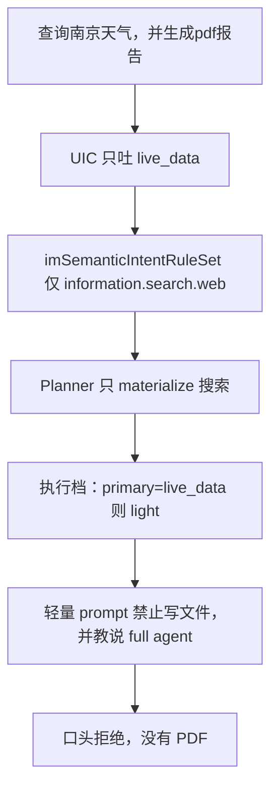
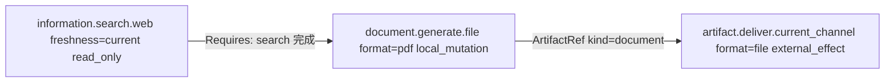

# 文档生成语义路由切片

本切片挂在 [统一语义工具路由设计](./semantic-tool-routing-design-zh.md) 下，补齐与截图 DAG 对等的**文档生成**能力。事故形态是：实时查询并生成 PDF 被压成 lookup，模型口头拒绝并让用户去改「完整代理模式」。本切片**不退回 legacy 全量工具面**。

父文档 11.1 / 11.2 已规定：`generate_pdf`、打开文件、投递已有附件是不同 capability / effect contract。宽标签 `document_delivery` 仍未迁移，本切片**不复用该标签**。

## 0. 相对初稿的修订

评审后改掉会直接做坏切片的几处，而不是只补测试：

| 严重度 | 初稿问题 | 修订后的契约 |
| --- | --- | --- |
| P0 | §4.3 允许桌面把 PDF「投影成对话卡片」绕过 deliver；§2.4.3 又禁止绕过。文件 deliver adapter 目前只给 `lansenger`。 | 会话渠道上 `document_generate` **始终**映射 generate **和** `artifact.deliver.current_channel(format=file)`，与截图的 capture+deliver 同构。桌面必须登记 receipt-aware 的 file deliver adapter；对话文件卡片是该 adapter 的效果，不是 catalog 外通道。 |
| P0 | 现有 `generate_pdf` 以 `[file_base64|…]` 把生成和投递焊在同一个 handler 里。 | 语义路径上 generate 只写 PDF、发布 `ArtifactRef`；deliver adapter 消费该 ref。禁止 generate 再发 `SendMedia` / 写 `[file_base64]`。 |
| P1 | 用用户文本「发给我」决定是否加 deliver，等于词法路由。 | 当前会话渠道一律投递。邮件、路径、指定目标仍走未迁移的 `document_delivery`，继续 fail-closed。 |
| P1 | 把「切换到完整 agent」做成 11.3 child revision。11.3 只处理动态 binding 失效。 | 新增会话级「未完成受治理任务回放」：continuation 复用上一轮**已接受**的 UIC/needs。不能把工具面升级成 27 件套。若上一轮 UIC 本身漏了 generate，回放也补不回来，用户必须重述原句。 |
| P1 | 全局放宽 secondary 的 0.20 分差，会污染大量分类。 | 只保留**跨 effect 族**的复合结果：只读 lookup 与 `local_mutation` / `external_effect` 可以同时成立。同族候选仍用现有 0.70 / 0.20。 |
| P1 | search→generate 没有 DAG 边，模型可能先写空 PDF。 | 同一计划里 lookup selection 完成后才暴露 generate；边是 `Requires: <search-selection-id>`，**不**把搜索结果伪造成 ArtifactRef。deliver 仍等 generate 的 ArtifactRef。 |
| P2 | 执行档只看 `primary=live_data`。 | 对 **Labels() 展开后的全部 need 模板**看 effect：全是只读 lookup 才 light。 |
| P2 | 未规定 fail-closed 的用户可见文案。 | 宿主只说能力目录未覆盖；禁止提到设置、完整代理模式、`/new`。 |

## 1. 决策摘要

2026-08-16 桌面「查询南京天气，并生成pdf报告」被判成纯 `live_data`，只 materialize `information.search.web`，执行档 light；模型在禁止写文件的短 prompt 里口头拒绝。用户再说「切换到完整agent模式」时 UIC 为 `unknown`，退回 unmanaged full（27 个工具），模型去编不存在的产品设置，仍未生成 PDF。

这不是「默认残废工具」能概括的，而是**语义路由**四条断点：

1. UIC 只吐 `live_data`，没有文档生成副标签。
2. 规则集没有 `document.generate.*`；`document_delivery` 仍未映射，一旦成为混合标签就 `coverage_unmet` 且 `tools=nil`。
3. 执行档见 `primary=live_data` 就 light，忽略 secondary 与 write effect。
4. 轻量 prompt 教模型说「需要 full agent」；`light→full` 只扩 prompt / 预算，不改不可变计划，更不恢复 legacy 工具档。

目标形态与截图切片同一条链：**窄标签 → 独立 needs → catalog provision → planner DAG → opaque grant → 宿主按契约投递**。

| 用户说 | UIC | CapabilityNeed | 执行档 |
| --- | --- | --- | --- |
| 南京天气 | `live_data` | `information.search.web(freshness=current)` | light，只读 |
| 查询南京天气，并生成pdf报告 | `live_data` + `document_generate` | search.web(current)、`document.generate.file(format=pdf)`、`artifact.deliver.current_channel(format=file)` | full（含 `local_mutation` + `external_effect`） |
| 生成pdf报告 | `document_generate` | generate **和** 当前渠道 file deliver | full |

模型只看见 opaque 授权面。查找结果以工具返回文本进入上下文；模型把 Markdown 写入 generate 的 `content`。PDF 只作为 `ArtifactRef` 存在。当前渠道投递走 deliver 契约，回执独立审计。产品里没有「完整代理模式」开关或设置路径。

## 2. 范围、目标与非目标

### 2.1 范围

- 入口：桌面 AI 对话，以及共用 UIC / shared agent loop 的 IM 入口。
- 产物：本切片只授权一种文档产物，qualifier 固定 `format=pdf`。
- 复合：实时查询（`live_data` / `search`）与文档生成同时成立。
- 事故收口：用户在被拒绝后说「切换到完整 agent 模式」一类短句。

### 2.2 目标

1. 「查 X 并生成 PDF」在同一会话完成查找、撰写、生成、投递，不要求用户改模式。
2. 路由只产生 `CapabilityNeed`，不按 `generate_pdf` / `write_file` / `office` 做意图 rewrite 或工具钉选。
3. `ToolPlanner` 是唯一 selection 决策点；生成与投递的分离与截图切片一致。
4. 纯查询仍走轻量档（省 token）；不把默认改成每轮 full。
5. `document_delivery` 在独立迁移前保持 unmapped fail-closed，防止只 materialize 已迁移的 search 子集。

### 2.3 非目标

1. 不新增用户 UI 开关「专业模式 / 完整代理」。那是把故障位错放到产品层。
2. 不把 `write_file`、`bash` 或整个 `office` 挂到 `live_data` 轻量面。
3. 不把 unmapped fail-closed 改成默认 hybrid / 27 件套兜底。
4. 不在本切片迁移 Excel 写入、PPT、打开本地路径、邮件或指定目标投递。
5. 不把搜索结果伪造成 ArtifactRef。当前 web search 只返回模型可见文本；`content` 由模型撰写。
6. 不从用户文本解析 `format=`（word/xlsx/md）。非 PDF 生成仍未迁移。

### 2.4 继承不变量

父文档 2.3 全部适用。本切片额外强调：

1. **禁止子集降级**：同一轮同时出现已迁移和未映射的有效 intent label 时，整轮 `coverage_unmet`，不得只留 search。
2. **失败不扩权**：`light→full` 与 prompt 升级只调整 prompt / 循环预算，不得解开计划去恢复 legacy 工具档。缺少 generate 必须在**下一轮 Plan** 的 needs 里出现。
3. **生成不等于投递**：`document.generate.file` 产出 document artifact；送到当前渠道是 `artifact.deliver.current_channel`。宿主不得在 generate 成功后把字节注入响应来绕过 deliver。
4. **continuation 不推断新工具**：回放只复用已接受的 UIC 标签、needs、`RootTaskID`，不从「切换模式」这句话推断工具。
5. **effect 必须诚实**：generate 不得隐藏投递副作用；deliver 不得隐藏文件写入。

## 3. 事故与断点

证据在 `~/.maclaw/logs/maclaw.log` 与 `~/.maclaw/trajectories/2026-08-16_10-12-45.024_chat_18cc274d4779e398.json`。

### 3.1 第一轮：查询被压成唯一义务

| 观察 | 记录 |
| --- | --- |
| 用户文本 | `查询南京天气，并生成pdf报告`（15 字，未过 40 字结构满档门槛） |
| UIC | Layer 2 模糊后 L3：`primary=live_data conf=0.92`，无 Secondary |
| 执行档 | `layer=light task=live_data reason="semantic capability-managed lookup"`，`effectiveMax=3` |
| 工具面 | `tools=1`（仅搜索）；semantic managed 覆盖 legacy strangler |
| Prompt | `prompt_len=2307`，含「需要文件就说 full agent」 |
| 轨迹 | `web_search` 成功，`finish_reason=stop`，口头拒绝 PDF |
| 未发生 | `light→full`（模型未调用被拒工具） |

同日 06:34「查询 北京天气，生成pdf结果」同一断点。

### 3.2 第二轮：unmanaged full 且未执行原任务

| 观察 | 记录 |
| --- | --- |
| 用户文本 | `切换到完整agent模式` |
| UIC | `primary=unknown conf=0.90`（`continuation` 为 generic，无 capability 义务） |
| 执行档 | `layer=full reason="semantic intent requires full agent"`，`tools=27` |
| Prompt | `prompt_len=41260` |
| 行为 | 模型编造设置步骤；未回放第一轮 generate need |

`LabelContinuation` / `LabelUnknown` 走 unmanaged full，正是第二轮 27 件套的来源。回放机制必须在进入 unmanaged 工具面**之前**截住这类短句。

### 3.3 误路上的断点



对应代码位置：

| 层 | 位置 | 故障 |
| --- | --- | --- |
| UIC | `corelib/intent/classifier.go` 的 `secondaryTreeLabels`；`tree.go` 同域互斥提示 | 复合结果被压成单标签；副标签分差超过 0.20 被丢 |
| 语义 | `corelib/intent/definitions.go` 里 `LabelNonCoding` EmbedTexts 含「生成PDF报告」 | 生成被训练成 lookup 的近邻 |
| 覆盖 | `gui/semantic_tool_routing.go` 的 `imSemanticIntentCoverage` | 无 generate 规则；`document_delivery` unmapped |
| 规划 | `semanticPlanForTurn*`：unmapped 时 `handled=true` + error + `tools=nil` | 正确副标签若未映射会比漏标更糟 |
| 执行档 | `gui/im_execution_profile.go` 的 `executionProfileFromSemanticIntent` | 只看 primary 是否 search/live_data |
| 选择安全 | `tool.IsLightPromptSafeSelection` | `local_mutation` 本就不能进 light；档位必须在进循环前对齐 |
| Prompt | `gui/im_system_prompt.go` 的 `buildLightIMSystemPrompt` | 把产品模式教给用户 |
| 升级 | `UpgradeLightPromptToFull` + semantic surface | 计划不可变，升 full 仍是 1 个搜索工具 |
| 投递 | `gui/semantic_tool_routing.go` 仅 `lansenger` 发布 file deliver | 桌面即使 generate 成功也会 unmet deliver |
| Handler | `gui/im_tools_misc.go` 的 `toolGeneratePDF` | `[file_base64]` 把投递焊进生成 |

### 3.4 与截图切片的差距

截图已证明正确形态：窄标签 → 两个独立 need → catalog provision → DAG → opaque grant → 渠道回执。文档生成缺的是：

- 窄标签，而不是 `document_delivery`
- `document.generate.file` 以及 `generate_pdf` provision
- 桌面 file deliver adapter（截图的 image deliver 已对桌面发布）
- UIC 保留跨 effect 族复合标签
- 执行档按 **need 模板的 effect** 决定 light，而不是按 primary 名称
- generate handler 不再私自投递

## 4. 目标形态

### 4.1 能力契约

在 IM semantic registry（`newIMSemanticCapabilityRegistry`）登记：

```text
ID:        document.generate.file
Version:   v1
Owner:     im
Qualifier: format 允许 pdf / markdown / word / spreadsheet / presentation；
           本切片只实现 pdf，且 Required。
Effects:   local_mutation
Produces:  ArtifactContract kind=document mime=application/pdf
Consumes:  无（本切片不把 web search 结果当成 ArtifactRef）
```

`format` 约束写在 descriptor schema 与注册里。本切片规则集写死 `format=pdf`，与截图规则集写死 `display=primary` 相同。Word/Excel/PPT 另开切片；禁止本切片从用户句子解析 qualifier。

`artifact.deliver.current_channel` 已存在，qualifier `format=file` 已登记。本切片不新造投递 capability。

### 4.2 意图标签

新增 `intent.LabelDocumentGenerate`（`document_generate`）。

| 对比项 | `document_generate` | `document_delivery`（仍未迁移） | `attachment_delivery`（已迁移） | `document_read`（已迁移） | `office`（未迁移） |
| --- | --- | --- | --- | --- | --- |
| 含义 | 根据当前对话**新生成**一份文档 | 打开路径 / 导出 / 发到指定目标或已有文件 | 投递本轮唯一已给附件 | 只读已授权附件 | 办公凭据与 PPT/表格创作 |
| 本切片 | 映射到 generate+当前渠道 file deliver | 保持 unmapped fail-closed | 不复用 | 不复用 | 不复用 |

「生成一份PDF文档并发给我」必须从 `document_delivery` / `non_coding` EmbedTexts **挪到** `document_generate`。投递已有附件仍是 `attachment_delivery`。打开桌面路径仍是 `document_delivery`。

`document_generate` 放在「内容处理」域。`live_data` 在不同域，复合请求应同时保留两标签。同域互斥（例如 generate vs 打开已有文件）仍然适用。

### 4.3 规则集

`imSemanticIntentRuleSet` 增加：

```text
LabelDocumentGenerate:
  - capability: document.generate.file
    qualifiers: format=pdf
    required: true
  - capability: artifact.deliver.current_channel
    qualifiers: format=file
    required: true
```

与 `LabelScreenshot` 同构：产出义务和当前渠道投递义务都是标签的稳定结果，不随「发给我」出现与否而增减。

用户若要求发到邮箱、磁盘路径、另一会话或指定联系人：UIC 应出现 `document_delivery`（或将来的独立标签）。只要该标签仍 unmapped，整轮 fail-closed，不得只完成当前渠道 PDF。

### 4.4 复合计划与阶段

`IntentLabelCapabilityNeedResolver` 已按 `Labels()`（primary + secondary）展开全部模板。UIC 一旦同时给出两标签，完整计划为：



查找不产生 ArtifactRef，因此 **禁止** 伪造成 search → pdf 的 artifact 边。真实数据面是：lookup 文本 → 模型撰写 `content` → generate producer。`content` 是 generate 的模型可写字段，不是图上的独立节点。

暴露面（模型当前可见的 tool surface）按已有「完整计划 vs 当前可执行最小充分 selection」执行：

1. 若存在 lookup need：先只暴露 lookup selection。
2. lookup selection 成功后，才把 generate 纳入暴露面。依赖写入 generate 的 `Requires`（selection id），不是 `ArtifactDependency`。
3. generate 发布 `ArtifactRef` 后，deliver 进入 `PlanPhaseDelivery`（现有 `planPhaseForCapability` 已按 `artifact.deliver.*` 划分）。

纯生成（无 search/live_data）：跳过第 1 步，直接暴露 generate；deliver 仍等 ArtifactRef。

若只迁移 search、未迁移 generate：`Managed=true` 且 unmapped → fail-closed，**禁止只查天气**。两者都迁移后：`Managed=true`，needs 含 lookup（若有）+ generate + deliver，禁止静默 hybrid 扩权。

### 4.5 generate provider 与 handler 拆分

按 `screenshot` 的 `annotateSemanticTool`：

| 项 | 值 |
| --- | --- |
| Provider | 内置 `generate_pdf`（内部仍可转到 `office(action=generate_pdf)` 的渲染实现） |
| CapabilityProvisions | `document.generate.file` + `format=pdf` |
| SemanticEffects | **仅** `local_mutation` |
| ModelWritable | `content`（必填）、`title`（可选）、现有 `doc_type` 枚举（可选，只影响文件名前缀） |
| 禁止模型写 | 本地路径、channel、artifact id、MIME、destination、base64 |
| Produces | document / `application/pdf` |
| 成功返回给模型 | 文件名、字节大小、artifact 已发布；**不含** `[file_base64|…]`、路径、原始字节 |

现有 `toolGeneratePDF` 在语义路径上必须改为：渲染 PDF → 写入受控工作区 → `ArtifactStore` 发布 → 返回元数据。`[file_base64]` 只保留给**未进入 semantic plan** 的 legacy 调用，直至 office 切片迁移；semantic grant 不得走该标记。

内容大小、段落上限、file-payload marker 拒绝：沿用现有 `TestToolGeneratePDFValidation_*`。`local_mutation` 走 operation ledger / 幂等键，避免重试写两份 PDF。

禁止把整个 `office` 挂到该 capability。Excel 写入、读文档、PPT 各要自己的 provision。未授权 effect 不得经 adapter 偷运。legacy `office` 在 unmanaged 路径可暂留，**不得**作为本切片 managed 面的后备写通道。

### 4.6 桌面 file deliver adapter

`semantic_deliver_current_file` 今天只在 `semanticChannelScope(channel)=="lansenger"` 时发布。本切片要求：

| 项 | 值 |
| --- | --- |
| Adapter | `semantic_deliver_current_file`（可与蓝信共用实现，binding 的 `ProviderID` / `ChannelScopes` 含桌面会话渠道） |
| Capability | `artifact.deliver.current_channel` + `format=file` |
| Consumes | `ArtifactContract kind=document`（Required） |
| Effects | `external_effect` |
| Model schema | 空对象；与现有文件投递相同 |
| 桌面效果 | 对话文件卡片 / 附件窗口 |
| 回执 | 卡片已写入会话且宿主认领 dispatch 后记 `DeliveryAccepted`；解码失败 `failed`；渠道发送后不确定则 `unknown`；禁止自动重投 |

桌面「普通 FileData 能发」不能成为绕过 catalog 的理由。未发布该 adapter 时，带 `document_generate` 的请求必须 unmet deliver，而不是 generate 成功后偷偷塞卡片。

因此 **registry、generate provision、桌面 file adapter、规则集必须同一落地批次**。只登记 generate 会导致「天气+PDF」整轮 fail-closed。

## 5. 分层改造

### 5.1 UIC：跨 effect 族保留 Secondary

事故里 L3 为 `tree-after-embedding: live_data (0.920)`，Secondary 为空。两条现有机制会丢掉第二义务：

1. `BuildIntentTreeText` 同域标签追问 mutually exclusive / pick the single best match。`live_data` 与 `document_generate` 不在同域，提示不得训练成「整句只选一个」。
2. `secondaryTreeLabels`：副标签分数低于 0.70，或与第一名分差大于 0.20 则丢弃。`live_data=0.92` 时，`document_generate=0.71` 也会被丢。

本切片只做**有界提取**，不改成任意多标签：

1. 树指令增加：**复合请求可同时保留 top-3 中跨 effect 族的标签**。实时查询 + 新生成文件是典型复合；同域互斥仍取最高分（生成新 PDF vs 打开已有 PDF）。
2. 副标签保留规则：候选分数 ≥ 0.70 时，若与 primary 属于不同 effect 族（只读 lookup vs `local_mutation` / `external_effect`），**不要**再用 0.20 分差一刀切。同族候选仍用现有分差。
3. Effect 族由标签的规则集模板声明的 capability effects 决定，而不是临时词表。未映射标签若 TreeText 表明是投递/打开/办公创作，按 mutation/external 族处理，以免复合「搜索+发到邮箱」被压成纯 search。
4. 校准失败句：`查询南京天气，并生成pdf报告` → primary=`live_data`，secondary=`document_generate`。同类：`查询北京天气，生成pdf结果`。
5. 从 `LabelNonCoding` EmbedTexts 移除「生成PDF报告」；从 `LabelDocumentDelivery` 移除「生成一份PDF文档并发给我」/ `generate a PDF and send it over`，改挂 generate 标签。
6. `ToolNames` / Tool Affinity **不要**把 `generate_pdf` 加进 live_data。选择仍只经 `IntentLabelCapabilityNeedResolver`。

关键词「生成pdf」「生成PDF」「generate pdf」可作为 `document_generate` 的 **Strong 召回证据**，不得直接授权工具或绕过 planner。

L2 在升 L3 前若已有跨族 runner-up，融合结果应保留为 secondary，避免 L3 单标签覆盖掉 L2 已看到的生成义务。

### 5.2 执行档：按展开后的 need effect 决定 light

删除「primary 是 search/live_data 就 light」。改为在 coverage 判定之后、进循环之前：

| 条件 | 执行档 |
| --- | --- |
| managed、无 unmapped，且 Labels() 展开的全部 required 模板 effect 均为只读 lookup（`current_time`、`search.web`、`live_data`） | 维持 light：轻量 prompt，工具预算 8，迭代 3 |
| 任一模板为 `local_mutation` 或 `external_effect` | full prompt 与预算；不得把迭代下限压到无法跑完 search→generate→deliver（至少 3 次工具调用） |
| managed 且存在 unmapped / generic 标签 | full，**并且**不得按 semantic-managed 只 materialize 子集；整轮 fail-closed（`tools=nil` + 可解释错误），不得打开 27 件套 |

`IsLightPromptSafeSelection` 已按 effect / 确认做同样判断。执行档必须在进循环前对齐，避免循环里再把 generate grant 塞进 light。

计算依据是规则集模板，而不是已经 materialize 的 selection：避免「先按 primary 选 light、再规划 generate」的循环依赖。

### 5.3 计划暴露与 light→full

语义 `light→full` 保持现状：只升级 prompt / 预算，计划不可变。因此 generate 必须在**首轮 Plan** 的 needs 里。靠模型去调被拒工具来触发升级，对本事故无效（模型选择了口头拒绝）。

实现 `Requires: <lookup-selection-id>` 后，CatalogRenderer 只能渲染当前可执行 selection。不得为了「让模型一次看完」而提前暴露 generate/deliver。

### 5.4 轻量 prompt

`buildLightIMSystemPrompt` 在纯查找回合改为：

- 删除 “If the user request turns out to require … say briefly that the full agent path is needed”。
- 禁止向用户提到设置、完整代理模式、`/new`。
- 查找回合只回答查到的事实。若用户后续要文件，等待新一轮 UIC；不要在本轮承诺稍后生成。

残留风险：若 UIC 仍漏掉 generate，模型会只报天气。这只能靠 5.1 的校准，不能靠词法扫描用户句子补钉工具。

### 5.5 Continuation：会话回放，不是 11.3

父文档 11.3 只允许在 `dynamic_binding_stale` 等确定性 binding 失败时发一个 child revision，复用原 needs 与 inventory。用户说「切换模式」**不是**该机制。

本切片增加会话作用域状态（随会话结束或 `/new` 丢弃）：

```text
SessionGovernedTask {
  Classification   # 上一轮宿主已接受的 UIC
  Needs            # 已展开的 capability needs
  RootTaskID
  Status           # pending | delivery_accepted | failed_unmet | failed_exec
}
```

在进 unmanaged 工具面之前：

| 短句（UIC 判为 `continuation`） | 宿主行为 |
| --- | --- |
| 上一轮是 managed，且 Status ≠ `delivery_accepted` | 新 TurnID 回放同一 Classification/Needs/`RootTaskID`。不从短句重推断。 |
| 上一轮 managed 且已 `delivery_accepted` | 不回放生成，不当作「再做一份 PDF」。按普通 continuation 处理。 |
| 没有上一轮 managed 计划 | 保持现有 generic continuation；**仍禁止**把「切换完整代理模式」解释成产品设置步骤。 |
| 上一轮 UIC 只有 `live_data`（历史事故形态） | 回放仍只有 search。宿主可说明上一轮只完成了查询；若还要 PDF，请重述完整请求。不得因此打开 27 件套。 |

将「切换到完整模式 / switch to full agent / 用完整能力再做一次」加入 `LabelContinuation` EmbedTexts，避免再落到 `unknown`。不要在 router 里对这几个词做工具钉选。

回放不是 11.3：不替换动态 binding，不放宽 grant，不改变 needs。若回放时 catalog 仍 unmet，继续 fail-closed。

### 5.6 Fail-closed 的用户可见文案

`tools=nil` 时由宿主投影错误，不把「去开完整代理」写进模型 prompt。文案只描述能力目录：

- 未映射 `document_delivery`：当前不能按指定目标/路径投递或打开该文件。
- 桌面未发布 file adapter（实现缺口）：当前渠道不能投递文件产物。
- 其它 unmet：当前能力目录无法完成该文档生成。

禁止出现：设置、Agent Mode、完整代理路径、`/new`、让用户改模式。

## 6. 明确不做什么

1. 不把 `document_delivery` 提前映射进 catalog。
2. 不把 `write_file` / `bash` / `craft_tool` 当作 generate 的 FitProof 实现。
3. 不新增用户可见的 Agent Mode。
4. 不在选不中 pdf 时把 `handled=false` 退回 legacy 全量工具档。
5. 不在本切片迁移 Office 全家。
6. 不靠 light 升级路径解开 semantic 计划。
7. 不让 generate handler 在 semantic 路径写 `[file_base64]` 或调用渠道发送。
8. 不把搜索结果登记为 document ArtifactRef。
9. 不把 11.3 child revision 用于模式切换短句。

## 7. 验收

以下用自然语言原句，不靠字数超过 40 字结构满档来掩盖本切片。

| 编号 | 输入 | 期望 |
| --- | --- | --- |
| 1 | `南京天气` | UIC=`live_data`；need 仅 search.web(current)；light；口头回复；无 PDF、无「完整代理模式」 |
| 2 | `查询南京天气，并生成pdf报告` | UIC=`live_data`+`document_generate`；needs=3（search、generate、deliver）；plan 含 generate provider 与桌面/当前渠道 file deliver；full；同一轮产出 PDF ArtifactRef 且 deliver 回执成功；回复无「完整代理模式」 |
| 3 | `查询北京天气，生成pdf结果` | 与 2 同一路径 |
| 4 | `生成pdf报告` | UIC=`document_generate`；无 search need；generate→deliver；full |
| 5 | `现在几点` | 仍 `current_time` / direct 或 light lookup |
| 6 | `search` + `document_delivery` 混合（例如查天气并把 PDF 发到指定邮箱/路径） | 整轮 unmapped fail-closed；不得只查天气 |
| 7 | 先说 2 且失败，再说 `切换到完整agent模式` | continuation 回放第 2 轮 needs/plan 并完成 PDF；不编设置；不打开 27 件套 |
| 8 | 先说 1 成功，再说 `切换到完整agent模式` | 不补生成 PDF，不打开 27 件套补救；可请用户重述若仍要文件 |
| 9 | 轨迹 | opaque 调用：search（若有）然后 generate 然后 deliver；无 `write_file`；generate 结果无 `[file_base64]` |
| 10 | 桌面 catalog | 对桌面会话渠道发布 `semantic_deliver_current_file` |

建议回归：

- UIC 校准：`corelib/intent/calibration_cases.go`；树 / embed 句子。
- 覆盖与计划：`gui/semantic_tool_routing_test.go`、`corelib/agentservice/dynamic_semantic_routing_test.go`。
- 执行档：`gui/im_execution_profile_test.go`：primary=live_data 且 secondary=document_generate ⇒ 不是 light。
- Prompt：轻量档不含设置 / full agent / 模式。
- Handler：semantic generate 发布 ArtifactRef 且不带 file_base64；deliver 只消费计划里的 exact binding。
- 手工：桌面执行第 2 条，核对 `~/.maclaw/logs/maclaw.log` 的 `exec-router` 与 `tools=`，以及 trajectory。

## 8. 落地顺序

顺序按依赖而不是「先改 UIC」。UIC 一旦给出副标签，规则集和桌面 deliver 必须已经能接住，否则立刻 fail-closed。

1. **同一批次**：`document.generate.file` 注册、`generate_pdf` annotate、桌面+蓝信 file deliver adapter、`LabelDocumentGenerate` 规则集（generate+deliver）。
2. **Handler 拆分**：语义路径 generate 只发布 ArtifactRef；deliver 走现有 `SemanticDelivery` 认领/回执。
3. **计划暴露**：lookup selection 完成前不暴露 generate；generate 完成前不暴露 deliver。
4. **执行档**：按展开模板 effect 决定 light。
5. **UIC**：树指令、跨族 secondary、校准句、从 `non_coding` / `document_delivery` 挪走生成例句。
6. **轻量 prompt**：删除模式说辞。
7. **Continuation 回放**：会话 `SessionGovernedTask`；在 unmanaged 27 件套之前截住。

1–4 完成后，「查天气并生成 PDF」应能在计划层走通；5 决定 UIC 是否找得到副标签。5 未完成时不要只靠手工长句（>40 字）充作验收。

## 9. 与父文档的关系

| 父文档 | 本切片 |
| --- | --- |
| 2.3 不变量 | 全部适用；禁止子集降级、失败扩权、生成冒充投递 |
| 4 能力先于工具、计划 DAG | generate 与 deliver 是独立 need；lookup→generate 用 selection `Requires`，不用假 artifact |
| 11.1 `document.read.local` | 只读已有附件；本切片不复用 |
| 11.2 `attachment_delivery` | 投递已给附件；本切片是**新生成**后的当前渠道投递，capability 相同、产物来源不同 |
| 11.1 对 `generate_pdf` 的独立迁移要求 | 本切片是第一个落地的 `format=pdf` |
| 11.2 文件 deliver 仅 lansenger | 本切片把同一 adapter 扩到桌面会话渠道，不新造 capability |
| 11.3 child revision | **不适用**模式切换；本切片用会话回放 |
| 未迁移 `document_delivery` | 保持 fail-closed，直到打开路径 / 指定目标另开切片 |

后续切片（不在本次范围）：`format=markdown` / `word` / `spreadsheet`、Excel 写入、打开本地路径、非当前渠道投递。

## 10. 残余风险

1. UIC 仍可能把短复合句判成纯 `live_data`。此时行为回到「只报天气」；修复靠校准，不靠词法补工具。
2. Continuation 不能修复「上一轮分类就错了」的历史回合；用户须重述原请求。
3. 模型可能在 lookup 之后写出错误或空壳 `content`。这是生成质量问题，不是路由问题；路由只保证 generate 被授权且发生在 lookup 之后。
4. 桌面 file 回执若在卡片渲染前崩溃，deliver 应为 `unknown` / `failed`，不得把 generate 成功当成已投递。
