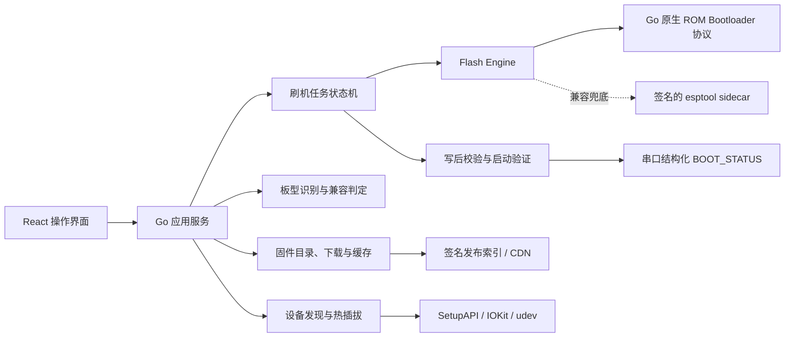
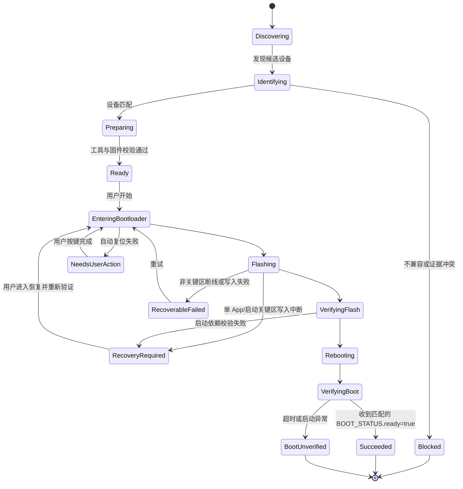

# ClawMate Maker：ESP32 跨平台刷机工具设计

> 状态：已完成 v0.7（自动多设备识别、四板型签名发布与 Release 下载）
> 目标平台：Windows 10/11、macOS 12+（Intel / Apple Silicon）、主流 x86_64 / arm64 Linux
> 当前 Windows 实机只读验证：EchoEar 2ST、Bread Compact、Fangtang 4G（均为 ESP32-S3、16 MB Flash、8 MB PSRAM）；Waveshare S3 Touch AMOLED 1.75C 已注册为独立 ESP32-S3、32 MiB Flash profile，须在独立硬件上完成同等验证。
> 当前发布流水线：四种板型均有独立 profile、精确 Release asset 名和签名包校验规则。Waveshare 使用 `waveshare-s3-touch-amoled-1.75c-v1`、`maclaw-s3-32m-factory-v1` 和专属 32 MiB 包，绝不接受任一 16 MiB 包；其余三种为 16 MiB。受保护 Release workflow 会构建、签名、验证并发布四种资产，线上自动下载路径具备端到端门禁。
> 协议发布门禁：Release CI 会同时校验 `firmware_identity.c` 的 protocol:2 字段、nonce-bound IDENTIFY/BOOT_STATUS 查询处理和生成配置中的 USB Serial/JTAG 次级控制台；缺少任一项时拒绝生成 `.clawfw`。
> 文档日期：2026-08-07

## 1. 结论与关键决策

ClawMate Maker 应当是一个“发布固件安装器”，不是一个缩小版 ESP-IDF 开发环境。普通用户刷写已经构建好的固件，不需要下载完整 ESP-IDF、CMake、Ninja、交叉编译器或工程依赖；运行时只需要串口访问、ESP ROM Bootloader 通信、固件包校验和启动验证能力。

首版建议采用以下技术方案：

- 桌面框架：Wails v2，Go 后端 + React/TypeScript 前端，与现有 MaClaw 技术栈保持一致。
- 刷写引擎：默认使用 Go 原生实现/封装 ESP serial bootloader 协议；同时保留“受控 esptool sidecar”适配器作为兼容兜底。首期如果排期优先，可先使用随应用签名分发的 `esptool` 独立程序，再逐步切换为原生引擎。
- 依赖策略：刷机本体随安装包携带。在线只下载签名固件包和可选的 Windows USB-UART 驱动；不在用户电脑上临时安装 Python 或完整 ESP-IDF。
- 固件格式：发布物必须是一个带签名清单的 `.clawfw` 包，而不是让用户手工选择若干 `.bin` 和偏移地址。
- 安全边界：只有“设备身份 + 芯片能力 + 固件清单 + 分区布局”全部匹配才允许刷写；不确定时默认阻止，不凭串口名称或 VID/PID 猜板型。
- 身份边界：运行中固件自报的目标板型不能证明物理硬件身份；只有制造阶段写入且主机可独立验证的只读身份才能直接形成 `confirmed`，否则最多形成 `probable` 并要求用户确认实物。
- 刷写模式：区分首次/修复的完整刷写与保留数据的 App 更新。完整刷写可以更新 bootloader、partition table、App、模型和 storage；App 更新只写 App 分区，保留 NVS、配对 Token、Wi-Fi 与用户数据。
- 完成定义：写入成功不等于任务成功。工具必须复位设备、重新发现串口、读取启动日志，并收到与当前 nonce 和目标 App 身份匹配的结构化 `BOOT_STATUS.ready=true` 后才显示“已完成”。
- MVP 安全策略：只支持明确读取为 Secure Boot Disabled、Flash Encryption Disabled，且 anti-rollback/eFuse secure version 处于未启用基线的设备；任一状态启用、非基线或无法可靠判断时 fail-closed。安全量产设备另行设计密钥、加密下载和 anti-rollback 流程，不由普通 manifest 声明直接放行。
- 断电边界：当前真实布局只有一个 factory App 分区，App-only 是原地更新，不能提供 A/B 原子切换或自动回滚。MVP 的承诺是“写入中断后仍可通过 ROM Bootloader 恢复”，不是“断电后旧版本仍可启动”；产品文案、状态机和硬件在环测试必须一致表达这一限制。

现有 `iot-agentos` 已给出四种设备的真实约束：均为 ESP-IDF 6.0.2、目标 `esp32s3`；EchoEar 2ST、Bread Compact、Fangtang 4G 使用各自 16 MiB layout，Waveshare S3 Touch AMOLED 1.75C 使用 32 MiB `maclaw-s3-32m-factory-v1` layout（`0x0` bootloader、`0x8000` partition table、`0x10000` App、`0x510000` model、`0xa10000` storage）。每个布局必须由发布流水线生成并签入包清单，不能硬编码为全局默认值。

## 2. 产品目标与非目标

### 2.1 产品目标

1. 用户插入设备后自动发现候选串口，并在无需理解 COM/tty、波特率和偏移地址的情况下完成刷机。
2. 自动判断设备是否受支持、固件是否匹配、刷写是否会破坏现有数据。
3. 在 Windows、macOS、Linux 提供一致的主流程、错误语义和诊断包。
4. 下载、缓存并验证刷机所需的最小工具、驱动与固件资源，支持断点续传和离线导入。
5. 对断线、串口占用、下载失败、进入下载模式失败、写入失败提供可恢复操作。
6. 刷写后自动启动并验证设备确实运行了目标版本。

### 2.2 非目标

- 不在最终用户电脑上编译 ESP-IDF 工程。
- 不提供 `menuconfig`、组件管理器、调试器或通用串口终端 IDE。
- 首版不宣称支持任意 ESP32 开发板；新增板型必须先注册板卡配置和签名固件。
- 不自动绕过 Secure Boot、Flash Encryption、驱动签名或操作系统权限机制。
- 不把“发现了 Espressif VID/PID”直接等价为“确认是某个 ClawMate 板型”。

## 3. 用户与核心场景

### 3.1 用户类型

- 普通用户：首次安装或更新 ClawMate 硬件，只关心能否安全完成。
- 售后/现场工程师：需要修复设备、保留或清除用户数据、导出诊断信息。
- 固件发布人员：生成、签名和发布固件包，维护板卡兼容矩阵。

### 3.2 核心场景

| 场景 | 默认策略 | 数据影响 |
| --- | --- | --- |
| 新设备首次安装 | 完整刷写 | 初始化 manifest 明确列出的系统分区 |
| 日常版本更新 | 仅 App 或 manifest 指定的最小集合 | 默认保留 NVS、模型、storage |
| 分区表发生变化 | 完整刷写并醒目提示 | 可能影响数据，需二次确认 |
| 设备无法正常启动 | 修复模式 | 按包策略决定保留或清除 |
| 多个设备同时接入 | 要求用户选择并用拔插/物理位置确认 | 不自动选择第一个端口；MVP 同时只运行一个写任务 |
| 离线现场 | 导入 `.clawfw` | 本地完成签名、兼容与哈希验证 |

## 4. 总体架构



### 4.1 进程边界

桌面应用只启动受控的本地子进程，不运行从网络直接下载的脚本。sidecar 若存在，必须随安装包或已签名工具包发布，版本固定、哈希固定，参数由后端生成，不接受前端拼接的命令行。

### 4.2 建议目录结构

```text
ClawMateMaker/
├─ cmd/clawmate-maker/          # Wails 入口
├─ internal/
│  ├─ app/                      # 用例编排
│  ├─ device/                   # 枚举、热插拔、探测、板型匹配
│  ├─ firmware/                 # 清单、签名、兼容矩阵、缓存
│  ├─ flash/                    # 引擎接口、原生实现、sidecar 实现
│  ├─ driver/                   # 驱动检测和安装指引/提权桥
│  ├─ jobs/                     # 状态机、取消、恢复、事件流
│  ├─ verify/                   # 写后和开机验证
│  ├─ diagnostics/              # 脱敏日志与诊断包
│  └─ platform/                 # windows/darwin/linux 适配
├─ frontend/                    # React + TypeScript
├─ resources/
│  ├─ board-profiles/           # 内置最小板卡识别资料
│  ├─ trust/                    # 发布公钥与轮换信息
│  └─ tools/                    # 可选 sidecar，按 OS/arch 打包
├─ packaging/                   # MSI/DMG/AppImage 等
├─ tools/fwpack/                # CI 使用的固件打包/签名 CLI
└─ docs/
```

## 5. 设备发现与硬件识别

“自动识别”分成三层。第一层只产生候选设备，第二层确认芯片能力，第三层才确认板型。任何一层证据不足，都不能自动选择固件。

### 5.1 第一层：操作系统候选设备枚举

收集以下稳定信息：

- 串口路径：Windows `COMx`；macOS `/dev/cu.*`；Linux `/dev/ttyACM*`、`/dev/ttyUSB*`。
- USB VID/PID、接口号、USB serial number、产品/厂商描述、物理位置路径。
- 端口出现时间、是否可打开、是否被其他进程占用。
- USB 拓扑位置，用于设备复位前后关联“同一台物理设备”。

平台实现：

| 平台 | 发现机制 | 权限/驱动注意点 |
| --- | --- | --- |
| Windows | SetupAPI / Configuration Manager，监听设备到达移除事件 | 原生 USB Serial/JTAG 通常使用系统驱动；CP210x/CH34x/FTDI 需按 profile 检测 |
| macOS | IOKit 串口服务 + USB 属性 | 驱动安装需用户授权；优先系统自带 CDC |
| Linux | libudev/netlink + `/dev/serial/by-id` | 检查 dialout/uucp 权限，给出发行版对应指引，不擅自修改用户组 |

Bread Compact 与 EchoEar profile 均可把 Espressif 原生 USB Serial/JTAG `VID 0x303A / PID 0x1001` 作为强候选信号，但它不是板型唯一身份证据，也无法区分这两个板型。

### 5.2 第二层：进入 ROM Bootloader 并读取芯片能力

ROM 探测虽然不写 Flash，但会复位正在运行的设备，因此属于“有扰动只读操作”，不能在枚举到任意 Espressif VID/PID 后静默执行。识别分两步：先以不切换 DTR/RTS 的方式短暂打开端口并发送 `IDENTIFY` 查询；收到语法有效且协议已知的应用态响应时展示“固件自报”候选证据，但不能称其为可信物理身份。若无响应，或需要读取 ROM/Flash 证据，则在用户点击“识别设备/开始安装”后执行以下流程：

1. 冻结所选候选的 USB 物理位置等弱绑定，独占打开串口，明确提示设备会重启；尝试该 profile 的 DTR/RTS reset sequence，失败时引导用户按住 BOOT 再按 RESET/重新插入。
2. 与 ROM Bootloader 同步。
3. 读取 chip family、revision、MAC、features、crystal、Flash JEDEC ID 和可寻址容量；区分“ROM/JEDEC 实测容量”与 bootloader/image header 声明容量。
4. 读取 Secure Boot、Flash Encryption 和 anti-rollback 相关 eFuse 状态。MVP 仅当 Secure Boot 与 Flash Encryption 均明确为 Disabled，且 secure version/anti-rollback 明确处于 profile 定义的未启用基线时继续；启用、非基线或无法安全判断均立即阻止，manifest 无权覆盖该限制。
5. 探测结束后释放端口，绝不执行擦除或写入。

部分 USB-UART 驱动在“仅打开端口”时也会改变控制线，因此平台适配器必须显式设置安全的 DTR/RTS 初始状态，并在支持的桥接芯片上做硬件回归。无法保证无扰动打开时只枚举不查询，直到用户明确开始识别。

`--chip auto` 可用于诊断，但正式刷写必须使用 manifest 声明并已验证的目标芯片。

在 ROM Bootloader 模式下还应执行两个有界只读探测：

- 读取分区表扇区（ESP32-S3 当前默认从 `0x8000` 开始，但实际读取地址由 chip/profile 约束），校验 magic/MD5、解析条目并生成规范化 `layoutFingerprint`。App-only 不依赖旧固件自行报告布局。
- 从当前 App 分区开头读取足以覆盖 `esp_app_desc` 的小范围数据，解析 `project_name`、`version`、`idf_ver` 和 secure version；无需读取完整 App 镜像。

ROM Bootloader 通常不能可靠探测外部/封装内 PSRAM 的实际容量和可用性。能力证据必须标注 `source`、`observedAt` 和 `confidence`：Flash 容量以 ROM/JEDEC 读数为写入硬边界；PSRAM 只能来自经过 nonce 查询的运行时自检、制造身份/profile 或写后目标固件自检。App 已损坏且无制造身份时，PSRAM 为 `unknown`，不能伪装成已探测；是否允许完整恢复由板型置信度策略决定，成功最终仍要求目标固件报告满足 manifest 的 PSRAM 容量/自检。对会导致越界写入的 Flash 未知一律阻止；对只影响启动能力的 PSRAM 未知可在 `probable` 板型人工确认后尝试完整恢复，但不能允许 App-only 自动更新。恢复界面必须与普通自动匹配分离：缺少 protocol:2 身份时，不得自动预取或展示“已匹配固件”；仅在存在持久化恢复锁、ROM 已精确确认 ESP32-S3 与 Flash 容量、且用户按实物标签确认板型后，才可获取该板型的完整恢复包。

`layoutFingerprint` 规范输入固定为按 offset 排序的有效条目序列，每项编码 type、subtype、offset、size、label UTF-8 字节和 flags；忽略表尾 `0xFF` padding，但保留 label/flags 差异。解析必须校验 magic、终止项、条目数量、MD5 记录、地址对齐、重叠和 Flash 边界；缺少/错误 MD5 是否允许仅由 profile 对已验证旧布局显式声明，默认阻止 App-only。CI 和客户端共享 golden vectors，不能分别实现不同规范化算法。

2026-08-05 实机验证已确认该路径可行：从 COM4 读取的分区表与当前构建产物逐字节一致，4 KiB App 头部也能解析项目名、版本和 ESP-IDF 版本。详见 [`hardware-test-2026-08-05.md`](hardware-test-2026-08-05.md)。

### 5.3 第三层：板型识别

ESP32 ROM 通常只能确认芯片，不能可靠区分使用同一芯片的不同成品板。必须区分“物理硬件身份”和“当前固件的编译目标”：

1. 制造阶段写入、普通固件更新不可修改且主机能独立读取验证的 `factory_board_id` / `factory_hw_rev`（只读 eFuse 或受保护制造分区）是物理身份强证据。
2. 受控 USB serial number 或 USB 产品字符串可作为物理身份辅助证据，但必须定义唯一性、写入和防篡改边界。
3. 运行中固件通过串口握手报告 `firmware_target_board_id`、`hw_rev`、`layout_id` 和版本，只说明当前固件的编译目标；因为刷错的固件也会自报其目标板型，所以它只能作为交叉证据，不能单独产生 `confirmed`。
4. VID/PID + 芯片型号 + Flash/PSRAM 能力组合只能产生“高概率候选”。
5. 没有制造身份时，由用户从受支持板型列表确认，并显示照片、接口和屏幕/音频配置等实物识别提示。

匹配结果必须包含 `confidence` 与 `evidence[]`，而不是只有布尔值：

```json
{
  "boardId": "bread-compact-wifi-lcd-v1",
  "confidence": "probable",
  "evidence": [
    "runtime.firmware_target_board_id=bread-compact-wifi-lcd-v1",
    "rom.chip=esp32s3",
    "rom.flash_size=16MB",
    "usb.vid_pid=303a:1001"
  ]
}
```

规则：仅经过验证的制造身份才能直接产生 `confirmed` 并一键继续；`probable` 必须让用户确认；同类硬件候选超过一个为 `ambiguous`；任何物理身份、自报目标或芯片能力冲突均为 `conflict`。`ambiguous`/`conflict` 禁止刷写。用户确认只能消解证据不足，不能覆盖芯片、容量、布局或安全状态冲突。
### 5.3.1 端口优先的自动匹配交互（实现约束）

用户可以选择一个串口，但不应被要求从 EchoEar 2ST、Bread Compact、Fangtang 4G 中手动选择固件。对所选端口，桌面端必须自动执行只读 ROM/应用身份探测；只有收到 nonce-bound、协议版本严格为 `protocol:2` 且唯一映射到官方 catalog 的运行中 `firmware_target_board_id` 时，才能自动选择该板型的唯一签名 `.clawfw` 资产、下载并验证它。`protocol:1`、未返回身份、身份未知、冲突、非唯一、端口变化或签名验证失败均必须显示原因并阻止刷写，且不得预取固件或创建写入确认；ROM 容量即使唯一指向 Waveshare 32 MiB，也不能绕过这一正式运行时身份门槛。这样不会出现“界面已就绪、写入前才因协议或身份缺失被拒绝”的状态分裂。禁止按 VID/PID、端口名、Flash 容量或第一个候选项猜测固件。

“自动匹配”不等于绕过用户确认：界面在开始刷写时必须显示自动识别的板型、端口与刷写影响，要求用户确认实物与识别结果一致后，才创建一次性的、端口与新鲜 probe 证据绑定的写入授权。该确认不显示板型选择器，也不允许用户将授权改绑至另一块板或另一端口。

### 5.4 制造身份建议格式

优先方案是在 eFuse 中写入受控板型码和硬件修订。若 eFuse 空间或制造流程不允许，可在所有产品共享的固定只读探测区域存放厂商签名的 `factory-identity` 记录：

```json
{
  "schemaVersion": 1,
  "productId": "maclaw-clawmate",
  "boardId": "bread-compact-wifi-lcd-v1",
  "hwRev": "1",
  "chipMac": "aabbccddeeff",
  "serial": "CM202608050001",
  "issuedAt": "2026-08-05T00:00:00Z",
  "keyId": "factory-identity-2026"
}
```

记录签名覆盖规范化二进制编码（推荐确定性 CBOR），使用与固件发布密钥分离的制造身份密钥。主机从 ROM 读取芯片 MAC，验证记录签名且 `chipMac` 与 ROM MAC 一致，从而阻止把另一台设备的签名记录复制过来冒充。该区域即使物理上可擦写，也因无法伪造或跨芯片重放签名身份而可形成 `confirmed`。普通刷写的板卡 profile 把该区域列为 `reservedRegions`，任何 `.clawfw` 镜像都不得覆盖；只有独立、受审计的制造工具可以写入。身份缺失、签名无效或 MAC 不匹配不能由用户确认覆盖，只能降级为 `probable` 或 `conflict`。

板卡 profile 本身也是安全输入。MVP profile 随应用代码签名发布；若以后支持远程增加 profile，必须使用用途受限的 profile 签名密钥，并限制其只能声明 VID/PID、只读探测范围、复位策略、Flash 边界和保留区域，不能携带脚本、任意命令或扩大 helper 权限。

### 5.5 Board profile 最小 Schema

profile 必须是声明式、版本化且可由 JSON Schema 严格校验的安全对象，建议最少包含：

```json
{
  "schemaVersion": 1,
  "profileId": "bread-compact-wifi-lcd-v1",
  "productId": "maclaw-clawmate",
  "boardIds": ["bread-compact-wifi-lcd-v1"],
  "hwRevisions": ["1"],
  "chip": "esp32s3",
  "chipRevision": {"min": 0, "max": 999},
  "flash": {"sizeBytes": 16777216, "modes": ["dio"], "maxFrequencyMHz": 80},
  "psram": {"required": true, "minBytes": 8388608},
  "usbCandidates": [{"vid": 12346, "pid": 4097, "interfaces": [0]}],
  "serial": {"applicationBaud": 115200, "flashBauds": [460800, 230400, 115200]},
  "resetStrategies": ["usb-serial-jtag", "classic-dtr-rts", "manual-boot-reset"],
  "partitionTable": {"offset": 32768, "readSize": 4096},
  "readAllowList": [{"offset": 32768, "size": 4096}, {"offset": 65536, "size": 4096}],
  "reservedRegions": [],
  "securityBaseline": {"secureBoot": false, "flashEncryption": false, "secureVersion": 0},
  "supportedLayouts": ["sha256:..."],
  "allowedTools": [{"id": "esptool-sidecar", "versions": ["5.3.1"]}],
  "capabilities": {"appUpdate": true, "fullInstall": true, "backup": false},
  "supportedSelfTests": ["flash", "psram", "display_bus"]
}
```

示例中的大范围 `chipRevision.max` 只是格式占位，真实 profile 必须来自已验证硬件矩阵；没有验证的 revision 不应通过宽泛范围自动放行。profile 的 read allow-list、reserved regions、分区表位置和 Flash 总边界必须互相一致，制造身份区一旦启用就必须出现在 `reservedRegions`。`resetStrategies` 只引用应用内置枚举和固定实现，禁止表达任意 GPIO 脚本、命令或时序程序。远程 profile 不能新增驱动/helper、可执行文件或扩大既有工具 allow-list，除非先升级平台代码签名应用。

profile ID 本身不作为物理身份；它是客户端选择探测/校验策略的版本化配置。manifest 声明兼容的 profile ID/hash 范围，客户端要求自身 profile hash 被包允许且 profile 又允许包的 layout/tool，形成双向约束，避免旧 profile 误解新包。

## 6. 运行时、驱动与依赖下载

### 6.1 用户真正需要的内容

| 资源 | 普通刷机是否需要 | 交付方式 |
| --- | --- | --- |
| ESP-IDF 全量 SDK | 否 | 只在 CI 构建机安装 |
| Python | 否（推荐架构） | 不安装到用户系统 |
| esptool 能力 | 是 | Go 原生引擎或随包 sidecar |
| USB 串口驱动 | 视板卡而定 | 仅缺失时按签名包安装/引导 |
| 固件及分区镜像 | 是 | 签名 `.clawfw` 下载或离线导入 |
| ESP-IDF managed components | 否 | 已静态链接进固件镜像 |
| JTAG/OpenOCD | 否 | 不属于普通刷机流程 |

因此，“下载 ESP-IDF 必要模块”的产品表达应改为“准备刷机运行时”。MVP 基线刷写引擎随应用安装包提供，联网准备阶段主要取得可选驱动和目标固件包；后续兼容性工具更新才按当前 OS/arch 下载签名工具包，而不是下载开发 SDK。

### 6.2 工具清单

安装包必须内置一个经过平台代码签名且可离线工作的基线 sidecar。服务端另提供签名的 `tool-index.json`，仅用于修复已知兼容问题或新增芯片支持；网络下载的工具不能覆盖正在运行的基线版本，而是按版本隔离并在下一个 job 选择：

```json
{
  "schema": 1,
  "tools": [{
    "id": "esptool-sidecar",
    "version": "5.3.1",
    "platform": "windows-amd64",
    "url": "https://downloads.example/tools/esptool/5.3.1/windows-amd64.zip",
    "sha256": "...",
    "size": 7340032,
    "signature": "base64-ed25519-signature"
  }]
}
```

下载要求：HTTPS、证书校验、索引签名、资源 SHA-256、原子落盘、断点续传、大小上限、版本隔离缓存。压缩包解压时阻止路径穿越和符号链接逃逸。工具只从白名单发布源取得。

下载器与缓存还必须明确以下行为：

- 支持系统代理以及 `HTTP_PROXY` / `HTTPS_PROXY` / `NO_PROXY`；代理认证凭据只交给系统网络栈，不写入日志或诊断包。
- 断点续传仅在客户端已把原下载 URL 与 ETag/Last-Modified 原子保存为 partial metadata、续传请求携带 `If-Range`、服务端返回匹配验证器和正确 `Content-Range` 且已下载前缀仍属于同一对象时继续；缺失 metadata、URL/验证器变化、Range 被忽略或范围不正确时，删除临时片段和 metadata 后从零下载。
- 以内容 SHA-256 作为缓存主键，下载锁以 hash 为粒度；多个窗口/进程请求同一对象时共享一个下载者，其他请求等待并复验结果。
- 临时文件与最终缓存位于同一文件系统，完成长度和 SHA-256 校验后原子 rename；失败、取消或崩溃不能暴露为可用缓存。
- 缓存设置总容量上限和 LRU 清理策略；正在使用、已固定的离线包和当前 job 引用对象不能被清理。
- 在线目录不可用时可以使用已完整验证的缓存或本地导入包；UI 必须显示目录新鲜度、包签名时间以及“无法取得最新撤回状态”，不得把离线状态误报为最新。

### 6.4 Release 镜像发现、测速与回退

正式 Release workflow 会将同一份精确命名的 `.clawfw` 资产、长度、SHA-256 和 `latest.json` 同步到 GitHub Release、Cloudflare R2 与腾讯云 COS。正式公共 origin 固定为桌面端内置 allow-list 中的 R2 与 COS 域名；CI 不允许用 Secret 把它替换为另一个 CDN、代理或 bucket，以免生成桌面端无法安全发现的 release index。每个固件 entry 的 `urls` 必须按固定顺序包含 `R2/{latest|beta}/<exact asset>` 和 `COS/{latest|beta}/<exact asset>`，`url` 必须是后者。每个 `.clawfw` 的 Ed25519 签名 manifest 还必须声明精确 `channel: stable|beta`；打包器、发布 workflow 和桌面端都比较所选 channel、对象路径与已签名 channel，任一不一致即拒绝，避免把 beta 对象误标为 stable 或反向降级。桌面端以 GitHub Release API 的精确 asset 名、tag、大小和 GitHub digest 为发布权威；R2/COS 的 manifest 仅用于发现镜像和选择下载节点，绝不替代包内 Ed25519 签名、catalog binding、分区与芯片兼容性校验。

发布门禁先生成 `latest.json`/`beta.json`，上传 R2 和 COS 后重新下载两份公开 manifest，并逐个下载 EchoEar 2ST、Bread Compact、Fangtang 4G 三个 `.clawfw` 校验长度与 SHA-256。任一凭据、上传、公开读取或校验失败都会使 workflow 失败，且 GitHub Release 在镜像门禁通过后才创建；镜像同步不能使用 `continue-on-error` 或“缺少密钥则跳过”。

- 对每个板卡只接受与 catalog 完全相等的资产名；镜像 URL 必须为 HTTPS、无 userinfo、无显式端口，且 host 严格属于 GitHub Release、指定 R2 或指定 COS 白名单。下载重定向必须逐跳重验这一 allow-list，最多 5 跳。客户端和发布门禁都会校验镜像 URL 的 channel path 和双镜像拓扑：stable 为 `R2/latest/<asset>`、`COS/latest/<asset>`，beta 为 `R2/beta/<asset>`、`COS/beta/<asset>`；`urls` 必须按该顺序精确出现，`url` 必须为后者。不允许只上传一个 mirror 或把 entry 指向其他 allow-listed 路径。客户端默认只使用 stable；用户在界面主动选择 beta 后，才会读取 `beta.json` 并使用 beta 路径，且仍执行相同的镜像元数据、包签名和兼容性校验。日志只记录 host，不记录可能含签名或凭据的 query。
- 并行读取 R2/COS manifest；若 tag、size、SHA-256 与 GitHub Release 不一致，或两个镜像彼此冲突，镜像元数据整体 fail-closed，回退为 GitHub，不得静默挑选其中一个。
- 若 GitHub Release API 在本次请求中不可达或未返回精确 asset，客户端可仅在 R2 与 COS 两份独立 workflow manifest 都可达、且对 exact asset 的 tag、size、SHA-256 完全一致时，以该一致元数据继续发现和下载；任一镜像缺失或不一致即拒绝。该高可用回退不放宽最终 GitHub digest（若可得）、`.clawfw` Ed25519 签名和 catalog binding 校验。
- 对通过元数据校验的 URL 与 GitHub URL 并行执行无副作用的 `HEAD`；服务器拒绝 HEAD 时才使用 `GET Range: bytes=0-0`。测速有严格超时，只校验响应首部/一个字节，不预取固件主体；按可用性和响应时间排序，选择最快节点。
- 实际下载仍按原有大小、断点续传、SHA-256、GitHub digest 和 `.clawfw` 签名/兼容性规则验证。最快节点发生网络、长度或 digest 错误时，删除该临时片段后按已测速候选顺序回退；任何一个镜像都不能因“测速成功”而被视为可信固件。
- 日志必须覆盖 `MIRROR_DISCOVERY_*`、`MIRROR_MANIFEST_*`、`MIRROR_METADATA_CONFLICT`、`MIRROR_PROBE_*`、`MIRROR_SELECTED` 与 `MIRROR_FALLBACK`，从而可以判断是 metadata、测速、传输还是最终包校验失败。

### 6.3 驱动策略

- 每个板卡 profile 声明可能的 USB bridge 与驱动策略。
- 先检查系统是否已经有可工作的串口；能正常探测时不提示安装驱动。
- Windows 驱动必须有可信 Authenticode 签名，安装由单独的提权 helper 完成；主应用平时不以管理员运行。
- macOS 优先 CDC 系统驱动，第三方 DriverKit/系统扩展只提供厂商签名安装包与明确说明。
- Linux 不静默执行 `sudo`、不直接修改组；显示检测结果和精确修复命令，由用户执行。

## 7. 固件包与发布协议

### 7.1 `.clawfw` 包结构

```text
bread-compact-3.1.0.clawfw # ZIP 容器，固定 UTF-8 文件名
├─ manifest.json
├─ manifest.sig
├─ images/
│  ├─ bootloader.bin
│  ├─ partition-table.bin
│  ├─ app.bin
│  ├─ srmodels.bin
│  └─ storage.bin
├─ release-notes.zh-CN.md
└─ release-notes.en-US.md
```

### 7.2 manifest 最小字段

```json
{
  "schemaVersion": 1,
  "packageId": "maclaw.bread-compact-wifi-lcd.3.1.0",
  "releaseVersion": "3.1.0",
  "releaseSequence": 30100,
  "channel": "stable",
  "createdAt": "2026-08-05T00:00:00Z",
  "board": {
    "ids": ["bread-compact-wifi-lcd-v1"],
    "hwRevisions": ["1"],
    "profileIds": ["bread-compact-wifi-lcd-v1"],
    "profileSha256": ["..."],
    "chip": "esp32s3",
    "minChipRevision": 0,
    "flashSizeBytes": 16777216,
    "psram": {"required": true, "minBytes": 8388608}
  },
  "security": {
    "secureBoot": "disabled",
    "flashEncryption": "disabled",
    "antiRollbackSecureVersion": 0
  },
  "runtime": {
    "requiredTool": {"id": "esptool-sidecar", "minVersion": "5.3.1", "maxVersionExclusive": "6.0.0"},
    "romStub": {"sha256": "...", "ramRanges": [{"start": 1070202880, "size": 131072}]}
  },
  "layout": {
    "id": "maclaw-s3-16m-factory-v2",
    "partitionTableOffset": 32768,
    "partitionTableSha256": "...",
    "fingerprint": "sha256:..."
  },
  "modes": {
    "appUpdate": {"preserves": ["nvs", "model", "storage"]},
    "fullInstall": {
      "requiresConfirmation": true,
      "preserves": [],
      "erases": ["nvs", "phy_init"],
      "writeOrder": ["srmodels", "storage", "app", "partition-table", "bootloader"],
      "bootCritical": ["partition-table", "bootloader"]
    }
  },
  "appIdentity": {
    "projectName": "maclaw_esp32s3_client",
    "appVersion": "V6.6.3.11756-4-g04f2582f",
    "elfSha256": "..."
  },
  "files": [
    {"name": "bootloader", "file": "images/bootloader.bin", "offset": 0, "size": 21056, "regionMaxSize": 32768, "sha256": "...", "modes": ["fullInstall"]},
    {"name": "partition-table", "file": "images/partition-table.bin", "offset": 32768, "size": 3072, "sha256": "...", "modes": ["fullInstall"]},
    {"name": "app", "file": "images/app.bin", "offset": 65536, "size": 3050928, "regionMaxSize": 3801088, "sha256": "...", "modes": ["appUpdate", "fullInstall"]},
    {"name": "srmodels", "file": "images/srmodels.bin", "offset": 3866624, "size": 3145728, "regionMaxSize": 3145728, "sha256": "...", "modes": ["fullInstall"]},
    {"name": "storage", "file": "images/storage.bin", "offset": 7012352, "size": 9764864, "regionMaxSize": 9764864, "sha256": "...", "modes": ["fullInstall"]},
    {"name": "release-notes-zh-CN", "file": "release-notes.zh-CN.md", "size": 2048, "sha256": "...", "modes": []},
    {"name": "release-notes-en-US", "file": "release-notes.en-US.md", "size": 1800, "sha256": "...", "modes": []}
  ],
  "eraseRegions": [
    {"name": "nvs", "offset": 36864, "size": 24576, "modes": ["fullInstall"]},
    {"name": "phy_init", "offset": 61440, "size": 4096, "modes": ["fullInstall"]}
  ],
  "bootVerification": {
    "baud": 115200,
    "timeoutSeconds": 45,
    "eventPrefix": "CLAWMATE_EVT ",
    "requiredSelfTests": ["flash", "psram", "display_bus"]
  },
  "recovery": {
    "guarantee": "rom-bootloader-reflash",
    "powerLossBootable": false,
    "requiresManualBootMode": true
  }
}
```

示例只表达格式；所有 offset、实际 `size`、区域上限、擦除范围、layout fingerprint 和 hash 应由 ESP-IDF 构建产物自动提取。尤其不能把日志中曾出现过的旧分区偏移带入新版本。`releaseVersion` 是面向用户的版本；`releaseSequence` 是同一产品发布线单调递增的比较值，用于明确升级/降级，不能从任意版本字符串猜测。发布 CI 的每一次固件构建使用同一个正整数作为 `CONFIG_MACLAW_RELEASE_SEQUENCE` 与已签名 manifest 的 `appIdentity.releaseSequence`；运行时 `IDENTITY` 与 `BOOT_STATUS` 必须同时以 JSON 整数上报 `release_sequence` 和更易读的同值别名 `firmware_version`。桌面端只比较这个整数，并拒绝两个字段同时存在但不相等的设备；缺失或非正值只显示“无法比较”，绝不从 `app_version` 或 release tag 推断更新顺序。`appIdentity.appVersion` 必须与本次构建的 `esp_app_desc.version` 原始字符串完全一致，不能把发布版本人工复制到这里；`elfSha256` 必须由 `project_description.json` 的 `app_elf_sha256` 自动提取，固定为 **64 位小写十六进制裸 SHA-256**（不带 `sha256:` 前缀）。打包器拒绝空值、非 SHA-256 值或非规范形式；设备运行时可采用大小写不同的十六进制表示，但桌面端会规范化后严格比较其字节值。当前实机记录是 `V6.6.3...-dirty`，只能作为开发测试证据；stable/beta 发布流水线必须拒绝源码工作树 dirty、未标记 commit 或构建输入无法复现的产物。启动验证的期望身份直接引用 `board`、`layout`、`releaseSequence` 和 `appIdentity`，避免在 `required` 中复制后产生漂移；`bootVerification` 只声明传输参数和必需自检集合。`hwRevisions` 使用字符串 allow-list，不使用可能错误覆盖 `A2` 等修订号的数值区间。

当前正式工作流不再把 `merge-bin` 的单个 `full-flash.bin` 当作唯一刷写计划。它从 ESP-IDF 同一次构建输出的 `flasher_args.json` 提取 bootloader、partition table、App 以及 `FLASH_IN_PROJECT` 数据分区，分别计算 hash 并打入签名包；`writeOrder` 必须精确枚举所有非 metadata 镜像一次。当前单 factory 布局固定为“数据分区 → App → partition-table → bootloader”，其中 partition table/bootloader 只能位于最后两个位置；客户端忽略 ZIP entry 和 offset 的自然排序，只执行该签名顺序。对拆分包，它会在 ROM 下载模式中逐个执行 `write_flash --after no_reset`，每个镜像紧接一次 `verify_flash --after no_reset`，只在最后一份镜像完成读回后以 `verify_flash --after hard_reset` 启动 App；因此断电、传输错误或读回失败会精确停在一个可诊断的镜像边界。为兼容已经发布的旧包，只有一个 offset `0` 的完整镜像且未声明 `writeOrder` 时才走旧兼容路径；新 CI 产物必须使用拆分计划。

`recovery` 是包对当前布局可提供的真实恢复能力声明，并由 profile/CI 约束，不能由发布人员乐观填写。当前单 factory App 布局必须声明 `powerLossBootable=false`；只有未来采用双 OTA slot、有效 otadata 事务及硬件在环断电测试后，才可声明刷写中断后仍能启动旧版本。该字段影响 UI 风险提示和取消策略，但不能降低写前校验。

`modes.*.preserves/erases` 是面向兼容和 UI 的分区语义，`eraseRegions` 是引擎实际执行的签名计划，两者必须由 CI 对包内 partition table 交叉验证。没有镜像且没有 `eraseRegions` 的分区就是保留，工具不得因为模式名叫“完整刷写”而隐式整片擦除。上述示例明确擦除 NVS/PHY、覆盖 model/storage，因此 Wi-Fi、配对信息和本地内容会被清除；如果某个 full-install 版本希望保留 NVS，必须发布不同的明确模式和文案，不能运行时猜测。

`runtime.requiredTool` 使用严格 SemVer 解析和显式上界；若工具版本字符串不可解析或超出范围就阻止，不能按字典序比较。包允许的 tool 范围还必须与 profile `allowedTools` 取交集。ROM stub 是会在设备 RAM 中执行的代码，必须作为签名/哈希固定的工具组成部分；客户端验证 stub hash、目标芯片和允许 RAM ranges，上传前检查段地址/长度不溢出、不重叠保留 RAM/ROM 区域。下载到 RAM 不写 Flash，但仍属于在设备执行代码，UI 的“只读探测”必须说明是否会加载 stub；MVP 初始身份/安全 eFuse 探测优先使用 ROM 原生命令，只有在用户已开始刷写或明确同意高级校验后才加载 stub。

签名输入固定为 `manifest.json` 的原始 UTF-8 字节，不在客户端重新序列化 JSON；`manifest.sig` 使用带 `keyId` 和算法标识的签名封装。manifest 的 `files[]` 必须枚举容器内除 `manifest.json`、`manifest.sig` 外的每个文件及其大小和 SHA-256；客户端拒绝未列出文件、缺失文件、重复规范化路径、大小写碰撞、Unicode 归一化碰撞、绝对路径、`..`、设备名和任何链接。release notes 只按受限 Markdown 渲染，禁用原始 HTML、脚本、远程图片和自定义 URI。

### 7.3 发布流水线

1. 固定 ESP-IDF 和组件 lock，在受控 CI 构建。
2. 要求源码 commit 已存在于受保护仓库、工作树干净、tag/channel/sequence 关系符合发布策略；stable/beta 禁止 `-dirty` 或本地未提交补丁。开发包只能进入 dev 渠道并显示不可隐藏的开发标记。
3. 从 `flasher_args.json`、`flash_project_args`、partition table 和 app image 元数据生成 manifest。
4. 校验镜像边界互不重叠、未超过 Flash、App 未超过对应分区。
5. 运行 `esptool image-info` 等静态检查，确认目标芯片与镜像头一致。
6. 生成 SBOM、SHA-256 和 release notes。
7. 使用离线/受保护的 Ed25519 发布私钥签名 manifest 原始字节；签名封装携带 `keyId`，客户端内置公钥而不是共享密钥。
8. 在真实硬件矩阵执行完整刷写和 App 更新测试。
9. 先发布不可变对象，再原子更新签名 channel index；支持服务端撤回包 ID。

### 7.4 Schema 演进、解析限制与可复现性

- `schemaVersion` 使用整数主版本；客户端只接受明确实现的版本，未知版本 fail-closed。向后兼容新增字段只能是 optional，安全约束字段不得依赖旧客户端“忽略未知字段”。
- 同一 schema 内禁止重复 JSON key、非 UTF-8、BOM、非整数数值、指数形式地址、超出 64-bit 的数值和实现相关的大小写折叠。offset/size 在解析后转换为无符号 64-bit，再在写入前验证可安全收窄到目标芯片地址宽度。
- manifest 设置最大 1 MiB；包默认最多 64 个条目、单文件和总解压大小不得超过 profile 的 Flash/文档上限。校验直接对 ZIP entry 流式计算 hash，不先把不可信包整体解压到可执行目录。
- `packageId + manifest SHA-256` 唯一确定一个不可变发布对象；服务端、缓存或离线导入中若同一 `packageId` 对应不同 manifest hash，视为发布冲突并阻止，而不是选择更新时间较新的一个。
- CI 生成 `buildProvenance`（源码 commit、依赖 lock hash、构建器镜像 digest、fwpack 版本）和 SBOM 摘要并纳入签名 manifest。它们用于审计与复现，不在终端运行任意构建脚本。
- esptool sidecar、Wails/WebView 运行时和第三方驱动必须完成许可证清单、NOTICE/源码提供义务与漏洞扫描；SBOM 不能只覆盖固件。

## 8. 固件匹配与刷写前校验

### 8.1 校验顺序

1. 验证固件索引与 manifest 签名。
2. 验证所有镜像大小与 SHA-256。
3. 验证容器内没有未知可执行内容和路径逃逸。
4. 比较 manifest 的 chip、revision、Flash、PSRAM、安全状态与设备探测结果。
5. 验证当前客户端 profile ID/hash 被 manifest 允许，同时 manifest 的 layout/tool/reset 能力也在 profile allow-list 内；任一侧不认识另一侧均 fail-closed。
6. 优先比较只读制造身份 `factory_board_id` / `factory_hw_rev`；运行时 `firmware_target_board_id` 只作交叉证据。没有制造身份时，即使 VID/PID 与固件自报均匹配，也只能降级为需用户确认。
7. 优先读取并解析当前 partition table，生成 `layoutFingerprint`；运行中固件报告的 `layout_id` 只作为交叉证据。布局相同才允许 App-only；无法读取、解析失败或布局不同则必须完整刷写或拒绝。
8. 独立解析包内 partition-table 镜像并重算其 fingerprint；确认 manifest layout、包内表、每个镜像 offset/区域上限三者完全一致，不能只信任 manifest 对自身的描述。完整刷写包还必须逐字节验证 `images/full-flash.bin` 在 `0x8000` 的内容等于签名 metadata 分区表；CI 打包时和桌面导入时都执行该门禁，防止元数据表与实际将写入的完整镜像不一致。
9. 验证每个文件实际长度等于 `size`、不超过 `regionMaxSize`，目标偏移/长度不越过**实测** Flash 容量且写入区域互不重叠；此门禁必须在风险窗口/任何 `write_flash` 调用之前再次执行。非刷写文件不得携带 offset。`eraseRegions` 必须完整落在同名分区内、不接触制造身份保留区，并与 `modes.*.erases` 一一对应。

10. 当前官方 profile 的签名 `securityBaseline` 必须严格等于 Secure Boot=`false`、Flash Encryption=`false`、Secure Version=`0`；包在下载/导入阶段即拒绝其他值。下载/离线导入在 Ed25519 验签后还必须立即拒绝缺少 releaseVersion、板型/profile、芯片/Flash 容量、分区布局及其 metadata、App identity、启动验证策略或显式 securityBaseline 的 release manifest；不能把这类语义缺失延迟到实际写入前才发现。写前重新读取 eFuse，三项必须与签名基线逐项相同；未知、已启用或不匹配均 fail-closed，不得由 UI 覆盖。
11. 使用 `releaseSequence`、安全撤回级别和设备当前 App identity 判断升级/降级；普通版本字符串仅展示，不参与猜测排序。
12. 检查主机磁盘空间、串口稳定性和缓存完整性；USB 无标准方法可靠测量供电裕量，因此只能根据掉线/欠压日志预警，不能声称刷写前已经验证电源安全。
13. 生成用户可读的“将写入/将保留/将清除”计划，用户确认后锁定 job plan。

校验结论与用户确认都绑定到冻结的 `deviceBinding`：至少包含 USB 物理位置、USB serial（如有）、ROM MAC 的脱敏摘要、chip/revision、Flash 容量和安全状态摘要。进入写入前必须再次进入 ROM Bootloader 并复核该绑定；端口路径变化本身不导致失败，但任何强属性变化都必须中止，不能把已确认计划套用到新接入设备。

ROM MAC 在 job 内必须使用原值做强相等比较；只在 UI、持久日志和诊断导出时显示脱敏摘要。若仅保存短摘要或每包随机盐摘要，会存在碰撞且无法跨应用重启恢复同一 job。持久化 journal 如需保存强绑定，应使用操作系统凭据保护能力加密原始 MAC（Windows DPAPI、macOS Keychain、Linux Secret Service）；无法安全持久化时，应用重启后放弃自动续接并要求重新识别，不能降低绑定强度。

### 8.2 匹配判定

| 状态 | 含义 | UI 行为 |
| --- | --- | --- |
| Compatible | 所有强约束满足 | 可开始 |
| CompatibleWithConfirmation | 板型只有高概率证据，或兼容的完整刷写将清除数据 | 显示证据和数据影响，二次确认 |
| Unknown | 无法读到足够硬件证据 | 禁止一键刷写，进入辅助识别 |
| Incompatible | 芯片、容量、板型、布局、镜像身份或安全策略冲突 | 禁止刷写并列出冲突 |
| Revoked | 固件包被撤回或签名不可信 | 禁止使用 |

版本目录过滤必须在服务端与客户端各执行一次。客户端不直接信任 `ListFirmware(deviceId, channel)` 的服务端筛选：对每个候选重新验证签名、撤回、board/hw revision、chip revision、Flash/PSRAM、安全基线、layout/mode 和最低工具版本，再形成列表。推荐规则固定为“未撤回、兼容、stable、最高 `releaseSequence`”；beta/dev 需要用户先在设置中启用并始终显示渠道徽标。相同 release sequence 但不同 manifest hash 为发布冲突；低 sequence、同版本重装和跨渠道切换分别使用明确策略与确认，不能统一叫“更新”。

固件目录查询只发送产品/板型、芯片能力和当前发布 sequence 等最小信息；默认不上传 ROM MAC、USB serial、物理位置或用户 job 日志。若服务端必须按设备授权下载，使用与硬件身份分离、可撤销的短期下载凭据，并在隐私说明中单列。

### 8.3 数据保护

- App-only 必须确保当前分区表的 App offset/size 与包声明一致。
- App-only 还必须确认目标 App 镜像不要求同步升级 bootloader/partition table；该约束由发布 CI 从构建产物生成，不能只由用户选择模式决定。
- 当前单 factory App 的 App-only 是原地覆盖，不具备 ESP-IDF OTA 回滚语义。开始前必须显示“更新中请勿断电；中断后设备可能需要进入恢复模式”，且不能提供后台静默更新。未来若切换双 OTA slot，必须另外设计 otadata 选择、首次启动确认、回滚窗口、secure version 和数据 schema 迁移，不能仅把写入 offset 换成另一个分区。
- 日常更新默认不写 `nvs`、`phy_init`、`model`、`storage`。
- 完整刷写若覆盖用户数据，按钮文案明确为“清除并重新安装”，不能仍叫“更新”。
- 完整刷写的数据影响完全来自已签名 `images + eraseRegions` 计划；执行前按分区逐项展示。工具不能以“fullInstall”为由增加清单外擦除，也不能宣称会清除一个实际未覆盖/未擦除的分区。
- 高级模式允许先备份指定数据分区，但恢复时必须校验 layout 和数据 schema；不承诺恢复任意 NVS 原始镜像到不同固件布局。

MVP 不提供通用 NVS/storage 自动备份恢复，避免把密文 Token、Wi-Fi 凭据和不兼容数据 schema 导出成不受保护文件。售后备份若启用，必须由 board profile 明确 allow-list 分区、最大长度和数据 schema ID；备份默认使用随机内容密钥加密，内容密钥由用户恢复口令派生密钥或组织公钥封装，绝不使用写死在应用中的共享密钥。备份 manifest 记录来源制造身份/ROM MAC 摘要、layout fingerprint、固件 App identity、分区 offset/size/hash、数据 schema 和创建时间，并整体签名或认证加密。

恢复只允许到同一物理设备，或由独立售后授权文件明确允许迁移到替换设备；恢复前再次读取目标 partition table，校验目标区间、schema 兼容和数据敏感等级。NVS 优先走固件提供的逻辑导入/迁移接口，不默认裸写整个 NVS 分区。任何备份失败都不能阻止用户选择“不保留数据的完整恢复”，但必须清楚说明数据不可恢复。

## 9. 刷机任务状态机



关键约束：

- 每台设备同一时间只允许一个 job；每个串口必须进程内和系统级独占。
- MVP 全局同时只允许一个写任务；设备枚举和只读检查可并行。后续批量模式必须使用按物理设备加锁、有限并发和独立审计，不能复用普通用户的一键流程。
- 系统级独占使用 OS 可回收原语而不是只依赖锁文件：Windows 独占设备句柄/命名 mutex，macOS/Linux 独占串口句柄并结合 advisory lock。若需锁文件，只保存 PID/进程启动标识和随机 owner token；获取锁前验证拥有者仍存活，崩溃遗留锁可安全回收。网络共享目录不作为 lock/journal/cache 的受支持位置。
- `Preparing` 结束后固件清单、hash、目标设备 identity 和写入计划冻结；中途设备变化立即中止。
- job 创建时立即打开结构化日志并写入 `JOB_CREATED`；此后每次状态迁移、重试、降速、设备重枚举和恢复决策都必须先追加日志事件，再向前端发布状态事件。日志写入失败不能静默忽略：写入开始前阻止任务，写入风险窗口内则继续保证设备安全并在 UI 持续显示 `LOG_PERSISTENCE_DEGRADED`，同时保留有界内存环形缓冲供导出。
- 安全取消点在下载、探测和镜像之间；正在写单个 flash block 时先完成/超时再取消。
- 只有在 `recovery.powerLossBootable=true` 或当前尚未修改启动所需区域时，镜像之间才是普通取消点。单 factory App 原地更新一旦开始擦除 App，即进入 `RecoveryRequired` 风险窗口；此时“取消”改为“停止后进入恢复”，UI 不得暗示设备仍可正常启动。
- 刷写失败后不得显示设备“已损坏”。ESP ROM Bootloader 通常仍可重试，界面应提供明确恢复步骤。
- 进度按真实传输字节与阶段加权，不伪造平滑百分比。
- job journal 原子持久化 `planHash`、`deviceBinding`、每个镜像的状态和校验证据。应用重启后不得根据百分比续写；必须重新识别设备、重验包和已完成区域，再从镜像边界重试。
- journal 使用带 schema 和校验和的 append/replace 原子记录，敏感绑定按第 8.1 节保护；启动时若 journal 截断、版本未知或校验失败，只能进入人工恢复检查，不能推断某镜像已经完成。完成/放弃 job 后清理敏感原值并保留脱敏审计摘要。

状态事件、journal 和详细日志角色分离：状态机决定事实，journal 保存恢复所需最小事务信息，详细日志保存诊断证据。日志丢失不能让状态机倒退，日志内容也不能被重新解析为恢复决策；三者通过同一 `jobId/attemptId/stageId` 关联。

## 10. 刷写、写后校验与开机

### 10.1 刷写参数

参数完全来自已签名 manifest 和板卡 profile：chip、baud、reset strategy、flash mode/frequency/size、offset-image 对。首版当前实现按 921600、460800、115200 依次尝试；只有确定 ROM 尚未接受写入时才降速，并记录原因。

flash mode/frequency/size 必须同时与 bootloader 镜像头、profile 和实测 Flash 能力一致。App-only 不修改 bootloader 参数；完整刷写若改变这些参数必须由硬件在环覆盖。波特率回退只在重新同步 session 边界发生，不能在同一 block 传输中静默切换。每级设置连接/命令/block 超时和最大重试次数；连续 CRC/timeout 达阈值后降速，超过总重试预算停止并提示换线/供电检查，避免无限重试磨损 Flash。

不要把 `erase-flash` 作为完整刷写的默认前置动作。按目标扇区擦除并写入足够；只有修复策略或清除用户数据时才允许整片擦除，并要求明确确认。

每个写入镜像记录开始/结束地址、实际文件长度、预计擦除扇区、baud、block size、引擎 ID/version 和 attempt；每个 block 记录序号、offset、size、耗时、重试次数和结果，但默认不记录 block 原始内容。进度日志按 block 产生，UI 可按 100–250 ms 节流刷新，落盘事件不能因 UI 节流而丢失。连续成功 block 可以在普通视图聚合显示，但导出日志仍保留逐 block 记录。

### 10.2 写后校验

- 必须检查刷写协议返回与每个镜像的写入结果。
- 写后校验以实际写入区间为单位；优先由 ROM stub/bootloader 计算区间 MD5，与工具对镜像实际字节计算的 MD5 比较。MD5 在这里仅用于检测传输损坏，不承担来源认证，来源认证仍由 Ed25519 + SHA-256 提供。
- 若目标命令不可用，执行分块读回并在主机计算 SHA-256；不能只依据“命令返回成功”或串口输出 `Hash of data verified`。对 padding/擦除尾部的验证范围必须由 manifest 明确，避免只校验文件长度却遗漏应保持 `0xFF` 的区域。
- 任一镜像验证失败，状态为失败，不进入“成功”页。

校验日志必须记录目标区间、算法、主机期望 digest、设备/读回实际 digest、耗时与证据来源；digest 不匹配时同时记录首个失败区间或失败 block（若可定位），不记录镜像原始字节。安全来源 SHA-256、传输 MD5 和启动时 ELF SHA 必须使用不同字段名，不能都写成含糊的 `hash`。

完整刷写必须使用 manifest 中由发布 CI 生成并经硬件在环验证的 `modes.fullInstall.writeOrder`，不能按 ZIP 顺序写入。默认原则是先写非启动数据镜像，再写 App，最后才提交会改变启动解释方式的 partition table/bootloader；但只有新旧 bootloader、partition table 和 App 的兼容矩阵证明该顺序在每个断电点均可通过 ROM 恢复时才能采用。每写完一个镜像立即校验并记录证据；失败或应用重启后从镜像边界重新判断，不在未知的压缩传输块中间续写。MVP 不承诺断电后仍能正常启动，只承诺 ROM 下载路径可恢复；验收必须验证这一边界。

若任意时刻写过 bootloader 或 partition table，job 必须进入 `BootCriticalModified` 标记。此后取消、断线或验证失败时不得自动 hard reset；工具先尝试重新同步 ROM Bootloader、导出诊断并给出针对该包的恢复计划。只有启动关键镜像及其依赖 App 均验证通过后才允许复位。具体时序固定为：`write_flash --after no_reset` 保持 ROM 下载模式，完成全部 `verify_flash` 读回校验后才执行唯一的 `verify_flash --after hard_reset`；不得在读回前让设备跳转到 App。

### 10.3 自动启动与成功证明

1. 执行 hard reset，释放 DTR/RTS，避免持续拉低复位/下载脚。
2. 按冻结的 `deviceBinding` 关联复位后重新出现的端口，不能只等原端口名。若多个候选同时满足弱属性，停止并要求用户拔插确认，不能猜测。
3. 以 manifest 声明波特率采集启动日志，但普通日志和无 nonce 的主动事件只能用于诊断，不能作为当前 job 的成功证明。若同一 USB 复合设备同时暴露 ROM/console 不同接口，profile 必须声明允许的接口号集合，重关联不能仅凭共同 VID/PID。
4. 工具在端口可用后生成至少 128 bit 随机 nonce，发送可重复查询的状态请求。每次验证尝试使用新 nonce；固件原样回显。现有实验固件已占用 `protocol:1`，因此正式协议冻结为 v2：

```text
CLAWMATE_QUERY {"type":"BOOT_STATUS","nonce":"7c3e..."}
CLAWMATE_EVT {"type":"BOOT_STATUS","protocol":2,"nonce":"7c3e...","ready":true,"display_name":"ClawMate / Bread Compact Wi-Fi LCD","product_id":"maclaw-clawmate","firmware_target_board_id":"bread-compact-wifi-lcd-v1","hw_rev":"1","layout_id":"maclaw-s3-16m-factory-v2","compat_id":"maclaw-clawmate:bread-compact-wifi-lcd-v1:maclaw-s3-16m-factory-v2","release_sequence":30100,"firmware_version":30100,"project_name":"maclaw_esp32s3_client","app_version":"V6.6.3.11756-4-g04f2582f","app_elf_sha256":"...","chip":"esp32s3","flash_size_bytes":16777216,"psram_size_bytes":8388608,"self_test":{"flash":"ok","psram":"ok","display_bus":"ok"}}
CLAWMATE_QUERY {"type":"SERVICE_STATUS","nonce":"91a2..."}
CLAWMATE_EVT {"type":"SERVICE_STATUS","protocol":2,"nonce":"91a2...","ready":true,"wifi":"ready","hub":"ready"}
```

为兼顾人工识别与严格机器校验，`display_name` 只用于界面展示；`product_id` 表示产品族；`firmware_target_board_id/hw_rev/layout_id` 表示该固件的编译目标；`compat_id` 是产品、目标板和布局的紧凑 allow-list key。`hw_rev` 固定为字符串，以容纳 `A2` 等非纯数字修订。版本号、编译时间和设备 MAC 不得充当板型标识；这些运行时字段也不能替代制造身份、主机侧芯片容量和真实分区表校验。

5. 客户端只有在事件类型、协议版本、nonce、`ready=true`、目标板、release sequence、App project/version/ELF SHA、layout、chip/容量和 manifest 要求的最小 self-test 全部匹配后才标记成功。设备运行时 `layout_id` 仍只是交叉证据；写前读取的真实 partition table 才是布局事实来源。`BOOT_STATUS.ready` 只表示本地 App/Flash/PSRAM/板级驱动已就绪，不能等待 Wi-Fi、Hub 或其他外部服务；外部服务统一通过 `SERVICE_STATUS` 查询。

`self_test` 的 key 必须同时出现在 manifest `requiredSelfTests` 与 profile `supportedSelfTests`；任一 required key 不被 profile 支持即在刷写前阻止，不能用“取交集”静默丢掉要求。值固定为 `ok | failed | unsupported | not_run`，不得让任意非空字符串代表成功。`ready=true` 要求全部必需项为 `ok`；可选项失败可以进入 degraded 但不得伪装成功。每项定义测试时机和证据：`flash` 表示当前 App 可读且镜像身份已由主机写后校验交叉确认，不做破坏性全 Flash 测试；`psram` 表示容量检测和有界内存测试；`display_bus` 只能证明驱动初始化/总线响应，若无传感器反馈不能声称画面肉眼正常。UI 应展示“已验证到什么程度”，避免把驱动 init 等同于完整硬件健康。

6. 协议帧必须是单行 UTF-8 JSON，最大 4 KiB；未知字段忽略，未知 `protocol`、缺失必填字段、重复 JSON key、类型错误、超长帧或 nonce 不匹配均不得形成成功。无 nonce 的启动广播可用于人工诊断，但永远不能满足 job。设备对尚未就绪的查询返回同类型事件且 `ready=false`，不能提前返回名为 `BOOT_OK` 的成功事件。

启动验证日志记录串口重关联候选、查询 attempt、超时和结构化响应校验的逐字段结果；nonce 只记录短期关联摘要，不落盘原值。原始串口行进入单独的限长 `serial.log`，解析器生成的字段级结果进入结构化 `events.jsonl`，两者不能混为一条未经处理的文本流。

若未收到事件，要区分：设备未重枚举、串口被占用、正常启动但旧固件不支持事件、boot loop/panic、硬件自检失败。允许用户查看脱敏日志和再次验证，不要求重新写入。

当前实测固件协议仍使用 `BOOT_OK`、`board_id`、`firmware_version` 和 `local_ready` 等字段。实现 ClawMate Maker 前必须将固件与桌面端同时迁移到上述冻结 schema，或在桌面端提供显式的旧协议解析器；旧协议解析结果最多显示为诊断信息，不得静默按新协议判成功。

## 11. 产品交互设计

### 11.1 主流程

界面是一条聚焦任务流，而不是设备管理仪表盘：

1. **连接设备**：自动监听，显示插线、BOOT/RESET 的动态引导。
2. **确认设备**：展示板型、芯片、容量、当前版本与识别证据。
3. **选择版本**：默认推荐最新稳定版；支持本地 `.clawfw`。
4. **安全检查**：展示兼容结论以及会保留/覆盖的分区。
5. **安装**：阶段进度、当前动作、可恢复提示；提供“详细日志”抽屉，默认折叠但整个过程持续采集。
6. **验证启动**：复位、等待端口，查询并校验 `BOOT_STATUS`。
7. **完成**：显示目标版本和自检结果，提供“打开配置说明”和“导出诊断”。

### 11.2 页面信息层级

- 顶部：产品名、当前步骤、设置/诊断入口。
- 主区域：唯一主任务与下一步操作。
- 右侧或下方证据区：设备详情、固件详情、数据影响。窄屏时折叠到主区域之后。
- 底部固定状态区：串口、下载/刷写速度、日志入口；错误时同时保留错误摘要、恢复动作和“定位到失败日志”。

视觉延续 MaClaw 的克制产品风格：系统字体、钢蓝主操作、低饱和绿色成功、红色只用于真实失败；使用 4/6/10/14 px 圆角和清晰焦点态。正常用户不需要看到命令行。所有状态同时使用图标、标题和文本，不能只依赖颜色。

### 11.3 关键文案

- 无设备：“连接 ClawMate 设备。我们会自动识别型号，不需要选择串口。”
- 概率识别：“检测到 ESP32-S3（16 MB），但设备没有可独立验证的制造身份。请根据图片和接口确认它是 Bread Compact Wi-Fi LCD。”
- App 更新：“更新应用程序；Wi-Fi、配对信息和本地数据将保留。更新期间请勿断电；中断后可能需要恢复设备。”
- 完整刷写：“重新安装全部固件；现有 Wi-Fi 与配对信息将被清除。”
- 验证成功：“固件 3.1.0 已启动，设备自检通过。”
- 启动未确认：“写入已验证，但尚未收到设备启动确认。可再次验证，无需重新刷写。”

### 11.4 无障碍与国际化

- 起步即使用 message key，提供 `zh-CN` / `en-US`，不把系统错误直接作为用户文案。
- 键盘可完成全流程，焦点不会被热插拔事件抢走。
- 状态更新使用适当 `aria-live`，频繁进度变化避免反复朗读。
- 正文和控件达到 WCAG AA；支持 200% 缩放和减少动态效果。

### 11.5 应用生命周期与系统事件

- 进入写入前申请系统防睡眠；Windows 使用 Power Request，macOS 使用 IOPM assertion，Linux 优先 logind inhibitor。只阻止系统自动睡眠，不阻止用户主动关机，且 job 结束/崩溃恢复后必须释放。
- 活跃写任务期间关闭窗口只隐藏到任务页或弹出明确确认，不能直接杀死后端；操作系统注销、关机、休眠通知到来时，如果仍在安全取消点则停止并落盘，已进入单 App/关键区风险窗口则尽力完成当前 block、记录 `RecoveryRequired`，不能承诺阻止系统关机。
- USB 热插拔事件需要去抖和 generation ID。旧设备移除、端口复用或延迟事件不能更新新 generation 的状态；每个异步回调都携带 job/device generation，过期事件丢弃。
- 应用启动时先检查未完成 journal 和孤儿 sidecar，再开始普通设备扫描；存在恢复任务时把恢复入口置顶，不能自动启动新写任务。
- 完成页的“打开配置说明”等外部链接只允许内置 HTTPS allow-list，并经过用户点击；串口日志、release notes 和服务端目录不能注入任意 URI。

### 11.6 详细日志交互

日志抽屉提供三个层级，均来自同一结构化事件源：

- **摘要**：当前阶段、目标镜像、百分比、速度、剩余估算、重试/降速和最后错误；适合普通用户。
- **详细**：按时间显示设备识别、包校验、进入 Bootloader、擦除、逐 block 写入、校验、复位、端口重关联和启动验证事件；支持按阶段、严重度、组件和 attempt 筛选。
- **原始**：脱敏后的 sidecar/串口文本，仅用于售后；默认关闭自动滚动，避免高频输出导致界面卡顿。

每条详细事件至少显示本地时间、相对 job 时间、severity、stage、component、稳定 event code 和简短说明；展开后显示结构化字段。错误页自动聚焦首个根因事件，同时保留后续恢复事件，不能只展示最后一个连锁超时。提供“复制选中日志”“保存当前日志”“导出诊断包”，复制/导出前再次运行脱敏器。搜索和筛选仅在本地完成。

UI 接收日志使用有界批次和虚拟列表：高频 block/串口事件不逐条触发 React 重渲染；前端落后时可以丢弃仅用于动画的进度采样，但不能丢失 warning/error、状态迁移和最终摘要。界面明确显示“正在记录到磁盘”“日志降级到内存”或“日志记录失败”，不能给用户虚假的可诊断预期。

## 12. 安全设计

### 12.1 威胁与控制

| 威胁 | 控制 |
| --- | --- |
| CDN/镜像被替换 | manifest Ed25519 签名 + 每文件 SHA-256 + HTTPS |
| 降级到已知有问题版本 | channel 策略、撤回列表、默认阻止降级；高级确认可放行非安全降级 |
| 错刷其他串口设备 | 三层识别、端口独占、设备 identity 冻结、复位后重关联 |
| 固件越界覆盖 | offset/size/Flash 边界/镜像重叠校验 |
| 工具包植入 | 工具索引签名、哈希、平台代码签名、不执行网络脚本 |
| Zip Slip/资源耗尽 | 安全解压、文件数/单文件/总大小限制、拒绝链接 |
| 日志泄露 Token/Wi-Fi | 结构化日志白名单和脱敏；诊断包生成前预览 |
| 提权面扩大 | 主应用普通权限；驱动 helper 最小化、签名、按需启动 |
| 安全 eFuse 设备被破坏 | MVP 仅在 Secure Boot/Flash Encryption 均明确 Disabled 且 anti-rollback 为未启用基线时放行；启用、非基线或无法判断一律阻止 |

### 12.2 信任根与轮换

客户端内置至少一个当前发布公钥和一个预置的下一代公钥。根信任更新随应用的 OS 代码签名版本发布；固件索引可以声明用途受限的在线子密钥及有效期，但必须由内置信任根签名。密钥记录包含唯一 `keyId`、用途、`notBefore/notAfter` 和撤销状态；过期、未知或已撤销的密钥均不可通过“忽略警告”继续。轮换必须经历“旧版客户端已预置信任新 key → 双签/过渡索引 → 新 key 成为主签名 → 撤销旧 key”，不得依靠尚未被旧客户端信任的新索引自举。

channel index 是带 `generatedAt`、`expiresAt`、单调 `sequence` 和包撤回列表的签名对象。客户端保存见过的最高 sequence，默认拒绝回退到更旧索引。在线模式必须取得未过期索引后才能推荐或新下载固件。MVP 离线导入策略固定为：签名和所有文件校验通过、未出现在本机已知撤回列表且兼容检查通过时允许继续，但必须显示“撤回状态截至某时间、当前无法确认最新状态”；本机已知撤回包永远阻止，不能通过断网或修改系统时间绕过。

本地防回退状态不能只放在可随手删除的普通缓存中。Windows 使用 DPAPI 保护的应用数据，macOS 使用 Keychain，Linux 优先 Secret Service；同时保留签名索引的最高 sequence、最后可信服务器时间和撤回集合。系统时钟回拨超过容差、可信状态丢失或凭据存储不可用时，不得把过期索引判为新鲜：在线时强制重新取得有效索引，离线时进入“新鲜度未知”策略。完全阻止用户删除本机状态并不现实，因此设计承诺是可靠检测常规回退和断网绕过，不宣称抵抗拥有本机管理员权限的攻击者。签名密钥有效期校验采用“签名对象的生成时间必须位于密钥有效期 + 当前可信状态未判定该 key 在该时间已撤销”，不能仅用可能错误的本机当前时钟判断历史包；本机从未建立可信时间时，离线包必须显示时间可信度未知。

撤回条目区分 `security`、`functional`、`superseded`：`security` 包永远阻止；`functional` 默认阻止，仅受审计售后模式可使用明确授权文件；`superseded` 只影响推荐。授权文件必须绑定 package ID/hash、目标设备强身份、用途、到期时间和一次性 nonce，并由独立售后密钥签名，普通 UI 不提供“忽略撤回”。

### 12.3 本地提权与进程间通信

驱动 helper 是独立、短生命周期、无网络能力的提权程序。主应用只能通过受 ACL 保护的本地 IPC 调用固定 RPC，例如“安装内置 driver package ID”；helper 自己重新验证调用者代码签名、包路径位于只读安装目录、允许的 driver ID/hash 和 Authenticode/厂商签名，拒绝任意路径、URL、命令行、环境变量扩展和前端提供的参数。RPC 带随机会话令牌、超时和重放保护，完成后退出。

sidecar 运行在普通用户权限、独立工作目录和最小环境变量中；stdin/stdout 使用结构化协议，不继承代理凭据、Token 或无关文件句柄。后端固定可执行文件绝对路径并在每次启动前复核 hash/平台签名，限制参数集合、输出大小、运行时间和子进程树；取消或应用崩溃时终止整个受控进程组。Windows 使用 Job Object，macOS/Linux 使用进程组及相应沙箱/权限收缩能力。

### 12.4 安全边界声明

威胁模型覆盖恶意网络/CDN、损坏或非官方固件包、普通用户误操作、同权限串口竞争进程和意外断电；不承诺抵抗已取得管理员/root 权限、可替换应用二进制或可物理修改芯片/USB 链路的攻击者。对后者仍依靠平台代码签名、制造身份签名和审计降低风险，但 UI 和文档不得宣称绝对防篡改。

### 12.5 密钥事件与撤回运营

发布、索引、制造身份、工具/profile 和售后授权使用不同 key hierarchy 与用途标识，私钥托管、访问审批、签名审计和备份恢复分别定义责任人。CI 不直接持有根私钥；根只签短期用途受限子密钥或离线 release manifest。签名服务拒绝重复 package ID、sequence 回退、未通过发布门禁和超出 key scope 的请求。

密钥疑似泄露时的 runbook 至少包括：冻结发布、撤销 key ID、使用预置下一代根发布紧急索引、标记受影响 package/tool/profile、强制应用最低版本、验证旧客户端行为以及向用户提供离线恢复包。若当前客户端没有预置信任可用的应急 key，不能通过被攻破的同一信任链自救，必须发布新的平台代码签名应用。

## 13. 日志、隐私与诊断

每个 job 使用随机 `jobId`，每次重试生成 `attemptId`，日志记录阶段、错误码、工具/固件版本、设备能力摘要、耗时与重试，不记录 Wi-Fi 密码、Gateway Token、完整 MAC 或用户目录中的敏感路径。日志 schema 独立版本化，建议主记录采用 UTF-8 JSON Lines，进程崩溃后可以读到最后一个完整事件。

### 13.1 结构化日志事件

```json
{
  "schemaVersion": 1,
  "timestamp": "2026-08-05T08:20:31.456Z",
  "monotonicMs": 18342,
  "jobId": "job_...",
  "attemptId": "attempt_2",
  "sequence": 184,
  "severity": "info",
  "stage": "flashing",
  "component": "flash-engine",
  "code": "FLASH_BLOCK_WRITTEN",
  "messageKey": "log.flash_block_written",
  "fields": {
    "image": "app",
    "offset": 1179648,
    "size": 16384,
    "blockIndex": 68,
    "blockCount": 187,
    "baud": 460800,
    "elapsedMs": 312,
    "retry": 0
  }
}
```

`timestamp` 用于人工关联主机事件，`monotonicMs` 用于可靠计算同一 job 内耗时，避免系统时间调整造成负耗时；`sequence` 在 job 内单调递增。`messageKey` 负责本地化展示，`code/fields` 保持语言无关，诊断包不得只保存翻译后的文本。字段采用 allow-list 和强类型 schema，任意底层错误先映射为稳定 code，再把截断、脱敏后的原始错误放入 `detail`。

必须覆盖以下关键事件组：

- 生命周期：`JOB_CREATED`、`PLAN_FROZEN`、`STAGE_STARTED/COMPLETED`、`JOB_SUCCEEDED/FAILED/RECOVERY_REQUIRED`。
- 设备：候选枚举、端口占用、设备绑定、ROM sync、chip/eFuse/Flash 证据、重枚举候选与最终关联。
- 固件：目录/manifest/profile/tool 签名结果、每文件 SHA-256、layout fingerprint、兼容判定和用户确认摘要。
- 下载：URL host（不记录 query/token）、代理类型、ETag、range、已下载字节、缓存命中、重试和最终 SHA-256。
- 刷写：engine/tool/stub 版本与 hash、reset、baud、擦除区间、逐镜像与逐 block 写入、CRC/timeout、降速和重试预算。
- 校验：区间、算法、expected/actual digest、读回失败位置。
- 启动：hard reset、端口重关联、串口采集、BOOT_STATUS 查询/解析/字段校验和 self-test。
- 恢复：中断点、已验证镜像、关键区是否修改、建议动作及每次恢复尝试结果。

成功路径也必须记录完整阶段证据，不能只在错误时打开 verbose。debug 级别可增加协议命令类型、响应长度和状态码，但即使用户开启 debug，也禁止记录固件镜像字节、Wi-Fi/Token、完整 MAC、签名私钥材料、代理授权头或任意内存 dump。

### 13.2 文件布局、刷新与保留

每个 job 使用独立目录：

```text
logs/jobs/<jobId>/
├─ events.jsonl       # 结构化事件，主要诊断来源
├─ serial.log         # 限长、脱敏后的设备文本
├─ sidecar.log        # 限长、脱敏后的 sidecar stdout/stderr
├─ summary.json       # 终态、阶段耗时、错误链和关键证据摘要
└─ log-meta.json      # schema、应用版本、文件 hash、截断/丢弃计数
```

阶段迁移、warning/error、写入风险窗口开始、每个镜像完成和终态事件必须立即 flush；普通 block 事件可批量 flush，但最长不超过 1 秒。是否调用 `fsync` 由 journal 和日志分离策略决定：恢复事实必须由 journal 持久化，日志优先诊断完整性，不能为每个 block 强制同步导致刷写性能异常。文件轮换时写入连续 sequence 和前一文件 SHA-256，诊断导出可检测缺失或篡改；这不是安全审计签名，不对本机管理员提供防篡改承诺。

诊断包建议包含：

- `summary.json`：OS/arch、应用版本、错误码、阶段时序。
- `device.json`：脱敏后的 VID/PID、chip/revision/flash、识别证据。
- `firmware.json`：package ID、签名 key ID、hash 校验结果。
- `events.jsonl`：完整结构化刷机事件。
- `serial.log` / `sidecar.log`：已过滤并可能截断的原始文本。
- `log-meta.json`：日志 schema、文件 hash、采样、截断和丢弃计数。

默认保留 30 天或最近 20 个 job，同时设置默认总量 200 MiB、单 job 20 MiB、`serial.log`/`sidecar.log` 各 5 MiB 上限；实际默认值可由发布配置调整，但必须在设置页可见。优先删除最旧的已完成 job；活跃、RecoveryRequired、用户固定及最近一次失败日志不自动删除。达到硬上限时先停止 raw serial/sidecar，继续保留状态迁移、warning/error 和摘要，并写入 `LOG_TRUNCATED`。

MAC、USB serial、设备 ID 和物理路径在普通落盘日志中使用本机安装级 HMAC 摘要，使同一台机器上的多次 job 可关联同一设备问题但不能反推出原值；导出诊断包时再用每包随机盐重新派生，避免跨包跟踪。job 运行时需要的原始设备绑定只存在受保护内存/journal，不进入详细日志。nonce、代理认证、Wi-Fi SSID/密码、Token、环境变量和用户目录绝对路径不进入日志。串口/sidecar 文本执行长度限制、控制字符转义和多层脱敏；对未知文本默认保守遮盖类似凭据、URL query 和长标识符，同时保留行号、来源和时间。

诊断包生成前显示文件清单、大小、截断状态和脱敏预览；导出后给出包 SHA-256。用户可在任务页立即删除该 job 日志，也可一键清除全部非活跃日志。遥测必须显式选择加入。

日志文件使用用户私有权限，单文件和总量均设上限并轮换；串口输出和 sidecar stderr 采用限长流式过滤，不能让设备持续输出耗尽磁盘。遥测选择状态与诊断导出分离，默认关闭；开启时展示事件字段清单、接收域名、保留期限和撤回入口。崩溃报告也遵循同一选择，不自动附带串口日志或内存转储。

## 14. 错误模型与恢复动作

错误使用稳定代码，UI 文案与底层错误分离：

| 错误码 | 示例原因 | 首选恢复动作 |
| --- | --- | --- |
| `DEVICE_NOT_FOUND` | 未枚举到候选端口 | 检查数据线/USB 口 |
| `PORT_BUSY` | 串口监视器占用 | 关闭占用程序并重试 |
| `DEVICE_LOCKED` | 另一 ClawMate Maker 实例/job 持有设备锁 | 切换到现有任务或等待其释放；确认崩溃后回收陈旧锁 |
| `BOOTLOADER_SYNC_FAILED` | 未进入下载模式 | 显示 BOOT/RESET 引导 |
| `DEVICE_AMBIGUOUS` | 多设备或板型证据不足 | 拔插确认/手动确认板型 |
| `FIRMWARE_INCOMPATIBLE` | chip/layout/容量不符 | 选择匹配固件 |
| `PACKAGE_SIGNATURE_INVALID` | 包被修改或来源未知 | 删除缓存并从官方源重下 |
| `DOWNLOAD_FAILED` | 网络中断 | 断点续传/离线导入 |
| `FLASH_WRITE_FAILED` | 连接不稳 | 降速、换线后从安全点重试 |
| `FLASH_VERIFY_FAILED` | 写后哈希不符 | 重写失败镜像；重复失败则停止 |
| `BOOT_NOT_VERIFIED` | 未收到匹配的 `BOOT_STATUS.ready=true` | 再次验证/查看日志，无需先重刷 |
| `SECURITY_STATE_UNSUPPORTED` | Secure Boot/Flash Encryption/anti-rollback 启用、非基线或无法判断 | 停止；使用受支持的安全量产工具/流程 |
| `DEVICE_CHANGED` | 冻结计划后检测到强设备属性变化 | 重新识别并生成新计划 |
| `INDEX_STALE` | 在线目录过期或疑似回退 | 联网刷新；离线时按组织策略处理 |
| `BOOT_CRITICAL_INCOMPLETE` | 启动关键镜像修改后未全部验证 | 保持下载模式并执行包内恢复计划 |
| `JOURNAL_INVALID` | 恢复记录截断、版本未知或校验失败 | 重新识别设备和包，从只读检查开始恢复 |
| `RECOVERY_REQUIRED` | 单 App 或启动关键区域写入中断 | 明确提示设备可能无法启动，引导进入 ROM 后重刷 |
| `LOCAL_TRUST_STATE_LOST` | 防回退/可信时间状态不可用 | 在线刷新；离线按“新鲜度未知”策略处理 |
| `LOG_PERSISTENCE_FAILED` | 日志目录不可写、磁盘已满或 I/O 错误 | 写入前阻止任务并允许更换日志目录/清理空间 |
| `LOG_PERSISTENCE_DEGRADED` | 写入中日志落盘失败 | 保证设备安全优先，切换有界内存日志并提示任务后立即导出 |

## 15. API 与核心数据模型

### 15.1 前后端 API

```text
ListDevices() -> DeviceSummary[]
WatchDeviceEvents() -> event stream
GetDeviceSnapshot() -> {generation, sequence, devices[]}
GetDeviceDetails(deviceId) -> DeviceDetails
ListFirmware(deviceId, channel) -> FirmwareRelease[]
ImportFirmware(path) -> PackageInspection
PrepareJob(deviceId, packageId, mode, confirmation) -> FlashPlan
StartJob(planId, planHash) -> jobId
CancelJob(jobId)
WatchJob(jobId) -> JobEvent stream
GetJobSnapshot(jobId) -> {generation, sequence, state, progress, terminal}
WatchJobLogs(jobId, afterSequence, filter) -> LogEvent stream
GetJobLogPageFiltered(jobId, afterSequence, limit, {severity, stage, component, code}) -> {events, next}
RetryJob(requestId, originalJobId, port, boardId, packageRef, confirmationRef) -> jobId
VerifyBoot(jobId) -> BootVerification
ExportDiagnostics(jobId, destination)
ExportJobLogs(jobId, destination, filter)
InspectBackup(path) -> BackupInspection
CreateBackup(planId, credential) -> backupId
RestoreBackup(deviceId, backupId, authorization) -> FlashPlan
```

`PrepareJob` 返回不可变 `planHash`、识别置信度和证据、`deviceBinding` 摘要、包/索引版本、写入/擦除/保留分区以及需要的确认挑战。`probable` 板型和清除数据使用不同确认项；前端必须回传用户确认的具体 board ID 与数据影响摘要，后端重新验证后才生成可启动计划。`StartJob` 只接受仍在有效期内且设备/包未变化的 plan；计划失效时返回稳定错误并要求重新准备，不能由前端修改计划字段。

备份 API 仅在售后功能开关和 profile allow-list 同时启用时暴露；普通用户前端不提供任意 offset 的导出/恢复入口。备份凭据不经事件流或日志回传，恢复最终仍生成普通 `FlashPlan` 并经过设备绑定、范围和用户确认，不能绕过 Engine 边界。

所有 Watch 流都采用“snapshot + 单调 sequence 的增量事件”模型：客户端先取得 snapshot 的 `generation/sequence`，再订阅 `sequence+1`；重连或检测到缺口时丢弃本地推断状态并重新取 snapshot。事件至少包含 `eventId`、`generation`、`sequence`、`occurredAt` 和完整状态转换原因；同一 eventId 重复投递必须幂等。终态持久化且可查询，前端刷新、WebView 重载或 Wails 绑定短暂断开不能把 Succeeded/RecoveryRequired 退回处理中。

日志流与状态流使用独立 sequence 空间和背压策略。`WatchJobLogs` 只用于实时尾随，客户端断线或落后时通过 `GetJobLogPageFiltered` 从落盘日志分页补齐；后端不能为慢前端无限缓存。当前桌面实现的 filter 只允许 `severity`、`stage`、`component` 和 `code` 四个结构化字段：severity 必须是固定枚举，其他值最长 128 字节且拒绝换行/NUL；`code` 为精确错误码匹配，不能由前端构造任意文件路径、正则或查询表达式。raw 串口/sidecar 文本不通过该 API 返回。筛选时 `next` 仍推进到最后扫描的持久化 sequence，避免无匹配记录造成重复轮询。单次页大小固定上限 500；桌面端仅能读取经严格 job ID 校验后映射出的本机 job 目录。

`StartJob(planId, planHash)` 使用 planId 作为幂等键：重复调用返回同一 jobId；一个 plan 最多创建一个写 job。`CancelJob`、`RetryJob` 和 `VerifyBoot` 同样要求 request ID，并定义“请求已接受但响应丢失”后的安全重试语义。`RetryJob` 不是断点续写：它仅接受持久化状态为 `failed` 且没有 `writing`/`recovery_required` journal 证据的原任务，并要求重新提供未过期的已验证包能力和物理板型确认；后端重新执行全部 preflight，并创建新 jobId/attemptId。若原任务为 `RecoveryRequired`，已有完整逐镜像 ROM 读回证据时只能调用不写 Flash 的 `VerifyBoot`；否则只能执行显式的完整 ROM 恢复。后端状态机是唯一事实来源，前端事件只负责展示，不能自行推进阶段或合成成功。

### 15.2 Flash Engine 接口

```go
type Engine interface {
    Capabilities() EngineCapabilities
    Open(ctx context.Context, binding DeviceBinding, reset ResetStrategy) (Session, error)
}

type Session interface {
    Probe(ctx context.Context) (ChipInfo, error)
    ReadFlash(ctx context.Context, offset uint32, size uint32) ([]byte, error)
    Write(ctx context.Context, images []Image, onProgress func(Progress)) error
    Verify(ctx context.Context, images []Image, onProgress func(Progress)) error
    Reset(ctx context.Context, mode ResetMode) error
    Close() error
}
```

`Session` 在整个 ROM 探测、真实分区表读取、身份复核、写入和写后校验阶段持有同一端口独占锁，避免每个调用之间被其他进程或另一 job 抢占；应用态启动验证在关闭 ROM session 后重新关联端口。`ReadFlash` 只接受后端根据 profile/任务阶段生成的有界范围，不能由前端调用任意地址。所有路径和参数在进入 Engine 前已解析为强类型对象；前端不能传入任意命令、任意 offset 或任意可执行文件路径。

`EngineCapabilities` 明确 chip、ROM/stub 模式、区间 hash、读回、支持 baud/reset 和最大 block 等能力。引擎选择不是“原生优先、失败就偷偷换 sidecar”：`PrepareJob` 根据 manifest/profile/tool allow-list 固定 engine ID/version/capabilities 并写入 `planHash`；job 中途不得切换实现。只有在尚未写入任何字节时，重新 PrepareJob 才能选择另一引擎，并向用户展示原因。原生引擎与 sidecar 必须通过同一协议录制回放、错误映射和真实硬件一致性测试，防止两套实现产生不同安全判定。

## 16. 跨平台打包与升级

| 平台 | 建议产物 | 签名 |
| --- | --- | --- |
| Windows | x64/arm64 MSI 或签名安装 EXE | Authenticode；驱动/helper 单独签名 |
| macOS | Universal 2 DMG/PKG | Developer ID + Hardened Runtime + Notarization |
| Linux | AppImage + `.deb`（首期），后续 rpm | 发布签名、SHA-256；udev 规则单独提供 |

应用自动更新与固件更新是两条独立通道。应用版本过旧、无法理解新 manifest schema 时，应要求先升级应用，不可猜测解析。应用更新不得在活跃 job、`RecoveryRequired` 或 helper/sidecar 运行期间替换二进制；先把更新完整下载并验证，等待任务结束后原子切换，失败可回到上一应用版本。若新应用首次启动无法读取旧 journal schema，应保留旧版本恢复入口或只读迁移，不能删除恢复证据。固件缓存位于 OS 标准用户缓存目录，避免写入安装目录。

交付基线还包括：Windows 明确 WebView2 evergreen/bootstrapper 策略并在干净系统验证；macOS Universal 2 内所有 Mach-O、helper 和 sidecar 架构及签名闭合，验证 Intel 与 Apple Silicon；Linux 首版公布实际支持的发行版/桌面会话和 glibc、WebKitGTK/GTK ABI 下限，AppImage 不宣称能消除内核、udev 与图形栈差异。CI 在全新 VM 上执行安装、首次启动、升级、卸载、普通用户串口访问和代码签名验证，不能只测试开发机。

## 17. 测试策略与验收标准

### 17.1 自动化测试

- manifest schema、签名、密钥轮换、撤回和安全解压单元测试。
- 固件目录测试：服务端返回不兼容/撤回/重复 sequence/相同 package ID 不同 hash/跨渠道条目时客户端仍能正确过滤和阻止。
- 协议 schema 契约测试：固件生成的 golden frames 与 Go/TypeScript 解析器共享样例；覆盖重复 key、未知版本、类型错误、超长行、旧 nonce 和无 nonce 广播。
- board profile schema/属性测试：读区间和 reserved region 越界/重叠、宽泛未验证 revision、未知 reset 枚举、manifest/profile 双向约束和远程 profile 权限扩大。
- 兼容矩阵属性测试：随机 offset/size 不得越界或重叠。
- job 状态机测试：断网、断线、取消、重复事件、端口名变化。
- journal/恢复测试：每个原子落盘点进程崩溃、截断/损坏记录、应用升级后的旧 schema，以及敏感绑定清理。
- 日志测试：从下载到启动验证的成功/失败路径事件完整性、sequence 单调性、stage/error 链关联、1 秒 flush 上限、崩溃后 JSONL 尾部恢复和 summary 正确性。
- 日志隐私/资源测试：Token/Wi-Fi/MAC/USB serial/代理头/URL query 脱敏，恶意串口控制字符、超长行、持续输出、磁盘满、只读目录、日志轮换和 raw 日志截断后关键事件仍保留。
- 日志 UI/API 测试：百万级事件虚拟滚动、筛选/搜索、实时尾随背压、断线后分页补齐、定位首个根因、复制/导出后二次脱敏和无权跨用户读取。
- 下载与缓存测试：代理、ETag 变化、错误 Content-Range、并发请求、磁盘不足、进程崩溃、原子落盘、过期/回退索引和离线撤回未知。
- helper/sidecar 安全测试：未授权调用者、任意路径/参数注入、签名/hash 变化、超时、输出洪泛、孤儿子进程和应用崩溃清理。
- ROM stub 测试：错误芯片/hash、RAM 段溢出/重叠、上传中断、stub 启动失败及 ROM-only 安全探测回退。
- Watch/API 测试：断线重连、事件重复/乱序/缺口、WebView 刷新、响应丢失后的幂等 Start/Cancel/Retry 和终态持久化。
- 原生引擎/sidecar 一致性测试：同一录制协议流得到相同 ChipInfo、边界判定、进度和稳定错误码；写入开始后禁止引擎切换。
- 使用伪串口/PTY 模拟 ROM bootloader 和启动日志。
- 三平台设备枚举适配器测试；Windows 至少覆盖原生 USB Serial/JTAG 和一种 USB-UART bridge。
- 前端覆盖无设备、多设备、概率识别、完整刷写确认、失败恢复和启动未确认。
- 系统生命周期测试：写入时锁屏/睡眠请求/关窗/注销/关机通知、热插拔乱序事件、端口快速复用和应用重启优先恢复。
- 备份格式测试：错误口令、篡改密文、跨设备重放、layout/schema 不兼容、超大分区和中途磁盘不足；MVP 未启用时验证入口不可达。

### 17.2 硬件在环矩阵

- 每个受支持板型至少 2 台；若当前只有一个硬件 revision，必须记录限制，新增 revision 发布前补齐交叉升级验证，不能虚构“不同 revision”覆盖。
- 三种 OS 各验证：首次完整刷写、App-only、断线恢复、低速回退、离线包、错误固件阻止。
- 用可控 USB 电源开关在每个镜像和启动关键提交点断电，验证重新连接后不会自动复位未知状态设备，并可按恢复计划完成。
- 对当前单 factory App，在擦除开始、每个写 block、写后校验和复位前断电；验证工具明确进入 `RECOVERY_REQUIRED`，ROM 下载模式可重新写入，且产品不错误承诺旧 App 可启动。
- 验证用户数据：App-only 前后 Wi-Fi/Token/storage 保持；完整刷写按提示清除。
- 验证 USB 重枚举后仍能关联同一设备。
- Secure Boot、Flash Encryption 或 anti-rollback 若非 MVP 基线，必须稳定阻止并显示准确原因。

### 17.3 MVP 验收

1. 在 Windows/macOS/Linux 上插入任一已发布板型后 3 秒内出现设备候选；多块设备同时接入时，工具必须逐块做只读识别并显示独立结果，不能因端口顺序猜测目标。
2. 工具能确认 ESP32-S3、16 MB Flash；有制造身份时形成 `confirmed`，没有制造身份时只能形成 `probable` 并要求实物确认。
3. 错误芯片、错误 Flash 容量、错误 layout 的固件 100% 被阻止。
4. 官方 `.clawfw` 被任意修改 1 bit 后 100% 被拒绝。
5. 完整刷写和 App-only 均能写后验证；App-only 保留现有 NVS 与 storage。
6. 刷写后 45 秒内收到匹配当前新 nonce、协议版本、App version/ELF SHA 和自检集合的 `BOOT_STATUS.ready=true` 才报告成功；旧日志或无 nonce 广播不能通过。
7. 中途拔线后能给出可执行恢复步骤，重新连接可重试。
8. 诊断包中不出现明文密码、Token 或完整设备唯一标识。
9. 单 App 写入中断后不会报告普通可重试成功路径；能识别为 `RECOVERY_REQUIRED` 并通过 ROM 完整恢复。
10. helper/sidecar 不能执行清单外路径、参数或驱动，应用崩溃后不遗留占用串口的子进程。
11. profile/manifest/tool 三方 allow-list 任一不一致均被阻止；远程 profile 不能扩大探测地址或可执行能力。
12. 前端刷新或事件流断线后能从 snapshot 恢复同一 job，重复 Start/Cancel/Retry 不会创建第二个写任务或推进错误状态。
13. 每次刷机从设备识别、包校验、逐 block 写入、校验、重启到 `BOOT_STATUS` 都能导出带时间、stage、code 和 attempt 的详细结构化日志；错误页可定位首个根因事件。
14. 日志磁盘满或遭遇无限串口输出时不会耗尽主机资源或影响设备安全；UI 明确显示日志降级/截断，诊断包不包含明文凭据和完整设备唯一标识。

### 17.4 性能、可靠性与发布门禁

性能指标基于硬件和网络条件而不是单一绝对时间：设备候选在 OS 已枚举后 P95 3 秒内出现；本地缓存命中时包检查 P95 2 秒内完成（不含大镜像完整 hash 首次计算）；16 MB USB Serial/JTAG 基线设备在 460800 下记录完整刷写/App-only 的 P50/P95，连续错误触发降速后的任务允许更慢但必须解释原因。启动验证默认 45 秒是 profile 值，硬件在环记录分布并以 P99 + 余量调整，不能为了达标提前发出 `ready=true`。

可靠性门禁：每个正式包在每个支持 OS/arch 至少完成 20 次连续 App-only、10 次完整刷写和规定断电点恢复，成功率 100%；任何错误设备/包/安全状态放行均为零容忍。公测阶段记录错误码分布、降速率、端口重关联失败率和恢复成功率，但仅使用选择加入的脱敏遥测。

发布门禁必须生成一个签名 release evidence：schema/契约测试、静态镜像检查、SBOM/许可证/漏洞扫描、三个 OS 安装与代码签名、硬件在环矩阵、断电恢复、诊断脱敏和撤回演练结果。缺失证据的包不能进入 stable；beta 也不能绕过签名、兼容和安全门禁，只允许降低样本量或发布范围。

## 18. 分阶段实施计划

### Phase 0：协议与发布基础（1–2 周）

- 定稿 `.clawfw` schema、board profile schema、错误码与签名体系。
- 冻结身份信任模型和 `BOOT_STATUS` / `SERVICE_STATUS` v2 JSON Schema，并建立固件/Go/TypeScript golden contract tests。
- 冻结 profile/manifest/tool 双向 allow-list、ROM stub hash/RAM 边界和 Watch snapshot/sequence/idempotency 契约。
- 在 ESP-IDF CI 从构建产物自动生成 EchoEar 2ST、Bread Compact 和 Fangtang 4G 的独立签名包，并以桌面端同一公钥与 catalog binding 复验后发布。
- 在固件中加入可重复 nonce 查询、稳定 App identity 和本地/外部服务分离状态。
- 固定当前单 factory App 的恢复承诺、journal schema、sidecar/helper IPC allow-list，并完成依赖许可证与 SBOM 基线。
- 定稿 channel index/release evidence schema、客户端二次过滤规则和密钥泄露 runbook。

### Phase 1：可用 MVP（3–4 周）

- Wails 应用壳、三平台串口枚举与热插拔。
- 实现持久化后端状态机、snapshot + sequence 事件流和幂等 job 命令，前端刷新不影响任务。
- 实现结构化 `events.jsonl`、串口/sidecar 限长日志、实时日志抽屉、分页查询、脱敏导出和磁盘满降级路径。
- Bread Compact ROM 探测、真实分区表读取、固件下载/离线导入、签名与兼容校验；Secure Boot/Flash Encryption/anti-rollback fail-closed。
- 先接入签名 sidecar 完成完整刷写、App-only、写后校验和自动复位。
- 端口重关联、结构化启动验证、低速回退和 `BootUnverified` 再验证必须在 MVP 内完成。
- 单 App/启动关键区中断的 `RecoveryRequired` 引导、ROM 重刷恢复和子进程崩溃清理必须在 MVP 内完成。
- 主流程 UI、错误恢复、基础诊断包；达到第 17.3 节完成定义。

### Phase 2：生产化（2 周）

- 断点下载、代理、跨进程缓存锁、驱动检测和权限指引。
- 应用/工具更新、渠道、索引防回退、密钥轮换与撤回运营流程。
- 硬件在环 CI、代码签名、release evidence 门禁、公测灰度和选择加入的可靠性指标。

### Phase 3：扩展与降依赖（持续）

- 用 Go 原生 flash engine 替代默认 sidecar。
- 增加板卡 profile、制造板卡 ID、备份/恢复策略。
- 若产品要求断电后仍可运行旧版本，迁移到双 OTA slot 并实现 otadata/首次启动确认/数据 schema 迁移闭环。
- 可选批量工厂模式；与普通用户模式隔离，启用审计和并发限制。

## 19. 首版待确认项

这些问题不阻塞架构，但在实现前需由产品/硬件/发布负责人确认：

1. 三个板型的 Windows 实机只读识别已完成；发布前何时完成 macOS/Linux 的刷写、断电恢复与批量硬件在环矩阵？
2. Bread Compact 与 EchoEar-2ST 是否能在制造阶段写入不可由普通更新修改的 `factory_board_id` / `factory_hw_rev`？若不能，`probable` 匹配必须永久保留人工确认。
3. 固件下载域名、stable/beta 渠道和签名私钥托管位置。
4. 完整刷写是否默认保留/备份 NVS；当前建议首次安装不保留、修复模式明确选择。
5. MVP 已固定阻止 Secure Boot/Flash Encryption/anti-rollback 启用、非基线或状态不明的设备；是否另立项目支持安全量产流程，以及其密钥托管、eFuse 和 anti-rollback 责任人？
6. Windows 是否需要覆盖 CP210x/CH34x 板型；这决定首版驱动模块范围。
7. 是否接受当前单 factory App 的“中断后需 ROM 恢复”产品风险，还是在公开发布前改为双 OTA slot 布局？后者会改变分区表、数据迁移和完整刷写策略。
8. Linux 最低发行版/桌面栈、是否强依赖 Secret Service，以及缺失安全凭据存储时是否彻底禁用跨重启续接？

## 20. 与现有仓库的衔接

- `iot-agentos/dependencies.lock` 已固定目标为 ESP32-S3、ESP-IDF 6.0.2；它属于固件构建输入，不应成为终端用户依赖。
- `iot-agentos/sdkconfig.defaults` 声明 16 MB Flash、Octal PSRAM 和自定义分区，是生成兼容元数据的重要来源。
- `iot-agentos/partitions.csv` 是当前布局事实来源；发布 CI 必须解析它，禁止手工复制 offset。
- `iot-agentos/tools/flash-app-on-com3.ps1` 已验证“检查 Espressif VID/PID + 固件 SHA-256 + App-only + hard reset + 启动日志”的最小闭环。ClawMate Maker 应把这些思路泛化为跨平台、动态端口、签名 manifest 和结构化启动验证，不再固定 COM3、Python 路径或单个 hash。
- 当前 `firmware_identity.c` 的 `protocol:1` 是实验版：使用 `BOOT_OK`、编译期 `board_id`、`firmware_version`、`local_ready/service_ready`。Phase 0 必须把它迁移到第 10.3 节冻结的正式 `protocol:2`；桌面端不得把实验版事件静默解释为正式成功证明。
- 现有 MaClaw Wails/React 主题使用钢蓝、蓝灰和克制语义色，ClawMate Maker 可复用其产品语言，但应保持独立进程和独立发布，以降低主应用与硬件恢复流程的耦合风险。
