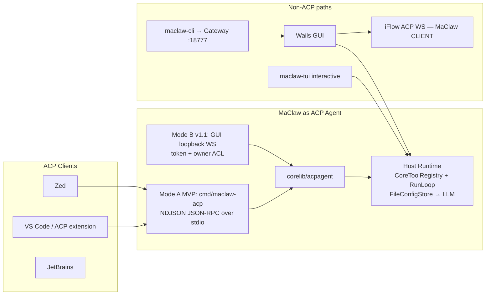
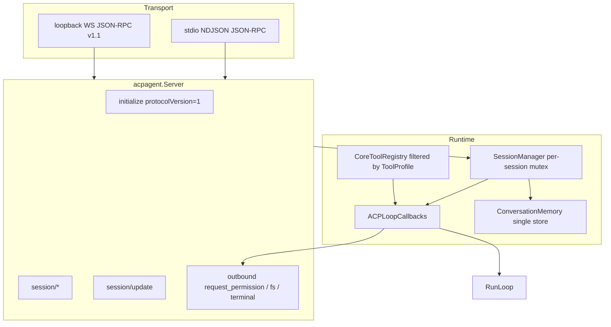

# Design: MaClaw 作为 Agent Client Protocol (ACP) Agent

| Field | Value |
|-------|--------|
| **Title** | Support Agent Client Protocol so external software can use MaClaw agent capabilities |
| **Author** | MaClaw engineering (Draft) |
| **Date** | 2026-07-18 |
| **Status** | Draft (rev 3 — config/TTL/MCP fixes) |
| **Related** | `docs/protocol.md`, `docs/agent-unification-design.md`, `docs/coding-subagent-architecture-design.md`, PRODUCT.md |
| **Protocol pin** | ACP `protocolVersion: 1` (integer MAJOR) |

---

## Overview

VS Code、Zed、JetBrains 等编辑器正在收敛到 **Agent Client Protocol (ACP)**——一套类似 LSP 的标准化 JSON-RPC 协议，用于「编辑器（Client）↔ 编程 Agent（Agent）」通信。MaClaw 已具备完整的 agent loop、工具、技能、权限审批、会话记忆与 GUI 工作台，但目前只能通过 Wails 桌面、IM 通道、`maclaw-cli`（第三方 IM Gateway 客户端）使用这些能力，**无法作为标准 ACP Agent 被编辑器直接 spawn 或 attach**。

本设计提出：把 MaClaw 暴露为 **ACP Agent 端**，优先复用 `corelib/agent` 共享 loop 与 **已存在的无头工具栈**（`CoreToolRegistry` + `RegisterCoreTools`，与 `maclaw-tui` 相同），而不是在编辑器内重写 MaClaw，也不是“像素级遥控 GUI”。

**v1 MVP** = **Mode A only**（stdio 无头子进程 `cmd/maclaw-acp`）。  
**v1.1** = **Mode B**（GUI 进程内 loopback ACP 端点）。Mode B **不在** MVP merge bar 内。

> **命名消歧（强制）**  
> - **Agent Client Protocol / Zed ACP**：https://agentclientprotocol.com/ 工业标准协议（本文对象）。  
> - **iFlow ACP WS**：`gui/remote_execution_iflow.go` 中 MaClaw 作为 **客户端** 连接 `ws://localhost:<PORT>/acp` 的 **iFlow 私有 WebSocket 协议**。  
> 代码包、类型、日志前缀一律使用 `acpagent` / `agentclientprotocol` / `zed-acp`，**禁止**再扩展 `iflow_acp_*` 命名空间表示工业 ACP。

---

## Background & Motivation

### 当前状态

| 入口 | 位置 | 角色 | 协议 / 能力 |
|------|------|------|-------------|
| 桌面 AI 助手 | `gui/app_wails_bindings.go` → `SendAIAssistantMessage` | GUI 驱动 agent | Wails IPC + 完整 IM 工具面 |
| IM / 第三方网关 | `gui/thirdparty_gateway.go`（默认 `127.0.0.1:18777`） | 外部发消息进 GUI agent | HTTP IM Gateway v1 |
| **`maclaw-cli`** | `maclaw-cli/main.go` | **Gateway HTTP 客户端** | **无 agent loop、无本地工具注册、无本地 LLM 推理**；默认 `http://127.0.0.1:18777/api/im-gateway/v1` |
| **`maclaw-tui`** | `tui/app.go` | **无头/终端 agent host** | `CoreToolRegistry` + `RegisterCoreTools` + `agent.RunLoop`；**`tui/commands.NewFileConfigStore(ResolveDataDir()).LoadConfig()`** → `buildLLMConfigFromAppConfig` → `MaclawLLMConfig`；`CGO_ENABLED=0` |
| 共享 agent loop | `corelib/agent/loop.go` | 平台无关核心 | `RunLoop` / `LoopCallbacks` / `LoopResult` |
| 会话历史 | `corelib/agent/conversation_memory.go` | userID 键控对话树 | 单 store 文件 + 分片 map；`NewPersistentConversationMemory(path)` |
| 核心工具注册 | `corelib/agent/tool_register_core.go` | 平台无关工具定义+handler | `RegisterCoreTools(r, CoreToolDeps)` |
| Handler 工厂 | `corelib/agent/handler_iface.go` | GUI 桥接 | `agent.NewHandler` **未注册 factory 时 panic**（“ensure gui/ is linked”） |
| iFlow 远程编码 | `gui/remote_execution_iflow.go` | MaClaw **Client** | iFlow ACP WS（非标准） |

`docs/protocol.md` 已系统整理 Claude stream-json、Codex app-server JSON-RPC 等无头协议，但 **尚未覆盖官方 ACP**，也未实现 ACP Agent 服务端。

### 痛点

1. **编辑器集成碎片化**：要在 VS Code 里用 MaClaw，只能间接走 CLI→Gateway（且要求 GUI 已运行），没有标准会话、流式 tool call、权限回环与 cwd/MCP 协商。  
2. **重复建设风险**：若不做 ACP，会被迫为每个 IDE 做私有扩展。  
3. **能力已存在但未标准化出口**：`RunLoop` 的流式/取消点与 ACP prompt turn 同构；缺协议映射层与 **正确的 headless host 二进制**。  
4. **“控制 GUI”语义模糊**：用户期望的是 **使用 MaClaw 的 agent 能力**，而非自动化点击 UI。

### 目标用户场景（主路径）

开发者在 VS Code 中：

1. 配置 ACP Agent 启动命令：`maclaw-acp`（或 `maclaw-tui acp` 别名，见 Host Runtime）；  
2. 在编辑器侧发起 prompt（可带 cwd、打开文件上下文）；  
3. Agent 以标准 ACP NDJSON 流式返回消息、tool calls；危险操作走 Client `session/request_permission`；  
4. 文件读写优先委托 Client `fs/*`；shell 在 Client 支持时走 `terminal/*`。

---

## Goals & Non-Goals

### Goals

1. 实现符合 [ACP protocolVersion 1](https://agentclientprotocol.com/protocol/v1/overview) 的 **Agent 端**（JSON-RPC 2.0，含双向 request）。  
2. **Mode A（MVP）**：编辑器 spawn 的 **stdio NDJSON** 无头进程。  
3. **Mode B（v1.1，非 MVP）**：运行中 GUI 暴露 loopback-only ACP 端点。  
4. v1 方法：`initialize`、`session/new`、`session/prompt`、`session/cancel`（notification）、`session/update`、`session/request_permission`（outbound）、可选 `session/load` + `loadSession` capability；Client `fs/*`/`terminal/*` 按能力代理。  
5. 复用 **`corelib/agent.RunLoop` + `CoreToolRegistry`/`RegisterCoreTools` + `ConversationMemory` + TUI 同源 `AppConfig` 加载**（`FileConfigStore` / `MaclawBaseDir`，见 §2.3）；**不**依赖 GUI 链接；**禁止**把 `corelib/configfile`（第三方 agent 配置）误当作 MaClaw `AppConfig` loader。  
6. 命名/包隔离，避免与 iFlow ACP 混淆。  
7. VS Code：文档化通用 ACP 客户端 spawn 配置；v1 不强制自研扩展。  
8. 可测协议一致性 + 增量 PR；**MVP merge bar 不含 Mode B**。

### Non-Goals（v1 / MVP）

- 像素级 GUI 遥控。  
- 完整 `app_view` / Dynamic UI → ACP。  
- Hub 云端远程 Agent 主路径。  
- 替换 `maclaw-cli` IM Gateway 协议。  
- 改名/删除 `iflow_acp_*`。  
- ACP Registry 强制上架。  
- **Mode B 默认开启**或纳入 MVP。  
- **`maclaw-cli acp` 作为真 agent host**（除非未来把 TUI 同栈迁入，见 Host Runtime）。  
- Mode A 使用 **`agent.NewHandler`**（除非链接 GUI——v1 明确拒绝）。

---

## Proposed Design

### 1. 角色模型



| 维度 | 工业 ACP（本设计） | iFlow ACP WS | maclaw-cli 今日 |
|------|-------------------|--------------|-----------------|
| MaClaw 角色 | **Agent（服务端）** | **Client** | **Gateway 客户端** |
| 是否跑 RunLoop | **是（本进程）** | 否（iFlow 跑） | **否**（HTTP 转发） |
| 传输 | stdio NDJSON；Mode B loopback | `ws://localhost/acp` | HTTP IM Gateway |

### 2. Host Runtime（关键 — 修正 maclaw-cli 误用）

#### 2.1 决策（Key Decision）

| 选择 | 结论 |
|------|------|
| **Mode A 主二进制** | 新建 **`cmd/maclaw-acp`**（console 子系统，Windows 友好），thin `main` 调用 `corelib/acpagent` + 与 TUI 相同的 headless 装配 |
| **工具/LLM 栈** | `agent.NewCoreToolRegistry()` + `agent.RegisterCoreTools(deps)` + `agent.RunLoop` + **`FileConfigStore` + 抽出的 `buildLLMConfigFromAppConfig`**（今日逻辑在 `tui/app.go`，非 `corelib/configfile`） |
| **禁止** | Mode A **禁止** `agent.NewHandler` / 链接 `gui/`（`NewHandler` 无 factory 时 panic） |
| **`maclaw-cli acp`** | **v1 不做**真 agent host。可选：子命令打印迁移提示 *“use maclaw-acp”*，或仅 `acp doctor` 转发检查；**不得**暗示 maclaw-cli 已能跑 loop |
| **`maclaw-tui acp`** | 可接受为 **第二入口**（同栈），但不替代独立 `cmd/maclaw-acp`（避免编辑器 spawn 拉起 Bubble Tea UI 依赖） |
| **`MaClaw.exe acp`** | **v1 不支持**（GUI 子系统 stdio 不可靠）。文档只推荐 `maclaw-acp` |

#### 2.2 装配草图（与 TUI 对齐）

参考已验证路径（**勿**使用 `corelib/configfile`——该包装的是 Claude/Codex/iFlow 等**第三方** agent 配置，不是 MaClaw `AppConfig`）：

- `tui/commands.NewFileConfigStore(dataDir).LoadConfig()` → `corelib.AppConfig`（`tui/commands/file_config_store.go`）  
- `tui/commands.ResolveDataDir()` → `MACLAW_DATA_DIR` 或 `corelib.MaclawBaseDir()`（`tui/commands/template.go`）  
- `tui/app.go`：`buildLLMConfigFromAppConfig` / `tuiRuntimeLLMConfigReady`（`package main`，**须抽出**）  
- `tui/app.go` / `pipe_mode.go` / `rpc_mode.go`：`NewCoreToolRegistry` + `RegisterCoreTools` + `RunLoop`  
- 路径规则：`corelib.MaclawBaseDir()` / `corelib/maclawpath.DefaultBaseDir()`（`corelib/paths.go`）

```go
// cmd/maclaw-acp/main.go — 概念装配（配置加载与 TUI 同源）
dataDir := resolveACPDataDir() // 见 §2.3：默认 MaclawBaseDir / MACLAW_DATA_DIR
cfgPath := filepath.Join(dataDir, "config.json")
if override := strings.TrimSpace(os.Getenv("MACLAW_CONFIG")); override != "" {
    cfgPath = override // 新 override；TUI 今日不读此变量
}
// 或 --config flag 优先于 env

// 实现：复制 FileConfigStore 逻辑到 corelib/acpagent/config.go（或抽 corelib 共享包）
// 禁止 import gui/；tui/commands 为 package commands，可从 cmd 依赖，或抽出避免拉 TUI 命令树
appCfg, err := loadAppConfig(cfgPath) // 等价 NewFileConfigStore 行为：读 JSON → AppConfig / defaults
llmCfg := buildLLMConfigFromAppConfig(appCfg) // 从 tui/app.go 抽出到 corelib/acpagent 或 corelib/llmconfig

reg := agent.NewCoreToolRegistry()
agent.RegisterCoreTools(reg, agent.CoreToolDeps{
    OnBashProgress: func(msg string) { /* → session/update progress */ },
})

base := corelib.MaclawBaseDir() // 或 dataDir；ACP 会话目录挂在 base 下
srv := acpagent.NewServer(acpagent.Options{
    AgentInfo:   acpagent.AgentInfo{Name: "maclaw", Title: "MaClaw", Version: version},
    LLM:         llmCfg,
    Registry:    reg,
    ToolProfile: acpagent.ToolProfileCoding,
    MemoryPath:  filepath.Join(base, "acp", "conversations.json"),
    MetaPath:    filepath.Join(base, "acp", "sessions-index.json"),
    // MemoryTTL: 见 §6.7 — 需 ConversationMemory API 扩展后才可设
})
return srv.ServeStdio(os.Stdin, os.Stdout) // 日志仅 stderr
```

#### 2.3 配置加载（精确 — 对齐真实 TUI 路径）

| 项 | 说明 |
|----|------|
| **默认 data dir** | `os.Getenv("MACLAW_DATA_DIR")`，空则 **`corelib.MaclawBaseDir()`**（与 `tui/commands.ResolveDataDir` 相同） |
| **默认 config 文件** | `filepath.Join(dataDir, "config.json")` — GUI/TUI 写入的同一 `AppConfig` JSON |
| **Loader 实现** | 行为对齐 **`tui/commands.FileConfigStore`**（读文件 / 不存在则 `AppConfigDefaults()`）。**不是** `corelib/configfile`。推荐在 PR0 把 store + `buildLLMConfigFromAppConfig` 抽到 `corelib/acpagent/config.go`（或小包 `corelib/appconfig`）以免 `cmd/maclaw-acp` 依赖整棵 `tui` |
| **新 override（非 TUI 既有）** | CLI `--config <path>` 优先；可选 env **`MACLAW_CONFIG`** 作为文件路径 override。**不得**写成“TUI 已支持 MACLAW_CONFIG”——TUI 今日只认 `MACLAW_DATA_DIR` + dataDir/`config.json` |
| **ACP 数据根** | `MemoryPath` / `MetaPath` / Mode B endpoint 使用 **`filepath.Join(corelib.MaclawBaseDir(), "acp", ...)`**（若 `MACLAW_DATA_DIR` 设置则用该 data dir），避免硬编码 `~/.maclaw` 字符串分叉 |
| **必需 LLM 字段** | 对齐 `buildLLMConfigFromAppConfig` 产出：`URL`、`Model` 非空；Key 来自 `MaclawLLMKey` / provider / Hub `RemoteViewerToken`（同 `tuiRuntimeLLMConfigReady` 语义） |
| **`maclaw-acp doctor`** | config 路径可读；LLM 字段就绪；`MaclawBaseDir()/acp` 可写；**不**要求 Gateway/`maclaw-cli` |

> **纠正**：maclaw-cli 的“零配置”是发现 **gateway host/port/token**，不是 Mode A LLM 路径。Mode A 与 **TUI FileConfigStore** 共享 `AppConfig`，与 **`corelib/configfile` 无关**。

### 3. 部署模式

#### Mode A — Headless ACP Agent（MVP）

```text
Editor spawns:
  maclaw-acp
  # 可选 flags:
  #   --config path
  #   --tool-profile coding|full
  #   --memory path
```

**Stdio 传输（强制，对齐官方）** — https://agentclientprotocol.com/protocol/v1/transports（及 `/protocol/transports`）：

| 规则 | 要求 |
|------|------|
| 帧格式 | **仅 NDJSON**：每条 JSON-RPC 消息一行，以 `\n` 分隔 |
| 嵌入换行 | JSON 消息 **MUST NOT** 含 embedded newlines |
| stdout | **仅** 合法 ACP JSON-RPC 消息；**禁止**日志、进度人类文本、banner |
| stderr | 日志（UTF-8）；Client 可忽略 |
| **禁止** | LSP 式 **Content-Length** 帧；双模式实现 |
| 测试 | Conformance：stdout 扫描非 JSON-RPC 字节失败；拒绝多行单帧 |

Windows：`cmd/maclaw-acp` 必须为 **console subsystem**。

#### Mode B — GUI-hosted ACP → **桌面 AI 助手（编程 agent）**（已实现）

**产品意图**：外部编辑器（VS Code）通过 ACP 使用 **现有 MaClaw GUI AI 助手**  
能力（同一 LLM/工具/项目会话），面向编程场景；`session/new.cwd` 映射为助手 `project_path`。

当 `MaClaw.exe` 运行时自动 `ensureACPHost()`：

```text
发现文件（统一挂在 MaclawBaseDir / MACLAW_DATA_DIR 下）:
  <MaclawBaseDir>/acp/endpoint.json
  <MaclawBaseDir>/acp/token          # owner-only
传输: loopback TCP NDJSON JSON-RPC（非 :18777）
后端: RunAIAssistantProgrammingPrompt → HandleIMMessageWithProgressAndStream
实现: gui/acp_host.go, gui/acp_ai_assistant_backend.go
Bridge: 优先 DialModeB，失败再走 IM Gateway
```

#### Mode C — VS Code 一方扩展（已实现）

源码 `vscode-ext/`：聊天 webview 贡献到底部面板（`viewsContainers.panel`，不挡文件树），
spawn `maclaw-acp-bridge` 走 stdio NDJSON；VSIX 嵌入 GUI（`gui/vscode_ext_asset/`），
一键启动 VS Code 时自动安装/升级。详见 `docs/acp-bridge.md`「一方 VS Code 扩展」。

#### Mode Bridge — VS Code ↔ 运行中 GUI（已实现骨架）

见 **`docs/acp-bridge.md`** 与 **`cmd/maclaw-acp-bridge`**。

```text
VS Code --ACP stdio--> maclaw-acp-bridge --IM Gateway HTTP--> MaClaw GUI
```

- 实现包：`corelib/acpagent`（NDJSON + Bridge + GatewayClient）
- 后端阶段 1：GUI `thirdparty_gateway`（`:18777`）
- 后端阶段 2（设计）：Mode B loopback ACP Host，bridge 做 stdio↔WS 透传
- 与 Mode A 并存：无 GUI 用 `maclaw-acp`；要 GUI 配置/审批用 bridge

### 4. 包与命名

```text
corelib/acpagent/          # 协议 + Bridge + Gateway 客户端 +（未来 Mode A）
cmd/maclaw-acp-bridge/     # VS Code ↔ GUI bridge entry（阶段 1）
cmd/maclaw-acp/            # Mode A console entry（规划中）
gui/acp_host.go            # Mode B only (v1.1)
# 禁止把工业 ACP 塞进 gui/iflow_acp_* 或 maclaw-cli 当 loop host
```

日志前缀：`[acp-agent]` / `[acp-bridge]`。

### 5. 架构分层



### 6. Capability 映射

#### 6.1 方法映射总表

| ACP Method / Notification | 方向 | 性质 | MaClaw 映射 | 阶段 |
|---------------------------|------|------|-------------|------|
| `initialize` | C→A | request | 协商 `protocolVersion: 1`；返回 capabilities + `agentInfo` | MVP |
| `authenticate` / `logout` | C→A | request | Mode A：`authMethods: []`；Mode B：token | Mode B |
| `session/new` | C→A | request | 创建 session；`cwd` 绝对路径；memory key；`mcpServers` MVP-Core 存储/忽略，PR-MCP 后 spawn | MVP-Core / PR-MCP |
| `session/prompt` | C→A | request | ContentBlock[] → RunLoop；结束返回 stopReason | MVP |
| `session/update` | A→C | **notification** | message chunks / tool_call / plan | MVP |
| `session/cancel` | C→A | **notification（无 response）** | `ShouldStop=true`；取消 LLM ctx；prompt 结果 `cancelled` | MVP |
| `session/request_permission` | A→C | request | 工具授权；options 使用 ACP kinds | MVP |
| `fs/read_text_file` `fs/write_text_file` | A→C | request | 代理读/写 | MVP if client cap |
| `terminal/*` | A→C | request | 代理 shell | MVP if client cap |
| `session/load` | C→A | request | 从 ConversationMemory 回放 | MVP 目标 |
| `session/resume` | C→A | request | 恢复不回放 | v1.1 |
| `session/close` | C→A | request | cancel + free 活跃资源 | v1.1 |
| `session/list` | C→A | request | 读 sessions-index 元数据 | v1.1 |
| `session/delete` | C→A | request | 从 list/history 删除（官方已稳定） | **Later / v1.1+** |
| `session/set_mode` / config options | C↔A | | coding/chat 等 | Later |
| Slash commands | A→C | | Skills | Later |
| `_maclaw/*` | — | extension | app_view 等 | Later |

#### 6.2 `initialize` 结果示例（v1 MVP）

```json
{
  "jsonrpc": "2.0",
  "id": 0,
  "result": {
    "protocolVersion": 1,
    "agentCapabilities": {
      "loadSession": true,
      "promptCapabilities": {
        "image": false,
        "audio": false,
        "embeddedContext": true
      },
      "mcpCapabilities": {
        "http": false,
        "sse": false
      }
    },
    "agentInfo": {
      "name": "maclaw",
      "title": "MaClaw",
      "version": "0.1.0"
    },
    "authMethods": []
  }
}
```

说明（MVP-Core MCP）：`mcpCapabilities` 仅描述 HTTP/SSE 能力（均 false）。**stdio MCP 是 ACP baseline MUST**，但仓库尚无 headless 实现——MVP-Core **接受** `session/new.mcpServers` 却 **不 spawn**（§6.8）；interop risk 必须写在 doctor/用户文档。**PR-MCP** 落地后才宣称 full baseline。

说明：

- 顶层 `loadSession`（非 nested）控制 `session/load`。  
- `sessionCapabilities.resume|close|additionalDirectories|delete` 等 **v1.1+** 再 advertise；未 advertise 时 Client 不得调用。  
- Baseline MUST：prompt 支持 `text` + `resource_link`；`embeddedContext` 打开以接受 `resource` 块。  
- **版本协商**：Client 发最新 MAJOR；Agent 若支持则回相同 `1`，否则回自身最新；Client 不支持则 **关闭连接**。MaClaw v1 **只实现 MAJOR 1**。

#### 6.3 Prompt Turn 与并发

```mermaid
sequenceDiagram
  participant Client as ACP Client
  participant Agent as acpagent.Server
  participant Loop as agent.RunLoop
  participant Tools as Profile tools / Client RPC

  Client->>Agent: initialize (protocolVersion=1)
  Agent-->>Client: capabilities
  Client->>Agent: session/new {cwd absolute, mcpServers}
  Agent-->>Client: sessionId
  Client->>Agent: session/prompt
  Note over Agent: acquire per-session prompt mutex
  Agent->>Loop: RunLoopWithUserContent
  loop iterations
    Loop-->>Agent: OnToken
    Agent-->>Client: session/update agent_message_chunk
    Loop-->>Agent: tool
    Agent-->>Client: session/update tool_call
    opt needs permission
      Agent->>Client: session/request_permission
      Client-->>Agent: selected | cancelled
    end
    Agent->>Tools: execute
    Agent-->>Client: tool_call_update completed
  end
  Agent-->>Client: session/prompt result stopReason
  opt cancel
    Client-->>Agent: session/cancel notification
    Note over Agent: ShouldStop; pending permission waiters → treat as cancelled
    Agent-->>Client: stopReason cancelled on prompt
  end
```

**并发规则（MVP）**：

| 场景 | 行为 |
|------|------|
| 同一 `sessionId` 上重叠 `session/prompt` | **串行**：持 per-session mutex；第二请求等待或返回 JSON-RPC error `session_busy`（实现选一，默认 **等待+cancel 可打断**） |
| 不同 session 并发 prompt | **允许**（共享进程内多会话） |
| `session/cancel` | notification；不 reply；尽快停 LLM/工具；**所有** in-flight `session/request_permission` 的等待端在 Client 侧会收 `cancelled`——Agent 必须能在 cancel 后结束 wait，并把 prompt 收成 `cancelled`（不得用未捕获异常变 JSON-RPC error） |

#### 6.4 Tool Profile Spec（v1 可实施）

工具名来自 **`RegisterCoreTools` 单一真源**（`corelib/agent/tool_register_core.go`），profile 是 **filter**，不平行造定义。

##### Profile `coding`（**默认**）

| 工具名 | ACP tool kind | 执行路由 | 备注 |
|--------|---------------|----------|------|
| `read_file` | `read` | **Client fs 优先** → 否则本地 + cwd 边界 | 大文件 outline 逻辑可保留在本地 path |
| `FileRead` | `read` | 同上 | 行号读取 |
| `write_file` | `edit` | **Client fs 优先**（`fs/write_text_file`）→ 否则本地 + **permission** | 完成后 tool content 含 **diff**（见下） |
| `edit_file` | `edit` | 同上 | 同上 |
| `list_directory` | `search` | 本地（cwd 内）；无 Client 列表 API 时本地 | |
| `Glob` | `search` | 本地，rooted at cwd | |
| `ripgrep` | `search` | 本地，rooted at cwd | |
| `bash` | `execute` | **Client `terminal/*` 优先** → 否则本地 bash + **permission**（高风险从不 auto-allow） | |
| `read_tool_result` | `read` | 本地（tool_results 目录） | spill 回读 |

**coding 默认拒绝注册到 LLM 工具表（deny-by-default）**：  
`send_file`, `send_to_im`, `im_message`, `ssh`, `screenshot`, `tts`, `asr`, `record_audio`, `manage_skill`, `manage_schedule`, `knowledge_*`, `read_excel`/`write_excel`/`read_pptx`, `web_search`/`web_fetch`（除非后续 config 打开）, `memory`（v1 默关；可 full profile 开）, `task`/`goal`, `open`, `ask_user`（**特殊**：见 LoopResult，工具可保留但 pause 映射固定）。

> `ask_user`：coding profile **保留**工具定义（模型可提问），但 pause 处理按 §6.6，**不**走 GUI card。

##### Profile `full`

`RegisterCoreTools` 全量 + host `ExtraHandlers` 中已注入者；IM/截图等无 handler 的保持 stub 友好错误。仍强制 cwd 边界与 permission 策略。

##### Client capability 路由矩阵

| 操作 | Client cap 具备 | Client cap 不具备 |
|------|-----------------|-------------------|
| 读文件（`read_file`/`FileRead`） | Agent 调 `fs/read_text_file`；结果回填 tool result | 本地读；path 必须在 `cwd` ∪ `additionalDirectories` |
| 写/改文件 | Agent 调 `fs/write_text_file`；并 `tool_call_update` 附 **diff** content | 本地写 + `session/request_permission`（写类） |
| `bash` | `terminal/create` → output/wait → release；tool content 可嵌 terminal id | 本地 `ToolBashWithContext` + permission |
| 其它工具 | 本地 registry | 本地 registry |

**cwd 强制**：

- `session/new.cwd` **MUST** 为绝对路径（ACP）。  
- 相对 path 解析相对 cwd。  
- 本地执行前规范化并检查路径落在 effective roots：`[cwd, ...additionalDirectories]`（仅当 advertise `additionalDirectories` 且 Client 传入时）。  
- 越界 → permission 请求（kind 说明 out-of-root）或直接 deny（配置项 `strictRoots=true` 默认 true）。

##### Diff 发射（write/edit）

写成功后 `tool_call_update` content 包含：

```json
{
  "type": "diff",
  "path": "D:\\abs\\path\\file.go",
  "oldText": "...",
  "newText": "..."
}
```

- 新文件：`oldText` 可 null/省略（按 schema）。  
- Client fs 路径：与 Client 使用同一绝对路径。  
- 实现：写前读 old（Client 或本地），写后拼 diff；过大则截断 old/new 并在 text content 说明。

##### System prompt

- 使用 `corelib/agent` 侧 **coding 向** prompt 构建（可复用/抽出 `BuildSystemPrompt` + `SystemPromptDeps` 的精简 preset），**禁止**注入飞书/微信 IM 规则、完整 40+ 工具说明书。  
- 对齐 `docs/coding-subagent-architecture-design.md` 的“纯净编码 context”原则。  
- 不走 `IMMessageHandler` 的桌面 system prompt 管道。

#### 6.5 权限：MaClaw 内部 → ACP 线协议

**列澄清**：`session/request_permission` 是 **ACP Client 基线方法**（Agent 调用 Client），**不是** MaClaw 内部概念。

| MaClaw 内部机制 | 位置 | ACP 线 | 选项 kinds（强制） |
|-----------------|------|--------|-------------------|
| 高风险 bash / 写盘 | acpagent policy | `session/request_permission` | `allow_once`, `allow_always`, `reject_once`, `reject_always` |
| `ScopeApprovalDecision` | `gui/coding_subagent_scope_approval.go`：`allow_once` / `allow_dir` / `full_access` / `deny` | 映射到上表 kinds；`allow_dir`/`full_access` → sticky 近似 `allow_always`（session 级目录表） | |
| `PermissionDecision` | `gui/remote_permission.go`：`approved` / `approved_for_session` / `denied` / `abort` | `approved`→`allow_once`；`approved_for_session`→`allow_always`；`denied`→`reject_once`；`abort`→ outcome `cancelled` 或 reject | |
| 远程执行里 MaClaw 当 **外部 agent 宿主** 的 permission | `gui/remote_permission.go` 注释语境 | **角色相反**（那时 MaClaw 是 Client 侧权限 UI）；工业 ACP Mode A **不走该路径** | |

**Wire options 示例**：

```json
"options": [
  {"optionId": "allow_once", "name": "Allow once", "kind": "allow_once"},
  {"optionId": "allow_always", "name": "Allow always for this session", "kind": "allow_always"},
  {"optionId": "reject_once", "name": "Reject", "kind": "reject_once"},
  {"optionId": "reject_always", "name": "Reject always", "kind": "reject_always"}
]
```

**Sticky 规则**：

- `allow_always`：session 内同 tool 名 + 同类操作（或规范化 path 前缀）自动放行；进程退出清空。  
- `reject_always`：session 内同类直接拒绝。  
- 高风险 bash：**禁止**静默 auto-allow（无 timeout-as-allow）。

**Mode B permissionUI（v1.1）**：

| 值 | 行为 |
|----|------|
| **`client`（默认）** | **仅** `session/request_permission`；不弹 MaClaw GUI |
| `gui` | 仅 GUI 审批；Client 侧发 progress 文本 |
| `both` | **v1.1 不默认、不建议**；若实现：单 winner = **先到先得**，另一方立即 cancel；超时（对齐 scope approval timeout）→ deny；audit 记 source |

v1.1 **默认 `client` only**，避免双仲裁死锁。

#### 6.6 完整 `LoopResult` → ACP 映射

`LoopResult` 定义见 `corelib/agent/loop.go`。

| LoopResult 字段 / 条件 | ACP 行为 | stopReason / 其它 |
|------------------------|----------|-------------------|
| 正常结束，`Error==""`，无 AskUser/RecordAudio | 已流式 message；返回 prompt result | `end_turn` |
| `Error == "cancelled"` 或 `ShouldStop` | 刷完必要 tool_call cancelled 状态 | **`cancelled`**（禁止裸 JSON-RPC error 表示取消） |
| `Error` 含 LLM 失败等 | 可选 agent_message 解释；result | `end_turn` 或 `refusal`（若策略拒绝） |
| `HardExit == true` | 将 `Text` 作为最后 agent 消息；result | `end_turn` 或 `refusal`（空响应硬退可用 `refusal`） |
| 达到 max iterations | | `max_turn_requests` |
| finish_reason length / max tokens | | `max_tokens` |
| **`AskUser != nil`** | 见下方 v1 策略 | **不是** stopReason 名 |
| **`RecordAudio != nil`** | v1 coding：**不支持**；结束 turn，agent 文本说明不可用 | `end_turn` |
| `PauseToolCallID` | 与 AskUser/RecordAudio 配对 | |
| `Usage` / `Route` | v1：stderr 结构化日志；**v1.1** `usage_update` | |
| `HistoryDelta` | `mem.Append` + dirty flush | |
| `LightUpgraded` | 仅日志 | |

**AskUser v1 策略（选定 (b)+轻量 (a) 混合）**：

官方 stopReason **没有** `ask_user`。v1 采用：

1. 发出 `session/update` `tool_call`（name=`ask_user`，status pending/in_progress）。  
2. 将 `AskUserRequest.Question` / `Options` 格式化为 **agent_message_chunk**（Markdown 列表选项）。  
3. **结束本轮** `session/prompt` with **`stopReason: end_turn`**（并在 tool_call 标 `completed` 且 content 为“等待用户下一条消息”）。  
4. 用户下一条 `session/prompt` 文本视为对该问题的回答；Session 状态机保存 `pendingAsk` + `PauseToolCallID`，在下一 turn 开头注入 synthetic `tool_result` 再 `RunLoop`。  

**不**在 v1 把 AskUser 映射成无限挂起的 `session/request_permission`（permission 语义是授权，不是自由文本问答）。Elicitation RFD → Later。

**RecordAudio**：coding profile 不注册；若 full profile 触发 → 立即 `end_turn` + 说明 IDE 无录音 UI。

**Permission cancel 竞态**：

1. Client 发 `session/cancel`。  
2. Agent 置 `ShouldStop`。  
3. 若正在 `request_permission` 阻塞：依赖 Client 对 pending permission 回 `outcome: cancelled`（规范要求）；Agent wait 同时 select cancel ch，**双通道**任一触发即继续，tool 不执行，prompt → `cancelled`。

#### 6.7 Session 持久化（单一真源）

| 层 | 路径 | 内容 |
|----|------|------|
| **对话正文（SSOT）** | `<MaclawBaseDir>/acp/conversations.json` | `NewPersistentConversationMemory(path)` **单文件**存所有 session；key = `acp:<sessionId>`（userID 槽） |
| **元数据索引（sidecar）** | `<MaclawBaseDir>/acp/sessions-index.json` | sessionId, cwd, createdAt, updatedAt, title, clientInfo — 供 `session/list`；**不含**完整 transcript |
| **禁止** | 每 session 再存一份完整对话 JSON | 避免与 ConversationMemory 双写漂移 |

API 使用：

- 读历史：`Load` / `LoadActiveBranch(memoryKey)`  
- 追加：`Append(memoryKey, HistoryDelta...)`  
- **进程退出 / ServeStdio 返回前**：`FlushNow()`（编辑器短生命周期子进程必须）  

##### MemoryTTL 现状与变更计划（Issue 17）

**今日代码**（`corelib/agent/conversation_memory.go`）：

- `MemoryTTL = 2 * time.Hour` 是 **package-level const**  
- `EvictExpired()` **硬编码**使用该 const，**无** per-instance 字段、`SetMemoryTTL`、或构造参数  
- 因此 rev2 里写 `Options.MemoryTTL` 作为“直接可接线”是 **错误的**——当前 API 不支持  

**决策（两阶段）**：

| 阶段 | 行为 |
|------|------|
| **PR2a — 小 corelib API 变更（推荐，与 session 同 PR）** | 在 `ConversationMemory` 增加实例字段 `ttl time.Duration`（零值 = 沿用 package `MemoryTTL` 以保持 GUI/TUI 兼容）；`EvictExpired` 读实例 ttl；可选 `NewPersistentConversationMemoryWithTTL(path, ttl)` 或 `func (cm *ConversationMemory) SetTTL(d time.Duration)`（`d<=0` = 禁用 eviction）。**ACP 设 7d 或禁用 eviction**。 |
| **若 PR2a 未合并前的临时 MVP** | **不要**假装 `Options.MemoryTTL` 已生效；依赖 `Append` 刷新 `lastAccess` + 短生命周期 Mode A 进程 + 退出 `FlushNow`。接受 2h 全局 const 风险仅适用于“进程常驻 >2h 且无 touch 的 session”。 |

`acpagent.Options` 仅在 PR2a 落地后暴露 `MemoryTTL`；否则字段省略或文档标 `// requires ConversationMemory SetTTL`。

`session/load`：从 SSOT 读 branch → 以 `session/update` 回放 user/agent chunks（工具结果可折叠摘要）→ 再响应 load。

`session/delete`（Later）：从 index 删除 + `Clear(memoryKey)`。

#### 6.8 MCP 生命周期与实现缺口（Issue 18）

##### 现状（禁止假设“已有可链入 headless 的 stdio MCP”）

| 组件 | 实际能力 |
|------|----------|
| **`corelib/mcp`** | **仅 HTTP**：`sse` / `streamable-http`（`client.go` 对非 HTTP transport 直接报错）。**无** stdio 子进程传输。 |
| **GUI `MCPRegistry` / LocalMCP** | `gui/app_nl_mcp.go` 等：本地 stdio MCP 配置与 runtime 在 **`package main` gui**，不可被 `cmd/maclaw-acp` 在“不链接 GUI”约束下 import。 |
| **TUI** | 配置 UI 可编辑 `LocalMCPServers`；**无**共享 corelib stdio MCP host 供 ACP `session/new.mcpServers` 使用。 |

因此：“MVP 直接 spawn stdio MCP”若写成就地复用，是 **不可实施** 的。

##### 决策：分轨交付（诚实 + 可完成 ACP 基线）

| 轨 | 范围 | ACP 声明 |
|----|------|----------|
| **MVP-Core（PR0–PR8，可先合并）** | `session/new` **接受并存储** `mcpServers` 参数，但 **不 spawn、不把 MCP tools 并入 BuildTools**；`initialize.agentCapabilities.mcpCapabilities` = `{http:false, sse:false}`；日志 stderr 一条 warning：`mcpServers ignored until stdio host lands`。 | **部分偏离** ACP「Agent MUST support stdio MCP」——在文档/doctor 与版本说明中 **显式标 interop risk**；**不**上 Registry、**不**宣称 full baseline。 |
| **MVP-MCP / ACP baseline 完备（PR-MCP，阻塞“完整合规”）** | 新增 **headless stdio MCP 客户端**（见下），完成 spawn/list/call/teardown 与工具合并。 | 之后才可宣称完整 baseline / 考虑 Registry。 |

##### PR-MCP 技术要点（新实现；GUI 仅作参考）

**位置（二选一，优先 A）**：

- **A. `corelib/mcp/stdio`（推荐）**：与 HTTP client 并列，供 ACP / 未来 TUI 共用  
- **B. `corelib/acpagent/mcpstdio`**：若希望先隔离实验，后续再上移  

**勿** import `gui.MCPRegistry`。可 **对照** `gui/app_nl_mcp.go` LocalMCP 的进程生命周期思路重写。

**协议行为**：

1. `session/new.mcpServers[]`：对每项 stdio 配置（`command` 绝对路径、`args`、`env`）spawn 子进程；stdin/stdout 上 MCP JSON-RPC（initialize → tools/list）。  
2. **Session 级拥有**；`session/close` / 进程退出 → kill children（含 process group）。  
3. 工具合并：`tools/list` 结果以 namespaced 名并入该 session 的 `BuildTools`（例如 `mcp_<server>_<tool>` 或 ACP/客户端约定名）；`ExecuteTool` 转发 `tools/call`。  
4. **与 coding profile 关系**：session 传入的 MCP 工具是 **session overlay**，**不受** RegisterCoreTools coding allowlist 过滤（allowlist 只滤 core 工具）；仍受 permission 策略（写盘/执行类）。  
5. 单 MCP 失败：记 stderr，session/new 仍成功；中途死亡：下次 call 失败，v1 不自动重启。  
6. **不**跨 session 共享进程。  
7. `mcpCapabilities.http` 仍 false until HTTP session MCP 接线；sse 永 false。

**PR 顺序**：PR-MCP 依赖 PR2（session）+ PR3（prompt/tools 表）；可与 PR5 并行，**建议在 PR8 conformance 前完成**若要以 full baseline 出厂；否则 PR8 测 core，PR-MCP 自带 MCP 用例。

### 7. Mode B 安全（MUST，v1.1）

| # | 要求 |
|---|------|
| 1 | **Bind**：仅 `127.0.0.1`；如需 IPv6 则 **独立** `::1` listener；**禁止** `0.0.0.0` / 未指定双栈 |
| 2 | **Accept 校验**：每个连接检查 `RemoteAddr` 仍为 loopback；否则立即关闭 |
| 3 | **Token 强制**：空 token = **拒绝一切**（对齐 gateway token 空则 authorize false）；握手/`authenticate` **或** 每条连接首帧必须带 token |
| 4 | **Token 比较**：constant-time（`subtle.ConstantTimeCompare`） |
| 5 | **Windows ACL**：token 与 endpoint 文件 **owner-only DACL**（当前用户 FULL；禁用继承；无 Everyone/Users 读）；**不只是** Unix `0600` 文案 |
| 6 | **Unix**：`0600` 文件模式 |
| 7 | **启动**：生成新 token（旋转）；写 token 文件后写 endpoint.json（含 pid、url、protocol、agent） |
| 8 | **陈旧清理**：启动时若 endpoint.pid 存活且为 MaClaw → 不抢占或按配置接管；**pid 死亡或不存在** → 删除旧 endpoint+token 再写新文件 |
| 9 | **干净退出**：删除 endpoint.json + token |
| 10 | **WebSocket Origin**：非空 Origin 且非 null/`file://`/本机开发例外 → **拒绝**（防恶意网页连 loopback）；允许无 Origin 的原生客户端 |
| 11 | **权限 UI 默认** `client` only |
| 12 | **残余威胁**：同用户恶意进程可读 token——文档声明 trusted-local-user 模型；不宣称跨用户隔离 |

### 8. v1 vs Later

#### MVP-Core（可合并；stdio MCP 未执行）

- `cmd/maclaw-acp` + `corelib/acpagent`  
- NDJSON stdio  
- initialize (`protocolVersion: 1`) + session/new|prompt|cancel + updates + permission  
- coding tool profile + Client fs/terminal 路由  
- ConversationMemory SSOT + loadSession（+ PR2a 实例 TTL）  
- AppConfig via FileConfigStore 语义 / MaclawBaseDir  
- doctor + golden tests  
- `mcpServers` 接受并记录 **ignore**（见 §6.8 interop risk）  

#### Full ACP baseline（MVP-Core + PR-MCP）

- Headless stdio MCP spawn/tools merge/teardown（`corelib/mcp/stdio`）  
- 之后才可 Registry / “完整 baseline” 声明

#### v1.1

- Mode B host + 上表安全 MUST  
- session/list|resume|close；sessionCapabilities  
- usage_update  
- permissionUI 配置  

#### Later

- `session/delete`  
- app_view / elicitation  
- skills slash commands  
- full profile 默认  
- Registry  
- 远程 HTTP/WS transport  

### 9. VS Code 集成

```json
{
  "agents": [
    {
      "name": "maclaw",
      "command": "maclaw-acp",
      "args": [],
      "env": {
        "MACLAW_CONFIG": "C:\\Users\\...\\.maclaw\\config.json"
      }
    }
  ]
}
```

前置：`maclaw-acp doctor` 绿；二进制在 PATH。

### 10. Registry

manifest 草稿 `bin.command: maclaw-acp`；上架非 MVP。

### 11. Testing Strategy

| 层 | 内容 |
|----|------|
| PR1 起 | initialize NDJSON golden；stdout 无杂质 |
| 单元 | ContentBlock、stopReason、LoopResult 矩阵、permission kind 映射、path root 检查 |
| 集成 | pipe 假 Client 全 turn；cancel+permission 竞态；AskUser 两轮注入 |
| Host | 无 GUI 链接编译 `cmd/maclaw-acp`（`CGO_ENABLED=0`） |
| Mode B | ACL/非 loopback/空 token/陈旧 pid（v1.1） |

Conformance 最低：cancel→`cancelled`；stdout 纯净；多 session 隔离；NDJSON only。

### 12. Risks

| Risk | Severity | Mitigation |
|------|----------|------------|
| 误用 maclaw-cli 当 agent host | High | Host Runtime 节 + MVP 二进制 `maclaw-acp` |
| Content-Length 互操作失败 | High | **仅 NDJSON** + 测试 |
| NewHandler panic | High | 禁止 Mode A 链接 GUI factory |
| Mode B token 同用户泄露 | High | MUST ACL + 文档 threat model |
| Conversation 双写 | Medium | 单 SSOT + index sidecar |
| 权限双 UI 死锁 | Medium | v1.1 默认 client-only |
| MemoryTTL 误清 IDE 会话 | Medium | **PR2a** 实例 TTL API；禁止假装 Options 已接线；临时依赖 Append+FlushNow |
| 宣称 stdio MCP 却无实现 | High | MVP-Core 显式 ignore + interop 声明；**PR-MCP** 新建 stdio host 后才 full baseline |
| 工具面过大 | Medium | 默认 coding allowlist |

---

## API / Interface Changes

```go
package acpagent

type Options struct {
    AgentInfo   AgentInfo
    LLM         corelib.MaclawLLMConfig
    Registry    *agent.CoreToolRegistry
    ToolProfile ToolProfile // Coding | Full
    MemoryPath  string      // <MaclawBaseDir>/acp/conversations.json SSOT
    MetaPath    string      // sessions-index.json
    // MemoryTTL: only after corelib ConversationMemory supports per-instance TTL
    // (PR2a). Until then omit; eviction uses package const MemoryTTL=2h.
    MemoryTTL time.Duration // 0 = disable eviction when API exists; default 7d for ACP
    Logger    *log.Logger   // stderr
    // EnableSessionMCP: false in MVP-Core; true after PR-MCP stdio host ships
    EnableSessionMCP bool
}

func NewServer(opt Options) *Server
func (s *Server) ServeStdio(in io.Reader, out io.Writer) error // NDJSON only
func (s *Server) Close() error // FlushNow + MCP teardown (if enabled)
```

CLI：

```text
maclaw-acp [--config path] [--data-dir path] [--tool-profile coding|full]
maclaw-acp doctor
# --config / MACLAW_CONFIG: 新 override（非 TUI 既有）
# 默认 data dir: MACLAW_DATA_DIR || MaclawBaseDir()
```

---

## Data Model Changes

- **SSOT**：`<MaclawBaseDir>/acp/conversations.json` via `NewPersistentConversationMemory`  
- **Index**：`<MaclawBaseDir>/acp/sessions-index.json`  
- **corelib 小变更（PR2a）**：`ConversationMemory` 实例 TTL（见 §6.7）  
- **stdio MCP（PR-MCP）**：无持久 schema；进程态 only  
- 无 SQL migration  

---

## Alternatives Considered

### A. OpenAI-compatible HTTP proxy only
快但不具备 ACP 会话/权限/生态。否作为主路径。

### B. MCP Server only
工具协议 ≠ agent 会话协议。互补而非替代。

### C. 仅增强 maclaw-cli invoke / Gateway
已有自动化价值；**不能**冒充 ACP Agent（cli 无 loop）。

### D. VS Code Webview 嵌 MaClaw UI
重、非标准。Non-goal。

### E. 仅 Mode B
GUI 未开不可用。否。

### F. 在 `maclaw-tui` 上挂 ACP（无独立 `cmd/maclaw-acp`）
- **优点**：零新二进制、栈已通。  
- **缺点**：TUI 依赖/体积/误启 UI；编辑器 spawn 语义不清。  
- **结论**：**同栈抽取**到 `corelib/acpagent` + **独立** `cmd/maclaw-acp`；TUI 可选第二入口。

### G. 极简 MVP：仅 Client fs + 本地 bash，几乎不调 RegisterCoreTools
- **优点**：最快出 stdio demo。  
- **缺点**：丢掉与 TUI 一致的工具语义与后续 full profile。  
- **结论**：采用 **RegisterCoreTools + coding filter**（G 的速度与 F 的一致性折中）。

### H. Mode A 附着运行中 GUI Gateway
- **优点**：复用 GUI 全工具。  
- **缺点**：要求 GUI 在线；非标准 ACP spawn；变相 maclaw-cli。  
- **结论**：保留 Gateway 路径；ACP Mode A **本进程** loop。

---

## Security & Privacy Considerations

见 Mode B MUST 表 + Mode A permission 门控 + 密钥不进 ACP 回传 + 日志 redact。  
Trusted local user 模型（官方 ACP 架构 “Trusted”）。

---

## Observability

| 模式 | 策略 |
|------|------|
| **Mode A** | 短生命周期进程：**结构化 stderr** 日志行（session、method、dur_ms、stopReason、tool 计数）；turn 结束一条 `session_summary` JSON 行。 **不**假设存在常驻 metrics 后端。 |
| **Mode B** | 进程内计数器（sessions_active、prompt_turns、permission outcomes）；可选复用 GUI 既有 usage/tracker **若**直接调用其 API——须点名导入符号，否则只用本地 atomic。 |
| Doctor | 配置/LLM/写权限/（B）endpoint 健康 |

**纠正**：不笼统写“复用现有 usage 体系”而不指 API。MVP 以 stderr 为准。

---

## Rollout Plan

1. MVP：发布 `maclaw-acp` + 文档；**不含** Mode B。  
2. Feature flag 仅影响 Mode B `acp_host.enabled` 默认 false。  
3. Rollback：去掉编辑器 agent 配置即可。  

---

## Open Questions（仅非阻塞）

1. ~~工具默认 coding vs full~~ → **Key Decision：默认 coding**。  
2. ~~Handler 层~~ → **Key Decision：RunLoop+CoreToolRegistry；拒绝 NewHandler（Mode A）**。  
3. ~~MaClaw.exe acp~~ → **Key Decision：v1 不支持**。  
4. Schema Go 类型：手写最小集 + 契约测试；稳定后考虑生成 — **默认手写**。  
5. session/list 与桌面会话互通？**默认否**。  
6. AskUser 未来是否上 elicitation？**等 RFD/产品**；v1 已定 end_turn+follow-up。  

---

## Key Decisions

| # | Decision | Rationale |
|---|----------|-----------|
| 1 | MaClaw 是 **ACP Agent** | 编辑器消费 MaClaw 能力 |
| 2 | 与 iFlow ACP **命名/包隔离** | 仓库已有 `iflow_acp_*` |
| 3 | **Mode A 优先**；MVP **不含 Mode B** | 官方经典 spawn；Windows console |
| 4 | Mode A 宿主 = **`cmd/maclaw-acp`** + **CoreToolRegistry/RegisterCoreTools/RunLoop**（TUI 同栈） | maclaw-cli **无 loop**；NewHandler 需 GUI |
| 5 | **拒绝** Mode A 使用 `agent.NewHandler` | `handler_iface.go` 无 factory 则 panic |
| 6 | **`maclaw-cli` 不做** v1 agent host | 避免错误架构；保持 Gateway 客户端身份 |
| 7 | Stdio = **NDJSON only** | 官方 transports；禁 Content-Length |
| 8 | `protocolVersion` **固定协商 1** | 单一 MAJOR 实现 |
| 9 | 默认 **coding tool allowlist**（表 §6.4） | 防 40+ 工具污染；真源 RegisterCoreTools |
| 10 | 文件/shell **Client cap 优先**，否则本地+permission+roots | 编辑器一致性 |
| 11 | 对话 **ConversationMemory 单文件 SSOT** + index sidecar | 防双写 |
| 12 | AskUser → **end_turn + 下轮注入 tool_result** | 无 ask stopReason；不挂死 prompt |
| 13 | Permission wire kinds = **allow_once/always, reject_once/always** | 对齐官方 |
| 14 | Mode B 默认 **permissionUI=client**；安全 MUST 表 | 防双仲裁与 loopback 威胁 |
| 15 | 协议实现在 **`corelib/acpagent`** | 多入口一份逻辑 |
| 16 | 与 Gateway/cli **并存** | 自动化场景已投资 |
| 17 | 扩展只用 `_` / `_meta` | 可 registry |
| 18 | **AppConfig** 经 **FileConfigStore / MaclawBaseDir** 加载；**禁止** `corelib/configfile` | 与 TUI 真路径一致；configfile 是第三方 agent 配置 |
| 19 | **MemoryTTL**：PR2a 为 ConversationMemory 增加 **实例 TTL**；未落地前不假装 Options 生效 | 今日仅 package const 2h |
| 20 | **stdio MCP**：MVP-Core 可 ignore `mcpServers` + 文档 interop risk；**PR-MCP 新建 headless stdio client** 后才 full baseline | `corelib/mcp` 仅 HTTP；GUI LocalMCP 不可链接 |

---

## References

- https://agentclientprotocol.com/ — overview, initialization, prompt-turn, session-setup, tool-calls, **transports (NDJSON)**  
- `docs/protocol.md`, `docs/agent-unification-design.md`, `docs/coding-subagent-architecture-design.md`  
- `corelib/agent/loop.go`, `conversation_memory.go`（`MemoryTTL` const）, `tool_register_core.go`, `handler_iface.go`, `tool_ask_user.go`  
- `corelib/mcp/client.go`（HTTP only）  
- `corelib/paths.go` `MaclawBaseDir`；`corelib/maclawpath`  
- `tui/commands/file_config_store.go`, `tui/commands/template.go` `ResolveDataDir`  
- `tui/app.go`（`buildLLMConfigFromAppConfig`）, `tui/pipe_mode.go`, `tui/rpc_mode.go`  
- `maclaw-cli/main.go`（Gateway 客户端 — **非** agent host）  
- `gui/app_nl_mcp.go` LocalMCP / MCPRegistry（stdio **参考**，非 import）  
- `gui/remote_execution_iflow.go`, `gui/iflow_acp_message_type.go`  
- `gui/thirdparty_gateway.go`, `gui/coding_subagent_scope_approval.go`, `gui/remote_permission.go`  
- PRODUCT.md  

---

## PR Plan

**MVP-Core merge bar** = PR0–PR8（及文档 PR10 的 Mode A 部分；**不含** stdio MCP 执行）。  
**Full ACP baseline / Registry** = MVP-Core + **PR-MCP**。  
**排除 MVP**：PR9 Mode B、PR11 later 扩展。

### PR0 — Headless host skeleton + coding tool profile + AppConfig load

- **Title**: `acpagent/maclaw-acp: host runtime, coding profile, FileConfigStore-aligned config`  
- **Files**: `corelib/acpagent/profile.go`, `corelib/acpagent/config.go`（或 `corelib/appconfig`）, `cmd/maclaw-acp/main.go`  
- **Deps**: 无  
- **Description**: ToolProfileCoding allowlist；**从 `tui/app.go` 抽出 `buildLLMConfigFromAppConfig`**；加载对齐 **`FileConfigStore` + `ResolveDataDir`/`MaclawBaseDir`**；支持 `--config` / 可选 `MACLAW_CONFIG` 为**新** override；**禁止**使用 `corelib/configfile`；doctor 初版；不链接 gui。估算：中等。

### PR1 — JSON-RPC NDJSON stdio + initialize golden

- **Title**: `acpagent: NDJSON stdio transport and initialize (protocolVersion 1)`  
- **Files**: `corelib/acpagent/jsonrpc`, `server.go`, `testdata/initialize_*.jsonl`  
- **Deps**: PR0（可部分并行）  
- **Description**: 仅 NDJSON；stderr 日志；initialize 往返 golden（`mcpCapabilities` false）；**断言 stdout 无非 RPC 字节**。

### PR2 — Session lifecycle + ConversationMemory SSOT + **TTL API**

- **Title**: `acpagent: session/new, cancel, memory SSOT; agent: per-instance MemoryTTL`  
- **Files**: `corelib/agent/conversation_memory.go`（**小 API**：实例 ttl / SetTTL）, `corelib/acpagent/session.go`, index sidecar, FlushNow on exit  
- **Deps**: PR1  
- **Description**: per-session mutex；**PR2a**：`ConversationMemory` 支持 per-instance TTL（零值=2h 兼容）；ACP 设 7d 或禁用 eviction；cwd 绝对路径校验；`mcpServers` **存储但 ignore**（直到 PR-MCP）。

### PR3 — session/prompt → RunLoop streaming

- **Title**: `acpagent: prompt turn via RunLoop + LoopResult mapping`  
- **Files**: map_prompt, callbacks, AskUser follow-up state  
- **Deps**: PR0, PR2  
- **Description**: OnToken→chunks；完整 LoopResult 矩阵；HistoryDelta Append。

### PR4 — tool_call + session/request_permission

- **Title**: `acpagent: tools, ACP permission kinds, sticky allow_always`  
- **Files**: map_tools, map_permission  
- **Deps**: PR3  
- **Description**: kinds 四件套；cancel 竞态；高风险不 auto-allow。

### PR5 — Client fs/terminal proxy + diff

- **Title**: `acpagent: client fs/terminal routing and write diffs`  
- **Files**: client_fs.go, client_terminal.go  
- **Deps**: PR4  
- **Description**: 路由矩阵；roots；diff content。

### PR-MCP — Headless stdio MCP client（**完整 ACP baseline 阻塞项**）

- **Title**: `corelib/mcp/stdio: session-scoped stdio MCP for ACP session/new`  
- **Files**: 优先 `corelib/mcp/stdio/*.go`；`corelib/acpagent` 合并 tools；测试用 fake MCP server 子进程  
- **Deps**: PR2, PR3（可与 PR4–PR5 并行）  
- **Description**: **新建** spawn + JSON-RPC tools/list|call（**不** import GUI）；session 拥有/teardown；MCP 工具作 session overlay；单失败不阻断 session/new。完成后打开 session MCP 接线，文档撤销 “mcpServers ignored”。**MVP-Core 可先不合入**；**Registry / full baseline 声明前必合**。参考：`gui/app_nl_mcp.go` LocalMCP 仅作设计对照。

### PR6 — session/load replay

- **Title**: `acpagent: loadSession from ConversationMemory`  
- **Files**: load handler  
- **Deps**: PR2–PR3  
- **Description**: advertise loadSession；回放策略。

### PR7 — `maclaw-acp` 发布面 + doctor 完善

- **Title**: `cmd/maclaw-acp: ship entrypoint and doctor`  
- **Files**: `cmd/maclaw-acp`, Makefile/build scripts, README 片段  
- **Deps**: PR3–PR4  
- **Description**: Windows console 构建；doctor 说明 config 路径（FileConfigStore 语义）与 **MCP deferred/enabled** 状态。**不是** maclaw-cli。

### PR8 — Conformance / e2e fixtures（MVP-Core）

- **Title**: `acpagent: conformance suite (cancel, permission, multi-session)`  
- **Files**: `*_conformance_test.go`  
- **Deps**: PR4–PR7  
- **Description**: 假 Client 全链路；扩展 PR1 golden。MCP 用例放在 PR-MCP 或后续 PR8b。

### PR9 — Mode B GUI host（**v1.1 / 非 MVP**）

- **Title**: `gui: loopback ACP host with Windows ACL and token rotation`  
- **Files**: `gui/acp_host.go`, security helpers  
- **Deps**: PR1–PR4  
- **Description**: 实现 Mode B MUST 安全表；路径用 MaclawBaseDir；默认 enabled=false；permissionUI=client。

### PR10 — Docs + VS Code sample + registry manifest draft

- **Title**: `docs: ACP agent guide (Mode A) and naming disambiguation`  
- **Files**: `docs/acp-agent-*.md`, manifest draft  
- **Deps**: PR7；**Registry 上架依赖 PR-MCP**  
- **Description**: iFlow 消歧；FileConfigStore/`MACLAW_DATA_DIR`/`MACLAW_CONFIG` 说明；stdio MCP 状态；maclaw-cli 不是 agent。

### PR11 — Later extensions

- slash commands / modes / `_maclaw` / session/delete — 另 epic。

---

*End of design document (rev 3 — Issues 16–18).*
