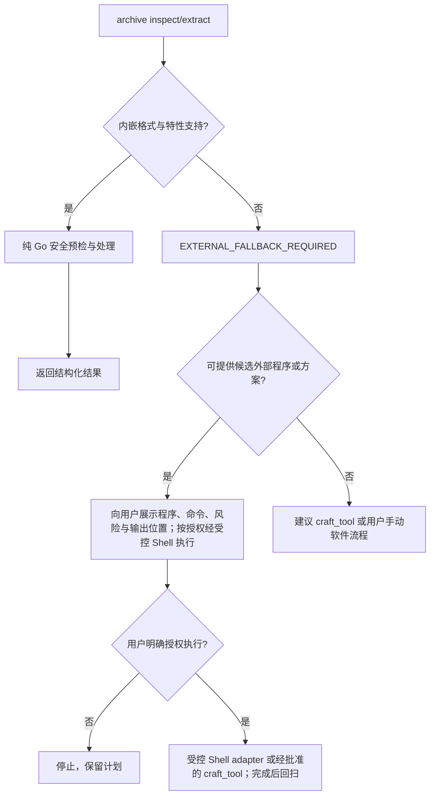

# 压缩包工具设计：内嵌优先与受控外部兜底

| 项目 | 内容 |
| --- | --- |
| 状态 | 已实现（P0/P0.1/P1 与受控外部兜底第一版） |
| 日期 | 2026-08-13 |
| 范围 | Desktop GUI Agent 工具与 TUI 技能/插件归档流程；共享纯 Go 压缩包能力 |

## 1. 目标

为 Agent 增加一个统一的 `archive` 工具，用于安全地查看压缩包、解压常见格式，以及将本地文件或目录压缩为 ZIP。

核心策略固定为：

1. 先使用内嵌、纯 Go 实现的能力；高频格式不依赖系统安装的解压软件或 Shell。
2. 内嵌能力不支持该格式、变体或特性时，返回可机器识别的“需要外部能力”结果。
3. Agent 仅在此时再探测用户机器上的外部程序，并可通过受控 Shell 命令调用已安装程序；仍不可用时，再建议或调用 `craft_tool` 生成一次性处理脚本。
4. 不静默下载、安装或升级外部解压软件；用户明确授权后，可以通过受控安装流程安装并继续执行。输入密码、覆盖已有内容与安装软件都必须获得用户明确授权。

这样既保证 ZIP/TAR 等高频任务离线、跨平台且可控，又能处理罕见格式，而不会把 `bash` 或 `craft_tool` 变成默认路径。

## 2. 已有实现审查与结论

仓库已有多处彼此独立的压缩包代码，不能直接复制扩展：

| 位置 | 现有能力 | 设计结论 |
| --- | --- | --- |
| `corelib/pyenv/detect.go` | 曾有 ZIP、TAR.GZ 私有解压逻辑 | 已迁移为调用 `archiveutil.ExtractToDirectoryWithPolicy`；仅为可信 Python 运行时包保留受限的相对软链接例外。 |
| `MaClawSrv/http_knowledge.go` | 曾有 ZIP/RAR 私有解压、流式大小限制与 RAR 字典上限 | 已迁移为调用 `archiveutil.ExtractToDirectory`，知识导入仅保留上下文取消和导入文件枚举。 |
| `gui/app_user_data_migration.go` | 对 ZIP 软链接、重复路径、文件/目录冲突与声明大小做严格校验 | 这是通用解压必须继承的安全基线，而不是只检查 `../`。 |
| `gui/im_tools_local.go` | owner-aware 文件路径解析和工作目录隔离 | `archive` 必须使用相同的 `resolveFileToolPathForOwner`，不能自行解析相对路径。 |
| `gui/tool_registry_builtin.go` | GUI 内置工具注册、schema 与 handler 绑定 | `archive` 在此注册，避免出现定义和执行分离。 |

`go.mod` 已包含 `rardecode/v2`；`klauspost/compress` 目前为间接依赖，不能据此承诺 XZ 或 7Z 能力。任何新增格式都必须先验证对应库可在 `CGO_ENABLED=0` 下构建、测试通过且许可证可接受。

### 本轮审查发现与设计修正

| 发现 | 风险 | 修正后的约束 |
| --- | --- | --- |
| TAR、GZ、BZ2、RAR 均可为顺序流，无法像 ZIP 一样在写入前一次性获得完整 entry 表。 | 将 `inspect` 误称为“完整预检”，或为了预检而做无意义的双遍读取。 | `inspect` 是只读的“能力与元数据探测”，不作为安全放行凭据；`extract` 在写入私有 staging 时逐 entry 强制校验，发生问题只清理 staging。 |
| `skip`/`overwrite` 与“目录原子发布”不能同时无条件成立。目录存在时的合并不是原子 rename。 | 文档若承诺三种策略都原子，会造成不可实现的语义。 | P0 只支持 `conflict_policy=fail`。`skip` 和 `overwrite` 延后，需单独设计合并事务、回滚和审批，不能用简单逐文件覆盖实现。 |
| 外部程序即使输出后回扫，仍可能在运行中耗尽磁盘；普通主机没有可靠的跨平台磁盘配额。 | 不能把外部解压描述为能继承内嵌解压的所有资源安全保证。 | 外部流程只能在 staging、可用空间检查和审批下提供“受控但非等价”的兜底；当风险不能接受时应让用户手动处理。 |
| `resolveFileToolPathForOwner` 解决相对路径与绑定边界，但新建输出路径仍可能经已存在的父目录软链接逃逸。 | 即使请求路径文本位于工作区，实际落盘仍可能越界。 | 新建 staging、输出 ZIP 及发布前都要对最近已存在祖先做 `EvalSymlinks`，再校验 real path 仍在 owner 授权根内。 |
| 多个 `source_paths` 的基名可能相同。 | `create_zip` 的包内路径会无声碰撞或覆盖。 | P0 使用 `root_mode=preserve`，且要求每个来源相对工作区的路径唯一；任何同名或父子冲突都失败，不做静默重命名。 |
| 高压缩比既可能是炸弹，也可能是合法的全零或重复数据。 | 以压缩比作为单独硬拒绝会误伤合法归档。 | 总/单文件的实际展开字节数是硬上限；压缩比仅作为 warning 和审计信号，默认不单独拒绝。 |

## 3. 非目标

- 不制作通用压缩软件 UI，不提供压缩格式转换器。
- v1 不创建 RAR、7Z、TAR 或带密码的压缩包；唯一压缩输出为 ZIP。
- v1 不支持加密包、分卷包、自解压可执行文件、固实包随机访问和保留特殊文件（软链、硬链、设备节点）。
- 不自动解压用户未指定的附件；读取、解压和写入仍遵守已有工作区与审批策略。
- 不因“格式不支持”调用未受控的通用 `bash` 命令、静默下载程序或静默安装软件。
- P0 不支持对既有目标目录合并解压；目标存在即失败。这个限制优先保证完整性与可恢复性。

## 4. 用户与 Agent 的行为

### 4.1 统一调用模型

```json
{
  "action": "inspect | extract | create_zip",
  "archive_path": "./input.zip",
  "destination": "./input",
  "source_paths": ["./reports", "./README.md"],
  "output_path": "./deliverables.zip",
  "conflict_policy": "fail",
  "root_mode": "preserve"
}
```

字段约束：

| action | 必填 | 可选 | 说明 |
| --- | --- | --- | --- |
| `inspect` | `archive_path` | 无 | 识别格式、列出受限摘要、预检风险；不落盘。 |
| `extract` | `archive_path` | `destination`、`conflict_policy` | `destination` 始终是目录；默认按完整压缩后缀去除后生成，例如 `a.tar.gz` → `./a/`。P0 只接受 `fail`，绝不隐式覆盖。 |
| `create_zip` | `source_paths`、`output_path` | `conflict_policy`、`root_mode` | `output_path` 必须以 `.zip` 结尾。P0 只接受 `fail`；`root_mode=preserve` 保留来源相对于工作区的路径。 |

`archive_path`、`destination`、`source_paths` 与 `output_path` 均使用现有 owner-aware 路径解析；相对路径以当前任务/项目工作目录为准。输出目标必须处于该 owner 允许的文件边界内，且以已解析的真实祖先目录再次校验，防止父目录软链接逃逸。

`inspect` 不写任何文件。`extract` 的 `destination` 是根目录，即使源是单文件 `.gz` 或 `.bz2`，解压后的文件也写入该目录；这样输入的类型不会改变参数语义。`create_zip` 先写到 `output_path` 同级的临时文件，校验并关闭 central directory 后才原子替换为最终文件。

### 4.2 返回协议

工具返回 JSON 文本，所有失败都含稳定的 `code`，方便 Agent 决策：

```json
{
  "ok": false,
  "action": "extract",
  "format": "7z",
  "code": "EXTERNAL_FALLBACK_REQUIRED",
  "message": "当前内嵌工具不支持 7z 格式。",
  "fallback": {
    "recommended_programs": ["7z", "7zz", "7za"],
    "craft_tool_allowed": true,
    "user_action_required": false
  }
}
```

成功结果至少返回 `format`、输入和输出的规范化绝对路径、文件/目录数量、写入字节数、跳过项和 warnings。`inspect` 的文件清单默认最多 100 项；超过部分返回统计与 `truncated=true`，而不是产生巨大的工具结果。

建议错误码：

| code | 含义 | Agent 下一步 |
| --- | --- | --- |
| `FORMAT_UNRECOGNIZED` | 无法依据魔数和扩展名识别格式 | 询问文件来源或建议外部工具检查。 |
| `FORMAT_UNSUPPORTED` | 已识别但没有已验证的内嵌或外部处理器 | 说明限制，不假装成功。 |
| `EXTERNAL_FALLBACK_REQUIRED` | 格式或变体不在内嵌能力范围，但存在外部处理计划 | 走第 7 节受控兜底。 |
| `EXTERNAL_TOOL_NOT_FOUND` | 已有外部计划，但本机没有找到候选程序 | 询问是否授权安装，或建议用户手动处理。 |
| `EXTERNAL_TOOL_UNUSABLE` | 找到程序但版本/自检/能力不满足要求 | 不执行该程序；说明诊断和替代方案。 |
| `EXTERNAL_EXECUTION_FAILED` | 经授权的外部程序非零退出、超时或被取消 | 保留诊断摘要，清理 staging，不发布结果。 |
| `ENCRYPTED_ARCHIVE` | 包需要密码或加密头无法读取 | 询问用户是否愿意使用外部软件；禁止把密码放入普通工具参数或日志。 |
| `MULTIVOLUME_UNSUPPORTED` | 需要其他分卷 | 请求完整分卷，必要时外部软件处理。 |
| `LIMIT_EXCEEDED` | 文件数、单文件或总展开大小超限 | 停止，不进入外部兜底来绕过安全限制。 |
| `UNSAFE_ENTRY` | 路径穿越、软链接、重复/冲突 entry 等 | 停止并报告不安全包。 |
| `DESTINATION_EXISTS` | 默认安全策略拒绝写入既有目录/文件 | 由用户明确选择 `skip` 或 `overwrite`。 |
| `CORRUPT_ARCHIVE` | CRC、截断或解码校验失败 | 停止；外部工具只可用于独立诊断，不能绕过校验后宣称成功。 |

P0 中 `DESTINATION_EXISTS` 的唯一修复方式是用户更换一个不存在的输出路径；`skip`/`overwrite` 暂不接受。待 P1 合并事务实现后，错误码的下一步才可扩展为显式冲突策略选择。

## 5. 格式能力矩阵

“内嵌支持”代表应用二进制中的纯 Go 能力；它不是“可借助本机 7-Zip 后支持”。

| 格式 | `inspect`/`extract` | `create_zip` | v1 决策 | 说明 |
| --- | --- | --- | --- | --- |
| ZIP / ZIP64 | 内嵌 | 是 | P0 | Go `archive/zip`；拒绝加密和软链接。 |
| TAR | 内嵌 | 否 | P0 | Go `archive/tar`；仅普通文件与目录。 |
| GZ / `.gz` | 内嵌 | 否 | P0 | 单文件解压；输出名按规范推导。 |
| TAR.GZ / TGZ | 内嵌 | 否 | P0 | `tar` + `gzip` 流式处理。 |
| BZ2 / `.bz2` | 内嵌 | 否 | P1 | Go `compress/bzip2` 只解压；可作为小增量纳入。 |
| TAR.BZ2 / TBZ2 | 内嵌 | 否 | P1 | `tar` + `bzip2`。 |
| RAR（单卷、非加密） | 内嵌 | 否 | P1 | 使用现有 `rardecode/v2`，固定字典内存上限。 |
| XZ / TAR.XZ | 外部兜底 | 否 | Deferred | 选择并验收纯 Go 库后才可升级为内嵌；不可仅凭间接依赖宣称支持。 |
| 7Z | 外部兜底 | 否 | Deferred | 纯 Go 覆盖率与维护质量需单独评估；v1 默认走外部兜底。 |
| ZST / TAR.ZST | 外部兜底 | 否 | Deferred | 同上；评估后可加入内嵌解码器。 |
| JAR、APK、DOCX/XLSX/PPTX 等 ZIP 容器 | 按 ZIP 内嵌处理 | ZIP 仅针对指定路径 | P0 | 用户明确要求查看或展开时按 ZIP 安全规则处理；涉及文档内容理解时，Agent 应优先使用 `office` 等领域工具。 |
| ISO、CAB | 外部兜底 | 否 | Deferred | 不承诺为通用压缩格式；只有存在明确的外部 adapter 后才可处理。 |

格式判断必须“魔数优先、扩展名辅助”。扩展名和内容不一致时，以魔数识别为准，并写入 warning；不能因为文件名是 `.zip` 就绕过实际格式校验。

识别后的处理规则也必须明确：

- 若魔数能明确识别为一种受支持格式，扩展名只用于推导默认输出名和提示 warning，不能切换解码器。
- 若格式本身没有可靠魔数（例如单一 `.tar`、部分文本化或截断流），仅在扩展名匹配且解码器头校验成功时处理；失败返回 `CORRUPT_ARCHIVE` 或 `FORMAT_UNRECOGNIZED`，不猜测。
- `.tar.gz`、`.tar.bz2` 等复合格式先识别外层流，再由 tar reader 验证内层；外层成功而内层不是 TAR 时，按单文件 GZ/BZ2 处理并返回 warning，不能把其强行视为 TAR。

## 6. 安全与一致性要求

### 6.1 解压前预检

所有内嵌解压器共享预检与逐 entry 策略。ZIP 可在写入前完整枚举；TAR、GZ、BZ2、RAR 等顺序流只在写入私有 staging 时逐 entry 施行同样的硬校验。`inspect` 绝不作为后续 `extract` 的授权票据：源文件可能在两次调用之间被替换。

- 对 entry 名称以 `/` 规范化后做 canonical relative path 校验；拒绝空路径、绝对路径、盘符/UNC 路径、`..` 越界与 NUL 字符。
- 拒绝软链接、硬链接、设备、FIFO 和其它非“目录/普通文件” entry；Windows 与 Unix 一致 fail closed。
- 拒绝重复 entry、文件与目录同路径、文件作为父路径等冲突，避免覆盖顺序导致结果不确定。
- 限制归档文件数、单文件展开字节数、总展开字节数、目录深度与 entry 名长度；高压缩比记录为 warning，但不作为默认唯一拒绝条件。
- 对具备元数据的格式，在复制前校验声明大小；复制时再通过 `io.LimitReader` 施加真实写入上限。不能只相信压缩包头。
- 不跟随已存在目标路径中的符号链接；写入前确保每个父目录仍位于 staging 根目录。
- 读取源文件也要进行实路径校验：打开后记录文件身份（平台可用时记录设备/索引、大小和修改时间），在 `inspect` 或解压结束前复核；发现源在读取中变更则返回 `SOURCE_CHANGED` 并清理 staging。

默认资源限制建议：

| 限制项 | 默认值 | 原因 |
| --- | ---: | --- |
| 输入包大小 | 2 GiB | 本地工具可处理大文件，但仍避免误操作。 |
| 文件数 | 10,000 | 防止大量小文件耗尽 inode/时间。 |
| 单文件展开大小 | 1 GiB | 防止单 entry 耗尽磁盘。 |
| 总展开大小 | 4 GiB | 防止解压炸弹。 |
| 最大目录深度 | 64 | 防止异常路径树。 |
| 高压缩比告警 | 200:1 | 用于提示潜在炸弹；硬安全边界仍是实际写入的单文件与总展开上限。 |

资源限制必须区别输入和展开量：输入大小在打开前以 `os.Stat` 检查；已知声明大小用于尽早失败；最终以实际从解码流复制出的字节数裁决。对未知尺寸 entry，`io.LimitReader` 必须设置为“剩余额度 + 1”，多出的一个字节用于可靠地判定越限，而不能在恰好额度处把截断误报为成功。

限制应以 `ArchiveLimits` 配置对象实现，并允许宿主按运行环境收紧；任何 `LIMIT_EXCEEDED` 都是安全终止，不允许外部兜底绕开。

### 6.2 原子落盘与冲突处理

`extract` 先在 destination 同级的私有 staging 目录解压并完整校验，成功后才发布：

1. **P0**：`conflict_policy=fail` 是唯一取值。目标存在即返回 `DESTINATION_EXISTS`，不创建 staging。
2. staging 创建在目标父目录下，以保证同一卷的目录 rename；其名称必须随机且私有，创建前和发布前均做 real-path 边界校验。
3. 成功时仅执行一次目标目录 rename；P0 不做“解压到已存在目录”的逐项合并。
4. 任意失败或取消都删除 staging；不得留下半解压目录。

`skip` 和 `overwrite` 是后续版本能力：前者需要可审计的非原子合并语义；后者除审批外还需要可恢复备份、磁盘预留、发布锁和可靠回滚。它们不能在 P0 中以参数存在但“最佳努力”实现。

不得简单地“创建目录后逐项解压”。这种做法会让损坏包、超限包或取消操作留下部分结果，也无法提供明确的完成语义。

### 6.3 权限与元数据

- 普通文件以安全默认权限创建（文件 `0600`、目录 `0700`），在非 Windows 上可选择性恢复去掉特权位后的常规权限。
- 不恢复 setuid、setgid、sticky bit、ACL、扩展属性或 Windows ADS。
- 时间戳恢复作为 P1 可选项，失败仅 warning，不影响内容校验。
- `create_zip` 仅收集普通文件和目录；遇到软链接、特殊文件、不可读路径时默认失败，避免静默漏包。

## 7. 内嵌失败后的外部兜底流程

外部兜底是受控 Agent 编排规则，不是可由模型自由拼接的 `exec.Command` 或 Shell 后门。`archive` 负责识别能力和给出计划；获得一次性 action 级授权后，核心固定 adapter 以参数数组调用已安装程序。`craft_tool` 仅作为明确获批后的最后手段。



外部程序选择顺序应由平台适配层维护：

| 格式 | Windows | macOS/Linux | 备注 |
| --- | --- | --- | --- |
| 7Z | `7z`、`7zz`、`7za` | `7zz`、`7z`、`7za` | 只做可执行文件探测，不安装。 |
| XZ | `xz` | `xz` | 若目标系统自带且安全策略允许。 |
| ZST | `zstd` | `zstd` | 同上。 |
| RAR 变体/分卷 | `7z`、`unrar` | `7z`、`unrar` | 内嵌 RAR 首选；仅不支持变体时兜底。 |

外部能力不能只靠 `PATH` 中同名文件判定。每个 adapter 必须执行无副作用的版本/帮助自检，记录真实可执行路径、版本、支持的格式和命令模板版本；自检失败返回 `EXTERNAL_TOOL_UNUSABLE`。程序探测结果仅是短时缓存，每次真正执行前都重新校验可执行文件身份。

### 7.1 外部执行的授权边界

外部工具的“调用”和“安装”是两个不同的授权级别，不能因为用户同意解压就推定同意安装软件。

| 操作 | 是否可自动进行 | 所需授权 | 审计内容 |
| --- | --- | --- | --- |
| 探测候选程序、执行 `--version`/帮助自检 | 是 | 不需要 | 路径、版本、自检结果。 |
| 调用已安装程序，写入新 staging 目录 | 是，但仅在当前宿主的本地命令策略允许时 | 用户已明确请求处理该压缩包；若审批系统判定为高风险则遵从其审批 | 程序、版本、模板 ID、输入 hash/路径、staging、退出码。 |
| 通过包管理器安装软件 | 否 | 用户单独明确确认软件、来源、包管理器、权限影响 | 安装来源、包名、版本、权限和用户确认。 |
| 输入加密包密码 | 否 | 用户参与的安全输入/外部交互 | 只记录“已请求/已取消/失败”，绝不记录密码。 |
| 合并或覆盖已有目标 | 否 | 后续 `overwrite` 专项审批 | 冲突清单、备份位置、回滚结果。 |

所谓“受控 Shell”指在本地命令策略允许的前提下，用 `bash` 的宿主执行能力运行由 adapter 生成的固定命令模板；它不是新建的绕过审批机制。若当前会话的安全策略、工作流阶段或 bot 目录边界拒绝本地命令，Agent 必须返回计划或请求授权，不得替换为其它隐藏执行路径。

外部执行的约束：

- `archive` 的嵌入式路径不使用 Shell。对 `extract_external`，实现使用固定 adapter 的参数数组启动已安装程序，不拼接 Shell 字符串；GUI 为该 action 单独生成一次性审批令牌，普通 `archive` 或 `allow_external=true` 参数都不能绕过该审批。软件安装仍不在工具实现范围内。
- 外部命令必须来自按格式固定的受控模板。优先通过无 shell 的参数数组启动；若当前运行时只能使用 `bash`，adapter 必须采用目标 shell 的单参数安全引用函数并拒绝含 NUL 的路径。禁止将用户路径、密码或文件名拼入未转义的 shell 字符串。
- 外部输出只能写到专用 staging，完成后递归回扫路径边界、软链接、文件数和总字节数。回扫失败绝不发布到最终目标。
- 外部程序在运行中无法跨平台强制执行与纯 Go 相同的字节配额；因此必须先检查可用磁盘空间、采用专用 staging，并向用户报告这一差异。外部运行超时、进程树终止、输出静默阈值和可用空间预留必须由 adapter 设定；缺少所需空间或隔离条件时，只能给出手动方案。
- 密码不得进入普通工具参数、Shell 参数或日志；需要交互式密码输入时，默认引导用户在外部软件中手动操作。
- 缺少外部程序时，先报告可安装的软件、官方来源、所需权限和预计影响；用户明确确认后，才可经 Shell/包管理器安装。安装完成后必须重新探测版本和能力。
- `craft_tool` 是最后手段且必须获得用户授权。其产物必须显式声明依赖的程序、输出目录、清理策略和回扫步骤；不能仅生成裸 `7z x` 或 `tar -xf` 命令。

## 8. 架构与落地步骤

### 8.1 分层

```text
gui archive tool handler
  └─ owner-aware path resolution + registry schema + approval/progress
       └─ corelib/archiveutil
            ├─ format detection and capability report
            ├─ common preflight / safe staging / publish
            ├─ ZIP, TAR, GZIP, BZIP2 codecs
            ├─ optional RAR adapter
            └─ ZIP writer
```

建议新增：

| 路径 | 职责 |
| --- | --- |
| `corelib/archiveutil/types.go` | `Action`、`Format`、`Limits`、请求/结果/错误码、`ExtractToDirectory` 与受限内部 extraction policy。 |
| `corelib/archiveutil/detect.go` | 魔数识别及扩展名辅助判断。 |
| `corelib/archiveutil/safe.go` | canonical entry、冲突检测、资源限额、源文件身份、real-path 边界检查、staging 与安全写入工具。 |
| `corelib/archiveutil/archive.go` | ZIP、TAR、GZIP、BZIP2、RAR 的纯 Go 流式 adapter，以及 ZIP 创建；禁止出现 GUI 或 shell 依赖。 |
| `corelib/archiveutil/external.go` | 已安装外部程序的固定参数适配、自检、超时、诊断限额与 staging 回扫。 |
| `gui/im_tools_local.go` | 解析 tool args、应用 owner 工作目录、调用 corelib、返回 JSON。 |
| `gui/agent_view_tool.go` | 为 `extract_external` 提供与工具级授权分离的一次性审批令牌；令牌仅绑定当次待审批调用。 |
| `gui/tool_registry_builtin.go` | 注册 `archive` 的 schema、描述和 `file/archive/compress/extract` tags。 |
| `gui/im_tool_archive_test.go` | GUI 路径隔离、schema、错误码与进度集成测试。 |

不要把新的通用解压逻辑继续放入 `corelib/pyenv`、`MaClawSrv` 或 GUI handler。已将 Python 运行时和知识导入两条完整解压路径迁移到 `archiveutil`；其它 ZIP 使用点可能是业务协议读取或 ZIP 写出，并非通用“解压到目录”路径，应在不改变业务语义的前提下逐项评估后迁移。

### 8.1.1 已迁移调用点与边界

统一的目标是复用**格式识别、路径校验、资源限额、临时目录和落盘安全性**，而不是把所有 `archive/zip` 使用都替换掉。当前已迁移的“解压到目录”调用点包括：

| 调用点 | 复用 API | 保留的业务语义 |
| --- | --- | --- |
| Python 运行时下载 | `ExtractToDirectoryWithPolicy` | 可信运行时包可使用受限相对软链接 |
| 知识库归档导入 | `ExtractToDirectory` | 取消控制、导入文件枚举 |
| 数字资产归档导入 | `ExtractToDirectoryWithPolicy` | 扩展名拒绝列表与元数据文件过滤 |
| Skill 市场、TUI 插件市场、TUI 技能导入/恢复、数据迁移 | `ExtractToDirectory` / `ExtractToDirectoryWithPolicy` | 各自更紧的配额和包结构规则；TUI 恢复保留原有合并语义，但仅复制已验证 staging 内容 |
| Agent 服务收到的内存 ZIP | `ExtractZIPBytesToDirectory` | 字节流输入；沿用相同的 ZIP entry 校验和写入限额 |
| GUI 技能安装 | `ExtractToDirectory` | 先解压到私有 staging，再按既有逻辑替换顶层技能目录 |

`ExtractZIPBytesToDirectory` 仅为已经完整驻留内存的 ZIP 上传/回滚流程服务；它不回落到临时源文件，也不具备文件源的 TOCTOU 复核，调用方仍必须限制请求体大小。

下列情形**不属于**通用解压迁移范围，应继续使用各自的 ZIP reader：Office/OOXML 结构解析、嵌套包或清单的只读校验、按白名单读取模型资源、ZIP 创建和业务协议的内存读写。它们不将不可信归档树解压到目录，强行迁移反而会改变业务语义或引入额外落盘。

### 8.2 GUI 工具描述

注册名固定为 `archive`，避免 `unzip`、`zip`、`extract` 多工具产生路由歧义。描述必须明确：

- 先用它而不是 `bash` 来解压 ZIP/TAR/GZ/BZ2 和创建 ZIP。
- 对不支持的格式，它先返回受控外部兜底计划；用户授权后可通过 Shell 调用已安装软件，或安装批准的软件后继续处理。
- 不将密码作为参数传入；加密包需要用户参与的外部流程。
- 解压会写文件，P0 中目标已存在即失败；覆盖/合并属于后续显式审批能力。

TUI 的 `CoreToolRegistry` 当前与 GUI `ToolRegistry` 是两套注册路径。第一期只接 GUI 时不得在 TUI 伪注册一个无 handler 的工具；第二期应通过 `CoreToolDeps.ExtraHandlers` 注入 TUI 宿主 handler，确保工具定义出现时确实可执行。

## 9. 测试与验收

必须在 Windows、macOS、Linux 的 `CGO_ENABLED=0` 构建与测试中验证内嵌格式。测试集不得依赖用户机器安装 7-Zip、WinRAR 或 `tar`。

| 类别 | 最低验收 |
| --- | --- |
| 正常路径 | ZIP、ZIP64、TAR、GZ、TAR.GZ 的 inspect/extract；目录与多个来源的 create_zip；创建后用标准 `archive/zip` 回读。 |
| 可选内嵌格式 | BZ2/TAR.BZ2、RAR 的固定 fixture；RAR 覆盖单卷、非加密、字典上限和 RAR5 fixture。 |
| 路径安全 | `../`、绝对路径、Windows 盘符/UNC、反斜杠绕过、NUL、重复路径、文件/目录冲突、文件父路径、软链接与特殊 entry，以及输出路径经已存在父目录软链接逃逸。 |
| 资源安全 | 声明尺寸伪造、压缩炸弹、未知尺寸流、超文件数、超单文件/总量/深度；验证“剩余额度 + 1”的越限判定和 staging 清理。 |
| TOCTOU | `inspect` 后替换源文件、解压中修改源文件、输出父目录软链接替换；验证 `SOURCE_CHANGED`、real-path 复核和无越界发布。 |
| 一致性 | 相对路径按 owner 工作目录解析；绑定用户无法越界；最近已存在祖先 real-path 校验有效；默认冲突失败；ZIP 创建时多个来源不发生包内路径碰撞。 |
| 异常处理 | CRC 失败、截断、取消、磁盘写失败、目的地发布失败；不产生半成品或越界输出。 |
| 外部兜底 | 不支持 7Z/XZ/ZST 时先返回 `EXTERNAL_FALLBACK_REQUIRED` 与计划；模拟程序的自检失败、超时、非零退出和异常输出。获得授权后由 Shell adapter 调用假程序，验证安全参数传递、显式授权、staging 与回扫。未授权时验证绝不启动子进程或安装软件。 |

验收完成条件：P0 的内嵌格式无需外部依赖即可工作；安全限制在任何格式处理路径上不可绕过；不支持的格式能给 Agent 一条明确、可审计且不静默安装软件的下一步。外部调用与安装必须分别满足其对应授权边界。

## 10. 分期计划

1. **P0：基础安全与 ZIP 交付**：`archiveutil`、魔数识别、统一预检/staging、ZIP inspect/extract/create_zip、GUI 注册和完整安全测试。
2. **P0.1：标准库流式格式**：TAR、GZ、TAR.GZ；保持同一限额、原子发布和返回协议。
3. **P1：扩展纯 Go 解压**：BZ2/TAR.BZ2 与现有 RAR 解码适配；已加入 TAR.BZ2 固定 fixture、单卷非加密 RAR5 固定 fixture、128 MiB RAR 字典上限，以及 ZIP64、CRC/截断、目录条目限额和 TOCTOU 基础检测测试后暴露 capability。
4. **P1.1：受控外部兜底**：已实现程序探测与版本/帮助自检、固定参数模板、十分钟超时与进程树终止、诊断输出限额、磁盘预留、staging 回扫及 action 级一次性审批；不复用无约束 `bash` 作为隐藏执行通道。`craft_tool` 仍须用户单独批准，且当前以结构化 fallback 指引暴露。
5. **P2：格式扩展评审**：逐项评估 XZ、7Z、ZST 的纯 Go 库，只有通过 CGO、许可证、维护状态、恶意包和跨平台验收后，才从“外部兜底”升级为“内嵌支持”。
