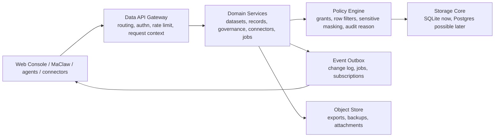

# MaClawDataSrv Supabase-Inspired Architecture Plan

Date: 2026-06-18

## Goal

MaClawDataSrv should keep its current Go + SQLite deployment advantage, but
borrow Supabase's strongest architecture ideas:

- one clear data core
- one gateway-shaped API boundary
- policy-first authorization
- integrated but independently testable subsystems
- portable exports and self-host friendly operations

This is not a plan to clone Supabase. Supabase is a Postgres development
platform. MaClawDataSrv is an embedded enterprise structured data service for
MaClaw/MIS workflows. The useful move is to absorb the product primitives, not
the whole stack.

## Supabase Reference Points

Official Supabase docs describe these building blocks:

- PostgREST turns Postgres directly into a REST API:
  https://supabase.com/docs/guides/getting-started/architecture
- Realtime streams database changes over WebSocket:
  https://supabase.com/docs/guides/getting-started/architecture
- Storage is S3-compatible and stores metadata in Postgres:
  https://supabase.com/docs/guides/getting-started/architecture
- Kong is the API gateway:
  https://supabase.com/docs/guides/getting-started/architecture
- Auth issues and refreshes JWTs, stores auth data in the Postgres `auth`
  schema, and integrates with other products:
  https://supabase.com/docs/guides/auth/architecture
- Supabase recommends explicit grants plus Row Level Security for exposed Data
  APIs:
  https://supabase.com/docs/guides/api/securing-your-api
- RLS policies act like implicit row filters and provide defense in depth:
  https://supabase.com/docs/guides/database/postgres/row-level-security
- Self-hosted auth supports an incremental move from legacy shared JWT secrets
  to publishable/secret keys and JWKS-based token verification:
  https://supabase.com/docs/guides/self-hosting/self-hosted-auth-keys

Useful principles from the architecture doc:

- Every subsystem should work in isolation.
- Every subsystem should expose APIs and integrate with adjacent systems.
- Prefer extensible primitives over narrow product silos.
- Make migration in/out easy through common standards.

## Current DataSrv Shape

Current code already has strong foundations:

- `corelib/structureddata` owns shared DTO contracts.
- `datasrv/structureddata` owns `Store`, `Service`, `HTTPServer`, SQLite,
  OpenAPI, governance workflows, and Web Console.
- `datasrv/cmd/maclaw-data-srv` owns process lifecycle and config.
- Architecture tests enforce narrow exports, OpenAPI route parity, auth on
  `/api/v1/data/...`, response headers, and package boundaries.
- SQLite schema includes datasets, fields, records, indexes, FTS, events,
  dead letters, revisions, approvals, jobs, operation plans, audit logs, API
  keys, administrators, sessions, tenants, Hub registration, and backups.

Main friction:

- `HTTPServer.routes()` is now a large single routing table. It hides product
  domains and makes ownership hard to see.
- `Service` combines many domain workflows behind one large type and one global
  mutex. This is simple, but it makes future scaling and hot-path profiling
  harder.
- Authorization exists, but it is handler/service code, not a first-class
  policy engine equivalent to Supabase grants + RLS.
- Events are persisted and dead-lettered, but there is no formal outbox,
  subscription, or integration contract for realtime consumers.
- Storage-like artifacts exist as backups and export downloads, but large binary
  objects are not a separate product primitive.
- Auth/session/API keys are local and practical, but token verification is not
  yet designed as a cross-service standard like JWKS.

## Proposed Architecture

Keep three deployable layers:

### 1. Gateway Boundary

Create an internal gateway package inside `datasrv/structureddata`, or split
files by concern while preserving public constructors:

- `http_routes_admin.go`
- `http_routes_access.go`
- `http_routes_data.go`
- `http_routes_connectors.go`
- `http_routes_governance.go`
- `http_routes_jobs.go`
- `http_routes_objects.go`
- `http_middleware.go`

Target behavior:

- one place builds request principal
- one place applies rate limit/body limit/security headers
- every handler gets `{context, principal, requestID}`
- OpenAPI parity tests stay
- `/api/v1/data/...` remains authenticated by default

Supabase lesson: Kong is not important here; gateway responsibility is.

### 2. Policy Engine

Add first-class policy concepts that mirror Supabase's grants + RLS without
requiring Postgres:

- `Grant`: which principal role/key can touch a domain, dataset, action, view,
  report, dashboard, connector, or object bucket.
- `RowPolicy`: predicate over tenant, dataset, record metadata, ownership,
  tags, field values, and principal claims.
- `FieldPolicy`: masking or deny rules for sensitive fields.
- `PolicyDecision`: allowed, denied, masked, reasons, audit metadata.

Suggested package:

- `datasrv/structureddata/policy.go`
- `datasrv/structureddata/policy_store.go`
- `datasrv/structureddata/sqlite_policies.go`

Keep current API key allowlists, but compile them into policy decisions. This
turns scattered `principalCan...` logic into an explicit engine.

Supabase lesson: data authorization should live close to the data path, not only
at the HTTP edge.

### 3. Domain Service Split

Keep public `Service`, but internally compose smaller services:

- `DatasetService`
- `RecordService`
- `AccessService`
- `GovernanceService`
- `ConnectorService`
- `JobService`
- `ObjectService`
- `AdminService`

`Service` remains the facade for compatibility. New code calls the inner
services. This avoids breaking current tests and callers.

Target:

- shared transaction helpers
- smaller locks, ideally per write category
- clearer test fixtures
- easier future extraction if one domain needs a worker process

Supabase lesson: each product can work in isolation, but integration multiplies
value.

### 4. Event Outbox and Realtime Lite

Promote current `data_events` and dead letters into a formal outbox:

- every mutation appends `event_id`, `tenant_id`, `resource_type`,
  `resource_id`, `operation`, `payload_json`, `created_at`, `published_at`
- jobs and connector syncs use idempotency keys
- HTTP endpoint: `GET /api/v1/data/events/stream?cursor=...`
- optional SSE first; WebSocket later only if needed
- retention policy and replay cursor

Supabase lesson: Realtime is a separate service, but the durable source is the
database change stream. DataSrv can start with an outbox plus SSE.

### 5. Object Store Primitive

Add a small object abstraction before storage needs sprawl:

- buckets: `backups`, `exports`, `imports`, `attachments`, `evidence`
- metadata in SQLite
- blob backend: local filesystem now, S3-compatible later
- policy checks at bucket/object level
- consistent download headers and SHA-256 integrity

Current backups/export jobs become users of `ObjectStore`, not one-off file
paths.

Supabase lesson: storage metadata belongs in the data core; bytes can live in a
portable backend.

### 6. Auth and Key Evolution

Keep current admin sessions and API key policies. Add forward-compatible token
verification:

- managed API keys remain opaque secrets with stored hashes
- session tokens remain local initially
- add optional JWT verifier config:
  - issuer
  - audience
  - JWKS URL or inline JWKS
  - claim mapping for tenant/user/role/admin scope
- add key rotation metadata:
  - `created_at`
  - `expires_at`
  - `last_used_at`
  - `revoked_at`
  - `rotation_group`

Supabase lesson: keys should rotate without database shape churn; services
should verify tokens through public key material when possible.

### 7. Portability and Storage Engine Path

SQLite remains default. Add compatibility seams so Postgres can become an
optional engine later:

- keep DTOs in `corelib/structureddata`
- keep `Store` interface narrow by domain
- make migrations explicit files or migration registry objects
- avoid SQLite-only SQL in service layer
- keep CSV, JSONL, backup, and evidence exports as stable portability formats

Do not migrate to Postgres just because Supabase uses it. Move only when a real
need appears:

- concurrent writes exceed SQLite limits
- row policy evaluation becomes too complex in Go
- external analytics need SQL-native access
- hosted multi-tenant service needs connection pooling and HA

## Priority Roadmap

### Phase 1: Make Boundaries Visible

- Split `http.go` route registration into domain files.
- Extract `RequestContext` and auth middleware helpers.
- Add architecture tests that each route group registers through a named
  function.
- No API behavior change.

### Phase 2: Policy Engine MVP

- Introduce `PolicyEngine.Check(principal, action, resource)`.
- Compile current API key policy rules into `PolicyDecision`.
- Route record query/read/write and field masking through the engine.
- Add tests for deny reasons and sensitive masking.

### Phase 3: Outbox and Stream

- Add mutation outbox table.
- Append outbox rows from dataset, record, schema, connector, job, and backup
  mutations.
- Add cursor polling endpoint.
- Add SSE endpoint after cursor tests are stable.

### Phase 4: Object Store

- Add object metadata table and local filesystem backend.
- Move backup and export downloads through object store.
- Keep old response paths stable.
- Add hash verification and retention policy tests.

### Phase 5: Optional External Auth

- Add JWKS verifier behind config.
- Map JWT claims into `Principal`.
- Keep local admin login as recovery path.
- Add rotation and mixed-token compatibility tests.

## Non-Goals

- Do not replace SQLite immediately.
- Do not generate direct REST endpoints for every SQLite table.
- Do not expose internal tables as API resources.
- Do not add Kong, PostgREST, or GoTrue unless DataSrv becomes a hosted
  multi-service platform.
- Do not weaken the existing package boundary tests.

## Best Immediate Code Changes

Most valuable small refactor:

1. Split routing and middleware files.
2. Add `RequestContext`.
3. Add `PolicyDecision` and route only access checks through it first.
4. Add outbox table but leave stream API disabled until events are complete.

This keeps risk low while making the architecture ready for Supabase-like
composition.

