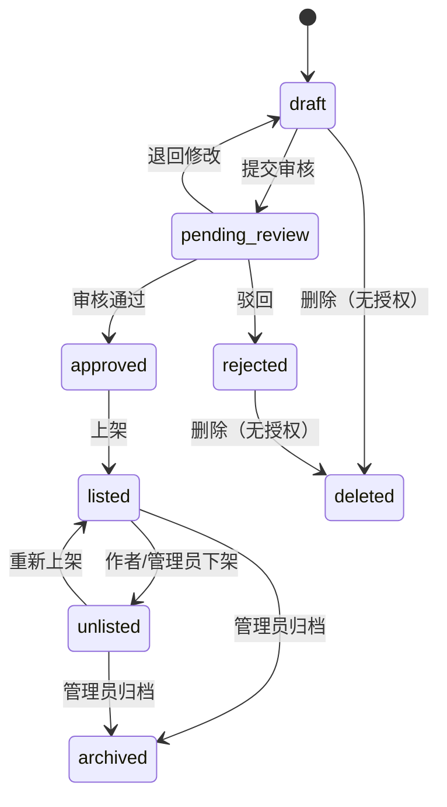
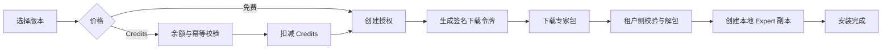

# AI 专家市场设计：MaClaw GUI 与 HubCenter 管理端

## 1. 目标与边界

AI 专家市场分为两个明确分工的界面：

- **MaClaw GUI（用户侧）**：在“实用工具”中以对话框打开“AI 专家市场”，负责发现、购买、下载、安装与分享专家。它是与宠物市场同类的用户资产市场。
- **HubCenter（平台管理侧）**：只提供市场运营后台，负责审核、上架、下架、删除、价格治理、订单和审计；不展示“我的专家”、个人余额或用户购买入口。

交互形态沿用现有“宠物市场 / 能力市场”的资产分发路径，但资产类型从宠物扩展为可运行的专家包。

本期交付采用“购买某个专家版本的永久使用授权”模型：免费专家可直接领取，付费专家通过 Credits 完成授权。下载后会在用户/租户侧创建一份本地专家副本，不会让市场端的作者改动直接影响已安装的专家。

不包含：按调用量结算、订阅、专家运行托管、作者分成结算。数据模型预留这些扩展点，但不在 v1 打开入口。

## 2. 术语

| 术语 | 定义 |
| --- | --- |
| 专家（Expert） | 由系统提示词、工具/技能依赖、知识要求、建议模型和运行策略组成的可执行配置。 |
| 专家包（Package） | 可发布、可下载、可校验的专家版本快照；安装时转换为本地 Expert。 |
| 市场条目（Listing） | 面向买家的公开展示页，指向一个专家包的当前可售版本。 |
| 授权（Entitlement） | 某租户或个人对一个专家包版本的获取与使用权。 |
| Credits 账本 | 现有 Capability Market Credits 的余额、冻结、扣减、退款流水。 |

## 3. 角色与权限

| 角色 | 浏览/下载 | 创建与发布 | 编辑/撤回 | 审核/上下架/删除 | Credits 与订单 |
| --- | --- | --- | --- | --- |
| 普通用户（MaClaw GUI） | 可 | 不可 | 不可 | 不可 | 购买自己的授权；查看自己的订单 |
| 专家作者（MaClaw GUI） | 可 | 可 | 自己的草稿、已发布专家可发新版本或下架申请 | 不可 | 查看自己条目的销售汇总（v1 可只显示下载量） |
| 租户管理员 | 可 | 可（租户资产） | 本租户专家 | 不可 | 为本租户购买、分配、撤销本地安装 |
| HubCenter 审核员 | 不提供用户市场 | 不建议 | 不可直接改作者内容 | 审核、上架、下架、删除 | 查看风控关联订单 |
| HubCenter 超级管理员 | 不提供用户市场 | 可 | 全量 | 全量；可强制下架及删除 | 可发起补偿/退款 |

删除为受限破坏性操作：仅 `draft/rejected/archived` 且没有有效授权的条目允许物理删除；已售、已上架或已安装的条目只能归档/下架，保留审计与已购下载能力。

## 4. 生命周期与状态

### 4.1 专家包状态



`approved` 只是内容合规；`listed` 才能被公开搜索与购买。下架后的既有授权仍可重新下载安装当前已授权版本，但新用户不能购买。每次编辑已发布内容均创建新版本，旧版本不可就地覆盖。

### 4.2 购买与安装状态



扣费、授权创建与订单记录必须在同一事务中完成；支付接口使用调用方传入的 `idempotency_key`。安装失败不自动退款，因为授权与安装是两个独立动作；用户可重试下载。只有平台故障或管理员裁决才走 Credits 退款。

## 5. 专家包内容与安全约束

专家包是签名 ZIP（建议 `.expert.zip`），包含 `manifest.json`、专家定义快照、可选说明/图标和依赖清单。包内不得携带可执行二进制；工具、Skill、MCP 仅可声明已审核的市场 capability ID 与所需密钥名。

`manifest.json` 最小字段：

```json
{
  "schema_version": "1",
  "expert_id": "exp_financial_analyst",
  "version": "1.2.0",
  "display_name": "财务分析专家",
  "summary": "基于经营数据输出可复核的分析结论",
  "category": "finance",
  "tags": ["预算", "经营分析"],
  "system_prompt": "…",
  "capability_dependencies": ["skill.spreadsheet", "mcp.document"],
  "knowledge_requirements": [],
  "model_policy": { "recommended": "…", "minimum_capability": "reasoning" },
  "content_hash": "sha256:…",
  "publisher": { "id": "publisher_…", "name": "…" }
}
```

发布前服务端必须执行：字段长度与敏感词校验、依赖 capability 存在且可分发校验、包 hash/签名校验、系统提示词与描述内容审核、恶意 URL 与未声明 secret 检查。安装前再次校验签名、hash、schema 与依赖可用性。

## 6. 核心数据模型

| 实体 | 关键字段 | 说明 |
| --- | --- | --- |
| `expert_packages` | `id, publisher_id, current_version_id, status, visibility, category, deleted_at` | 市场条目的稳定身份。 |
| `expert_package_versions` | `id, package_id, version, manifest, artifact_url, sha256, review_status, review_note, published_at` | 不可变版本快照。 |
| `expert_listings` | `package_id, title, summary, icon, price_credits, featured_rank, listing_status` | 可售展示与运营配置。 |
| `expert_entitlements` | `subject_type, subject_id, package_version_id, order_id, status, granted_at` | 用户或租户的使用权。唯一键为 subject + version。 |
| `expert_orders` | `id, buyer_tenant_id, buyer_user_id, package_version_id, credits_amount, status, idempotency_key` | 购买订单，与 Credits 流水双向关联。 |
| `expert_installations` | `id, entitlement_id, target_hub_id, local_expert_id, installed_version, status, installed_at` | 下载/安装结果及重试诊断。 |
| `expert_moderation_events` | `actor_id, action, target_id, reason, before, after, created_at` | 审核、上下架、删除、退款的不可变审计。 |

价格以 `price_credits` 的非负整数存储；`0` 代表免费。Listing 变更应保留版本化历史，订单永远绑定实际购买的 `package_version_id` 和实际扣费金额。

## 7. API 设计

新接口归属 HubCenter，命名沿用当前 `/api/capability-market` 体系，建议子资源为 `/api/expert-market`。

| 方法 | 路径 | 权限 | 作用 |
| --- | --- | --- | --- |
| `GET` | `/api/expert-market/experts` | 登录 | 搜索、分类、排序、分页；默认只返回 `listed`。 |
| `GET` | `/api/expert-market/experts/{id}` | 登录 | 详情、版本、价格、当前用户授权状态。 |
| `POST` | `/api/expert-market/experts` | 作者/租户管理员 | 创建草稿，上传包或从本地 Expert 生成快照。 |
| `PATCH` | `/api/expert-market/experts/{id}` | 作者/管理员 | 仅编辑草稿或创建新版本草稿。 |
| `POST` | `/api/expert-market/experts/{id}/submit-review` | 作者 | 提交审核。 |
| `POST` | `/api/expert-market/experts/{id}/purchase` | 购买者 | `{version_id, idempotency_key}`；扣 Credits 并返回授权。 |
| `POST` | `/api/expert-market/entitlements/{id}/download-token` | 授权拥有者 | 短期一次性下载令牌。 |
| `POST` | `/api/expert-market/installations` | 租户管理员/本地 Hub | 上报安装结果，便于审计与诊断。 |
| `GET` | `/api/expert-market/me/purchases` | 登录 | 我的已购/已安装专家。 |
| `GET` | `/api/admin/expert-market/experts` | 审核员 | 按状态、作者、风险标识筛选。 |
| `POST` | `/api/admin/expert-market/experts/{id}/approve` | 审核员 | 审核通过。 |
| `POST` | `/api/admin/expert-market/experts/{id}/reject` | 审核员 | 驳回，必须带原因。 |
| `POST` | `/api/admin/expert-market/experts/{id}/list` | 审核员 | 上架。 |
| `POST` | `/api/admin/expert-market/experts/{id}/unlist` | 审核员 | 下架，必须带原因。 |
| `DELETE` | `/api/admin/expert-market/experts/{id}` | 超级管理员 | 归档或满足条件时删除；必须带原因。 |

所有写操作写入 `expert_moderation_events`（含作者动作），并返回稳定的业务错误码，例如 `EXPERT_NOT_LISTED`、`INSUFFICIENT_CREDITS`、`EXPERT_VERSION_UNAVAILABLE`、`ENTITLEMENT_EXISTS`、`EXPERT_PACKAGE_INVALID`。

## 8. 页面与交互设计

### 8.1 MaClaw GUI：实用工具中的对话框

在 MaClaw GUI 的“实用工具”中新增“AI 专家市场”。点击后弹出独立市场对话框（不跳转 HubCenter），布局和资产获取习惯与宠物市场一致。对话框承载：

1. **市场首页**：搜索、分类、排序（推荐/最新/下载量/价格），专家卡展示作者、版本、用途、价格、下载量与“已拥有”状态。
2. **专家详情**：说明、适用任务、能力依赖、权限与数据边界、版本记录、价格，主操作为“免费获取 / 使用 N Credits 获取 / 已拥有，安装到 Hub”。
3. **确认获取抽屉**：明确扣除 Credits、安装目标与依赖；确认成功后直接进入下载/安装进度。
4. **我的专家**：已购、已安装、可更新、安装失败四个状态；支持下载、重新安装、查看版本和移除本地副本。
5. **分享专家**：从本地已有 Expert 创建不可变版本包，填写展示信息、价格、依赖声明，提交 HubCenter 审核并查看审核意见。

核心文案原则：`获取` 描述授权行为，`安装` 描述将授权包落到某个 Hub 的行为，避免让用户误以为 Credits 购买的是一次任务调用。

### 8.2 HubCenter：AI 专家市场管理后台

在 HubCenter 管理后台新增“AI 专家市场”，仅呈现平台管理信息：列表按“待审核、已上架、已下架、已归档”切换；表格列包含专家、作者、版本、Credits、状态、发布时间、下载量、最后操作人。批量操作仅支持同一目标状态的下架；删除固定为单条二次确认，并解释已购用户仍可恢复下载或将被管理员补偿。该页面不是用户市场，也不提供“获取”“安装”“我的专家”等用户操作。

每个条目的侧栏显示包清单、依赖、审核记录、价格变更、订单与投诉摘要；审核、上架、下架、删除均需写明理由，理由会成为审计记录，不会直接公开给买家（下架时可配置一条买家可见的替代文案）。

## 9. 与现有能力的衔接

- 复用 HubCenter 已有 Capability Market 的客户账号、租户识别与 Credits 账本，不新增第二套余额。
- 复用现有市场的“外部搜索/详情/安装”链路；本地 Hub 下载后调用现有 `hub/internal/expert` 的 `Upsert` 创建本地 Expert 副本。
- 专家依赖的 Skill / MCP 继续走现有 capability 安装与审批流；专家安装器只编排依赖检查与本地 Expert 创建。
- HubCenter 与本地 Hub 之间使用短期下载令牌而非直接暴露对象存储 URL；令牌绑定 entitlement、版本、租户和过期时间。

## 10. 验收标准

1. 用户能检索公开专家，看到明确的 Credits 价格、依赖和授权状态。
2. 购买接口在重复请求下只扣一次 Credits，并生成一条可审计订单与授权。
3. 已购用户可以反复下载同一授权版本；未授权用户不能借由下载 URL 获取包。
4. 下架阻止新购买，但不破坏既有授权下载；新版本须重新审核。
5. 管理员可完成审核、上架、下架、归档/删除，并能查看完整理由与操作链。
6. 本地安装失败能显示到具体失败阶段（下载、校验、依赖、创建本地 Expert），且重试不重复扣费。
7. 所有市场端和本地安装端操作保留租户、操作者、版本、时间和关联订单/授权 ID。

## 11. 推荐实施顺序

1. HubCenter 数据库迁移、专家包校验、管理只读列表/详情。
2. Credits 购买、授权、下载令牌与审计；完成幂等、余额不足、下架等集成测试。
3. 本地 Hub 安装器：验签、依赖检查、调用 Expert Upsert、安装状态回报。
4. MaClaw GUI 对话框：市场、详情、我的专家、分享专家。
5. 管理侧审核与上下架/归档；补充风控、举报与退款后台流程。
