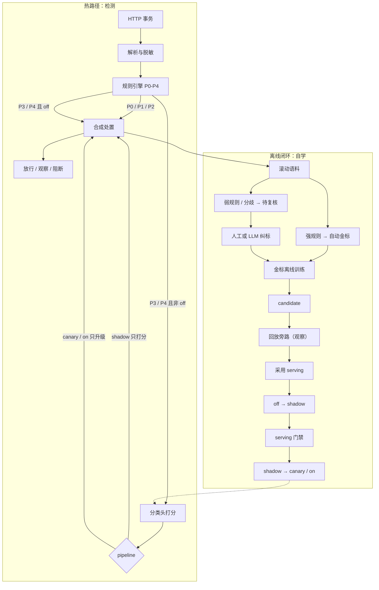
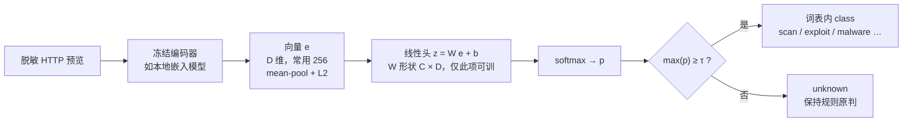

# 规则引擎 + 分类头：HTTP 恶意流量泛化检测

| 字段 | 值 |
| --- | --- |
| 状态 | 方法说明 + **v1.4 设计修订**（易用性 / 安全 / 功能；不改冻结门禁数字） |
| 不是什么 | **不是** Hub / HubCenter 动态组那份 LLM 路由分类头（`docs/design/virtual-dynamic-service-group-zh.md` §9）。词表、处置、语料都不同；禁止混训、混制品、混管理页。 |
| 读者 | 安全运营、检测研发、其它 AI 工具 |
| 硬约束 | 不要发明新的冻结阈值；不要把一致率当转正门禁；不要在请求内 SGD |

把「规则产样本 -> 冻结嵌入 + 小分类头 -> 旁路交叉验证 -> 人工/LLM 纠标 -> 转正」用到 **HTTP 恶意流量检测**。现网已有基于规则的检测引擎；AI 只负责规则写不全的泛化，不替代规则，不在热路径再打一次大模型。

实现先按这张表，细节在后文。门禁数字仍以 §7.2 为准。

| 锁定 | 值 |
| --- | --- |
| 热路径 | 规则先跑；仅 P3/P4 且非 `off` 才 embed；失败只走规则 |
| 改写 | 只升级处置；`off`/`shadow` 不改写；禁止覆盖 P0/P1/P2 |
| 词表动作 | 一类一动作：`benign` 放行 / `scan` 观察 / `abuse` 限速 / `auth_abuse` 挑战 / 其余高危阻断 |
| 门禁 | `tau=0.55`；覆盖 ≥200 且可训类齐全；P3/P4 人工准确率 ≥0.85；`exploit`/`malware`/`exfil` 召回各 ≥0.80；两窗 7+7 日；一致率不当门禁 |
| 上线 | 默认 `off`；禁 `off`→canary/on；无 serving 不能 shadow；canary 5%（先 site/租户） |
| 预览 | 同一模板、**合计最多 800 字**；先脱敏再归一再截断；请求侧空位与训练一致 |
| 样本 id | `sha1(tenant_id + LF + encoder_id + LF + 归一后预览)`，完整 hex |
| 权限 | 分析师补标；管理员采用/转正/回滚/强制转正（强制必填原因） |
| 投递 | 检测→trainer 要鉴权；租户从身份出，不从包体信 |

## 0. 场景与目标

已有系统对 HTTP 流量（URL、方法、Host、部分头、截断 Body）跑签名 / 正则 / IOC / WAF 规则。规则准、可解释，但：

- 对变种路径、编码变换、少见头组合、新工具默认值**泛化差**；
- 每补一条规则都要人写、人回归，跟不上变形。

目标：在规则引擎旁边加一个**可训练的分类头**，只对规则「没把握」的 HTTP 事务做泛化判定；用规则成交样本自学，先旁路后转正。

```text
HTTP 事务（请求，必要时含响应状态）
  -> 规则引擎（始终先跑）
  -> 可选：分类头对截断 HTTP 预览打分（仅弱规则 / 未命中）
  -> 处置：规则原动作与头映射动作取更严者（只升级；off/shadow 仍只用规则）
  -> 事务落盘后入滚动语料
```

| 要 | 不要 |
| --- | --- |
| 规则挂了或模型未训时，引擎仍能检 | 模型没过旁路就改阻断 |
| 用强规则批量产金标 | 全量人标，或每条流量调 LLM 检测 |
| 规则 x 模型交叉找可疑样本 | 用「与规则一致率」当转正门禁 |
| 可疑样本人工或 LLM 仲裁后再训 | 头覆盖强签名命中；在线改编码器 |
| 先 shadow 再 canary / 全量 | 未采用的新权重直接进阻断 |
| 语料按租户隔离；预览脱敏 | 跨租户并样本、把 Cookie/Authorization 写入语料 |
| 改写过猛时降 shadow | 靠改 `tau` / 门禁数字「止损」 |
| 头只升级处置或保持 | 头把规则阻断改成放行 |

「自学习」是这条离线闭环，不是包内梯度，也不是用大模型当在线检测器。

---

## 1. 方法一览

规则做两件事：**线上先判定**，以及**顺便产训练样本**。强规则命中写成自动金标；未命中、弱启发式、或规则与模型不一致的 HTTP 事务进入待复核。冻结编码器把 HTTP 预览打成向量，小头做多类 softmax。新头只写入 candidate，shadow 时规则仍处置、头只打分。交叉表捞出可疑样本，人工或 LLM 纠标后重训。门禁绿了再让头参与生产 pipeline。

```text
HTTP 事务
  -> 规则分类（签名 / IOC / 上下文）
  -> 弱规则或未命中时，头可打分
  -> 按 pipeline 决定是否改写处置
  -> 落盘成功后入滚动语料

滚动语料
  -> 强规则命中     => 自动金标（可训，一般不进准确率门禁）
  -> 弱规则 / 未命中 / 分歧 => 待复核
       -> 人工标注  或  LLM 仲裁（抽检或升为人工后再进门禁）
       -> 纠正后金标
  -> 只吃金标离线训练 => candidate
  -> 回放旁路（可看 candidate）
  -> 采用 serving（pipeline 仍 off）
  -> 升 shadow（在线旁路），再 canary / on
  -> 新流量继续入池
```

### 系统架构

热路径始终先走规则。分类头只接弱规则 / 未命中，且必须先旁路再转正。离线侧用规则与复核金标训头，不在请求内更新权重。



---

## 2. 两套检测器

| | 规则引擎（教师 / 守卫） | 分类头（学生 / 泛化） |
| --- | --- | --- |
| 输入 | 规则 ID、IOC、方法+路径模式、已知坏 UA 族、威胁情报 | 截断 HTTP 预览的冻结嵌入 |
| 特点 | 确定、可解释、零 embedding | 覆盖规则没写到的变体 |
| 线上 | 永远先跑 | 只在规则落到「没把握」时允许改写 |
| 样本 | 高置信命中 -> 自动金标 | `HeadClass` / `max_p` 供交叉验证 |
| 转正 | 不靠「跟规则一致」 | 靠复核金标的前向准确率 / 召回 |

规则不是唯一真理。宽启发式会误报（例如把带 `select=` 的业务查询当成注入）。因此：

- 自动金标只来自**强规则**（明确签名、确认 IOC、高置信规则集）；
- 弱启发式、默认放行、头的自预测，**不当自动金标**；
- 门禁**分行**：覆盖可含人工确认的强规则（凑稀有类）；**准确率 / 高危召回只看 P3/P4 人工行**（头真正会改写的那些）。见 §7.2。
- 头改写只改 **class**，处置由冻结的 class→动作表执行。头不得发明「挑战 / 限速」之外的新动作。
- **头不得把规则已阻断改成放行**（即使 P3）。只能维持或升级处置；P4 默认放行才允许头升级为观察/限速/阻断。

---

## 3. HTTP 词表与预览

### 3.1 处置类（示例冻结词表）

词表要短、稳定，和规则引擎的动作对齐。`unknown` 是拒识默认档，**不占头的一行**（低置信显式拒绝）。

| class | 含义 | 典型处置 |
| --- | --- | --- |
| `benign` | 正常业务 HTTP | 放行 |
| `scan` | 扫描 / 侦察（目录爆破、漏洞探针工具特征的变体） | 观察 |
| `exploit` | 针对应用的利用尝试（注入、遍历、反序列化等变体） | 阻断 |
| `auth_abuse` | 撞库 / 暴力认证 / 异常登录风暴 | 挑战 |
| `malware` | 木马回连、载荷拉取等恶意软件 HTTP | 阻断 |
| `exfil` | 数据外带 | 阻断 |
| `fraud` | 钓鱼页、盗刷相关 HTTP | 阻断 |
| `abuse` | 刷接口、垃圾、资源耗尽 | 限速 |
| `unknown` | 拒识，**不是** `W` 的一行 | **只保持规则原判** |

**一词表一类只对应一个动作**，禁止「观察或限速」这种运行时二选一。现网若必须把 `scan` 改成限速，改冻结映射表并记版本，不当场分支。上线后不要频繁加减类；加类等于换头、旧 `W` 作废。class→动作表与词表同一版本冻结；运营页展示中文，写入英文枚举。

规则 ID → class 的教师映射由**规则运营**维护，分类头页只读版本号。换映射会改自动金标，必须重训，不得热改完继续用旧 `W`。

处置优先级（升级只能往右，不能往左）：`放行 < 观察 < 限速 < 挑战 < 阻断`。头改写后的动作 = `max(规则原动作, 头 class 映射动作)`。`unknown` 不参与比较，保持规则原判。

### 3.2 HTTP 预览（只存检测所需）

一条样本的文本预览用固定模板，**合计最多 800 个 Unicode 字**（含换行与空位）。禁止回读完整报文、禁止存 Cookie / Authorization / 会话头原文、禁止存支付与证件、禁止把查询里的 token 原样入库。400~800 这种区间作废：训、服、回放必须同一上限。

```text
METHOD <method>
HOST <host>
PATH <path 已剥敏感段>
QUERY <query 截断且键值脱敏>
UA <user-agent 截断>
CT <content-type>
STATUS <响应状态，若有>
REF <referer 主机+路径，去参数>
BODY <body 截断，已脱敏>
```

脱敏最低要求（实现必须有单测，细节按现网密钥扫描策略，不另发明阈值）：

- 头：丢掉 `Cookie` / `Authorization` / `Proxy-Authorization` / `X-Api-Key` 及同类；
- Query / Body：Bearer、JWT 形、卡号、身份证号打码；超长十六进制/Base64 当载荷截断，不当明文；
- 预览里只留「检测需要的形状」，不留可复用的凭证。

生成顺序锁死：解析 → 脱敏 → **归一** → 截断到 800 字 → 才 embed / 算 id。归一（只为稳定 id 与训服一致，不另发明检测阈值）：

- `METHOD` 大写；
- `HOST` 小写、去默认端口、去末尾点；
- `PATH` 只做 **一次** percent-decode（二次编码保持原样，防解码炸弹），去掉 `..` 段；
- `QUERY` 先打码再按键名排序；同键多值保持相对序；
- 空字段写成空行占位，不得省略行，以免模板漂移。

「剥敏感段」= 走现网密钥扫描，不在头里再写一套路径正则。

热路径预览与语料预览必须同一模板。线上要在**请求侧**阻断时，`STATUS` 与尚未到达的 Body 用空行占位；训练不得改用「带响应的更长预览」。

只把已经为打分算过的向量写入语料；缺则训练时按**同一预览 + 同一编码器版本**补 embed。同一事务禁止「打分 embed 一次、记样本再 embed 一次」。向量必须带 `encoder_id`（文件哈希或发布号）；编码器对不上则作缺向量，不得混用。

---

## 4. 规则分层（对应现有检测引擎）

现有规则引擎按置信度分层，不要把所有规则命中都当金标。

```text
P0  强命中     明确签名 / 已确认 IOC / 高置信规则 ID
P1  强上下文   情报源 + 固定路径族、已登记恶意 Host 等
P2  会话弱规则  同一源高频失败登录、短时 404 风暴等（统计，易漂移）
P3  启发式     只看单条 HTTP 预览的宽松模式
P4  未命中     默认放行 / unknown
```

`class_source`：`signature` / `intel` / `session` / `heuristic` / `fallback`。头改写成功后为 `head`。

**头只接在 P3/P4。** P0/P1/P2 永远规则赢，即使 pipeline=`on` 也不为它们跑 embedding。P2 不当自动金标。

---

## 5. 样本怎么获得

### 5.1 只记「已完成检测的事务」

- 记：规则引擎已给出判定、事务已落盘（或镜像已成功解析）的 HTTP 请求。
- 不记：解析失败、健康检查白名单、明文密钥扫描器自己的探测（若策略排除）、空预览。
- 投递失败只丢这条样本，不挡旁路流量、不回滚阻断动作。

### 5.2 用规则分层打标

| 来源 | 样本角色 |
| --- | --- |
| P0/P1 强规则 | `gold_source=auto`，可进拟合 |
| P2 会话统计 | 只作归因，不当自动金标 |
| P3/P4 | 默认无金标，补标主队列 |
| 头预测 | 交叉验证信号，不当金标 |

### 5.3 什么算可疑

1. 规则没把握：`heuristic` / `fallback`；
2. 规则与头分歧：`HeadClass != rule_class` 且 `max_p >= tau`（转正后会改 class；处置仍遵守「只升级不降级」）；
3. 某攻击类金标不足，覆盖门禁不绿；
4. 交叉表热格：某业务路径被头稳定打成高危类。

「预览不像普通业务」只做运营筛选项，**不是**自动入队算法，避免再发明一套启发式。

默认补标队列：弱规则 / 未命中且尚未人工标，按类补齐。可按站点、租户、规则 ID 筛。

### 5.4 人工或 LLM 最后标注

| 标注者 | 用途 | 进拟合 | 进准确率门禁 |
| --- | --- | --- | --- |
| 强规则自动 | 冷启动 | 是 | 否 |
| 人工 | 独立页补标 / 改标 / 撤标 | 是 | 是（须晚于该版 `trained_at`，且不在本次 `sample_ids`） |
| LLM 仲裁 | 消化分歧与积压 | 可标 `gold_source=llm` 进拟合 | **默认否**；抽检通过或升 `human` 后再进 |

LLM 只看脱敏预览 + 规则 class + 头预测 + 词表，只输出词表内 class 或弃权。与规则、头三者不一致或弃权，必须进人工。已有人工金标不得被 LLM 或后续弱规则覆盖。撤标后该行立刻离开门禁。禁止在训练快照上改标。

LLM **不是**在线检测器，只是离线标注助手。

---

## 6. 样本管理

| 项 | 做法 |
| --- | --- |
| 主键 | **按租户隔离**。对**脱敏且归一后的预览**算 `id = sha1(tenant_id + LF + encoder_id + LF + 预览)` 完整 hex。`sha1` 只作内容寻址，不作完整性 MAC。跨租户相同预览不得并成一条。租户内重复只更新 `last_seen` / 头预测 |
| 更新 | 人工金标最高；自动金标不被后来的弱规则抹掉；向量只补缺 |
| 上限 | 只裁语料。先丢无金标，再丢最旧自动金标，人工最后丢 |
| 库 | 语料（预览 / 向量 / 金标）与制品（权重、pipeline、节点确认、训练记录）拆开。预览不随权重复制到检测节点 |
| 多节点 | 检测节点把样本投到**该租户**指定 trainer 的同一份库；换 trainer 不换库、不换租户。禁止多租户共用一个未分片语料库。投递须节点身份（现网 mTLS 或节点令牌）；**tenant_id 以身份为准**，包体租户字段只作核对，不一致则丢这条。超速只丢样本，不挡检测 |
| 快照 | 每次训练成功写 `TrainRun`（`version` / `trained_at` / `sample_ids` / 当时 `gold_class`+`gold_source`）。制品不含预览；独立页经 trainer 按 id 回填。禁止在快照上改标 |

流量统计（按 class 的请求数）不是语料。

---

## 7. 识别结果怎么验证

### 7.1 规则 x 头交叉（旁路，不作转正门禁）

只看头会碰的 P3/P4。

| 行 | 何时有数 | 算法 |
| --- | --- | --- |
| 在线旁路 | `shadow`/`canary`/`on` 且选中 serving | `last_seen >= trained_at` 且已有 `HeadClass` 的真实事务 |
| 回放旁路 | 有 serving 或 candidate | 该版 `W` 对池内 P3/P4 **重打分**，排除本次 `sample_ids` |

看：条数、与规则一致率、会改写占比、低置信占比、规则 class x 头预测交叉表。回放不回写语料。一致率高可能是「规则误报、头跟着错」，**不能当转正门禁**。

### 7.2 前向金标门禁（能不能转正）

用该版权重对语料重打分。缺向量当场补；编码器不可用则整份未就绪。数字沿用冻结表，不要改成「建议值」。

| 门禁项 | 计哪些行 | 冻结阈值 |
| --- | --- | --- |
| 复核覆盖 | 人工行（可含人工确认的强规则，凑稀有类）。排除本次 `sample_ids`。LLM 标默认不计 | >= 200 且 **可训各类**（不含 `unknown`）都有 |
| 准确率 | 仅 P3/P4 人工行；`labeled_at` 晚于该版 `trained_at`；排除本次 `sample_ids`。LLM 标默认不计 | >= 0.85 |
| 高危类召回 | `exploit` / `malware` / `exfil`（同一套 P3/P4 人工行） | 各 >= 0.80 |
| 两窗口 | 近 7 日 + 再往前 7 日；两窗行都须晚于 `trained_at` | 两窗准确率与高危召回都达标 |
| 制品 | serving Ready 且分发齐 | 必须 |

两份报告分开算，页上两行都展示：

- **serving 门禁**：升 `canary` / `on` 用。
- **candidate 门禁**：已在 `canary` / `on` 时再采用新头用。`off` / `shadow` 下采用不过此门。

人工强制转正只绕过检查，不把空报告涂绿。恶意流量场景更怕漏检：召回不绿时不要为了放行去降阈值。读不到语料或编码器不可用 → 整份未就绪，0 行不得写成已通过。

### 7.3 生产观察

`canary`：按 `hash(site_id 或租户) % 100 < 5` 取 P3/P4。无站点/租户才退回源地址，并在页上提示 NAT 会放大桶。空身份不当命中。出问题降级或回滚 previous，不过门禁。管理面只展示自己租户的桶，不提供全网探测接口。

---

## 8. 训练

1. 只吃金标且 class 在词表内。无金标则失败。
2. 类未齐仍可训，覆盖项不绿。
3. 开训冻结 `sample_ids`；新流量仍入池，不进这一次。
4. **只写 candidate**，不改 serving。失败则 candidate 与训练记录都不动。
5. trainer 上同时只一条拟合（多租户也串行；队列按租户隔离语料，禁止并行开训互抢编码器）。
6. 异步，不挡检测热路径。
7. 训练中不可采用、不可改 pipeline 升级。降级 / `off` 仍随时可做。

拟合：冻结向量上的线性多类 softmax（`W` 为 C x D，D 常用 256）。SGD、固定 epoch。不要为了涨分去微调编码器或另训大分类模型。换编码器文件必须重训头。

---

## 9. 上线

训练不等于上线。

| 名词 | 含义 |
| --- | --- |
| candidate | 刚训完，热路径不读 |
| serving | shadow / canary / on 用的权重 |
| previous | 上一份 serving |
| 采用 | `previous <-` 旧 serving；`serving <- candidate` 并下发 |
| 转正 | 只改 pipeline，不换权重 |

```text
规则检测 (off)
  -> 攒强规则金标 + 补标
  -> 训练 candidate
  -> 回放交叉，捞可疑再标，必要时重训
  -> 采用 serving
  -> off -> shadow（规则仍阻断/放行，头只打分）
  -> 在线旁路 + 门禁
  -> shadow -> canary 或 on
```

禁止 `off` 直跳 canary/on。无 serving 不能进 shadow。分发未齐不能再采用、不能升 canary/on。降级随时。回滚对调 serving/previous。

默认 pipeline=`off`。冻结 `tau=0.55`，canary 5%。低置信回 `unknown`，保持规则原判。

热路径：P0/P1/P2 或 `off` 不 embed。检测节点尚未确认新权重时沿用上一份；两份都没有则按 `off` 只走规则。

---

## 10. 技术原理

### 分类模型原理

编码器冻结，只当特征提取器。可训练的只有头上的 `W`、`b`。`unknown` 不是词表里的一类，而是 `max(p) < τ` 时的拒识。



```text
e = Encoder(HTTP 预览)     冻结，不在请求内更新
z = W e + b               仅 W、b 离线拟合
p = softmax(z)
if max(p) < tau: class = unknown
```

编码器只当特征提取器。热路径预算是一次本地嵌入加一次小矩阵点积。编码器在后台预热，未就绪时热路径不阻塞、不改规则处置。

---

## 11. 与现有规则引擎怎么接

```text
采集 / 镜像
  -> HTTP 解析与脱敏
  -> 规则引擎（P0-P4）
  -> 若 pipeline!=off 且 source in {heuristic, fallback}：头打分
  -> 按 pipeline 合成：off/shadow 用规则；canary/on 可改写 P3/P4 的 class，处置只升级不降级
  -> 写处置动作与审计（rule_class、head_class、max_p、pipeline、serving 哈希）
  -> 落盘成功：upsert 滚动语料
```

管理面独立页：编码器状态、训练 / 采用、旁路交叉表、转正门禁、滚动池补标、只读训练快照。规则运营页只看命中与流量，不在那里训头。

---

## 12. 给实现者的硬约束

1. 闭环是「规则产样本 -> 金标拟合 -> 旁路交叉验证 -> 人工/LLM 纠标 -> 采用 -> 转正」。
2. 头不得覆盖强规则；`off` 与 P0/P1/P2 不 embed。
3. 一致率不作转正门禁。LLM 标默认不进准确率窗。
4. 预览必须脱敏。语料与制品拆开。
5. 不要每条 HTTP 调大模型做检测。不要在线更新 `W` 或编码器。
6. 不要为涨分改门禁数字或金丝雀比例，除非安全委员会改冻结表。
7. 语料、标注、采用、转正、强制转正都要租户隔离 + 审计。权重要验签后再 serving。
8. 头改写阻断必须有可一键拉回的安全阀；安全阀不是转正门禁，不得用来「涂绿」准确率。
9. 头不得把规则已阻断改成放行。本头与动态组 LLM 路由头禁止混用。
10. serving / candidate 两行门禁分开算；采用与转正不是同一动作。
11. 一词表一类一个动作。训/服预览模板必须相同。补标与转正分权。
12. 预览先脱敏再归一再截到 800 字。检测→trainer 投递鉴权，租户从身份出。

---

## 13. 易用性（给运营，不是再造一套算法）

分类头页是**唯一**训头 / 采用 / 转正的地方。规则运营页只看命中与流量，并维护规则 ID→class 映射。无此页不准 `pipeline=on`。

权限拆开：分析师（或同等）可补标 / 撤标 / 用「这是业务」；**采用、转正、回滚、强制转正**仅检测管理员。强制转正必须填原因（建议 10–2000 字）并进审计。

### 13.1 一页看懂能不能转正

页顶固定状态条，只说人话：

| 块 | 内容 |
| --- | --- |
| 现在 | `off` / `shadow` / `canary` / `on`，以及 serving 是否 Ready、分发是否齐 |
| 为什么还不能升 | 缺 serving、分发未齐、覆盖不足、准确率/召回不绿、编码器未就绪——逐条列，点进去是对应表 |
| 旁路观察 | 交叉表、会改写占比、低置信占比。**标明「观察项，不是门禁」** |
| 门禁 | serving / candidate **两行**各显示 §7.2；人工强制转正必须二次确认，报告仍显示未绿，不得涂绿 |

禁止把「与规则一致率」放在门禁卡片里。一致率只在「旁路观察」。

### 13.2 补标队列要可做完

默认队列：P3/P4 且未人工标。排序只服务补齐，不发明新阈值：

1. 覆盖缺口的类（词表里还没人工行的类置顶）；
2. 规则与头分歧且 `max_p >= tau`；
3. 交叉表热格（业务路径被头稳定打成高危类）；
4. 其余按 `last_seen` 新到旧。

单条卡片：脱敏预览、规则 class / 层级、头预测 / 各类 `p`（至少 top-3）/ `max_p`、**若转正会变成的动作**（按冻结 class→动作表 + 只升级不降级）。操作只有「标成词表类 / 弃权 / 撤标」。批量只允许同一筛选结果内、同一目标类；单次最多 50 条（页面写死，不进 §7.2）。避免误把整站标成 `exploit`。

生产误报：处置审计里给检测员「这是业务」入口，只写人工 `benign` + 刷新 `labeled_at`，**不**当场改 serving、不自动 `off`。要止损用一键降 `shadow` / `off`。

中英对照展示 class（`exploit` = 利用尝试），写入仍用冻结英文枚举。

### 13.3 LLM 仲裁怎么给人用

LLM 只消化积压，默认不进准确率窗。运营看到的是「LLM 建议 + 弃权原因」，一键升人工或打回。三者不一致或弃权，队列角标必须是人工，不能静默入库。已有人工金标的行，LLM 按钮禁用。

### 13.4 空态与失败

| 情况 | 页面怎么说 |
| --- | --- |
| 无金标 / 编码器未就绪 | 不能开训；写明缺的是自动金标还是编码器 |
| 训练失败 | candidate 与训练记录不动；热路径无感 |
| 分发未齐 | 不能采用、不能升 canary/on；列出未确认节点 |
| 投递语料失败 | 只丢该样本；横幅计数，不挡检测 |
| Hub 未登录类比 | 本场景：未配置 trainer / 语料库不可写时，禁用训练与补标提交 |

强制转正：独立危险按钮，写清「只绕过检查，报告仍是红的」。权限见 §14。

---

## 14. 安全性

恶意流量场景里，语料本身就是攻击样本和可能的客户数据。按「能检出、不能被拿去复现凭证、不能被灌库」锁。

| 项 | 锁定 |
| --- | --- |
| 租户 | 语料、快照、`sample_ids`、serving、pipeline **按租户分库或强制带 tenant_id**。禁止官方/其它租户样本写入本租户池。 |
| 预览 | 见 §3.2。落盘加密（与现网审计库同一套即可，不新发明）。制品节点**不**复制预览原文。 |
| 向量 | 可能被近似还原预览，按与预览同级保护；下载权重不等于下载语料。 |
| LLM | 只喂脱敏预览 + 规则 class + 头预测 + 词表。默认内网或已批准端点；禁止把跨租户样本拼进同一 prompt。输出不在词表则弃权。 |
| 自动金标投毒 | 只认 P0/P1。攻击者刷弱启发式不能产金标。单规则 ID 对自动金标占比设运营上限（超限降权进拟合，不改门禁数字）。 |
| LLM 投毒 | 对抗预览只进人工。LLM 标默认不进准确率窗。 |
| 权重供应链 | serving 下发带签名 / 哈希；节点确认的是「这份哈希」。未确认沿用上一份；两份都没有则当 `off`。 |
| 改写爆破 | canary/on 下，头把规则放行**升级**为阻断若超过现网容量阀，**自动降 shadow** 并告警。阀值由容量定，**不写入 §7.2**，也不能用来证明模型变好。 |
| 降级禁令 | 规则已是阻断/挑战时，头 pred=`benign` 只记旁路，**不改写处置**。 |
| 语料导出 | 默认关。打开须检测管理员 + 审计；导出仍是脱敏预览，禁止拼回原始报文。 |
| 留存 | 预览/向量随语料上限滚动淘汰；人工金标最后丢。制品权重按现网备份策略，不含预览。 |
| 强制转正 / 采用 / 降级 | 仅检测管理员；强制转正必填原因。全程审计：谁、何时、从哪一态到哪一态、serving 哈希、原因。 |
| 金丝雀探测 | 不对公网暴露「某源是否在 5%」的查询接口。 |
| 热路径失败 | 解析失败、编码器未就绪、头 panic：只走规则，不把失败当 `benign` 金标。 |
| 分权 | 补标 ≠ 转正。分析师不能采用/升 canary/on/强制转正。 |
| 训服一致 | 请求侧空位与训练预览一致；禁止用响应侧长预览训、用请求短预览打分。 |
| 投递鉴权 | 检测→trainer 必须带节点身份；租户以身份为准。伪造包体租户不得入库。 |

P0/P1/P2 即使 `pipeline=on` 也不 embed——既是功能也是安全：强命中路径少一个模型面。

---

## 15. 功能性补强（仍守原闭环）

不改 §7.2 数字，只补实现时必会踩的洞。

| 缺口 | 锁定 |
| --- | --- |
| 规则 class 不在词表 | 不当自动金标，不当头监督；映射表版本化，和词表一起冻。加类 = 换头，旧 `W` 作废。 |
| 一条请求像多类 | 仍单类 softmax。规则已是多命中时，教师 class 取最高优先级映射（P0>P1>…），映射表写死。 |
| 训练分布 | 自动金标多为已知攻击。拟合需按类封顶/复权，避免头只会复读 P0。具体采样比由实现定，**不得**靠改准确率阈值来「看起来均衡」。 |
| 冷启动 | 先靠 P0/P1 自动金标训 candidate → 采用 → `shadow` 打分 → 人工补 P3/P4。门禁 200 条人工行是转正条件，不是开训条件。无 serving 不能 shadow。 |
| 时钟 | `labeled_at` / `trained_at` / `last_seen` 用 trainer 钟。从官方头导入时 `trained_at` 用本侧写入时刻（避免对侧旧钟把历史人工标算进前向窗）。 |
| 漂移 | 生产观察：会改写率、阻断率、人工撤标率。超容量阀只降级，不自动改 `tau`、不自动 `on`。 |
| 回滚 | 随时对调 serving/previous，或直接 `pipeline=off`。回滚不过门禁。 |
| 分发齐 | 目标检测节点集合内，均已确认当前 serving 哈希（或明确不在线且被运营移出集合）。集合为空不能升 canary/on。 |
| HTTP 形态 | v1 预览按 §3.2 文本模板，覆盖 HTTP/1.x 与已解码的 HTTP/2 伪头。WebSocket 升级后、gRPC 帧不当本头输入。 |
| 共享出口 NAT | canary 按源地址会糊成整网吧。优先 `site_id`（必须属于当前租户）或租户哈希；无站点/租户才退回源地址，并在页上提示「NAT 会放大金丝雀」。跨租户同 `site_id` 字符串不得进同一桶。 |
| 一请求两套 embed | 禁止。语料补 embed 必须 `encoder_id` 一致，否则当缺向量，门禁整份未就绪。 |
| 采用 vs 转正 | 采用只换 serving/previous 并下发，**不改** pipeline、不改该版 `trained_at`。转正只改 pipeline。已有 serving 且分发未齐时不能再采用。首次采用（尚无 serving）不等 ACK，随后即可 `off→shadow`。 |
| 已在 canary/on 再采用 | 必须 candidate 门禁绿或强制转正；写入 previous 后热路径仍只读新 serving。 |
| 语料上限 | 租户可配，默认按现网容量。只裁语料：先无金标，再最旧自动金标，人工最后。不裁流量统计。 |
| 业务白名单 | 仍走规则 P0/P1，头碰不到，不必在头里再做一份白名单。 |
| 良性精确率 | 不另开门禁数字。误拦靠安全阀 + 「这是业务」。禁止为压误报去降高危召回阈值。 |
| 映射换版 | 规则 ID→class 变更后，旧自动金标按新映射重算或作废再训；serving 不自动换。 |

规则引擎挂了或头未训：只走规则或只落盘失败，**检测面不断**。头从未 Ready 时，产品表现必须等于今天的纯规则引擎。

---

## 16. 落地顺序

1. 预览脱敏 + 归一 + 800 字 + 租户主键 + 投递鉴权 + 语料/制品拆开；投递失败不挡热路径。
2. 独立分类头页：状态条、补标、训练只写 candidate、旁路交叉表（观察）。
3. 采用 / 分发确认 / `off→shadow`；安全阀与一键 `off`。
4. serving 门禁绿（或强制转正+审计）后才允许 canary/on；已在线上再采用须过 candidate 门禁。
5. LLM 仲裁最后做；默认不进准确率窗。