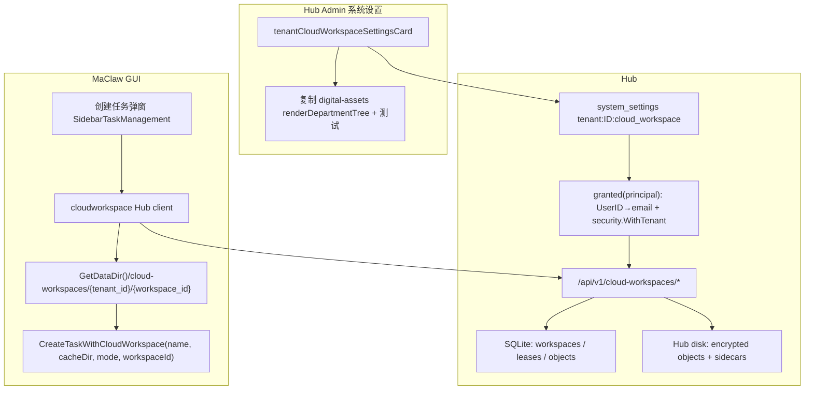
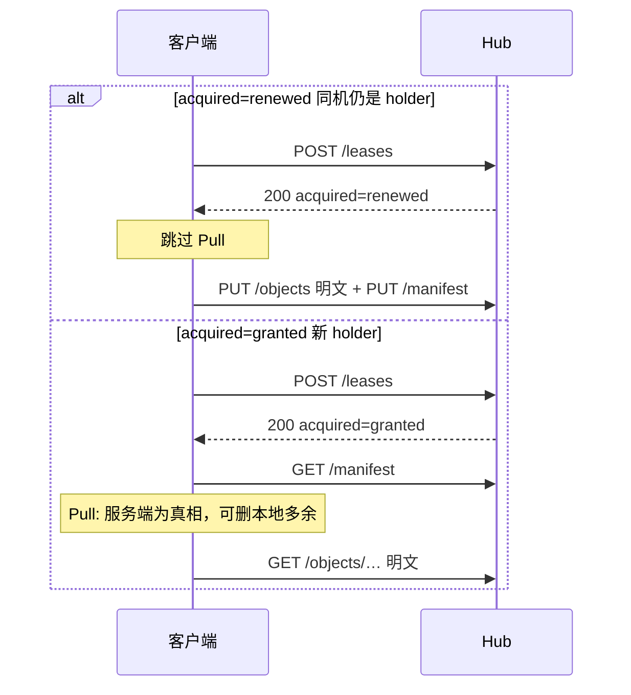
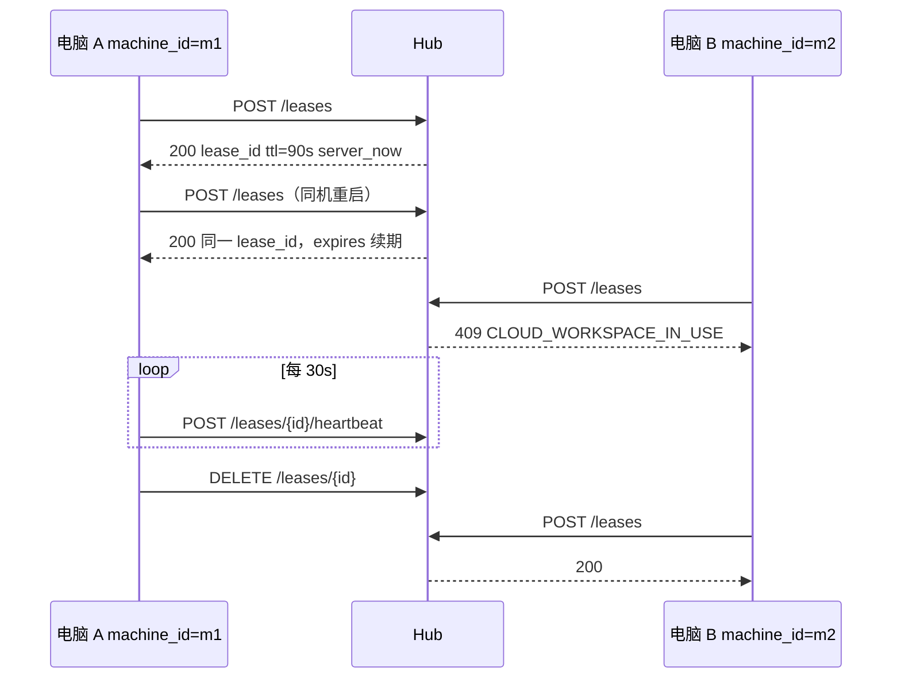
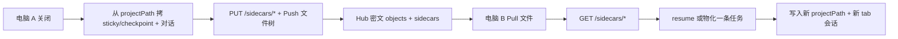

# 云端工作区（Cloud Workspace）— 换电脑不中断

| 项目 | 内容 |
| --- | --- |
| 作者 | Maclaw Design |
| 日期 | 2026-08-28 |
| 状态 | Draft |
| 范围 | Hub 租户系统设置、组织树授权、MaClaw 创建任务弹窗、工作区同步与会话续接 |

## Overview

今天 MaClaw 的工作目录、任务记录、对话历史和纯编程 sticky 状态全部落在本机（`GetDataDir()` 即配置了 `data_dir` 时的 `<data_dir>/data`，否则 `~/.maclaw/data`，以及用户所选本地路径）。换电脑后，用户必须重新选目录、重新打开任务，对话和产物无法跟着走。本设计在 Hub 上为每位用户提供有限额的**云端工作区**，把「换电脑不中断」收成一条产品能力：授权用户在「创建任务」时选择云端工作区；新机器拉下文件与绑定会话后，继续同一份工作。

v1 不是 Dropbox 克隆，也不是跨设备实时协作编辑器。它是：**按用户限额的私有工作区 + 独占租约 + 增量同步 + 任务/对话续接**。未获授权的用户看到的创建任务弹窗必须没有云端控件，工作目录行 markup 与今天一致。服务器对所有 CRUD / mount / sync 做强制鉴权，隐藏 UI 不够。

## Background & Motivation

### 当前状态

| 表面 | 位置 | 机器本地？ |
| --- | --- | --- |
| 创建任务弹窗 | `gui/frontend/src/components/layout/SidebarTaskManagement.tsx`（`createDialogOpen`）。标题随类型变为「创建任务」/「创建本地编程任务」/「创建远程编程任务」（约 1219–1223 行） | 是。工作目录按钮 `id="task-working-directory"`，来自 `SelectWorkingDir()`（`gui/app.go`） |
| 任务类型 | 对话 `""` / 本地编程 `coding_dev` / 远程编程 `remote_coding_dev` | 远程走 SSH，密码只存本机；`App.tsx` 远程分支调用 `CreateRemoteCodingTask`，不是 `CreateTaskWithMode` |
| 任务记录 | `gui/app_project_search.go`：`CreateTaskWithMode` → `{GetDataDir()}/tasks/{slug}-{nano}`。该目录是任务 **identity `projectPath`** | 是 |
| 默认沙箱 | `ensureManagedTaskWorkspaceDir` 写 `taskDir/workspace`；用户另选的 `workingDir` 是执行目录，**不是** `projectPath` | 是 |
| 项目 Tab 会话 | `gui/project_tab_session_persist.go`：`{GetDataDir()}/sessions/` | 是 |
| 对话历史 | `SaveProjectTabConversation` / `LoadProjectConversationHistory` | 是 |
| 纯编程 sticky | `gui/coding_env_session.go` `stickyCodingMemoryFilePath`：有 session owner 时写 **`{projectPath}/.coding_workbench.json`**，否则 `…/coding_workbench/{sha1}.json`。**不写在 `workingDir`。** | 是 |
| 执行 checkpoint | `gui/coding_exec_retry.go` `codingExecCheckpointFilePath`：`{projectPath}/.coding_exec_checkpoint.json` | 是 |
| 虚拟仓库同步 | `hub/internal/httpapi/virtual_repository_sync_handler.go`（AES-GCM，单文档，2 MiB；master key 文件/env） | 太小，不能当工作区；加密模式可复用 |
| 换机迁移 | `hub/internal/httpapi/migration_handlers.go`（整包导出，默认 100 MiB，chunk 最大 8 MiB，claim lease 2h） | 一次性搬家，不是持续工作区 |
| 组织树 | `security_groups` + `security_group_members`；管理端 `hub/web/admin/security-tab.js` | 已有 |
| 部门多选树 | `hub/web/admin/digital-assets-tab.js` 的 `renderDepartmentTree`（IIFE 闭包，绑定该模块 `tr()` / CSS）。`ve-tab.js` 另有一套可见性树，**不是** `renderDepartmentTree` | 已有；云端设置卡片复制数字资产树并加测试，不与 VE 树混用 |
| 租户系统设置卡片 | `index.html` 中 `tenantDigitalAssetsSettingsCard` / `tenantMigrationSettingsCard` | 已有模式 |
| 失败日志 | `failure_event_logs` 列为 `category` + `event_code` + `message`（**没有** `event_type`） | — |
| 管理指标 | 如 `GET /api/admin/ve/metrics`、`/api/admin/cost-ops/metrics` 的 JSON。Hub **没有** Prometheus/OTel | — |

**仓库里不存在**名为 cloud workspace / FUSE / S3 / MinIO 的工作区模块。Hub 现有对象存储都是本机目录：`user-data-migrations/`、mobile `blobs/`、virtual-repository 加密 JSON。`tenant_settings` 表已在 `hub/internal/store/sqlite/migrations.go` 建出，但 Go 代码未使用；现存租户功能开关走 `system_settings` 的 `tenant:{tenantID}:{key}`（见 `hub/internal/httpapi/tenant_settings.go`、`hub/internal/digitalasset/settings.go`）。`org_members` 仅出现在 `hub/internal/notification/store.go` 作为可选/遗留表。

### 痛点

1. 工作目录是本机绝对路径（如 `C:\Users\...\prog-test`），换电脑即失效。
2. 对话、todos、coding checkpoint、生成的 ppt/docx 都绑在本机 `GetDataDir()` 下，且 sticky/checkpoint 绑在 **任务 `projectPath`**，不是工作目录。
3. 已有「用户数据迁移」是一次性搬迁，不能支撑每天在两台电脑之间继续同一任务。
4. 租户管理员没有「只给部分部门开云端盘」的现成开关。

## Goals & Non-Goals

### Goals（v1 必须交付）

1. 每用户最多 N 个云端工作区；默认配额 **5**，租户可配 **1–10**，硬顶 **10**。
2. 租户管理员可选择：关闭 / 全员开放 / 按部门开放。按部门时用组织树多选，禁止手输部门 ID。
3. 只有被授权用户在创建任务弹窗里看到「云端工作区」；未授权用户弹窗没有 `task-workspace-kind` / 云端列表 / 新建云端按钮，工作目录行 markup 不变。服务端对所有 API 强制鉴权。
4. 授权用户可在云端工作区继续：**工作区文件**、**与该工作区 1:1 绑定的一条 AI 任务与一份对话**、**纯编程 sticky / checkpoint 元数据（经 sidecar 显式拷贝）**。换电脑后打开同一工作区即续上。
5. 同一工作区同一时刻只允许一台机器写入（独占租约）。第二台机器看到「另一台设备正在使用」。同一 `machine_id` 重启是续约，不是 409。
6. Windows 优先：本机缓存目录，不引入 FUSE。

### Non-Goals（明确不做，避免做成网盘）

1. 不提供任意文件夹双向同步、不备份整盘、不替代 Git / OneDrive / 公司网盘。
2. 不同步 `node_modules`、`.git` 对象库、venv、构建产物、以及 ignore 表中的密钥文件。
3. 不同步 LLM KV cache、进行中的 Agent loop、未保存编辑器 buffer、SSH 密码。
4. v1 不支持同一工作区双机同时在线协作、不提供冲突三路合并。
5. v1 云端工作区不与「远程编程 / SSH」组合；SSH 工作目录仍在远端主机。
6. 不把云端工作区做成多人共享盘；工作区私有，管理员也看不到其他用户的工作区名称列表（审计除外，只记 ID）。
7. 不在 v1 引入 S3/MinIO 后端（接口预留，落地仍是 Hub 本地磁盘）。
8. 不预创建空槽位。未使用的配额不占存储。
9. 失权后不提供 Hub 只读下载。本机残留缓存当作普通本地文件夹，不再 sync。

## Key Decisions

| # | 决策 | 选择 | 理由 |
| --- | --- | --- | --- |
| D1 | 授权模式 | `off` \| `all_users` \| `departments` | 覆盖「是否启用」和「按部门」两个产品要求，与数字资产 ACL 的 `all_members` / `restricted` 同构 |
| D2 | 部门继承 | 勾选部门 D ⇒ D 及其全部子孙成员生效（`AncestorMatch=true`） | 复用 `hub/internal/digitalasset` 的祖先匹配；管理员不必勾满整棵子树 |
| D3 | 成员解析 | 现状一人一组；多部门时 OR | `security_group_members` 主键是 `(tenant_id, email)`。`granted()` 用 `GetUserGroupID`，**禁止** `resolveUserPolicyGroup`（后者会回退 root） |
| D4 | 配额存储 | `quota` 始终 1–10，关闭功能时仍保留数字 | 关闭不等于配额 0；打开即可用。硬顶 10 在写入路径 clamp |
| D5 | 降低配额 | 不自动删工作区；禁止新建；管理端列出超额用户（用 `users.sn`） | 避免静默丢数据 |
| D6 | 工作区生命周期 | 懒创建 + 软删立即还配额 + 7 天回收站后硬删 | 空槽不占存储；用户删了立刻能再建；误删可在创建弹窗「最近删除」恢复 |
| D7 | 冲突策略 | **独占租约（exclusive lease）** | 编码 + Agent 写入无法 last-write-wins；双写会毁掉工作树。v1 禁止双开 |
| D8 | 挂载模型 | 下载到本机缓存目录，当普通 `workingDir` | Windows 无 FUSE；现有 `CreateTaskWithMode` 只吃绝对路径 |
| D9 | 在线要求 | v1 打开/同步必须在线拿租约 | 离线队列会把独占租约打穿。断线宽限期 90s 内可续；过期后只读提示 |
| D10 | 与任务类型组合 | 云端是**工作区位置**，不是第四种任务类型。远程编程不出现云端选项 | 不破坏 SSH 远程编程 |
| D11 | 设置落库 | `system_settings` 键 `tenant:{id}:cloud_workspace` JSON | 与 `digitalasset.tenantSettingsStorageKey` 一致；不新开未接线的 `tenant_settings` 表 |
| D12 | 存储 | Hub 本地目录 + **对象字节 AES-GCM**（Hub-trust SSE，非 E2E） | 复用 vrepo `master.key` 加载模式，info 串含 `workspace_id` |
| D13 | 同步 | 文件级清单 + SHA-256 增量；**Pull / Push 两阶段** | 持锁端 Push 时本地树为真相，删除能传播；Pull 时服务端树为真相 |
| D14 | 会话续接 | 工作区绑定 `workspace_id`；sticky/对话经 **sidecar 通道** 显式拷贝 | sticky 写在 `projectPath` 而非 `workingDir`，不能靠扫缓存根恢复 |
| D15 | 未授权 UX | 不渲染云端控件；工作目录行 markup 不变 | 产品要求未授权体验与今天一致（不是整段 dialog 字节级快照） |
| D16 | 同机重入 | 同一 `machine_id` 的 `POST /leases` **原地续约**；续约后 **跳过 Pull，立即 Push** | 仍是 holder 时本机树才是真相。先 Pull 会删掉崩溃窗口里未上传的文件 |
| D17 | 基数 | **一个工作区 ↔ 一条绑定任务 ↔ 一份对话** | 避免双 tab 互踩同一 sidecar；已有工作区走 resume 而非再创建 |
| D18 | 加密范围 | 对象、manifest、sidecar 全部落盘密文 | 「静态 AES-GCM」必须覆盖 `objects/`，否则运营可见明文 |
| D19 | 租户磁盘上限 | `tenant_max_total_bytes`（默认 50 GiB）含软删未 GC 字节；卷空间用 `archiveutil` 可移植查询 | 配额槽位只计 `active`；盘占用必须把回收站算进去。禁止 `os.Statfs`（Windows Hub 没有） |
| D20 | Hub 不可用 | 使用本会话缓存的 entitlement，并显示非阻断横幅 | 网络错误不得伪装成 `enabled=false`（那像功能被关） |
| D21 | 删除与 GC | Push 提交完整 manifest；`ref_count` 归零后删对象 | 否则持锁端删文件会被 Pull 逻辑救回 |
| D22 | Sidecar 通道 | 仅 `PUT/GET /sidecars/{name}`；**不进文件 manifest** | 避免会话 JSON 当普通对象明文上传、双通道分叉 |
| D23 | 工作区 ID | `PrepareCloudWorkspace` 返回 `{local_path, workspace_id}`，创建/恢复显式传入 | 禁止从缓存路径解析 `tenant_id`/`workspace_id` |
| D24 | 授权查找 | `UserID → users.email`，`security.WithTenant`，再 `GetUserGroupID` | `MachinePrincipal` 无 Email；`store.WithTenant` 是另一把 context key |
| D25 | 回收站 UX | 授权用户的创建弹窗内「最近删除」列表可 restore | 文案不得指向不存在的「工作区管理」页 |

## Proposed Design

### 术语

| 术语 | 含义 |
| --- | --- |
| Cloud workspace | 属于 `(tenant_id, user_id)` 的一份私有文件树 + sidecar（任务/对话/sticky） |
| Grant | 用户是否被租户策略授权使用该功能 |
| Quota | 该用户可同时拥有的非删除工作区个数 |
| Lease | 某 `machine_id` 对某工作区的独占写锁 |
| Local cache | 本机投影目录，作为任务的 `workingDir`（**不是** `projectPath`） |
| Sidecar | Hub `sidecars/` 下的加密 JSON；客户端本地草稿在 `.maclaw-cloud/`，flush 只走 sidecar API |
| Pull | **仅新 holder**（首次挂载 / 过期接管 / force）：服务端 manifest 为真相 |
| Push | 持锁端（含同机续约立刻一次、之后 debounce/关闭）：本地扫描为真相，提交完整 manifest |
| `last_pushed_revision` | 持久化在 `{cache}/.maclaw-cloud/state.json`（该目录强制 ignore），成功 Push 后写入服务端 revision |

### 架构



### 授权模型

策略 JSON（租户级，默认关闭）：

```json
{
  "mode": "off",
  "quota": 5,
  "department_ids": [],
  "max_workspace_bytes": 2147483648,
  "tenant_max_total_bytes": 53687091200,
  "updated_at": "2026-08-28T00:00:00Z"
}
```

- `mode`: `off` | `all_users` | `departments`
- `quota`: 写入时 `clamp(n, 1, 10)`；管理员 UI 1–10。试图写入 >10 → 存 10 并提示「硬顶 10」。
- `department_ids`: 仅 `mode=departments` 有意义。存**显式勾选**的节点 ID，不展开子孙。未知 ID 鉴权时忽略（与 `digitalAssetsAclDeptUnknown` 相同）。
- `max_workspace_bytes`: 默认 2 GiB，范围 256 MiB–8 GiB。
- `tenant_max_total_bytes`: 默认 50 GiB，范围 1 GiB–1 TiB。租户下 **含 `status='deleted'` 尚未 GC** 的全部工作区 `used_bytes` 之和不得超过该值（盘占用）。配额槽位仍只计 `active`。

#### 有效授权计算

用户 API 经 `authenticateVEMachine` 得到 `MachinePrincipal{TenantID, UserID, MachineID}`（**无 Email**）。`security_group_members` 与 `GetUserGroupID` 的键是 **email**。`SecurityStore.GetUserGroup` 从 `security.WithTenant` 读租户（`hub/internal/security/store.go` 的未导出 `tenantContextKey`）。`store.WithTenant`、`security.WithTenant`、`auth.WithTenant` 是**三把不同的 context key**；用错会回落到 `tenant_default`。

数字资产 ACL 已是正确范本（`hub/internal/digitalasset/acl.go`）：`ctx = security.WithTenant(ctx, tenantID)` 再 `GetUserGroupID(email)`。

```
granted(principal):
  if principal.UserID == "": 401 MACHINE_UNAUTHORIZED
  user = users.GetByID(principal.UserID)
  if user == nil or email empty: deny
  ctx = security.WithTenant(ctx, principal.TenantID)
  switch settings.mode:
    off: deny
    all_users: allow
    departments:
      if department_ids empty: deny   // admin PUT 已 400，防御性
      groupID = SecurityService.GetUserGroupID(ctx, email)  // 禁止 resolveUserPolicyGroup
      if groupID == "": deny          // 与 GetUserGroupID 注释「no root fallback」一致
      walk parent_id (max 32, cycle guard) via GetGroupByID
      if groupID or any ancestor ∈ department_ids: allow
      unknown ids in department_ids: skip
```

实现放在 `hub/internal/cloudworkspace/access.go`，注入 `security.SecurityService` + `UserRepository`。复制 digitalasset `Evaluator` 的祖先行走，**不要**调用 `resolveUserPolicyGroup`（未分组用户会被塞进 root，从而在勾选 root 或任何祖先策略下被误授权）。

`departments` 模式下未入组用户不授权。`all_users` 不看部门。

#### 部门变更行为

| 事件 | 行为 |
| --- | --- |
| 勾选父部门 | 子孙自动命中；不必再勾子节点。UI 可显示「含 N 个子部门」 |
| 勾选子部门、不勾父 | 仅该子树命中 |
| 部门被移动 | 授权按 **ID** 不按路径。被勾选节点无论挂到哪都仍生效；其子孙仍通过祖先匹配命中该 ID |
| 部门被删除 | `SecurityService.DeleteGroup` 会把成员迁到 root，并删除子孙。策略里残留的 ID 视为孤儿：鉴权忽略未知 ID；管理端标签显示「未知部门（已保留）」。保存时可一键清除孤儿 |
| 用户调部门 | 即时重算。已有工作区不删；若新部门无授权，该用户不能再 open/sync（403 `CLOUD_WORKSPACE_FORBIDDEN`），Hub 数据保留。本机缓存当作普通本地文件夹，**不再从 Hub 拉取** |
| 模式从 departments → off | 所有用户立即失权；租约到期后无法续；数据保留 |
| 降低配额 | 见配额节 |

管理端「当前将覆盖 N 个部门、约 M 名用户」：N = 显式勾选数 + 其子孙去重；M = `security_group_members` 中 group_id 落在该集合的去重 email 数。超额用户列表用 `users.sn`（与其他管理端列表一致），不要 email hash。

#### Maclaw 探测 API

每次打开创建任务弹窗调用 `GET /api/v1/cloud-workspaces/entitlement`。

未授权（策略 deny）时**仍然 200**：

```json
{ "enabled": false, "quota": 5, "used": 0, "workspaces": [], "deleted": [] }
```

`enabled=false` 时前端不渲染云端控件。`workspaces` / `deleted` 永远只含当前用户自己的行。

**Hub 不可用（D20）**：网络错误 / 5xx **不得**写成 `enabled=false`。使用本进程会话内上次成功的 entitlement；同时在弹窗顶显示非阻断横幅「Hub 不可用，云端工作区暂不可用」。若本会话尚无缓存，则不渲染云端控件（避免空白半残 UI）**并且**仍显示该横幅，以免用户以为租户关闭了功能。

### 配额

- 计数对象：`cloud_workspaces` 中 `status = 'active'` 的行。软删（`status='deleted'`）立即不占配额。
- **不使用 `creating` 状态。** `POST` 在一条 `BEGIN IMMEDIATE` 事务里 `COUNT` + `INSERT status='active'`，避免崩溃残留占配额。SQLite 隔离：`IMMEDIATE` 锁写连接，关闭 TOCTOU。
- 创建：`COUNT(*) FILTER (status='active') >= quota` → 403 `CLOUD_WORKSPACE_QUOTA`。同一事务再检查本用户 active 的 `SUM(used_bytes)`（工作区字节上限派生）以及租户 **全部状态** `SUM(used_bytes)`（含软删）对 `tenant_max_total_bytes`。
- 管理员把配额从 8 降到 3：设置写入成功；已有 6 个工作区的用户保留 6 个，但 `POST` 创建失败，直到 `used < quota`。
- 管理端保存配额时若存在超额用户，返回 `over_quota_users: [{ "sn": "…", "used": 6, "quota": 3 }]`，不阻断保存。
- 硬顶：即使直接打 API 把 `quota` 设为 99，服务端写成 10。

### 工作区身份与命名

- `id`: **`cws_` + 32 位小写 hex**（UUID 去掉连字符）。PR3 测试写死此前缀，不再「可选」。
- `display_name`: 用户命名，1–64 字符，trim 后非空。
- `name_norm`: NFC 规范化后再 `strings.ToLower`（Unicode 默认 case fold）。中文「工作区 1」与英文 `Workspace 1` 是不同行。同一 `(tenant_id, user_id)` 在 `status!='deleted'` 下唯一。
- **懒创建**：配额 5 不代表预先有 5 个空盘。点「新建云端工作区」才 `POST`。
- 默认名：`工作区 1` … 取已用名中「工作区 N」的最小空缺；英文 UI 用 `Workspace 1`。
- 不把槽位号当成稳定 ID。

### 与任务类型的组合

现有弹窗（`SidebarTaskManagement.tsx` 约 1217–1334 行）：

1. 提示：「先设置任务环境；创建后请直接在 AI 助手中输入任务命令。」
2. 任务类型三选一：对话 / 本地编程 / 远程编程
3. 非远程时：工作目录 chip（`id="task-working-directory"`）+ `SelectWorkingDir` + × 清除
4. 远程时：SSH 主机/端口/用户/密码/远端目录；`App.tsx` 走 `CreateRemoteCodingTask`
5. 取消 / 创建并打开
6. 标题随 `newTaskMode` 切换，不是永远「创建任务」

**新信息架构**（仅 `entitlement.enabled===true` 且 Hub 可用或有缓存 enabled）：

```
任务类型     [对话] [本地编程] [远程编程]     ← 不变
工作区位置   [本地工作区] [云端工作区]         ← 仅对话/本地编程出现
             远程编程时整行不出现
工作目录     本地 → 今天的 chip picker（id 不变）
             云端 → 工作区列表（名称 / 上次使用 / 占用 / 租约）
             云端 → 「最近删除」折叠区（restore）
SSH 字段     仅远程编程，完全不动
```

未授权或本会话无 enabled 缓存：不插入「工作区位置」行，工作目录行保持今天的 markup / `id="task-working-directory"`。`SidebarTaskManagement.test.tsx` 在 `CloudWorkspaceEntitlement → {enabled:false}` mock 下：现有 `getByTitle('Create task')` / `getByRole('dialog', { name: 'Create task' })` 仍通过，且 **没有** `task-workspace-kind` / `task-cloud-workspace-list` / `task-cloud-workspace-create`。

| 任务类型 | 本地工作区 | 云端工作区 |
| --- | --- | --- |
| 对话 `""` | 可选本地目录（今天） | 工作目录 = 缓存路径。1:1 绑定一条任务 |
| 本地编程 `coding_dev` | 今天的本地目录 / 默认沙箱 | `CreateTaskWithCloudWorkspace(name, cacheDir, "coding_dev", workspaceId)` |
| 远程编程 `remote_coding_dev` | 不出现本地/云端选择 | **禁止组合** |

#### 基数（D17）：创建 vs 恢复

v1 **一个工作区只绑定一条任务、一份对话**。

| 用户动作 | 行为 |
| --- | --- |
| 「新建云端工作区」 | `POST /api/v1/cloud-workspaces` → 选中新行。真正建本地任务发生在「创建并打开」 |
| 「创建并打开」选中**已有**工作区 | **resume**：按 tag `cloud_workspace:{id}` 找本机可见任务；有则 `resumeTask`；无则按 sidecar `task.json` **物化恰好一条** `CreateTaskWithCloudWorkspace`。禁止每次点都 `CreateTaskWithMode` |
| 「创建并打开」选中**刚新建、尚无 sidecar 任务**的工作区 | 创建恰好一条本地任务并写入 sidecar |
| 同一工作区已在本机打开 | 激活已有 tab；不第二份任务、不第二份 sidecar writer |
| 列表行「打开」与主按钮 | 语义相同（resume） |

主按钮在云端模式未选中工作区时 disable。远程编程路径完全不碰云端 API。

提交时（仅新建绑定的那一次）：

1. `PrepareCloudWorkspace(id)` → `{local_path, workspace_id}`（内部：lease；**同机续约则 Push、跳过 Pull**；**新 holder 则 Pull**）。
2. `CreateTaskWithCloudWorkspace(name, local_path, mode, workspace_id)` 显式打 tag `cloud_workspace:{uuid}`，并把 `(local_path → workspace_id)` 记入进程内 map 供后续 flush 使用。
3. **禁止**从路径解析 ID。`data_dir` 可配置，租户 ID 可能含路径不友好字符，用户也可能把长得像缓存的目录选成「本地工作区」。

`workingDir` 仍是本机绝对路径，这样 `normalizeRecentTaskWorkingDir`、工具沙箱、源码树入口不用改。Identity 目录仍是 `{GetDataDir()}/tasks/{slug}-{nano}`。

前端 `createTask` 增加可选第五参 `workspaceId?: string`。`App.tsx`：若 `workspaceId` 非空则调 `CreateTaskWithCloudWorkspace`；远程分支仍只走 `CreateRemoteCodingTask`。

### 存储架构

Hub 根目录（与 migration 的 `rootDir/user-data-migrations` 并列）：

```
{hubData}/cloud-workspaces/
  master.key                 # 32 字节；O_EXCL 创建，同 virtualRepositorySyncMasterKey
  {tenant_id}/{user_id}/{workspace_id}/
    objects/{sha256}.enc     # 文件名 = sha256(plaintext) 小写 hex；内容 = nonce||GCM(ciphertext)
    manifest.json.enc
    sidecars/{name}.enc      # session.json / task.json / coding_workbench.json / coding_exec_checkpoint.json
```

隔离：打开前先查 SQLite 属主。`tenant_id` / `user_id` / `workspace_id` 经 `filepath.Base` 且拒绝 `.` / `..`。对象 ID 必须匹配 `^[0-9a-f]{64}$`，**不能**只靠 `filepath.Base`（否则 `../` 或大小写混用能绕过）。

#### 加密（D12 / D18）— 复用 vrepo master-key，不是新的 DEK 信封

这是 **Hub-trust SSE**（Hub 能解密），**不是** E2E。管理员 API 仍不提供文件浏览。

加载 master 抄 `virtualRepositorySyncMasterKey`（`hub/internal/httpapi/virtual_repository_sync_handler.go`）：

1. env `MACLAW_CWS_MASTER_KEY`：base64 32 字节；
2. 否则 `{hubData}/cloud-workspaces/master.key`；
3. 不存在则 `O_EXCL` 创建 32 随机字节（与 vrepo 一样防止并发写两把钥匙）。

工作区密钥：

```
key = HMAC-SHA256(master, "maclaw-cws-v1\x00" + tenantID + "\x00" + userID + "\x00" + workspaceID)
```

对象 / manifest / sidecar 均 AES-256-GCM。AAD = `tenantID + "\x00" + userID + "\x00" + workspaceID`（对象可再追加 `"\x00" + sha256hex`）。Nonce 每次随机，`gcm.NonceSize()`。v1 **不做**密钥轮转；换 master 会使历史对象不可读，运维文档写明。

`objects/` 里的字节是密文。文件名是明文 hash，便于内容寻址与去重，不泄露内容。

容量：

| 项 | 默认 | 范围 |
| --- | --- | --- |
| 每工作区 | 2 GiB | 256 MiB–8 GiB（租户可配） |
| 每用户派生上限 | `quota * max_workspace_bytes` | 不另存列 |
| 每租户 | `tenant_max_total_bytes` 默认 50 GiB | 1 GiB–1 TiB |
| 单文件 | 64 MiB | 超过拒收 |
| 文件数 | 20_000 / 工作区 | 防海量小文件打爆清单 |
| Hub 卷 | PUT 时 `archiveutil.AvailableBytes`（导出 `disk_windows.go` / `disk_unix.go` 的可移植实现；**禁止** `os.Statfs`）：剩余 < 1 GiB 或不足本次写入则 507 | — |

超限错误：`CLOUD_WORKSPACE_QUOTA`（个数）、`CLOUD_WORKSPACE_SIZE`（单工作区字节）、`CLOUD_WORKSPACE_TENANT_DISK`（租户总和）、`CLOUD_WORKSPACE_VOLUME_FULL`（507）。

### 同步协议（D13 / D21）

不做 rsync 线协议。采用 **manifest + 内容寻址对象**。清单条目：`{ "path", "sha256", "size" }`。**协议不含 mtime**（mtime 只用于本机 UI，不可作为同步真相）。`path` 必须是相对、`/` 分隔、无 `..`、非绝对。

客户端在 `{cache}/.maclaw-cloud/state.json` 持久化 `{ "last_pushed_revision": "…" }`（该目录强制 ignore，不进 manifest）。成功 Push 后覆盖写入。进程内存不是唯一来源——崩溃后必须还能读到。

#### 获租约之后走哪条路（必须与打开流程、崩溃表一致）

`POST /leases` 200 返回 `acquired: "renewed" | "granted"`：

| `acquired` | 何时 | 随后动作 |
| --- | --- | --- |
| `renewed` | 同一 `machine_id` 仍是 holder（D16 原地续约） | **禁止 Pull**。本机树仍是真相。立刻 Push（把崩溃窗口里已落盘未上传的文件补上），然后正常编辑 + debounce Push |
| `granted` | 首次挂载、过期行被拿走、或 `force` 成为新 holder | **Pull**。脏缓存对话框仅当：持久化的 `last_pushed_revision` 非空且 ≠ 服务端 revision，**或** force/超时接管后本地未忽略文件与服务端树不一致 |

同机续约时 **不得** 因为 `last_pushed_revision == server` 就 Pull：那正是「别人没写、自己有未 Push 脏文件」的崩溃重开路径。

#### Pull（仅新 holder）

服务端 manifest 为真相：

1. `GET /manifest`。
2. 若触发脏缓存对话框：默认「丢弃本机修改并拉取」；取消则 `DELETE lease`、不打开。
3. 对服务端每条：本地缺失或 hash 不同 → `GET /objects/{sha256}` 写入明文。
4. 对本地存在、服务端没有、且未被 ignore 的路径 → **删除本地文件**。
5. Pull **禁止 upload**。完成后把 `last_pushed_revision` 写成服务端 revision（本地已与服务器对齐）。

#### Push（持锁端：同机续约立刻一次；之后 debounce 2s 与关闭 flush）

本地扫描为真相：

1. 扫描缓存，应用 ignore，得到完整 entries。
2. 对本地有、服务端无或 hash 不同的 sha256 → upload **明文**。
3. `PUT /manifest` 提交**完整** `entries` + `if_match_revision`。服务端用该列表**整体替换**树，并在**同一事务**更新 `used_bytes`、`file_count`、`manifest_revision`。
4. 持锁端 Push **禁止**「服务端有本地无 → download」。
5. 无租约禁止 PUT。revision 冲突 → 409，客户端停写并只读。
6. 成功后写 `{cache}/.maclaw-cloud/state.json` 的 `last_pushed_revision`。



#### 对象上传（HTTP 明文，盘上密文 — 唯一格式）

**线格式只有一种**：请求/响应 body 是文件**明文**；Hub 计算 SHA-256，必须等于路径 `{sha256}`，然后 AES-GCM 封成 `{sha256}.enc`。GET 解封后返回明文。客户端 **不** 实现 GCM，**不** 上传 `nonce||ciphertext`。删掉任何「解密前校验密文封装」的说法。

- 路径 `{sha256}` 必须 `^[0-9a-f]{64}$`。
- ≤ 8 MiB：一次 `PUT /objects/{sha256}`，body = 明文，`Content-Length` 必填。Hub：`sha256(body)==路径` → seal → 写 `.enc`。幂等：对象已存在且 hash 相同则 200。
- \> 8 MiB 且 ≤ 64 MiB：明文分片，块大小 ≤ `migrationMaxUploadChunkSize`（8 MiB）：
  - `PUT /objects/{sha256}/chunks/{index}` body = 该片明文；写入 staging（`objects/{sha256}.part/{index}`），不加密。
  - `POST /objects/{sha256}/complete`：按 index 拼接 staging，计算整段 SHA-256，不匹配则 400 并删 staging；匹配则 seal **一次** 写成 `{sha256}.enc`，删 staging。
- 未 `complete` 的 staging 与 `ref_count=0` 对象走同一 GC（超过 1h 删除）。
- GUI HTTP 客户端**不要**复用 `virtualRepositorySyncRequest` 的 30s 超时。超时 = `max(60s, 30s + sizeBytes/262144)`，或按块 60s。

#### 对象 PUT 准入（在封盘之前）

对本次请求 `request_size`（单次 PUT 的 Content-Length，或 complete 后的拼接大小）：

```
admit = workspace.used_bytes
      + SUM(size) of objects where workspace_id=this AND ref_count=0
      + request_size
```

同时检查：

1. `admit <= max_workspace_bytes` → 否则 403 `CLOUD_WORKSPACE_SIZE`
2. 租户 `SUM(used_bytes) WHERE tenant_id=…`（**含 status='deleted'**）+ `SUM(ref_count=0 sizes)` + `request_size` ≤ `tenant_max_total_bytes` → 否则 403 `CLOUD_WORKSPACE_TENANT_DISK`
3. `archiveutil.AvailableBytes(objectsDir) < max(1GiB, request_size)` → 507 `CLOUD_WORKSPACE_VOLUME_FULL`

`used_bytes` / `file_count` **不**在对象 PUT 时改（对象可能尚未被 manifest 引用）；只在 `PUT /manifest` 同一事务里按新 entries 的 `sum(size)` / `count` 写入。GC 的「按 manifest 重算」是对账，不是唯一更新点。

无租约的写 → 403 `CLOUD_WORKSPACE_LEASE_REQUIRED`。Pull 的 GET object/manifest 需要有效租约（含刚授予的）。`enabled=false`（失权）时 GET/PUT 一律 403，即使属主。

无租约的写 → 403 `CLOUD_WORKSPACE_LEASE_REQUIRED`。Pull 的 GET object/manifest 需要有效租约（含刚授予的）。`enabled=false`（失权）时 GET/PUT 一律 403，即使属主。

#### Ignore（单一真表）

Go 的 `internal` 不能被 `gui/` 引用。规则放在双方都能 import 的非 internal 包，模式同 `corelib/archiveutil`：

- **真源**：`corelib/cloudworkspaceignore`（`ShouldIgnore(rel string) bool` + 内置表 + `.maclaw-cloudignore` 解析）
- Hub：`hub/internal/cloudworkspace/ignore.go` **只做薄封装**，调用 corelib
- GUI：`CloudWorkspaceShouldIgnore` 直接调 `cloudworkspaceignore.ShouldIgnore`，**禁止** `import hub/internal/…`
- 黄金测试：corelib 一份表驱动测试；Hub wrapper 与 GUI 各一条断言「与 corelib 同一组 fixture 结果一致」，禁止手抄一份会漂移的 TS 常量

内置规则 = `maclawAppBundledSkillSkipDir` ∪ `code_event_integration.go` 的 `skipDir` ∪ 密钥 ∪ 体积件 ∪ sidecar 目录。**减去** sticky/checkpoint 文件名（它们走 sidecar API，本来就不应出现在文件树扫描里）。

| 类别 | 模式 |
| --- | --- |
| VCS | `.git/` `.hg/` `.svn/` |
| 依赖/构建 | `node_modules/` `vendor/` `.venv/` `venv/` `__pycache__/` `.pytest_cache/` `.mypy_cache/` `dist/` `build/` `target/` `out/` `bin/` `obj/` `.next/` `.turbo/` `coverage/` `tmp/` `temp/` `.cache/` |
| IDE | `.idea/` `.vscode/` |
| 产品目录 | `.maclaw/` `.maclaw-cloud/` |
| 密钥 | `.env` `.env.*`（保留 `.env.example`）`*.pem` `*.key` `id_rsa` `id_dsa` `id_ecdsa` `id_ed25519` `credentials.json` |
| 体积 | `*.iso` `*.dmg` |
| 工作区覆盖 | 根文件 `.maclaw-cloudignore`（gitignore 语法子集：`*` `**` 行首 `!`） |

`*.exe` **不同步忽略**（与 cited skip-dir 不一致，且用户可能要携带工具链产物；64 MiB 单文件上限已挡住安装包）。

扫描时：目录名命中上表则整树跳过；`.maclaw-cloud/` 即使被用户改 ignore 也强制跳过（会话不得当普通对象上传）。

### 冲突与租约（D7 / D16）



`expires_at` / `heartbeat_at` **一律用服务器时钟**：授予与 heartbeat 时 `expires_at = server_now + 90s`。客户端时钟不准不能让租约提早失效或永不过期。

`idx_cws_lease_active` 仍是 `UNIQUE(workspace_id) WHERE released_at IS NULL`。过期行的 `released_at` 仍是 NULL，因此 **第二次 POST 必须在同一事务里先释放过期行再 INSERT**，否则 UNIQUE 会打到自己。

#### `POST /leases` 单事务（`BEGIN IMMEDIATE`）

输入：认证后的 `machine_id`；`force` 仅来自身体布尔，**不接受 `machine_name`**。`machine_name` 从 `machines` 行 / `MachineMetadata.Hostname`（`hub/internal/auth/identity_service.go`）读取。

SQLite **没有** `SELECT … FOR UPDATE`。写锁来自事务模式本身：

```sql
BEGIN IMMEDIATE;
SELECT id, machine_id, expires_at, stolen_by FROM cloud_workspace_leases
 WHERE workspace_id = ? AND released_at IS NULL;
-- 然后 UPDATE / INSERT，COMMIT
```

1. `BEGIN IMMEDIATE;` 后普通 `SELECT … WHERE released_at IS NULL`（**不要**写 `FOR`）。
2. **无行** → INSERT，`expires_at = server_now+90s`，200 `{ acquired: "granted" }`。
3. **有行且 `machine_id` 相同** → `heartbeat_at`/`expires_at` 原地更新，返回**同一** `lease_id`，200 `{ acquired: "renewed" }`。这是重启续约，不是 force。
4. **有行且（`expires_at <= server_now` 或 `force==true`）** → 将该行 `released_at=server_now`，若 `force` 或过期抢占则写 `stolen_by=caller_machine_id`；再 INSERT 新行。200 `{ acquired: "granted" }`。过期抢占在 UI 确认「上次在 {hostname} 使用，已超时，是否接管？」；force 另走「强制接管」二次确认。
5. **否则** → 409 `CLOUD_WORKSPACE_IN_USE` `{ holder_machine_id, holder_machine_name, expires_at }`。

Heartbeat：`lease_id` 不存在 / 已 released / `stolen_by` 非空 / `machine_id` 不匹配 → 409。否则 `expires_at = server_now+90s`。

被 steal 的机器：下次 heartbeat 409 → 工作区切只读，横幅「已在另一台设备打开」。**不自动 flush**（此时写可能与新持有者冲突）。

测试（PR4 必写）：并发双 POST 只有一个 200；过期行可被他机拿走；同机 POST 续约不 409；steal 后旧 heartbeat 409。

#### Force steal 与脏缓存（数据丢失必须写明）

| 场景 | `acquired` | 数据命运 |
| --- | --- | --- |
| 正常关闭 | — | Push 完整 manifest → 写 `state.json` → DELETE lease。无丢失 |
| 崩溃，90s 内同机重开 | `renewed` | **跳过 Pull**，立刻 Push。把崩溃前已落盘未上传的文件补上。`state.json` 里的 revision 即使仍等于 server 也不得 Pull |
| 崩溃，90s 后他机超时接管 | 他机 `granted` | 他机 Pull 到崩溃前最后一次成功 Push。未 Push 的本地改动只留在旧机磁盘 |
| 强制接管（旧机仍在心跳） | 新机 `granted` | **旧机未 flush**。最多 30s 后旧机才知道。debounce 2s 内的变更 + 进行中的 64 MiB PUT 视为丢失。UI 二次确认文案必须写「另一台设备上未同步的修改将丢失」 |
| 旧机之后再开（已不再是 holder） | `granted` | 若 `state.json.last_pushed_revision ≠ server` **或** 本地未忽略树与服务端不一致：脏缓存对话框，默认丢弃后 Pull |

v1 不做把旧机脏文件自动 merge 进新持有者。

### 客户端挂载

缓存路径（正确入口是 `GetDataDir()`，不一定是 `~/.maclaw/data`）：

```
{GetDataDir()}/cloud-workspaces/{tenant_id}/{workspace_id}/
```

该目录是 `workingDir`。任务 identity 仍是 `tasks/{slug}-{nano}`。

打开流程（与「获租约之后走哪条路」同一张表，禁止再写一条「永远 Pull」）：

1. entitlement：deny → 今天本地逻辑。Hub 挂 → D20。
2. `POST /leases`。他机未过期且非 force → 409 UI。
3. 读 `{cache}/.maclaw-cloud/state.json`（没有则视为空 revision）。
4. **若 `acquired=renewed`**：跳过 Pull，立刻 Push，然后进第 6 步。
5. **若 `acquired=granted`**：按上表决定是否弹出脏缓存对话框，然后 Pull。
6. Resume 或物化恰好一条任务；`workingDir=cache`，显式 `workspaceId`。
7. 每 30s heartbeat；文件 watcher debounce 2s 后 **Push**。
8. 关闭任务或进程退出：Push → 更新 `state.json` → `DELETE lease`。

**释放路径（PR8 必须落地，今天没有云感知 hook）：**

- 任务 tab 关闭：在 `hideTask` / `EVENT_PROJECT_TASK_CLOSED` / `CloseAssistantTabSession` 链上，若任务带 `cloud_workspace:` tag → `ReleaseCloudWorkspace`。
- 进程退出：Wails `OnShutdown`（现有 sticky debounce flush 旁）对所有持有租约调用 `ReleaseCloudWorkspace`（timeout 短、尽力而为）。
- Heartbeat 409（被 steal）：停止 watcher、只读、**不再 Push**。

离线：不能新开云端任务。已打开且租约未过期时短暂断线（<90s）可继续本地编辑，重连后 Push。租约过期后只读 banner：「已离线，不会上传」。

不做 FUSE、不做 zip 整包展开。

### 会话连续性（D14 / D17 / D22）

sticky 与 checkpoint **不在**云缓存根上：

- `.coding_workbench.json` → `{projectPath}/`（`stickyCodingMemoryFilePath`：`projectPathFromSessionOwnerID`）
- `.coding_exec_checkpoint.json` → `{projectPath}/`（`codingExecCheckpointFilePath`）
- 对话 → `{GetDataDir()}/sessions/tab_{id}.json`（`TabSessionData`）

因此「忽略名单不要排除工作区根的 `.coding_workbench.json`」是错的。必须 **flush 时从 `projectPath` 拷进 sidecar，restore 时拷回新的 `projectPath`**。

#### 单一 sidecar 通道

| 禁止 | 原因 |
| --- | --- |
| 把 sidecar 放进文件 manifest | 会话可能当普通对象上传；与 ignore 冲突 |
| 同时走 `sidecars/` PUT 又靠 `.maclaw-cloud/` 进树 | 双写分叉 |

本地草稿目录 `{cache}/.maclaw-cloud/` 仅客户端使用，**强制 ignore**。Flush：

```
PUT /sidecars/{name}   name ∈ 下表
GET /sidecars/{name}
```

需要有效租约。Hub 落盘 `sidecars/{name}.enc`。

| name | 来源（flush） | 恢复目标 |
| --- | --- | --- |
| `session.json` | 当前绑定 tab 的 `TabSessionData.Conversation` + `InputText`（**去掉**本机 `tab_id`） | 新机器 `SaveProjectTabConversation` 写入新 `tab_{id}.json` |
| `task.json` | 单对象：`name`, `mode`, `tags`（不含本机绝对路径）、`created_at`, `workspace_id` | 无本地记录时物化恰好一条任务 |
| `coding_workbench.json` | 读 `{projectPath}/.coding_workbench.json` | 写到**新** `{projectPath}/.coding_workbench.json` |
| `coding_exec_checkpoint.json` | 读 `{projectPath}/.coding_exec_checkpoint.json`（若存在且未过期） | 写到新 `projectPath` |

checkpoint 体若 > 64 MiB 则跳过并记 `failure_event_logs`。v1 **不同步** checkpoint 旁路的大文件 blob 目录（若未来拆出 sidecar 目录再议）。



**v1 自动恢复**：工作区文件、一条绑定任务、一份对话、sticky（plan/todos）、checkpoint 元数据（若 ≤ 上限）。

**v1 不恢复**：进行中 Agent loop / `coding_durable_dynamic_surface.go` grants（TTL 5 分钟 + `connectionID`）、未保存编辑器 buffer、打开了哪些编辑器标签、SSH 密码、LLM KV、`node_modules`。

「换电脑不中断」v1：打开同一工作区后 **文件在、那一条任务在、对话在、coding session plan / todos 在**；用户接着打字即可。不保证 Agent 在飞的那一步接着跑。

`useAITabManager` 仍按本机 `projectPath`（任务 identity）建 tab。稳定键是 `workspace_id` tag，不是缓存路径，也不是旧 `tab_id`。

### Create-task UI（文案）

未授权：无 `task-workspace-kind` / 云端列表 / 新建云端；工作目录行不变。

授权后：

- 行标题：`工作区位置` / `Workspace location`（`data-testid="task-workspace-kind"`）
- 分段：`本地工作区`（`本机文件夹`）/ `云端工作区`（`换电脑继续`）
- 空状态：`还没有云端工作区。新建后，文件和对话会保存在 Hub，换电脑可继续。`
- 新建：`新建云端工作区`（`used >= quota` disable，title `已达上限 {used}/{quota}`；`data-testid="task-cloud-workspace-create"`）
- 列表（`data-testid="task-cloud-workspace-list"`）：名称、`上次使用：3 小时前`、`128 MB`、in-use：`使用中 · DESKTOP-ABC`（本机 `is_self` 显示 `本机已打开`）
- 行内：重命名；删除确认：**「删除「{name}」？将立即腾出 1 个名额。7 天内可在下方「最近删除」中恢复。」** 不得写「工作区管理」。
- **最近删除**（折叠，默认收起）：`entitlement.deleted[]`；按钮 `恢复`。恢复 403 `CLOUD_WORKSPACE_QUOTA` 时提示「当前名额已满（{used}/{quota}），请先删除一个工作区再恢复。」
- 他机占用：不可打开，`另一台设备正在使用此工作区`；可提供「强制接管」（二次确认含丢数据说明）
- 已有行 + 主按钮：文案在云端模式改为 **「打开」**（resume）。新建后尚未打开过的行仍可用「创建并打开」
- Hub 不可用横幅见 D20

弹窗宽度可从 420px 调到 480px。

### Admin UI（Hub 租户系统设置）

在 `hub/web/admin/index.html` 的系统设置区、`tenantDigitalAssetsSettingsCard` 旁新增 `tenantCloudWorkspaceSettingsCard`（`hidden`，租户管理员可见，与 `tenant-tab.js` 对 migration/digital-assets 的 `classList.toggle('hidden', !(hasProfile && tenantAdmin))` 相同）。

控件：

1. 分段/radio：`关闭` / `全员开放` / `按部门开放`
2. `mode=departments` 时展开组织树：
   - `GET /api/admin/security/groups`
   - **复制** `digital-assets-tab.js` 的树（checkbox、筛选、「未知部门（已保留）」、深度帽），加上独立 i18n/CSS 前缀 `cws-acl-tree-*`。`validate-admin-modules.js` 为新文件/函数加提取测试。
   - **诚实约束**：该树是 `digital-assets-tab.js` IIFE 闭包，使用模块内 `tr()`、`isDeptSelected`、`digitalAssetsMaxDepartmentTreeDepth`。`admin-ui.js` 目前只有 `confirmDialog` / `promptDialog`，不是树组件。`ve-tab.js` 是另一套树。v1 **不**声称与 VE 共用，也 **不**在 PR2 里随手「抽到 admin-ui.js」除非另做带 validator 更新的纯提取 PR（不阻塞本功能）。
   - 父节点勾选 = 该节点+子孙；禁止文本框贴部门 ID
3. 配额 number 1–10，默认 5
4. 每工作区容量 256–8192 MiB，默认 2048
5. 租户总容量 number（GiB），默认 50
6. Preview：`当前将覆盖 {n} 个部门、约 {m} 名用户`
7. 超额：`{k} 名用户已超过新配额（SN 列表），将无法新建，现有工作区保留`
8. 保存 / 刷新，风格对齐 `tenantMigrationSettingsCard`

逻辑：`hub/web/admin/system-tab.js` 的 `loadTenantCloudWorkspaceSettings` / `saveTenantCloudWorkspaceSettings`。`validate-admin-modules.js` 增加卡片 id 标记（与现有 `tenantDigitalAssetsSettingsCard` 检查同类）。

### 客户端 Hub 认证

- `Authorization: Bearer {machineToken}`
- `X-Machine-ID: {machineID}`

`authenticateVEMachine`（`hub/internal/httpapi/ve_admin_handler.go`）。`UserID` 为空则 401。属主永远取 principal。

GUI：`gui/cloud_workspace_client.go`。列表/entitlement 请求可抄 `virtualRepositorySyncRequest` 的头；**上传必须用独立 client**（超时/分块见上）。

## API / Interface Changes

前缀 `/api/v1/cloud-workspaces`。snake_case。

### 管理端（`requireTenantAdmin`）

#### `GET /api/admin/cloud-workspaces/settings`

```json
{
  "mode": "off",
  "quota": 5,
  "department_ids": [],
  "max_workspace_bytes": 2147483648,
  "tenant_max_total_bytes": 53687091200,
  "preview": {
    "department_count": 0,
    "user_count": 0,
    "over_quota_users": [{ "sn": "AB12", "used": 6, "quota": 3 }],
    "used_bytes": 0
  }
}
```

#### `PUT /api/admin/cloud-workspaces/settings`

可写：`mode`, `quota`, `department_ids`, `max_workspace_bytes`, `tenant_max_total_bytes`。Response 为 clamp 后的值 + preview。`admin_audit_logs.action = "cloud_workspace.settings.update"`。

`mode=departments` 且 `department_ids` 为空 → 400 `INVALID_INPUT`。

#### `GET /api/admin/cloud-workspaces/metrics`

JSON 计数器快照（对齐 `GET /api/admin/ve/metrics`），**不是** Prometheus：

```json
{
  "tenants_enabled": 1,
  "open_leases": 3,
  "sync_bytes_up": 1048576,
  "sync_bytes_down": 2048,
  "quota_rejections": 0,
  "lease_conflicts": 1,
  "used_bytes": 123456789,
  "volume_free_bytes": 987654321
}
```

### 用户端（机器凭据）

#### `GET /api/v1/cloud-workspaces/entitlement`

```json
{
  "enabled": true,
  "quota": 5,
  "used": 1,
  "max_workspace_bytes": 2147483648,
  "workspaces": [
    {
      "id": "cws_0123456789abcdef0123456789abcdef",
      "name": "标书项目",
      "used_bytes": 104857600,
      "updated_at": "2026-08-28T10:00:00Z",
      "lease": {
        "held": true,
        "machine_id": "m_…",
        "machine_name": "DESKTOP-ABC",
        "is_self": false,
        "expires_at": "2026-08-28T10:01:30Z"
      }
    }
  ],
  "deleted": [
    { "id": "cws_…", "name": "旧项目", "deleted_at": "2026-08-27T10:00:00Z", "purge_after": "2026-09-03T10:00:00Z" }
  ]
}
```

失权时 `enabled=false`，`workspaces`/`deleted` 仍可返回属主自己的元数据（弹窗不展示云端入口；无 Hub 下载）。

#### `POST /api/v1/cloud-workspaces`

```json
{ "name": "标书项目" }
```

201：`{ "id": "cws_…", "name": "标书项目", "status": "active", "used_bytes": 0, "created_at": "…" }`

错误：403 `CLOUD_WORKSPACE_FORBIDDEN` / `CLOUD_WORKSPACE_QUOTA` / `CLOUD_WORKSPACE_TENANT_DISK`；409 `CLOUD_WORKSPACE_NAME_TAKEN`。

#### `PATCH /api/v1/cloud-workspaces/{id}`

`{ "name": "新名称" }` — 属主 + `status=active`。

#### `DELETE /api/v1/cloud-workspaces/{id}`

软删。他机未过期租约 → 409 `CLOUD_WORKSPACE_IN_USE`。本机持锁或无锁可删（本机则先 Push 再删可选；v1：有锁则允许删并释放租约）。

#### `POST /api/v1/cloud-workspaces/{id}/restore`

7 天内软删恢复。`used >= quota` → 403 `CLOUD_WORKSPACE_QUOTA`。

#### 租约

- `POST /api/v1/cloud-workspaces/{id}/leases` body **仅** `{ "force": false }`。`machine_name` 服务端填。200：`{ "lease_id", "expires_at", "acquired": "renewed"|"granted" }`。
- `POST /api/v1/cloud-workspaces/{id}/leases/{lease_id}/heartbeat`
- `DELETE /api/v1/cloud-workspaces/{id}/leases/{lease_id}`

409：`{ "error": "CLOUD_WORKSPACE_IN_USE", "holder_machine_name": "…", "holder_machine_id": "…", "expires_at": "…" }`

#### 同步

- `GET /api/v1/cloud-workspaces/{id}/manifest` → `{ "revision": "…", "entries": [ { "path": "src/a.go", "sha256": "abc…", "size": 123 } ] }`
- `PUT /api/v1/cloud-workspaces/{id}/manifest` `{ "if_match_revision": "…", "entries": [ … ] }`（完整列表；无 mtime）
- `PUT /api/v1/cloud-workspaces/{id}/objects/{sha256}` body = **明文**；Hub `sha256(body)` 必须等于路径，然后 seal 为 `{sha256}.enc`。200 幂等。没有密文体。
- `GET /api/v1/cloud-workspaces/{id}/objects/{sha256}` 解封后返回**明文**。
- 大文件：`PUT …/objects/{sha256}/chunks/{index}` body = **该片明文**；`POST …/complete` 拼接、校验整段 hash、seal 一次。未 complete 的 `.part` 与 `ref_count=0` 一起 GC。
- `PUT /api/v1/cloud-workspaces/{id}/sidecars/{name}` `name ∈ {session.json, task.json, coding_workbench.json, coding_exec_checkpoint.json}`
- `GET /api/v1/cloud-workspaces/{id}/sidecars/{name}`

所有路径：无 grant → 403；非属主 → 404（不泄露存在性）；写需要租约。

线格式与盘格式不可混用：HTTP 明文，磁盘 `{sha256}.enc` 密文（SSE）。密钥不出 Hub。

### GUI Wails 绑定（新）

```go
func (a *App) CloudWorkspaceEntitlement() CloudWorkspaceEntitlement
func (a *App) ListCloudWorkspaces() []CloudWorkspaceView
func (a *App) CreateCloudWorkspace(name string) CloudWorkspaceView
func (a *App) RenameCloudWorkspace(id, name string) error
func (a *App) DeleteCloudWorkspace(id string) error
func (a *App) RestoreCloudWorkspace(id string) (CloudWorkspaceView, error)
func (a *App) PrepareCloudWorkspace(id string) CloudWorkspacePrepareResult // {LocalPath, WorkspaceID}
func (a *App) ReleaseCloudWorkspace(id string) error
func (a *App) CreateTaskWithCloudWorkspace(name, workingDir, mode, workspaceID string) ProjectSearchResult
func (a *App) ResumeCloudWorkspaceTask(workspaceID string) ProjectSearchResult // 本地已有则返回该条，否则空
func (a *App) CloudWorkspaceShouldIgnore(rel string) bool // corelib/cloudworkspaceignore，非 hub/internal
```

`CreateTask` / `CreateTaskWithMode` / `CreateRemoteCodingTask` 签名不变。`CreateTaskWithCloudWorkspace` 在 `createTaskRecordWithWorkingDir` 上增加显式 tag `cloud_workspace:{workspaceID}`，并登记 `localPath → workspaceID` 进程 map。Resume 用 tag 查找，不解析路径。

每次新增 App 方法的 PR 必须跑 **`wails generate`**（或仓库既有 generate 脚本），并更新 `gui/frontend/wailsjs/go/main/App.js` 与测试 mock。

前端：

```ts
createTask(
  name: string,
  workingDir?: string,
  mode?: 'coding_dev' | 'remote_coding_dev',
  remote?: { … },
  workspaceId?: string,
) => Promise<void>
```

## Data Model Changes

新迁移追加在 `hub/internal/store/sqlite/migrations.go` 的 `alterStmts`（与 `digital_asset_submissions` 同类）。

```sql
CREATE TABLE IF NOT EXISTS cloud_workspaces (
  id TEXT PRIMARY KEY,                 -- cws_ + 32 hex
  tenant_id TEXT NOT NULL,
  user_id TEXT NOT NULL,
  name TEXT NOT NULL,
  name_norm TEXT NOT NULL,
  status TEXT NOT NULL DEFAULT 'active', -- active | deleted  （无 creating）
  used_bytes INTEGER NOT NULL DEFAULT 0,
  file_count INTEGER NOT NULL DEFAULT 0,
  manifest_revision TEXT NOT NULL DEFAULT '',
  created_at TEXT NOT NULL,
  updated_at TEXT NOT NULL,
  deleted_at TEXT
);
CREATE UNIQUE INDEX IF NOT EXISTS idx_cws_user_name
  ON cloud_workspaces(tenant_id, user_id, name_norm) WHERE status != 'deleted';
CREATE INDEX IF NOT EXISTS idx_cws_user_status
  ON cloud_workspaces(tenant_id, user_id, status);
CREATE INDEX IF NOT EXISTS idx_cws_tenant_status
  ON cloud_workspaces(tenant_id, status);

CREATE TABLE IF NOT EXISTS cloud_workspace_leases (
  id TEXT PRIMARY KEY,
  workspace_id TEXT NOT NULL,
  tenant_id TEXT NOT NULL,
  user_id TEXT NOT NULL,
  machine_id TEXT NOT NULL,
  machine_name TEXT NOT NULL DEFAULT '',
  heartbeat_at TEXT NOT NULL,
  expires_at TEXT NOT NULL,
  released_at TEXT,
  stolen_by TEXT NOT NULL DEFAULT '',
  created_at TEXT NOT NULL
);
CREATE UNIQUE INDEX IF NOT EXISTS idx_cws_lease_active
  ON cloud_workspace_leases(workspace_id) WHERE released_at IS NULL;

CREATE TABLE IF NOT EXISTS cloud_workspace_objects (
  workspace_id TEXT NOT NULL,
  sha256 TEXT NOT NULL,                -- 明文 hash，^[0-9a-f]{64}$
  size INTEGER NOT NULL,               -- 明文字节
  ref_count INTEGER NOT NULL DEFAULT 0,
  created_at TEXT NOT NULL,
  PRIMARY KEY (workspace_id, sha256)
);
```

设置：

```
key   = tenant:{tenantID}:cloud_workspace    -- DefaultTenant 则为 cloud_workspace
value = {"mode":"off","quota":5,"department_ids":[],"max_workspace_bytes":2147483648,"tenant_max_total_bytes":53687091200}
```

GC（PR5c，每小时）：

1. `status='deleted' AND deleted_at < now-7d`：删 objects 文件 + 行 + sidecars/manifest 目录。成功写结构化日志；失败写 `failure_event_logs`（`category='cloud_workspace'`, `event_code='gc_failed'`）。软删在 GC 前仍计入 `tenant_max_total_bytes`。
2. `ref_count=0 AND created_at < now-1h`：删未引用 `.enc`。
3. 未 `complete` 且 mtime > 1h 的 `objects/{sha256}.part/` staging 一并删除。
4. 对账：按当前 manifest 重算 `used_bytes`/`file_count`（主更新点仍是 PUT /manifest 事务）。

管理员手动触发 GC（若做）记 `admin_audit_logs`。不要把 GC 写进 `audit_logs.event_type`。

## Alternatives Considered

### A1. 复用 user-data-migration 整包

一次性导入导出，打开要全量下载。**否决作为主路径**；分块 8 MiB 与 claim lease 可借鉴。

### A2. last-write-wins / 文件级 CRDT

Agent 与用户双写会静默互踩。**v1 否决**。

### A3. FUSE / 投影盘

Windows WinFsp 分发与杀毒成本高。**否决**。

### A4. 把云端做成第四种任务类型

与「本地编程」正交，对话也需要云端产物。**否决**。

### A5. 预创建 N 个空槽

空目录占元数据。**否决**，懒创建。

### A6. 复用数字资产库当 blob 存储

`digital_asset_libraries` 是租户知识库 + ACL 同步给多人只读/受控分发，语义是企业文档而不是用户私有可写工作树；导入任务、revision、source 模型都不适合高频文件级 Push。**否决**。可继续共用部门树 UI 模式。

### A7. 用 Git remote 当同步

要求用户先有 remote、会处理冲突，且排除 `.git` 的产品决定与「把 git 当同步通道」矛盾。Agent 产生的未提交文件正是要续上的部分。**否决为 v1**。用户自己 `git push` 仍是推荐的源码备份。

## Security & Privacy Considerations

| 威胁 | 缓解 | 严重度 |
| --- | --- | --- |
| 未授权用户猜 API | 每条 CRUD/sync/lease 先 `granted(principal)`；失败 403 | 高 |
| 跨用户枚举 | 非属主一律 404；列表不返回他人 name | 高 |
| 路径穿越 | 对象 ID 正则 `^[0-9a-f]{64}$`；manifest path 相对、禁 `..` | 高 |
| 租户串数据 | 目录与 SQL 带 `tenant_id`；组查询用 **`security.WithTenant`** | 高 |
| Hub 磁盘明文 | 对象/manifest/sidecar AES-GCM SSE | 高 |
| 工作区含密钥 | ignore 表含 `.env`/`*.pem`/`id_rsa`；产品文案警告 | 中 |
| 管理员偷看文件 | Admin API 无文件浏览；SSE 不是 E2E，运营有盘权限仍可能解密——文档诚实写明 | 中 |
| 租约抢占丢数据 | force 二次确认；旧机不自动 flush；脏缓存对话框 | 中 |
| 配额绕过 | IMMEDIATE 事务 COUNT+INSERT；租户总和与卷空间在 PUT 再检查 | 中 |
| 审计缺口 | settings → `admin_audit_logs`；同步失败 → `failure_event_logs` | 低 |

传输：Hub TLS。机器认证失败统一 `MACHINE_UNAUTHORIZED`。

## Observability

**不要**发明 Prometheus 指标名，除非同时加 JSON metrics 端点。

`failure_event_logs`：

- `category = 'cloud_workspace'`
- `event_code ∈ { sync_failed, lease_steal, disk_admission_denied, gc_failed, sidecar_too_large }`
- `entity_id = workspace_id`；`details_json` 可含 `machine_id`、`bytes`、`dur_ms`，不含 path 正文

`admin_audit_logs.action`：

- `cloud_workspace.settings.update`
- `cloud_workspace.gc.manual`（若有）

结构化日志字段（stdout）：`workspace_id` `user_id` `tenant_id` `machine_id` `op=pull|push|lease_grant|lease_renew|lease_steal` `up_n` `down_n` `bytes` `dur_ms`。不打文件内容。

`GET /api/admin/cloud-workspaces/metrics` 供管理端卡片与巡检。告警基于该 JSON + 日志：租户 `used_bytes / tenant_max_total_bytes > 0.8`；`volume_free_bytes` 低；`lease_steal` 突增。没有 histogram 就不写「sync p99 > 30s」；改为日志 `dur_ms > 30000` 计数。

## Rollout Plan

1. Hub 表结构 + settings API；默认 `mode=off`。
2. 管理端卡片；内部租户 `all_users`、配额 2，并设置较低 `tenant_max_total_bytes` 观察磁盘（硬限制，不是口口相传）。
3. GUI entitlement：`enabled=false` mock 锁死现有 dialog 查询。
4. 灰度部门树模式。
5. 回滚：`mode=off` 立即隐藏入口并拒绝新 lease；已缓存文件留在本机；Hub 数据不删。

风险：

| 风险 | 严重度 | 缓解 |
| --- | --- | --- |
| Hub 磁盘被工作区打满 | 高 | 每工作区上限 + **租户总和** + 卷剩余 507 |
| ignore 漏网 node_modules | 中 | 单一 ignore 包 + 容量拒绝 |
| 90s TTL 太短导致误抢 | 中 | 心跳 30s；同机续约；仅超时/force 才易主 |
| Force steal 丢未同步编辑 | 高 | 确认文案；脏缓存对话框 |
| 换电脑后依赖未装 | 低 | 非目标 |
| 组织树很大导致 preview 慢 | 低 | `GroupTreeNode.MemberCount` |
| Hub 宕机被当成功能关闭 | 中 | D20 会话缓存 + 横幅 |

## Open Questions

1. ~~失权后已有工作区是否只读下载？~~ **v1 已关闭**：无 grant 则无 Hub 下载。本机残留缓存是普通文件夹。
2. **软删 7 天是否要可配？** v1 固定 7 天。合规立即销毁需要另开管理端硬删（不在 v1 弹窗）。
3. **是否同步 `.git`？** v1 否。列为 v1.1。
4. **Hub 集群多副本**：v1 单 Hub 本地盘（与 virtual-repository、migration 相同）。`BlobStore` 接口为后续对象存储预留。

（产品已拍板：每用户 N 槽、默认 5、硬顶 10、按部门树勾选、未授权不可见、独占租约、云端是位置不是第四类型、SSH 不组合。）

## PR Plan

每个涉及新 Wails 方法的 GUI PR 必须包含 `wails generate` 与前端 mock 更新。

### PR1 — Hub 设置与授权内核

- 文件：`hub/internal/cloudworkspace/settings.go`、`access.go`、`access_test.go`；`hub/internal/httpapi/cloud_workspace_admin_handler.go`；`router.go`
- 依赖：无
- 内容：settings JSON（含 `tenant_max_total_bytes`）、clamp 1–10、`granted(principal)`（UserID→email、`security.WithTenant`、`GetUserGroupID` 祖先走、禁止 `resolveUserPolicyGroup`）、admin GET/PUT、`admin_audit_logs`。默认 `off`。测试：未分组 deny、祖先命中、错误 WithTenant key 会 miss。

### PR2 — 管理端系统设置卡片 + 组织树（复制，不假装抽取）

- 文件：`hub/web/admin/index.html`、`system-tab.js`、`tenant-tab.js`、`validate-admin-modules.js`；树的复制函数可放 `system-tab.js` 或新 `cloud-workspace-tab.js`（由 index.html 加载）
- 依赖：PR1
- 内容：关闭/全员/按部门、复制数字资产树 + 筛选 + 未知部门 tags、配额/容量/租户总容量、preview、SN 超额列表。禁止 ID 文本框。ASCII i18n。validator 加卡片 id。**不**修改 `digital-assets-tab.js` 闭包，**不**与 `ve-tab.js` 共用，**不**把树塞进 `admin-ui.js`（除非另开纯提取 PR，非本功能阻塞项）。

### PR3 — 工作区元数据 CRUD + 配额

- 文件：store + `cloud_workspace_handler.go`；migrations：`cloud_workspaces`
- 依赖：PR1
- 内容：entitlement（含 `deleted`）、create/rename/soft-delete/restore、`cws_`+32 hex、`BEGIN IMMEDIATE` COUNT+INSERT `active`、名称 `name_norm`、属主 404。无 `creating` 行。

### PR4 — 独占租约

- 文件：leases 表 + handler
- 依赖：PR3
- 内容：IMMEDIATE 事务：同机续约、过期释放+插入、force steal、`expires_at=server_now+90s`、`machine_name` 来自机器元数据。测试：并发 POST、过期抢占、self-renew、steal 后旧 heartbeat 409。

### PR5a — BlobStore + 加密对象 + ignore

- 文件：`corelib/cloudworkspaceignore/`（真源 + 黄金测试）；`hub/internal/cloudworkspace/blob.go`、`crypt.go`；Hub `ignore.go` 薄封装；可选导出 `archiveutil.AvailableBytes`
- 依赖：PR3
- 内容：HTTP 明文 / 盘上 GCM、文件名明文 sha256、staging 目录。ignore 只存在于 corelib，GUI 不得 import `hub/internal`。尚无完整同步协议。

### PR5b — Manifest Pull/Push 协议

- 文件：`sync_handler.go`；chunk 上传；`if_match_revision`；路径穿越与正则校验
- 依赖：PR4、PR5a（写路径必须持租约）
- 内容：Pull/Push 语义、`acquired=renewed|granted`、完整 manifest 替换并**同事务写 `used_bytes`/`file_count`**、`ref_count` 增减、对象 PUT 准入（used_bytes + ref_count=0 + request）、租户盘含软删、卷空间走 archiveutil。明文 PUT + chunk complete。客户端协议测试（纯 Go）。

### PR5c — GC + 用量 + metrics

- 文件：hourly sweeper、`GET /api/admin/cloud-workspaces/metrics`、`failure_event_logs` 写入
- 依赖：PR5b
- 内容：7 天硬删、`ref_count=0` 对象回收、`used_bytes` 重算、租户用量。可与 5b 同迭代但必须单独可测。

### PR6 — MaClaw entitlement 客户端 + 未授权零回归

- 文件：`gui/cloud_workspace_client.go`、`gui/cloud_workspace_entitlement.go`；`SidebarTaskManagement.tsx`；`SidebarTaskManagement.test.tsx`；**wails generate**
- 依赖：PR3（可用 mock Hub）
- 内容：mock `CloudWorkspaceEntitlement → {enabled:false}`；断言无新 test id；现有 Create task dialog 查询仍通过；Hub 错误不把 enabled 写成 false（测横幅）。不在此 PR 提交真实打开。

### PR7 — 创建任务弹窗云端 UX

- 文件：`SidebarTaskManagement.tsx`、`App.tsx` createTask 第五参、i18n
- 依赖：PR6；**Prepare / CreateTaskWithCloudWorkspace 在本 PR 用 mock**（返回临时目录 + 固定 workspaceId），使「打开」可演示
- 内容：本地/云端分段、列表、新建/改名/删除、「最近删除」restore、远程隐藏云端、配额 disable、已有行 resume 调用 `ResumeCloudWorkspaceTask` mock。不依赖真 sync。

### PR8 — 本机缓存挂载 + 租约生命周期

- 文件：`gui/cloud_workspace_mount.go`；`PrepareCloudWorkspace` / `ReleaseCloudWorkspace` 真实现；OnShutdown；任务关闭钩子；**wails generate**
- 依赖：PR4、PR5b、PR7（替换 mock）
- 内容：缓存路径 `GetDataDir()`；`PrepareCloudWorkspace` 按 `acquired` 分支（renewed→跳过 Pull 立刻 Push；granted→Pull）；`state.json` 持久化 `last_pushed_revision`；脏缓存对话框仅新 holder；size-based 明文上传超时；OnShutdown/tab-close 释放。Windows 路径测试。

### PR9 — Sidecar 续接

- 文件：flush/restore 拷贝 `projectPath` 上的 `.coding_workbench.json` / `.coding_exec_checkpoint.json`；`session.json` / `task.json`；`CreateTaskWithCloudWorkspace` 真 tag
- 依赖：PR8
- 内容：换机后一条任务 + 对话 + sticky 可见的集成测试。禁止声称 sticky 已在 workingDir 根上。

顺序：Hub PR1→2 可并行于 3；3→4→5a→5b→5c；GUI 6 在 3 后；7 用 mock 不阻塞 5b；8 接真 sync；9 接 8。PR7 合入时打开按钮走 mock，不把未实现的 Prepare 留给用户点。

## References

- 创建任务弹窗：`gui/frontend/src/components/layout/SidebarTaskManagement.tsx`（标题随 mode 变化；工作目录 `id="task-working-directory"`）
- 任务创建：`gui/app_project_search.go` `CreateTaskWithMode` / `CreateRemoteCodingTask` / `createTaskRecordWithWorkingDir`
- 前端创建分支：`gui/frontend/src/App.tsx`（远程 ≠ `CreateTaskWithMode`）
- 会话持久化：`gui/project_tab_session_persist.go`、`gui/frontend/src/components/ai/useAITabManager.ts`
- sticky 路径：`gui/coding_env_session.go` `stickyCodingMemoryFilePath`（`projectPath`，不是 workingDir）
- checkpoint 路径：`gui/coding_exec_retry.go` `codingExecCheckpointFilePath`
- 动态工具面（不跨机）：`gui/coding_durable_dynamic_surface.go`
- 组织树 API：`hub/internal/httpapi/security_handler.go`、`hub/internal/security/service.go`（`GetUserGroupID` / `DeleteGroup` / **不要** `resolveUserPolicyGroup`）
- 租户 context：`hub/internal/security/store.go` `WithTenant`；对比 `store.WithTenant`
- 部门 ACL：`hub/internal/digitalasset/acl.go`（`security.WithTenant` + email）
- 部门多选树：`hub/web/admin/digital-assets-tab.js` `renderDepartmentTree`（非 `ve-tab.js`）
- 租户设置前缀：`hub/internal/httpapi/tenant_settings.go`、`hub/internal/digitalasset/settings.go`
- 系统设置卡片：`hub/web/admin/index.html` `tenantDigitalAssetsSettingsCard` / `tenantMigrationSettingsCard`
- 机器认证与 Hostname：`authenticateVEMachine`；`MachineMetadata.Hostname`
- vrepo 加密：`virtualRepositorySyncMasterKey` / `virtualRepositorySyncUserKey`
- 迁移分块：`hub/internal/httpapi/migration_handlers.go` `migrationMaxUploadChunkSize`
- 失败日志列：`failure_event_logs.category` / `event_code`
- 管理指标范例：`GET /api/admin/ve/metrics`
- skip 目录：`corelib/cloudworkspaceignore`（真源）；先例 `gui/app_maclaw_app_deps.go` `maclawAppBundledSkillSkipDir`、`gui/code_event_integration.go` `skipDir`
- 卷空间：`corelib/archiveutil/disk_windows.go` / `disk_unix.go` `availableBytes`（导出为 `AvailableBytes`，禁止 `os.Statfs`）
- `GetDataDir`：`gui/app.go`（`<data_dir>/data` 或 `~/.maclaw/data`）
- 多租户设计（`tenant_settings` 表未接线）：`docs/maclaw-hub-multitenancy-design-zh.md`
