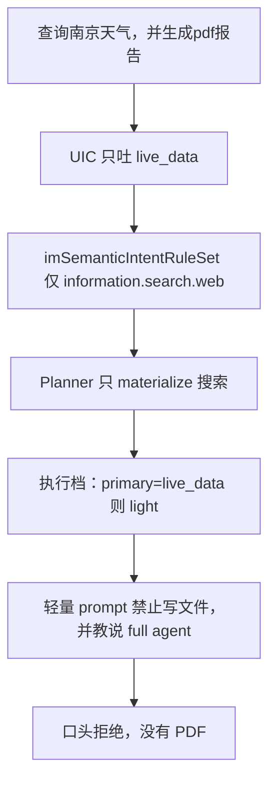
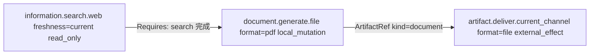

# 文档生成语义路由切片

本切片挂在 [统一语义工具路由设计](./semantic-tool-routing-design-zh.md) 下，补齐与截图 DAG 对等的**文档生成**能力。事故形态是：实时查询并生成 PDF 被压成 lookup，模型口头拒绝并让用户去改「完整代理模式」。本切片**不退回 legacy 全量工具面**。

父文档 11.1 / 11.2 已规定：`generate_pdf`、打开文件、投递已有附件是不同 capability / effect contract。宽标签 `document_delivery` 仍未迁移，本切片**不复用该标签**。

## 0. 相对初稿的修订

评审后改掉会直接做坏切片的几处，而不是只补测试：

| 严重度 | 初稿问题 | 修订后的契约 |
| --- | --- | --- |
| P0 | §4.3 允许桌面把 PDF「投影成对话卡片」绕过 deliver；§2.4.3 又禁止绕过。文件 deliver adapter 目前只给 `lansenger`。 | 会话渠道上 `document_generate` **始终**映射 generate **和** `artifact.deliver.current_channel(format=file)`，与截图的 capture+deliver 同构。桌面必须登记 receipt-aware 的 file deliver adapter；对话文件卡片是该 adapter 的效果，不是 catalog 外通道。 |
| P0 | 现有 `generate_pdf` 以 `[file_base64|…]` 把生成和投递焊在同一个 handler 里。 | 语义路径上 generate 只写 PDF、发布 `ArtifactRef`；deliver adapter 消费该 ref。禁止 generate 再发 `SendMedia` / 写 `[file_base64]`。 |
| P1 | 用用户文本「发给我」决定是否加 deliver，等于词法路由。 | 当前会话渠道一律投递。邮件、路径、指定目标仍走未迁移的 `document_delivery`，继续 fail-closed。 |
| P1 | 把「切换到完整 agent」做成 11.3 child revision。11.3 只处理动态 binding 失效。 | 新增会话级「未完成受治理任务回放」：continuation 复用上一轮**已接受**的 UIC/needs。不能把工具面升级成 27 件套。若上一轮 UIC 本身漏了 generate，回放也补不回来，用户必须重述原句。 |
| P1 | 全局放宽 secondary 的 0.20 分差，会污染大量分类。 | 只保留**跨 effect 族**的复合结果：只读 lookup 与 `local_mutation` / `external_effect` 可以同时成立。同族候选仍用现有 0.70 / 0.20。 |
| P1 | search→generate 没有 DAG 边，模型可能先写空 PDF。 | 同一计划里 lookup selection 完成后才暴露 generate；边是 `Requires: <search-selection-id>`，**不**把搜索结果伪造成 ArtifactRef。deliver 仍等 generate 的 ArtifactRef。 |
| P2 | 执行档只看 `primary=live_data`。 | 对 **Labels() 展开后的全部 need 模板**看 effect：全是只读 lookup 才 light。 |
| P2 | 未规定 fail-closed 的用户可见文案。 | 宿主只说能力目录未覆盖；禁止提到设置、完整代理模式、`/new`。 |

## 0.1 第二轮评审修订

相对上一版仍会做坏落地的契约，本轮改掉：

| 严重度 | 上一版问题 | 修订后的契约 |
| --- | --- | --- |
| P0 | 5.2 把 generic 标签（continuation / non_coding / unknown）与 unmapped 混成 fail-closed。这与 IntentLabel.IsNonCapabilityLabel 及现有测试相反：live_data+non_coding 必须仍只 materialize search。 | 只有未映射的 capability 标签才 coverage_unmet。generic 标签既不创造 need，也不作废已有 governed need。continuation 为 primary 时走 5.5 回放或现有 generic 路径，不是 tools=nil。 |
| P0 | 规则集始终要求 file deliver，但 adapter 只写「桌面」。微信/QQ 等 ChannelScope 没有 receipt-aware file provider，会把「生成 PDF」整轮 unmet。 | 本切片只为 ChannelScope `desktop`（桌面会话与 TUI，**不含** `ve_group_executor`）和 `lansenger` 发布 semantic_deliver_current_file。其它 IM 渠道保持 unmet deliver，不得用普通 FileData 绕过 catalog。 |
| P1 | 只改了 L3 的 secondaryTreeLabels。L2 在 score>=0.78 且 gap>=0.10 时自信早退，不写 Secondary。校准后更可能在 L2 就丢掉 generate。 | 跨 effect 族 runner-up（分数 >= 0.70）时：L2 不得按单标签自信早退；必须把 runner-up 写入 Secondary，或升 L3。 |
| P1 | 回放复用上一轮 RootTaskID。现实现里 RootTaskID 是 loop:+本轮 LoopContext.ID，每条用户消息通常是新 loop。混用会串 grant / artifact / receipt。 | 回放只克隆 Classification 与 Needs，在新 loop 上分配新的 RootTaskID 与 TurnID，不合并上一轮 RouteState。 |
| P1 | 用 TreeText 猜未映射标签的 effect 族，边界含糊。 | effect 族用固定表：已映射标签 = 规则集模板 effect 的并集；未映射 capability 标签保守视为非只读；generic 标签无 effect 族，不当路由 secondary 保留。 |
| P1 | 未排除工作流循环。WorkflowAgentLoop 仍靠 generate_pdf+[file_base64] 交阶段文档。UIC 一旦副标到 document_generate，再叠 coding（unmapped）会把工作流 fail-closed。 | 本切片不接管 WorkflowAgentLoop / WorkflowDocPhase。工作流保持现有 generate 路径，直到独立切片。 |
| P2 | semantic generate schema 仍可能露出工作流 phase_id。 | 语义路径从模型可写字段中去掉 phase_id。 |
## 0.2 第三轮评审修订

相对第二轮仍会做坏落地的契约：

| 严重度 | 上一版问题 | 修订后的契约 |
| --- | --- | --- |
| P0 | 跨族 secondary 把所有未映射 capability（含 `workflow_task` / `coding` / `office`）当成非只读族保留。`报告` 很容易让 L3 给天气句挂上 `workflow_task`，于是 `live_data`+unmapped → 整轮 fail-closed，比今天「至少能查天气」更差。 | 0.20 分差例外**只适用于声明过的复合对**。本切片只声明 `{search, live_data} × {document_generate}`。`workflow_task` / `coding` / `office` 仍走原 0.70/0.20；只有分差真的很近才进入 secondary，那时 fail-closed 才表示用户真的在混任务。 |
| P0 | `LabelWorkflowTask` 的 EmbedTexts/ToolNames 含研究报告和 `generate_pdf`。「生成pdf报告」可能被收成多阶段工作流确认，而不是单阶段渲染。 | `document_generate`：`MayTriggerWorkflow=false`，本切片校准句 **WorkflowType 必须为空**。TreeText 写成「把当前事实渲染成 PDF 文件」，明确排除商业计划/研报/论文。 |
| P0 | `tools=nil` 时现实现仍进 agent loop，让模型「解释 unmet」。这正是编造设置步骤的通道。 | semantic `handled=true` 且无工具面时，**宿主直接返回**能力目录错误，不调用模型。 |
| P1 | 工作流 exclusion 只写了「不接管」，但 workflow-pilot 仍走 `semanticCallSurfaceForSharedTurn`。UIC 一旦带 `document_generate`，阶段文档会丢掉 `write_file` / 工作流 `generate_pdf`。 | `WorkflowAgentLoop` / `WorkflowDocPhase` 时解析器**不展开** `LabelDocumentGenerate` 模板。截图/搜索等其它已迁移能力可仍走 semantic。 |
| P1 | `export pdf` 仍是 `document_delivery` 的 Strong 关键词；Classify 的 `MessageContext` 目前不传 `RecentHistory`。 | 生成类关键词迁到 `document_generate`。Classify / ClassifyContext 必须带上最近对话。会话状态键为 ChannelScope + userID（群聊加 destination），不是 loop ID。 |
## 0.3 第四轮评审修订

相对第三轮仍会直接做坏落地的契约：

| 严重度 | 上一版问题 | 修订后的契约 |
| --- | --- | --- |
| P0 | `semanticNeedsForTrustedDocumentInputs` 对所有 `artifact.deliver.current_channel(format=file)` 要求恰好一份入站附件。截图用 `format=image` 所以没事；天气+PDF **没有附件**，会在规划前报 `trusted_document_input_missing`，整轮 fail-closed。 | 入站附件绑定只用于 `document.read.local` 和「仅投递已给文件」的 deliver。与 `document.generate.file` 同计划的 file deliver 消费的是 generate 的 ArtifactRef，不查 MessageAttachment。同一轮同时出现 `attachment_delivery` 与 `document_generate` 本切片视为歧义，fail-closed。 |
| P0 | 「工作流跳过模板、当作标签不存在」若只改 resolver、不改 coverage：`document_generate` 仍让 `imSemanticIntentCoverage` 得到 managed=true；needs 被跳空后走 `semantic route has no governed capability needs`（handled=true），工作流阶段 PDF 被抢走且不能回落 legacy。 | 在 **coverage 之前**从本轮 Labels 去掉 `document_generate`。若去掉后不再 managed → `handled=false`，回落现有 `generate_pdf`+`[file_base64]`。 |
| P1 | 5.2 仍写 unmapped 时 `tools=nil` 交给模型解释；与 5.6 冲突。`prepareAgentLoopStartState` 今天正是这条路径。 | handled+err 在进 LLM 前由宿主结束本轮。5.2 与 5.6 对齐。 |
| P1 | Classify 在 `im_execution_profile.go` 只传 Text/UserID，semantic 面复用该 SemanticIntent。只给后一次传 RecentHistory 无效。 | 唯一一次 UIC 调用（profile 那次）就必须带 RecentHistory；continuation 回放是在调用 semantic 面之前改写 `loopCtx.Runtime.SemanticIntent`。 |
## 0.4 第五轮评审修订

相对第四轮仍会做坏落地的契约：

| 严重度 | 上一版问题 | 修订后的契约 |
| --- | --- | --- |
| P0 | `runAgentLoop` 用未过滤的 `SemanticIntent` 做 `imSemanticIntentIsManaged`。一旦 UIC 带 `document_generate`，非 pilot 的 `WorkflowAgentLoop` 也会被 **强制** 进 shared loop（今天工作流默认走 legacy）。即使 planner 后来 `handled=false`，阶段 PDF 的 `[file_base64]` / DocBuffer 路径已经离开 legacy。 | 派生一份 **routing classification**：工作流回合在 IsManaged、coverage、展开之前都去掉 `document_generate`。存盘的 UIC 原文不改。去掉后不 managed → 走原来的 legacy/pilot 选择，不因本切片改工作流环。 |
| P0 | `executePreparedIMEntry` 在 `drainHistory()` **之前** Classify。RecentHistory 再怎么写进 MessageContext 也是空的；continuation 回放的前提不成立。 | 与 `prepareIMLoopContext` 并行加载 history，**先 drain 再 Classify**。Classify 只此一次。 |
| P1 | 5.6 要求宿主结束本轮，但 `prepareAgentLoopStartState` 没有返回通道，`runAgentLoopShared` 会无条件 `RunLoopWithUserContent`。 | `agentLoopStartState` 增加 `HostReject *IMAgentResponse`；shared/legacy 在第一次 LLM 之前若非空则直接返回。 |
| P1 | `office` 已 annotate 为 `document.write.office(format=spreadsheet)`。若再给 `office` 挂 `document.generate.file`，planner 可能选中合并 office（仍 `[file_base64]`）。 | **只** annotate 别名工具 `generate_pdf`。禁止把 PDF generate 加进 `office` 的 provision。 |
## 0.5 第六轮评审修订

相对第五轮仍会做坏落地的契约。0.2 / 0.4 里「工作流只从 Labels 去掉 `document_generate`、其它已迁移能力继续 semantic」**废止**，改由本表第一行取代。

| 严重度 | 上一版问题 | 修订后的契约 |
| --- | --- | --- |
| P0 | 只从 Labels 抠掉 `document_generate` 后，若还剩 `live_data` / `search` / `screenshot`，`imSemanticIntentIsManaged` 仍为真，dispatcher 强制 shared。工作流阶段 steering 仍要求 `generate_pdf`，但 semantic 面没有这件工具，比今天的 legacy 工作流更差。天气+PDF 若碰巧落在 `WorkflowAgentLoop` 上，同样只有搜索没有 PDF。 | **`WorkflowAgentLoop` 且本轮 Labels 含 `document_generate` → 整轮不 managed**（IsManaged=false，不跑 coverage / 不展开 needs）。环选择与今天一致，阶段 PDF 仍走 `generate_pdf`+`[file_base64]`。不要派生「去掉该标签后仍 managed」的 routing classification。无 `document_generate` 的工作流回合（例如纯 `workflow_task`）保持现状，本切片不改。 |
| P0 | ChannelScope `desktop` 含 `ve_group_executor`。semantic 面绕过 `prepareAgentLoopTools`，也就绕过 `veBlockedTools`（其中明确禁止 `generate_pdf` / `send_file`）。按「桌面=含 VE」发布 generate+file deliver，等于给数字员工开一条本地写文件通道。 | 本切片为 **desktop 会话与 TUI**、以及 **lansenger** 发布 generate + file deliver。`ve_group_executor` **不**发布这两项；UIC 若带到 `document_generate`，按 unmet 走 5.6 HostReject。不改 `veBlockedTools`。 |
| P1 | `SessionGovernedTask` 若存 UIC 原文，工作流整轮 legacy 之后，「继续」可能按 `document_generate` 回放进 semantic。 | 只持久化 **实际 granted** 的 needs（planner 已发布的那份）。legacy 工作流回合不写入 `document_generate` 的 SessionGovernedTask。 |
| P1 | `generate_pdf` 的 legacy 文案是「生成并发送给用户」。semantic schema 若不改，模型会以为 generate 已经投递，不再调 deliver。 | semantic 模型可见描述改为「渲染并发布 ArtifactRef，不投递」。投递只经 `semantic_deliver_current_file`。 |
## 0.6 第七轮评审修订

相对第六轮仍会做坏落地的契约：

| 严重度 | 上一版问题 | 修订后的契约 |
| --- | --- | --- |
| P0 | 0.5 只强调 dispatcher 的 IsManaged。`prepareAgentLoopStartState` **shared 与 legacy 都会调用**，并无条件跑 `semanticCallSurfaceForSharedTurn`。只把 dispatcher 改成不 managed，planner 仍会按 UIC 里的 `document_generate` 给出 handled=true，把工作流工具面换成 semantic，阶段 PDF 一样丢。 | 工作流闸门做成 **一个** helper（例如 `imSemanticIntentIsManagedForLoop(ctx, result)`）：`WorkflowAgentLoop` 且 Labels 含 `document_generate` → false。**dispatcher 与 `semanticPlanForTurn` 入口共用**。planner 必须 `handled=false`，startState 才能落到 `prepareAgentLoopTools`。禁止只改其中一处。 |
| P0 | 5.2 把执行档改成 full 之后，`buildIMEntrySystemPrompt` 在 `memoryStore==nil` 时仍对短句跑 `ResolvePromptProfile`，把 `PromptProfile` **写回 light**。事故句只有 15 字。light prompt 会再次禁止写文件并让模型口头拒 PDF；`IsToolAllowedForPromptProfile` 也会拒绝 `local_mutation` grant。light→full 升级保留原 plan，但模型可能根本不调 generate。 | 展开 needs 含 `local_mutation` / `external_effect`（含 generate+deliver）时：**Layer 与 PromptProfile 都钉在 full**。`ResolvePromptProfile` / env 以外的自适应 light **不得覆盖**。删除 light 说辞仍只作用于真正的只读 lookup 回合。 |
| P1 | `IsDesktop()` 与 ChannelScope `desktop` 都包含 `ve_group_executor`。用二者当 file deliver 发布条件会把 VE 当成桌面。 | 发布 generate / file deliver 只用 `normalizeIMMessagePlatformKind` 白名单：`desktop`、`tui`、`lansenger`（含 `*_local`）。禁止 `IsDesktop()`、禁止只判断 ChannelScope。 |
| P1 | HostReject 若只接到 `runAgentLoopShared`，legacy 主迭代仍会带着 `tools=nil` 进 LLM。 | dispatcher 在 shared / legacy **分叉之后、第一次 LLM 之前**都读 `startState.HostReject`。 |

## 1. 决策摘要

2026-08-16 桌面「查询南京天气，并生成pdf报告」被判成纯 `live_data`，只 materialize `information.search.web`，执行档 light；模型在禁止写文件的短 prompt 里口头拒绝。用户再说「切换到完整agent模式」时 UIC 为 `unknown`，退回 unmanaged full（27 个工具），模型去编不存在的产品设置，仍未生成 PDF。

这不是「默认残废工具」能概括的，而是**语义路由**四条断点：

1. UIC 只吐 `live_data`，没有文档生成副标签。
2. 规则集没有 `document.generate.*`；`document_delivery` 仍未映射，一旦成为混合标签就 `coverage_unmet` 且 `tools=nil`。
3. 执行档见 `primary=live_data` 就 light，忽略 secondary 与 write effect。
4. 轻量 prompt 教模型说「需要 full agent」；`light→full` 只扩 prompt / 预算，不改不可变计划，更不恢复 legacy 工具档。

目标形态与截图切片同一条链：**窄标签 → 独立 needs → catalog provision → planner DAG → opaque grant → 宿主按契约投递**。

| 用户说 | UIC | CapabilityNeed | 执行档 |
| --- | --- | --- | --- |
| 南京天气 | `live_data` | `information.search.web(freshness=current)` | light，只读 |
| 查询南京天气，并生成pdf报告 | `live_data` + `document_generate` | search.web(current)、`document.generate.file(format=pdf)`、`artifact.deliver.current_channel(format=file)` | full（含 `local_mutation` + `external_effect`） |
| 生成pdf报告 | `document_generate` | generate **和** 当前渠道 file deliver | full |

模型只看见 opaque 授权面。查找结果以工具返回文本进入上下文；模型把 Markdown 写入 generate 的 `content`。PDF 只作为 `ArtifactRef` 存在。当前渠道投递走 deliver 契约，回执独立审计。产品里没有「完整代理模式」开关或设置路径。

## 2. 范围、目标与非目标

### 2.1 范围

- 入口：桌面 AI 对话（ChannelScope `desktop`），以及共用 UIC / shared agent loop 的 IM 入口。
- 本切片落地的 file deliver adapter：**仅** `desktop` 与 `lansenger`。其它 IM 渠道识别 need，但 catalog 未发布 file adapter 时 unmet deliver。
- 产物：只授权一种文档产物，qualifier 固定 `format=pdf`。
- 复合：实时查询（`live_data` / `search`）与文档生成同时成立。
- 事故收口：用户在被拒绝后说「切换到完整 agent 模式」一类短句。
- **排除**：`WorkflowAgentLoop` 且 Labels 含 `document_generate` → 整轮不 managed，不把工作流 PDF 留在只有 search/screenshot 的 semantic 面上。阶段 PDF 仍走 `[file_base64]`。
### 2.2 目标

1. 「查 X 并生成 PDF」在同一会话完成查找、撰写、生成、投递，不要求用户改模式。
2. 路由只产生 `CapabilityNeed`，不按 `generate_pdf` / `write_file` / `office` 做意图 rewrite 或工具钉选。
3. `ToolPlanner` 是唯一 selection 决策点；生成与投递的分离与截图切片一致。
4. 纯查询仍走轻量档（省 token）；不把默认改成每轮 full。
5. `document_delivery` 在独立迁移前保持 unmapped fail-closed，防止只 materialize 已迁移的 search 子集。

### 2.3 非目标

1. 不新增用户 UI 开关「专业模式 / 完整代理」。那是把故障位错放到产品层。
2. 不把 `write_file`、`bash` 或整个 `office` 挂到 `live_data` 轻量面。
3. 不把 unmapped fail-closed 改成默认 hybrid / 27 件套兜底。
4. 不在本切片迁移 Excel 写入、PPT、打开本地路径、邮件或指定目标投递。
5. 不把搜索结果伪造成 ArtifactRef。当前 web search 只返回模型可见文本；`content` 由模型撰写。
6. 不从用户文本解析 `format=`（word/xlsx/md）。非 PDF 生成仍未迁移。
7. 不接管 WorkflowAgentLoop / WorkflowDocPhase 的阶段 PDF。
8. 不在未发布 file adapter 的 IM 渠道用 FileData 偷送 PDF；也不把 `ve_group_executor` 当 desktop 发布 generate / file deliver。
9. 不在同一轮同时完成「发回已给附件」和「新生成 PDF」（attachment_delivery 与 document_generate 冲突）。

### 2.4 继承不变量

父文档 2.3 全部适用。本切片额外强调：

1. **禁止子集降级**：同一轮同时出现已迁移和未映射的有效 intent label 时，整轮 `coverage_unmet`，不得只留 search。
2. **失败不扩权**：`light→full` 与 prompt 升级只调整 prompt / 循环预算，不得解开计划去恢复 legacy 工具档。缺少 generate 必须在**下一轮 Plan** 的 needs 里出现。
3. **生成不等于投递**：`document.generate.file` 产出 document artifact；送到当前渠道是 `artifact.deliver.current_channel`。宿主不得在 generate 成功后把字节注入响应来绕过 deliver。
4. **continuation 不推断新工具**：回放只复用已接受的 UIC 标签、needs、`RootTaskID`，不从「切换模式」这句话推断工具。
5. **effect 必须诚实**：generate 不得隐藏投递副作用；deliver 不得隐藏文件写入。

## 3. 事故与断点

证据在 `~/.maclaw/logs/maclaw.log` 与 `~/.maclaw/trajectories/2026-08-16_10-12-45.024_chat_18cc274d4779e398.json`。

### 3.1 第一轮：查询被压成唯一义务

| 观察 | 记录 |
| --- | --- |
| 用户文本 | `查询南京天气，并生成pdf报告`（15 字，未过 40 字结构满档门槛） |
| UIC | Layer 2 模糊后 L3：`primary=live_data conf=0.92`，无 Secondary |
| 执行档 | `layer=light task=live_data reason="semantic capability-managed lookup"`，`effectiveMax=3` |
| 工具面 | `tools=1`（仅搜索）；semantic managed 覆盖 legacy strangler |
| Prompt | `prompt_len=2307`，含「需要文件就说 full agent」 |
| 轨迹 | `web_search` 成功，`finish_reason=stop`，口头拒绝 PDF |
| 未发生 | `light→full`（模型未调用被拒工具） |

同日 06:34「查询 北京天气，生成pdf结果」同一断点。

### 3.2 第二轮：unmanaged full 且未执行原任务

| 观察 | 记录 |
| --- | --- |
| 用户文本 | `切换到完整agent模式` |
| UIC | `primary=unknown conf=0.90`（`continuation` 为 generic，无 capability 义务） |
| 执行档 | `layer=full reason="semantic intent requires full agent"`，`tools=27` |
| Prompt | `prompt_len=41260` |
| 行为 | 模型编造设置步骤；未回放第一轮 generate need |

`LabelContinuation` / `LabelUnknown` 走 unmanaged full，正是第二轮 27 件套的来源。回放机制必须在进入 unmanaged 工具面**之前**截住这类短句。

### 3.3 误路上的断点



对应代码位置：

| 层 | 位置 | 故障 |
| --- | --- | --- |
| UIC | `corelib/intent/classifier.go` 的 `secondaryTreeLabels`；`tree.go` 同域互斥提示 | 复合结果被压成单标签；副标签分差超过 0.20 被丢 |
| 语义 | `corelib/intent/definitions.go` 里 `LabelNonCoding` EmbedTexts 含「生成PDF报告」 | 生成被训练成 lookup 的近邻 |
| 覆盖 | `gui/semantic_tool_routing.go` 的 `imSemanticIntentCoverage` | 无 generate 规则；`document_delivery` unmapped |
| 规划 | `semanticPlanForTurn*`：unmapped 时 `handled=true` + error + `tools=nil` | 正确副标签若未映射会比漏标更糟 |
| 执行档 | `gui/im_execution_profile.go` 的 `executionProfileFromSemanticIntent` | 只看 primary 是否 search/live_data |
| 选择安全 | `tool.IsLightPromptSafeSelection` | `local_mutation` 本就不能进 light；档位必须在进循环前对齐 |
| Prompt | `gui/im_system_prompt.go` 的 `buildLightIMSystemPrompt` | 把产品模式教给用户 |
| 升级 | `UpgradeLightPromptToFull` + semantic surface | 计划不可变，升 full 仍是 1 个搜索工具 |
| 投递 | `gui/semantic_tool_routing.go` 仅 `lansenger` 发布 file deliver | 桌面即使 generate 成功也会 unmet deliver |
| Handler | `gui/im_tools_misc.go` 的 `toolGeneratePDF` | `[file_base64]` 把投递焊进生成 |

### 3.4 与截图切片的差距

截图已证明正确形态：窄标签 → 两个独立 need → catalog provision → DAG → opaque grant → 渠道回执。文档生成缺的是：

- 窄标签，而不是 `document_delivery`
- `document.generate.file` 以及 `generate_pdf` provision
- 桌面 file deliver adapter（截图的 image deliver 已对桌面发布）
- UIC 保留跨 effect 族复合标签
- 执行档按 **need 模板的 effect** 决定 light，而不是按 primary 名称
- generate handler 不再私自投递

## 4. 目标形态

### 4.1 能力契约

在 IM semantic registry（`newIMSemanticCapabilityRegistry`）登记：

```text
ID:        document.generate.file
Version:   v1
Owner:     im
Qualifier: format 允许 pdf / markdown / word / spreadsheet / presentation；
           本切片只实现 pdf，且 Required。
Effects:   local_mutation
Produces:  ArtifactContract kind=document mime=application/pdf
Consumes:  无（本切片不把 web search 结果当成 ArtifactRef）
```

`format` 约束写在 descriptor schema 与注册里。本切片规则集写死 `format=pdf`，与截图规则集写死 `display=primary` 相同。Word/Excel/PPT 另开切片；禁止本切片从用户句子解析 qualifier。

`artifact.deliver.current_channel` 已存在，qualifier `format=file` 已登记。本切片不新造投递 capability。

### 4.2 意图标签

新增 `intent.LabelDocumentGenerate`（`document_generate`）。`MayTriggerWorkflow=false`。本切片校准句的 `WorkflowType` 必须为空，以免走进研究报告/商业计划确认门。

| 对比项 | `document_generate` | `workflow_task` | `document_delivery`（仍未迁移） | `attachment_delivery` | `document_read` | `office` |
| --- | --- | --- | --- | --- | --- | --- |
| 含义 | 把当前对话里已有或即将查找的事实**单阶段渲染**成文件 | 需要多阶段设计决策的文稿（研报、BP、论文、标书） | 打开路径 / 导出到指定目标 / 发送已有文件 | 投递本轮唯一已给附件 | 只读已授权附件 | PPT/表格创作 |
| 本切片 | 映射 generate+当前渠道 file deliver | 不映射；不得当天气+PDF 的 secondary | 保持 unmapped fail-closed | 不复用 | 不复用 | 不复用 |

TreeText 要点：用户目标是「生成一份 PDF 文件」而不是「启动一个要立项、大纲、多轮修订的写作项目」。`查询南京天气，并生成pdf报告` 不是 `research_report`。

「生成一份PDF文档并发给我」必须从 `document_delivery` / `non_coding` EmbedTexts **挪到** `document_generate`。`keyword_registry` 里的 `export pdf` 从 `document_delivery` 改挂 `document_generate`；不要用光秃的「报告」当 Strong 证据。投递已有附件仍是 `attachment_delivery`。打开桌面路径仍是 `document_delivery`。

`document_generate` 放在「内容处理」域。`live_data` 在不同域，复合请求应同时保留两标签。同域互斥（generate vs 打开已有文件；generate vs `workflow_task`）仍然适用。
### 4.3 规则集

`imSemanticIntentRuleSet` 增加：

```text
LabelDocumentGenerate:
  - capability: document.generate.file
    qualifiers: format=pdf
    required: true
  - capability: artifact.deliver.current_channel
    qualifiers: format=file
    required: true
```

与 `LabelScreenshot` 同构：产出义务和当前渠道投递义务都是标签的稳定结果，不随「发给我」出现与否而增减。capability 字符串可以与 `attachment_delivery` 的 file deliver 相同，但 **consume 来源不同**（计划产物 vs 入站附件），见 4.4。

`WorkflowAgentLoop` 且 Labels 含 `document_generate` 时：helper `imSemanticIntentIsManagedForLoop` 返回 false。**dispatcher 与 `semanticPlanForTurn` 共用该 helper**（`prepareAgentLoopStartState` 两条环都会进 planner）。planner 必须 `handled=false`，才不会在 legacy 环上仍换成 semantic 工具面。不跑 coverage、不展开 needs。`Runtime.SemanticIntent` 仍存 UIC 原文。环选择与今天一致，阶段 PDF 仍走 `generate_pdf`+`[file_base64]`。无 `document_generate` 的工作流回合不因本切片改环。

`ve_group_executor`：发布条件用 platform 白名单，不用 `IsDesktop()` / ChannelScope。不把 generate / file deliver 放进 catalog。UIC 含 `document_generate` 时 file deliver 与微信一样 unmet，走 5.6 HostReject（禁止只 materialize search，也禁止只 grant generate）。

同一轮 Labels 同时含 `attachment_delivery` 与 `document_generate`：本切片视为歧义的 file deliver 义务，fail-closed（宿主错误），不要把入站附件和刚生成的 PDF 绑到同一个 deliver need 上。

用户若要求发到邮箱、磁盘路径、另一会话或指定联系人：UIC 应出现 `document_delivery`。只要该标签仍 unmapped，整轮 fail-closed，不得只完成当前渠道 PDF。
### 4.4 复合计划与阶段

`IntentLabelCapabilityNeedResolver` 已按 `Labels()`（primary + secondary）展开全部模板。UIC 一旦同时给出两标签，完整计划为：



查找不产生 ArtifactRef，因此 **禁止** 伪造成 search → pdf 的 artifact 边。真实数据面是：lookup 文本 → 模型撰写 `content` → generate producer。`content` 是 generate 的模型可写字段，不是图上的独立节点。

lookup → generate 的边是 **capability 级 `after` 规则**，不是临时词法，也不是假 ArtifactRef：同一 `RouteRequest` 中若同时存在 `information.search.*` / `information.current_time` 与 `document.generate.file`，planner 把全部 lookup selection id 写入 generate 的 `Requires`。`attachArtifactDependencies` 只处理 consume/produce；这条 `after` 是额外的 selection 完成依赖。

暴露面按已有「完整计划 vs 当前可执行最小充分 selection」执行：

1. 若存在 lookup need：先只暴露 lookup selection。
2. lookup selection 成功后，才把 generate 纳入暴露面。
3. generate 发布 `ArtifactRef` 后，deliver 进入 `PlanPhaseDelivery`（现有 `planPhaseForCapability` 已按 `artifact.deliver.*` 划分）。

纯生成（无 search/live_data）：跳过第 1 步，直接暴露 generate；deliver 仍等 ArtifactRef。

同一会话若已有相同主题的可信 lookup 事实（上一轮 web_search 成功体、或同主题助手实质报告），本轮不再展开 lookup need。after 边因此不出现，首轮直接暴露 generate。用户明确要求重新查询（重新查/最新/上网搜）或换了主题时仍走 lookup→generate。这不是 continuation 回放：succeeded 的 generate 计划仍不回放；这是新计划里「事实已在」所以不再欠一次搜索。

`semanticNeedsForTrustedDocumentInputs` 今天对所有 `format=file` 的 deliver 要求恰好一份入站附件。那是 `attachment_delivery` 的契约，不能套在 generate 上。

绑定规则改为：

| Need | 入站附件 |
| --- | --- |
| `document.read.local` | 必须恰好一份 trusted ingress |
| `artifact.deliver.current_channel(format=file)` 且本轮 needs **没有** `document.generate.file` | 必须恰好一份 trusted ingress（现有附件投递） |
| 同上，且本轮 needs **有** `document.generate.file` | **不**查 MessageAttachment；deliver 只消费 generate 发布的 ArtifactRef |
| `artifact.deliver.current_channel(format=image)` | 不走该绑定（截图已如此） |


若只迁移 search、未迁移 generate：`Managed=true` 且 unmapped → fail-closed，**禁止只查天气**。两者都迁移后：`Managed=true`，needs 含 lookup（若有）+ generate + deliver，禁止静默 hybrid 扩权。
### 4.5 generate provider 与 handler 拆分

按 `screenshot` 的 `annotateSemanticTool`。**只**标注别名 `generate_pdf`，不要给已标注 `document.write.office(format=spreadsheet)` 的 `office` 再挂 PDF provision，以免 FitProof 选中仍返回 `[file_base64]` 的合并工具：

| 项 | 值 |
| --- | --- |
| Provider | 内置 `generate_pdf`（内部仍可转到 `office(action=generate_pdf)` 的渲染实现）。semantic 描述去掉「并发送给用户」，改为发布 ArtifactRef、不投递。 |
| CapabilityProvisions | `document.generate.file` + `format=pdf` |
| SemanticEffects | **仅** `local_mutation` |
| ModelWritable | `content`（必填）、`title`（可选）、现有 `doc_type` 枚举（可选，只影响文件名前缀）。**不含** 工作流 `phase_id` |
| 禁止模型写 | 本地路径、channel、artifact id、MIME、destination、base64 |
| Produces | document / `application/pdf` |
| 成功返回给模型 | 文件名、字节大小、artifact 已发布；**不含** `[file_base64|…]`、路径、原始字节 |

现有 `toolGeneratePDF` 在语义路径上必须改为：渲染 PDF → 写入受控工作区 → `ArtifactStore` 发布 → 返回元数据。`[file_base64]` 只保留给**未进入 semantic plan** 的 legacy 调用，直至 office 切片迁移；semantic grant 不得走该标记。

内容大小、段落上限、file-payload marker 拒绝：沿用现有 `TestToolGeneratePDFValidation_*`。`local_mutation` 走 operation ledger / 幂等键，避免重试写两份 PDF。

禁止把整个 `office` 挂到 `document.generate.file`。Excel 写入保持现有 spreadsheet provision。legacy `office(action=generate_pdf)` 仅作 `generate_pdf` handler 的内部渲染实现，不出现在 semantic catalog。unmanaged 路径可暂留 office，**不得**作为本切片 managed 面的后备写通道。

### 4.6 桌面与蓝信的 file deliver adapter

`semantic_deliver_current_file` 今天只在 `semanticChannelScope(channel)=="lansenger"` 时发布。`imMessagePlatformKind.ChannelScope` 里桌面 / TUI / `ve_group_executor` 的 scope 都是 `desktop`。本切片按 **ChannelScope + 运行时 platform** 发布：desktop 会话与 TUI、以及 lansenger 发布 file deliver；`ve_group_executor` 即使 scope 是 desktop 也不发布 generate / file deliver（semantic 面会绕过 `veBlockedTools`）。

| 项 | 值 |
| --- | --- |
| Adapter | `semantic_deliver_current_file`（同一实现；`ChannelScopes` 为 `desktop` 与 `lansenger`；`ProviderID` 绑定当前 scope）。发布条件：platform 为 desktop / tui / lansenger（含 `*_local`），**不含** `ve_group_executor`。 |
| Capability | `artifact.deliver.current_channel` + `format=file` |
| Consumes | `ArtifactContract kind=document`（Required） |
| Effects | `external_effect` |
| Model schema | 空对象；与现有文件投递相同 |
| 桌面效果 | 对话文件卡片 / 附件窗口 |
| 回执 | 认领 dispatch 后：桌面用「会话消息 ID + artifact IntegrityDigest」作为 receipt digest，记 `DeliveryAccepted`；蓝信保持现有 media id 回执。解码失败 `failed`；发送后不确定 `unknown`；禁止自动重投 |

「普通 FileData 能发」不能成为绕过 catalog 的理由。微信 / QQ / 飞书 / Telegram 等本切片不发布 file adapter：带 `document_generate` 的请求必须 unmet deliver，而不是 generate 成功后偷偷塞附件。

因此 **registry、generate provision、`desktop`+`lansenger` file adapter、规则集必须同一落地批次**。只登记 generate 会导致桌面「天气+PDF」整轮 fail-closed。
## 5. 分层改造

### 5.1 UIC：跨 effect 族保留 Secondary

事故里 L3 为 `tree-after-embedding: live_data (0.920)`，Secondary 为空。三条现有机制会丢掉第二义务：

1. **L2 自信早退**（`classifyByEmbedding`：top ≥ 0.78 且 gap ≥ 0.10）直接返回，Secondary 为空，根本不走 L3 / `secondaryTreeLabels`。
2. `BuildIntentTreeText` 同域标签追问 mutually exclusive / pick the single best match。`live_data` 与 `document_generate` 不在同域，提示不得训练成「整句只选一个」。
3. `secondaryTreeLabels`：副标签分数低于 0.70，或与第一名分差大于 0.20 则丢弃。`live_data=0.92` 时，`document_generate=0.71` 也会被丢。

本切片只做**有界提取**。上一版「凡非只读族都放宽分差」会把 `workflow_task` 拖进天气句，导致 coverage_unmet。改为**声明复合对**：

本切片声明的复合对：`{search, live_data} × {document_generate}`。

1. **L2 与 L3 使用同一套规则。** 仅当 runner-up 属于上述复合对、且分数 ≥ 0.70 时，禁止 L2 单标签自信早退：写入 Secondary（可仍跳过 L3），或升 L3。
2. 树指令：复合请求可同时保留 lookup 标签与 `document_generate`。同域互斥仍取最高分（新生成 PDF vs 打开已有 PDF vs 多阶段 `workflow_task`）。
3. 不在复合对里的标签（`workflow_task`、`coding`、`office`、`document_delivery`、`ssh`…）**继续**用 0.70 / 0.20。它们若因分差很近成为 secondary，按现有 coverage：已映射则展开，未映射则 fail-closed。
4. `IsNonCapabilityLabel` 无 effect 义务，不因分差规则被保留成路由 need。
5. 校准失败句：`查询南京天气，并生成pdf报告` → primary=`live_data`，secondary=`document_generate`，**无** `workflow_task`，**WorkflowType 为空**。同类：`查询北京天气，生成pdf结果`。L2 与 L3 都要过。对照句：`帮我写一份研究报告` 仍是 `workflow_task`，不走本切片。
6. 从 `LabelNonCoding` EmbedTexts 移除「生成PDF报告」；从 `LabelDocumentDelivery` 移除「生成一份PDF文档并发给我」/ `generate a PDF and send it over`；`export pdf` 改挂 `document_generate`。
7. `ToolNames` / Tool Affinity **不要**把 `generate_pdf` 加进 live_data。选择仍只经 `IntentLabelCapabilityNeedResolver`。
8. **Strong 召回附属**（与 `BrowserPublicationAffordance` 同构）：primary 已是 `{search, live_data}`，且文本命中 `生成pdf` / `generate pdf` / `export pdf` 时，可把 `document_generate` **追加**为 secondary。不得改 primary，不得钉选工具名，不得因「报告」两个字追加。

Classify 只应发生一次，且在 `classifyIMExecutionProfileAndSemanticContext`。今天 `executePreparedIMEntry` 在 `drainHistory()` **之前** Classify，RecentHistory 实际为空。应与 `prepareIMLoopContext` 并行加载 history，**先 drain 再 Classify**，并把最近若干轮 user/assistant 原文传入 `MessageContext.RecentHistory`。semantic 面只复用 `loopCtx.Runtime.SemanticIntent`。
### 5.2 执行档：按展开后的 need effect 决定 light

删除「primary 是 search/live_data 就 light」。改为在 coverage 判定之后、进循环之前：

| 条件 | 执行档 |
| --- | --- |
| managed、无 unmapped capability 标签，且 Labels() 展开的全部 required 模板 effect 均为只读 lookup（`current_time`、`search.web`、`live_data`） | 维持 light：轻量 prompt，工具预算 8，迭代 3 |
| 任一模板为 `local_mutation` 或 `external_effect` | full prompt 与预算；不得把迭代下限压到无法跑完 search→generate→deliver（至少 3 次工具调用） |
| managed，且存在未映射的 **capability** 标签（如 `document_delivery`、`office`、`coding`） | 整轮 `coverage_unmet`：按 5.6 **宿主直接回复**，不进 LLM，不得只 materialize search，也不得打开 27 件套 |
| managed，仅额外带 generic 标签（`non_coding` / `continuation` / `unknown` / `ambiguous`） | **忽略 generic**，按其余 governed 模板决定 light/full。与现有 `IsNonCapabilityLabel` 测试一致 |
| primary 为 generic（无 governed 标签） | 不走本切片 catalog。若符合 5.5 回放则回放；否则保持现有 unmanaged 工具面。不得把「切换完整代理」解释成设置步骤 |

`IsLightPromptSafeSelection` 已按 effect / 确认做同样判断。执行档必须在进循环前对齐。`buildIMEntrySystemPrompt` 的 `ResolvePromptProfile` **不得**在 mutation/external needs 已展开后把 PromptProfile 写回 light；否则 light 文案会再次让模型口头拒 PDF，且 `IsToolAllowedForPromptProfile` 会拒绝 generate grant。

计算依据是规则集模板，而不是已经 materialize 的 selection：避免「先按 primary 选 light、再规划 generate」的循环依赖。
### 5.3 计划暴露与 light→full

语义 `light→full` 保持现状：只升级 prompt / 预算，计划不可变。因此 generate 必须在**首轮 Plan** 的 needs 里。靠模型去调被拒工具来触发升级，对本事故无效（模型选择了口头拒绝）。

实现 `Requires: <lookup-selection-id>` 后，CatalogRenderer 只能渲染当前可执行 selection。不得为了「让模型一次看完」而提前暴露 generate/deliver。

### 5.4 轻量 prompt

`buildLightIMSystemPrompt` 在纯查找回合改为：

- 删除 “If the user request turns out to require … say briefly that the full agent path is needed”。
- 禁止向用户提到设置、完整代理模式、`/new`。
- 查找回合只回答查到的事实。若用户后续要文件，等待新一轮 UIC；不要在本轮承诺稍后生成。

自适应 light 只允许打在「展开模板全是只读 lookup」的回合上。天气+PDF 被 5.2 定为 full 后，禁止再被短句启发式打回 light。残留风险：若 UIC 仍漏掉 generate，模型会只报天气。这只能靠 5.1 的校准，不能靠词法扫描用户句子补钉工具。

### 5.5 Continuation：会话回放，不是 11.3

父文档 11.3 只允许在 `dynamic_binding_stale` 等确定性 binding 失败时发一个 child revision。用户说「切换模式」**不是**该机制。

会话状态键：`semanticChannelScope + userID`；蓝信/QQ 群再加 destination / group id。**不是** LoopContext.ID。`/new` 或会话结束即丢弃。

```text
SessionGovernedTask {
  Classification               # 上一轮宿主已接受的 UIC
  Needs                        # 已展开的 capability needs
  Status                       # pending | succeeded | failed_unmet | failed_exec
}
```

`succeeded` 对纯 lookup 表示查找回合正常结束；对 generate 计划表示 generate 已发布且 deliver 已 `DeliveryAccepted`。不要保存上一轮 RootTaskID：`semanticRoutingIdentity` 使用 `loop:`+本轮 loop ID，跨消息复用会串计划。

回放顺序：先用带 RecentHistory 的 UIC 得到 `continuation` → 若命中 SessionGovernedTask，把保存的 Classification 写入 `loopCtx.Runtime.SemanticIntent` → 再进 `semanticCallSurfaceForSharedTurn*`（它已经读 loop 上的 SemanticIntent）。不要在 surface 内部根据短句重分类。在进 unmanaged 工具面之前：

| 短句（UIC 判为 `continuation`） | 宿主行为 |
| --- | --- |
| 上一轮 **granted** needs 含 `local_mutation` / `external_effect`，且 Status ≠ `succeeded` | 新 loop、新 RootTaskID、新 TurnID，把上一轮 planner 已发布的 Classification/Needs 作为 `supplied` 喂给 `semanticPlanForTurnWithClassification`。不从短句重推断，不合并旧 RouteState。legacy 工作流回合不写入这份状态。 |
| 上一轮是纯 lookup 且已 `succeeded` | **不回放**。不得补生成 PDF，不得打开 27 件套。可说明上一轮只完成了查询；若还要 PDF，请重述完整请求。 |
| 上一轮 generate 计划已 `succeeded` | 不回放生成，不当作「再做一份 PDF」。按普通 continuation 处理。 |
| 没有可回放的 governed 计划 | 保持现有 generic continuation；**仍禁止**把「切换完整代理模式」解释成产品设置步骤。 |

将「切换到完整模式 / switch to full agent / 用完整能力再做一次」加入 `LabelContinuation` EmbedTexts。不要在 router 里对这几个词做工具钉选。

回放不是 11.3：不替换动态 binding，不放宽 grant，不改变 needs。若回放时 catalog 仍 unmet，走 5.6 宿主错误，不进模型。
### 5.6 Fail-closed：宿主直接回复，不进 agent loop

现实现里 semantic `handled=true` 且 plan 失败会把 `tools=nil` 交给模型「解释 unmet」。事故第二轮已经证明：模型会编造设置步骤。

因此：

- `semanticCallSurfaceForSharedTurn*` 返回 `handled=true` 且 `err != nil` 时：`prepareAgentLoopStartState` 写入 `HostReject *IMAgentResponse`（文案见下），`tools` 保持空。dispatcher 在 shared 与 legacy **分叉之后**立刻读 `startState.HostReject`：非空则直接返回，禁止进入 `RunLoopWithUserContent` 或 legacy 主迭代。禁止只把 `tools=nil` 丢给模型。
- 宿主把错误投影成一条助手消息后结束本轮。
- 文案只描述能力目录，例如：当前不能按指定目标/路径投递；当前渠道不能投递文件产物；当前能力目录无法完成该文档生成。
- 禁止出现：设置、Agent Mode、完整代理路径、`/new`、让用户改模式。
## 6. 明确不做什么

1. 不把 `document_delivery` 提前映射进 catalog。
2. 不把 `write_file` / `bash` / `craft_tool` 当作 generate 的 FitProof 实现。
3. 不新增用户可见的 Agent Mode。
4. 不在选不中 pdf 时把 `handled=false` 退回 legacy 全量工具档。
5. 不在本切片迁移 Office 全家。
6. 不靠 light 升级路径解开 semantic 计划。
7. 不让 generate handler 在 semantic 路径写 `[file_base64]` 或调用渠道发送。
8. 不把搜索结果登记为 document ArtifactRef。
9. 不把 11.3 child revision 用于模式切换短句。
10. 不接管工作流阶段文档的 generate_pdf 路径。
11. 不把微信等未发布 file adapter 的 FileData 通道当作本切片投递实现。
12. 不在同一轮同时支持 `attachment_delivery` 与 `document_generate`（入站文件 vs 新生成文件的 deliver 会冲突）。

## 7. 验收

以下用自然语言原句，不靠字数超过 40 字结构满档来掩盖本切片。

| 编号 | 输入 | 期望 |
| --- | --- | --- |
| 1 | `南京天气` | UIC=`live_data`；need 仅 search.web(current)；light；口头回复；无 PDF、无「完整代理模式」 |
| 2 | `查询南京天气，并生成pdf报告` | UIC=`live_data`+`document_generate`；needs=3（search、generate、deliver）；plan 含 generate provider 与当前渠道 file deliver；full；同一轮产出 PDF ArtifactRef 且 deliver 回执成功；回复无「完整代理模式」。L2 与 L3 都不得丢掉 secondary |
| 3 | `查询北京天气，生成pdf结果` | 与 2 同一路径 |
| 4 | `生成pdf报告` | UIC=`document_generate`；无 search need；generate→deliver；full |
| 5 | `现在几点` | 仍 `current_time` / direct 或 light lookup |
| 6 | `search` + `document_delivery` 混合（例如查天气并把 PDF 发到指定邮箱/路径） | 整轮 unmapped fail-closed；不得只查天气 |
| 6b | `live_data` + generic `non_coding` secondary | 仍只 materialize search；light；不得 fail-closed |
| 6c | 微信等非 `desktop`/`lansenger` 渠道「生成pdf报告」 | UIC 可判 `document_generate`；file deliver unmet；不得用 FileData 偷送 |
| 6d | `WorkflowAgentLoop` 阶段文档要求 generate_pdf | 不走本切片；保持现有 `[file_base64]` 路径 |
| 7 | 先说 2 且失败，再说 `切换到完整agent模式` | continuation 在新 loop 克隆第 2 轮 Classification/Needs 并完成 PDF；不编设置；不打开 27 件套；不复用旧 RootTaskID |
| 8 | 先说 1 成功，再说 `切换到完整agent模式` | 不补生成 PDF，不打开 27 件套补救；可请用户重述若仍要文件 |
| 9 | 轨迹 | opaque 调用：search（若有）然后 generate 然后 deliver；无 `write_file`；generate 结果无 `[file_base64]` |
| 10 | 桌面 catalog | desktop/tui/lansenger 发布 `semantic_deliver_current_file`；`ve_group_executor` 不发布 |
| 11 | `查询南京天气，并生成pdf报告` 不得进入研究报告工作流确认 | UIC 无 `workflow_task`，WorkflowType 为空 |
| 12 | workflow-pilot 阶段「用 generate_pdf 交文档」 | 不展开 document_generate；保持 `[file_base64]` |
| 13 | semantic unmet / unmapped | 宿主直接回复，不进 LLM，不编设置 |
| 14 | 无附件的 `生成pdf报告` | 不得报 `trusted_document_input_missing`；generate→deliver 走计划产物 |
| 15 | 有附件的 `把这个文件发我` | 仍走 attachment_delivery 的入站绑定 |
| 16 | `WorkflowAgentLoop` 且 UIC 含 document_generate（即使同时有 live_data/search） | 整轮不 managed；不得 shared 上只留 search；阶段 PDF 仍 `[file_base64]` |
| 17 | 只 annotate `generate_pdf` | catalog 不得出现 office 作为 document.generate.file 的 provider |
| 18 | 工作流+document_generate 只改 dispatcher | legacy `prepareAgentLoopStartState` 仍须 handled=false |
| 19 | 天气+PDF 短句 | PromptProfile 保持 full，不得被 ResolvePromptProfile 打回 light |
| 20 | file deliver 发布 | `ve_group_executor` 即使用 ChannelScope desktop 也不发布 |

建议回归：

- UIC 校准：`corelib/intent/calibration_cases.go`；L2 早退、树 / embed 句子；天气+PDF 不得为 workflow_task。
- 覆盖与计划：`gui/semantic_tool_routing_test.go`、`corelib/agentservice/dynamic_semantic_routing_test.go`。
- 执行档：`gui/im_execution_profile_test.go`：primary=live_data 且 secondary=document_generate ⇒ 不是 light；primary=live_data 且 secondary=non_coding ⇒ 仍是 light。
- Prompt：轻量档不含设置 / full agent / 模式。
- Handler：semantic generate 发布 ArtifactRef 且不带 file_base64；schema 无 `phase_id`；无附件的 generate deliver 不得走 ingress 绑定；deliver 只消费计划里的 exact binding。
- 手工：桌面执行第 2 条，核对 `~/.maclaw/logs/maclaw.log` 的 `exec-router` 与 `tools=`，以及 trajectory。
## 8. 落地顺序

顺序按依赖而不是「先改 UIC」。UIC 一旦给出副标签，规则集和 file deliver 必须已经能接住，否则立刻 fail-closed。

1. **同一批次**：`document.generate.file` 注册、`generate_pdf` annotate（去掉 `phase_id`、改「不投递」描述）、desktop/tui/lansenger 的 file deliver adapter（排除 VE）、`LabelDocumentGenerate` 规则集（generate+deliver）。
2. **Handler 拆分**：语义路径 generate 只发布 ArtifactRef；deliver 走现有 `SemanticDelivery` 认领/回执。工作流路径暂留 `[file_base64]`。
3. **计划暴露**：lookup selection 完成前不暴露 generate（capability 级 `after`）；generate 完成前不暴露 deliver。
4. **执行档**：按展开模板 effect 决定 light；generic 标签不 fail-close。
5. **UIC**：声明复合对（仅 lookup×document_generate）、L2 早退、树指令、Strong 召回附属、校准句（含不是 workflow_task）、关键词 export pdf 改挂、Classify 传入 RecentHistory。
6. **轻量 prompt**：删除模式说辞。
7. **Continuation 回放**：会话 `SessionGovernedTask`（键=ChannelScope+userID）；新 loop 克隆 Classification/Needs。
8. **Fail-closed 短路径**：unmet 由宿主回复，不进 agent loop。
9. **工作流闸门**：同一 helper 供 dispatcher 与 `semanticPlanForTurn` 共用；只改 dispatcher 不够。
10. **入站绑定**：file deliver 仅在没有 document.generate.file 时要求附件。
11. **入口时序**：先 drainHistory 再 Classify。
12. **HostReject**：startState 带宿主响应，第一次 LLM 之前返回。
13. **只 annotate generate_pdf**，不给 office 加 PDF provision。
14. **VE**：`ve_group_executor` 不发布 generate / file deliver。
15. **SessionGovernedTask** 只存 granted needs。
16. **钉死 PromptProfile**：mutation/external needs 时禁止 `ResolvePromptProfile` 写回 light。
17. **HostReject**：dispatcher 两条环在第一次 LLM 之前都返回。

1–4 完成后，「查天气并生成 PDF」应能在计划层走通；5 决定 UIC 是否找得到副标签。5 未完成时不要只靠手工长句（>40 字）充作验收。
## 9. 与父文档的关系

| 父文档 | 本切片 |
| --- | --- |
| 2.3 不变量 | 全部适用；禁止子集降级、失败扩权、生成冒充投递 |
| 4 能力先于工具、计划 DAG | generate 与 deliver 是独立 need；lookup→generate 用 selection `Requires`，不用假 artifact |
| 11.1 `document.read.local` | 只读已有附件；本切片不复用 |
| 11.2 `attachment_delivery` | 投递已给附件；本切片是**新生成**后的当前渠道投递，capability 相同、产物来源不同 |
| 11.1 对 `generate_pdf` 的独立迁移要求 | 本切片是第一个落地的 `format=pdf` |
| 11.2 文件 deliver 仅 lansenger | 本切片把同一 adapter 扩到桌面会话渠道，不新造 capability |
| 11.3 child revision | **不适用**模式切换；本切片用会话回放 |
| 未迁移 `document_delivery` | 保持 fail-closed，直到打开路径 / 指定目标另开切片 |

后续切片（不在本次范围）：`format=markdown` / `word` / `spreadsheet`、Excel 写入、打开本地路径、非当前渠道投递。

## 10. 残余风险

1. UIC 仍可能把短复合句判成纯 `live_data`。此时行为回到「只报天气」；修复靠 L2/L3 校准与 Strong 召回附属，不靠 router 钉选 `generate_pdf`。
2. Continuation 不能修复「上一轮分类就错了」的历史回合；用户须重述原请求。纯 lookup 成功后的「切换完整代理」尤其不会补 PDF。
3. 模型可能在 lookup 之后写出错误或空壳 `content`。这是生成质量问题，不是路由问题；路由只保证 generate 被授权且发生在 lookup 之后。
4. 桌面 file 回执若在卡片渲染前崩溃，deliver 应为 `unknown` / `failed`，不得把 generate 成功当成已投递。
5. 微信等未发布 file adapter 的渠道，本切片会 unmet；在那些渠道补 adapter 是后续切片，不能用 FileData 偷渡。
13. 若工作流闸门只改 dispatcher、不改 `semanticPlanForTurn`，legacy 环仍会被 startState 换成 semantic 工具面。
14. 若 5.2 已 full 仍被 `ResolvePromptProfile` 打回 light，事故会原样复现（口头拒 PDF）。
6. 「写代码并生成 PDF」因 `coding` 未映射会 fail-closed。这是继承的覆盖不变量，不是本切片要打通的混合任务。
7. 若 UIC 仍把天气+PDF 判成 `workflow_task`，用户会看到工作流确认而不是 PDF。这是校准回归，不是再放宽分差例外。
8. Strong 召回附属若写得太宽（例如任何含「报告」），会把普通问答加成 generate；只允许 pdf/export pdf 一类证据。
9. 入站绑定若漏改，无附件的天气+PDF 会在 planner 前以 trusted_document_input_missing 失败；这是发布阻断项。
10. 若 dispatcher 仍用带 `document_generate` 的 UIC 做 IsManaged，或只抠掉该标签却因 search 仍 managed，工作流 PDF 会进没有 `generate_pdf` 的 shared loop；这是发布阻断项。
11. Classify 若仍在 drainHistory 之前，continuation 回放在实现上等于没做。
12. `ve_group_executor` 若按 desktop 发布 generate+file deliver，会绕过 `veBlockedTools`；本切片必须排除 VE。
