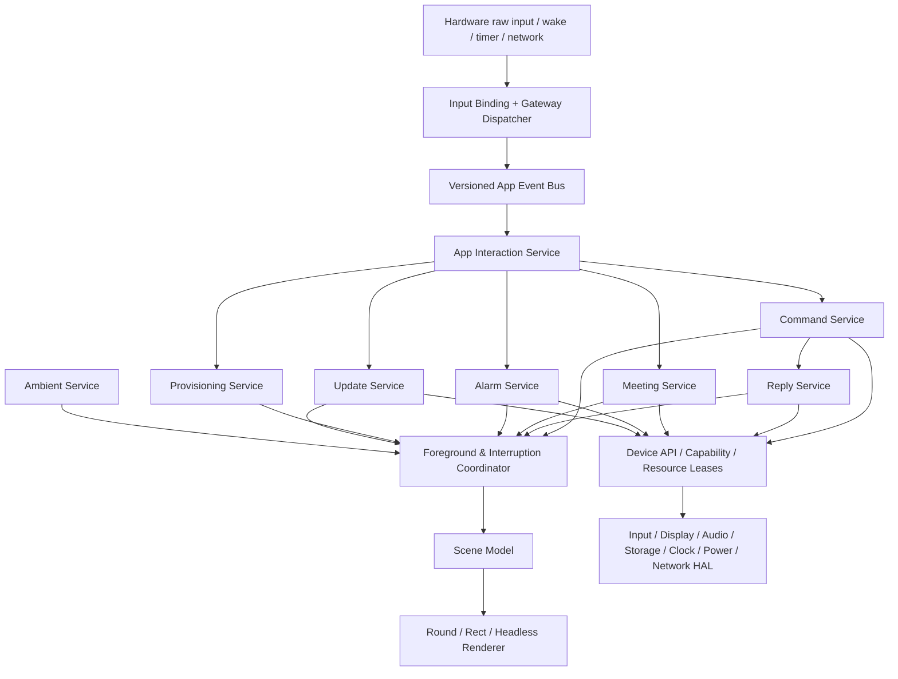
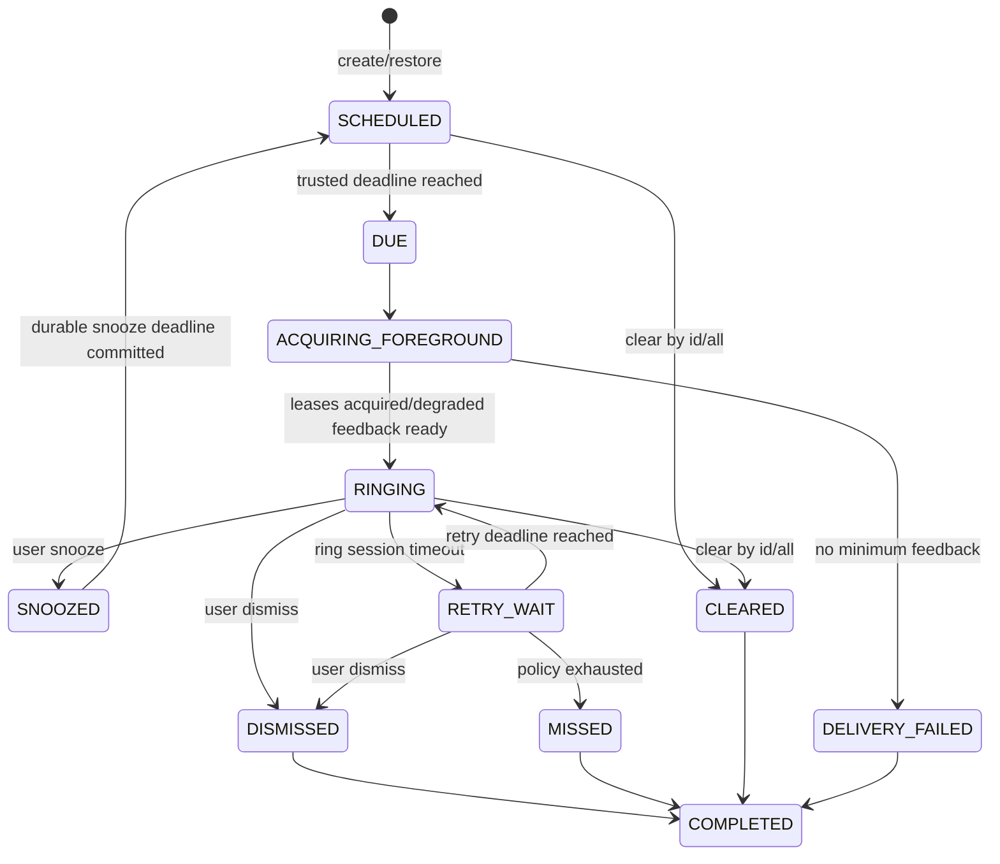

# MaClaw AgentOS 三硬件业务层评审附录

## 1. 文档信息

- 状态：待实施
- 日期：2026-08-06
- 所属系统：MaClaw AgentOS
- 适用工程：`esp32s3-maclaw-client`
- 正式支持硬件：Bread Compact、EchoEar-2ST、Fangtang-4G
- 评审对象：Bread Compact 当前完整业务功能、EchoEar-2ST 当前闹钟及圆屏/触屏能力、Fangtang-4G 当前单键/小屏/ML307/电池能力，以及三者在共享业务层中的收敛方案
- 唯一功能与业务行为基线：Bread Compact 已验证的完整功能集合及处理方式；EchoEar-2ST 与 Fangtang-4G 必须逐项对齐，不得保留板型专属业务分叉或正式功能缺口
- 基线版本：由主计划定义的 `baseline_manifest` 冻结；本附录中的“Bread 行为”均指已批准且带 firmware/ELF digest、profile/hardware revision 和 golden trace 的基线 revision，不指任意 Bread 当前构建
- 关联文档：`docs/design/esp32-unified-hal-development-plan-zh.md`

本文作为 MaClaw AgentOS 总体开发计划的业务层评审附录，不构成并列或独立的实施计划。总体计划统一定义业务服务、Device API、硬件抽象、板型适配、迁移阶段与发布门禁；本附录保留三硬件源码评审事实和详细业务设计。新增硬件只能实现 profile、HAL、Renderer、Input Binding 和必要平台 port；不得复制或按板型改写 Command、Reply、Meeting、Alarm 等业务流程。

## 2. 评审结论

### 2.1 核心结论

1. Bread Compact 当前已经形成较完整的设备业务原型：语音交互、离线唤醒、回复显示与播放、会议录音及掉电续传、取消、配网配对、待机环境信息、实体按键与音量控制均已落地。
2. 闹钟并非 EchoEar-2ST 独占实现。`alarm_manager.c`、Gateway tool 声明和 `app_ui` 已被三个编译 profile 共享；Bread Compact/Fangtang 的共同 board port 也已有矩形/小屏闹钟页和本地铃声。EchoEar-2ST 保留圆屏动画、触屏解除和自身 codec 驱动。
3. 当前“共享”主要是源码共用，尚未形成清晰的业务服务边界。`main.c` 同时承担状态机、网络、持久化、UI、音频和板型判断，业务层仍直接调用 `board_port_*`，难以安全扩展新硬件。
4. 当前闹钟最大缺口不是能否响铃，而是与语音录音、远端处理、回复/TTS、会议录音、会议上传、配网页面、休眠等业务并发时的抢占和恢复语义不完整。闹钟结束后 `app_ui` 固定回到 PET/idle，会丢失之前的前景上下文。
5. Fangtang-4G 当前并非独立适配层：它与 Bread 共用 `board_port_bread_compact.c`，靠大量板型宏表达 240×240 NV3023、单键、ML307、battery/charge 和 UI 差异；`main.c` 还存在蜂窝 HTTP、会议上传、时间同步和启动恢复分支。该结构必须拆分，Fangtang 不能继续被视为 Bread 的编译变体。
6. 开发应采用“先行为等价提取，再增强语义”的顺序。第一阶段不能一边拆分架构一边改变用户行为；每个阶段必须能在三硬件上独立回归和回退。

### 2.2 目标结果

完成后应达到：

- Bread Compact、EchoEar-2ST 与 Fangtang-4G 使用同一套业务状态机和业务服务。
- EchoEar-2ST 与 Fangtang-4G 逐项对齐 Bread Compact 的语音、唤醒、回复、会议、取消、配网、待机、闹钟、音量、休眠和唤醒业务行为。
- 三硬件使用同一个 Alarm Service；只在输入映射、显示布局、音频驱动、连接传输和硬件反馈适配上不同。
- EchoEar-2ST 现有圆形屏幕视觉效果保留，不强制套用 Bread Compact 的矩形布局。
- 业务代码不出现 `CONFIG_MACLAW_BOARD_*`、GPIO、panel、codec、touch 或实体按键判断。
- Fangtang 的单键没有独立音量键，必须提供可操作的远端/菜单等统一音量入口并实现底层音量控制；当前 `ESP_ERR_NOT_SUPPORTED` 只是待补差距，不能成为正式发布结果。
- 后续新增硬件时，不修改 `app/`、`domain/` 和既有共享 `services/` 即可获得相同业务功能。
- 所有未来正式硬件也必须完整实现 Bread Compact 功能母版；不以 capability 裁剪出硬件专属“精简版”，物理控件缺失时由适配层提供替代入口。

范围口径与主计划一致：Bread 当前已有且已验证的行为属于 `BASELINE_EXISTING`；本计划新纳入公共产品契约、Bread 本身也要补齐的 Sleep Schedule/硬件唤醒、Alarm 增强，以及新版本检查/提醒/受校验刷机工具升级属于 `BASELINE_PROMOTED`；电池、充电与蜂窝图标等只作为 `PHYSICAL_EXTENSION`。三硬件功能完全一致同时覆盖前两类，不能把计划新增能力写成 Bread 已经具备的源码事实。固定 16 MiB 产品不实现设备端 OTA，不新增 A/B/staging，不接收或下载固件；更新链路固定为 `GitHub Release → Hub Update Catalog → 设备版本提醒 → 用户使用官方刷机工具从 GitHub 下载并经 USB 更新`。

### 2.3 本计划不做的事情

- 不在本次计划文档中修改 ESP32 源码。
- 不把开放 AP、HTTP captive portal 等当前配网实现复制到新的业务模块；后续由统一 Provisioning Service 和 Connectivity/Security 接口收口。
- 不把圆屏和矩形屏统一成同一套像素坐标。
- 不将一次性绝对时间闹钟误称为已经支持周期、工作日、节假日或自然语言解析。
- 不要求所有硬件具有相同物理器件，但要求三款正式硬件通过适配或替代入口实现完全一致的 Bread 业务功能；capability 只描述实现方式和运行健康，不能成为永久删减正式功能的借口。

## 3. 当前源码基线

### 3.1 关键文件与职责现状

| 文件 | 当前职责 | 主要问题 |
| --- | --- | --- |
| `main/main.c` | 启动、联网、Gateway、语音命令、回复、会议、配网、输入路由、取消、时间同步 | 巨型编排器；业务、平台和硬件调用混合；存在板型条件编译 |
| `main/alarm_manager.c` | 闹钟存储、tool 执行、幂等缓存、到期调度、响铃与解除 | 直接调用 UI/board port；轮询墙钟；无前景恢复协调器 |
| `main/app_ui.c` | 共享 UI model 与 board renderer facade | 单一 surface 覆盖；闹钟结束固定回 PET；不是可恢复的前景栈 |
| `main/board_port.c` | EchoEar-2ST 输入、圆屏、音频、唤醒词和硬件驱动 | 同时保存 UI 业务状态，板级职责过宽 |
| `main/board_port_bread_compact.c` | Bread Compact/Fangtang 输入、矩形屏、音频和硬件驱动 | Bread 与 Fangtang 条件分支较多；同样混入展示状态 |
| `main/ml307_transport.cpp` | Fangtang ML307 蜂窝 HTTP/传输 | 传输实现与 Gateway/会议业务分支耦合 |
| `main/board_port.h` | 现有板级统一 facade | 接口粒度按实现演进，尚未形成 capability、lease、异步 operation 契约 |

### 3.1.1 当前三硬件业务对齐状态

| 业务/能力 | Bread Compact 基线 | EchoEar-2ST 当前状态 | Fangtang-4G 当前状态 | 计划要求 |
| --- | --- | --- | --- | --- |
| Command/Reply/Meeting/Alarm 领域代码 | 已有完整主流程 | 当前大部分共享 `main.c`/manager | 当前大部分共享，但穿插 ML307/板型分支 | 全部收敛同一 Service/state machine |
| 输入 | 激活键+音量键 | 触屏/BOOT | 单激活键 | 适配为相同 intent；无同类按键时提供替代入口 |
| 显示 | 240×320 ST7789 | 360×360 ST77916 圆屏 | 240×240 NV3023、Y offset=80 | 同一 Scene 必选字段完整可达 |
| 音频 | direct-I2S，软件音量 | ES7210/ES8311，codec 音量 | direct-I2S；当前音量 API 不支持 | capture/playback/volume 契约完全一致 |
| 连接 | Wi-Fi | Wi-Fi | Wi-Fi/ML307，业务路径存在特判 | Connectivity adapter 统一 transport 语义 |
| 电源/唤醒 | 作为功能母版补齐 schedule/wake | touch/BOOT 候选能力 | GPIO0/timer、ML307/charger 电源域待验证 | 用户功能一致，底层 wake matrix 可不同 |
| 电池/充电 | 非公共核心功能 | 无当前证据 | 已有 ADC/charge 采样 | 可作硬件增强，不改变公共业务或发布门禁 |

因此，“已有共享代码”不能等同“功能已经完全一致”。尤其 Fangtang 音量 `NOT_SUPPORTED`、ML307 业务分支和 Bread/Fangtang 共用大型 board port，是明确的实施缺口。

### 3.2 Bread Compact 已实现功能矩阵

以下均是“当前已实现”，不是计划新增：

| 业务域 | 当前 Bread Compact 行为 | 业务基线决定 |
| --- | --- | --- |
| 语音激活 | 激活键单击启动；录音中按下沿可提前停止；无语音仅显示本地提示 | 保留为共享 Command 行为，输入动作由 Input Binding 产生意图 |
| 离线唤醒 | 中文唤醒词“码卡龙”；唤醒后进入同一语音流程；录音/会议/播放/配网时暂停或释放模型 | 保留；由 Wake Service 与 Audio Arbitration 协作 |
| 命令上传 | WAV 上传、语音事件提交、重试和幂等；远端处理无固定 90 秒强制终止 | 保留现有超时和取消语义，统一 deadline 与 operation ID |
| 回复接收 | Gateway long poll 接收 text/image/audio/progress；按 correlation/generation 过滤迟到结果 | 保留并提取 Reply Service/Gateway Dispatcher |
| 回复呈现 | 文字分页、图片、TTS/音频；回复保留到下一次显式操作 | 作为三硬件共享行为；页面几何由 Renderer 适配 |
| 音量/翻页 | 回复页中音量键优先翻页，其他页面调整输出音量 | 作为场景相关 Input Binding 规则 |
| 取消 | 处理中双击取消；录音阶段双击被消费；独立 cancel worker；迟到回复被过滤 | 保留，归入 Command Service 单一状态机 |
| 会议录音 | 双击启动；有效完成手势停止；16 kHz/16-bit/mono 流式 WAV | 保留，归入 Meeting Service |
| 会议上传 | 分块上传、SHA256、complete/process、进度显示 | 保留，Network/Storage 只提供机制 |
| 会议恢复 | NVS 保存 recording ID/chunk cursor/phase/pending；掉电断网续传；服务端确认后删文件 | 保留 durable operation 语义，建立明确 schema/migration |
| 配网配对 | SoftAP、二维码、DNS/HTTP portal、Wi-Fi/企业 Wi-Fi、Hub URL、pair code、语音六位码 | 先行为等价迁移，安全增强独立规划 |
| 重新配置 | 长按写入 `force_setup` 后重启；新配置提交前保留旧配置 | 保留事务边界 |
| 待机 | 时间、日期、星期、地点、天气、Wi-Fi/Hub 状态、pet profile/动画/远端素材 | 归入 Ambient Service 与 Scene Model |
| 显示休眠 | 当前部分板型支持待机屏幕休眠/唤醒；物理输入仅唤醒时消费本次动作 | 提炼为 Power/Display policy，不把“屏幕休眠”混同“整机深睡” |

### 3.3 Bread Compact 语音业务主链路

```text
Input Binding: 激活键单击 / Wake Service: 唤醒词
    → Intent.VOICE_START
    → Command Service admission
    → Audio Service 获取 command-capture lease
    → 录音并允许按下沿提前停止
    → 上传媒体
    → 幂等提交 command event
    → PROCESSING
    → Gateway Dispatcher 接收 progress/text/image/audio
    → Reply Service 校验 correlation/generation
    → Foreground Coordinator 展示结果
    → 用户显式关闭或进入下一项业务
```

现有值得保留的边界行为：

- 回复页面上的首次单击只关闭回复，不直接开始新一轮录音。
- 物理输入只负责唤醒休眠屏幕时，当前动作被消费；离线唤醒词唤醒屏幕后可继续进入语音录音。
- 麦克风本地失败不会提交无关的旧文本探针。
- 远端处理期间双击是取消，不会落入会议录音。
- 回复 correlation 与 command generation 共同阻止取消后或旧会话的迟到回复污染当前界面。

### 3.4 EchoEar-2ST 闹钟当前完整链路

```text
Gateway outgoing(type=tool_call)
    → handle_client_tool_call()
    → 校验 idempotencyKey / arguments
    → alarm_manager_execute_tool()
    → NVS mutation + replay result 同一 commit
    → POST /api/im-gateway/v1/tool-result
    → outgoing message ACK

alarm_task()
    → 每 250 ms 比较 time(NULL) 与最早 triggerAtEpochMs
    → queue alarm 原子转为 durable active_alarm
    → 最多 3 轮：每轮响铃最多 60 秒，轮间等待 5 分钟
    → 每轮循环更新闹钟画面并播放短 burst
    → 触屏按下沿解除
    → 持久化清除 active_alarm
    → 返回 PET/idle
```

当前 tool：

| Tool | 当前输入/行为 | 兼容性判断 |
| --- | --- | --- |
| `alarm_create` | 必填未来绝对 `triggerAtEpochMs`；可选 label | 保留 V1；未来扩展 schema 不能改变旧字段语义 |
| `alarm_list` | 按时间排序，返回 1-based index、稳定 id、时间和 label | 保留 index 展示兼容；管理操作应转向稳定 id |
| `alarm_clear` | 按当前 1-based index 删除；active alarm 在 index 1 | V1 兼容保留，但新增 `alarm_clear_by_id` 或可选 `id` |
| `alarm_clear_all` | 队列和 active alarm 一并清除；commit 后请求停止响铃 | 保留 |

当前持久化约束：

- 最多 16 个闹钟。
- label 最多 48 UTF-8 bytes；当前检查字节数，不是字符数。
- NVS namespace 为 `alarms`，blob key 为 `store`。
- 当前 `ALM2`，能读取并迁移 `ALM1`。
- mutation 和 replay result 使用同一 NVS commit。
- replay cache 为 8 条；幂等键最多 63 个 ASCII 字符。
- 响铃/轮间等待期间重启，会把 active alarm 重新放回队列并从第 1 次尝试开始。

### 3.5 三硬件当前闹钟差异

| 差异点 | EchoEar-2ST | Bread Compact | Fangtang-4G | 目标归属 |
| --- | --- | --- | --- | --- |
| 屏幕 | 360×360 圆形安全区；双铃摆动动画；显示“轻触停止” | 240×320 静态页；仅 attempt 变化时重绘 | 240×240 NV3023 小屏、GRAM Y offset=80；紧凑静态页 | Renderer + Feedback Copy Adapter |
| 输入 | 触屏按下沿解除 | 激活键按下沿解除 | 单激活键按下沿解除 | Input Binding，统一输出 `ALARM_DISMISS` |
| 铃声 | EchoEar codec 上的短方波机械铃 burst | direct-I2S speaker 上的短机械铃 burst | direct-I2S speaker 上的短机械铃 burst | Audio HAL/Alarm Sound Renderer |
| 待机标记 | board renderer 保存 scheduled 状态 | board renderer 显示 scheduled icon | 小屏 renderer 显示 scheduled 状态 | Ambient Scene Renderer |
| 显示性能 | 约每 120 ms 动画刷新 | 相同 attempt 不重复刷屏 | 单行 stripe/240×240 预算下避免无效重绘 | Display capability 与 renderer 自主帧率，不进入 Alarm 状态机 |

圆屏动画、Bread 矩形页面和 Fangtang 小屏紧凑页面都是正确的硬件适配，不应在业务对齐中互相覆盖；展示字段、可执行意图和终态必须一致。

### 3.6 Gateway 消息可靠性现状

- outgoing 使用单 reader、page cursor 与 message ACK。
- 当前一次拉取一条消息，以容纳图片、动态字形和富回复 JSON。
- tool 本地执行或 tool-result 投递失败时不 ACK，保留 cursor 等待重试。
- 本地 mutation 已成功但 tool-result POST 失败时，Gateway 重投依靠 Alarm replay cache 返回相同结果，避免重复创建或重复删除。
- page cursor 仅在页面内所有需重试消息处理完毕后推进，避免 ACK 和 cursor 两种粒度不一致导致消息丢失。

这些语义必须在提取 Gateway Dispatcher 时保持，不能简单改成“收到即推进 cursor”。

## 4. 当前问题与需要增强的业务语义

### 4.1 架构边界问题

1. `main.c` 是事实上的全局业务状态机，模块之间依靠全局变量和函数调用协作。
2. Command、Meeting、Alarm 都直接占用麦克风、扬声器、UI 或唤醒模型，缺少统一资源 lease 和抢占协议。
3. `on_user_input()` 根据板型选择闹钟解除来源，业务层知道“触屏”和“激活键”。
4. 配对成功、录音失败、闹钟停止提示等文案包含具体物理控件名称，业务与硬件提示耦合。
5. `app_ui` 只有单一 surface enum，不记录被抢占前的 operation/scene，也没有 resume token。
6. Board port 不只做像素或驱动适配，还维护 response、message、alarm、foreground 等业务可见状态。
7. 当前 alarm scheduler 直接调用 `board_port_set_alarm_visual()` 和 `board_port_play_alarm_burst()`，绕过统一 Display/Audio 仲裁。

### 4.2 闹钟领域问题

1. 常量 `ALARM_SNOOZE_SECONDS` 实际表示无人解除后的自动重响间隔，不是用户明确选择的 snooze。
2. 没有用户主动“稍后提醒”的意图、deadline 和持久化状态。
3. 调度以 250 ms 周期轮询 `time(NULL)`，未使用统一可信墙钟、单调 deadline 和休眠唤醒计划。
4. 没有定义时间未同步、墙钟前跳/回拨、启动时已过期、DST 重复/跳过时刻和同刻多闹钟行为。
5. `alarm_clear` 依赖易变化的排序 index；创建或到期后同一 index 可能指向另一闹钟。
6. 响铃结束固定回 ambient，可能覆盖仍在处理的命令、已完成回复、会议上传或配网二维码。
7. active alarm 重启后从 attempt 1 重响可能增加打扰，且没有保存 session/attempt/deadline。
8. 不区分 `dismissed`、`snoozed`、`missed`、`cleared` 和设备故障导致的 `delivery_failed`。
9. 静音、音量为 0、扬声器故障、无屏、低电量或资源不足时缺少统一降级反馈。
10. 没有明确闹钟是否能使整机从 light/deep sleep 唤醒，也没有把最近 deadline 发布给 Power Service。

### 4.3 跨业务并发问题

闹钟可能在以下任意阶段到期：

- command capture；
- command media upload；
- remote processing/cancel；
- reply text/image/TTS；
- meeting recording/paused/finalizing；
- meeting upload/process；
- setup portal/pairing；
- startup welcome；
- display sleep、light sleep 或 deep sleep；
- 低电量、SAFE_MODE 或硬件能力降级。

当前实现没有一张权威抢占矩阵，行为由调用顺序和板级 mutex 偶然决定。开发前必须先冻结本计划第 9 节的策略。

### 4.4 生命周期、可靠性与安全边界问题

1. 当前刷机工具升级、计划重启、崩溃重启与 factory reset 期间如何处理 scheduled/active alarm 尚无统一业务契约；刷机前 maintenance readiness、重启 reason、刷机后 reconciliation 和失败恢复必须接入同一 lifecycle coordinator。
2. Alarm 是离线本地能力，但当前启动顺序、时间可信度和 Gateway capability 发布之间的关系主要依靠注释和调用顺序维持，缺少可测试 invariant。
3. 普通有界事件队列满载时，alarm due、dismiss、cancel、录音收尾等关键事件不能与天气或动画更新同等丢弃；当前没有集中 admission/backpressure 策略。
4. alarm label、会议标题、回复文本和 tool 参数都可能包含隐私或恶意 UTF-8/控制字符，日志、crash dump、Renderer 和 glyph cache 需要一致的验证与脱敏规则。
5. tool mutation 虽经已配对 Gateway 传入，但业务层还需显式校验 device/tenant/session binding、schema version、调用权限和速率，不能把“HTTP 已认证”等同于领域操作一定合法。
6. 当前关键时延、资源和功耗没有业务 SLO：到期到首个可感知反馈、解除到停止反馈、抢占/恢复、NVS commit、sleep prepare、timer wake drift 都需要先测基线再设发布门限。

## 5. 业务层设计原则

### 5.1 单一业务实现

- 每个业务领域只有一个 Service owner 和一套状态机。
- 板型差异只能由 `Device API + capability snapshot + adapter` 表达。
- 禁止在业务目录使用 `#if CONFIG_MACLAW_BOARD_*`。
- 禁止业务层读取 GPIO、屏幕宽高、触摸坐标、codec 型号或实体按键编号。
- 禁止 Renderer 直接改变业务状态；Renderer 只呈现 immutable scene。
- 禁止 Input driver 直接调用 Command/Alarm/Meeting；它只发布 raw input，Input Binding 输出业务 intent。

### 5.2 Intent、Operation、Scene 分离

- **Intent**：用户或系统想做什么，例如 `VOICE_START`、`ALARM_DISMISS`。
- **Operation**：业务正在执行什么，拥有稳定 `operation_id`、generation、状态、deadline、取消与恢复语义。
- **Scene**：当前应该向用户展示什么，不包含屏幕坐标和硬件控件编号。

这三者分离后，同一个触屏轻触和实体键单击可映射为相同 intent；同一个 Alarm scene 可由圆屏动画、矩形静态页、LED 或无屏音频分别呈现。

### 5.3 状态与副作用单写者

- Command、Meeting、Alarm 各自由单写者 task/event loop 拥有领域状态。
- 外部 callback 只投递事件，不直接改共享状态。
- NVS、文件、Gateway tool result 和远端取消都必须在 operation 状态机中建模为有结果的副作用。
- 不用 `volatile` 变量替代完整的事件和终态协议。

### 5.4 能力驱动的统一运行时恢复与适配

业务层根据 capability/health 选择已定义的实现策略和运行时恢复路径，不根据 board ID 选择分支。Bread 公共功能在三款正式 profile 中全部必选，capability 不能用于永久删减。例如：

- `display.shape = ROUND/RECT/NONE` 只影响 Renderer 选择。
- `input.intents` 决定设备能否提供 dismiss/snooze/configure 等意图。
- `audio.full_duplex` 决定会议录音与闹钟音频能否并行。
- `power.timer_wake` 决定 deep sleep 时闹钟能否按 deadline 唤醒。
- `feedback.led/haptic` 决定扬声器或屏幕故障后的备用提示。

具体物理通道不具备、运行时健康暂时收缩或资源不足时，使用文档化的替代入口、较浅 power state、恢复策略或临时 admission 拒绝，不能私自改写领域语义。正式 profile 若缺少某项 Bread 公共功能实现，属于发布阻断缺陷，不属于可接受的 capability 差异；Fake/Reference 与非公共物理增强才允许静态不支持。

### 5.5 关键事件、背压与资源预留

- App Event Bus 至少区分 critical control lane 与 coalescible state lane。alarm due/dismiss、command cancel、capture stop、meeting finalize、power fail checkpoint 进入预留的 critical lane；天气、音量快照、动画 tick、重复进度可合并或丢弃旧值。
- 关键事件必须带 producer generation、enqueue monotonic time 和唯一 event ID；队列满时不能静默丢弃，必须使用预留槽、直接 task notification 或持久化 mailbox，并产生可诊断故障。
- Service 不得在事件循环中执行无界网络、全屏 render 或长 NVS 操作；这些副作用由 operation worker 执行，结果回投 owner。
- 每个 Service 定义最大在途 operation、queue 深度、memory pool、stack、deadline 和 cleanup reserve。资源不足时在 admission 前拒绝新低优先级工作，并保留 alarm/cancel/mute/录音收尾所需容量。
- 事件 schema 使用显式稳定 ID 和版本；未知事件可拒绝或忽略，但不能因 enum 重排改变线上数值。

## 6. 目标业务架构



### 6.1 模块职责

| 模块 | 唯一职责 | 禁止职责 |
| --- | --- | --- |
| App Interaction Service | 接收 intent，执行全局 admission 与顶层业务路由 | 直接访问 GPIO、NVS、HTTP、LCD、I2S |
| Command Service | command capture→upload→submit→processing→cancel 状态机 | 绘制页面、解析触摸、管理会议文件 |
| Reply Service | correlation、multipart text/image/audio、完成与迟到过滤 | 直接长轮询、直接占用扬声器 |
| Meeting Service | 录音、finalize、分块上传、恢复和结果状态 | 按板型决定停止手势 |
| Alarm Service | CRUD、调度、响铃 session、dismiss/snooze/missed、持久化 | 直接播放 tone 或刷新 LCD |
| Provisioning Service | 配置事务、portal 状态、配对状态 | 板级 AP 驱动细节和安全策略硬编码 |
| Ambient Service | 时间/天气/网络/pet 聚合为待机场景 | 覆盖高优先级 foreground |
| Update Service | release metadata 检查、版本/兼容比较、提醒去重、稍后和忽略当前版本 | 下载固件、接收 URL、写 partition、重启或自动回滚 |
| Hub Update Catalog | 验证 allowlisted GitHub Release signed manifest，并向已授权设备返回适用 profile 的 metadata | 向设备返回 firmware URL/bytes、替设备安装或接受租户自定义固件 |
| Gateway Dispatcher | outgoing poll、ACK/cursor、tool/result/reply 分发 | 直接执行业务 mutation |
| Foreground Coordinator | 前景优先级、抢占、resume token、场景恢复 | 持有业务领域实体或写领域 NVS |
| Audio Arbitration Service | capture/playback/wake lease、抢占和静音策略 | 决定 command/alarm 的业务终态 |
| Clock/Deadline Service | 可信墙钟、单调时间、deadline、时间跳变事件 | 自己创建或删除闹钟 |
| Power Policy Service | idle policy、sleep admission、wake plan、唤醒原因 | 在未 checkpoint 时强制休眠 |
| Scene Renderer | 将通用 scene 映射为圆屏/矩形屏/无屏反馈 | 改变 Alarm/Command/Meeting 状态 |

### 6.2 建议目录结构

```text
esp32s3-maclaw-client/main/
  app/
    app_interaction_service.c
    app_intent.h
    app_event.h
    operation_context.h
  domain/
    alarm_domain.h
    command_domain.h
    meeting_domain.h
    reply_domain.h
  services/
    command_service.c
    reply_service.c
    meeting_service.c
    alarm_service.c
    provisioning_service.c
    ambient_service.c
    foreground_coordinator.c
    gateway_dispatcher.c
    audio_arbitration_service.c
    clock_deadline_service.c
    power_policy_service.c
    update_service.c
  presentation/
    scene_model.h
    scene_presenter.c
    input_binding.c
  device/
    device_api.h
    capability_service.h
    update_catalog_api.h
  adapters/
    bread_compact/
      input_binding_bread.c
      renderer_bread.c
    echoear_2st/
      input_binding_echoear.c
      renderer_echoear_round.c
```

实际 HAL 目录和命名以统一 HAL 文档为准；关键要求是依赖方向只能从业务层指向稳定的 Device API，不能反向依赖板级实现。

### 6.3 服务通信与依赖规则

- 领域 Service 之间通过 typed command/event 或只读 snapshot 通信，不互相读取可变全局变量。
- 同步调用只允许无副作用查询和有界 admission；网络、NVS、文件、音频、显示、sleep transition 一律异步返回 operation result。
- 禁止 Command→Foreground→Command 之类环形同步调用。Foreground 只持 owner ID、scene 和 resume token，不持领域对象指针。
- Device API 返回 capability revision、resource lease 和 operation handle。能力收缩或驱动重启后旧 generation handle 必须确定性失效。
- callback context、task handle、mutex、DMA buffer 和 renderer cache 都是 ephemeral runtime state，不能写入领域持久化或在重启后复活。
- Boot composition root 按依赖拓扑启动；Clock、Persistence、Event Bus、Capability 和最小 Feedback ready 后即可恢复离线 Alarm，不以 Gateway handshake 成功为前提。

## 7. 统一业务事件与输入意图

### 7.1 最小意图集合

```c
typedef enum {
    APP_INTENT_VOICE_START,
    APP_INTENT_CAPTURE_STOP,
    APP_INTENT_COMMAND_CANCEL,
    APP_INTENT_RESPONSE_DISMISS,
    APP_INTENT_RESPONSE_NEXT,
    APP_INTENT_RESPONSE_PREVIOUS,
    APP_INTENT_MEETING_START,
    APP_INTENT_MEETING_STOP,
    APP_INTENT_CONFIGURE,
    APP_INTENT_VOLUME_UP,
    APP_INTENT_VOLUME_DOWN,
    APP_INTENT_ALARM_DISMISS,
    APP_INTENT_ALARM_SNOOZE,
    APP_INTENT_UPDATE_REMIND_LATER,
    APP_INTENT_UPDATE_DISMISS_VERSION,
} app_intent_kind_t;
```

Input Binding 根据当前 foreground、原始 gesture 和 capability 生成 intent。业务层不再接收 `BOARD_INPUT_SOURCE_TOUCH` 或 `BOARD_INPUT_SOURCE_ACTIVATE_KEY`。

### 7.2 默认输入绑定

| 当前场景 | 通用意图 | Bread Compact 默认绑定 | EchoEar-2ST 默认绑定 | Fangtang-4G 默认绑定 |
| --- | --- | --- | --- | --- |
| 待机 | `VOICE_START` | 激活键单击或离线唤醒词 | 触屏单击或离线唤醒词 | 单激活键单击或离线唤醒词 |
| 录音 | `CAPTURE_STOP` | 激活键按下沿 | 触屏按下沿 | 单激活键按下沿 |
| 处理中 | `COMMAND_CANCEL` | 激活键双击 | 触屏双击 | 单激活键双击 |
| 回复 | `RESPONSE_DISMISS` | 激活键单击 | 触屏单击 | 单激活键单击 |
| 回复 | `RESPONSE_NEXT/PREVIOUS` | 音量上下键 | 自动翻页；产品定义后可增加滑动 | 五行自动翻页，不占用单键业务手势 |
| 待机 | `MEETING_START` | 激活键双击 | 触屏双击 | 单激活键双击；启动网络选择窗口内由系统 binding 优先消费 |
| 会议录音 | `MEETING_STOP` | 任一有效完成手势 | 任一有效完成触屏手势 | 任一有效单键完成手势 |
| 任意可配置状态 | `CONFIGURE` | 激活键长按 | 触屏长按或板级配置键 | 单激活键长按 |
| 闹钟响铃 | `ALARM_DISMISS` | 激活键按下沿 | 触屏按下沿 | 单激活键按下沿 |
| 闹钟响铃 | `ALARM_SNOOZE` | 默认暂不绑定；产品启用后可用双击 | 默认暂不绑定；产品启用后可用双击 | 默认暂不绑定；产品启用后须提供不与 dismiss/网络选择冲突的单键或远端入口 |
| 新版本提醒 | `UPDATE_REMIND_LATER/DISMISS_VERSION` | 音量键选择，激活键确认 | 圆屏触控“知道了/稍后提醒” | 单击切换，长按确认；不提供安装入口 |

Phase 1 保持现有解除行为，不立即启用 snooze 手势，避免迁移时改变用户习惯。Phase 5 完成独立 snooze 状态和可用性提示后再启用绑定。

替代入口必须作为产品能力实现和验收，而不是表格备注。EchoEar/Fangtang 的音量、snooze 等缺少独立实体键的功能，至少具有一个不依赖 Hub 在线的本地入口，并可从当前 Scene 或设置提示中发现；远端入口与本地入口必须汇聚为同一 intent/tool 和 operation，统一权限、当前值、提交结果、超时、取消及持久化。仅有隐藏 API、调试命令或无法从正式 UI 发现的入口，不计作与 Bread 功能等价。

### 7.3 手势消费规则

- 按下沿触发的 dismiss/capture-stop 必须消费该物理接触随后产生的 single/double/long 完成事件。
- 同一 `raw_contact_id` 或 `gesture_generation` 的事件只能产生一个终态 intent。
- 屏幕/设备从 idle sleep 唤醒时，物理动作默认仅唤醒并被消费；明确的 voice wake-word 不消费后续 voice intent。
- 闹钟 foreground 时，未绑定输入不能穿透到 Command/Meeting/Provisioning。
- Update Scene 的完成 contact 必须消费对应手势；Alarm 抢占提醒 Scene 时，原 contact/generation 失效，恢复后不得自动提交旧选择。
- Input Binding 输出日志只记录 intent、binding revision 和匿名 source class，不把触摸坐标当业务数据持久化。

## 8. Foreground 与 Operation 模型

### 8.1 Operation Context

每个长操作至少包含：

```text
operation_id
operation_kind
generation
state
created_monotonic_ms
deadline_monotonic_ms（如适用）
correlation_id / idempotency_key（如适用）
foreground_scene_id
cancel_policy
resume_policy
durability
terminal_reason
```

禁止使用“当前页面是什么”推断业务 operation 是否仍在进行。网络处理、会议上传可在 Alarm foreground 下继续，结束后由 operation 事件更新其被遮挡的 scene snapshot。

### 8.2 Foreground lease

Foreground Coordinator 提供有界、可抢占 lease：

```text
owner_operation_id
priority
scene_snapshot
audio_focus_request
input_context
resume_token
generation
```

建议优先级从高到低：

1. 安全/隐私强制反馈和 critical power 提示；
2. 本地到期 Alarm；
3. 配置恢复或不可逆错误确认；
4. Command capture、Meeting capture；
5. Command/Meeting 结果和 TTS；
6. 上传/处理中进度；
7. Ambient/PET。

优先级只决定呈现所有权，不自动取消低优先级业务。是否取消、暂停或后台继续由第 9 节领域策略决定。

### 8.3 抢占事务

```text
REQUEST_INTERRUPT
  → 被抢占 owner 生成可恢复 snapshot/checkpoint
  → Audio/Display/Input lease 在 deadline 内安全切换
  → Foreground Coordinator 发布 Alarm scene
  → Alarm terminal event
  → 校验旧 operation generation 仍有效
  → 恢复最新 scene，而不是恢复过期像素帧
```

如果旧 operation 已在后台结束，恢复其 terminal scene；如果已取消或失效，则回到下一个有效 owner/ambient。不得盲目恢复被抢占时的静态截图。

## 9. 闹钟与其他业务的抢占/恢复策略

此表是实施前必须冻结的共享业务规则。

| 闹钟到期时状态 | 默认业务动作 | 音频策略 | 闹钟结束后 |
| --- | --- | --- | --- |
| Ambient/PET | 直接获取 foreground | 播放闹钟 burst | 回到最新 Ambient scene |
| Display sleep | 点亮屏幕并获取 foreground | 播放闹钟 | 恢复 idle policy，重新计算休眠倒计时 |
| Light/deep sleep | 由 timer wake 唤醒；先重建 Clock/Alarm/Feedback 最小依赖 | 硬件 ready 后响铃 | 完整系统恢复或按策略重新入睡 |
| Command capture | 安全停止 capture，标记 `INTERRUPTED_BY_ALARM`；不提交不完整语音 | Alarm 获得 playback focus | 显示“录音被闹钟中断”，下一次显式操作再录音 |
| Command media upload | 后台继续，保存 operation/correlation | Alarm 暂时取得 playback | 若仍处理中恢复 thinking；已结束则恢复 reply |
| Remote processing | 后台继续；不自动远端取消 | Alarm 暂时取得 playback | 恢复最新 processing/reply/cancel 终态 |
| Cancel worker | 取消事务继续 | Alarm 取得 playback | 恢复取消结果或 ambient |
| Reply text/image | 保留 Reply scene 和页码 | Alarm 取得 playback | 恢复相同 reply 最新页 |
| Reply TTS/audio | 停止当前播放并记录 `INTERRUPTED`；首版不自动从中点续播 | Alarm 取得 playback | 恢复文字/图片；提供显式重新播放能力后再扩展 |
| Meeting recording，硬件全双工 | 录音继续，Alarm 覆盖视觉 | 允许并行且实机验证无串音后播放 | 恢复波形/时长 |
| Meeting recording，非全双工 | 安全 pause capture、flush WAV、记录 gap 起止；禁止丢文件 | Alarm 播放 | 自动恢复 capture；失败则 finalize 并提示 |
| Meeting finalizing | finalize/checkpoint 继续，不能中断 WAV header/NVS commit | commit 安全点后播放 | 恢复 upload/错误页面 |
| Meeting upload/process | 后台继续 | Alarm 取得 playback | 恢复最新进度或结果 |
| Setup portal/pairing | AP/DNS/HTTP 与配置事务继续；二维码 scene 被遮挡 | 本地响铃 | 恢复最新 QR/成功/失败场景 |
| Startup Welcome | Welcome 停止且 ACK/replay 语义保持幂等 | Alarm 优先 | 不重播旧 Welcome；继续 ready gate |
| SAFE_MODE | 只启动最小 Alarm/Clock/Feedback 依赖 | 按可用 speaker/LED/display 降级 | 保持 SAFE_MODE，不假装恢复正常 |
| 低电量/棕断风险 | 限制背光和铃声音量峰值，优先保证存储一致性 | 使用 profile 安全上限和备用反馈 | 保持低功耗策略 |

会议全双工能力必须通过真实 EchoEar/Bread 音频链路验证。未验证时一律按“非全双工”策略执行，不能因理论上支持 I2S TX/RX 同时工作就默认并行。

## 10. Alarm Service 目标设计

### 10.1 领域术语

- **dismiss**：用户确认并永久结束本次闹钟。
- **snooze**：用户明确请求在新 deadline 再次提醒。
- **ring session**：一次连续响铃窗口。
- **retry interval**：无人响应时，策略内部两次 ring session 的间隔；不能命名为 snooze。
- **missed**：到达最大策略仍未被用户处理。
- **clear**：管理操作删除 scheduled/active alarm。
- **delivery failed**：由于硬件/资源故障无法提供最低可用反馈。

### 10.2 目标状态机



### 10.3 领域模型 V3 建议

```text
AlarmRecord
  schema_version
  alarm_id                 稳定 uint64/字符串 ID
  revision
  enabled
  schedule_kind            ONCE；后续可扩展 RECURRENCE
  trigger_epoch_ms
  timezone_id              创建语义所用时区
  label_utf8
  created_epoch_ms
  state
  occurrence_id            一次触发实例的稳定 ID
  ring_session
    attempt
    ring_started_epoch_ms
    retry_deadline_epoch_ms
    snooze_count
    terminal_reason
  last_updated_epoch_ms
```

首版 V3 仍只开放一次性绝对时间闹钟。周期规则字段必须等 Hub schema、DST 测试和 GUI/Agent 契约完成后再发布，不能仅在固件中私自实现。

### 10.4 调度与时间可信度

Alarm Service 不直接调用 `time(NULL)` 轮询，改用 Clock/Deadline Service：

- 墙钟用于解释用户目标时间和持久化 epoch。
- 单调时间用于本次启动内的等待、ring session 时长和 timeout。
- Clock Service 发布 `UNTRUSTED / SYNCING / TRUSTED / STEPPED` 及 revision/uncertainty。
- 时间不可信时可接受并持久化绝对 epoch tool，但不得静默触发；界面标记“等待校时”。是否拒绝创建由 tool schema 明确返回 `time_untrusted`，首版建议拒绝接近当前时间的创建，保留远期闹钟并等待校时。
- 墙钟前跳跨过 deadline 时执行 missed-alarm policy；默认在容忍窗口内立即响铃，超过窗口标记 missed 并提示一次。
- 墙钟回拨不能让同一 `occurrence_id` 重复触发。
- 同刻多个闹钟按 `trigger_epoch_ms, alarm_id` 稳定排序；当前 alarm 完成后立即处理下一个，UI 显示队列数量。
- DST 由绝对 epoch 保证一次性闹钟只触发一次；未来周期闹钟必须显式定义 skipped/repeated local time 策略。
- 时区变更只改变一次性绝对 epoch 闹钟的显示，不改变其触发瞬间；未来“本地时间周期闹钟”使用独立 schedule kind。
- 长时间离线或深睡时，Clock Service 必须提供 RTC drift/uncertainty；不满足 alarm 精度预算的 profile 限制睡眠时长并周期性校时。

建议首版 missed 容忍窗口为产品配置项，不在 C 代码散落常量。发布前由产品确认默认值；测试覆盖 0、边界、超界和时间前跳。

### 10.5 持久化事务与重启恢复

- Alarm Service 是 alarm NVS schema 的唯一 writer。
- 使用 envelope：`magic + schema_version + payload_length + revision + CRC`，拒绝半写或损坏 blob。
- 保留 ALM1→ALM2→V3 单向迁移读取；升级采用 stage/validate/commit，失败保留旧 generation。
- 迁移发布期保持至少一个稳定版本的向后读取窗口，并记录降级固件兼容风险。
- queue→active/occurrence 的所有权切换必须与状态、attempt、deadline 一次 commit。
- tool mutation 与 replay result 继续同一 commit，不能在拆分模块时退化。
- active alarm 重启后不再无条件从 attempt 1 开始；按 durable ring session 和当前时间恢复：
  - 仍在 ring window：继续当前 session；
  - 在 retry/snooze window：恢复对应 deadline；
  - 已超过所有窗口：进入 missed；
  - 状态无法判断：保守进入待用户确认的恢复提示，不能重复无限响铃。
- NVS commit 失败时不能宣称 create/clear/dismiss 成功；保留旧内存 snapshot 并返回 retryable error。

### 10.6 Tool API 演进

V1 tool 继续可用，新增能力通过 schema version/capability 协商：

| Tool | 计划 |
| --- | --- |
| `alarm_create` | 保留绝对 epoch 和 label；结果始终返回稳定 `alarmId`、revision、normalized schedule |
| `alarm_list` | 返回稳定 ID、state、occurrence、时间可信状态；index 仅用于显示兼容 |
| `alarm_clear` | 接受 `alarmId` 优先；旧 `index` 仍兼容，但响应附带实际清除的稳定 ID |
| `alarm_clear_all` | 保留；返回按状态分类的 cleared 数量 |
| `alarm_dismiss` | 可选远端管理入口；需要 active occurrence ID 和幂等键 |
| `alarm_snooze` | Phase 5 新增；需要 occurrence ID、绝对新 deadline 或受限 duration |

约束：

- 所有 mutation 必须带 `idempotencyKey`。
- 幂等键必须绑定 tool name、canonical arguments hash 和结果。相同 key 配不同参数必须返回 conflict，不能重放旧结果掩盖调用错误。
- replay cache 容量不能只靠固定 8 条覆盖所有离线重试窗口。Phase 4 先测量实际 Gateway 重试上限，再采用按过期时间/sequence 的 durable journal 或证明 8 条足够。
- tool result 投递与 outgoing ACK 仍是两个步骤；本地成功、结果 POST 失败时必须可重放相同结果。
- 错误码至少区分 `invalid_arguments`、`time_untrusted`、`not_found`、`conflict`、`capacity_exhausted`、`device_busy`、`storage_unavailable`。

### 10.7 响铃与降级反馈

Alarm Service 只发布 `AlarmScene` 和 `AlarmFeedbackRequest`：

```text
AlarmScene
  alarm_id / occurrence_id
  display_time
  label
  state
  attempt / max_attempts
  queued_count
  allowed_intents[dismiss, snooze]
  feedback_mode
```

反馈由能力适配：

1. speaker + display：铃声与完整页面；
2. speaker only：铃声和必要语音/提示音；
3. display + LED/haptic：静音视觉/触觉告警；
4. LED/haptic only：预定义节奏；
5. 无可用反馈：记录 `DELIVERY_FAILED`，上报 Gateway，不能假装响铃成功。

输出音量为 0 时仍尊重用户静音策略，但 UI 必须明确显示静音闹钟；是否允许“闹钟最小音量”由产品配置决定，不能绕过用户设置。低电量和 brownout 风险下使用 profile 验证过的最大安全峰值。

### 10.8 版本化 Alarm Policy 与实施前决策门

响铃时长、retry 次数/间隔、missed 容忍窗口、最大 snooze 次数、默认 snooze 时长、静音规则和同刻队列间隔属于版本化业务 policy，不是 board driver 常量。每个 occurrence 固化创建/触发时采用的 `policy_revision`，运行中配置变化不得把已开始的 session 置于不可解释状态。

Phase 0 必须确定并记录以下产品决策；未决项不能靠开发人员临时选择：

| 决策 | 本计划建议默认值 | 发布前要求 |
| --- | --- | --- |
| 首版行为等价参数 | 60 秒 ring session、3 次、5 分钟 retry interval | Phase 5 保持现状，Phase 6 才允许版本化调整 |
| 真正 snooze | 首版迁移不开放输入；领域状态完成后再开放 | 明确默认时长、次数上限、远端/本地一致性 |
| missed 容忍窗口 | 配置项，不在驱动硬编码 | 产品给出数值并覆盖时间前跳/离线场景 |
| 静音/音量 0 | 尊重用户静音，并提供视觉/触觉降级 | 决定是否存在用户可关闭的“闹钟最小音量”选项 |
| TTS 被闹钟打断 | 停止音频，保留文字；不自动续播 | 若需续播，定义从头/断点和用户控制 |
| 非全双工会议 | pause+flush+gap metadata，结束后恢复 | 三硬件实测后可按 capability 开放并行 |
| active alarm 重启 | 按 durable session/deadline 恢复，不无条件重置 attempt | 定义无法判断 outcome 时的用户提示 |
| 同刻多个闹钟 | 稳定串行，不合并记录 | 产品确认最小间隔和队列提示 |
| factory reset/设备转移 | 清除 alarm 与 replay journal | 区分普通重启、网络重配、解绑和完整恢复出厂 |

policy 更新必须校验范围、签名/来源和 compatibility；无效更新保留上一 revision。Alarm Service 在 tool result、状态上报和诊断中携带 policy revision，便于还原现场行为。

## 11. Scene Model 与三硬件显示适配

### 11.1 通用 scene，不共享像素布局

业务层发布语义字段；Renderer 决定：

- 圆屏安全区、裁切、字号、动画和刷新率；
- Bread 矩形屏与 Fangtang 小屏的分页、静态布局、panel offset 和局部更新；
- 文案中物理控件名称；
- 无显示设备的 LED/语音映射。

EchoEar-2ST 必须保留现有圆屏闹钟双铃摆动效果和圆形安全几何。Bread Compact 保留当前 240×320 静态闹钟页及避免 120 ms 重复刷屏的优化。Fangtang-4G 保留 240×240 NV3023 viewport、80 行 GRAM offset、紧凑状态布局和方糖视觉，并完整显示同一 Scene 的必选字段。

### 11.2 Foreground 恢复

`app_ui_set_alarm_visual(false)` 不再直接把 surface 写为 PET。新流程为：

```text
Alarm Service terminal event
  → Foreground Coordinator release(alarm lease)
  → 选择仍有效的最高优先级 operation
  → presenter 根据该 operation 的最新 state 重新生成 scene
  → 对应 board renderer render(scene)
```

Scene snapshot 必须是可重建的语义状态，不保存 framebuffer pointer。板级 renderer 可缓存像素或 glyph，但缓存失效不能改变业务状态。

### 11.3 文案与输入提示

业务层输出通用动作：`dismiss`、`snooze`、`start voice`。Feedback Copy Adapter 根据 binding revision 生成：

- Bread：按激活键停止；
- EchoEar：轻触停止；
- Fangtang：按单键停止；
- 无屏：通过说明书/语音/LED 约定反馈。

如果 runtime remap 改变按键绑定，提示文案必须随 binding revision 更新，不能硬编码在 Alarm Service。

## 12. 电源、休眠与闹钟唤醒

### 12.1 统一 idle deadline

Power Policy Service 接收多来源 deadline：

- 用户配置的指定时间休眠；
- 无操作 idle timeout；
- 下一个 alarm deadline；
- meeting recovery retry；
- Gateway/网络维护窗口；
- credential/config commit 禁止休眠窗口。

Power Service 只选择满足所有 lease 和 deadline 的最深睡眠状态，不能由 board driver 自行判断业务空闲。

### 12.2 休眠准入

进入 light/deep sleep 前必须：

1. 关闭新业务 admission；
2. 查询 Command/Meeting/Alarm/Provisioning/Storage/Network lease；
3. 完成有界 checkpoint 和文件 flush；
4. 停止或安全挂起 Display/Audio/Wake/Network；
5. 计算最近可信 wake deadline；
6. 配置 timer、实体键、触屏/触摸中断等 profile 支持的 wake source；
7. 持久化 sleep transaction generation 和预期 wake reason；
8. 验证唤醒源已 armed 后才进入睡眠。

会议录音、WAV finalize、NVS commit、配网表单提交和 Alarm ringing 默认禁止 deep sleep。

### 12.3 唤醒来源

- 定时器：用于到期闹钟和指定时间唤醒。
- 实体按键：Bread Compact 通过 profile 声明支持的 RTC/GPIO wake source。
- 触屏/触摸：EchoEar-2ST 仅在触摸控制器和供电域实测支持低功耗中断唤醒后启用。
- 单键：Fangtang-4G 通过 profile 验证 GPIO0 wake；timer、ML307 和 charger/battery 电源域必须一起验证，不能预设 charger attach 可唤醒。
- 离线唤醒词：仅在 light sleep/audio low-power path 能力真实存在时启用；不能把普通运行态的 MultiNet 误报为 deep-sleep wake。

唤醒后先读取 wake cause：

- alarm timer 唤醒直接优先恢复 Clock→Alarm→Feedback 最小路径；
- 物理按键/触屏唤醒默认只恢复显示并消费该次动作；
- 明确配置为“按键唤醒并执行”的 profile 可通过 binding policy 改变，但业务服务不按板型判断；
- 非预期 reset/brownout 不当作用户输入，按恢复流程重建 durable operation。

### 12.4 能力不足时的发布规则

如果某硬件无法从 deep sleep 被触屏或 timer 唤醒，则该 profile 不允许在存在有效 alarm 时进入会错过闹钟的睡眠深度。可退化到 light sleep、仅关屏或保持运行，不能为了省电静默牺牲闹钟正确性。

### 12.5 版本提醒、刷机工具升级、重启、解绑与恢复出厂

- 固定 16 MiB 产品保留单 `factory` app、model 和会议/资源 storage；不新增 `otadata/ota_0/ota_1/staging`，不发布设备端 OTA capability，也不为了升级缩减用户数据空间。
- 更新信息链路固定为 `GitHub Release → Hub Update Catalog → device metadata`。设备仅从已配对 Hub 取得适用 profile 的版本、channel、severity、发布时间、release notes 摘要和最低刷机工具版本；不构造 GitHub URL、不接收 firmware URL、不下载 firmware bytes。
- 三硬件共用 Update Service、`UPDATE_AVAILABLE` Scene、版本去重、稍后和忽略当前版本语义。Critical 只能提高提醒显著性/频率，不能触发下载、刷写、重启或远程安装。
- 用户主动在电脑运行官方刷机工具；工具从 allowlisted GitHub Release 完整下载 signed segmented bundle，先验证 manifest/signature/size/hash/segment offset/write allowlist，再读取 USB 设备 identity 并匹配 product/profile/hw/layout/compat/flash size，全部成功才刷写。padded merged raw image 仅用于显式恢复出厂/工装，普通升级不得从 `0x0` 整包写入。
- 普通升级默认保留 NVS、storage、未上传会议和 alarm 数据；恢复出厂刷机是独立二次确认模式。layout/data schema 不兼容时必须提示导出或拒绝，不能静默清空用户数据。
- 刷机前若设备可通信，工具先检查 active Alarm/Meeting/Persistence 并引导安全结束；刷写开始后提示禁止断电，完成后回读关键 digest，重启并验证 transaction/firmware digest、`BOOT_OK` 与 `SERVICE_READY`。
- 单 app 没有自动回滚；stable 发布必须完成升级/降级兼容、断电故障注入和上一稳定 signed bundle 恢复演练。产品文案不得宣传自动安装、A/B 或自动回滚。
- 必须重启时先持久化 active occurrence/ring session、meeting recovery、Gateway outbox/cursor 和 reboot reason；重启后按新 schema reconciliation，不能把所有操作重新执行一遍。
- 普通网络重新配置和 Hub 暂时解绑默认保留本地 alarm；完整 factory reset、设备转移或明确“清除个人数据”必须擦除 alarm label、schedule、occurrence、replay/outbox 和相关日志索引。
- 有线升级/回退必须覆盖 ALM1、ALM2、V3 reader/writer 窗口；无法安全降级时由 signed manifest 和刷机工具阻止，不以清空用户闹钟换取启动成功。
- 崩溃转储、诊断包和 telemetry 默认不包含完整 alarm label；需要用户授权的诊断也应使用长度、hash 或显式脱敏值。

## 13. 分阶段开发计划

本附录按业务依赖展开阶段，编号不替代主计划的工程里程碑。执行和提交以主计划为准，映射关系固定为：附录 Phase 0–7 主要落入主计划 Phase 0–7A-a/7C，附录 Phase 8 对应主计划 7B，附录 Phase 9 对应主计划 7A-b 并依赖 7A-a/7B/7C 的接口，附录 Phase 10 对应主计划 Phase 8–9。若两份文档的门禁发生冲突，以要求更严格者为准，并在同一 requirement/evidence registry 中关闭，禁止形成两套实施排期。

### Phase 0：冻结现状与可回归基线

任务：

1. 为 Bread Compact 完成功能矩阵逐项建立 trace：输入→状态→网络→UI/音频→终态。
2. 为三硬件录制闹钟 create/list/clear/到期/解除/三轮耗尽/重启恢复 trace。
3. 保存三硬件 golden screenshot/video/audio；圆屏、240×320 矩形屏和 240×240 小屏分别建视觉基线。
4. 建立 Gateway tool-result 失败、ACK 失败、重投和幂等 replay 测试。
5. 冻结 `main.c` 中所有板型条件分支和所有直接 `board_port_*` 业务调用清单。
6. 记录 heap、largest block、task stack、录音/播放切换、LCD 刷新和 NVS 写入基线。
7. 冻结第 10.8 节产品决策、三硬件能力实测表、Bread 功能母版与 EchoEar/Fangtang 差距台账，以及到期/解除/抢占/sleep-wake SLO 基线。
8. 建立 alarm label、tool 参数、日志、crash dump 和 factory reset 的数据分类/清理台账。

退出条件：后续每次迁移都能证明业务等价，且现有 ALM1/ALM2 数据样本和故障注入样本齐全。

### Phase 1：建立 Intent、Event 与 Operation 基础设施

任务：

1. 定义稳定、版本化的 `app_intent_t`、`app_event_t`、`operation_context_t`。
2. 建立单写者 App Interaction Service 和有界事件队列。
3. 将 raw touch/key/wake-word 映射迁入 Input Binding。
4. 实现 contact/generation 级手势消费，保持闹钟解除和录音停止的按下沿低延迟。
5. 建立 capability snapshot 和 Device API facade，业务新代码禁止直接调用 `board_port_*`。
6. 先以 adapter 包装旧实现，不删除旧路径。
7. 实现 critical/coalescible 双通道、关键事件预留和 queue saturation 故障注入。

退出条件：同一测试 intent trace 在三硬件一致；业务事件中不出现 GPIO/触摸坐标/屏幕型号/网络模组型号。

### Phase 2：实现 Foreground/Interruption Coordinator

任务：

1. 用 foreground lease 取代单一 surface 覆盖。
2. 定义 priority、resume token、scene generation 和 stale token 拒绝规则。
3. 为 Ambient、Command、Reply、Meeting、Setup、Alarm 建立 presenter。
4. 先 shadow 运行：比较旧 `app_ui` 最终 surface 与新 coordinator 决策，不改变像素输出。
5. 加入后台 operation 结束时更新被遮挡 scene 的逻辑。

退出条件：Alarm 覆盖任意页面后能恢复正确的最新业务场景；迟到 release 不能覆盖新 foreground。

### Phase 3：提取 Command、Reply 与 Ambient 共享服务

任务：

1. 将 voice capture/upload/submit/processing/cancel 收敛为 Command Service 状态机。
2. 将 correlation、generation、multipart reply、audio gate、迟到过滤提取为 Reply Service。
3. 将 pet/time/weather/network/scheduled marker 聚合为 Ambient Service。
4. 保留 Bread 当前行为：回复显式保留、首次单击关闭、处理中双击取消、录音双击不进入会议。
5. Gateway Dispatcher 只解析和投递领域事件，不直接更新 UI。
6. 统一 terminal reason、deadline 和 telemetry。

退出条件：三硬件 voice/reply/cancel trace 与 Bread 基线等价；`main.c` 不再持有 command/reply 全局状态。

### Phase 4：提取 Meeting Service 与 durable recovery

任务：

1. 将录音、pause/finalize、chunk upload、process、resume supervisor 收敛为单一服务。
2. 保留 16 kHz/16-bit/mono、WAV header 修复、SHA256、服务端确认后删除等契约。
3. 将 meeting recovery schema 加入版本、CRC、operation generation 和迁移测试。
4. 通过 Audio Arbitration 获取 capture lease；不再直接 pause wake word 或切 codec。
5. 实现 Alarm 抢占时 full-duplex/非 full-duplex 的能力策略。

退出条件：所有录音阶段断电/断网均不丢已确认数据；闹钟到期不会静默损坏会议 WAV。

### Phase 5：Alarm Service 行为等价迁移

任务：

1. 把 `alarm_manager.c` 拆为 alarm domain、repository、scheduler、tool adapter 和 feedback presenter。
2. 第一迭代保持 16 条、48 bytes、一次性 epoch、60 秒×3 和 5 分钟 retry interval。
3. 保持 ALM1/ALM2 读取、mutation+replay 同 commit、active alarm durable ownership。
4. scheduler 改用 Clock/Deadline Service，但先保持可观测触发时序兼容。
5. 通过 Foreground Coordinator 与 Audio Arbitration 呈现，不直接调用 board port。
6. 三硬件 renderer 保留现有视觉；Input Binding 保留触屏、Bread 多键和 Fangtang 单键差异。
7. 旧 manager 与新 service shadow 对比排序、due 决策和 tool result，达到门限后切主。

退出条件：现有全部 alarm 回归等价；新服务故障可回退旧 facade；无数据迁移损失。

### Phase 6：补全 Alarm 领域语义

任务：

1. 将内部“snooze”改名为 retry interval。
2. 实现明确的 dismiss/snooze/missed/cleared/delivery-failed 状态和 terminal reason。
3. tool 管理以稳定 alarm ID 为主，index 只保留兼容。
4. 实现 active ring session/attempt/retry deadline 的重启恢复。
5. 处理时间未同步、前跳、回拨、过期、同刻多闹钟和 occurrence 去重。
6. 实现静音、扬声器故障、无屏和低电量降级反馈。
7. 产品确认后发布 snooze tool 和三硬件 snooze 输入绑定/替代入口。
8. 实现版本化 Alarm Policy、request hash 冲突检测、UTF-8/控制字符验证和隐私日志规则。

退出条件：第 9、10 节所有状态与并发策略具备自动化测试和三硬件 HIL 证据。

### Phase 7：统一 Gateway Dispatcher 与 Tool Registry

任务：

1. 将 tool schema、风险、timeout、版本和 capability 迁入集中 registry，避免 handshake 拼接散落 JSON。
2. Dispatcher 保持单 reader、message ACK、page cursor 和 retry 语义。
3. tool execution 与 result delivery 使用 durable operation/outbox；明确本地成功但远端 outcome unknown 的恢复。
4. 幂等记录绑定 canonical request hash，检测 key reuse conflict。
5. 为 replay retention 建立可测量窗口和容量策略。

退出条件：网络在 mutation 前后、result POST 前后、ACK 前后断开均无重复副作用或消息丢失。

### Phase 8：Power、指定时间休眠与硬件/触屏唤醒

任务：

1. 实现 Power Policy Service、sleep admission 和统一 wake deadline 聚合。
2. 支持无操作时长和指定本地时间/绝对时间休眠策略。
3. Alarm Service 发布最近 timer wake deadline。
4. Bread profile 适配实体键 wake；EchoEar profile 验证并适配触屏/触摸中断 wake；Fangtang profile 验证并适配单键/timer wake 以及 ML307/charger 电源恢复。
5. 完成 checkpoint→arm wake source→sleep→read wake cause→reconcile 事务。
6. 无法保证 alarm wake 的 profile 自动限制最大睡眠深度。
7. 验证 display-only sleep 与 MCU light/deep sleep 的状态、功耗和用户提示不混淆。
8. 将刷机工具 maintenance/reboot 与 sleep 使用同一 safe-point/checkpoint 协调协议；版本检查仅持有有界网络 lease，不阻塞 Alarm、Meeting 或休眠。

退出条件：指定时间可稳定休眠；alarm timer、实体键和已声明支持的触屏能可靠唤醒；存在有效闹钟时不会进入不可唤醒睡眠。

### Phase 9：Hub 版本目录、统一提醒与官方刷机工具

任务：

1. Workflow 为三 profile 同时发布 signed segmented flasher bundle、canonical manifest、SBOM/provenance 和 release notes；每段 offset/write allowlist/protected ranges 明确，merged raw image 仅供恢复出厂；采用 draft→上传全量→API 回读 size/digest/allowlist→publish，已发布 asset 不允许覆盖。
2. Hub 只处理 allowlisted `RapidAI/MaClaw` GitHub Release/tag/channel 的已验证 manifest，经 device/client/profile/hw/layout/credential-generation binding 向设备提供 latest metadata，不下发固件 URL/bytes。
3. 设备实现共享 Update Service、`UPDATE_AVAILABLE` Scene、`update.check/status/remind_later/dismiss_version`，完成检查退避、同版本去重、critical 提醒、稍后/忽略和三硬件输入/显示适配。
4. 静态与运行测试证明设备没有 firmware download、`esp_ota_*`、partition erase/write、boot target 和远程安装/重启路径；固定 16 MiB layout 保留单 factory/model/storage。
5. 官方刷机工具从 GitHub 完整下载 bundle，验证签名/size/hash/tool version/segment offsets/protected ranges，再匹配 USB identity/profile/hw/layout/compat/flash size；错误输入或普通升级误选 merged raw image 在首个写入前拒绝。
6. 普通升级默认保留 NVS/storage/未上传会议，恢复出厂是独立二次确认；schema/layout 不兼容先导出或拒绝，不自动格式化。
7. 完成 maintenance readiness、稳定 USB/供电、刷写中禁止断电、刷后回读 digest、BOOT_OK/SERVICE_READY 和失败恢复流程。
8. 完成单 app stable 发布门禁和上一稳定 signed bundle 恢复演练；明确没有自动回滚。

退出条件：三硬件只接收相同语义的可信版本 metadata 并显示等价提醒，均不存在设备端固件下载/安装路径；官方刷机工具对 signed bundle、设备 identity、数据保留、刷后回读和失败恢复通过门禁。

### Phase 10：三硬件切换、全功能对齐与第四参考硬件验证

任务：

1. Bread Compact 运行全部共享服务和矩形 renderer/input adapter。
2. EchoEar-2ST 运行同一共享服务和圆屏 renderer/touch adapter。
3. Fangtang-4G 运行同一共享服务和独立小屏/单键/direct-I2S/ML307/battery adapter；补齐音量等当前 `NOT_SUPPORTED` 功能。
4. 删除 `main.c` 业务板型/ML307 分支、Bread/Fangtang 大型条件编译、重复全局状态和旧 service facade。
5. 引入 Fake/Headless 第四 reference profile，验证新增硬件不修改业务服务。
6. 完成资源预算、故障注入、长稳、版本提醒、刷机工具升级/回退和生产 telemetry 门禁。
7. 验证重配保留 alarm、完整恢复出厂/设备转移清除 alarm 与隐私数据，并生成可审计证据。

退出条件：三硬件逐项通过 Bread 功能对齐矩阵、版本提醒/刷机工具与所有发布门禁；第四 reference profile 只实现适配层即可运行适用的共享业务测试。

## 14. 测试计划

### 14.1 主机单元测试

- Command 全状态转移、重复 intent、取消竞争和 generation 失效。
- Reply correlation、multipart 顺序、重复消息、迟到消息和 orphan ACK。
- Meeting recovery schema、chunk cursor、SHA256、finalize 和 server-confirmed delete。
- Alarm CRUD、排序、容量、UTF-8 边界、稳定 ID、同刻顺序和 idempotency conflict。
- Alarm 状态机的 dismiss/snooze/retry/missed/clear 全转移。
- Clock 前跳、回拨、未同步、DST、过期启动和单调 timer wrap/换算。
- Foreground 抢占栈、后台完成、旧 token release 和 scene generation。
- Input gesture drain、屏幕唤醒消费和 scene-specific binding。
- Power admission、最近 deadline 选择、wake cause 与 checkpoint recovery。
- critical queue 饱和、事件合并、预留耗尽、producer generation 和重复 event ID。
- Alarm Policy revision 固化、非法远端 policy、运行中更新与旧 occurrence 恢复。
- 非法 UTF-8、控制字符、超长 glyph 集合、敏感日志脱敏和 factory-reset 数据清理。
- Update 状态机、版本比较、提醒去重/稍后/忽略、设备身份/profile binding，以及设备无 firmware download/install 路径。

所有时间测试使用 Fake Clock，不允许真实等待 5 分钟或依赖主机本地时区。

### 14.2 集成测试

1. tool call → local commit → tool-result → message ACK 完整链路。
2. 在 NVS commit 前后、result POST 前后和 ACK 前后断电/断网。
3. command capture/upload/processing/reply 每一阶段注入 alarm due。
4. meeting capture/finalize/upload 每一阶段注入 alarm due。
5. setup/startup/display sleep/SAFE_MODE/低电量期间注入 alarm due。
6. 两个及以上同刻 alarm 与 remote clear 并发。
7. Alarm foreground 下所有未绑定输入不得穿透。
8. Renderer 故障、speaker 故障、audio busy、display busy 和 capability 动态收缩。
9. deep sleep 前后恢复 queue、active occurrence、meeting pending 与 Gateway cursor/outbox。
10. 版本检查/提醒与 alarm due/ringing、meeting capture/finalize、sleep prepare、配网和网络离线并发；检查失败或慢响应不得阻塞关键业务，设备端 partition/boot target 调用次数必须为零。
11. 已配对但错误 device/tenant/session、过期 schema、越权 tool 和调用风暴被拒绝且不改变本地状态。
12. GitHub 404/429/5xx/redirect/timeout、Hub catalog 缓存命中/未命中、manifest mutation/revoke、metadata TTL 与设备离线提醒恢复。

### 14.3 三硬件 HIL

| 类别 | Bread Compact 基线 | EchoEar-2ST 对齐 | Fangtang-4G 对齐 |
| --- | --- | --- | --- |
| 语音 | 激活键、唤醒词、提前停止、取消、回复保留 | 触屏映射同一 intent/trace | 单键映射同一 intent/trace；Wi-Fi/ML307 均一致 |
| 回复 | 240×320 分页、音量键翻页、TTS | 圆屏安全区完整呈现同一内容/TTS | 240×240 五行自动分页完整呈现同一内容/TTS |
| 会议 | 实体键启动/停止、录音完整性、续传 | 触屏启动/停止、音频仲裁、续传 | 单键启动/停止、Wi-Fi/ML307 上传与续传 |
| 闹钟显示 | 静态页、scheduled icon、低刷新负载 | 圆屏双铃动画、边缘不裁切、相同状态字段 | 紧凑静态页、80 行 offset 正确、相同状态字段 |
| 闹钟输入 | 激活键按下沿立即解除且消费后续 gesture | 触屏按下沿产生相同 intent/终态 | 单键按下沿产生相同 intent/终态 |
| 电源 | timer/实体键 wake、有效闹钟阻止错误深睡 | timer/触屏或 BOOT wake，业务恢复一致 | timer/单键 wake、ML307/charger 恢复，业务恢复一致 |
| 音量 | 键控及远端设置可用 | 远端/触控替代入口，codec 音量可用 | 远端/菜单替代入口，补齐 direct-I2S 音量实现 |
| 音频 | capture/playback 切换、静音、brownout 峰值 | codec/I2S 互斥、wake word 重载、触屏并发 | direct-I2S 仲裁、wake word、ML307/电池峰值并发 |
| 更新提醒 | Hub metadata 检查、实体键管理提醒、显示需要电脑/官方刷机工具 | 同一状态机；圆屏完整呈现 current/latest/severity，触控映射统一 intent | 同一状态机；小屏/单键入口；Wi-Fi/ML307 只传 metadata |

### 14.4 非功能门禁

- 输入解除到铃声停止的 P95/P99 延迟满足冻结基线，且无 task WDT。
- Alarm 动画/铃声不能造成 audio buffer 泄漏、LCD mutex 饥饿或 Wi-Fi/Gateway cursor 停滞。
- 连续创建/清除和一万次 idempotent replay 不产生重复 alarm。
- 72 小时混合运行覆盖唤醒、命令、回复、会议、闹钟、配网恢复和睡眠周期。
- internal heap、largest block、DMA pool、task stack high-water mark 在三硬件各自预算内。
- NVS 写放大、replay journal 和闹钟频繁更新不超过寿命预算。
- 所有日志不输出 token、Wi-Fi 密码、完整语音内容或敏感配网表单。
- 到期到首个可感知反馈、解除到铃声/动画停止、前景切换/恢复、sleep prepare 和 timer wake drift 均有 P50/P95/P99；门限使用 Phase 0 三硬件实测和 Bread 行为 SLO，不在未测量前拍脑袋固化。
- 在天气/动画/Gateway progress 洪泛和内存压力下，critical alarm/dismiss/cancel/capture-stop 事件仍可入队并在有界时间处理。
- 离线、Gateway 不可达和未配对恢复期间，已有且时间可信的本地 alarm 仍按策略触发；网络恢复后状态上报不重复 mutation。
- 固定 16 MiB layout 不为更新提醒新增 A/B/staging；版本 metadata 占用有界，刷机工具默认保留会议/资源/NVS，禁止用删除用户数据换取升级成功。

## 15. 需求—实现—证据追踪

至少建立以下稳定 requirement ID：

| ID | 要求 | 核心证据 |
| --- | --- | --- |
| BUS-001 | 三硬件共用同一业务服务，不含板型条件分支 | 静态检查、依赖图、三硬件构建 |
| BUS-002 | Bread 现有语音/回复/会议/取消行为不回退 | golden trace、HIL |
| BUS-003 | EchoEar 与 Fangtang 逐项对齐 Bread 全部业务行为 | 三硬件 feature/intent/operation trace diff |
| BUS-004 | 三硬件正式 capability/tool/错误/恢复契约一致 | 握手 diff、schema 与 HIL |
| ALM-001 | Alarm mutation 与 replay result 原子持久化 | 断电故障注入 |
| ALM-002 | 相同 idempotency key 不产生重复副作用 | replay/invariant 测试 |
| ALM-003 | Alarm 抢占后恢复最新有效 scene | 全状态抢占矩阵测试 |
| ALM-004 | dismiss/snooze/retry/missed 语义互不混淆 | 状态机测试、tool schema |
| ALM-005 | 时间跳变和重启不重复或静默丢 alarm | Fake Clock、重启 HIL |
| ALM-006 | 圆屏、240×320 与 240×240 小屏各自保留正确显示且字段一致 | 三硬件 golden image/video |
| PWR-001 | 有效 alarm 时不进入不可 timer wake 的睡眠 | capability/power policy 测试 |
| PWR-002 | 指定时间休眠和 timer wake 可恢复业务状态 | HIL 功耗与 wake trace |
| INP-001 | 触屏/实体键映射为统一 intent，完成手势不穿透 | gesture generation 测试 |
| AUD-001 | Alarm 与 Command/Meeting/TTS 音频仲裁不损坏数据 | WAV 校验、音频 HIL |
| AUD-002 | 三硬件 0–100 音量语义、持久化与实际播放增益一致 | 入口可达性、增益测量、重启 HIL |
| CON-001 | Fangtang Wi-Fi/ML307 只替换 transport，不改变业务 deadline、幂等或恢复 | 双传输 trace diff、断网/切换 HIL |
| EVT-001 | 事件洪泛时关键 control event 不静默丢失 | queue saturation、时延 trace |
| SEC-001 | Tool 绑定、UTF-8、日志脱敏和数据清理符合契约 | 负向测试、隐私扫描 |
| LCM-001 | 刷机工具/reboot/reset 与 active operation 安全协调 | 断电、升降级、清理 HIL 与 lifecycle trace |
| UPD-001 | 固定 16 MiB 设备不实现 OTA，不新增 A/B/staging，不下载或写入固件 | partition/capability/tool 静态扫描、设备网络/Flash trace |
| UPD-002 | GitHub Release→Hub Update Catalog→设备 metadata，身份/profile 绑定且不返回 firmware URL | Hub API/allowlist/跨设备负向测试 |
| UPD-003 | 三 profile 的检查、提醒、稍后/忽略和错误语义一致 | 三 profile intent/scene/status diff、HIL |
| UPD-004 | Workflow 发布不可变 signed segmented flasher bundle/manifest/SBOM/provenance，merged raw 仅供恢复 | draft/publish、offset/protected-range、签名/asset mutation 测试 |
| UPD-005 | 刷机工具完整校验 bundle 与真实设备 identity 后才写入 | 错板/错 layout/partial/tamper 负向矩阵 |
| UPD-006 | 普通升级保留 NVS/storage/会议，刷后回读并验证 readiness | 分区前后 digest、断电和数据保留 HIL |
| UPD-007 | 单 app 无自动回滚风险明确，上一稳定 signed bundle 可恢复 | 升降级/schema 窗口、失败恢复演练 |

每项证据需记录 firmware digest、profile、硬件 revision、测试版本、原始 trace/hash 和结论。另一板型或另一固件的通过结果不能替代当前目标。

## 16. 迁移与回退策略

### 16.1 Strangler 迁移

- 保留旧 facade，逐领域引入新 Service adapter。
- 能纯计算的决策先 shadow：排序、due、intent route、foreground selection、reply correlation。
- 新旧结果不同只记录差异，不同时执行两次外部副作用。
- NVS writer 同一时刻只能有一个 owner；切换使用持久化 owner/schema generation。
- Gateway tool mutation 不允许新旧双写。

### 16.2 Feature flag

建议按领域而不是按板型设置构建/运行开关：

```text
business.command_service_v2
business.meeting_service_v2
business.alarm_service_v3
business.foreground_coordinator_v2
power.sleep_policy_v2
update.notification_v1
```

flag 必须有过期 Phase 和删除条件。禁止长期形成 Bread 走 V2、EchoEar/Fangtang 走 V1 的永久分叉。

### 16.3 数据回退

- 刷机工具升级前验证旧/新 schema reader-writer 窗口；普通升级不得提交无回退路径且会破坏旧数据的不可逆迁移。
- 新 schema 出现旧固件无法理解的状态时，manifest 必须阻止不安全降级或先执行显式 downgrade migration。
- 不因解析失败把 alarm blob 清空；进入只读恢复/SAFE_MODE 并提示导出诊断。
- meeting 文件和 alarm store 的迁移失败必须彼此隔离，不能清除整个 NVS namespace。

## 17. 风险与缓解

| 风险 | 影响 | 缓解 |
| --- | --- | --- |
| 拆分 `main.c` 时改变隐含时序 | 语音、Welcome、Wi-Fi 或闹钟启动回归 | Phase 0 trace；单领域迁移；shadow diff |
| 双 service 重复执行外部副作用 | 重复 alarm、重复 command、重复删除 | 单 writer；operation generation；幂等 journal |
| Audio lease 切换触发 codec/I2S 崩溃 | 重启、录音损坏、铃声失败 | 显式 quiesce barrier；三硬件 HIL；保守非全双工 |
| Alarm 抢占会议产生录音空洞 | 会议内容不完整 | flush+gap metadata；恢复失败自动 finalize；UI 提示 |
| 圆屏被通用 UI 破坏 | 裁切、刷新过载、体验退化 | 语义 Scene + 独立 round renderer + golden video |
| NVS schema 扩展超容量或写放大 | alarm 丢失、flash 寿命下降 | envelope/journal 预算；故障注入；压测 |
| 时间未同步或跳变 | 提前、延迟、重复或漏响 | Clock trust/revision；occurrence 去重；missed policy |
| deep sleep 无法由触屏唤醒 | 用户无法唤醒或闹钟失效 | capability 实测；限制睡眠深度；实体键/timer 备用 |
| Tool replay cache 太小 | 久离线后重复 mutation | 测量重试窗口；durable journal；canonical request hash |
| Foreground 恢复旧 snapshot | 覆盖已完成的新结果 | resume token + operation generation + 重建最新 scene |
| 业务层继续新增板型判断 | 新架构再次分叉 | CI 禁止规则；CodeGraph 依赖检查；第四 Fake/Reference profile |
| 把 Fangtang `NOT_SUPPORTED` 固化为 capability 差异 | 三硬件名义共享、实际功能不一致 | Bread feature matrix 硬门禁；补齐音量/输入替代入口；握手集合 diff |
| 普通事件洪泛挤掉解除/取消 | 铃声无法及时停止或录音无法收尾 | critical lane、预留 pool、合并低价值状态、饱和注入 |
| 刷机工具/重启与响铃/持久化竞争 | 重复响铃、丢状态或损坏 schema | maintenance readiness、durable reboot reason、reconciliation |
| Hub 返回错误 profile 或 firmware URL | 错误提醒、扩大设备攻击面 | signed catalog；device/profile/layout binding；metadata-only schema |
| 提醒过于频繁或无法忽略 | 用户打扰、关闭设备联网 | 同版本去重、最小间隔、稍后/忽略持久化、critical 有界策略 |
| 刷机工具下载部分/篡改/错板 bundle | 设备变砖或运行错误固件 | 完整签名/size/hash/identity 校验后才开始写 |
| 普通更新擦除 storage/NVS | 会议、闹钟、配对数据丢失 | 数据保留默认；写区 allowlist；恢复出厂独立二次确认 |
| 单 app 中断且无自动回滚 | 设备无法启动 | 供电/USB 门禁、刷后回读、上一 stable signed bundle 恢复演练 |
| label/tool 输入污染显示或日志 | 崩溃、glyph 耗尽或隐私泄露 | UTF-8/控制字符验证、glyph 预算、脱敏与速率限制 |

## 18. 发布完成定义

只有同时满足以下条件才视为本计划完成：

1. Bread Compact 的语音、唤醒、回复、取消、会议、配网和待机基线无功能回退。
2. EchoEar-2ST 与 Fangtang-4G 使用同一套 Command、Reply、Meeting、Alarm、Foreground、Connectivity 和 Power 业务服务。
3. 三硬件逐项通过 Bread Compact 功能母版；正式 capability、Gateway tool、状态机、错误语义和持久化/恢复保证完全一致。
4. EchoEar 圆屏、Bread 240×320 与 Fangtang 240×240 小屏均通过各自 golden/HIL，不互相复制像素布局且不遗漏语义字段。
5. 业务目录无 `CONFIG_MACLAW_BOARD_*`、GPIO、触摸坐标、panel/codec/ML307 直接依赖。
6. `main.c` 只保留 composition root、boot coordination 和极薄兼容入口，不再保存领域状态机或蜂窝业务分支。
7. Alarm 的稳定 ID、时间可信度、重启恢复、抢占恢复和幂等事务通过故障注入。
8. dismiss、snooze、retry interval、missed、clear、delivery failed 的 API、状态和文案清晰区分。
9. 指定时间休眠、alarm timer 唤醒、Bread 实体键、EchoEar 触屏/BOOT 和 Fangtang 单键唤醒通过实机验证并恢复相同业务状态。
10. 无法从目标睡眠深度被 alarm 唤醒的 profile 会自动限制睡眠，不会静默漏响。
11. Fangtang 当前音量 `NOT_SUPPORTED` 等差距清零；没有独立物理控件的功能均有可操作的替代入口。
12. 新增 Fake/Headless 第四参考硬件不修改共享业务代码即可通过适用的核心业务测试。
13. ALM1/ALM2 数据的刷机工具升级/回退窗口、meeting recovery 和 Gateway cursor/outbox 均有可复测证据。
14. 旧 facade、重复 task、板型业务分支和临时 feature flag 在迁移台账清零后删除。
15. 事件队列饱和、资源压力和网络洪泛下，alarm/dismiss/cancel/capture-stop 仍满足已冻结 SLO。
16. 普通重配保留本地 alarm；factory reset/设备转移可靠清除 alarm、label、replay/outbox 和相关隐私数据。
17. 版本检查、刷机工具 maintenance、计划重启、崩溃恢复与 active alarm/meeting/sleep 事务均按 durable lifecycle contract 收敛。
18. 三硬件只从已配对 Hub 获取版本 metadata，不接收 firmware URL/bytes，不存在设备端安装 capability/tool/partition 写入路径。
19. 官方刷机工具完整校验 GitHub signed bundle 与真实设备 identity，默认保留用户数据，刷后回读并验证 readiness；单 app 无自动回滚边界清晰。

## 19. 实施优先级摘要

最高优先级不是立即增加周期闹钟，而是先建立可验证的共享业务骨架：

1. 冻结 Bread 完整功能母版，并建立 EchoEar/Fangtang 逐项差距矩阵与三硬件 Alarm 基线。
2. 建立 Intent/Operation/Foreground 三个核心抽象。
3. 先迁移 Command/Reply，再迁移 Meeting。
4. 行为等价提取 Alarm，保持现有数据和 Gateway 幂等语义。
5. 补齐 Alarm 抢占恢复、时间、稳定 ID、明确 snooze/missed。
6. 接入统一 Power/Clock，完成指定时间休眠和硬件/触屏唤醒。
7. 完成 GitHub Release→Hub Update Catalog→设备版本提醒，以及 GitHub Release→官方刷机工具→USB 设备的校验、数据保留、刷后回读与失败恢复闭环。
8. 最后完成三硬件全功能门禁与第四参考 profile 验证。

按此顺序可以让 Bread Compact 成为唯一功能与行为母版，让 EchoEar-2ST 和 Fangtang-4G 在保留各自硬件呈现、输入和连接差异的同时完整对齐同一业务实现，也为后续硬件只做适配层接入建立可执行边界。
