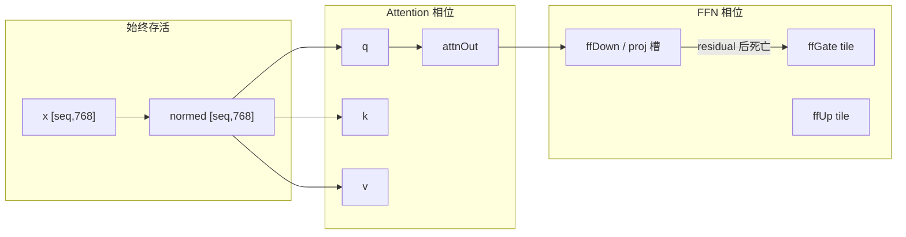
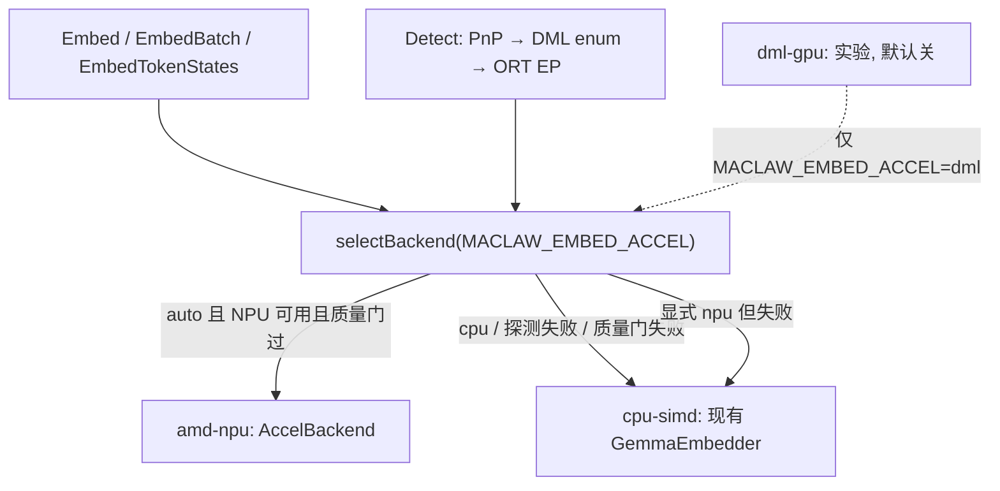
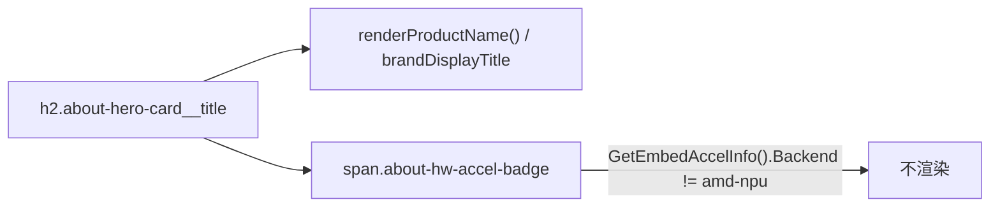

# Gemma 3 / EmbeddingGemma 推理加速开发规划

| 字段 | 值 |
|---|---|
| 状态 | Draft |
| 作者 | TBD |
| 日期 | 2026-08-19 |
| 包 | `corelib/embedding`、`corelib/embedding/tensor`、`corelib/embedding/gguf` |
| 模型制品 | `embeddinggemma-300M-Q8_0.gguf`（`embedding.DefaultModelFilename`） |
| 读者 | 熟悉本仓库 SenseVoice / PP-OCR SIMD 路径的工程师 |
| 相关实现 | `docs/design/ppocr-operator-fusion-report-zh.md`、`docs/gui-startup-optimization-plan.md` |

> 本文是可落地的开发规划，不是口号清单。所有超参、函数名、缓冲布局均以 2026-08 工作区源码为准。NPU 相关结论以**运行时探测**为前提；文末「样机事实」只描述验证机，不代表用户机器。

---

## Overview

UIC、工具路由、Hub / HubCenter class head、知识库向量化、TTS `EmbedTokenStates` 都走同一套纯 Go EmbeddingGemma（Gemma 3 embedding 家族，代码按 Gemma2-style transformer 实现）。热路径已经是 mmap Q8_0 + `tensor.MatMulQ8` + AVX2/AVX-512 分发，但 **Gemma 前向没有复用 SenseVoice / PP-OCR 已验证的加载期与内核级融合**，短文本仍被「三次独立 QKV GEMM、两次独立 gate/up GEMM、逐 token RMSNorm/RoPE、每并发一套不相交 scratch」卡住。

规划分两层：默认路径继续是无 CGO 的 `cpu-simd`（在现有 `tensor/cpu_amd64.go` 上扩固定几何内核与融合算子）；可选 `AccelBackend` 在 Windows amd64 **运行时**探测 AMD NPU / XDNA，成功才加载单独的 ONNX 制品。探测失败必须无感回退 CPU。禁止把现有 GGUF Q8 汇编直接映射到 XDNA，也禁止启动期硬链 AMD SDK。

---

## Background & Motivation

### 当前实现（源码事实）

包头注释（`corelib/embedding/gemma.go`）写明架构：

- Gemma2-style transformer：GQA（3 heads / 1 KV head）、QK-norm、post-attn RMSNorm、post-FFN RMSNorm、SiLU-gated FFN、RoPE
- 输出：mean-pool → L2 normalize；MRL 截断 768 → 512 / 256 / 128
- 权重量化：大矩阵保持 Q8_0 mmap，按 block 在 MatMul 内反量化；norm 向量解到 float32

`NewGemmaEmbedder` 从 GGUF meta 读取、缺省值与代码推导一致：

| 字段 | 来源 / 缺省 | 值 |
|---|---|---|
| `Dim` | `*.embedding_length` | 768 |
| `NLayers` | `*.block_count` | 24 |
| `NHeads` | `*.attention.head_count` | 3 |
| `NKVHeads` | `*.attention.head_count_kv` | 1 |
| `HeadDim` | `Dim / NHeads` | 256 |
| `KVDim` | `HeadDim * NKVHeads` | 256 |
| `FFDim` | `*.feed_forward_length` | 1152 |
| `MaxSeqLen` | `*.context_length` | 2048 |
| `RMSNormEps` | `*.attention.layer_norm_rms_epsilon` | 1e-6 |
| `RopeTheta` | `*.rope.freq_base` | 1e6 |
| 输出维 | `NewGemmaEmbedder(path, dim)` | UIC 默认 256；TTS 传 768 |

Early-exit（`gemma.go` `NewGemmaEmbedder`）：`dim<=128` → `NLayers*2/3`（24→16）；`dim<=256` → `NLayers*3/4`（24→18）；`dim>256`（TTS 768）关闭。

对外接口 `embedding.Embedder`（`embedder.go`）只有 `Embed` / `EmbedBatch` / `Dim` / `Close`。`EmbedTokenStates` 是 `*GemmaEmbedder` 的额外方法，被 `corelib/tts/bert_embedding.go` `ComputeBertEmbedding` 类型断言后调用，**必须保留 per-token `[seq, 768]` hidden，不能只留 mean-pool**。

进程内单例 `SharedGemma256()`（`shared.go`）缺模型时落到 `NoopEmbedder`，文件稍后出现可 `ReloadSharedGemmaIfReady()`。调用方：

| 调用方 | 用法 |
|---|---|
| `gui/app_embedding.go` `ensureEmbeddingEngineSync` / `activateEmbedderAsync` | 启动同步/异步加载，`NewGemmaEmbedder(path, 256)` 挂到 UIC |
| `gui/app.go` `sharedEmbeddingEmbedder` | GUI 共享实例 |
| `corelib/intent/layer2.go` | UIC L2 `embedder.Embed` / `EmbedBatch(anchors)` |
| `corelib/tool/hybrid.go`、`corelib/tool/intent_classifier.go` | 工具语义路由 |
| `hub/internal/httpapi/llm_class_head.go`、`hubcenter/internal/llmservice/class_head.go` | `SharedGemma256()` |
| `corelib/knowledge/vector_search.go`、`import_parallel.go` | `EmbedBatch` 切片向量化 |
| `corelib/tts/bert_embedding.go`、`corelib/tts/cmd/synthesize` | `EmbedTokenStates`，dim=768 |
| `MaClawSrv/ai_models.go` | 服务端预热 `NewGemmaEmbedder(path, 256)` |

已有 SIMD / 融合（Gemma **部分**用上）：

- `tensor.SiLUMul`、`tensor.RoPEPrecomputed`（amd64 AVX）、`tensor.SoftmaxWeightedSumStrided`
- `Q8Tensor` + `MatMulQ8` / `MatMulQ8Bias` / `q8MultiDot4/8` + dual-B
- 固定几何：`q8MultiDot4ScaledAVX2N16`（K=512）、`…N64`（K=2048）、AVX-512 同形状
- 分发：`tensor/cpu_amd64.go` 的 `hasAVX2andFMA` / `hasAVX512` / `hasAVX512VNNI`
- SenseVoice 加载时 `q.PrepareScales()`（`corelib/asr/sensevoice.go`）；Gemma `loadWeightsMmap` **没有**调用

### 痛点

1. UIC 短文本（seq≈16–64）被小循环调度和重复扫 `normed` 拖慢，和知识库长文本（seq≈256–512）的瓶颈不同，但共用同一套未融合前向。
2. `EmbedBatch` 用 `runtime.NumCPU()` 套完整 scratch，pool 只放大不缩小；16 worker × 满 `MaxSeqLen` 会把峰值内存打到数百 MiB。
3. SenseVoice 已有 `FuseAdd*AndLN512`、`PackQKV*`、Q4×Q8 VNNI；PP-OCR 报告 §2.3 的分层是 **图级 / 内核级 / 流水线**。Gemma 前向是「逐算子 Go 循环 + 通用 Q8 GEMM」，本规划**借用该分层思路并改名**（图级 → 加载期折叠，流水线 → 缓冲生命周期），不是沿用同一套用语。
4. 仓库内 **零** AMD NPU / Ryzen AI / VitisAI / DirectML NPU 探测或后端。不能把验证机有无 NPU 写进二进制假设。

### 样机事实（动态探测的动机，不是产品前提）

验证机：

- CPU：`AMD Ryzen 7 8745HS w/ Radeon 780M Graphics`，8C/16T（Hawk Point / Zen 4）
- PnP / WMI **未**枚举到 NPU / XDNA / Compute Accelerator
- 公开规格：8745HS 是 Hawk Point 中国区 / OEM SKU，相对 8845HS 的 16 TOPS XDNA，通常**关掉 NPU**
- 本机有 Radeon 780M iGPU，可作 DirectML / 图形计算实验后备，**不是 NPU**

因此：必须运行时探测；失败无感回退 `cpu-simd`；NPU 不能做成硬依赖。本机只用于 CPU SIMD 回归与「探测失败路径」验收：系统开关 **unchecked+disabled**，关于页 **无徽章**。NPU 集成与徽章点亮在有 XDNA 的机器上验；用户将在那些机器上调试 NPU。CI 无 NPU 时 skip 的是 NPU 用例，不是整个 `embedding` 包。

---

## Goals & Non-Goals

### Goals

1. 在现有 `tensor` ISA 分发上加速 EmbeddingGemma CPU 路径（SIMD + 算子融合）。
2. 降低单次推理 scratch 与并发峰值，不把 Q8 权重量化成整模型 float32。
3. 增加可选加速后端，Windows amd64 **运行时**探测 AMD NPU；失败回退 CPU。
4. 保持 `Embedder` 对外契约、`SharedGemma256()`、`EmbedTokenStates` 语义不变。
5. 给出可独立合并、可独立 revert 的 PR（PR1 / 2a / 2b / 2c / 3a / 3b / 4 / 5 / 6）。禁止把 overlay 与 RMSNorm 汇编、或 F3a 与 F3b 捆成一个不可拆的提交。

### Non-Goals

1. 不把整模型替换成 llama.cpp / ggml 运行时（见 Alternatives）。
2. 不为本轮强制改 Q4 权重量化；VNNI 只作为可选实验，且必须过质量门。
3. 不以 ARM64 为主战场；NEON 保持可编译，固定几何内核先做 amd64。
4. 不在启动路径硬链 AMD Ryzen AI SDK / VitisAI，不在探测失败时下载数百 MB EP。
5. 不把 780M iGPU 默认打开（和 GUI 抢带宽）。
6. 不改 UIC / 工具路由 / class head 的业务语义，只加快同一向量。

---

## Key Decisions

1. **默认永远是纯 Go + SIMD，无 CGO。** 现有 Windows 桌面部署、mmap Q8、无额外运行时的约束不能破。NPU 是可选插件，不是新默认。
2. **在 `tensor/cpu_amd64.go` 上扩展分发，不另起 ISA 层。** SenseVoice / PP-OCR 已验证 `AVX512VNNI → AVX512 → AVX2+FMA → AVX → scalar`。Gemma 只增加 K=768 / K=1152 固定几何与融合入口。
3. **不改 `Embedder` 接口。** 可观测性用 `CurrentAccelInfo() AccelInfo`（避免与类型同名）。`NewGemmaEmbedder` **永远**返回 `*GemmaEmbedder`。`SharedGemma256()` 在已加载时也是 `*GemmaEmbedder`（否则 `NoopEmbedder`）。禁止包一层会让 `corelib/tts/bert_embedding.go` 的 `emb.(*embedding.GemmaEmbedder)` 失败的 wrapper——失败会静默返回全零 BERT 表。NPU 只作为 `*GemmaEmbedder` 的可选字段，且 **`dim==768` / `EmbedTokenStates` 永不选 NPU**。
4. **NPU 不能吃 GGUF Q8_0 自定义内核。** XDNA 路径需要单独 ONNX（INT8/UINT16 或 Ryzen AI 编译图）+ 质量门（短/中/长文本 vs CPU cosine ≥ 0.99）。失败即 CPU。
5. **不为 VNNI 强制改 Q4。** 现有 `q4_vnni_*` 服务 SenseVoice FFN-down（ReLU 非负激活 × Q4）。Gemma 权重是 Q8_0、SiLU 激活有负值。先把 Q8 固定几何做满；VNNI 预量化是 PR4 之后的可选实验。
6. **禁止整模型 f32 解量化。** token 表按行 Dequant；投影矩阵保持 Q8 mmap。`PrepareScales` 只缓存 f16→f32 的 scale（约 12 MiB 投影 + 可选 token 表）。
7. **scratch 按生命周期 overlay + seq bucket（16/64/256/512），并给并发硬顶。** pool 不得按 `MaxSeqLen=2048` 撑满后永不缩小。
8. **生产路径禁止写进程级 `SetMatMulMaxParallel`。** 今日写者：`gemma_infer.go` `EmbedBatch`（`defer` 恢复）与 `corelib/tool/hybrid.go:373-396`（**非** `defer`，panic 会把全局旋钮留在 1）。matmul pool 是进程级 12-worker `jobQueue`（`tensor/pool.go`）。PR1 **同一提交**必须：(0) 先冻结 §G 基线（调度不变，写入本文表格）；(1) 新增 `MatMulQ8N(..., maxWorkers int)`，`maxWorkers==1` 永不入队；(2) `EmbedBatch` / `EmbedConcurrent` 调用方 / `hybrid.go` 的每条推理 `maxWorkers=1`；(3) 再删除那两处全局写。单条 `Embed()`（mutex 路径）仍允许 `maxWorkers=0`（走现有 `shouldParallel`）。内层并行再调只能在 PR2a 的 batch 级 worker cap 之后。`SetMatMulMaxParallel` 仅留给 bench/test。
9. **8745HS 上 DirectML/780M 默认关；仅当探测到 NPU 时 `auto` 才尝试 NPU。** iGPU 留给 GUI。`MACLAW_EMBED_ACCEL` 含 `dml`。后端在 `NewGemmaEmbedder` / `Open` 时钉死在该实例上，质量门事后变 pass **不得**让进行中的 EmbedBatch 中途换后端。
10. **融合正确性优先。** 分层**借用** PP-OCR 报告 §2.3 的思路，但用语改名为 加载期 / 内核级 / 缓冲生命周期（原报告是 图级 / 内核级 / 流水线）。数值门分两档：L1/L2/F5 近 bit-exact（max |Δ| ≤ 1e-5）；F2/F3/F4 才用 cosine ≥ 0.999 vs **fusion-off** 黄金向量。NPU ≥ 0.99 vs 同一 fusion-off CPU 参考。
11. **`forwardWithScratch` 与 `forwardTokenStates` 抽成同一层循环。** TTS 需要完整 hidden；mean-pool / MRL / L2 只挂在 `Embed` 出口。禁止为了省内存拆掉 token-state 路径。
12. **本机无 NPU 不是产品缺陷。** 探测失败是一等公民路径，测试不得 `Skip` 整个包。验证机 8745HS **没有** NPU；其它机器有 AMD NPU。NPU 支持仍是硬需求，调试在有 NPU 的机器上进行。
13. **每个新导出的 `tensor` 符号必须在同一 PR 提供 `*_generic.go`（或 arm64 stub）。** amd64 `.s` 不得让 `GOARCH=arm64` 编译失败。
14. **token cache 本轮不做 LRU。** 保持加载期静态前 1024 id 的只读 `map`（并发 `Get` 无写）。只把 `sqrt(dim)` 折进已缓存行。LRU 需要锁/分片，从热路径拿掉，另开 issue。
15. **关于页徽章只在 NPU 正在加速时出现。** 唯一谓词：`info := GetEmbedAccelInfo(); info.Backend == "amd-npu"`（**实例钉死**，`ApplyAccel(false)` 后必为 `cpu-simd`）。**禁止**读探测缓存 `CurrentAccelInfo().Backend`。CPU-SIMD、开关关闭、DirectML、无 NPU（8745HS）→ **不显示**。系统开关用探测缓存的 `NPUPresent`。
16. **硬件加速开关在「设置 → 系统」，探测门控。** 有 NPU：可点，**默认打开**，用户可关（强制 CPU SIMD）。无 NPU：**未勾选 + disabled 灰掉**，hover「本机未检测到 NPU」，点击无操作。`AppConfig.embed_hw_accel` 缺省 **true**；无 NPU 机器 **不得** 因灰开关而把存储写成 false（同一配置到有 NPU 的机器仍默认开）。`MACLAW_EMBED_ACCEL=cpu` 压过开关。持久化在 **PR5**（用户要的是真开关，不是只读 embedding 页）。

---

## A. 现状剖析

### A.1 一层 transformer 算子图

`forwardWithScratch`（`gemma_infer.go`）每层顺序：

```text
x[seq,768]
  → RMSNorm(attnNormW)                → normed[seq,768]
  → MatMulQ8 Q [768,768]              → q[seq,768]
  → MatMulQ8 K [256,768]              → k[seq,256]
  → MatMulQ8 V [256,768]              → v[seq,256]
  → 逐 token: Q-RMSNorm×3 + K-RMSNorm×1 + RoPE(q,k)
  → gqaAttention (3 heads, 1 KV)      → attnOut[seq,768]
  → MatMulQ8 O [768,768]              → projOut[seq,768]
  → 逐 token RMSNorm(postAttn) + Add   → x
  → RMSNorm(ffNormW)                  → normed
  → MatMulQ8 gate [1152,768]          → ffGate[seq,1152]
  → MatMulQ8 up   [1152,768]          → ffUp[seq,1152]
  → SiLUMul(ffGate, ffUp)
  → MatMulQ8 down [768,1152]          → ffDown[seq,768]
  → 逐 token RMSNorm(postFFN) + Add    → x
```

终局：逐 token `RMSNorm(outputNorm)` → mean-pool → 拷出 768 → 调用方 `truncateAndNormalize`（截到 `g.dim` 再 L2）。

```mermaid
flowchart TB
    subgraph load["加载期 loadWeightsMmap"]
        mmap["mmap Q8_0 GGUF"]
        norms["norm 向量 → f32"]
        q8["Q/K/V/O/gate/up/down 保持 Q8"]
        cache["tokenEmbCache 前 1024 id × 768 f32"]
        mmap --> norms
        mmap --> q8
        mmap --> cache
    end

    subgraph layer["一层 forwardWithScratch"]
        x["x [seq,768]"]
        n1["RMSNorm × seq 次"]
        qkv["三次独立 MatMulQ8 扫同一 normed"]
        qkr["QK-norm + RoPE × seq"]
        attn["gqaAttention: 每 head×query 标量循环"]
        o["MatMulQ8 O"]
        postA["RMSNorm + residual × seq"]
        n2["RMSNorm × seq"]
        gu["两次独立 MatMulQ8 gate/up"]
        silu["SiLUMul"]
        down["MatMulQ8 down"]
        postF["RMSNorm + residual × seq"]
        x --> n1 --> qkv --> qkr --> attn --> o --> postA --> n2 --> gu --> silu --> down --> postF
        postA --> x
        postF --> x
    end

    subgraph out["出口"]
        fn["final RMSNorm × seq"]
        pool["mean-pool"]
        mrl["MRL truncate + L2"]
        ts["EmbedTokenStates: 拷 [seq,768]"]
        fn --> pool --> mrl
        fn --> ts
    end
```



### A.2 内存流量（Q8_0 = 34 B / 32 元 = 1.0625 B/元）

单层大矩阵（只计权重读）：

| 矩阵 | 形状 | Q8 字节 |
|---|---|---|
| Q / O | `[768,768]` ×2 | 2 × 612 KiB |
| K / V | `[256,768]` ×2 | 2 × 204 KiB |
| gate / up / down | `[1152,768]` 或 `[768,1152]` ×3 | 3 × 918 KiB |
| **一层合计** | | **≈ 4.28 MiB** |

18 层（dim=256 early-exit）权重流量 ≈ **77 MiB**；24 层（TTS dim=768）≈ **103 MiB**。token 表约 256k × 768 × 1.0625 ≈ 209 MiB，但热路径只 `DequantRow` 未命中 cache 的 id。

激活写回（每层，未融合）：

| 缓冲 | 元素 | seq=64 | seq=256 |
|---|---|---|---|
| `normed` 写 2 次（attn + ffn） | `seq*768` | 384 KiB | 1.5 MiB |
| `q+k+v` | `seq*(768+256+256)` | 320 KiB | 1.25 MiB |
| `attnOut` + `projOut` | `2*seq*768` | 384 KiB | 1.5 MiB |
| `ffGate` + `ffUp` | `2*seq*1152` | 576 KiB | 2.25 MiB |
| `ffDown` | `seq*768` | 192 KiB | 768 KiB |
| **一层激活写** | | **≈ 1.8 MiB** | **≈ 7.3 MiB** |
| ×18 层累计写 | | ≈ 33 MiB | ≈ 131 MiB |

Q/K/V 各扫一遍 `normed`：短文本 `seq=32` 时 `normed` 仅 96 KiB，三次扫描的代价是 L1/L2 复用被打断 + 三次 GEMM 启动；长文本 `seq=256` 时 `normed` 768 KiB，三次扫描是真带宽浪费。

### A.3 FLOP 估计（按 2·M·N·K 计 GEMM；忽略 dequant）

单层 GEMM：

| 算子 | 2·M·N·K / seq |
|---|---|
| Q | 1.180e6 |
| K | 0.393e6 |
| V | 0.393e6 |
| O | 1.180e6 |
| gate / up / down | 3 × 1.769e6 |
| **合计** | **≈ 8.45e6 / token / layer** |

Attention 附加：`3 * seq² * 2 * 256 * 2`（score + 加权和）≈ `3072 * seq²`。seq=32 时约 3 MFLOP（相对 GEMM 270 MFLOP 可忽略）；seq=512 时约 0.81 GFLOP（相对 GEMM 4.3 GFLOP ≈ 19%）。

| 场景 | 层数 | seq | GEMM GFLOP | Attention GFLOP | 现 scratch | 权重流量 |
|---|---|---|---|---|---|---|
| UIC 短（「北京天气」级） | 18 | 16 | 2.4 | 0.001 | 0.47 MiB | 77 MiB |
| UIC / 工具路由典型 | 18 | 32 | 4.9 | 0.003 | 0.94 MiB | 77 MiB |
| 中等工具描述 | 18 | 64 | 9.7 | 0.013 | 1.88 MiB | 77 MiB |
| 知识切片 | 18 | 256 | 39 | 0.20 | 7.51 MiB | 77 MiB |
| 长文本 / 近上限半程 | 18 | 512 | 78 | 0.81 | 15.0 MiB | 77 MiB |
| TTS token states | 24 | 64 | 13.0 | 0.013 | 1.88 MiB | 103 MiB |

`newGemmaScratch` 现分配（float32 元素 ≈ `seq*7681 + 1536`）：

```
x + normed + q + k + v + attnOut + projOut + ffGate + ffUp + ffDown
+ ropeCos/Sin + rowBuf + scores + poolOut
= seq*(768*6 + 256*2 + 1152*2 + 128*2) + 768+768+seq
```

### A.4 瓶颈排序（短文本 vs 长文本）

| 优先级 | 瓶颈 | 短 seq≈32 | 长 seq≈256 | 证据 |
|---|---|---|---|---|
| 1 | Q8 GEMM（gate/up/down + Q/O） | 主导 | 主导 | 每层 8.45e6 FLOP/token；现成固定几何只有 K=512/2048。**K=768 与 K=1152 收益要拆开**（见下） |
| 2 | 三次 QKV / 两次 gate-up 重复扫 A | 中（启动+cache） | 高（带宽） | `forwardWithScratch` 连续 5 次独立 `MatMulQ8` |
| 3 | 中间张量写回 | 中 | 高 | 一层约写 1.8 / 7.3 MiB；无 overlay |
| 4 | 热路径 f16→f32 scale | 中 | 中 | `loadWeightsMmap` 不调 `PrepareScales`；`q8MultiDot4T` 无 scales 时走 `q8MultiDot4` |
| 5 | 逐 token RMSNorm / RoPE / 小循环 | 高（调度） | 低 | `for s := 0; s < seq` 调 `tensor.RMSNorm` / `RoPEPrecomputed` |
| 6 | `gqaAttention` 每 (head, query) 独立 softmax | 低 | 中 | `SoftmaxWeightedSumStrided` 仅 `dim==128` 走 `weightedSumStridedScaled`；`SoftmaxWeightedSumBatched` 对非 128 **已有 generic** `weightedSumStridedScaled`，缺的是 dim=256 特化内核 |
| 7 | token cache 未折 `sqrt(dim)` | 低 | 低 | 静态前 1024 id 只读 map；本轮不改 LRU |

`useQ8DequantOnce`（`q8.go:1189-1198`）：`hasScales && M>=8 && K<=1024` 才走「反量化一次 + f32 multiDot」。因此：

| 形状 | PrepareScales 之后 | 固定几何内核何时有用 |
|---|---|---|
| Q/O/gate/up，K=768，UIC seq≥8 | **dequant-once + f32 multiDot**（不是 fused `q8MultiDot4Scaled*`） | N24 只对 `M<8` 或日后抬高 `useQ8DequantOnce` 的 M 门槛有意义。PR4 **先 bench 再决定是否写大块 N24 AVX-512** |
| FFN-down，K=1152 | `K>1024`，**仍走 fused Q8** | **N36 是 PR4 的主 ROI** |
| 无 Scales（今日） | K=768 且 `M<32` 也不 dequant-once | PR1 `PrepareScales` 本身就是 K=768 热路径的主要加速 |

拆开的预期收益（相对「当前无 Scales、通用 multiDot」）：

| 项 | 主要作用形状 | 预期 |
|---|---|---|
| PR1 `PrepareScales` + 因此启用的 dequant-once | K=768、M≥8（典型 UIC 32/64） | 该部分 GEMM **5–15%** |
| PR4 N36 AVX2 | K=1152 down | down GEMM **10–20%**（约占一层 GEMM 的 1/3，端到端约 3–7%） |
| PR4 N24 | K=768 且 M&lt;8，或 dequant-once 被关掉之后 | **仅当 8745HS bench 击败 dequant-once 才合入大表面**；否则只留通用 `q8MultiDot4ScaledAVX2` |
| PR4 之后重调 `useQ8DequantOnce` | 可能抬 M 或排除 K=768 | 以实测为准，不在 PR1 猜 |

### A.5 缺口清单（已对源码核实）

1. `loadWeightsMmap` 构造 `tensor.Q8Tensor{Data, Rows, Cols}` 后从不 `PrepareScales()`。SenseVoice `getLinear` 在 Q8_0 分支会调。
2. Q/K/V、gate/up 对同一 `normed` 各做一次完整 GEMM。
3. RMSNorm / RoPE 按 token 调，没有 `[seq, dim]` 批量化内核。`tensor` 里只有单向量 `RMSNorm`。
4. `gqaAttention`：`for h / for sq / for sk { tensor.Dot }` + 每次 `SoftmaxWeightedSumStrided`（dim=256 走 vek `MulNumber` + `WeightedSumStrided`）。`SoftmaxWeightedSumBatched` 已支持 nQ∈{4,8} 的 generic 256 路径；缺 dim=256 的 `weightedSumBatchedContig` 特化。
5. `newGemmaScratch` 分配全套不相交缓冲；`getScratchFromPool` 只在 `seqCap>=seq` 时复用，**过小丢弃、过大永不收缩**。
6. `tokenEmbCache` 预解 1024 × 768 f32 ≈ **3.00 MiB**，只读 `map`，热路径命中后仍 `tensor.Scale(dst, sqrt(dim))`。本轮只折 scale，不做 LRU。
7. 进程级 `SetMatMulMaxParallel(1)` 的**生产**写点有两处：`gemma_infer.go` `EmbedBatch`（`defer` 恢复）与 `corelib/tool/hybrid.go:373-396`（`wg.Wait()` 之后才写回 0，无 `defer`）。bench/test 写者可保留。`EmbedBatch` worker = `NumCPU()`。
8. 不复用 `FuseAdd*AndLN512` / `PackQKV*`（那些是 LN dim=512、head=128）。Gemma 是 RMSNorm dim=768、headDim=256。
9. `q4_vnni` / AVX-512 VNNI 只服务 SenseVoice Q4×Q8。
10. 仓库无 NPU / Ryzen AI / VitisAI / DirectML 探测。

---

## B. SIMD / 向量加速

### B.1 分发（保持现有层）

`tensor/cpu_amd64.go` 已有：

```go
hasAVX2andFMA = cpu.X86.HasAVX2 && cpu.X86.HasFMA
hasAVX        = cpu.X86.HasAVX
hasAVX512     = AVX512F && AVX512DQ && AVX512VL && AVX512BW
hasAVX512VNNI = hasAVX512 && cpu.X86.HasAVX512VNNI
```

Gemma 新内核必须走同一套开关。Zen 4（含 8745HS）通常有 AVX-512（256-bit 双泵）和 VNNI；**仍以运行时 flag 为准**，并在基准里对比 AVX-512 vs AVX2——双泵上固定几何 AVX2 有时更快，PR4 以实测选默认。

ARM64：`q8_multidot_arm64.s` / `rope_arm64.s` 保持可编译；本轮不写 K=768 的 NEON 特化。

### B.2 优先级与理由

| 序 | 项 | 算法风险 | 预期收益 | 理由 |
|---|---|---|---|---|
| 1 | 加载时 `PrepareScales()` | 无（与 SenseVoice 同一 API） | K=768 + M≥8：**dequant-once 5–15%**；并去掉每 block f16 转换 | PR1。不依赖 N24 |
| 2 | 固定几何 **N36（K=1152）** AVX2（AVX-512 可选） | 低 | down GEMM 10–20% | PR4 必做。K=1152 不走 dequant-once |
| 3 | 批量化 `RMSNormRows768` / `RMSNormRows256` / `RoPESeq` | 低 | 短文本 5–10% | PR2c。同一 PR 必须有 `*_generic.go` |
| 4 | 固定几何 **N24（K=768）** | 低 | **未证实**（PR1 后 UIC 热路径走 dequant-once） | PR4 仅当 bench 击败 dequant-once 才合入 AVX-512 大表面 |
| 5 | 可选：激活预量化 + VNNI 做 FFN-down | 中高 | 未证实 | 不要为 VNNI 改 Q4 |
| 6 | ARM64 新特化 | — | 本轮不做 | NEON 保持可编译；新符号走 generic |

`PrepareScales` 增量 RSS：投影矩阵 24 层 × 132096 block × 4 B ≈ **12.4 MiB**。token 表若也准备：约 24 MiB，只加速 cache miss 的 `DequantRow`，PR1 先做投影，token 表可选。

建议新符号（N36 先合；N24 受 bench 门控）：

```go
// nBlocks==36 → K=1152 (FFN-down 的 K) —— PR4 必做
q8MultiDot4ScaledAVX2N36
q8DualMultiDot4ScaledAVX2N36
// nBlocks==24 → K=768 —— 仅当击败 dequant-once
q8MultiDot4ScaledAVX2N24
q8DualMultiDot4ScaledAVX2N24
// AVX-512 变体同名；Zen 4 上以 bench 选默认。每个符号配 q8_multidot_generic.go 已有标量路径即可。
```

### B.3 CPU feature 运行时分发（必须）

```text
hasAVX512VNNI  → 仅可选 FFN-down 预量化路径（本轮默认关）
hasAVX512      → N36（及过门的 N24）AVX-512 内核（若 bench ≥ AVX2）
hasAVX2andFMA  → N36 AVX2（Gemma down 默认主力）
hasAVX         → 已有 RoPE AVX1；GEMM 走通用路径
scalar         → 已有 q8MultiDot4Scalar / *_generic.go
```

禁止编译期 `#ifdef` 假设「所有 AMD 都有 AVX-512 / NPU」。

---

## C. 算子融合（正确性优先）

PP-OCR 报告 §2.3 原文是 **图级 / 内核级 / 流水线**。本规划**借用分层思路，改名**如下（不是同一套用语）：

| 本规划层次 | 对应 §2.3 | 做法 | Gemma 落地 |
|---|---|---|---|
| 加载期折叠 | 图级（GGUF 无 ONNX 图可改写） | 启动时改缓存/scale，运行时少做事 | `PrepareScales`；token 表预乘 `sqrt(dim)` |
| 内核级 | 内核级 | 同一循环做多项计算 | 下列 F1–F7 |
| 缓冲生命周期 | 流水线（此处不是 OCR 前后处理，是 arena overlay） | overlay / 分桶，不改数学 | §D / PR2b |

图级融合（改 ONNX 节点）不适用于本 GGUF 前向。

### C.1 加载期

#### L1. `Q8Tensor.PrepareScales()`

- **等价**：`scale_f32 = float16to32(block.scale)` 与热路径逐次转换同一函数（`float16to32Fast` / F16C bulk）。
- **数值**：应与现路径 bit-exact（同一转换例程）。
- **中间张量**：无；增加长期 `Scales []float32`。
- **省字节**：不省，+12.4 MiB RSS。换的是每层 132096 次 f16 转换。

#### L2. token cache 预乘 `embScale = sqrt(dim)`

- **等价**：`Scale(dequant(row), sqrt(768))` 满足结合律；cache 存 `dequant*scale`，命中后不再 `tensor.Scale`。
- **数值**：同一 f32 乘法，应 bit-exact。
- **中间**：无。未命中路径仍 `DequantRow` + `Scale`。
- **省字节**：0。省的是每次命中的 768 次乘。

### C.2 内核级（收益最大）

#### F1. `RMSNormRows` + 可选写回融合进后续 GEMM 的 A

现：`for s { RMSNorm(normed[s], x[s], w, eps) }` 再 `MatMulQ8(q, normed, …)`。

- **等价**：RMSNorm 按行独立，`out_i = x_i / sqrt(mean(x²)+eps) * w_i`。批量化只改循环粒度。
- **数值**：同一公式，门控 **T_exact**（max |Δ| ≤ 1e-5），不是 0.999 cosine。
- **中间**：`normed` 仍在（GEMM 的 A）。真正消掉 `normed` 需要「边 RMS 边喂 GEMM tile」，放到 F2 之后做第二刀。
- **省字节**：0（第一刀）；第二刀见 overlay。
- **实现**：`tensor.RMSNormRows(out, x, w, seq, dim, eps)`，dim=768/256 走固定内核。

#### F2. 同 A 三输出 QKV GEMM（Go-first M-panel，不复制权重）

禁止加载期拼一份 packed `[1280,768]` Q8 拷贝（+≈25 MiB）。K/V 的 N=256 与 Q 的 N=768 **不相等**，没有「三套 B 同步 N-tile 轮转」的单一汇编循环。PR3a 实现为 **Go M-panel**：一次取出 A 的 8 行，连续三次调用现有 `MatMulQ8N`。

```go
// q: [seq, 768] row-major, strideQ = 768
// k: [seq, 256] row-major, strideK = 256
// v: [seq, 256] row-major, strideV = 256
// a: [seq, 768] row-major, K = 768  （即 normed）
// wq: Q8 [768, 768]  （Rows=Nq=768, Cols=K=768）
// wk, wv: Q8 [256, 768]
// maxWorkers: 1 在 EmbedBatch 项内；0 表示走 shouldParallel（仅单条 Embed）
func MatMulQ8PackedQKV(q, k, v, a []float32, wq, wk, wv *Q8Tensor, seq, maxWorkers int) {
    const K, Nq, Nkv, mt = 768, 768, 256, 8
    for m0 := 0; m0 < seq; m0 += mt {
        rows := mt
        if m0+rows > seq {
            rows = seq - m0
        }
        aPanel := a[m0*K : (m0+rows)*K] // 8×768×4 ≈ 24 KiB，三次 B 扫描间留在 L1/L2
        MatMulQ8N(q[m0*Nq:], aPanel, wq, rows, Nq, K, maxWorkers)
        MatMulQ8N(k[m0*Nkv:], aPanel, wk, rows, Nkv, K, maxWorkers)
        MatMulQ8N(v[m0*Nkv:], aPanel, wv, rows, Nkv, K, maxWorkers)
    }
}
```

- **K/V 先结束**：`wk`/`wv` 只跑 N=256；`wq` 继续 N=768。不存在「K/V 结束后还对它们做 N-tile」的步骤。
- **dual-B**：仍发生在**同一** `Q8Tensor` 的相邻两行内部（现有 `q8DualMultiDot*`）。三套权重之间不 dual。
- **自定义三 B 汇编**（A 留在寄存器横跨 Q/K/V）：可选 PR4 follow-up，**不是** 3a 的准入条件。
- **等价**：`q = A Wqᵀ` 等三个独立乘；只改循环嵌套，不改权重。
- **数值**：T_gemm（cosine ≥ 0.999 vs fusion-off）。不允许改权重。
- **中间**：仍物化 `q,k,v`。
- **省字节**：0 激活；省 2 次 `normed` 全量重读（seq=64：256 KiB；seq=256：1.5 MiB 读带宽）。
- **不要**复用 SenseVoice `PackQKV128`：那是 headDim=128 的打包，不是三矩阵 GEMM。

#### F3. `gate + up + SiLUMul`（最好 down 前不物化两个完整 `[seq, ffDim]`）

两档：

**F3a（PR3a，安全，不改形状）**：与 F2 相同的 Go M-panel，对 **同一 A、两套 N=1152 的 B**（`Wgate`/`Wup` 都是 `[1152,768]`）：

```go
func MatMulQ8DualOut(gate, up, a []float32, wGate, wUp *Q8Tensor, seq, maxWorkers int) {
    const K, N, mt = 768, 1152, 8
    for m0 := 0; m0 < seq; m0 += mt {
        rows := min(mt, seq-m0)
        aPanel := a[m0*K : (m0+rows)*K]
        MatMulQ8N(gate[m0*N:], aPanel, wGate, rows, N, K, maxWorkers)
        MatMulQ8N(up[m0*N:],   aPanel, wUp,   rows, N, K, maxWorkers)
    }
    tensor.SiLUMul(gate[:seq*N], up[:seq*N])
}
```

仍物化完整 `[seq,1152]`×2。省一次 A 扫描。数值：T_gemm。

**F3b（PR3b，改布局）**：默认 **tile = 384**（`1152/384 = 3`，无 remainder）。192 与 128 也可整除；**不要用 256**（`1152/256 = 4.5`，尾块 128，arena 不能按单一 tile 计）。

Q8_0 在 K 上按 32 元分块。384/32 = 12 blocks，合法。`ffDownWeight` 是 `[768,1152]`（Rows=768=N_out，Cols=1152=K_down）。tile 循环切的是 **down 的 K** 与 **gate/up 的 N**。

**禁止** `KBlockRange` 做成「改 `Cols` 的 `Q8Tensor` 子切片」。今日布局是 **row-major**：row `r` 的 block `b` 在 `(r*(Cols/32)+b)*34`。K 窗 `[384,768)` 是**每一行**的 block 12–23，步长为父张量的 36 blocks，不是一段连续的 `Cols=384`。`MatMulQ8*` 用 `rowBytes=(Cols/32)*34`；`Q8Tensor{Data: t.Data[off:], Cols: kLen}` 会在第一行之后读错字节。也不在本轮给 `Q8Tensor` 加 `rowStride`（那会改所有现有内核）。

```go
const ffTile = 384 // must divide 1152; multiple of 32

// 行切片：gate/up 的 B 是 [1152,768]，取 Rows [n0,n1)。内部走 MatMulQ8N(..., maxWorkers)。
func MatMulQ8RowRange(out, a []float32, b *Q8Tensor, M, K, n0, n1, maxWorkers int)

// down 的 K 窗：在父张量上按 r*parentBlocks + k0/32 取 block，不构造子 Q8Tensor。
// k0、kLen 必须是 32 的倍数。maxWorkers==1 时永不入 jobQueue。
// accum=true：out[m,n] += dot（F3b tile 累加）。
func MatMulQ8NKRange(out, a []float32, b *Q8Tensor, M, N, k0, kLen, maxWorkers int, accum bool)

func MatMulQ8SwiGLUDown(x, a, gTile, uTile []float32, wGate, wUp, wDown *Q8Tensor, wRMS []float32, seq, maxWorkers int, eps float32) {
    // a: [seq,768]；gTile/uTile: [seq, 384]
    // acc: residual 槽 [seq,768]，先清零。RMS 在 tile 循环后对 acc 原地做，不经过 yTile。
    acc := /* residual slot */
    for t := 0; t < 3; t++ {
        n0 := t * ffTile
        MatMulQ8RowRange(gTile, a, wGate, seq, 768, n0, n0+ffTile, maxWorkers)
        MatMulQ8RowRange(uTile, a, wUp,   seq, 768, n0, n0+ffTile, maxWorkers)
        tensor.SiLUMul(gTile, uTile)
        MatMulQ8NKRange(acc, gTile, wDown, seq, 768, n0, ffTile, maxWorkers, true)
    }
    // 完整 768 列之后才能 RMS。禁止对 384-K tile 做 RMS。
    for s := 0; s < seq; s++ {
        row := acc[s*768 : (s+1)*768]
        tensor.RMSNorm(row, row, wRMS, eps)
        tensor.Add(x[s*768:(s+1)*768], x[s*768:(s+1)*768], row)
    }
}
```

`MatMulQ8RowRange` / `MatMulQ8NKRange` / `MatMulQ8SwiGLUDown` **每一处** GEMM 都下传 `maxWorkers`。`maxWorkers==1` 走 serial 内核，**不**调用今日无 cap 的 `MatMulQ8BiasAdd`（`q8.go:910`，`seq≥3` 时 `M*N*K=seq*768*384≥1e6` 会入进程 `jobQueue`）。PR3b 回归：`maxWorkers==1` 时 jobQueue 入队计数为 0，且不写 `SetMatMulMaxParallel`。

- **等价**：SiLU 逐元，`down(SiLU(gate)*up) = Σ_t down_t(SiLU(gate_t)*up_t)`，down 对 K 线性。
- **数值**：T_gemm（tile 累加顺序变化）。
- **中间**：`ffUp`/`ffGate` 整缓冲消失，只留 `seq*384`×2。
- **RMSNorm**：必须等 **完整 768 列 accumulator**。F4 epilogue 挂在 tile 循环之后，不能按 384 列做 RMS。
- **省字节**（相对今日 `ffGate+ffUp` = `2*seq*1152`）：

| | 今日 | F3b tile=384 | 节省 |
|---|---|---|---|
| seq=64 | 576 KiB | 192 KiB | **384 KiB** |
| seq=256 | 2.25 MiB | 768 KiB | **1.50 MiB** |

#### F4. `MatMulQ8(O 或 down) + RMSNorm + residual Add`

SenseVoice 先例是 `FuseAdd1AndLN512`（**LayerNorm + bias**，dim=512）。Gemma 是 **RMSNorm、无 bias、dim=768**，不能调用现成 LN 内核。

RMSNorm 需要整行 `sum(x²)`，不能在 GEMM 累加器中途做，也不能在 F3b 的 384-K tile 上做。正确融合是 **行 epilogue**：先完成 8 个 token 的 **整行 N=768**，再 RMS，再加进 `x`。

`a`（attention 输出）在 O 投影期间只读；epilogue 缓冲 `yTile` 必须与 `a`、`x` 都相交为空。

```go
// x:     [seq, 768] residual in/out
// a:     [seq, K]    只读（O 投影时 K=768，即 attnOut）
// yTile: [mt, 768]   mt<=8，与 a、x 不相交的 epilogue scratch
// b:     Q8 [N=768, K]
// wRMS:  [768]
func MatMulQ8RMSResidual(x, a, yTile []float32, b *Q8Tensor, wRMS []float32, seq, N, K, mt, maxWorkers int, eps float32) {
    if mt <= 0 || mt > 8 {
        mt = 8
    }
    for m0 := 0; m0 < seq; m0 += mt {
        rows := min(mt, seq-m0)
        MatMulQ8N(yTile[:rows*N], a[m0*K:(m0+rows)*K], b, rows, N, K, maxWorkers)
        // yTile 现在是完整 768 列，才能 RMS
        for r := 0; r < rows; r++ {
            y := yTile[r*N : (r+1)*N]
            tensor.RMSNorm(y, y, wRMS, eps)          // T_exact 公式
            tensor.Add(x[(m0+r)*N:(m0+r+1)*N], x[(m0+r)*N:(m0+r+1)*N], y)
        }
    }
}
```

- **等价**：`x ← x + RMSNorm(y, w)`，`y` 为 O（或 F3b 之后的 down acc）的完整行。
- **数值**：RMS 本身 T_exact；与独立 GEMM 相比若 reduction 顺序变了，整段走 T_gemm。
- **中间**：O 投影用独立 `yTile`（8×768）作 epilogue，**不得**与 `residual`/`acc`/`attnOut`/`x` overlay。F3b 的 down acc 留在 `residual` 全长 `[seq,768]`，RMS **原地**做在 `acc` 上，不把 `yTile` 叠在 `acc[:6144]`（否则 token 0–7 会毁掉还活着的累加器）。
- **省字节**：相对今日 `attnOut+projOut+ffDown` 三份 dim 缓冲，O 投影阶段只保留 `a` + `yTile`。seq=64 量级数百 KiB（精确数见 PR2b 布局表）。

#### F5. `QK-norm + RoPE` 单 pass

现：每 token 3×Q RMSNorm(256) + 1×K RMSNorm(256) + `RoPEPrecomputed(q)` + `RoPEPrecomputed(k)`。

```text
RMSNormRoPESeq(q, qW, cos, sin, seq, nHeads=3, headDim=256)
RMSNormRoPESeq(k, kW, cos, sin, seq, nKVHeads=1, headDim=256)
```

- **等价**：RMSNorm 与 RoPE 作用在同一 256 维子空间且 RoPE 在 norm 之后；逐 head 独立。
- **数值**：T_exact（同一 rms 再同一 cos/sin）。
- **中间**：无消失。省调用次数与 q 的二次写。
- **省字节**：0。

#### F6. `gqaAttention` 按 query tile 复用 K/V

- 一次算 nQ∈{4,8} 个 query 的 score，再复用同一 V 流。
- `SoftmaxWeightedSumBatched` **generic 路径已经能做 dim=256**（`ops.go`：非 128 时对每个 query 调 `weightedSumStridedScaled`）。缺的是类似 `weightedSumBatchedContig128` 的 **dim=256 特化内核**，不是「Batched 不能跑 256」。
- `SoftmaxWeightedSumStrided`（今日 `gqaAttention` 用的）仅 `dim==128` 走 scaled 快路径；256 走 vek `MulNumber` + `WeightedSumStrided`。
- **等价**：softmax 按行独立。
- **数值**：T_exact（同一 softmax 公式；特化内核对照 generic）。
- **中间**：`scores` 从 `[seq]` 扩到 `[nQ,seq]`。seq=512、nQ=4 仅 +6 KiB。
- **省字节**：可忽略。长文本加速大于短文本。PR4 与 N36 一起做 dim=256 快路径即可。

#### F7. mean-pool + MRL truncate + L2（仅 `Embed`）

**不是**「mean 与 RMSNorm 可交换」。RMSNorm 按 token，mean-pool 跨 token。`RMSNorm(mean(x)) ≠ mean(RMSNorm(x))`。

与今日 `forwardWithScratch` + `truncateAndNormalize` **相同顺序**：

```text
对每个 token s:  xs ← RMSNorm(x[s], outputNorm)     // 按行
sum[d] += xs[d]                                      // 累加的是 RMSNorm 之后的行
mean[:outDim] = sum[:outDim] / seq
L2Normalize(mean[:outDim])
```

实现上可以在 final RMSNorm 的同一 seq 循环里累加，避免第二遍读 `x`；数学上就是「先逐行 RMSNorm，再 mean，再截断，再 L2」。

- **数值**：T_exact。
- **中间**：`poolOut` 可直接按 `outDim` 截断累加。
- **禁止**用在 `EmbedTokenStates`：TTS 要完整 `[seq,768]`，不做 mean/MRL。

### C.3 缓冲 overlay（生命周期融合）



**可 overlay（证明）**：

| 槽 A | 槽 B | 条件 |
|---|---|---|
| `attnOut` | `ffDown` | O 投影 + post-attn residual 完成之后才进 FFN-down |
| `projOut` | `ffDown` | post-attn `x += RMS(projOut)` 之后 `projOut` 不再读 |
| `q` | `ffGate` 前缀 | attention 结束后才算 gate；F3b 时 gate 只是 tile，整段 `q+k+v+attnOut`（seq×2048）与 `ffGate+ffUp`（seq×2304）取 max |
| `normed` | 不可与 `x` overlay | residual 期间两份都活 |
| `k`/`v` | 不可在 attention 前覆盖 `q` | GQA 全程读 |

**PR2b 目标 arena（未融合形状，phase-max）** — 这才是 −40% 的退出条件，不依赖 F3b：

未融合时 attention 相位需要 `q+k+v+attnOut = seq*2048`，FFN 相位需要 `ffGate+ffUp = seq*2304`，二者不同时活。再加始终活的 `x`、`normed`，以及 residual 槽 `projOut≡ffDown`（`seq*768`）。

激活主体 = `seq * (768 + 768 + 2304 + 768) = seq * 4608` floats。相对今日主体 `seq*7680`，正好 **−40%**。

RoPE / scores / 小缓冲**另外计**，不塞进 −40% 分子（见下表）。§G 的 MiB 上限按**含 RoPE 的总 scratch** 放宽到 1.3 / 5.0 MiB。

#### PR2b 显式 float32 布局（bucket 以 seqCap 计；下表用逻辑 seq，实现按 seqCap 对齐）

`arena` 为单一 `[]float32`。偏移以 float 计。`phase` 在 attn / ffn 复用同一段。

| 名字 | 偏移（floats） | 元素数 | 活相位 | 别名 |
|---|---|---|---|---|
| `x` | 0 | `S*768` | 全程 | 无 |
| `normed` | `S*768` | `S*768` | 全程（attn 前与 FFN 前写） | 不可与 `x` |
| `phase` | `S*1536` | `S*2304` | attn 或 FFN，互斥 | 见下行 |
| `q` | `phase+0` | `S*768` | attn，直到 `gqaAttention` 返回 | 与 `ffGate` 前缀 overlay |
| `k` | `phase+S*768` | `S*256` | attn | FFN 相位可覆盖 |
| `v` | `phase+S*1024` | `S*256` | attn | FFN 相位可覆盖 |
| `attnOut` | `phase+S*1280` | `S*768` | attn 至 F4 的 `a` 读完 | 不可与 `yTile`；之后让给 `ffGate` 尾部 |
| `ffGate` | `phase+0` | 预留 `S*1152`；3b **活切片** `S*384` | FFN | overlay `q` 起 |
| `ffUp` | `phase+S*1152` | 预留 `S*1152`；3b **活切片** `S*384` | FFN | overlay `k/v/attnOut` 区；**偏移不因 3b 改变** |
| `residual` | `S*3840` | `S*768` | post-attn / post-FFN | `projOut` ≡ `ffDown` ≡ F3b `acc` |
| `yTile` | `S*4608` | `8*768`（**不随 S**） | 仅 F4 O-proj epilogue | **独立尾槽**；禁止 overlay `residual`/`acc`/`attnOut`/`x` |
| `ropeCos` | `S*4608+6144` | `S*128` | 全程（按 bucket 预计算） | 无 |
| `ropeSin` | `S*4736+6144` | `S*128` | 全程 | 无 |
| `scores` | `S*4864+6144` | `S`（2b）或 `8*S`（F6） | attn | 无 |
| `rowBuf` | 尾部 | 768 | token lookup | 无 |
| `poolOut` | 尾部+768 | 768 | Embed 出口 | 无 |

`S` = `seqCap`（bucket）。总 floats ≈ `S*4865 + 1536 + 6144`（2b，`scores` 长 `S`；`yTile` 恒 8×768）。

| seqCap | 今日（`S*7681+1536`） | 2b 总 scratch（含 rope+yTile） | 激活主体（`S*4608`） |
|---|---|---|---|
| 64 | 1.88 MiB | **1.22 MiB** | 1.12 MiB（−40% 主体） |
| 256 | 7.51 MiB | **4.78 MiB** | 4.50 MiB（−40% 主体） |

**PR3b 不缩 arena。** `phase` 预留保持 **`S*2304`**（`residual@S*3840`、`yTile@S*4608` 不动）。3b 只把 `ffGate`/`ffUp` 的**活切片**收成 `S*384`（`phase+0` 与 `phase+S*1152` 各取前 384 列）。省的是热路径写回长度，不是 arena 字节。禁止把 `phase` 压成 `S*768`，禁止滑动 `residual`/`yTile`/rope。

`TestScratchOverlayPoison` 必须覆盖上表每一对 overlay：在死亡相位向伙伴槽写 `0x7fc00000`，断言 `x` / 输出 cosine 不变。最低集合：`attnOut↔ffDown`、`projOut↔ffDown`、`q↔ffGate`、`k/v↔ffUp`。负例：**`yTile` 不得与 `residual`/`acc`/`attnOut`/`a`/`x`**、`normed` 不得与 `x`、`k/v` 不得在 attn 期覆盖 `q`。

---

## D. 降内存

### D.1 scratch overlay 图

见 C.3 布局表。实现：`gemmaScratch.arena []float32` + 切片别名，禁止 10 个独立 `make`。PR2a 仍用今日不相交缓冲，只加 bucket / `layerLoop` / 毒化测试骨架；**−40% 是 PR2b 的退出条件**（激活主体 `seq*4608` vs `seq*7680`）。PR3b **不**把 `phase` 从 `S*2304` 缩到 `S*768`；3b 收益是活切片 `S*384×2`，2b 偏移表继续有效。

### D.2 EmbedBatch / pool：seq bucket

今日：请求 seq=65 会分配 65；下一次 seq=20 复用 65 的满缓冲；曾经出现过 seq=2000 的 scratch 会永远留在 `sync.Pool`。

改为四档：`16 / 64 / 256 / 512`（超过 512 的单独分配，用完 **不入池**，或入独立 `bigPool` 且数量 ≤ 1）。

```text
bucket(seq):
  seq<=16  → 16
  seq<=64  → 64
  seq<=256 → 256
  seq<=512 → 512
  else     → exact, no-reuse (or cap 1)
```

`RoPE` 表按 bucket 一次算满（位置 0..bucket-1），`recomputeRoPE` 的「只增不减」自然消失。

### D.3 token cache

- **本轮不做 LRU。** 今日 `map[int][]float32` 在 `newTokenEmbCache` 填完后只读；`EmbedBatch` 并发 `Get` 安全。LRU 会在热路径写 map，没有锁/分片就是 data race。
- PR1：对现有静态 1024 槽做加载期 `*sqrt(dim)`。命中后不再 `tensor.Scale`。未命中仍 `DequantRow` + `Scale`。
- 禁止：`Dequant` 整张 token 表到 f32（≈768 MiB）。
- 可选（PR2a，非必须）：cache miss 的 `DequantRow` 直接写 `x[s]`，省掉 `rowBuf` 拷贝。

### D.4 并发上限与峰值

| 配置 | 今日最坏 | 目标 |
|---|---|---|
| 单推理 seq=64 总 scratch（含 rope + 独立 yTile） | 1.88 MiB + 3 MiB cache | **≤ 1.3 MiB** scratch（2b；约 1.22 MiB） |
| 单推理 seq=256 | 7.51 MiB | **≤ 5.0 MiB** |
| `NumCPU=16` × 曾用 seq=2048 的池化缓冲 | 16 × ~60 MiB ≈ **960 MiB** | 池内只留 bucket；超过 512 不入池；batch 级并发硬顶 **min(NumCPU, 8)**（PR2a） |
| 8 × bucket 512 overlay | — | 8 × ~9.5 MiB ≈ **76 MiB** 上限 |

`Embed` 单线程 mutex 路径继续用一份 `g.scratch`。

#### GEMM worker 规则（PR1 起，替代全局 atomic）

`shouldParallel`（`pool.go:196-201`）用 `M*N*K >= 1e6`（不是 2·M·N·K）。seq=32 的 Q：`32×768×768 ≈ 1.9e7` → **会**入进程级 `jobQueue`。今日 `EmbedBatch` 靠 `SetMatMulMaxParallel(1)` 让 `poolWorkers()==1`，从而 **不入队**，避免和 SenseVoice/PP-OCR 交错。只删全局写而不改调用方式，会把每条 batch 项的 N-slice 打进同一 12-worker 队列。

```go
// 保留 MatMulQ8(...) == MatMulQ8N(..., 0)
// maxWorkers==1 → 永不 ensureMatmulPool / 永不入 jobQueue，走 matMulQ8Serial*
// maxWorkers==0 → 今日 shouldParallel / poolWorkers()
// maxWorkers>1  → min(maxWorkers, poolSize)
func MatMulQ8N(out, a []float32, b *Q8Tensor, M, N, K, maxWorkers int)
```

| 调用点 | maxWorkers | batch 级 goroutine |
|---|---|---|
| `Embed()`（`g.mu`） | 0（允许内层并行） | 1 |
| `EmbedConcurrent` / `EmbedBatch` 每一项 | **1** | PR1 暂保持 `NumCPU()`；PR2a 改为 `min(NumCPU, 8)`，可用 `MACLAW_EMBED_BATCH_WORKERS` 覆盖 |
| `hybrid.go` ConcurrentEmbedder 批量 | **1** | 同 EmbedBatch；`SetMatMulMaxParallel` 的恢复必须改成 `defer` |
| `MatMulQ8SwiGLUDown` / `MatMulQ8NKRange` / `MatMulQ8RowRange` | **与调用方相同** | 禁止内部改走无 cap 的 `MatMulQ8BiasAdd`；`maxWorkers==1` 永不入队 |
| SenseVoice / PP-OCR / bench | 不变 | bench 仍可 `SetMatMulMaxParallel` |

PR1 合入顺序写进提交说明：先跑并回填 §G **调度未改** 的基线 → 再落 `MatMulQ8N` 与两处生产写删除。§G 的 EmbedBatch 加速目标不得用「已改调度」的数字冒充「当前 CPU 路径」。

---

## E. AMD NPU（动态后端）

### E.1 不能假装 Go Q8 汇编能上 XDNA

现有 `q8_multidot_amd64.s` / `avx512_kernels_amd64.s` 是 CPU ISA。XDNA 要的是 Ryzen AI / VitisAI 编译图或 DirectML 算子图。把 GGUF block 布局塞进 NPU 没有现成指令映射。

### E.2 架构



```go
// 内部，不进入 Embedder 接口
type AccelBackend interface {
    Name() string // "amd-npu" | "dml-gpu"
    Detect() (ok bool, device, reason string)
    Open(artifactPath string) error
    // 输出 mean-pool 后的 [768]；MRL+L2 永远在 Go（见 E.8）
    Embed(tokens []int) ([]float32, error)
    Close() error
}

type AccelInfo struct {
    Backend    string // 当前选中："cpu-simd" | "amd-npu" | "dml-gpu" | "none"
    Device     string
    Reason     string
    NPUPresent bool   // PnP 探到 NPU/XDNA；与 Backend 独立（PR5 无 ORT 时仍可为 true）
}

func CurrentAccelInfo() AccelInfo // 探测缓存：NPUPresent / Reason / Device。Backend **不是**关于页 SoT
func SetHWAccelPreferred(on bool)        // 进程级 prefer-NPU；冷启动与开关写入
func HWAccelPreferred() bool             // NewGemmaEmbedder / ReloadSharedGemmaAccel 与 env 合成
func (g *GemmaEmbedder) Accel() AccelInfo // 该实例钉死的后端（ApplyAccel 后更新）
func ReloadSharedGemmaAccel() Embedder   // 只动进程单例 SharedGemma256（Hub / HubCenter）
func (g *GemmaEmbedder) ApplyAccel(enabled bool) error
// 打开/关闭 g.accel，不 Close mmap、不丢 tokenizer。dim==768 为 no-op。
```

环境变量：`MACLAW_EMBED_ACCEL=auto|cpu|npu|dml|off` 与 `AppConfig.embed_hw_accel` 的合成：

| 优先级 | 条件 | 结果 |
|---|---|---|
| 1 | env = `cpu` / `off` | 强制 CPU；压过开关 |
| 2 | `!NPUPresent` | CPU；开关 disabled。env=`npu` 同样 CPU |
| 3 | `HWAccelPreferred()==false`（持久化开关关） | CPU |
| 4 | env = `dml` | 实验 DML（无徽章） |
| 5 | env = `auto`（默认）或 `npu`，且 NPU 在、开关开、制品与质量门过 | `amd-npu` |

`NewGemmaEmbedder` / `ReloadSharedGemmaAccel` 读 **`HWAccelPreferred()` + env + Detect**，不是直接读 `AppConfig`（embedding 包不能 import GUI）。进程启动在第一次 `NewGemmaEmbedder` **之前**必须 `SetHWAccelPreferred(EmbedHWAccelEnabled(cfg))`。进行中的 EmbedBatch 不中途换后端。

**GUI UIC 不走 `SharedGemma256()`。** `gui/app_embedding.go` 用 `NewGemmaEmbedder(path, 256)` 放进 `App.intentEmbedder`（`sharedEmbeddingEmbedder`）。Hub/HubCenter class head 才用单例。开关与冷启动必须打到这两处，见 F / PR5。`ReloadSharedGemmaIfReady` 仍只负责 noop→有模型。

### E.3 探测顺序（Windows amd64）

进程启动后第一次 `SharedGemma256` / `NewGemmaEmbedder` **异步**跑（不挡 UIC 的 CPU 热路径）：

1. **PnP / SetupAPI**：`FriendlyName` / Class 含 `NPU`、`XDNA`、`AMD IPU`、`Compute Accelerator`。8745HS 预期：全部未命中 → `Reason="no NPU/XDNA device in PnP"`。
2. **可选**：DirectML / Windows ML 枚举 adapter，标记 `type=NPU` vs `GPU`。
3. **可选**：若用户机器已装 ONNX Runtime VitisAI / Ryzen AI EP **且**磁盘上有预导出 ONNX，再 `SessionOptions` 试加载。禁止为探测去下载 EP。

探测（PnP）在第一次 `GetEmbedAccelInfo` / `NewGemmaEmbedder` 上 **同步完成**（PnP 便宜；**ORT Open 仍异步**）。`CurrentAccelInfo()` 是探测缓存：系统开关用 `NPUPresent`；doctor 用 `Reason`。**其 `Backend` 不是关于页 SoT**（关开关后缓存仍可能写着 `amd-npu`）。关于页只读 `GetEmbedAccelInfo().Backend`。`embed_hw_accel` 在 PR5 写入 `AppConfig`（缺省 true），并同步 `SetHWAccelPreferred`。不持久化 env 字符串。

### E.4 第二制品

NPU **必须**有独立制品，建议：

| 项 | 决定 |
|---|---|
| 格式 | ONNX INT8（或 Ryzen AI 已编译 `.onnx` + compiled blob） |
| 来源 | **默认 = E.8：本仓库 GGUF 反量化再校准 INT8**（与 fusion-off CPU 同源）。官方 EmbeddingGemma ONNX 仅作对照实验，过不了 0.99 门就不用 |
| 存放 | `~/.maclaw/models/embeddinggemma-300M-int8.onnx`（与 GGUF 并列，**不替换** GGUF） |
| 下载 | 仅当用户显式打开「NPU 加速」且探测到 NPU 时，走与 GGUF 相同的后台下载；缺省安装仍只下 GGUF |
| compiled blob | `~/.maclaw/cache/embed-npu/<hash>.bin`，避免每次启动编译 10–60 s |
| 质量门 | 语料 `testdata/embed_gate_zh.txt` vs **fusion-off** `*GemmaEmbedder`，cosine ≥ **0.99**（对 MRL 256 维）。写入 `embed-npu-quality.json`。失败直到制品 SHA256 或 EP 版本变化前不再 `auto` 选 NPU |

MRL+L2 **永远在 Go**（与 CPU `truncateAndNormalize` 同一函数）。ONNX 只出 mean-pool `[768]`。详见 E.8。

### E.5 780M / DirectML

- 本机有 iGPU，**默认不启用**。
- `auto` **不会**因为看到 GPU 就走 DML。
- 仅 `MACLAW_EMBED_ACCEL=dml` 才尝试；设置页标注「实验：可能抢 GUI 带宽」。
- 与 NPU 相同质量门与 fallback。

### E.6 禁止项

- 启动硬链 AMD SDK / `import "C"` Ryzen AI
- 无模型时下载数百 MB EP
- 探测失败打 Error 打断 UIC（最多 debug 日志）
- 假设「AMD CPU ⇒ 有 NPU」
- 把 GGUF Q8 内核标成 NPU 路径

### E.7 NPU 与 `EmbedTokenStates` / 类型断言

`ComputeBertEmbedding`（`corelib/tts/bert_embedding.go:18-20`）执行 `emb.(*embedding.GemmaEmbedder)`，失败则 **返回全零** `bert1024`/`jaBert768`。因此：

| 规则 | 决定 |
|---|---|
| `NewGemmaEmbedder` | 始终 `*GemmaEmbedder`，CPU `layerLoop` 永远可用 |
| `SharedGemma256()` | 成功加载时动态类型必须是 `*GemmaEmbedder`，禁止再包一层 Accel wrapper |
| NPU 挂载点 | `GemmaEmbedder.accel AccelBackend` 可选字段；`Embed`/`EmbedBatch` 在 `dim<=256` 且 accel 已 Open 时才走 |
| `dim==768`（`tts/cmd/synthesize`） | **永不** `Open` NPU |
| `EmbedTokenStates` | **永远** CPU `layerLoop`，忽略 `accel` |
| AccelBackend | **没有** `EmbedTokenStates` 方法 |

这是产品切割，不是「包装成另一个 Embedder」。

### E.8 PR6 一页附录（开工前冻结；本 PR 可整段砍掉）

PR6 **在本附录填齐之前不得开工**。下列为规划冻结项（仍允许在开工 PR 描述里用实测微调，但不得再「两种选一种」）。

| 项 | 冻结决定 |
|---|---|
| 图 I/O | 输入：`input_ids` `int64[1, seq]`（与 `Tokenizer.Encode` 同一 id，含 BOS）。输出：`last_hidden_mean` `float32[1, 768]`（mean-pool，**未** MRL、**未** L2） |
| MRL / L2 | **Go** `truncateAndNormalize` 独占。NPU 与 CPU 比门时对 **256-d L2 后** 向量算 cosine |
| 绑定 | **纯 Go `LoadLibrary` / `GetProcAddress`** 加载用户已安装的 `onnxruntime.dll`（或 Ryzen AI 附带的 ORT）。默认构建 **无 CGO、无 `embednpu` 强制链接**。找不到 DLL ⇒ CPU + Reason |
| EP | 优先 `VitisAIExecutionProvider` / 文档中的 Ryzen AI EP 名；枚举失败再试 DML（仅 `=dml`） |
| CPU 参考 | **fusion-off** 的 `*GemmaEmbedder`（`MACLAW_EMBED_FUSION=0`，PrepareScales 开着）。禁止拿 fused CPU 当 0.99 基准，避免与知识库旧向量叠误差 |
| 语料 | `corelib/embedding/testdata/embed_gate_zh.txt`（§G，32 行） |
| Hash pin | Release 清单或 `models/embeddinggemma-300M-int8.onnx.sha256` 一行 hex；`~/.maclaw/cache/embed-npu-quality.json` 记录 `{onnxSHA256, epName, epVersion, blobSHA256, cosineMin, pass}`。onnx/ep 任一变化即重跑门、作废 blob |
| compiled blob | `~/.maclaw/cache/embed-npu/<onnxSHA256>_<epVersion>.bin` |
| 制品来源（默认） | 从本仓库 GGUF **反量化再校准 INT8**（与 fusion-off CPU 同源，利于 0.99）。官方 EmbeddingGemma ONNX 仅作对照实验；过不了门就不用 |
| 是否进同一 GitHub Release | **仍开放**（体积 200–350 MB）。PR6 可先要求用户手动放置文件 |

---

## F. 接口

`Embedder` **不改**。内部与可观测性：

```go
const (
    AccelCPU  = "cpu-simd"
    AccelNPU  = "amd-npu"
    AccelDML  = "dml-gpu"
    AccelNone = "none"
)

type AccelInfo struct {
    Backend    string
    Device     string
    Reason     string
    NPUPresent bool
}

func CurrentAccelInfo() AccelInfo // 探测缓存；Backend 不是关于页 SoT
func SetHWAccelPreferred(on bool)
func ReloadSharedGemmaAccel() Embedder
func (g *GemmaEmbedder) ApplyAccel(enabled bool) error
```

`Reason` 示例（稳定字符串，便于 grep）：

- `MACLAW_EMBED_ACCEL=cpu`
- `no NPU/XDNA device in PnP`
- `onnx artifact missing`
- `quality gate cosine=0.97 < 0.99`
- `EP runtime not installed`
- `dim=768; npu disabled for token-state instances`

Doctor：`corelib/doctor` 一条 `StatusInfo`，读 **`CurrentAccelInfo()` 的 Reason / NPUPresent**（无 NPU 不是 Warn）。**不要**把 doctor 的 `Backend` 字段当关于页徽章来源。

Wails / GUI 实例（**UIC 不是 SharedGemma256**）：

```go
// GetEmbedAccelInfo：
//   1) 若 Detect 未完成，同步等 PnP（不重、不 Open ORT）
//   2) 若 a.intentEmbedder 是 *GemmaEmbedder，返回其 Accel()
//      （Backend = 实例钉死；NPUPresent 仍来自探测缓存）
//   3) 否则 CurrentAccelInfo()，且 Backend 对 About 无意义（应用 (2) 才画徽章）
func (a *App) GetEmbedAccelInfo() embedding.AccelInfo

// SetEmbedHWAccel：
//   0) embedding.SetHWAccelPreferred(enabled)
//   1) 写 AppConfig.embed_hw_accel
//   2) ApplyAccel(enabled) 打在 a.intentEmbedder
//   3) ReloadSharedGemmaAccel() 打在 Hub 单例
// 不 Close mmap。ORT Open 若重，后台进行；返回的 AccelInfo.Backend 是实例钉死值。
func (a *App) SetEmbedHWAccel(enabled bool) embedding.AccelInfo
```

进程启动（`startup` / `ensureEmbeddingEngineSync` **第一次** `NewGemmaEmbedder` 之前）：

```go
embedding.SetHWAccelPreferred(corelib.EmbedHWAccelEnabled(cfg))
```

`sharedEmbeddingEmbedder` 每次成功 `NewGemmaEmbedder` 之后：

```go
if g, ok := emb.(*embedding.GemmaEmbedder); ok {
    _ = g.ApplyAccel(corelib.EmbedHWAccelEnabled(cfg))
}
```

路径更换导致 Close+重建时同样走这段，避免持久化 false 在冷启动/`verifyAndEnableEmbedding` 被忽略。

Hub-only 进程：启动时 `SetHWAccelPreferred` + `ReloadSharedGemmaAccel()`（无 `intentEmbedder`）。

数据流（PR5 必须按此接线）：

```text
mount AboutPanel / SystemSettingsPanel
  → GetEmbedAccelInfo()          // 同步等 Detect
  → 开关：NPUPresent（探测缓存）
  → 徽章：info.Backend == "amd-npu"   // 仅实例钉死，不再 AND 一份 config

checkbox onChange
  → saveRemoteConfigField({ embed_hw_accel })
  → SetEmbedHWAccel(checked)      // 含 SetHWAccelPreferred
  → 再 GetEmbedAccelInfo()
  → 抬状态到 App.tsx，AboutPanel 按新 info.Backend 重绘
```

`AppConfig` 增字段后跑 **`wails generate`**，更新 `wailsjs/go/models`。

`gui/frontend/src/components/pages/AboutPage.tsx`：**PR5 不改**。`App.tsx` 只挂 `AboutPanel`；除非另有调用方，视为死页面。

### F.1 关于页硬件加速徽章

插入点（产品名同一行、**紧随**标题，不替换 logo、不进版本行）：

- **只改** `gui/frontend/src/components/AboutPanel.tsx` 约 552 行：`<h2 className="about-hero-card__title">{renderProductName()}</h2>`
- 徽章 state 来自 mount / 开关回调后的 `GetEmbedAccelInfo()`，不要只读包级 `CurrentAccelInfo()`。

显示条件（**唯一**谓词；8745HS 必须没有徽章）：

```text
info := GetEmbedAccelInfo()
show := info.Backend == "amd-npu"
```

`ApplyAccel(false)` 后实例 `Backend` 为 `cpu-simd`，即使探测缓存仍写着 `amd-npu`，徽章也必须消失。不要再 AND `EmbedHWAccelEnabled(config)`（开关已反映在实例钉死里）。CPU-SIMD、开关关闭、无 NPU、`dml-gpu` → 不显示。PR5 尚无 ORT 时 Backend 不会是 `amd-npu`，徽章要等 PR6 真正选中 NPU。

About 测试：`GetEmbedAccelInfo` mock 返回 `Backend=amd-npu` → 有徽章；`cpu-simd`（含开关刚关）→ 无徽章。禁止测 `CurrentAccelInfo().Backend`。

文案（`gui/frontend/src/i18n/appTranslations.ts`）：

| key | zh-Hans | zh-Hant | en |
|---|---|---|---|
| `aboutHwAccelBadge` | 硬件加速 | 硬體加速 | NPU |
| `aboutHwAccelTooltip` | 硬件加速：{device} | 硬體加速：{device} | NPU: {device} |

`{device}` = `AccelInfo.Device`。芯片/pill，紧贴标题。

```text
┌ About hero ─────────────────────────────────┐
│ [logo]  码卡龙 万变 [硬件加速]                 │
│         slogan                               │
│         Version  x.y.z                       │
└──────────────────────────────────────────────┘
```



测试：`gui/frontend/src/components/__tests__/AboutPanel.test.tsx`（mock **`GetEmbedAccelInfo`**，不要 mock 包级探测缓存）

- `GetEmbedAccelInfo().Backend==amd-npu` → 徽章在标题内、产品名之后
- `Backend==cpu-simd`（含刚 `ApplyAccel(false)`）/ `dml-gpu` / 无实例 → 无徽章

### F.2 设置 → 系统：硬件加速开关

**不要**放 embedding tab。放 `gui/frontend/src/components/settings/SystemSettingsPanel.tsx`，与其它 `system-settings-option` 复选框一起（Workstation Mode 之后即可）。tab id 已是 `system`（`settingsTabs.ts`）。

| 探测 | 外观 | 默认 | 可否改 |
|---|---|---|---|
| `NPUPresent==true` | 可点 | **打开**（存储缺省 true） | 用户可关掉 → 强制 CPU SIMD |
| `NPUPresent==false` | **未勾选 + disabled 灰掉** | 关（仅视觉） | 不可改；hover「本机未检测到 NPU」；click 为 no-op，**不** `saveRemoteConfigField` |

持久化约定（**stored default true; UI is detect-gated**）：

```go
// corelib/app_config.go
// JSON 缺省 / nil → true（prefer NPU when present）
EmbedHWAccel *bool `json:"embed_hw_accel,omitempty"`

func EmbedHWAccelEnabled(c *AppConfig) bool {
    if c == nil || c.EmbedHWAccel == nil {
        return true
    }
    return *c.EmbedHWAccel
}
```

无 NPU 机器打开设置页：视觉未勾选 + disabled，**不得**把 `embed_hw_accel=false` 写回。同一份配置拷到有 NPU 的机器 → 开关为开。仅当有 NPU 的用户主动取消勾选才持久化 false。

```text
┌ 设置 → 系统 ──────────────────────────────┐
│ ☑ Workstation Mode                         │
│ ☑ 硬件加速 (NPU)     ← 有 NPU：可点，默认开 │
│ ☐ 硬件加速 (NPU)     ← 无 NPU：灰、未勾选   │
│   hover: 本机未检测到 NPU                   │
└────────────────────────────────────────────┘
```

i18n 建议：`systemHwAccel` / `systemHwAccelDesc` / `systemHwAccelNoNPU`（「本机未检测到 NPU」）。

测试：`gui/frontend/src/components/settings/__tests__/SystemSettingsPanel.test.tsx`

面板需能注入 `npuPresent`（prop）或 mock `GetEmbedAccelInfo`（今日测试只传 `config`，没有加速字段）。

- NPU 在：checked + enabled；取消勾选会 `saveRemoteConfigField({ embed_hw_accel: false })` 并触发 `SetEmbedHWAccel(false)`
- NPU 不在：unchecked + disabled；click 不调用 save
- 存储为 true 但无 NPU：仍显示 unchecked+disabled，不写 false

PR5（8745HS，无后端）：开关灰掉，无徽章。PR6 在有 NPU 的机器上：开关默认开，Backend 变为 `amd-npu` 后徽章出现。

---

## Proposed Design（落地结构）

每个新的 amd64 `.s` 必须在**同一 PR**带 `*_generic.go`（或 arm64 走已有 scalar）。CI 增加 `GOOS=linux GOARCH=arm64 go test -c`（或 `windows/arm64`）编译烟测。

```text
corelib/embedding/
  gemma.go                 加载、PrepareScales、静态 cache 预乘 sqrt(dim)、early exit
  gemma_infer.go           layerLoop；fusion 开关；maxWorkers 下传
  gemma_scratch.go         新建（2a 分桶；2b arena）
  testdata/embed_gate_zh.txt
  testdata/embed_gate_golden.sha256
  accel.go                 新建：CurrentAccelInfo、SetHWAccelPreferred、NPUPresent、env 合成（PR5）
  accel_detect_windows.go  新建：PnP / SetupAPI
  accel_detect_stub.go     新建：非 Windows 恒为 cpu
  accel_npu.go             新建（PR6）：LoadLibrary ORT，无默认 CGO
  gemma.go                 ApplyAccel(enabled)：开关 accel，不丢 mmap
  embedder.go              不变
  shared.go                SharedGemma256 / ReloadSharedGemmaAccel（仅单例）

corelib/app_config.go      EmbedHWAccel *bool `json:"embed_hw_accel,omitempty"`；EmbedHWAccelEnabled()
gui/frontend/src/components/AboutPanel.tsx        唯一关于页入口
gui/frontend/src/components/__tests__/AboutPanel.test.tsx
gui/frontend/src/components/settings/SystemSettingsPanel.tsx
gui/frontend/src/components/settings/__tests__/SystemSettingsPanel.test.tsx  mock GetEmbedAccelInfo / npuPresent
gui/frontend/src/i18n/appTranslations.ts          aboutHwAccelBadge / aboutHwAccelTooltip / systemHwAccel*
gui/app_embedding.go       启动 SetHWAccelPreferred；sharedEmbeddingEmbedder 后 ApplyAccel；GetEmbedAccelInfo 优先实例；SetEmbedHWAccel
# AppConfig / 新 Wails 方法后必须 wails generate（wailsjs/go/models）

corelib/embedding/tensor/
  q8.go                    MatMulQ8N、MatMulQ8RowRange、MatMulQ8NKRange（禁止 KBlockRange 子切片）
  q8_multidot_amd64.go/.s  N36（必做）；N24 受 bench 门控
  q8_multidot_generic.go   已有标量；新符号走这里
  rmsnorm_amd64.go/.s      PR2c
  rmsnorm_generic.go       PR2c 同一提交
  fuse_rmsnorm_amd64.go    PR3b
  fuse_rmsnorm_generic.go  PR3b 同一提交
  ops.go                   RMSNormRows 入口
```

`forward` 伪代码（PR3b 之后）：

```go
func (g *GemmaEmbedder) layerLoop(x []float32, sc *gemmaScratch, seq, nLayers, maxWorkers int) {
    for l := 0; l < nLayers; l++ {
        ly := &g.weights.layers[l]
        tensor.RMSNormRows(sc.normed, x, ly.attnNormW, seq, 768, eps)
        tensor.MatMulQ8PackedQKV(sc.q, sc.k, sc.v, sc.normed, &ly.attnQWeight, &ly.attnKWeight, &ly.attnVWeight, seq, maxWorkers)
        tensor.RMSNormRoPESeq(sc.q, ly.attnQNormW, sc.ropeCos, sc.ropeSin, seq, 3, 256, eps)
        tensor.RMSNormRoPESeq(sc.k, ly.attnKNormW, sc.ropeCos, sc.ropeSin, seq, 1, 256, eps)
        g.gqaAttentionTiled(...)
        // a=attnOut 只读；yTile 与 a 不相交
        tensor.MatMulQ8RMSResidual(x, sc.attnOut, sc.yTile, &ly.attnOutWeight, ly.postAttnNormW, seq, 768, 768, 8, maxWorkers, eps)
        tensor.RMSNormRows(sc.normed, x, ly.ffNormW, seq, 768, eps)
        tensor.MatMulQ8SwiGLUDown(x, sc.normed, sc.gTile, sc.uTile, &ly.ffGateWeight, &ly.ffUpWeight, &ly.ffDownWeight, ly.postFFNNormW, seq, maxWorkers, eps)
    }
}
```

功能开关：

```text
MACLAW_EMBED_FUSION=1        默认开（PR3a 起，3a/3b 可分子开关若需要）
MACLAW_EMBED_FUSION=0        逐算子前向 = 数值黄金参考
MACLAW_EMBED_ACCEL=auto|cpu|npu|dml|off   cpu/off 压过 embed_hw_accel
MACLAW_EMBED_BATCH_WORKERS   默认 8；覆盖 EmbedBatch / hybrid 的 goroutine 数
# AppConfig.embed_hw_accel  *bool  JSON 省略=true；无 NPU 不写 false

```

---

## API / Interface Changes

| API | 变化 |
|---|---|
| `Embedder` | **无** |
| `NewGemmaEmbedder` | 签名无；返回值仍是 `*GemmaEmbedder` |
| `SharedGemma256` / `ReloadSharedGemmaIfReady` | 签名无；动态类型仍是 `*GemmaEmbedder` 或 `NoopEmbedder`，**不包 Accel wrapper** |
| `GemmaEmbedder.EmbedTokenStates` | 签名无；语义无；**始终 CPU** |
| `CurrentAccelInfo()` | **新增**（探测缓存：`NPUPresent`/Reason；**Backend 不是关于页 SoT**） |
| `SetHWAccelPreferred(bool)` | **新增**：进程级 prefer-NPU；启动与开关写入；`NewGemmaEmbedder` 读取 |
| `ReloadSharedGemmaAccel()` | **新增**（只动 `SharedGemma256` 单例；Hub 用） |
| `(*GemmaEmbedder).ApplyAccel(bool)` | **新增**（开关该实例 accel，不丢 mmap） |
| `(*GemmaEmbedder).Accel()` | **新增**（实例钉死的 Backend；NPUPresent 来自探测缓存） |
| `App.GetEmbedAccelInfo()` | **新增** Wails：同步等 Detect；优先 `intentEmbedder.Accel()` |
| `App.SetEmbedHWAccel(bool)` | **新增**：`SetHWAccelPreferred` + persist + `ApplyAccel` + `ReloadSharedGemmaAccel` |
| `AppConfig.embed_hw_accel` | **新增** `*bool`，JSON 缺省 = true |
| `MACLAW_EMBED_ACCEL` | **新增** `auto\|cpu\|npu\|dml\|off`；`cpu`/`off` 压过开关 |
| `MatMulQ8N` | **新增**；`MatMulQ8` 变为 `maxWorkers=0` 的包装 |
| `MatMulQ8NKRange` | **新增**（PR3b）：父张量 K 窗 + `maxWorkers` + `accum`；**禁止** `Q8Tensor{Cols: kLen}` 视图 |
| `SetMatMulMaxParallel` | 生产路径（`EmbedBatch` **与** `hybrid.go`）停止调用；函数留给 bench/test |

---

## Data Model Changes

无数据库 / schema。磁盘新增（均可选）：

| 路径 | 何时出现 |
|---|---|
| `~/.maclaw/models/embeddinggemma-300M-Q8_0.gguf` | 已有 |
| `~/.maclaw/models/embeddinggemma-300M-int8.onnx` | 仅 NPU 用户 |
| `~/.maclaw/cache/embed-npu/<hash>.bin` | NPU 首次编译后 |
| `~/.maclaw/cache/embed-npu-quality.json` | 质量门结果 |
| `corelib/embedding/testdata/embed_gate_zh.txt` | PR1 起，钉死语料 |
| `corelib/embedding/testdata/embed_gate_golden.sha256` | fusion-off 黄金 hash |

| 用户配置 `embed_hw_accel` | PR5 起，写入现有 `AppConfig` JSON；`*bool`，缺省/省略 = true |

迁移：无。删除 ONNX / cache 即回退 CPU。无 NPU 机器打开系统页 **不得** 把该字段写成 false。

`PrepareScales` 后 `Q8Tensor.Scales` 是进程内堆内存，不写盘。

---

## Alternatives Considered

### Alt-1：用 llama.cpp / ggml 替换纯 Go 前向

- **优点**：成熟 Q8/Q4/Q5 内核、持续跟 Gemma 变体、可借 CUDA/Metal。
- **缺点**：CGO、体积、构建矩阵（Windows 工具链）、与 SenseVoice/PP-OCR 已有 `tensor` 内核分裂；`EmbedTokenStates` 与 early-exit 要再包一层；和「桌面无 CGO 推理」方向相反。
- **结论**：不采用。可把 ggml 的 Q8 排布当参考，内核仍自己写。

### Alt-2：整模型改走 ONNX Runtime（CPU + 可选 NPU）

- **优点**：NPU EP 最省事；一份图走完。
- **缺点**：丢掉 mmap Q8 与现有 SIMD 库存；Windows 要带 ORT DLL（数十 MB）；数值从第一天就和今日 UIC 向量不一致，知识库要重嵌；无 NPU 机器可能比现 Go 路径更慢。
- **结论**：ORT **只**作为 AccelBackend 的 NPU 载体，默认 CPU 仍是 GGUF+Go。

### Alt-3：保持现状，只做 Go 层小改（例如调 `SetMatMulMaxParallel`）

- **优点**：零风险。
- **缺点**：K=768/1152 无特化、无 PrepareScales、无融合，短文本 1.5–2.5× 留在桌上；scratch 峰值问题不解决。
- **结论**：作为对照基线保留在 PR1 bench，不是主方案。

### Alt-4（补充）：加载期把 Q8 解成 f32 再走现成 GEMM

- 300M × 4 B ≈ 1.2 GB RSS，和「mmap Q8」设计直接冲突。否决。

---

## Security & Privacy Considerations

| 威胁 | 处理 |
|---|---|
| 恶意 GGUF / ONNX | 已有路径只从 `DefaultModelPath` / 官方 Release URL 取；NPU 制品同样走校验 hash（PR6 写明 SHA256） |
| PnP 枚举 | 只读设备名，不加载驱动；失败即停 |
| ORT EP 任意代码 | 仅加载用户已安装的系统 EP + 我们签名/hash 过的 ONNX，不执行模型外脚本 |
| 文本进 NPU 驱动 | 与 CPU 路径相同：用户已提交给 UIC 的文本；不新增网络上传 |
| 环境变量覆盖加速后端 | `MACLAW_EMBED_ACCEL=cpu` 压过系统开关；开关只在本机、且仅 NPUPresent 时可写 `embed_hw_accel`；DML 仍须显式 env，不给徽章 |

无新的 PII 存储。compiled blob 不含用户文本。

---

## Observability

PR1 先打桩，后续 PR 填标签：

| 指标 / 日志 | 标签 | 用途 |
|---|---|---|
| `embed_infer_ms` | `backend`, `seq_bucket`, `early_exit`, `fusion` | 延迟直方图 |
| `embed_batch_ms` | `n`, `workers` | EmbedBatch |
| `embed_scratch_bytes` | `bucket` | 峰值 |
| `embed_accel_backend` | gauge 0/1 per backend | 设置页 |
| `embed_quality_cosine` | 仅质量门运行时 | NPU 门禁 |
| log `[embed] backend=cpu-simd reason=... npu_present=false` | 启动一次 | doctor / 关于页 / 系统开关同源 |

UIC 热路径不加 per-token debug 日志。`MACLAW_EMBED_DEBUG=1` 才打每层计时。

告警：桌面端不做 pager。Doctor 里 NPU 质量门失败或无 NPU = Info + Reason，不是红灯。关于页徽章不是告警通道。

---

## Rollout Plan

1. **PR1–4**（含 2a/2b/2c/3a/3b）默认对所有用户生效（纯 CPU）。每个子 PR 可独立 revert。或 `MACLAW_EMBED_FUSION=0`（PR3a 起）回到 fusion-off 黄金路径。
2. **PR5** 探测 + `SetHWAccelPreferred` 冷启动 + doctor（Reason/NPUPresent）+ 关于页徽章（**仅** `GetEmbedAccelInfo().Backend`）+ 系统开关 + 持久化。尚无 ORT 时实例 Backend 是 CPU → 徽章不亮。
3. **PR6** 可砍。实际 ORT/NPU 后端。有 NPU 且开关开且门过 → `Backend=amd-npu`，关于页徽章亮起。紧急关：系统开关关，或 `MACLAW_EMBED_ACCEL=cpu`。0.99 的 CPU 侧钉死 fusion-off。
4. 验证机：8745HS 跑完全部 CPU 门禁 + 探测失败断言；有 XDNA 的机器跑 NPU。
5. 知识库已落盘 256-d：CPU T_gemm 过门则不必重建。NPU 先 shadow 再 `auto`。

---

## G. 验收与指标

### G.1 钉死的评测语料与两档数值门

新增（PR1 即可落地文件，黄金 hash 在有 GGUF 的机器上生成后提交）：

- `corelib/embedding/testdata/embed_gate_zh.txt`：**32 行**。建议 16 条中文 UIC 短句（含「北京天气」「你是谁」「帮我写一个爬虫」）、8 条英文短句、8 条中英工具描述（约 40–80 token）。此文件是 CPU 融合与 NPU 门禁的**唯一**文本集。
- `corelib/embedding/testdata/embed_gate_golden.sha256`：fusion-off、dim=256、early-exit 默认、PrepareScales 开，对每行向量 **前 32 维 float32 的 little-endian 字节** 做 SHA256（外加该行 L2 的 6 位十进制）。无墙钟、无模型的 CI 仍跑「无 GGUF skip 推理、有文件则比 hash」逻辑；有模型的 8745HS / 开发机强制比对。

| 门 | 适用 | 标准 | 参考向量 |
|---|---|---|---|
| **T_exact** | L1 PrepareScales、L2 cache 预乘、F1 `RMSNormRows`、F5 QK-norm+RoPE、F7 出口、RoPE 批量化 | 逐元 max \|Δ\| ≤ **1e-5**，或 bitwise | 该 PR 的 fusion-off / 改前实现 |
| **T_gemm** | F2、F3a、F3b、F4（reduction 顺序会变） | 256-d L2 后 cosine ≥ **0.999** | **永远** fusion-off 黄金（`MACLAW_EMBED_FUSION=0`），禁止跟「上一融合 PR」比 |
| **T_npu** | PR6 | 同一 256-d L2 后 cosine ≥ **0.99** | 同一 fusion-off 黄金，**不是** fused CPU |

L2 范数：所有 `Embed` 出口 \|v\|_2 = 1 ± 1e-3。

### G.2 延迟与内存（基线必须在改调度之前写入）

PR1 **第一步**（代码只加 bench，不改 `SetMatMulMaxParallel`、不加 `MatMulQ8N`）在 8745HS 跑 `BenchmarkEmbed_Seq32/64/256` 与 `BenchmarkEmbedBatch`，把 p50 填进下表「基线」列并提交本文。**之后**才改调度。若基线短文本已 &lt;40 ms，端到端目标改为「再降 30%」而不是硬套 45 ms。

| 用例 | 条件 | 目标（相对 **已冻结** 基线） | 数值门 |
|---|---|---|---|
| 短文本 `Embed` | seq≈32，dim=256，early-exit=18，8745HS | p50 ≤ 基线×0.55，且 ≤ 45 ms（若基线≈80–90 ms） | T_gemm 或 T_exact（视改动） |
| 中文本 | seq≈64 | p50 ≤ 基线×0.60 | 同上 |
| 长文本 | seq≈256 | p50 ≤ 基线×0.70 | 同上 |
| `EmbedBatch` 32 条短文本 | PR2a 后 worker≤8；PR1 调度改后的数字单独列「调度后基线」，不得覆盖冻结列 | 融合完成后 p50 ≤ **冻结**基线×0.50 | 每条 L2=1 |
| 峰值 scratch | 单推理 seq=64 / 256 | **≤ 1.3 / 5.0 MiB**（含 rope；2b 退出） | `TestScratchOverlayPoison` |
| 并发峰值 | 8 × bucket 512 | ≤ 80 MiB scratch | 生产路径不调用 `SetMatMulMaxParallel` |
| `EmbedTokenStates` | dim=768，24 层 | 形状 `[seq,768]`；T_gemm vs fusion-off（关 F7） | TTS 类型断言仍得到 `*GemmaEmbedder` |
| NPU 短文本 | 有 XDNA，blob 已缓存 | p50 ≤ 15 ms 或 ≤ fusion-off CPU×0.4 | T_npu |
| 无模型 | CI | `SharedGemma256` → Noop；包测试不 Skip | `shared_test.go` |
| 无 NPU | 8745HS / CI | `NPUPresent==false`；`GetEmbedAccelInfo().Backend!=amd-npu`；仅 `TestAccelNPU*` 可 Skip | 其余全跑；关于页无徽章；系统开关 unchecked+disabled |
| 有 NPU + 开关开 + PR6 | 非 8745HS 样机 | **实例** `GetEmbedAccelInfo().Backend==amd-npu` | 关于页徽章在产品名后；开关 checked+enabled |
| 有 NPU + 用户关开关 | 同上 | 实例 `Backend==cpu-simd`（探测缓存 `NPUPresent` 仍 true） | 无徽章；配置持久化 false；冷启动仍 CPU |
| arm64 编译 | CI | `go test -c` 通过 | 新符号有 generic |

已有锚点：`gemma_test.go`、`intent_bench_test.go`。PR1 加：

- `BenchmarkEmbed_Seq32/64/256`（冻结基线用）
- `TestPrepareScales_MatchesUnprepared`（T_exact）
- `TestGateCorpusGoldenHash`
- `TestEmbedBatchDoesNotMutateMatMulParallel`
- `TestHybridDoesNotMutateMatMulParallel`（覆盖 `hybrid.go`）

PR2b 加 `TestScratchOverlayPoison`（C.3 每一对 alias）。

---

## Security 补充：功能开关误用

`MACLAW_EMBED_ACCEL=npu` 在无 NPU 机器上不得让 `Embed` 返回 error（UIC 会退化）。只写 Reason。

---

## 风险表

| ID | 风险 | 严重度 | 缓解 |
|---|---|---|---|
| R1 | 融合 / 固定几何内核数值漂移，知识库召回变差 | **高** | 钉死 `embed_gate_zh.txt` + fusion-off 黄金；T_exact / T_gemm 分档；`MACLAW_EMBED_FUSION=0` |
| R2 | scratch overlay 别名写坏 `x` | **高** | C.3 布局表 + 每对 alias 毒化；2a 先在不相交缓冲上建测试，2b 再 overlay |
| R3 | `SetMatMulMaxParallel` 与 ASR/OCR 互踩（**已存在**，含 hybrid.go） | **高** | PR1 先冻基线，再 `MatMulQ8N(...,1)`，再删 EmbedBatch **与** hybrid 两处写；hybrid 恢复改 `defer` |
| R4 | ONNX INT8 与自定义 Q8 向量不一致 | **高** | 0.99 门；失败永回 CPU；shadow 后再 auto |
| R5 | NPU 首次编译 10–60 s 堵住启动 | **高** | 异步编译；未完成前用 CPU；blob 缓存 |
| R6 | Windows 缺驱动 / EP | 中 | 探测失败 = CPU；不弹窗 |
| R7 | Zen 4 AVX-512 双泵不如 AVX2 | 中 | PR4 bench 两套，默认选快者 |
| R8 | `PrepareScales` +12 MiB RSS | 低 | 可接受；可只准备投影不准备 token 表 |
| R9 | DirectML 抢 GUI | 中 | 默认关 |
| R10 | 16 worker × 大 scratch OOM | **高** | bucket + 并发硬顶 8 |
| R11 | `forward` / `forwardTokenStates` 双份逻辑漏改 | 中 | PR2a 抽 `layerLoop` |
| R14 | Accel wrapper 让 TTS 类型断言失败 → 全零 BERT | **高** | 禁止 wrapper；NPU 只做 `*GemmaEmbedder` 字段；`dim==768` 不 Open |
| R15 | 只删全局旋钮、不设 per-call workers=1，batch 项打进共享 jobQueue | **高** | PR1 同一提交必须带 `MatMulQ8N` |
| R16 | amd64 新符号弄坏 arm64 CI | 中 | 同一 PR 的 `*_generic.go` + `go test -c` |
| R12 | VNNI 预量化改激活分布 | 中 | PR4 不做默认；单独质量评估 |
| R13 | 8745HS 被误当成「全线无 NPU」写进代码 | **高** | 只写 Detect()；测试用 fake PnP |

---

## H / I. 分期说明

见文末 **PR Plan**（PR1 / 2a / 2b / 2c / 3a / 3b / 4 / 5 / 6）。原则：每个子 PR 可独立 review、独立 revert；overlay 与 RMSNorm 汇编分开；F3a 与 F3b 分开；CPU 加速不依赖 NPU；PR6 可整段取消。

---

## Open Questions

下列是真正未决项。**不要再问「要不要运行时探测 NPU」——要。不要再问开关要不要持久化——要（PR5）。** 已冻结项见 E.8、KD15–16、F.1–F.2、G.1。

1. **是否把 ONNX INT8 放进与 GGUF 同一 GitHub Release？** 体积预算未定（预估 200–350 MB）。PR6 可先手动放置。
2. **FFN-down 激活预量化 + VNNI 是否值得？** 等 PR4 N36 bench 后再开实验分支。
3. **N24 是否合入？** 等 PR1 dequant-once 在 8745HS 上的数字；未击败则只留通用 scaled AVX2。

已关闭：token-cache LRU（不做）；blob 目录（`~/.maclaw/cache/embed-npu/`）；batch worker 默认 8 + env 覆盖；`EmbedTokenStates` 走同一 `layerLoop`、禁 F7、永不 NPU；MRL 归 Go；ORT 用 LoadLibrary；CPU 参考 = fusion-off；ONNX 默认从 GGUF 校准 INT8；**系统开关持久化**（PR5 写入 `embed_hw_accel`，缺省 true，无 NPU 不写 false）；关于页徽章仅 `amd-npu` 且开关开。

---

## References

- 源码：`corelib/embedding/gemma.go`、`gemma_infer.go`、`shared.go`、`embedder.go`、`tokenizer.go`
- 内核：`corelib/embedding/tensor/{q8.go,q8_multidot_amd64.go,cpu_amd64.go,ops.go,q4_vnni_amd64.go}`
- 先例：`corelib/asr/sensevoice.go`（`PrepareScales`）、`sensevoice_encoder.go`（`svFuseAdd*AndLN512`、`PackQKV*`）
- 融合分层（借用并改名）：`docs/design/ppocr-operator-fusion-report-zh.md` §2.3
- 生产路径 `SetMatMulMaxParallel`：`gemma_infer.go`、`corelib/tool/hybrid.go`
- 启动与 UIC：`docs/gui-startup-optimization-plan.md`、`gui/app_embedding.go`
- 关于页 / 系统设置：`gui/frontend/src/components/AboutPanel.tsx`（约 552；`App.tsx` 唯一入口）、`settings/SystemSettingsPanel.tsx`（Workstation Mode 后）、`gui/app_embedding.go`（`intentEmbedder`）、`i18n/appTranslations.ts`
- 调用方：`corelib/intent/layer2.go`、`corelib/tts/bert_embedding.go`、`hub/internal/httpapi/llm_class_head.go`、`hubcenter/internal/llmservice/class_head.go`
- 模型：`embedding.DefaultModelFilename` = `embeddinggemma-300M-Q8_0.gguf`，URL `embedding.DefaultModelDownloadURL`

---

## PR Plan

每个 PR 必须可独立合并、可独立 revert。CPU 工作不依赖 NPU。新 amd64 内核与 `*_generic.go` 同 PR。顺序：先量、再寿命、再融合、再固定几何、再探测、最后可选 NPU。

### PR1 — 冻结基线 + PrepareScales + per-call GEMM cap

- **标题**：`embedding/gemma: PrepareScales, freeze baselines, per-call GEMM workers=1`
- **影响文件**：
  - `corelib/embedding/gemma.go`（投影矩阵 `PrepareScales`；静态 1024 cache 预乘 `sqrt(dim)`）
  - `corelib/embedding/gemma_infer.go`（`forwardWithScratch` 增加 `maxWorkers`；`EmbedBatch` 项用 1；删除 `SetMatMulMaxParallel`）
  - `corelib/embedding/tensor/q8.go`（`MatMulQ8N`；`MatMulQ8` → `maxWorkers=0`）
  - `corelib/tool/hybrid.go`（同样 `maxWorkers=1`；恢复改 `defer`；删除全局写）
  - `testdata/embed_gate_zh.txt`、`embed_gate_golden.sha256`
  - 测试：`TestPrepareScales_MatchesUnprepared`、`TestGateCorpusGoldenHash`、`TestEmbedBatchDoesNotMutateMatMulParallel`、`TestHybridDoesNotMutateMatMulParallel`、`BenchmarkEmbed_Seq32/64/256`
- **依赖**：无
- **简述**：提交分两步写进 PR 描述但同一 PR：(0) 调度未改时在 8745HS 跑 bench，把 p50 回填本文 §G「基线」列；(1) `MatMulQ8N`；(2) EmbedBatch / Concurrent / hybrid 每条推理 `maxWorkers=1`；(3) 删除两处生产全局写。`Embed()` mutex 路径仍 `maxWorkers=0`。T_exact。不重调 `useQ8DequantOnce`。不做 LRU、不改 scratch 形状。

### PR2a — layerLoop + seq bucket + batch worker cap（不相交缓冲）

- **标题**：`embedding/gemma: shared layerLoop, seq buckets, batch worker cap`
- **影响文件**：`gemma_infer.go`、新建 `gemma_scratch.go`（仍 `make` 多片）、`gemma.go` scratch 字段迁移
- **依赖**：PR1（使用 `maxWorkers`；不硬依赖 Scales）
- **简述**：抽出 `layerLoop`，`forwardTokenStates` 共用。pool 分桶 16/64/256/512；&gt;512 不入池。`EmbedBatch` / hybrid goroutine 数 `min(NumCPU, 8)`（`MACLAW_EMBED_BATCH_WORKERS`）。毒化测试骨架打在**今日不相交**缓冲上。无 arena overlay、无新 SIMD。`EmbedTokenStates` 形状不变。

### PR2b — arena overlay（−40% 退出条件）

- **标题**：`embedding/gemma: scratch arena overlay (seq*4608 activation)`
- **影响文件**：`gemma_scratch.go`（单一 `arena` + C.3 布局表切片）、`gemma_infer.go`（只用别名，不改算子）
- **依赖**：PR2a
- **简述**：按 C.3 表 overlay：`phase = max(q+k+v+attnOut, ffGate+ffUp)`，`residual = projOut≡ffDown`，rope/scores 另段。退出：**激活主体 `seq*4608` vs 今日 `seq*7680`（−40%）**；总 scratch（含 rope）seq=64/256 ≤ 1.3 / 5.0 MiB。`TestScratchOverlayPoison` 覆盖表中每一对 alias 与负例。revert 本 PR 不得带走 2a 的 layerLoop/bucket。

### PR2c — 批量化 RMSNorm / RoPE 内核

- **标题**：`tensor: batched RMSNormRows and RoPESeq (amd64 + generic)`
- **影响文件**：`ops.go`、`rmsnorm_amd64.go/.s`、`rmsnorm_generic.go`、`rope_*`；`gemma_infer.go` 改为按 seq 一次调用
- **依赖**：PR2a（有 `layerLoop`）。可与 2b 并行，建议 2b 后合入以便归因。
- **简述**：F1 循环粒度 + 可选 F5 的 RoPE 批量化（F5 单 pass 也可留到 3a）。T_exact。同一 PR 必须有 generic，arm64 `go test -c` 通过。revert 不还原 overlay。

### PR3a — F2 PackedQKV + F3a dual gate/up（不改形状）

- **标题**：`embedding/gemma: Go M-panel QKV and dual gate/up GEMM`
- **影响文件**：`tensor/q8.go`（`MatMulQ8PackedQKV`、`MatMulQ8DualOut` 按 C.2 签名）、`gemma_infer.go`、`MACLAW_EMBED_FUSION`
- **依赖**：PR2a（2b 可选：形状未变，overlay 仍合法）
- **简述**：Go-first 8 行 A panel，三次/两次现有 `MatMulQ8N`。无 `[1280,768]` 拷贝。F5 `RMSNormRoPESeq` 可放本 PR（无形状变化）。T_gemm vs fusion-off。默认开融合。

### PR3b — F3b tile=384 SwiGLU + F4 RMS residual

- **标题**：`embedding/gemma: tiled SwiGLU-down (K tile=384) and RMS residual epilogue`
- **影响文件**：`q8.go`（`MatMulQ8RowRange`、`MatMulQ8NKRange`、`MatMulQ8SwiGLUDown`；**禁止** `KBlockRange` 子切片）、`fuse_rmsnorm_amd64.go` + `fuse_rmsnorm_generic.go`、`gemma_infer.go`、`gemma_scratch.go`（**保持** `phase` 预留 `S*2304` 与 2b 偏移；活切片 `S*384×2`；`yTile` 独立尾槽）
- **依赖**：PR2b（需要 residual 槽与 overlay 纪律）+ PR3a
- **简述**：tile **384**。down 用 `MatMulQ8NKRange(..., k0, kLen, maxWorkers, accum=true)`。**每一处** GEMM 下传 `maxWorkers`。RMS 在完整 768 列 `acc` 上原地做。`yTile` 只给 F4 O-proj。**不缩 `phase`，不滑 `residual`/`yTile`。** T_gemm。revert 回到 3a 形状。

### PR4 — N36 固定几何 + dim=256 softmax；N24 受门控

- **标题**：`tensor: Q8 multiDot N36 (K=1152) and optional N24`
- **影响文件**：`q8_multidot_amd64.go/.s`、`avx512_kernels_amd64.s`、generic 已覆盖、`gqaAttention` dim=256 `weightedSumBatchedContig256`、`useQ8DequantOnce` 仅在 bench 之后重调
- **依赖**：PR1（Scales）。建议 PR3b 之后合入以便归因。
- **简述**：**N36 必做**（down 不走 dequant-once）。N24 / AVX-512 N24 **仅当** 8745HS 上击败 PR1 dequant-once 才合入大表面。F6：Batched generic 已能跑 256；本 PR 加 contig-256 快路径。禁止 Q4/VNNI。

### PR5 — 探测 + 关于页徽章 + 系统开关（持久化 `embed_hw_accel`）

- **标题**：`embedding: runtime accel detect, About NPU badge, System hw-accel switch`
- **影响文件**：
  - `corelib/embedding/accel.go`、`accel_detect_windows.go`、`accel_detect_stub.go`（`SetHWAccelPreferred`；Detect 同步完成）
  - `corelib/embedding/gemma.go`（`ApplyAccel`；`NewGemmaEmbedder` 读 `HWAccelPreferred`+env）
  - `corelib/embedding/shared.go`（`ReloadSharedGemmaAccel`，仅单例）
  - `corelib/app_config.go`（`EmbedHWAccel *bool`、`EmbedHWAccelEnabled`）
  - `corelib/doctor/*`（Info + Reason；**Backend 非关于页 SoT**）
  - `gui/app_embedding.go`：启动 `SetHWAccelPreferred`；`sharedEmbeddingEmbedder` 成功后 `ApplyAccel`；`GetEmbedAccelInfo` / `SetEmbedHWAccel`
  - `gui/frontend/src/components/AboutPanel.tsx`（标题行徽章；**不改** `AboutPage.tsx`）
  - `gui/frontend/src/components/__tests__/AboutPanel.test.tsx`
  - `gui/frontend/src/components/settings/SystemSettingsPanel.tsx`（Workstation Mode 后；`npuPresent` / `GetEmbedAccelInfo`）
  - `gui/frontend/src/components/settings/__tests__/SystemSettingsPanel.test.tsx`（mock `GetEmbedAccelInfo`）
  - `gui/frontend/src/i18n/appTranslations.ts`（`aboutHwAccelBadge`、`aboutHwAccelTooltip`、系统开关文案）
  - `wails generate`（`AppConfig` + 新 Wails 方法）
- **依赖**：无硬依赖；建议叠在 PR1 后
- **简述**：PnP 探测（`GetEmbedAccelInfo` **同步等 Detect**，不等 ORT Open）。`NPUPresent` 门控系统开关。冷启动：第一次 `NewGemmaEmbedder` 前 `SetHWAccelPreferred(EmbedHWAccelEnabled(cfg))`；`sharedEmbeddingEmbedder` 每次成功加载后 `ApplyAccel`。有 NPU：开关可点、默认开。无 NPU：unchecked+disabled，不写 false。`cpu` env 压过开关。关于页徽章 **仅** `GetEmbedAccelInfo().Backend==amd-npu`。PR5 尚无 ORT → 无徽章；8745HS 开关灰掉。不下载 EP。不放 embedding tab。不改 `AboutPage.tsx`。

### PR6 — 可选 NPU/ONNX（可整段砍掉）

- **标题**：`embedding: optional AMD NPU ORT backend with fusion-off quality gate`
- **影响文件**：`accel_npu.go`（`LoadLibrary`，默认无 CGO）、转换脚本（可选）、`TestAccelNPU*`（无硬件 Skip）；About 徽章在 Backend 变为 `amd-npu` 后自动亮起（无额外产品需求）
- **依赖**：PR5。质量门对比 **fusion-off** CPU（不依赖 3a/3b）。
- **简述**：按 **E.8** 冻结项实现。仅 `dim<=256` 的 `Embed`/`EmbedBatch`。有 NPU、开关开、门过 → 实例 `Backend=amd-npu`，关于页徽章亮。可选：异步 ORT Open 完成后发 backend-changed 事件，About 不重新 mount 也能亮。缺任何一环 → CPU，徽章隐藏。无人力则取消，不影响 CPU 交付。

---

## Revision History

| 日期 | 说明 |
|---|---|
| 2026-08-19 | 初稿。基于 `gemma.go` / `gemma_infer.go` / `tensor` / SenseVoice 融合先例核对。 |
| 2026-08-19 | 评审修订：PR1 同步 per-call GEMM cap；拆 2a/2b/2c 与 3a/3b；F2/F3b/F4 签名与 384 tile；arena 布局表；TTS 类型断言；N24 vs dequant-once；PR6 附录；T_exact/T_gemm；`CurrentAccelInfo`。 |
| 2026-08-19 | 用户决定：关于页产品名后「硬件加速」徽章仅 `Backend==amd-npu` 且开关开；系统设置探测门控开关（有 NPU 默认开，无 NPU 灰掉未勾选）；`embed_hw_accel` 缺省 true、无 NPU 不写 false；PR5 含真开关与徽章骨架，PR6 才点亮徽章。8745HS 无 NPU，其它机器有 NPU，探测失败仍是一等公民。 |
| 2026-08-19 | 评审：`MatMulQ8NKRange` 替代非法 `KBlockRange` 子切片；F3b 全路径下传 `maxWorkers`；`ApplyAccel` 打到 `App.intentEmbedder`；`yTile` 独立尾槽；E.4=E.8 GGUF INT8；About/System 数据流与 `wails generate`；跳过无调用方的 `AboutPage.tsx`。 |
| 2026-08-19 | 评审：徽章 SoT = `GetEmbedAccelInfo().Backend`；冷启动 `SetHWAccelPreferred` + load 后 `ApplyAccel`；Detect 同步、ORT Open 异步；PR3b 保持 `phase` 预留 `S*2304`，只收活切片。 |
