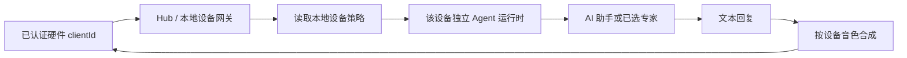

# 硬件设备 AI 专家与回复音色绑定设计

| 项目 | 内容 |
| --- | --- |
| 状态 | 已实现 |
| 日期 | 2026-08-10 |
| 范围 | MaClaw 原生 GUI 的 Hub 硬件设备管理、独立 Agent 运行时与设备回复 TTS |

## 1. 目标与边界

每台已配对硬件设备可独立选择：

1. **AI 专家**：`AI 助手` 或一个已有专家；默认 `AI 助手`。
2. **回复音色**：从内置 Kokoro 音色选择；默认 `晓晓`（`zf_xiaoxiao`）。

配置界面每台设备只提供上述两个下拉列表。本需求不提供设备专属初始提示词；专家自身的系统提示词、工具和技能限制仍由专家定义统一管理。

Hub 负责设备配对、凭据和在线状态；GUI 负责设备的 Agent 运行时、专家选择与回复音色。策略不由硬件消息体传入，防止设备伪造专家或音色。

## 2. 配置模型

`corelib.AppConfig.HardwareAgentBindings` 按规范化 `clientId` 保存本地策略：

```go
type HardwareAgentBinding struct {
    AssistantMode string // general | expert
    ExpertID      string // 仅 expert 模式有效
    TTSVoiceID    string // 空值按 zf_xiaoxiao 处理
}
```

规则：

- 缺失记录等价于 `{general, "", "zf_xiaoxiao"}`。
- `general` 模式会清空 `ExpertID`。
- `expert` 模式必须引用当前可解析的专家。
- `TTSVoiceID` 必须在 `tts.SupportedTTSVoiceIDs` 中。
- GUI 的整份配置保存会保留该后端拥有字段，避免旧页面快照覆盖设备策略。

## 3. 运行时行为



- 每台设备拥有隔离的会话、记忆、循环控制和工具运行时，设备间不共享对话上下文。
- 入站回合开始时解析并快照专家策略。专家在回合中被删除时，当前回合仍保持已快照的限制；新回合返回“绑定的 AI 专家已不可用”，不会静默降级为普通助手。
- 改变专家或音色后，仅移除该设备的 Agent 运行时，下一回合以新策略创建；其他设备不受影响。
- 解绑后移除该设备的运行时、别名和策略，避免同 ID 重新配对后复用旧会话。

## 4. TTS 行为与并发

- 文本回复始终优先送达；TTS 仅为可选补充，模型或音色资源不可用时不重试 Agent 回合。
- 全局桌面音色与每设备音色互不覆盖。设备的非全局音色使用按音色缓存的独立 TTS manager。
- 切换全局音色、关闭 TTS 或应用退出时会卸载相应 manager；底层模型 manager 在活动合成结束后再释放资源。
- 取得设备 synthesizer 时，配置快照和桌面 manager 在同一互斥区读取，避免全局音色切换与设备合成并发时出现单次回复音色错配。

## 5. GUI 交互

每个设备行显示两个原生下拉框：

| 字段 | 默认值 | 行为 |
| --- | --- | --- |
| AI 专家 | AI 助手 | 列表包含 AI 助手和全部可用专家 |
| 回复音色 | 晓晓 | 列表包含全部内置音色 |

- 保存采用设备维度串行队列，快速连续改变专家和音色时，较早的异步请求不能覆盖最后选择。
- 列表刷新期间保留乐观状态，直到后端返回相同策略。
- 保存失败恢复最后确认的值。
- 若已选专家被删除，下拉框保留并标注“已不可用”，用户可显式改为 AI 助手或其他专家。

## 6. 验收要点

1. 两台设备可选择不同专家和不同音色，且会话与回复音色互不串扰。
2. 新设备显示 `AI 助手` 与 `晓晓`。
3. 无效专家或音色不能写入配置。
4. 快速连续保存、列表刷新和保存失败后，UI 与最终持久化策略一致。
5. 专家删除后不发生权限放大的静默降级。
6. TTS 不可用时设备仍可收到文本回复。
