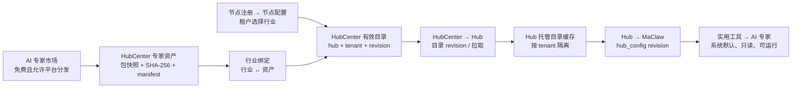

# 行业默认 AI 专家设计

## 1. 摘要

在 HubCenter 的“能力市场”导航分组中新增“行业管理”。平台管理员维护行业，并把 AI 专家市场中可用于平台分发的**固定专家版本**绑定到行业；随后在“节点注册 → 节点配置 → 租户设置”中为 `Hub + 租户` 选择一个或多个行业。

配置生效后，Hub 将该租户的行业专家作为**Hub 托管、只读的专家目录**提供给 MaClaw GUI。用户在“实用工具 → AI 专家”中会自动看到这些“系统默认”专家：免费专家自动下载安装；收费专家仅在用户已购买时自动安装，未购买时显示虚线占位卡并由用户显式购买后安装。用户自建专家和从市场获得的个人专家保持原有语义，不会被覆盖或删除。

本期采用以下明确决策，避免设计悬而未决：

| 决策 | 本期定义 |
| --- | --- |
| 分发范围 | 仅支持作者明确允许 `platform_distribution` 的专家。现有专家默认为不允许，需作者重新发布或管理员补录书面授权。 |
| 收费专家 | 可以绑定到行业，但不由平台代购或自动授予。未购买用户显示虚线占位卡并显式购买；已购买用户自动安装。免费专家自动下载安装。 |
| 依赖 | 专家定义可下发，但不自动安装其 Skill/MCP 依赖；运行时沿用既有依赖检查，缺失则说明原因。 |
| 用户操作 | 行业下发专家不可删除、不可直接编辑；卡片只用于使用。用户在使用后的 AI 助手 Tab 中通过现有“优化专家”按钮发起改进，生成独立的个人优化专家；原行业专家始终保留。 |
| 配置者 | 仅 HubCenter 平台管理员可编辑行业和 `Hub + 租户` 行业配置。 |
| 更新 | 绑定固定资产快照；市场有新版本时不自动升级，管理员显式切换后才生效。 |
| 在线性 | Hub 端有已验证缓存时可离线继续展示和运行；托管目录变更依赖 Hub 与 HubCenter 的下一次同步。 |

收费专家的行业分发、按租户计费和租户管理员自选行业留给后续版本；它们需要独立的授权与结算设计，不得以个人市场购买记录替代。

## 2. 目标、范围与非目标

### 2.1 目标

1. 平台可按行业沉淀一组标准 AI 专家，并按租户精准下发。
2. 用户无需操作市场即可在 GUI 看见并使用适用专家。
3. 专家内容、租户边界、版本和来源可审计、可撤回、可恢复。
4. 不破坏现有个人专家、专家市场购买和本地安装流程。

### 2.2 本期范围

- 行业主数据、行业与专家资产的绑定；
- `Hub + 租户` 的多行业配置；
- HubCenter → Hub 的目录版本同步；
- Hub → GUI 的托管专家目录、只读限制、展示和运行；
- 授权校验、审计、变更预览、同步观测和测试。

### 2.3 非目标

- 自动为每个用户创建个人专家副本；
- 向最终用户扣 Credits 或使用个人市场 entitlement；
- 自动安装 Skill/MCP、配置 Secret 或修改用户本地工具；
- 行业树、行业标签推荐、个性化推荐排序；
- 收费专家的采购、分账、续费或按席位授权。

## 3. 术语与边界

| 术语 | 定义 |
| --- | --- |
| 市场 Listing | AI 专家市场的消费者展示和个人购买条目。它不是行业分发的稳定版本锚点。 |
| 专家资产（Asset） | 由平台从一个合格 listing 获取、校验并固定包哈希后的不可变专家包快照。 |
| 行业绑定 | 一个行业引用一个资产，并设置排序与展示说明。 |
| 租户行业配置 | 某个 `hub_id + tenant_id` 启用的行业集合。 |
| 有效目录 | 对一个 `Hub + 租户`，由有效行业、有效绑定和 ready 资产计算出的去重专家集合。 |
| 托管行业专家 | Hub 缓存并提供的只读专家；它不属于用户可回写的普通专家集合，用户不能删除。 |
| 专家改进 | 基于行业专家的会话和反馈生成一个新的个人优化专家；它通过 `optimized_from_id` 关联来源，但不改写、不替代原行业专家。 |

“自动显示”不等于“自动安装”。本期只下发专家定义；若该定义依赖的 Skill/MCP 不存在，卡片仍可见，但打开时必须提示缺失依赖及修复入口。

## 4. 现状与设计约束

现有实现已经具备专家市场、Hub 租户隔离和客户端专家同步三项基础，但它们的语义不能直接拼接：

- 市场的 `sm_expert_market_listings` 以 `source_expert_id` 全局唯一，保存 ZIP 路径和一个展示用 `version`；它没有不可变版本实体或平台再分发授权字段。
- 市场购买记录是 `listing_id + buyer_user_id` 的个人 entitlement，不能被解释为对所有租户或用户的授权。
- Hub 的 `/api/v1/experts` 已按机器凭据和 `tenant_id` 隔离；GUI 的 `ListExperts` 会对普通 Hub 专家和本地专家做 LWW 合并，并会将本地修改回写到 Hub。
- Hub 已通过机器 WebSocket 心跳向 MaClaw 下发 `hub_config`；Hub 与 HubCenter 之间也有独立的注册心跳。这两条心跳均应只传递轻量目录版本，不能携带专家包。

因此，本设计新增独立的“行业资产/目录”平面，严禁把托管专家混入普通 `experts` 表或 GUI 的 LWW 回写集合。

## 5. 业务规则

### 5.1 通用行业与空配置兀底

- HubCenter 初始化时自动创建内置、始终启用的“通用行业”（`id=industry_general` 、`code=general`）。它不能被停用，但管理员可以像其他行业一样绑定已获取的 AI 专家资产。
- 若 `Hub + 租户` 没有任何显式行业设置，有效目录自动以“通用行业”的绑定为准；不为每个租户写入伪造 assignment。
- 一旦租户保存一个或多个显式行业，目录只使用这些行业；保存空数组即清除显式设置并回退到“通用行业”。
- “通用行业”是隐式兜底项，不能作为租户显式多选项，也不能与具体行业混选；API 查询租户行业时返回 `using_default: true`，以便管理界面清楚表达这一状态；`industry_ids` 仍仅表示显式配置。

1. 一个行业可绑定多个资产；一个租户可选择多个行业。
2. 有效目录按 `asset_id` 去重；同一资产命中多个行业时展示一张卡，并合并行业标签。
3. 仅满足以下条件的专家可出现在有效目录：行业 `active`、绑定 `active`、资产 `ready`、listing 曾为 `public + listed`，且具备有效 `platform_distribution` 授权。免费与收费资产均可绑定；收费资产仍按用户现有市场购买权校验。
4. 普通市场下架后，已获取且授权仍有效的资产可继续服务；若作者撤销平台授权或平台判定风险，资产状态变为 `revoked`，所有目录立即剔除。
5. 取消租户行业、禁用绑定或撤销资产，只移除托管目录项；绝不删除用户的自建专家、普通 Hub 专家、市场购买记录或个人安装。
6. 市场新版本不会自动影响资产。管理员新建/获取资产并替换绑定后，产生新的目录版本。
7. 用户只能从卡片使用托管专家；卡片不承载“改进/优化专家”操作。使用后，用户在该专家创建的 AI 助手 Tab 中，通过既有的“优化专家”按钮基于会话发起改进，生成新 ID 的个人优化专家，并以 `optimized_from_id` 记录来源；优化副本可按现有规则编辑和管理，但不得覆盖、替代或隐藏原行业专家。
8. 不允许编辑、删除、上传市场、反向同步或“优化覆盖”托管行业专家；后端和 GUI 都必须执行这一限制。只有平台因租户行业配置变化、资产撤销或行业停用，才能从目录中移除原行业专家。

## 6. 架构与同步流程



### 6.1 目录生成

每次行业、绑定、资产状态或租户行业集合变化时，HubCenter 在同一事务中重算受影响的 `(hub_id, tenant_id)` 有效目录，得到规范化 JSON、`content_hash` 和单调递增 `revision`。仅在目录内容实际变化时递增 revision。

### 6.2 HubCenter 到 Hub

1. Hub 注册心跳响应携带本 Hub 每个已配置租户的 `industry_expert_revision` 和 `content_hash`。
2. Hub 比较本地成功版本；不一致时使用 Hub 机器凭据拉取该租户完整目录。
3. Hub 校验响应中的 `hub_id`、`tenant_id`、revision、签名、资产包哈希和 manifest；所有项目均通过后，在一个本地事务中替换该租户的托管目录缓存。
4. 拉取或校验失败时保留上一个成功版本，记录失败原因和重试时间；不得用空结果覆盖成功缓存。
5. Hub 将本地已应用 revision、失败状态和时间通过下次注册心跳回报 HubCenter，供节点配置页查看。

完整目录采用**全量快照**而不是增量事件。行业专家数量通常较小，全量替换更容易处理撤销、去重和重试；以后规模证明需要时再设计 delta 协议。

### 6.3 Hub 到 GUI

Hub 在机器 WebSocket 的 `hub_config` 中只下发该登录租户的目录 revision，例如：

```json
{
  "managed_industry_experts": {
    "revision": 18,
    "content_hash": "sha256:..."
  }
}
```

GUI 发现 revision 变化后，以现有机器凭据请求 Hub 的托管目录 API。这样避免把完整专家定义塞入高频心跳，也避免 GUI 直接访问 HubCenter。

## 7. 管理端与用户端交互

### 7.1 HubCenter：行业管理

在“能力市场”同一导航分组新增“行业管理”。首期包括：

- 行业列表：名称、编码、状态、绑定数、覆盖租户数、更新时间；
- 创建/编辑：名称、编码、描述、图标、排序、启用状态。`code` 创建后不可修改；
- 可分发专家库：只显示满足首期资格的市场 listing；管理员点击“获取为平台资产”后生成固定快照；
- 行业专家：选择资产、排序、填写行业说明、启停绑定；
- 影响预览：保存前列出受影响的 Hub、租户、目录新增/移除数；
- 审计与同步状态：展示最近修改人、原因、目录 revision 与 Hub 最后应用状态。

市场页仍承担作者提交、审核、上/下架和个人购买；“行业管理”只消费已审核的市场产物，不提供个人购买入口。

### 7.2 节点注册 → 节点配置 → 租户设置

在注册 Hub 的每个租户卡片增加“所属行业”多选：

- 仅可选 `active` 行业；
- 保存采用全量替换，提交体为 `industry_ids`；
- 同时展示预计专家数、本目录 revision、Hub 已应用 revision 和最后同步错误；
- 行业被归档或禁用后保留历史可见性，但不再可新选；保存时自动移除无效项并显示影响；
- 当前登录的租户管理员只能查看自己的配置状态，不能修改；平台管理员才能保存。

该配置属于 HubCenter 的分发控制面，不能写入 `registration_policy_json`。注册策略处理入驻路由，行业配置处理专家目录，二者必须独立演进。

### 7.3 MaClaw GUI：实用工具 → AI 专家

行业专家使用现有专家卡片，但带以下字段和行为：

- `系统默认`、行业名称、固定版本、来源“HubCenter 行业配置”；
- 只读，禁止编辑、删除、分享/上传市场和反向同步；
- 可直接打开对话；运行前执行既有工具/Skill/MCP 依赖检查；
- 卡片仅提供“使用”入口，不提供删除、编辑、复制或“改进/优化专家”按钮；
- 用户点击“使用”并进入该专家创建的 AI 助手 Tab 后，才可使用该 Tab 既有的“优化专家”按钮。该操作生成带 `optimized_from_id` 的个人优化专家；优化专家走现有保存和同步机制，行业原专家始终保持可用且只读；
- 与自建专家和个人市场安装分组展示；托管项优先显示；
- 离线时如有已验证缓存，显示“离线缓存，版本 N”；从未同步成功时不显示占位专家。

安装与购买规则：

- `price=0` 的行业专家：目录同步后 GUI 自动调用既有市场安装链路下载安装；失败保留可重试状态，不能回退为可编辑本地专家。
- `price>0` 且用户已有该 listing 的有效购买记录：目录同步后自动安装；若安装失败显示“重新安装”。
- `price>0` 且用户未购买：显示虚线边框占位卡，只展示名称、行业、版本、价格与“购买并安装”按钮，不泄露完整系统提示词、工具和 Skill 定义，也不能打开会话。
- 点击“购买并安装”仅执行该用户的既有市场购买，再在购买成功后调用既有安装流程；不会为全租户或其他用户创建 entitlement。

## 8. 数据模型

### 8.1 HubCenter

| 表 | 关键字段与约束 | 说明 |
| --- | --- | --- |
| `industry_catalog_industries` | `id, code UNIQUE, name, description, icon, sort_order, status, created_at, updated_at` | 行业主数据；状态为 `active/disabled/archived`。 |
| `industry_catalog_assets` | `id, source_listing_id, source_package_id, source_version, sha256, archive_uri, manifest_json, distribution_grant_json, status, created_at` | 不可变资产快照；`sha256` 唯一；状态为 `ready/blocked/revoked`。 |
| `industry_catalog_bindings` | `industry_id, asset_id, display_order, user_note, status, created_at, updated_at, UNIQUE(industry_id, asset_id)` | 行业默认项。 |
| `hub_tenant_industry_assignments` | `hub_id, tenant_id, industry_id, enabled_by, enabled_at, UNIQUE(hub_id, tenant_id, industry_id)` | Hub+租户的多对多选择。 |
| `hub_tenant_industry_catalogs` | `hub_id, tenant_id, revision, content_hash, catalog_json, updated_at, UNIQUE(hub_id, tenant_id)` | 权威有效目录快照。 |
| `industry_catalog_audit_events` | `id, actor_id, action, target_type, target_id, reason, before_json, after_json, created_at` | 所有管理变更均写入。 |

`distribution_grant_json` 至少记录授权来源、授权范围、确认人和确认时间。首期不存储个人 purchaser 的信息，也不复用个人购买 entitlement。

### 8.2 Hub

新增独立表，不能混入现有 `experts`：

| 表 | 关键字段 | 说明 |
| --- | --- | --- |
| `managed_industry_expert_catalogs` | `tenant_id PRIMARY KEY, revision, content_hash, sync_status, last_error, applied_at` | 每个租户的本地同步状态。 |
| `managed_industry_experts` | `tenant_id, asset_id, definition_json, industries_json, display_order, revision, UNIQUE(tenant_id, asset_id)` | 当前成功目录的只读专家定义。 |

资产 ID 是跨行业去重键；`definition_json` 是 Hub 已核验的完整运行时定义，而不是 GUI 从 HubCenter 下载的市场 ZIP。

## 9. API 合约

所有写接口都要求平台管理员会话、CSRF/会话保护、审计 reason；所有 Hub 拉取接口都要求 Hub 机器凭据。错误响应复用现有稳定错误码风格。

### 9.1 HubCenter 管理 API

```text
GET    /api/admin/industry-management/industries
POST   /api/admin/industry-management/industries
PATCH  /api/admin/industry-management/industries/{id}

GET    /api/admin/industry-management/assets?query=...
POST   /api/admin/industry-management/assets/acquire
GET    /api/admin/industry-management/industries/{id}/bindings
PUT    /api/admin/industry-management/industries/{id}/bindings

GET    /api/admin/hubs/{hubId}/tenants/{tenantId}/industries
PUT    /api/admin/hubs/{hubId}/tenants/{tenantId}/industries
GET    /api/admin/hubs/{hubId}/tenants/{tenantId}/industry-expert-status
```

租户行业保存：

```json
{
  "industry_ids": ["industry_finance", "industry_manufacturing"],
  "reason": "为财务共享服务中心启用标准专家"
}
```

服务端校验 Hub、租户和行业存在且 active；在同一事务内替换 assignments、物化目录、更新 revision、写审计。相同集合再次提交不产生新 revision。

资产获取请求至少包含 `listing_id` 和 `reason`。服务端重新从主库读取 listing，验证其状态、价格、分发授权和 ZIP，计算并持久化 SHA-256；任何一步失败均不创建可绑定资产。

### 9.2 HubCenter → Hub 同步 API

```text
GET /api/hubs/{hubId}/tenants/{tenantId}/industry-expert-catalog
```

响应示例：

```json
{
  "hub_id": "hub_acme",
  "tenant_id": "tenant_finance",
  "revision": 18,
  "content_hash": "sha256:catalog-hash",
  "issued_at": "2026-08-13T10:00:00Z",
  "items": [
    {
      "asset_id": "industry_asset_financial_analyst_v1",
      "definition": { "id": "managed-industry-asset-financial-analyst-v1", "name": "财务分析专家" },
      "industries": [{ "code": "finance", "name": "金融" }],
      "display_order": 10,
      "definition_sha256": "sha256:..."
    }
  ],
  "signature": "..."
}
```

首期直接传已验证的专家定义，不再次向 Hub 传输专家 ZIP。专家包只在 HubCenter 资产获取时处理，降低 Hub 的下载和依赖安装风险。响应由 HubCenter 签名；Hub 以已登记公钥验证。未变化时可返回 `304 Not Modified`（ETag 为 `content_hash`）。

### 9.3 Hub → GUI API

保留普通专家接口语义，新增独立只读接口：

```text
GET /api/v1/experts                         # 现有：普通、可同步专家
GET /api/v1/managed-industry-experts         # 新增：当前 tenant 的只读托管专家目录
```

`GET /api/v1/managed-industry-experts` 示例：

```json
{
  "revision": 18,
  "items": [
    {
      "id": "managed-industry-asset-financial-analyst-v1",
      "asset_id": "industry_asset_financial_analyst_v1",
      "name": "财务分析专家",
      "source": "industry_default",
      "read_only": true,
      "industries": [{ "code": "finance", "name": "金融" }],
      "definition": { "system_prompt": "...", "tools": [], "skills": [] }
    }
  ]
}
```

不扩展 `GET /api/v1/experts` 的 JSON 形状，以免破坏现有 GUI/旧客户端对数组或 `{experts: [...]}` 的兼容解析，也避免托管对象误进入 LWW 合并与回写路径。

## 10. 状态、撤销与故障处理

| 场景 | 预期行为 |
| --- | --- |
| 行业/绑定被禁用 | 重算受影响目录；Hub 下次同步移除对应项。 |
| 资产被撤销 | 立即从 HubCenter 目录剔除，记录高优先级审计和告警；Hub 同步后禁止新会话。 |
| 市场 listing 下架 | 不自动撤销现有资产；管理员根据授权决定保留或撤销。 |
| Hub 拉取失败 | 保留上次成功版本，指数退避重试并回报错误；不覆盖为零条目录。 |
| Hub 收到空目录 | 仅当响应签名、`revision` 和内容 hash 都有效时，才原子清空本地托管目录。 |
| 用户已在会话中 | 当前会话可以完成；收到撤销后禁止以该托管专家创建新会话。 |
| 用户已生成优化专家 | 优化专家是独立个人专家，不受行业撤销影响；其使用仍受自身依赖和普通安全策略限制。 |

HubCenter 对租户配置、行业绑定或资产状态的写入必须串行化同一 `(hub_id, tenant_id)` 的目录重建，避免并发请求产生 revision 丢失。`revision` 是单调整数，`content_hash` 是规范化目录 JSON 的 SHA-256。

## 11. 安全与审计

- 资产获取复用市场 ZIP/manifest 的安全校验，并记录专家包 SHA-256、声明依赖和授权证据；不能信任 UI 传入的版本、价格或包内容。
- HubCenter → Hub 的目录请求按 `hub_id + tenant_id` 鉴权；Hub 不得请求其他 Hub 或租户的目录；GUI 不得直连 HubCenter。
- WebView 只接收来自本地 Wails/Hub 的结构化定义，不接触市场归档路径、签名私钥、平台采购凭据或 ZIP。
- 管理写操作必须有 reason；记录操作者、前后值、受影响目录 revision 和请求关联 ID。
- Hub 回报同步状态时不得回传完整 `definition_json` 或敏感依赖配置，只回传 revision、状态、时间和经过脱敏的错误码。
- 专家改进沿用现有优化专家的 `optimized_from_id` 谱系字段，并额外记录行业资产 ID 和版本，便于追踪；生成的优化副本不继承托管只读标记。

## 12. 实施切分

### Slice 1：HubCenter 数据与行业管理

建立表和 migration；实现行业、资产获取、绑定、租户行业配置和目录物化服务；提供后台页面和审计；覆盖资格校验、幂等保存、影响预览与目录 hash 测试。

### Slice 2：HubCenter 与 Hub 同步

在现有 HubCenter 注册心跳中增加轻量 revision；实现签名目录拉取、Hub 的独立缓存表、原子替换、失败重试和同步状态回报；覆盖越权、验签失败、空目录和回退测试。

### Slice 3：Hub 与 GUI 托管专家

新增只读目录 API；GUI 增加独立拉取缓存、系统默认卡片与只读限制，并允许该专家创建的 AI 助手 Tab 继续使用现有“优化专家”流程；托管专家完全脱离 `ListExperts` LWW 同步。覆盖不可删除、优化副本谱系、旧客户端兼容与离线缓存测试。

### Slice 4：运行观测与灰度

增加行业目录 revision、Hub 应用滞后、拉取失败率、资产撤销传播时间等指标；先以一个免费、无外部依赖的专家和一个测试租户灰度，再扩大行业和租户范围。

## 13. 验收标准

1. 管理员可创建“金融”行业，从合格免费市场专家获取固定资产并绑定；不合格、收费或无授权专家不能获取。
2. 为 `hub_a + tenant_finance` 配置“金融”后，只有该租户的 GUI 会在同步完成后看到对应系统默认专家。
3. 同一租户配置多个行业时，目录按资产去重且合并行业标签；另一租户不泄露任何卡片或专家定义。
4. 市场出现新版本时，用户目录不变化；管理员更换绑定资产后，revision 更新并最终收敛到新版本。
5. 用户无法编辑、删除、分享、上传或反向同步托管专家；卡片只提供使用。使用后的 AI 助手 Tab 仍显示既有“优化专家”按钮；优化后生成独立个人优化专家，保留 `optimized_from_id` 和行业资产来源，且原托管专家仍在列表中。
6. 删除租户行业配置只移除托管项，不影响普通专家、个人市场安装或个人购买记录。
7. HubCenter、Hub 或网络短暂异常时，Hub 保留最后成功目录并报告滞后；恢复后自动收敛。只有经过验证的空目录才会清空本地项。
8. 资产撤销后，平台、Hub 和 GUI 都能在下一轮同步中阻止创建新的托管专家会话，并产生可检索审计记录。

## 14. 后续版本入口

收费专家分发应新增“平台合同/授权 SKU → Hub 或租户 entitlement → 目录资格”的独立模型，并定义订阅、续费、退款、授权撤销和作者分账。不能直接复用 `sm_expert_market_purchases` 的个人购买表。

如需让租户管理员自行选择行业，应新增平台管理员维护的可选行业白名单与配额；租户只能在白名单内编辑，不能访问全量行业或改变资产绑定。
