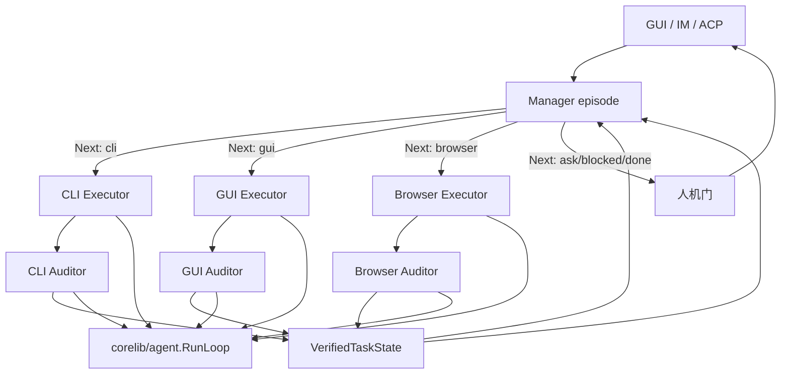

# 借鉴 LongHorizon-Harness 的长程执行闭环改进计划

> 状态：规划（未实施）
> 日期：2026-08-16
> 参考实现：[AMAP-ML/LongHorizon-Harness](https://github.com/AMAP-ML/LongHorizon-Harness) `v0.1.5`（浅克隆，2026-08-16）
> 论文：[arXiv:2608.01964](https://arxiv.org/abs/2608.01964)
> 目标范围：在现有 CodingTaskRuntime、Computer Use、Browser Use 之上补一层 Manage-Execute-Audit 外环；不替换 `corelib/agent.RunLoop`，不引入 Python 或第三方 CLI Agent 后端

## 1. 决策摘要

LongHorizon-Harness 的增益不来自更强模型，而来自模型外部的 Loop Engineering：把「下一步做什么、如何在真实环境验证、哪些进度可以保存、失败后如何继续」从单轮 Prompt 里拆出来，变成可工程化的外环。

本仓库已经具备强内环：共享 `RunLoop`、干净上下文的 `CodingSubAgent`、可恢复 `codingruntime` Ledger、Computer Use observe-act、Browser `expect` / TaskVerifier、GoalAnchor / DriftDetector、语义工具路由。缺的是把这些能力收成一条跨模态、可验证、可丢弃执行上下文的外环。

改进顺序必须是 **锁完成权 → CLI 可运行 → Browser → GUI → 产品入口 → 混合任务**。默认聊天路径保持不变；外环只在长程任务开启。

移植协议，不移植运行时。不引入 `claude` / `codex` / `dsh` 子进程、Python、FastAPI Dashboard、npm computer-use 插件市场。

## 2. 目标、非目标、不变量

### 2.1 目标

1. **有界**：每轮只做一件主导工作。CLI、GUI、Browser 不可混在同一 episode。
2. **新鲜上下文**：Executor 使用新会话；跨轮记忆只有已验证状态，不是上一轮轨迹。
3. **独立验收**：Auditor 核验真实文件、界面、日志和测试；Executor 自述不得写入可信进度。
4. **完成权在 harness**：必须 Manager 发出 `done`，且最近一份真实审计为 `complete + clean + aligned`。
5. **可恢复**：失败或中断后从原始目标加最后可信检查点重开，不恢复未完成 transcript，不重放不确定副作用。
6. **可关闭**：未标注长程的聊天行为与今日一致。

### 2.2 非目标

1. 不把主聊天 `RunLoop` 改成三角色混跑。
2. 不把 Workflow V2 阶段机替换成此外环；阶段是业务，外环是阶段内或无模板长任务的执行闭环。
3. 不复活生产路径上的 `HarnessProgressTracker` 作为真相源。
4. 不让语义路由的 `ArtifactRef` 冒充「用户目标达成」。
5. 不把 OSWorld / WeaveBench / Terminal-Bench 作为 P0 交付物。
6. 不让 Auditor 拥有写文件、点击、发消息或修复工具。
7. 不为单步问答、纯检索、无执行器的文档确认阶段支付三角色成本。

### 2.3 不变量

1. 只有 Auditor（或 harness 合成的无效审计）可以提议写入 `TaskState.Completed`。Manager 可以重述，但新事实必须引用 `round_N` 审计。
2. `done` 当且仅当 Manager 发出 `RouteDone` 且 `_latest_auditor_is_clean_complete`。
3. 控制头缺失、Auditor 变异工作区、provider 失败 → 合成 `incomplete/suspect`，不得猜完成。
4. 阻断性验收约束非空时，`complete` 与 `aligned` 不能同时成立。
5. 聊天历史只投影 `HorizonTaskID` 与最近 `TaskState` 摘要，不投影 executor transcript 或工具参数。
6. 每个角色 episode 结束后丢弃会话。下一轮 Manager 只读 `TaskState` 加被引用的 `AuditReport`。
7. GUI Auditor 与 GUI Executor 不得共享可点击 ref 表（可共享屏幕，不可共享动作权）。
8. Computer Use Reset 不得擦除已验证 `TaskState`。
9. 网页任务走 `browser`，桌面 GUI 走 Computer Use；禁止用像素点 Chrome 完成网页操作。
10. CLI 子任务的 Attempt 终态不是外环完成；workspace 有 diff 不等于契约 `aligned`。

## 3. 调研依据

### 3.1 LongHorizon-Harness 中必须保留的实现事实

| 主题 | 参考实现 | 必须保留的语义 |
| --- | --- | --- |
| 外环调度 | `src/lh_harness/manager.py` `_run_impl` | 每轮：Manager 规划 → 路由 → 可选 Executor → 匹配 Auditor → 人机门 |
| 完成门 | `manager._latest_auditor_is_clean_complete` | Manager 自称完成无效；需 auditor `complete/clean/aligned` |
| 新鲜上下文 | `adapters/cli_agent.py` `run_episode` | 每个角色一次新进程/新会话；不共享聊天史 |
| 记忆边界 | `manager.py` 注释 + `role_prompts.py` | Manager 只看 task_state / contract / auditor 报告；Executor 只看本轮计划加被引用的审计 |
| 审计控制头 | `auditor_agent.py` `parse_audit_report` | 前三行 Status / Integrity / Contract audit；缺头则 fail-closed |
| 只读审计 | Claude `policy_for_role`；workspace snapshot | Auditor 改工作区则报告作废；不得修复缺失交付物 |
| 路由枚举 | `RoleNextStep` | 原版 `gui \| cli \| ask \| done \| blocked`；本仓库加 `browser` |
| 人机门 | `dashboard/gate.py` `_human_gate` | 完成、阻塞、请示、达轮次上限、连续失败才打断；operator 指令注入下一轮 Manager |
| 崩溃落盘 | `manager.run` + `report.json` | 任何退出都留下终端记录 |

参考评测（同一 Qwen 3.7-Plus + Claude Code 后端，只改 harness）：WeaveBench 51.8 → 80.7；OSWorld 2.0 Binary 2.8 → 8.3（约 3 倍）；Terminal-Bench 2.1 69.7 → 77.2 且 token −24%。本仓库要的是同样的外环不变量，不是复现其评测数字。

### 3.2 当前仓库的落点

| 已有能力 | 主要位置 | 本设计的使用方式 |
| --- | --- | --- |
| 共享 LLM↔工具循环 | `corelib/agent/loop.go` | 内环引擎；每个角色 episode 调一次，不改成外环 |
| 干净编码执行器 | `gui/coding_subagent.go`、`corelib/codingagent` | CLI Executor 适配器 |
| 可恢复编码 Ledger | `corelib/codingruntime` | CLI 子 Attempt 与不确定副作用恢复协议 |
| 工作区机械门 | `FinalWorkspaceGateRequired`、`WorkspaceProber` | CLI Auditor 的第一证据源，不替代契约对齐判断 |
| Computer Use | `gui/tools_computer_use.go`、`corelib/computeruse` | GUI Executor；Auditor 仅 observe |
| Browser Use | `gui/tools_browser_merged.go`、`corelib/browser` | Browser Executor；Auditor 用 `expect` / TaskVerifier / compact SoM |
| 会话内 steering | `GoalAnchor`、`DriftDetector`、`AdaptiveRetry` | 留在内环；外环进度不以它们为准 |
| `HarnessProgressTracker` | `gui/harness_progress_tracker.go` | 生产路径为 `nil`；由外环 `TaskState` 取代 |
| 语义工具路由 | `docs/design/semantic-tool-routing-design-zh.md` | episode 内选最小工具面；不得决定外环完成 |
| Workflow V2 | `corelib/workflow/v2` | 业务阶段与确认门；阶段内长工作可交给外环 |
| 聊天检查点 | `gui/im_agent_loop_shared.go` | 崩溃安全；不是已验证任务进度 |
| 操作员控制 | Computer Use Pause/Stop/Reset | 映射为外环 cancel / 人机门 |

### 3.3 当前失败主因

今日默认路径：

```text
用户 → 主聊天 RunLoop（规划 + 执行 + 自我判断）→ 不断增长的同一份历史
```

1. **上下文污染**：系统提示、大量工具、CU/browser playbook、记忆与中间失败轨迹挤在同一窗口。
2. **自证完成**：模型说「已经点完 / 测试过了」即可结束；Coding 有 workspace gate，CU/browser 没有对等的独立验收权。
3. **跨模态无统一进度**：编码 Ledger、CU Session、browser TaskVerifier、聊天 unfinished slot 各记各的，无法支撑「改代码 → 开应用 → 点 UI → 看网页结果」。
4. **恢复重放风险**：聊天 checkpoint 保护的是 provider-valid 历史，不是已验证事实。

## 4. 目标控制环

```text
S_i = 原始目标 + 已验证 TaskState
  → Manager（新会话，只读）规划下一件有界工作
  → Next: cli | gui | browser | ask | done | blocked
  → Executor（新会话，单一模态）执行
  → Auditor（新会话，只读）核验真实环境
  → 通过：写入 Completed；失败：写入 Untrusted / Blockers
  → 人机门（完成 / 请示 / 阻塞 / 达轮次 / 连续失败）
  → 未完成则 S_{i+1}，Executor 会话丢弃
```



### 4.1 所有权边界

| 组件 | 拥有 | 不拥有 |
| --- | --- | --- |
| 主聊天 / IM | 用户目标、展示、人机门、取消 | 执行轨迹、可信进度、完成判定 |
| `longhorizon.Supervisor` | 轮次、角色调度、完成门、append-only 事件 | 具体工具实现、模型供应商协议 |
| `VerifiedTaskState` | 原始目标、契约、已验证事实、剩余工作、失败证据 | Executor 原文、截图原图、命令输出全文 |
| Manager episode | 下一步路由与子任务契约 | 工具执行、向用户直接问答以外的副作用 |
| Executor episode | 单一模态的有界工作 | 把结果写入可信状态、与用户对话 |
| Auditor episode | 环境核验与控制头 | 修复、点击、写入、交付 |
| `codingruntime` | CLI 子任务的 Attempt、租约、不确定副作用 | 外环完成权、GUI/Browser 事实 |
| 语义路由 | 本 episode 的最小工具面 | 外环路由 `Next:`、审计结论 |
| Workflow V2 | 业务阶段与确认门 | 阶段内 episode 调度细节 |

### 4.2 路由扩展

LongHorizon 只有 `gui|cli`。本仓库必须三分，因为网页任务禁止用像素点 Chrome。

| `Next:` | Executor | Auditor | 工具面 |
| --- | --- | --- | --- |
| `cli` | `CodingSubAgent` / `codingruntime.Runner` | workspace probe + 质量门 + 可选只读 reviewer | coding 工具；无 `computer_*` / `browser` |
| `gui` | 一次性 CU `RunLoop` | 强制 `computer_observe`；禁止 click/type | 仅 `computer_*` 动作工具 |
| `browser` | 一次性 `browser` `RunLoop` | `expect` / TaskVerifier / compact observe | 仅 `browser` |
| `ask` | 无人执行 | 无 | 人机门提问 |
| `blocked` | 无人执行 | 无 | 人机门或失败 |
| `done` | 无人执行 | 查阅最近真实审计 | 完成门 |

一回合只允许一个主导 `Next:`。需要「改代码再点 UI」时拆成两轮。

## 5. 核心数据契约

新建 `corelib/longhorizon`。不把 GUI 轨迹写入 `coding_runtime.db`。CLI 子任务仍创建 codingruntime Task，外环只保存不透明 `RuntimeTaskID` 与审计摘要。

```go
type Route string

const (
    RouteCLI     Route = "cli"
    RouteGUI     Route = "gui"
    RouteBrowser Route = "browser"
    RouteAsk     Route = "ask"
    RouteDone    Route = "done"
    RouteBlocked Route = "blocked"
)

type Integrity string     // clean | suspect | violation
type ContractAudit string // aligned | unknown | needs_revision | invalid
type AuditStatus string   // complete | incomplete | blocked

type TaskContract struct {
    Carrier     string
    Inputs      []string
    Constraints []string
    Evidence    []string
}

type VerifiedFact struct {
    RoundID    int
    Claim      string
    EvidenceID string // 有界 artifact / probe digest，不是全文
}

type TaskState struct {
    Goal       string // 不可变原始目标
    Contract   TaskContract
    Completed  []VerifiedFact
    Incomplete []VerifiedFact
    Blockers   []VerifiedFact
    Untrusted  []VerifiedFact
    Remaining  string
}

type AuditReport struct {
    RoundID       int
    Status        AuditStatus
    Integrity     Integrity
    ContractAudit ContractAudit
    ReportText    string // 自然语言权威件
    BlockingLeft  []string
}

type RoundRecord struct {
    RoundIndex int
    Route      Route
    PlanText   string
    Auditor    AuditReport
    TaskState  TaskState
    Feedback   string // harness 协议纠错，不是审计
}
```

控制头解析必须同时接受中英（对齐 `auditor_agent.py` 正则）。缺头、Auditor 工作区变异、阻断约束非空，均由 harness 降级，不把正文当完成证据。

## 6. 角色 episode 适配器

```go
type EpisodeRequest struct {
    Role   string
    Prompt string
    Budget time.Duration
}

type EpisodeResult struct {
    Status      string // done | timeout | error | cancelled
    VisibleText string
}
```

诊断轨迹、截图、probe 走独立 artifact，不进入下一角色 prompt。

| 角色 | 会话 | 工具策略 |
| --- | --- | --- |
| Manager | 新会话；无用户聊天史 | 只读：读 state/合同/审计、可选 `read_file`；禁止 bash 写、CU 动作、browser 动作、IM 发送 |
| CLI Executor | 现有 CodingSubAgent 干净上下文 | 现有 worker 策略 |
| GUI Executor | 新 `LoopKindBackground` + 独立 CU Session | 仅 `computer_*` 动作工具 |
| Browser Executor | 新 background loop | 仅 `browser` |
| CLI Auditor | 新会话 | 只读 reviewer + `WorkspaceProber`；机械门先跑，LLM 只解释 digest |
| GUI Auditor | 新 CU Session | 仅 `computer_observe` / `computer_find` |
| Browser Auditor | 只读 observe | `observe` + `expect` / `task_verify`；禁止 click/type/set_files |

GoalAnchor / DriftDetector 继续服务未走外环的普通聊天，以及 Executor 内环防跑偏。它们的输出最多成为 Auditor 候选证据，不能直接写入 `Completed`。

## 7. 与既有子系统的关系

```text
语义路由 ──选择本 episode 工具面──► 角色 RunLoop
     └── 不得根据模型自述把任务标完成

Workflow V2 阶段 ──可以──► 启动一个 Horizon 任务
     └── 阶段完成仍看阶段产物与确认门

codingruntime ──CLI Executor 的 Attempt Ledger──► 不确定副作用走既有恢复协议
     └── 外环完成仍要 CLI Auditor

Computer Use 操作员面板 ──Pause/Stop──► Supervisor cancel
     └── Reset 不得擦除已验证 TaskState

Browser Use 改进计划 ──稳/准/狠──► Browser Executor/Auditor 的观察质量
     └── compact SoM 与 expect 先于视觉；外环不把每步截图喂给 Manager
```

插入点：

| 动作 | 位置 |
| --- | --- |
| 长程准入 | `gui/im_entry_execution.go`；UIC / 语义层产出能力事实，禁止只靠关键词白名单 |
| 调度 | 新建 `corelib/longhorizon` Supervisor；GUI 宿主适配器放 `gui/` |
| CLI 执行 | 现有 `codingruntime.Runner` / `CodingSubAgent` |
| GUI 执行 | 短循环包装现有 `computer_*`；独立 Session |
| Browser 执行 | 短循环包装合并 `browser` 工具 |
| 人机门 | 现有确认卡 + CU 操作条；operator 指令只注入下一轮 Manager |
| 聊天投影 | `ConversationMemory` 未完成槽只存 `HorizonTaskID` |

## 8. 准入：何时走出环

默认主聊天仍走今日路径。

| 开启外环 | 示例 |
| --- | --- |
| 显式 | `@horizon`、设置中的长程模式、Workflow 阶段标记 `long_horizon=true` |
| 语义 | 同时需要 coding + GUI 或 coding + browser；或预估多步且有可检查交付物 |
| 续跑 | 已有未完成 `HorizonTaskID` 的会话 |

关闭 / 降级：单步问答、纯检索、已由 Workflow 文档确认门覆盖且无执行器的阶段。Provider 连续失败则 abort，走既有错误码，不把失败当进度。

## 9. 工作包与依赖

依赖只能向下。P0 未完成前不接 GUI Executor。

```text
P0  契约、完成门、合成审计、单测夹具
  └─ P1  Supervisor + Manager + CLI Executor/Auditor
        ├─ P2  Browser Executor/Auditor
        │     └─ P3  GUI Executor/Auditor
        └─ P4  入口接入、人机门、聊天投影（可先做 CLI 子集）
              └─ P5  混合任务、分角色模型、轮次预算
```

### P0 — 契约与完成门

- 新增 `corelib/longhorizon`：`TaskState`、`AuditReport` 解析、`LatestAuditorCleanComplete`、无效 `done` / 无效路由的合成反馈（对齐 `manager.py` `_invalid_completion_feedback`）。
- 控制头解析支持中英。
- 阻断约束反查：报告中阻断项非空则降级 `complete`。
- Memory store + 单测：伪造 Manager `done`、缺控制头、integrity=suspect 的自述完成、空审计。

**完成标准**：不启动任何 LLM，纯函数测试锁住完成权。

### P1 — CLI 外环

- `Supervisor.Run`：`while round < budget` 调 Manager → `cli|ask|done|blocked`。
- Manager / CLI Auditor 用 `codingagent` inspection 角色 + 新会话。
- CLI Executor 走现有 `codingruntime.Runner`；Attempt 终态不是外环完成。
- CLI Auditor 先跑 `WorkspaceProber` / 质量门 / `verified_no_change`；LLM 只读这些 digest 写控制头。
- 入口：显式 `@horizon` 或测试钩子；不改默认聊天。

**完成标准**：一条「修改文件并跑测试」的任务，Executor 声称成功但测试失败时，外环不得 `complete`；中断后重启不重放写操作。

### P2 — Browser 外环

- `Next: browser`；Executor 短循环只有 `browser`。
- Auditor 调用 `observe` + 既有 `expect` / `TaskVerifier`；失败只回 compact delta。
- 遵守 Browser Use 不变量：ref 不透明、非唯一 CSS 不得成功、不把截图作为默认 Manager 输入。

**完成标准**：livesmoke 上「打开页 → 点按钮 → 断言 DOM」在 Auditor 未看到期望态时不能 `done`。

### P3 — GUI 外环

- `Next: gui`；独立 CU Session，结束即丢弃 refs。
- GUI Auditor 与 Executor 不得共享可点击 ref 表。
- 操作员 Pause 仍阻止 Executor 动作，允许 Auditor observe。
- Stop = Supervisor cancel + 现有 `ComputerUseStop`。
- 以 Windows 为主验收（LongHorizon 主测 macOS；本仓库 CU 已有 Windows E2E）。

**完成标准**：Executor 报告「已保存文档」但 observe 仍是未保存态时，不得写入 `Completed`。

### P4 — 产品入口与人机门

- `gui/im_entry_execution.go`：长程意图不再直接 `runAgentLoop` 当 Executor。
- 聊天只显示轮次：计划摘要、审计控制头、剩余工作；完整轨迹进诊断面板。
- 人机门：`ask` / `blocked` / 达轮次 / 连续失败 3 次 → 现有确认卡或 CU 操作条。
- operator 追加指令只注入下一轮 Manager。
- `ConversationMemory` 未完成槽只存 `HorizonTaskID`。

**完成标准**：关掉 GUI 再打开，能从 `TaskState` 续跑；不会把上一轮 CU click 当已验证事实。

P4 的 CLI 子集可在 P2/P3 之前合并，只要入口只暴露 `@horizon` + CLI。

### P5 — 混合任务与成本

- 同一 Horizon 任务跨 `cli` / `browser` / `gui` 多轮。
- 角色可配不同模型（Manager/Auditor 强，Executor 便宜），落在现有模型分配设置。
- 轮次预算、每角色 timeout 对齐 LongHorizon `EpisodeBudget`。
- Manager/Auditor 超时短于 Executor，避免三角色成本失控。
- 可选：内部样本集（不是 OSWorld 全量）。

## 10. 测试与验收

| 层 | 必须覆盖 |
| --- | --- |
| 纯函数 | 完成门、控制头、阻断约束、无效路由反馈 |
| Supervisor | provider 失败立即 abort、不经人机「加轮次」；cancel 写终端记录 |
| CLI | workspace 无变化且无 `verified_no_change` → 不能 complete |
| Browser | expect 失败 → incomplete；Auditor 不得 click |
| GUI | Auditor 工具列表不含 click/type；Pause 时 Executor 动作被拒 |
| 恢复 | 进程在 Executor 写文件窗口被杀 → codingruntime uncertain；外环 Untrusted 而非 Completed |
| 投影 | 聊天历史不含 executor 工具参数 |

物理桌面 / 真站点仍需手工。P1 可用临时仓库 + 测试命令在 CI 完成。成功构建或单测通过不是硬件验收。

## 11. 风险

- **成本**：三角色约 3 倍 episode。必须有准入，且 Manager/Auditor 超时短于 Executor。
- **完成权泄漏**：任何「模型说做完了就标完成」的捷径都会让外环失效。P0 单测是防回归闸。
- **状态双写**：禁止同时把进度写进聊天历史、HarnessProgressTracker 和外环 `TaskState`。
- **Windows 桌面**：P3 必须以 Windows 为主验收，不能只信参考实现的 macOS 结论。

## 12. 建议实施顺序

1. `corelib/longhorizon` 类型 + 完成门单测（P0）。
2. Supervisor 骨架 + 显式 `@horizon` 只走 CLI（P1）。
3. 聊天投影与人机门最小 UI（P4 的 CLI 子集）。
4. Browser 角色（P2），与 Browser Use 的 expect/compact 对齐。
5. GUI 角色（P3），接现有 CU 操作员面板。
6. 混合任务与模型分角色（P5）。

每一步都必须能独立关闭：合并 P1 后，未标注长程的聊天行为不变。
