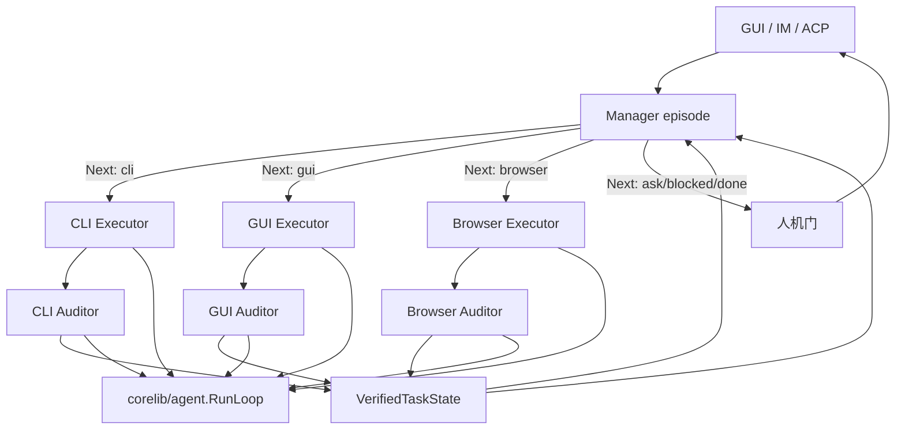

# 借鉴 LongHorizon-Harness 的长程执行闭环改造计划

> 状态：规划（未实施）
> 日期：2026-08-16
> 参考实现：[AMAP-ML/LongHorizon-Harness](https://github.com/AMAP-ML/LongHorizon-Harness) `v0.1.5`（浅克隆，2026-08-16）
> 论文：[arXiv:2608.01964](https://arxiv.org/abs/2608.01964)
> 目标范围：在现有 CodingTaskRuntime、Computer Use、Browser Use 之上补一层 **Manage → Execute → Audit** 外环；不替换 `corelib/agent.RunLoop`，不引入 Python / 第三方 CLI Agent 后端

## 1. 结论

LongHorizon-Harness 的增益不来自更强模型，而来自模型外部的 **Loop Engineering**：

1. **每轮只做一件边界明确的事**，GUI 或 CLI（本仓库再加 Browser）不可混在同一 episode。
2. **Executor 使用全新上下文**；跨轮记忆只有已验证状态，不是上一轮轨迹。
3. **Auditor 独立核验真实环境**；Executor 自述不得写入可信进度。
4. **完成权在 harness，不在 Manager**：必须 `Next: done` **且** 最近一份真实审计为 `complete + clean + aligned`。
5. **失败后从原始目标 + 最后可信检查点重开**，不恢复未完成的 agent transcript。

当前产品已经具备强 **内环**：共享 `RunLoop`、干净上下文的 `CodingSubAgent`、可恢复 `codingruntime` Ledger、Computer Use observe-act、Browser `expect` / TaskVerifier、GoalAnchor / DriftDetector、语义工具路由。缺的是把这些能力收成一条 **跨模态、可验证、可丢弃执行上下文** 的外环。

本计划把 LongHorizon 的 **协议** 迁到 Go 原生运行时，把现有执行器当 `AgentAdapter` 用。不移植 Python CLI、FastAPI Dashboard、Codex/Claude 插件市场。

## 2. 调研依据

### 2.1 LongHorizon-Harness 中必须保留的实现事实

| 主题 | 参考实现 | 必须保留的语义 |
| --- | --- | --- |
| 外环调度 | `src/lh_harness/manager.py` `_run_impl` | 每轮：Manager 规划 → 路由 → 可选 Executor → 匹配 Auditor → 人机门 |
| 完成门 | `manager._latest_auditor_is_clean_complete` | Manager 自称完成无效；需 auditor `complete/clean/aligned` |
| 新鲜上下文 | `adapters/cli_agent.py` `run_episode` | 每个角色一次新进程/新会话；prompt 文件一次性写入 |
| 记忆边界 | `manager.py` 注释 + `role_prompts.py` | Manager 只看 task_state / contract / auditor 报告；Executor 只看本轮计划 + 被引用的审计 |
| 审计控制头 | `auditor_agent.py` `parse_audit_report` | 前三行 Status / Integrity / Contract audit；缺头则 fail-closed |
| 只读审计 | Claude `policy_for_role`；workspace snapshot | Auditor 改工作区则报告作废；不得修复缺失交付物 |
| 路由枚举 | `RoleNextStep` | `gui \| cli \| ask \| done \| blocked`（本仓库加 `browser`） |
| 人机门 | `dashboard/gate.py` `_human_gate` | 完成、阻塞、请示、达轮次上限、连续失败才打断；operator 指令注入下一轮 Manager |
| 崩溃落盘 | `manager.run` + `report.json` | 任何退出都留下终端记录；不跟随 symlink 覆盖 |

### 2.2 当前仓库的落点

| 已有能力 | 主要位置 | 本设计的使用方式 |
| --- | --- | --- |
| 共享 LLM↔工具循环 | `corelib/agent/loop.go` | **内环引擎**，每个角色 episode 调一次，不改成外环 |
| 干净编码执行器 | `gui/coding_subagent.go`、`corelib/codingagent` | CLI Executor 适配器 |
| 可恢复编码 Ledger | `corelib/codingruntime` | 外环 Task 的 CLI 子 Attempt 与副作用恢复协议 |
| 工作区机械门 | `FinalWorkspaceGateRequired`、`WorkspaceProber` | CLI Auditor 的第一证据源，不替代契约对齐判断 |
| Computer Use | `gui/tools_computer_use.go`、`corelib/computeruse` | GUI Executor；Auditor 仅 observe |
| Browser Use | `gui/tools_browser_merged.go`、`corelib/browser` | Browser Executor；Auditor 用 `expect` / TaskVerifier / compact SoM |
| 会话内 steering | `GoalAnchor`、`DriftDetector`、`AdaptiveRetry` | 留在 **内环**；外环进度不以它们为准 |
| `HarnessProgressTracker` | `gui/harness_progress_tracker.go` | 生产路径为 `nil`；由外环 `TaskState` 取代，不再单独填 checklist |
| 语义工具路由 | `docs/design/semantic-tool-routing-design-zh.md` | **episode 内** 选最小工具面；不得决定外环完成 |
| Workflow V2 | `corelib/workflow/v2` | 业务阶段与确认门；阶段内长工作可交给外环，阶段推进仍看阶段产物 |
| 聊天检查点 | `gui/im_agent_loop_shared.go` 工具批 checkpoint | 崩溃安全；不是已验证任务进度 |
| 操作员控制 | Computer Use Pause/Stop/Reset | 映射为外环 cancel / 人机门，不另做第二套桌面控制 |

### 2.3 明确不移植

- 不引入 `claude` / `codex` / `dsh` 子进程当执行后端。本产品自己就是 Agent 后端。
- 不引入 Python、FastAPI、`lh-harness` 插件安装器、npm computer-use MCP。
- 不把 OSWorld / WeaveBench 评测套件作为 P0 交付物。
- 不把主聊天 `RunLoop` 改成三角色；主聊天只做入口、展示和人机门。
- 不让 Auditor 拥有写文件、点击、发消息或修复工具。
- 不把 `ConversationMemory` 当可信进度源。

## 3. 问题陈述

今日一条用户任务的默认路径是：

```text
用户 → 主聊天 RunLoop（规划 + 执行 + 自我判断）→ 不断增长的同一份历史
```

后果：

1. **上下文污染**：系统提示、40+ 工具、CU/browser playbook、记忆与中间失败轨迹挤在同一窗口。
2. **自证完成**：模型说“已经点完 / 测试过了”即可结束；Coding 有 workspace gate，CU/browser 没有对等的独立验收权。
3. **跨模态无统一进度**：编码 Ledger、CU Session、browser TaskVerifier、聊天 unfinished slot 各记各的，无法支撑“改代码 → 开应用 → 点 UI → 看网页结果”这类连续任务。
4. **恢复重放风险**：聊天 checkpoint 保护的是 provider-valid 历史，不是“已验证事实”；中断后容易把未审计副作用当进度。

LongHorizon 用同一模型把 WeaveBench 完成率从约 52% 提到约 81%，OSWorld 2.0 完整完成约 3 倍，Terminal-Bench 2.1 +7.5 且 token −24%。本仓库要的是同样的 **外环不变量**，而不是复现其评测数字。

## 4. 目标架构



### 4.1 所有权边界

| 组件 | 拥有 | 不拥有 |
| --- | --- | --- |
| 主聊天 / IM | 用户目标、展示、人机门、取消 | 执行轨迹、可信进度、完成判定 |
| `longhorizon.Supervisor` | 轮次、角色调度、完成门、append-only 事件 | 具体工具实现、模型供应商协议 |
| `VerifiedTaskState` | 原始目标、契约、已验证事实、剩余工作、失败证据 | Executor 原文、截图原图、命令输出全文 |
| Manager episode | 下一步路由与子任务契约 | 工具执行、向用户直接问答以外的副作用 |
| Executor episode | 单一模态的有界工作 | 把结果写入可信状态、与用户对话 |
| Auditor episode | 环境核验与控制头 | 修复、点击、写入、交付 |
| `codingruntime` | CLI 子任务的 Attempt、租约、不确定副作用 | 外环完成权、GUI/Browser 事实 |
| 语义路由 | 本 episode 的最小工具面 | 外环路由 `Next:`、审计结论 |
| Workflow V2 | 业务阶段与确认门 | 阶段内 episode 调度细节 |

### 4.2 对本仓库的路由扩展

LongHorizon 只有 `gui|cli`。本仓库必须三分，因为网页任务禁止用像素点 Chrome：

| `Next:` | Executor | Auditor | 工具面 |
| --- | --- | --- | --- |
| `cli` | `CodingSubAgent` / `codingruntime.Runner` | workspace probe + 质量门 + 可选只读 reviewer | coding 工具；无 `computer_*` / `browser` |
| `gui` | 一次性 CU `RunLoop` | 强制 `computer_observe`；禁止 click/type | 仅 `computer_*` observe 子集 |
| `browser` | 一次性 `browser` `RunLoop` | `expect` / TaskVerifier / compact observe | 仅 `browser` |
| `ask` | 无人执行 | 无 | 人机门提问 |
| `blocked` | 无人执行 | 无 | 人机门或失败 |
| `done` | 无人执行 | 查阅最近真实审计 | 完成门 |

一回合只允许一个主导 `Next:`。需要“改代码再点 UI”时拆成两轮。

## 5. 核心数据契约

新建 `corelib/longhorizon`。它不把 GUI 轨迹写入 `coding_runtime.db`；CLI 子任务仍创建 codingruntime Task，外环只保存不透明 `RuntimeTaskID` 与审计摘要。

不变量：

1. 只有 Auditor（或 harness 合成的无效审计）可以提议写入 `TaskState.Completed`。Manager 可以重述，但新事实必须引用 `round_N` 审计。
2. `done` 当且仅当 Manager 发出 `RouteDone` 且最近真实审计为 `complete + clean + aligned`。
3. 控制头缺失、Auditor 变异工作区、provider 失败则合成 `incomplete/suspect`，不得猜完成。
4. 阻断性验收约束非空时，`complete` 与 `aligned` 不能同时成立。
5. 聊天历史只投影 `HorizonTaskID` + 最近 `TaskState` 摘要，不投影 executor transcript。

## 6. 角色 episode 适配器

| 角色 | 会话 | 工具策略 |
| --- | --- | --- |
| Manager | 新会话；无用户聊天史 | 只读；禁止 bash 写、CU 动作、browser 动作、IM 发送 |
| CLI Executor | 现有 CodingSubAgent 干净上下文 | 现有 worker 策略 |
| GUI Executor | 新 background loop + 独立 CU Session | 仅 `computer_*` 动作工具 |
| Browser Executor | 新 background loop | 仅 `browser` |
| CLI Auditor | 新会话 | 只读 reviewer + `WorkspaceProber` |
| GUI Auditor | 新 CU Session | 仅 `computer_observe` / `computer_find` |
| Browser Auditor | 只读 observe | `observe` + `expect` / `task_verify` |

Executor 结束后丢弃会话。下一轮 Manager 只读 `TaskState` + 被引用的 `AuditReport`。

## 7. 与既有子系统的关系

- 语义路由只选择本 episode 工具面，不得根据模型自述把任务标完成。
- Workflow V2 阶段可以启动一个 Horizon 任务；阶段完成仍看阶段产物与确认门。
- codingruntime 继续拥有 CLI Attempt 与不确定副作用恢复；workspace 有 diff 不等于契约 aligned。
- Computer Use Pause/Stop 映射 Supervisor cancel；Reset 不得擦除已验证 TaskState。
- Browser Use 的 compact SoM 与 expect 先于视觉；外环不把每步截图喂给 Manager。
- GoalAnchor / DriftDetector 留在内环。它们的输出最多成为 Auditor 候选证据。

## 8. 准入：何时走出环

默认主聊天仍走今日路径。外环只在长程任务开启。

| 开启外环 | 示例 |
| --- | --- |
| 显式 | `@horizon`、设置中的长程模式、Workflow 阶段标记 `long_horizon=true` |
| 语义 | 同时需要 coding + GUI 或 coding + browser；或预估多步且有可检查交付物 |
| 续跑 | 已有未完成 `HorizonTaskID` 的会话 |

单步问答、纯检索、无执行器的文档确认阶段不走出环。Provider 连续失败则 abort，不把失败当进度。

## 9. 工作包

依赖只能向下。P0 未完成前不接 GUI Executor。

```text
P0  契约、完成门、合成审计、单测夹具
P1  Supervisor + Manager + CLI Executor/Auditor（复用 codingruntime）
P2  Browser Executor/Auditor（复用 merged browser + expect）
P3  GUI Executor/Auditor（复用 CU Session；Auditor observe-only）
P4  入口接入、人机门、聊天投影、操作员可见轮次
P5  混合任务（cli→browser→gui）、预算/角色模型、评测样本
```

### P0 — 契约与完成门

新增 `corelib/longhorizon`：`TaskState`、`AuditReport` 解析、`LatestAuditorCleanComplete`、无效 done / 无效路由的合成反馈。控制头解析支持中英。阻断约束反查：报告中阻断项非空则降级 complete。

完成标准：不启动任何 LLM，纯函数测试锁住完成权。

### P1 — CLI 外环

`Supervisor.Run` 循环调用 Manager，路由 `cli|ask|done|blocked`。CLI Executor 走 `codingruntime.Runner`；Attempt 终态不是外环完成。CLI Auditor 先跑 WorkspaceProber / 质量门；LLM 只读 digest 写控制头。入口仅显式 `@horizon`。

完成标准：Executor 声称成功但测试失败时，外环不得 complete；中断后重启不重放写操作。

### P2 — Browser 外环

`Next: browser`；Executor 短循环只有 `browser`。Auditor 用 observe + expect / TaskVerifier。遵守 Browser Use 不变量。

完成标准：Auditor 未看到期望态时不能 done。

### P3 — GUI 外环

`Next: gui`；独立 CU Session，结束即丢弃 refs。GUI Auditor 与 Executor 不得共享可点击 ref 表。Pause 仍阻止 Executor 动作，允许 Auditor observe。Stop = Supervisor cancel + ComputerUseStop。

完成标准：Executor 报告已保存但 observe 仍是未保存态时，不得写入 Completed。

### P4 — 产品入口与人机门

`gui/im_entry_execution.go`：长程意图不再直接 `runAgentLoop` 当 Executor。聊天只显示轮次摘要与审计控制头。operator 追加指令只注入下一轮 Manager。ConversationMemory 未完成槽只存 HorizonTaskID。

完成标准：关掉 GUI 再打开能从 TaskState 续跑。

### P5 — 混合任务与成本

同一 Horizon 任务跨 cli / browser / gui 多轮。角色可配不同模型。轮次预算与每角色 timeout 对齐 EpisodeBudget。

## 10. 测试与验收

| 层 | 必须覆盖 |
| --- | --- |
| 纯函数 | 完成门、控制头、阻断约束、无效路由反馈 |
| Supervisor | provider 失败立即 abort；cancel 写终端 report |
| CLI | workspace 无变化且无 verified_no_change 则不能 complete |
| Browser | expect 失败则 incomplete；Auditor 不得 click |
| GUI | Auditor 工具列表不含 click/type；Pause 时 Executor 动作被拒 |
| 恢复 | Executor 写文件窗口被杀 → codingruntime uncertain；外环 Untrusted |
| 投影 | 聊天历史不含 executor 工具参数 |

## 11. 风险

- 三角色约 3 倍 episode，必须有准入，且 Manager/Auditor 超时短于 Executor。
- 不要把 Workflow 阶段机当外环。
- 不要复活生产路径上的 HarnessProgressTracker 作为真相源。
- 不要让语义路由的 ArtifactRef 冒充“用户目标达成”。
- LongHorizon 主测 macOS；P3 必须以 Windows 为主验收。

## 12. 建议实施顺序

1. `corelib/longhorizon` 类型 + 完成门单测（P0）。
2. Supervisor 骨架 + 显式 `@horizon` 只走 CLI（P1）。
3. 聊天投影与人机门最小 UI（P4 的 CLI 子集）。
4. Browser 角色（P2）。
5. GUI 角色（P3）。
6. 混合任务与模型分角色（P5）。

每一步都必须能独立关闭：合并 P1 后，未标注长程的聊天行为不变。
