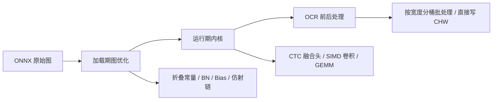
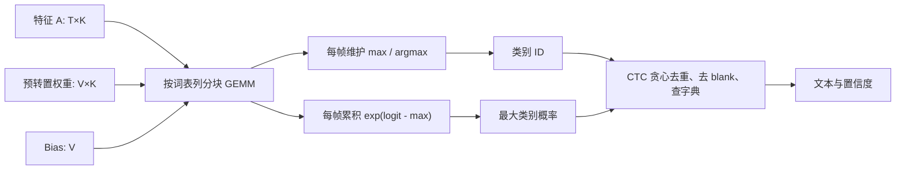

# PP-OCR 原生 Go 推理：算子融合技术报告

> 适用范围：`corelib/onnxrt`、`corelib/embedding/tensor` 与 `corelib/ocr` 中的原生 PP-OCR 推理链路。
> 读者对象：了解“卷积、矩阵乘法、Softmax”等基本名词，但刚开始接触推理优化的开发者。
> 更新依据：当前工作区实现（2026-08）。

## 1. 一句话概览

**算子融合（Operator Fusion）**，就是把原本要分多步执行的一串小计算，改成一次更大的计算完成，减少中间张量、内存读写、调度次数和循环开销。

以识别模型尾部的 CTC 分类头为例，普通流程是：

```text
特征 X → MatMul → Add(Bias) → Softmax → ArgMax → CTC 贪心解码
```

融合后，推理时不再生成巨大的 Softmax 概率矩阵，而是边计算分类分数，边维护“最大类别”和“归一化所需的统计量”：

```text
特征 X → 融合 CTC 头（投影 + Bias + 最大值 + Softmax 分母）→ 每帧类别与置信度 → CTC 解码 → 文本
```

这样做不会改变模型想表达的数学结果，但可以显著减少临时内存和无效计算。

## 2. 为什么融合能加速

### 2.1 推理慢的不只是乘法

初学者容易认为神经网络推理就是“不断做乘法”。实际上，CPU 推理常常还花时间在：

- 为中间结果申请内存；
- 把中间结果写进内存、又立刻从内存读出来；
- 遍历整个张量做 Add、Relu、Softmax 等逐元素操作；
- 在很多小算子之间切换函数、检查形状和调度线程；
- 将数据从一种布局转换为另一种布局。

现代 CPU 的算术单元很快，但访问主内存相对慢。因此，减少“写一次、读一次、再写一次”的次数，通常和减少乘法本身一样重要。

### 2.2 一个直观例子：卷积后加偏置再 ReLU

未融合时：

```text
Y = Conv(X, W)         // 写出 Y
Z = Y + bias           // 读 Y，写 Z
O = max(Z, 0)          // 读 Z，写 O
```

若计算卷积某个输出元素时直接把偏置加入累加器，再在写回时做 `max(?, 0)`，理论上可以写成：

```text
O = max(Conv(X, W) + bias, 0)
```

这称为**计算/内核级融合**。它的理想效果是只写一次最终结果。

本项目还存在另一种更稳妥的形式：加载模型时把 `Conv → Add(bias)` 改写为“Conv 自带 bias”，并把 `Conv → Relu` 记录为 Conv 的 epilogue（后处理）。它已经消除了独立 ONNX 节点和中间张量；但部分激活仍会在卷积结果生成后进行一次向量化遍历。因此，文中会明确区分“完全写回融合”和“图级节点融合”。

### 2.3 融合的三种层次

| 层次 | 做法 | 典型收益 | 本项目示例 |
|---|---|---|---|
| 图级融合 | 加载 ONNX 后重写计算图，删除可等价替换的节点 | 少执行节点、少中间张量 | Conv + BatchNorm、Conv + Bias Add |
| 内核级融合 | 同一循环/汇编内核同时做多项计算 | 少读写、提升 SIMD 利用率 | CTC 投影 + Bias + ArgMax + Softmax 统计、深度卷积多 tap 累加 |
| 流水线融合 | 前后处理直接把数据写入下一阶段所需格式 | 少复制、少临时缓冲 | 识别预处理直接写入批量 CHW 输入 |



## 3. 数学基础：怎样判断能不能融合

融合不是把相邻节点强行合并；必须先证明替换前后等价。

### 3.1 线性变换的可合并性

卷积和矩阵乘法对输入都是线性运算。以矩阵乘法为例：

\[
Y = XW + b
\]

若输入先进行标量仿射变换：

\[
X' = sX + c
\]

则：

\[
X'W + b = X(sW) + (c \cdot \operatorname{sumRows}(W) + b)
\]

因此，只要 `s`、`c` 是常量，并且卷积边界条件允许，这个前置 `Mul/Add/Div/Sub` 链就能折叠进卷积权重和偏置。

### 3.2 为什么 padding 会让融合变复杂

上面的常数项 `c` 假设卷积窗口内每个位置都能读到输入 `c`。但零填充（padding）区域的值是 `0`，不是 `c`：

```text
无 padding：每个窗口都包含同样数量的 c，偏置修正恒定。
有 padding：边缘窗口少了部分 c，偏置修正随位置变化。
```

所以当前实现只在满足安全条件时折叠“带常数偏移”的前置仿射链：普通 Conv 必须没有 padding；ConvTranspose 则只允许纯缩放（`c = 0`）。这体现了融合优化最重要的原则：**正确性优先于激进优化**。

### 3.3 Softmax 为什么适合与 ArgMax 融合

对一行 logits \(z_i\)，Softmax 为：

\[
p_i = \frac{e^{z_i-m}}{\sum_j e^{z_j-m}},\qquad m=\max_j z_j
\]

若 CTC 贪心解码只需要：

1. 最大概率对应的类别；
2. 这个类别的概率；

就不需要保存每个 \(p_i\)。只需保留：

- `max(z)` 和其类别下标；
- 分母 \(\sum_j e^{z_j-m}\)；
- 最后计算 `1 / 分母`。

这正是融合 CTC 头的理论基础。

## 4. 当前已实施的融合算子列表

下表是当前实现中已经落地的融合或等价折叠。后续小节会逐项解释。

| 编号 | 融合模式 | 发生时机 | 是否消除中间张量 | 关键位置 |
|---|---|---|---|---|
| F1 | `Conv → BatchNormalization` | 加载期 | 是 | `corelib/onnxrt/fuse.go`：`foldBatchNorms` |
| F2 | `Conv/ConvTranspose → Add/Sub(偏置)` | 加载期 | 是 | `foldConvBiasOps` |
| F3 | `Mul/Div/Add/Sub → Conv` 前置仿射链 | 加载期 | 是 | `foldPreConvNorms` |
| F4 | `Conv → Relu/Sigmoid/HardSigmoid` | 加载期 + 运行期 | 是（节点）；激活仍原地执行 | `detectEpilogues`、`applyEpilogue` |
| F5 | `Conv → HardSigmoid` 分支 + `Mul` | 加载期 + 运行期 | 是（节点） | `EpiHSwish` |
| F6 | `Conv → GELU` 展开链 | 加载期 + 运行期 | 是（节点） | `EpiGELU`、`geluErfInto` |
| F7 | `MatMul → [Add Bias] → Softmax → ArgMax`，并将结果直接交给 CTC 解码 | 运行期 | 是，避免完整概率矩阵 | `corelib/onnxrt/ctc.go`、`corelib/ocr/recognize.go` |
| F8 | 深度卷积连续 3 tap / 7 tap 累加 | 运行期内核 | 是（避免多个逐 tap 向量 pass） | `convDepthwiseSIMD`、`fmadd3Into` |
| F9 | `MatMul + Bias` 写回；`MatMul + Residual Add` 累加写回 | 运行期内核 | 减少额外矩阵遍历 | `corelib/embedding/tensor/ops.go` |
| F10 | 识别 resize/归一化/右侧填充 → 批量 CHW 输入 | OCR 流水线 | 是 | `recPreprocessPaddedInto` |

此外，Identity 消除、常量折叠、常量 MatMul 权重预转置、arena 复用、宽度分桶批处理、1×1 卷积 GEMM 化和 SIMD 转置等也已实施。它们不全属于严格意义上的“算子融合”，但会放在第 6 节说明，因为它们与融合共同构成实际性能收益。

## 5. 已实施融合的技术原理

### F1：Conv + BatchNormalization 折叠

#### 原始计算

推理阶段的 BatchNorm 对每个输出通道 \(m\) 做：

\[
BN(y_m)=\gamma_m\frac{y_m-\mu_m}{\sqrt{\sigma_m^2+\epsilon}}+\beta_m
\]

令：

\[
f_m=\frac{\gamma_m}{\sqrt{\sigma_m^2+\epsilon}}
\]

如果卷积输出为 \(y_m=Conv(x,W_m)+b_m\)，那么：

\[
BN(y_m)=Conv(x,W_m f_m)+(b_m-\mu_m)f_m+\beta_m
\]

#### 实现方式

加载模型时：

1. 对卷积第 `m` 个输出通道的全部权重乘以 `f_m`；
2. 将卷积 bias 更新为 `(bias - mean) * f + beta`；
3. 把 Conv 的输出名改成 BN 的输出名；
4. 从图中删除 BatchNormalization 节点。

这样运行时只执行 Conv，不再申请和遍历 BN 输出张量。

#### 安全条件

- 只处理推理模式 BatchNorm；
- Conv 输出只能被该 BN 单独消费；
- Conv 原始输出不能同时是模型图输出；
- 被原地改写的卷积权重和卷积 bias 必须是未被其他节点共享的常量；BN 参数本身不被改写，但必须是合法常量。
- 实现应先完成全部可改写 initializer 的校验与准备，再开始缩放权重、创建 bias 或改写节点；任一校验失败都必须保持原图和常量不变，避免“融合未生效却已部分修改权重”。
- 自动创建的 bias 名称也必须避开现有图值和 initializer，不能因同名覆盖无关常量。

这些约束避免“改了一个共享权重，却影响另一条分支”的错误。

### F2：Conv/ConvTranspose + Add/Sub 偏置折叠

#### 原始计算

```text
Y = Conv(X, W, b)
Z = Y + k
```

如果 `k` 是标量，或是形状为 `[1, M, 1, 1]` 的每输出通道常量，则：

\[
Z=Conv(X,W,b+k)
\]

对于减法 `Y - k`，则把 `-k` 加入 bias。

#### 实现方式

加载期将常量合并到卷积 bias，并删除 Add/Sub 节点。若原卷积没有 bias，则创建一个新的全零 bias 后再写入常量。

#### 为什么只接受 `[1, M, 1, 1]`

ONNX 广播规则会从右侧对齐维度。一个长度刚好等于 `M` 的一维数组不一定代表“通道偏置”，也可能对齐到宽、高维度。当前实现只接受明确的 NCHW 通道向量，从而避免错误折叠。

### F3：前置仿射链折叠进卷积

#### 可识别的模式

```text
输入 → Mul/Div/Add/Sub（常量标量链）→ Conv
```

例如归一化中的：

```text
X → Mul(X, s) → Add(..., c) → Conv
```

#### 实现方式

加载期从 Conv 输入向前回溯，只接受“一个动态输入 + 一个标量常量”的 `Mul/Div/Add/Sub` 链。它把链合成为：

\[
X' = sX+c
\]

然后按第 3.1 节的等式更新卷积权重和 bias，最后移除这串逐元素节点。

#### 收益

前置归一化通常作用于整张特征图；一旦折叠，运行时无需额外扫描全部输入元素。这对高分辨率检测特征图尤其有价值。

### F4/F5/F6：Conv 后激活（Epilogue）融合

#### 能识别的激活

当前支持：

- `Conv → Relu`
- `Conv → Sigmoid`
- `Conv → HardSigmoid`
- `Conv → HardSigmoid` 与 Conv 输出共同进入 `Mul`，即 H-Swish：
  \[
  x\cdot clamp(\alpha x+\beta,0,1)
  \]
- 精确 GELU 展开：
  \[
  0.5x(1+erf(x/\sqrt{2}))
  \]

#### 当前的“融合”是什么

加载期会删除原激活节点，把对应激活信息记录在 Conv 的 epilogue 中；运行 Conv 时由 `applyEpilogue` 在同一算子执行路径完成激活。

这已经带来两类收益：

1. 图更短，减少独立节点调度和中间 Tensor 对象；
2. 激活直接原地修改 Conv 输出，不额外分配激活输出张量。

> 注意：当前 Relu/Sigmoid/HardSigmoid/GELU 的大多数路径仍会对 Conv 输出进行一次向量化遍历。它属于“节点和内存对象融合”，不是所有场景下的“卷积累加器写回时立即激活”。这是后续可继续优化的方向。

#### GELU 的专门 SIMD 内核

精确 GELU 本身由多个小算子组成：Div、Erf、Add、Mul、Mul。当前实现不仅把图折叠为 epilogue，还对主体数据使用 `geluErfAVX2` 单次 SIMD 内核，保留尾部的通用实现。这避免了逐个执行中间 `Erf` 缓冲和多个向量 pass。

### F7：PP-OCR CTC 头融合

这是当前 OCR 识别链路中最关键的融合之一。

#### 原始链路

识别网络尾部通常形如：

```text
特征 [T, K]
  → MatMul(权重 [K, V])
  → Add(bias [V])
  → Softmax(last axis)
  → 得到 [T, V] 概率
  → 每帧 ArgMax
  → 去重、去 blank、查字典
```

其中：

- `T`：时间帧数；
- `K`：输入特征维度；
- `V`：词表大小。

PP-OCRv6 small 的分类词表很大，完整 `[T, V]` float32 概率矩阵会占用大量内存。即使只需要每帧一个类别，传统流程也必须把所有类别概率都写出来。

#### 融合后链路



`ctcHeadKernel` 的核心步骤：

1. 将常量权重在加载期预转置为 `[V, K]`，适配 GEMM 访问；
2. 按词表列分块（默认 512 列）计算 `A × W^T + bias`；
3. 每个时间帧维护当前最大 logit 与类别 ID；
4. 使用数值稳定 Softmax 公式累计分母；
5. 只输出每帧 `id` 和最大类别的概率；
6. 将每帧 `id` 与最大类别概率交给 OCR 层做 CTC 贪心解码，不再传递完整概率 Tensor。

换句话说，融合内核完成的是“**分类头计算与帧级 ArgMax**”；去重、去 blank、字典映射仍由 OCR 层的 `ctcGreedyDecodeIDs` 完成。这样既避免大张量，又让文本解码逻辑保持清晰、可复用。

#### 数值稳定性

指数函数可能溢出，因此 Softmax 使用 `logit - maxLogit`。当后续块出现更大的最大值时，之前累计的分母也会按 `exp(oldMax - newMax)` 重新缩放。这保证分块计算仍等价于整行 Softmax。

#### 触发条件与回退

只在图输出满足下列尾部模式时启用：

```text
MatMul → 可选 Add(一维 bias) → 可选 Identity → Softmax(最后一维) → 图输出
```

若模型结构或运行时形状不匹配，OCR 代码会回退到普通 `Graph.Run + ctcGreedyDecode`，保证兼容性。

### F8：深度卷积多 tap 融合

深度卷积中，一个输出元素需要将多个卷积核 tap（例如 3×3 的 9 个权重）累加到同一输出位置。

普通实现可能对每个 tap 单独做一遍：

```text
out += w0 * x[offset + 0]
out += w1 * x[offset + 1]
out += w2 * x[offset + 2]
```

当前 `fmadd3Into` 将连续三个 tap 合到一次 SIMD 迭代：

```text
out[i] += w0*x[i] + w1*x[i+1] + w2*x[i+2]
```

在深度卷积的 3×3、7×7 宽度内部区域，`convDepthwiseSIMD` 使用该路径。它减少了对 `out` 的重复读写，也让 CPU 可以在一次向量加载中完成更多 FMA（乘加）运算。

边缘像素仍走带边界检查的安全路径；这是一种常见结构：**大部分内部区域走快路径，少量边缘走通用路径**。

### F9：矩阵乘法的 Bias / Residual 融合写回

`MatMulBias` 的语义为：

\[
out_{m,n}=\langle A_m,B_n\rangle+b_n
\]

它在矩阵乘法微内核得到 dot product 后，直接在存储结果时加入 bias，避免“先生成完整 MatMul 输出，再单独执行一次 Add”。

这里的 bias 是 **MatMul 输出列** 方向的 bias；它与卷积按输出通道（矩阵行）添加的 bias 不同。卷积 bias 由 Conv 内核单独按通道添加，不能直接套用这一接口。

`MatMulBiasAdd` 的语义为：

\[
out_{m,n}\mathrel{+}=\langle A_m,B_n\rangle+b_n
\]

用于残差连接等“把新结果直接累加到已有输出”的场景。它避免额外结果矩阵以及后续逐元素 Add。

### F10：识别预处理到批量 CHW 的流水线融合

识别模型输入需要 `[batch, 3, height, width]` 的 CHW float32 张量。传统做法通常是：

```text
裁剪 → resize → 生成紧凑 CHW → 复制到批量张量 → 再填充右边空白
```

当前 `recPreprocessPaddedInto` 改为：

```text
裁剪 → resize → 归一化并直接写入最终批量 CHW 位置（同时写右侧 -1 padding）
```

它不改变神经网络数学算子，却消除了两次内存操作：批量填充和紧凑样本复制。由于识别结果按 CTC 帧宽分桶，相近宽度的文本行能够安全组成批量，且每个样本只解码其真实有效帧。

## 6. 与融合配套、但不应混称为融合的优化

### 6.1 常量折叠与 Identity 消除

加载期会先消除 Identity，并计算纯常量子图。它们与融合相似，都是“把运行时工作前移到加载期”，但严格来说不是两个动态算子的融合。

### 6.2 常量 MatMul 权重预转置

ONNX 的 MatMul 权重通常是 `[K, N]`，而高效微内核更适合按输出列将权重当作 `[N, K]` 连续读取。当前在 `NewGraph` 时预转置常量权重；后续每次推理都复用该布局。

它不改变公式，只改变内存排列，避免每次推理重复转置。

### 6.3 1×1 Conv 降低为 GEMM

1×1 卷积没有空间邻域访问，本质上等价于每个像素上的矩阵乘法。实现先把 `[C, H, W]` 的通道平面转为按像素连续的 `[H×W, C]`，再调用 GEMM。

这属于**算子降级/映射**：把卷积映射到成熟的矩阵乘法内核，而不是把两个相邻 ONNX 节点合并。

### 6.4 SIMD、微内核和布局转换

已使用的相关路径包括：

- AVX2/AVX-512 GEMM 微内核；
- PP-OCR 常见维度的 4×3 多列投影内核；
- 8×8 float32 SIMD 转置；
- 深度卷积的 FMA 向量化；
- ReduceMean 连续后缀轴的向量化求和。

SIMD 是“同一条指令处理多个数据”的向量计算技术；融合则是“同一轮数据遍历完成更多算子”。二者常常一起使用，但概念不同。

### 6.5 输出 Tensor arena 与 scratch 复用

ONNX 运行时根据张量生命周期复用中间输出缓冲，OCR Engine 也复用裁剪、resize、识别批量等 scratch 缓冲。它们主要降低 GC 和分配成本，不改变算子图。

## 7. 性能验证与结果解读

### 7.1 基准口径

端到端压力基准为 `BenchmarkEngineStressCorpus`，覆盖检测、文本框后处理、裁剪、识别、CTC 解码等完整路径。为降低 Windows 调度噪声，测量时使用：

```powershell
$env:GOMAXPROCS='1'
go test -c -o .tmp\ocr-stress-bench.exe ./corelib/ocr
# 启动后设置 High 优先级与单核 CPU 亲和性，再执行：
# -test.bench BenchmarkEngineStressCorpus -test.benchtime 5x -test.cpu 1
```

### 7.2 当前测量结果

以早期干净基线 `2.661432280 s/op` 为比较对象，30% 提升门槛为：

\[
2.661432280\times(1-30\%)=1.863002596\;s/op
\]

固定亲和性、高优先级、单核、每轮 5 次的三次端到端测量结果：

| 测量 | 延迟 | 相对基线提升 |
|---:|---:|---:|
| 1 | 1.482275040 s/op | 44.3% |
| 2 | 1.573059640 s/op | 40.9% |
| 3 | 1.594963500 s/op | 40.1% |

三次结果均低于 `1.863002596 s/op` 门槛，中位数约为 `1.573 s/op`。

> 这些数据反映的是当前机器（AMD Ryzen 7 8745HS）和上述控制条件下的结果。不同 CPU、系统负载、模型版本、输入图像分布和线程数都会影响绝对时间；因此发布前应在目标部署环境重复测量。

## 8. 融合实现的通用安全清单

准备新增一种融合时，建议按以下顺序检查：

1. **写出等价公式**：不要只凭直觉合并节点。
2. **确认常量性**：要折进权重/bias 的值必须是不会在运行时变化的 initializer。
3. **检查共享消费者**：若中间值被多条分支使用，删除节点会破坏另一条分支。
4. **检查图输出**：中间值若是模型声明的输出，不能悄悄移除。
5. **检查广播语义**：尤其要区分标量、通道向量和空间向量。
6. **处理边界条件**：padding、stride、dilation、ConvTranspose 等都会改变简单代数变换的适用性。
7. **保持数值策略一致**：Softmax 的 max 减法、指数 clamp、tie-breaking、浮点累加精度都可能影响输出。
8. **准备回退路径**：图形状或模式不匹配时走通用实现，而不是报错或强行融合。
9. **做双重验证**：既要有小张量数学单测，也要有真实 OCR 端到端识别回归。

## 9. 后续可继续推进的方向

当前融合已覆盖 PP-OCR 主要高价值模式，进一步优化可以按收益和复杂度排序：

1. **Conv + Bias + 激活真正写回融合**：把 ReLU 等直接放进 GEMM/卷积输出写回循环，减少 epilogue 的整张量二次遍历。注意 MatMul 的通道/列 bias 方向与 Conv bias 不同，需为 Conv 设计独立的安全 epilogue 接口。
2. **更多图模式**：识别并折叠更多导出器产生的等价格式，例如不同的 bias 广播形式（必须先明确语义）。
3. **Conv + Residual + Activation**：对确认安全的残差块，把残差加法和激活结合到输出写回阶段。
4. **更宽的 CTC 分块自适应**：根据 `T`、词表大小和 L2/L3 缓存容量选择 chunk 大小，但必须保留可重复的基准验证。
5. **目标 CPU 专用内核**：AVX-512、ARM NEON 等平台分别设计微内核，同时保留纯 Go/通用路径以保证可移植性。

## 10. 相关源码索引

| 主题 | 主要文件 |
|---|---|
| 图加载、常量权重预转置、CTC 检测入口 | `corelib/onnxrt/graph.go` |
| 图级融合规则 | `corelib/onnxrt/fuse.go` |
| CTC 融合执行 | `corelib/onnxrt/ctc.go` |
| Conv、深度卷积、im2row、1×1 GEMM | `corelib/onnxrt/conv.go` |
| GELU SIMD 融合内核 | `corelib/onnxrt/simd_amd64.go`、`corelib/onnxrt/simd_amd64.s` |
| Tensor arena 生命周期复用 | `corelib/onnxrt/arena.go` |
| GEMM、Bias/Residual 融合写回 | `corelib/embedding/tensor/ops.go` |
| AVX2/AVX-512 GEMM 微内核 | `corelib/embedding/tensor/gemm_amd64.go`、`gemm_amd64.s`、`avx512_kernels_amd64.s` |
| OCR 宽度分桶、批量识别与 CTC 解码 | `corelib/ocr/engine.go`、`corelib/ocr/recognize.go` |
| OCR 预处理直写 | `corelib/ocr/preprocess.go` |

---

## 附录：术语速查

| 术语 | 简明解释 |
|---|---|
| Tensor（张量） | 多维数组；图像常表示为 `[批次, 通道, 高, 宽]`。 |
| 算子（Operator） | 一个计算节点，如 Conv、Add、Relu、Softmax。 |
| Bias（偏置） | 加在每个输出通道或输出元素上的常量。 |
| Epilogue | 主计算（例如 GEMM/Conv）完成后紧接着的固定后处理，如 Bias、激活。 |
| GEMM | 通用矩阵乘法，是许多神经网络计算的核心。 |
| SIMD | 单指令多数据；一条 CPU 指令同时处理多个 float32。 |
| FMA | 融合乘加指令，完成 `a*b+c`，通常更快且只舍入一次。 |
| CTC | 一种序列识别输出方式；通过去除 blank 和重复标签得到最终文本。 |
| Logits | Softmax 之前的分类原始分数。 |
| Arena | 按生命周期复用临时内存的分配器。 |
