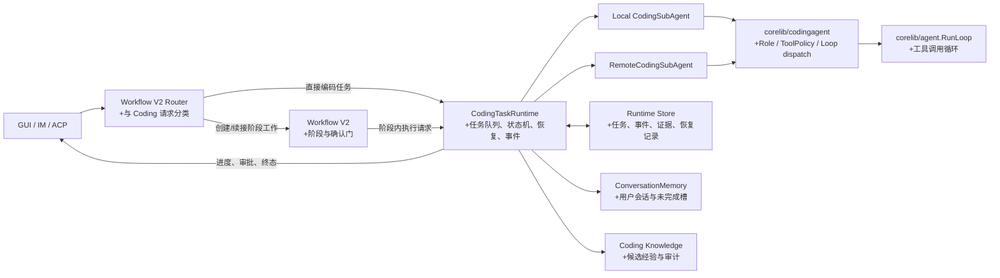
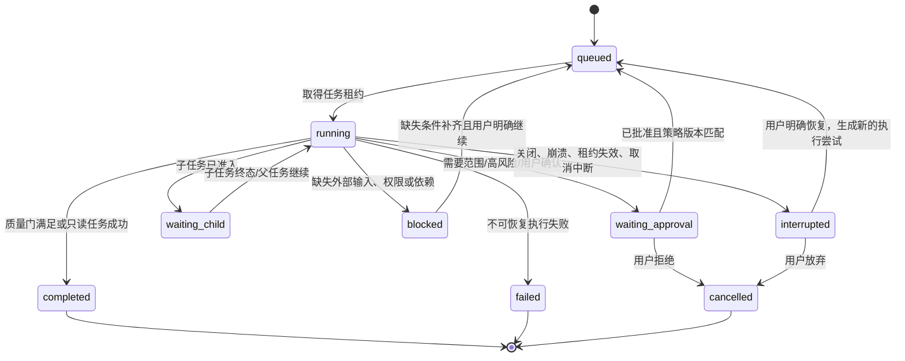
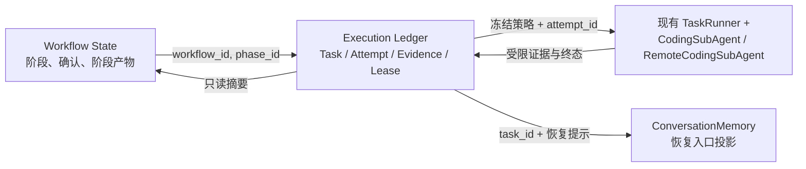

# 借鉴 Prime Agent 的可恢复编码任务运行时设计

> 状态：实施中（P0/P1 已落地；P2 只读子任务、知识 provenance 与跨宿主执行契约已落地；M3 自动经验已收紧为 Ledger 证据绑定、默认候选；MaClawSrv 远程 Runtime/Recovery 安全适配已落地；P3 的本地 GUI Git 隔离并发写入已落地；远程隔离仍保持串行，但其受控合并门已收紧）
> 日期：2026-08-11
> 参考实现：[PrimeIntellect-ai/prime-agent](https://github.com/PrimeIntellect-ai/prime-agent)，审阅提交 `a18809e`（浅克隆，2026-08-10）
> 目标范围：当前项目的 Coding SubAgent、Workflow V2、会话恢复与 GUI/IM 任务执行链路

## 1. 结论

Prime Agent 最值得借鉴的不是它的 TypeScript、daemon 或 IPython，而是四条运行时原则：

1. **执行权与展示权分离**：GUI/IM 只是连接和展示，任务运行时才拥有队列、取消、子任务、状态与落盘。
2. **子任务先准入、后完成**：创建子任务立即返回稳定句柄；结果以事件或明确消息异步回收，不把子任务的完整对话塞回父任务上下文。
3. **持久化状态是可恢复事实，不是提示词副本**：会话、任务、产物、恢复记录和执行证据各自有边界；重启后恢复状态，但绝不盲目重放可能已产生副作用的操作。
4. **学习必须小步、可审计、默认局部化**：从成功/失败证据提炼的经验先进入候选或项目级范围；不允许自动改写基础系统提示词，也不应自动升级为全局规则。

当前项目已经具备大量前置能力：纯净上下文的 `CodingSubAgent`、`corelib/agent.RunLoop`、`LoopContext` 取消与重规划、`ConversationMemory` 的持久化/未完成任务槽、Workflow V2、远程 Coding SubAgent、任务编排、Coding Knowledge Store，以及 GUI/ACP 入口。本设计建议补齐一个**轻量、Go 原生、可恢复的编码任务运行时**，统一这些能力的生命周期与证据模型；不迁移 Prime Agent 的进程架构。

## 2. 调研依据

### 2.1 Prime Agent 中可借鉴的实现事实

| 主题 | 参考实现 | 可借鉴点 |
| --- | --- | --- |
| 分层所有权 | `packages/coding-agent/docs/architecture.md` | 客户端不拥有执行；一个会话运行时拥有队列、模型调用、工具、压缩、目标、子代理和转录持久化。 |
| 原生递归子代理 | `docs/rlm.md`、`docs/rlm-runtime.md`、`src/core/rlm-runtime.ts` | `rlm()` 返回的是“准入句柄”，不是子代理结果；父子通过显式消息或文件交付结果。 |
| 子代理生命周期 | `src/core/agent-session.ts`、`src/core/agent-session-runtime.ts` | 父级拥有直接子级注册表、递归深度、取消、删除、用量归因和持久化恢复。 |
| 长任务可靠性 | `docs/long-running-agents.md`、`docs/daemon.md` | 目标、调度、心跳和恢复都进入同一提示队列；任务恢复不重放不确定的副作用。 |
| 运行时/内核边界 | `docs/rlm-runtime.md`、`src/core/kernel/index.ts` | 模型侧只调用窄接口；宿主侧校验请求、维护凭据、执行策略和状态转换。 |
| 可控自我改进 | `src/core/refinement/refinement.ts` | 经验以有版本的补充 Harness State 保存；变更为 create/update/delete，保留前后快照并可回滚，基础提示词不可变。 |

### 2.2 当前项目的落点

| 已有能力 | 主要位置 | 本设计的使用方式 |
| --- | --- | --- |
| 纯净编码上下文、工具审计、范围/命令防护、diff 与验证质量门 | `gui/coding_subagent.go` | 作为本地执行器，不另造 Agent Loop。 |
| SSH 编码执行 | `gui/remote_coding_subagent.go` | 作为远程执行器，复用同一任务契约。 |
| 编码请求分类、只读/操作/实施工具面 | `gui/coding_workbench_plan.go` | 作为 Runtime 创建任务前的策略输入。 |
| 任务编排、重试与 Workflow V2 集成 | `gui/coding_subagent_orchestrator.go`、`gui/workflow_v2_integration.go` | 渐进迁移为 Runtime 的执行适配器。 |
| 单次运行取消、重规划、状态事件 | `gui/agent_loop_context.go` | 作为运行内控制器；不将其误作跨进程持久状态。 |
| 对话历史、分支元数据、未完成任务槽、租约式 in-flight 记录 | `corelib/agent/conversation_memory.go` | 作为用户会话恢复入口，与任务运行时记录建立引用。 |
| Workflow V2 状态机 | `corelib/workflow/v2/` | 保持业务阶段编排职责；Runtime 只承接阶段内可执行工作。 |
| 经验沉淀与检索 | `corelib/knowledge/`、`gui/coding_subagent_knowledge.go` | 引入候选—验证—升级的证据闭环，而非无条件写入。 |
| 跨宿主 Coding Agent 契约 | `corelib/codingagent/` | 统一角色、只读工具策略与循环调度；GUI/TUI/MaClawSrv 仅提供各自工具、运输和呈现适配器。 |

## 3. 范围与非目标

### 3.1 本期范围

- 本地及 SSH 编码任务的统一生命周期、状态、结果和恢复记录。
- 父任务向独立子任务发起异步委派的统一契约；默认仅支持一层委派。
- 将“执行证据”（读取、改动、命令、验证、diff、风险、取消原因）作为一等数据。
- 应用重启、GUI 关闭和任务中断后的可解释恢复：恢复任务状态和待处理决策，不重放写操作或 shell 命令。
- Coding Knowledge 的候选经验审计与人工/规则确认入口。

### 3.2 明确非目标

- 不引入 Node.js、TypeScript daemon、IPython/Jupyter、ZeroMQ 或 Prime Agent 的 RLM Python API。
- 不让模型任意执行宿主控制命令，也不以“内核隔离”冒充安全沙箱。
- 不把 GUI、IM、ACP 重写为统一的常驻 daemon 协议；首期仍由当前应用进程托管。
- 不自动恢复或重放不确定的工具调用、写文件、远程命令、外部 API 请求。
- 不允许子代理绕开现有范围授权、远程高风险审批、工作流确认门和用户身份边界。
- 不自动把某次任务总结写入全局提示词、Steering 或共享知识库。

## 4. 目标架构



### 4.1 所有权边界

| 组件 | 拥有 | 不拥有 |
| --- | --- | --- |
| GUI/IM/ACP 适配层 | 输入、展示、用户确认、连接取消动作 | 执行循环、任务真相、恢复决策 |
| Workflow V2 | 业务阶段、确认门、阶段产物、阶段转换 | 子代理进程/循环生命周期、工具审计细节 |
| `CodingTaskRuntime` | 任务状态机、队列、子任务注册表、取消、事件、持久化、恢复判定、最终聚合 | 模型供应商协议、具体文件/SSH 工具实现 |
| `CodingSubAgent` / `RemoteCodingSubAgent` | 单个任务的纯净上下文、工具调用、质量审计与结构化结果 | 跨任务持久化、用户会话选择、阶段推进 |
| `corelib/codingagent` | 跨宿主角色语义、只读工具策略、对 `RunLoop` 的统一调度 | GUI/SSH/TUI 工具实现、UI 事件、认证、会话和工作区访问 |
| `RunLoop` | 单轮/多轮模型—工具循环 | 任务业务状态、授权策略来源、持久化格式 |
| `ConversationMemory` | 用户会话历史、活动分支、未完成任务槽 | 编码任务执行证据和副作用恢复 |
| Coding Knowledge | 经验候选、检索、置信度、审计 | 任务的唯一事实来源或自动全局规则 |

这条边界解决当前多处状态容易同时落在 `LoopContext`、工作流状态、任务编排器和对话未完成槽的问题：**任务执行状态只以 Runtime Store 为准；其他模块仅保存引用或投影。**

## 5. 核心数据契约

以下为 Go 方向的草案，字段名可在实施时按仓库约定调整；重点是语义与不变量。

```go
type CodingTaskMode string

const (
    CodingTaskInquiry        CodingTaskMode = "inquiry"
    CodingTaskOperational    CodingTaskMode = "operational"
    CodingTaskImplementation CodingTaskMode = "implementation"
)

type CodingTaskStatus string

const (
    TaskQueued          CodingTaskStatus = "queued"
    TaskRunning         CodingTaskStatus = "running"
    TaskWaitingApproval CodingTaskStatus = "waiting_approval"
    TaskWaitingChild    CodingTaskStatus = "waiting_child"
    TaskInterrupted     CodingTaskStatus = "interrupted"
    TaskCompleted       CodingTaskStatus = "completed"
    TaskFailed          CodingTaskStatus = "failed"
    TaskBlocked         CodingTaskStatus = "blocked"
    TaskCancelled       CodingTaskStatus = "cancelled"
)

type CodingTaskRecord struct {
    ID, ParentID, WorkflowID, PhaseID string
    OwnerID, SessionID, RunID         string
    Mode                               CodingTaskMode
    Status                             CodingTaskStatus
    ExecutionTarget                   string // local | ssh
    ProjectRef                         ProjectReference
    Prompt                             string
    ContextSummary                     string
    Constraints                        []string
    AcceptanceCriteria                 []string
    PolicySnapshot                     TaskPolicySnapshot
    Attempt, MaxAttempts               int
    CreatedAt, UpdatedAt               time.Time
    Version                            uint64 // 乐观并发控制
}

type CodingTaskResult struct {
    TaskID          string
    Status          CodingTaskStatus
    Summary         string
    Evidence        TaskEvidence
    Verification    VerificationResult
    ResidualRisks   []string
    Blockers        []string
    Usage           TaskUsage
    ChildTaskIDs    []string
}
```

`ProjectReference` 必须区分本地路径与远程项目身份。远程身份由现有 `RemoteCodingTaskMeta` 的 host/user/port/workDir 构成；不得只用显示名称或未规范化路径作为唯一键。

`TaskPolicySnapshot` 是创建时冻结的执行策略，至少包含：任务模式、写入范围、是否允许 shell、远程高风险审批状态、允许工具集合、最大迭代/时限、递归深度和质量门。任务开始后不得因为全局配置热更新而悄然放宽。

`TaskEvidence` 应复用并汇总当前 `CodingSubAgentResult` 中已有的数据：`FilesRead`、`FilesModified`、`FilesCreated`、`CommandsRun`、`SearchesRun`、`GuardrailViolations`、`DynamicToolsRun`、diff 摘要、质量状态与错误摘要。长输出只存受限摘要，完整命令输出按显式的大小/保留策略另存 artifact。

## 6. 状态机与恢复

### 6.1 任务状态机



不变量：

- 任一时刻，一个 `TaskID` 只能由一个持有未过期租约的执行者进入 `running`。
- `waiting_approval` 不执行任何新的变更型工具；批准必须绑定 `TaskID + PolicySnapshot + Version`，避免旧批准授权新任务。
- `completed` 的实现类任务必须有：文件变更证据、最终 diff 检查结果，以及明确的验证状态；纯解释/只读任务可用不同质量门完成。
- `interrupted` 只表示“无法确认该尝试是否完整结束”，不是失败，也不是可安全重放的信号。

### 6.2 恢复策略

运行时每次关键状态转换先写 append-only 事件，再更新快照；事件至少包含 `task_id`、单调 `sequence`、前后状态、时间、执行尝试、摘要和副作用类别。

| 中断点 | 重启后的状态 | 恢复行为 |
| --- | --- | --- |
| 尚未调用模型/工具 | `queued` | 可以再次调度。 |
| 正在流式生成 | `interrupted` | 显示最后持久化进度；用户可新建尝试继续。 |
| 正在读文件或检索 | `interrupted` | 不假设读结果完整；可继续后重新读取。 |
| 正在写文件、执行 shell 或 SSH 命令 | `interrupted` + `side_effect_uncertain` | 禁止自动重放；恢复前先重新探测工作区、git diff、目标文件或远程状态。 |
| 子任务运行中 | 父、子均 `interrupted` | 父任务显示子任务句柄和最后事件；可分别恢复或终止。 |
| 已完成但 GUI 未收到终态 | `completed` | 根据持久化快照投影给客户端，不重复执行。 |

现有 `ConversationMemory` 的 `UnfinishedTaskSlot` 继续用作面向用户的恢复入口，但其中应只保存 `RuntimeTaskID`、摘要与恢复提示。其内容不能代替任务事件日志，更不能保存足以重放 shell 参数的隐式执行计划。

## 7. 异步子任务模型

### 7.1 准入句柄

借鉴 Prime Agent 的关键约束，子任务创建 API 只返回准入句柄：

```go
type ChildTaskHandle struct {
    TaskID       string
    ParentTaskID string
    Name         string
    Status       CodingTaskStatus // admitted/queued 的投影
    ExecutionTarget string
}
```

父任务不得等待 `CreateChild` 返回完整结果，也不得把子任务的对话转录自动拼接进父任务消息。Runtime 通过事件 `child_completed`、`child_failed`、`child_blocked` 向父任务投递一份受大小限制的 `CodingTaskResult` 摘要；父任务在下一可执行边界决定继续、追问、创建新子任务或完成。

### 7.2 并发与写入规则

首期默认规则：

- 同一项目同一时刻最多一个**写入型**子任务；读/检索型子任务可有限并发。
- 写入任务必须声明逻辑范围（文件、目录或明确的“未知范围”）；范围冲突时排队或要求父任务串行化。
- 父任务和子任务不可同时对同一工作区执行变更型工具。
- 子任务最大深度默认为 `1`：根编码任务可创建子任务，子任务不能再创建孙任务；提高深度是显式配置项。
- 远程 SSH 目标以规范化的 host/user/workDir 作为并发隔离键，不能按 UI 标签判断。

这比直接照搬 Prime Agent 的无限可编程递归更契合当前桌面/IM 产品的可解释性和现有安全门。

## 8. 安全与策略边界

Prime Agent 在文档中明确其内核不是安全沙箱。当前项目不应弱化已有的防护，反而应把它们从执行器内部提升为 Runtime 可审计策略：

1. `CodingSubAgent` 与 `RemoteCodingSubAgent` 继续执行路径范围、先读后改、危险 shell、`git`、输出脱敏和远程高风险审批规则。
2. Runtime 只传递冻结后的 `TaskPolicySnapshot`；执行器拒绝策略外工具，即使调用来自恢复、子任务或 ACP。
3. 本地/远程的授权记录均须绑定任务、项目身份、策略版本和有效期；授权不跨任务、不中途升级权限。
4. artifact、事件和 UI 状态不可记录密钥、访问令牌、原始敏感附件或未经脱敏的命令输出。复用现有敏感字段脱敏策略，并补充持久化前的统一检查。
5. `inquiry` 与 `operational` 任务不因恢复而升级为 `implementation`；升级只能创建新策略快照并经过相应确认。

## 9. 经验沉淀：采用“候选—证据—确认”而非自动提示词改写

Prime Agent 的 Harness 可保存局部 prompt/memory/skill/subagent 规范，并记录可回滚 refinement。当前项目已有 Coding Knowledge，更适合采用相同的审计思想而非复制其实现。

建议增加以下约束：

| 层级 | 可写内容 | 默认写入方式 | 是否自动注入 |
| --- | --- | --- | --- |
| 任务 artifact | 失败原因、验证证据、工具摘要 | 自动，任务结束写入 | 仅该任务恢复时 |
| 项目候选经验 | 可复用命令、坑点、局部模式 | 自动提议或用户确认 | 否 |
| 项目已验证经验 | 有至少一次成功证据且无冲突 | 人工确认或严格规则升级 | 有，受 token 上限控制 |
| 全局经验/Steering | 跨项目且来源可靠的通用规则 | 必须人工确认 | 有，受现有信任与加载策略控制 |

经验记录需要新增/确认以下 provenance：来源 `TaskID`、项目范围、适用条件、证据摘要、成功/失败计数、冲突/废弃关系、创建者和最后审核时间。删除/降级也应留审计事件。基础系统提示词保持不可由自动流程修改。

## 10. 实施路线

### M0：契约冻结与观测（低风险）

- 定义 `CodingTaskRecord`、`CodingTaskResult`、`TaskEvidence`、`TaskPolicySnapshot`、事件类型和状态机校验函数。
- 为现有本地/远程执行路径增加只读适配层，将 `CodingSubAgentResult` 转换为统一结果，不改变现有 GUI 行为。
- 记录 task/run/phase/correlation ID，补齐终态、取消和质量门的结构化遥测。

退出条件：能对一条既有本地或 SSH 编码任务还原“由谁、在哪个项目、用何种策略、运行了什么、改了什么、验证了什么、为何结束”。

### M1：单进程 Runtime Store 与安全恢复（中风险）

- 在应用数据目录建立 Runtime Store；采用原子快照 + append-only 事件，或复用项目已有 SQLite 基础设施，但不与 `ConversationMemory` 文件格式耦合。
- 以任务租约防止 GUI、IM、ACP 对同一任务并发执行。
- 启动时恢复不可疑终态；把不确定副作用尝试标为 `interrupted`，在 GUI/IM 展示“重新检查后继续”的恢复卡片。
- `UnfinishedTaskSlot` 仅引用 Runtime task。

退出条件：在读、写、shell、SSH 和子任务中断点分别注入进程退出，均不自动重复潜在副作用，且能保留用户可审查的证据。

### M2：异步子任务注册表与资源控制（中高风险）

- 由 Runtime 管理句柄、父子关系、深度、取消传播、结果摘要投递和用量聚合。
- 先开放只读 explorer/reviewer 子任务；写入型 worker 仍串行，并增加工作区/远程目标冲突检测。
- 将 `TaskExecutionOrchestrator` 和 Workflow V2 的阶段执行逐步改为调用 Runtime，不在一次提交中删除现有调用链。

退出条件：父任务创建两个只读子任务时，父上下文不包含子任务完整轨迹；任一子任务故障、取消、重启后均有可解释状态，且不会破坏父任务。

### M3：证据驱动的经验治理（中风险）

- 让 Coding Knowledge 从任务 artifact 获取来源和验证证据。
- 新经验默认 `candidate`，提供审核、升级、降级、冲突标记与回滚操作。
- 对已验证项目经验实行数量和 token 预算；知识检索失败或不可用时必须降级而不阻断主任务。

退出条件：任何自动建议均能回溯到具体任务证据；不存在“单次模型总结自动成为全局指令”的路径。

### M4：可选的常驻执行宿主（远期，独立立项）

只有在实际需要“关闭 GUI 后继续执行、多个客户端附着同一任务、跨进程任务运行”时，再设计本地 supervisor/worker。其协议、身份认证、版本协商、回放 cursor、命令幂等和升级恢复必须独立评审；不得在 M1–M3 中暗中形成半成品 daemon。

## 11. 验收矩阵

| 类别 | 必测场景 | 通过标准 |
| --- | --- | --- |
| 状态机 | 全部合法/非法转换 | 非法转换被拒绝且无状态写入；版本冲突可检测。 |
| 租约 | GUI 与 ACP 并发启动同一任务 | 最多一个执行者获得租约，另一方拿到可定位的占用结果。 |
| 恢复 | 文件写入、shell、SSH 执行时杀进程 | 任务标为 `interrupted`，不自动重放；恢复前出现重新探测步骤。 |
| 子任务 | 并发只读、同项目并发写入、取消父任务 | 只读可并发；写入冲突被串行/拒绝；取消可传播并留下终态。 |
| 工作流 | NeedsConfirm 阶段创建/恢复编码任务 | 未确认不能越过阶段；恢复不绕过原确认门。 |
| 权限 | 范围外路径、危险命令、远程高风险操作 | Runtime 和执行器双层拒绝；持久化证据已脱敏。 |
| 质量门 | 实现任务无 diff、无验证、验证失败 | 不能标记 `completed`，结果明确说明缺失证据或失败原因。 |
| 知识治理 | 单次成功、冲突经验、过期经验 | 默认候选；可追溯、可降级；不会自动写全局规则。 |
| 兼容性 | 当前 GUI、IM、ACP、本地与远程编码任务 | M0/M1 不改变既有请求分类和工具审批语义。 |

## 12. 主要风险与缓解

| 风险 | 后果 | 缓解 |
| --- | --- | --- |
| Runtime 与 Workflow V2 双写真相 | 恢复后阶段/任务不一致 | Workflow 只保存 `TaskID` 与阶段结果；Runtime 是执行状态唯一来源。 |
| 将 `LoopContext` 持久化 | 把 channel、context、临时回调错误当作可恢复状态 | 仅持久化领域记录与事件；每次恢复创建新的 `LoopContext`。 |
| 中断后自动重放 | 重复写文件、重复部署或重复远程副作用 | 用 `side_effect_uncertain` 终止自动恢复，先探测后由用户继续。 |
| 多子代理并发写同一仓库 | 覆盖修改、测试互相干扰 | 首期单写者、范围冲突检测、显式工作区隔离后再提升并发。 |
| 经验自动沉淀污染后续任务 | 错误提示长期放大 | candidate 默认不注入、保留证据和审核、支持废弃/回滚。 |
| 直接复制 Prime Agent 技术栈 | 破坏 Go + Wails + IM 既有集成 | 只迁移语义契约；运行时保持 Go 原生并复用现有执行器。 |
| 过早构建 daemon | 高并发/恢复复杂度吞噬功能迭代 | 将常驻进程明确列为 M4 独立立项，M1–M3 只做进程内可靠性。 |

## 13. 二次评审：原方案需要收紧的部分

二次核对当前实现后，原方案的方向仍成立，但以下表述需要修正，避免把“可恢复”做成新的状态分叉或安全回归。

| 原方案风险 | 当前实现证据 | 优化决定 |
| --- | --- | --- |
| “Runtime Store 是唯一事实来源”过宽 | Workflow V2 已使用 `corelib/workflow/v2/store_sqlite.go` 的 `workflow_v2.db` 保存阶段、确认和工作流状态；`gui/workflow_v2_integration.go` 在启动时会挂起旧工作流。 | 改为：**Workflow State 是阶段/确认事实；Execution Ledger 是任务尝试与副作用事实。** 两者只用不可变 ID 关联，不能互相复制完整状态。 |
| 另建完整 Runtime 会导致一次大迁移 | 本地、远程执行均在 `gui/workflow_v2_integration.go` 中直接创建 `TaskRunner` 和 SubAgent；旧 `SubAgentTaskRunner` 也仍在使用。 | M0/M1 先增加薄的 `ExecutionLedger` 与适配器，不替换 `RunLoop`、`TaskRunner`、Workflow StateMachine，也不立即删除旧编排器。 |
| 动态扩大任务项目路径与策略冻结矛盾 | `gui/coding_subagent_orchestrator.go` 的 `runTaskWithRecover` 会根据任务文件引用调整 `effectiveProjectPath`。 | 将该行为列为 P0 安全债：恢复或子任务不得根据模型输出自动扩大根目录。路径不在冻结范围内时必须阻断并发起新的、绑定任务版本的范围批准。 |
| “单项目单写者”没有落到现有并发入口 | `SubAgentTaskRunner.RunAllTasks` 依据配置并发调度；Workflow V2 `TaskRunner` 也可运行多个任务。 | 在启用 Ledger 前，实施任务默认强制并发度为 1。后续只允许经过显式写集合声明和冲突检测的并发；未知写集合一律串行。 |
| 仅用 `TaskID + Version` 无法区分重试/陈旧回调 | 现有 `TaskExecutionOrchestrator` 已使用 `RunID` 排除陈旧结果，但该 ID 不持久化。 | 引入持久的 `AttemptID`（随机 nonce）与递增 `AttemptNo`；所有进度、结果、批准、子任务和证据必须携带二者。 |
| “不重放”仍缺少恢复前的判定材料 | 当前本地/远程结果已有 diff、命令和文件审计，但没有持久的 attempt 级工作区指纹。 | 在首次变更型工具调用前后记录受限的 `WorkspaceProbe`：项目身份、目标根、VCS 状态摘要/HEAD、受影响文件摘要、远程 host-key 指纹和工作目录。恢复只创建**新的尝试**，先执行只读探测再由用户确认。 |
| 只以“有文件修改”判定成功会误伤合法 no-op | 实现类任务可能发现目标已经满足、补丁已存在，或只能产出阻塞诊断。 | 完成条件改为“与任务模式匹配的闭环证据”：变更型任务需 diff+验证；无变更完成需明确 `no_change_reason`、探测证据和用户可见结论，不能静默视为完成。 |

### 13.1 优化后的事实边界



不变量调整为：

- Workflow 不保存工具明细、租约或完整任务尝试状态；Ledger 不推进 Workflow Phase，也不自行绕过 `NeedsConfirm`。
- 仅 `ExecutionLedger` 可以把尝试从 `queued` 置为 `running`，且必须原子获得租约；仅持有相同 `AttemptID` 的执行者可写入该尝试终态。
- Workflow 推进采用“读取 Ledger 已提交终态 → 写入阶段结果”的显式协调步骤；若应用在两步之间中断，启动后协调器只重试**元数据同步**，绝不重新调用执行器。
- `LoopContext`、goroutine、channel、HTTP client、SSH session ID 都是尝试期内的易失对象；恢复时重新创建，不能序列化或复用。

### 13.2 优化后的最小数据模型

原 `CodingTaskRecord` / `CodingTaskResult` 保留为逻辑视图，但实际存储应显式拆分稳定任务与一次执行尝试：

```go
type ExecutionTask struct {
    TaskID, WorkflowID, PhaseID, OwnerID string
    ParentTaskID                       string
    ProjectRef                         ProjectReference
    Mode                               CodingTaskMode
    RequestedWork                      string
    PolicyDigest                       string
    CreatedAt                          time.Time
}

type ExecutionAttempt struct {
    AttemptID, TaskID, LeaseOwner string
    AttemptNo                      int
    Status                         CodingTaskStatus
    PolicySnapshot                 TaskPolicySnapshot
    SideEffectState                SideEffectState // none | observed | uncertain | confirmed
    WorkspaceBefore, WorkspaceAfter *WorkspaceProbe
    StartedAt, FinishedAt, LeaseUntil time.Time
    ErrorCode, ErrorSummary        string
}

type ExecutionEvent struct {
    TaskID, AttemptID string
    Sequence          uint64
    Type              ExecutionEventType
    PayloadDigest     string
    CreatedAt         time.Time
}
```

`ExecutionEvent` 的 payload 需设大小上限，并对命令、路径、参数和输出执行持久化脱敏。完整敏感输出不写入 Ledger；若确有诊断必要，使用短期、加密或受权限保护的 artifact 引用，并允许用户清除。

### 13.3 恢复前置探测协议

对于 `side_effect_uncertain` 的任务，恢复 API 不应命名为 `Resume()`，应拆成以下不可混淆的步骤：

1. `PrepareRecovery(taskID)`：创建新 `AttemptID`，冻结为**只读探测策略**，不执行原任务和变更命令。
2. `ProbeWorkspace(attemptID)`：本地收集仓库根、HEAD、`git status` 摘要、目标文件存在性/摘要；远程额外校验 host/user/port、host-key 指纹、规范化 workDir 和连接身份。探测失败则停在 `blocked`。
3. `PresentRecoveryDiff(...)`：向用户展示“上次已知证据、现在探测结果、无法确认部分、建议下一步”。
4. `ConfirmContinuation(taskID, attemptID, policyDigest)`：用户确认后，按当前任务约束创建新的变更型尝试；不使用旧 AttemptID，不重放旧 shell 参数。

对于未发生副作用的 `queued` 任务，可以直接创建新尝试调度；对于已提交 `completed/failed/cancelled` 终态的任务，只允许查看或显式创建派生任务，禁止覆盖历史。

### 13.4 并发分级

| 级别 | 条件 | 可并发内容 |
| --- | --- | --- |
| L0（M0/M1 默认） | 未提供可靠写集；同一项目或远程根 | 仅一个任务，读写均串行。 |
| L1 | 多个只读 `explorer/reviewer` 子任务；无变更型工具 | 可有限并发，受统一 token/请求预算限制。 |
| L2 | 每个写任务均显式声明、规范化并锁定互不重叠的写集合；验证命令无共享可写输出 | 可以并发，但每个文件/目录锁、远程目标锁和最终 diff 冲突检查都必须通过。 |
| L3（远期） | 独立 worktree/容器/远程隔离工作区 | 可放宽并发，再由父任务执行受控合并和验证。 |

不得仅以“任务名称不同”“DependsOn 为空”或模型声明“互不影响”作为 L2 并发依据。

### 13.5 优化后的实施路线

#### 当前实施快照（2026-08-11）

- P0-A/P0-B 已完成：`corelib/codingruntime` 已提供独立、可持久化的 `coding_runtime.db` Ledger、SQLite/Memory Store、租约、单活跃 Attempt、事件序列、审批门与策略摘要一致性校验；其不依赖 `gui`。任何已关闭 Attempt 的迟到 executor 回调均不会覆盖当前 Task 或后续 Attempt，而是以有界 `stale_callback_discarded` 事件留痕并返回 `ErrStaleAttempt`；事件审计接口不保存原始命令、转录或工具输出。MaClawSrv 的本地 `bash` 适配器现在也会验证调用方显式 `working_dir` 位于已冻结的 instance workspace 内；越界路径被拒绝，不再保留“显式目录覆盖默认 cwd”的扩权路径。
- GUI 本地与远程 `CodingSubAgent` 已分别通过适配器接入该 Ledger；项目根冻结、实现类任务强制串行、供应商暂态失败/取消进入 `interrupted + uncertain`，不会自动重放。远程 GUI writer 现与本地/TUI/MaClawSrv 一样启用前后只读 workspace probe：无变更默认 `blocked`；仅当远程宿主质量门同时确认实际 acceptance command、干净 diff/status，并生成配对的 `verified_no_change` digest 时，才允许以“目标已满足”完成。
- P1 的核心恢复协议已完成：`PrepareRecovery → ProbeWorkspace（只读）→ PresentRecoveryDiff → ConfirmContinuation`。GUI 已暴露恢复审查/确认入口；确认前会重新执行只读 git `HEAD/status` 探测并校验 review digest。远程恢复只接受仍存活、且 `host identity + host-key pin digest` 与中断 Attempt 的策略快照一致的 SSH 会话；不会自动重连或沿用旧命令。会话绑定逐字段校验规范化 `host/user/port/host-key pin/workdir`，不会因同名标签、不同端口、换 pin 或换工作目录而复用；Runtime 的只读 probe、项目目录 bootstrap 与执行命令均走不含 reconnect 的 `WriteInput` 路径（`WriteInputChecked`、后台任务及其自动重连路径不可达）。GUI 与 MaClawSrv 的固定 Git probe 每次均生成随机的起止 nonce，并只解析最后一个完整 frame，避免交互式 PTY 回显或仓库可控输出伪造固定分隔符；frame 不完整或 HEAD 不唯一时 fail closed。确认只允许创建新 Attempt；不会复用旧命令、工具参数或旧 Attempt。Runner 现已支持在模型/工具调用前记录可选只读 `WorkspaceBefore` 基线；GUI 本地/远程适配器均会采集相应基线。MaClawSrv 远程恢复同样要求当前用户配置中存在唯一匹配的 pinned target 与已经验证的 live session；HTTP API 不暴露 SSH 重连或任意命令入口。
- ACP Mode B 的疑似工作区变更请求现通过同一 Ledger 创建不透明 `TaskID + AttemptID`，并使用本地只读 Git 前后探测作为 writer completion gate；项目会话取消会先持久化关闭该 Task，再取消进程内 ACP/IM loop，因此迟到的模型或工具回调只能记录为 `stale_callback_discarded`，不能覆盖 `cancelled` 终态。普通 ACP 问答仍走原有共享 IM 路径；ACP 的原有确认卡、客户端工具权限和路径审批仍是授权来源，Runtime 不会借此自动批准或重放。当前 ACP 协议未携带用户确认的 `workflow_id + phase_id`，所以一个 ACP prompt 对应一个稳定 Task，而不会根据相似自然语言与 GUI/TUI 任务错误合并；若需要跨宿主竞争同一 lease，必须先增加显式 workflow/phase 或 attach-existing-task 协议。确认卡后的下一条用户消息同样会创建新 Attempt/Task，不复用被阻塞的模型或工具调用。
- GUI Workflow V2 的任务结果和 ConversationMemory 现只投影不透明 `RuntimeTaskID` 与有界摘要；Ledger 仍是执行事实源，投影不会携带命令、工具参数、密钥或 replay plan。GUI 在 Ledger `completed` 后、Workflow 写入前先持久化 `projection_pending` 标记；启动时只有逐项核实所有不透明 `RuntimeTaskID` 均仍为 Ledger `completed`，且逐项匹配当前 active `workflow_id + phase_id + mode + project/remote workdir` 后，才补写阶段摘要并清理该标记，绝不重跑 Executor。TUI 已初始化同一 corelib 的持久 Store，并在**仅限 Workflow V2 coding/implementation/subagent** 的本地入口接入 Executor 与只读 Git Probe；若进程在 Ledger `completed` 后、Workflow 写入前退出，启动时会按 active workflow 的确定性 `workflow_id + phase_id` 重新定位仅已完成的同一 Ledger Task，校验 workflow/phase/project 绑定后只写入有界完成投影，绝不再次调用模型、工具或 Executor。TUI 本地 Runtime parent 现可通过同一 `spawn_coding_agent` 准入最多三个 `explorer/reviewer` child：准入立即关闭 parent attempt 并释放租约，child 使用新建模型回合且工具面严格限于 `read_file`、`list_directory`、`web_search`、`web_fetch`；`bash`、SSH、写文件、技能/MCP、记忆、IM 和任务工具均在暴露、调用校验与执行三层拒绝。child 仅写入有界摘要/证据摘要，父任务只能在新 attempt 中显式读取 continuation。MaClawSrv 已初始化同一 corelib 持久 Store，并接入显式本地与远程 workflow Executor；远程请求必须同时带 `coding_runtime_mode=remote_workflow`、workflow/phase、project mutation scope，以及规范化 `host/user/port/workDir` 和 host-key pin。运行前只绑定现存且存活、同时匹配当前配置 pin 的 SSH session；远程 Attempt 只暴露该 session 的 `ssh(action=exec)`，拒绝连接、重连、换 session、传输和危险命令。`GET/POST .../coding-runtime/{taskId}/recovery` 仍只允许读取审查与确认入队：每次远程审查需重新验证 pinned target 与 live session，再执行固定的只读 Git probe；缺失/死亡 session 不会触发自动重连，确认也不会执行模型、工具、旧命令或创建 Attempt。MaClawSrv 本地 Runtime parent 同样可通过 `spawn_coding_agent` 显式准入上述受限 child。
- MaClawSrv 已补充显式远程 Workflow 启动入口：`POST /api/v1/instances/{instanceId}/sessions/{sessionId}/coding-runtime/remote`。请求只能提交 `workflow_id`、固定的 `implementation` phase、SSH **label** 与绝对 `work_dir`；服务端在已认证用户的当前 SSH 配置中唯一解析 canonical `host/user/port` 与 host-key pin，再生成内部 Runtime metadata。通用 `POST .../messages` 及 `POST .../instances/{instanceId}/messages` 会拒绝任何 `coding_runtime_*` 元数据，从而禁止调用方伪造远程主机、用户、端口、workdir 或 pin；真正执行仍要求已有且存活的同 pin SSH session，绝不自动连接/重连。OpenAPI 已列出启动与恢复端点。
- P2 的 corelib 契约已落地：`ChildTaskHandle`、父子 `TaskID` 关联、`waiting_child`、有界 `ChildTaskResult`、默认只读 policy 和父 Attempt 释放租约。`PrepareParentContinuation` 只在全部 child result 已持久化、父任务回到 `queued` 后返回有界交付视图；它不携带转录/命令，也不会自动启动或重放父 Attempt。Ledger 绑定的 GUI 本地/远程 `spawn_coding_agent` 现只返回 durable admission handle，child 在后台执行并只交付摘要/evidence digest；旧父循环会停在 `waiting_child`，后续必须新建 parent Attempt。GUI 嵌套入口只接受 `explorer/reviewer`，拒绝 `worker`；两种 inspection role 均移除了 `bash/ssh_bash` 及写工具，并通过 `ReadOnlyChildExecutor` 接入同一核心契约。父子结果只保存摘要与 evidence digest，不保存子会话转录或旧命令。
- 若应用在 child 执行期间退出，启动时 lease sweep 会将运行中的 child 与仍在 `waiting_child` 的父任务共同标记为 `interrupted`。若刚完成 admission 但 child 尚未取得 lease，启动 reconciliation 同样会中断该 queued child 和等待中的父任务；不会后台重放 child，也不会让父任务永久卡住。恢复审查会列出 child 的不透明状态，仍须执行只读 probe 与明确确认后才允许新 Attempt。
- 自动提炼的 Coding Knowledge 现强制携带 `RuntimeTaskID + RuntimeAttemptID + EvidenceDigest`；记录无论调用端请求何种初始状态都保存为 `candidate`，只有人工 `ConfirmCandidate` 后才可能进入自动检索。上下文包只注入 `active/verified`，不会把 candidate/deprecated 经验带入提示词。设置页已提供冲突退役、有限生命周期审计与“已废弃记录 → 新修订 candidate”的链路；旧记录不能借通用状态更新复活。远程实验经验同样使用 canonical `project + decision/pitfall` schema、Runtime provenance 和 candidate 状态保存，避免因旧的 experiment/optimization 枚举值被 Store 校验拒绝而静默丢失。
- 为便于 TUI 与 MaClawSrv 复用，新增 `corelib/codingagent`：统一 `worker/explorer/reviewer` 角色别名、inspection role 的 fail-closed 工具策略以及文本/多模态 `RunLoop` 调度；新增 `LoopExecutor`，把宿主提供的单次 RunLoop 映射为不含原始工具/模型输出的 Ledger 终态与摘要证据。`corelib/codingruntime.NewLocalGitWorkspaceProber` 统一本地 Git 的只读基线探测（仅 `rev-parse HEAD` 和 `status --porcelain`），GUI 已改为委托该实现。`codingruntime.RemoteTarget` 则把远程 `host/user/port/workDir + host-key fingerprint` 归一化并生成非秘密身份 digest，供所有宿主冻结策略、写集合和恢复探针绑定；SSH 凭据、连接、审批与 UI 仍留在宿主。`codingruntime` 还在 Store/Runner 边界统一截断 `RequestedWork`、错误码/摘要、事件类型与 payload digest，避免任一宿主把转录、命令输出或敏感大字段意外写入共享 Ledger。GUI 本地与 SSH SubAgent 已使用核心入口；GUI/SSH 工具、用户审批、会话、进度和工作区探测仍留在宿主适配层。TUI 已在**仅限 Workflow V2 coding/implementation/subagent** 的本地串行入口绑定 `LoopExecutor + Runner + LocalGitWorkspaceProber`：稳定 RuntimeTaskID 绑定 workflow/phase，取消或异常不会推进 phase，已中断任务会要求 RecoveryService 流程而不重放。该实现型 writer 任务启用 `FinalWorkspaceGateRequired`：corelib 在执行前后各做一次只读 Git 探测，只有观察到最终工作区相对基线发生变化才可完成；非 Git、探测失败或无变更一律 `blocked`，但 GUI 可凭宿主质量门生成的 `verified_no_change` 摘要完成“目标已满足”的无变更任务；TUI/MaClawSrv 当前没有该宿主验证器，仍保持 `blocked`。
- P3 Writer Admission 已扩展到本地 GUI plan wave：planner JSON 支持并展示每步 `files` 写集合；`TaskRunner` 在启动 goroutine 前调用宿主的 `CanRunParallelWave`，空/未知/越界/通配符或 shell 展开/重叠声明一律将 wave 串行化。GUI 只允许最多两个、同一 plan 内声明互不重叠的 implementation writer 并行；两者均须创建 Git worktree，创建失败时该并行 writer 失败而绝不回退到主工作区写入。`StartAttempt` 仍会以 primary project root 对跨进程活跃 Attempt 作二次准入检查；该准入在 SQLite 同库多 handle 下也以事务 guard 串行化，并已验证隔离+final-diff-gate 的无交集 claims 可并行、未知或未隔离 writers 必定冲突。远程 scope 除 workdir 外还纳入 pinned target digest，因此同路径但不同主机不会互锁、同一 pinned target 仍按上述规则串行。 同一稳定 Task 的后续 Attempt 还会逐字段比较归一化后的 mode/project/remote target/read-only/write-set/isolation/final-gate policy，故不能借用旧 `PolicyDigest` 静默扩大写范围或隔离能力。**仅对 parallel isolated writer**，worktree 会在受控 cherry-pick 前把实际 Git changed-files 与 frozen write-set 逐项核对；任一未声明路径、脏主工作区或 cherry-pick 冲突都会拒绝合并并保留审查分支，只有全部通过才回传 `FinalDiffGatePassed`。远程隔离目录仍不启用 parallel writer；其 Git worktree 自动回收现改为同样 fail-closed 的单次受控 cherry-pick：自动合并必须有至少一个冻结的精确 write claim，空集合、`.`、`./` 前缀、根外路径、通配符/展开语法、控制字符和归一化后会改变含义的 traversal 路径均拒绝；实际 changed-files 逐项核对，不允许 rsync/cp 回退，主目录必须干净，冲突会 abort 并保留 isolate。`/worktree mode always` 在远程隔离创建失败时同样 fail-closed，绝不落回主远程目录；仅 `auto` 的串行执行可明确提示后回退。保留的远程 isolate 记录会持久化冻结写集；所有会写入主远程目录的人工采纳、base 回写和文本写入都必须选择显式项目相对文件，并逐一落在该 scope 内（写集合本身不被当作“文件实际变更”的证据）。清理/采纳目标必须是创建器生成的 `/tmp/maclaw-wt-*` 或 `/tmp/maclaw-coding-*` 直接子目录，避免持久化冲突记录变成任意远程复制或递归删除授权。目录复制 isolate 和遗留 conflict 只能逐文件人工采纳。普通 GUI local/remote 适配器、非 Git 项目、TUI/MaClawSrv 均保持串行；远程并行与常驻 daemon 仍未实现。
- Workflow→Runtime 的确认边界现由宿主入口再次 fail-closed 校验，而非只依赖内置模板：TUI 仅准入 `coding + execution + subagent + !NeedsConfirm` 的阶段；GUI 在 `ActionRunPhase` 收到仍带 `NeedsConfirm` 的 subagent phase 时只走可审阅文档路径，不标记 executing、也不 arm write-capable Runtime。该保护覆盖模板更新后遗留的持久化状态与自定义/损坏 phase，确认完成并由 StateMachine 推进前不能绕过阶段门。MaClawSrv 的 `Service.CancelRun` 现有集成回归证明：对运行中的显式 coding workflow，先关闭 durable parent/child task subtree，再取消活跃 request；两边 Attempt 都进入 `cancelled`，迟到 callback 仍受 Ledger 的 stale-attempt 隔离。
- 三宿主的只读 child 现把“工具定义过滤”和“调用时授权”对齐到 `corelib/codingagent.ToolPolicy`：除 `save_path` 外，`web_fetch` 的 `output`、`dest`、`path`、`filename` 等所有宿主已接受的落盘别名也统一拒绝；因此 TUI、MaClawSrv、GUI local/remote inspection child 都不能借模型未展示的参数别名写入本地工作区。各宿主仍在实际 dispatch 前保留同一 policy 的二次校验，避免模型绕过 definitions 直接构造 tool call。
- 只读 child 的“即时取消”现沉淀为 `corelib/codingruntime.ChildExecutionRegistry`：它只保存进程内 `parentTaskID → childTaskID → context.CancelFunc`，并不替代持久 Ledger。GUI、TUI 与 MaClawSrv 在 dispatch 前为 child 分配独立 execution context；父任务正常进入 `waiting_child` 不会误取消 child，而用户取消会先关闭 durable subtree、再按父 TaskID 取消当前阻塞的 child LLM/工具等待。child 回调若迟到，仍由 Ledger 记录 `stale_callback_discarded`，不得改写 `cancelled`。远程 GUI child 等待 SSH 输出时仅停止本 caller 的等待，不会向可能共享的 SSH session 发送 Ctrl+C；`WaitForOutputContext` 因此作为 transport-neutral API 置于 corelib，SSH session/认证/审批仍留宿主。

#### P0-A：先关掉状态与范围扩张风险

- 为现有本地和远程 Workflow V2 执行入口打上稳定 `workflow_id / phase_id / task_id / run_id` 关联日志。
- 审核并收紧 `resolveEffectiveProjectPathForTask`：越出冻结根目录的引用改为 `waiting_approval`，不能静默调整项目根。
- 对实施类任务默认禁用现有多写并发；仅保留安全的串行执行，作为可配置但默认强制的安全基线。
- 将取消、中断、用户拒绝、模型/供应商暂态故障与质量门失败拆分为不同错误码，避免全都映射为 `failed` 或 `skipped`。

验收：路径扩大、陈旧 run 回调、并发写任务三类回归均被拦截；既有 GUI、IM、ACP 能看到关联 ID 和明确终态。

#### P0-B：引入 Execution Ledger，不替换执行器

- 新建 `corelib/codingruntime`（名称待定），只包含领域模型、状态转换校验、Store 接口、MemoryStore 和 SQLiteStore；不得依赖 `gui`、Wails 或具体 LLM SDK。
- SQLite 与现有 `workflow_v2.db` 的选择：首期允许同一数据库文件、独立表和独立 migration；禁止序列化嵌入 Workflow JSON。若迁移框架/备份边界不满足，再改为 `coding_runtime.db`，该选择需在 P0-B 开始前一次性定案。
- 通过一个 `ExecutorAdapter` 封装现有 `RunTaskWithSubAgent` 和 `RemoteCodingSubAgent.ExecuteTask`；适配器只消费 `Attempt` 的策略快照并返回标准证据。
- 先实现 `queued → running → terminal/interrupted`、租约、事件序列和中断标记；暂不实现自动恢复和递归子任务。

验收：进程在模型调用、文件写、local shell、SSH 命令四个窗口被终止时，Ledger 记录准确 attempt 状态；重启没有任何变更型工具自动执行。

#### P1：恢复探测与 Workflow 协调器

- 实现 `PrepareRecovery → ProbeWorkspace → ConfirmContinuation`，恢复 UI/IM/ACP 只调用这些显式接口。
- 建立 Workflow—Ledger 协调器：Workflow Phase 保持自身状态机，Ledger 完成后由协调器写入摘要；协调写入要可幂等。
- `ConversationMemory.UnfinishedTaskSlot` 增加 RuntimeTaskID 的引用字段或独立 metadata；不得塞入完整工具参数、隐式命令或密钥。

验收：阶段执行完成后在 Workflow 写入前强制退出，重启后只补齐阶段投影；不再次运行 SubAgent。

#### P2：只读子任务与证据治理

- 先开放 L1 的 `explorer/reviewer` 异步子任务，使用 `ChildTaskHandle` + 有界结果摘要；默认深度为 1。
- 父任务处于 `waiting_child` 时不得持有写租约；子任务完成后由新的父尝试决定下一步。
- Coding Knowledge 写入必须关联 `TaskID / AttemptID / Evidence digest`，新记录默认 candidate，不自动注入。

验收：并发只读子任务不能污染父对话历史或写工作区；任意候选经验均能回溯执行证据。

#### M3 补充：自动经验的证据绑定

- 自动提炼、本地化诊断与远程实验三条自动写入路径，均须关联知识可用终态 Runtime 的 `TaskID / AttemptID / EvidenceDigest`；`completed`、`failed`、`blocked` 可保留为候选经验，`cancelled`、`interrupted` 因副作用边界未确认而不可提炼。缺少应用级 Ledger、RuntimeTaskID、匹配终态或物质执行证据时直接跳过，不回退为无来源自动写入。
- `EvidenceDigest` 由该 Attempt 的任务标识、冻结策略摘要及按序的 compact Ledger event digest 派生；只保留摘要哈希，不复制命令、转录或原始工具输出。
- 上述“知识可用终态”、物质证据 allowlist 与 digest 派生位于 `corelib/codingruntime`，GUI 仅负责将应用 Runtime Store 与知识库连接；TUI/MaClawSrv 后续自动经验入口必须复用同一 API，不得另行解释事件。
- `ResolveExperienceProvenance(Store, TaskID)` 是跨宿主的唯一解析入口：它选择与当前稳定任务终态匹配、且带物质证据的最新 Attempt；新旧适配器混用时会跳过只有生命周期事件的较新 Attempt，但绝不跨越到不同终态或取消/中断 Attempt。
- `candidate → active` 不是仅检查三个 provenance 字段非空：确认时必须通过宿主提供的 `RuntimeProvenanceVerifier` 重算 `ResolveExperienceProvenance` 并逐项比对 `AttemptID + EvidenceDigest`。GUI 已绑定应用级 Ledger；无法验证、Ledger 已不可用或摘要不匹配时 candidate 保持不可注入状态。
- Runtime provenance 在创建后是不可编辑的审计事实：Runtime-derived 经验可修改正文，但更新请求中的非空 `TaskID`、`AttemptID` 或 `EvidenceDigest` 必须与原值完全一致；普通手工经验也不能通过更新补写这些字段伪造 Runtime 来源。拒绝发生在删除并重建索引前，因此不会损坏既有记录。
- 经验写入按来源分为手工、Runtime、导入与修订四条受控路径；`CreatedBy` 和 `LastReviewedAt` 均由 Store 分配，编辑/API payload 不能伪造。Runtime 与导入记录只能以候选进入本地审核队列，手工 active 记录的审核时间也由 Store 在保存时记录。
- 手工 API 未显式指定状态时同样只创建 `candidate`；它不能在创建时直接声称 `verified`，`verified` 仅可由已确认 candidate 的受控 recall-evidence 路径产生。这样主界面、新增工具和未来宿主不会把一次录入误当成长期高可信规则。
- 所有状态更新也必须受同一审核边界约束：通用 `UpdateStatus` 只允许非提升型的生命周期变更，拒绝任何到 `active/verified` 的提升或“废弃后复活”；候选升级必须经 `ConfirmCandidate`，Runtime candidate 还必须复验 Ledger provenance。置信度更新不会把 candidate 自动升级，避免未来调用方绕过检索层的“candidate 不注入”规则。
- 正文编辑 API 不拥有生命周期证据的写权限：`RecallCount`、成功/失败计数、置信度、状态、生命周期审计、生命周期标签，以及创建/更新/最后召回/审核时间均由专用路径管理；编辑请求可省略列表投影未携带的字段，但提交任何与现存值不一致的非空受控字段都会在重建索引前拒绝。生产环境的每次 recall 结果必须以 `TaskID + AttemptID + EvidenceDigest` 调用 `RecordRecallOutcome`，经宿主重新解析 Ledger provenance 后写入有界审计，且同一 attempt/digest 对同一经验只能记一次；同一 Store 的所有生命周期读改写均串行化，防止并发回调丢失审计事件或重复增益。`verified` 只能由这一受控 evidence 路径产生，不能经通用状态接口伪造。
- `UpdateExperience` 是严格更新而非 upsert：目标不存在时失败；所有输入校验与索引序列化均在删除旧索引前完成，拒绝更新不会删除或部分覆盖原经验。
- 跨安装导入的经验视为外部、未验证内容：导入时一律降为本地 `candidate`，清除外部 Runtime provenance、修订谱系、生命周期/审核记录及历史统计，并标注需审核；因此它既不能直接注入，也不会携带一个无法由本机 Ledger 验证的伪 provenance 或外部审核结论。
- 经验包导出同样是信任边界：只导出可审核的内容/普通元数据提案，清除本机 `TaskID/AttemptID/digest`、谱系、生命周期与审核记录、统计、时间戳和生命周期标签；接收方只能按本地 `candidate` 重建审核事实。自动容量淘汰只可删除未审核 candidate 或无审计的 deprecated 缓存，不能静默删除冲突、毕业或其他已留档记录；删除这类证据必须是用户显式操作。
- 冲突标记不是删除：`MarkConflict` 将经验降为 `deprecated`、附加 `conflicted` 标签，并保存有界的操作/原因/关联经验 ID 审计记录；冲突项退出自动检索，通用状态 API 不能重新激活它。人工和后续专用审核流程可基于留存证据建立新的候选，而非恢复旧记录。
- 已废弃经验同样不再接收 recall/置信度更新，避免其在留档期间累积“已验证”外观；需要继续验证的结论必须创建独立的 revision candidate。
- `verified → steering` 是受控的外部物化：仅 `verified` 经验可通过 `RetireToSteering` 退役，保留 `graduated_to_steering` 的有界审计（仅文件基名/逻辑引用，不写安装绝对路径）。宿主必须用互斥新建文件；若退役记录失败，删除刚创建的文件作补偿，绝不以忽略错误的方式留下“仍自动召回 + steering 已生效”的双重规则。毕业是退役，不是新的正向审核，因此不改写 `LastReviewedAt`。
- “回滚”同样不等于复活旧规则：仅已废弃经验可通过 `CreateRevisionCandidate` 生成带 `ParentExperienceID` 的全新 `candidate`；它清除旧 Runtime provenance、统计和冲突标签，并记录双向有界审计。修订内容须重新审核确认，旧记录始终保留为 retired evidence。
- 仅 `workspace_*_probed`、最终工作区门、`result_summary` / `file_activity` / `verification`、远程对应事件及 `verified_no_change` 属于可用于经验的物质证据。生命周期事件与未知事件不能单独授权自动提炼；新增适配器事件必须同步扩展 allowlist 与测试。
- 无论置信度或实验指标如何，自动记录均为 `candidate`；升级为可注入经验仍经显式确认。
- 当配置策略选择 `always` 时，失败或被质量门阻塞的任务也可进入提炼流程，但只有其 Runtime 终态为 `failed`/`blocked` 且仍具上述物质证据时才会保存为候选；瞬断/取消/中断不提炼，避免把未确认副作用当作可复用结论。

#### P3：受隔离的并发写入与常驻运行（分别立项）

- 先实现 L2/L3 需要的写集合锁和 worktree/隔离工作区，再讨论并行 writer。
- GUI 关闭后持续执行、多客户端附着、跨进程 worker 仍是单独的 daemon 立项；必须具备协议版本、命令幂等、事件 cursor、进程回收和升级演练，不能依赖本设计的进程内租约冒充支持。

### 13.6 需新增的验收项

| 用例 | 预期 |
| --- | --- |
| 模型将目标文件指向声明项目根外 | Runtime 拒绝执行并请求新范围授权；不得调用 `resolveEffectiveProjectPathForTask` 式的静默扩张。 |
| 同一任务重试时旧 goroutine 晚到回调 | 因 `AttemptID` 不匹配被忽略，且记录审计事件。 |
| SSH 任务重启后 DNS 指向不同主机或 host key 改变 | 恢复探测阻断，不能沿用旧授权或继续执行。 |
| 两个写任务申请同一项目 | L0/L1 下第二个任务排队；L2 下只有写集合无交集才允许开始。 |
| 完成终态后 UI/Workflow 写入失败 | 重启后仅重试阶段投影，不再调用模型、shell、SSH 或子代理。 |
| 实现任务无 diff，但项目已满足 | 仅在保存探测证据与 `no_change_reason` 后完成；否则要求继续诊断或标记阻塞。 |

## 14. 本次评审需确认的决策

1. 是否认可“Workflow State 管阶段和确认；Execution Ledger 管任务尝试、租约与副作用证据”的双事实边界？
2. 是否接受 P0/P1 首期“同一项目或远程根只有一个任务执行，写入型任务严格串行”的并发约束？
3. 对中断时正在执行 shell/SSH 的任务，是否确认采用“绝不自动重放，先检查再继续”的原则？
4. P0-B 是否允许在既有 `workflow_v2.db` 中以独立表/migration 引入 Ledger，还是要求独立 `coding_runtime.db`？
5. 是否将 `resolveEffectiveProjectPathForTask` 的自动根目录扩大视为必须先整改的 P0 安全项？
6. 子任务首期是否仅允许 `explorer`、`reviewer` 两类只读角色，写入型 `worker` 延后到隔离工作区方案？
6. 项目级经验从 `candidate` 升为可自动注入的 `verified`，应采用纯人工确认，还是允许“多次成功且无冲突”的规则化升级？

## 15. 参考链接

- [Prime Agent README](https://github.com/PrimeIntellect-ai/prime-agent/blob/main/README.md)
- [Prime Agent Architecture](https://github.com/PrimeIntellect-ai/prime-agent/blob/main/packages/coding-agent/docs/architecture.md)
- [Prime Agent RLM Runtime](https://github.com/PrimeIntellect-ai/prime-agent/blob/main/packages/coding-agent/docs/rlm-runtime.md)
- [Prime Agent Long-running Agents](https://github.com/PrimeIntellect-ai/prime-agent/blob/main/packages/coding-agent/docs/long-running-agents.md)
- [Prime Agent Daemon Architecture](https://github.com/PrimeIntellect-ai/prime-agent/blob/main/packages/coding-agent/docs/daemon.md)
