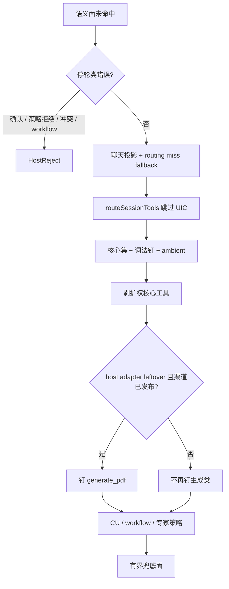

# 语义路由未命中：兜底工具决策

状态：现网契约（第一轮文档评审后修订）。挂在 [统一语义工具路由设计](semantic-tool-routing-design-zh.md) 与 [事实层、协议入口与回合收口](semantic-tool-routing-intake-improvement-zh.md) 之下，不另起规划器。

读者：共享 Agent 循环、遗留路由器、执行档案。实现以 `gui/semantic_routing_miss.go`、`gui/im_agent_loop_start.go`、`gui/semantic_tool_routing.go`、`gui/im_agent_loop_tools.go`、`gui/im_handler_wiring.go`、`corelib/tool/router.go` 为准。

---

## 0. 相对初稿的修订

初稿把「未命中 = 解锁整份遗留路由器」写成了决策。对照代码后，那条契约不成立，也会扩权。

| 严重度 | 初稿问题 | 修订后的契约 |
| --- | --- | --- |
| P0 | 写「full 档案就能看到 `generate_pdf`」 | 聊天投影会 `SkipUnifiedClassifier`。敏感条件工具默认 `condFilterOut`；`generate_pdf` 虽为 `scoreEligible` 可进遗留候选面，但未命中收口仍会剥掉（§1、§3.1），弱生成要**显式钉**已发布的宿主适配器 |
| P0 | 未命中倒出 `CoreToolNames`（含 `bash` / `write_file` / `call_mcp_tool`） | 违反父文档 §2.3.11。未命中必须剥掉扩权核心工具 |
| P0 | 一切 `unmet` 都当聊天兜底 | `policy_denied`（VE 禁 generate）和 grant 冲突仍 HostReject。只有「没提供者 / 弱分类 / 空面」才兜底 |
| P1 | 第 7 门已写成 `chat projection` 时不再打 fallback 标记 | 聊天投影也要标 `routing miss fallback`，否则不剥 `bash` |
| P1 | HostReject 只写确认 + `workflow_task` | 加上 `policy_denied` 与 `attachment_delivery`∧`document_generate` 冲突 |
| P1 | 复用 LoopContext 留下 HostAdapterLeftover | 回合入口清 leftover 标志；聊天投影 leftover 去掉 generate 钉（标志与 Reason 标记） |

---

## 1. 产品意图

语义工具路由的职责是**收窄工具上下文、选出必要工具**，不是让会话无法继续。未命中付的是**有界兜底面**，不是整份遗留汤。

| 结果 | 工具面 | 会话 |
| --- | --- | --- |
| 精确命中 | 封闭受管面 | 继续 |
| 弱分类 / 空面 / 无提供者 | 有界遗留面：读、取、记忆 + 词法钉；弱生成另钉已发布的 `generate_pdf` | 继续 |
| 渠道/策略拒绝（`policy_denied`） | 无 | HostReject |
| 等待用户确认 | 无 | HostReject |
| grant 冲突（投递∧生成） | 无 | HostReject |
| `workflow_task` | 无 | HostReject：必须从 `/workflow` 或工作流面板进入 |

规划器仍可报 `unmet`。循环入口只把**策略/确认/工作流**写成红字停轮。

父文档 §11.36 与收口文档 §5 第 1 / 8 / 10 门描述的是**规划器**出口。本文件描述循环入口在规划器未给出可用封闭面之后的行为。C-2 仍禁止「未映射族假装已封闭受管」；它不再要求「凡 unmet 就必须停轮」，但**禁止把策略拒绝翻译成扩权兜底**。

---

## 2. 何时进入兜底

`prepareAgentLoopStartState` 先求语义面。下列情况落到兜底，且不写 `HostReject`：

1. `handled=true`，但错误不是停轮类，或封闭定义空。
2. `handled=false`（弱可变、弱只读、generic、第 7 门聊天投影）。

`semanticPlanErrorBlocksSession` 为真当：

- 错误含 `awaiting confirmation`；
- 错误含 `conflicting attachment_delivery and document_generate`；
- `semanticUnmetNeedsError` 含 `ReasonCode=policy_denied`；
- `semanticUnmappedCapabilityError`（含撤回的家族与 `workflow_task`）。

其它 `unmet`（如 `no_provider`）继续聊。日志：`[semantic-routing] plan miss, falling back`。

未命中后必须先解锁遗留路由器。受管意图会让 `loopContextBlocksLegacyToolRouter` 跳过 `prepareAgentLoopTools`。因此：

1. `applySemanticChatProjection`：第 7 门等已有投影时只标 `chat projection`。
2. `applySemanticRoutingMissFallback`：受管意图改写为 `unknown` + `chat projection` + `routing miss fallback`。弱 `document_generate` 且渠道已发布 generate 时再标 `host adapter leftover`。已是聊天投影的回合也补打 fallback 标记，以便剥扩权工具；同时必须清掉 HostAdapterLeftover，并从 Reason 去掉 host adapter leftover。

leftover 标志只属于本轮。prepareIMLoopContext 在复用 Runtime（RequestID 已在）时清掉 RoutingMissFallback / HostAdapterLeftover，编码工作台跳过 UIC 时也必须清。bindLoopSemanticIntent 写入新分类时同样清标志。否则上一轮弱生成会把下一轮「北京天所」钉上 generate_pdf。

视觉 fallthrough 不走本路径。

---

## 3. 兜底工具怎么选

解锁之后走 `prepareAgentLoopTools`，最后用 `applyRoutingMissLeftoverTools` 收口。

### 3.1 会话路由：不再二次 UIC

`routeSessionTools(..., skipUnifiedClassifier=true)`。遗留路由器仍用 BM25 + 可选本地 embedding。禁止对原文再跑 `ClassifyEmbeddingOnly`，否则「北京天所」会在 0.50 钉上 `web_search`。

非跳过的普通回合也不新发起分类：路由经 `RouteOptions.PreResolved` 直接消费 `ctx.Runtime.SemanticIntent`（主循环已用完整上下文算好的全量分类），快通道（embedding-only）不可用时再退到 `ClassifyCached` 的纯缓存读。两条路径都绝不新触发 tree/LLM 调用，`SkipsTreeLLM` 契约不受影响；收益是具体语义结果（如 web_fetch 0.65）能激活其亲和条件工具，不再被快通道的不确定结果整体隐藏。

跳过 UIC 时，敏感条件工具默认滤掉（ssh、browser、screenshot、record_audio、craft_tool、mis_data、IM 投递族）。良性条件工具（`web_search`、`generate_pdf`、`office`）自 2026-08 起改为 `scoreEligible`：不被 `condFilterOut` 预剔除，凭检索分竞争预算槽——否则「北京天气，输出格式化pdf报告」这类任务在弱分类回合连一个能用的工具都拿不到。`generate_pdf` 在受管面未命中时仍受 §1 剥权表约束（`routingMissPrivilegeTools`），只能经已发布的宿主适配器钉入受管面；`scoreEligible` 只影响遗留路由器的候选资格，不绕过受管治理。

### 3.2 词法钉与 ambient

路由器后半段仍认显式话术：截图、录音、git、本地 Office 路径、显式 IM 管理。`mergeAmbientRetrievalTools` 只补 `knowledge_search` 与 `memory`。

`screenshot` 不是通用兜底候选。

### 3.3 失败不扩权

`CoreToolNames` 仍会先并入（遗留路由器的既有契约）。未命中之后必须删掉：

`bash`、`write_file`、`edit_file`、`edit_lines`、`download_file`、`call_mcp_tool`、`manage_skill`、`search_and_install_skill`、`craft_tool`、`task`、`goal`。

留下读/列目录/检索/取网页/记忆/发现。这是对父文档 §2.3.11 的循环入口落实：规划失败不得改走 shell 写文件。未命中的新一轮 Computer Use 也不注入。

### 3.4 弱生成：钉宿主适配器，不靠 full 档案

弱 `document_generate`（例如 0.73）规划器 `handled=false`。桌面 / TUI / 蓝信 / 微信等已发布 `document.generate.file` 的渠道：兜底面显式钉 `generate_pdf`。钉在执行档案裁剪**之后**，以免 light 合同把它们裁掉。注入、技能恢复与会话钉只在仍是 host-adapter leftover 时才拉全量目录找 generate_pdf。

`ve_group_executor` 未发布该能力：不钉；若规划器已 `policy_denied`，循环入口 HostReject，根本不进兜底。

### 3.5 执行档案仍裁查询宽度

light（弱 lookup 聊天）预算约 8，能力限于 `web` / `fetch` / `time` / `status` 等。弱 lookup 不得抬成 full。档案裁的是宽度；§3.3 / §3.4 裁的是扩权。两者都要。

### 3.6 路由之后仍生效的宿主闸门

Computer Use、workflow 过滤、专家 allow-list / 群权限仍在。未命中不是扩权通道。

---

## 4. 不变量

1. **精确命中优先。** 有非空封闭受管面时，跳过遗留路由器。
2. **未命中继续，但有界。** 空面、弱分类、无提供者继续聊；不倒出 bash/写文件/MCP 网关。
3. **HostReject 白名单。** 确认、策略拒绝、grant 冲突、未映射/撤回标签。
4. **聊天投影挡住二次 UIC。** 遗留面不得把弱 `live_data` 再钉成 `web_search`。
5. **生成靠钉，不靠猜测。** `generate_pdf` 只在 `host adapter leftover` 且渠道已发布时进入。
6. **截图不默认兜底。** 无显式采集话术不加 `screenshot`。
7. **light 不抬权。** 弱 lookup 保持 light。
8. **视觉 fallthrough 独立。** `.mp4` 不会因此变成可解码视频。
9. leftover 不跨轮。 复用 LoopContext 不得继承上一轮的 generate 钉或扩权剥离。

---

## 5. 对照例子

| 用户话 | 语义面 | 循环入口 |
| --- | --- | --- |
| 「北京天所」 | 第 7 门，聊天投影 | 读/取/记忆；无 `web_search`；无 bash |
| 「图上有什么？」+ `.mp4` | 弱 `document_read` | 可聊、可用 `read_file`；不解码视频 |
| 「改为豪华版 hello world」 | coding ≥ 0.50 走受管编码面 | 不进兜底 |
| 弱 `document_generate` 0.73（桌面） | `handled=false` | 有界兜底 + `generate_pdf` |
| VE 上自信「生成 PDF」 | 规划器 `policy_denied` | HostReject |
| 多阶段商业计划当普通聊天 | `workflow_task` | HostReject，提示走工作流入口 |
| 天气+PDF 已锚定 | 封闭 lookup + generate | 受管面，不进兜底 |

---

## 6. 测试锚点

- `TestSemanticRoutingMissFallbackUnlocksLeftoverTools`
- `TestSemanticPlanErrorBlocksSessionOnlyForConfirmAndWorkflow`
- `TestRoutingMissLeftoverDropsPrivilegeAndPinsPublishedGenerate`
- `TestRoutingMissLeftoverDoesNotPinGenerateOnVE`
- `TestRoutingMissChatProjectionAlsoStripsPrivilege`
- TestRoutingMissDoesNotPinGenerateFromSecondaryLabel
- TestRoutingMissClearsStaleHostAdapterOnChatProjection
- TestBindLoopSemanticIntentClearsLeftoverFlags
- TestPrepareIMLoopContextClearsStaleLeftoverFlags
- TestLoopContextLeftoverRequiresThisTurnFlags
- TestRoutingMissNilIntentStillBoundsLeftover
- TestRoutingMissWorkflowGenerateStillPinsPublishedAdapter
- TestSharedAgentLoopUpgradeLightPromptToFullKeepsLeftoverBound
- TestRoutingMissUnknownIntentStillBoundsLeftover
- 弱 lookup：`SemanticWeakLookupRewrites`，遗留面不钉 `web_search`

---

## 7. 一句话

没命中就继续聊：跳过二次 UIC，剥掉 bash/写文件，词法只钉说出来的条件能力；弱生成只在已发布渠道钉 `generate_pdf`。策略拒绝、确认和工作流入口仍然停轮。
