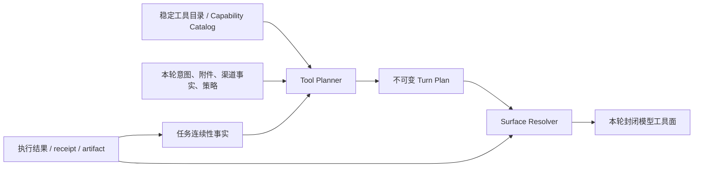

# 语义工具路由：连续性状态与封闭工具面改进方案

## 1. 决策摘要

当前问题不是单个分类误判，而是两套互相冲突的工具可见性模型同时生效：

1. 旧名称路由将成功使用过的条件工具写入会话 pin；这些名称随后持续作为 core 工具参与路由。
2. 语义路由将工具视为当前 `ToolPlan` 的受限执行闭包；一次性 grant 被消费后，只暴露依赖图中下一步可执行的工具。

前者把“过去曾使用的实现”误当成“未来仍被授权的能力”。在 `MaxToolBudget=28`、而 core 工具本身已接近预算上限的情况下，多个 pin 必然造成预算饥饿，并按优先级静默裁掉其它工具。用户看到的“对话几轮后工具不完整”由此产生。

本方案的根本修正是：

> 会话保存任务事实，不保存工具名；每一轮从当前任务计划完整重建工具面，不对旧工具面做 union 或 append。

目标架构：



`Surface Resolver` 是唯一生成模型可见工具定义的组件。任何旧式 Router、注入、发现、工作流或会话连续性模块均只能提供事实、能力需求或约束；不能直接添加、删除或保留工具名。

本方案不要求“每次工具面变化都重新理解用户文本”。正常执行后的变化只更新同一不可变计划的 `PlanState`；只有任务修订、有效事实变化、目录/策略快照失效或允许的 provider binding 重选，才创建新的 plan revision。这样既维持封闭面，也避免每一步重新分类造成抖动。

## 2. 问题与根因

### 2.1 现状

旧路由曾把 `CoreToolNames`、本轮条件命中以及 `sessionTools` 一并装入 `core`。`sessionTools` 不需要再次与本轮任务相关，也不受条件工具过滤影响。随后整体按固定数量裁剪。

```text
Previous successful tool
  → sessionPinned[owner][toolName]
  → RouteForSession temporarily restores it
  → core candidate
  → MaxToolBudget trimming
  → other tools disappear
```

相关实现位置：

| 位置 | 当前职责 | 结构性风险 |
| --- | --- | --- |
| `corelib/tool/router.go:CoreToolNames` | 永远进入候选 core 的工具 | 基础集合已接近 28 个预算。 |
| `corelib/tool/router.go:RouteWithOptions` | 历史上直接将 session pin 编入 core | 历史工具曾绕过本轮相关性筛选；pin 读取现已删除。 |
| `gui/tool_router.go:sessionPinned` | 历史上按 owner 保存工具名 | 状态会不断累积；该数据结构现已删除。 |
| `gui/im_agent_loop_tool_augment.go` | 注入/发现后的列表 append | 多处增量合并，无法保持单一闭包。 |
| `gui/semantic_tool_routing.go` | 根据 plan/grant 计算封闭面 | 正确模型，但只覆盖已迁移语义路径。 |

### 2.2 必须保持的正确行为

语义受管路径在执行完成后消费 grant、按 DAG 刷新下一阶段工具面是正确行为。某工具“消失”不一定是故障：它可能已被消费、未满足依赖，或不属于当前阶段。

因此改造不能恢复“所有用过的工具始终显示”；应将不可解释的预算丢失，改为可解释的计划阶段转换。

### 2.3 根因归纳

1. **授权与连续性混淆**：工具名 pin 同时表达“曾成功使用”和“下一轮仍可见”。
2. **增量集合操作**：`append`、`ensure`、`filter`、`restore` 分散在不同阶段，最终集合无单一来源。
3. **预算模型错误**：核心、连续性和可选召回共享一个硬上限，且核心数量已接近上限。
4. **失败回退会扩面**：受管计划 materialize 失败后回退旧路由，可能重新打开与当前能力无关的工具。
5. **兼容层权力过大**：BM25/UIC/router 既做候选召回，又直接决定模型可见工具。

## 3. 设计原则与不变量

以下规则应作为架构约束、单测和 code review 检查项：

1. **计划是唯一授权来源**：模型可见工具必须由 `TurnPlan + PlanState + Budget` 推导，不能从历史列表推导。
2. **连续性存事实，不存实现名**：不可持久化 `ssh`、`browser`、`web_search` 等“必须显示”的工具名。
3. **工具面只能替换**：工具集更新是完整 replacement；禁止 `previous ∪ routed ∪ pins ∪ injection`。
4. **候选不等于授权**：语义分类、BM25、经验、Skill 推荐只可输出候选能力和证据，不能输出 `must_include_tool`。
5. **预算先保证计划闭包**：已计划的必要能力、依赖和恢复通道不可被可选工具挤出。
6. **失败不扩权**：计划失败、provider 不可用、schema 漂移或执行失败只能在同一需求和约束内重规划；不得退回全量 legacy soup。
7. **任务作用域隔离**：连续性状态、grant、artifact、confirmation、provider binding 都须绑定 principal、conversation/task 和 turn/revision。
8. **所有移除可解释**：每个未出现的工具/能力必须有状态：未需要、依赖未满足、已消费、预算未 materialize、策略拒绝、provider 不可用或已过期。
9. **快照一致性**：一个 plan/revision 必须绑定 catalog、policy、principal、channel、事实和预算快照的 digest；渲染、grant 和执行不得在中途读取一个新目录后静默改变 binding。
10. **连续性不继承授权**：连续性只能复用经验证的事实、artifact 或资源句柄；确认、grant、模型可写参数和外部效果授权始终是 turn/revision 级，不得跨轮继承。
11. **状态写入线性化**：同一 `ContinuityScope + RootTaskID` 的任务修订和执行结果必须通过版本比较写入；过期 response、取消 turn 或并行旧 revision 不得覆盖较新的任务状态。计划 revision 必须复用现有 `RouteStateStore.PublishRevision` 的 expected-parent 与 fencing token，而不是另造一套并发协议。
12. **无状态时仍可恢复**：连续性存储不可用、缓存失效或命中冲突时，系统必须能以当前用户输入和当前快照创建新 plan；连续性是提升，不是任何能力的单点可用性依赖。
13. **发布即闭合**：一个 revision 只有在“计划已发布、该 phase 的 grant 已持久化、materialization 已登记”三者都完成后，才可把 definitions 交给模型；任一环节失败必须撤销/退休已发 grant，不能留下用户看不到却仍可执行的孤儿授权。
14. **执行前线性化**：`IsCurrent` 必须位于与 grant consume、host-call journal、execution admission 相同的事务中，或使用对 current lineage 的条件写；仅在事务外先检查一次会留下“检查后被 supersede、旧 grant 仍被消费”的 TOCTOU 窗口。
15. **响应必须绑定工具面 epoch**：工具调用不能只按 function name 解析。每个模型请求必须携带不可伪造的 `SurfaceEpoch`，响应/tool call 必须回带其 request/surface correlation；收到晚到、取消或 superseded epoch 的调用一律拒绝，绝不能把旧 surface 中的同名函数绑定到新 revision 的 grant。
16. **会话身份不得复用用户身份**：`SessionID` 表示一个可信会话实例，`PrincipalID` 表示主体；两者即使当前恰巧同值，也必须由不同来源独立传入并校验。不得为了兼容把 `userID` 同时塞进这两个字段，否则同一用户的并发设备/窗口会共享 route lineage、连续性和 fencing 域。

## 4. 目标领域模型

### 4.1 任务连续性状态

替代按工具名保存的 `sessionPinned`：

```go
type ContinuityState struct {
    Scope             ContinuityScope // tenant, principal, conversation, root task
    Goal              CapabilityGoal
    OpenNeeds         []tool.CapabilityNeed
    CompletedEvidence []CapabilityEvidence
    PendingEffects    []PendingEffect
    ActiveBindings    []ReusableBindingRef
    RouteRevision     tool.RouteRevisionRef
    FencingToken      uint64
    Version           uint64
    ExpiresAt         time.Time
}

type CapabilityEvidence struct {
    NeedID       string
    Capability   tool.CapabilityID
    ArtifactRefs []tool.ArtifactRef
    ReceiptRef   string
    Provenance   string
    ValidUntil   time.Time
}
```

`ContinuityScope` 是任务事实的命名空间，而不是另一套 invocation identity。为避免把同一任务拆成两条 lineage，第一版必须采用以下映射：

| 连续性字段 | 现有执行字段 | 约束 |
| --- | --- | --- |
| `TenantID` | 当前 `InvocationScope` 没有对应字段 | 仅用于连续性/策略存储分区；由可信宿主提供，不能来自模型。 |
| `PrincipalID` | `InvocationScope.PrincipalID` | 必须完全相等。 |
| `ConversationID` | `InvocationScope.SessionID` | 当前版本必须一一对应；`SessionID` 是可信会话实例，不能拿 `userID` 代填。若未来支持跨 session 对话，先引入可信 conversation anchor，不能靠字符串猜测合并。 |
| `RootTaskID` | `InvocationScope.RootTaskID` | 任务的唯一标识；文中泛称的 `TaskID` 均指它，不再另存一个可漂移的 `TaskID`。 |

`PlanID`、`TurnID` 只属于一次 invocation，不能进入连续性 key；它们应作为最近一次 `RouteRevisionRef` 的引用保存。`Version` 是 compare-and-swap 版本，不是展示字段；每次状态转换都须携带 `ExpectedVersion`，以防两个并发请求将不同任务方向写入同一连续性状态。计划发布不应重复实现该机制：当前 `RouteStateStore.PublishRevision` 已提供 immutable revision、expected parent 与 fencing token；`ContinuityStateStore` 只保存任务事实，发布时必须引用对应的 `RouteRevisionRef` 和 fencing token。

入口必须先生成 `TrustedInvocationIdentity{TenantID, PrincipalID, SessionID, RootTaskID, TurnID}`：`PrincipalID` 来自认证主体，`SessionID` 来自连接/会话管理器，`RootTaskID` 来自 task identity anchor，`TurnID` 为服务端请求 nonce。任何为空、复用上一请求 turn、或把 principal 当 session 的兼容调用都必须在进入 Planner 前失败；不能以用户文本 hash 或模型请求 ID 临时补造。这样 `RouteRevisionRef` 的 lineage key 才真正在“同一任务、同一会话、同一主体”范围内线性化，而不会把用户的平行任务串在一起。

规则：

- `ActiveBindings` 只能保存服务端签发的不可猜测引用，例如已建立的远程会话、可信文档输入或渠道目标；不得保存凭据、任意路径、provider 名或模型可写目标。它不是工具名，也不能独自生成可执行工具。
- 成功执行产生事实、receipt 或 artifact；不会把 adapter 名写入连续性状态。
- 新用户消息必须先判定其与 `RootTaskID/Goal` 的关系：`continue`、`refine`、`new_task`、`ambiguous`。该判定必须带可审计证据；仅“同一个 owner”或当前工具调用历史不能作为续接依据。
- `continue/refine` 仅可把尚未完成的 need 与仍有效事实交给 Planner，且 planner 必须用**当前** policy、渠道和权限重新校验；`new_task` 创建新任务并不带入旧 need；`ambiguous` 不继承任何副作用 need，只要求澄清或保留安全只读面。
- 状态应有显式过期、完成和 supersede 转移；TTL 是清理机制，不能承担授权控制职责。

推荐状态机：

```text
new → active → {waiting_confirmation | waiting_receipt | completed | failed | superseded | expired}
active --task amendment--> active(revision + 1)
任何旧 revision 的完成回调 --CAS conflict--> ignored/audited
```

`waiting_confirmation` 只能保存“需要确认的事实”，不能保存确认结果；确认 token 仍绑定发起该确认的 turn/revision。`waiting_receipt` 也不能自动重新执行外部效果。

任务关系不是可自由发挥的 LLM 决策。可信优先级依次为：显式 `RootTaskID`/UI 续接动作、同一可信会话中仍 active 的 route revision、用户明确的指代及其可验证目标/工件引用。文本分类或 embedding 只能提出候选和证据，不能单独把 `ambiguous` 升级为 `continue`。涉及外部副作用、目标/资源变化或存在两个可匹配任务时，保守结果必须是 `clarification_required`；仅在无副作用且已验证的证据闭包内，才允许把高置信候选作为只读续接。该决策、证据和置信等级都写入 trace，供审计与离线校准。

### 4.1.1 连续性合并与故障策略

连续性状态不是另一个可以直接修改 `Need` 的输入通道。Planner 必须按以下顺序合并：

1. 校验 state 的 scope、版本、签名、过期时间和 `TaskRelation` 证据。
2. 从当前用户消息产生新的 needs/facts/constraints；当前硬策略、权限、渠道和附件事实优先。
3. 仅将仍有效、可证明相关的未完成 need 和 evidence 作为候选补充；不能把旧目标、旧 provider 或旧 confirmation 重新带入。
4. 重新执行 capability coverage、provider fit、policy、budget 和 phase 规划。

若状态存储读取失败、CAS 冲突、解码失败或缺少可验证的 TaskRelation，默认进入 `new_task`/`clarification_required`，并写入 `continuity_unavailable` 或 `continuity_conflict` trace。不得因此回退到 session pin、上一轮工具列表或已过期的 grant。

### 4.1.2 双存储的线性化与投影

`RouteStateStore` 是计划、grant、completion、confirmation、artifact 与外部 effect fencing 的授权权威；`ContinuityStateStore` 只是可重建的任务事实投影。两者不能靠“分别成功写入”假定原子性，也不能由 `ContinuityStateStore` 反向修订已发布的 route。

对任务修订、执行完成和 receipt callback 统一采用以下顺序：

1. 读取当前 `RouteRevisionRef` 与连续性版本，基于可信输入计算 task relation 和候选事实；取消的 turn 立即停止。
2. 对需要新计划的请求，调用 `PublishRevision(ExpectedParent)`；发布成功的 revision/fencing token 是唯一的获胜顺序。随后在同一 coordinator DB transaction 中签发本 phase grant、写入 `RouteMaterialization` 与 `surface_published` outbox；提交前不返回 definitions。若任何一步失败，事务回滚；若签发存储暂不能加入该事务，必须同步 revoke 已发 grant 并退休 materialization 后失败退出。
3. 执行 admission 在同一 coordinator transaction 内用 route lineage 的 current revision/fencing token 做条件检查，再 consume grant、写 host-call journal 与 running execution；执行/receipt 的 terminal commit 同样先验证 current，才写 completion、artifact/confirmation 与 outbox。不得仅依赖事务外的 `IsCurrent`。
4. 在上述发布或执行事务中写入幂等 `ContinuityProjection` outbox 事件，键为 `RootTaskID + RouteRevisionRef + FencingToken + event kind`。事件只携带可投影的事实摘要，不能携带 grant、adapter、参数或未验证模型文本。
5. 投影消费者以 `ExpectedVersion` 写入连续性状态，并要求事件的 route ref 仍为该 task 的 current revision、fencing token 不低于已记录 token。CAS 冲突、重复投递或较旧 token 只审计/重读并重算，不回滚 route，也不覆盖新事实。

若当前部署无法让 route state、grant state、execution state 与 outbox 同事务，连续性必须退化为“可丢失、可从 `RouteStateStore` 和可信 artifact/receipt 重建”的缓存；不得在多个独立数据库间伪造两阶段提交。投影延迟只影响跨轮辅助事实，绝不能改变已发布 plan 的授权、执行结果或表面闭包。语义执行现有 coordinator 已将 grant、host-call、execution、route 和 artifact 放入一个 SQLite DB；本改造应扩展该 coordinator 的事务边界，而不是在 GUI 层串联多个 store 调用。

示例：

| 旧做法 | 新做法 |
| --- | --- |
| SSH 成功后 pin `ssh` | 记录远程会话 receipt、允许的主机范围与未完成远程目标。 |
| 搜索成功后 pin `web_search` | 保存查询证据、freshness 与可复用 artifact。 |
| PDF 流程中保留 `generate_pdf` | 保存未满足的 `document.generate.file` need 和已完成 lookup evidence。 |

### 4.2 本轮计划与工具面

```go
type TurnSurfaceInput struct {
    CatalogSnapshot tool.CatalogSnapshot
    Needs           []tool.CapabilityNeed
    Facts           []tool.RoutingFact
    Constraints     []tool.RoutingConstraint
    Continuity      *ContinuityState
    Budget          SurfaceBudget
}

type SurfaceBudget struct {
    BootstrapSlots     int
    RecoverySlots      int
    OptionalSlots      int
    SchemaTokenBudget  int
}

type TurnSurface struct {
    RootTaskID    string
    PlanID        string
    SessionID     string
    TurnID        string
    Revision      uint64
    FencingToken  uint64
    SurfaceEpoch  string
    SnapshotDigest string
    PolicyDigest  string
    PrincipalID   string
    ChannelScope  string
    PlanStateVersion uint64
    Definitions   []map[string]interface{}
    Grants        map[string]tool.InvocationGrant
    ExplainTrace  tool.ExplainTrace
}
```

`BootstrapSlots`、`RecoverySlots` 和 `OptionalSlots` 只是容量配额，**不能**成为三组隐式、按名称永久暴露的工具清单。Bootstrap/recovery 都应由能力 catalog 中的受限 selection 渲染；若某宿主协议确实需要固定 transport function，则该 function 只能执行取消、澄清或重新规划，不能代理任意业务操作。

`CatalogSnapshot` 及事实、约束和预算必须带 digest/version。`TurnSurface` 还应记录 `RootTaskID`、`SnapshotDigest`、`PolicyDigest`、`PrincipalID`、`ChannelScope` 和 `PlanStateVersion`。其中 `RootTaskID`、`PlanID`、`SessionID`、`TurnID`、`PrincipalID` 必须与对应 `InvocationScope` 精确一致；`ChannelScope` 是策略输入，不得替代 `SessionID` 或另起授权 key。这些字段与 grant 一起构成执行 admission 的输入，防止“规划时有权限、执行时目录已换代”或“新任务复用了旧 surface”。

`SurfaceEpoch` 是一次模型请求所见工具面的服务端生成 identity，可由 `RouteRevisionRef + FencingToken + PlanStateVersion + materialization digest + request nonce` 规范化签名得到；它不是模型参数，也不能由 function name、plan ID 或调用顺序推断。函数名可在不同 revision 重复（例如都叫 `web_search`），所以 provider response ID / host call connection 必须和 `SurfaceEpoch` 一起传到 tool dispatcher。dispatcher 先校验 epoch 与仍 exposed 的 materialization，再解析函数名和 grant；epoch 缺失、响应属于已取消 stream、或与当前 callback 不匹配时返回 `stale_surface`，不得尝试“按当前 surface 兜底”。不支持携带响应关联信息的 provider，必须在 replacement 后取消旧请求并拒绝其所有后续 tool call，而不是降级为名称匹配。

### 4.2.1 请求级 SurfaceEpoch 生命周期（评审补充）

`SurfaceEpoch` 的粒度必须是**一次实际发出的模型请求**，不是 agent loop iteration，也不是 plan revision。一次 iteration 可能先发 streaming 请求、随后因连接错误 fallback 为 non-stream 请求，或在传输层重试；这些都是不同的 provider response 域，必须各自签发新 epoch。反之，同一响应中的多条 tool call 共享一个 epoch，并用不同的 `ToolCallID` 区分重放/并发策略。

推荐时序：

```text
render immutable definitions
  -> mint epoch A immediately before HTTP request A
  -> response A tool calls carry A
  -> surface mutation / replan / request cancellation: invalidate A
  -> retry or stream fallback: mint epoch B immediately before request B
  -> dispatcher checks B before function-name/grant resolution
```

实现约束：

1. `BeginToolSurfaceEpoch` 必须位于每个 HTTP 请求边界；stream fallback 与 retry 不能复用先前 epoch。
2. `refresh`、grant retire、DAG completion、child revision publish 等任何 materialization 变更前，必须先使 active epoch 失效；新请求再生成 epoch。
3. `HostCallIdentity` 的持久化 key 必须扩展为 `{Protocol, ConnectionID, ToolCallID, SurfaceEpoch}`。这样同一 provider 连接中重传同一响应仍可 replay，而不同 surface 的同名/同 call-id 不会错误共享 journal 结果。
4. 兼容的 host-owned auto execution 可以使用空 epoch，但模型响应路径不得调用该兼容入口；缺 epoch 的模型调用一律 `stale_surface`。

验收补充：模拟请求 A 暴露 `web_search`，在响应到达前 replacement 后再次暴露同名 `web_search`；A 的调用不得消费 B 的 grant。并覆盖 streaming→non-stream fallback 与网络 retry：二次请求必须观察到不同 epoch，且只接受其自身响应的 tool call。

`SurfaceEpoch` 解决的是“哪个模型请求看到了哪个工具面”，而 host-call idempotency 还必须保持为独立层：同一模型 response 中的每个 tool call 需要有 provider 生成的稳定 `ToolCallID`，并以 `{Provider, Connection/ResponseID, ToolCallID, SurfaceEpoch}` 形成 `HostCallIdentity`；重传同一 response 必须返回同一 journal result，不得再消费 grant；同一 epoch 下两个不同 call ID 即使函数与参数相同，也按计划的 repeat/并发策略分别处理。`ToolCallID`、request nonce 和 `SurfaceEpoch` 都不可由模型 arguments 覆盖。

实现应直接把现有 `tool.RouteStateStore` 作为不可变 plan revision、materialization、completed selection、confirmation 和 artifact reference 的权威来源。新建的 `ContinuityStateStore` 不保存它们的副本：它只保存跨 turn 的任务关系与候选事实，并通过 `RouteRevisionRef + FencingToken` 关联当前计划。对外部效果的 dispatch/receipt 同样必须使用同一 fencing token；计划被 supersede 后，旧 revision 不得继续执行、settle 或写回连续性。

渲染必须满足确定性：对于相同的规范化 `TurnSurfaceInput`、`PlanState` 和 catalog snapshot，输出的 selection 顺序、function name、schema 和 explain trace 必须稳定。若 provider 排名存在并列，按稳定的 binding identity 排序；不得依赖 map 遍历或上次工具列表顺序。

唯一合法流程：

```text
TurnSurface = Render(Plan(CatalogSnapshot, Needs, Facts, Constraints, Continuity), PlanState, Budget)
```

任何调用后的刷新也必须重复此流程，只是使用更新后的 `PlanState`。不得从上一轮 `Definitions` 做增删补丁。

这里的 `Render` 是发布协议而不只是纯展示函数：先从 `RouteStateStore` 读取 revision 的完成/确认/artifact 事实，确定当前 ready closure；再为该闭包签发 one-shot grants，登记 `RouteMaterialization`，最后才渲染 definitions 并分配 `SurfaceEpoch`。函数名只是由稳定 selection identity 派生的显示别名；grant token、scope、selection、provider binding、parameter authorization 与 catalog generation 必须一起持久化。重渲染可以复用同一 revision 中仍为 exposed 的既有 materialization，却不得重新 mint 一个同名 grant；已消费、退休、过期或不再 ready 的 materialization 必须从 definitions 移除。即使函数名相同，不同 `SurfaceEpoch` 的调用也绝不互相可替代。

### 4.3 旧 Router 的新职责

旧 Router 迁移为 **Candidate Recommender**：

```go
type RoutingRecommendation struct {
    CandidateCapabilities []tool.CapabilityID
    SearchQuery           string
    Confidence            float64
    Evidence              []RoutingEvidence
}
```

它不得返回模型工具定义，也不得维护 `sessionTools`。在未迁移能力上，它可以帮助 Planner 提高候选排序；在迁移完成前的兼容入口，它只能进入受限的 `LegacySurfaceAdapter`，并且该 adapter 同样必须完整替换而不是 append 工具面。

`CandidateCapabilities` 不能由现有工具名直接伪造。过渡期应由 catalog owner 提供受审查的 `tool-name → capability provision` 投影；找不到可信 provision 的旧工具只能作为“目录不完整”诊断，不得因 BM25 命中而取得 capability 或执行资格。

## 5. 预算与恢复策略

### 5.1 预算分层

废弃“所有 CoreToolNames 永远可见”的模型，按角色分为四层：

| 层 | 内容 | 预算规则 |
| --- | --- | --- |
| Bootstrap | 最小的对话控制、取消/澄清能力 | 固定且很小；不得承载业务执行工具。 |
| Planned | 当前阶段必须执行的 selection 与已满足依赖所需的 reader | 保证 materialize；若放不下则 `plan_over_budget`。 |
| Recovery | 受控 replan/错误说明/能力缺口处理 | 固定预留；不可被 optional 占用。 |
| Optional | 推荐 Skill、MCP、相邻只读候选 | 仅用剩余 slots/token；可被完全舍弃。 |

schema token 才是实际主预算；工具数量只是次级护栏。每个 selection 要计算渲染后 schema 成本，计划在 materialize 前完成预算可行性校验。

Recovery 默认是宿主内部的状态机动作，而不是模型可调用的“再路由/工具发现”网关：它接收结构化失败码和当前 revision，按原 need、原约束、当前快照执行 binding-only replan 或生成用户可见说明。只有取消、澄清等确实需要模型发起的交互才可 materialize 为受限 selection；其 schema 不得接受 provider、任意工具名、命令、路径、目标或原始 payload。`discover_tool` 只能读 catalog 生成候选/缺口诊断，随后由宿主决定是否创建新 revision，绝不在同一 call 中注入任意业务 capability。

### 5.2 预算不足的行为

禁止静默截断。Planner 必须产出以下之一：

1. 移除 optional 后仍可满足所有 required need：渲染最小闭包，并记录 `optional_pruned`。
2. 可通过分阶段执行解决：仅渲染当前 DAG phase 与 recovery 工具，后续 phase 在前置完成后再渲染。
3. required need 无法放入：返回 `plan_over_budget`，附带所需 schema 成本和可选拆分方案；不把关键能力替换成 bash 或其它泛用工具。

`plan_over_budget` 是内部决策码，不应把 token 细节暴露给终端用户。用户侧只获得可操作的说明：系统能够分步骤完成、需要缩小目标，或当前安全边界不允许同时完成；完整成本、被裁候选和 digest 只写入审计与诊断。

## 6. 运行时流程

### 6.1 首轮

1. 入口构造一次权威语义事实、附件/渠道事实和策略快照。
2. 入口先构造 `TrustedInvocationIdentity`，拒绝 principal/session 混用或空/重复 identity；再判定是否续接已有任务，必要时加载 `ContinuityState`。
3. 语义层和旧 Router 仅产出能力候选/证据。
4. Planner 选择 provider binding、依赖与执行 phase，生成不可变 `ToolPlan`。
5. Surface Resolver 在预算内原子发布本 phase 的 grant/materialization/definition 闭包，生成 `SurfaceEpoch` 并把它绑定至模型 request；完整替换模型工具面。

若关系判定为 `refine`，可信 amendment command（含 amendment digest）必须进入与新 route revision 同一 coordinator 事务或同一可重放发布 outbox；`ContinuityState` 只在后续投影中反映该 task revision。不得先把它写成独立权威状态、再尝试发布 route，也不得在原 revision 上就地改写 goal/need。若判定为 `new_task`，宿主创建新的 `RootTaskID`，并从空连续性事实开始。`continue` 只可继续 current route 的未完成依赖或基于当前证据发布后继 revision；它不是复用上一轮 definitions/grants 的别名。

### 6.2 工具执行后

1. dispatcher 先验证 tool call 的 request/`SurfaceEpoch` 归属和 exposed materialization；执行 admission 与后续完成/receipt 分别在 coordinator 的 pre-I/O / post-I/O 事务中持久化；两处都以 current revision/fencing 条件写拒绝 superseded call。
2. 先在 `RouteStateStore` 持久化 execution、receipt、artifact 或 confirmation；同一 durable boundary 写入 `ContinuityProjection` outbox。消费者再以当前 revision/fencing token 更新 `ContinuityState` 中的事实；不保存工具名。
3. 由 Surface Resolver 完整重渲染下一可执行闭包。
4. 核心 agent loop 收到 replacement 工具集；已消费 grant 从模型面消失，依赖满足后才出现下一阶段 selection。

若本次执行未改变 `PlanState`（例如参数 intake 被拒绝、取消、重复 host call），resolver 必须返回相同 revision 的原闭包，而不是重新规划或恢复已消费名称。`RouteStateStore.IsCurrent`/等价 lineage 条件写必须包含在执行 admission 的事务中；仅在渲染时或事务外比较 revision 不足以阻止已 supersede 的并发 tool call。

### 6.3 注入、discover 和重试

| 触发器 | 合法动作 | 禁止动作 |
| --- | --- | --- |
| 用户补充/方向变化 | 生成 task amendment 或创建新任务，再 replan/re-render | `append(injectionRouted)`。 |
| `discover_tool` | 读取目录、返回候选能力说明；必要时请求 replan | 把发现的工具直接 pin/注入当前定义。 |
| provider 失败 | 对原 need/constraint 做 binding-only replan | 打开 bash、任意 MCP gateway 或无关工具。 |
| 模型请求不存在工具 | 返回结构化 denial/缺口；可建议 replan | 根据名称模糊匹配到旧工具。 |

### 6.4 计划失败与兼容路径

将 `handled=false` 细分：

| 结果 | 行为 |
| --- | --- |
| `planned` | 使用封闭 semantic surface。 |
| `unmanaged_legacy` | 使用受限 LegacySurfaceAdapter；不读取/写入历史工具 pin。 |
| `blocked` | 已识别能力但无 provider、无权限或超预算；明确报告原因。 |
| `clarification_required` | 任务归属、目标或副作用不明确；仅暴露澄清所需能力。 |

受管计划失败不能退化为“重新暴露所有 core/条件工具”。

`unmanaged_legacy` 不是逃生口：它也必须先生成一个带 selection、预算、policy digest 和可解释 trace 的受限 adapter plan，才可以渲染工具。它与 semantic plan 的区别仅是候选/实现覆盖范围，不是可以绕过 replacement、预算、权限或执行 admission。每个 adapter selection 必须声明受审查的 capability provision、固定 adapter contract、允许参数集合和 owning catalog team；不能把 legacy tool name、自由文本或通配 MCP 名称当作 capability。

对目前尚无可信 capability provision 的 legacy 工具，正确结果是 `catalog_incomplete`（或显式 feature-flag 下的 `unmanaged_legacy`），而不是把该工具伪装为一个已证明的 capability provider。`unmanaged_legacy` 必须有按 capability family 记录的 owner、覆盖率、流量占比和删除日期；新 legacy 名称不得进入 adapter，超出删除日期或无 owner 的流量一律返回 `catalog_incomplete`。发布门槛应逐步将 `catalog_incomplete` 和 adapter 流量归零，而不是无限维持 adapter。

## 7. 实施阶段

### Phase 0：建立约束与可观测性

- 在每轮工具面输出 `plan_id`、`revision`、工具数、schema tokens、每个工具的来源和排除原因。
- 新增“surface replacement”审计：检测任何路径把工具追加到现有 managed surface。
- 记录 pin 造成的预算裁剪与被裁工具，作为迁移前基线。
- 暂不改变运行行为。

验收：能够对一段会话回答“工具为何出现/消失、由哪个状态转移导致”。

### Phase 1：建立连续性事实与双写观察

- 引入 `ContinuityState` 存储与 `TaskRelation` 分类。
- 为 SSH、浏览器、搜索→文档生成三类高频连续任务写入任务事实。
- 对每次旧 pin 恢复并行计算“若按连续性事实 replan 会得到什么”，记录差异、预算和是否缺 provider；此阶段旧 pin 仍是兼容 fallback，避免未迁移能力突然断档。
- 复用 `RouteStateStore.PublishRevision` / `IsCurrent` 的 expected-parent 和 fencing token；实现 ContinuityState 的 CAS、取消保护、`RootTaskID/SessionID/PrincipalID` 映射校验，以及 route 事务内 `ContinuityProjection` outbox 与二者关联审计。
- 定义并演练“原子 surface publish”故障恢复：revision、grant、materialization 与 `surface_published` outbox 必须共用 coordinator transaction；尚未完成统一存储前，不允许该 capability family 切到 managed surface。
- 先清理入口 identity：把可信 `SessionID` 与认证 `PrincipalID` 分离传入语义路由；禁止兼容路径把 `userID` 同时作为二者，并对同一 principal 的两会话并发做 shadow 审计。

验收：连续性状态可正确区分续接、换题和并发旧回调；可量化旧 pin 与新计划输出的差异。

进入下一阶段门槛：高频三类链路的 shadow plan 与现网成功路径一致率、`catalog_incomplete` 占比、连续性读写失败率以及工具面预算溢出率必须由发布负责人设定并记录；不得以“测试已绿”替代真实流量指标。

### Phase 2：引入统一 Surface Resolver 和受限 legacy adapter

- 抽取当前 `semanticCallSurface` 的“完整闭包渲染”能力为通用 resolver。
- 将 `prepareAgentLoopStartState`、成功执行刷新、注入和发现路径都改为 replacement API。
- 禁止 `augmentToolsFromInjection`、`augmentToolsFromSessionPins` 对 managed surface 做 union；未迁移路径也改为创建新的 adapter surface。
- legacy adapter 也采用 selection、预算、trace 与 admission；不允许直接传递旧 `Route` 返回的 map 列表。
- 为每个 adapter family 登记 owner、provision contract、迁移 SLO 和删除日期；`catalog_incomplete` 只可观测和收敛，不能被自动提升为常驻 adapter。

验收：任一回合工具面只可由单个 resolver 输出；运行时断言不允许 append。

### Phase 3：按能力迁移后移除 pin 授权

- 对已迁移能力，`sessionPinned/sessionTools` 不再参与可见性；未迁移能力仅通过 Phase 2 的 legacy adapter 处理。
- 以 feature flag 按 task 固定分桶，不允许同一 task 在新旧连续性机制间跳转。
- 当高频链和回归覆盖率达到门槛后，删除 pin 写入和读取代码；保留一次发布周期的只读迁移诊断。

验收：同一 owner 连续使用多个条件工具后，后续无关消息不再因历史工具改变工具面，且未迁移入口无能力断档。

退出门槛：已迁移 capability 覆盖所有曾被 pin 的条件工具；任何剩余 pin 读取均会在测试和生产审计中触发失败告警。随后才可删除 pin 数据结构，而不是仅停止写入。

### Phase 4：预算重构

- 把 `CoreToolNames` 分拆为 bootstrap、recovery 和 catalog provider；业务工具全部计划化。
- 用 schema token budget 做预检；保留最少 recovery 容量。
- 删除按字典优先级静默截断 core 的逻辑，改为 `plan_over_budget` / phase split。

验收：任意目录规模下，required selection 和 recovery 不会被 optional 或历史状态挤掉。

### Phase 5：Router 降权与收敛

- 将 `Router.Route*` 的公共契约调整为 recommendation/candidate 输出。
- 逐步把遗留条件工具迁入 capability registry/ToolPlanner。
- 删除 `sessionTools`、`conditionalKeepRules` 对最终定义可见性的控制；保留短期兼容 adapter，并设置删除里程碑。

验收：没有路径能从文本、pin 或经验记录直接构造模型工具定义。

## 8. 代码改造清单

### 8.1 实施记录：原子 surface publish（2026-08）

已在 `SQLiteSemanticExecutionCoordinator` 增加两条受管发布路径：

1. `PublishSurface`：在一个 SQLite transaction 中完成 revision publish、父 revision exposed materialization retire、initial ready grant 签发、grant store 写入、`RouteMaterialization` 登记以及 `surface_published` outbox 事件。
2. `MaterializeReadySurface`：在同一个 transaction 中确认 current revision、签发下一 phase 的指定 ready closure grant 并登记 exposed materialization。

GUI semantic 路由与 Core Agent dynamic semantic 路径在 coordinator 存在时均使用这两条 API；内存/兼容路径保留旧的分步实现，仅限不具备 coordinator 的单进程测试宿主。`PublishSurface` 的失败回归覆盖：在 outbox 唯一键冲突时，route revision、materialization 和 grant 写入全部回滚。此实现满足“模型收到 definitions 前，revision、grant 和 materialization 已共同持久化”的发布闭合要求；`ContinuityProjection` outbox 也已纳入同一 transaction，后续重点是让所有入口使用可信任务关系，而不是复制一套投影状态。

原子 publish 的 parent-fact projection 必须与 `RouteStateStore.PublishRevision` 使用同一套兼容性规则，不能只搬运 completion。当前 coordinator 已在同一事务内投影：

- purpose digest 不变的 completed selection；
- 未过期且 requirement/purpose 仍匹配的受信 confirmation；
- producer purpose、已完成状态及当前 consumer artifact contract 都匹配的 artifact ref。

grant、materialization、adapter binding、host-call 与参数授权始终不继承。上述三类事实若解码损坏或不再兼容，发布失败或安全丢弃对应事实，绝不能以旧工具名补偿；回归测试覆盖 completion、confirmation 与 artifact 三种投影。

`MaterializeReadySurface` 还必须以 durable materialization 为幂等边界：只有 current revision 中尚未 materialize、且由该 revision 的已验证 completion 使其 ready 的 selection 才能签发 grant。进程内 `issued/materialized` map 只是渲染缓存，不能充当授权去重依据；重复 refresh/recovery 请求命中已有 selection 时必须拒绝而非重签，避免同一 selection 出现两个可执行的一次性 grant。

### 8.2 实施记录：ContinuityProjection outbox（2026-08）

`SQLiteSemanticExecutionCoordinator` 现持有两张连续性表：幂等的 `semantic_continuity_projection_outbox` 和仅保存重建性事实的 `semantic_continuity_states`。`PublishSurface` 与普通 execution completion、外部 effect receipt settlement 都在原有 route/execution transaction 中写入 projection event；payload 只包含 scope、route revision/fencing、planner need 事实和 completed selection，不包含 grant、adapter/binding、host call、模型参数或 artifact payload。

消费端使用 `ApplyContinuityProjection(sequence, expectedVersion, tenant)`：同事务验证 `PrincipalID`、`SessionID→ConversationID`、`RootTaskID` 与当前 route lineage/fencing；旧 revision event 标记为 `obsolete`，不能覆盖新任务；正常写入以 continuity `Version` CAS 线性化，重复 event 以 sequence 幂等。投影失败保留 pending outbox，不会回写/回滚 route 或改变已发布工具面。Core Agent 的 `SessionGovernedTaskStore` 在 coordinator 可用时转为该 projection 的只读兼容 facade；其旧 `sync.Map` 仅保留给不具备 durable coordinator 的测试/兼容宿主。

### 8.3 设计复审结论与 P0 修正（2026-08）

原子发布、fencing 和 projection outbox 已消除了“历史工具名回灌授权”的主因，但复审发现：若不先收紧 **租户归属** 与 **任务关系入口**，continuity projection 仍可能被错误地读作下一轮的任务事实。以下项是进入 GUI/Core 全量接入前的 P0 门槛；它们不是优化项。

| 风险 | 复审证据 | 必须修正 |
| --- | --- | --- |
| 租户由 projection consumer 的调用参数提供 | event payload/outbox row 不含不可变 `TenantID` 时，若 consumer 扫描全局 pending event 后按调用 tenant 投影，会把“谁在消费”误作“事件属于谁”，破坏 scope 的第一维隔离。 | `TenantID` 必须由发布 transaction 的可信 invocation/principal 写入 outbox row 与 payload，并进入 event key/索引；drain 只能 `WHERE tenant_id=?` 领取本租户事件。Apply 必须比对 event tenant、scope tenant 与可信 coordinator tenant，任一不等即拒绝并审计。禁止由普通 request 参数补填 tenant。 |
| 普通聊天的 session/root 常按 request 生成 | 这可避免不同 chat turn 误共享 route，却不提供可信跨请求 anchor；把它当“继续”依据会虚假续接，或根本找不到上轮投影。 | 宿主尚未提供 durable conversation/task anchor 前，跨请求只允许显式 UI `continue/refine` action 携带服务端签发 task handle；纯文本“继续”、同一 user、相似度或最近工具历史只能产生候选，不能续接副作用任务。没有 handle 时严格落到 `new_task` 或 `clarification_required`。 |
| GUI 仍有 `sessionGovernedTasks sync.Map` 的分类改写 | 路径按 user/channel/destination 找“上次 needs”，缺少 `SessionID + RootTaskID + revision + fencing`，并会把 generic continuation 直接改写成旧 needs。 | coordinator 可用的 App 模式下，禁止 map 的 persist/load/mark/replay；只能从 fenced `ContinuityState` 读取同一可信 root task 的事实。无 coordinator 的单进程测试兼容层必须显式 feature gate，且不得在生产入口启用。 |
| Core operation scope 与 logical root task 尚未完全分离 | 每次 operation/loop identity 若同时承担 root-task anchor，会让“继续”在新 loop 查不到事实，或诱导按 user 级合并。 | 为 `DynamicCapabilityNeedRequest` 增加 host-owned `TaskAnchor`/`ContinuationHandle`，与 operation/turn ID 分开传递。只有 relation resolver 判为 `continue/refine` 后才复用 root task；`new_task` 必须先分配新 root。 |

#### 8.3.1 最小任务关系协议

任务关系必须在 Planner 前由宿主处理，输出不可由模型伪造的结构化结果：

```go
type TaskRelationKind string

const (
    TaskRelationContinue TaskRelationKind = "continue"
    TaskRelationRefine   TaskRelationKind = "refine"
    TaskRelationNewTask  TaskRelationKind = "new_task"
    TaskRelationClarify  TaskRelationKind = "clarification_required"
)

type TaskRelationDecision struct {
    Kind               TaskRelationKind
    RootTaskID         string // only for continue/refine; host-owned
    ContinuationHandle string // opaque handle; never model/client-generated authority
    AmendmentDigest    string // required for refine
    EvidenceIDs        []string
    TenantID           string // copied from authenticated ingress after validation
    PrincipalID        string // copied from authenticated ingress after validation
    SessionID          string // copied from trusted session after validation
}
```

允许 decision 升级为 `continue/refine` 的证据只有：

1. 当前可信会话内由 UI 选择的 active-task handle，或服务端验证通过的 `RootTaskID` continuation handle；
2. 仍为 current 的 route revision，且 revision、session、principal、tenant 与 handle 完全一致；
3. 对 `refine`，还需经宿主校验的 amendment command/digest。

用户文本指代、embedding、同一 owner、相同 destination、模型历史及工具名只能作为 `Evidence`，不可单独授权 continue。候选超过一个、任务含未结算 external effect、目标/资源变化，或证据无法闭合时，结果必须为 `clarification_required`。只读任务可在明确 feature gate 下做“建议继续”，但仍要先由宿主将建议转换成可信 handle；建议本身不改变 root task。

#### 8.3.2 入口与事务顺序

```text
authenticated tenant/principal + trusted session + server turn nonce
  -> relation resolver (handle verification; no planner/model authority)
  -> new root allocation OR verified existing root
  -> load matching fenced ContinuityState as planner facts
  -> PublishSurface(ExpectedParent) + grant/materialization + tenant-bound projection outbox
  -> complete/receipt + same-tenant projection outbox
  -> async projection; facts only, never route authorization
```

`TaskRelationDecision` 不写入 `ContinuityState` 作为权威修改；对 `refine`，amendment digest 必须随 child `PublishRevision(ExpectedParent)` 原子持久化或写入同一可重放 outbox。projection consumer 只跟随已经胜出的 route revision。因此 consumer 延迟、重试或崩溃都不会让未发布 amendment 成为下一轮事实。

#### 8.3.3 已实施的安全收口与剩余入口工作

本轮复审确认了一个容易被忽略、但会使协议失效的实现陷阱：如果 executor 收到一个普通结构体后，再以当前认证的 tenant/principal/session **补写**其 scope 字段，那么调用方只要提供任意 `RootTaskID + handle`，就会被错误“洗白”为已验证 relation。scope 对齐不是 handle verification，二者不能互相替代。

当前代码已完成以下最小收口：

1. `ExecuteRequest.TaskRelation` 为 `json:"-"` 的 host-only 字段；传输 JSON、模型输出和 tool 参数不能直接写入它。
2. `TaskRelationDecision` 使用包内的 `verifiedByTrustedIngress` 标记。`continue/refine` 除 root、tenant、principal、session、非空 opaque handle 全部一致外，还必须携带该标记；仅伪造字符串或补齐 scope 都不能 replay mutation need。
3. Core 的 operation/loop ID 只作为新任务的一次性 root 候选；只有通过 relation 验证的 root 才能跨 turn 复用。无验证 relation 时，durable `SessionGovernedTaskStore` 对 generic “继续”返回未受管，而不是按最近任务查找/重放。
4. GUI App host 已禁用旧 `sessionGovernedTasks sync.Map` 的 read/write/replay；它不能再以 `user/channel/destination` 查找“上次工具需求”。无 App 的孤立测试 facade 保留，但不属于生产入口。

服务层现已落地 server-owned handle resolver：`SQLiteSemanticExecutionCoordinator` 的
`semantic_task_continuation_handles` 持久化 opaque `tch_…` 记录，仅保存
`handle_id + tenant + principal + trusted session + root task + revision + fencing + plan + state + expiry`。
它不保存 grant、adapter/provider、工具名或模型参数。handle 由已发布且 current 的 route 签发，消费时在同一 coordinator 事务内比对 tenant/principal/session、检查 current revision/fencing/plan，随后一次性从 `active` 转为 `consumed`；过期转为 `expired`，路由已推进则转为 `revoked` 并返回 superseded。签名有效或知道 root ID 都不是续接授权。

`PostMessageInput` 与 `SendMessageInput` 现在都可携带 `continuation_handle`。`Service.PostMessage` 在写入 user message/run 之前，以认证 principal 和可信 `srv:<session-id>:<user-id>` session 调用该 resolver；成功后才经 package-private `verifiedTaskRelationDecision` 将 relation 放进 `ExecuteRequest`。该 handoff 的不可导出 verification marker 防止 executor 对外部 `RootTaskID + handle` 补 scope 后“洗白”。同 session 成功消费后，Core 的下一次受管响应会重新签发一个新的 one-time handle；失败、跨 tenant/principal/session、过期、重放或 superseded 均不会写入消息/run，更不会恢复历史 definitions/grants。

`SendMessage`/`PostMessage` 的 HTTP DTO 已传递 `continuation_handle`；用户 Web 对带 `task_continuation_handle` 的 assistant message 只渲染显式“续接此任务”动作，并在点击后将该 opaque handle 原样提交。自由文本“继续”、相似度、session metadata 或工具历史绝不自动补入 handle。

`refine` 已按同一边界实现，但外部接口只接收 `refine_task=true + continuation_handle + 本轮 amendment 文本`；它**不**接收 command ID、digest、root、revision 或 fencing。Service 以认证 scope 对 amendment 文本计算 digest，并调用 coordinator 的 `PrepareTaskRefinement`：该 transaction 同时核验 current route、把 fresh continuation handle 转为 consumed、创建短时 `TaskAmendmentCommand`。若后续 planner/CAS 失败，同一 opaque handle 配合相同 digest 只能恢复这一个仍 active 的 command，不能选择其他任务或改写文本；其它重放仍拒绝。只有包内 `verifiedTaskRelationDecision` 能把 command 转成 `TaskRelationRefine`。Core 以新的 refine turn 构造 child plan，并将 `RouteAmendmentRef(CommandID, Digest, ParentRevision, ParentFencingToken)` 传给 `PublishSurface(ExpectedParent)`；该 SQLite transaction 同时校验 parent fencing、写 child amendment 记录、消费 command、写 grants/materialization 与 route/continuity outbox。CAS 失败、取消或发布失败会整体回滚，command 保持 active 至安全重试或 expiry；过期/route supersede 会标记 `expired`/`revoked`。连续性投影不携带可执行 command，仍只跟随已胜出的 child route 事实。

#### 8.3.4 复审结论与下一阶段改进方案（2026-08）

本轮复审的结论是：造成“多轮后工具不完整”的主路径已经被收口——受管工具面由当前 revision 的 `ToolPlan + PlanState` 重建，历史 pin、grant 和 provider binding 不再是下一轮的输入；同时，replan 改为带 `ExpectedParent` 的单发布者 CAS，避免在目录刷新期间把旧计划静默挂到竞争请求已推进的 revision 上。显式 continuation handle 也已将跨请求复用从“同用户/同文本猜测”改为一次性、scope-bound 的服务器验证。

此前识别的 P0 amendment 边界现已完成；下表保留为复审记录，并明确剩余的迁移与生产验收项：

| 优先级 | 缺口 | 根因 | 修正方案 | 可验收结果 |
| --- | --- | --- | --- | --- |
| P0（已完成） | `refine` 只有领域枚举，没有可信发布入口 | 任意客户端 digest 若可直接进入 planner，会把“描述任务变化”误当成“修改既有任务的授权” | `TaskAmendmentCommand` 已由服务端在显式 `refine_task + continuation_handle` 后创建，绑定 `Digest + RootTaskID + tenant/principal/session + parent revision/fencing + expiry`；客户端不能提交 command ID、digest、root 或 revision。 | 无 handle 的 refine 在写 message/run 前拒绝；跨 scope、过期、重放、已 supersede 的 command 不能产生 child route。 |
| P0（已完成） | amendment 与 child route 尚无同事务边界 | 即使 planner 已得到新 plan，取消、CAS 冲突或崩溃仍可能留下可被误读的 amendment 事实 | `RouteRevisionPublishRequest.Amendment` 与 `PublishSurface(ExpectedParent)` 已同事务写 child amendment 记录、route/continuity outbox、grant/materialization，并消费 command。 | CAS 冲突/发布失败不写 amendment、command 保持 active；成功后 command consumed，重复同一 child publish 幂等且 amendment 匹配。 |
| P1（已收紧） | 连续性读取目前只适用于已迁移的 coordinator 路径 | 兼容 facade 若被生产入口误启用会重新产生双事实源 | GUI App 与 standalone/TUI 构造器均已 fail-closed 禁用 `sessionGovernedTasks` 的 persist/load/mark/replay；仅直接构造的单元测试 host 保留该内存 facade，直到删除。Core coordinator 模式仍只读 `ContinuityState`。 | App、standalone/TUI 与 coordinator 路径均有负向断言：一个 turn 无法合并 map 与 `ContinuityState` needs；任何生产构造器不会把 user/channel/destination 当作任务授权。 |
| P1 | 验收主要是定向单元/包测试 | 历史回归覆盖多，但尚未取得本轮所有 package 的完整 green 证据 | 补 property/concurrency suites：10 轮无关任务、双 session/双 tenant、replan CAS 竞争、handle 过期/重放、outbox 双 consumer、stale surface call；CI 将 `go test ./corelib/tool ./corelib/agentservice ./gui ./MaClawSrv` 作为迁移门禁。 | 每次 publish 的 trace 都能关联 `tenant/principal/session/root/revision/fencing/surface_epoch`；失败仅降级新任务/澄清，绝不恢复旧 pin。 |
| P2 | 缺少上线可观测性与固定分桶 | fail-closed 会增加澄清/新任务比例，若无指标容易被错误地以旧 sticky 工具“修复” | 以 `tenant + verified-handle capability` 固定灰度桶；记录 `surface_replaced`、`stale_surface`、`route_revision_conflict`、handle 拒绝原因、projection lag、`catalog_incomplete`。告警只触发排障/降级，不触发 legacy surface fallback。 | 可按 tenant/root/revision 还原一次工具面决策；任何异常路径的工具定义仍可证明来自 current plan。 |

`refine` 的建议事务顺序如下。这里的 `amendment` 是任务事实/目标变化的审计锚点，不是 provider、grant、工具名或模型参数的载体：

```text
authenticated principal + trusted session + active task UI selection
  -> issue/verify TaskAmendmentCommand (bind current root + revision + fencing)
  -> planner receives verified TaskRelationRefine + immutable amendment digest
  -> build child ToolPlan from current route facts and current catalog snapshot
  -> PublishSurface(ExpectedParent, RouteAmendmentRef) in one transaction
       -> retire parent materialization
       -> persist child revision + amendment ref + grants/materialization
       -> consume amendment command + write route/continuity outbox
  -> model receives only child replacement surface
```

特别注意：`ContinuityState` 只能在 child revision 已胜出后投影开放 need/完成事实；它不能保存 amendment 的可执行命令、不能消费 command、更不能反向发布 route。这样可保证 outbox 延迟和投影重放只影响“何时看见事实”，不会影响“谁有权更改任务”。

#### 8.3.5 分阶段迁移与验收补充

#### 8.3.6 Router 历史 pin 状态清理（2026-08）

`corelib/tool.Router` 与 GUI `ToolRouter` 的 `sessionTools/sessionPinned` 数据结构已删除；`ActivateSessionTool*`、`IsSessionPinned*`、`SessionPinnedToolsMissing*`、`ResetSession*` 仅保留 source-compatible 的无状态 no-op，不能读写任务事实、影响候选排序或改变最终模型工具定义。`agentLoopToolSet` 也不再携带 browser pin 诊断字段。

因此，旧 Router 现在只能基于**当前**消息和当前目录产生 legacy 候选列表；它不再有会话级“曾使用工具”的隐式输入。已受管 turn 继续跳过该 Router，由已验证的 route revision/continuity facts 通过完整 surface replacement 生成工具面。未迁移的 legacy turn 仍是本设计的剩余缺口：它尚未完全经过 `LegacySurfaceAdapter` 的 selection、schema-token budget、trace 和 admission 契约，不能被误认为已达到 Phase 2/4/5 的完成定义。

新增回归要求：任意调用所有上述兼容 API 后，后续 `Route`/`RouteForSession` 的输出必须与未调用时一致；不同 owner/session 的重复调用不得产生可观察状态，更不得让历史工具进入模型面。

#### 8.3.7 LegacySurfaceAdapter 最小执行闭合（2026-08）

未迁移的 name-router 路径现已在 agent loop 中建立一次性 `legacyToolSurface`：每次模型请求把**该请求实际发送的完整 definitions**传入执行分发，dispatcher 仅允许执行该快照中的函数名；不在 surface 的迟到、幻觉或前一轮残留调用会在任何进度、审批或 handler 副作用前以 `tool_surface_denied` 语义拒绝。该闭合已同时接入原 IM loop 和 `corelib/agent.RunLoop` 驱动的 shared loop；shared loop 还为每一个模型请求生成宿主私有 epoch，若 response 在下一次请求或 replacement 后才到达，必须以 `stale_surface` 拒绝。它在 light→full 升级及每次 legacy surface refresh 后，以完整 replacement list 刷新快照。重路由、injection 与恢复仍必须以替换后的 definitions 重新建立快照，不能从 registry、历史 conversation、pin 或 `BaseTools` 补回名称。

此 adapter 是 migration guard，不是 durable authorization：受管 semantic turn 仍只使用 `SurfaceEpoch + materialization + grant + current fencing` 的完整 admission，不能把 opaque semantic function alias 当成 legacy registered tool；直接测试/宿主调用若未发出模型工具面则不适用该 adapter。它解决了 legacy path “模型看到的 surface 与实际可执行集合不同”的最小安全缺口，但尚未完成 capability provision、schema-token 预算、selection trace 和 provider binding 的全量迁移；因此本项只能算作 Phase 2 的 admission 子项完成，不能据此宣布 Phase 2/4/5 完成。

#### 8.3.8 Legacy adapter 剩余收敛顺序（review 修订，2026-08）

本次 review 后，将剩余工作拆成不可互相替代的门槛，防止“有了 name snapshot”被误当成 legacy 路径已经授权闭合：

| 优先级 | 必须交付 | 失败时的唯一行为 | 完成证据 |
| --- | --- | --- | --- |
| P0 | `tool-name → capability provision` 审查映射、family owner、固定参数 contract 与删除日期 | `catalog_incomplete`；不得由 Router/BM25 直接放行 | 未映射名称、无 owner、过期 adapter、超 contract 参数的负向测试及流量指标。 |
| P1 | `LegacyAdapterPlan`（selection、policy digest、provider binding、explain trace）及其 replacement renderer | `plan_over_budget` / `blocked`；不得返回 Router 直接拼出的 definitions | 每个 legacy definition 可反查 adapter selection；刷新只产生新的 renderer 输出。 |
| P2 | schema-token 分层预算：bootstrap/recovery 预留、required 保证、optional 可舍弃 | required 放不下即 `plan_over_budget` 或 phase split；禁止按工具名字典序截断 | 100+ optional provider 下 required/recovery 不丢失的属性与集成测试。 |
| P3 | `Router.Route*` 改为 candidate recommendation；逐 family 将 adapter 流量归零 | 无可信 provision 时保持 `catalog_incomplete`，不得回退 core soup | adapter family 流量、覆盖率、owner 和删除日期审计；`CoreToolNames` 不再承载业务执行工具。 |

在 P0 前，现有 snapshot/epoch 只可降低“旧响应误执行”的风险，不能证明能力授权正确；在 P1/P2 前，`CoreToolNames` 的静默截断仍是可用性缺陷；在 P3 完成前，旧 Router 仍是候选质量组件，而不是最终模型工具面的权威。

#### 8.3.9 Legacy router bootstrap/candidate 初步拆分（2026-08）

旧 `CoreToolNames` 保留为**兼容目录**，不再代表 `RouteWithOptions` 的“永远可见”集合。legacy name-router 已新增最小 `LegacyBootstrapToolNames`（当前仅 `task`、`async_wait`、`compress_context`）；其余原 core 名称按当前消息检索、当前条件门或显式 required reason 进入 legacy candidate surface。由此消除了“每轮都装入业务读写、网络、音频、目录/发现工具，再按固定优先级裁掉”的第一层常驻污染。

为避免过渡期功能断档，`read_file`/`ripgrep`/`edit_file`、受限发现入口和 `record_audio` 仍处于明确列出的 compatibility fallback；它们不是 session pin、也不能由历史重建。`office`、`manage_skill` 等具有当前任务证据的工具被标记为 required，预算满时不能被 optional candidate 静默替换；推荐 hint 则在预算满时只能替换 optional candidate，绝不追加超过 `MaxToolBudget` 的模型 definitions。

这不是 Phase 4 的最终 schema-token budget：legacy fallback 仍由工具名列举，`LegacyCandidateToolNames` 也尚未变成经过 provision 审核的 `LegacyAdapterPlan`。后续必须将这些 compatibility fallback 逐 family 纳入 §8.3.8 的 P0/P1，再删除 `CoreToolNames` 兼容目录和固定 count budget。

#### 8.3.10 Legacy provision 目录（2026-08）

为落实 §8.3.8 P0，`corelib/tool/legacy_adapter_catalog.go` 建立了唯一的受审查 legacy provision 目录。每个可由 legacy Router 推荐的名称必须同时声明：`CapabilityID`、owner、固定 adapter contract、最大 effect 和 `DeleteAfter`；启动时双向校验 provision 与 `LegacyCandidateToolNames`，因此不能通过向旧 core/name map 增加字符串取得候选资格。未知、缺 provision 或过期的 legacy 名称统一归类为 `catalog_incomplete`，Router 不会让其进入候选，执行 admission 也会在副作用前拒绝。

该目录只为迁移期建立“名称不能伪造 capability”的下限：它还没有取代 semantic `CapabilityRegistry` 的 provider binding、参数授权和 materialization。每个 family 在迁入完整 planner 后，必须从此目录删除，并以 owner、删除日期和 `catalog_incomplete` 流量证明收敛。

同次变更新增 `RoutingRecommendation`/`RoutingEvidence`：旧 Router 在保留兼容 `Route*` 返回值的同时，输出仅包含**已审查 provision 对应 capability**的 host-only recommendation、当前检索 query、score/required/fallback 原因与 adapter contract。该 trace 不能直接渲染 definitions，更不是 grant；它为后续 `LegacyAdapterPlan` 替换 `Route*` 的最终 definitions 职责提供了可验证的迁移接口。

#### 8.3.11 LegacyAdapterPlan 的 P1 落地边界（2026-08）

已在 `corelib/tool/legacy_adapter_plan.go` 建立 `LegacyAdapterPlan` 和唯一的 `RenderLegacyAdapterPlan`：plan 保存稳定 ID、policy digest、catalog digest、selection ID、capability、owner、adapter contract、host-owned provider binding、effect、definition digest、reason/score 和 recommendation evidence；collections 均通过 defensive copy 暴露。构建时只接受 Router 的 reviewed evidence 与**本请求的可信 definitions snapshot**，逐项回查 live provision，名称、capability、contract 或 snapshot 任一不一致均 `catalog_incomplete`/`invalid_legacy_adapter_plan` fail closed。renderer 从空列表出发，只输出 plan selection 中 digest 仍匹配、provision 仍有效的 definitions；它不接受 previous surface、session history、registry 全量枚举或 injection append。

`Router.RecommendWithOptions` 同时返回 legacy compatibility selection 和 recommendation，二者在同一 Router mutex 内生成，消除 `Route()` 后再读取 `LastRoutingRecommendation()` 时可能被并发下一轮覆盖的竞态。`Route*` 仍保留给未迁移宿主，但新 adapter 入口必须使用这一原子对并调用 `BuildLegacyAdapterPlan → RenderLegacyAdapterPlan`；禁止以 Router 返回的 `[]map` 直接作为最终模型面。

此项仅完成 P1 的 core boundary，**尚未**把 GUI/TUI 所有 legacy family 切换到 renderer：当前 GUI 管线在 router 后仍有 IM/workflow/client/hardware 等多类 host policy replacement，且其中一部分没有 provision。直接替换会把这些未迁移 family 错误降级为 bootstrap，属于可用性回退而非安全收敛。下一步须先把这些后置 host selections 纳入显式 provision/selection 目录，并在每个 entrypoint 将“Router selection + host policy selection”合成为一个 plan input 后再启用 renderer；在此之前，legacy snapshot admission 继续作为最小执行闭合，且不得宣称 P1/P2 完成。

#### 8.3.12 Legacy 参数合同与 schema-token 预算下限（2026-08）

为避免“函数名在本轮可见，但模型仍可偷偷提交本轮 schema 未展示的 provider/target/command 等顶层参数”，`legacyToolSurface` 现从**实际发送的 definitions snapshot**提取每个函数的顶层 property allow-list。原 IM dispatcher 和 shared loop 均在任何进度、审批、handler 副作用之前执行该 request-local check；未知字段返回 `parameter_contract_denied`。该 contract 随 legacy surface replacement 一起淘汰，不能从 registry、历史 surface 或随后刷新后的 schema 补齐。它只封住 legacy adapter 的顶层字段穿透；嵌套 schema、资源范围、confirmation、provider binding 与 effect authorization 仍由具体 handler/semantic planner 负责，不能误称为完整 `ParameterAuthorization`。

`LegacyAdapterPlan` 同时增加迁移期 schema-token 账本：每个 selection 记录 definition 的稳定 digest 与保守 token 估算，plan 保留总量以及被裁的 optional evidence。设置 `SchemaTokenBudget` 后只允许按最低 score 剔除 `retrieval_candidate`；bootstrap、`current_turn_required`、host-policy/recovery selection 绝不可静默裁掉。required closure 仍放不下返回 `plan_over_budget`，而不是按名称顺序截断或改走泛用 bash/MCP。该估算目前是 legacy 过渡护栏（JSON byte/4），最终仍须在每个 provider adapter 使用真实 tokenizer 和 Bootstrap/Recovery/Planned/Optional 分层配额，因此 P2 的全量预算重构仍未完成。

评审还修正了 admission 迁移顺序：只有从 `LegacyAdapterPlan` renderer 产生的 surface 才强制“每个名称都必须有 live provision”；普通 legacy snapshot 暂时仍按完整 request definitions + 参数合同闭合，并对已知但过期的 legacy candidate 返回 `catalog_incomplete`。否则直接把这一条件施加到尚未 provision 的 GUI host-policy 工具会造成运行时全量功能回退，掩盖迁移工作而非完成迁移。plan-backed surface 已有负向测试，任何无 provision 的名称即使出现在 definitions 中也不能执行；待 post-router host policy selection 全部登记 provision 并进入 plan input 后，才可把旧 snapshot 路径提升为同一 fail-closed 规则。

#### 8.3.13 GUI 静态 legacy surface 接入 replacement renderer（2026-08）

本轮将 `gui/im_agent_loop_tools.go` 的**最终静态 definitions**（已经过 IM、workflow、expert、hardware、local-file 等当前回合 policy filter）接入 `renderReviewedLegacySurface`。该函数只在每个 definition 均能回查 live `LegacyAdapterProvision` 时构造 `LegacyAdapterPlan`，并以 `BuildLegacyAdapterPlan → RenderLegacyAdapterPlan` 的新列表替换 model tools；因此 plan-backed GUI 请求既具有 immutable selection/definition digest，又在 dispatcher 中强制 live provision。所有 GUI hardcoded builtin 后置选择已登记 owner、capability、contract、effect 与删除日期，不再因“Router 后才加入”绕过 provision 审查。

动态 client tool、动态 MCP/skill/provider definition 仍明确不走 name provision。GUI 已先对静态 host definitions 完成 `LegacyAdapterPlan` replacement，再附加当前 `LoopContext` 的 client definitions；因此动态 client 的存在**不会**把同一请求中已审查的静态 host surface 降级回 compatibility snapshot。`legacyToolSurface` 对每个已由 provision 支持的 host name 仍逐项执行 live-provision admission；client definition 则只能凭“本请求 append 后留下的显式 client binding”分派到同一 `ClientID + ConversationID`，并继续受本次实际 schema 的顶层参数合同约束。它不能因恰好与 host 同名而覆盖 host dispatch，也不能从 `LoopContext.ClientTools` 的全量声明反推为可执行 binding。该拆分消除了“动态工具污染整面静态计划”的回退，同时保持 client 工具的 request scope。

动态 MCP/skill/provider definition 尚未获得等价的 provider binding；不得为了让它进入 plan renderer 把动态 provider/tool 名伪装成静态 capability，也不得把 `call_mcp_tool` 当作可携带任意 `server_id/tool_name` 的永久泛用网关。后续应按 provider binding 迁入 semantic planner，或将 host policy selection 拆分为“reviewed static plan surface + 独立受管动态 surface”，而不是扩大 legacy provision 表。上述 client 隔离只是受限迁移步骤，不能作为 P1/P3 完成依据。

#### 8.3.14 Legacy MCP 泛用网关下线（2026-08）

复审确认，`call_mcp_tool(server_id, tool_name, arguments)` 即使函数名本身存在于一轮 legacy definitions 中，也不是一个可审查的 capability：模型参数同时选择 provider identity、远程实现和参数 schema，因而绕过了 selection、observed schema digest、provider contract、grant 与 stale-binding replan。把该函数继续登记为 static `LegacyAdapterProvision` 只会把“任意网关”伪装成一个 capability，不能建立模型面与执行面的闭合。

因此 GUI legacy model surface 现执行以下边界：

- `ToolDefinitionGenerator` 只渲染静态 host definitions，不再把 remote/local MCP inventory 直接转成 legacy function definitions；
- legacy 回合在 surface composition 时移除 `call_mcp_tool`，并且 IM loop 与 shared loop 都在 handler/进度/副作用之前对残留或旧响应 fail closed，返回 `dynamic_mcp_requires_managed_surface`；
- `discover_tool` 可以报告 MCP capability 命中，但只提示请求受管 semantic replan，绝不输出可执行的 `server_id/tool_name` 调用指令；
- 旧的 generic gateway provision、core fallback 与 bootstrap 候选均已移除。显式 AgentView 提交和 CodingSubAgent 的 matched-set transport 仍是 host-controlled entrypoint，不能被普通 legacy 模型调用；它们的 provider-binding 迁移另列为剩余工作。

受管 MCP 仍沿用动态 semantic catalog：模型仅看到 opaque invocation alias，执行端从 lifecycle-owned inventory 重读固定 `ServerID + ToolName + SchemaDigest + ContractDigest`。provider/schema/contract 漂移返回 `mcp_binding_stale` 并只允许同 need 的 binding replan。这个变更关闭了 legacy 泛用网关，不代表 AgentView、skill 或 CodingSubAgent 的所有动态 provider 路径已经完成同一迁移。

#### 8.3.15 Legacy `manage_skill` 混合网关收口（2026-08）

`manage_skill(action, name, skill_id, hub_url, run_id, args, ...)` 也不能整体登记为一个静态 `skill.manage` capability。除 `list` 外，模型参数会选择可变资源或外部来源：`run`/`info`/`uninstall`/`validate`/`patch`/`history` 选择本地 Skill，`install`/`search`/`upload` 选择 Hub 或外部包，`status` 选择一次运行记录，maintenance/evolution 动作还可修改 Skill 状态或内容。顶层 schema 的字段 allow-list 无法固定这些 identity、内容 digest、contract 或 effect scope；继续把它们放进 legacy model surface 会重现 MCP 泛用网关的问题。

本阶段从 legacy model surface composition 移除了 `manage_skill`，并在普通 IM loop 与 shared loop 的**模型响应执行边界**采用 fail-closed admission：旧响应或幻觉响应中的 legacy `manage_skill` 仅允许无目标的 `action=list`；其余 action（包括缺失、未知或格式非法 action）都在 handler、进度、审批与副作用之前返回 `dynamic_skill_requires_managed_surface`。这不是对显式 AgentView、受信任 maintenance workflow 或 CodingSubAgent matched-set transport 的全局禁用；它们尚有独立受控入口，不能被普通 legacy 模型借此调用。

已安装 Skill 的正确执行路径仍是 dynamic semantic catalog：模型调用 opaque alias，binding 固定 `StableID + Name + Version + ContentDigest + ContractDigest`，执行时从 principal-scoped inventory 重读；任一漂移返回 `skill_binding_stale` 并 replan。router 也不得再以 matched Skill、上传意图、session pin 或预算优先级重新选入该网关：匹配结果仅作为 managed planner 的 recommendation evidence，不能形成 legacy model authority。`manage_skill` 已从 `LegacyAdapterProvision`、`CoreToolNames` 与 legacy fallback 删除；`BuiltinToolNames` 的保留仅表示 host registry compatibility 分类，不授予模型可见性。下一步应将 legacy 中剩余的 `list` 拆成独立只读 adapter，并将 install/search/maintenance 迁到显式 control-plane workflow。

#### 8.3.16 通用 definition builder 也是模型面，不能从 registry 复活动态网关（2026-08）

复审发现，先前只收口了 Router、`ToolDefinitionGenerator` 和 IM/shared-loop 的最终 composition，但 `corelib/tool.DynamicToolBuilder` 仍可由 GUI `getTools()`、VE 和 expert catalog 调用。它会把 registry 中的 `manage_skill` / `call_mcp_tool` 直接转换成普通 function definition，并且曾以 Skill match 为 `manage_skill` 加分、扩写 description 和调整排序。即使普通 legacy Router 已删除这两个名称，任何调用 builder 的入口仍可重新获得“模型给出资源/provider 名 → generic gateway 执行”的权力，构成独立绕过路径。

因此该 builder 的职责必须明确为**静态 legacy definition renderer**，而不是 registry 的无差别投影：

- `BuildAll` 与 `Build` 均过滤 `IsLegacyModelDynamicGateway`；模型面不可因为 registry compatibility entry 存在而出现 `manage_skill` 或 `call_mcp_tool`；
- Skill 匹配只可形成受管 planner 的 recommendation evidence；不得在 generic builder 内扩写 gateway 参数说明、增加评分或把 gateway 排到前面；
- GUI wrapper 对同一谓词做第二次过滤。这样 core builder 的回归、部分升级或替代实现均不能把 registry entry 变回 legacy authority；
- host/VE/expert 若只是展示能力目录，可以保留**非模型可调用**的 catalog item，但不得把 `Build(All)` 的返回值当作动态 gateway 的权限证明或直接交给模型；目录展示与 invocation surface 必须是不同的类型/接口。

本项关闭了“registry → generic builder → model definitions”的旁路，但不把 builder 误当成 dynamic provider renderer。动态 Skill/MCP 仍只能由 managed materialization 生成 alias 和 binding；若某入口没有该能力，应显式返回 `catalog_incomplete` 或请求 replan，而不是退回 generic gateway。

新增回归要求：无论 registry 是否同时登记静态工具、`manage_skill` 与 `call_mcp_tool`，`BuildAll()`、`Build()` 以及 GUI wrapper 的输出均不得包含后二者；有/无匹配 Skill、低分匹配、超过 direct-tool 阈值和 `BuildAll` 四种情形都应保持该性质。

#### 8.3.17 CodingSubAgent 的 matched-set transport 迁为 request-local binding（2026-08，第一阶段已实施，非最终授权闭环）

此前 `CodingSubAgent` 与 remote CodingSubAgent 会在匹配到 Skill/MCP 后直接附加 generic `manage_skill` / `call_mcp_tool`。虽然 handler 已校验 matched set，降低了任意枚举风险，但模型仍可提交 `name`、`run_id`、`server_id`、`tool_name` 等资源选择参数；同时 tool definition 没有绑定 inventory revision、schema digest 或 provider contract。这不是完整的模型面—执行面闭合，不能因“matched set 非空”视为已迁移。

迁移方案应保持 CodingSubAgent 的受控能力，而非简单禁用：

1. 在每次实际 LLM 请求前，从当前匹配结果和 principal-scoped inventory 构建不可变 `CodingDynamicSurface`；为每个允许的 Skill/MCP 签发随机、不可猜测、request-local 的 function alias。alias 只接受该业务工具的参数，不接受 Skill 名、run ID、server ID、tool name、hub URL 或任意 provider selector。
2. alias binding 至少记录 `SurfaceEpoch`、request/response correlation、selection ID、principal/task scope、definition digest、effect contract 和过期时间；Skill 额外固定 `StableID + Name + Version + ContentDigest + ContractDigest`，MCP 额外固定 `ServerID + ToolName + SchemaDigest + ContractDigest`。`cachedTools` 只能缓存静态 definitions；动态 binding 必须按请求重新 materialize，不能跨请求复用。
3. dispatcher 先校验 epoch 和 alias，再从 lifecycle-owned inventory 重读对应 binding，并比较全部 digest 与 scope；随后才解析业务参数、写 host-call journal 和执行。Skill 任一漂移返回 `skill_binding_stale`，MCP 任一漂移返回 `mcp_binding_stale`，均仅触发同一 need 的 replan；旧 response、未知 alias 或旧 epoch 返回 `stale_surface`，绝不能按当前 matched set/name 兜底。
4. 同一 response 的重复 `ToolCallID` 由 journal 幂等返回；不同调用仍按 selection 的 repeat/effect policy admission。surface replacement、取消或 nested-agent 生命周期结束必须撤销该 request 的 aliases/bindings，防止已不可见 alias 继续执行。
5. 先为 local 与 remote CodingSubAgent 提取共享的 alias materializer/authorizer，再删除两处 generic definition append 和 name-based handler 分支。迁移期间只允许显式标记的 host-controlled maintenance/AgentView 入口保留其专用协议；它们不得把该 transport 暴露给普通模型回合。

对应验收：模型传入另一个已匹配 Skill/MCP 的名称也不能越过 alias binding；inventory/schema/contract 在请求后漂移时不得执行；A request 的 alias 在 B request 即使同一任务、同一同名 tool 下也必须拒绝；同一已选 provider 的正常业务参数仍可执行；local/remote 和 nested worker 的行为一致。完成这些条件前，CodingSubAgent 必须在完成定义之外单列为未迁移动态入口。

第一阶段已完成第 1、2、5 项，以及第 4 项中“旧 alias/epoch 的进程内失效”这一子集：core loop 在每次实际 HTTP 请求（包括重试和 stream→non-stream fallback）前调用 request-surface renderer；local 与 remote CodingSubAgent 从同一个 `codingDynamicSurface` 签发随机 alias，缓存的静态 tool list 不再保存任何 dynamic definition。alias schema 仅保留 Skill 的 `args/input/output` 或 MCP 的 `arguments`，并在 admission 再次拒绝 name/run/server/tool 等 selector。旧 epoch、未知旧 alias 和取消/replacement 后的响应返回 `stale_surface`；generic gateway 不再进入 CodingSubAgent 模型 definitions。Skill selection 已带 `StableID + Version + ContentDigest + ContractDigest`，MCP selection 已带 `ServerID + ToolName + SchemaDigest + ContractDigest`；执行时重新读取 inventory，漂移返回 `skill_binding_stale`/`mcp_binding_stale`。

仍未完成的部分不能掩盖：当前 host transport 的 Skill/MCP inventory re-read 已做 digest admission，但尚未把 binding、effect/repeat policy、host-call journal 和 cancellation/revoke 迁入 durable semantic coordinator；动态 alias 也尚未成为 semantic `ToolPlan` 的持久 materialization。因此它是“模型 selector 收口 + request epoch + stale binding 检查”的迁移阶段，不是 §3/§4 全部 durable-grant 不变量的最终实现。后续应把同一 alias binding 接到 `InvocationGrant`/`HostCallIdentity` 与 coordinator transaction，再删除 compatibility `executeManageSkill` / `executeCallMCPTool` 的直接入口。

#### 8.3.18 设计复审：CodingSubAgent 必须接入同一语义执行闭环（P0，2026-08）

复审结论：`codingDynamicSurface` 作为模型参数选择器的收口是必要的，但若它继续持有独立的内存 binding map 并直接调用 Skill/MCP handler，就会形成第二套授权系统。这会违反“计划是唯一授权来源”“发布即闭合”和“执行前线性化”三个不变量；随机 alias、schema allow-list 与 inventory digest 都不能替代持久化 grant、journal 和 fencing。

| 缺口 | 为什么是根本问题 | 最终修正（不得以局部 map 补丁替代） | 完成证据 |
| --- | --- | --- | --- |
| Coding alias 不属于 `ToolPlan.Selection` | `matchedSkills` / BM25 结果直接变成可执行 binding，候选重新取得授权权力。 | 将匹配结果降为 planner evidence；为每个获准 Skill/MCP 产生带 capability、binding digest、参数 contract、repeat/effect policy 的 `PlannedSelection`。 | 任一 model definition 可反查 `PlanID + SelectionID + ProviderBinding + InvocationGrant`，不能只反查 match。 |
| alias 仅在进程内保存 | restart、并发 callback、替换与取消后无法证明哪个 alias 仍有权执行。 | 使用现有 `SQLiteSemanticExecutionCoordinator.PublishSurface` / `MaterializeReadySurface` 持久化 selection 的 grant 与 materialization；`SurfaceEpoch` 只在已发布 surface 上附着请求相关性。 | 进程重启后 exposed grant 可恢复；retired、consumed、过期或 superseded grant 不再渲染、也不可执行。 |
| tool call 未使用 durable `HostCallIdentity` | 同一 response 重传可重复执行；不同参数复用 call ID 又无法稳定冲突。 | 每次模型 call 强制构造 `{Protocol, ConnectionID/ResponseID, ToolCallID, SurfaceEpoch}`，在 coordinator 的 pre-I/O transaction 中完成 journal acquire、current/fencing 检查、grant consume 与 execution admission。 | 重传返回原 journal result 且不重复 dispatch；同 identity 不同 request digest 返回 conflict；缺失可信 response correlation 一律 `stale_surface`。 |
| completion 与外部 effect 未统一提交 | 进程在 I/O 后崩溃会丢失 receipt 或重复外部副作用。 | 使用现有 external-effect coordinator / receipt settlement；post-I/O 仅经同一 coordinator 的 `Complete`、`Reject` 或 receipt settlement 写入结果和 outbox。 | crash/retry、unknown receipt 和 supersede 均不重复 effect，且不把旧结果写入 child revision。 |
| replacement 只删除内存 alias | 已不可见的 alias 仍可能在并发 response 或恢复流程中被执行。 | replacement、cancel、nested-worker exit 必须在 coordinator 事务内 retire/revoke 未消费 materialization，再使本地 epoch 失效；顺序不得反转。 | replacement 与旧 call 并发时，至多 current revision 的一个 admission 成功；旧 journal/execution 不创建新记录。 |
| Coding 子代理缺少可信任务身份时仍可执行动态 binding | `codeSessionID` 或 loop ID 不是自动可跨请求复用的 `RootTaskID`，把它临时当授权 scope 会串联任务。 | 生产路径必须从 ingress 传入并验证 `TrustedInvocationIdentity{TenantID, PrincipalID, SessionID, RootTaskID, TurnID}`；缺任一可信字段、coordinator 或 correlation capability 时不 materialize dynamic Skill/MCP，返回 `catalog_incomplete`/`clarification_required`。 | 不存在“用 userID、project path、loop ID 或模型文本补齐 scope”的兼容分支；测试覆盖同主体双窗口和 nested worker。 |

最终结构只保留一个授权/执行权威，数据流如下；其中 `codingDynamicSurface` 最终可保留为无状态 renderer 辅助件，但不得拥有 grant、可执行 binding 或 replay 真相：

```text
trusted identity + task relation + current catalog + Coding match evidence
  -> ToolPlanner (produces immutable ToolPlan selections)
  -> coordinator PublishSurface / MaterializeReadySurface
  -> durable materialization + InvocationGrant + opaque model alias
  -> request-scoped SurfaceEpoch and provider response correlation
  -> HostCallIdentity -> coordinator Admit (before I/O)
  -> fixed bound dispatcher -> Complete / Reject / receipt settlement (after I/O)
  -> retire/revoke + complete replacement surface
```

实现时**不得**新建一个“Coding alias coordinator”、一张平行 grant 表或另一个 host-call journal。若现有 `ToolPlan` 无法表达动态 Skill/MCP binding，应扩展 `PlannedSelection` / `ProviderBinding` / parameter authorization 的类型和 coordinator materialization 输入；不可为了迁移方便把 provider 名伪装成静态工具，或把 `call_mcp_tool` 重新包装为带 selector 的常驻函数。

建议按以下门槛交付，任一门槛不满足时只保留当前第一阶段的受限试验入口，不能宣称 CodingSubAgent 已迁移：

1. **P0 身份与计划化。** 删除“match 即授权”的执行路径；接入可信 `InvocationScope`，把 match 仅作为 planner evidence，并定义 Skill/MCP selection 的 effect/repeat/parameter contract。
2. **P1 原子发布与渲染。** 由既有 coordinator 发布 Coding selection，definitions 只由 exposed materialization 渲染；request renderer 只签发新 `SurfaceEpoch`，不重签 grant。
3. **P2 durable admission。** 以真实 `ToolCallID` 和 response correlation 建立 `HostCallIdentity`，接入 `Admit`、journal replay/conflict/in-progress/unknown 分支；任何无法关联 response 的 provider 禁止动态 tool call。
4. **P3 effect、撤销与恢复。** 接入 completion/receipt、cancel/replacement/nested exit retire，验证 restart、双执行器、超时和 child revision fencing。
5. **P4 删除兼容直调。** 仅在 P0–P3 的完整回归和灰度指标达标后，删除 `executeManageSkill` / `executeCallMCPTool` 的 Coding compatibility 入口；不可因测试方便保留模型可达分支。

1. **P0-a：租户闭合。** 先为 projection outbox 增加不可变 tenant 列、payload 校验、tenant-scoped claim/query 和跨租户拒绝测试；此前不得将 projection reader 接到多租户生产请求路径。
2. **P0-b：任务锚点。** 已完成 fail-closed domain gate、Core root/operation 分离、GUI legacy map 限权，以及 Service-owned durable continuation handle（单次消费、expiry、route-current/fencing revoke、tenant/principal/session 隔离）。`SendMessage`/`PostMessage` HTTP DTO 与用户 Web 的显式“续接/调整此任务”动作已接入；refine 的 amendment digest 与原子 child publish 也已交付。GUI/Core 只能传验证后的 root task。删除“新 request/loop ID 就是可续接 root task”的隐式语义。
3. **P1：迁移 compatibility facade。** GUI App、standalone/TUI 与 coordinator 模式均禁用 GUI/Core 的 `sync.Map` 回放；仅直接构造的测试宿主可保留隔离内存 facade，并标记删除日期。不得同时从 map 和 projection 合并 needs。
4. **P2：灰度。** 以 tenant + verified task handle 固定分桶；记录 `new_task`、`clarification_required`、handle verification failure、projection lag 和 `catalog_incomplete`。失败只能降级到新任务/澄清，绝不能回退旧 pin。

新增不可省略的验收用例：

- tenant A drain 绝不能领取、apply 或标记 tenant B event；伪造/缺失/不一致 tenant 一律拒绝；
- 同一 principal、不同 session 的相同文本与相同候选 root 不得相互续接；
- 无 handle 的“继续”不能重放 SSH、浏览器、发送、生成或任何 external/local mutation need；
- 原始 `RootTaskID + handle` 即使 scope 字段与当前请求相同，也不能在 executor 补写 scope 后被当作 verified；只有 resolver 完成 authoritative lookup 的 decision 可以 replay；
- handle 在 tenant、principal、session、root、revision/fencing、撤销、过期任一维度不匹配时，必须拒绝且不消耗/改变任何旧 grant；
- 两个 active task 候选时，即使文本分类高置信，也只能 `clarification_required`；
- child revision 发布前取消或 CAS 失败时，projection 与 GUI/Core facade 均不可暴露 amendment/open needs；
- coordinator 已配置时，对 GUI/Core legacy map 的 read/write/replay 必须有负向断言；
- restart、双 consumer 与 CAS conflict 下，同 tenant 同 event 最终仅投影一次，且旧 revision 永不覆盖 child facts。

#### 8.3.19 复审修正：把「计划授权」与「请求呈现」分层（P0，2026-08）

`8.3.18` 的方向正确，但原表述仍有一处会让实现再次分叉的矛盾：P1 要求 request renderer「只签发新 epoch，不重签 grant」，而用例 36 又写成 request B 必须使用「不同 epoch/grant」。若不区分 **同一已发布 revision 的 HTTP 重试** 与 **replacement/cancel 后的新 revision**，实现者要么在重试时反复签发 grant，要么让已撤销的旧 alias 继续指向新请求；两者都会破坏 durable materialization 的一对一约束。

最终模型应明确分为三层，且三层都由既有 `SQLiteSemanticExecutionCoordinator` 所有：

| 层 | 生命周期与唯一性 | 可变性 | 失败/替换规则 |
| --- | --- | --- | --- |
| `InvocationGrant` / `RouteMaterialization` | 一个 current revision 中，一个 ready selection 的一次执行授权；由 `PublishSurface` 或 `MaterializeReadySurface` 原子创建 | 仅 `issued → consumed/revoked/expired` | child revision、cancel 或显式 revoke 后不能复活；不能被 renderer 重签。 |
| `ModelRequestSurface` | 一次真实 HTTP request（包括 stream→non-stream fallback 和网络 retry）对应一个 `SurfaceEpoch` | 可从 `active → superseded/cancelled/finished` | 同 revision 的 retry 复用**同一尚未消费的 grant**，但创建新的 request surface、response correlation 和随机 alias；旧 request surface 先 retire。 |
| `ModelRequestAlias` | `{SurfaceEpoch, Alias} → existing GrantFingerprint` 的呈现记录 | 只允许 active request surface 查询 | replacement 发布 child revision 时，旧 grant/materialization 在同一 coordinator transaction retire/revoke；child 才获得新 grant。 |

这里的 request surface/alias 是现有 coordinator 的 materialization 扩展，不是第二套 grant、journal 或 Coding 专用 coordinator。它必须与 route/grant/host-call 使用同一 SQLite 数据库和 transaction helper；其唯一职责是证明“这个 alias 确实在这个已发送 request 中出现过”。不得把 alias lookup 留在 `codingDynamicSurface.byName`，该 map 至多是读取 durable record 后的短时渲染缓存。

`ToolCallExecutionContext` 也必须升级为不可由模型构造的 correlation carrier，至少包含 `SurfaceEpoch`、`Protocol`、`ConnectionID/ResponseID` 与可信的 response/request binding。LLM adapter 在**请求发送成功后**写入 `ModelRequestSurface`，在解析 response 的 tool call 时只从 provider metadata 填入 correlation；不得由 `callID`、arguments、loop ID 或 request text 补齐。provider 无法提供稳定 response correlation 时，Coding 动态 Skill/MCP 不 materialize，返回 `catalog_incomplete`，而不是退回 generic gateway。

实现时需进一步消除 request-surface 的两处常见竞态：alias 需要在 HTTP 请求前准备以进入 definitions，但只有 provider response 已被可信 correlation 绑定后才可被视为可执行。故 coordinator 的记录采用 `prepared → active(response-bound) → finished/superseded/cancelled` 生命周期；`prepared` 绝不可 resolve/execute，transport 未启动或未得到响应时必须 abandon。并提供两个 coordinator 内的原子操作：`ReplaceModelRequestSurface(A, B)` 在同一 transaction retire retry/fallback 的 A 并发布 B（复用同一未消费 grant）；`CancelRouteSurface(scope)` 在同一 transaction retire 本 route 的 request surfaces 与 materializations、revoke issued grants 并建立 terminal cancel fence。不得由 GUI 分别调用 surface/materialization/grant store，否则 A 的迟到响应仍可能在 B 或 cancel 间隙消费授权。

`ToolCallExecutionContext` 的最小字段相应固定为 `{SurfaceEpoch, Protocol, ConnectionID, ResponseID}`；provider response 被解析后、任何 tool call 派发前必须执行 `BindModelRequestResponse`。bind 失败、缺 `ResponseID`/`ToolCallID` 或 protocol 未声明稳定 correlation 时，动态 alias 必须返回 `stale_surface`，不能退回按 alias/name 的内存 lookup。

据此将原 35–38 的验收语义修正为：

1. 同一 response 的同一 `{Protocol, ConnectionID, ToolCallID, SurfaceEpoch}` 重传，命中同一 durable journal；参数 digest 不同返回 `host_call_conflict`，不重复 dispatch。
2. 同一 revision 的 retry/fallback 产生新 epoch 和新 alias，但复用同一未消费 grant；A 的迟到调用因 request surface 已 retired 返回 `stale_surface`，B 可以消费该 grant 一次。
3. replacement 发布 child revision 或 cancel 后，旧 request surface、未消费 grant 和 materialization 在同一协调事务内 retire/revoke；只有 child revision 可得到新 grant。cancel 后不存在同 route 的「偷偷重签」。
4. restart/双 executor 只能从 durable `RouteMaterialization + ModelRequestSurface` 恢复当前 active 呈现；内存 match、alias map、project path 和 loop ID 均不能恢复执行权。

落地顺序相应调整为以下可验证切片，避免先把 alias 接到半成品 planner：

1. **P0—协议与数据模型。** 定义 `TrustedCodingInvocationIdentity` 的 ingress 来源，以及 `ModelRequestSurface/Alias` 的 coordinator schema、索引、状态迁移和原子 retire API；先为缺 identity/coordinator/correlation 的 local、remote、nested path 加 fail-closed 测试。
2. **P1—计划化与发布。** 从 principal-scoped dynamic catalog 构建 capability need 和 provider binding；BM25/match 只作为候选 evidence。用现有 `ToolPlanner + PublishSurface` 生成 selection、grant 和 materialization，再由 durable request surface 渲染 alias。
3. **P2—admission 与 dispatch。** 抽取可复用的 bound Skill/MCP dispatcher，按 `canonicalize → Validate → Admit → ExecuteSelectionWithEffects → Complete/Reject` 接入 local/remote；删除 `executeBoundCodingSkill/MCP` 作为模型可达直调。
4. **P3—生命周期与恢复。** 将 steering replacement、timeout、cancel、nested worker exit 统一调用 coordinator retire/revoke；完成 crash、并发 executor、stale response 与 receipt-bound effect 回归。
5. **P4—灰度和删除。** 仅在上述路径的 trace 能关联 `tenant/principal/session/root/revision/fencing/grant/epoch/correlation`，且 35–38 与跨会话回归全绿后，删除 Coding compatibility transport；指标异常只能降级为 `catalog_incomplete/clarification_required`，不得恢复 sticky tool 或 generic selector。

这一定义还要求在实现前补齐两个显式决策：动态 Skill/MCP 的 capability contract 必须声明 effect、repeat policy 和参数 authorization；若 catalog 无该 contract，planner 只能产出 `catalog_incomplete`。而可信 `RootTaskID` 必须由已验证的 task/continuation ingress 传入 `NewCodingSubAgent`、remote 及 nested 构造链；`LoopContext.ID`、`Runtime.RequestID`、`codeSessionID`、用户 ID 和项目路径均只可作诊断字段，不能充当 scope。

在上述 ingress 与 contract 尚未完整接通的部署阶段，CodingSubAgent/RemoteCodingSubAgent 的动态 Skill/MCP 必须整体 fail-closed：不得向模型渲染 `skill_*`/`mcp_*`，且即使旧 response 或内存 map 携带该 alias，也只能返回 `catalog_incomplete`。不得保留“只有测试/compatibility 会直调 `executeBoundCodingSkill/MCP`”的模型可达分支；这些函数若仍为 host-controlled maintenance 使用，必须不能从 alias、function name 或 match map 到达。这样先移除了 `matched set → executable binding` 的授权旁路，再在 P1/P2 接入真正的 `ToolPlan + PublishSurface + ModelRequestSurface + Admit` 闭环。

#### 8.3.20 二次复审：Coding 动态能力迁移门禁与实施契约（2026-08）

本节复审确认：P0 的**安全边界**已经成立——缺可信身份、contract、协调器或响应关联时，Coding 动态 alias 不渲染且不能由内存 binding 执行；但 P1–P3 的**功能闭环尚未完成**。因此不得把“当前不会执行动态 Skill/MCP”表述为“Coding 已迁移完成”，也不得为恢复功能而重新打开 `matched set → byName → executeBound…` 路径。

复审还发现两个必须消除的歧义：

1. `ModelRequestSurface` 的唯一可执行状态固定为 `prepared → active(response-bound) → {finished | superseded | cancelled}`。HTTP 已开始只证明可以保留 `prepared` 作诊断/替换；只有可信 `ResponseID` 成功 bind 后 alias 才可 resolve。文档和实现不得再引入第二个“active(sent)”状态。
2. `ToolCallID` 是 `HostCallIdentity` 的必填组成部分，即使当前 Go 回调把它作为 `ExecuteToolCallWithContext` 的独立参数而非 `ToolCallExecutionContext` 字段。空、重复但参数摘要不同、或来自未绑定 response 的 call 都必须在 dispatcher 前拒绝。

后续实施必须按下列不可跳过的 gate 推进；每个 gate 失败时都保持当前 fail-closed 行为。

| Gate | 唯一可信输入/产物 | 禁止的替代物 | 完成条件 |
| --- | --- | --- | --- |
| G1：身份入口 | 认证宿主签发的 `TrustedCodingInvocationIdentity{TenantID, PrincipalID, SessionID, RootTaskID, TurnID}`，以及可验证的 task-anchor/continuation 映射 | `LoopContext.ID`、`Runtime.RequestID`、`codeSessionID`、SSH session、用户 ID、路径、文本 hash | local、remote、nested 全链路显式传递同一 lineage；任一字段缺失不会 materialize。 |
| G2：动态目录 | principal/tenant-scoped inventory 中由宿主登记的 capability contract、health 与 binding/schema/content digest | BM25 分数、Skill 描述、MCP 返回内容、模型参数 | match 只写 candidate evidence；contract 缺失、inventory 不完整或 digest 漂移统一 `catalog_incomplete`/replan。 |
| G3：计划与呈现 | 通用 `ToolCatalog → ToolPlanner → PublishSurface/MaterializeReadySurface → ModelRequestSurface` | Coding 专用 grant、专用 journal、内存 alias map | 每个 alias 可从 durable record 反查 current route、selection、grant fingerprint 与 binding digest。 |
| G4：执行与效果 | `{Protocol, ConnectionID, ResponseID, SurfaceEpoch, ToolCallID}` 关联、canonical args、`Validate → Admit → fixed bridge → Complete/Reject` | alias/name 再查 match、模型指定 server/skill/provider、direct handler call | journal 重传/冲突、repeat policy、effect/receipt policy 与普通语义 selection 一致。 |
| G5：撤销与恢复 | coordinator 的 `ReplaceModelRequestSurface`、`CancelRouteSurface` 和现有 external-effect settlement | GUI 分步 retire/revoke、进程内 cleanup、超时后自动重放 | retry 仅复用未消费 grant；cancel/supersede/nested exit 后旧 alias 永远 `stale_surface`。 |

推荐的实现切片如下，目的是把 Coding 变成通用语义路由的一个 catalog adapter，而不是在 GUI 中复制一套 planner：

```text
verified coding identity
  -> trusted coding inventory + contract validation
  -> candidate evidence (BM25 only here)
  -> generic ToolCatalog/ToolPlanner
  -> coordinator PublishSurface + materialization/grant
  -> request-specific durable alias surface
  -> response bind + ResolveAlias/Validate/Admit
  -> fixed skill/MCP bridge + Complete/Reject/effect settlement
```

固定 bridge 的输入只能是已解析的 `PlannedSelection`、host-owned binding 和 canonical parameters；它在 dispatch 前再次核验 inventory 的 binding/schema/contract digest。它不得接受模型可控的 skill 名、MCP server/tool、项目路径、运行 ID 或 provider selector。发生 drift 时写入 rejection 并为同一 capability need 重规划，不得按名称寻找“相近” provider。

发布功能开关前，必须一次性通过以下回归：

1. 清空 `codingDynamicSurface.byName` 或重启进程后，旧 alias 无法执行；当前 active durable surface 仅能由 coordinator 恢复。
2. A 请求的 alias 在 retry B、child revision、cancel、nested exit 后到达均为 `stale_surface`；仅 B 可以一次性消费原 issued grant。
3. 同一 host-call identity 重传返回 journal 首次结果；相同 identity 但不同 canonical-arguments digest 返回 `host_call_conflict`，无任何 I/O。
4. skill 内容/版本/contract 或 MCP schema/health 在请求后变化，bridge 拒绝为 binding stale；不能借由另一个同名 match 执行。
5. local、remote 和 nested 任一路径少 identity、call ID、response correlation、coordinator 或 contract 时，都既不渲染 alias，也不走 compatibility handler。

在上述 gate 全绿前，产品降级语义固定为：保留静态 coding 工具；对需动态 Skill/MCP 的需求给出 `catalog_incomplete` 或澄清/重新规划原因。降级绝不能改变成重新暴露 `manage_skill`、`call_mcp_tool`、通用 MCP gateway 或历史 sticky 工具面。

#### 8.3.21 实施记录：G1 runtime-to-semantic anchor 底座（2026-08）

本轮为 Coding runtime 增加了独立的持久 `SemanticTaskAnchor` 记录：`{RuntimeTaskID, RuntimeAttemptID} → {TenantID, PrincipalID, SessionID, RootTaskID, TurnID}`。它不把字段塞进通用 `codingruntime.Task`，也不把 runtime task 改名为 semantic root；SQLite 与内存 store 都只允许在真实 Attempt 存在且 TaskID 精确匹配时登记。重复相同 anchor 幂等，任何一次尝试改变同一 attempt 的 scope/turn，或让同一 runtime task 的不同 attempt 指向不同 tenant/principal/session/root，均返回 anchor conflict。SQLite 重启后可重新解析该映射。

CodingSubAgent、RemoteCodingSubAgent 和 read-only child 执行开始时现在只通过这一 store extension 解析 `trustedCodingInvocationIdentity`。可选的 package-private host ingress 也只接受已经验证的 identity，并先登记到刚启动的 Attempt、再读回；它不接受 LoopContext、SSH session、runtime request、用户 ID、路径、文本或模型参数作为来源。缺 anchor、store 不支持 anchor 或映射校验失败时 identity 为空，动态 alias 继续 fail-closed。

同次增加 G2 的最小 catalog adapter：它只有在已解析的 anchor identity 存在时，才按该 identity 的 tenant/principal 读取既有 `DynamicCapabilityContractRegistry` 与 lifecycle-owned Skill/MCP inventory，并调用共享的 `BuildDynamicSemanticCatalog`。没有 identity、registry、完整 inventory 或有效 contract 时返回 `catalog_incomplete`；BM25 matched set 仍未参与 catalog 或授权。该 adapter 尚未接入 planner/render/dispatch，因此不改变模型可见工具面。

该切片仅完成 G1 的**存储/解析与拒绝边界**，尚未完成生产 ingress：当前 GUI coding 入口还没有能从认证 task/continuation 服务取得 verified `TenantID/PrincipalID/SessionID/RootTaskID/TurnID` 的调用方，因此不会登记 identity，也不会开放任何 alias。这是预期行为；不得为了验证新表而把 `codingruntime.TaskID`、`LoopContext.ID` 或 SSH session 填入。后续先接入服务端 verified task relation/continuation handle 的宿主调用点，再进入 G2 catalog adapter 与 G3–G5。

**实施记录（P0 补强，2026-08）：** local/remote Coding callback 现在在两层模型分发边界——`ExecuteToolCallWithContext` 与普通 `ExecuteToolStructured`——均在通用参数校验和 structured fallback **之前**拒绝 `manage_skill`、`call_mcp_tool`。这避免了“定义未渲染，但旧 response/测试宿主直接按名称 dispatch”再次进入 `matchedSkills/matchedMCPTools → executeBound…`。`executeManageSkill`、`executeCallMCPTool` 和 `executeBoundCodingSkill/MCP` 暂保留给显式 host-maintenance/迁移测试，不可由模型 alias、function name 或普通 Coding model callback 到达。该项只满足 P0 的拒绝边界；G1–G5 尚未完成时动态 alias 仍保持 fail-closed。

**实施记录（P0 呈现一致性，2026-08）：** fail-closed 期间 local/remote Coding system prompt 也不再枚举 BM25 命中的 Skill/MCP 名称或宣称“本轮会提供别名”。候选只保留在 host 的 planning evidence，模型仅收到 `catalog_incomplete` 的简短原因和静态工具面；这样“模型所见工具面”“prompt 所宣称能力”“实际执行集合”三者同时闭合，避免不可执行候选诱发重试或把匹配结果误解为授权。

#### 8.3.22 三次复审：Coding 动态能力的生产接线计划（2026-08）

本次复审将当前状态明确拆为“**拒绝边界已完成**”与“**动态能力迁移未完成**”。G1 已完成 durable `SemanticTaskAnchor` 的存储、解析与 local/remote/nested fail-closed 接线；G2 已完成仅依赖 anchor identity、host-owned inventory 和 contract registry 的最小 catalog adapter。两者都还没有把动态 capability 送入通用 planner，且认证 task/continuation 宿主尚未实际调用 verified identity ingress。因此当前 Coding dynamic Skill/MCP 的正确产品状态仍是不可 materialize，不能称作已迁移或以 usability 理由重新打开旧 handler。

后续改造固定为以下顺序，并将每一项作为下一项的前置条件：

1. **R1 / G1 production ingress。** 在认证后的 new-task 与 verified-continuation 宿主处签发 `TrustedCodingInvocationIdentity`，并在 runtime attempt 创建的同一事务或可重放 outbox 中注册 `SemanticTaskAnchor`。只允许该宿主调用 `setVerifiedCodingInvocationIdentity`；local、remote 和 nested agent 仍只能 resolve。nested child 必须是相同 tenant/principal/session/root、独立 turn 的已验证 child anchor。
2. **R2 / G2 planner evidence。** 将 contract-backed lifecycle inventory 注册为通用 `ToolCatalog` provider；输出 capability、binding/schema/content digest、parameter authorization、repeat/effect/receipt policy 与 health snapshot。BM25 match 只作为 evidence。任何 contract、inventory、health 或 digest 缺失都产生 `catalog_incomplete` 或同 need replan。
3. **R3 / G3 durable publish。** 复用通用 `ToolPlanner` 和 `SQLiteSemanticExecutionCoordinator` 的 publish/materialize/request-surface 流程。只有 coordinator 的 exposed materialization 可渲染 alias，且 alias 只有 response bind 后才可 resolve。不得创建 Coding 专用 grant/journal/内存 alias authority；retry/fallback 使用原子 `ReplaceModelRequestSurface`，cancel/revision/nested exit 使用 `CancelRouteSurface`。
4. **R4 / G4 admission and bridge。** local/remote 共用固定 `ExecuteBoundSelection` bridge，并按 `ResolveAlias → canonicalize → Validate → Admit → bridge → Complete/Reject` 执行。callback 的 `{Protocol, ConnectionID, ResponseID, SurfaceEpoch, ToolCallID}` 缺任一项均拒绝；bridge 不接受模型选择的 skill、server、tool、run ID、路径或 provider。binding drift 只能 rejection + replan。
5. **R5 / G5 lifecycle and effects。** steering、timeout、transport failure、nested exit、重启恢复统一接 coordinator；带副作用 provider 必须先具备 receipt/effect settlement。灰度仅能按 verified tenant + trusted task handle 固定分桶，异常回退只能是静态面、澄清或 replan。

以下规则是不可跳过的 release gate：R3 前 `codingDynamicAliasesMayMaterialize()` 恒为 false；R4 前不可把任何 alias 接至真实 Skill/MCP I/O；R5 前不可灰度带副作用 provider。每一阶段均必须包含重启、双 executor、retry/replacement、cancel、nested exit、binding drift 与跨 session 隔离测试。只有 R1--R5 全部完成且已证明不存在从 `matchedSkills`、`matchedMCPTools`、`byName`、function name 或项目路径到 `executeBoundCodingSkill/MCP` 的模型可达路径后，Coding dynamic 才能计入本设计的“已迁移能力”。

**实施记录（G2 planner preparation，2026-08）：** 已新增一个非 materialized 的 `codingDynamicPlanPreparation`：它只接受已从 durable anchor 恢复的 identity、contract-backed `codingDynamicCatalogSnapshot` 和 host-trusted capability needs/facts/constraints，随后通过通用 `ToolCatalog.PublishWithCoverage` 与 `ToolPlanner.Plan` 生成 immutable `ToolPlan`。该切片明确不创建 definitions、grant、alias、journal 或 dispatch callback，并有回归验证 planner selection 保留 contract binding、且 identity/catalog 缺失时 fail-closed。它证明 G2 能进入通用 planner；`codingDynamicAliasesMayMaterialize()` 继续恒为 false，直到 R1--R5 全部接线。

**实施记录（R2 demand-side adapter，2026-08）：** Coding 现已补齐 host-owned 的需求侧适配器 `codingDynamicCapabilityNeeds()`：它只展开经审查的 `semanticCodingCapabilityRule`（读、写、仓库检查、验证及其显式 sibling budget），稳定生成 `CapabilityNeed`、policy evidence 与 need ID；不接受 task 文本、BM25 score、`matchedSkills`、`matchedMCPTools`、provider name 或模型参数。`prepareCodingDynamicSemanticPlanForVerifiedCodingTask` 和其 G3 helper 只能使用该 policy needs，再以 principal-scoped contract inventory 进入共享 catalog/planner。required policy need 的部分满足仍保留在 `Plan.Unmet`，因此发布层拒绝整个 dynamic surface，而不是把少数匹配 provider 当作可用工具面。该 adapter 只完成 R2 的 demand-side 闭环；尚未连接真实 Coding callback，动态 alias 开关不变。

**实施记录（G3 durable request surface 底座，2026-08）：** 已新增未接线的 `codingDurableDynamicSurface` host helper。它只在完整 trusted identity、complete contract catalog、完整 immutable plan 和 host transport 的 `{Protocol, ConnectionID}` 均存在时，复用 `SQLiteSemanticExecutionCoordinator.PublishSurface`、`CatalogRenderer` 与 `PublishModelRequestSurface` 生成 prepared surface。模型可见的 `coding_dynamic_*` alias 仅写入 coordinator 的 durable request-surface record；不写入 `codingDynamicSurface.byName`，不暴露 provider identity，也不执行 provider。只有 trusted response adapter 调用 `BindModelRequestResponse` 后 alias 才能 `ResolveModelRequestAlias`；错误/缺失 response ID、predecessor epoch、cancelled route 一律 `stale_surface`。retry 使用 `ReplaceModelRequestSurface` 原子替换 request epoch 并复用未消费 grant，cancel 使用 `CancelRouteSurface` 原子退休 aliases/materializations/issued grants。为防止 planner 的部分结果再次制造静默工具缺失，任一 `Plan.Unmet` 或空 ready closure 都拒绝发布并返回到 `catalog_incomplete`/replan。该切片不提供 G4 dispatcher，且当前 Coding LLM callback 仍没有可信 response/tool-call correlation；所以不得把 helper 接入 `CodingSubAgent`/remote agent、不得发送动态 definitions，动态开关继续 fail-closed。

**实施记录（G4 fixed bridge 底座，2026-08）：** `codingDurableDynamicSurface.ExecuteBoundSelection` 现作为唯一未接线的 Coding dynamic 执行桥。它只接受 trusted `{Protocol, ConnectionID, ResponseID, ToolCallID}`、surface epoch、opaque alias 和业务 JSON；先用 durable `ResolveModelRequestAlias` 固定 grant/scope，再用 issuer 验证 immutable selection，通过 `DynamicSemanticCatalog.CanonicalizeSelectionArguments` 取得参数 digest，随后在同一 `SQLiteSemanticExecutionCoordinator` 中 `Admit` 或 `Reject`。重传、冲突、in-progress、unknown 均读取 host-call journal；首次 admitted call 重新读取 lifecycle-owned catalog，并仅经 `guiSemanticMCPBridge`/`guiSemanticSkillBridge` 的 immutable binding 执行，最后 `Complete` 或走现有 receipt settlement。该路径没有按 Skill/MCP 名称、alias、matched set 或项目路径选择 provider 的 fallback；response 未 bind、correlation 缺失、旧 epoch/route 均为 `stale_surface`。当前它尚未由 Coding callbacks 调用，故 G4 production integration 和 G5 lifecycle 仍未完成，`codingDynamicAliasesMayMaterialize()` 继续为 false。

#### 8.3.23 实施前置澄清：R1 必须先形成受认证的 coding-task relation（2026-08）

复审发现，`RuntimeContext` 现由 `IMUserMessage` 组装，conversation/session 仍含由 `UserID` 和 source 拼接的兼容信息，`Actor` 也常是执行 AI 本身；它不能充当 `TrustedCodingInvocationIdentity` 的认证来源。故 R1 不可解释为在 CodingSubAgent 入口“补齐五个字符串”。认证 task/continuation 宿主必须先签发可验证、可撤销的 `VerifiedCodingTaskHandle`，绑定独立的 tenant、principal、服务端 session、semantic root、new turn、状态/过期与 continuation 或 parent-child lineage；随后 runtime 启动适配器以条件写将该 handle 绑定到 fresh `{RuntimeTaskID, RuntimeAttemptID}`，并仅由 `onStart` 从 durable anchor 回读。

建议按 R1a（task relation/续接校验）、R1b（attempt binding）、R1c（nested child 新 turn）拆分合并；任何一个切片缺失时动态面保持为空。`UserID`、`RuntimeContext.SessionKey`、`LoopContext.ID`、runtime task/attempt、SSH session、路径和文本均不可作为 root、principal 或 session 的兼容 fallback。详细接口、条件写不变量和回归矩阵见 `semantic-tool-routing-design-review-zh.md` 的第 10 节。

另一个 R3/R4 前置是 provider transport capability matrix：仅当 provider adapter 能由可信 transport 提供稳定的 `Protocol`、`ConnectionID`、`ResponseID`、`ToolCallID` 和取消/重传语义时，才允许渲染 Coding dynamic aliases。不得由 loop/request ID、模型参数或文本补造 correlation；不满足时保持静态面并返回可解释的 `catalog_incomplete`/`stale_surface`。

**实施记录（R1a/R1b task relation 与 attempt binding，2026-08）：** GUI 已新增 app-owned、独立 SQLite 的 `codingTaskRelationService`，用于在 runtime attempt 创建前持久化 `VerifiedCodingTaskHandle`。它只允许经 `verifiedCodingSubject{tenant, principal, session}` 创建新 semantic root/new turn，拒绝 principal 与 session 被同一字符串折叠；root、turn 和 opaque handle 均由服务生成，不能从 UI、agent、路径或 runtime ID 输入。续接在单事务中校验 tenant/principal/session/root/turn 后消费前一 handle，并为同一 root 签发新 turn；跨 session 伪造、重复续接、撤销、过期和重启后重放均 fail-closed。

R1b 现已提供 relation service 的唯一 `BindCodingAttempt`：它校验 active handle 的 scope/expiry，使用持久 unique binding 将一个 handle 围栏至恰好一个 fresh `{RuntimeTaskID, RuntimeAttemptID}`，随后才登记并 read-back `SemanticTaskAnchor`。local/remote Coding 的 `onStart` 已优先走该 opaque handle 入口；没有 relation service/subject/handle 时仍沿原路径 fail-closed，绝不从 runtime/loop/SSH 字段补 identity。R1c 也已提供 child admission 后的 `IssueChildCodingTurn`：它保持 parent tenant/principal/session/root，但为每个 child 签发独立 handle/turn，且不复制 parent grant、alias 或 request surface。

**实施记录（R1 production ingress，2026-08）：** Wails desktop coding workbench 已接入首个生产 ingress。`runAIAssistantMessageAsyncForUser` 仅在本次请求已经被识别为 pure Coding workbench（创建任务时的 prepare/re-arm 或持久 task tag）时，在 Go 宿主进程内签发短时 opaque token；该 token 使用 `json:"-"` 字段传到当前 `LoopContext`，不经过 Wails JSON、WebView、模型或 provider。`RunTaskWithSubAgent`/`RemoteCodingSubAgent` 只能以 `{token, owner}` 向 `nextDesktopCodingTaskRelation` 换取 relation；入口核对 owner、过期时间并在签发 relation **前原子消费 token**，因此同一个请求不能由并发 local/remote 路径换出两个 turn。桌面 tenant/principal 是宿主常量，session 由宿主随机生成且不等于 UI owner/path；同一活动 desktop owner 的后续请求经 verified continuation 取得同 root 的新 turn。cancel/clear 会递归撤销活动 child handle。应用重启后没有内存中的已认证 desktop session 映射，必须作为新的 authenticated desktop session/new root 重新开始，不能以路径恢复旧 identity。

**R1 生命周期复审补强（2026-08）：** relation 的撤销现已前置到所有 desktop project 关闭边界：project 的 close/hide/delete/archive 统一经过 `cancelProjectTaskLoop`，它在是否存在活跃 IM loop 之前先撤销 relation；`ClearAIAssistantHistoryForSession` 也在清空 memory 前撤销；显式 Cancel 先解析实际 owner（空 legacy target 解析为当前 desktop owner），再撤销，避免撤销空键而保留 project relation。这样即使没有运行中的 loop，或 loop 的异步取消尚未完成，旧 handle/child 均不能继续 bind。回归覆盖 token 重放、project 无 loop 取消、无 IM handler 的 clear，以及显式 project session cancel。

**实施记录（R3/R4 provider matrix，2026-08）：** 已新增 host-owned transport capability matrix，而非让 provider URL、模型名、WireAPI 或 display name 成为授权证据。当前 Coding agent loop 的 OpenAI chat HTTP/SSE、Anthropic HTTP/SSE、Responses HTTP/SSE 虽可解析 wire payload 中出现的 `ResponseID`/`ToolCallID`，但可配置 endpoint 不保证每次都返回 provider-issued identity，且尚未向 callback 暴露稳定的 transport-owned `ConnectionID`；`responses-ws` 在当前 loop 内亦复用 Responses HTTP 请求路径，配置标签不等于实际 WebSocket connection。因此所有现有行均不合格，`codingDynamicAliasesMayMaterialize()` 继续为 false；测试覆盖描述性配置伪造不能改变此结论。未来真实 adapter 只有同时验证并提供 `{Protocol, ConnectionID, ResponseID, ToolCallID}`、取消 fence 与重传 identity，且完成 `ToolSurfaceExecutionContextProvider → BindToolSurfaceResponse → durable ResolveAlias/bridge` 接线后，才可进入 R3/R4 的单独审查。不得通过放宽 matrix 或从 loop/request ID 衍生 connection 来恢复功能。

**实施记录（P0 prompt/legacy dispatcher 清理，2026-08）：** Coding full-workbench 与 nested preamble 不再把 `manage_skill`、`call_mcp_tool` 说成可调用能力；它们只允许模型调用本轮 tools 实际出现的受管扩展 alias。这样在动态 catalog/correlation 尚不合格时，prompt、definitions 和 dispatch 三层一致地呈现静态工具面，而不会诱导模型多轮重试一个已被拒绝的 legacy name。与此同时，已删除无调用方的 `codingDynamicSurface` 内存 alias → `executeBoundCodingSkill/MCP` compatibility dispatcher；旧 selector 函数仅可由显式 host-maintenance 调用，local/remote 的 model callback 仍在普通和 context-aware 边界先拒绝。该改造不开放任何 alias，也不改变 R3–R5 的门禁。

**实施记录（legacy replacement 收口，2026-08）：** 非受管 IM 的 injection 与 skill-recovery 不再把 workflow/channel/profile 过滤后的原始 definitions 直接作为下一次模型请求面。三条入口（initial、injection、recovery）现在统一从空列表渲染 closed `LegacyAdapterPlan`：每一个 host definition 必须存在 live reviewed provision，缺失/过期/renderer 错误即 `catalog_incomplete` 并保持空面，不能以 raw snapshot 回退。上一 surface 中的 client definition 会先剥离，再仅按本请求 `ClientToolContext` 在 host surface 完成 replacement 后重新绑定；因此 stale client 工具不能污染下一轮，host-name collision 仍由 host 获胜。为使真实 ambient/group host policy 不误触该门禁，`knowledge_search` 与 `current_datetime` 已纳入有 owner、contract、effect 与删除日期的 reviewed legacy catalog。该收口继续禁止所有 legacy dynamic Skill/MCP gateway，且不影响 managed semantic 由 grant 驱动的 surface。

**实施记录（IM managed identity、历史名称与取消闭环，2026-08）：** 复审发现普通 IM managed surface 曾把 `Runtime.RequestID`、`LoopContext.ID` 衍生为 `RootTaskID`、`TurnID` 或 session。它们只能描述本进程请求/执行生命周期，不能成为语义授权 relation；而通用 `Runtime.Conversation.SessionKey` 又可由 IM envelope 的 channel/user 拼接得到，亦不能伪装成独立可信 session。现改为每个 live `LoopContext` 由 host 生成、私有保存的 nonce root/turn/session；仅显式宿主 `SessionID` 可作为独立 session 输入。新入站 request 替换复用的 loop context 时旋转这组 identity，因而相同 request/loop/user/text 都无法跨 context 复用 route/grant。该 IM 切片不提供跨请求 continuation：没有已验证 task handle 时只能新计划，不能猜测恢复旧任务。历史 `invoke_*` 名称现只可用于 history 展示兼容，不能因“本轮恰有唯一 `web_search`”而被重映射并消费当前 grant；同名执行必须来自本轮实际 definitions。另在 managed shared loop 注册 `CancelRouteSurface` hook；取消时先原子退休 request surface/materialization 并撤销未消费 grant，再允许 loop 异步收尾，迟到响应只能得到 `stale_surface`。回归覆盖 runtime-ID 碰撞、context replacement、历史名称拒绝和取消后 grant 失效。

**实施记录（IM host-call journal 分区，2026-08）：** 后续复审还发现，普通 IM managed callback 虽已有 `SurfaceEpoch`，其 host-call journal 的 `ConnectionID` 却仍可能由 `Runtime.RequestID`、`LoopContext.ID`、checkpoint run ID 或 semantic turn 推导。它们既不是真实 transport connection，也不应成为 durable correlation authority。现将该字段收敛为每个 materialized `semanticCallSurface` 创建时生成的 host-private nonce，仅用于同一 surface 内的 journal retry/conflict 分区；child/replacement surface 必须生成新 nonce。未初始化 surface 不再回退到任何 runtime/loop/checkpoint 字段，故 journal admission fail-closed。此 IM nonce **不**构成 Coding dynamic 的 transport correlation，也不能放宽 Coding 对 `{Protocol, ConnectionID, ResponseID, ToolCallID}` 的 R3/R4 门禁。

该 production ingress 的范围只限 Wails desktop coding workbench；IM、workflow、ACP、remote transport 本身和任意非 desktop 宿主都尚未提供独立可验证的 tenant/principal/session/task handle，仍保持 fail-closed。R1 已不再是阻塞项，但 R2--R5 与 `codingDynamicAliasesMayMaterialize()==false` 的 release gate 均不变。

| 模块 | 改造 |
| --- | --- |
| `corelib/tool/router.go` | 移除 `sessionTools` 作为 core 条件；把 `Route` 拆为候选召回与旧适配器调用；删除 core 静默截断语义。 |
| `gui/tool_router.go` | 先将 `sessionPinned map[owner]map[tool]` 降为迁移诊断，再删除其可见性职责；接入带 CAS、`RootTaskID/SessionID/PrincipalID` 对齐校验和 projection outbox 的 `ContinuityStateStore`。 |
| `gui/im_agent_loop_tool_augment.go` | 用 `requestSurfaceReplan` 替换 injection/pin append；禁止对 managed 或 legacy adapter surface 直接 append。 |
| `gui/im_agent_loop_start.go` | 将 planned/unmanaged/blocked 分支显式化；禁止语义计划失败后全量回退。 |
| `gui` 语义路由入口与 task identity anchor | 构造并校验 `TrustedInvocationIdentity`，把 `SessionID`、`PrincipalID`、`RootTaskID`、`TurnID` 独立传递；删除用 `userID` 填充 session 的兼容逻辑。 |
| `gui/im_agent_loop_shared.go` | 保留 grant 消费后的完整 surface refresh；统一由 resolver replacement 传递给 core loop；把 provider response/request identity 绑定到 `SurfaceEpoch`，在执行 admission 与外部 receipt 处强制 route lineage/fencing。 |
| `gui/semantic_tool_routing.go` | 提取通用 `SurfaceResolver`；继续以 plan/grant 为权威，并接受 ContinuityState 事实；将连续性 revision 映射到现有 RouteState revision。 |
| `corelib/tool/semantic_execution_coordinator.go` | 将 current-lineage/fencing 的条件检查、grant 签发、route materialization、surface publish outbox 与 continuity projection 纳入同一 coordinator transaction；拒绝 TOCTOU 旧 grant。 |
| `corelib/tool/*` | 新增预算分层、surface explain trace、candidate recommendation、连续性领域类型和可重放 projection outbox；复用 `semantic_route_state_store.go`，避免复制 plan/grant/receipt 状态。 |

## 9. 验收测试

### 9.1 关键回归

1. 同一 owner 连续成功使用 10 个不同条件能力，再发无关问题：本轮工具面不含旧任务工具，数量不随历史单调增长。
2. 两个 owner 和同 owner 的两个任务并发：连续性事实、provider binding、grant 和 artifact 均不串联。
3. 当前计划有 3 个 required selection、目录有 100 个 optional provider：required 和 recovery 始终保留。
4. schema 超预算：返回 `plan_over_budget` 或 phase split，不静默丢弃 required 工具。
5. injection 改变任务：旧工具面被完整替换；不可同时保留旧任务的无关工具。
6. `discover_tool` 找到 SSH：只产生能力候选/replan，不使 `ssh` 在没有相应 need 的下一轮出现。
7. 执行一个 grant 后：已消费名称不可执行；仅 DAG 下一步的 selection 可见。
8. provider 失败：replan 只能更换同 need 的等价 binding，不能出现 bash、泛 MCP 调用或不相关浏览器工具。
9. 语义受管计划无法 materialize：返回 blocked/clarification，不回退到 legacy soup。
10. legacy adapter 路径同样满足 replacement 不变量，不能读取旧 pin。
11. 同一 `RootTaskID` 的两个并发请求先后完成：旧 revision 的回调不能覆盖新 revision 的 `OpenNeeds`、receipt 或工具面。
12. 旧的远程会话/文档/渠道 binding 被撤销、过期或跨 scope 使用：Planner 不得复用，且不得把资源引用暴露给模型。
13. 上一轮需要确认外部操作，本轮只说“继续”：没有当前 revision 的确认 token 时不得执行；应回到等待确认或重新请求确认。
14. intake 被拒、请求取消或重复 host call：plan revision 和闭包不扩大，已消费 grant 不复活。
15. `ContinuityStateStore` 超时、损坏或返回未知版本：当前请求降级为新计划/澄清，仍可完成不依赖历史事实的任务，且绝不恢复旧工具列表。
16. 相同规范化输入、相同 snapshot 和相同 plan state 连续渲染多次：工具顺序、function schema、grant binding 与 explain trace 稳定一致。
17. Bootstrap/recovery transport function 的参数尝试指定 provider、路径、目标或任意命令：admission 拒绝，不能成为隐式通用网关。
18. 新 revision 发布后，旧 revision 的并发 tool call、outbox dispatch 和 receipt settlement 都因 `IsCurrent`/fencing 被拒绝；不得写入新的连续性事实或重新暴露旧 grant。
19. 同一逻辑任务在新 turn 重规划：完成 selection、确认和 artifact 仅在现有 purpose-digest/契约兼容规则允许时复用；adapter、grant、host call 和参数授权一律不继承。
20. 任务关系分类只有“同 owner、语义相似”而没有显式 anchor、活动 revision 或已验证工件时：不得进入带副作用的 `continue`；多个候选任务时必须 `clarification_required`。
21. `ContinuityScope` 与 `InvocationScope` 的 `RootTaskID`、`SessionID` 或 `PrincipalID` 任一不一致：拒绝读取/写入连续性投影，且不得把事实迁移至新 scope。
22. route/execution 成功但连续性 projection 写入失败、重试或重复投递：当前 plan 仍按 route state 正确刷新；最终投影只增加一次等价事实，旧 token 永不覆盖新 revision。
23. 任务 amendment 在 `PublishRevision` 前被取消、CAS 冲突，或发布成功但 projection 尚未消费：不出现半写的 goal/need；后续请求从 current route 与可重放 outbox 恢复。
24. Recovery 收到 provider/tool/command/path/target 等模型参数，或 `discover_tool` 命中任意 legacy 名称：不得产生可执行业务工具；只能返回受限诊断或创建经 planner 审核的新 revision。
25. legacy adapter 超过其删除日期、缺少 owner/provision contract，或请求的参数超出固定 contract：返回 `catalog_incomplete`/denial，绝不回退到旧 router surface。
26. `PublishRevision` 成功后，grant 签发、materialization 登记或 `surface_published` outbox 任一步失败：事务回滚（或明确 revoke/retire 补偿）；模型收不到 definitions，孤儿 grant 不可执行。
27. 模型 tool call 在 child revision 发布的同时到达：admission 的 conditional lineage/fencing 写仅允许一个当前 revision consume grant；旧 revision 的 host-call journal、execution 与外部 dispatch 均不创建新记录。
28. 同一 revision 反复 refresh/recover：仍 exposed 的 materialization 复用原 grant identity；不得为同一 selection/function name 重签 grant，也不得把 retired/consumed grant 再次渲染。
29. `refine` 的 route publish 失败、取消或 outbox 重放：连续性投影不提前暴露新 goal/need；成功发布后的重复投影幂等，且不能覆盖后续 amendment。
30. revision A 的模型响应在 revision B 已 replacement 后才到达，且两轮均有 `web_search`：A 的 call 因 `SurfaceEpoch` 不匹配被拒绝；不得解析为 B 的 `web_search` grant。
31. provider 不回传 request/response correlation，或旧 stream 取消失败后仍返回 tool call：host 拒绝调用并记录 `stale_surface`；不允许名称匹配兼容模式。
32. 同一 principal 在两个独立 session 中同时处理任务：它们即使文本、工具、RootTaskID 候选相似，也不得共享 route lineage、grant、fencing token、host-call journal 或连续性写入。
33. 同一 provider response/tool call 被网络层重传：`HostCallIdentity` 命中 journal 并返回原结果，不再次 consume grant；同一 epoch 中不同 `ToolCallID` 的并发调用仍遵守计划的 repeat/side-effect 约束。
34. 入口缺失真实 `SessionID`、复用 `TurnID`、或检测到把 `userID` 同时作为 principal/session 的旧调用：在规划前失败并出诊断；不得静默合并为同一 lineage。
35. CodingSubAgent 的同一 `ToolCallID + SurfaceEpoch` 重传：持久 journal 返回第一次的结果且不重复执行 Skill/MCP；相同 identity 但不同参数 digest 返回 conflict；没有可信 response correlation 的调用返回 `stale_surface`。
36. CodingSubAgent 在 request A 渲染 alias 后发生 retry、replacement、cancel 或 nested-worker exit：A 的 alias/grant 被 retire，request B 即使选择同一 Skill/MCP 也使用不同 epoch/grant；A 的迟到调用不得消费 B 的授权。
37. CodingSubAgent 进程重启或两个 executor 并发恢复时：只恢复 current revision 中 exposed 的 materialization；已 consumed、retired、expired 或 superseded binding 不得被内存 match 重新执行。
38. CodingSubAgent 缺失可信 `TenantID/PrincipalID/SessionID/RootTaskID/TurnID`、coordinator 或 provider response correlation 时：不得以 loop ID、project path 或 user ID 补齐并执行动态 Skill/MCP；仅返回 `catalog_incomplete` 或 `clarification_required`。

### 9.2 属性测试

对随机目录、任务序列、工具执行结果和注入序列验证：

```text
VisibleTools(n) = Resolve(PlanState(n), Snapshot(n), Budget(n))
VisibleTools(n) 不依赖 VisibleTools(n-1) 中不属于 PlanState(n) 的工具名
```

并验证：增加无关历史工具、无关 optional provider 或无关文本不会删除已计划 required selection。

## 10. 迁移风险与回滚

| 风险 | 缓解 |
| --- | --- |
| 未迁移能力在移除 pin 后失去连续性 | 先迁移高频 SSH/browser/document 链，legacy adapter 保留显式 task relation。 |
| Planner 覆盖不全 | `unmanaged_legacy` 显式存在，但不能扩大权限或恢复 pin。 |
| 重新规划增加延迟 | 使用同一 catalog snapshot、缓存 capability candidate；只有事实/任务变化才 replan。 |
| 状态存储损坏或过期 | 降级为无连续性的新任务；不得使用旧工具名猜测恢复。 |
| 过渡期间双路径混用 | feature flag 以 owner/task 固定分桶；审计禁止一个 turn 同时持有 managed surface 和 legacy append。 |
| 状态并发覆盖 | CAS + revision、取消检查和过期回调审计；冲突回调只记录，不回写 task。 |
| 跨轮将资源句柄误当授权 | resource reference 强制 server-bound；每轮以当前 policy、scope 和健康状态重校验。 |
| 连续性存储不可用导致功能整体不可用 | 默认新计划/澄清并记录 `continuity_unavailable`；不依赖旧工具列表恢复。 |
| route 与连续性两个存储发生半写 | route state 为授权权威；同事务 outbox 投影，不能原子化时以可重放缓存降级，绝不以 ContinuityState 反写 route。 |
| route 已发布而 grant/materialization 未完整发布 | 把 surface publish 收敛到 coordinator 单事务；未具备该条件的 family 保持受限兼容路径，不能半迁移。 |
| `IsCurrent` 事务外检查产生 TOCTOU | admission/dispatch/receipt 使用 route lineage + fencing 的条件写；事务外检查仅作快速失败，不能作为授权判断。 |
| 延迟模型响应按同名函数误入新工具面 | 每个请求绑定 `SurfaceEpoch` 与 provider response correlation；替换后取消旧 stream，并拒绝所有不匹配 epoch 的调用。 |
| 把 userID 当 SessionID 导致同主体并发会话串扰 | 入口使用独立可信 `TrustedInvocationIdentity`；拒绝 identity 缺失/混用，并回归验证多窗口、多设备并发。 |
| `unmanaged_legacy` 成为永久旁路 | adapter 必须有 owner、contract、流量上限和删除日期；无覆盖/过期即 `catalog_incomplete`。 |

回滚只允许回到“无连续性的新一轮计划”或受限 legacy adapter；不允许恢复全局/owner 级工具名 sticky pin。

## 11. 完成定义

下列条件全部满足才算完成：

1. `sessionPinned/sessionTools` 不再影响任何最终模型工具定义。
2. 所有 agent loop 的工具更新均通过完整 surface replacement。
3. 每个模型可见工具都能追溯至 `PlanID + SelectionID + ProviderBinding + Grant` 或明确的受限 legacy adapter selection。
4. 预算不足可见、可解释、可测试；没有按固定优先级的静默工具丢失。
5. 连续对话保存的是任务目标、事实、receipt 和 artifact，而非工具名。
6. 已迁移语义路径和兼容路径均通过本方案第 9 节的回归与属性测试。
7. Coding dynamic Skill/MCP 仅在 §8.3.22 的 R1--R5 全部完成后计入“已迁移”；其间保持 fail-closed，不能以 legacy gateway 或内存绑定作为替代完成条件。

## 12. 一句话

将“会话记住工具”改为“任务记住事实”，将“多个阶段增量修改工具列表”改为“从当前计划纯函数重建封闭工具面”。这样才能同时消除多轮预算饥饿、历史工具污染和工具无故消失。
