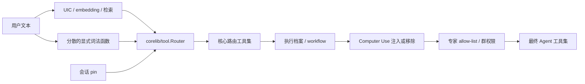
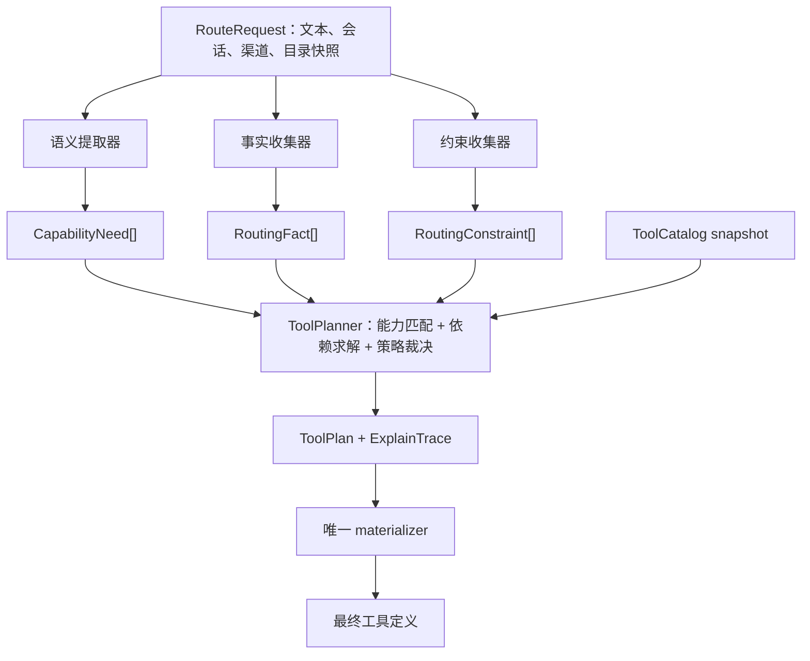
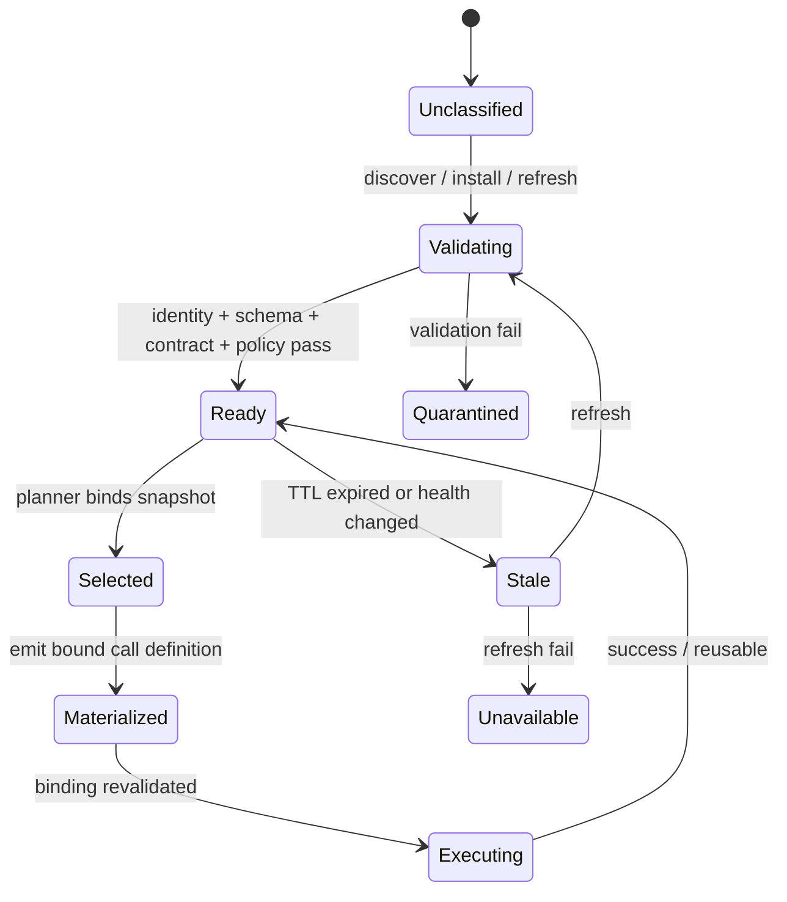

# 统一语义工具路由设计

## 1. 决策摘要

本设计定义一个面向全产品、全入口的工具路由系统。它以**用户希望达成的能力与结果**为输入，以统一的工具目录、上下文约束和策略为边界，输出一份可解释的**工具执行计划**（Tool Plan）。

它明确不采用“发现一个关键词，就向 Agent 暴露一个工具”的模式，也不把截图、录音、Git、浏览器、IM 管理等能力做成各自的路由例外。任何文本模式、分类器、会话状态、工作流或权限模块都只能贡献标准化的语义事实或约束；只有统一规划器可以决定工具是否进入最终工具集。

蓝信中“截图”与“截主屏”行为不一致，是本设计要消除的一类症状，不是设计中心。运行日志已证明蓝信 `SendMedia` 图像上传/发送链路能够成功；实际断点是入口仅保存 embedding-only 的不确定分类，导致同一受管截图请求退回 legacy 工具面，模型随后以 shell/本地路径绕过受治理的 `visual.capture.desktop → artifact.deliver.current_channel` DAG，并错误声称“自动发图通道不可用”。在新架构中，入口必须为会影响工具 materialization 的请求保留同一轮权威语义判定；“采集屏幕图像”和“把产物投递到当前渠道”仍是独立能力需求，由同一计划处理依赖、渠道能力和执行权限。

## 2. 范围、目标与非目标

### 2.1 目标

1. 所有入口对同一用户任务使用同一套能力匹配、策略裁决和解释模型。
2. 语义理解的输出是“需要什么能力”，而不是“打开哪个工具”。工具名不再出现在意图分类、关键词规则或 LLM rewrite 的控制字段中。
3. 对单步、多步、产物交付和上下文延续统一建模；工具之间的前置条件、替代项和渠道差异可被规划器处理。
4. 权限、工作流、专家配置、平台能力、执行档案等约束在一次统一裁决中生效，不能在后面静默增删工具。
5. 任意工具从未选中、被拒绝、被替代到最终暴露，都可以按请求追溯原因。
6. 不依赖新增词表来修复同义改写；低延迟路径也不把额外 LLM 调用设为必需条件。

### 2.2 非目标

1. 本设计不替代工具执行时的授权、用户确认、参数校验、审计和幂等保护。工具可见不等于操作获准执行。
2. 本设计不要求每轮调用远程 LLM。语义提取可使用本地模型、embedding、确定性结构化解析和已验证上下文；不确定时应澄清，而不是猜测工具。
3. 本设计不承诺在模糊请求下自动执行有副作用操作。
4. 本设计不将工具路由变成业务编排器。它选择能满足当前能力需求的最小工具面；业务流程本身仍由 Agent/workflow 执行。

### 2.3 不变量

以下不变量是实现、代码评审和回归测试的硬约束：

1. **单一决策点**：`ToolPlanner` 是唯一可作出 selection 决策的组件，`CatalogRenderer` 是唯一可把该 selection 渲染为最终 Agent 工具面的组件；其他模块不得直接 append、ensure、remove 或按名称过滤 Agent 工具定义。
2. **能力先于工具**：语义层、会话层和 rewrite 层只能产生 `CapabilityNeed`、事实和约束，不能产生 `must_include: [tool_name]` 或 `must_exclude: [tool_name]`。
3. **策略不可绕过**：任何语义、会话 pin、检索得分、用户文本模式或模型输出都不能覆盖硬策略、权限、工作流禁止项和执行确认要求。
4. **单调约束**：下游模块可以提交更严格的约束或新的可用性事实，但不能在最终工具集外静默恢复工具。事实变化须触发重新规划。
5. **稳定且最小**：同一输入快照应产生稳定排序和最小充分工具集；增加无关文本或无关工具不得改变已满足的计划。
6. **可解释**：每个目录实现都有状态记录：选中、候选未选、不可用、被约束拒绝、预算未 materialize 或无需使用；没有“被某层静默删除”的状态，也不能把预算裁剪伪装为不相关或 provider 不可用。
7. **动态绑定完整**：Skill/MCP 的加载、选择、materialize 与执行必须使用同一不可变 provider binding；目录刷新、名称相同或健康变化不得静默替换已选实现。
8. **发现不是依赖**：已知且健康的 Skill/MCP 能力必须在首轮计划中可被选中；`discover_tool` 仅用于目录查询或尚未分类的能力发现，不能是正常请求漏路由后的补救步骤。
9. **计划闭包与暴露闭包分离**：ToolPlan 必须覆盖当前目标的已知前置条件与产物消费者；最终 Agent 工具面只覆盖当前 phase 可执行步骤及其已满足依赖，不能遗漏当前必需工具，也不能提前暴露后续高风险工具。
10. **绑定式调用**：对动态提供者，模型只能调用带计划引用的受限适配器；不得向模型暴露可任意填写 Skill 名、MCP server、MCP tool 的泛网关调用面。
11. **失败可恢复且不扩权**：provider 不可用、schema 漂移、授权变化或工具失败时，只能在原需求和约束下重规划；不得因此自动暴露 bash、任意网络或其他高风险替代工具。
12. **作用域正确**：目录基础数据可共享缓存，但 ProviderBinding、授权、渠道能力、计划和工具调用令牌均绑定 tenant、principal、会话和 turn，不能跨用户或跨会话复用。
13. **效果诚实**：Skill/MCP 的实际或可委托 effects 必须纳入计划、策略和确认；provider 不能通过被包装成单一工具而隐藏网络、进程、文件、凭据或外发副作用。
14. **产物可追溯**：跨工具和跨渠道的数据以作用域绑定的 ArtifactRef 传递；交付是否成功、是否未知和是否失败必须与上游生成结果区分记录。
15. **匹配可证明**：一个 provider 被选中时，必须有能力、qualifier、输入/输出契约、effect 与前置条件均满足的机器可验证 `FitProof`；语义相似度只能召回候选，不能单独证明可满足需求。
16. **渲染不信任动态元数据**：模型看到的工具名、描述、schema 和调用示例必须由 catalog renderer 生成；Skill/MCP 返回的自然语言元数据不能直接进入高优先级提示或改变调用边界。
17. **所有执行同一边界**：builtin、Skill、MCP、插件和渠道 adapter 都经 selection、FitProof、参数 authorizer 与结果 contract 执行；动态 provider 只是额外验证身份/健康/schema，不能形成两套安全模型。
18. **依赖先于并发**：模型发出的多个 tool call 不决定执行顺序。执行器按 ToolPlan DAG、资源冲突和 effect 约束调度；未就绪 selection 必须拒绝，而不是碰巧并行成功。
19. **外部效果可去重**：外发、发布、写入等 selection 必须拥有稳定 idempotency key 和 operation ledger。网络未知时记录未知，不凭模型重试文本重复执行。
20. **召回完整性可判定**：对每个已登记的 `CapabilityNeed`，planner 必须能区分“在本快照内没有可行实现”和“目录、语义索引或动态 inventory 尚不完整”。后者只能产生 `catalog_incomplete` / `provider_not_ready`，不得伪装成“不相关”或退回按工具名补救。
21. **恢复不重解释宿主调用**：函数名、host tool-call ID、adapter 映射、grant、已规范化参数、执行结果与计划 revision 必须形成可恢复的同一记录。重连、批次重放和进程重启只能查回原记录或明确拒绝，不能把旧调用重新当成新工具选择。
22. **依赖事实跨 revision、授权不跨范围**：已验证 artifact、receipt、完成 selection 和确认可按其自身作用域在同一 `RootTaskID` 的后续 revision 中复用；adapter、grant、参数授权、host call 与未开始 selection 则不得跨 revision/turn 复用。不能用“计划 ID 变了”丢失已完成事实，也不能用“根任务没变”放大旧授权。

## 3. 现状审计与根因

当前实现的关键链路为：



对应的主要位置包括：

| 层 | 当前位置 | 观察到的问题 |
| --- | --- | --- |
| IM 入口 | `gui/im_handler_wiring.go:routeToolsForUser` | 首轮使用 `PreferEmbeddingOnly`，同时保留 IM 管理、昵称等旁路。 |
| 核心 Router | `corelib/tool/router.go:RouteWithOptions` | UIC、候选排序、pin 和多项显式判断在同一函数内直接改工具集合。 |
| 路由 rewrite | `corelib/tool/route_intent.go:RouteIntent` | `MustInclude`/`MustExclude` 允许意图层直接指向具体工具。 |
| 后置阶段 | `gui/im_agent_loop_tools.go:prepareAgentLoopTools` | workflow、Computer Use、专家、群权限和兜底工具以多次过滤/补回方式改变集合。 |
| 专项入口 | `gui/computer_use_routing.go`、IM 工具辅助函数等 | 业务能力各自持有“显式请求”判断和工具名集合。 |

这种形态带来四个根因：

1. **工具名泄漏到理解层**：意图、特例和 LLM rewrite 都可以直接选择工具，使新增能力必须复制路由逻辑。
2. **集合变换分散**：`ensure*`、`filter*`、`remove*` 等函数在不同阶段运行，无法定义统一冲突顺序，也无法解释 CP1 到 CP4 的变化。
3. **词面耦合**：部分“显式性”通过字符或短语判断，导致同义表达、否定、教学说明和混合请求不稳定。
4. **产物链路断裂**：采集、生成、保存、上传、向渠道发送常由不同工具完成；若只按单个工具词面路由，可能出现“采集工具未出现”或“采集成功但没有交付能力”的假象。

## 4. 统一领域模型

### 4.1 能力、工具、事实与约束

| 概念 | 定义 | 例子 | 不是什么 |
| --- | --- | --- | --- |
| Capability（能力） | 对用户有意义、可由一个或多个工具实现的原子结果 | `visual.capture.desktop`、`artifact.deliver.current_channel`、`repository.publish` | 具体工具名。 |
| Tool（工具） | 某个能力的实现提供者，拥有参数 schema、成本和副作用 | `screenshot`、`send_to_im` | 用户意图标签。 |
| CapabilityNeed（能力需求） | 当前回合为达成目标所需的能力、对象、范围和确定性 | “采集当前主显示器的图像” | 关键词命中或工具调用。 |
| Fact（事实） | 与任务或环境有关、可验证且不带裁决的输入 | 当前渠道可发送图片、用户具有 SSH 权限 | “因此必须开放 ssh”。 |
| Constraint（约束） | 对计划可否使用某能力/工具施加的允许、禁止、预算或确认条件 | workflow 禁止网络、副作用需要确认 | 静默删掉工具定义。 |
| ToolPlan（工具计划） | 对需求、候选实现、依赖和约束完成裁决后的结果 | 选 `screenshot`，产物可由当前渠道投递 | 一串临时 map 过滤结果。 |

`CapabilityNeed` 的规范形式如下。语义层只能产生此结构或其证据，不得填写工具名：

```go
type CapabilityNeed struct {
    ID           string
    Capability   string            // canonical capability id
    Goal          string            // capture, read, modify, deliver, publish ...
    Object        string            // desktop_screen, artifact, repository ...
    Scope         map[string]string // display=primary, channel=current ...
    Polarity      string            // require, avoid, inquire, simulate
    Confidence    float64
    EvidenceRefs  []string
    Required      bool
}

type RoutingFact struct {
    ID            string
    Kind          string            // channel_support, attachment, active_workflow ...
    Attributes    map[string]string
    Provenance    FactProvenance
    ValidUntil    time.Time
    Confidence    float64 // 仅用于不确定语义/观测，不能提高来源权限
}

type RoutingConstraint struct {
    ID            string
    Subject       string            // capability or tool selector
    Effect        string            // deny, require_confirmation, max_cost, require_capability
    Attributes    map[string]string
    Provenance    FactProvenance
    ValidUntil    time.Time
    ReasonCode    string
}

type FactProvenance struct {
    Authority     string // user_assertion, channel_adapter, policy, workflow, admin, executor
    SourceRef     string // 可审计但向模型脱敏的来源引用
    ObservedAt    time.Time
    IntegrityRef  string // 签名、版本、receipt 或可信存储引用
}
```

`Polarity` 是必须字段。“不要截屏，只告诉我怎么做”生成 `inquire` 或 `avoid`，而非因为出现“截屏”就产生 `require`。动作、对象、范围、否定、指代和时间关系均是语义槽位，不是按某个词表开关工具的理由。

事实和约束不是同等可信的键值对。`RoutingFact` / `RoutingConstraint` 必须有可验证来源、作用域和失效时间；用户文本只能生成 `user_assertion` 或语义证据，不能伪装成“渠道支持”“已授权”“已确认”或 provider 健康事实。planner 先按来源权威性、作用域和 freshness 校验，再合并同一 subject 的事实：安全 deny、吊销、过期和更窄的范围优先；同层冲突必须产出 `fact_conflict` / `clarification_required`，不能按最后写入、置信度或工具名覆盖。唯一允许把冲突裁决成放行的来源是经认证的 policy/admin 更新，并且必须形成新的 snapshot。

### 4.2 能力本体与契约治理

能力 ID 不是任意字符串。若没有版本、限定词 schema 和所有权，能力层会重新退化为另一套不可维护的关键词表。`ToolCatalog` 必须维护一份版本化的 `CapabilityRegistry`：

```go
type CapabilityDescriptor struct {
    ID                string            // 如 visual.capture.desktop
    Version           string
    Owner             string            // core / plugin / product domain
    QualifierSchema   map[string]ValueConstraint
    InputArtifacts    []ArtifactContract
    OutputArtifacts   []ArtifactContract
    EffectClass       []EffectClass
    Deprecates        []string
}
```

治理规则：

1. capability ID 用稳定的“动词结果 + 领域对象”命名；工具名、品牌名、协议名和 UI 文案不得进入 ID。一个 capability 描述的是结果，不绑定某个实现或单一步骤。
2. `qualifier` 必须在 descriptor 的 schema 中注册。`display=primary`、`channel=current` 等是可比较的约束；未知 qualifier 只能保留为证据，不能影响可行性或授权。
3. 能力语义改变时新增版本或新 ID，不复用旧 ID 改写效果等级、产物类型或权限范围；旧 ID 有明确 deprecation 和迁移映射。
4. capability contract、工具/Skill/MCP provision、策略规则、renderer 模板和评测样例在 CI 中交叉校验：不存在的 capability、未声明的 qualifier、无法 materialize 的 provision、无 FitProof 路径、不可安全渲染的 schema 或无测试的高风险 capability 均失败。
5. 用户文本中的开放词汇只映射到已登记的 capability；语义模型不能凭空创造一个 capability 或把相似文本等同于一个高风险能力。

能力词汇还需要有自己的受控发布面。每个 descriptor 应有版本化、可审查的 `SemanticContract`（动作/对象定义、允许的同义表达、反例、语言/locale 覆盖和风险分级），并由 registry owner 发布；它不是 provider description 的镜像。embedding、分类器和检索索引只能由该 contract 及经过长度/格式限制的低信任摘要构建，并记录 registry version、index version、模型版本和证据片段摘要。Skill/MCP 的原始 description、示例、返回内容和网页文本可以作为不可信数据被引用，绝不能写回 SemanticContract、改变 capability 含义，或使一个尚未治理的 capability 在运行时“自注册”。这保证开放词汇匹配不会重新变成动态关键词放行。

这使“能力”成为受治理的产品 API，而非另一层松散标签。

### 4.3 工具目录是唯一的能力映射来源

所有已注册、延迟加载和渠道适配工具必须由同一个 `ToolCatalog` 声明能力契约。目录从工具注册信息生成或在其旁边声明，禁止再次维护平行的 `conditionalKeepRules`、`toolFamilyMembers`、`ensure...ToolNames`、`CoreToolNames` 等工具名集合。

```go
type ProviderBinding struct {
    Kind              string // builtin, skill, mcp
    ProviderID        string // builtin id / stable skill id / MCP server id
    ImplementationID  string // skill version or MCP tool name
    CatalogGeneration uint64
    SchemaDigest      string
    Health            string // ready, warming, unavailable, quarantined
    TenantID          string
    PrincipalID       string
    ChannelScope      string
}

type ParameterAuthorization struct {
    ConstraintDigest         string // 计划阶段的字段、范围、效果与确认约束摘要，不是模型参数摘要
    CanonicalizationProfile  string // 路径、URL、收件人、数值、Unicode、媒体等的版本化规范化规则
    ModelWritableFields      []string
    ServerBoundFields        []string // target、provider、artifact、credential 等只能由服务端绑定
    AllowedTargets           []string
    ArtifactUseGrants        []string
    ConfirmationGrantID      string
    PolicyVersion            string
}

type ToolSpec struct {
    Name              string // materialize 后给模型看的调用名
    Provider          ProviderBinding
    Provides          []CapabilityProvision
    Consumes          []ArtifactContract
    Produces          []ArtifactContract
    Preconditions     []Requirement
    Effects           []EffectClass
    Cost              CostProfile
    Exposure          ExposureContract
}

type CapabilityProvision struct {
    Capability        string
    Qualifiers        map[string]string
    Quality           float64
}

type FitProof struct {
    NeedID            string
    ProviderBinding   ProviderBinding
    MatchedCapability string
    QualifierBindings map[string]string
    InputProofs       []string
    OutputProofs      []string
    EffectProof       string
    Preconditions     []string
    ContractVersions  map[string]string
    ProofDigest       string // canonical proof，供 materializer/executor 精确引用
}

type ExposureContract struct {
    RiskClass         string // read_only, local_mutation, external_effect, sensitive
    RequiresIntent    bool
    RequiresConfirm   bool
    AllowSessionReuse bool
    ChannelSupport    []string
}
```

目录负责描述“工具能做什么、需要什么、产生什么、代价和边界是什么”；它不负责从用户文本推断需要哪个工具。一个能力可有多个工具实现，一个工具也可提供多个能力。这样切换截图实现、增加新的 IM 通道、加入远程工具或 MCP 工具，都不需要把新名字散落到理解与过滤逻辑中。

`Name` 只是 materialize 后给模型看的调用名；规划、授权、审计和重试以 `ProviderBinding` 为准。Skill stable ID、版本和 schema digest，或 MCP 的 `server_id + tool_name + schema_digest`，必须在同一个目录快照中解析，禁止依赖易变展示名或下一轮再次模糊搜索。

planner 为每一个 `ToolSelection` 产出 `FitProof`。它必须证明：能力 ID 相容、必需 qualifier 被满足、输入 artifact 能被消费、预期输出能够供后续节点消费、最大 effect 不超过 policy/trust contract，且所有前置条件已满足或已成为计划节点。缺少任一项时只能是 `alternative`、`tentative` 或 `unmet`，不得 materialize。这样“语义相关”与“这个工具能正确完成用户请求”是两个可独立审计的判断。

`FitProof` 还必须是**可复算而非解释性文本**：每个 qualifier、artifact、effect 和 precondition 都引用 snapshot 中的 descriptor / fact / constraint / trust-contract ID 与规范化值；`ProofDigest` 由这些输入确定性计算。materializer 将 digest 固化进 invocation identity，执行器重新校验同一 digest 与 `ParameterAuthorization`。任何仅由 LLM 生成的理由、provider 的自然语言描述或运行时字符串，都不能单独构成 proof，也不能在执行期被“补全”为 proof。

`ParameterAuthorization` 也不能在规划时伪装成“完整参数的 hash”：模型参数尚未产生时，系统只能签发**参数约束**，例如可写字段、目标集合、允许的 artifact use、数值上限、路径/URL/收件人规范化规则和确认范围。执行器收到调用后，先拒绝保留字段和未知字段，再按 `CanonicalizationProfile` 规范化模型参数，并将“规范化参数 + 服务端绑定参数 + constraint digest”计算为 `RequestDigest` 写入 `OperationRecord`。只有这个执行期摘要才可参与幂等、确认消费和审计。禁止让模型填写 `provider`、`server`、`tool`、`selection`、目标身份、artifact location、credential 或任意 `*_id` 来替代服务端绑定；同样禁止以原始 JSON 字节、显示相同的 Unicode、别名 URL 或路径字符串作为授权和去重依据。

目录不是无版本的 map；它是按 `(tenant, principal, channel-policy, catalog-generation)` 构建的只读快照。可跨用户共享的仅是公开的能力词汇和经验证的静态元数据缓存；安装状态、凭据、健康、schema、授权和 provider binding 均是主体作用域数据，严禁混入全局缓存。

目录发布还必须满足**覆盖与漂移**两条治理规则：

1. 每一个可由 Agent 调用的注册实现都必须显式处于三种状态之一：有完整 capability provision 并可参与规划、经批准的固定系统控制面（不属于用户任务工具面）、或 `unclassified/quarantined`。最后一种不能悄悄回落到旧 Router 的“默认工具”。反过来，任何 capability provision 都必须能定位到实际可 materialize 的实现与 schema；这使“工具存在但新目录遗漏”在发布/CI 时失败，而不是在线上漏路由。
2. 静态 builtin 的 binding 至少包含实现版本或二进制/注册 schema digest；Skill 包含 stable package ID、已验证版本与 runner contract digest；MCP 包含经认证的 server identity、tool identity 与 schema digest。仅把展示名、注册名称或 URL 当成 identity 不足以防止同名替换。来源、签名/认证、隔离边界和可执行 effect 上界同时进入 `ProviderTrustContract`；其中任一安全属性收紧、吊销或失配都使旧 binding 不可执行。
3. catalog refresh 是 compare-and-publish：先在候选 generation 中完成 identity、schema、contract、capability、effect 与依赖校验，再原子发布。刷新失败只可保留仍处于适用 freshness SLA 的旧快照；不能把新旧 provider 条目混合，也不能用新发现的同名实现填补旧 plan。

### 4.4 动态提供者：Skill 与 MCP

Skill 和 MCP 不是 `discover_tool` 的附属功能，而是目录中的两类动态能力提供者：

| 提供者 | 目录条目来源 | 可选入计划的前提 | materialize 结果 |
| --- | --- | --- | --- |
| 内建工具 | 静态注册 | 已注册、策略允许、运行时可用 | 原生函数定义。 |
| Skill | 已安装 Skill 的签名/完整性、状态、执行契约、能力声明和依赖检查 | `active`、runner 兼容、依赖 ready、策略允许 | 绑定 Skill stable ID 的短时调用适配器。 |
| 本地 MCP | 已运行 server 的已验证工具清单和 schema | server ready、schema 有效、策略允许 | 绑定 `(server_id, tool_name, schema_digest)` 的短时调用适配器。 |
| 远程 MCP | 最近成功发现的工具清单、健康状态、认证和 schema | 在 freshness SLA 内可达、策略允许、目标仍匹配 | 同上，并在执行时核验 server/工具/schema 三元组。 |

Skill 的“加载”不是只把 `manage_skill` 放进 core tools；MCP 的“加载”也不是只把 `call_mcp_tool` 放进 core tools。它们都必须被解析为一个具体、可验证的 `ProviderBinding`。网关函数只是兼容运行时的调用载体，不能代替能力选择，更不能被模型用来枚举或调用计划外 provider。

动态提供者的正常调用应 materialize 成**一次性绑定适配器**，而不是泛网关。适配器的 invocation identity 唯一映射本次 plan 的 selection，业务参数 schema 固定为该选中实现的 schema；执行器以该 identity 查回 server/skill、版本、schema digest、principal 和授权快照，忽略模型提供的 provider 身份字段。为兼容旧接口保留的 `manage_skill` / `call_mcp_tool` 必须仅可由受信任适配层调用，不能继续作为 Agent 的自由函数定义。

动态提供者还需要区分三个不可替代的身份层：`provider instance identity`（签名 Skill 包或已认证 MCP server 实例）、`implementation identity`（Skill entrypoint 或 MCP tool）与 `contract identity`（canonical schema、runner/broker、trust/effect contract 的 digest）。binding 必须包含三者及其验证证据；只重算 MCP 参数 schema digest 不足以发现同 schema 的恶意同名 tool、runner 镜像替换、权限授予变化或 sandbox/broker 策略收紧。执行前验证应比较完整 binding 的**安全相关投影**；非安全展示文案可以变化，但任何身份、实现、schema、委托边界、可观察性、effect 上界、认证、授权或隔离属性变化均返回 `binding_stale` / `binding_revoked`，而不是继续沿用旧 grant 或把调用重定向到“等价”实现。

Skill 的 stable package ID 不是执行 identity：一次 selection 必须再绑定已验证的 package/content digest、entrypoint、runner image/runtime digest、依赖锁定集和权限 broker profile。MCP 对远端调用除 `(server_id, tool_name, schema_digest)` 外，还要绑定认证后的 server key/attestation（或连接实例 ID）、协议版本、endpoint authority、授权 audience/scopes 和 trust contract digest；若协议无法给出足以区分重连后实例或版本的证据，则该 provider 的 freshness 和风险上界必须收紧，不能以“名称未变”继续执行。

动态 description、触发词和 MCP 元数据是不可信输入：它们可参与受限的能力索引和候选召回，但不得拼接为高优先级系统指令，不能自行提升权限，也不能覆盖目录/策略声明。接入方需要将它们归一化为 capability contract；无契约、schema 无效或身份不稳定的提供者只能处于 `quarantined` 或 `unclassified`，不能自动暴露给 Agent。

执行期的绑定解析也必须是**精确寻址**而非“再次按名字找一次”：Skill bridge 只可用 stable package ID 精确定位一个 entry，逐项比较 name、version、content digest、active/runnable 状态后，直接以该已验证 entry 副本进入 runner；不得再调用 `ExecuteWithArgs(name)`、`MatchesName`、目录名、显示名或触发词解析。用量/失败统计也必须按同一完整 identity 回写，避免把旧 binding 的结果归属给同名替代包。MCP bridge 同样以 lifecycle 已观测到的 server/tool binding 为前提，并以 binding 的 principal 建立 owner-scoped transport/session；不得把动态 selection 降级为匿名共享会话或模型可选的泛网关。若 local MCP 的 owner-scoped execution 需要新 client，只能从已验证且仍运行的 lifecycle server entry 创建，且创建/发现失败即 `binding_stale`，不能改用同名、共享或新发现的 provider。

`CatalogRenderer` 是唯一将 `ToolSelection` 变为 LLM function definition 或系统说明的组件。它以 catalog-validated schema 和模板生成稳定调用面，满足：

1. 不把 provider 原始 description、指令性字段、嵌套 schema 文本或错误信息直接拼入 prompt；展示文案来自受控 capability 文案，动态元数据仅可作为长度受限、转义后的低信任摘要。
2. 一份 selection 对应一个确定的 adapter identity；不得让它随 provider 展示名、健康刷新或候选排序变化。同一 snapshot 的渲染字节序稳定，以保护 prompt cache 和回归可重复性；若底层协议要求 function name，则使用本 turn 不可猜测的 adapter ID，而非 provider 名或可自由填写的 `selection_id` 参数。
3. renderer 对 schema 的深度、字段数、字符串长度、`oneOf/anyOf` 分支和递归进行上限校验；无法安全投影的动态 schema 只可经 Agent View/表单等受控 UI 参数化，不进入通用 LLM 工具面。
4. renderer 在描述中区分“可执行 selection”和“需要确认/缺失前置条件的计划节点”；禁止用文字暗示模型可绕过 selection、确认或 artifact boundary。
5. 一个动态 provider 可以通过受治理的 capability contract 获得候选资格，但其原始 tool schema 不能自动成为模型 schema。renderer 应先投影为 canonical invocation schema：删除 provider identity、凭据、任意文件路径、原始 ArtifactRef、控制字段和未授权可写字段；将服务端绑定字段从模型面移除；对需要任意 JSON、回调 URL、shell、通配路径或不可验证联合类型的实现改用受控表单、专用低层 capability 或拒绝 materialize。投影与 canonical schema 的双向映射必须版本化并成为 binding / FitProof 的一部分。

### 4.5 产物与跨渠道交付

工具路由必须理解产物契约：工具可以产生 image、document、audio、structured-data 等产物；另一个工具或渠道 adapter 可以消费并投递它们。当前渠道是否允许文件、图片、链接或文本，是 `RoutingFact`，不是“蓝信专属路由规则”。

例如用户要求“截取主屏并发给我”时，任务会产生至少两个能力需求：

```text
visual.capture.desktop(display=primary)
artifact.deliver.current_channel(format=image)
```

规划器选择满足前者的采集实现，并仅在渠道事实和外发策略允许时，为后者选择投递实现。若当前渠道不支持图片，计划应输出明确的缺失能力或替代交付方案，而非把“发送失败”混同为“截图工具没路由到”。

### 4.6 产物谱系、内容边界与交付保证

“工具成功返回”不等于“用户得到正确产物”。所有可在计划间传递的结果都必须成为带谱系的 `Artifact`，而不是模型上下文中一段未标注的文本或任意本地路径：

```go
type ArtifactRef struct {
    ID              string
    Kind            string // image, file, audio, structured_data, external_content
    MediaType       string
    TenantID        string
    PrincipalID     string
    SessionID       string
    Producer        string // selection ID
    ProducerPlanID  string
    ProducerRevision uint64
    IntegrityDigest string
    LocationRef     string // opaque capability handle，executor-resolved only
    AllowedUses     []string
    Classification  string // public, personal, sensitive, secret
    Derivation      []string // 上游 ArtifactRef ID；转换不可抹去谱系
    AccessGrantID   string // 消费时仍须按调用方/用途复核
    RetentionUntil  time.Time
    State           string // provisional, verified, revoked, expired, deleted
}
```

产物约束：

1. 产物只能由成功 selection 写入，必须带来源、完整性摘要、主体作用域与允许消费者；模型不得自行伪造 `ArtifactRef` 或把任意路径伪装成上一步输出。
2. `artifact.deliver.*` 的成功条件应定义为：适配器已接受目标、媒体类型与产物引用，并返回渠道的可审计投递结果；仅“准备了文件”或“发起上传”不能标为 delivered。
3. 不支持原始格式时，planner 必须显式插入可行的转换/存储/交付节点，并在 `ToolPlan` 标注用户可见的降级；不能把 image 静默改成文本或把当前渠道改到另一个渠道。
4. 读取文件、网页、Skill 输出、MCP 输出和渠道返回内容均属于**不可信内容**。它们可作为数据产物，但不能直接成为 policy、provider contract、确认事实或高风险 CapabilityNeed 的权威来源。进入语义提取时须带 provenance，且不得改变系统指令优先级。
5. delivery 结果的未知、超时和失败须与采集/生成结果分开记录。对非幂等外发操作，不得因网络状态未知而盲目重试或改投其他目标。
6. 产物引用不是持久访问权。每次消费都需由执行器验证 producer plan/revision、完整性、保留期、classification、`AllowedUses`、当前 principal 与 `AccessGrantID`；转换、压缩、OCR、摘要和格式降级都要写入 `Derivation`，且默认继承最高敏感级别与最窄用途。不能因为文件已存在或是同一会话就把它交给任意 provider、写入日志、注入模型上下文或投递到另一个渠道。

`ArtifactRef` 的生命周期不能用 `delivered` 表示交付成功：同一份已验证产物可以被批准投递到多个不同目标，而每次投递又可能是成功、失败或未知。因此交付必须有独立、追加式的 `DeliveryRecord`，其 identity 至少绑定 delivery selection、逻辑 operation/idempotency key、目标/渠道的规范化摘要、输入 ArtifactRef 的完整性摘要、确认 grant、attempt、状态与渠道 receipt。capture 成功只把 artifact 置为 `verified` 并产生 `artifact_available` 事实；只有相应 `DeliveryRecord` 写入已验证 receipt 才能向用户投影“已发送”。这也避免“截图已生成”或“上传已开始”被误报为“文件已送达”。

artifact publication、operation ledger 和 delivery receipt 还必须定义可恢复的一致性边界：执行器先以条件写取得 operation lease，provider 调用后将结果写入 durable outbox/operation record，再原子发布 `ArtifactRef` 或 `DeliveryRecord` 与推进计划的事件。进程在任一写入点崩溃时，恢复器只根据该 record、outbox 和 provider receipt 对账；不得从模型上下文、临时 base64、文件路径或“上次工具成功”推断产物/交付状态。broker 对输入和输出都实施大小、流量、解压缩深度、类型嗅探、保留期和配额限制，防止经合法 artifact contract 注入超大载荷、压缩炸弹或跨任务资源耗尽。

### 4.7 Provider 信任、委托与真实效果

目录中“某 provider 声称提供某能力”不等于系统信任该声明。Skill 和 MCP 可能是本地安装、企业发布、市场下载或远端发现的代码/元数据；其名称、description、capability、输入 schema 与输出内容都不足以自行确定安全级别。

每个 dynamic provider 还必须有独立的 `ProviderTrustContract`，至少声明来源验证级别、隔离级别、允许的网络/文件/进程/凭据边界、可委托能力、真实 effect 上界、输出验证器和可重试类别。目录发布只接受以下之一：受信任发布者签名/企业认证的契约，或由系统以保守默认值生成的契约。未经验证的 provider 最大只能进入受限沙箱和低风险候选集，不能凭自声明获得 `external_effect`、凭据、任意网络、任意文件或高权限能力。

契约还必须区分**声明、可观测与可强制**三层，不能把远程 MCP 的自报 capabilities 当作隔离证明：

| 边界 | 最低证据 | planner 可作出的结论 |
| --- | --- | --- |
| 本地文件、进程、网络、凭据 | sandbox / broker 的实际强制策略与审计 | 可证明 provider 不会越出被授予边界。 |
| 远端 MCP 的服务端内部行为 | 已认证身份、协议级请求/回执与独立审计（若有） | 仅证明本系统发出了什么；未受本地控制的内部副作用必须按声明上界和更高风险处理。 |
| 产物/返回值 | 结构、大小、摘要、内容分类和来源验证 | 可证明返回值能否作为某一受限 artifact 使用，不能证明其自然语言事实为真。 |

因此 secret、原始 ArtifactRef 与外部目标必须通过 capability-scoped broker 按需发放，而非作为通用环境变量、文件路径或 provider 参数传递。若 trust contract 对某条 egress、委托 effect 或数据处理路径只能“声明而无法强制”，该不确定性本身进入 FitProof、确认摘要和风险排序；策略不得把它降级为 read-only，也不得因 provider 包装层看似简单而忽略。

Skill 的步骤、MCP 内部再调用和插件代码属于**委托执行**。planner 选择受限调用适配器时，必须把其 transitive preconditions、依赖和最大 effects 纳入能力闭包与确认摘要；本地受控 runner 在 provider 内部尝试越出 binding 或 trust contract 时拒绝。对于无法在本地拦截的远端委托，执行器记录可观测边界和 receipt，按 contract 的保守上界授权。否则“只暴露一个 Skill 工具”会掩盖其后面实际执行的网络、shell 或外发副作用，违背最小能力面原则。

## 5. 目标架构



### 5.1 请求一致性边界

一次 routing 不能从四处各读一次配置、工具、权限和健康状态再拼装结果。`CatalogSnapshot`、`ConversationSnapshot`、`ChannelContext`、策略快照和执行档案必须先形成 `RouteSnapshot`，其包含 `snapshot_id`、版本向量、生成时间和有效期。语义提取、规划、materialize 与 authorizer 都引用同一 `snapshot_id`；`RootTaskID` 在一次用户逻辑任务中跨 turn/replan/恢复保持稳定，`PlanID + Revision` 则标识某一不可变计划版本。两者不得混用，否则外部效果无法既避免重复又正确区分用户已改变目标的新操作。

允许在 planning 后发生变化，但处理方式必须明确：

| 变化类型 | 计划是否继续有效 | 处理 |
| --- | --- | --- |
| 与计划无关的 provider 或配置变化 | 有效 | 记录新 generation，当前计划继续。 |
| 已选 provider 的 description 等非安全元数据变化 | 有效 | 不重算；执行仍按原 binding/schema。 |
| 已选 provider 的 schema、身份、健康、权限、渠道能力或 effect 变化 | 失效 | binding validator 拒绝旧 selection，提交事实后重规划。 |
| 用户目标、范围、确认或工作流阶段变化 | 失效或进入下一 phase | 以新 snapshot 重规划；目标/效果范围变化建立新的 logical operation，旧确认不得继承。 |

不得为了“保持新鲜”在执行时重新枚举并以当前名称寻找工具；这会产生典型 TOCTOU 问题。执行器只能验证原 binding 是否仍可安全执行，不能将它解释为“可换成当前同名 provider”。

### 5.2 统一入口契约

每个入口只组装 `RouteRequest`，不得包含按入口手写的工具放行逻辑：

入口还必须把入站请求的 `context` / cancellation deadline 传给语义提取、目录读取与计划发布。分类器自己的 SLA 只是上界，不能用新的 `context.Background()` 脱离请求生命周期；入站 turn 已取消、被替换或其 deadline 已到时，尚未完成的 L3 请求必须在 transport 层取消，且该次降级/取消结果不得写入可供后续 turn 复用的语义缓存。反过来，缓存命中必须至少隔离 principal、会话语义输入和版本向量，不能让某一用户、已取消请求或旧策略的判定成为另一请求的工具面依据。

入口识别到已治理的 capability family 后，必须在调用任何 legacy `route/filter/ensure/append` 管线**之前**完成 `ToolPlanner` 计划与受限调用面的 materialize；不能先运行旧 Router 再以 semantic surface 覆盖其输出，因为前者的关键词匹配、session pin、动态加载或状态副作用本身已经破坏了单一决策点。此类 turn 必须选择能够携带 `ToolPlan`、opaque grant 和 `PlanExecutor` 的执行器；灰度/strangler 开关只能决定未迁移能力族的执行实现，不能把一个已治理 request 降回按工具名执行的 legacy loop。若 catalog、分类或执行器不可用，入口返回可解释的受管失败（或等待恢复），不得将同一 need 自动回落到旧工具面。

```go
type RouteRequest struct {
    RootTaskID       string // 跨 replan/恢复稳定；同一用户逻辑任务不复用给新任务
    TurnID          string
    SessionID       string
    UserText        string
    Conversation    ConversationSnapshot
    Channel         ChannelContext
    Catalog         ToolCatalogSnapshot
    Runtime         RuntimeContext
}

type RouteSnapshot struct {
    ID                 string
    RootTaskID         string
    TenantID           string
    PrincipalID        string
    SessionID          string
    TurnID             string
    ChannelID          string
    CatalogGeneration  uint64
    RegistryVersion    string
    PolicyVersion      string
    ConversationVer    string
    ChannelFactVer     string
    CreatedAt          time.Time
    ValidUntil         time.Time
}

type ToolPlan struct {
    ID              string
    RootTaskID      string
    Revision        uint64 // 同一逻辑任务单调递增；不是每次 replan 随机新身份
    Snapshot        RouteSnapshot
    CatalogGeneration uint64
    PrincipalScope  string
    Phase           string // discovery, preparation, execution, delivery
    Needs           []ResolvedNeed
    Selections      []ToolSelection
    FitProofs       []FitProof
    Missing         []UnmetNeed
    Decisions       []ToolDecision
    Trace           ExplainTrace
}

type ToolSelection struct {
    ID              string
    NeedRefs        []string
    Provider        ProviderBinding
    InputSchema     map[string]any
    Requires        []string // selection / artifact / confirmation IDs
    Produces        []ArtifactContract
    Effects         []EffectClass
    FitProofDigest  string
    Authorization   ParameterAuthorization
    InvocationID    string // materializer 签发；模型仅能借此到达此 selection
    IdempotencyScope string // 选择声明 effect 去重域；执行器用已规范化请求生成实际 operation key
    RetryClass      string // safe_retry, reconcile_before_retry, manual_resolution
    PlanRevision    uint64 // 只增；replan 后旧 revision 不可恢复执行
    ExpiresAt       time.Time
}

type OperationRecord struct {
    Key             string
    PlanID          string
    PlanRevision    uint64
    SelectionID     string
    Attempt         uint32
    State           string // prepared, running, succeeded, failed, unknown, cancelled, compensation_required
    LeaseID         string // 同一 effect scope 的互斥执行租约
    RequestDigest   string // 已规范化、已授权的参数摘要，不保存秘密正文
    ExternalReceipt string // opaque provider/channel receipt when available
    StartedAt       time.Time
    FinishedAt      time.Time
}
```

目录 generation 不是全部的一致性版本。`CatalogGeneration` 只标识 provider/contract 快照；`RouteSnapshot` 还必须冻结事实合并规则、策略、语义契约/索引、renderer 投影、host protocol adapter、参数规范化和 authorizer 的版本。`FitProofDigest`、grant、OperationRecord 与 ExplainTrace 都引用这个完整版本向量。否则同一 catalog generation 可能在不同语义模型、schema 投影或 URL/Unicode 规范化规则下产生不同的 need、允许参数和 idempotency key，从而无法复算或安全恢复。版本升级不得重解释一个已 materialize 的 selection；应创建新的 snapshot/revision，并明确旧 revision 的可继续、失效或仅可对账状态。

时间也必须进入可复现边界。所有 TTL、确认有效期、freshness SLA、grant 过期和保留期在 snapshot 中以可信时钟观测值固定并记录 clock source / skew policy；规划和执行不以本地墙钟的偶然跳变重写既有决定。多副本执行时，lease 与 nonce/confirmation 消费应由同一强一致或可线性化存储裁决；若无法取得该裁决，外部 effect selection 必须停在 `blocked`，而不是在两个进程上各自“安全重试”。

`RootTaskID` 不能由用户文本、工具名或请求体哈希推导：相同文本可能属于不同主体/会话，改写后的文本又可能仍是同一逻辑操作。入口必须从可信会话/工作流创建并持久化 root task；只有用户明确开始新目标、取消后重新发起，或 effect scope 发生实质变化时才创建新的 identity。`TurnID` 是 transport/request 身份，不承担幂等语义；`PlanID + Revision` 是不可变的决策版本；`OperationRecord.Key` 才是对外效果去重身份。四者均由服务端分配，客户端或 LLM 提供的同名字段一律视为不可信输入。

没有可持久化任务上下文的独立单轮入口，不得为了“保持相同文本幂等”而从用户 ID、消息正文或请求参数哈希推导 `RootTaskID`。它只能由宿主在进入路由前创建一次性随机 identity，并把该请求限定为不跨 turn 恢复；若操作需要确认、外部 effect、后续 artifact delivery 或断线恢复，则入口必须先升级为可信且持久化的 task/workflow identity。这样既不会把不同的同文操作错误合并，也不会让改写规避同一逻辑操作的账本与确认关联。

`ChannelContext` 描述协议可传输的产物类型、当前会话身份、群权限和用户选择的交付位置；`RuntimeContext` 描述执行档案、工作流、专家、系统策略和已知可用服务。它们是事实与约束的来源，不直接携带最终工具列表。

所有事实在进入 `RouteSnapshot` 前都要经过同一套合并器，而不是由 planner 或入口临时读取 map。合并器对每项事实校验 authority、scope、完整性引用、观察时间和 TTL；以 capability / subject / target 为冲突域，采用显式的“deny、revoke、过期、较窄 scope 优先”规则，并在同一权威级别无法裁决时产出 `fact_conflict` / `clarification_required`。用户、LLM、网页、工具返回和 provider description 只能贡献语义证据或不可信数据，不能升级为渠道支持、身份、健康、授权或确认事实。该规则同样适用于缓存：缓存键必须至少包含 tenant、principal、channel-policy、registry/catalog/policy 版本、locale 和生命周期边界；命中只能复用已验证的投影，不能跨作用域继承允许、确认或 readiness。

字段所有权必须固定：`RouteRequest` 是输入载体，`RouteSnapshot` 是经 provenance/freshness 校验后的不可变读视图，`ToolPlan` 是 planner 的纯决策结果，`ToolSelection.Authorization` 是 authorizer 对**规范化参数范围**的服务端授权，`InvocationID` / grant 是 renderer 签发的短时调用权。调用方不得预填或回写后四者；尤其不可从 client、LLM 或 checkpoint 反序列化 `ProviderBinding`、`ParameterAuthorization`、confirmation grant 或健康状态并视为可信。

### 5.2.1 计划发布、恢复与宿主调用日志

`RouteSnapshot` 仅冻结一次决策所读到的世界，不等于可恢复的执行状态。必须有一个持久化的 `RouteStateStore` 作为 `RootTaskID` 的唯一写入 owner；desktop 单实例可使用带事务和文件锁的本地数据库，服务端/多副本部署则必须使用可线性化的共享存储。不能用每个 API 进程的内存 map、独立 SQLite 副本或重新解析 checkpoint 文案拼出状态。

```text
创建 RouteSnapshot
  -> planner 生成 candidate PlanRevision
  -> RouteStateStore.CompareAndPublish(snapshot, plan, trace, bindings)
  -> renderer 仅从已发布 revision materialize adapter/grant
  -> HostCallJournal 原子记录 host_call_id、grant 指纹、规范化请求摘要和结果引用
  -> executor / outbox 推进 operation、artifact、delivery 和下一 revision
```

`CompareAndPublish` 的条件至少包含 `RootTaskID`、父 revision、snapshot digest 与目录撤销水位。它必须拒绝：乱序 replan 覆盖较新 revision、同一 revision 两次 materialize、撤销后继续发布、以及把另一个 principal/session 的事实带入任务。发布成功后 plan、binding 安全投影、FitProof、renderer/host-adapter/canonicalization version、确认 requirement 与 adapter 映射均不可变；后台刷新只能提出候选 snapshot，不能修改已发布记录。

`HostCallJournal` 解决的是**传输重试**，不是业务幂等的替代品。每个宿主 tool-call 先以 `(host protocol, connection/session instance, host_call_id, adapter/grant fingerprint)` 条件登记：

1. 同一记录已有终态结果时，返回同一受控结果投影，不再次消费 grant 或调用 provider；
2. 同一 ID 对应不同 adapter、grant 或请求字节时，返回 `host_call_conflict`，不得“以最新请求为准”；
3. 首次调用先登记 `received`，再消费 invocation grant；参数拒绝也记录稳定拒绝结果，避免网关重传被误解释为另一项调用；
4. 崩溃留下 `received` / `admitted` 时，只能根据 operation/receipt/执行记录恢复为同一结果、`in_progress` 或 `unknown`。它不能重新签发 grant，更不能重新调用 provider。

日志保留的是 host 调用映射和脱敏摘要，不保存秘密、原始 artifact 内容或 provider 凭据。其保留期至少覆盖 grant、operation、receipt 和宿主重试窗口中最长者；清理必须先确认没有可恢复的 running/unknown operation 引用它。这样“同一逻辑任务跨 turn”与“同一宿主 RPC 重放”分别由 `RootTaskID`/operation 与 HostCallJournal 处理，不会相互混淆。

`ToolPlan` 不是“这轮所有可能工具的清单”。它是一个有向执行图：节点为 selection、确认和产物，边为 `requires` / `produces`。materializer 只暴露当前 phase 可执行、且所有前置条件均已满足的 selection；工具执行或用户确认产生新事实后再推进下一 phase 并重规划。这样既不会把整条工作流的高风险工具过早暴露，也不会遗漏计划已经确定的下一项必要能力。

为避免“闭包”定义过宽，本设计区分：**计划闭包**包含到达用户目标所需的全部已知节点、候选、确认与产物边；**暴露闭包**只包含当前 phase 可执行 selection、它们的调用适配器和满足其输入所需的已批准 artifact reader。后续节点只保留在 plan/trace，不能因“未来可能需要”抢占当前 tool token 预算。

`InvocationID` / `selection_id` 只表示“谁可以调用”；`idempotency_key` 表示“这项外部效果在业务上是哪一次操作”。后者由稳定的**逻辑操作身份**（`RootTaskID`、need lineage、selection purpose、normalized target、input artifact digest、effect scope）派生，不能直接采用模型生成的随机值，也不能把会随 replan 改变的 `plan_revision` 当作 key 的一部分。若 replan 改变目标、产物、效果范围或用户确认摘要，则形成新的 logical operation 并重新确认；若只是重建计划或替换等价实现，必须沿用原 key 并先对账。operation ledger 按主体和保留期持久化状态：在执行前以**条件写**取得同一 effect scope 的执行租约并写入 `prepared`，成功后写入 provider/channel receipt；超时或断连只能标为 `unknown`。任何并发 turn、重复 LLM tool call 或恢复进程都必须先读取同一 `idempotency_key`：已有运行租约则等待/返回进行中，已有成功记录则返回已知 receipt，未知记录按 `RetryClass` 处理。重规划必须引用 ledger：`safe_retry` 可重试只读或可证明幂等操作，`reconcile_before_retry` 必须先向 provider 查询 receipt，`manual_resolution` 必须向用户报告不确定结果，禁止自动重复外发。

兼容 adapter 有两个**不可合并**的去重层。第一层是 invocation：同一个短时、opaque adapter identity 只能被消费一次，且必须在参数校验**之前**原子消费；否则攻击者可先以非法参数触发校验失败，再以不同参数复用同一已暴露调用权。第二层才是 logical operation：以可信 `RootTaskID`、完整 binding 和规范化且已授权的参数摘要计算 key，故 adapter 因重连、刷新或宿主重新 materialize 而改名时，不能再次触发同一外部效果。adapter identity 不得进入 logical-operation key；反过来，operation key 也不能代替一次性 invocation grant。两层都必须落在共享的 durable store；进程内 map 只能用于测试或明确标注为非持久的单进程开发模式。

`running` 不是可以永久保留的终态。ledger 记录可信时间、lease/fencing token 和 holder；启动恢复器或持有者续租失败后，只能通过条件更新把过期 `running` 转为 `unknown(operation_lease_expired)`，绝不能假定未执行而重新调用 provider。之后仅可按 binding 的 receipt/reconciliation contract 查询、由用户批准补偿，或进入 `manual_resolution`。任何完成写入都必须以 key + running state + lease/fencing token 比较并交换，迟到回调不得覆盖已被接管或已标为 unknown 的记录。

当前兼容桥接可以先实现上述 adapter 单次消费、稳定 logical-operation key 和 `running → unknown` 恢复的最小子集，但它不等同于完整 `PlanExecutor`：它尚不能替代 durable invocation grant、selection/plan revision、fencing token、receipt/outbox、RetryClass 和统一 canonicalization。因而 bridge 只可用于已显式收敛的动态调用面，不能作为其他 builtin 或自由网关绕过统一执行边界的理由。

实现收敛要求：生产路径不得把动态 Skill/MCP 的 operation ledger、receipt store 与 `HostCallJournal` / `PlanExecution` / `RouteState` 分别放进不同 SQLite 数据库。对 receipt-bound dynamic selection，`operation prepare`、一次性 grant 已消费后的 host-call admission、dispatch 后的 `awaiting_receipt | failed | unknown`、以及有可信 receipt 后的 plan completion 必须由同一个 `SemanticExecutionCoordinator` 事务域提交。旧的 split ledger 仅可作为历史只读对账输入；不得在新调用路径中继续写入，也不得自动把历史 `running` / `unknown` 迁移为成功。启动恢复必须将超时 `running` operation 标为 `unknown(operation_lease_expired)`，而不是重新派发。

确定性、I/O 前就能证明的绑定失败（如 `*_binding_stale`、`*_bound_execution_unavailable`）应提交为 `failed`，从而稳定重放同一拒绝；网络超时、连接中断和 provider 回应丢失只能提交为 `unknown`，并等待 receipt/reconciliation。GUI、Core Agent 与渠道 host 均须把同一 `SemanticExecutionAdmission` 仅通过受信任的进程内 context 传入动态 effect coordinator；该 coordinator 完成 unified transaction 后，外层不得再次调用通用 completion。该标记必须是接口契约，不能依赖某一 value/pointer concrete type assertion。

并非所有 provider 都能提供可查询的 receipt；这时系统绝不能把“请求未报错”升级为已成功。`RetryClass` 必须由 capability、effect scope、provider contract 的可对账性和幂等保证共同决定，不能由实现或模型临时标记。对不可撤销而又无法查询/去重的外部 effect，默认只能经过显式确认并采用 `manual_resolution`；若业务承诺支持补偿，补偿本身必须建模成新的高风险 capability、独立确认和新的 operation record，不能把“撤销/删除”当作失败后的隐式清理。

**确认与等待不是可执行工具。**需要确认的 selection 留在计划闭包中，但不属于暴露闭包；renderer 只能输出受信任 UI/渠道确认请求及其面向用户的 capability 摘要，不能靠提示模型“先自己确认”。确认回执绑定 logical operation、目标/产物 digest、effect 上界、principal、会话、有效期和单次消费语义；确认、artifact 或 provider readiness 发生后，系统形成新 snapshot/revision 再 materialize。这样可避免把“需发送图片”的 delivery adapter 与 capture adapter 同时暴露并让模型乱序调用。

在数据模型中，确认必须是显式 DAG requirement（如 `confirmation:<need-id>`），而不是一个会使 selection 永久不可执行的 `RequiresConfirm bool`。planner 将 requirement 写入 selection 的 `Requires`；只有受信任 UI/渠道确认处理器在校验 `RootTaskID`、logical operation/effect/target/artifact 摘要、principal、有效期和一次性消费后，才能发布同一 requirement 的 `confirmation_granted` fact。renderer 与执行器只读取经 authority、scope 和有效期验证后的 satisfied-dependencies projection：未确认节点没有 grant/调用面；旧 grant、模型文本“已确认”、跨任务/跨主体 confirmation 或过期 confirmation 均只能得到 `selection_not_ready`。兼容字段可以暂留为展示投影，不能再作为授权判断。

materializer 的输出分为两个彼此隔离的面：

| 输出面 | 面向对象 | 内容 |
| --- | --- | --- |
| Agent tool surface | 模型 | 当前 phase 的最小工具 schema、opaque `selection_id`、不泄密的调用说明。 |
| Executor authorization surface | 执行器 | selection → provider binding、完整 schema digest、tenant/principal/session/turn、effect、确认、trust contract 与过期条件。 |

模型永远拿不到完整的内部 provider 路由、凭据、其他候选、策略细节或可用于猜测 token 的信息；执行器也不相信模型重新陈述的 provider、scope 或 effect。这是“相关工具正确加载”与“不会因加载更多工具而扩大权限面”同时成立的必要边界。

模型调用面也不得把 `selection_id` 设计成可由模型自由填写的普通 provider 参数。`CatalogRenderer` 为每个当前 selection 生成短时的受限调用适配器：函数名/服务端 invocation envelope 映射到唯一 selection，参数 schema 只包含该 selection 已授权的业务参数；服务端从被 materialize 的 invocation identity 取回 selection，忽略或拒绝参数中伪造的 selection/provider/server/tool 字段。若协议只能传普通 function name，则 name 必须是本 turn 不可猜测的 adapter ID，且执行器仍按 scope、过期、单次/幂等状态验证。这样既不向 Agent 暴露“任意 Skill/MCP 网关”，也不会把安全性寄托在模型不猜名称上。

适配器的短时 identity 不是唯一安全控制：它必须带服务端签发的、不可伪造的 invocation grant，并同时绑定 `RootTaskID`、`PlanID`、revision、snapshot、`FitProofDigest`、`ParameterAuthorization`、主体/会话/turn、过期时间及重放计数。执行器应使用常量时间验签、服务端 nonce/revocation 表和原子 consume/lease 检查；日志只保存脱敏 grant 指纹。这样避免把“不易猜到的函数名”误当作授权，也能处理 LLM/网关的重传、浏览器恢复和同一批并发调用。

每个外部或动态 selection 的输入与输出必须经过 contract boundary：执行前验证参数 schema、路径/目标/媒体/产物引用与 selection 所允许范围；执行后验证返回结构、产物大小/类型/完整性与声明产物契约。验证失败产生 `contract_violation`，该结果既不能作为后续 trusted fact，也不能触发更宽松的自动 fallback。

### 5.3 计划感知执行器与统一授权

现有 loop 的“模型输出 tool call → 按名称执行”的惯性必须在执行边界终止。新增 `PlanExecutor` 作为唯一执行适配层，所有工具类型都走同一流程：

```text
LLM tool call(adapter identity, args)
  → HostCallJournal: host protocol / connection / tool-call ID 绑定、冲突检测与终态重放
  → invocation grant 验签 + scope/expiry/replay/revocation validation
  → FitProof digest / phase / dependency readiness validation
  → 规范化参数 + unified parameter authorizer（签发/核验 ParameterAuthorization）
  → operation ledger prepare + idempotency decision
  → builtin | skill | MCP | channel adapter invocation
  → output / ArtifactRef / receipt contract validation
  → ledger + trace update → new facts → replan
```

`PlanExecutor` 取代“按当前工具名重新寻找 handler”的模式。无论 builtin 还是动态工具，必须同时满足当前 snapshot、selection、FitProof、phase、参数、效果、确认与 artifact 约束；执行器不因工具属于 core/builtin 而跳过这些检查。既有 workflow、专家、群权限和 ToolAuthorizer 迁移为 unified parameter authorizer 的 constraint producer/validator，不能作为 materialize 之后又一层静默删改。参数授权要先做类型、Unicode/路径/URL/媒体格式与目标规范化，再和 selection 的 `ParameterAuthorization` 比对；同一视觉上等价但字节不同的路径、URL 或收件人不得绕过范围、确认或幂等判断。

模型一次返回多个 tool call 时，`PlanExecutor` 不按返回顺序盲目执行。它以 ToolPlan DAG 调度：无依赖且资源/目标不冲突的 read-only selection 可受限并发；存在 `requires` 边、共享 ArtifactRef、同一外部目标、相同 effect scope 或未消费确认的 selection 必须按依赖顺序串行。模型调用未进入当前暴露闭包或前置未完成的 selection 返回 `selection_not_ready`，并让下一轮根据当前 plan 继续，而不是借由多 tool call 绕过 phase。

为兼容当前 LLM 的 tool-call 成对消息协议，执行器可并发运行已就绪节点，但必须先收集每项结构化结果，再按原 tool-call ID 顺序写回同一 assistant batch；不得因完成先后改变 conversation 配对。若某个 selection 的结果推进了 phase，则同一批中尚未开始、但不再属于新暴露闭包的调用返回 `selection_superseded`，不执行。

取消是一次状态转换：阻止新 selection 开始，向正在运行的可取消调用传播 context cancellation，等待或记录不可取消外部操作的 `unknown` 状态，再使未开始 selection 失效。取消不能被后续 LLM retry、工具结果回调或旧 token 重新激活。

执行器返回的不是仅供模型阅读的字符串，而是单一的结构化结果；现有字符串结果只是它的受控投影。建议将 loop 的 `ToolExecutionResult` 演进为以下兼容超集，避免 UI、checkpoint、审计和下一阶段各自从文案解析“是否已发送”：

```go
type ToolExecutionResult struct {
    Result        string // 仅为模型/旧调用方生成的受控摘要
    Outcome       ToolExecutionOutcome
    PlanID        string
    PlanRevision  uint64
    SelectionID   string
    State         string // succeeded, failed, unknown, blocked, cancelled
    ReasonCode    string // selection_not_ready, binding_stale, confirmation_required ...
    Artifacts     []ArtifactRef
    ReceiptRef    string // 指向审计存储，不把敏感 receipt 注入模型上下文
    RetryClass    string
    ReplanHint    string // none, advance_phase, replan, reconcile, ask_user
}
```

`PlanExecutor` 必须先持久化该结构化结果和 trace，再由 `ToolResultProjector` 生成模型可见摘要。模型文本中的“请重试”、普通 loop 的空响应重试、同一 tool-call ID 的网络重传，都不能自行重新调用 provider；它们只能促成受 ledger 与 `RetryClass` 约束的 `replan` / `reconcile` 决定。对于 `confirmation_required`，执行器返回可显示的确认请求并暂停计划，不能把确认 marker 当作成功的工具结果继续推进依赖节点。

统一参数授权不能停在 `map[string]any` 或各 provider 的零散 schema 校验。它需要一个版本化、服务端签发的 canonicalization profile 与明确的授权决策对象：

```go
type CanonicalRequest struct {
    ProfileVersion string
    CanonicalJSON  []byte   // 封闭对象；重复键、未知字段和非规范数值已拒绝
    Digest         string   // 含服务端注入的 binding/artifact/target 安全摘要
    Targets        []CanonicalTarget
    ArtifactInputs []ArtifactUse
}

type ParameterAuthorization struct {
    Digest            string
    CanonicalizerVer  string
    AllowedFields     []FieldConstraint
    TargetConstraints []TargetConstraint
    ArtifactUses      []ArtifactUseConstraint
    EffectScope       string
    ConfirmationScope string
    ExpiresAt         time.Time
}
```

调用顺序固定为：先以 selection 的 **canonical invocation schema** 解析为无重复键的值树；再做 Unicode NFC/IDNA、URL、路径、收件人、媒体类型、数值和时区规范化；随后由 broker 以服务端 handle 解析 artifact，再对规范化结果执行 `ParameterAuthorization`。模型提交的 provider、server、selection、credential、任意本地路径、`ArtifactRef` location、receipt、policy 或 confirmation 字段属于保留字段，出现即拒绝。每种字段必须只有一个 canonicalizer；provider 不得在此后重新解释 URL、路径、目标或 schema 默认值。

授权与确认必须针对**已规范化且已绑定产物的请求摘要**，而不是原始 JSON、显示名称或“本次操作”字符串。缺少/失效的 authorization、canonicalizer 版本不匹配、target alias 展开后越界、artifact classification/use 不匹配、provider 默认值导致 effect 增大，均返回稳定 reason code 并触发重规划/澄清。对无参数或读取类 selection，仍生成空 canonical request digest；这保证 operation key、trace 和重试语义不因“没有参数”而绕过统一边界。

`OperationRecord` 应是一次**逻辑操作**的状态机，而不只是每次 RPC 的日志。至少区分 `prepared → running → succeeded|failed|unknown|cancelled`，以及 `compensation_required`；状态迁移采用条件写和 fencing token，provider 调用只在取得仍有效 lease 后发生。每个 effect selection 的 operation key 由根任务、effect scope、规范化目标、输入 artifact digest、约束/确认摘要和 provider binding 计算，不能由模型 tool-call ID 或随机重试次数决定。对 `safe_retry`，只有 provider contract 与 request class 同时证明幂等时才允许重发；对 `reconcile_before_retry`，先用受绑定的查询/receipt capability 对账；对无 receipt 或不可查询的外部系统，网络超时即为 `unknown`，只能人工处理或执行另行规划、已获授权的补偿 capability，禁止用“换一个渠道/再次发送”作为自动恢复。

confirmation 的原子消费与 operation lease 必须在同一 effect scope 上协调：确认尚未消费时，多个并发 selection 不得各自把它当作可用；确认被消费后，只有绑定的 request digest 可以继续。若 provider 在收到请求后崩溃、连接断开或回执晚到，恢复器保留原 lease/receipt 关联并进入对账，不得因为 grant 已过期而把该逻辑操作当作从未开始。grant 只授权发起/续接已记录的 operation，不是抹去 ledger 历史的理由。

操作协调器应把 `prepared`、确认消费、outbox intent 与 fencing token 放在一个原子提交中；provider 调用只能发生在提交成功且 token 未被撤销后。完成时以 `(operation_key, lease_id, fencing_token)` 比较并交换写入 `ToolExecutionResult`、receipt 或 unknown，再追加 domain event。没有分布式事务时，采用 transactional outbox：先可靠写入待投递 intent，再由受 binding 约束的 worker 发送/对账；禁止先发送、后“尽力”写成功记录。需要 provider 轮询或渠道回执的 operation 保持 `reconciling`/`unknown`，而不是被下一次 planner 当成普通 failed selection。

`PlanExecutor` 是新的执行边界；不能只在现有按名称调用前再加一层检查。`corelib/agent/loop.go` 的 `BuildTools` / `FilterToolDefinitionsByAuthorizer`、`authorizeLoopTool`、`executeAuthorizedLoopTool` 和按模型返回顺序的批处理，需要分别迁移为“取得当前暴露面”“调用 selection adapter”“执行器准入”和“DAG 调度”的适配点。过渡期间，它们只能把已经 materialize 的 selection 交给执行器，不能再以名称重新筛选、升级 prompt 后扩大工具集，或绕过执行器直接调用 `ExecuteTool` / `RunSkill` / MCP handler。

### 5.3.1 控制面与数据面的拆分

统一路由不能把所有“工具”一概塞进同一模型调用面。必须区分：

| 平面 | 允许的职责 | 禁止的职责 |
| --- | --- | --- |
| control plane | 安装/升级/停用 provider、认证、健康刷新、目录发布、策略管理、人工恢复 | 根据本轮模型文本直接执行某个 Skill/MCP 或把未验证元数据暴露给模型。 |
| routing plane | 将可信语义、事实和约束归并为 snapshot 与 ToolPlan | 直接调用 provider，或把工具展示名作为选择依据。 |
| execution plane | 校验已选 selection、参数、artifact、确认和 ledger 后调用 binding | 重新枚举同名 provider、接受模型传来的 provider identity，或在失败后扩大能力面。 |
| data plane | 通过 ArtifactRef、受限 broker 和结果 contract 搬运数据 | 用任意本地路径、环境变量、模型文本或 provider 返回的声明充当授权。 |

`manage_skill`、`import_mcp_servers`、`call_mcp_tool` 等现有接口必须按此拆开：前两类若保留，只能是受独立权限保护的 control-plane 管理 API；最后一类只能保留为 execution-plane 内部 carrier，且调用参数由 selection 的服务端 binding 注入。它们不得作为普通 Agent tool 定义出现。这样“加载 Skill/MCP”与“用户任务可执行 Skill/MCP”成为两个不同、可审计的状态转换。

### 5.3.2 宿主调用契约与 schema 投影

不同 LLM/IM 宿主对 function name 长度、并发调用、JSON Schema 方言、tool-call ID 与流式重连的支持不同；这些差异不能反向污染 capability 或 provider contract。`CatalogRenderer` 输出前必须经过一个版本化 `HostToolProtocolAdapter`：

1. 为宿主生成长度受限且不可预测的 adapter identity，并建立 `host_tool_call_id → grant fingerprint → selection` 的服务端映射；不能把 provider 名、schema digest 或完整 token 塞进模型可控参数。
2. 将 canonical 参数 schema 投影到宿主支持的安全子集，拒绝递归、过深、过大、歧义 `oneOf/anyOf`、未封闭对象和无法可靠校验的动态 schema；投影失败改走受控表单/澄清，绝不悄悄放宽参数验证。
3. 对宿主重试、流式断线和重复 tool-call ID 去重。模型结果必须在服务端解析成结构化参数，拒绝重复键、超限数值、非有限数、非法 Unicode、未知字段和协议注入字段，再交给统一 authorizer。
4. 宿主侧函数名可轮换，但函数名本身只是查表索引；grant、scope、plan revision、FitProof 与 ledger 才是授权依据。adapter 映射、nonce 消费和完成结果需与可恢复的 plan state 一起持久化，避免进程重启把一次外部效果误当成新调用。

这层也定义模型可见的错误投影：模型只得到稳定的能力级 reason code 和下一步（如 `selection_not_ready`、`clarification_required`、`binding_stale`），不得获得 server、Skill 包、MCP tool、文件路径、策略细节或可用于枚举 provider 的诊断。

### 5.4 语义提取层

语义提取层将文本和会话语境转换为 `CapabilityNeed`。它可以融合：

1. 统一意图分类、embedding、重排序模型；
2. 结构化语义解析（动作、对象、范围、否定、条件、时间、指代）；
3. 当前任务状态、显式 UI 选择和已确认的用户目标；
4. 目录中的能力描述、示例与 schema，用于开放词汇匹配。

“结构化”不等于一组针对功能的关键词。实现可使用通用槽位抽取、领域本体、语义相似度和规则化否定/引用解析；其输出始终是能力事实。不得新增 `isExplicitScreenshotRequest`、`isExplicitGitRequest` 一类函数来影响工具集合。确有协议命令语法时，应由入口先解析为 `RoutingFact`，仍交给规划器裁决。

语义提取应支持多意图并列、条件和反向要求。例如“先读取这份表，若缺数据再联网搜索，最后发到群里”可产生依赖关系和条件需求，而不是只选最高分的单一标签。

语义输出必须区分三态，而非只报一个分数：

| 状态 | 含义 | planner 行为 |
| --- | --- | --- |
| `confirmed` | 有足够文本/上下文证据，能力与关键 qualifier 均可确定 | 可参与 required need 的可行计划。 |
| `tentative` | 能力方向可信，但对象、范围、条件或目标仍不完整 | 仅作为候选或澄清依据；不得开启外部副作用。 |
| `unknown` | 无法可靠映射到登记能力 | 返回 `clarification_required` 或受控 capability discovery。 |

混合请求须保留 need 之间的逻辑关系，如 `all_of`、`any_of`、`if_artifact_missing`、`after`、`user_confirmation_before`。规划器据此求解，而不是把多个独立工具平铺到同一 prompt。语义置信度应经过校准并按语言、输入长度和能力风险分桶评估；不得用单一全局阈值决定所有 capability 的暴露。

### 5.5 ToolPlanner

`ToolPlanner` 是唯一允许从能力需求得到工具选择的组件。其流程为：

1. 归一化和合并能力需求，消解否定、指代、重复和上下文继承。
2. 按目录查询每项需求的候选能力提供者，而非在文本中检索工具名。
3. 应用硬约束：注册状态、渠道支持、权限、专家 allow-list、工作流、平台可用性、风险策略、动态 provider health/schema/freshness 和预算。
4. 展开候选工具的前置条件及产物依赖，构成有向能力图；检测循环和不可满足条件。
5. 对动态 provider 展开 trust contract、transitive preconditions 和最大 effects；若其真实 effect 无法在当前隔离/策略边界内验证，则候选不可行。
6. 为每个可行候选生成 `FitProof`；若关键 qualifier、产物、effect 或前置条件只依赖模型猜测，候选回退为 tentative，不参加可执行集合。
7. 先求满足 required needs 的**可行计划集**，再按安全性、最小能力面、质量、成本、延迟、可靠性和稳定性选优。工具排序只用于等价方案的稳定选择，不作为授权。
8. 将计划切为 discovery、preparation、execution、delivery 等 phase，保证只暴露当前可执行的闭包。
9. 将未满足需求、被拒候选、动态提供者状态、预算裁剪和替代方案写入计划与 trace。
10. 由唯一 materializer 与 `CatalogRenderer` 根据当前 phase 的 `ToolPlan.Selections` 生成实际工具定义和调用令牌。

这里的“最小”是针对 capability/effect/依赖闭包的最小充分集，而不是按 tool definition 数量机械最小化。一个多能力 provider 只有在其完整 effect 上界、输入/输出契约和每个被满足 need 都可证明时才可合并 selection；不能因为少暴露一个函数就让 capture 与 external delivery 的确认、产物边界或审计混在同一不可区分的调用中。候选并列的稳定排序必须对 provider binding、质量、成本、延迟和风险使用完整确定的 tuple，浮点质量须规范化；不得依赖 Go map 遍历、发现到达顺序或运行时墙钟。

规划器还必须显式处理关系而不是将所有 need 平铺：`all_of` 产生全部必需节点，`any_of` 产生可审计的替代集合，`after` / artifact consumer 产生 DAG 边，条件分支以已验证 fact 为条件。对存在外部 effect 的分支，缺少输入 artifact、目标、确认或 effect scope 时必须是 `selection_not_ready` / `clarification_required`，不是“先给模型看看工具”。循环依赖、互斥作用域与超过搜索上界也必须各自有稳定 reason code。

重规划不是把原计划全部丢弃后重新猜一次。planner 必须以 `plan_id + revision` 形成单调版本：复用仍然有效且已验证的 `ArtifactRef`、确认事实和已完成 selection 的结果；使未开始、参数范围已变化或 binding 已失效的 selection 失效；对 `unknown` 外部效果先查询 ledger/receipt。新 revision 只有在需求、约束、目录快照和已持久化结果都满足时才可 materialize。不得从旧 prompt、checkpoint 文案或模型重述的工具名恢复 selection。

规划器的选择算法必须有上界：对每个 required need 先按 policy 过滤，再保留有限且可解释的 Pareto 候选（效果等级、权限范围、质量、成本、延迟、健康）；对复杂多步骤图采用有界搜索，超过候选/深度/时间预算时返回 `planning_budget_exceeded`，并给出可安全继续的最小子计划或澄清请求。不可因搜索超时退回“把所有工具给模型”。

规划器的优先级不是“某条 include 赢过某条 suppress”，而是先判定一个候选是否**可行**，再在可行解中选优。硬 deny、权限、渠道不支持和确认前置条件都减少可行集；语义置信度只影响需求是否成立和候选质量，不可把不可行候选变为可行。

优化目标采用字典序，避免“高分但风险更大”的实现意外胜出：

1. 先满足不可绕过的 policy、权限、确认、主体、渠道和 provider trust/隔离约束；
2. 再最小化效果等级和权限范围；
3. 再最小化未满足的 required need，并最大化产物/依赖闭包完整度；
4. 再最小化工具 schema token、调用次数、成本与预期延迟，并偏好可安全渲染的 schema；
5. 最后比较能力质量、历史可靠性和稳定 provider ID。

**预算不能静默破坏正确性。**若 token/tool budget 无法容纳当前 phase 的所有必要 selection，planner 必须输出 `budget_exceeded` 与最小必需集合，采取安全的分 phase materialize，或请求澄清；不得用“保留 core、随机截断其余工具”的方式让计划失去依赖。

历史可靠性只能作为同一 policy/effect 等级内的排序信号，必须按 provider、版本、环境和时间窗口衰减；不得因为某工具过去成功率高，就越过更小权限、更新 schema、用户选择、policy deny 或 capability contract。

### 5.6 稳定加载、目录快照与重新规划

工作流、Computer Use、工具执行结果、Skill/MCP 发现、授权状态和渠道连接都可能改变事实。它们不得对已 materialize 的列表执行 `ensure` 或 `remove`；应提交新事实/约束并触发新的 `ToolPlanner.Plan`。

每个 turn 在规划前取得一个不可变 `ToolCatalogSnapshot`。快照包含目录 generation、每个动态提供者的 binding、健康状态、能力契约、schema digest 和发现时间；`ToolPlan` 引用该 generation。除 provider 条目外，快照还必须携带 `CatalogCoverage`：对每个 capability family 说明控制面是否已完成该 scope 的 inventory publish、使用的语义索引/契约版本、freshness 窗口以及被隔离/被预算裁剪的条目计数。没有 coverage 证明时，planner 不得把“没有候选”解释为 `unmet`；它必须返回 `catalog_incomplete`、等待受限刷新，或请求澄清。这使“相关 Skill/MCP 首轮未加载”成为可诊断的目录状态，而不是再添加关键字或 discovery fallback。这样，发现、加载、选择和执行具有明确的生命周期：



稳定加载的规则：

1. **原子发布**：Skill 安装/升级仅在内容、签名/来源、依赖、runner 兼容、capability contract、trust contract 和 effect 上界全部通过后才将新目录 generation 发布；MCP 刷新仅在身份、工具清单、schema、trust contract 和 effect 上界验证完整后发布。失败刷新保留上一份仍在 freshness SLA 内的快照，否则标为 unavailable。
2. **计划绑定**：planner 选中 Skill/MCP 时保存完整 binding；materializer 只产生绑定调用，不能让模型以自由文本重新选择 Skill 名称、MCP server 或 tool。
3. **执行前校验**：执行器核对 invocation grant、plan ID/revision、snapshot、selection、FitProof digest、turn/session/principal scope、provider identity、版本/工具名、schema digest、健康、过期时间与授权。发生漂移时返回 `binding_stale`，将新事实写入上下文后重规划；绝不能静默改调同名新工具。
4. **作用域隔离**：动态提供者的发现、健康与目录版本为应用级只读快照；用户/专家/群/workflow 的可见性由每个 `RouteRequest` 的 constraints 决定。一个会话的 discovery 或授权不得通过全局 activated/pin 状态泄漏到另一会话。
5. **预算与确定性**：planner 仅 materialize 当前 phase 的最小充分 selection；候选排序使用稳定 ID 作为最终 tie-breaker。无匹配时输出 `UnmetNeed` 或受控的 `capability.discovery` 需求，而非让 Agent 依靠 `discover_tool` 碰运气。
6. **抗重放与并发**：selection token 为不可猜测、短时有效、单一 principal/session/turn 绑定的能力令牌。重复调用沿用工具的幂等语义；并发执行、取消、超时和重规划必须使旧 selection 明确完成、失效或取消，不能同时对同一外部副作用执行两套计划。
7. **有界可用性**：健康状态不是二元布尔值。目录记录 ready/slow/stale/unavailable、最近成功时间、失败原因和 freshness SLA。低风险只读能力可在明确的 stale-while-revalidate 窗口中作为降级候选；外部副作用和敏感能力必须 ready 且在执行前再次验证。
8. **安装与连接是状态，不是执行副作用**：若任务依赖尚未安装的 Skill 或未连接的 MCP，planner 只能报告 `provider_not_ready` 或生成受 policy/确认约束的独立 `provider.install` / `provider.connect` need。安装、认证和 server 启动成功后产生新快照再重规划；不得为完成原任务静默安装 Skill、启动任意 server 或联网取插件。已配置且 policy 明确允许的 lifecycle manager 可以维持 provider readiness，但它与用户任务规划隔离，不能把“启动成功”解释为“已获执行或外发授权”。
9. **取消可传播**：用户取消、会话结束、workflow 终止或 selection 过期时，执行器将取消信号传播给可取消的 Skill/MCP 调用，停止后续 phase，记录产物是否完整；对不可取消的外部调用，trace 明示“结果未知”，且不会自动重试。
10. **保活与执行分离**：provider lifecycle manager 可以按配置保持已允许的本地服务连接或刷新远端健康，但其操作、资源预算、失败与 trace 独立于用户 ToolPlan；lifecycle manager 既不注入工具，也不创建用户授权、ArtifactRef 或 delivery 成功状态。
11. **首轮可用性目标**：routing 只读取本地已发布目录快照，不同步等待每个 Skill/MCP 探测。为每类 provider 定义 freshness SLA、刷新预算和首轮 P50/P95：ready 且未过期的 capability 必须在首轮候选集中；只读 stale capability 仅在声明的 stale-while-revalidate 窗口内可降级候选；外部效果/敏感 capability 过期即不可执行。后台刷新只发布新 generation，绝不篡改本 turn 的 snapshot；若 readiness 尚未达到 SLA，返回 `provider_not_ready`（及受控的 install/connect need），而非要求模型先调用 discovery 或把全部动态工具暴露出来。
12. **失效与内存界限**：目录快照、embedding 候选和 renderer 投影都以 `generation + contract/schema digest + policy scope + locale/channel` 为键并设 TTL/LRU 上限；动态 provider 被吊销、身份失配或 effect 上界收紧时立即广播安全失效，即使旧快照原本未过期。缓存命中只能缩短召回/渲染，不能跳过 FitProof、scope、授权、确认或执行前 binding 校验。
13. **先验完整性与降级顺序**：首轮目录必须标明“已知、ready、但因 token/tool budget 未 materialize”的能力，不能把预算裁剪伪装成语义漏召回或 provider 不可用。预算不足时优先压缩文案、转为受控表单或拆分 phase；若仍不足，只能返回 `budget_exceeded` / 澄清，不得以删去依赖、任意 core allow-list 或让模型猜工具名降级。
14. **刷新不阻塞且不制造隐藏选择**：后台 refresh 的唯一产物是候选 catalog generation 或带来源的 readiness/revocation 事件；它不能修改已有 plan、adapter 映射、grant、artifact、confirmation 或 operation record。请求选择 snapshot 后，即使 refresh 恰好完成，也只能由后续 replan 使用新 generation。为防 refresh 抖动，发布者须维护单调 generation、per-provider revision 和撤销水位；消费者拒绝回退 generation、乱序健康事件和无对应签名的“ready”通知。
15. **跨实例一致性**：catalog snapshot、adapter 映射、grant/nonce、confirmation、artifact access grant、operation lease 和 receipt/outbox 必须有明确的持久化 owner 与恢复协议。无状态 API 节点可缓存其只读投影，但不能独立签发可执行 grant 或自行判定 nonce 未消费；缓存失效、主从延迟或 region failover 时宁可返回 `snapshot_unavailable` / `binding_stale`，不得以本机内存中的旧 mapping 执行外部 effect。
16. **发布水位与 coverage SLA**：控制面为每个 `(tenant, principal visibility scope, capability family, provider kind)` 维护单调 inventory revision、成功/失败刷新时间、撤销水位和 coverage 状态。routing 只读取已原子发布的水位；不能把不同 provider 的半次刷新拼成一个“看似完整”的 snapshot。超过 SLA 时，低风险只读能力可显示 `catalog_stale`，而有外部 effect 的 need 必须为 `catalog_incomplete` / `provider_not_ready`；二者都不是触发自由 `discover_tool`、静默安装或名称匹配的理由。
17. **语义索引与目录双向校验**：语义模型/embedding 只负责从受治理的 capability vocabulary 召回候选 need，不能直接召回 provider。每次 catalog 发布校验每个 active provision 均引用有效 capability/qualifier；每次语义契约发布校验每个可路由 capability 均有 coverage policy 与至少一个状态可解释的 provider family。没有 provider 的能力可以被识别为 need，但必须明确为 `unmet` 或 `catalog_incomplete`，永不由旧 Router 默认补上某个工具。

重规划的边界是清晰的：

| 变化 | 处理 |
| --- | --- |
| 用户换了目标、否定了前项或指定新的范围 | 重新提取本轮需求，并按会话状态继承仍有效的目标。 |
| workflow 进入新阶段 | 提交阶段约束并重规划。 |
| 用户完成确认 | 将确认写成事实，重规划受该确认阻塞的需求。 |
| 工具发现新能力或某服务不可用 | 更新目录/可用性事实，重规划。 |
| 工具调用产生产物 | 将产物写为事实，规划下一步消费/交付能力。 |
| provider 失败、超时或返回 schema/contract 不一致 | 记录结构化失败事实，撤销当前 selection，在原约束下重规划；不会扩大工具能力面。 |
| 事实、策略或确认来源冲突/过期 | 记录来源与冲突集合；安全拒绝优先，无法由权威来源裁决时请求澄清或受控人工处理。 |
| agent 请求计划外工具或过期 selection | 拒绝为 `selection_not_authorized`，不做按名称回退匹配。 |
| 进程崩溃或从 checkpoint 恢复 | 读取 durable plan revision、ArtifactRef 和 operation ledger；已成功项不重放，未知外部项先 reconcile，其他未开始节点以新 snapshot 重规划。 |

会话 pin 被替换为“已确认的任务状态与已产生的事实”，只可帮助消解指代或满足已验证依赖，绝不直接固定某个工具名。

**终态调用拒绝与 surface 退役。** 参数 JSON、canonical schema、参数授权或执行前 binding 校验的拒绝，是一次 invocation grant 的终态消费，不是让模型修改参数后重试同一函数的提示。`SemanticExecutionCoordinator.Reject` 必须在同一事务中消费 grant、写入 `PlanExecution=failed(reason_code)` 和 `HostCallJournal=completed(result)`；宿主随后必须把对应 opaque adapter 从当前 model-visible surface 移除，并将其仅保留为 `retired` 的 host-call replay 索引。相同 `host_call_id + grant fingerprint + request digest` 只能返回同一拒绝；不同 call ID 不得复用该 grant。重启恢复时，所有已暴露但 execution 已为 `failed`、`unknown` 或 `awaiting_receipt` 的 materialization 都必须先转为 retired，绝不重新渲染。

这条规则同样适用于 builtin、channel adapter、Skill 和 MCP；它不是把 `parameter_schema_invalid` 当作某个工具的专门补丁。若需继续完成用户原目标，系统以同一 `RootTaskID`、原 `CapabilityNeed`、原策略/确认/渠道约束和已验证事实创建显式新 revision，再签发新的 grant。新 revision 不能因旧调用失败而开放 legacy 工具、自由 `call_mcp_tool` / `manage_skill`、bash、任意网络或未绑定的同名 provider；若没有合规替代项，返回受管失败或请求澄清。

`discover_tool` 在此模型中的定位是用户或 Agent 主动请求的**能力目录查询**，不是关键工具加载的必经回退。它返回可用 capability、provider health 和权限受限后的可选方案；若查询结果满足某项未满足需求，系统将其作为目录刷新事实并重新规划，而不是激活全局 deferred tool 或写入 session pin。

## 6. 安全与权限模型

工具路由应区分三个问题：

| 层 | 问题 | 责任 |
| --- | --- | --- |
| 需求识别 | 用户想达成什么结果？ | 语义提取。 |
| 能力暴露 | 哪些实现可安全地让 Agent 考虑？ | ToolPlanner 和目录/策略约束。 |
| 调用绑定 | 本次模型调用是否属于当前计划中的 selection？ | materializer 和 binding validator。 |
| 操作执行 | 本次参数化调用是否被允许、是否要确认？ | 工具执行 authorizer。 |

外部发送、发布、删除、远程命令、凭据访问等操作必须同时满足：需求明确、候选实现可行、相关权限存在、执行时参数通过 authorizer。所谓“用户显式性”是关于目标动作、对象、范围和确认状态的语义事实，不是某个工具名称被用户说出，也不是出现某个关键词。

风险策略采用 capability/effect 选择器，而不是散落的 tool-name 例外。例如：

| 风险类别 | 路由规则 | 执行规则 |
| --- | --- | --- |
| 只读/本地采集 | 可信语义需求可进入可行集。 | 常规参数校验。 |
| 本地变更 | 需求须包含可理解对象和范围。 | 沿用确认或预览策略。 |
| 外部副作用 | 须具备交付目标、渠道事实和策略许可。 | 逐调用确认、权限和审计。 |
| 敏感系统能力 | 默认不可行，除非权限与受控任务上下文都成立。 | 最严格的授权和审计。 |

因此，低风险需求在分类模型降级时可以依据通用语义槽位与目录能力描述获得候选；高风险需求在不确定时产生 `UnmetNeed{reason=clarification_required}`，而不是退化成关键词放行。

确认是状态机，不是一个可随意传递的 bool。确认事实至少绑定 `RootTaskID`、逻辑操作摘要、计划 revision、待执行的 effect 摘要、规范化目标范围、artifact classification / digest、principal、有效期与是否已消费；一份“同意”不得复用于另一个 provider、扩大后的参数范围、另一会话或重规划后的外部副作用。重规划若改变 effect、目标、范围、artifact 或 provider 风险等级，必须使旧确认失效并重新请求确认。确认 UI 必须展示用户能理解的能力/目标/渠道摘要，而不是低层工具名；确认回调本身须由受信任 UI/渠道签名并在 ledger 中原子消费，不能由模型文本“我确认”伪造。

策略应能解释“为什么此实现被拒绝”，但不向模型泄漏无权限 provider、服务器名称、内部路径或其他主体配置。`ExplainTrace` 对用户/Agent、普通运维和受信任审计者必须有不同的脱敏视图。

## 7. 决策记录与可观测性

每次规划输出不可变的 `ExplainTrace`，使用稳定 JSON Lines 或等价结构。记录的是脱敏后的能力和决策元数据，不记录用户全文、密钥、路径内容或工具参数。trace 与选择令牌使用同一 `plan_id` / `snapshot_id` 关联，并具备保留期、访问控制、完整性校验与按主体删除策略；审计可追溯不意味着无限期保存敏感推断。trace 必须记录计划所依赖的 capability registry、provider trust contract 与 artifact lineage 版本，但不同观察者只能看到其获准的脱敏视图。

```go
type ToolDecision struct {
    SelectionID    string
    ProviderRef    string // 已脱敏的 stable provider reference
    State          string // selected, alternative, denied, unavailable, unnecessary
    CapabilityRefs []string
    FitProofRef    string
    ReasonCodes    []string
    Constraints    []string
    Score          float64
}

type TraceEvent struct {
    Stage          string // semantics, feasibility, dependency, optimization, materialization, execution
    Subject        string // capability or tool
    Event          string
    ReasonCode     string
    EvidenceRefs   []string
}
```

统一诊断阶段定义为：

| 阶段 | 必须能回答的问题 |
| --- | --- |
| TP0 semantics | 识别了哪些目标、对象、范围、否定和交付需求？ |
| TP1 feasibility | 每项能力有哪些实现候选，为什么可行或不可行？ |
| TP2 dependency | 所选方案依赖哪些产物、权限、确认或工具？ |
| TP3 optimization | 为何在可行候选中选此方案而非替代方案？ |
| TP4 materialization | 最终暴露了哪些工具；不存在的工具对应哪一项计划决策？ |
| TP5 binding/execution | 已选 Skill/MCP 的 provider、版本、schema 与健康校验是否仍与计划一致？ |
| TP6 recovery | 失败、取消、超时或重规划后，是否仅在原权限边界内恢复且旧 selection 已失效？ |
| TP7 catalog/governance | capability、qualifier、provider contract 与 schema 是否来自同一受治理版本？ |
| TP8 artifact/trust | 产物谱系、交付回执与 provider 的真实 effects 是否满足 trust contract？ |
| TP9 rendering | 模型看到的 function schema/文案是否由 CatalogRenderer 从同一 selection、FitProof 和安全投影生成？ |

现有 CP1/CP2 浏览器诊断和工具曝光日志在迁移期可映射到 TP 阶段，但不得作为长期的浏览器专属诊断体系。对于蓝信问题，诊断链固定为：交付需求是否被识别 → 采集/交付能力是否可行 → 计划是否选择实现 → Agent 是否调用 → 渠道 adapter 是否上传/发送。对于 Skill/MCP，链路增加：目录 generation 是否包含该 provider → 绑定是否通过健康/schema/权限核验 → 是否 materialize → 执行时 binding 是否仍有效。这样可以严格区分路由、Agent 选择、动态加载和渠道传输故障。

## 8. 对外与内部接口迁移

### 8.1 需要替换的旧接口语义

| 旧机制 | 迁移后 | 迁移原则 |
| --- | --- | --- |
| `RouteIntent.MustInclude` | `CapabilityNeed` | 删除原始工具名 pin；所有 LLM 输出经过能力 ID 校验。 |
| `RouteIntent.MustExclude` | `RoutingConstraint` 或 `CapabilityNeed.Polarity` | “不要做”是用户目标约束；策略禁止是策略约束。 |
| `conditionalKeepRules` / `allConditionalKeepTools` | `ToolCatalog` + planner feasibility | 不再维护按工具名的条件保留表。 |
| `isExplicit...Request` | 通用语义事实/协议命令事实 | 函数不得直接返回或修改工具可见性。 |
| `ensure*Tools` / `remove*Tools` | 新事实或约束后重新规划 | 禁止在后置阶段改工具 slice。 |
| session pin | `ConversationSnapshot` 中的任务/产物/确认事实 | 不保存“下轮必带某工具”。 |
| tool family map | 目录的 capability provision | 能力到实现的映射只有一个来源。 |
| 全局 deferred 激活状态 | 每个 plan 的动态 provider selection | 不把某会话发现的能力永久或跨会话塞入工具列表。 |
| `manage_skill` / `call_mcp_tool` 的泛网关提示 | selection-token 绑定适配器 | 网关仅在受信任适配层保留，Agent 无法自行改填 provider。 |
| 直接以动态描述生成 function schema | catalog-validated schema + digest | 不可信描述与 schema 不得越过契约、大小和安全校验。 |
| “最后一次枚举结果”执行 MCP | 计划快照 + 执行前 binding validator | 不按可变列表重新解析工具名，防止 TOCTOU 和同名漂移。 |
| 运行时按名称隐式安装/连接 provider | `provider.install` / `provider.connect` 独立 need | 安装、认证、启动均经 policy/确认后形成新快照，不是路由副作用。 |
| 将 Skill/MCP 包装为单一低风险调用 | provider trust contract + transitive effects | 容器工具名不掩盖其网络、文件、进程、凭据和外发上界。 |
| 用任意路径/文本作为工具间结果 | scoped `ArtifactRef` + contract boundary | 仅验证过谱系、类型、完整性与允许用途的产物可跨 selection 消费。 |
| 用匹配分数直接选 provider | `FitProof` + policy feasibility | 相似度只召回，必须证明 qualifier、产物、effect 与前置条件匹配。 |
| 将 MCP/Skill 元数据原样放进 tool prompt | `CatalogRenderer` 安全投影 | 不可信 description/schema 受控渲染；超限复杂 schema 改走受控 UI。 |
| loop 的 `BuildTools` / 二次 authorizer filter | 当前 phase 的 materialized exposure surface | loop 不再依据 name 重新过滤或在拒绝后扩大工具面。 |
| `ExecuteTool` / `StructuredToolExecutor` 的字符串回传 | `PlanExecutor` → 结构化 `ToolExecutionResult` → projector | 计划、产物、receipt、失败与恢复都不能从提示文案反推。 |
| LLM tool-call 返回顺序 | PlanExecutor DAG scheduler | 只并发无依赖且无 effect/resource 冲突的已就绪 selection。 |
| recovery checkpoint 的 `LastToolName` / `SideEffectState` | durable plan revision + OperationRecord + ArtifactRef | 崩溃恢复先对账未知外部效果，禁止重放旧模型调用。 |

### 8.2 兼容边界

在迁移完成前，现有 `RouteWithOptions` 可以保留为适配器：它构造 `RouteRequest`，调用 planner，再将 selected tools materialize 为当前返回类型。其内部不得保留新旧两套会改变行为的工具选择逻辑。

对于第三方或旧版调用方：

1. 接收 `RouteIntent` 时，仅接受经过 schema 校验的能力需求；含工具名的字段标记废弃并记录迁移错误。
2. 未登记在目录的工具不参与自动规划，只能由明确的系统级固定能力在目录中声明。
3. 目录更新与工具注册原子化：目录缺少契约时注册测试失败，防止“工具存在但不可路由”。
4. Skill/MCP 目录更新采用 generation 发布；正在执行的计划继续使用原 binding 或以 `binding_stale` 失败并重规划，绝不将执行请求重定向到同名新版本。
5. 兼容的自由网关调用在迁移期只能由 trusted adapter 以服务端 binding 调用；没有 selection 的调用仅限系统管理 API，不可从 Agent prompt 到达，也不能把 `selection_id` 当作模型可自由填写的网关参数。
6. 兼容 adapter 必须把短时 adapter identity 的单次消费与 logical operation ledger 分开：前者在参数校验前以原子方式消费，阻止同一暴露调用权变参重试；后者排除短时 adapter 名，以可信 RootTaskID、binding 与规范化且已授权的参数摘要去重跨重连/重渲染调用。当前语义调用面的 grant 签发、nonce/revocation 与原子 consume 已由宿主签名密钥和 SQLite durable store 承担，重启后不会把已消费 grant 重新解释为可用；内存实现仅限测试或明确单进程开发。对生产动态 Skill/MCP，operation、receipt、host-call、PlanExecution 与 RouteState 已收敛到同一 `SemanticExecutionCoordinator` SQLite 事务域；过期 `running` 只能转为 `unknown` 后对账，绝不得凭租约过期自动重放。transactional outbox 底座与统一 parameter authorizer（`semantic-parameters-v1`）已落地；跨副本 fencing 和全部 builtin/channel capability family 仍是后续范围，不能借此重新引入 split ledger。

动态 inventory 的“ready”只说明 transport 可用，不说明可被 Agent 路由。每个 MCP tool 和 Skill 必须由可信控制面按**具体 binding**发布 `DynamicCapabilityContract`，至少含已治理 capability provision、effect 上界和 artifact input/output contract；运行时仅查询此 contract resolver，绝不从名称、description、trigger、provider schema 或已安装状态推断 contract。缺失、无效或不匹配 contract 的 entry 保留给诊断/管理面，但在 Agent materialization 前一律 `quarantined`；不得为了兼容旧工具面把它们作为“通用 MCP/Skill”加载。

控制面必须拥有独立的、按 `(tenant, principal, provider kind, concrete binding)` 作用域隔离的 contract registry；发布、撤销和配置变更是审计操作，不通过 Agent tool surface 到达。对可重启的宿主，此 registry 必须是 durable store：发布使用单行原子 upsert，单 binding 撤销和 principal 清空使用原子 delete；持久行保存规范化 contract 与其 digest，读取时同时重新校验结构和 digest，数据库不可用、JSON 损坏或 digest 不一致一律视为 `quarantined`，绝不回退至内存旧值。进程关闭必须释放该 store，启动后只从该 store 恢复已发布声明；内存 registry 只可用于测试或明确的单进程开发模式。配置、凭据、endpoint、Skill 安装内容或 provider identity 变化时，旧 principal scope 的 contract publication 必须**先撤销/清空**，随后才可持久化新配置，且仅可由可信 lifecycle publisher 为新 ready inventory 显式重发。这样即使后续配置写入失败，至多造成安全的暂时不可用，不会让“已更新配置”保留旧 server/Skill 的可执行声明，也不会把一个主体的 capability contract 泄漏给另一个主体。

动态 contract registry、catalog publisher 与 lifecycle manager 还要形成一个单向的发布协议：先验证 provider identity/content/schema/trust/broker，再写入 scoped contract，最后以 compare-and-publish 方式提升 catalog coverage watermark；撤销反向优先，先降低 watermark/撤销 binding，再释放连接、凭据或旧 runner。读路径只接受 contract digest 与 watermark 同时匹配的条目。若进程在中间崩溃，恢复器宁可得到 `quarantined` / `catalog_incomplete`，也不能得到“transport 仍连着，所以沿用旧可执行声明”的半状态。

`DynamicCapabilityContract` 的规范化 digest 是完整 binding identity 的组成部分，而非 catalog 展示字段。MCP binding 至少固定 server instance、tool、transport schema digest 和 contract digest；Skill binding 至少固定 stable ID、内容/版本 digest 和 contract digest。每次执行前都必须从当前 principal-scoped ready inventory 重新解析 binding；即使名称与 schema/内容相同，只要 capability provision、qualifier、effect、artifact contract 或任何安全相关声明发生变化，也必须返回 `binding_stale` 并重规划，绝不静默沿用或按同名替换。

7. 引入版本化 CapabilityRegistry；插件、Skill 与 MCP 只能声明已登记 capability/qualifier，新增高风险 capability 必须通过 policy、authorizer、契约和评测审批后才可发布。
8. 引入 ProviderTrustContract 与 ArtifactRef contract boundary；动态 provider 的来源、真实 effects、隔离和输出验证无法确认时，不得升级为可执行候选。
9. 引入 FitProof、CatalogRenderer 和 schema-safe projection；相关性分数不再直接导致动态工具加载，且模型可见定义必须可复现、可验证、无动态元数据注入。
10. 新旧路径并行时，旧 Router 只能接收 renderer 已选出的工具面以维持调用协议，或仅在影子模式记录差异；它不能在 semantic plan 之后再次追加、移除、按名称重排或重新解析 provider。一个 capability family 切换到 materialize 后，该 family 的旧 `ensure*` / `conditionalKeep*` / session pin 决策必须被禁用，而非两个决策结果取并集。
11. 每一项迁移要有可机器验证的 owner、覆盖范围、feature flag、影子差异分类和删除条件。flag 的回滚只允许回到上一个**已审计的选择来源**，不能恢复自由 Skill/MCP 网关、跳过 binding validator，或以“临时 core 工具”绕过 hard deny；已签发 grant 与未完成外部 effect 始终按原 plan/ledger 收尾。

兼容层中的 grant 签发同样遵循暴露闭包：初始 materialize 只能为当前 `ReadySelections` 签发；selection 完成后，执行器先写入受信任依赖事实，再仅为新就绪、尚未完成的节点补发 grant。不得在初始阶段为未来 delivery/确认节点提前签发 token，也不得将完整 plan 中的 future selection 与 token 一同存入可由宿主或模型读取的 surface。验证 grant 时还必须重新检查当前 trusted dependency facts；因此即便宿主错误保留或伪造了未来节点 grant，执行器也返回 `selection_not_ready`，且该失败不消费 grant。

## 9. 实施阶段与验收

### 阶段 A：目录和计划内核

1. 建立版本化 `CapabilityRegistry`，为全部工具、已安装 Skill、健康 MCP 提供者生成 `ToolCatalog`，先完成能力、产物、效果、前置条件、渠道支持、trust contract 和 provider binding 的声明；对未迁移实现显式标记 `unclassified/quarantined`，不允许只迁移截图。
2. 先建设**目录覆盖闸门**：注册、安装或 MCP refresh 若没有 provision / fixed-control-plane / quarantined 分类，或缺 schema、identity、effect、artifact、trust contract、renderer projection 或对应测试，则不得发布 generation。迁移顺序按 capability family 和风险，而不是按最容易接入的 builtin。
3. 实现纯函数式 `ToolPlanner`、phase-aware `ToolPlan`、`FitProof`、`CatalogRenderer` 与 `ExplainTrace`，覆盖候选、依赖、约束、预算、安全渲染和 materialize。
4. 实现 catalog snapshot/generation、动态提供者验证、selection token、binding revalidation 和作用域隔离；以 `RouteWithOptions` 适配到新内核，先在影子模式对照旧结果，不改变生产输出。
5. 建立 `HostToolProtocolAdapter`、持久化 grant/host-call 映射与 host schema projection 的契约测试；确认在每种入口协议下，重连和重复 tool call 都不会制造第二次 effect。
6. 为所有入口建立 `RouteRequest` adapter；入口层禁止新增工具名特例。`RootTaskID` 必须来自 durable workflow/task 或显式会话逻辑任务状态；只有无 durable 上下文的单轮请求才可使用一次性 fallback，且不得用“用户文本 hash”伪造跨 turn 身份。
7. 定义目录 freshness SLA、首轮快照读取路径、后台刷新和安全失效事件；分别度量“ready provider 首轮可选率”和“过期高风险 provider 拒绝正确率”。

验收：目录覆盖所有已注册工具、active Skill 和 ready MCP，且每个实现均有 provision / fixed-control-plane / quarantined 状态；任一目录实现都能产生 TP0–TP9 决策；同一快照下规划和渲染结果稳定可复现；ready provider 在 freshness SLA 内首轮可选，过期外部效果 provider 不能 materialize；动态调用没有 selection token 无法从 Agent 到达执行器；无注册 capability/qualifier、trust contract、产物契约或 FitProof 的实现不能发布。

### 阶段 B：统一事实与约束来源

1. 将 UIC、embedding、RouteIntent、会话、渠道、workflow、专家、群权限、Computer Use、执行档案以及 Skill/MCP 生命周期逐项改为事实/约束 producer。
2. 移除或冻结所有直接修改 tools slice 的 `ensure*`、`filter*`、`remove*` 路径；它们只可在 planner adapter 内暂时存在。
3. 将协议级命令、UI 显式选择、用户确认转换为 typed facts，而非工具名特殊分支。
4. 将自由 `manage_skill`/`call_mcp_tool` 从 Agent tool surface 移除：前者成为独立授权的 control-plane API，后者仅作为 selection-token 验证后的 execution carrier；以 CatalogRenderer 修复动态 description/schema 的信任边界。
5. 为 Skill/MCP 接入 ProviderTrustContract、effect 上界、受限委托和 ArtifactRef 输出校验；禁止包装调用掩盖真实副作用。
6. 将安装、认证、启动和刷新迁移为 typed provider readiness facts/needs，禁止路由期间隐式副作用。
7. 在影子结果上修复目录契约与语义解析，而不是为差异补关键词。
8. 实现 `PlanExecutor`、OperationRecord 条件租约、DAG 调度、统一参数 authorizer 以及 `ToolExecutionResult` 的结构化持久化/投影；把现有 `ToolAuthorizer`、`ToolCallAuthorizer`、`StructuredToolExecutor` 收敛为其适配器。先把截图 → ArtifactRef → 当前渠道 delivery 作为第一个端到端 DAG 验收用例，不允许以 handler 内部“顺手转发”替代 delivery selection / receipt。
9. 将重试、确认暂停、replan 和 durable checkpoint 绑定到 plan revision、ledger 与 ArtifactRef；恢复路径禁止重放模型曾发出的外部 tool call。
10. 引入 typed fact/constraint 的 provenance、冲突裁决、有效期与安全优先级；实现 invocation grant、proof digest、参数规范化与原子消费，禁止任何文本/函数名充当授权。
11. 将 ArtifactRef 消费改为逐次 access-grant 校验，并将分类、派生关系和跨 provider/渠道的 egress 记录纳入契约与审计。
12. 将 artifact publication 与 delivery receipt 实现为追加式记录：capture 成功只能发布 `verified` artifact；每一次投递独立写入 `DeliveryRecord`，并在可验证渠道 receipt 后才允许投影为“已发送”。为 artifact/operation/delivery 三者建立 outbox、对账和配额测试，禁止从临时路径、base64 或工具文案恢复状态。
13. 将 capability 的 `SemanticContract`、索引版本和语义证据 provenance 纳入 registry 发布闸门；动态 provider 元数据不得自行改变语义本体或运行时注册新的 capability。
14. 建立版本化 canonicalization / host-protocol 组件：参数授权签发约束而非预先计算的参数 hash；在执行时统一规范化、拒绝未知/保留字段，并将模型参数与服务端绑定参数一起写入 `RequestDigest`。为 URL、路径、收件人、Unicode、JSON duplicate key、数值边界和 artifact 引用建立跨宿主一致的回归集。
15. 将 Skill/MCP binding 扩展为完整安全身份：Skill 绑定内容/entrypoint/runner/依赖/broker profile digest；MCP 绑定认证后的 server instance/endpoint/protocol/audience 与 trust-contract digest。将 schema、身份、授权、隔离、effect 和投影任一漂移统一映射为 `binding_stale` / `binding_revoked`，并禁止按同名 provider 自动替换。
16. 实现 durable operation coordinator：以可线性化 lease、fencing token、确认原子消费、outbox/receipt 对账和明确 retry class 协调多副本、重连与恢复；无法安全重试的外部 effect 只允许 `unknown → reconcile|manual_resolution|approved_compensation`。
17. 将 catalog generation、policy/semantic/renderer/host-adapter/canonicalization 版本与可信时钟策略共同固化为 RouteSnapshot；后台 refresh 仅 compare-and-publish 新 generation，不能修改已有 plan 或 adapter/grant 映射。为乱序 refresh、缓存陈旧、region failover 和并发 replan 增加一致性测试。
18. 实现 `RouteStateStore` 与 `HostCallJournal`：将 parent-revision compare-and-publish、host-call conflict、结果重放和 crashed `received/admitted` recovery 纳入同一持久化协议；完成前不得把 turn-local semantic surface 当成可恢复状态。
19. 为 capability family 实现 `CatalogCoverage`、inventory watermark 与 coverage SLA；把 `unmet`、`catalog_incomplete`、`catalog_stale`、`provider_not_ready` 纳入 planner/trace/指标，禁止以关键字、全局 deferred 激活或自由 discovery 掩盖目录不完整。

验收：不存在任何 CP4 后的静默工具增删、全局 deferred 激活或隐式 provider 安装/连接；同一请求在 IM、GUI 和其他入口只因明确的 `ChannelContext`/策略差异而不同；无权威 provenance 的文本不能放行权限、确认、渠道能力或 provider 健康；动态 provider 漂移必然可见并触发重规划；过期/跨主体/跨会话 selection 或伪造 invocation grant 一律拒绝；模型无法写入 provider、selection、artifact location、credential 等服务端字段，等价 URL/路径/Unicode/收件人输入得到相同规范化授权与去重结果；同一 idempotency key 在并发、重试和崩溃恢复下最多形成一次外部效果，unknown 必须先 reconcile 或交由人工；多实例、乱序 refresh、宿主重连和缓存失效不会重新解释既有 mapping 或重复消费确认；provider 真实 effects 与交付产物可追溯且受契约约束；仅有已验证 `DeliveryRecord` receipt 才会报告交付成功；动态 provider 元数据无法改变模型可见边界或 capability 语义。

### 阶段 C：切换与删除旧路由

1. 分能力族切换 planner 输出，但每次均使用同一通用机制；截图只作为首批低风险回归案例，不是专用路径。
2. 删除 `MustInclude/MustExclude` 工具名通道、条件工具表、工具名 pin、全局 deferred 激活、自由动态网关暴露、隐式 provider readiness 副作用和专项显式路由函数。
3. 将当前浏览器专项诊断收敛到通用 `ExplainTrace`，保留兼容展示层即可。
4. 打开架构测试或静态检查：除目录、materializer 和测试外，禁止 GUI/业务层按工具名修改工具集合；除执行适配层外，禁止用 provider 名称直接发起 Skill/MCP 调用。
5. 删除 loop 中“light 拒绝后 BuildTools 重建并直接重试同一 name”的扩权恢复，改为提交约束/事实、重新规划和新 selection；将多 tool-call 顺序循环替换为 PlanExecutor 调度。
6. 打开边界静态检查：除 trusted fact producer 外禁止构造授权/确认/健康事实；除 renderer/executor 外禁止生成或解析 invocation grant；除 artifact broker 外禁止把本地路径、secret 或原始 ArtifactRef 传给 provider。

验收：旧路径删除后，工具路由仍保持功能与权限语义；无新的工具名旁路或 name-based 直接执行；所有失败、暂停、恢复和一次外部效果的对账状态能在 TP trace / ledger 中定位。

第 4 条与第 6 条的机器验证点是 `corelib/tool/routingarch`（见 §11.37）；受管调用面的参数闭包由 `InspectManagedInvocationSchema` 的两道闸门验证（见 §11.38）。两者都是带评审理由与删除条件的 baseline，只能缩小，不能沉淀为永久例外；它们是静态围栏，不构成能力族迁移已完成的证据。

### 当前迁移切片与禁止的错误结论

当前已落地的 GUI 语义切片提供了：能力优先的 catalog/planner、`visual.capture.desktop → artifact.deliver.current_channel` 的两个 selection、低风险 `information.current_time` 与 `information.search.web` builtin family、短时 opaque adapter、持久签名 key、SQLite grant 单次消费、动态 contract durable registry，以及最小的 selection execution store。它已消除“capture 成功就由 handler 隐式把 base64 塞进渠道响应”的关键旁路，并使已完成的 capture 成为 delivery 的显式 DAG 前置。GUI 的 intent 到 need 映射复用受治理的 `IntentLabelCapabilityNeedResolver` 模式：仅以 UIC label 和可信 request context 产生 `CapabilityNeed`，不读取 `ToolNames`、Tool Affinity、工具名、provider description 或 discovery schema；`LabelCurrentTime` 在 UIC 可用时也不再走 `current_datetime` 的 direct/name route。`LabelSearch` 与 `LabelLiveData` 分别声明为同一 web-search capability 的 `reference` / `current` qualifier；该 qualifier 是 capability contract 而非工具名或关键词分支，provider/policy 可在不改变 request interpretation 的前提下专门化。入口已计算的本轮 UIC 结果必须透传给 materializer，不能为 profile、shadow 和 materialize 各自重新分类而造成同一 turn 的解释漂移；当一个受管请求同时带有尚未迁移的 capability label 时，禁止只 materialize 已迁移的子集或回退到 legacy 工具集，必须以明确的 coverage-unmet 状态失败并补齐完整 capability graph 后再启用。轻量 profile 因模型或 prompt 升级为 full 只可扩大推理预算，不能替换、合并或重新发现工具表；已发布的 opaque grant surface 必须原样保留至 selection 完成、失效或受控重规划。

该切片还实现了最小的 durable ArtifactRef 与 delivery outcome 边界：PNG payload 以完整 `InvocationScope`、producer selection、MIME type 和内容摘要绑定后写入 `~/.maclaw/semantic-routing/artifacts.db`；delivery selection 只创建 `prepared` 记录，不能自称已发送。artifact consumer 不能再按 scope/MIME 自由读取 payload：broker 必须为已选 consumer selection 签发 one-time、scope-bound、contract-bound 的 `ArtifactAccessGrant`，消费后不可重放。蓝信 gateway 完成实际 `SendMedia` 后，才将受信任的交付投影推进为 `accepted`；本地格式/前置校验失败记为 `failed`，而网络或远端处理后的错误记为 `unknown`，且 `unknown` 不会由模型文本或自动重试提升为成功。此状态仅表示渠道 API 接受了发送操作，不表示接收者已阅读。

本轮补齐了宿主协议适配的最小闭环：`corelib/agent` 在保留兼容回调的同时把 LLM 返回的 `tool_call_id` 传入可选的 `ToolCallExecutor`；语义调用以 `(protocol, trusted connection/request identity, tool_call_id)` 创建 durable `HostCallJournal` 记录，再解析 canonical 参数、原子准入 grant 并执行。相同 identity 且相同 grant/request digest 仅重放已持久化的受控结果；相同 identity 但 grant 或参数摘要不同返回 `host_call_conflict`；`received`/`admitted` 崩溃恢复为 `unknown`，不再消费 grant 或重调 provider。函数名仍只用于本轮 adapter 查表，完成后的 grant 被移出可见 surface，但保留只读 replay 引用，不能被重新 materialize。

该 journal 使用 SQLite WAL/FULL（App 关闭时释放），只保存 host identity、grant/request/result digest、有限长度的 host 投影结果和状态，不保存原始 provider 参数、凭据或 artifact 内容。没有真实 host tool-call ID 的旧直调兼容入口仍按一次性 grant 语义执行，不能冒充可重连的 host-call 恢复路径。

同一切片也实现了最小 `RouteStateStore`：以完整 `InvocationScope` 作为键，以 canonical immutable `ToolPlan` JSON/digest 进行 compare-and-create，并持久化 `opaque function name → signed grant → exposed|retired` 映射。重建同一 scope 时只可加载摘要完全一致的 plan；计划、函数映射或 grant 不一致均 fail-closed。materialize 先写入 route state，完成节点移出可见 surface 前先原子标记 retired；因此重连不会从可变 tools slice 重新解释一个旧 function name。

底层 store 现还提供 `PublishRevision`：它以 `(RootTaskID, session, principal, expected parent revision, snapshot digest)` 条件发布一个不可变子 revision；同一父版本的并发发布只有一个能成功，发布子版本会在同一事务内退休父版本所有尚暴露的 materialization，且不复制 adapter、grant、参数授权、host-call 或未开始 selection。`ToolPlan` 现保存完整的 planner-input `SnapshotDigest`（而非仅使用截断的 PlanID 或 catalog generation），GUI/Core 的已迁移入口会先读取 current revision 再以此摘要调用条件发布。

`PlanExecutor` 在成功写入 execution store 后，会将 selection ID、基于 capability/qualifier/effect/artifact-contract 的 purpose digest 和完成时间写入 route state；发布 child revision 时只投影父/子计划中 purpose digest 完全相同的完成事实。这个投影只解锁同 ID 的 DAG prerequisite，不能恢复 adapter、grant、参数授权、host-call 或未开始 selection；effect、artifact contract 或 capability purpose 变化会使事实失效。

已验证的 `confirmation_granted` 事实也由 route state 记录：写入端必须是 `runtime`、`policy` 或 `channel` authority，且必须匹配当前 `RootTaskID`、当前 plan 的 requirement 与有效期。每个确认被绑定到该 selection 的 confirmation-purpose digest；child revision 只在 requirement/purpose/effect/contract 仍完全一致且未过期时投影它。投影结果仅满足 DAG requirement，仍会签发 child revision 独立的 adapter/grant；模型文本、provider 输出、用户 authority、旧 host call 或参数授权都不能伪造或恢复确认。`PlanExecutor` 仍会在执行前检查 revision 仍为 current，因而旧 revision 的 grant 在消费前被拒绝；SQLite 重启后会恢复 parent/current lineage、已投影完成事实和确认。

本轮已实现 ArtifactRef 的受作用域 revision 投影。RouteState 只保存 `RouteArtifactRef` 元数据（artifact ID、kind、MIME、完整性摘要、producer selection/purpose digest、source scope、创建时间），不保存 payload、base64、路径、旧 access grant 或 channel receipt。新 ArtifactRef ID 是完整 provenance identity：`InvocationScope + producer selection + kind + MIME + content digest` 的规范摘要；内容摘要只证明字节，不能将两个不同 producer 或 scope 的相同字节错误合并。为恢复既有本地记录，读取时暂时接受旧 content-only ID，但新发布绝不再生成它。受信任 broker 只有在 producer selection 已 durable-complete 且 artifact payload 已 `Publish` 后才能登记该引用。child 仅当 root/session/principal 不变、producer 的 capability/qualifier/effect/produces purpose 未变、完成事实仍匹配、并且 child 有兼容的必需消费 contract 时继承 metadata；任一 MIME、artifact contract、producer purpose 或主体边界变化都会拒绝投影。

child 不会读取 parent scope 的“最新 artifact”，而是把这一 immutable source ref 交给 `IssueProjectedAccessGrant`。ArtifactStore 重新核验 source scope、payload 完整性和目标 contract 后，签发绑定 child scope 与 child consumer selection 的全新一次性 grant；旧 grant 不能跨 revision 使用，也没有 root-wide 查找或 payload 复制。delivery preparation 同时持久化 child delivery scope 与 immutable artifact source scope，并再次要求同一 root/session/principal；delivery 的 `prepared/accepted/failed/unknown` 绝不从 parent 继承。这是通用 artifact contract 机制，不是截图或蓝信专用逻辑。仍未完成的是与 HostCallJournal、operation ledger、artifact/delivery receipt 的跨表原子事务，因此不能把它视为完整恢复协议或完整重规划接入。

针对 artifact payload 已落盘、但进程恰好在 RouteState metadata 登记前中断的跨库窗口，RouteState 还提供受限 reconciliation：它只枚举**当前 revision 内已 durable-complete 且声明 produces contract 的 selection**在相同完整 scope 下发布的 payload，并以原 producer contract 再校验后幂等补记 metadata。未完成 selection、其他 scope、任意“最新 artifact”或模型指定的 ID 均不能被该恢复路径提升。GUI 在发布 child revision 前执行此 repair；正常路径则在 `PlanExecutor` 已写入 selection success 后才登记新 artifact。它缩小并可恢复 publication/route-state 时序缺口，但不替代 HostCallJournal、operation ledger、delivery receipt 的跨库原子提交。

动态提供者已补入一个可复用的迁移底座：`DynamicProviderDescriptor` 将已验证的 MCP/Skill binding、观测 schema digest 与 control-plane contract digest 投影为普通 `ProviderSpec`；投影后的 binding digest 同时覆盖三者，任一 schema、skill content 或 contract 漂移都会使旧 plan/grant 失效。`DynamicSemanticCatalog` 只接收该投影，交由同一 `ToolCatalog → ToolPlanner → CatalogRenderer → PlanExecutor` 流程处理；其 renderer source 会剥离 discovery description、example、default、title 等非结构化元数据，仅保留受支持的封闭参数结构。执行时再通过 immutable binding 调用 `CallBoundTool` / `CallBoundSkill`，transport 不确定性落为 common `PlanExecutionUnknown`，而不是被标记成功或自动重试。候选按受治理的 contract quality 选择，quality 相等时按 immutable binding 稳定决策。

Core Agent 的**受治理动态能力族底座**已经实现，MaClawSrv 已启用第一个只读能力族。它的请求级入口是 `DynamicCapabilityNeedResolver`：resolver 只接收 principal、用户文本和可信 request scope，只能返回 `CapabilityNeed`/事实/约束，不能读取 `ClassificationResult.ToolNames`、Tool Affinity、Skill/MCP 名称、description 或 discovery schema。内置的 `IntentLabelCapabilityNeedResolver` 仅把受 control-plane 审查的 intent-label → capability 模板投影为 need；它不会把任何 legacy `ToolNames` 当作输入。启用后，若 resolver 对本请求声明 `Managed=true`，Core Agent 只从当前主体的 ready inventory 构建 `DynamicSemanticCatalog`，随后执行 `ToolCatalog → ToolPlanner → InvocationIssuer → CatalogRenderer → PlanExecutor`；不会再把 `mcpToolDefs` / `skillToolDefs` 的全部 `invoke_mcp_*` / `invoke_skill_*` 适配器并入该回合。一个回合只要同时出现已迁移和未映射的有效 intent label，即显式 `coverage_unmet`（当前以 managed 且无 need 的 fail-closed 路径表示），不得只 materialize 已迁移子集。无可行 provider、未满足 need、控制面错误或受限 workflow 尚无 capability-policy adapter 时均 fail-closed，不会回退到按 provider 名称或“全部已发现实现”的表面。

`Service.ConfigureDynamicSemanticRouting` 已提供宿主接线所需的 durable resources：它在 Service data root 下创建并持有同一套 `InvocationGrantStore`、`PlanExecutionStore`、`RouteStateStore`、`HostCallJournal` 与 host-local signing key；启动时会把 stale execution/host-call 收敛为 `unknown`，不会把中断调用重新解释为可重试操作。普通工具名 authorizer 不再以 opaque grant name 做错误裁决：语义 selection 的 policy/effect/qualifier 在 plan 前以标准 constraint 表示，grant 在执行器内再做一次性消费和 canonical 参数校验。

**当前产品状态（2026-08）**：MaClawSrv 已在 bootstrap 中调用 `ConfigureDynamicSemanticRouting`，并以 principal-scoped LLM classifier 启用首个低风险只读族 `information.lookup(scope=reference|current)`；其 control-plane 同时提供 owner-only、`confirm=true` 的 observed MCP/Skill contract 发布 API。Hub mobile Core Agent 现已在 `hub/internal/httpapi/mobile_semantic_routing.go` 接入等价的 principal-scoped classifier、`ConfigureDynamicSemanticRouting` bootstrap、认证发布生命周期与 receipt worker。此前"尚未启用"的判断已过期；但仍不得仅注入 `NewMCPToolBridge` / `NewSkillToolBridge` 就宣称某个 host 已迁移。`DynamicCapabilityContractPublisher` 只能以 Service 私有的 durable registry 和已 `Seal` 的版本化 `CapabilityRegistry` 构造，且在写入精确 `(principal, MCP server, tool)` 或 `(principal, Skill stable ID)` binding 前校验 capability、必填/枚举 qualifier、quality、artifact input/output vocabulary 与 descriptor effect 上界；公开发布 API 必须先从 Service 的 ready inventory 观测真实 binding，随后写入强制的 `ObservedBindingDigest`。运行时 bridge 只取得只读 resolver，且对空、格式不匹配或 schema/content 漂移的 digest 一律 quarantine；不存在“为了兼容旧 direct publish 而接受空 digest”的生产例外。这不是可以用 provider description、market metadata、工具名或关键词自动补齐的空白：缺少按精确 binding 发布的可信 contract 必须 quarantine。

为避免 lifecycle 漂移，Service 现已在 MCP 的更新、市场 upsert 与删除前按 server identity 吊销该 server 下全部 tool contract；Skill 覆盖安装或删除前按 immutable stable ID 吊销 contract。吊销先于配置/文件变更，故中断或失败会保守地变为不可路由，而不是把旧审查结论继承给新 endpoint、credential、command、environment 或 Skill 内容。新 binding 只能由认证 publisher 在重新验证观察到的 schema/content digest 后重新发布 contract。

生产接线的最小闭环必须由一个受审核 bootstrap 完成，而不是由 `Service`、Agent 或 discovery 自行猜测：

1. 发布静态、版本化的 `CapabilityRegistry`，其中每个 descriptor 有 owner、effect、qualifier schema、语义契约和测试；不从已发现的 Skill/MCP 元数据注册 capability。当前 `agentservice.NewReviewedDynamicCapabilityRegistry` 已落地首个只读 `information.lookup(scope=reference|current)` 词表及 `LabelSearch` / `LabelLiveData` 的模板映射；它只是可审计的 control-plane vocabulary，不会自行把任何 host 请求切入语义面。
2. 注入审查后的 `IntentLabel → CapabilityNeed` 映射和 capability-level policy adapter；分类器的 `ToolNames` 仅可用于遗留诊断，不能进入 resolver。
3. 配置 host 后调用 `ConfigureDynamicSemanticRouting`，并仅迁移已具有完整 capability graph 的能力族；其余请求保持显式 legacy/未迁移状态，绝不合并两个工具面。
4. 将安装、配置、升级、禁用与删除接到认证的 contract-publication workflow：生命周期入口保有 `DynamicCapabilityContractPublisher`，先 revoke 精确旧 binding，再通过 `PublishObservedMCP` / `PublishObservedSkill` 验证真实 ready binding/schema/content 并发布；不得暴露接受 caller 自带 digest 的 direct publish API。publish/revoke 的 actor、registry version、contract digest 与 binding digest 必须可审计。模型、普通用户请求和 provider 返回均无此权限。
5. 为每个入口测试首轮 complete/incomplete/stale inventory、contract registry 不可用、吊销竞争、重启恢复与跨主体隔离；没有 complete coverage 时报告 `catalog_incomplete` / `provider_not_ready`，不能回退到自由 gateway。

Core Agent 已补上一个通用的 `DynamicCapabilityPolicyAdapter` 边界：它只接收可信的 workflow policy / mutation scope，并且只能追加 `policy` 或 `runtime` 权威的 capability-level `RoutingFact` / `RoutingConstraint`。随附的 `StaticCapabilityPolicyAdapter` 是声明式迁移实现，规则只能按 workflow/mutation 状态选择，effect 仅允许收紧为 `deny` 或 `require_confirmation`；重复事实/约束、空标识、不可信 authority 一律拒绝。它不接触 grant token、工具名、adapter、Skill/MCP/provider 描述或 schema。存在受限 workflow/mutation scope 而尚未安装此转换器的受治理请求必须 fail-closed，而不是把 opaque grant 再送回旧的按工具名 allow-list。确认只由绑定 `RootTaskID + confirmation requirement` 的可信事实满足，形成计划 DAG 依赖；模型文本和 provider 输出均不能满足该依赖。

本轮还把“首轮稳定加载”的最小可判定性接进共同 catalog：`ToolCatalogSnapshot` 现在携带受生命周期控制的 `CatalogCoverage`，并为每个参与的 provider kind 保存独立 family watermark。动态 Skill/MCP bridge 必须明确报告 complete、incomplete 或 stale；一个加载中的 MCP 不会隐藏同一 request 中已经 complete 的 Skill 候选，但当所有相关 family 都无可行候选时，任一未完成水位仍使 planner 返回 `catalog_incomplete` / `provider_not_ready`，而不是把空列表伪装为 `no_feasible_provider` 或回退到 `invoke_mcp_*` / `invoke_skill_*` 的全量 surface。`stale` 还必须携带有界 stale-while-revalidate deadline：仅 `read_only` selection 可在窗口内降级，`external_effect` 与 `sensitive` selection 一律要求 fresh complete coverage。coverage 的观测时间仅用于诊断，不改变等价 snapshot 的计划身份；family state/reason/window、provider identity、schema 与 contract 仍完全由 immutable catalog snapshot 和 binding 约束。

Core Agent 现在也实现了与 GUI 同等的最小 materialization/replay 边界：先以完整 `InvocationScope + immutable ToolPlan` 条件发布 route revision，再持久化 `function token → grant → exposed|retired`；LLM 返回的实际 `tool_call_id` 通过 `ToolCallExecutor` 进入 `HostCallJournal`，相同 identity+grant+canonical request 只重放已记录结果，冲突、in-progress 与 unknown 不会再次消费 grant 或调用 provider。成功、失败和 unknown 后已消费 grant 均退休出下一轮 surface；即使退休记录写入失败，当前 host surface 也会强制刷新，绝不继续显示已消费 token。refresh hook 只推进同一 plan 的新 ready DAG 节点。GUI/Core 都以 planner 的完整 snapshot digest 读取并提交 current revision；执行器会拒绝已被新 revision 覆盖的旧 grant，并且只将 purpose 不变的成功 selection 事实、受信任且未过期的同 purpose confirmation requirement，以及受 scope/producer-purpose/consumer-contract 约束的 ArtifactRef metadata 带入下一 revision。GUI/Core 对动态 `external_effect` / `sensitive` selection 现在使用同一个 `SemanticExecutionCoordinator`：operation prepare、dispatch outcome、receipt evidence、HostCallJournal、PlanExecution 与 RouteState completion 均在同一 SQLite 事务域提交；只有可信 receipt 能将 awaiting/unknown 推进为 succeeded。受绑定的 provider/channel reconciliation worker 仍需由每个生产 host 接入，因此没有可信 receipt 的动态 effect 保持 `awaiting_receipt`。共享 transactional outbox 底座（`semantic_outbox.go` 的 prepare → CAS claim → settle → 陈旧租约收敛 unknown）、artifact 配额、保留期清扫与 payload 加密均已落地并有回归测试。仍未完成的是跨副本 fencing 与所有 builtin/channel capability family 的迁移；因此这仍不是完整恢复协议。

这不是完整统一路由已经完成的证据。尤其以下边界仍必须按本设计迁移，任何局部功能均不得绕过它们：

| 尚未闭合的边界 | 不能接受的临时做法 | 完成标准 |
| --- | --- | --- |
| RouteStateStore（GUI 与受治理 Core Agent 的最小切片、完整 planner-input snapshot digest、通用 parent-revision `PublishRevision`、purpose-bound completion/confirmation/ArtifactRef metadata projection 与 current-revision 拒绝已落地） | 以 turn-local surface 或进程内 callback map 恢复调用 | 与 HostCallJournal/operation ledger 原子提交；`Open` 兼容路径仍只保证同一 scope 的 immutable plan 与 adapter/grant materialization 可恢复、冲突 fail-closed。**核实（2026-08）**：走 `SemanticExecutionCoordinator` 的路径上这条已达成——`complete()` 把 PlanExecution 终态、HostCall 结果与 RouteState completion 投影提交在同一事务内（与 §9.2 的记述一致）。本行剩下的是非协调器路径与 `Open` 兼容路径。 |
| HostCallJournal（GUI 与受治理 Core Agent 的最小切片已落地） | 由函数名伪造 call identity，或在重连时重新消费 grant/重调 provider | 对接所有 host protocol、持久化 plan revision/materialization 映射，并把受控结果投影、清理与 RouteStateStore 原子协调。**核实（2026-08）**：投影与清理的原子协调在协调器路径上已达成（同上）；启动期的五次恢复扫描是五个独立事务，但每步都幂等、单调地收敛到 `unknown`，中途崩溃由下次启动接着完成，不构成分叉。 |
| ParameterAuthorization（已落地） | 将 `argsJSON` 原样交给 legacy handler 或由 provider 自行解释 | 已由 `semantic_parameters.go` 的单一 canonicalizer `semantic-parameters-v1` 满足：封闭 allowed-field 集合、保留/未知字段拒绝、target 与 artifact 引用闭包，授权/确认/operation key 共用同一请求摘要。新增能力族只可复用该 profile，不得自带第二套规范化。字段闭包本身现由 `InspectManagedInvocationSchema` 对两处受管调用面整体校验（见 §11.38）：Hub 侧 36 个适配器无保留字段与开放对象；GUI 侧首轮抓到的 13 处 C-2 遗留越界已关闭 7 处（schedule 取消发布、screenshot 收窄受管投影、download 改受信任适配器），剩余 6 处属 `business.data.mis`，须先拆分该能力族，已冻结并设不得增长上限。**核实（见 §11.84）**：这 6 处标识符字段并不是该族最宽的口子——真正无界的是 `action` 这个动词本身，且外发调用走共享服务账号。动词已由受管面的 action 允许清单闭合并在适配器运行前强制；标识符字段维持冻结不变，拆族仍未做。 |
| artifact / delivery（最小持久化切片已落地） | 内存 base64、临时路径、同 scope “最新匹配产物”或 gateway response 等同于 ArtifactRef/已发送 | 当前已有 scope-bound durable ArtifactRef、由 plan producer→consumer edge 精确绑定的 one-time consumer access grant、`prepared → accepted/failed/unknown` 的蓝信网关结果回写，以及已落地的共享 outbox、配额、保留期清扫、payload 加密与 operation ledger 原子协调；仍需各生产 host 接入受绑定的外部 receipt/reconcile worker。**核实（2026-08）**：worker 框架已在三个宿主启动（MaClawSrv、Hub mobile、GUI），但 `RegisterSource` 在全仓只被用例调用过，三处宿主注释均自陈"registers no binding-specific sources, so the loop runs empty"。因此这一行的欠债不是"没有 worker"，而是 worker 在空转。**再核实（见 §11.78）**：空转的原因是 MCP/Skill 协议不提供任何可查询的回执面，`Observe` 无从实现，所以本项已由工程欠债改列为外部集成前置条件；兜底链（租约→unknown→人工出口）已完整并端到端覆盖。 |
| operation coordinator（世系 fencing 与启动期对账已落地；unknown 的带外出口见 §11.72；跨副本身份仍只有基础设施） | selection 成功表替代外部 effect ledger，或 lease 超时后自动重跑 | fencing、receipt/reconcile、unknown/manual-resolution 与跨副本幂等。**核实（2026-08）**：世系 fencing 真实且有单调性用例（`FencingToken`、`currentLineageFencingToken`、`semantic_outbox_fencing_test.go`）；五个恢复视图在两个宿主启动时各自幂等收敛。跨副本一项的记述此前不准确（见 §11.77）：排他由认领的 CAS 保证，陈旧由 fencing token 保证，两者都已落地且与副本数无关；`claim_holder` 从来不是约束而是诊断，现已由 `LocalDispatchHolder()` 落值。 |
| Skill/MCP 最终接入（受治理 Core Agent surface、最小 durable recovery、通用 capability-policy adapter、contract registry/lifecycle revoke，及 sealed-registry `DynamicCapabilityContractPublisher` 已落地；生产 host bootstrap / authenticated lifecycle publisher **已在 MaClawSrv 与 Hub mobile 接入**，见下） | 对 `Managed=true` 请求回退到批量 legacy adapter、使用 `ToolNames` / provider metadata 选择实现，或把 opaque grant 交给旧按工具名 policy；由安装包、市场 metadata 或 discovery 自动发布 capability contract | 先在每个生产 host 注入版本化 registry、审核 resolver/policy 和仅供认证生命周期入口持有的 publisher；为所有 workflow/mutation 状态发布经过审核的 capability-policy 规则，并实现 RouteState/HostCall/operation/artifact 的原子协调；随后按能力族删除非迁移请求的 legacy `invoke_mcp_*` / `invoke_skill_*` 表面。`call_mcp_tool` / `manage_skill` 不得成为 Agent 自由动态网关。**核实（2026-08）**：bootstrap 与认证发布这一条对 MaClawSrv（`MaClawSrv/http.go` 建 `DynamicCapabilityContractPublisher`，`dynamic_capability_publication.go` 提供 owner-only 发布口）与 Hub mobile（`hub/internal/httpapi/mobile_semantic_routing.go` 的 `mobileDynamicCapabilityContractPublisher`）**已不成立**，与 §9.2 的状态更正一致；它只对 GUI 仍成立，而 GUI 走的是另一套（直接持有 `SQLiteSemanticExecutionCoordinator`，无 publisher）。仍然开着的是网关面拆除：`invoke_mcp_*` / `invoke_skill_*` 在 Core Agent 判定非受管时照常生成（这是设计中的回落），而 `call_mcp_tool` / `manage_skill` 仍注册在 GUI 内建注册表、GUI 编码子代理与 TUI 中。 |

因此，现有最小 `PlanExecutor` 的“selection succeeded”只能用于解锁同一已发布 plan 中的低风险 DAG 前置；它不是 external receipt、artifact publication 或 delivery 成功的替身。任何把这层结果直接投影为“蓝信文件已发送”或作为外部副作用自动重试依据的改动，都违反本方案。

### 9.4 交付 operation identity 与受信任目标（最小切片）

每个 external delivery 必须由受信任 transport context 给出 `channel_scope` 与 typed `destination_id`；它们不是模型参数、用户文本、函数名或 provider 元数据。逻辑 operation key 绑定 root/session/principal、immutable artifact provenance/integrity、channel scope 和 destination，且排除短时 adapter/grant、revision 与 selection ID。这样同一 ArtifactRef 可向两个不同目标合法投递，而同一目标上的重连/重渲染不会变成第二次外部效果。

当前 ArtifactStore 的 delivery state machine 为：

```text
prepared --(trusted gateway atomic claim)--> dispatching
dispatching --(channel receipt)-----------> accepted | failed | unknown
dispatching --(startup stale reconciliation)-> unknown
```

`prepared` 只是 outbox intent；gateway 必须先以 compare-and-set claim `dispatching` 才可调用渠道 API。终态及已被其他 gateway claim 的 `dispatching` 都不能再次发送；租约超时只收敛到 `unknown`，绝不自动回到 `prepared` 或重新 SendMedia。当前蓝信切片把群/单聊 reply target 编码为受信任的 `group:<id>` / `user:<id>`，并把该 identity 随本次执行面私有投影传到 gateway；它不序列化给客户端/模型。旧的 receipt-only 兼容入口暂可从 `prepared` 写入观测终态，供尚未迁移的 adapter 使用，但不能作为外部发送前的授权路径。

### 9.5 ArtifactRef 精确依赖绑定（最小切片）

`Consumes` 只是类型需求，不能充当运行时选择器。规划器为每一个 required consume 写入不可变的 `ArtifactDependency{producer_selection | artifact_id, contract}`；DAG 的 `Requires` 只说明 producer 已完成，artifact edge 才说明消费哪个 producer 的哪份已登记 `ArtifactRef`。复用已有产物时，受信任事实必须携带 exact `artifact_id`，不能只声明“有一张图片”。二者必须同时成立。

执行器不得提供、调用或恢复为 `IssueAccessGrant(scope, contract)` 一类按 scope 搜索、按时间排序的 API。即使候选都满足 kind/MIME，`latest`、枚举顺序、文件名和 provider 回调顺序也都不是授权依据。消费流程固定为：

```text
immutable consumer selection
  -> exactly one matching ArtifactDependency
  -> RouteState 中该 producer 的兼容 ArtifactRef（exactly one）
  -> IssueProjectedAccessGrant(exact ref, consumer scope, selection, contract)
  -> one-time ConsumeAccessGrant
```

任何缺边、缺引用、多个 matching producer edge 或同一 edge 对应多个可消费 ArtifactRef 都 fail closed：分别为 `artifact_dependency_unbound`、`artifact_dependency_missing`、`artifact_dependency_ambiguous`。计划持久化还必须验证每个 producer edge 确实指向同计划中声明相同 output contract 的 selection，且同时存在相应 DAG `Requires` 边；这避免手工构造的 revision 用不相关 producer 替换 artifact 来源。模型永远不能提供 artifact ID、producer selection、路径或“取最新”的参数。跨 revision 的来源仍只能从 RouteState 的 purpose-bound metadata 取得，并以新的 child-scoped grant 重授权；投影阶段按 artifact edge 而非仅 kind/MIME 过滤，故同 scope 也走同一精确 ref 路径，避免两个合法截图/文件产生时串用。

### 9.6 selection 完成与外部 receipt 的分离（最小切片）

`PlanExecutionSucceeded` 只能代表受治理 adapter 已经完成可作为 DAG 前置的本地/可验证工作，绝不能由“已准备交付”推导。外部 channel adapter 在本地建好 `DeliveryRecord` 后，selection execution 写为 `awaiting_receipt`：该状态冻结已消费的 grant，不能解锁依赖、不能投影为 RouteState completion、重启后也不能重新 materialize 同一模型函数。随后 gateway 以 delivery operation 的 CAS claim 调用渠道，并仅把渠道观察到的 `accepted` / `failed` / `unknown` 写回 delivery ledger。

```text
selection adapter: prepared record -> PlanExecutionAwaitingReceipt
gateway: CAS dispatching -> channel receipt -> delivery terminal state
```

这是有意的双记录边界：它避免将本地成功、渠道接受和用户已读混为一体。完整 transaction/outbox/reconciliation 仍是后续边界；在它完成前，任何恢复都宁可保留 `awaiting_receipt` / `unknown` 并隐藏旧 tool surface，也不得把 selection 自动改为 succeeded、重新发 grant 或重放 `SendMedia`。

### 9.7 动态提供者的通用 effect/receipt 协调边界

动态 MCP 与 Skill 不是天然的 read-only 调用：控制面 contract 声明了每一个 `ProviderSpec.Effects`，而 immutable `PlannedSelection` 固化该 effect 集合。因此 `external_effect` **或** `sensitive` selection 不能仅因 `CallBoundTool` / `CallBoundSkill` 返回而写入 `PlanExecutionSucceeded`。否则任意动态提供者都能经由“同步返回文本”绕开 9.6 的 delivery receipt 边界。

统一执行面为这一类 selection 注入 host-owned `DynamicExternalEffectCoordinator`。它接收 immutable scope、principal、selection、canonical 参数和唯一的 bound-dispatch closure；不接收模型函数名、MCP/Skill discovery name、description 或任何模型提供的 provider selector。协调器必须持久化自己的 operation identity，并且只能通过该 closure 至多 dispatch 一次：

| 协调器的可信状态 | `PlanExecution` 投影 | DAG / RouteState 语义 |
| --- | --- | --- |
| `accepted`（带 operation ID 与可信接收回执） | `succeeded` | 可以解锁依赖并投影完成 |
| `awaiting_receipt`（已 durable prepare，尚无接收回执） | `awaiting_receipt` | 不解锁、不投影、恢复时隐藏原 surface |
| `failed`（已知拒绝或本地 prepare 失败） | `failed` | 不解锁；新 revision 才能按显式策略恢复 |
| `unknown`（调用/持久化/协调器结果不确定） | `unknown` | 不解锁、不重放 |

没有协调器的外部或敏感动态 selection 必须 fail-closed 为 `dynamic_effect_coordinator_unavailable`，且不得调用 provider。协调器返回的 operation ID 为空、状态非法，或声称 `accepted` 但没有实际经其一次性 closure 发起 dispatch，均为 `dynamic_effect_receipt_invalid` / `dynamic_effect_receipt_dispatch_missing`，不可提升为成功。已知 binding stale/缺少 bound bridge 在 dispatch 前仍是确定性拒绝；其余 transport error 一律 `unknown`，因为远端可能已经接受。

这不是为蓝信、截图、MCP 或 Skill 单独添加的 workaround：channel delivery adapter、将来的支付/发信/工单 adapter，以及任何动态 capability 都基于同一 `EffectClass → coordinator → PlanExecutionState` 映射。Core Agent 重新打开 route revision 时还会查询 durable execution：凡已有 exposed grant 的 selection 为 `awaiting_receipt`，立即把 materialization retire 并仅保留为不可调用的已知 grant，避免重启把已准备的外部操作重新显示给模型。

本轮将该接口落实为默认的 `LedgerDynamicExternalEffectCoordinator`：它以 `RootTaskID + principal + provider binding + need lineage + canonical request digest` 派生 operation identity；首次成功 dispatch 只写 `awaiting_receipt`，同一逻辑操作重入会返回既有状态而不会再次调用 bound provider。`accepted` 不能只携带一个状态字符串：受信任 reconciliation worker 必须提供非空 receipt，并由 `SemanticExecutionCoordinator` 以 operation ID 追加式保存 receipt digest、拒绝同 operation 的不同 receipt。operation 的 `succeeded` 行必须携带该相同 receipt digest，损坏的“无 receipt success”读取时会降格为 `unknown(dynamic_effect_receipt_missing)`，不能向计划投影完成。settlement 读取已发布 immutable plan，核验 scope/principal/selection/binding/need lineage 后，在同一事务内推进 operation、PlanExecution、HostCallJournal 与 RouteState；只有 accepted 才投影 RouteState completion。`unknown → succeeded` 仅允许晚到的可信 receipt，绝不允许重新 dispatch。结算 API 没有 grant、adapter 名、模型 call ID 或 dispatch closure，因此不是再次发送路径。对于不具备远端 receipt/reconciliation contract 的动态 provider，默认 coordinator 故意停留在 `awaiting_receipt`；产品要么接入其受绑定的对账 worker，要么以 capability policy 禁止该外部/sensitive capability，而不能以 RPC 返回文本替代 receipt。

动态 Skill/MCP 的 operation、receipt、PlanExecution、HostCallJournal 与 RouteState 已是单一 SQLite 事务边界；receipt 持久化和计划状态推进之间不会留下 split-store 崩溃窗口。共享 transactional outbox、artifact 配额/保留期/加密已落地。渠道/provider 拉取对账、跨副本 fencing token 和所有 builtin/channel capability family 的接入仍是后续阶段，不能把当前切片宣称为完整恢复协议。

当前 fencing token 由 `semantic_fencing_counters` 单行计数器在调用方写事务内分配。单个 coordinator 数据库上的 claim/settle 竞争因此是可线性化的，route revision 发布与 outbox claim 也由同一 token 排序。但该计数器的线性化点是这一个 SQLite 连接：两个各持自己 store 的副本之间没有共享 sequencer，所以"跨副本 fencing"仍然开放，且需要先选定共享定序存储（而非 SQLite）才能实现。

## 10. 评测、发布与回滚

### 10.1 评测集

评测样例以 capability contract 组织，而不是以工具或线上 bug 组织。每个样例包含输入文本、会话/渠道/策略快照、期望需求图、可行与不可行实现、最终计划和原因码。

必须覆盖：

1. 同义、跨语言、口语、省略、错别字和开放词汇改写；
2. 否定、询问、教学、模拟、条件、并列与多步骤任务；
3. 产物链：采集/生成 → 保存/转换 → 当前渠道或指定目标交付；
4. 会话指代、目标切换、确认后的重规划与工具结果驱动的重规划；
5. 渠道能力不同、离线服务、延迟工具发现、专家/群/workflow 权限冲突；
6. 高风险能力的拒绝和澄清，尤其是没有目标、范围或确认的情形；
7. 目录增删工具后的等价性：增加一个替代实现不应改变需求识别或策略边界。
8. Skill 安装/升级失败、依赖缺失、runner 不兼容、同名不同 stable ID、目录 generation 切换和跨会话隔离。
9. MCP server 慢/离线/重连、过期清单、同名工具冲突、schema 变化、认证失效、执行前 binding stale 和安全元数据注入。
10. selection token 缺失、伪造、过期、重放、跨 tenant/principal/session/turn 使用，以及取消/超时后旧计划调用。
    - 宿主重连与重复 tool-call：相同 host-call ID 的完成结果重放、相同 ID 不同 grant/参数冲突、`received/admitted` 崩溃恢复、函数名轮换和 call journal 清理均不得重新消费 grant 或再次调用 provider。
11. 预算压力下的多步骤计划：不得丢失必要依赖、不得用高风险 fallback 替换、可安全分 phase 推进。
12. 并发 turn、并发重规划和相同外部副作用的幂等/冲突行为；确认重放与扩大范围后的失效。
13. provider 故障后的恢复：只在原 capability need 和 constraints 内选替代实现，不能扩权或泄露不可用 provider 信息。
14. capability/qualifier 的版本迁移、弃用、错误映射、插件冲突与未知能力；高风险 capability 未通过治理校验时不能进入目录。
15. 快照一致性：规划中目录变化、执行时无关 provider 变化、已选 provider 的安全属性变化，以及缓存失效后的预期行为。
16. provider readiness：未安装 Skill、未启动本地 MCP、远程认证待完成、安装/连接被拒绝或取消；原任务不能因此静默产生网络、安装或启动副作用。
17. 语义契约治理：同一 capability 的跨语言同义表达、反例、否定、指代和风险分级；semantic contract/index/model 版本变化可复现且不改变 provider/用户文本的信任级别；动态 description、网页和 tool output 不能令运行时自注册 capability。
18. ArtifactRef：篡改、跨主体/会话复用、类型或摘要不符、过期、未授权消费者、转换失败、交付回执未知及非幂等外发重试。
19. ProviderTrustContract：伪造 capability/effect 声明、未签名或被吊销来源、Skill 委托 shell/网络、MCP 返回 prompt injection、超出隔离边界与不可验证输出。
20. FitProof：语义近似但 qualifier 不匹配、输入/输出产物不相容、effect 上界超限、前置条件缺失、候选并列时稳定决策及 proof 与 materialize 脱钩。
21. CatalogRenderer：恶意 description、超深/递归/超大 schema、名字冲突、schema 变更、prompt cache 稳定性、需要表单的复杂参数与模型可见调用面的差异。
22. lifecycle manager：自动保活、健康刷新、服务重启与用户计划并发时不得注入 selection、创建 ArtifactRef、误报 delivery 或消耗用户确认。
23. PlanExecutor：模型重复/乱序 tool call、相同 effect scope 并发、参数摘要变化、租约丢失、确认暂停、DAG 未就绪、取消竞态及 selection 执行后 provider 回调迟到。
24. 失败恢复：进程在 `prepared`、`running`、receipt 已返回但 ledger 未完成、ArtifactRef 已写入但计划未推进等任一点崩溃；恢复只能依据 revision/ledger/receipt 对账，不能重放历史 tool-call 文本。
    - 参数/schema 拒绝后，opaque adapter 在当前 surface 与进程重启恢复中均不可见；同 host call 稳定重放拒绝，不同 host call 不得以有效参数复用已消费 grant；在原约束下的新 revision 才可获得新 grant。
25. 首轮稳定加载：provider ready/stale/unavailable、后台刷新与路由并发、SLA 超时、缓存命中/失效、吊销事件和不同 channel/locale/policy scope 的缓存隔离。
26. 事实与约束来源：用户/LLM/网页/工具输出伪造 `authorized`、`confirmed`、`channel_support` 或健康事实；同层冲突、过期、吊销和权威策略更新的确定性裁决。
27. invocation grant 与参数规范化：伪造/篡改/重放 grant、函数名碰撞、跨 turn/revision 使用、Unicode 同形字、路径遍历、URL canonicalization、收件人别名与等价参数导致的确认或幂等绕过。
    - 参数授权闭包：duplicate key、未知/保留字段、provider 默认值、server/selection/artifact/credential 注入、空参数请求、canonicalizer 升级和跨宿主投影必须得到相同的拒绝或相同 request digest。
28. ArtifactRef egress：同会话越权消费、过期 access grant、敏感产物经转换/OCR/摘要后降级、传入低信任 provider、日志或模型上下文，以及跨渠道投递时的分类/用途检查。
29. 信任可强制性：远端 MCP 自报低风险但执行不可观测的副作用、broker/sandbox 失效、secret 通过环境变量/路径泄露、contract 声明与实际可观测 egress 不一致。
30. 目录覆盖与迁移闸门：新注册 builtin、Skill 或 MCP 因缺 provision、身份版本、schema/trust contract、测试或 renderer 投影而拒绝发布；`unclassified` 不能经旧 Router 默认暴露；同一 capability family 的 shadow / materialize / rollback 不能把新旧工具集合取并集。
31. 事实合并与缓存隔离：相同 subject 的 allow/deny、撤销、过期、不同 scope 与同级冲突；tenant/principal/channel/policy/locale 不同的缓存命中；用户或 provider 输出伪造权威 fact；确认 pending 时的非就绪 selection。
32. 计划图：`all_of`、`any_of`、条件分支、artifact producer/consumer、confirmation gate、循环依赖和并发冲突；多 capability provider 合并后仍须保持可审计的 effect、确认和 artifact 边界。
33. 宿主协议：function-name 长度截断、重连、重复或缺失 tool-call ID、并发批次、JSON duplicate key、未知字段、超深 schema、Unicode/数值边界和 provider 字段注入；任何异常均不能脱离 grant/ledger 重试或改调其他 provider。
34. 控制面隔离：模型不能通过普通工具面安装/启用 Skill、导入/连接 MCP、刷新目录、读取 provider 凭据或调用自由 `call_mcp_tool`；控制面操作成功也不会自动形成用户任务 selection、确认或 delivery receipt。
35. 根任务连续性：同一逻辑任务跨 turn、replan、确认、断线恢复和宿主重连保持 RootTaskID；目标或 effect scope 真正变化时建立新的 logical operation。不得因文本完全相同而跨会话合并，也不得因措辞变化而丢失幂等与确认关联。
36. 交付记录与恢复：同一 artifact 多次不同目标投递、receipt 到达与 ledger/artifact publication 乱序、outbox 重放、渠道仅接受但不可查询、补偿动作、artifact/broker 配额及压缩炸弹；任何状态均不得由 base64、临时路径或模型文本推断。
37. 参数授权与规范化：模型伪造 provider/selection/server/tool/target/artifact/credential 字段、未知字段、JSON duplicate key、非有限数、大小写或 Unicode 同形、相对路径/符号链接/编码绕过、URL 重定向/用户信息/默认端口、收件人别名和 media type 嗅探不一致；必须在统一 canonicalization profile 下得到拒绝或同一授权/幂等结果。
38. 完整 binding：同 schema 同名 MCP 替换、TLS/认证主体变化、endpoint authority 或 protocol/audience/scopes 变化、Skill content/entrypoint/runner image/依赖锁定集/broker profile 变化、trust/effect/隔离策略收紧与 renderer projection 变化；任一安全相关漂移均不得复用旧 adapter/grant，且不会回退到自由网关。
39. 分布式执行与时序：catalog refresh 乱序/回退、cache hit 跨 generation、两个 API 节点并发调用、confirmation 并发消费、lease holder 崩溃、receipt 晚到、时钟偏移、region failover、grant 到期时 operation 正在对账；结果必须至多一次外部 effect，或明确 `unknown`/`manual_resolution`，不得由本机内存或墙钟推断成功。
40. coverage 与发布原子性：动态 inventory 半刷新、contract 已写但 watermark 未提升、撤销与连接关闭乱序、目录覆盖未知、语义索引引用无 provider capability、SLA 过期和 scope 缓存错配；缺候选必须可区分为 `unmet`、`catalog_incomplete`、`catalog_stale` 或 `provider_not_ready`。

核心指标：需求识别 precision/recall（按语言、风险与三态校准分桶）、必要能力满足率、FitProof 完整率与可复算率、计划/暴露闭包完整率、风险加权误暴露率、不可满足原因准确率、TP trace 完整率、跨入口一致性、计划稳定性、Skill/MCP 首轮可选率、provider readiness 成功率、binding 漂移检测率、invocation grant 拒绝正确率、selection 拒绝正确率、事实 provenance 覆盖率与冲突安全裁决率、跨主体/跨会话泄漏率、artifact egress 拒绝正确率、重规划不扩权率、capability/trust/artifact contract 覆盖率、effect 上界违例拦截率、renderer 安全投影覆盖率、交付回执准确率、ledger 对账完成率、host protocol 投影拒绝正确率、控制面越权调用率（必须为零）、RootTaskID 连续性正确率、unknown 外部效果的自动重放率（必须为零）、同一 idempotency key 的重复副作用率（必须为零）、恢复后旧 revision 执行率（必须为零）、首轮 P50/P95 延迟和工具 schema token 预算。

### 10.2 发布策略

1. 先以影子计划记录差异，按能力族和风险等级分析，不根据单条日志直接改规则。
2. 对低风险能力逐步采用 planner materialize；高风险能力先验证“应拒绝/应澄清”的负例，再切换。
3. 每个阶段保留 feature flag，以 planner 输出回退到只读影子模式；回滚仅切换 planner 输出源，不恢复已删除的关键词补丁。单个 capability family 不得把新旧 selection 取并集。动态 provider 的执行绑定和 authorizer 不回退到自由网关模式。
4. 对目录、planner、policy 和 provider binding 的版本做请求级标记，保证线上差异可比较、可复现。
5. 设定熔断阈值：FitProof/能力闭包不完整、跨作用域 selection 拒绝异常、高风险误暴露、effect 上界违例、renderer 安全投影失败或交付回执异常超过阈值时自动停用该能力族的 planner materialize，保留审计与受控人工恢复路径。
6. 目录与 CapabilityRegistry 使用兼容性检查和 canary 发布：先验证新 contract 对既有请求的计划差异，再按 capability owner 和风险等级逐步扩大；不得以热更新直接重解释在途计划。

## 11. 与当前截图局部改动的关系

### 11.1 已迁移切片：受信任附件的本地文档读取

`document.read.local` 是一个独立的只读 capability，不是把 legacy
`office` 工具整体登记为 provider。输入必须是本轮由 channel/runtime
authority 发布的精确 `ArtifactRef(kind=document)`；模型侧的 opaque 调用面
只允许分页和格式相关的读取参数，不能携带 `file_path`、`path`、`action`、
artifact ID、provider、Skill/MCP 名称或任意本地路径。

规划器把该输入作为 `artifact_available` 事实，并为 selection 建立唯一的
`ArtifactDependency(ArtifactID + ArtifactBinding)`。`ArtifactBinding` 同时固化
artifact ID、种类、MIME、内容完整性摘要、受信任 producer 和完整 source scope；
字符串属性只可用于诊断，不能独立构成读取授权。它既进入计划快照摘要，也进入
不可变 plan payload。因此，模型、回调或同 scope 的其他 artifact 不能用相同 ID
或“最新的同类文件”替换计划输入。

执行器只能用这个完整依赖换取一次 scoped access grant，随后在 executor 私有临时
文件中调用 native reader，并立即删除临时文件。未附文件、多个候选文件、跨
principal/session/turn、MIME 或格式不匹配、过期输入、路径文本、缺少 provenance
的 legacy fact，以及模型伪造的 artifact ID 均 fail-closed。

这里的 channel attachment 不是 document reader 的私有 map：它由统一的 host input
publication boundary 先发布进 `ArtifactStore`，再以完整 binding 进入 planner。document
reader 只是首个 consumer；后续 OCR、摘要、转换和文件交付必须复用同一 publication →
exact dependency → projected one-time grant 链路，而不能重新引入路径、base64 或附件索引
作为模型参数。对于没有 transport media ID 的旧 channel，slot identity 只承担 ingress
provenance，内容摘要和完整 scope 仍是不可变 identity 的组成部分；应逐步让 gateway
提供经过认证的稳定 media ID。

MaClawSrv 对 Hub 虚拟员工讨论里宿主已解码或已从受信任 Hub 文件中继下载的受审文档/音频，在体积上限内同样发布为本轮可信附件；不得把 workspace 暂存路径、`file_url` 或 `[file_base64` 写进这些受审输入的模型可见正文。未识别类型仍可按原路径暂存。不得使用 payload 里的 `local_path` 作为可信输入。桌面微信 / QQ / Telegram / 蓝信 / 第三方网关对已持有的入站字节同样按该边界发布；受审类型不得再把临时目录路径写进用户话术。微信无文件名的 `voice` 按宿主已知 silk 发布。蓝信群聊可以对受审附件走内存发布，不得因此放开未识别文件的共享 temp 暂存。Hub 企业微信 / 钉钉 / 飞书 / QQ 入站在只有 `file` / `octet-stream` 元数据时，可用宿主字节魔数把 PDF、WAV、OGG、SILK 升为受审附件；桌面微信 / QQ / Telegram / 蓝信 / 第三方网关、MaClawSrv 入站与 Hub 草稿原件、以及 Core `SendMessage` / 本轮 document-read 与 transcribe 绑定复用同一套魔数。不得把 AMR 或未命名 zip/OLE 猜成受审类型，也不得把企业微信自带 ASR 文案当成 `audio.transcribe.speech` 已成功。

这不改变 legacy office 的兼容路径；它仍可支持已授权的工作区文件、写入和
生成，但不能被 semantic managed 请求回退或复用为任意路径读取通道。只有
读 action 子集可实现该 capability；`write_excel`、`generate_pdf`、打开文件
和文件交付分别属于不同 capability/effect contract，必须独立迁移。

### 11.2 已迁移切片：当前渠道的受信任附件文件交付

`attachment_delivery` 是对“把本轮唯一已附文件投递回当前会话”的窄语义标签，映射到
`artifact.deliver.current_channel(format=file)`；它不复用宽泛的 `document_delivery`，后者仍
涵盖打开本地路径、生成/导出文件和指定目标等尚未分别建模的不同结果。该标签只产生
capability need，绝不读取 `send_file`、`send_to_im`、`office` 或其它 legacy `ToolNames`。

文件 delivery 使用与图片 delivery 相同的 capability、plan、opaque grant、`DeliveryRecord`
和 gateway receipt 机制，但以 `ArtifactContract(kind=document)` 作为独立输入契约。文件来自
当前 turn 的唯一 host-published attachment；planner 将完整 `ArtifactBinding` 固化入 exact
dependency，broker 只按此依赖消费一次，然后由当前 channel adapter 从受控 response projection
上传。模型 schema 是空对象：不能提交文件路径、artifact ID、base64、文件名、MIME、channel 或
destination。目标仍来自认证后的 `DeliveryTarget`，而非模型参数。

当前仅为已经具备 receipt-aware file transport 的 `lansenger` catalog provider 发布该 adapter；
其它 channel 不会以“普通 FileData 能发送”为理由绕过 catalog，而是得到明确 unmet need。gateway
在实际 upload/send 成功后才记录 `accepted`；base64 本地解码失败为 `failed`，远端调用后的错误为
`unknown`，并禁止自动重投。保留的 response base64 只是 gateway transport projection，不能作为
恢复、授权或新计划输入来源。

工作区中现有的 `LabelScreenshot`、条件工具登记和“截 + 屏/显示器/桌面/画面”判断，只能视为未完成迁移前的临时行为调整，不能作为本方案的一部分或继续扩展。

### 11.3 已迁移切片：动态 binding 失效后的受限 revision

已 materialize 的动态 Skill/MCP binding 在执行前复核时若得到确定性的
`dynamic_binding_stale`、`*_binding_stale` 或 `*_bound_execution_unavailable`，宿主可发布最多一个 child revision。它不是把旧 grant 重试，也不是从模型的 tool arguments、函数名、provider ID 或用户文本重新推断任务：child 仅复用首次路由时宿主已接受的 `RootTaskID`、principal/session/channel、UIC classification 与入站附件；使用循环自身的可取消 context 读取新的 lifecycle inventory。

child 必须保留原 `NeedID`、capability、qualifier、phase、confirmation、effect、artifact consume/produce contract 和依赖闭包。只有原 selection 是动态 binding 时，provider binding 才可替换；替换后的 canonical parameter authorization 必须保持同一 canonicalizer 版本，且模型允许字段只能是原字段集合的子集。provider 名称、schema digest、runner/transport 身份、旧 host-call、旧 grant、旧参数和模型文本均不形成 child 的输入或授权。任何额外 need、effect/产物/qualifier 变化、参数字段扩张、未满足 need、非动态 parent 或第二次重规划均 fail closed。

`RouteStateStore.PublishRevision` 使用 parent revision 的 compare-and-publish：发布 child 时原 revision 的 exposed materialization 被退休，旧函数名只可用于同一 host-call 的已记录结果回放，不能执行 child。`unknown`、`awaiting_receipt`、schema rejection 和普通执行失败不具备此资格；它们分别走 receipt reconciliation 或终结 grant，绝不自动重派发。该机制适用于任意受治理的动态 capability，不能以截图、蓝信、天气、Skill 名或 MCP 工具名作为触发条件。

### 11.4 已迁移切片：工作区本地文件写入

`fs.write.local` 是宿主进程内的工作区文件变更，不是 `fs.read.local`、`knowledge.ingest.local` 或 `document.generate.file`。模型 schema 只允许 `path`、`content` 和可选 `mode`（overwrite/append）；禁止 channel、destination、group_name、`file_path`、`query`、`save_path`。写入不得逃出 workspace；空 workspace 不得把绝对路径当授权。宿主同一进程执行并观察写结果，因此 handler 返回值就是本地 completion receipt，不得走外部 effect coordinator，也不得把 GUI `write_file` / `edit_file` 名称导入 Hub/MaClawSrv 动态目录。`PlanExecutionSucceeded` 只表示本地文件已变更，不表示已投递到任何渠道。SessionGoverned 在规划时保持 pending；成功后标记 succeeded，unknown 不回放；「继续」不得把已成功或 unknown 的写入再执行一次。

### 11.5 已迁移切片：本地知识库录入

`knowledge.ingest.local` 是宿主进程内对本地知识库的写入，不是 `knowledge.read.local`、`fs.write.local` 或 `document.generate.file`。模型 schema 只允许 `text` XOR `url` XOR `path`：由字段有无决定走 SaveText、SaveURL 还是工作区导入，不得按用户话术做 health/history/audit 式关键词分支。`path` 必须落在 workspace 内；空 workspace 不得导入绝对路径。文件与目录由文件系统类型决定，分别走 ImportFiles / ImportDirectory，不得另开 action 或 GUI `knowledge_import_*` 名称。禁止 file_path、query、save_path、channel、destination、group_name、urls 批量和 title。知识库 admin 不在本切片。tenant/user 只来自受信任 principal。宿主同一进程执行并观察 SaveText/SaveURL/Import*，因此 handler 返回值就是本地 completion receipt，不得走外部 effect coordinator。`PlanExecutionSucceeded` 只表示知识库已变更，不表示已投递到任何渠道。SessionGoverned 在规划时保持 pending；成功后标记 succeeded，unknown 不回放；「继续」不得把已成功或 unknown 的录入再执行一次。

### 11.6 已迁移切片：Agent 记忆读写

`memory.manage.agent` 是宿主进程内对调用主体 agent 记忆库的读写，不是 `knowledge.read.local` 或 `knowledge.ingest.local`。模型 schema 只允许 `content` XOR `query` XOR `id`，或空对象表示列出：由字段有无决定 save / recall / delete / list，不得暴露 `action`，也不得按用户话术做 surgery/themes/health 式关键词分支。禁止 channel、destination、group_name、path、file_path、save_path、project_path、owner_id、tenant、themes、apply。不得把 GUI `memory` 名称或 `NormalizeMemoryToolAction` 别名面导入 Hub/MaClawSrv 动态目录。owner 只来自受信任 principal。宿主同一进程执行并观察 HandleTool，因此 handler 返回值就是本地 completion receipt，不得走外部 effect coordinator。`PlanExecutionSucceeded` 只表示记忆库已变更或已读出，不表示已投递到任何渠道。SessionGoverned 在规划时保持 pending（本体为 Sensitive）；成功后标记 succeeded，unknown 不回放；「继续」不得把已成功或 unknown 的记忆操作再执行一次。derived_surgery / themes / scenes / trace / candidates / diagnose / apply 不在本切片。

### 11.7 已迁移切片：本地待办清单

`task.track.local` 是宿主进程内对当前工作待办清单的读写，不是 `goal.manage.longrunning`、`schedule.administer.local` 或 `agent.delegate.subtask`。模型 schema 只允许字段有无决定动作：`title`（可选 `description`）创建，`id`+`status`/`note` 更新，仅 `id` 删除，空对象列出。不得暴露 `action`、`task_id`、`delegate_to`、`depends_on`，也不得按用户话术做 complete/fail/delegate 式关键词分支。禁止 channel、destination、group_name。不得把 GUI `task` 名称导入 Hub/MaClawSrv 动态目录。status 只接受 pending/in_progress/completed/failed/blocked。宿主同一进程执行并观察会话 task store，因此 handler 返回值就是本地 completion receipt，不得走外部 effect coordinator。`PlanExecutionSucceeded` 只表示待办已变更或已列出，不表示已委派或已投递。SessionGoverned 在规划时保持 pending；成功后标记 succeeded，unknown 不回放；「继续」不得把已成功或 unknown 的待办操作再执行一次。goal / template / session / config / knowledge admin 不在本切片。

### 11.8 已迁移切片：长期目标记录

`goal.manage.longrunning` 是宿主进程内对调用主体长期目标记录的读写，不是 `task.track.local`、`schedule.administer.local` 或 `agent.delegate.subtask`。模型 schema 只允许字段有无决定动作：`objective` 创建，空对象查看，`status`（complete/completed 或 failed/fail，可选 `note`）结束当前目标。不得暴露 `action`、`token_budget`、`max_turns`、`acceptance_criteria`、`project_path`、`pause`、`resume`、`goal_id`，也不得按用户话术做 pause/resume/budget 式关键词分支。已有未终态目标时再次创建必须 fail-closed。禁止 channel、destination、group_name。不得把 GUI `goal` 名称导入 Hub/MaClawSrv 动态目录。本切片不启动 GUI continuation engine，不记账、不自动续跑。owner 只来自受信任 principal。宿主同一进程执行并观察 goal store，因此 handler 返回值就是本地 completion receipt，不得走外部 effect coordinator。`PlanExecutionSucceeded` 只表示目标记录已变更或已读出，不表示已开始自主推进。SessionGoverned 在规划时保持 pending；成功后标记 succeeded，unknown 不回放；「继续」不得把已成功或 unknown 的目标操作再执行一次。config / template / session / delegate / knowledge admin 不在本切片。

### 11.9 已迁移切片：会话模板记录

`template.manage.session` 是宿主进程内对调用主体会话模板记录的读写，不是 `session.manage.coding` 或 `config.manage.self`。模型 schema 只允许字段有无决定动作：`name`+`coding_tool` 创建，仅 `name` 查看，空对象列出。不得使用保留调用键 `tool` / `tool_name`。不得暴露 `action`、`launch`、`yolo_mode`、`model_config`、`env_vars`、`project_path`、`template_name`，也不得按用户话术做 launch/yolo 式关键词分支。仅 `coding_tool` 必须 fail-closed。禁止 channel、destination、group_name。不得把 GUI `manage_template` / `launch_template` 名称导入 Hub/MaClawSrv 动态目录。本切片不启动编码会话，不接受 YOLO/模型/环境变量。空 dataDir 不得挂载。隔离靠受信任 principal 的 dataDir，不得从用户话术解析路径。宿主同一进程执行并观察 template manager，因此 handler 返回值就是本地 completion receipt，不得走外部 effect coordinator。`PlanExecutionSucceeded` 只表示模板记录已变更或已读出，不表示已启动会话。SessionGoverned 在规划时保持 pending；成功后标记 succeeded，unknown 不回放；「继续」不得把已成功或 unknown 的模板操作再执行一次。session drive/interrupt / config / delegate / knowledge admin 不在本切片。

### 11.10 已迁移切片：本机定时任务记录

`schedule.administer.local` 是宿主进程内对调用主体本机定时任务记录的读写，不是 `schedule.dispatch.channel`、`schedule.manage.local` 或 `task.track.local`。模型 schema 只允许字段有无决定动作：`name`+`task_action`+`hour` 创建（可选 minute / day_of_week / day_of_month / interval_minutes / start_date / end_date），`id` 加任一变更字段更新（`status` 仅 paused/active 或 pause/resume），仅 `id` 删除，空对象列出。不得暴露 `action`、channel、destination、group_name、group_id、user_id、delivery、list_targets、path、run、fire，也不得按用户话术做 send/dispatch 式关键词分支。创建不得写入 `Delivery`，也不得启动 fire executor。禁止把 GUI `manage_schedule` / `schedule_administer` 名称导入 Hub/MaClawSrv 动态目录。空 dataDir 不得挂载。隔离靠受信任 principal 的 dataDir，持久化到 `schedules.json`，与遗留 `scheduled_tasks.json` 分离。宿主同一进程执行并观察 schedule store，因此 handler 返回值就是本地 completion receipt，不得走外部 effect coordinator。`PlanExecutionSucceeded` 只表示定时任务记录已变更或已列出，不表示已到点执行或已外发。SessionGoverned 在规划时保持 pending；成功后标记 succeeded，unknown 不回放；「继续」不得把已成功或 unknown 的定时任务操作再执行一次。`LabelScheduleDispatch` / session / config / delegate / knowledge admin 不在本切片。

### 11.11 已迁移切片：知识来源管理

`knowledge.admin.maintenance` 是宿主进程内对调用主体知识来源的管理，不是 `knowledge.read.local` 或 `knowledge.ingest.local`。模型 schema 只允许字段有无决定动作：空对象列出本主体来源，仅 `id` 查看，`id`+`status`（enabled/disabled/deleted 或其别名）启用/禁用/删除，`id`+`refresh=true` 刷新。`refresh=false`、status 与 refresh 同时出现、无 id 的 status/refresh 必须 fail-closed。不得暴露 `action`、`source_id`、query、text、url、path、labels、snapshot、channel、destination，也不得按用户话术做 health/doctor/quality/surgery 式关键词分支。本切片不导入 GUI `knowledge_maintain` 及质量计划、快照、Hub 分享、标签/链接图谱。列表只按受信任 principal 的 tenant/owner 过滤，不得返回全库 Stats。写操作必须先确认来源属于该 principal。宿主同一进程执行并观察 knowledge store，因此 handler 返回值就是本地 completion receipt，不得走外部 effect coordinator。`PlanExecutionSucceeded` 只表示来源记录已变更或已列出，不表示已投递。SessionGoverned 在规划时保持 pending；成功后标记 succeeded，unknown 不回放；「继续」不得把已成功或 unknown 的管理操作再执行一次。session / config / delegate / schedule dispatch 不在本切片。

### 11.12 已迁移切片：自身安全配置

`config.manage.self` 是宿主进程内对调用主体自身安全配置的读写，不是 `session.manage.coding` 或 `information.lookup`。模型 schema 只允许字段有无决定动作：空对象读取已脱敏投影（`max_iterations` / `thinking_mode`），仅 `max_iterations` 更新推理轮数上限（30–300），仅 `thinking_mode`（enabled/disabled/auto）更新思考模式。两字段同时出现必须 fail-closed。不得暴露 `action`、provider、url、key、model、export、import、channel、destination，也不得按用户话术做换模型/换服务商式关键词分支。禁止把 GUI `manage_config` / `switch_llm_provider` / `set_max_iterations` 名称导入 Hub/MaClawSrv 动态目录。Hub mobile 的 LLM 由宿主强制代理，本切片不得写入或切换 provider/url/key/model。投影不得回显密钥或 endpoint。宿主同一进程执行并观察 config store，因此 handler 返回值就是本地 completion receipt，不得走外部 effect coordinator。`PlanExecutionSucceeded` 只表示安全配置已读出或已变更，不表示已切换模型。SessionGoverned 在规划时保持 pending；成功后标记 succeeded，unknown 不回放；「继续」不得把已成功或 unknown 的配置操作再执行一次。session drive/interrupt / delegate / schedule dispatch 不在本切片。

### 11.13 已迁移切片：编码会话查看

`session.manage.coding` 在 Hub/MaClawSrv 审查面上只做查看，不是 `template.manage.session` 或 `agent.delegate.subtask`。模型 schema 只允许字段有无决定动作：空对象列出，仅 `id` 查看。不得暴露 `action`、input、interrupt、kill、send、launch、provider、project、yolo_mode、channel、destination，也不得按用户话术做驱动/中断/发输入式关键词分支。禁止把 GUI `list_sessions` / `send_input` / `interrupt_session` / `kill_session` 名称导入 Hub/MaClawSrv 动态目录。本切片不启动、不驱动、不中断编码会话。Hub/MaClawSrv 没有 GUI RemoteSessionManager 时，列出空列表是诚实结果，未知 `id` 必须 fail-closed。宿主同一进程执行并观察查看结果，因此 handler 返回值就是本地 completion receipt，不得走外部 effect coordinator。`PlanExecutionSucceeded` 只表示已列出或已查看，不表示已向会话发输入或已中断。SessionGoverned 在规划时保持 pending；成功后标记 succeeded，unknown 不回放；「继续」不得把已成功或 unknown 的查看再执行一次。delegate / schedule dispatch / ssh 不在本切片。

### 11.14 已迁移切片：受信任附件的语音转写

`audio.transcribe.speech` 是宿主进程内对当前轮次一份受信任音频附件的只读转写，不是 `audio.capture.microphone`、`audio.synthesize.local` 或 `audio.render.speech`。模型 schema 只允许空对象。字节必须来自宿主发布的当前轮次音频附件，不得由模型提供 `path` / `url` / `file_path`。不得暴露 `format`、`for_minutes`、`minutes`、`language`、`action`、channel、destination，也不得按用户话术做纪要/路径式关键词分支。禁止把 GUI `asr` 名称导入 Hub/MaClawSrv 动态目录。GUI 受管转写同样不得再 materialize 带 `path` 的 `asr`；它只消费本轮可信音频附件，空 schema，未就绪引擎或缺少附件时 fail-closed。未受管回合仍可使用遗留 `asr`。本切片不运行纪要或 map-reduce LLM，不得返回 `[voice_base64]` 或 `[file_base64]`。缺少附件、多份附件或没有受信任转写器必须 fail-closed。Hub 可将查看者拥有且音频文件仍在的会议录音，经受信任请求字段 `recording_id` 发布为本轮唯一音频附件；绑定的文档草稿若原件本身是受审音频，也按音频附件发布，不得再伪装成 `document.bin`。不得从用户文本解析 recording_id，不得把目录路径或已有 transcript 当作转写结果。MaClawSrv 对宿主已下载的第三方语音/文档，在受审体积上限内同样发布为本轮可信附件，不得把 workspace 暂存路径写进模型可见正文来绕过该边界。微信 / Telegram / QQ / 蓝信入站已持有的 `MediaData` 同样按该边界发布；入站 ASR 只填充无文字语音的用户话术，不得冒充 `audio.transcribe.speech` 已成功，也不得把 GUI `asr` 名称或 `[voice_base64` 写进模型可见正文。宿主在具备本机 ASR 或已配置 meeting/pairing 转写器时挂接该引擎；未挂接时保持 fail-closed，不升 registry 版本。宿主同一进程执行并观察转写结果，因此 handler 返回值就是本地 completion receipt，不得走外部 effect coordinator。`PlanExecutionSucceeded` 只表示已转写出文本，不表示已录音、已合成语音或已投递。SessionGoverned 在规划时标记 succeeded（只读）；「继续」不得把已成功的转写再执行一次。麦克风采集 / TTS / 语音投递不在本切片。

### 11.15 已迁移切片：GUI 受管审计与历史对话读取

`security.audit.read` 是宿主进程内对当前主体安全审计事件与历史会话片段的只读查看，不是项目编译健康检查，也不是 `query_audit_log` 的 `tool_name` 筛选面。模型 schema 只允许可选 `query`；禁止 `tool_name`、`project_path`、`action`、`since`/`until`、`risk_level`、`max_results`、channel、destination、tenant/user。宿主读取器始终同时返回审计事件和会话片段，不得按 health/history/audit/compile 关键词分支，也不得把 GUI `session_search` / `check_health` / `query_audit_log` 名称导入 Hub/MaClawSrv 或受管 catalog。一侧 store 失败时仍返回另一侧，失败侧标记 `unavailable`，不得写成 0 条；只有两侧都失败才 fail-closed，不得因为审计目录读失败就把已归属的会话片段整次丢掉。空 query 列出最近记录；非空 query 只做字段/全文过滤。主体身份来自受信任 principal，不得从用户话术解析；缺少主体必须 fail-closed。会话片段按 persist 的 `SessionID` 归属当前主体（精确匹配或 `{principal}_{digits}`），必须在 store 内按该归属查询，不得先取全局最近 N 条再过滤，也不得列出他人会话。列出最近会话时只取片段，不得为截 160 字而把整段 transcript 读进内存。空 `UserID` 的审计事件：若 `SessionID` 归属该主体则对该主体可见；否则视为 host-local，只对桌面主体（`desktop-user` / `desktop-user:...`）可见，不得对每个 IM 用户开放。防火墙写入必须带上受管读取同一条受信任 principal 的 `UserID`（消息/目录主体），不得改成 workflow `PolicyOwnerID`，也不得从用户话术补写身份。审批挂起/拒绝/批准以及批准后的那次执行也必须盖同一条 principal。事件读取从最新日志向前收集，满 20 条即停，不得为取最近 20 条而先加载全部 30 天；当天超大 jsonl 从文件尾部往前收，不得整文件读入。GUI 未受管回合仍可使用遗留 `session_search` / `check_health`。`check_health` 不再标注为 `security.audit.read`。宿主同一进程执行并观察读取结果，因此 handler 返回值就是本地 completion receipt，不得走外部 effect coordinator。`PlanExecutionSucceeded` 只表示已读出，不表示已修复项目或已投递。SessionGoverned 在规划时标记 succeeded（只读）；「继续」不得把已成功的读取再执行一次。不升 registry 版本。项目编译健康、跨副本审计和 `query_audit_log` 参数面不在本切片。

### 11.16 已迁移切片：GUI 受管知识来源管理

`knowledge.admin.maintenance` 在 GUI 受管面上与 Hub 宿主管理器对齐：模型 schema 只允许字段有无决定动作（空对象列出，仅 `id` 查看，`id`+`status` 启用/禁用/删除，`id`+`refresh=true` 刷新）。`refresh=false`、status 与 refresh 同时出现、无 id 的 status/refresh 必须 fail-closed。禁止 `action`、`source_id`、query、text、url、path、labels、snapshot、channel、destination，也不得按 health/doctor/quality 关键词分支。受管 catalog 不得再 materialize `knowledge_maintain` 及质量计划、快照、Hub 分享、标签/链接图谱等 GUI 管理汤。未受管回合仍可使用遗留 `knowledge_*` 管理工具。列表只按受信任 principal 的 owner 过滤，不得返回全库 Stats。写操作必须先确认来源属于该 principal；他人来源按 not_found fail-closed。空 `OwnerID` 的桌面录入来源只对桌面主体（`desktop-user` / `desktop-user:...`）视为 host-local，不得对每个 IM 用户开放全库。缺少主体必须 fail-closed。list/get/status 超时 10s，refresh 超时 2 分钟，不得挂死工具调用。宿主同一进程执行并观察 knowledge store，因此 handler 返回值就是本地 completion receipt，不得走外部 effect coordinator。`PlanExecutionSucceeded` 只表示来源记录已变更或已列出，不表示已投递。SessionGoverned 在规划时保持 pending；成功后标记 succeeded，unknown 不回放；「继续」不得把已成功或 unknown 的管理操作再执行一次。不升 registry 版本。知识录入、检索、质量计划和 Hub 分享不在本切片。

### 11.17 已迁移切片：GUI 受管自身安全配置

`config.manage.self` 在 GUI 受管面上与 Hub 宿主管理器对齐：模型 schema 只允许字段有无决定动作（空对象读取已脱敏投影 `max_iterations` / `thinking_mode`，仅 `max_iterations` 更新推理轮数上限 30–300，仅 `thinking_mode` 更新思考模式 enabled/disabled/auto）。两字段同时出现必须 fail-closed。禁止 `action`、provider、url、key、model、`llm_vendor`、export、import、channel、destination，也不得按换模型/换服务商关键词分支。受管 catalog 不得再 materialize `manage_config` / `switch_llm_provider` / `set_max_iterations` / `manage_user_model` 及配置别名。未受管回合仍可使用遗留配置工具。投影不得回显密钥或 endpoint。越界轮数和未知 thinking_mode 必须 fail-closed，不得静默夹紧或把服务商名当成 thinking_mode。缺少主体必须 fail-closed。当前写入仍是桌面进程级配置，任一已认证主体都会改同一份宿主设置；在未增加 per-user store 前这是残留风险，不得为此发明用户配置库。宿主同一进程执行并观察 config store，因此 handler 返回值就是本地 completion receipt，不得走外部 effect coordinator。`PlanExecutionSucceeded` 只表示安全配置已读出或已变更，不表示已切换模型。SessionGoverned 在规划时保持 pending；成功后标记 succeeded，unknown 不回放；「继续」不得把已成功或 unknown 的配置操作再执行一次。不升 registry 版本。换模型、导出/导入配置和用户画像不在本切片。

### 11.18 已迁移切片：GUI 受管 Agent 记忆

`memory.manage.agent` 在 GUI 受管面上与 Hub 宿主管理器对齐：模型 schema 只允许 `content` XOR `query` XOR `id`，或空对象列出。由字段有无决定 save / recall / delete / list，不得暴露 `action`，也不得按 surgery/themes/health 关键词分支。禁止 channel、destination、group_name、path、file_path、project_path、owner、themes、apply。受管 catalog 不得再 materialize GUI `memory`。未受管回合仍可使用遗留记忆汤。owner 只来自受信任 principal，必须 `StrictOwner`，不得回退到 `desktop-user`。缺少主体必须 fail-closed。content 上限 20000 字符，超时 10s。宿主同一进程执行并观察 HandleTool，因此 handler 返回值就是本地 completion receipt，不得走外部 effect coordinator。`PlanExecutionSucceeded` 只表示记忆库已变更或已读出，不表示已投递。SessionGoverned 在规划时保持 pending；成功后标记 succeeded，unknown 不回放；「继续」不得把已成功或 unknown 的记忆操作再执行一次。不升 registry 版本。derived_surgery / themes / scenes / trace / candidates / diagnose / apply 不在本切片。

### 11.19 已迁移切片：GUI 受管本地待办

`task.track.local` 在 GUI 受管面上与 Hub 宿主管理器对齐：模型 schema 只允许字段有无决定动作（`title` 可选 `description` 创建，`id`+`status`/`note` 更新，仅 `id` 删除，空对象列出）。不得暴露 `action`、`task_id`、`delegate_to`、`depends_on`，也不得按 complete/fail/delegate 关键词分支。禁止 channel、destination、group_name。受管 catalog 不得再 materialize GUI `task`。未受管回合仍可使用遗留待办汤。status 只接受 pending/in_progress/completed/failed/blocked。title 上限 500、note 上限 5000 字符。缺少主体必须 fail-closed。当前 task store 仍是进程级、无 owner 字段，任一已认证主体都会看到同一份清单；在未增加 per-user store 前这是残留风险，不得为此发明用户待办库。宿主同一进程执行并观察 task store，因此 handler 返回值就是本地 completion receipt，不得走外部 effect coordinator。`PlanExecutionSucceeded` 只表示待办已变更或已列出，不表示已委派或已投递。SessionGoverned 在规划时保持 pending；成功后标记 succeeded，unknown 不回放；「继续」不得把已成功或 unknown 的待办操作再执行一次。不升 registry 版本。goal / template / session / delegate 不在本切片。

### 11.20 已迁移切片：GUI 受管长期目标

`goal.manage.longrunning` 在 GUI 受管面上与 Hub 宿主管理器对齐：模型 schema 只允许字段有无决定动作（`objective` 创建，空对象查看，`status` complete/completed 或 failed/fail 加可选 `note` 结束当前目标）。不得暴露 `action`、`token_budget`、`max_turns`、`acceptance_criteria`、`project_path`、`pause`、`resume`、`goal_id`，也不得按 pause/resume/budget 关键词分支。已有未终态目标时再次创建必须 fail-closed。禁止 channel、destination、group_name。受管 catalog 不得再 materialize GUI `goal`。未受管回合仍可使用遗留目标汤。本切片不启动 GUI continuation engine，不记账、不自动续跑，投影不得写「系统将自动持续推进」。owner 只来自受信任 principal，不得回退到 `lastUserID`。缺少主体必须 fail-closed。宿主同一进程执行并观察 goal store，因此 handler 返回值就是本地 completion receipt，不得走外部 effect coordinator。`PlanExecutionSucceeded` 只表示目标记录已变更或已读出，不表示已开始自主推进。SessionGoverned 在规划时保持 pending；成功后标记 succeeded，unknown 不回放；「继续」不得把已成功或 unknown 的目标操作再执行一次。不升 registry 版本。config / template / session / delegate 不在本切片。

### 11.21 已迁移切片：GUI 受管会话模板

`template.manage.session` 在 GUI 受管面上与 Hub 宿主管理器对齐：模型 schema 只允许字段有无决定动作（`name`+`coding_tool` 创建，仅 `name` 查看，空对象列出）。不得使用保留调用键 `tool` / `tool_name`。不得暴露 `action`、`launch`、`yolo_mode`、`model_config`、`env_vars`、`project_path`、`template_name`，也不得按 launch/yolo 关键词分支。仅 `coding_tool` 必须 fail-closed。禁止 channel、destination、group_name。受管 catalog 不得再 materialize `manage_template` / `create_template` / `list_templates` / `launch_template`。未受管回合仍可使用遗留模板汤。本切片不启动编码会话，不接受 YOLO/模型/环境变量。空 template manager 不得挂载。当前模板文件仍是桌面进程级一份 `templates.json`，任一已认证主体都会看到同一份列表；在未增加 per-principal dataDir 前这是残留风险，不得为此发明用户模板库。宿主同一进程执行并观察 template manager，因此 handler 返回值就是本地 completion receipt，不得走外部 effect coordinator。`PlanExecutionSucceeded` 只表示模板记录已变更或已读出，不表示已启动会话。SessionGoverned 在规划时保持 pending；成功后标记 succeeded，unknown 不回放；「继续」不得把已成功或 unknown 的模板操作再执行一次。不升 registry 版本。session drive/interrupt / config / delegate 不在本切片。

### 11.22 已迁移切片：GUI 受管编码会话查看

`session.manage.coding` 在 GUI 受管面上与 Hub 宿主查看器对齐：模型 schema 只允许字段有无决定动作（空对象列出，仅 `id` 查看）。不得暴露 `action`、input、interrupt、kill、send、launch、provider、project、`yolo_mode`、`session_id`、channel、destination，也不得按驱动/中断/发输入关键词分支。受管 catalog 不得再 materialize `list_sessions` / `send_input` / `interrupt_session` / `kill_session` / `get_session_output` / `get_session_events` / `project_manage` / `list_providers`。未受管回合仍可使用遗留会话汤。本切片不启动、不驱动、不中断编码会话，也不把完整输出或项目路径写进投影。没有 RemoteSessionManager 时列出空列表是诚实结果，未知 `id` 必须 fail-closed。缺少主体必须 fail-closed。当前会话表仍是进程级、无 owner 字段，任一已认证主体都会看到同一份列表；在未增加 per-user session index 前这是残留风险，不得为此发明用户会话库。宿主同一进程执行并观察查看结果，因此 handler 返回值就是本地 completion receipt，不得走外部 effect coordinator。`PlanExecutionSucceeded` 只表示已列出或已查看，不表示已向会话发输入或已中断。SessionGoverned 在规划时保持 pending；成功后标记 succeeded，unknown 不回放；「继续」不得把已成功或 unknown 的查看再执行一次。不升 registry 版本。delegate / schedule dispatch / ssh 不在本切片。

### 11.23 已迁移切片：GUI 受管本机定时任务记录

`schedule.administer.local` 在 GUI 受管面上与 Hub 宿主管理器对齐：模型 schema 只允许字段有无决定动作（`name`+`task_action`+`hour` 创建，可选 minute / day_of_week / day_of_month / interval_minutes / start_date / end_date；`id` 加任一变更字段更新，`status` 仅 paused/active 或 pause/resume；仅 `id` 删除；空对象列出）。不得暴露 `action`、channel、destination、group_name、group_id、user_id、delivery、list_targets、path、run、fire，也不得按 send/dispatch 关键词分支。创建不得写入 `Delivery`，也不得启动 fire executor 或系统日历同步。受管 catalog 不得再 materialize `schedule_administer`。未受管回合仍可使用遗留 `schedule_administer` / `manage_schedule`。`LabelScheduleDispatch` 仍是独立的 receipt-aware 选择，本切片只提供 administer 记录。缺少主体必须 fail-closed。当前仍复用桌面进程级 `scheduled_tasks.json`（已落地的 dispatch fire 要看见同一条记录），任一已认证主体都会看到同一份清单；在未增加 per-principal dataDir 前这是残留风险，不得为此再拆一份用户定时库。空 manager 不得挂载。宿主同一进程执行并观察 schedule store，因此 handler 返回值就是本地 completion receipt，不得走外部 effect coordinator。`PlanExecutionSucceeded` 只表示定时任务记录已变更或已列出，不表示已到点执行或已外发。SessionGoverned 在规划时保持 pending；成功后标记 succeeded，unknown 不回放；「继续」不得把已成功或 unknown 的定时任务操作再执行一次。不升 registry 版本。session / config / delegate / ssh 不在本切片。

### 11.24 已迁移切片：GUI 受管本地知识库录入

`knowledge.ingest.local` 在 GUI 受管面上与 Hub 宿主录入器对齐：模型 schema 只允许 `text` XOR `url` XOR `path`，由字段有无决定 SaveText、SaveURL 或工作区导入。空对象、两字段同时出现必须 fail-closed。不得暴露 `action`、title、labels、save_scope、distill_mode、file_path、query、save_path、urls、channel、destination、group_name，也不得按 health/history/audit 关键词分支。受管 catalog 不得再 materialize `knowledge_save_text` / `knowledge_save_url` / `knowledge_save_urls` / `knowledge_import_files` / `knowledge_import_directory`。未受管回合仍可使用遗留录入汤。不得调用 `App.KnowledgeSaveText` / `KnowledgeSaveURL`（它们会注入项目路径和 save_scope）。OwnerID 只来自受信任 principal，不得回退到 `desktop-user`。TenantID 在 GUI 没有受信任租户时保持为空，不得从用户话术解析。`path` 必须落在该主体已绑定的工作区（显式 tab 绑定或 `desktop-user:<project>`）；空工作区不得导入绝对路径，也不得把 `~/.maclaw/workspace` 默认目录当成授权。文件与目录由文件系统类型决定。缺少主体必须 fail-closed。text 上限 50000 字符；text 超时 10s，url 超时 30s，path 超时 2 分钟。宿主同一进程执行并观察 knowledge store，因此 handler 返回值就是本地 completion receipt，不得走外部 effect coordinator。`PlanExecutionSucceeded` 只表示知识库已变更，不表示已投递。SessionGoverned 在规划时保持 pending；成功后标记 succeeded，unknown 不回放；「继续」不得把已成功或 unknown 的录入再执行一次。不升 registry 版本。知识检索、知识管理、`fs.write.local` 和 Hub 分享不在本切片。

### 11.25 已迁移切片：GUI 受管工作区本地文件写入

`fs.write.local` 在 GUI 受管面上与 Hub 宿主写入器对齐：模型 schema 允许 `path` 加上两种互斥形状之一——`content` 加可选 `mode`（overwrite/append）做整文件写入，或 `old_string` 加 `new_string` 做单处精确替换（后一对由 §11.54 加入，本节原文曾禁止它们，以该切片为准）。缺少 path、两种形状都不给、只给半对替换字段、两种形状同时出现、未知 mode 必须 fail-closed。不得暴露 `phase_id`、`doc_type`、`file_path`、`query`、`save_path`、channel、destination、group_name，也不得暴露 `replace_all`、`operation`、`start_line`、`end_line`、`occurrence` 等遗留编辑旋钮，也不得按工作流文档/SVG/预览关键词分支。受管 catalog 不得再 materialize `write_file` / `edit_file`。未受管回合仍可使用遗留写入汤。不得调用 `toolWriteFile`（它会注入 phase_id/doc_type、工作流改名、SVG 转 PNG 和绝对路径投影）。`path` 必须落在该主体已绑定的工作区（显式 tab 绑定或 `desktop-user:<project>`）；空工作区不得写入绝对路径，也不得把 `~/.maclaw/workspace` 默认目录当成授权。目录路径必须 fail-closed。缺少主体必须 fail-closed。内容上限沿用 GUI `writeFileMaxSize`（1MiB），这是相对 Hub 512KiB 的残留，不得为此再发明第三套限额。宿主同一进程执行并观察 `WriteTextFile`，因此 handler 返回值就是本地 completion receipt，不得走外部 effect coordinator。`PlanExecutionSucceeded` 只表示本地文件已变更，不表示已投递或已生成工作流文档。SessionGoverned 在规划时保持 pending；成功后标记 succeeded，unknown 不回放；「继续」不得把已成功或 unknown 的写入再执行一次。不升 registry 版本。`edit_file` 搜索替换已由 §11.54 补入本能力；`edit_lines`（按行号编辑）、知识录入和 shell 仍不在范围内。

### 11.26 已迁移切片：GUI 受管本地知识库检索

`knowledge.read.local` 在 GUI 受管面上与 Hub 宿主检索器对齐：模型 schema 只允许必填 `query`。空对象、空 query、额外字段必须 fail-closed。不得暴露 `search_scope`、`topic_hint`、`source_ids`、`ids`、`labels`、`domain`、`project_path`、`limit`、`include_disabled`、channel、destination，也不得按 image/explain/facets/health 关键词分支。受管 catalog 不得再 materialize `knowledge_search` / `knowledge_image_search` / `knowledge_explain` / `knowledge_context_pack` / `knowledge_search_facets` / `knowledge_topic_relevance` / `knowledge_fact_graph` / `knowledge_fact_index` / `knowledge_entity_profile` / `knowledge_suggest`。未受管回合仍可使用遗留检索汤。不得调用 `App.KnowledgeSearch` / `toolKnowledgeSearch`（它们会注入 search_scope/project 并合并企业库）。OwnerID 只来自受信任 principal，不得回退到 `desktop-user`，也不得用空 OwnerID 做全库检索。结果再按同一归属过滤。本切片不合并企业知识库；企业检索仍留在未受管 `knowledge_search`。Search API 没有 `IncludeEmptyOwner`，空 OwnerID 的桌面 host-local 来源因此不会出现在受管检索里，这是残留，不得为此发明 Search 过滤字段。缺少主体必须 fail-closed。默认最多 8 条，超时 10s。投影不得写 `knowledge_search` / `knowledge_context_pack` / `knowledge_image_search` 名称，也不得返回 `[file_base64]` 或图片 marker。宿主同一进程执行并观察 knowledge store，因此 handler 返回值就是本地 completion receipt，不得走外部 effect coordinator。`PlanExecutionSucceeded` 只表示已读出，不表示已投递。SessionGoverned 在规划时标记 succeeded（只读）；「继续」不得把已成功的检索再执行一次。不升 registry 版本。知识录入、知识管理、`fs.read.local` 和图像展示不在本切片。

### 11.27 已迁移切片：GUI 受管工作区本地文件读取

`fs.read.local` 在 GUI 受管面上与 Hub 宿主读取器对齐：模型 schema 只允许可选 `path`、`query` 和 `file_pattern`（第三个字段由 §11.53 加入，本节原文曾禁止它，以该切片为准）。空 path 列出工作区根；`query` 搜索工作区内容；`file_pattern` 按文件名定位文件，与 `query` 同时出现时把内容搜索限定到它匹配的文件；文件与目录由文件系统类型决定，Office/PDF/CSV 走原生文档读取器，`.log` 默认从尾部取页。不得暴露 `lines`、`start_line`、`offset`、`file_path`、`content`、`save_path`、channel、destination，也不得暴露遗留 glob 工具的其余旋钮 `max_results`、`include_hidden`、`include_dirs`、`type`、`exclude`、`project_path`，也不得按 list/search/read 关键词分支。受管 catalog 不得再 materialize `read_file` / `list_directory` / `search_files` / `read_tool_result`。未受管回合仍可使用遗留读取汤。不得调用 `toolReadFile` / `toolListDirectory`（它们会注入 runtime owner、自适应摘要和绝对路径）。`path` 必须落在该主体已绑定的工作区（显式 tab 绑定或 `desktop-user:<project>`）；空工作区不得读取绝对路径，也不得把 `~/.maclaw/workspace` 默认目录当成授权。缺少主体必须 fail-closed。读/列超时 10s，搜索与按名定位超时 30s。行数上限沿用 GUI `readFileMaxLines`（200），与 Hub 一致。投影用相对路径，不得写 `read_file` / `list_directory` / `search_files` 名称，也不得返回 `[file_base64]`。宿主同一进程执行并观察工作区读取，因此 handler 返回值就是本地 completion receipt，不得走外部 effect coordinator。`PlanExecutionSucceeded` 只表示已读出，不表示已投递。SessionGoverned 在规划时标记 succeeded（只读）；「继续」不得把已成功的读取再执行一次。不升 registry 版本。`document.read.local` 附件读取、git inspect、web_fetch 和 shell 不在本切片。

### 11.28 已迁移切片：GUI 受管工作区 Git 只读检视

`repo.inspect.vcs` 在 GUI 受管面上与 Hub 宿主检视器对齐：模型 schema 必须是空对象。status、unstaged diff 与 staged diff 始终一起读出，工作区是唯一仓库。不得暴露 `project_path`、`path`、`staged`、`message`、`file_path`、channel、destination，也不得按 status/diff 关键词分支。受管 catalog 不得再 materialize `git_status` / `git_diff`。未受管回合仍可使用遗留检视汤。不得导入 `git_commit` / `git_push`，也不得调用遗留 `git_status` / `git_diff` / `runGitCmd`（它们会注入 `project_path`、当前项目回退，且不剥离 `GIT_DIR`）。工作区必须是该主体已绑定的路径（显式 tab 绑定或 `desktop-user:<project>`）；空工作区必须 fail-closed，不得把 `~/.maclaw/workspace` 默认目录当成授权。缺少主体必须 fail-closed。超时 10s，输出上限 4000 字节。投影不得写 `git_status` / `git_diff` / `git_commit` 名称，也不得返回 `[file_base64]`。宿主同一进程执行并观察只读 git，因此 handler 返回值就是本地 completion receipt，不得走外部 effect coordinator。`PlanExecutionSucceeded` 只表示已读出，不表示已提交或已投递。SessionGoverned 在规划时标记 succeeded（只读）；「继续」不得把已成功的检视再执行一次。不升 registry 版本。`repo.mutate.vcs`、web_fetch 和 shell 不在本切片。

### 11.29 已迁移切片：GUI 受管单 URL 网页抓取

`information.fetch.web` 在 GUI 受管面上与 Hub 宿主抓取器对齐：模型 schema 只允许必填 `url`。空对象、空 url、额外字段必须 fail-closed。不得暴露 `save_path`、`output`、`dest`、`path`、`filename`、`offset`、`max_chars`、`render_js`、`headers`、`cookie`、`use_browser_cookies`、`via_browser`、`timeout`、`query`、channel、destination，也不得按 download/render/续读关键词分支。受管 catalog 不得再 materialize `web_fetch`。未受管回合仍可使用遗留抓取汤。不得导入 `download_file`（那是 `artifact.acquire.remote`），也不得调用 `toolWebFetch`（它会注入 save_path、JS 渲染、浏览器 cookie 和绝对路径落盘）。不得把 `LabelSearch` / `information.lookup` 改映射到本能力。缺少主体必须 fail-closed。抓取走 `websearch.FetchCtx`，默认 offset 0、最多 16384 字符、2MiB，超时沿用 `DefaultAgentTimeoutSec`。群聊循环若带有 Lansenger 组权限，则只允许公开网络目标。投影不得写 `web_fetch` / `download_file` / `save_path` 名称，也不得返回 `[file_base64]`，截断不得提示传入 `offset`。宿主同一进程执行并观察抓取，因此 handler 返回值就是本地 completion receipt，不得走外部 effect coordinator。`PlanExecutionSucceeded` 只表示已读出，不表示已下载落盘或已投递。SessionGoverned 在规划时标记 succeeded（只读）；「继续」不得把已成功的抓取再执行一次。不升 registry 版本。`information.search.web`、`artifact.acquire.remote`、browser 和 shell 不在本切片。

### 11.30 已迁移切片：GUI 受管本地时钟读取

`information.current_time` 在 GUI 受管面上与 Hub 宿主时钟对齐：模型 schema 必须是空对象。不得暴露 timezone、format、locale、query、channel、destination，也不得按日期/时区关键词分支。受管 catalog 不得再 materialize `current_datetime`。未受管回合与无 UIC 的确定性快捷路径仍可使用遗留时钟汤。不得把本能力映射到 `information.lookup` 或 `information.search.web`。缺少主体必须 fail-closed。投影格式与 Hub 一致（日期、星期、ISO 周、时分秒、timezone），不得写 `current_datetime` / `web_search` 名称，也不得返回 `[file_base64]`。宿主同一进程读取本机时钟，因此 handler 返回值就是本地 completion receipt，不得走外部 effect coordinator。`PlanExecutionSucceeded` 只表示已读出，不表示已投递。SessionGoverned 在规划时标记 succeeded（只读）；「继续」不得把已成功的时钟读取再执行一次。不升 registry 版本。网页搜索、网页抓取和 shell 不在本切片。

### 11.31 已迁移切片：GUI 受管公开网页搜索

`information.search.web` 在 GUI 受管面上关闭 `web_search` 汤：模型 schema 只允许必填 `query`。空对象、空 query、额外字段必须 fail-closed。不得暴露 `max_results`、`provider`、`engine`、`save_path`、`url`、channel、destination，也不得按引擎/条数关键词分支。受管 catalog 不得再 materialize `web_search`。未受管回合仍可使用遗留搜索汤。不得调用 `toolWebSearch`（它会注入 max_results 和群聊内部 flag）。不得把 GUI 的 `LabelSearch` / `LabelLiveData` 改映射到 Hub 的 `information.lookup`；freshness qualifier（reference / current）仍是 capability contract。缺少主体必须 fail-closed。搜索走 `websearch.SearchWithStrategyCtx`，固定最多 8 条。群聊循环若带有 Lansenger 组权限，则只允许公开网络引擎（`WithPublicNetworkOnly`）。投影不得写 `web_search` / `web_fetch` / `download_file` 名称，也不得返回 `[file_base64]`。宿主同一进程执行并观察搜索，因此 handler 返回值就是本地 completion receipt，不得走外部 effect coordinator。`PlanExecutionSucceeded` 只表示已读出，不表示已抓取正文或已投递。SessionGoverned 在规划时标记 succeeded（只读）；「继续」不得把已成功的搜索再执行一次。不升 registry 版本。`information.lookup`、`information.fetch.web`、`artifact.acquire.remote`、browser 和 shell 不在本切片。

群聊权限与已落地宿主适配器对齐：无网页授权时同时 deny `information.search.web` 与 `information.fetch.web`；无目录授权时 deny `fs.read.local`；群策略存在时 deny 本机管理/写入/截屏/转写/审计/仓库检视等宿主能力。`allowsTool` 放行 CatalogRenderer 的 `invoke_*` grant 名和 `generate_pdf`（文档生成不是本机目录检视）；不得因此放行 `bash` 或任意新注册工具。

### 11.32 已迁移切片：回执底座与到期调度外发

GUI 到期调度 fire 在 App 宿主上走 `SQLiteSemanticExecutionCoordinator`：`PrepareStandaloneDelivery` → `ClaimDelivery` → 渠道 I/O → `SettleStandaloneDelivery`。租约过期只能 `unknown`，禁止自动重发。`DeliverIMText` 返回 nil 不是渠道回执，只能 settle `unknown`。迟到 settle 在 fencing 过期或终态冲突时拒收。单机测试仍可走 ArtifactStore CAS。

### 11.33 已迁移切片：微信 file deliver、Office 写入、指定目标投递

微信当前渠道 file deliver 与蓝信相同：先 claim 再 `SendMedia`。没有 media id 时 settle `unknown`，不得把未报错写成已发送。VE 仍 deny generate+file。`document.write.office`（format=spreadsheet）使用闭 schema 宿主写入器：只要工作区 `path` 与表格 `data`，拒绝 `action` 汤；受管 catalog unpublish `office` / `write_excel`。`LabelDocumentDelivery` 映射 `artifact.deliver.specified_target`；目标只来自可信 `group:` / `user:`，模型 schema 为空。打开本地路径仍是 `LabelDocumentOpen`。

### 11.34 已迁移切片：shell、delegate、Hub schedule.dispatch

`shell.execute.local` 闭 schema 只要 `command`（可选 timeout）；cwd 固定绑定工作区，拒绝 `project_path`，不调用 `toolBash`。同一进程 Wait 到的 exit 是本地 completion receipt。群聊 deny。`agent.delegate.subtask` 只要 `task`，禁止 `delegate_to`；无绑定 runner 则 unmet；已启动不是已完成，超时 `unknown`。Hub `schedule.dispatch.channel` 宿主适配器空 schema，目标来自 inbound transport；没有可信 destination 则 unmet，不回退 administer。

### 11.35 已迁移切片：ssh / browser / CU / message.send.im / repo.mutate

`LabelSSH` / `LabelBrowser` / `LabelComputerUse` 已有规则。无 driver/会话时 unmet，不回落旧 Router，不包汤工具。超时/断连 = `unknown`，不自动重连重跑。禁止 cookie/登录态从模型注入。`message.send.im` 与 `repo.mutate.vcs` 无 UIC label，显式 quarantine：catalog 可发布适配器，UIC 不会点名。commit 可观察 `HEAD`；push 无远端 receipt 则为 `unknown`。受管 catalog unpublish 对应汤。

### 11.36 阶段 C：UIC 回合禁用旧 Router

有分类结果时，未映射能力 label 一律 HostReject（`coverage_unmet`），不得再进 `prepareAgentLoopTools` / `routeTools` / pin / MustInclude。仅 generic Q&A（unknown/non_coding/continuation）可跳过语义面。light 拒绝后受管回合不得 `BuildTools` 重建并重试同一 name 扩权。无 UIC 的确定性快捷路径可保留遗留汤，但不得成为未映射能力后门。

写作本节时未映射的能力 label 恰好是 `coding`、`bug_fix`、`maintenance`、`workflow_task` 四个（其余 label 均已有能力规则，`message.send.im` / `repo.mutate.vcs` / `audio.synthesize.speech` 是有适配器但故意不被 UIC 点名的 quarantine，`interaction.ask.user` 与 `governance.inspect.experience` 没有可靠话术 label）。前三个同属编码开发域，`workflow_task` 是多阶段工作流；把它们迁移意味着把编码子代理与工作流引擎本身建模为 capability contract，而不是再加一个宿主适配器，因此它曾是本设计**最大的未完成项**，不能按前述任一切片的体量估算。

**状态更正（本节原文已过期）**：GUI 侧的编码三标签已在 §11.53–§11.58 一路接线完毕——`imSemanticIntentRuleSet` 现把 `coding` / `bug_fix` / `maintenance` 一并指向 `semanticCodingCapabilityRule`，四个探索/改写能力加受限执行能力 `build.verify.local` 均已可达，并带有界重复预算。**仍未映射的只剩 `workflow_task` 一个**，且 Hub 侧的编码家族围栏依旧在（见 §11.58、§11.59 的残余风险），因此"最大的未完成项"现应读作：workflow 引擎建模，以及编码家族在 Hub 上的迁移。

**状态更正（循环入口，后于本节原文）**：规划器对未映射 / 弱分类 / 空面仍可报 unmet。共享循环不再把「无提供者 / 弱分类」写成 `semantic_capability_unmet` HostReject，而是聊天投影后进入**有界**遗留面（剥 bash/写文件；弱生成只钉已发布的宿主适配器）。HostReject 留给等待确认、`policy_denied`、grant 冲突，以及仍未映射的 `workflow_task`。见 [语义路由未命中：兜底工具决策](semantic-routing-miss-fallback-zh.md)。C-2 仍禁止「未映射族假装已封闭受管」，也禁止把策略拒绝翻译成扩权兜底。

写作本节时的产品后果曾是：任何被 UIC 判为未映射 label 的消息都会得到 HostReject，而不是进入遗留路径。该后果对 `workflow_task` 仍然成立。编码三标签已不在未映射集合中（见 §11.53–§11.58）。若要把 `workflow_task` 也变成可继续的普通聊天，必须显式发布受治理 capability 或改工作流入口契约，而不能只放宽 `imSemanticIntentCoverage`。

### 11.37 已落地切片：C-4 / C-6 边界静态检查

`corelib/tool/routingarch` 是阶段 C 第 4 条与第 6 条的机器验证点。它以 AST 扫描仓库内全部非测试 Go 文件，报告五类边界站点：按工具名修改工具集合、按 provider 名发起 Skill/MCP 调用、构造 `RoutingFact` / `RoutingConstraint`、铸造 `InvocationGrant`（含 issuer 构造），以及构造 `ArtifactRef` / `ArtifactPayload`。扫描器本身不判断站点是否合法：`baseline.go` 是评审过的允许清单，每条带 owner 理由与删除条件。测试双向失败——清单外出现站点即未评审的越界；清单内站点消失即陈旧授权，必须随之删除。因此该清单只能随能力族迁移而缩小，不能沉淀为永久例外。

`CallBoundTool` / `CallBoundSkill` 是合规的 immutable binding 执行路径，不计入 provider 名调用；测试文件按 C-4 豁免；`routingeval` 作为测试基础设施豁免。当前冻结 95 个站点（§11.39 扩宽 provider 名调用探测器后由 72 增至 97，§11.40 迁移四处安装后执行降为 95），其中 `ReasonLegacyNameRouter`、`ReasonLegacyPolicyFilter`、`ReasonProviderNameCallLegacy` 与 `ReasonInstalledDefinitionStep` 是 C-2 债务并设有不得增长的上限，`ReasonNameMatchOnly` 记录命中前缀但不改工具集合的站点，以免为消除误报而收窄探测器直到它不再命中真实违规。任何无法解析的文件使整次扫描失败，避免某个包被静默排除。这是静态围栏，不替代能力族迁移，也不检查运行时行为。

清单已开始按设计缩小。第一批删除的是三个"保留旧 API 形状"的空壳，它们的共同特征是全仓库零引用，因此删除后编译通过本身就是"不可能改变运行时行为"的证明：

- `corelib/tool.MatchConditionalTools` 恒返回空 map，`matchConditionalKeepRules` 恒把全部条件工具标为过滤；两者都不在 `Route` / `RouteWithOptions` 的调用图内。
- `gui.routeToolsWithOptions` 连测试都没有调用者。

它们各自的测试断言的是一条真实不变量——本地词面不得激活 ssh / browser / screenshot / 发送类条件工具——但断言对象是恒空的桩，因此永远不可能失败。删除桩的同时把这些用例改为走真实的 `Router.Route`：新的 `TestRouterLocalWordingNeverActivatesConditionalTools` 用同样的暗示性话术（"login to the server"、"send this report to me"、"take a screenshot and send it to me"，以及三段召回记忆文本）在活边界上验证。此前活边界上唯一的同类用例只用了一句与条件工具毫不相似的话，所以这是覆盖增强而非等价替换。`maxLegacyNameRouter` 上限随之由 15 降到 13。

仍不可删除的是 `routeToolsForUser` 与其后的 `ToolRouter` / `tool.Router`、`conditionalKeepRules` 与 `DeferredToolNames`：未受管回合（`unknown`、`non_coding`、`continuation`，以及 `document_generate` + WorkflowAgentLoop 例外）仍以它们为工具面来源。删除这些等于完成 C-2，而不是准备 C-2。

### 11.38 已落地切片：受管调用面的通用参数闭包闸门

§5.2 与 §5.3 规定了一条闭包：模型不得填写 provider、server、tool、selection、credential、artifact location、receipt、policy、confirmation，不得以任意 `*_id` 替代服务端绑定，也不得把本地路径交给 provider。此前它由每个适配器各写一份禁止字段断言来维持，因此新增适配器的默认状态是"完全没有这类断言"。

`corelib/tool` 现导出 `InspectManagedInvocationSchema`：它遍历一份 canonical invocation schema 的每一层，返回 `reserved_field`、`identifier_field`、`location_field`、`open_object`、`missing_schema` 五类稳定诊断码。封闭且无属性的根对象不报告——那是适配器能发布的最安全参数面，闸门不应逼作者为通过检查而虚构字段。

两处调用面各建一道闸门，都采用与 `routingarch` 相同的 baseline 惯例：清单外出现越界即失败，清单内越界消失也失败。

- GUI 受管 catalog：枚举跨 channel/destination 的全部已发布 provider。为此把原先内联的 26 个 `semanticUnpublishedLegacy*Provider` 判断收敛为单一谓词 `semanticUnpublishedManagedProvider`，使闸门枚举的集合与 planner 实际发布的集合是同一个判断，而不是近似。闸门首次运行时抓到 13 处 C-2 遗留越界，其中 7 处随后按下述三条路径关闭，剩余 6 处冻结并设不得增长上限。
- Hub/MaClawSrv 受管适配器：36 个 `ProjectReviewedHost*Provider` 的 schema 全部通过，无 `reserved_field`、无 `open_object`，该不变量因此不设 baseline 逃生口。16 处评审通过的越界分三类：workspace 受限路径、capability 自身的目标 URL、以主体作用域读取的宿主记录 ID。另有一道来自包源码的覆盖检查，防止新增适配器被漏进闸门后使检查静默变空。

闸门抓到的 13 处越界按其性质分三种关闭方式，剩余一处不能机械关闭：

- 取消发布：`schedule.manage.local` 没有任何 intent 规则映射，它原本合并的记录编辑与渠道触发已分别由受信任的 `schedule.administer.local` 与 `schedule.dispatch.channel` 承担。取消其受管发布消除 4 处越界（id / user_id / group_id / 开放 delivery），且不影响任何可达路径。
- 收窄受管投影：`screenshot` 的注册 schema 比 `visual.capture.desktop` 宽。选择截取哪个远端会话是宿主依据自身会话清单做的绑定决定，不是模型参数（Hub 侧同名适配器一开始就把它排除在外），因此受管定义只保留 `display`，`session_id` 由执行器按未知字段拒绝。未受管回合仍用遗留 schema。原先散落两处的 `generate_pdf` 名称判断一并收敛为 `semanticManagedDefinitionOverride`，该桥接只能收窄参数面。
- 建受信任适配器：`artifact.acquire.remote` 由 `LabelFileDownload` 实际映射，无法直接取消发布。新增 `semantic_acquire_trusted_remote` 只接受 `url`，校验 scheme 并拒绝内嵌凭据，保存根目录与文件名由宿主绑定，并走 `websearch.FetchCtx` 的 SaveRoot 限制与符号链接逃逸拒绝。遗留 `download_file` 的 save_path/output/dest/path/filename、任意请求 headers、cookie 与借用已登录浏览器的 `via_browser` 一并从受管面消失；投影只给出工作区内文件名，并对残留的宿主路径 fail-closed。
- `mis_data` 的 6 处（app_id、blueprint_id、business_action_id、dataset_id、record_id、开放 data）冻结。它与其他遗留族不同：`business.data.mis` 是对远程 MIS 服务约六十个 action 的分发，这些 id 是该服务自行鉴权的查询参数，宿主没有可绑定的值。只有把该能力拆成按 action 的多个 capability、各自封闭 schema 与回执边界之后，这些条目才能删除。

`corelib/tool/routingarch` 同时新增 §10.1 四个"必须为零"速率的证据登记：控制面越权调用、unknown 外部效果自动重放、同一 idempotency key 重复副作用、恢复后旧 revision 执行。登记表把每个不变量绑定到守住它的测试，并以 AST 扫描证明这些测试仍然存在、且每个不变量的证据横跨至少两个包。它不复制这些测试，只保证"最后一处强制点被改名或删除"会在此失败而不是静默通过。

### 11.39 已落地切片：provider 名调用探测器的空转修复

§12 第 6 条要求 Skill/MCP 只能经由不可变 binding 进入执行。`routingarch` 的 `RuleProviderNameCall` 本应是这条决议的机器验证点，实际上它长期在空转。

该规则按被调用者的选择器名精确匹配，而选择器只有三个：`RunSkill`、`CallTool`、`CallMCPTool`。其中 `CallMCPTool` 在生产代码里根本不存在，是一条恒不命中的死规则；`RunSkill` 唯一命中的两处是 `maclaw-tui skill` 的 CLI 子命令分发器——它只路由 list/search/install/remove，不执行任何 Skill，却因函数名撞名被当作"遗留 provider 名调用"计入债务；真正剩下的 `CallTool` 命中三处传输层助手。于是上限 `maxProviderNameLegacy = 2` 看起来像是"这条债务只剩两处、接近清零"，而实际情况是模型可达的全部命名网关都在监控之外，因为它们把同一动作写成了别的动词：`toolRunSkill`、`toolCallMCPTool`、`StartRunForOwner`、`CallToolForOwner`、`executeCallMCPTool`、`skillRunDetailed`。

把这些动词补进选择器表后，一次扫描浮出 25 个此前不可见的站点。它们不是新增债务，是一直存在、只是探测器看不见的债务。逐个评审后分五类，其中两类是必须迁移的 C-2 债务：

- `ReasonProviderNameCallLegacy`（12 处，上限由 2 提到 12）：模型仍能写出 provider 名的网关。包括 `call_mcp_tool` 与 `run_skill` 的注册点、`manage_skill(action=run)` 分发、coding subagent 与 remote coding subagent 的 MCP 网关、TUI 的 `manage_skill` 运行路径，以及两条"装完就按名字跑"的路径（`install_skill_hub` 安装后自动运行、capability gap 检测装完 GitHub Skill 后立即执行）。
- `ReasonInstalledDefinitionStep`（4 处，上限 4）：provider 名来自已安装 Skill 定义的步骤或 MaClaw App 配置的工作流，模型不在调用时书写它，但模型生成的 Skill 仍可能携带。删除条件是让定义步骤在安装期解析为 binding，而不是每次运行按名字解析。

另外三类经核实不是该规则要守的越界，给出独立理由而不是继续冒充债务：`ReasonProviderNameTransport`（6 处，选择点之下的同类型 owner 默认委派，以及 `guiSemanticMCPBridge.CallBoundTool` 在健康检查、缓存清单观测与 schema/contract 同一性复核之后使用的传输调用）、`ReasonHumanDirectedInvocation`（3 处，桌面 UI 由人指名运行；模型发起的那一次已在各自的模型侧站点单独计数）、`ReasonCLICommandDispatch`（2 处，即上述撞名的 CLI 分发器）。

`TestEveryRuleIsExercised` 挡不住这类空转：它只问规则是否命中过任何东西，而三处传输层助手加一个 CLI 分发器足以让它长期为绿。因此新增 `TestProviderNameCallDetectorSeesModelFacingGateways`，按文件断言八个模型可达网关必须仍被 `provider_name_call` 命中。该用例做过反向验证——把选择器表改回原来的三个名字，它会逐条报出全部八个文件，而不是静默通过。

### 11.40 已落地切片：安装后执行按包身份而非显示名解析

§11.39 浮出的 12 处命名网关里，最先能独立关闭的是"装完就按名字跑"这一类。它同时是一个真实缺陷，不只是架构债务。

`SkillExecutor.Register` 只拒绝 `Name` 精确重名，而安装后执行把刚导入的显示名交回 `Execute` / `ExecuteWithArgs`，其查找走 `MatchesName`。该 helper 还接受 `SkillID`、`HubSkillID`、`Publisher:Name`、`DirName` 与 `SkillDir` basename，且实现是遍历技能列表取**第一个**命中、不报歧义。因此只要既有条目 B 在这些副键之一上等于新装技能 A 的名字（例如 B 的 `HubSkillID` 恰好是 A 的显示名），Register 不会拦下，而查找会先命中 B。结果是：经过安全扫描与审计的包装上了，跑起来的是另一个。`corelib/agentservice/skill_integration.go` 的绑定路径早已写明这个风险——"never calls MatchesName: those compatibility helpers can resolve an alias to a different installed package"——但 GUI 的同步安装路径此前不受该纪律约束。

异步 runner 的 `resolveLoadedSkillForRun` 形态更讲究——第一趟按 `MatchesQualifiedID` 收集稳定身份命中并对多命中报歧义，仅在无命中时才降级到显示名——但这并不使它免疫，在本节这种形状下它反而输得更彻底：冲突条目正是靠 `HubSkillID` 持有被查询字符串的那一个，因此它在第一趟就以"稳定身份命中"的名义胜出，而真正新装的包只能在第二趟靠显示名匹配，根本轮不到。`TestRunnerNameResolutionPrefersTheAliasHolder` 把这个事实固定下来：它断言按名解析返回的是冲突条目，一旦将来名字路径本身被修好，该用例会失败并提示删除。

新增 `SkillExecutor.ExecuteInstalledWithArgs(installed, runArgs)`：安装方手里本来就握着自己写入的 entry，因此不需要任何名字查找。它按 `DynamicSkillStableID` 解析、对多命中 fail-closed、要求状态为 active，并比对 `DynamicSkillContentDigest` 以拒绝注册与执行之间被替换的定义。内容摘要只覆盖 StableID/Name/Version/Mode/Steps/Params/Operations/Pipeline，不含 Register 会补默认值的 Status/Source/CreatedAt/Triggers，所以这道校验不会把 Register 自身的归一化误判为定义替换——这一点有单独用例守住，否则每次安装都会 fail-closed。

未采用 `executeBoundSkill` 复用：它构造 `{"args": map}` 信封，而安装路径传的 `skillExecutionRunArgs` 中 `args` 是字符串，另带 `input`、`user_prompt` 与 `_skill_infer_natural_prompt` 推断标志。直接复用会让自动安装的技能拿不到用户原始请求去填必填参数。改为把守卫从查找中抽出为 `executeSkillEntryDetailed`，使其对"无论以何种方式解析出的 entry"一致生效，用量统计则由调用方传入匹配谓词——按显示名运行时沿用原有的别名匹配，按稳定身份运行时只记在该身份上，不把用量记到仅仅保留了同名的并发替换体上。

异步侧对应新增 `SkillRunner.StartRunForInstalledEntry`。它没有搬动那个很长的 `StartRunForOwner`，只是把函数改名为内部的 `startRunForOwner` 并多接一个"已解析目标"参数，把原有解析块整体包进 `target == nil` 分支；两个导出入口都是薄封装，解析之后的全部逻辑一字未动。状态检查刻意留在下游而不上提到解析器：runner 故意不按状态过滤，好把"needs_setup / disabled / needs_review"分别报清楚，若在解析期就以 active 为条件拒绝，刚装完落在 needs_setup 的技能只会得到一句无信息量的拒绝。为此解析器拆成两层——`resolveRegisteredInstalledEntry` 只做身份、歧义与摘要校验，`resolveInstalledSkillEntry` 在其上补 active 要求，供沿用旧语义的同步执行器使用。

四处调用点完成迁移：`capability_gap_detector` 的 GitHub 与 Hub 两条自动安装路径、`im_skill_hub_install.registerAndExecuteSkill`、`im_tools_misc` 的 `install_skill_hub` 安装后自动运行。至此"安装后按名字执行"这一类清零。`ReasonProviderNameCallLegacy` 上限由 12 降到 10，`gui/capability_gap_detector.go` 从 §11.39 的网关清单中移除。扫描器双向失败在这里如实生效：每关闭一处，基线条目就变陈旧、网关清单条目失配，测试报错提示删除，而不是靠人记得去改。

### 11.41 已落地切片：同步执行器与 runner 共用同一个名字解析器

§11.40 关掉的是"宿主手里已有 entry 却仍按名字重查"这一类。剩下的按名调用里，有一类调用方手里确实没有 entry：流水线子技能步骤、MaClaw App 配置的工作流技能，名字写在定义里。这类不能靠"用已有 entry"消除，但可以消除它更危险的那一半——静默取第一个命中。

此前 `SkillExecutor.executeSkillByNameDetailed` 遍历技能列表，取第一个 `MatchesName` 且状态为 active 的条目，不做任何歧义检测。`MatchesName` 匹配 SkillID、HubSkillID、`Publisher:Name`、显示名、DirName 与 SkillDir basename，因此"第一个命中"完全取决于列表顺序。子技能与 App 工作流恰恰是名字由定义写死、调用方无法察觉替换的场景，这里的静默取值等于一次等待别名冲突的包替换。

同仓库的 `resolveLoadedSkillForRun` 早已是正确形态：第一趟按 `MatchesQualifiedID` 收集稳定身份命中，多命中报歧义并列出候选的限定名；仅在无稳定身份命中时才降级到显示名，同样报歧义。此前它只服务异步 runner，两套解析器各自演化。

新增 `resolveActiveSkillByName` 把同步执行器并到同一个解析器上：先筛出 active 条目（保持旧查找"只考虑 active"的语义，避免已禁用条目遮蔽可运行条目或把一次正常调用变成歧义错误），再交给 `resolveLoadedSkillForRun`。由此 `ExecuteWithArgs`、两处 `RunSubSkill` 与 App 审批工作流同时获得两条性质：稳定身份优先于松散显示名匹配，以及多命中报歧义而非静默取第一个。

这不删除 `ReasonInstalledDefinitionStep` 的 4 个条目——名字仍然写在定义里，删除条件依旧是安装期把定义步骤解析成 binding。本切片降低的是该债务的危害程度，不是债务本身。

### 11.42 待处理：本仓库 Go 文件的 UTF-16 落盘

上一轮记录的"`gui/skill_experience_domain.go` 反复变回 UTF-16"已定位到成因：本工作站上经由工具写入的新文件默认落成 UTF-16LE，而编辑器保存时会把 `.go` 归一回 UTF-8，因此表现为间歇性损坏。后果不是编译失败——`go build` 会把带 NUL 的文件计入 `InvalidGoFiles` 并跳过，于是它静默地不参与构建；真正报错的是 `routingarch`，因为它坚持解析全部 `.go` 文件并让任何解析失败使整次扫描失败。这条"不可解析即整体失败"的设计在此起到了它该起的作用：它是唯一暴露该文件已被悄悄排除在构建之外的检查。新增文件后应确认其编码为 UTF-8。

### 11.43 已落地切片：coding subagent 的 MCP 网关按库存身份执行

编码子代理的 `call_mcp_tool` 是一个自由网关：模型自己写 `server_id` 与 `tool_name`，子代理在本任务的 `matchedMCPTools` 集合上校验后放行。这层校验看似把可达面收窄到了匹配集合，实际上校验与执行用的并不是同一个身份。

`matchedMCPTool` 允许 `server_id` 是服务器 ID **或**显示名，并且取第一个命中；随后 `executeCallMCPTool` 把模型的**原始** `args` 交给 `h.toolCallMCPTool`，宿主用其中的字符串再解析一次——`resolveMCPServerRef` 的范围是全量清单，且先查本地服务器、再查远程。两次解析的输入相同而依据不同：前者只看匹配集合，后者看全部服务器并偏好本地。显示名不唯一时二者就会分叉，最典型的是匹配集合里认的是某个远程服务器，而宿主把同名的本地服务器解析出来执行。子代理授权了 A，执行发生在从未进入匹配集合的 B，属于典型的"校验一个、执行另一个"。集合内部同样没有歧义检测：两个同显示名的服务器都被匹配进来时，命中哪一个取决于匹配顺序。

修复分两半，都是同一条纪律——先解析成唯一身份，再用那个身份执行。新增 `matchedMCPToolCandidates` 收集全部去重命中（以库存身份而非显示名去重，同一服务器的重复行仍算一个）；覆盖多个服务器的引用直接拒绝并列出候选服务器 ID，要求模型改用 ID 重发，而不是替它猜。解析成唯一条目后，委托前把 `server_id`/`tool_name` 改写成该条目的库存身份，模型写的字符串不再进入宿主解析。工具名同时归一到库存的大小写——MCP 工具名在线上区分大小写，此前转发模型的拼写本身也会打到服务端。远程编码子代理的 `call_mcp_tool` 直接委托到同一个函数，因此一处修复覆盖两条路径。

本切片不减少 `ReasonProviderNameCallLegacy` 的条目数：这仍然是一个自由网关，模型仍然在写 provider 名，删除条件依旧是按 (server, tool) 绑定的适配器。之所以本轮不直接做绑定适配器：完整编码环境会把全部 MCP 工具纳入匹配集合，逐工具展开会把工具面撑爆，真正的解法依赖 planner 的渐进披露，属于 C-2 范围。本切片消除的是网关内部"授权与执行不同源"的那一半。

Skill 侧是同一形态，由 §11.44 处理。

### 11.44 已落地切片：coding subagent 的技能网关按限定身份执行

承 §11.43 末尾记下的债务。`manage_skill(action="run")` 与 MCP 网关是同一形态：`matchedSkill` 只按显示名做精确比较并取第一个命中，随后把模型写的原始 `name` 交给 `toolManageSkill` → `toolRunSkill` → `resolveLoadedSkillForRun`，由后者在全部已加载技能上重新解析。

这里的分叉比 MCP 那处更确定地会发生，因为宿主解析器的第一趟是 `MatchesQualifiedID`：一个显示名可以被"恰好把该字符串作为 HubSkillID 持有"的另一个包在第一趟俘获，而子代理认可的那个包只能在第二趟靠显示名匹配，根本轮不到。这正是 §11.40 记录、并由 `TestRunnerNameResolutionPrefersTheAliasHolder` 钉住的行为——它此前被当作"runner 的既有缺陷"，在这条链路上则直接构成子代理授权 A、宿主运行 B。

修复沿用 §11.43 的两半。`codingSubAgentSkillMatch` 新增 `QualifiedID`，在选择期由库存条目算出；`matchedSkillCandidates` 收集全部命中（显示名或限定身份皆可作为引用），覆盖多个技能时拒绝并列出候选身份；解析成唯一条目后，把 `args["name"]` 改写成该条目的限定身份再委托。

刻意没有复用 `DynamicSkillStableID`：它在既无 SkillID 又无 HubSkillID 时回落到 `legacy:<name>`，而 `MatchesQualifiedID` 只比对 SkillID、`Publisher:Name` 与 HubSkillID，run 路径上没有任何解析器认识 `legacy:` 形态。无条件改写会把这类技能从"可能被俘获"直接变成"找不到"。因此新增的 `codingSubAgentSkillQualifiedID` 只返回真正可被解析的身份，没有的返回空串，此时仍以显示名出行——但拼写取自匹配条目而非模型。改写对 run 路径另外两处查找是安全的：`findSkillForAgentView` 与 `checkSkillRunMissingParams` 都走 `MatchesName`，而 `MatchesName` 首先尝试 `MatchesQualifiedID`。

残余债务两项，均不减少 `ReasonProviderNameCallLegacy` 的条目数。其一，没有限定身份的技能（本地学习的技能大多如此）仍以显示名进入宿主解析，仍可能被别名持有者俘获；删除条件与 §11.40 一致——让匹配集合携带 binding 而不是名字。其二，匹配集合内两个仅有显示名且同名的技能在这一层无法区分而被折叠成一个候选；这一处交由宿主解析器兜住：两者都无法赢下稳定身份那一趟，第二趟必然多命中并报歧义。

### 11.45 已落地切片：受管回合拒绝越权调用的端到端回归

§10.1 第 4 条（控制面调用不得越出授权范围）此前只有隔离的守卫用例：工具面渲染了什么、`IsToolAllowed` 对某个名字答什么，都各自有测试，但没有一条用例把"模型无视工具面、直接喊出一个遗留网关名"这件事跑完整个 `RunLoop`。

先做了静态确认：`executeAuthorizedLoopTool` 与 `executeAuthorizedLoopToolCall` 在生产代码中只有两个调用点——主循环的工具分派与 `executeLoopTool`——两处都紧接在 `authorizeLoopTool` 之后，今天不存在绕过授权的执行路径。

在此基础上新增 `corelib/agent/managed_semantic_execution_test.go`，用假 LLM 服务端驱动完整循环。表驱动覆盖四类幻觉名：两个遗留网关（`call_mcp_tool`、`manage_skill`）、一个普通内置工具（`bash`），以及一个**形似 grant** 的名字（`invoke_lookup_2`）——最后一项确保判定来自 grant 表而非名字的拼写形状。断言四条：调用不得到达 `ExecuteTool`；回合不得因这次拒绝重建更大的工具面；回给模型的工具结果必须指明被拒的是哪个工具；且不得包含 light profile 的升级提示（grant 拒绝不是 light 误路由，那段文案曾让模型转而要求用户重新授权本回合结构上就跑不了的工具）。

配套的 `TestRunLoopManagedSemanticTurnStillRunsItsGrant` 是这组用例的阳性对照，不可删除：它证明同一套脚手架在授权通过时工具确实会执行，否则主用例里"没有执行"可能只是因为循环压根没跑工具而恒真。

写这两条用例时暴露了 mock 的一处不忠实，值得记下：受管回合的工具面是不透明 grant 名，任何静态 light 白名单都不可能认识它们，因此真实宿主必须实现 `PromptProfileToolAuthorizer`，把名字解回计划选择再判定。mock 起初漏了这个接口，结果被授权的 grant 反而被 light 白名单挡下——阳性对照当场失败。这说明该接口对受管回合不是可选优化：不实现它，回合自己的 grant 就会在第二道闸上被静态白名单否掉。已确认两个真实宿主都实现了它，且对无 grant 的名字 fail-closed：`sharedAgentLoopCallbacks`（`gui/im_agent_loop_shared.go`）与 `coreAgentCallbacks`（`corelib/agentservice/core_agent_executor.go`）。

### 11.46 阶段 C-2 的实际范围：四个 agentic 家族，以及两道清单栅栏

此前把 C-2 记为"迁移未受管回合"，这个说法太粗，掩盖了真正的工作量。这一轮先把"回合为什么会落到未受管"查清楚，结论与原先的印象不同。

`semanticPlanForTurn` 只有四处返回 `handled=false`：没有配置 UIC；`imSemanticIntentIsManagedForLoop` 否决（仅 workflow loop 下的 `document_generate`）；低置信/降级且不属受治理家族；以及全部标签都不是能力标签。关键在于**有能力标签但无规则的情况不在其中**——那条路径 HostReject 报错。也就是说未受管人群只剩 `{unknown, non_coding, continuation, ambiguous}` 的通用问答，不存在"某个能力家族悄悄漏到遗留路由器"的情形。

据此新增 `gui/semantic_intent_rule_inventory_test.go`，遍历 `intent.AllLabels()` 把每个标签归入三档：非能力标签、已有规则、以及登记在 `unmigratedSemanticIntentLabels` 里的未迁移家族。双向断言：出现无规则又无理由的能力标签要失败，某家族补上规则后残留的登记项也要失败。跑出来的未迁移集合只有四个，且全部是 agentic 家族：`coding`、`bug_fix`、`maintenance`、`workflow_task`。

这把 C-2 的形状定了下来：**它不是"迁移通用问答回合"，而是"给 agentic 路径一个语义工具面"**。前三个家族由 coding subagent 承接，剩下的 10 个 `ReasonProviderNameCallLegacy` 正好都在那条路径上——§11.43/§11.44 加固的两个网关就是其中的入口。`workflow_task` 另有成因：多轮工作流循环拥有路由权，单回合能力计划本就不是它的单位。

清单里额外记了一条动手时才会撞上的耦合：`intent.LabelCoding` 是多组 mixed-label fail-closed 用例用来充当"无规则标签"的夹具（`TestPhaseCUnmappedCapabilityLabelDoesNotUseLegacyRouter` 等）。给 coding 补规则会让那些用例静默失效，必须在同一次改动里替换夹具。

为让上面这张清单可信，还补了 `corelib/intent/all_labels_completeness_test.go`：用 go/ast 解析包内全部 `Name IntentLabel = "…"` 常量，与 `AllLabels()` 双向比对。`AllLabels()` 是 `IsValid`、definition 覆盖率和分类器 prompt 的共同事实来源，而这些下游检查全都以遍历 `AllLabels()` 的方式书写——漏登记一个常量，它们会全部通过，而该标签实际已被逐出分类法。该用例自身也是自校验的：解析器若只抓到一部分常量，反向比对会立即失败。

最后记一个容易踩的命名空间陷阱：`corelib.SkillCapabilityRef.CapabilityID` 是**市场/企业能力 ID**（形如 `cap-1`，与 SkillHub 包和版本策略绑定），不是 `information.search.web` 这类语义能力契约。做 C-2 时不能把它直接当作 `CapabilityProvisions` 接进受管目录，否则目录会以市场 ID 为键，planner 拿到的是安装来源而不是结果契约。

### 11.47 只读探针：编码工具面的能力覆盖度

按 §11.46 定下的范围，C-2 的第一步是搞清楚"受管目录能不能表达编码子代理实际用的东西"。这一步做成只读探针：`coding` 仍然没有 `imSemanticIntentRuleSet` 规则，所有编码回合照旧走遗留路径，探针不接管任何执行。

新增 `gui/semantic_coding_surface_probe_test.go`，遍历静态编码工具面 `codingSubAgentToolOrder`，从真实注册表读出每个工具标注的能力，再检查该能力是否已有可信受管适配器。结论总体是正面的：编码工具面依赖的四个能力——`fs.read.local`、`fs.write.local`、`shell.execute.local`、`repo.inspect.vcs`——**全部已有可信适配器**（`semantic_read_trusted_file`、`semantic_write_trusted_file`、`semantic_execute_trusted_shell`、`semantic_inspect_trusted_repo`）。适配器常量直接写在测试的映射表里，"受管实现已存在"因此是编译期事实而不是注释。

探针跑出三个具体缺口：

第一，`edit_lines` 已注册但**没有任何能力标注**，而紧邻它注册、同属文件改写族的 `edit_file` 与 `write_file` 都标了 `fs.write.local` + `EffectSensitive`。这是遗漏而非有意为之：处理器 `toolEditLines` 就是本地文件改写。已补上标注。这不是安全漏洞——`CapabilityProvisions` 的消费者全都是受管目录的发布过滤器，遗留路径根本不读它——但漏标意味着该工具永远无法进入受管目录，是 C-2 的实打实障碍。补标注是行为中性的：`semanticUnpublishedLegacyFileWriteProvider` 无条件取消发布任何 `fs.write.local` 提供者，`edit_lines` 补标后与两个兄弟处境完全相同。

为把这一点钉死，配套加了 `TestCodingSurfaceAnnotationsStayOutOfTheManagedCatalog`：标注是目录声明，不是暴露决定。少了这条，后续再给某个编码工具补标注，就可能悄悄把一个 schema 里带模型可写 `path` 的遗留多路复用器送进受管工具面。

第二，`Glob` 与 `ripgrep` **根本不在宿主注册表里**，由 `buildCodingToolDefinitionsFromRegistry` 的私有 fallback 定义提供。目录看不见它们，也就无从标注或规划。探针把这两个登记在 `codingSurfaceToolsOutsideHostRegistry` 并双向断言：哪天它们真被注册了，残留登记项也会失败。

第三，没有任何编码工具声明 `repo.mutate.vcs`。编码面是通过 `bash` 走 `shell.execute.local` 完成 git 改写的。这意味着一个只授予 shell 能力的受管编码计划会**顺带携带仓库改写**。这是 C-2 必须显式决策的事项，不能默认继承。

还有一个结构性观察值得记下：编码子代理的工具面本身已经是个临时 planner——`codingTaskLooksInquiry` / `codingTaskLooksOperational` / `codingTaskNeedsLocalization` / `codingTaskNeedsExternalResearch`，再叠加 full-env、嵌套深度与角色，按任务文本条件裁剪工具。C-2 要替换的正是这套启发式，而不是某一个网关。

### 11.48 已落地切片：受管 shell 补齐守卫集，不再比它替代的遗留工具更宽

顺着 §11.47 末尾"shell 会顺带携带别的能力"这条线往下查，发现的问题比预期严重：**受管路径的 shell 适配器守卫比它替代的遗留 `bash` 更少**。

`corelib/tool/ssh_command_guard.go` 提供四道本地 shell 守卫——拒绝远程跳板（ssh/scp/sftp/rsync）、拒绝清杀整个浏览器进程树、拒绝带浏览器认证凭据的非幂等 HTTP、拒绝 shell 驱动的浏览器自动化栈。修复前的覆盖情况：

| 路径 | 远程跳板 | 浏览器清杀 | 认证副作用 HTTP | 浏览器自动化 |
|---|---|---|---|---|
| `gui/im_tools_local.go`（遗留 bash） | ✓ | ✓ | ✓ | ✓ |
| `corelib/tool/local_background.go` | ✓ | ✓ | ✓ | ✓ |
| `corelib/agent/tools_local.go` | ✓ | ✓ | ✓ | ✗ |
| `dynamic_host_shellexecute.go`（Hub 受管） | ✓ | ✓ | ✓ | ✗ |
| `gui/semantic_shell_execute.go`（GUI 受管） | ✓ | ✗ | ✗ | ✗ |

这是迁移自身引入的回退。受管回合上 `semantic_execute_trusted_shell` 正是取代 `bash` 的那个实现，它少三道守卫意味着：把 shell 家族迁到受管路径，模型能做的事反而**变多**了——可以起第二套浏览器控制面、清掉用户的整个 Chrome、发带 cookie 的 POST。而 `browser.control.web` 和 `shell.execute.remote_host` 在受管回合各自都有独立的可信适配器，于是一个只选中 shell 的计划就携带了计划从未选择的能力。这正是 §10.1 第 4 条要防的形状。

修复把两个**受管** shell 都补齐到完整四道守卫：`gui` 的 `executeTrustedShell` 与 Hub 的 `ExecuteReviewedHostShell`。GUI 侧顺带把守卫移到了执行器接缝之前——原先 SSH 那道守卫在 `h.semanticTrustedShell` 测试替身之后，能被替身绕过的守卫不算边界，而且树里其他所有本地 shell 路径都是先校验再执行。

两条表驱动栅栏用例（`TestTrustedShellAppliesEveryLocalShellGuard`、`TestReviewedHostShellAppliesEveryLocalShellGuard`）逐条断言适配器返回的正是该守卫**自己**的拒绝文案，因此日后若有人用私有的相似检查替换共享守卫，用例会失败。GUI 侧另有阳性对照 `TestTrustedShellStillRunsAnOrdinaryCommand`：没有它，一个"拒绝一切命令"的改动也能让四条拒绝断言全部通过。GUI 用例还断言测试替身未被调用，以此钉住守卫先于执行。

两处已知缺口留着不动，记录成决策而非疏漏。其一，`corelib/agent/tools_local.go` 仍缺浏览器自动化守卫；它是未受管的遗留 bash，收紧它是本切片范围之外的行为变更。其二，`repo.mutate.vcs` 仍可经 shell 里的 git 达成，且**没有**被任何守卫拦截——这与上面四条不同类：对编码回合而言在工作区里跑 git 本就合理，所以它是 C-2 要显式设计的授权边界，不是一道该加的拒绝规则。

### 11.49 已落地切片：给 `repo.mutate.vcs` 建真实推送回执，用启用而不是封堵消除不一致

§11.48 末尾把"git 改写可经 shell 达成"记成了 C-2 的待定授权边界。继续查下去发现，这个岔口的两个显而易见的选项都是错的，而第三个选项才是设计自己想要的。

先看清边界的形状。可信仓库适配器不是薄包装：动作集封闭（只有 commit / push），commit 完成后读 HEAD 验证，push 则一律返回 `*_push_receipt_unknown`。另一半在 `semanticBuiltinLocalMutationSelection`——一个 builtin 只要声明 `sensitive`/`local_mutation` 而**不含** `external_effect`，它的文本返回就被当作权威的本地完成回执；该函数的注释写明"这条边界对外部效果刻意不可用，宿主无法从一个同步文本返回权威地观察传输结果"。可信 shell 声明的正是 `sensitive`，于是吃到了这个捷径，同时又能跑 `git push`。

两个直觉选项都不成立：

- **给受管 shell 加一道 `git push` 拒绝守卫**。看似与既有四道守卫同类，实则不同：`repo.mutate.vcs` 至今**没有 UIC 标签**，任何需求都选不中它，因此今天受管回合能推送的唯一途径就是 shell。堵掉它等于拿走一条可用路径且不提供替代，是产品回退而非加固。
- **把 shell 如实声明成 `external_effect`**。那样 `semanticBuiltinLocalMutationSelection` 返回 false，而受管 shell 没有外部回执通道，整个受管 shell 家族直接变成不可执行。

真正的出路是那句"push without a remote receipt is unknown"描述的是**现状而非不可能**：推送后用 `git ls-remote` 读回远端 ref 与刚推的 commit 比对，就是一个可验证的远端回执。本切片在 Hub（`pushReviewedHostRepo`）与 GUI（`pushTrustedRepo`）两侧实现了同一套语义，把 push 从"未知外部效果"变成"已观察外部效果"，§10.1 第 1 条因此被真正满足，能力侧得以**放开**推送。

回执一律取自远端，不取自 push 命令的退出码——失败的命令可能已经移动了 ref，成功的命令也可能与另一写入者竞争。四种结局互不混淆：

| 远端读回 | push 退出码 | 结论 | 理由 |
|---|---|---|---|
| 等于本地 commit | 任意 | 成功，回执为该 commit | 效果已被远端本身证实 |
| 读不到 | 任意 | `*_push_receipt_unknown` | 效果可能已落地，不得重放 |
| 不等于且远端未动 | 失败 | `*_push_rejected` | 已观察到的确定性无效果 |
| 不等于 | 成功 | `*_push_receipt_unknown` | 自相矛盾，只能判未知 |

只有第二、四种进入 `dynamicHostObservedExternalUnknown` 的不可重放名单；把确定性失败误报成未知会让回合悬空，把未知误报成失败则会诱发一次可能已落地效果的重放。

两处刻意 fail-closed：上游未设置时拒绝（`*_upstream_unset`），因为"这个仓库往哪里发布"是操作者对远端状态的决定，回执只能观察这类决定，不能替它做出；HEAD 处于游离状态时拒绝（`*_branch_unresolved`）。

配套的加固：两侧共用的 git 运行器原先内置 10s 只读超时，对跨网络的推送是错的，现已参数化，push 用 2 分钟、读回执用 30s；网络调用另加 `GIT_TERMINAL_PROMPT=0` 与 ssh `BatchMode=yes`，否则一个宿主无法认证的仓库会把回合挂到超时而不是立即失败。GUI 的 commit 分支原本是裸 `exec.Command`，现已并入同一个加固运行器，从而与检视路径一样剥离继承来的 `GIT_DIR` 系列变量、受时限约束、并在 Windows 上抑制控制台窗口。

用例两侧对称，用本地裸仓库当远端，不依赖网络：正例断言回执点名的是从远端读回的 commit 与 `origin/<branch>`；重复推送仍须成功（远端已持有该 commit，回执可观察，因此天然幂等）；三条确定性失败（无上游、游离 HEAD、远端已前进导致非快进拒绝）各自断言专属错误码；未知路径把 origin 指向不存在的路径，使推送与读回执双双失败。Hub 侧原有的 `TestReviewedHostRepoMutatePushIsUnknown` 钉的是"push 一律未知"这条旧契约，已改写为只覆盖读不到远端的那一种。

残余风险照录：其一，`repo.mutate.vcs` 现在**可执行但仍不可达**——没有 UIC 标签，规划选不中它；给它标签属于 C-2。（该条已由紧接的 §11.50 收掉：`LabelGitMutate` 已进 `imSemanticIntentRuleSet`。）其二，shell 依然能推送；本切片消除的是"只能靠 shell 推送"这个必要性借口，而非那个能力，通用 shell 的效果声明仍是下界而不是上界。其三，回执只读 `refs/heads/<branch>`，同一次推送若连带移动了 tag 或其他 ref 不在回执覆盖内。其四，force push 与任意 refspec 仍在封闭动作集之外。

### 11.50 已落地切片：`git_mutate` 标签让仓库改写从"可执行"变成"可达"

§11.49 把 `repo.mutate.vcs` 做成了可执行能力，但它仍然没有任何意图标签指向它——规划根本选不中，等于建好了路却没有入口。本切片补上入口。

先补的是一个会让入口毫无意义的缺口：受管 commit 原先只跑 `git commit -m`，不做暂存。而适配器的 schema 只给模型一个 message，调用方**没有任何办法**先暂存，于是最常见的"有改动但未暂存"场景必然失败。遗留 `git_commit` 早就是 `git add -u` 再 commit，受管路径现已对齐，并保留那个刻意的选择：只暂存已跟踪文件的改动（含删除），不碰未跟踪文件——调用方只说了一句话，把工作区里碰巧存在的其他东西一并提交，等于提交了没人指名的内容。

两处顺带修正。判断"有没有东西可提交"改为读索引（`git diff --cached --name-only`）而不是匹配 git 的拒绝文案——那段文案是本地化的，在中文宿主上迟早悄悄失配。commit 的回执也收紧为**HEAD 必须移动**，而不只是 HEAD 可读；沿用的是 §11.49 那条原则：观察结果，而不是相信退出码。

标签本身沿 `git_inspect` 的先例新增 `git_mutate`，边界写死在定义里：只看状态或 diff → `git_inspect`；改完代码顺手提交 → 仍归 coding/bug_fix/maintenance（提交只是收尾，不是这一回合的目的）；回滚、改历史、切分支、合并**不在本类别**，因为没有对应的受管能力，写明它们才能避免分类器把它们悄悄归到这里。关键词只收真正点名版本控制写入的说法；裸「提交」被刻意排除——它是提交表单、提交报告、提交订单的日常动词。优先级排在全部既有标签之后，因为它与 `git_inspect` 共享 git 措辞、与多个旧家族共享「提交」措辞，不能在别人已拥有的关键词上抢先。

两侧规则都只映射到 `repo.mutate.vcs`，**不捆绑** `repo.inspect.vcs`：请求提交不等于请求读 diff，捆绑等于给一个写回合发放它从未要求的能力。

改动撞倒了两道栅栏，两次都说明栅栏在起作用：

- Hub 的 `TestReviewedDynamicIntentRulesDoNotImportGUIMCatalog` 断言任何 UIC 标签都不得指向"被隔离的" `repo.mutate.vcs`。它编码的正是回执落地之前的那个判断。现已改为只保留 `message.send.im`——把消息推给 IM 渠道仍是宿主读不回来的外部效果，而 `repo.mutate.vcs` 的推送已有从远端 ref 读回的回执，可以出隔离区。
- `corelib/tool` 的伪 embedder `sshBiasedVector` 把任何含 "remote" 的文本判为 SSH 向量，于是 `git_mutate` 的示例句 "push my commits to the remote" 拿到与 ssh 完全相同的向量，把一次本应自信的 SSH 分类变成了平票 ambiguous。修法是把触发词收紧为 remote server / remote host / remote machine。注意不能简单删掉这个触发词：SSH 自己的示例句里有两条正依赖 "remote machine" 与 "remote host"，删掉会让 SSH 的质心翻向错误的一侧。

残余风险：其一，GUI 把仓库改写 provider **无条件**发布，与只读检视同形，因此未绑定工作区的回合会规划出一个执行时才 fail-closed 的计划，而不是根本不规划；改这个形状会同时动到 `git_inspect`，不在本切片。其二（记述已于 §11.53 更正，原文称两个宿主没有挂载仓库改写服务，与代码不符）：两个宿主共用 `CoreAgentExecutor` 构造的 `coreAgentCallbacks`，其 `reviewedHostOwnedServices()` 在实例工作区非空且不是只读/子代理运行时会设置 `RepoMutate`，`prepareReviewedDynamicSemanticCatalog` 随即挂载该 provider。因此 `git_mutate` 在那里只有在未绑定工作区或只读子代理下才是未满足需求，这是正确的 fail-closed，而不是宿主缺挂载。其三，策略层仍把 `repo.mutate.vcs` 归为 external，在 doc-only / planning / ops-controlled / blocked 状态下拒绝，未变。其四，分支与历史类操作依然没有受管能力。其五，`git_mutate` 与 coding 在"改完代码提交"这类措辞上存在竞争，定义已把它判给 coding，但实际漂移需要观察标定用例。

### 11.51 已落地切片：GUI 补上"宿主已观察的外部效果"，四个家族从"能规划、不能执行"里解封

§11.50 声称 `git_mutate` 让仓库改写变得可达。给它补一条从分类回合出发的端到端路由用例时，这个说法当场被推翻：计划建得出、适配器选得中、工具也渲染给了模型，但执行被拒——`external_effect_receipt_boundary_missing`。可达只兑现了一半。

顺着查下去，问题比这一个切片大得多。GUI 上**四个**外部效果宿主适配器全部撞这道墙：ssh、browser、computer use 在本切片之前就已经是这个状态。它们会正常发布（各自以宿主可达为条件）、正常进入计划、正常渲染成工具名交给模型，模型调用之后才被执行器拒绝。三个家族看上去接线完整，实际执行不了；`executeTrustedSSH` 这类分发分支在当前守卫下是死代码——没有人会为一条永不执行的路径写分发，所以这是缺口而不是策略。

Hub 从未有此问题，因为它有 `dynamicHostObservedExternalSelection`：ssh / browser / CU / repo.mutate 都是宿主自己等待会话或读回 ref，处理函数的返回值**就是**观察回执。GUI 缺的正是这个概念，现已补上同形的 `semanticHostObservedExternalSelection`。

关键设计是这份白名单按**适配器身份**建立，而不是按效果类别放行。声明 `external_effect` 只说明一个实现**可能**产生什么，并不说明有谁观察了结果；因此一个仅仅声明了外部效果的选择必须继续 fail-closed，只有这四个背后有真正做了观察的宿主。既有那条用例用的是虚构的 `untracked_external_adapter`，按身份建表恰好让它保持有效。这四者也都不把工作交给稍后才回音的传输，所以不得进入投递协调器；schedule dispatch 与 message.send.im 仍走协调器。

新增的清单栅栏从**已发布的 provider 列表**推导，而不是硬编码名单：将来再发布一个外部效果适配器却没教执行器如何观察它的结果，会在发布的那一刻失败，而不是等到线上出现"看着接好了却调不动"。配套的路由用例则把 §11.50 的说法真正钉住：`git_mutate` 回合选中受管适配器、渲染面里没有 `git_commit`/`git_push`、面上只有一个工具（提交请求不得顺带扩成读 diff 或跑 shell）、`project_path` 被拒、封闭动作集在**路由后的边界**上依然封闭（reset/rebase/checkout/force_push/amend 全部拒绝且不触达适配器）。

残余风险要点名：解封 ssh / browser / computer use 依据的是 Hub 对同名适配器早已通过评审的判断，**不是**本切片对它们各自回执语义的重新验证。仓库改写的回执这两轮亲手建过、亲眼验过；另外三个只核到"同一进程等待会话后返回"这一层。它们各自的处理函数返回的究竟是真实观察还是一句友好的字符串，值得单独复核一轮。（该复核已由 §11.64 完成：返回的是真实观察，但"派发前失败"与"派发后失联"曾共用一个名字，browser 因此把可能已生效的 navigate 报成确定失败。）

### 11.52 已落地修复：GUI 把"结果未知"报成了成功

复查 §11.51 时发现它激活了一个更要命的缺陷。五个受信适配器会用 `[system unknown]` 标记自己观察不到的效果——中途掉线的 SSH 会话、消失的 browser/CU 宿主、没等到子回执的 delegate、读不回远端 ref 的推送。但执行器只判两种失败前缀（`[system rejected]` 与 `error:`），`[system unknown]` 两者都不匹配，于是一路落到 `Succeeded: true`，计划记成 `PlanExecutionSucceeded`，模型被告知效果已经落地。

范围要说清楚：delegate 以 sensitive-only 的宿主局部改写身份通过守卫，所以这条路径**在 §11.51 之前就是活的**，属于既有缺陷；§11.51 解封 ssh / browser / CU / repo.mutate 之后，把同一个缺陷的覆盖面扩到了五个适配器。三种答案里"成功"是最坏的一种误报，因为它既不触发重试也不触发告警。

修复是新增 `semanticSelectionOutcomeUnknown`，并在构造执行结果时返回 `Unknown: true, Succeeded: false, ReasonCode: selection_execution_unknown`。这个分支刻意放在 awaiting-receipt 之前：适配器已经明说结果无从判断，不能把这个答案升级成"回执还在路上"，那会让计划去等一份没有人会产出的证据。

未知与失败必须分开，理由是重试语义。失败意味着效果没有发生、重试正当；未知意味着没人说得清，因此 `semanticExecutionConsumesModelGrant` 把 `PlanExecutionUnknown` 算作消耗 grant，正是为了防止一次重试把同一个 push 或同一条命令提交第二遍。下游这套机制本来就齐备，缺的只是 GUI 执行器从未设过这个标志。

同一轮复查还发现 §11.51 新加的封闭动作集用例是空转的：它只断言结果里含 "rejected"，而在守卫修好之前**每一次**仓库改写都会被回执边界拒绝，所以它从未真正测到动作集。现已改为按名断言 `trusted_repo_mutate_action_rejected`。

残余风险：`dynamicSemanticRecordedResultSucceeded` 在重放已记录的宿主调用时，把"不以 `[system rejected]` 开头"一律当成功，因此一条被记录下来的 `[system unknown]` 会重放成成功。那条路径的结果由协调器写入并单独维护状态，本轮未动，但值得单独核一遍。

**该条已在 §11.55 核实，结论与此处记述不符，以 §11.55 为准。** corelib 的未知结果串一律带 `[system rejected]` 前缀，字符串嗅探因此返回 false，重放并不会报成成功；但同一次核实查出了同族的另一个真实缺陷，方向相反。

### 11.53 已落地切片：受管面补上"按文件名定位文件"，并推翻 §11.27 对该字段的禁止

推进 C-2 时定位到 coding 家族迁移的真实阻塞点。coding subagent 靠两个工具探索代码：`ripgrep` 搜内容，`Glob` 按文件名模式找文件。受管面上 `fs.read.local` 的 `query` 已经等价于 ripgrep（底层同样是 `rg`），但 `Glob` 没有任何对应物：`path` 只能读一个文件或列一个目录。也就是说，一个只持有 `fs.read.local` 的受管 coding 计划能读、能 grep，却无法发现工作区里有哪些文件——它不知道该读什么。

这不是疏漏，而是一条已评审的契约决定：§11.27 明确写着 schema"只允许可选 `path` 和 `query`"，并逐项禁止 `file_pattern`，两侧测试栅栏也钉死属性数为 2。禁止清单里其余各项（`lines`、`start_line`、`file_path`、`channel` 等）全是遗留工具的旋钮，`file_pattern` 只是因为与遗留 `search_files` 的参数同名才被一并列入。经确认后推翻该项：`fs.read.local` 自身的能力定义就是 "Read or search local filesystem content without changing it"，按名定位本就在契约语义内；被禁的应当是遗留工具的旋钮集合，而不是这一个结果。§11.27 已就地更正并指回本节。

契约因此变成三字段。`file_pattern` 单独出现时按文件名定位文件；与 `query` 同时出现时把内容搜索限定到它匹配的文件（走 `SearchFilesInProjectCtx` 早已存在、此前被硬编码成空串的 `filePattern` 形参，即 `rg -g`），而不是发起第二次独立搜索。定位复用遗留工具同一套 `ToolGlobDetailedCtx` 走查，因此受管回合与遗留回合在匹配、排除与结果上限上一致；`max_results`、`include_hidden`、`include_dirs`、`type`、`exclude`、`project_path` 一律不暴露给模型，它拿不到放宽任何边界的旋钮。名字模式在已解析的工作区路径下匹配，走查根就是工作区，因此不能用它越界；越界仍由路径解析 fail-closed。超时归入宽档（30s），理由是这两种模式的开销由工作区规模决定，而不是由单个文件决定。

两侧同形：GUI `semantic_file_read.go` 与 Hub `dynamic_host_fileread.go`。Hub 的绑定摘要本就把 schema 派生的 `invocationDigest` 计入，加字段会自动改变绑定身份；人类可读的形状标记同步更新为 `fs.read.local:v3:host-fileread` 与 `host-fileread-path-query-pattern-v3`，避免标记与实际形状不符。两侧栅栏改为要求 `file_pattern` 在场、属性数为 3，并把遗留 glob 的其余旋钮加入禁止清单——把守卫从"守一个名字"改成"守那组旋钮"，这才是原禁令真正要防的东西。

C-2 就绪度因此更新：`Glob` 与 `ripgrep` 这两个**遗留名字**仍然没有宿主注册，探针里的条目保留；但它们的**结果**已全部由受管适配器覆盖，探针的理由串已改为记录这一点。原先"目录层完全看不见这两个工具"的表述会高估阻塞程度——真正决定迁移能否推进的是结果可否表达，而这一条现在成立。

残余风险：其一，`file_pattern` 与 `query` 的组合语义（限定而非另起一次搜索）只在适配器层保证，计划层看不到这个区别，模型若误以为是两次独立搜索会读到比预期窄的结果。其二，`ToolGlobDetailedCtx` 的默认上限（200 条）对大仓库可能截断，受管面没有给模型放宽的手段，这是刻意的，但意味着超大工作区的定位需要模型自己缩小 `path`。其三，本切片只解开了探索侧，`edit_lines` 等改写侧工具的能力标注仍未处理，coding 家族依然没有进 `imSemanticIntentRuleSet`。

### 11.54 已落地切片：受管面补上"替换单处精确文本"，并推翻 §11.25 对该字段对的禁止

§11.53 解开了 C-2 的探索侧，本切片解开改写侧。先核实了旧记述：`edit_lines` 早已标注 `fs.write.local`，改写侧缺的从来不是标注，而是**受管适配器能做什么**。coding 面有三个改写工具，`write_file`（整文件）、`edit_file`（搜索替换）、`edit_lines`（按行号），而受管 `fs.write.local` 只有 `content` 加 `mode`，也就是只能整文件覆盖或追加。

后果比探索侧那条更严重：coding 的系统提示明确写着"修改已有文件时优先用 `edit_file` / `edit_lines`；禁止用 `write_file` 重写已有文件来做小修改"，而一个只持有 `fs.write.local` 的受管计划，唯一能做的恰恰是那个被禁止的动作。整文件重写要求模型把不打算改的部分逐字复现，截断和丢失就是这么来的。

§11.25 的措辞与 §11.27 不同，值得记下来：它把 `old_string` / `new_string` 列入禁止清单，但收尾写的是"`edit_file` 搜索替换、`edit_lines`……**不在本切片**"——是延后而非永久否定。据此推翻禁止项，并按 §11.53 同样的方式就地更正 §11.25 并指回本节。

契约用设计自身的惯用法——**字段在场决定，不引入 `action`/`operation` 字段**。`old_string` 与 `new_string` 成对出现即为替换，只给半对 fail-closed；与 `content` 或 `mode` 同时出现也 fail-closed，而不是按优先级择一：同时携带两种形状的请求对同一个文件说了两件事，静默丢掉一件比拒绝更糟。删除一段文本是"`new_string` 为空串"，不是另一个模式。`path` 与 `mode` 照旧 trim，`old_string` / `new_string` 一律不 trim——被匹配和被插入的文本里首尾空白是有意义的，trim 掉等于改了别的东西。

安全性上比遗留工具更严而不是更松：**要求唯一匹配**，不暴露 `replace_all`。出现多处匹配时 fail-closed（`*_edit_ambiguous_match`），因为哪一处才是本意无从判断，猜测正是编辑落到错误位置的成因；模型被要求把 `old_string` 写得更具体。文件必须已存在（`*_edit_not_found`），替换不创建文件；空 `old_string` 拒绝（它会匹配到任何地方）；被编辑文件与替换结果都受既有大小上限约束；路径解析沿用整文件写入那一套，越界仍 fail-closed。行号编辑刻意不纳入：`operation` 加起止行号本质上就是 action 汤，而它在 coding 面里本就是次选工具。

实现上编辑与整文件写入是两个函数（GUI `editTrustedFile`、Hub `EditReviewedHostFile`），不是一个带 mode 分支的函数——两者前置条件不同（编辑要求文件已存在）、失败模式不同，合并只会让一个参数决定函数体走哪一半。执行器按 `req.edit` 分派，一个适配器、一次 grant 服务两种结果。GUI 侧另加 `semanticTrustedFileEdit` 钩子而不是改动既有写入钩子的签名，既有写入用例因此一行未动。Hub 绑定摘要标记升为 `fs.write.local:v2:host-filewrite`。两侧栅栏改为要求这一对在场、属性数为 5，并把遗留编辑的其余旋钮加入禁止清单。

残余风险：其一，唯一匹配对大规模重命名类改动不友好，模型需要逐处替换或改用整文件写入，这是刻意取舍但会增加回合数。其二，`old_string` 必须逐字匹配包括缩进，模型若从渲染过的输出里复制文本容易失配，失配是 fail-closed 的安全失败但会消耗回合。其三，探索与改写两侧现已齐备，但 coding 家族仍未进 `imSemanticIntentRuleSet`，`bash`（`shell.execute.local`）在受管 coding 计划里的授予范围也尚未定夺——这是 C-2 下一步真正要决策的问题。**该决策已在 §11.56 落地：不授予 shell，改为新增受限执行能力 `build.verify.local`。**

### 11.55 已落地修复：两个宿主把"日志记下的未知"折叠成了确定结果

本节兑现 §11.52 留下的那笔账。先更正它的记述：corelib 产出的未知结果串（`mcp_execution_unknown`、`host_ssh_execution_unknown` 等）**一律带 `[system rejected]` 前缀**，`dynamicSemanticRecordedResultSucceeded` 因此返回 false，重放从来不会把未知报成成功。原记述是错的。但顺着核下去查出了同族的另一个缺陷，而且方向正好相反——它把未知折叠成了**确定失败**。

写入侧：非协调路径无视 `result.Unknown`，一律调 `hostCalls.Complete(...)`，于是一次未知执行以 `completed` 状态落库。日志类型注释自己写着"陈旧的记录会变成 unknown，且永不再有第二次 provider 调用"，可它此前只在**日志写入失败**或**执行器返回错误**时才 `MarkUnknown`，唯独漏了"执行结果本身就是未知"这一种——也就是最该标未知的那种。

读取侧：两个宿主总共六处 acquire-unknown 分支，全部返回不带 `Unknown` 标志的拒绝。`HostCallUnknown` 是宿主手里最强的"这事可能已经发生了"证据，却被当成"确定没发生"交给调用方。对 §11.51 刚解封的那几个家族（push、SSH 命令），"确定失败"恰恰是在邀请模型重试一个可能已经生效的操作。这与 §11.52 的未知报成成功是同一枚硬币的两面：都抹掉了 `Unknown` 这个字段存在的理由。

GUI 还有第三处，在更外一层：`semanticAgentToolExecutionResult` 只用 `semanticSelectionFailed` 判定结果，于是**每一条** `[system unknown]` 文本——掉线的 SSH、没等到回执的 delegate、消失的 browser/CU 宿主——到达循环边界时都是 `ToolExecutionOutcomeOK`。这就是 §11.52 那个缺陷原封不动地出现在外一层，且与本切片无关、早已是活的。修法是让未知同样不判 OK；枚举只有 ok/timeout/error 三个值，因此未知映射到 error 而由文本保留不确定性，与 corelib 既有约定一致。

记一个取舍。`MarkUnknown` 不接受结果串，且拒绝已 `completed` 的记录，所以"带原因的未知"无法用现有接口表达。选择用 `MarkUnknown` 而不是扩接口：具体原因在首次尝试时已经回给调用方，之后再 acquire 得到的"我们不知道"本身就是准确回答。GUI 的非协调 `Complete` **刻意不改**——它的未知结果串自带 `[system unknown]` 标记，重放原样返回且现已归类正确，改成 `MarkUnknown` 只会丢掉具体原因而无安全收益。两个宿主在这一点上的差异是有理由的，不是遗漏。

验证方式本身也记一笔，因为 §11.52 正是栽在空转用例上。四条新栅栏全部先在**修复前的代码**上跑过并观察到预期红字——`unknown outcome was journalled as "completed"`、`reported as a definite outcome ... Unknown:false`、以及 `[system unknown] host_ssh_timeout` 得到 `Outcome:"ok"`——确认断言真的咬住了缺陷，而不是碰巧变绿。

残余风险：其一，协调路径由 `result.Unknown` 派生 `PlanExecutionUnknown` 这一步本身是对的，但各协调器实现是否都把它落到 `HostCallUnknown` 状态，本切片未逐一审计。其二，outcome 枚举没有未知成员，因此在循环边界上，只读 `Outcome` 的消费者仍然分不清未知与失败，区别只存在于文本里。其三，C-2 的阻塞决策（`bash` 在受管 coding 计划里的授予范围）本轮未触及。

### 11.56 已落地切片：C-2 的 shell 授予决策落地为一个受限执行能力 `build.verify.local`

§11.54 结尾留下的那个决策已经拍板：受管 coding 计划**不授予** `shell.execute.local`，改为新增一个只做验证的窄能力。

先说清为什么另外两条路都不行。完全不给执行，coding 的系统提示要求"修改后运行匹配的验证命令（test/build/lint/typecheck）"并在收尾前给出真实执行证据，一个跑不了测试的受管 coding 计划从第一步起就违反自己的契约。照给 shell，则能力分解在 coding 回合上退化成装饰——shell 能 commit、能 push、能删文件、能写文件，`repo.mutate.vcs` 与 `fs.write.local` 的边界在 shell 进入计划的那一刻就不再可执行，前两个切片（§11.53、§11.54）辛苦划出的形状全部失效。

新能力 `build.verify.local`，效果类 `EffectSensitive`，限定词 `task ∈ {build, test, lint, format_check}`。契约的核心性质只有一句：**模型只能命名任务，永远拿不到命令行**。宿主按工作区标记文件识别项目类型，用 (类型, 任务) 查一张已评审的表得到固定 argv，然后 `exec` 直接执行——**不经过 shell**。因此这里不存在"注入"这个类别：没有任何命令字符串可供注入。

几处具体取舍。项目类型从运行目录向上走查到工作区根为止：往下三层的包没有自己的 `go.mod`，只在运行目录探测会拒掉大多数真实目标；走查在工作区根停住，根之上的标记属于计划从未绑定的项目。`target` 是工作区内的相对**目录**，用"在子目录里跑"来表达收窄——这是对所有项目类型含义一致的唯一收窄方式；若改用各工具自己的包选择器（`go test <pkg>`、`cargo -p`、`npm test -- <path>`），每种都要一套参数语法，而那套语法正是命令行重新回到模型手里的入口。超时固定 10 分钟，不给模型旋钮。

任务集、命令表与类型识别放在 `corelib/tool/build_verify_contract.go` 由两侧共用，不是各存一份。理由是这张表回答的是"这个能力可以启动哪些程序"，两份副本必然漂移，而**这张表的漂移是安全回归而不是不一致**。栅栏为此断言两件事：表里没有任何条目以 shell 开头或携带 shell 语法，以及返回的切片被改写不会污染表本身。

fail-closed 的边界：项目类型不识别、(类型, 任务) 无评审条目、`target` 越界、`target` 不是目录、任务名不在集合内，全部拒绝而不是回退到某个默认命令——给不认识的项目猜一条命令，正是"验证"授予变成"任意执行"的路径。反过来，**构建或测试失败是答案而不是适配器故障**，照常返回诊断输出，把它报成错误会把这次执行唯一有价值的东西藏起来。

两处刻意的不对称记下来。其一，Hub 侧 `RunReviewedHostBuildVerify` **不**用 `canUseLocalBash` 把关：一个关掉了 shell 能力的实例恰恰是这个提供者存在的意义，沿用 shell 的门会让窄授予在最需要它的地方拿不到。其二，效果类选 Sensitive 而非 ReadOnly（构建会写产物）也非 ExternalEffect（什么都没离开本机），因此它走本地改写回执，不进外部回执协调器。

残余风险：其一，命令表对每个 (类型, 任务) 只编码了一条有主张的命令，测试入口是自定义 make 目标或 monorepo runner 的仓库无法表达，只能退回 shell——这个窄能力覆盖不了所有项目，这是取舍不是疏漏。其二，`npm run build/lint/format:check` 依赖脚本存在，脚本缺失会表现为任务失败而不是干净的"不支持"拒绝。其三，识别按固定顺序取第一个命中的标记，同时含 `go.mod` 与 `package.json` 的混合仓库一律判为 go。其四也是最要紧的一条：**本切片解除的是 C-2 的阻塞决策，不是 C-2 本身**——`coding` 家族仍未进 `imSemanticIntentRuleSet`。四个能力加这一个受限执行能力现已齐备，接线是下一轮的事。（这句原写作"编码回合照旧走遗留路径"，不准确，已由 §11.57 更正。）

### 11.57 已落地切片：C-2 接线，coding 家族在 GUI 共享回合上从"拒答"变成受管工具面

先更正一条一直写错的记述。此前多处（§11.56 残余风险、探针用例注释、迁移清单）都说"编码回合照旧走遗留路径"。这句话把三条不同的路径混成了一条，需要分开讲。

其一，编码子代理：由模板、工作流编排、`delegate_task`、horizon 四条自己的入口到达，从不查 `imSemanticIntentRuleSet`。对它而言"走遗留路径"成立，本切片也完全没动它。其二，编码回合落到 **IM 共享回合**时：无规则的能力标签在受管门之前就返回错误，`semanticPlanForTurn` 直接 HostReject——得到的不是遗留工具面，而是一句拒答。其三，编码回合落到**遗留循环**时（strangler 模式为 off/shadow，或未命中 canary）：确实走名字路由，拿到遗留工具面。

所以本切片修的是第二种：一句"改一下这个函数"在共享回合上被拒答的洞。同时它也改变了第三种的去向——`semanticManaged` 一旦为真，分派器就绕过 strangler 直接进共享循环，编码回合从此不再受 shared-loop 模式与 canary 比例的控制。这与其他所有已迁移家族的行为一致（分派器早就为这种情况留了 `semantic managed turn bypasses legacy strangler` 的日志），但对编码这样流量大的家族，它意味着灰度开关对这条路径失效，属于本切片真实的部署影响。

规则本身：`coding`、`bug_fix`、`maintenance` 共用同一个 `semanticCodingCapabilityRule`，四个能力全部 `Required` —— `fs.read.local`、`fs.write.local`、`repo.inspect.vcs`、`build.verify.local`。三个标签读同一个变量而不是各写一份，因为它们描述的是同一个面：给 coding 加了却给 bug_fix 漏了，会是一次没有任何单标签用例看得见的行为分叉。

两个刻意的空缺。`shell.execute.local` 不给，理由与 §11.56 同：它会把任意本地执行连同其中的文件与仓库改写一并塞进每一次 coding 授予，`build.verify.local` 就是为替掉它而造的。`repo.mutate.vcs` 也不给，方向相反——要求改代码不等于要求提交并推送；明确的提交请求会分类成 `git_mutate`，单独拿到那个能力。用例把这条断言写成**精确集合**而非黑名单：黑名单漏一个就放行，精确集合不会。

一个实现约束值得记下来，因为它改变了可表达的形状：`Required: false` 在规划器里是**直接跳过该需求**（`semantic_planner.go` 需求循环开头），不是"有则选、无则略"。所以"可选能力"在当前 planner 里根本不可表达，规则里的四个能力只能全 `Required`，任一 provider 未发布就整回合失败。这一点在 GUI 上安全，因为这四个适配器都是无条件 `Ready: true` 发布的；换到发布带条件的宿主上，同一条规则会把"没有 git 仓库"变成"拒绝整个编码回合"。（**已于 §11.91 解除**：可选需求现在与必需需求走同一条规划路径，只在服务不了时落进 `plan.Omitted` 而不牵连兄弟。这一条正是挡住 Hub 迁移的真实障碍，§11.58 当时归因归错了地方。）

降级分类的行为没有变化，但原因换了：以前是无规则标签在第 1167 行被拒，现在是"已声明受管 + 低置信/降级"在后面的门被拒，仍然是 HostReject，只是错误文本不同。

本切片只做 GUI。Hub 侧保留它那条围栏（`reviewed_dynamic_capabilities_test.go` 要求 coding 家族在有受审宿主回执之前不得映射），因为两侧未受管的含义不一样：Hub 上未受管是回落到遗留工具面（可用），GUI 上未受管是拒答（不可用）。先修不可用的那侧。

迁移过程本身暴露了两处失效的断言，一并修掉。其一，多处"受管族 + 未迁移族必须 fail-closed"的用例把 `intent.LabelCoding` 硬写成"无规则标签"夹具；coding 一旦有了规则，这些断言会因为"混合请求完全受管"而通过，而不是因为它失败关闭——**而空转的 fail-closed 用例照样是 PASS，不会有人被告知**。现在夹具改由 `semanticUnmigratedFixtureLabel` 从迁移清单里读，绑定到那张已经被覆盖率用例强制保持诚实的表；清单空了就 `t.Skip`，因为那时前提消失而非断言失败。其二，`TestIMSemanticWeatherPDFDoesNotRewriteCoding` 名义上守词法改写，实际断言的是 HostReject，而那只是"coding 没规则"的副作用——未映射检查在任何词法推理之前就触发，所以即使词法覆盖完全敞开它也会通过。现在它断言的是计划里没有 `information.search.web`。同理，`git_mutate` 用例里比较渲染名是否等于 `git_commit` 的那行永远为假（渲染出去的是不透明的 per-grant 令牌），改为断言该令牌绑定到受信仓库适配器。

残余风险：其一，编码子代理的静态工具带完全没动，`BuildTools`、名字分派 switch、技能/MCP 选择、角色过滤都还在原处，这一条路径上的 C-2 一步未走。其二，受管面比静态带窄，但窄在哪里此处原先写错了两条，一并更正：`list_directory` **已被直接覆盖**而非"由 `file_pattern` 近似"——`readTrustedFile` 在 `os.Stat` 判定为目录时走 `trustedFileReadList`，`path` 指到目录就是列目录；`todo_write` 则**不是一个可以靠加能力补上的缺口**——子代理那份清单是挂在回调结构体上的运行期内存状态（`codingAgentTodoState`），与 `task.track.local` 背后的宿主任务存储不是一回事，把后者加进编码规则等于把用户的任务清单连同删除权交给每个编码回合，那是扩权而不是补缺，因此不做。真正仍在面外的是技能与 MCP。其三，`workflow_task` 现在是唯一的未迁移能力标签，因而成了所有混合 fail-closed 用例的唯一夹具；它被判定为"单回合能力计划的错误单位"而不打算迁移，这使它稳定，但也意味着这批用例的覆盖面收敛到了一个标签上。其四，本切片验证到"计划成真、四个选择可经授权执行"为止，真实模型在这四件工具上能否完成一个实际编码任务未经端到端评测。其五也是回滚上最要紧的一条：如上所述，编码回合绕过了 shared-loop 的灰度开关，出问题时不能靠调低 canary 比例收回，只能摘掉规则本身。

### 11.58 已落地切片：有界重复调用，让迭代家族在单回合计划里真正成立

§11.57 交付的"受管编码面"是真的，但它当时**不可用**，而这一点上一片没有验证到。探针的结果很直接：读完 `a.go` 之后，`fs.read.local` 从工具面上消失，第二次调用被 `invocation_grant_replayed` 拒绝，四个工具各用一次这个回合就没有工具了。读不了第二个文件，也做不了"改完再测"。

原因不是漏了一行接线，而是**单位不匹配**。迄今迁移的每个家族都是单结果回合——搜一次、截一次图、提交一次、跑一条命令——"一计划 = 一批一次性 selection"对它们是准确的描述，用完即止正是执行面的安全模型本身。编码是第一个天然迭代的家族，同一个能力要在一个回合里反复行使。这和当初判定 `workflow_task` 属于"单回合能力计划的错误单位"是同一条判断，区别只在于编码这一侧值得把单位撑开，而不是把家族排除。

几条路走不通，记下来免得重走。**给授权续期**最直观也最不能做：一次性授权是重放防线本身，续期等于把它拆掉。**在持久执行记录上加尝试维度**语义正确但代价过重：`PlanExecutionStore` 以 `(scope, selectionID)` 为键，`Acquire` 在记录已存在时直接拒绝，改这里要动 `Acquire`/`Complete`/`SettleAwaitingReceipt`/`Execution` 四个方法、内存与 SQLite 两个实现、以及两个宿主。**每次调用重规划一版修订**能复用已受审的机制，但一个编码回合会写下三十版持久修订，而且重规划目前是失败恢复专用路径，把它变成常规迭代手段会把两种语义混在一起。

选定的做法把方向反过来：**预算不是运行期计数器，而是计划里的节点**。一个声明了 `MaxInvocations: N` 的需求被展开成 N 个同能力的兄弟 selection，每个都是不可变的计划节点、各自持有自己的签名授权、各自拥有一条独立的持久执行记录。宿主每族同时只暴露一个，用掉一个再材料化下一个。

这样所有不变量原样保留，一条都不用让步：授权仍是一次性的（用例在每一轮都立刻重放一次已用令牌，仍然被拒），执行记录仍是一 selection 一条，`advanceSemanticCallSurface` 一行都没改，corelib 的执行器、发放器、存储也一行都没改。预算不再是某个调用方能抬高的数，而是计划发布时就固定、评审与审计都看得见的节点数——这正是把它放进计划而不是放进计数器的理由。

命名契约放在 corelib（`semantic_repeat.go`）让两个宿主共用一个定义。关键一条：**第 0 个兄弟保持原样的标识**。若首个兄弟也改名，所有已发布的计划、持久执行键和已存授权都会在升级后对不上，所以 `RepeatSiblingNeedID(base, 0) == base` 是被用例钉死的。预算默认为 1，因此任何没提到重复的规则——也就是现存全部家族——生成的需求与此前逐字节相同；上限 32，因为预算会变成真实节点，失控的规则会撑大每一份计划、修订和审计记录。

编码四个能力的预算按工作实际展开的形状给：读 12、写 8、看 diff 4、构建校验 6。读占主导，写跟着读，校验跟着写，diff 是收尾处的自审。

一条边界值得单独说：**花掉预算与重试副作用是两回事**。失败的一次尝试消耗它那一格预算，族继续往下走——一个参数写错就让模型这一回合再也不能改文件，会让受管编码面在实践中没法用。但等待传输回执、结果丢失、仍在执行中的兄弟会**挡住整个族**，这三种状态下再发一次授权就不是花预算而是重试一个可能已经发生的副作用。这条判断读的是持久执行记录，不是工具面上的临时状态。

同时记下 Hub 侧的一条证据，它改变了此前的判断依据。Hub 的每个 provider 都是**有条件挂载**的（`dynamic_host_clock.go` 中一律为 `services.X != nil`），不像 GUI 无条件 `Ready: true`。所以把编码家族按四个 `Required` 需求迁到 Hub，任何没接齐这四个服务的实例会从"遗留面可用"变成"整回合拒答"——比现状更糟。§11.57 保留 Hub 围栏当时的理由是"先修不可用的那侧"，现在有了更硬的理由：迁移 Hub 会制造新的不可用。围栏继续留着。

> **更正（§11.91）**：上面这段的三个环节逐一核过后**都不成立**——编码四个能力没有独立服务要接（唯一条件是 `workspace != ""`）、遗留面的文件工具受同一个条件门控因而同样为空、Core Agent 规划失败时是空工具面而非拒答。真正的障碍是 §11.57 记对的那条（`Required: false` 不可表达"可选"），已在 §11.91 修掉。围栏仍在，但依据换成了"Hub 缺灰度盘、缺端到端评测"。

残余风险：其一，四个预算是按经验给的形状，不是量出来的，真实编码回合的调用分布还没有数据。其二，一个编码计划现在有三十个 selection，虽然只渲染四个、只发四个授权，但计划本身和它那版持久修订确实变大了。其三，Hub 仍是每工具一次，本切片只改了 GUI 的暴露闭包。（这条当时写作"两个宿主行为不同是刻意的"，不准确：不支持是刻意的，但**留下的是一个陷阱**而非一个空白——见 §11.60 的更正与修复。）其四，预算耗尽时工具直接从面上消失，模型看到的是"这个能力没有了"而不是"这个能力用完了"，没有任何解释性信号，长回合里这可能表现为模型突然改变策略。（这一条已由 §11.62 收掉。）其五，端到端评测仍然缺席：本切片验证到"能连续读五个文件、预算封顶、单族耗尽不牵连其他"为止，真实模型能否用这四件工具完成一个实际编码任务，仍未验证。

顺带记一处**本切片之外发现、也未在本切片修复**的缺陷，以免它被埋掉。`TestSemanticDegradedDocumentGenerateFailsClosed` 当前失败，原因不在重复调用：`applyLexicalDocumentGenerate` 命中"生成pdf"这类词法词后，会在降级门禁之前把 `result.Degraded` 置为 false 并把置信度抬到门槛（`semantic_tool_routing.go` 词法覆盖尾部）。于是一个降级分类被用户文本洗成可信分类，放行了一个有副作用的能力，这与门禁处"降级分类只是证据，不能材料化带副作用的能力"的策略、以及 corelib 里"关键词回退必须让请求保持未受管"的规则都直接矛盾。修它会改变 document_generate 的路由行为，属于另一片的范围——已在 §11.59 修复。

### 11.59 已落地切片：词法覆盖不再洗白降级证据

§11.58 末尾记下的那处 fail-open 在这一片修掉了。现象是 `TestSemanticDegradedDocumentGenerateFailsClosed` 一直失败：一个降级分类（0.73、L2、Primary=`document_generate`）本应在门禁处拒答，实际却走到了规划。

先纠正一句我自己在 §11.58 里说得过重的话。那行 `result.Degraded = false` 不是疏忽，注释写得很清楚：它是**故意**加的，为的是让"南京天气，生成pdf报告"这类回合不因 L3 降级而被拒——weather+PDF 不含"网上搜索"标记，`applyLexicalWebSearchLookup` 不会触发，于是降级的查询回合会因为 `document_generate` 不算只读提示而 HostReject。目标正当，问题只在半径：同一段代码顺带也救了没有任何查询锚点的**纯**生成回合。

分界线其实早就被仓库自己的用例画好了，只是没人把它写进代码。一边是三个用例锁着"降级也必须能规划"——weather+PDF、search+PDF，以及执行档里那条"lexical rewrite must commit the lookup"；另一边是那个失败用例锁着"纯生成必须拒答"。这两组的差别不在词法标记强弱，而在**改写之后还剩不剩一个只读锚点**：前三个 switch 分支都会把 Primary 落到 `search`/`live_data`，后两个（`document_generate`、`document_delivery`）落到裸生成。

所以修法就是把这条既有分界显式化：词法覆盖照旧重塑标签——判断这句话指的是哪个能力，本来就是词法标记该做的事——但只有当改写提交了一个查询锚点时才清除 `Degraded` 并抬升置信度。落到裸生成的两个分支保留分类器给出的原始证据，把决定权交还给降级门禁。一句话概括这条边界：**关键词可以说"这句话要的是什么能力"，不能说"分类器有多懂这句话"**。

配套加了 `semantic_lexical_degraded_test.go`，直接对着覆盖函数钉这条规则的两侧。这么做是因为原先它只被两个不同文件里的路由用例间接锁着——有人来整理这个函数时，在本地看不到任何保留那个分叉的理由。

残余风险，必须说清楚，因为**这一片并没有把降级材料化副作用能力这件事完全关掉**：有查询锚点的路径上，`Degraded` 仍会被清除，`document.generate.file` 仍会从一个降级回合里被材料化。这是 §11.58 引用的那条策略（"降级分类只是证据，不能材料化带副作用的能力"）与仓库锁着的 weather+PDF 行为之间的真实冲突，本片选择保留后者，因为它有明确用例、明确注释和明确动机。要真正消掉这个冲突，得回答一个产品问题而不是实现问题：一个降级的"天气，出个 PDF"到底该出文件还是该追问。其二，`applyLexicalWebSearchLookup` 也会清除 `Degraded`，它总是提交查询主标签因而符合上面的锚点规则，但当它带上 `document_generate` 次标签时，同一个冲突以同样的形状存在。

### 11.60 已落地切片：暴露闭包下沉到 corelib，消除两个宿主的预算陷阱

先更正 §11.58 残余风险第三条。当时写的是"Hub 仍是每工具一次，两个宿主行为不同是刻意的"——不支持重复确实是刻意的，但那一片实际留下的不是一个空白，而是**一个陷阱**，这一点当时没看出来。

原因在于改动落点不对称。`MaxInvocations` 加在了 `IntentCapabilityNeedTemplate` 上，而这个类型是两个宿主共用的（Hub 的规则集 `ReviewedDynamicIntentCapabilityNeedRules` 用的就是它）；把需求展开成兄弟 selection 的逻辑也在 corelib 的 `resolveIntentLabelCapabilityNeeds` 里，同样两侧共用。只有"每族同时暴露一个"这条闭包写在了 GUI。于是 Hub 侧任何规则一旦声明预算，需求照样展开成 N 个兄弟，而 `Definitions()` 会**把 N 个授权一次性全发出去**——模型看到十二个一模一样的读文件工具，一轮之内就能把整个额度花光。这比"不支持重复"糟得多：不支持只是没有能力，而这是一个看起来已接好、实则拆掉了预算本身的接线。

根因不是漏改一处，是**同一段闭包被复制成了两份**。两个宿主各自维护一份"挑哪些 selection 发授权"的循环，形状一样、命名不同（GUI 是 `completed`/`materialized`/`grants`，Hub 是 `completed`/`issued`/`grants`），任何一侧演进都不会带上另一侧。所以修法不是在 Hub 再抄第三份，而是把选择本身下沉到 `coretool.NextRepeatSelections`，两个宿主只负责把自己的状态翻译成同一套词汇（`RepeatExposure`）。判断"已花掉的兄弟是否已结算"也一并下沉为一个宿主提供的谓词，两侧都接到各自的持久执行记录上。

这次下沉能安全落地，靠的是一条可以独立验证的性质：**没有声明预算的需求，其家族只有一个兄弟，选择结果与改造前逐字一致**。corelib 用例直接钉这一条（新鲜计划全发、已发放且仍活的不重发、已完成的不重发、未动过的照发），这也是两个宿主能同时换用它而不触碰任何既有家族的前提。另外四条用例覆盖重复语义：一次只放一个、用掉才放下一个、预算耗尽即静默、未结算的兄弟挡住本族但不牵连别族。

残余风险：其一，Hub 现在**能**正确处理预算，但仍**没有**任何规则声明预算——`ReviewedDynamicIntentCapabilityNeedRules` 里全部是单次需求，所以这条路径在生产中尚未被真实流量走过，验证到用例为止。其二，Hub 的编码家族围栏仍在（理由见 §11.58），因此 Hub 上最需要预算的那个家族恰恰还没迁移；这次修的是"迁移时不会踩坑"，不是"迁移已完成"。其三，`RepeatExposure` 是一个五字段的翻译层，两个宿主仍各自负责填对——填错（例如把 `Granted` 错填成活授权集合）不会编译失败，只会表现为行为异常；这比两份循环好，但没有把类型系统用满。

### 11.61 已落地切片：未知的效果不再被重放成确定的成功

§11.53 残余风险第一条留了一次没做的审计：协调路径由 `result.Unknown` 派生 `PlanExecutionUnknown` 这步是对的，但**各协调器实现是否都把它落到 `HostCallUnknown`**，当时没有逐一核。这一片把那次审计做完了，结论是：没有落对，而且缺陷是活的。

实现只有一个（`SQLiteSemanticExecutionCoordinator`，具体类型不是接口，所以审计面很小）。`complete()` 在写 `semantic_plan_executions` 时忠实地记下了四种终态之一，紧接着写 `semantic_host_calls` 时却**无条件**写 `state='completed'`。于是一次未知效果的落盘形态是"执行=unknown、宿主调用=completed"，两张表对同一件事说了两句不同的话。

后果由重放放大。宿主调用行是 completed，下一次同 call ID 的 acquire 就得到 `HostCallAcquireReplay`；而重放分支用 `dynamicSemanticRecordedResultSucceeded` 从**结果文本**反推结论，`Unknown` 标志在重放里根本没有被重建。于是一个谁都没观察到是否发生的效果，第二次被问起时变成了一个确定结论。

具体倒向哪一边取决于文本，两个方向都错，这一点初稿写窄了、此处更正：按 §11.55 的记述，corelib 自己产出的未知串（`mcp_execution_unknown`、`host_ssh_execution_unknown` 等）**带 `[system rejected]` 前缀**，因此在那条路径上未知被折叠成**确定失败**——正是 §11.55 那个方向，会邀请模型重试一个可能已经生效的操作；而任何不带该前缀的未知文本（GUI 形状的 `[system unknown] …`，或 provider 自己的措辞）则被折叠成**确定成功**，即 §11.52 那个方向。共同点是 `Unknown` 这个字段存在的理由被抹掉了。

修法不是去补文本嗅探，而是让未知结果**不要进入重放**：`complete()` 在终态为 `PlanExecutionUnknown` 时把宿主调用写成 `HostCallUnknown`，后续 acquire 因此走 `HostCallAcquireUnknown` 分支——那条分支早就正确地带出 `Unknown: true` 且不消费第二次调用。这不是新发明的规矩：非协调路径第 838 行的注释已经写着"未知的结果不是已完成的结果"并用 `MarkUnknown` 落实，协调路径违反的是它自己那条不变量。结果文本仍然写在行上，因为观察丢失不是丢掉证据的理由。

同时确认了两件不该被这次收窄误伤的事：确定失败仍是 completed、仍可重放（同一 call ID 必须拿回同一句拒绝，而不是获得第二次尝试）；派发前的 `PrepareExternalEffect` 要求宿主状态为 `admitted`，本改动只动 `admitted` 之后的那一步，不影响迟到回执的结算路径。

验证按 §11.53 立下的规矩来：两条栅栏先在**修复前的代码**上跑过，观察到 `unknown outcome was journalled as a replayable completion: ... State:"completed", Result:"[system unknown] host_channel_vanished"` 的红字，确认它咬住的是缺陷本身；同一次运行里失败用例保持绿色，确认收窄没有过头。

残余风险，其中两条是这次顺带发现、**刻意没修**的：

其一，`awaiting_receipt` 仍然写成 completed，重放时同样被 `dynamicSemanticRecordedResultSucceeded` 判成成功——一个尚未结算的挂起效果会被重放成已完成。它和未知不是一回事（未知是"不知道发生没有"，挂起是"已派发、等确认"），因此**不该**照搬本片的修法把它也踢出 completed：把挂起投影原样还给同一个 call ID 是正确行为，错的只是那声"成功"。注：走统一协调器且需要回执的 selection 在 915 行提前返回、根本不经过这里，所以当前生产可达面很窄。（这一条已由 §11.63 收掉。）

其二，`dynamicSemanticRecordedResultSucceeded` 只认 `[system rejected]` 一种失败前缀，而 §11.52 记过执行器认两种（另一种是 `error:`）。因此一条以 `error:` 开头的已记录失败也会重放成成功。本片没有去补这个前缀表，因为**文本嗅探本身就是错误的机制**——durable 记录里明明有准确的终态，补前缀只会让错误的机制看起来更可靠。

上面两条其实是同一个根因，因而也是同一片的活：**重放应当读状态，而不是猜文本**。已由 §11.63 落地。

其三，历史数据不在修复范围内：本次之前已经以"completed + 未知文本"落盘的行，重放时仍会被判成成功。对账可以从 `semantic_plan_executions` 反查真相（那张表一直是对的），但没有写迁移。考虑到 Hub 当前启用的家族以只读查询为主、且需回执的 selection 走的是 915 行的提前返回，实际存量预计很少。

### 11.62 已落地切片：预算耗尽不再是一次静默的消失

收 §11.58 残余风险第四条。有界重复给受管面引入了一种此前不存在的现象：**工具在工作尚未完成时消失**。

区别要先说清楚，否则修法会走偏。单次家族的工具用完即消失，那是**结果**不是限制——回合要的就是一次搜索，搜完了自然没有下一次，这也是预算出现之前所有家族的行为。有预算的家族不同：`fs.write.local` 的八次额度在一个大改动里可能中途耗尽，此时任务并没有完成，而模型手里还留着读、检视、校验三件工具。它看到的是写文件这件事凭空不见了。模型对"工具消失"最自然的解释是"这一步已经做完"，于是很可能基于一次并未改完的修改去汇报成功。丢掉八次编辑并谎报完成，比被告知额度用尽要糟得多。

因此提示只发给预算 ≥ 2 的家族，判据取自计划本身而非任何标志位：把 selection 收敛到族，族里只有一个兄弟就什么都不说。这条判据让所有既有家族的行为逐字不变——目前有预算的只有编码那四件能力，投递、生成、搜索一个字都不会多出来。

提示挂在**花掉最后一次额度的那个调用的结果上**，不另发消息。这样模型是在它最相关的位置读到这句话，宿主调用日志也会把它和那次结果一起重放，重试同一个 call ID 得到的投影完全一致；若改成独立注入消息，就要新增一条与授权无关的消息通路，还要自己解决重放时的去重。

判定"耗尽"的两个条件都必须成立：族里每个兄弟都已材料化，且当前没有任何活授权属于这个族。第二条不是冗余——一个族可能因为兄弟未结算而被闭包暂时挡住，那是**停顿**不是耗尽，把两者混为一谈会在等待回执的中途谎报额度用尽。

落点选在 `advanceSemanticToolSurface`，并把它的签名改成返回提示。三条成功路径（直接执行、协同执行、canonical 执行）因此必须各自处理两个返回值，新增路径想漏掉这句话会先在编译期被挡一次。这是有意为之：§11.60 刚因为一段闭包被复制成两份而留下陷阱，这里不再给"忘记调用某个查询函数"留空间。

残余风险：其一，提示只在**耗尽的那一刻**说一次，之后的回合里那件工具依旧只是不在面上；如果模型在后续若干轮才回头需要它，那时没有任何提醒。其二，措辞是英文的一句系统旁注，与 `semanticGrantRejectMessage` 同一语域，但真实模型读到它之后是否会规规矩矩地收敛并如实报告未完成部分，仍未经端到端评测——这和 §11.58 第五条是同一个缺口。其三，四个预算依然是估的（§11.58 第一条未变），这一片让耗尽变得可见，并没有让它变得更少发生。

### 11.63 已落地切片：重放读状态，不再从结果文本反推结论

收 §11.61 残余风险的前两条。它们看起来是两个缺陷（挂起效果被重放成成功、`error:` 开头的失败被重放成成功），实际是同一个根因：**重放在猜文本**。

`dynamicSemanticRecordedResultSucceeded` 的全部逻辑是"不以 `[system rejected]` 开头即成功"。这个判据能表达的信息量，远小于它要回答的问题。一次调用的结论是 `Succeeded` / `Unknown` / `AwaitingReceipt` 三个维度，而结果串只可靠地区分"拒绝"和"其余"，于是三类非成功各自以不同方式塌陷成成功：挂起的投影不带拒绝前缀（它本来就不是拒绝），`error:` 开头的失败前缀表里没有，未知则视文本倒向而定（见 §11.61 更正的那两个方向）。补前缀表只会让一个信息量不足的判据看起来更可靠。

真正的权威一直都在：`semantic_plan_executions` 忠实记着 succeeded / failed / unknown / awaiting_receipt，协调路径与非协调路径都在正确维护它。而 `DynamicSemanticRouting.ExecutionStore` 在两条路径上都可达，surface 自带 `scope`，重放分支手上也都有 selection，执行键因此是现成的。所以修法不需要扩 `HostCallJournal` 接口、不需要加数据库列，也不需要在 `HostCallRecord` 上加一个只有协调器会填的字段——那正是 §11.60 警告过的"填错也不报编译错"的翻译层，本片刻意避开了它。三处重放分支改为调用同一个 `dynamicSemanticReplayedResult`，由它读执行行并精确重建三元组。

一个顺带的收获值得单独记：**读状态不只是与记文本等价，而是更准确**。可信回执可以在首次尝试返回之后把 `awaiting_receipt` 或 `unknown` 推进为 succeeded，执行行会记下这个结算，而当时冻结的文本永远不会。于是同一个 call ID 再次到达时，重放给出的是此刻的真相而不是当初的判断。

读不到 durable 结论时（没有执行存储、行丢失、状态仍是 `running`）仍回退到文本，但回退版比原判据严一档：认两种失败前缀（补上了 `error:`）并识别 `[system unknown]` 标记为未知。这不违背上面那句"补前缀表没意义"——作为**唯一**判据它信息量不足，作为读不到状态时的最后一道防线，少放过几种明显的非成功仍是净收益。

验证同样先在**修复前的代码**上跑：六条栅栏中五条见红，且每条红字都精确对应它要抓的那个缺陷——挂起报 `Succeeded:true`、带前缀的未知报成 `Succeeded:false, Unknown:false`（确定失败）、`error:` 失败报 `Succeeded:true`、迟到回执已结算为成功却仍报失败、回退路径把 `[system unknown]` 报成成功。第六条"成功仍报成功"在修复前后都是绿的，这正是它的作用：确认收窄没有波及正常路径。

残余风险：其一，回退分支依然存在，因而"文本判据"这套机制没有被彻底删除，只是退到了读不到状态时才生效；真要根除，得让执行行不可读时直接 fail-closed，那会把"存储不可用"变成"全部未知"，代价与收益需要实测数据支撑。其二，`running` 状态被归入回退而不是判为不一致——一个 completed 的宿主调用配一个 running 的执行行意味着两个视图脱节，本片选择不在重放路径上对这种不一致下判断。其三，本片修的是**读**，§11.61 修的是**写**，两者互补：即便未来又有哪条路径把未知错写成 completed，重放现在也会读出 unknown 而不再被文本带偏。

### 11.64 已落地切片：区分「根本没派发」与「派发了但看不到结果」

还 §11.53 挂的账：解封 ssh / browser / computer use 时，依据的是 Hub 对同名适配器早已通过评审的判断，而不是对它们各自回执语义的复核。本片补上这轮复核。

先说复核推翻了什么预设。适配器判定"未知还是确定失败"用的是 `strings.Contains(err.Error(), "unavailable")` 这类子串匹配，看上去是典型的"文本当权威"。但读进去会发现处理函数产出的并非自由文本，而是 `trusted_ssh_timeout`、`trusted_browser_session_disconnected` 这样刻意成形的标识符——这是一套词汇表，子串匹配是在读词汇而不是在猜措辞。所以问题不在匹配方式，而在**词汇够不够分**。

不够分，而且是在关键处不够分。`trusted_ssh_session_disconnected` 同时表示两件相反的事：写入前的存活检查失败（命令根本没跑）和写入后会话崩掉（命令可能已经执行）。`trusted_browser_session_disconnected` 同样兼任 navigate 派发前的存活检查与派发后目标消失。**区别在到达任何分类器之前就已经被抹掉了**，因此下游无论怎么判都必然有一半是错的——这与 §11.61、§11.63 是同一族问题的第三种形态：前两次是有权威却去猜，这次是权威在被记录时就已丢失。

两个宿主的实际后果不同，值得分开记。SSH 的适配器恰好把 `disconnect` 判为未知，于是"派发后失联"**碰巧**是对的，代价是"从未派发"也被报成未知——过度保守，方向安全。browser 的适配器只认 `unavailable`，于是 `..._session_disconnected` 一律判为确定失败，**包含 navigate 已经派发、目标随后消失的那种**。这正是 §11.55 反复强调要避免的方向：把"可能已经生效"报成"确定没生效"，恰好诱使模型再发一次。

修法是在区别尚未丢失的地方——处理函数内部——把词汇拆开：派发后失联改用 `trusted_browser_outcome_unobserved`，存活检查失败继续用 `..._session_disconnected`；适配器随之认这个新标记为未知。没有引入统一判据，因为复核发现同一个词在不同适配器里含义并不相同（delegate 的 "unavailable" 指的是"拿不到子任务回执"，即已派发未观测，与 ssh/browser 的"从未派发"相反），一个跨适配器的共用谓词只会把刚拆开的区别重新合上。

拆词汇时要划的界不是"派发了没有"，而是**有没有可能已经生效的效果**，这两者只在带效果的动作上重合。`navigate` 会发出一次请求，可能消耗一次性链接或推动服务端状态，派发后失联因此值得报未知；`snapshot` 走的是只读的 `Observe`，失败就是没拿到数据、没有任何效果悬在那里，正确答案是确定失败——报未知反而会劝阻一次既无害又本该发生的重试。所以同一个底层错误在两个分支上刻意落到不同标识符，这不是疏漏。本片初稿两处都改成了 unobserved，是复核阶段纠回来的：不确定性本身不是美德，只有在效果可能已经生效时才值得报告。

按 §11.60 的教训顺手查了另一个宿主，发现一个**潜伏的陷阱**。Hub 有一份平行的 `host_browser_*` 词汇，分类用的是 `dynamicHostObservedExternalUnknown` 这份精确标识符白名单——比 GUI 的子串匹配干净，且里面早有 `host_repo_mutate_head_unobserved` 这个命名先例，本片在 GUI 侧选 `outcome_unobserved` 与之一致。Hub 把 `timeout` / `disconnected` / `unavailable` 三者全判为未知，属于过度保守但方向安全，本身没有缺陷。问题在衔接处：`AgentExecutor.TrustedBrowser` 目前全仓无人赋值（provider 未挂驱动），可一旦有人把 GUI 的处理函数接上去，新的 `trusted_browser_outcome_unobserved` 会穿过 Hub 那三级子串匹配全部落空，最终以原名进入白名单比对、不命中，被判成**确定失败**——恰好是本片要消灭的那个方向，而且只在别人接线的那天才会显形。已在 Hub 的归一化阶梯上补一级 `unobserved`，并把 `host_browser_outcome_unobserved` 纳入白名单；红检确认补之前该用例给出的正是 `[system rejected] ... Unknown:false`。

处理函数选哪个名字这一步原本只由注释保证（注入钩子会绕过真实逻辑，构造"活着但中途消失"的会话需要真实浏览器）。改法是把这个决定收进 `trustedBrowserLostSessionError` 这个纯函数：它依据的是只有这一层知道的事实——该动作会不会留下效果——两个分支重复的 `gone`/`disconnect` 匹配也随之合并。策略只存在于一处，于是可以直接用例覆盖，无需真实会话。

五条栅栏锁的是区别本身而非某个取值：派发后失联必须为未知、从未派发必须保持确定失败、两者的**分类**不得相同、只读快照失败不得被报成未知、以及处理函数必须按"是否可能留下效果"给同一个消失的会话取不同的名字。第三条是防回归的关键，但它初稿写成了比较完整结果串——而两个标识符本就不同，结果串必然不同，于是它在修复前也是绿的，等于没测。改为比较 `[system ...]` 分类后，红/绿对照里它与第一条同时见红，才真正成为栅栏。用例里另加了一道"必须走到处理函数失败"的前置断言，否则参数或准入被提前拒绝时同样会产出 `[system rejected]`，两条确定失败的用例会因为错误的原因而通过。

复核适配器**成功路径**时另找到一个更靠外的缺陷，性质比失联分类更严重：**被策略拦下的导航会被当成一次成功的访问报给模型**。`BrowserAgentSession.Navigate` 遇到策略拒绝时走 `policyBlockResult`，它返回的是 `(Status:"blocked" 的结果, nil)`——错误为 nil。而 `controlTrustedBrowser` 只检查 `err != nil`，于是把拦截说明当作页面内容取走，外层再按普通成功分类。受管面的 `semanticTrustedBrowserArgsAllowed` 并不校验 scheme，所以 `javascript:` 与 `file:` 这类 URL 都能走到这一步：拦截本身有效（什么都没访问），但模型被告知访问成功，可能据此向用户复述一个从未打开的页面。这是 §11.55 那条"非成功塌陷成成功"在工具边界之外的又一次复发，而且这次是**用 nil error 伪装的成功**，比文本判据更难察觉。

分类选确定失败而非未知，依据是查清了产出点：`Navigate` 路径上所有 `policyDenied` 都来自导航**前**的 `validateNavigationPolicy`；导航**后**的观察失败不产出 `policyDeniedError`，因而 `isPolicyDenied` 为假、走的是普通错误分支。也就是说这里的拦截一律意味着请求从未发出，没有悬而未决的效果，报未知反而是虚假的不确定。判据 `{ok, unchanged, 空}` 视为已执行，与 browser 包内部的 `actionError` 一致——`unchanged` 是真的导航过、只是页面没变，不能算拒绝。

SSH 那处"靠巧合正确"也在本片拆掉了，但**刻意不收窄分类**。`trusted_ssh_session_disconnected` 原本兼任写入前存活检查失败（命令没跑）与写入后会话崩掉（命令可能已执行），后者改名 `trusted_ssh_outcome_unobserved`；适配器清单同时加上这个新名字，于是四种情形仍全部判为未知，**外部行为逐字不变**。收窄"从未派发"是安全方向上的免费改进，但要求我对每条路径的枚举无误，且注入钩子允许返回任意错误文本；本片只把区别造出来，让后人真要收窄时不会连"可能已执行"一起收掉。两条用例分别锁住新名字必须为未知、以及其余三个名字**目前**仍为未知——后者是给未来的收窄留的对照，让它成为一次带论证的改动而不是改名的副作用。红检确认：拆词汇却忘了同步适配器清单时，新名字会掉成确定失败，那将是我自己引入的回归。

Hub 侧同样补了 `host_ssh_outcome_unobserved`（阶梯一级加白名单一项）与端到端用例。computer use **刻意不补**：它的阶梯形状本就不同（无 `disconnect`、多 `disabled`），而且经复核它没有"已派发后失联"的路径，没有任何驱动会产出这个名字——为不存在的生产者预留机关，正是本文档一再反对的那类冗余。三处阶梯也没有合并成共用助手：它们各自的词汇与分级都不同，硬套一个带前缀参数的签名，正好会造出 §11.60 警告的那种"填错也不报编译错"的翻译层；复制一道**守卫**远比复制一个**判断**安全。

残余风险：其负一，"哪些 `Status` 算已执行"这条判据是**跨包的隐式耦合**——GUI 复刻了 browser 包内部 `actionError` 的取值集合，而那份取值集合并未导出、也没有共享契约。browser 包若新增一个表示已执行的状态名，受管面会把它当成拒绝；若把拦截结果改成 `ok`，本片的修复会静默失效。用例锁的是 GUI 这一侧的判据，锁不住另一侧的变化。其零，`gone`/`disconnect` 这两个词本身仍来自底层会话库的错误措辞，`trustedBrowserLostSessionError` 只是把"这是一次会话消失"这个判断集中了，并没有让它变得可靠；底层若改用别的措辞，会静默退化成"不是失联"而落到原样返回。真要根除需要底层给出类型化信号，那是 corelib/browser 的接口改动，不在本片范围。其一，SSH 与 computer use 的过度保守仍在（"从未派发"仍报未知），只是不再"靠巧合正确"——区别已经存在，收窄成了一次可以单独论证的改动。其二，`trusted_ssh_empty`（命令已写入、会话仍活、却没读到任何输出）目前判为确定失败，但命令确实已经派发过；把它改判未知会让大量本就无输出的命令带上不确定性，取舍需要真实使用数据。

### 11.65 已落地切片：算出来的成败判定不再被丢进字符串里

§11.64 修掉了"被策略拦下的导航报成功"之后，用同一条线索复查 computer use 的**成功路径**，发现两处同族缺陷，而且比 browser 那处更露骨——不是判据被藏在 nil error 里，是判定**算出来了又被主动丢弃**：

```go
res := computerUseObserve(...)
if !res.OK {
    return res.Message
}
return res.Message
```

两个分支返回同一个值，`res.OK` 计算完即作废。于是一次失败的观察与一次成功的观察在返回值上**完全不可区分**，只剩文本可依。`cuHandleDone` 同理：长时程"声明"（明确不构成完成）、审计拒绝、真正完成，三个出口都只返回散文。受管面 `controlTrustedDesktop` 收到这些文本后只嗅探 "disabled" 一词，其余一律当成功——于是"屏幕没看到"会带着错误信息作为观察内容交给模型，"审计拒绝了这次完成"会被记成任务已完成。后者尤其危险：拒绝的用意正是逼模型重新观察再试，报成功恰好取消了这道防线。

修法不是在受管面加更多文本嗅探（那是 §11.55 反复否掉的方向），而是**把已经存在的判定带出来**：`cuObserveResult`/`cuDoneResult` 返回 `(text, ok)`，`cuHandleObserve`/`cuHandleDone` 退化成丢弃标志位的薄包装，旧工具面逐字不变（既有的 `TestComputerUseDoneRejectsUnmetAcceptance`、`TestComputerUseDoneHorizonClaimOnly` 等未改一行即通过，可作旁证）。受管面改读标志位，产出 `trusted_computer_use_observe_failed` 与 `trusted_computer_use_done_refused`。两者都判**确定失败**：观察失败什么也没看到，完成被拒什么也没改变，报未知是虚假的不确定。

用例上吸取了 §11.64 的教训。第一版只断言"这两个新标识符会被分类成确定失败"，但那种用例即使把受管面改回丢标志位的旧写法**也照样是绿的**——它锁的是分类表，不是修复本身。因此补了 `TestComputerUseDoneVerdictSurvivesAsAFlag`，在判定的**产出点**上锁三条出口（审计拒绝、长时程声明、正常完成），并做了红检：把拒绝分支的 `false` 翻成 `true`，用例立刻转红。判据是"运行时自己的结论有没有活着离开这个函数"，与措辞无关。

残余风险：`cuObserveResult` 的失败侧没有直接用例，因为触发它需要真实的观察运行时或改造 `computerUseObserve` 的注入点；这一处目前靠"标志位是直接透传"这一形状上的显然性，而非用例保证——与 `cuDoneResult` 的三出口不同，它是本片覆盖最薄的一角。另外，本片只清理了 computer use；同类"判定算出来又被丢弃"的形状是否还存在于其他工具面，尚未做全量普查。

### 11.66 已落地切片：把"判定被丢弃"这个形状普查一遍，两个宿主各中一处

§11.65 结尾记了一条账：同类"判定算出来又被丢弃"的形状是否还散落在别处，尚未普查。本片把它做完了，方法是搜索全仓对带结论的结果结构只取文本的调用点。结论比预想的干净——**全仓只有两处**，而且左右对称，是同一片改动在两个宿主上的翻版：

- `gui/semantic_file_read.go`：`agent.ToolGlobDetailedCtx(...).Text`
- `corelib/agentservice/dynamic_host_fileread.go`：同一行的 Hub 版本

其余所有 `Outcome` 消费点（`coding_subagent`、`im_tool_execution`、`corelib/agent/loop.go`）都老实检查了分支。也就是说这个形状不是系统性的坏习惯，而是**这一片 `file_pattern` 改动自带的疏漏**——即 §11.27 那次为受管面补"按文件名定位文件"能力时留下的，两个宿主同时中招，因为那次是照着同一份实现抄过去的。

`agent.SearchToolResult` 带 `Outcome` 三态（`matched`/`no_match`/`error`），而调用点只取 `.Text` 并恒配 `nil` error。于是 `Glob cancelled`（**遍历超时**）、`missing pattern parameter`、基路径解析失败，全都会作为"文件读取结果"报成功。超时那条最伤：模型收到的是一句"取消了"，语义上与"一个都没匹配到"无从区分，于是据此断定文件不存在——而真相是这棵树太大没走完。这与 §11.65 的 `computer_observe` 是同一个错误的两种外形：那边把 `res.OK` 丢掉，这边把 `Outcome` 丢掉。

`query` 那条路是另一种形状：`SearchFilesInProjectCtx` 返回裸字符串，失败只写在散文里（"search cancelled"、"未指定项目路径"），没有可读的结论字段。这里**没有**改用文本嗅探，而是在调用后重新查一次 `ctx.Err()`——问的是被调方问过的同一个问题，不是猜它的措辞；若截止时间已过，结果无论是否被截断都不能当作完整答案，报 `*_search_incomplete`。两条路的失败都判**确定失败**：读操作没有产生任何效果，报未知是虚假的不确定，与 §11.64 对只读 `snapshot` 的裁断一致。

判据提成了纯函数 `trustedFileReadLocated` / `reviewedHostFileReadLocated`，两侧各持一份，**刻意不共用**：§11.64 已论证过，复制一道守卫远比造一个跨包翻译层安全。用例除了锁失败侧，还专门锁了反向的过度纠正——`no_match` 必须**仍是成功**，因为"什么都没找到"是一个完整而真实的答案，把它也判成失败会让每一个确实不存在的文件都看起来像一次坏掉的搜索。红检确认：守卫不查 `Outcome` 时用例立刻转红。命名上还加了一条断言，禁止新标识符含 `unobserved`/`unavailable`，以免撞进 §11.64 那套"没人看见结果"的词汇而被误判为未知。

残余风险：`*_search_incomplete` 那条靠的是"调用方与被调方共享同一个 ctx"，若日后有人给搜索换上独立的内部超时，这道检查会静默失效而不报错；`SearchFilesInProjectCtx` 真正需要的是一个像 `SearchToolResult` 那样的结论字段，那是 corelib/tool 的接口改动，不在本片范围。另外本次普查只覆盖"带结论的结构被取走文本"这一种形状，`(string, error)` 签名下把失败写进 string 又返回 nil 的写法无法用同一条搜索找出来，仍需逐个适配器复核。

### 11.67 已落地切片：第二种形状的普查——把失败写进 string 再配 nil

§11.66 结尾记了第二笔账：`(string, error)` 签名下"把失败写进 string、再返回 nil error"的写法，用"结构体被取走文本"那条搜索找不出来，需逐个适配器复核。本片做完了这遍。

筛法是在两个宿主的适配器文件里找"调一个返回裸字符串的函数、直接配 nil"的形状，命中约八十处，绝大多数是对**已经成功**的数据做投影（各类 `*Projection`、`cloneRouteState`、`SchemaDigest`），无害。真正需要判断的是**执行类**，逐一复核结论如下：

- **shell 执行**（两宿主）：`return fmt.Sprintf("%s\n%s", out, err.Error()), nil` 形状可疑，但复核后**正确**且两宿主逐行对齐——超时在前一行就被 `ctx.Err() == DeadlineExceeded` 拦成确定失败，剩下的 `err != nil` 是命令跑完了但退出码非零，那是一个被观察到的合法结果，不是工具失败。这里刻意不改。
- **构建校验**（两宿主）：同一形状，同一理由——"构建失败"本身就是这次校验要报告的答案。
- **Hub 文件读取**：三处调用遗留执行器 `executeReadFile` / `executeListDirectory` / `executeReviewedHostDocumentRead`，它们把**所有**失败编码成 `"Error: ..."` 前缀的散文，而调用点一律配 `nil`。这是真缺陷，且是**单侧的**：GUI 侧自己做 IO 并正常返回 error，Hub 侧图省事复用了遗留执行器。后果是权限错误、读取中途失败等，都会作为文件内容交给模型，计划执行还记成成功。

修法不是嗅探 `"Error: "` 前缀——那正是本文档一路否掉的方向，何况前缀与"内容恰好以 Error: 开头的文件"无法区分。按本仓已有的 `ToolRipgrep`/`ToolRipgrepDetailed` 惯例，也就是 §11.65 对 `cuHandleDone` 用过的同一手法：新增 `readFileDetailed` / `listDirectoryDetailed` 返回 `(text, error)`，散文**逐字保留**在 text 里，旧函数退化成丢弃结论的薄包装，遗留调用方一个字都看不出变化。受管面改调带结论的版本，并在出错时丢弃文本（避免把绝对路径漏进错误里）。

复核时特意否掉了一个更省事的方案：受管面在调用前已经做过 `resolveWorkspacePath` 与 `os.Stat`，看似可以论证"执行器里那几个失败分支都到不了"。但那是把正确性寄托在**调用方已经查过**这一脆弱耦合上，而 stat 与 read 之间文件完全可能消失——这正是本文档反复批评的那类推理。

用例锁两件事：失败侧必须**经由 error 而非散文**报出（五个子例覆盖读缺失文件、读目录、列一个普通文件，以及两条正常路径），以及旧包装的散文**逐字未变**（把 flat 与 detailed 的文本直接比对）。红检确认：任一处把 error 换回 nil，两组用例分别转红。

残余风险：`executeReviewedHostDocumentRead` 这一支尚未改造，它内部还有一层文档读取器的错误处理，形状与前两者不同，需单独复核。另外本片只覆盖了两个宿主的适配器目录；`corelib/agent` 里遗留工具自身的同类写法未在此列，那属于遗留面，改造它需要先确认没有调用方依赖"失败也返回 nil"这一行为。

### 11.68 已落地切片：文档读取的失败信封，四个受管入口全在丢

§11.67 结尾留的最后一支是 `executeReviewedHostDocumentRead`。复核后它确实与前两者不同，而且情况比预想的更值得记：**判断早就写好了，只是受管面没用**。

`toolReadDocumentWithSettingsAndDefault` 的每一条失败路径都走 `formatOfficeReadFailure` 系列，产出带 `error_class=` 的稳定信封，源码注释写明其用意是"让宿主能区分失败的工具调用与成功的文档页"。`readDocumentToolResult` 正是这份判断的落地，其注释同样直白："agentservice 也需要这个结构化结论，以防一次失败的文档读取被记成成功的工具调用。"

问题是**只有遗留的 `read_document` 工具在用它**。清点下来，四个受管入口一个不落地把信封当作正文：

- `gui/semantic_file_read.go`（文件读取转文档阅读器）
- `gui/im_agent_loop_shared.go` 的 `executeTrustedDocumentRead`（GUI 专用适配器）
- `corelib/agentservice/dynamic_host_fileread.go`（同上，Hub 侧）
- `corelib/agentservice/dynamic_host_docread.go`（Hub 专用适配器）

两个宿主、两类入口，全中。于是加密文档、损坏文档、超时、体积超限，都会作为"成功读到的文档页"交给模型，而正文是那份失败通知。

修法选了与前两片不同的方向。§11.66/§11.67 的判据各自留在两侧（复制守卫比造翻译层安全），但这里判据的**产出方是同一个包**：信封由 `corelib/agent` 的格式化函数发出，两个宿主都 import 它。把谓词 `agent.DocumentReadFailure` 放在格式化函数旁边，才能让"新增一个 class"与"消费它"无法各改各的；留在消费侧反而正是本次缺陷的成因——判断被抄了一份、然后其余四处忘了抄。`readDocumentToolResult` 也改用它，原地的内联嗅探随之消失。

标识符取 `*_document_read_failed_<class>` 而非裸标识符，把 class 传达给模型。这里核对过一处风险：Hub 的未知判定 `dynamicHostObservedExternalUnknown` 与通用路径都是**精确匹配**，所以 `..._failed_unavailable` 这种名字不会误撞 §11.64 那套"没人看见结果"的词汇——若那里是子串匹配，这个命名就会把一次确定失败悄悄升级成未知。全部判确定失败：文档读取是只读的，没有效果悬着，超时也一样。

代价记明：受管面因此拿不到信封里那段恢复指引（提示词让模型按 encrypted/malformed 等类别决定能否换解析器）。判断是可接受——受管面本就按授权发放能力，模型手里没有第二个解析器可绕，指引的主要用途在此消失；class 名本身仍传达了原因。

一条既有用例 `TestReviewedHostFileReadUsesNativeDocumentReaderForOfficeFiles` 因此转红，复核后确认它锁的**正是旧的缺陷契约**：断言损坏 docx 必须"无错误返回、正文含 `error_class=`"。它真正想验证的是"office 文件走原生阅读器而非裸字节转储"，现已改为更强的断言——失败类别必须原样出现在标识符里（`malformed`），裸字节转储不可能产出这个。

新谓词的用例覆盖五个 class、四种不可误判为失败的正常页（含正文里恰好提到 `error_class=` 的情形，这是把匹配限制在首行的理由），以及信封在场但 class 读不出时仍须判失败。红检做了，而且结果比预期有力：破坏谓词时，不仅它自己的守卫转红，**既有的遗留用例** `TestCoreAgentReadDocumentReportsSharedReaderFailures` 与改写后的受管用例一并转红——证明这次是真的合并成了一处判断，而非又一份平行实现。

残余风险：`error_class=` 只出现在首行是当前格式化函数的性质，谓词依赖它来避免正文误判；格式化若改成多行信封，谓词会静默漏判。二者同包相邻，是把这条依赖压到最低的办法，但它仍是一条未被类型固定的约定。

### 11.69 已落地切片：把两条"靠约定"的判据交还给产出方

本片不修新缺陷，而是把前几片自己留下的两条残余风险关掉。它们同形：**判据写在消费侧，靠一条没人强制的约定与产出方对齐**。

**其一，文档信封的首行约定**（§11.68 记的）。`DocumentReadFailure` 依赖"class 出现在首行"，而这条规则只由三个格式化函数确立。原有用例喂的是我手写的样例串——那只能证明解析器能解析我以为的格式。改为**驱动真实的格式化函数**：八个用例分别走 `formatOfficeReadUnavailable`、`formatOfficeReadInvalidPath`，以及 `formatOfficeReadFailure` 配六个真实错误哨兵，断言谓词认得它们并给出正确 class。`error_class=` 这个标记也提成了同包常量 `officeReadErrorClassMarker`，写与读不再各写一遍字面量。红检：把任一信封的 class 挪到第二行，用例立刻转红——此前这种改动会静默地把每一次失败读取变回"文档页"。

**其二，browser 的 `Status` 跨包耦合**（§11.64 记的"其负一"）。GUI 复刻了 browser 包内部的取值集合，而那份集合既未导出也无共享契约。本片按 §11.68 的同一原则处理：**判据搬到产出方**，新增 `browser.BrowserActionExecuted`，GUI 的 `trustedBrowserActionRefused` 退化为一层取反的措辞包装。

搬迁过程中查清了完整词汇，共五个：`ok`、`unchanged`、`blocked`、`ask`（验证码）、`expect_failed`。GUI 原判据是"除 `ok`/`unchanged`/空外一律算拒绝"，于是 `ask` 与 `expect_failed` 都会被判成"什么都没发生"——而这两者恰恰意味着**动作已经发生**：验证码是落在一个已经加载的页面上，`expect_failed` 是对一次已完成动作的校验结论。把它们判为拒绝，正是 §11.64 反复警告的那个危险方向。经复核，二者目前**不可达**：`Navigate` 只经 `completeAction`（产出 `ok`/`unchanged`）与 `policyBlockResult`（产出 `blocked`），`ask`/`expect_failed` 来自点击与任务路径。所以这不是一个已发生的缺陷，但它是一个已经上膛的陷阱——一旦 `Navigate` 将来带上验证码结果就会击发。搬到产出方后，枚举与赋值同处一个包，新增状态时不再需要另一个包的作者恰好想起来。

未知状态的兜底方向也定了下来：判为**已执行**。两种错答都不好，但"把已完成的动作说成没发生"会诱发对已生效效果的重放，比"把没发生的说成发生了"更危险。

用例锁在产出侧：逐一钉住五个状态各归哪一侧并写明理由，驱动 `blockedActionResult` 这个真实构造器，另有一条钉住"策略拒绝至今仍以 nil error 抵达"这一调用方必须防御的形状——若哪天它改成返回 error，那条用例会提醒可以简化消费侧。红检把拦截状态从 `blocked` 改名为 `refused_by_policy`，两条用例转红；这**正是 §11.64 当时记为"锁不住"的那种改动**，现在它在产出方就被拦下，而不是等受管面静默失效。

残余风险：`BrowserActionExecuted` 的 `default` 分支意味着新状态不会强制作者表态，只有那条枚举用例会在**已知**状态被改名或删除时报警；真正的强制需要把 `Status` 变成有穷类型，那是 browser 包更大的一次改动。另外 §11.64 的另外三条（`gone`/`disconnect` 仍是措辞而非类型化信号、`trusted_ssh_empty` 的取舍、SSH/computer use 的过度保守）本片未动。

### 11.70 已落地切片：普查收尾——受管写入面上最后一处词语嗅探

§11.67 留了一条待办：`corelib/agent` 里可能还有"失败写进 string、error 返回 nil"的遗留工具被受管面读到。本片把这条普查做完。

普查按"受管面实际会碰到什么"收敛，而不是通读整个遗留包。Hub 的受管适配器只调两个 `agent.Tool*`（glob 与文档读取），均已在 §11.66/§11.68 修好。GUI 的二十八个 `executeTrusted*` 骨架本身是干净的——每一步都用 `error` 传递判定，`[system rejected]` 只在 `err != nil` 时产生。真正的暴露面因此只剩一处：GUI 语义 handler 内部对遗留工具的调用，全仓共四处，其中三处已修，剩下 `semantic_office_write.go` 调用的 `agent.ToolWriteExcel`。

它返回裸 `string`，消费侧这样判定成败：

```go
result := agent.ToolWriteExcel(...)
if strings.Contains(result, "缺少") || strings.Contains(result, "错误") || strings.Contains(result, "失败") { ... }
```

两个方向都真的会错，红检逐一坐实：

**漏判。** `excel.WriteFile` 的多数错误裹着"写入文件失败: %v"，确实带"失败"；唯独空表集返回 `data.sheets 不能为空`，三个词一个不占。而受管参数校验只要求 `sheets` 键存在、不校验非空，所以 `sheets: []` 一路走到底：适配器**凭空编出** `Wrote spreadsheet book.xlsx` 并返回 nil error，文件根本没建。注意成功文案是适配器自己拼的，连工具输出都没回显——它对底下发生了什么一无所知，却给出了肯定回答。

**误判。** 成功文案 `已成功写入 XLSX 文件: <path>` 把路径插了进去。写 `失败统计.xlsx` 这类文件名时，嗅探命中路径而非结论，于是一次**已经生效**的写入被报成失败，且错误文本就是那句"已成功写入"。这是 §11.64 反复警告的危险方向：模型被告知没写成，可能重放一次已落盘的写入。

修法沿用 §11.67 的形状，判定还给 `error`，遗留散文一字不动：新增 `agent.WriteExcelDetailed(args) (string, error)`，`ToolWriteExcel` 退化为调用它并丢弃 error。注册表、`im_tools_office.go` 两个遗留调用方的输出逐字节不变，另有用例把这几句文案钉死。GUI 侧删掉嗅探，改读 error。

至此，"判定被丢弃"（§11.65/§11.66）与"失败写进 string 配 nil error"（§11.67）这两种形状在受管面上已无已知实例。

残余风险：本片只走到受管面的边界。遗留循环仍在读同一批散文，那是它的既有契约，不在语义路由的不变量范围内；但若日后有新能力把某个遗留工具接进受管面，需要的是给它加一个 `*Detailed` 变体，而不是在消费侧再写一次词语嗅探。这条规则目前靠评审，没有机制强制。另外 `excel.WriteFile` 自身仍把四类不同故障（建目录、加表、写单元格、存盘）压成同一句"写入文件失败"，受管面因此只能报"没写成"、报不出"写到哪一步"；这对当前判定够用，但若将来要区分"已部分落盘"就不够了。

### 11.71 已落地切片：浏览器的"派发了没有"判反了，两个方向都错

§11.64 记过一条残余风险：`gone`/`disconnect` 是底层会话库的**措辞**而非类型化信号。查下来它不是健壮性隐患，而是一个已经生效的缺陷，且两个方向同时错。

`gui/semantic_browser.go` 用 `strings.Contains(lower, "gone")` 判断一次浏览器失败该报"未知"还是"确定失败"。把 CDP 层的错误词汇按"命令有没有写出去"排开，答案很清楚（`SendOn`）：

- **未派发**：`cdp connection closed`（写之前的早退）、`marshal cdp`、`write cdp`
- **已派发、结果不可见**：`cdp timeout: %s (id=%d)`（已写出、无应答）、`cdp connection closed`（写出后连接断开）

**没有一个含 "gone" 或 "disconnect"。** 那两个词只出现在 `IsTargetAlive()` 前置检查那句 `browser target is gone (destroyed or detached)` 里——而前置检查恰恰意味着**什么都没发出去**。于是判定正好反了：

- 导航派发后失联 → 嗅探落空 → 原始 error 上抛 → 判成**确定失败**。这是 §11.64 反复警告的危险方向：一次可能已经消耗掉一次性 URL、已经改变服务端状态的导航，被告知"没发生"，模型会重放。
- 目标在动作被取起时就已消失（根本没派发）→ 命中 "gone" → 判成**未知**。这一侧只是过度保守，但它是当时唯一"看起来对"的证据，掩盖了上一条。

红检用真实错误把两个方向都复现了：真实的派发后失联导航得到 `<nil>`（**根本没有被分类**），而没派发的目标消失得到 `outcome_unobserved`。

修法仍是 §11.69 的原则：判据交还给唯一知道答案的那一层。`SendOn` 是"请求有没有离开"的唯一收口，在它里面把写出之后的两条分支包上 `outcomeUnobserved(...)`，导出谓词 `browser.IsOutcomeUnobserved`。包装采用本包既有的 `policyDeniedError`/`isPolicyDenied` 惯例（wrap 而非 replace），所有既有消息与日志逐字节不变。消费侧改为先问谓词、再落到前置检查那条子串路径，于是三种情形各归其位：派发后失联的导航报未知，派发后失联的快照报确定失败（只读丢的是答案本身，声称不确定只会劝阻一次无害重试），没派发的一律报确定失败。

用例锁在两侧。产出侧最要紧的一条是 `TestCDPSendSeparatesTheTwoConnectionClosedFacts`：它同时驱动"写之前连接已关"与"写之后服务端挂断"，断言两者 `Error()` **完全相同**而分类相反——这就是判据不能留在文本里的证明，也是一条会在两句话哪天分岔时自动跳过、不再假装有意义的用例。GUI 侧的夹具不再手写"读起来像"的错误串，而是驱动真实的 `browser.ConnectCDP` 去撞一个只收不答的服务器，拿到货真价实的未观测错误。

残余风险：其一，`IsTargetAlive()` 前置检查那条仍靠子串认。它现在只承担"未派发"这一种含义，判错的后果从"危险方向"降为"落回原始 error 的确定失败"，与不认它是同一结果，因此不再是上膛的陷阱；要彻底关掉需要把那句话在约十处收敛成一个共享构造器，属独立切片。其二，本片只覆盖 `SendOn` 这一个收口，浏览器包内不经 CDP 直接产生的失败（如 `switchToReusableNavigationTarget` 的早退）不带标记，它们都在派发之前，归入确定失败正确。其三，SSH 与 computer use 的同类判据仍是 §11.64 记的"过度保守"状态，未做同样的收口普查。

### 11.72 已落地切片：给 unknown 修一个出口

§11.61 到 §11.71 一路做的事，本质上是让系统在观测不到结果时诚实地说 unknown，而不是猜一个成败。方向是对的，但它有一个直接后果：诚实的 unknown 变多了，而**此前没有任何东西能让一个 unknown 离开这个状态**。

审计确认了这个缺口的形状。`SettleExternalEffectReceipt` 的状态机其实早就允许 `unknown → succeeded|failed`（第 337、364、377 行都把 `unknown` 与 `awaiting_receipt` 并列），第 342 行的注释甚至明说过期操作"只能被对账或人工解决"。缺的从来不是状态机，而是**没有任何可信的调用方**：唯一的调用者是 `ReconcileDynamicEffectReceiptSource`，而它依赖的 receipt worker 在三个宿主上都没有注册任何受绑定来源（见 §9.3 表格核实条目），实际在空转。于是一个 unknown 操作要等的那张回执，按定义永远不会来。

出口按三层落地，每一层只做它有资格做的判断：

- **`corelib/tool`（状态机的产出方）**：新增 `ResolveUnknownExternalEffect` 与 `semantic_external_effect_resolutions` 表。它不重写结算逻辑，而是在既有 `SettleExternalEffectReceipt` 之前加一道收窄的守卫，然后复用它。
- **`corelib/agentservice`（绑定的恢复方）**：新增 `ResolveUnknownDynamicSemanticExternalEffect`，与 `ReconcileDynamicEffectReceiptSource` 走**同一条**绑定恢复路径——调用方只能给出 operation key，scope、principal、selection、provider 全部从 operation ledger 反查并与已发布计划比对。
- **MaClawSrv（身份的持有方）**：`POST /api/v1/admin/dynamic-effects/{operationId}/resolve`，owner-only、`confirm=true`、写 admin 审计。

关键不变量与它们各自防住的东西：

1. **只从 unknown 出发，且只有一个方向。** `awaiting_receipt` 仍归回执路径——那上面还有一个活着的期待，人工插手就是去和它要等的那个答案赛跑；已终结的操作则已经有答案了。收窄到 unknown 正是这个入口不至于变成通用改写口的原因。终点只能是 `succeeded` 或 `failed`：人手里不存在一种证据意味着"这件事还没发生"。
2. **裁决不能匿名，也不能空口。** 操作者身份取自认证的 admin 上下文而非请求体。这里与发布口有意做了不同处理：`requireAdminOwner` 也接受裸共享密钥，那对发布是可以的（内容本来就要和运行时核对），但对本入口不行——这里的内容是一个人的主张，身份是它**唯一**的支撑，所以无法识别身份的调用者拿不到裁决权。
3. **证据只留摘要。** 证据用于绑定裁决（同一份发现重复提交不冲突，不同发现无法悄悄覆盖），不用于回读；它所概括的控制台条目与工单号没有理由住进这本账。
4. **先写裁决，再动状态。** 两步不在同一事务里，顺序是刻意的：中间失败留下的是一条为真的记录（"某人基于某证据主张了什么"），操作仍是 unknown，可以重试；反过来则会settle出一个没人认领的终态。
5. **人工终态与渠道终态永久可分。** resolutions 独立于 receipts 建表，两者都能终结一个操作，但事后读账的人不该需要猜是哪一种。
6. **旧账本没有这扇门。** 内存 ledger 既无 unknown-only 守卫也无处记录裁决人，因此 `LedgerDynamicExternalEffectCoordinator` 在没有 `SemanticCoordinator` 时直接拒绝——宁可让 unknown 留着，也不要一个不留痕的结算。

红检把守卫的承重性证实了：把 unknown-only 放宽为"只挡 running"之后，一个**已经终结**的操作可以被重新裁决且返回 `nil`——正是这道守卫在拦的越权改写。用例覆盖单向、绑定（错 selection / 错 digest / 不存在的 key 都不动状态）、身份与证据缺失、终态不可改写，以及结算后不得重新派发（`provider.boundCalls` 保持为 1）。

残余风险：其零（本片记漏、由 §11.73 补上）——出口只认 `unknown`，而生产里真正堆积的是 `awaiting_receipt`，两者之间当时没有任何通路，因此本片交付时实际只服务于"`running` 租约过期"这一小撮。其一，本片只给**外部 effect 操作**修了出口。`unknown` 的另外三处载体——delivery、host call、plan execution——在受管路径上都由 effect 操作的结算连带收敛，但独立产生的 unknown delivery 尚无对应入口。其二，被世系 fencing 挡下的过期操作仍然出不去：`SettleExternalEffectReceipt` 会以 `semantic_external_effect_fencing_stale` 拒绝，而把它放行等于把一个被取代的修订投影回路由，这与 fencing 的存在理由冲突；这类 unknown 无人依赖，暂时留着是安全的，但第 342 行注释所设想的"过期操作由人工解决"并未真正实现。其三，出口只接到了 MaClawSrv 一个宿主，Hub mobile 与 GUI 仍需各自决定谁有资格做这个裁决。

### 11.73 已落地切片：awaiting_receipt 原来是个死胡同，出口够不着它

§11.72 交付后复核发现，那个出口当时接不到真正需要它的那批操作。三件事叠在一起造成的：

- `ReconcileStaleExternalEffects` 只处理 `state='running'`，从不碰 `awaiting_receipt`（`semantic_external_effect.go` 第 120–122 行）；
- receipt worker 在三个宿主上都没有注册任何受绑定来源，等的那张回执没有任何东西会送来（见 §9.3 表格核实条目）；
- §11.72 的人工出口按设计明确拒绝 `awaiting_receipt`——那上面还有一个活着的期待，人工插手等于去和它要等的答案赛跑。

于是每一个受回执约束的动态 effect 都停在 `awaiting_receipt` 上，三条路全不通。这个状态没有出口，而 §11.72 的出口只认 `unknown`。当时我在用例里得手工调一次 `DynamicEffectReceiptUnknown` 才能把夹具推到 unknown，那一步在生产里根本没有对应物——这就是漏检的痕迹。

修法是给 `awaiting_receipt` 一个租约：`ReconcileExpiredReceiptWaits` 把超过 `ExternalEffectReceiptLease`（默认 24 小时）仍在等的操作收敛到 `unknown`。**收敛只放弃"期待"，不放弃别的**：`unknown` 比 `awaiting_receipt` 断言更弱（已派发、结果未确立），而 `SettleExternalEffectReceipt` 本来就同时接受这两个起点，所以迟到的回执照样能把它正常结算——这正是收敛安全的原因。变化的只是它从此够得着人工出口。用例 `TestExpiredReceiptWaitStillAcceptsALateReceipt` 专门锁这条。

驱动方式与其它 stale 扫描不同：那些都是启动期一次性的，而回执等待在正常运行期是合法状态，一台连开数周的服务器永远等不到下次启动。所以它挂在 receipt worker 的周期循环上——那个循环本来就在三个宿主上转、且因为没有来源而空转，把过期收敛交给它，正好让空循环开始做事。顺序上先问来源再收敛：真有回执可拿时应当正常结算，而不是在同一轮里把它过期掉。

一处值得记的取舍。计划执行行必须**按操作逐行**收敛，不能像 `running` 那样整表刷 `state='awaiting_receipt'`：渠道投递也把它的计划执行行停在同一个状态上，由另一条带自己租约的路径结算。红检证实了这不是假想——整表刷通过了本包**全部**既有用例，说明这条附带损害此前无人覆盖；新增的 `TestReceiptLeaseDoesNotStealAChannelDeliverysExecution` 让它现身：一个根本不存在外部 effect 操作的渠道投递，其计划执行行被改成 `unknown`/`receipt_lease_expired`，之后那张真实的投递回执会以 `selection_execution_not_awaiting_receipt` 被拒——一个确实成功了的投递从此无法结算。

`TestReceiptLeaseHandsTheOperationToTheManualExit` 把两片连起来验收：派发后停在 `awaiting_receipt`，人工出口拒绝（`not_unknown`）；租约到期收敛为 `unknown`；人工结算随即成功并投影出路由完成。

残余风险：其一，24 小时是个保守的天花板而非经过校准的值，等真实渠道集成接上后应当按其回执时延重估。其二，本片只覆盖外部 effect 操作的等待；渠道投递的 `awaiting_receipt` 由 `ReconcileStaleDeliveryDispatches` 的 dispatching 租约管，两者的过期语义尚未对齐审视。其三，worker 的过期钩子是可选字段，三个宿主都已挂上，但新增宿主若忘记挂就会静默回到本片修复前的状态——这一点没有编译期约束。

### 11.74 已落地切片：渠道投递那条更深的死胡同，以及两个 unknown 不是一回事

§11.73 收尾时把"独立产生的 unknown delivery 没有出口"记为残余风险。查下来它比外部 effect 那条更糟，是两处叠加：

- `ReconcileStaleDeliveryDispatches` 只改 `semantic_delivery_preparations`，把**投递记录**收敛为 `unknown`，却把**计划执行行**留在 `awaiting_receipt`。投递租约已经烧掉了，没有任何对账会再看这一行，外部 effect 的租约也只扫它自己那张表——那条执行行从此无人认领。
- `SettleDelivery` 与 `SettleStandaloneDelivery` 都只接受 `dispatching` 作为源态，于是渠道即便后来真给了回执，也会被 `delivery_outcome_conflict` 挡掉。

第一处是无歧义的 bug：修法是把协调器的 `ReconcileStaleDeliveryDispatches` 从"转发给 artifact store"改为自己开一个事务，让投递记录与计划执行行同事务收敛。与 §11.73 同样的理由，执行行按 `execution_key` **逐行**更新而非整表刷 `awaiting_receipt`——外部 effect 也把执行行停在那个状态上，归另一条租约管。

第二处不是。修的过程中三条既有用例失败（`TestFireReviewedHost{MessageSend,FileDeliver,ScheduleDispatch}CASUnknownAndNoResend`），它们断言"终局 unknown 之后的迟到 accepted 必须失败"。一开始我以为那和 §11.72 一样是把 unknown 误当终态，差点顺手放宽掉。它不是：

- fire worker 写下的 `unknown` 是它对一条**根本不发回执的渠道**的最终判断；
- 租约烧掉产生的 `unknown` 是"没人在看"。

两者落进同一列的同一个字符串，而含义相反——正是 §11.61–11.73 一路在拆的"两个事实共用一个名字"。放宽后者会顺带让前者可以被一份**任何渠道都不可能产生**的"回执"改写。

所以真正的修法是把这两个事实分开：新增 `unknown_origin` 列，租约收敛时写 `dispatch_lease_expired`，判据收在 `deliverySettlementAllowedFrom(state, unknownOrigin)` 一处。于是租约 unknown 可以接迟到回执，worker 的终局 unknown 仍然不可改写，那三条用例**一字未改**地通过。

需要说清的是这里没有放宽重发：能不能再次派发由 `ClaimDelivery` 要求 `state='prepared'` 把守，本片没动它。`semantic_outbox_fencing_test.go` 里原有那句注释"Unknown is terminal for the claim"把两件事捆在了一起——对**认领**是终态（真不变量，仍然成立且用例已加强为结算后仍不可 reclaim），对**结局**不是。已按此改写。

`TestTheTwoDeliveryUnknownsAreNotTheSameFact` 锁住这个区分：两条投递都停在 `state='unknown'`，先断言两者状态字面相同（不同了就 skip，不再假装有意义），再断言结算行为相反。

残余风险：其一，`memoryArtifactStore` 不记录 origin；它不参与协调器的结算路径，但若将来被接进去会静默退回"一个 unknown"。其二，`SQLiteArtifactStore.ReconcileStaleDeliveryDispatches` 这个底层原语仍可被直接调用而绕过执行行收敛，目前只有两处测试这么用，生产一律走协调器包装。其三，租约 unknown 的迟到结算没有像外部 effect 那样要求受绑定来源校验，它信任调用方是可信宿主。

### 11.75 已落地切片：人工出口接到另外两个宿主，各自的身份问题不同

§11.72 只在 MaClawSrv 开了出口，另外两个宿主同样会把操作收敛到 `unknown`（两边都挂了 §11.73 的租约），所以同样有死胡同。补齐时发现两边卡住的地方完全不同。

**Hub** 是直接镜像：`POST /api/admin/dynamic-effects/{operationId}/resolve`，`requireGlobalAdmin`（Hub 里对应 MaClawSrv 的 owner），confirm、显式判定、证据三道守卫，操作者取 `AdminFromContext` 的 `Username`（缺失时退到 `ID`），审计走 `writeAdminAuditLog`，动作名与 MaClawSrv 保持一致 `admin.dynamic_effect.unknown_resolved`。取不到身份就 403——和 MaClawSrv 一样，这条路产出的判定只和挂在它上面的身份一样可信。

**GUI** 有两处不能照抄：

其一，`DynamicSemanticManualResolution.Succeeded` 是 `bool`，各宿主在自己边界上保证"必须明说"。MaClawSrv/Hub 用 `*bool` 做到这点，但 Wails 边界上 JS 的 `undefined` 会变成 `false`，而 `false` 在这里的含义是"确证没发生"——省略会被读成判定，恰好是这套守卫要防的。所以 GUI 侧收的是字符串 `outcome`，只认 `succeeded` / `failed`，没说就拒绝。

其二，GUI **没有任何操作者身份**：既无账号体系，`semanticDesktopTenantID()` 之类只有 `"desktop"` 这样的合成值。写死一个 `"local-desktop-operator"` 等于给判定挂一个谁也查不到的名字，那正是 MaClawSrv 明确拒绝的"授权了但没识别任何人"。桌面上诚实的答案是操作系统账号加主机名（`user@host`）——这是事后真能去核对的事实。两者都取不到就不出判定。审计写进 GUI 既有的本地安全审计（证据本身只记长度，原文的摘要在账本里）。

顺带把 GUI 的路由构造抽成 `semanticDynamicRoutingForApp()`，接收对账与人工出口共用，避免两条路径将来对"操作背后是哪几个 store"产生分歧。

`TestUnknownEffectResolutionRefusesAnUnspokenOutcome` 锁住跨边界那条；`TestDesktopResolutionOperatorNamesSomethingCheckable` 会在有人把身份换成占位符时失败。

残余风险：GUI 的出口是 Wails 绑定方法，前端任何代码都能调，靠的是桌面单用户信任模型，没有二次确认之外的授权（该前提已在 §11.89 写成显式记述）；Hub 的 `writeAdminAuditLog` 在 `audit` 仓库为 nil 时静默跳过，此时判定仍会生效而审计缺失（已由 §11.87 改为告警，不再静默）。

### 11.76 已落地切片：被世系 fencing 困住的 unknown，以及一句写反了的注释

`SettleExternalEffectReceipt` 里有一句注释说"stale 操作只能被对账或人工解决，绝不能当作旧修订仍然成立那样结算"。对人工解决那半句是假的：`ResolveUnknownExternalEffect` 正是委托这个函数，于是也会撞上同一道 fencing 检查。

后果比"用不了"更糟。`ResolveUnknownExternalEffect` **先**写决议记录再委托结算，所以一次针对过期操作的人工解决会：把操作者的判定落进 `semantic_external_effect_resolutions`，然后结算失败，操作留在 `unknown`。重试走同一条路——`INSERT OR IGNORE` 幂等通过，再次撞死在 fencing 上。判定被记录下来，永远不生效，而且没有任何信号告诉操作者这条路走不通。

判断这道栅栏在保护什么，关键在两个键的构成：`routeStateKey` 含 `PlanID` 而 `routeLineageKey` 不含。新修订产生**新的 route_key**，所以过期操作的 scope 携带的是旧 `PlanID`——它触及的操作行与执行行都属于旧修订，够不到在跑的那条路由。唯一能够到的是把 selection 投影进 `semantic_route_completed_selections`，而那段代码要先读已发布计划，`coordinatedPublishedPlan` 对被取代的路由本来就会以 `route_revision_superseded` 拒绝。

也就是说：对 `failed` 结局，fencing 挡掉的纯粹是记账，没有保护任何东西；对 `succeeded`，它挡掉的那次投影本来也做不成。

修法因此可以很窄：结算主体加一个不导出的 `overSupersededRoute` 参数，只有人工解决传 `true`，回执路径一律 `false`（回执结算被取代的认领，正是 fencing token 存在的理由，这条没有放宽）。放行时跳过 selection 投影——被取代的计划没有 selection 需要完成，宣称完成等于对着没人在跑的路由报进度。

四条用例分别锁住：过期 unknown 现在能被人工解决、回执仍然被 fencing 拒绝且操作保持 unknown、过期路由不产生任何完成投影、当前路由的行为一字未变。红检（把 `true` 改回 `false`）确认 fixture 走的确实是 fencing 分支。

残余风险：过期操作的执行行会被写成 `succeeded`/`failed` 而其路由没有对应完成记录，这在被取代的修订上是准确的，但任何按执行行统计"完成度"的观测面需要知道这一点。

### 11.77 已落地切片：claim_holder 落值，以及它一直不是它被记成的那个东西

待办清单上"HolderID 落值"长期挂着跨副本幂等的名义。查证下来这个定级是错的，先说清楚，再动手。

`claim_holder` 列自加入起**从未被读过**：全仓只有一处 ALTER 和一处 UPDATE，没有任何 SELECT，也没有任何判断依赖它。多副本下真正承担安全性的是另外两样，都早已落地且与副本数无关：

- **排他**：认领是 `UPDATE ... WHERE state='prepared'` 的 CAS，两个副本不可能同时认领同一条投递；
- **陈旧**：`claim_fencing_token` 与世系令牌比对，慢副本拿着过期认领回来也会被挡下。

所以过去把"多副本只有基础设施而无实际约束"记在 HolderID 名下是记错了对象——跨副本的约束并不缺，缺的只是一条诊断信息。§9.3 表格里那句已按此改写。

真正的用途是 §11.72–11.76 之后才成立的：租约烧掉、操作收敛为 `unknown` 之后，唯一剩下的问题是"这次发送究竟是在哪里尝试的"，而人工出口要求操作者拿证据说话——他得知道去翻哪台机器的日志。认领记录是唯一能回答这件事的地方，空着就等于让他无处可查。

因此 `ClaimDelivery` 现在直接盖 `LocalDispatchHolder()`：优先取 `MACLAW_DISPATCH_HOLDER`（容器平台通常已有副本身份，那个名字比这里的猜测活得久），否则退到 `host:pid`——重启后同一台机器是不同进程，排查时需要能区分。六处生产调用点因此无需逐一改动。

用例除了覆盖三种取值路径，还专门锁住"盖章没有改变认领的语义"：第二个认领者仍然拿不到，租约烧掉后仍然不可重开。

### 11.78 可行性判定：receipt worker 的"真实受绑定来源"接不上，原因不在接线

§9.3 长期把"各生产 host 接入受绑定的外部 receipt/reconcile worker"记为欠债，核实后的结论是：**这一项在当前协议条件下不可实现**，不应继续挂在工程清单上等人去接。

`DynamicEffectReceiptSource` 要求按绑定实现 `Observe(ctx) → []DynamicEffectReceiptObservation`，即"回头去问这个绑定：我先前那次操作落地了没有"。MCP 与 Skill 都没有这种设施——工具调用是一次同步往返，返回值就是它能给的全部，协议里不存在"查询历史调用状态"的概念。所以缺的不是把 `RegisterSource` 接到某处，而是**没有任何东西可以被注册**。硬造一个来源只会制造假回执，比空转更糟。

需要一并说清的是，这个 `awaiting_receipt` 不是疏漏。`dynamic_effect_coordinator.go:230` 让**每一次成功派发的动态外部 effect** 都进入该状态，而设计里已经有对应的判据只是不适用于动态提供者：`dynamicHostObservedExternalSelection` / `semanticHostObservedExternalSelection` 是一张适配器白名单（SSH、浏览器、CU、repo.mutate），其注释把理由讲得很直白——"外部 effect 这个标签本身没说任何人看过结果，所以仅仅声明它的 selection 必须继续 fail closed；只有这四个带着一个真在看的宿主"。动态绑定没有那个宿主，于是 fail closed 到等待回执，这是有意的保守。

因此判断这条路是否可用，要看它的兜底是否完整。现在是完整的：`awaiting_receipt` --租约--> `unknown`（§11.73）--人工出口--> 终态（§11.72、§11.75、§11.76），三个宿主都接上了，`TestReceiptLeaseHandsTheOperationToTheManualExit` 端到端覆盖整条链。

规模也不像"每次 MCP 调用都要人工处理"那么可怕：动态绑定的 `EffectExternalEffect` 由 owner 通过 `DynamicCapabilityContractPublisher` **人工评审后声明**，含义正是"这个工具在本机之外做了事，且我无法从返回值确认"。落进这一类的应当是少数，而对真正落进来的那些，"unknown 加带外判定"恰恰是正确答案而不是退路。

结论：本项从工程欠债改列为**外部集成前置条件**。哪天某个渠道/提供者确实提供了可查询的回执面（例如带状态查询的自建网关），`RegisterSource` 的接入点在三个宿主上都已就位。在那之前，§9.3 中"仍需各生产 host 接入受绑定的外部 receipt/reconcile worker"应读作"仍无来源可接"。

### 11.79 已落地切片：网关禁令抄了两份，以及为什么这一项不是"拆除"

"`call_mcp_tool` / `manage_skill` 不得成为 Agent 自由动态网关"这条契约，普查后的结论与清单上的动词（拆除）不一致，先说清楚再动手。

契约在**所有受管面上已经由三层独立机制强制执行**：

1. 定义过滤——`closedManagedSemanticDefinitions` 在两个宿主上各自把网关名剔出模型可见集合；
2. 执行授权——受管回合上 `IsToolAllowed` 只认凭据表里的名字，模型幻觉出网关也调不动；
3. 目录发布——网关被标为 `SemanticCatalogFixedControlPlane` 且无能力标注，`semanticUnpublishedManagedProvider` 让它们根本进不了受管目录与规划器。

它们仍可达的地方全部是**未迁移路径**：GUI 未迁移 IM 回合、编码子代理、TUI（只有 `manage_skill`）、VE。而 §9.3 自己的处方就是"随后**按能力族**删除非迁移请求的 legacy 表面"——在没有替代面的路径上先删网关，是让那条路径彻底够不到 MCP/Skill，属于功能回归而非清理。所以本项不做拆除。

普查真正发现的缺陷是另一件事：**这道禁令被抄了两份，而且形状不同**。GUI 侧是命名谓词 `isLegacySemanticBypassName`，服务侧是 `closedManagedSemanticDefinitions` 里内联的三段字符串比较。后果是加第四个网关时只会想起改一处，而且按前者的函数名去搜索**根本找不到**后者——这正是 §11.69、§11.56 反复拆过的那类隐式重复。

名单因此收进 `corelib/tool.LegacyDynamicGatewayNames()`（两个宿主本就都依赖该包），两侧过滤器改为查询同一份。配套用例遍历共享名单而不是作者记得的那两个名字——既有的冻结用例只毒化了 `call_mcp_tool` 与 `manage_skill`，连已在禁令中的 `discover_tool` 都没覆盖。用例还刻意**先把网关也授予凭据**再执行关闭，以证明禁令独立成立，而不是搭了凭据过滤的便车。

红检：往共享名单塞入第四个虚构名字，两个宿主的用例都把它关在外面，确认过滤器读的确实是这份名单。

残余风险：禁令只覆盖受管面的**定义与执行**两层；未迁移路径上的提示词仍在教模型使用 `manage_skill(action=run)`，这些文案在受管回合上指向一个必然被拒的名字。按族迁移时需要一并清理。（该残余风险已由 §11.83 关闭。）

### 11.80 编码族的回滚拨盘：为什么它不能复用 shared-loop 灰度

其余每个已迁移能力族都能靠调低 `MACLAW_SHARED_AGENT_LOOP_PERCENT` 撤回——不走共享环的族就不再被受管面服务。编码族做不到：受能力管辖的回合只有在共享环上才有绑定授权的执行器，所以 dispatcher **有意**为它绕过 strangler。撤回这个最大的已迁移族因此只剩一条路：删掉规则、发一版构建。

新增 `MACLAW_SEMANTIC_CODING_PERCENT` / `AppConfig.SemanticCodingCanaryPercent`（`corelib/doctor/semantic_coding_canary.go`）填这个洞，且不改动 strangler 的语义。三条判断值得记下来：

- **撤回不等于放行**。被撤回的族走**未映射标签**那道门，与从未迁移的族在下游完全一致（`TestWithdrawalAndNonMigrationLeaveByTheSameDoor` 逐字比对两条错误）。撤回是在说受管面此刻不可信，不是在授权重开它取代掉的关键词/名字路由。编码回合迁移前的行为本来就是拒答。
- **两个拨盘不共享桶**。加盐哈希，否则最先被撤回的正是那批本来就被 shared-loop 挡在外面的用户——最不可能暴露过问题的人群。
- **读不出的值按满档处理**。运维环境变量里一个笔误不该在全机队撤掉最大的已迁移族；而 `0` 必须能覆盖到空 userID 的桌面本地路径，覆盖不到全部调用者的安全阀不算安全阀。

### 11.81 receipt 租约 24h → 1h：代价是不对称的

租约引入时定为一天，出发点是"怕判早了"，而这份担心被设计本身消解了：**收敛不是裁决**。`unknown` 断言的东西严格少于 `awaiting_receipt`（已派发、结果未确立），且 `SettleExternalEffectReceipt` 两个状态都接受为起点，所以租约到期后才到的回执照样正常结算（`TestExpiredReceiptWaitStillAcceptsALateReceipt`）。**判早了不损失任何东西**。

判晚了是有代价的。停在 `awaiting_receipt` 的操作够不到人工出口——出口按设计拒绝与一个仍然存活的期待赛跑。一天的 `awaiting_receipt`，就是运维盯着一个自己解不开的操作看一天，正是这条租约本来要打开的死胡同。

下限则是人的因素而非机械的：显示为 `unknown` 会招人来裁决，而人工裁决可能与仍在途的回执相撞。租约必须比真实集成的结算时间（秒级）多出足够余量，让没有人被要求去裁决一件还在动的事。一小时买到这个余量，又不至于把东西停一个班次。仍未标定的一点是：生产回执时延没有实测过；改变的只是猜的方向。

### 11.82 mixed fail-closed 夹具与 `workflow_task` 解耦

"受管族与未迁移族混合出现时整体 fail closed"这条用例，原先靠 `workflow_task` 恰好没有规则来提供"未映射"的一半。这是把一条断言挂在一个**迟早会变的迁移状态**上：`workflow_task` 一旦获得规则，用例不是失败而是**静默失去前提**（`t.Skip`），保护随之消失且没人会注意到。

改用合成的、永远不会获得规则的测试专用标签，并补一条桥接用例：只要现实中还存在未迁移标签，就断言合成标签与它**走同一条拒绝路径**——否则夹具就从"替身"退化成"另一个东西"。

### 11.83 提示词债务：受管回合不再教模型按名字唤起工具

§11.79 留下的残余风险已关闭。受管语义回合上，系统提示词里教 `manage_skill`、`call_mcp_tool`、`discover_tool`、`craft_tool`、`search_and_install_skill` 的段落被整段抑制，换成一段对受管面的**如实描述**（`appendManagedSemanticSurfaceRules`）：工具列表就是全部，没有按名字唤起的隐藏工具；工具可能有次数上限，用完从列表消失是预算耗尽而非故障；能力不在列表里就直说缺什么并停下。

事实性段落（设备状态、时间等）保留——抑制的对象是**教模型调用不存在的名字**，不是让受管回合变得更无知。

### 11.84 `business.data.mis` 的凭据模型与 action 允许清单

核实结论：MIS 走的是**共享服务账号**——所有 agent 调用使用同一套固定凭据，与终端用户无关。这意味着受管面上暴露的 `action` 参数不是"用户能做什么"，而是"这套服务账号能做什么"。

`semantic_schema_gate_test.go` 原先把这里的隐患记在标识符字段上，实际的口子是**没有边界的 `action`**：模型可以选到 `bulk_delete_records` 一类破坏性/管理性操作，并以完整服务账号权限执行。

修法是在受管面上给 `mis_data` 加 action 允许清单（`gui/semantic_mis_action_bound.go`），只放行读、写和业务层动作，排除破坏性与管理性操作；在**适配器运行之前**由 `semanticManagedInvocationRefusal` 拦下（`im_agent_loop_shared.go`），越界的 action 因此不会变成一次 effect。通过受管授权到达的遗留多路复用器，边界应当由能力决定，而不是由它自己 schema 的宽度决定。

### 11.85 `workflow_task`：一条死路和一次自伤

核实 `workflow_task` 今天的真实去向，发现两件事。

**其一，普通对话里它是死路。** 该标签是能力标签且没有规则，于是在语义路径上 HostReject，用户看到"当前能力目录未覆盖这项请求。"。但工作流并没有不可用——它只是不从这里进入（`im_entry_context.go` 有意不让普通消息自动开工作流）。对一个来要商业计划的人回答"能力目录未覆盖"，既描述了一个内部迁移状态，又藏起了一条确实存在的路。

改法是把未映射标签做成**带值的类型化错误**（`semanticUnmappedCapabilityError`），让拒答文案可以依据是哪个族而变，而不是靠下游解析散文。`workflow_task` 因此指向工作流面板 / `/workflow`，并使用可单独统计的 `semantic_workflow_entry_required`；其余未映射族保持通用拒答——没有更好的话可说，逐族编一句正是拒答开始说谎的方式。

**其二，工作流会从内部自伤。** 工作流阶段回合带着阶段文本进入共享环，阶段文本描述的正是它所属的那个多阶段项目，UIC 因此可能把它读回成 `workflow_task`——于是一个正在运行的工作流，因为"听起来还像个工作流"，被半途拒掉。

在工作流环内，该标签不是对任何事情的断言，只是在复述这个回合已经在走的路。`semanticClassificationForWorkflowLoop` 在算 coverage 之前把这个冗余标签摘掉（必须在此之前，因为未映射标签的拒绝发生在 managed-for-loop 闸门之前）。只摘冗余的那一个：同时也是编码回合的阶段仍按编码规划；只剩 `workflow_task` 的阶段落回既有管线，与 `document_generate` 阶段的去处一致。豁免严格限定在阶段回合——普通对话仍然拒答，否则"普通消息不自动开工作流"这条就白设了。

### 11.86 缺服务的实例：拒答，而不是报告"什么都没有"

清单上的"Hub 按实例启用"，落到实处最咬人的地方是 GUI 的可信审计读取。`listTrustedAuditEvents` 与 `listTrustedAuditConversations` 在**存储不存在**时返回空切片加 nil error，与"查过了、没有匹配"完全同形。于是 `readTrustedAudit` 回答"No matching audit events or conversations for the current principal."

这句话不是一个弱回答，是一个**假回答**：什么都没有被检索过，宿主没有资格报告任何发现。而模型拿到一个否定结论，就会把它当否定结论转述给用户。

修法是让缺席可辨认（`errTrustedAuditStoreAbsent`）：两半都缺席 → 整个调用以 `trusted_audit_unavailable` 失败，因为没有值得拼装的部分答案，拒答说的是空报告本来想说的那件事，只是不假装它成立；一半缺席 → 该半标 `(unavailable)`，另一半照常（这条路径原本就正确，只对**查询失败**成立，不对**存储缺席**成立）。存储存在但为空 → 仍然如实回答"没有匹配"。

缺服务是**实例级事实**，不是每回合的结果，这条修改把它放回它所属的层。

### 11.87 Hub 审计 nil 不再静默

`writeAdminAuditLog` 在 audit 仓库为 nil 时直接返回，`audit.Create` 的错误则被 `_ =` 丢掉。两条路都留下一次**已经生效**的管理动作却没有任何痕迹，与"没人做过这个动作"无法区分。

它不能改成拒绝执行——运行到这里时判定已经生效，在这里失败只会在第一个问题上再叠一个。它能做也必须做的是**不消失**：两条路都打 `MISSING RECORD` 警告，带动作名与操作者，不带 payload（payload 里是管理员提交的值，审计存储才是它受审的去处）。真实 bootstrap 都会提供仓库，所以 nil 是一次配置错误，运维要么在这里知道，要么永远不知道。

### 11.88 effect 状态集的编译期约束

外部 effect 的状态此前被抄在四个互不相干的地方：const 块、表的 CHECK 约束、running 租约回收器、receipt 租约回收器，各自一串硬编码字符串。加第六个状态时编译器毫无意见，而回收器会**靠忽略新状态的行**继续通过自己的用例——正是 `awaiting_receipt` 最初那个死胡同的成因：一个没有人负责离开的状态。

`semantic_external_effect_states.go` 把状态收成一张声明表，每行必须回答四个义务：是否终态、被哪个租约回收、是否允许人工裁决。CHECK 约束与两个回收器的状态过滤都由这张表生成。编译器强制的是**数量**：加了序数不加行，构建就断在静态断言上。编译器仍管不到的是"新增导出常量却不给序数"，这道缝由 `TestEveryEffectStateConstantIsAccountedFor` 接住；`TestNoStateIsADeadEnd` 则把最初那个缺陷本身写成不变式——非终态必须有租约或人工出口。

### 11.89 GUI 桌面的信任前提（显式记述，不加确认对话框）

受管面上多次出现"这一步为什么不弹确认"的问题，答案一直隐含在实现里，这里写明。

GUI 桌面进程与使用它的人**处于同一信任域**：进程以该用户身份运行，能读写该用户能读写的一切，可以直接执行 shell。在这个前提下，为受管能力加一个确认对话框**不增加任何安全性**——同一个用户在同一台机器上，本来就可以不经过 Agent 直接做同一件事。它只会训练用户对弹窗点"是"，从而削弱那些真正需要确认的场合（跨越信任边界的：向外发送、远程执行、共享服务账号）。

因此桌面侧的边界画在**别处**：能力授权、grant 绑定、action 允许清单（§11.84）、以及对越界调用在适配器运行前的拒绝。这些在用户不在场时同样成立，而对话框做不到。

不适用这条前提的宿主是 Hub 与 MaClawSrv：那里的调用者与进程不在同一信任域，`reviewedHostTrustedDestination` 与主体作用域的凭据正是这个差别的体现。

### 11.90 已落地切片：一个从来接不上的能力，和让它现形的不变量

`build.verify.local` 在宿主侧是**完整实现但完全接不上的**。注册表有描述符，`ProjectReviewedHostBuildVerifyProvider` 有投影，`coreAgentCallbacks` 实现了 `RunReviewedHostBuildVerify` 且写了那段"刻意不走 canUseLocalBash"的理由，`prepareReviewedDynamicSemanticCatalog` 有挂载点 `services.BuildVerify != nil`——而 `reviewedHostOwnedServices()` **从不给这个字段赋值**，全仓库没有任何一处赋值。于是它在 Core Agent 上的每一个回合都不可达。

这个缺陷两头都看不出来。挂载点读起来是"有条件"而不是"死的"，规则里写上这个能力读起来也像接好了；它唯一的外在表现是回合规划出零个 selection、模型拿到空工具面——而那**恰好也是一个被正确收起的能力**的样子。两者在现象上无法区分，这是它能活下来的原因。

修复是一行赋值，位置与 `RepoMutate` 同一个 `workspace != ""` 块内，并同样对 `delegateChild` / `runtimeReadOnlyChild` 关闭（跑构建会执行工程代码）；不复用 shell 门禁的理由沿用 §11.56。

真正的产出是把这一类缺陷变成受检不变量，`dynamic_host_service_wiring_test.go` 三条：其一，`reviewedHostOwnedServices` 的每个字段都必须在包内某处被赋值——豁免名单只有三项且每项都要求"确实在别处被赋值"，免得豁免变成停放死接线的地方。其二，规则里的每个能力都必须在注册表中声明（这一条今天是在**用户回合里**由 `resolveIntentLabelCapabilityNeeds` 现场报错的，等于把启动期可查的配置错误留到请求期）。其三，规则里的每个能力都必须在挂载函数里出现，`information.lookup` 是唯一显式豁免项（它按设计只由已发布的 MCP/Skill 契约服务）。

用例采用 AST 源码扫描而非"配齐所有服务的夹具"。后者要伪造二十余个宿主服务，且断言的是夹具是否完整至少与断言接线是否完整一样多；要守的性质其实更窄——**没有任何字段可以在包内毫无赋值**。第一条用例是在移除该行赋值的前提下验证过会失败的，不是空转的。

残余风险：字段名匹配是选择器级的，同名字段属于别的结构体也会被算作"已赋值"，这个方向是安全的（真正的缺陷是名字**一处都不出现**）；以及这三条守的是"能不能接上"，不是"接上之后行为对不对"。

### 11.91 已落地切片：可选能力，以及 §11.58 那道围栏的依据不成立

§11.58 给 Hub 编码围栏写的理由是：Hub 的 provider 有条件挂载，"任何没接齐这四个服务的实例会从**遗留面可用**变成**整回合拒答**——比现状更糟"。这三个环节逐一核过，**没有一个成立**：

其一，编码四个能力没有独立的"服务"要接。`FileRead` / `FileWrite` / `RepoInspect` 的唯一条件是 `workspace != ""`，`BuildVerify`（§11.90 接上后）多一个非子代理条件；服务对象就是 callbacks 本身。所谓"没接齐服务的实例"这个类别并不存在，真实条件只有一个绑定工作区。

其二，遗留面在同一条件下同样是空的。`read_file` / `write_file` / `edit_file` / `list_directory` 在 `coreToolSpecs()` 里全部是 `Enabled: c.workspace != ""`，`DisabledReason` 就写着"no workspace configured for this instance"。没有工作区的实例在遗留面上一样做不了编码，迁移拿走的不是一个能用的能力。

其三，Core Agent 根本不会"整回合拒答"。规划失败时 `dynamicSemanticToolDefinitions` 返回 `(nil, true)`，回合继续、只是没有工具，模型以纯文本作答。拒答话术（`semantic_capability_unmet`）是 GUI 的行为，不是 Core 的。

顺带核掉一处被反复引用的风险：只读子代理**根本到不了**受管面——`BuildTools` 在 `runtimeReadOnlyChild` 分支直接 return，位置在语义面之前。所以"迁移会让只读子代理失去读文件能力"不会发生。

但真正的障碍确实存在，只是 §11.58 没指准，§11.57 倒是记对了（"可选能力在当前 planner 里根本不可表达"）：`Required: false` 在需求循环开头是**直接跳过**，不是"有则选、无则略"。于是唯一能表达的规则形状是"每个能力必须在每个宿主上都在"，任一 provider 被收起就整个回合塌成空工具面。这才是有条件挂载的宿主接不了这类家族的原因。

这一片把这条表达能力补上：可选需求与必需需求走**完全相同**的规划路径，只在"服务不了"时分叉。分叉线画在**规则错**与**环境缺**之间——`unknown_capability` / `invalid_capability_need` 是规则写错了，在任何宿主上都服务不了，仍然计入 `Unmet` 让整个计划失败，否则 `Required: false` 就成了藏拼写错误的地方；`no_feasible_provider` / `policy_denied` / 覆盖率不足则是环境答案，落进新的 `plan.Omitted`。

`Omitted` 与"静默跳过"是两回事，这是它独立于 `Unmet` 存在的理由：计划不该失败，但"模型为什么没拿到这件能力"必须事后可查，因此每条省略都在 `TraceStageFeasibility` 留一行 `omitted` 事件，而不是要求事后重新推导宿主当时的接线。

落地安全性靠一条可独立验证的性质，与 §11.60 下沉重复选择时用的是同一条：**现存规则全部是 `Required: true`**（全仓库无一处语义 `Required: false`），因此所有既有家族的计划逐字节不变。用例两侧都钉：必需需求缺 provider 仍然失败、必需需求不会被降级成省略；可选需求缺 provider 不牵连兄弟、有 provider 时与必需需求同样被选中、规则写错时仍然失败。

残余风险，也是这一片**没有**做的事：围栏的依据没了、机制也齐了，但**编码家族并未在 Hub 上启用**。启用是一次真实的行为变更——Hub 编码回合会从遗留带（含 bash、MCP、技能）收窄到四个受管能力——它还缺两件东西：Hub 侧没有 GUI 那样的编码灰度盘（§11.80 只做了 GUI），以及端到端评测仍然缺席（§11.58 残余风险第五条未动）。所以这一片的准确表述是**解除了阻塞，没有完成迁移**；`reviewed_dynamic_capabilities_test.go` 里那条要求编码家族不得映射的用例仍然在位，它现在守的是"等灰度盘和评测"，而不再是"迁移会制造新的不可用"。

### 11.92 已落地切片：待办清单归属到主体（收 §11.19）

`task.track.local` 背后的 `corelib/task.Store` 此前没有 owner 概念：`List()` 返回全部任务，`Get`/`Update`/`Delete` 只按 ID 查。两个宿主的暴露程度不同但方向一致——GUI 是**一个进程一份清单**给所有 IM 主体（`gui/semantic_task_track_test.go` 里原本有一条用例专门断言 user-2 能读到 user-1 的任务，作为该缺陷的记录）；Hub 是**按 session** 分桶（`taskStoreForSession`），但 session ID 并不绑定到某一个调用者，所以它不是主体隔离。两侧的 `principal` 都只用来做主体一致性检查，没有参与任何数据过滤。

归属放在**记录上**而不是"每 owner 一个 store 的 map"。后者是 memory / goal 用的形状，但那会引入第二个无界结构，并且留下"换一个 store 就绕过过滤"的形状；放在记录上则只有一个存储模型，且过滤后的 `List` 是构造上正确的。既有的无参方法保留为 owner 为空的那一档——TUI 与未迁移的 GUI task 工具没有主体可依，行为与此前一致——受管面则一律走 `*Owned` 方法，owner 取 `memoryOwnerIDForPrincipal(principal)`，与 memory / goal / knowledge 用的是同一个身份。

三处边界值得单独说。其一，**越权按 ID 访问一律报"不存在"**而不是"不属于你"：后者会确认该 ID 存在，那正是这次隔离要防的披露。其二，**依赖不能跨 owner**——被接受的依赖能阻塞新任务、被拒绝的依赖静默丢弃，所以允许跨 owner 依赖既越界又构成一个存在性探针。其三，`Delegate` 没有 owned 形式（受管面不暴露委派），因此把它钉死在空 owner 上，免得未迁移的工具经由它够到一个受管任务。

存储是纯内存的，没有落盘记录，因此不涉及迁移。用例覆盖：跨 owner 的读/改/删/列全部失败或为空、越权 ID 表现为不存在、跨 owner 依赖被丢弃且不阻塞、同 owner 的依赖解除照常、空 owner 面照旧可用、以及空 owner 面够不到受管任务。

残余风险：GUI 的未迁移 task 工具（`im_tool_task.go`）**仍然无主体可用**——它由遗留工具路由调用，那条路径上没有当前消息的主体，因此它继续共用空 owner 那一份清单。后果是受管回合与遗留回合看到的是两份清单，这是行为上的不一致，但不是越权；要消掉它得把主体贯穿遗留工具路由，属于网关面拆除的范围。

### 11.93 已落地切片：business.data 拆成只读面与敏感面（并修正拆族的预期收益）

原来的待办把这件事记成"拆族以解冻 6 个标识符字段"。**这个理由不成立，应当作废。** 那 6 个字段之所以被 schema gate 冻结，是因为它们是模型直接填、宿主无法从上下文绑定的"参数穿越"（`gui/semantic_schema_gate_test.go`）；穿越的成因是 MIS 后端按业务标识符寻址，与该能力是读还是写无关。把能力拆成两个不会让任何一个字段变得可由宿主绑定——拆完之后只读面自己也带着同一批穿越。真正的收益是另一件事：**只读查询不该被敏感面的策略挡住**。此前 `business.data.mis` 是单一 `EffectSensitive` 能力，读和写共用一个 effect，于是在只允许只读的策略档位下，连"查一下状态"都被一并拒绝。

因此按 effect 拆：新增 `business.data.read`（`EffectReadOnly`），保留 `business.data.mis`（`EffectSensitive`，摘要从"查询或操作"收窄为"操作"）。只读面有自己的适配器 `mis_query`，schema 不含 `data` 载荷、不含 `dry_run`，描述也只讲查询。`business_data` 规则同时规划两者：敏感面 `Required: true`，只读面 `Required: false`——用的正是 §11.91 那套可选需求语义，宿主没发布只读面时计划照常成立，而不是整回合失败。

动作白名单因此必须**按适配器**而不是按能力族判定。`semanticManagedInvocationRefusal` 现在依 `selection.AdapterName` 取白名单：`mis_query` 只接受读动作，越界时给出 `mis_action_outside_read_surface` 并在拒绝话术里指向敏感面；`mis_data` 接受读+写。有一条用例专门钉住"写面的动作集是读面的严格超集"，避免两份名单各自漂移。

schema gate 这里做了一次**分档而不是抬高天花板**的处理。只读面带来 5 条新穿越，如果并入原有那道 ratchet，就等于用只读面的增量把可变面的上限一并放宽，那道闸的意义就没了。所以拆成两个独立上限：`reviewedLegacyCrossings` 管可变面，`reviewedReadOnlyLegacyCrossings` 管只读面；并加了一条用例，要求任何声明 `reasonReadOnlyLegacyFamily` 的适配器确实不接受写动作，否则这个分档就会变成绕过可变面上限的后门。

残余：两个面共用同一套服务账号凭据，只读面的"只读"是宿主侧动作白名单保证的，不是后端凭据保证的。要让它在后端也成立，需要 MIS 侧提供只读凭据，属于 §11.83 记的凭据模型问题。

### 11.94 已落地切片：非协调器路径的跨表原子提交（收 §9 那张表里剩下的一行）

§9 的核实表记着："走 `SemanticExecutionCoordinator` 的路径上这条已达成……本行剩下的是非协调器路径与 `Open` 兼容路径。"这次收的就是这一行。

缺口的形状很具体。`PlanExecutor.executeAdmitted` 先 `store.Complete` 写终态，再 `routes.RecordSelectionCompletion` 写路由投影，**两次独立写**。中间崩溃或第二次写失败，就留下一个"执行库说这个 selection 成功了、路由库说它从未完成"的状态：同一个事实的两个视图互相矛盾，而且事后任何一次读都分不出哪个是旧的。`SettleAwaitingReceipt` 有同样的两段。协调器早就把这两张表放在一个事务里提交了（`complete()`），所以缺的从来不是机制，而是**路径覆盖**——遗留的无 tool-call-id 直调、没有配协调器的宿主、以及回执结算走的都不是协调器那条路。

做法是给 `PlanExecutor` 加一个可选的 `atomicSelectionCompleter`：终态更新与它所投影的路由完成在同一个 `*sql.Tx` 里提交，任一步失败就整体回滚。它**只在两个 store 确实是同一个 `*sql.DB` 上的 SQLite store 时才装配**（GUI 与 Core Agent 的执行库/路由库都是协调器的同一个库，因此生产路径全都吃到）。内存 store、测试替身、两个不同的库文件都拿不到跨库事务，此时返回 nil、保持原来的顺序两写——宁可不接管，也不要宣称一个提交给不出的保证。

两处实现约束值得记下。其一，事务内的检查必须走 `tx` 而不是 `db`：这些 store 都把连接数限成 1，事务开着时再从库上读会等自己，所以把 `IsCurrent` 与执行记录读取都改成接 querier（`*sql.DB` 与 `*sql.Tx` 同时满足）。其二，purpose digest 取自**库里已发布的 plan**，不是调用方手上的那份，因此一条完成记录只可能引用该 revision 真正记下的 purpose。

用例把"非空洞"写进了断言里：同一条用例先证明原子路径在路由投影失败时把执行状态回滚成 `running`，**再用被它替换掉的顺序两写跑一遍同样的失败**，断言那条路径确实留下了"执行 succeeded、路由无记录"的分叉。如果哪天顺序路径不再产生分叉，这条用例会失败并提示前一半已失去意义。另有一条用例钉住"拿不到共享事务的 store 组合必须不报告 completer"。

未覆盖：投递 fire worker 的 `Publish → Prepare → Claim → Send → Settle` 仍是多次独立提交（§9.6 记的 outbox 边界），启动期五次恢复扫描仍是五个独立但幂等的事务。这两处的形状与本行不同，不在本切片内。

### 11.95 结论：`workflow_task` 不该被建模成 capability，清单上那一项的动词是错的

清单把它记为"`workflow_task` 建模为 capability contract"，源头是 §11.36 里"把工作流引擎本身建模为 capability contract"那句话。核实之后，**这个动词应当撤回**，理由不是工作量，而是单位。

一个 capability need 描述的是"这个回合要取得的一个结果"，planner 把它解成不可变的 selection，执行面用一次性授权把它执行掉。工作流不是这个形状：它**跨回合**、按阶段推进、并且在运行期间**拥有路由权**——阶段回合进共享环时，路由已经由工作流引擎决定了。把它压成单回合能力，要么是"启动一个工作流"这一个动作（那是控制面操作，不是这个回合要取得的结果），要么是把跨回合状态机塞进一次 selection（那是把 §11.58 撑开单位的做法再推一大步，而编码家族之所以值得撑开，是因为它仍然在一个回合内收敛，工作流不是）。

更关键的是产品侧已有决定：**普通消息不自动启动工作流**（`im_entry_context.go`）。一个"可被 planner 选中并执行"的工作流能力，与这条决定直接冲突。所以正确的表述不是"未迁移"，而是"**工作流是路由的拥有者，不是路由的产物**"——它与语义面的关系是并列的两条入口，不是待迁移的一族。

据此，`workflow_task` 保持无规则是终态而不是欠债。§11.85 已经把这个终态下的两个真实缺陷修掉了（死路话术、工作流自伤），§11.82 把混合 fail-closed 夹具从它身上摘走了，因此"它是唯一未迁移标签"这件事不再让任何用例的覆盖收敛到一个标签上。

本轮只补了一条守住话术的不变量。拒答文案让用户去敲 `/workflow`，此前的用例只断言文案里出现"工作流"三个字——命令被改名或下线，那条断言照样通过，用户被指去敲一个分派器不认识的东西，正是这条拒答本来要消除的死路的更精确版本。现在的用例把文案里所有以 `/` 开头的词取出来，逐个过 `classifyImmediateIMCommand`，认不出就失败；一个都没取到也失败，免得文案改写后守卫空转。（核实结论：`/workflow` 今天确实由 `im_command_kind.go` 分派到 `handleWorkflowCommand`，Hub 侧 `internal/im/core.go` 也转发它，文案没有说谎。）

### 11.96 结论：网关面"拆除"这一项已由 §11.79 判定不做，本轮补上它守卫上的一个洞

§11.79 已经给过结论并且仍然成立：`call_mcp_tool` / `manage_skill` 目前可达的地方**全部是未迁移路径**（未迁移 IM 回合、编码子代理、TUI、VE），而 §9.3 的处方是"**按能力族**删除非迁移请求的 legacy 表面"——在没有替代面的路径上先删网关，是让那条路径彻底够不到 MCP/Skill，属于功能回归。所以这一项的正确状态是**按族解锁、目前无族可解**，不是待办。

本轮核实基线时发现守卫本身有个洞。`TestProviderNameCallDetectorSeesModelFacingGateways` 存在的理由很具体：`TestEveryRuleIsExercised` 只问"这条规则匹配到东西了吗"，而它确实匹配到了——三个传输辅助函数和一个 TUI CLI 分派器就够让它变绿，同时每一个模型真正够得到的网关都可以悄悄脱离检测。所以那条用例改成**按文件**断言。但那张文件清单是手抄的，而它已经漂了：`gui/coding_subagent.go:executeCallMCPTool` 在基线里是模型可达网关，却不在清单里——也就是说，这条"负责发现网关脱离检测"的守卫，恰恰没有在看编码那条路径。

改法是不再手抄：文件集合从基线里 `ReasonProviderNameCallLegacy` 的条目直接推导。这样守卫覆盖的永远是基线当下承认的那一组，并随基线一起收缩（基线由 `TestBaselineHasNoStaleEntries` 保证只减不增），漂移在结构上不可能再发生。另加一条空集断言，防止基线清空后守卫静默变成空转。核实结果：补进去之后用例仍然通过，说明检测器一直看得见这个文件，**漏的是清单不是检测**——但漏在清单上同样意味着，如果它哪天脱离检测，没有人会被告知。

### 11.97 结论：受管编码面的评测，可离线的部分与不可离线的部分要分开记

清单上"端到端评测与预算标定"是一项，但它其实是两件性质不同的事，混在一起会让人以为都能靠补用例解决。

**`routingeval` 是纯离线的**（`corelib/tool/routingeval`）：40 个 JSON 数据集按 §10.1 的 40 个类目组织，跑的是 `ToolPlanner.Plan`，比对期望的 selection、unmet 原因码与结构不变量；它**不跑 UIC、不连网、不调模型**（`input_text` 只是诊断性的），需求由 `needs_stub.go` 的确定性映射给出。核实它对编码家族的覆盖：**为零**。`fs.read.local` / `fs.write.local` 在 label stub 表里有条目但没有任何样本用到，`build.verify.local`、`repo.inspect.vcs` 以及 `coding` / `bug_fix` / `maintenance` 三个标签在整个数据集里不出现。所以"编码面在 planner 层的行为"目前只由 `gui` 的单元用例守着，没有进入这套按类目组织的评测。

**真正做不了的是另一半。** §11.58 记的两条——"真实模型能否用这四件工具完成一个实际编码任务"未验证、"四个预算是按经验给的形状不是量出来的"——都需要真实模型回合与真实调用分布。前者要跑通带模型的端到端任务，后者要先有生产回合的调用次数分布才谈得上标定。这两件在离线环境里**无法完成，也无法伪造**：补一批离线样本会让指标变绿，但绿的是 planner 的确定性行为，不是"模型用得起来吗"这个问题的答案。把它记成已完成，等于用一个能测的东西冒充另一个不能测的东西。

因此本项的状态拆成两条：其一，**编码家族进 `routingeval`**（可离线，未做，属于可直接排期的工作）；其二，**端到端评测与预算标定**（需要模型回合与生产数据，离线不可完成，保持未完成）。

### 11.98 已落地切片：编码家族的重复预算进入 `routingeval`（收 §11.97 的前一半）

§11.97 拆出的可离线那一半已经落地，落的是**重复预算这条性质**，不是"给编码家族补几条样本"。

编码回合与此前所有家族的差别只有一处：它的意义是迭代的——读若干个文件、改其中一个、再验证一次——所以规则用 `MaxInvocations` 表达"这一个意义在本回合可以被行使几次"。而这个预算的实现方式是本设计的一个决议：**预算按计划节点花掉，不是按运行时计数器花掉**。resolver 把一个模板展开成 N 个兄弟 need（`RepeatSiblingNeedID`：`id`、`id#02`、`id#03`），每个各自被规划、各自被授权、各自入账。这条性质此前只有 `corelib/tool` 的单元用例守着，而 `routingeval` 作为"按 §10.1 类目组织的 planner 层评测"里完全看不到它。

因此 `NeedSpec` 增加 `max_invocations`，`routingeval` 的 runner 用与 host resolver **同一个** `tool.RepeatSiblingBudget` / `tool.RepeatSiblingNeedID` 展开它。这里刻意不让数据集手写兄弟 ID：手写等于把身份方案抄一份到数据里，抄本会漂移，而漂移之后评测仍然是绿的——它会去测一套 planner 和 host 都不再同意的命名。

落在 `budget_phase`（类目 11）的两条样本，测的是这条性质的两面：

- **预算展开成节点**：`fs.read.local` 给 3 次、`fs.write.local` 给 2 次、`build.verify.local` 给 1 次，期望计划里出现 6 个 selection、每个兄弟一个。少展开一个就少一个 selection，用例直接红。
- **兄弟不豁免选择预算**：3 个兄弟遇上 `max_selections=2`，期望三个兄弟一起报 `planning_budget_exceeded`。这条挡的是一种很自然的错误实现——把重复预算当成一个"家族内计数器"，于是它悄悄绕过选择预算，让一个家族给自己发一个更宽的上限。

顺带修掉 resolver 里一处已经过期的注释：它写着"planner 会直接丢弃可选 need，所以可选的兄弟等于什么都不加"。§11.9x 那轮把可选语义改成"照常规划、不可服务时记入 `Omitted`"之后这句话就不成立了。兄弟共享 `Required` 的真正理由是：重复预算说的是"一个意义可以被行使几次"，而是否必需是**意义**的属性、不是单次调用的属性，所以一个可选家族整体可选、整体落进 `Omitted`。

§11.97 的后一半（真实模型端到端、四个预算的量化标定）**状态不变，仍未完成**，且不因本切片而变绿：本切片证明的是 planner 对重复预算的确定性行为，不是"模型用不用得起来"，也不是"3/2/1 这组数是不是对的"。

### 11.99 已落地切片：已治理请求的规划失败不得重开 legacy 工具面

复核 shared-loop 入口发现一个与本设计 §4 直接矛盾的旁路。`semanticCallSurfaceForSharedTurn...` 已经返回 `handled=true`，说明分类已经把本请求归入由 `ToolPlanner` 独占的能力族；但入口过去只把确认、策略拒绝、受信文档错误和未映射标签视为 blocking。其余失败——例如 catalog 缺 provider、planner 出错、依赖注入失败，或 materialize 后的 closed surface 为空——会把 `semanticHandled` 留为 false，随后进入 `prepareAgentLoopTools`。这不是一个 harmless fallback：它重新运行关键词/名字路由，重新曝光 legacy 工具，恰好违背了"已经治理的 need 不得在治理面不可用时自动回落"的根本约束。

修复把边界收在 `handled`，而不是继续维护一份会遗漏新错误类别的 error allow-list：**只要 `handled=true`，本轮就已经由受管路径拥有；任何错误或空 surface 都由 host 结束，不得调用 legacy router。** `semanticPlanErrorBlocksSession` 因而只表达这个入口语义（非 nil 即 blocking），保留的细分只用于生成诚实的用户文案：确认、策略和受信输入仍给原有提示；unmet 仍说明目录未覆盖；基础设施/渲染异常和空 surface 返回 `semantic_surface_unavailable`，不把控制面故障伪装成用户没有请求的能力。

新增回归从完整入口构造一个受管 PDF 请求，并令 light-profile 关闭其唯一 grant；断言结果是 host reject 且 `Tools`/`BaseTools` 都为空。它锁住的是实际的"不能掉进 `prepareAgentLoopTools`"边界，而不只是某个 error helper 的真值表。另有 error 分类用例覆盖 catalog/provider miss 必须 blocking。未治理请求（`handled=false`，如普通问答、低置信 chat projection、已定义的视觉 fallthrough）仍可进入它们显式保留的路径；这不是把所有工具失败都变成拒答，而是禁止已经完成所有权判定的请求越过其 own control plane。

### 11.100 已落地切片：后台 IM ingress 必须在分派前绑定语义所有权

继续审计入口后发现，`handleBackgroundIMRoute` 曾在取得 background slot 后直接调用 `runAgentLoop`。它绕过了普通 IM ingress 中的 `prepareIMLoopContext -> classifyIMExecutionProfileAndSemanticContext -> bindLoopSemanticIntent` 链，因此 `Runtime.SemanticIntent` 为空。`runAgentLoop` 的 shared/legacy 分派器恰好以此字段判定受管所有权：在 shared-loop strangler 关闭或未命中时，一个已治理的后台请求便会被当作未治理回合进入 legacy 关键词/工具名路由。

这不是 background 专属的兼容问题，而是一个 ingress 完整性缺陷：**任何能触发模型调用的 IM 入口，都必须在构建 prompt、工具面或选择 legacy/shared loop 之前，完成同一份已验证上下文封装和语义所有权绑定。** 背景调度只负责并发槽位；它不能改变授权模型，也不能成为绕过 planner 的第二条入口。

修复在 slot 获取成功后复用 `prepareIMLoopContext`，加载历史后调用 `classifyIMExecutionProfileAndSemanticContext`，将 execution profile 与 semantic intent 写回 `LoopContext.Runtime`，随后才构建 prompt 并进入 dispatcher。这样对受管 capability family，dispatcher 无论 strangler 设置为何都强制进入 shared managed loop；未治理请求仍按既有显式迁移策略处理。

新增回归从 `handleBackgroundIMRoute` 的完整入口发起桌面截图请求，并保持 legacy strangler 关闭。断言模型请求只收到一个受管、一次性授权的 `screenshot` definition（仅 `display` 参数，描述含 one-time grant），而不是 legacy 工具集合。这里刻意不把 `invoke_*` 作为断言：函数名属于协议投影，稳定的 `screenshot` 名本身可以是 grant-bound adapter；真正的安全性质是 surface 的最小闭包、受限 schema 和当前回合授权语义。

### 11.101 已落地切片：缺少 continuation 的复用 LoopContext 必须整体旋转 ingress envelope

`prepareIMLoopContext` 支持宿主复用同一 `LoopContext`，此前只在“新的显式 `RequestID` 与旧值不同”时才重置 runtime 与 private semantic invocation。这里有一个容易漏掉的反例：下一条入站消息没有 `RequestID`。`runtimeContextFromIMMessage` 会为它生成新的 host request ID，但旧判断把空值理解为“没有变化”，于是新消息继承了前一轮的 private root/turn、`SemanticIntent`、platform/user/lang，甚至可能继续使用同一 trace run。它不是已验证 continuation；恰好相反，缺失 request handle 时没有任何事实能授权把两次请求连起来。

修正把 fresh-turn 判定改为：先前没有 runtime request、入站 request ID 缺失、或两者不相同，任一即整体重置。重置不仅清空 private semantic identity，也重新建立 runtime envelope，并清空 `JobID/RunID`，使 trace 在随后正常入口处新建；platform、user、locale 同步采用本次入站值，避免旧渠道策略或主体投影残留。唯一保留的是显式 policy/workflow owner，因为它来自宿主已经绑定的执行上下文，而不是模型或旧请求的连续性状态。

新增回归复用同一个 `LoopContext`，首轮有 `RequestID` 且已取得 semantic identity，第二轮故意无 `RequestID` 并切换用户、平台和语言。断言 root/turn/request ID 均轮换，旧 semantic intent 与 ingress envelope 不得保留。该规则不禁止真正的 continuation：它必须由明确、经校验的 handle/工作流绑定进入；不能借“请求 ID 为空”隐式获得上一轮 grant 或路由权。

### 11.102 已落地切片：相同 RequestID 只允许同一 ingress envelope 的传输重试

§11.101 修掉空 request ID 后，复用边界还剩另一种错误等同：只比较 `RequestID`。request ID 是 transport retry key，不是全局 principal、channel 或 semantic task identity；不同入口若恰好复用同一字符串，旧逻辑会将其当成同一回合，保留前一轮的 private root/turn、分类及 `PolicyOwnerID`。后者尤其危险：它来自宿主执行绑定，不能因为另一渠道报了相同 request ID 而转移到新消息。

现在仅当 `RequestID` 与 host-authenticated ingress envelope 同时一致时，复用才被视为同一传输重试。envelope 比较 `Source(channel/provider)`、`Actor` 与 `Conversation(conversation ID/session key)`，不比较模型文本、工具名、路径或 `PolicyOwnerID`。若任一身份/渠道字段不同，即使 request ID 相同，也重置 runtime、semantic identity、trace 与 turn-local 分类，并按新入站主体建立 policy owner。反向回归锁住同一用户、同一渠道、同一 request ID 的重试仍保留已绑定的 host policy owner 和同一 in-flight identity；这不是 continuation 授权，只是不让一次已认证的 transport retry 自己打断。

### 11.103 已落地切片：同 ingress 的 RequestID 重试也必须重放同一 request-local surface

§11.102 只比较认证 ingress 的来源、主体与会话，仍留下一个更细的等同错误：同一设备/会话可以复用同一个 `RequestID`，但改变正文、附件或它声明的 client tools/target。旧逻辑会把它当作 retry，继承上一回合的 private semantic root/turn 和 `PolicyOwnerID`；而 client tools 是可执行的 request-local surface，这相当于让“同一 transport ID”把一条不同的能力目录粘到旧回合上。

修复为每个入站消息建立仅宿主可见的 payload fingerprint，覆盖已认证的 source/actor/conversation，以及 text、message type、language、attachments、client tool catalog、client dispatch context、delivery target、host-supplied assistant binding、client capabilities 和会改变入口状态机的 control-plane fields（new-task、resume/dismiss、UI action、slash command）；不纳入 cancellation、trace、request ID 或 Coding ingress token。相同 RequestID 仅在 fingerprint 也相同才是 retry。任一 payload/binding/control-plane 变化都会整体轮换 runtime 和 private semantic identity、清空 turn-local classification，并且不继承 `PolicyOwnerID` / `WorkflowOwnerID`。动态 schema 无法序列化时也 fail fresh，绝不回退到“只比 request ID”。

回归以同一 desktop owner、同一 RequestID 为例，第二条消息改写正文并把 client target/catalog 从 `device-a/alarm_list` 改为 `device-b/unlock_door`；另一个反例保持正文不变但改变 `StartNewTask` 与 output capabilities：均断言 root/turn 轮换、旧 intent 和 policy owner 消失，且新 loop 只保留新 client surface。原有同 payload retry 用例仍断言不无故打断。该修复不把普通 IM retry 变成 durable continuation；它只是把“可以复用 in-flight surface”的事实收紧为真正的同一请求。

### 11.104 已落地切片：复用 LoopContext 的 fresh turn 必须先撤销旧 managed surface

§11.101--§11.103 已能在 fresh ingress 时旋转 `semanticInvocation`，但复审发现这只是**新请求不再引用旧 identity**，并不自动撤销已经 materialize 的旧 grant。共享 IM loop 允许旧 provider 请求仍在返回时开始 replacement；原有 cancel hook 仅在 `runSharedAgentLoop` 运行期间绑定 `CancelC`，而复用 LoopContext 不能关闭 `CancelC`，否则新请求也会被永久取消。于是存在一个生命周期缝隙：旧 callback 仍持有旧 `semanticCallSurface`，可能在新请求已开始后继续消费旧 grant。

修复引入 host-private 的 `semanticTurnGeneration` 与 generation-bound turn fence，严格区分“替换当前入站 turn”和“终止可复用 loop”。surface 构造先在同一把 loop 锁下原子读取 `{semantic invocation identity, generation}`，不能分别读取后跨 replacement 混配；入口分类、catalog 与 planner I/O 统一使用 generation-bound `SemanticTurnContext`，而不是只观察 terminal `CancelC`。`prepareIMLoopContext` 判定 fresh ingress 后先推进 generation、先取消上一代尚未发布的分类/规划工作、再执行已发布 surface 的 fence，最后重置 runtime/semantic identity；每个成功发布的 managed surface 都在同一 generation 注册 fence。fence 走已有 `CancelRouteSurface` 原子事务：先使 request surface/epoch 不可解析，再退休 materialization，最后撤销尚未消费的 grant。surface 规划/发布与 fence 注册之间若已发生 replacement，则注册立即执行撤销并返回 `semantic_turn_replaced`，绝不把 definitions 交给模型。

正常 loop 结束会卸载本 surface 的 fence，因此后续请求不会取消历史已完成 surface；真正的 replacement 与显式 `Cancel` 则保留同一个 durable cancellation primitive。generation 只是内存中的 host lifecycle fence，绝不进入 `InvocationScope`、host-call key、RequestID、模型上下文或任何可恢复授权 identity。回归先发布截图的 managed surface，再以不同 RequestID 复用同一 `LoopContext`：旧 grant 必须返回 `invocation_grant_revoked`，而新 turn 必须能独立发布并消费自己的 grant。该改动补的是 authority lifetime，而非把 RequestID 或 loop ID 变成 semantic continuation capability。

实施本设计时，应优先建立全量 `ToolCatalog` 和统一 planner；截图用例只验证 `visual.capture.desktop` 能在不同表达、不同渠道和不同策略下得到一致计划。任何需要新增“截图专用”“蓝信专用”或“某个词专用”判断的实现，均违反本设计，应回到能力契约、语义提取或约束模型修正。

## 12. 架构决议

1. 工具路由的基本单位是 capability need，不是工具名、关键词或单一 intent label。
2. 工具目录是能力到实现、产物、风险和前置条件的唯一事实来源；事实/约束须携带可验证 provenance、作用域、有效期和冲突裁决，文本不能伪造授权。
3. `ToolPlanner` 是唯一可以选择和 materialize 工具的组件；任何环境变化都以事实/约束触发 phase-aware 重规划。
4. ToolPlan 是有向执行图；计划闭包覆盖全部已知依赖，暴露闭包仅 materialize 当前可执行的最小充分 selection，预算不能静默截断依赖。
5. 语义理解、用户确认、权限约束、调用绑定和工具执行分别建模，互不越权。
6. Skill/MCP 只能通过主体作用域的不可变 binding、短时且可验证的 invocation grant 从计划进入执行，禁止自由动态网关、可猜函数名授权和静默 provider 替换。
7. Skill/MCP 的 trust contract 与 transitive effects 是可行性、确认和执行授权的一部分，包装工具不能隐藏真实副作用。
8. ArtifactRef 是跨工具、跨 phase、跨渠道的唯一数据交接契约；生成成功与交付成功必须独立验证和审计，消费时逐次验证 access grant、用途、分类与派生谱系。
9. FitProof 将“语义相关”与“可正确满足需求”分离；proof 必须可复算并绑定到 invocation，不能由自然语言理由补全；没有完整 proof 的候选不得 materialize。
10. CatalogRenderer 是唯一 LLM 工具面渲染器；动态 provider 元数据不能直接注入 prompt、schema 或调用边界。
11. CapabilityRegistry 是版本化的受治理 API；工具、Skill、MCP、策略、评测与语义映射以同一 capability/qualifier contract 对齐。
12. 可解释性覆盖需求识别、可行性、proof、依赖、最优化、渲染、执行绑定、产物交付与失败恢复，全链路不允许静默集合修改、隐式 provider 安装/连接或失败扩权。
13. provider 生命周期属于控制面，用户任务调用属于 execution plane；管理/安装/连接成功不会自动让模型获得 provider 调用面，且自由网关永远不回到 Agent tool surface。
14. HostToolProtocolAdapter 是 capability 路由与具体 LLM/IM 协议之间唯一的兼容层；函数名、schema 投影、重连和重复调用均不得削弱 grant、参数规范化、DAG 或 operation ledger 的约束。
