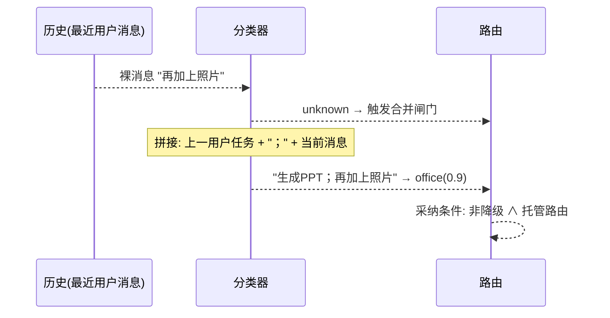
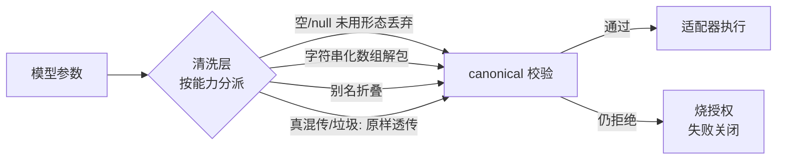
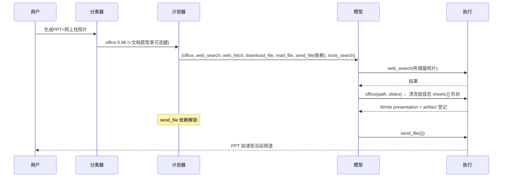
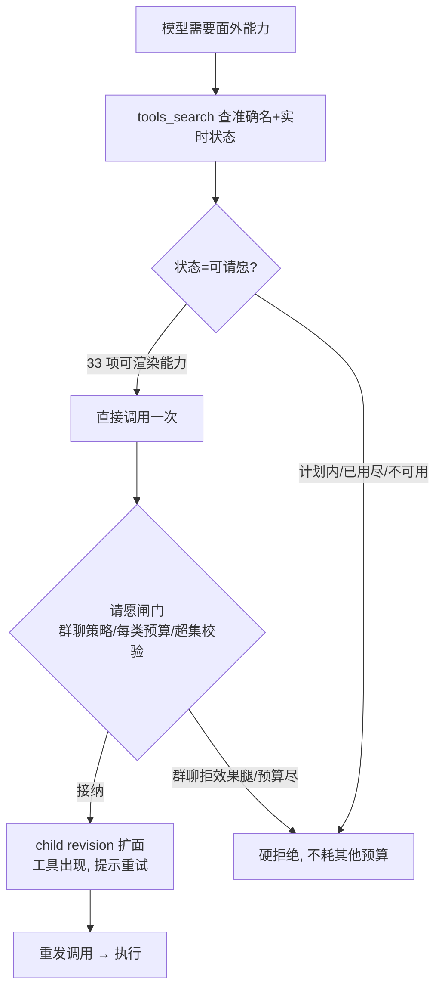

# 语义工具路由：确定性与灵活性设计（2026-08-26）

> 范围：本文记录 2026-08-26 针对"丢工具 / 少工具 / 同一任务路由结果不一致"
> 三类生产故障所做的一轮机制级改造，覆盖：`tools_search` 发现元工具、
> 任务原型能力束（由组合伴随腿泛化）、任务级意图合并、请愿机制扩展（检索 + 效果类）、
> 一次性授权与参数清洗层。前置设计见
> [semantic-tool-routing-design-zh.md](semantic-tool-routing-design-zh.md)。
> 体系化的原理总览（架构图、生命周期状态机、请愿与投递时序）见
> [semantic-tool-routing-principles-zh.md](semantic-tool-routing-principles-zh.md)。

## 1. 背景与故障分类

### 1.1 故障实录

同一台桌面助手、同一个请求「生成庆祝我家布偶宝宝5岁生日的ppt，没有照片，
网上随便找一下布偶照片」，在一天之内路由出三种不同的工具面：

| 轮次 | 分类结果 | 渲染面 | 结局 |
| --- | --- | --- | --- |
| 07:20 | office 0.86（树裁决 browser 0.90 被交叉校验否决） | office, knowledge_search, memory_recall | office 参数形状被拒 → 授权烧毁 → 模型乱试 generate_pdf/send_file → 任务死亡 |
| 10:38 | office 0.86（树裁决 web_fetch 0.42 弱） | 含 generate_pdf 的面 | 模型幻觉 generate_ppt 工具名，找不到 PPT 能力 |
| 早些时候 | browser / pdf 等不同主标签 | 各不相同 | "当前能力目录未覆盖这项请求" |

### 1.2 根因归类

三类症状对应四个机制缺陷：

1. **计划是"单样本分类"的函数，不是"任务"的函数**（确定性不足）。
   embedding 分数在边界上抖动、树裁决是单发 LLM 调用，分类每次赌一次，
   计划就跟着每次不一样。
2. **封闭面假设模型能猜对工具名**（灵活性不足）。面外能力只能靠盲猜
   准确拼写来请愿；猜错（`generate_ppt`）或不敢猜（"当前工具列表没有XX"）
   就直接死。
3. **可纠正的参数形状错误烧掉一次性授权**（丢工具）。授权在准入事务中
   与执行记录同时消费，一次 `{"slides":[...],"sheets":[]}` 这样的
   schema 诱导性错误就让 office 从面里永久消失。
4. **意图按消息切分，不按任务合并**。"生成PPT"→"加上照片"→"发给我"
   是三次独立的分类赌博；分类器拿到 RecentHistory 但只用于缓存键，
   不进入决策语义。

## 2. 设计目标与非目标

**目标**：确定性 + 灵活性。同一个任务路由出同一个面（确定性）；面不完备时
agent 有一条确定性的自救路径（灵活性）。工具路由的原始目标保持不变：
*在满足任务的前提下*最小化工具上下文占用。

**非目标（刻意不动的安全骨架）**：

- 一次性授权（one-shot grant）：任何调用尝试——包括被拒绝的——都消费
  授权。这是防参数探测的刻意设计，见 §7。
- 效果边界与回执（receipt）语义：外部效果的完成、未知、等待回执三态
  不变。
- 群聊最小权限：群聊上下文对本地管理类能力的拒绝不变。
- 计划不可变性：已发布计划不回写，所有变更走子修订（child revision）。

## 3. 总体架构

```mermaid
flowchart TD
    U[用户消息] --> C0[分类入口<br/>classifyIMExecutionProfileAndSemanticContext]
    C0 --> C1{裸分类可用?}
    C1 -- 是 --> N[需求解析<br/>imSemanticIntentRuleSet]
    C1 -- unknown/降级 --> C2[任务级意图合并 P3<br/>最近用户任务+当前消息 重判一次]
    C2 -->|落回托管路由| N
    C2 -->|仍不可用| L[legacy 聊天面]
    N --> N2[任务原型束 P2<br/>大类任务恒带可选伴随能力束]
    N2 --> P[ToolPlanner<br/>必需检索腿才拴住 generate]
    P --> G[InvocationIssuer<br/>一次性授权]
    G --> R[CatalogRenderer<br/>+ tools_search 元工具 P1]
    R --> M[模型]
    M -->|调用面内工具| E[受管执行<br/>清洗层→canonical→adapter]
    M -->|调用面外名| Q{请愿闸门<br/>§4.5 泛化拉取}
    Q -->|可请愿名+预算+非群聊(效果腿)| X[child revision 扩面]
    Q -->|不可用/预算尽| D[硬拒绝]
    M -->|不知道有什么工具| TS[tools_search<br/>只发现不授权]
    TS --> M
    X --> R
```

关键不变量：分类只决定"能力结果"（capability outcome），不决定工具名；
工具名、schema、授权全部来自宿主可信注册表。

## 4. 机制详解

### 4.1 分类交叉校验（本地 L2 vs 树裁决）

**问题**：树裁决（L3 LLM）是单发调用，会把 PPT 请求裁成 browser 0.90。
迟到裁决还会写进缓存，把错误路由持久化（缓存投毒）。

**原理**：本地 embedding（L2）与树裁决互相证伪，而不是后者覆盖前者。
拒收条件（`verdictContradictedByLocal`，`corelib/intent/classifier.go`）：

```
本地领先者分数 ≥ 0.80  且  本地领先 − 裁决对应本地分 ≥ 0.15  且  非声明组合对
```

满足则裁决被拒（同步路径回退 L2 提示 + 后台重裁；迟到裁决不写缓存）。
实测基准：PPT 文本本地 office=0.855 vs browser=0.675（差 0.180），落在
拦截区。声明组合对（office×lookup 等分类学白名单）豁免——两条腿本就该共存。

**合成复合的置信度取两半较强者**：L2 模糊升级后，树裁决 + 本地半边
合成声明组合时，合成结果的置信度取 `max(树裁决分, 本地半边分)`——
任一权威强支持该组合即可保持托管。取 min 会把结果拖进地板下
（2026-08-25: 0.950+0.683→0.68，丢失 generate）；只取树分则是镜像
缺陷（2026-08-26: 树 web_fetch 0.599 + 本地 office 0.855→0.60，
低于 0.70 树地板，同一 PPT 请求退化到 24 工具 legacy 大杂面，
"搜索工具又没了"）。

### 4.2 任务原型束（P2，2026-08-27 从"确定性伴随腿"泛化）

**问题**：office/pdf 轮次是否带 web_search，取决于 Secondary 标签的分类
置信度——这是抖动源，也是"pdf 工具几轮后找不到"的直接原因。同一缺陷
在随后三轮事故里反复出现：小面（只有产出腿）逼着模型为 fetch、
download、read 这些**几乎必然要用**的伴随能力逐腿走请愿，每一腿都要
猜名字、烧预算、等 child revision——小面逼出的依赖链是近三轮事故的
公共根因。

**原理**：任务原型（archetype）→ 能力束（bundle）。束键命中束表
`semanticArchetypeBundles` 时，需求解析层**无条件**把伴随标签的规则
模板追加为一束**可选需求**（`Required:false`，offer 不是义务）。束键
通常就是主标签；唯一例外是查找 primary（search/live_data/web_fetch）
且分类声明了文档产出（office/document_generate）的复合轮——它按文档
原型扩束（§4.22）。同一请求永远路由出同一个面；多几个 schema 换
"高频腿不赌分类运气"。确定性不再靠缩小面，而靠束表固定 + 预算/围栏
已有机制。

束表（束键 → 伴随标签）：

| 原型（primary） | 伴随标签 | 覆盖的高频腿 |
| --- | --- | --- |
| office、document_generate（文档产出） | search、web_fetch、file_download、file_read | 检索/抓页/下载素材/读本地文件 |
| search、live_data、web_fetch（检索研究） | web_fetch、search（互带） | 搜完读页、读完补搜 |
| file_read、file_write、document_read（本地文件） | file_read、file_write | 读写配对 |
| shell_command、delegate_task（命令/编程） | file_read、file_write | craft-and-run 读写迭代 |
| browser、computer_use（桌面自动化） | screenshot、app_launch | 观察屏幕、启动目标应用 |

四条设计约束（全部有 pin 测试）：

1. **束成员从规则集派生**：束表只装标签，需求来自
   `imSemanticIntentRuleSet` 的模板——不允许再出现手工近似能力表
   （§4.18 的教训）；束表引用的每个标签都被 pin 测试钉在规则集上，
   漂移即红。
2. **预算在模板，同能力取 max**：伴随腿的 repeat sibling 数取模板的
   MaxInvocations（search 5、web_fetch 5、file_download 3、无声明则 1）。
   同一能力被多处提供（声明标签模板 + 束模板）时，有效预算是各来源的
   **最大值**而非先到先赢：束模板预算更高时把缺失 sibling 原地补进既有
   族（保留其 ID 基与 qualifier，补齐部分保持 `Required:false` 的可选
   束供给）——分类器在 live_data 与 search 之间的抖动不能再改变
   web_search 的配额（2026-08-28 PPT 轮，§4.21）。补齐部分是天花板不是
   义务：紧规划预算先砍可选 sibling，Required 的第一次调用永远保住。
3. **投递腿不入束**：束刻意不含 `artifact.deliver.*`——投递由产出标签
   自己的规则携带，按计划 DAG 相位解锁；束带投递会复制腿并模糊
   生产者/消费者相位边界（扩展函数对截图这类"产出+投递"配对的标签
   也只借生产半边）。
4. **bash/delegate 不入束**：通用兜底腿不是任何原型的成员，且请愿
   已覆盖——**束覆盖高频头，请愿覆盖长尾**（§4.5），两者分工不重叠。

去重按 capability（不限 qualifier）：分类已声明的能力（如 search 轮
已带 information.search.web）束不重复追加**第二个族**——同一能力永远
只有一个族，否则同一适配器两个授权会在渲染时撞稳定函数名；束内互带的
重复（search 束里 web_fetch 与 search 互带）同样被去重吸收。预算差异
不另立族，而按约束 2 的 max 规则原地合并。EvidenceIDs 统一为
`intent:archetype_bundle`，同一分类两次展开的需求序列逐字节一致。

**关键的 planner 联动**（沿用伴随腿时代的规则）：planner 原本把 *所有*
检索选择拴为 `document.generate.file` 的前置（天气 PDF 必须先搜后
生成）。若可选束腿也拴进去，纯内容 PDF（"把这段文字做成PDF"）会被一
个永不被调用的可选 search 死锁。因此 `attachLookupGenerateDependencies`
保持**只有 Required 的检索需求才拴住 generate**：

**草稿→修订链（office×2）**：office 写盘带 2 次预算（写框架→下载素材
→插图重写是文档任务的自然工作流，2026-08-26 生产：照片在首次写盘后
才落地，单次授权挡住了修订）。配套两条**族语义**修复——repeat
family 的构件身份是整个族而非单次调用：投递绑定第一个 sibling 时，
消费匹配按族取**最新** artifact（`consumePlannedArtifact`）；路由状态
存储的消费者校验同样按族比对，否则修订版 artifact 被判孤儿、retire
报 `route_state_corrupt`。另外 `send_file` 在没有待投递 artifact 时
（上游写盘被拒后重试）曾把 `sql: no rows in result set` 原样抛给
模型——broker 边界现翻译为领域拒绝"先产出或获取构件再投递"。

```mermaid
flowchart LR
    subgraph 天气PDF轮（检索=Required）
      S1[web_search<br/>Required] --> G1[generate_pdf]
      G1 --> D1[send_file]
    end
    subgraph 纯内容PDF轮（检索=Optional 伴随腿）
      G2[generate_pdf<br/>不被拴住]
      S2[web_search<br/>可选, 不阻塞]
      G2 --> D2[send_file]
    end
```

碰撞规避：分类已声明检索腿（search/live_data 在 Secondary）时不重复追加，
否则同一适配器两个授权会在渲染时名字冲突。束表只覆盖高频腿以控制
schema token 成本：office 轮最终面 ≈ office + send_file + web_search +
web_fetch + download_file + read_file + tools_search（约 8 个 schema）。

### 4.3 任务级意图合并（P3）

**问题**：分类器按单条消息决策。续轮消息（"再加上照片"、"发给我"）语义
不完整，裸分类只能赌。

**原理**：确定性回退，不是新状态机。



约束：

- 只在裸分类 unknown / 降级 / 非能力标签时触发——清晰新任务零影响；
- 合并输入只取 user 角色历史（assistant 文本不进分类输入），各截 120
  字、总长 300 字；
- 当前消息超过 120 字不合并（长文本自含意图）；
- 采纳的 Reason 带 `task-context merge` 标记，审计可辨。

### 4.4 tools_search 发现元工具（P1）

**问题**：封闭面假设模型能盲猜准确工具拼写。请愿机制是被动的——猜中名字
才触发；弱模型猜不中。

**原理**：把"猜名字"变成"查名字"。每个托管面固定渲染一个只读元工具：

```
tools_search({"query": "生成ppt并网上找照片"})
→
- office — Write a spreadsheet (.xlsx) or presentation (.pptx)... [已在当前工具面]
- web_search — Search the public web. [可请愿：直接调用一次]
- bash — Run one local command... [可请愿：直接调用一次]
```

- 发现≠授权：查询不产生任何授权，授权仍只来自计划或请愿；
- 确定性：宿主维护的中英关键词目录（~37 个稳定名），无 LLM、无网络；
- 状态实时：已在面内（surface.grants）/ 可请愿（§4.5 泛化后的全量
  可渲染能力）/ 按计划路由提供 / 本轮不可用；
- 无授权但有三道放行：`IsToolAllowed`（渲染过滤）、
  `IsToolAllowedForPromptProfile`（light 档位）、`IsToolCallAllowed`
  （调用准入）都按名字显式放行 tools_search——它是宿主直接执行的只读
  元工具，不持有授权，但任何一道闸门按"无授权即拒绝"处理都会让它在
  生产路径上隐形（2026-08-26 review 发现）。
- 有轮次预算（4 次）：发现改变不了工具面。2026-08-26 生产中一次性授权
  被烧毁后模型连续 8+ 次 tools_search 空转，预算到顶后宿主回复确定性
  重定向文案（"用已列出的工具收尾，明说剩余未完成项"），终结螺旋。
  计数器挂在回调上，与授权无关，超支不消耗任何 grant。

### 4.5 请愿机制：从白名单到泛化拉取（2026-08-27 重写）

**问题（原设计）**：请愿只开放 5 个手写名字（web_search/web_fetch/
bash/delegate_task/download_file），且要过意图分类学审批（declared
composite pair / Secondary 声明）。这是 harness 在替 agent 判断"你该
用什么、你要这个合不合理"——计划一旦欠渲染，其余能力 agent 永远拿
不到，只能放弃或空转。

**原理（分工原则）**：**agent 判定"做什么、怎么做"；harness 只提供
服务和确定性安全边界**。请愿因此泛化为：*凡计划器在当前上下文能渲染
的能力，agent 都可按名请愿一次*（33 个名字，`semanticPetitionable
Capabilities`）。授权判定只剩三道确定性闸门，没有任何意图判断：

| 闸门 | 语义 |
| --- | --- |
| 群聊策略 | effectful 请愿在 group policy 上下文直接拒绝（不先授权再失败） |
| 每类每轮 1 次预算 | 只读类 / effectful 类各自独立，防请愿风暴的限速器 |
| 严格超集校验 | `validateSemanticPetitionExpansion`：父选择原样保留，新增选择 ⊆ 标签模板 need |

支撑机制：

- **标签解析从规则集派生**（`semanticPetitionLabelForCapability`）：
  唯一 required 模板恰好是该能力的标签优先；多标签背书按
  search > live_data > webfetch 偏好序再按标签名字典序。扩面通道
  （`petitionExpandSemanticCallSurface` + child revision）与标签无关，
  对规则集里任何标签都成立——泛化只是拆掉入口处的两张手写表。
- **只读/effectful 按标签集划分**（`semanticPetitionReadOnlyLabels`，
  10 个只读标签）：未列标签默认 effectful——新增规则标签永远不会
  意外继承只读闸门（fail-closed 的方向反不得）。
- **漂移靠测试钉死，不靠人肉同步**：pin 测试断言可请愿名 ⊆
  tools_search 目录（可发现才谈得上可请愿）、每个可请愿能力都能从
  规则集解析出背书标签、只读/effectful 分界、rendered/retired 名字
  不算请愿。目录或规则集漂移直接变成测试失败，而不是生产上的
  死路。
- 进入条件刻意保守：legacy 别名（list_directory 等，受管目录已
  下架）、无规则标签的隔离能力（send_im_text）、无稳定渲染名的
  （trusted document read、tts_local、channel dispatch）留在映射外，
  fail closed。
- **bash** 家族预算 8 次调用——"写脚本→跑→改→重跑"是迭代的；
  **delegate_task** 是"自主造工具"的受管通道（编码子代理拥有完整
  shell/skill），每轮 1 次。
- 预算只在闸门*接纳*后消费；扩展规划失败（如群聊拒绝 provider）
  已接纳的请愿预算不回滚（与一次性授权语义一致）。

### 4.5.1 原设计存档

初版请愿只开放只读检索腿、只认分类学声明组合对；第二版加入效果腿
（bash/delegate_task）但保留 5 名白名单与意图审批。两处都在 2026-08-27
的泛化中拆除，原因如上：它们是 harness 越位判断，不是安全边界。

### 4.6 一次性授权与参数清洗层

**问题**：一次性授权在准入事务中与执行记录同时消费——包括"参数形状错、
适配器根本没跑"的情况。而渲染 schema 本身会诱导这些错误：

- office schema 同时声明 sheets 和 slides → 模型把不用的半边填空数组
  `{"slides":[...],"sheets":[]}` 或字符串化 `"slides":"[...]"`；
- bash 的 `timeout_seconds` 收到字符串 `"60"` 或别名 `timeout`；
- download_file 只收 `url`，模型给 `{"link": ...}`。

**原理**：不动授权语义（§7），在 canonical 校验**之前**加宿主清洗层，
把"可纠正的形状"归一后再校验——与 `generate_pdf` 既有的清洗先例一致：



覆盖：office（sheets/slides 互斥形态）、bash（timeout）、write_file
（file_path/text 别名）、download_file（单 URL 值提升 + 目的地装饰键
丢弃——save_path/filename 等由宿主绑定目的地，语义上是纯装饰；
第二个 URL 形状的值仍属歧义，透传拒绝），以及当前通道
delivery 适配器的**空信封**规则：`{"arguments": "{}"}` 这种零信息序列化
失误洗为 `{}`（2026-08-26 生产中它烧掉 send_file 一次性授权、两轮任务
空转）；但伪造的 `artifact_id`/`path` 或非空信封一律透传给 schema
拒绝——模型必须学到"不能用参数左右投递"。
原则：**可纠正的归一，有歧义的透传**——两个非空形态混传、workdir 这类
会改变语义的键，一律原样进入校验并失败关闭。

### 4.7 交付完成即干净收尾（clean EarlyStop）

**问题**（生产 2026-08-26）：PPT 已写盘、send_file 已投递之后，循环还要
再发一次 LLM 请求，只为让模型说一句收尾总结。这次调用没有任何新信息，
却付全额延迟（当轮 ~19s）；上游故障时更糟——该轮它对着 502 重试了
~65s，把一次已经交付成功的轮次拖成 error，只能靠宿主附件恢复机制事后
兜底。

**原理**：交付即目标达成，收尾总结是可选产物，不应拿已完成的交付去
冒险。`EarlyStopper` 约定扩展为两种停止形态：

- **错误停止**（非空 errCode，如每日预算）：`Error=errCode, HardExit`；
- **干净停止**（空 errCode）：无 Error、非 HardExit，循环立即结束，
  Text 为空时回退到最后一条非空助手文本。

触发判定是确定性的（`semanticTurnDeliveryComplete`）：**计划内所有
REQUIRED selection 均已完成，且其中至少一个是已完成的当前通道交付
适配器**（file/image/voice）。optional 腿（环境检索、确定性伴随检索）
是"可用可不用的 offer"，不参与完成判定——否则该机制在实际轮次中
永远不触发（2026-08-26 生产轨迹：ambient 腿几乎从未被调用）。两个
方向都刻意排除：

- 计划耗尽但从未交付（模型放弃了交付）→ 不停，让循环继续；
- 交付完成但计划还有未完成项（"发给我然后再提醒我"）→ 不停。

效果：每次交付型轮次省一次 LLM 往返，且交付成功后的轮次对上游宕机
免疫。

### 4.8 投递状态语义：返回值即确认

**问题**（生产 2026-08-26）：`send_file` 成功时返回 "Artifact prepared
for delivery"。这在技术上准确（文件在应答定稿时随回复附带，回执由
`OnSettled` 异步落定），但模型把 "prepared" 读成"还没投递"——于是去找
不存在的"确认投递状态"工具，并向用户输出"PDF已生成并准备投递"这种
不确定措辞。

**原理**：对模型而言，工具返回值就是状态确认；交付适配器成功即投递
承诺成立，后续传输由宿主保证（失败有恢复路径兜底）。返回值改为明确
语义："Delivery committed … this result IS the delivery confirmation,
the step is complete. Report the file as sent; no further tool or
confirmation step exists. Do not say the file was only prepared or is
pending." 模型侧的"状态确认"需求由措辞本身满足，不引入新工具。

### 4.9 检索调用预算与"已消费≠不可用"的拒绝语义

**问题**（生产 2026-08-26，PPT 第三轮）：模型在一个批次里并发两次
web_search，第一次成功（8 条结果），第二次被执行策略拒绝。拒绝文案是
通用的"not allowed by the current execution policy"——模型把它读成
"web_search 本轮不可用"，**无视自己手里已有的 8 条结果**，宣布"无法
搜索网络图片"，交了一份没有照片的 PPT。

**原理**：两个独立缺陷，分开修。

1. **预算过紧**：研究型任务（"全网搜索X"）天然需要"宽查询 + 1~2 次
   细化"。`LabelSearch`/`LabelWebFetch` 规则加 `MaxInvocations: 5`
   （与 bash=8、fs_read=12 同一 repeat-sibling 机制，只读、有界、
   计划节点可见；预算不是限制灵活性，而是计划可确定性渲染与审计
   回放的前提）。
2. **拒绝文案误导**：一次性授权已消费的工具被拒时，文案必须承认前次
   成功——"already ran successfully … that earlier result still
   stands … do not report that capability as failed or unavailable"。
   这与核心循环 `consumedGrantToolCallDeniedMessage` 对未渲染名字
   的处理同一原则，此前在执行策略闸门这一路径上缺失。文案刻意避免
   "consumed/消耗" 这类机制黑话（统一为 "reached this turn's usage
   limit"）：模型会把黑话学给用户，甚至无证据编造"某工具已被消耗"
   （2026-08-26 生产：模型宣称 web_fetch 已消耗，实际从未调用它）。
   围栏另加两条禁令：不得向用户叙述授权/额度机制；没有拒绝消息为证
   不得断言工具状态——"没试过的可请愿名字就是可用的，先试再下结论"。

3. **散文必须与机制一致（元原则）**：模型的工具面认知由 prose 主导，
   而地面真相是每轮请求里的实时工具列表。围栏曾写 "one-time grants"
   与 repeat-sibling 预算直接矛盾，模型信散文不信列表，没试就宣布
   "web_search 不能再用"（2026-08-26 第四轮 PPT）。现围栏与工具描述
   统一为实况语义："列表即真相——列出的名字即可调用，仍在列表就可
   以再调；成功后名字可能短暂离开并为后续步骤重现；检索工具本轮
   预期使用多次"。**第二实例**（2026-08-27）：GUI 工具面块把
   download_file 明文列入"不要凭记忆调用"黑名单，还写"没有需要另
   唤起的隐藏工具"——而请愿机制恰恰要求模型调用未列出的名字来
   触发授权，403 反爬提示和二进制建议语都在点名 download_file。
   模型服从系统提示，整轮没碰下载能力。现工具面块改为显式请愿
   例外：说明请愿通道由 tools_search 的实时状态驱动（可请愿名字
   "单独调用即请求授权"，全集见 §4.5 的 33 项泛化映射），其余未
   列出名字维持禁止。pin 测试
   `TestManagedSurfaceFenceNamesPetitionableCapabilities` 断言
   fence 通过 tools_search 教请愿、示例名在列且 download_file
   不再出现在禁用语境。

4. **面是状态机，不是静态目录——每次响应只发一个调用**：模型的训练
   先验是"静态目录、随意并发批调"，而治理面是顺序授权 DAG——同批
   第二个调用必然与第一个的结果竞争（一次性授权已耗、epoch 被请愿
   扩面废止、send_file 的依赖授权尚未签发）。2026-08-26 四轮生产
   故障（双 web_search、web_fetch 批内 stale_surface、generate+send
   同批）全是这一个错配。围栏现在明说 "Call ONE tool per response:
   the list is a state machine, not a static catalog"；stale_surface
   的拒绝文案同步改为可操作指引（"工具面因批内另一个调用已变化，
   请单独重发此调用"）。

同批并发 N 次调用一次性工具时，只有第一次能成功（授权语义不变，
§7）；预算 3 让后续轮次的名字重现，文案让模型正确使用已有的第一次
结果。

### 4.10 无进展熔断（no-progress circuit breaker）

**问题**（生产 2026-08-26）：模型在"工具被消耗"的幻觉下交替重试
web_fetch / web_search / tools_search——每次失败的工具名都不同，
同工具失败计数器（上限 8/12）永远不触发，轮次空转 12+ 次迭代、
~20 分钟长思考，直到 maxIter 兜底。

**原理**：换个维度计数——不看"哪个工具失败"，看"本轮迭代有没有任何
一次调用成功"。连续 5 个迭代零成功（全失败、全被拒、全被围栏拦截）
即判定 dithering，强制收尾：返回最后一条非空助手文本（没有则给标准
停止文案），HardExit。阈值 5 远宽于合法自救路径（请愿/发现最多 1~2
个无成功迭代），不会误伤正常恢复。

### 4.11 领域错误翻译、修订预算与投递的族语义

**问题**（生产 2026-08-26，PPT 后续轮）：三个独立但同源的缺陷。

1. `send_file` 在"还没有任何已产出 artifact"时把存储层的
   `sql.ErrNoRows` 原样抛给模型——模型收到裸 "sql: no rows in
   result set"，既无法判断是自己顺序错了还是系统坏了，还可能把
   数据库错误学给用户。
2. office 写盘授权只有 1 次：模型按"先草稿、后插图修订"的自然
   工作流操作时，第二次 office 调用被拒，与 §4.9 修复前的
   web_search 是同一类"预算过紧烧掉合法工作流"。
3. 给 office 加上修订预算后揪出潜伏 bug：草稿和修订是同族
   （`RepeatFamilyID`）兄弟，但 `consumePlannedArtifact` 与
   `routeArtifactHasCurrentConsumer` 按**单个工具名**绑定
   生产者/消费者——投递绑定到草稿 sibling 时，发出去的是旧版；
   更糟的是修订版 artifact 被判孤儿，收尾 retire 报
   `route_state_corrupt`。

**原理**：

1. **错误必须在领域语言里说话**（与 §4.9.2 同一原则）：存储层
   错误翻译为领域拒绝 `artifact_dependency_missing: no produced
   artifact is waiting for delivery; produce or acquire the
   artifact first`。模型得到的是可操作的顺序指引（先产出再投递），
   而不是它无法行动的内部实现细节。
2. **修订是自然工作流，预算应容纳它**：`LabelOffice` 写盘规则
   `MaxInvocations: 2`——草稿一次、修订一次，与检索腿 5 次同理，
   是有界计划节点内的余量，不是无限放开。
3. **投递绑定族，不绑定单次 sibling**：同族兄弟是同一逻辑能力的
   连续授权，用户语义上"把那份 PPT 发给我"永远指最新版。
   `consumePlannedArtifact` 按 `RepeatFamilyID` 匹配生产者并取
   **最新** artifact；`routeArtifactHasCurrentConsumer` 同样按族
   判定孤儿。端到端测试
   `TestIMSemanticOfficeRevisionDeliversNewestFamilyArtifact`
   用真实 workspace 打穿"草稿→修订→投递"，断言发出去的是
   sibling #02 的 artifact ID。
4. retire 失败从静默降级为 `log.Printf` 诊断（模型文案不变）——
   这类一致性异常罕见但排查成本高，日志必须留痕。

### 4.12 授权绑定执行：受理前拒绝不消耗 + 内容扫描不是能力边界

**问题**（生产 2026-08-26，PPT 第五轮，用户判定"恶化了"）：一轮内
三类授权被烧，工具逐一消失，最终无进展熔断收尾、PPT 未投递。

1. office 第一次调用把 `slides` 传成 JSON 字符串，且字符串内部本身
   就是畸形 JSON（`title` 被放到对象括号外）。清洗层无法枚举任意畸形
   形状，透传后 `parameter_schema_invalid` **烧掉授权 #1**——这是
   "参数滑一下烧一次性授权"事故类的第 4 起（`sheets:[]`、`"60"`
   字符串超时、空信封之后）。前三起靠清洗层逐个形状吸收，是打地鼠。
2. web_fetch 5 次 sibling 预算全烧在**失败**上：401、403、403，外加
   两次 `trusted_web_fetch_legacy_name`——抓取二进制图片 URL 时，
   fetch 层自己返回的建议语"[二进制内容…请使用 save_path 参数下载]"
   含有 `save_path`，被自己的注入守卫整页拒绝。**自己生成的提示文本
   触发自己的守卫**，错误名还是模型无法行动的黑话。
3. 授权烧光后 web_fetch 离开工具面，请愿每类一次已耗，模型收到
   "Do not retry" 硬拒绝，任务实际需要的图片获取能力在本轮永久消失。

**原理**：

1. **授权绑定执行，不绑定尝试**（§7 不变量 1 的修订）。参数校验是
   受理（admission）的一部分：受理拒绝意味着什么都没执行，没有效果
   需要审计或恢复，grant 保持存活、工具保持渲染，模型改正参数后用
   同一 grant 重试。"防参数探测"不成立——schema 全文本来就在 prompt
   里。此前"invalid 也消费"买到的只有打地鼠。协调路径与 journal
   兼容路径行为一致；同 call ID 重放因校验确定性而稳定，无需持久化
   拒绝记录。适配器已运行的失败（401/403）照常消费并推进 sibling——
   那次 I/O 必须拥有持久执行记录。
2. **路由层才是能力边界，内容扫描不是**。抓取的网页文本提到
   `web_fetch`/`download_file`/`save_path` 不会造成任何能力提升——
   每次调用都过渲染名单与请愿闸门。token 扫描的唯一实际效果是误伤
   合法页面和宿主自己的建议语。两个投影函数（web_fetch/web_search）
   的工具名扫描整体拆除；`[file_base64`/`[voice_base64` 投递令牌
   检查保留（防通道协议混淆，有真实功能）。
3. 拒绝文案同步说明新语义："refused before execution, the tool
   remains available: do not retry the same arguments, call it again
   with arguments that match its rendered schema"。

**验证**：`TestCoordinatedSemanticParameterRejectionKeepsGrantLive`
（旧名 …RetiresOpaqueFunction，pin 的正是旧消耗语义，已重写）断言
invalid→grant 存活→工具可见→改正参数后同一 grant 执行成功——这是
本机制的变异检验：回退改动则 retry 得到 `invocation_grant_replayed`。
`TestSemanticWebFetchProjectionPassesToolNameMentions` 用生产的
二进制建议语原文 pin 守卫不再误伤、投递令牌检查保留。

### 4.13 宿主建议语必须按当前渲染面书写
**问题**（生产 2026-08-26，PPT 第六轮）：守卫拆除后，模型三次抓取
图片 URL 都拿到了 fetch 层的二进制建议语——但建议语是按 legacy 面
写的："如需下载请使用 save_path 参数"。语义面的 web_fetch schema
只封闭接受 `url`，模型照做必被 schema 拒绝；且建议语只字未提
`download_file` 这个就在请愿白名单里的真实能力。模型的合理推论是
"无法直接下载图片"，最终交了一份纯文字 PPT（文件本身已成功投递，
守卫与非消耗修复均生效）。

**原理**：宿主写给模型看的每一句指引，都必须用**当前渲染面里真实
可调用的名字和参数**书写，否则就是引导模型撞 schema。跨层复用的
文案（websearch 层同时服务 legacy 面）不能直接透传到语义面——
适配器负责改写。二进制投影现在替换为："web_fetch 只抽取文本、本面
没有 save_path 参数；要落盘请单独调用 download_file（未列出，
调用即请愿授权）；要把下载的图片插入 .pptx，请愿 bash 用
python-pptx 脚本"。pin 测试
`TestSemanticWebFetchProjectionBinaryAdvisoryNamesDownloadFile`
用生产建议语原文断言改写发生、legacy 文案消失、源 URL 保留。

**第二实例**（2026-08-27，同任务第八轮）：download_file 撞 403 反爬时，
共享下载层（websearch/download.go）的报错建议语直接透传到托管面——
"仍失败则用 download_file(url, save_path, via_browser=true)"，而托管
schema 只封闭接受 `url`。模型照做，收获 parameter_schema_invalid。
现 `semanticTrustedAcquireRemoteError` 在适配器边界剥掉 legacy 建议
括号、改写为托管面可执行的指引（请愿 browser 完成人机验证→同参数
重试）；无 legacy 建议的错误原样透传。pin 测试
`TestSemanticTrustedAcquireRemoteErrorRewritesLegacySuggestion`。
同原则的系统提示侧无遗漏：via_browser 攻略段落只在 `!managedSemantic`
的 legacy 提示里渲染（im_system_prompt_gui_sections.go）。

### 4.14 待答轮的任务连续性：绑定 fail-open 与合并仲裁

**问题**（生产 2026-08-27，PPT 第七轮，48 迭代空转）：助手在上一轮
结尾问了"名字/风格/想说的话"，用户答"1. 布娃 2。可爱风 3。没有"
（16 字）。待答检测链上有两道 LLM 闸门——历史保存时的"这是否
待答问题"与轮首的"这是否该问题的答案"——当夜 hub 超时，两道闸门
都 **fail-open 到"没有待答"**：pending 未存/未绑定。于是 16 字答复
被裸分类，树裁决给出 coding@0.80，整轮换到**编码面**
（build_verify/read_file/write_file/git_status）——没有 office、
没有 web_search、没有 download_file。模型请愿 bash 手写 python-pptx
脚本，又撞上 Windows 引号/中文路径 bug 烧光 bash 预算，然后在
tools_search 的"按计划路由提供"误导下反复调用本轮根本不存在的
office，空转到收尾。

**原理**：

1. **确定性结构不需要 LLM 来行动**。助手刚问完问题、问题与当前历史
   绑定新鲜——这是宿主自己知道的结构事实；LLM 只是"检测隐性任务
   切换"的精炼器，它的失败必须降级到启发式，而不是降级到失忆。
   两道闸门改为 fail-open 到**连续性**:prompt 闸门 LLM 失败→按
   启发式候选结果存 pending;answer 闸门未分类→按新鲜 pending
   绑定。旧注释"保留旧任务上下文比让主 Agent 解释含糊答复更令人
   惊讶"低估了代价：主 Agent 看到的是上下文，但**路由器看到的
   只有裸文本**——失忆的答复轮在分类层就已经死了。
2. **误绑的代价由下游仲裁兜底，漏绑的代价是整轮死亡**。待答轮
   （AskUserContext/PendingUserReplyContext 非空）且裸分类置信度
   <0.85 时，无条件跑任务上下文合并（§4.3 的 P3 机制，不再限于
   裸分类失败才触发）；裸分类高置信（明确的任务切换）仍然胜出。
   16 字答复没有可信的独立意图，这是它的语义属性，不是分类器
   能修好的。
3. **合并输入的卫生**：宿主注入 user 角色的 "[系统]" nudge 不是
   任务意图，`recentUserTaskTexts` 过滤之。

**验证**：`TestPendingUserReplyAnswerAmbiguousIntentBindsByFreshPending`
（旧名 …KeepsPending,pin 的正是旧的 park 语义）重写为未分类必绑定
并恢复绑定上下文。

### 4.15 tools_search 状态必须对本轮诚实

**问题**（同上第七轮）:tools_search 把 office 标为"[未列出：按
计划路由提供]"——但本轮是编码面，office 既不在计划也不在请愿
白名单。模型把含糊状态读成邀请，八次调用 office 全部撞请愿闸门
的硬拒绝。

**原理**：发现层广告的每一种状态必须是**本轮可执行**的，且与
请愿闸门逐字一致。状态改为六档：已在工具面 / 本轮授权已用尽
（retired，请愿闸门同样拒）/ 请愿机会已用完（按类预算）/ 可请愿 /
已列入本轮计划（前置步骤完成自动解锁，**不要直接调用**）/ 本轮
不可用（不要调用）。计划归属按 plan selections 的
AdapterName/MatchedCapability 判定，不再用一句"按计划路由提供"
覆盖所有未知。pin 测试
`TestSemanticToolsSearchStatusesAreHonestAboutThisTurn` 与
`TestSemanticToolsSearchRetiredGrantIsNotPetitionable`。

### 4.16 Windows shell 的 argv 保真：绕过 cmd 引号规则，不靠转义

**问题**（同上第七轮）：模型请愿 bash 自救（python-pptx 插图），8 次
授权烧在 0 次成功执行上。链路是 `exec.CommandContext(ctx, "cmd",
"/c", command)`：Go 的 `os/exec` 在 Windows 用 `syscall.EscapeArg`
拼 CreateProcess 命令行，内层 `"` 被写成 `\"`——而 cmd.exe 不认识
`\"`，转义引号原样漏进子进程 argv。于是
`python -c "import pptx..."` 收到带字面引号的源码（SyntaxError）、
`cd "F:\个人介绍"` 变成 `cd \"F:\个人介绍\"`（语法不正确）、带引号
的中文绝对路径进了 argv 被拼到 cwd 后面（路径 doubling + GBK 乱码）。

**原理**：Windows 上 cmd 的引号规则只认"首尾一对引号"，正确的做法
不是寻找更聪明的转义（不存在），而是**绕开 EscapeArg**：
`SysProcAttr.CmdLine` 按 `cmd.exe /d /s /c "<command>"` 原样直传
CreateProcess——`/s /c "..."` 让 cmd 恰好剥掉外层一对引号、内部
逐字执行，命令行全程 UTF-16，中文路径不过代码页。子进程 stdio 编码
由 `AppendUTF8Env` 覆盖（PYTHONIOENCODING 等，尊重用户已有设置）；
cmd 自身的 GBK 报错文本不做转码猜测（failure-closed）。三处同型
调用点（IM trusted shell、hub ExecuteReviewedHostShell、skill 沙箱
repair gate）统一到 `corelib/tool.NewWindowsShellCommand`。回归测试
用真实 Python 3.12 跑全部三种事故形状
（`corelib/tool/shell_command_windows_test.go`）。

### 4.17 文档生成的能力契约必须覆盖任务的自然产物

**问题**（2026-08-27 布偶猫生日 PPT 轮）：路由、请愿、下载全部正常
——模型请愿 download_file 成功、1.5MB 照片落盘——最终 PPT 里却是
`📸 [布偶猫照片]` 四行文字占位符。这不是模型偷懒：office 工具的
slides schema 只有 `title/bullets/notes` 且 `additionalProperties:
false`，下游 `pptx.OutlineSlide` 同样只有文本字段。**契约在类型层面
就写死了"演示文稿 = 纯文本"，模型想插图也无处可传。**

**原理**：语义路由解决的是"工具能不能到模型手上"，但工具自身的
能力契约决定"任务的自然产物能不能被表达"。照片之于相册页是任务的
固有组成部分，契约缺了它，路由再准也只能产出半成品。修复在契约层
补齐，而不是提示模型"想办法"：

- schema：slides 条目增加 `images: [{path, width?, height?}]`
  （maxItems 4，英寸为单位可选显式尺寸），工具描述明说"嵌入
  download_file 取回的照片"；
- 渲染：`pptx.OutlineSlide.Images` → GoPPT `AddImage`，横向成行
  布局，默认从文件头解宽高比等比适配槽位（`_ "image/png"` 等
  注册解码器），显式尺寸优先；图文同页时文本占上 55%、图像行
  占底部；
- 路径：`resolveOfficeSlideImages` 在渲染前把每个图像路径按
  `trustedFileWriteResolvePath` 的同一条围栏规则解析到工作区
  绝对路径——逃出工作区或文件不存在即 fail-closed 报错（错路径
  以显式失败暴露，而不是产出带空洞的成品）；缺失图像使整个写入
  失败，模型看得见、能修正；
- 门禁：schema 门禁基线登记 `slides[].images[].path` 为
  workspace-confined crossing，防止未来有人把它退回成宿主直传
  路径。

pin 测试：写出含图 deck → 读回应有恰好 1 个 image shape 且 4:3
宽高比不失真、显式尺寸生效、缺文件整写失败
（`corelib/pptx/write_image_test.go`、
`gui/semantic_office_image_test.go`）。

### 4.18 宿主服务必须派生自事实源，或被测试钉在事实源上

**问题**（2026-08-27 第三轮布偶猫 PPT）：分类、计划、请愿全部正确，
轮次仍然失败——而且是四处"近似"接力造成的：

1. `tools_search("office")` 回答 "(no matching capability)"——目录条目
   只配了关键词，**唯独没收工具自己的名字**。agent 用准确名字发问，
   宿主告诉它"这东西不存在"，而此时 office 就在本轮计划里。agent
   恐慌并烧光发现预算（4 次），后续全程裸奔；
2. download_file 只报 "Name" 不报落盘位置——结果**不可组合**：下一个
   工具（office 插图）需要路径，模型只能猜（猜了自己传的、宿主本就
   绑定并忽略的 save_path），两次撞 image_missing；
3. 图像路径校验最初放在适配器执行阶段（§4.17 初版），fail-closed 的
   同时**消耗了一次性 office 授权**——这是 §4.12 修过的"受理前拒绝
   烧授权"换了个位置复发。模型把下一次拒绝读成"office 没了"；
4. tools_search 预算（4 次/轮）把"被（1）逼出来的探索"当滥用惩罚，
   错误级联到无法恢复。

**原理**：封闭面逼着 agent 处处依赖宿主服务，所以每一处宿主服务
（目录、结果文案、校验位置、预算）都是对某个事实源的承诺；承诺一旦
是手工近似，就必然漂移成故障点——"东边修完西边坏"不是运气，是
近似列表没穷尽。收敛办法只有一条：**每处服务要么从单一事实源
派生，要么被 pin 测试钉死在事实源上**：

- 发现：条目自己的名字是最强关键词（精确 +4、子串 +2）；pin 测试
  逐条断言"每个目录条目都能被自己的名字查到"
  （`TestSemanticToolsSearchMatchesEveryEntryByItsOwnName`）——
  这条测试在故障前就会红；
- 组合：download_file 结果增加 `Path: <name>（工作区相对路径）`，
  下游工具按此引用。绝对路径仍按 §7 不泄，但**相对引用不是秘密，
  是组合的接口**；
- 授权：`semanticOfficeSlideImageCheck` 移到 canonical 阶段
  （`semanticCanonicalArguments`），缺失/逃逸路径返回带
  "remains available" 指引的详式拒绝
  （`semanticCanonicalDetailedRejection`），不消耗授权；适配器内的
  resolveOfficeSlideImages 保留为最后防线（重写为绝对路径），正常
  情况下不再有机会触发；
- 详式拒绝只绕过"参数细节收窄"的 oracle 防线当且仅当细节回显的是
  模型自己提供的值（路径）或模型本已拥有的信息（完整渲染的
  schema），不泄露服务端授权闭包。

**同一原则的后续三例**（2026-08-27 第十一、十二轮）：

- **宿主给的产物名必须可直接使用**：URL 尾段无扩展名时 artifact 落盘为
  "cat"，投影却报 "Type: image/jpeg"——模型只能脑补 ".jpg"，连撞三次
  image_missing。扩展名是下游（PowerPoint、MIME 探测）的必需信息，
  `semanticAcquireNormalizeExtension` 在落盘时按 Content-Type 补全，
  而不是让模型猜（pin：rename 保内容、已有扩展名不改、冲突回退原名）；
- **拒绝必须自纠正**：image_missing 的拒绝文本现在附带工作区根目录
  现有图片清单（`semanticWorkspaceImageHint`，仅图片扩展名、排序、
  上限 8 个），模型的下一次调用就能点名真实文件，而不是再猜两轮；
- **schema 拒绝必须带字段定位**：模型给 slide 写了文档级的
  `subtitle`，校验器明知是 `slides[5].subtitle` 越界，拒绝却被抹平成
  一句泛泛的 parameter_schema_invalid——模型盲猜三次（两次删错
  字段），触发同工具失败熔断，整轮无产出。oracle 防线在此是错配的：
  schema 本就完整渲染给模型，告诉它"哪个字段、期望什么类型"没有泄露
  任何它不知道的东西。`ParameterError` 现在携带 `Path`/`Hint`
  （`Error()` 仍返回裸 code），校验器穿路径产出
  `parameter_unknown_field: slides[5].subtitle (…)` 级拒绝；只有授权
  闭包错误（target/artifact 未授权、authorization stale）维持抹平——
  那些约束是服务端的，才是真正的 oracle 面。

**同一概念的两份手工近似必然漂移**（2026-08-28 张惠妹第三轮）：
`semanticLookupHalf` 认为查询半 = {search, live_data, web_fetch}，而
`semanticDeclaredLookupGenerateComposite` 的允许集漏了 web_fetch——
偏偏 L3 树对查询类任务的自然裁决就是 web_fetch（08-24、08-28 两次
事故的树裁决都是它）。于是树合成的 `web_fetch(0.62)+document_generate
(0.683)` 复合在下游每个门都"不是声明复合"：规划门（0.68 低于 0.78
解析线、也低于 0.70 树确认线）整个不落计划，chat 投影兜底给出搜索面
但丢掉 PDF 腿；请愿扩面又因"标签已声明、无可加"返回 added no
governed need 并烧掉本轮唯一的效果类请愿预算。修复：复合谓词的查询半
与 semanticLookupHalf 对齐（单一事实源）；声明复合对（双证据合意的
lookup+generate/visual，非 Degraded）直接进入低线规划通道——它本就是
评审过的例外（chat 投影早已对它放行）；Degraded 维持不落，超时猜测不
铸写权限。pin：张惠妹生产形状全程走通 + degraded 不规划
（`TestSemanticLookupGenerateCompositePlansBelowTreeFloor` /
`TestSemanticLookupGenerateCompositeDegradedStaysUnplanned`）。

### 4.19 投递的终点是用户，不是存储

**问题**（2026-08-27 天气 PDF 轮）：路由、授权、回执全部正常——
send_file committed、CP8 投递事件发出、文件真实落盘——用户却说
"没收到"。真相：桌面聊天的投递物化落点是 `~/.maclaw/data/files`
（宿主 artifact 仓库，用户从不去的隐藏目录），回复里只有一行
"文件已保存：C:\Users\ma139\.maclaw\..." 文本。PPT 之所以"感觉
收到了"，是因为 office 把 deck 写进了工作区——那是生产者的
副作用，不是投递。两次天气 PDF 的机制其实都成功了，失败的
是**投递的可见性**。

**原理**：本地聊天（desktop/TUI）里，"当前频道"就是用户的本地会话，
投递的终点必须落在用户看得见的地方——绑定工作区（生产者写盘的去处，
用户的心智模型里"文件就在这里"）。artifact 仓库副本保留为审计记录，
用户面物化优先落工作区（`saveFileDataForLocalDelivery`），无绑定
工作区（bot profile、分离运行）回退 artifact 目录。回执语义不变：
committed 仍意味着"已附加到本轮回复"，但现在附加的位置与用户
预期一致。pin 测试
`TestSaveBase64FileToDirMaterializesUserFacingCopy`。

**教训归仓**：这又回到 §4.18——投递路径的每一步都"机制正确"，
但整体没达成用户目标。验收投递类改动时，检查项必须包括"用户在
哪里看到文件"，而不仅是"回执是否 committed"。

**同一原则的后续**（2026-08-28 布偶猫 PPT 轮）：投递落工作区生效后
出现了双副本——office 已把 deck 写进工作区（`布偶宝宝5岁生日.pptx`），
投递物化又按 MIME 合成名写了一份 `attachment_022044_572.pptx`，同一
字节内容两行"文件已保存"。根因有二：ArtifactRef 不携带生产者的文件
名（只有 Kind/MIME/摘要），投递端只能现编名字；物化步骤不知道这些
字节早已在用户可见处。修复落在物化边界（不动 artifact 存储 schema）：
`saveFileDataForLocalDelivery` 先按 大小+SHA-256 在工作区根找内容一致
的既有文件，命中即复用该路径（`findIdenticalWorkspaceFile`），只有
真正缺失时才写新副本。pin 测试
`TestFindIdenticalWorkspaceFileReusesProducerWrite`。

### 4.20 低线受管只读分类保有托管面；请愿扩面镜像父计划的会话复用丢弃（2026-08-28）

**问题**（张惠妹轮）：分类器输出 `primary=search conf=0.69 layer=2`
（embedding 命名了家族、树不可用、非 Degraded）。规划门
`semanticClassificationPlansBelowResolverFloor` 的白名单（只读 hint ≥
0.70 / office hint / 声明复合 / 树确认）恰好不收这种形状，轮次跌回
legacy 名字路由目录——那里根本没有 generate_pdf/send_file；模型调用
generate_pdf 被通用准入拒绝后，`PetitionToolCall` 又因
`semanticSurface == nil` 静默返回 false，请愿救援完全失效。

**问题**（重庆轮）：父计划来自 `live_data+document_generate` 复合，且会话
里已有同主题查找事实——会话复用启发式
（`semanticNeedsForReusableConversationLookup`）把本轮 search 腿从父计划
摘掉。模型请愿 web_search 时，扩面重规划刻意不带本轮 userText（重规划
不受散文引导），复用启发式因空 topic 不再触发，于是 live_data 自己的
`freshness=current` 查找腿在子计划里复活——它不属于被请愿标签 search
的模板，严格超集校验器正确地拒绝了整个扩展（日志：
`adds a need outside the petitioned label`）。

**原理与修复**：

1. 低线规划门新增谓词
   `semanticSubFloorGovernedReadOnlyClassification`：非 Degraded、非树
   裁决（layer ≠ 3/23——树分数量纲不同，0.55 树采仍是噪声，归 0.70
   信号地板管）、且声明的能力标签全部是受管只读标签时，经既有的
   `semanticLookupClassificationForPlanning` 投影规划出声明的只读腿。
   轮次由此保有 semantic surface 与请愿能力；generate_pdf/send_file 等
   效果腿仍只能经请愿路径按需扩展（请愿自带预算与超集校验器作为安全
   边界）。弱效果标签（generate/office/bash）、树低分、Degraded 维持
   不落。只读标签集合收敛为单一事实源 `semanticReadOnlyGovernedLabels`，
   规划侧家族判定与请愿预算/群策略门共用，消除两处漂移。
2. 父计划把"会话复用丢弃发生过"这一宿主可信规划事实记入 replan 输入
   （`semanticReplanInput.ConversationLookupReused`）；请愿扩面重规划读到
   该记录时，对所有非被请愿标签的查找腿镜像同一丢弃
   （`semanticNeedsForPetitionExpansionLookup`），只保留被请愿标签自己
   的模板腿——模型点名要这条腿，等同于复用启发式里"明确要求刷新"的
   判断。请愿产生的 child revision 不再继承该记录：其查找腿已是发布的
   父级授权，后续扩面不得再次丢弃。校验器本身一字未改，严格超集不变量
   原样保持。pin 测试
   `TestSemanticSubFloorReadOnlySearchPlansGovernedSurface` /
   `TestSemanticSubFloorWeakEffectfulAndDegradedStayMiss` /
   `TestSemanticPetitionWebSearchOnReuseDroppedComposite` /
   `TestSemanticPetitionExpansionStillRejectsOutsideLabel`。

### 4.21 同能力预算取 max；批次内同族续跑（2026-08-28 布偶猫 PPT 轮）

**问题 A**（调用预算随携带标签漂移）：任务"生成庆祝我家布偶宝宝5岁生日
的ppt，网上找布偶照片"的分类含 live_data（而非 search）。声明的
live_data 模板把 `information.search.web` 以 `freshness=current`、默认
1 次预算带入；office 原型束的 search 伴随腿以 `freshness=reference`、
5 次预算提供**同一能力**，被"按 capability 去重"整条跳过。轨迹显示
web_search **成功 1 次**即收到 "already ran successfully earlier in this
turn and has reached this turn's usage limit"——任务还需多次检索，配额
却由"哪个标签先声明"决定，分类器抖动直接变成能力配额抖动。

**问题 B**（同族批量调用的 stale_surface 风暴，同一轮）：模型在一个
响应里批量发起多个 web_fetch（不同 URL，抓图天经地义）。批次内第 1 个
成功后 `advanceSemanticToolSurface` → `refreshSemanticCallSurfaceSkipping`
→ `invalidateEpoch()` 使整批 epoch 失效，其余调用在
`ExecuteToolCallWithContext` 被 `stale_surface` 硬拒。该轮出现 4 次
stale_surface，模型反复重发，空转烧掉约 280k input tokens。

**原理与修复**：

1. **预算取 max，不另立族**（`semanticArchetypeBundleNeeds`）。去重仍
   按 capability：同一能力永远只有一个族——freshness=current 与
   freshness=reference 是不同 qualifier 的不同需求，但两族绑同一稳定
   函数名（web_search）会在渲染面撞名，因此"qualifier 键去重、两族
   共存"被刻意否决。束模板预算高于既有族时，把缺失 sibling **原地补进
   该族**（保留其 ID 基、qualifier、polarity；该能力存在两个
   qualifier 分裂的族时不动）。补齐的 sibling 保持束供给本性
   （`Required:false`、evidence=`intent:archetype_bundle`）：声明腿保住
   Required 的第一次调用，抬高的只是天花板——紧规划预算
   （MaxSelections / schema token）按既有规则先砍可选 sibling，
   budget-1 轮仍保住那一次搜索；`attachLookupGenerateDependencies` 只拴
   Required 的基础 sibling，可选天花板 sibling 不消费也不会死锁
   generate。`attachLiveDataVisualDependencies` 同步补齐同一个 Required
   过滤（此前它把**所有**查找选择拴为渲染前置，天花板 sibling 会让天气
   实况图的渲染腿永远等不齐五次搜索）。纯 live_data 天气轮同形放大到 5
   并**刻意如此**：预算是曝光上限（sibling 逐个发放）不是义务，天气轮
   花不完；分类器在标签粒度上无法区分一次性天气查询与迭代研究轮，这正
   是原型束要吸收的抖动。
2. **同族续跑通道**（`staleEpochSameFamilyContinuation`）。同族 sibling
   授权仍是逐个发放（"模型同族同时只看到一个调用"不变）；关键观察是第
   1 个调用成功后 refresh 已为 sibling #2 签发 grant 并以**同名**渲染，
   批次内迟到的第 2 个调用本来就该绑它——epoch 拒绝只是因为它携带旧
   epoch。`beginEpoch` 现在记录签发时的 name→RepeatFamilyID 快照与
   planID；stale 分支只在四个条件同时成立时放行：快照属于该 epoch
   （下一个模型请求尚未 beginEpoch，迟到的旧批不能二次绑定）、route
   revision 未变（请愿 child/失败重规划换新 surface，旧 epoch 快照根本
   不在其上）、名字仍持有活 grant（已消失的名字照旧拒）、当前 grant 与
   签发时**同族**（跨族重绑定照旧拒）。放行后走的是常规准入路径
   （canonical 校验、host-call 日志、一次性消费），授权面没有扩大：
   该调用绑定的是面自己刚为下一兄弟签发的 grant，与模型多等一轮拿到
   的完全相同。取消/替换时快照随 epoch 一并销毁
   （`cancelSemanticCallSurface` → `retireEpochSnapshots`）。拒绝文案的
   stale_surface 分支未动。

pin 测试：
`TestSemanticArchetypeBundleUpgradesLowerBudgetDeclaredFamily` /
`TestSemanticArchetypeBundleLiveDataSearchBudgetIsSingleFamilyArchetypeMax` /
`TestSemanticArchetypeBundleNeverShrinksDeclaredBudget`（问题 A 复现与
双向边界）；
`TestSemanticStaleEpochSameFamilyBatchContinuationExecutes`（问题 B 复现）+
`TestSemanticStaleEpochRetiredNameBatchCallStillRejected` /
`TestSemanticStaleEpochAfterSuccessorRequestStillRejected` /
`TestSemanticStaleEpochCrossFamilyRebindingStillRejected` /
`TestSemanticStaleEpochCrossRevisionBatchCallStillRejected`（四个反向
钉死）；既有 `TestSemanticModelCallRejectsSupersededSurfaceEpoch` 原样
保持。

### 4.22 文档复合必须带文档束；失败退役不许谎报成功（2026-08-28 复跑）

**复跑证据**（§4.21 修复进 13:55 二进制后）：同族续跑与预算 max 已生效
（PPT 轮 web_search 成功 5 次、批次内 web_fetch 连续执行、张惠妹轮批次
内两次 web_search 都成功），但任务仍然失败，暴露出三条更深的机制缝。

**问题 C**（请愿预算被结构性抢占）：布偶猫 PPT 轮的分类是声明复合
`live_data+document_generate`（规范化后 primary=live_data）。原型束只看
primary，检索束 {web_fetch, search} 不含 download_file——它只能请愿。
download_file 不是只读标签，请愿它**烧掉了每轮一次的效果腿请愿预算**；
模型随后请愿 office（任务真正需要的写 PPT 腿）时，
`semanticEffectfulPetitionConsumed` 已置位，`PetitionToolCall` 静默返回
false，office 三次硬拒。东莞轮同形（office 请愿成功后 bash 永远请愿
不到）。

**问题 D**（失败退役谎报成功）：download_file 请愿族的三次预算全部花在
HTTP 404/403 **失败**上，族耗尽后的退役名字拒绝却由
`ToolDenialMessage` 的统一退役分支给出 "already ran successfully ...
that earlier result still stands ... do not retry"——模型被命令把一次
失败的下载当作有效证据，且不要再试。

**问题 E**（grant-less 元工具被 epoch 误伤）：批次内 send_file 成功使
epoch 失效，同批的 tools_search 被 `stale_surface` 硬拒——发现元工具
不携带任何授权（预算是回调计数器），epoch 对它本无意义。

**原理与修复**：

1. **声明了文档产出的查找轮就是文档原型轮**
   （`semanticArchetypeBundleKey`）：primary 为查找标签
   （search/live_data/web_fetch）且分类声明 office/document_generate 时，
   束键取文档原型——文档束是检索束的超集（多 download_file×3 与
   read_file×1 两个可选 offer），download_file 从开局就在面上，不再烧
   请愿，office 请愿随之可用。覆盖**刻意只收查找 primary**:coding 轮
   声明 document_generate 不得从文档束获得 web_search（既有
   `TestIMSemanticWeatherPDFDoesNotRewriteCoding` 原样保持）。纯查找轮
   的检索束不变（pin
   `TestSemanticArchetypeBundlePureLookupKeepsRetrievalPairOnly`）。
2. **束键沿谱系记录**（`semanticReplanInput.BundleKey` + context 覆盖
   `withSemanticArchetypeBundleKeyOverride`）：请愿扩面/失败重规划用
   扩展后的分类重算需求，若不加记录，请愿 office 会让子计划换文档束、
   多出束 offer 腿而被严格超集校验器（正确地）拒绝——与 §4.20 重庆轮
   同类的"重规划派生腿 vs 校验器"冲突。束键在发布时记入 replan 输入，
   两条重规划路径与 `semanticTurnDeliveryComplete` 的 optionality 重算
   都用它。
3. **退役拒绝按可信完成记录区分成败**：`ToolDenialMessage` 查
   `retiredGrants` 时再查 `completed[SelectionID]`——无完成记录（失败
   或回执未定）的退役用新文案"did not complete successfully ... do not
   report that action as succeeded"；成功分支文案一字未动（§4.9 的既有
   pin 原样保持）。
4. **tools_search 豁免 stale-epoch 分支**：它不持 grant、不消费授权，
   跨 epoch 执行无任何绑定语义；既有四个 stale 反向钉死不受影响。

pin 测试：
`TestSemanticArchetypeBundleDocumentCompositeCarriesDocumentLegs` +
`TestSemanticDocumentCompositeFaceCarriesDownloadAndKeepsOfficePetitionable`
（问题 C 复现：download 在面上、generate/deliver 仍相位门控、office
请愿成功且子计划保住父腿）；
`TestSemanticFailedRetiredToolDenialDoesNotClaimSuccess`（问题 D）；
`TestSemanticStaleEpochToolsSearchDiscoveryStillRuns`（问题 E）。

**本轮未动**：张惠妹轮（14:12）分类低于解析地板（generate_pdf 融合分
0.835 但 UIC 置信未过门），整轮跌回 legacy 面——那里没有
generate_pdf/send_file，也没有请愿机制（`PetitionToolCall` 要求
semanticSurface）。把低线**效果腿**分类放进托管面是安全门的语义变更
（§4.20 只放了只读腿），需要单独评审，不在本次修复范围。

## 5. 端到端流程

### 5.1 文档任务轮次（PPT 案例，改造后）



### 5.2 面外能力自救



## 6. 故障 → 机制映射

| 故障 | 根因 | 机制 |
| --- | --- | --- |
| 树裁决把 PPT 裁成 browser，HostReject | 单样本裁决无证伪 | §4.1 交叉校验 |
| 同一请求三次三种面 | Secondary 置信度抖动 | §4.2 任务原型束 |
| 小面缺 fetch/download/read，模型逐腿请愿仍断链 | 高频伴随能力靠分类运气 + 请愿逐腿拉 | §4.2 任务原型束：束覆盖高频，请愿只留长尾 |
| "再加上照片" 续轮路由丢失 | 按消息分类 | §4.3 任务级意图合并 |
| 幻觉 generate_ppt，找不到能力 | 无发现路径 | §4.4 tools_search |
| "当前工具列表没有XX，我做不了" | 请愿只开只读腿 | §4.5 效果腿请愿 |
| 计划欠渲染的能力 agent 永远拿不到 | 5 名白名单 + 意图审批（harness 越位） | §4.5 泛化拉取：33 项可请愿，闸门只剩确定性安全策略 |
| `sheets:[]`+`slides` 被拒烧授权 | schema 诱导形状 vs 严格互斥 | §4.6 清洗层 |
| `"60"` 字符串超时烧授权 | 类型严格 | §4.6 清洗层 |
| 畸形 stringified slides 烧授权 | invalid 也消费的不变量 | §4.12 受理前拒绝不消耗 |
| 抓图片 URL 报 `trusted_web_fetch_legacy_name` | 宿主建议语触发自家 token 扫描 | §4.12 内容扫描不是边界 |
| 知道要下载却整轮不碰 download_file | 围栏把它列入"凭记忆禁呼" | §4.9.3 散文与机制一致 |
| 抓到二进制却不知能下载 | 建议语按 legacy 面写，不可调用 | §4.13 建议语按渲染面书写 |
| 答了名字/风格却整轮编码面空转 | 待答闸门 LLM 失败即失忆 | §4.14 连续性 fail-open + 合并仲裁 |
| tools_search 说 office 可用却调不通 | 广告状态与请愿闸门不一致 | §4.15 状态对本轮诚实 |
| 照片已下载，PPT 里却是文字占位符 | office 契约类型层面无图像字段 | §4.17 契约覆盖任务自然产物 |
| 按准确名字 tools_search("office") 查无此物 | 目录只配关键词没收自身名字 | §4.18 名字即最强关键词 + pin 测试 |
| 照片落盘却不知路径，插图乱猜 | 下载结果不可组合（只报 Name） | §4.18 结果报告工作区相对 Path |
| image_missing 后 office 整个消失 | 受理前校验放在适配器内烧授权 | §4.18 校验前移到 canonical 阶段 |
| 403 报错指引模型用 via_browser 撞 schema | 跨层复用的建议语未按渲染面改写 | §4.13 第二实例：错误投影改写 |
| send_file committed 用户却"没收到" | 投递物化落隐藏 artifact 仓库，不落工作区 | §4.19 投递终点是用户不是存储 |
| 下载图名 "cat" 无扩展名，插图连撞 image_missing | 落盘名不带 Content-Type 扩展名 | §4.18 补例：产物名必须可直接使用 |
| image_missing 后模型继续猜路径 | 拒绝不含纠正所需信息 | §4.18 补例：拒绝自纠正（附现有图片清单） |
| schema 拒绝三连后整轮熔断无产出 | 形状错误被抹平成无定位的 parameter_schema_invalid，模型盲猜 | §4.18 补例：拒绝带字段路径（slides[5].subtitle），仅授权闭包维持抹平 |
| 一次投递两行"文件已保存"（原名+attachment_*） | ArtifactRef 不带生产者文件名 + 物化不复用工作区既有同内容文件 | §4.19 补例：按内容摘要复用生产者已写的工作区文件 |
| 树裁决 web_fetch+document_generate 的轮次没有 PDF 工具，请愿也救不回 | 复合谓词查询半漏 web_fetch（与 semanticLookupHalf 漂移）+ 0.70 树地板杀掉 0.68 的声明复合 | §4.18 补例：复合谓词对齐单一事实源；声明复合对（非 Degraded）进入低线规划通道 |
| 张惠妹轮：search 0.69 非 Degraded 跌回 legacy 面，generate_pdf 请愿无面可救 | 低线规划门白名单不收"非 Degraded 全受管只读"形状，无 semantic surface 则请愿静默失效 | §4.20：低线受管只读分类经投影规划，效果腿仍走请愿；只读集合收敛单一事实源 |
| 重庆轮：请愿 web_search 扩面被校验器误杀（"adds a need outside the petitioned label"） | 扩面重规划无 userText，会话复用丢弃不再触发，父计划摘掉的非请愿查找腿复活 | §4.20：父计划把丢弃事实记入 replan 输入，扩面镜像丢弃、只保留被请愿标签模板腿 |
| 天气 PDF 落盘仍叫 attachment_HHMMSS.pdf（Name 贯穿后） | 协调器原子提交事务里的第二个 INSERT 漏带 name 列（与 Publish 的 INSERT 漂移）；docgen 投递名 ASCII 化吞掉中文标题 | §4.18 补例的又一实例：同一记录的写入点必须派生自同一字段；toolGeneratePDF 改用保留 CJK 的投递名（pdfDisplayFileName） |
| 布偶猫 PPT 轮：web_search 成功 1 次即报 usage limit | 同能力多来源预算先到先得：live_data 声明的 current/1 次顶掉原型束 search 模板的 reference/5 次（按 capability 去重跳过） | §4.21：预算取 max，缺失 sibling 原地补进既有族且保持可选束供给；不另立第二族（稳定函数名撞名） |
| 布偶猫 PPT 轮：批量 web_fetch 第 2 个起全被 stale_surface 硬拒，空转 280k tokens | 批次内第 1 个成功后 refresh 使整批 epoch 失效，迟到调用无法绑定刚签发的同族 sibling grant | §4.21：同族续跑通道——epoch 签发时快照 name→family，仅"同 epoch+同 revision+同族+名字仍活"放行，其余形状维持硬拒 |
| 布偶猫 PPT 轮（复跑）：download_file 请愿烧掉效果腿预算，office 三次硬拒 | 声明复合规范化后 primary=live_data，原型束只看 primary，检索束不含 download/acquire 腿 | §4.22：查找 primary + 声明文档产出即文档原型轮（束键），download 在面上而不请愿；束键沿谱系记录，请愿/重规划不换束 |
| 布偶猫 PPT 轮（复跑）：download_file 三次 404/403 后被告知"已成功、结果仍有效、不要重试" | 退役名字拒绝不分成败，统一走"已消费=已成功"文案 | §4.22：按可信完成记录区分，失败退役用"未成功"文案 |
| 布偶猫 PPT 轮（复跑）：批次内 tools_search 被 stale_surface 硬拒 | grant-less 发现元工具被 epoch 拒绝误伤 | §4.22：tools_search 不持授权，豁免 stale-epoch 分支 |
| 张惠妹轮（复跑）：generate_pdf/send_file/tools_search 在 legacy 面硬拒且无请愿 | 低线效果腿分类跌回 legacy 面，请愿要求 semanticSurface | 未修：低线效果腿进托管面是安全门语义变更，需单独评审（§4.22 末注） |

## 7. 安全不变量（刻意不改）

1. **一次性授权绑定执行，不绑定尝试**：授权在 Admit（执行受理）时消费；
   受理之前的参数校验拒绝**不消费**——适配器没有运行，无任何效果可审计、
   可恢复，且模型本就看得见完整渲染 schema，"参数探测"无从谈起。相同
   非法参数确定性重放同一拒绝，无需持久化记录。执行之后的失败（适配器
   已运行，含 HTTP 4xx 等传输失败）照常消费：那次 I/O 必须拥有一条持久
   执行记录。可纠正错误仍优先由清洗层（§4.6）转化为成功，而不是靠重试。
   盲重试风暴由同工具失败计数器与无进展熔断（§4.10）兜底。
2. **效果边界**：敏感/外部效果的选择必须过本地变更回执边界；未知结局
   永远呈现为 unknown，不猜、不重放。
3. **群聊最小权限**：效果腿请愿在群聊策略下直接拒绝；执行层另有
   `rejectGroupLocalAdmin` 兜底。
4. **计划不可变**：扩面/重规划一律 child revision，父计划的授权原样保留
   （`validateSemanticPetitionExpansion` 严格超集校验）。
5. **名字与身份**：渲染的工具名不含 provider/技能/MCP 身份；模型参数
   不参与路由决策。

## 8. 验证策略

- **变异检验**：每个机制摘掉后对应测试必须变红（清洗层摘除→字符串化
  用例精确复现烧授权；请愿目录摘除→效果腿用例失败；群聊闸门摘除→
  群聊用例失败；shell 预算回退→兄弟数断言失败）。
- **端到端回归**：用事故真实参数形状打穿 `ExecuteToolCall` 到 pptx 落盘
  （`TestIMSemanticOfficeWriteToleratesEmptyUnusedForm`）；天气 PDF 的
  搜索→生成→投递 DAG 有专测。
- **预算 pin**：light prompt ≤ 3200 字符是硬 pin——元工具 schema、
  伴随腿 schema、围栏提示词的每一字节都在预算内博弈。
- **基线纪律**：HEAD 预存红（ComputerUse 路由状态冲突、SkillLifecycle
  上传环境依赖等）逐条对照，不认领。

## 9. 已知边界与未来工作

- **tools_search 目录是手工维护的**：新增稳定工具名需同步关键词表；
  目录之外的命名（动态技能/MCP）不在发现范围内。
- **P3 是回退不是状态机**：裸分类成功时不合并；真正的任务栈驱动路由
  （活动任务直接约束计划）留给 continuation-handle 机制在桌面端的接入。
- **skill 搜索/安装**没有托管适配器：目前通过 delegate_task（编码子代理
  可用技能）间接覆盖；直接的 `skill_search` 受管腿是后续工作。
- **office 写 schema 无图片字段**：PPT 本体插图需要模型请愿 bash 用脚本
  自制（python-pptx），这是能力边界不是 bug。
- **小 margin（<0.15）分类错判**：本地与裁决都低置信时交叉校验不可分，
  依赖请愿与 tools_search 兜底，不做双采样自洽（成本过高）。
