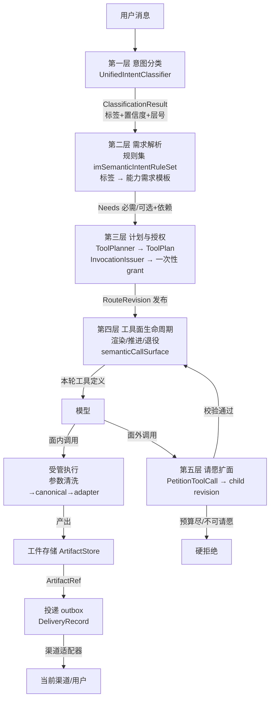
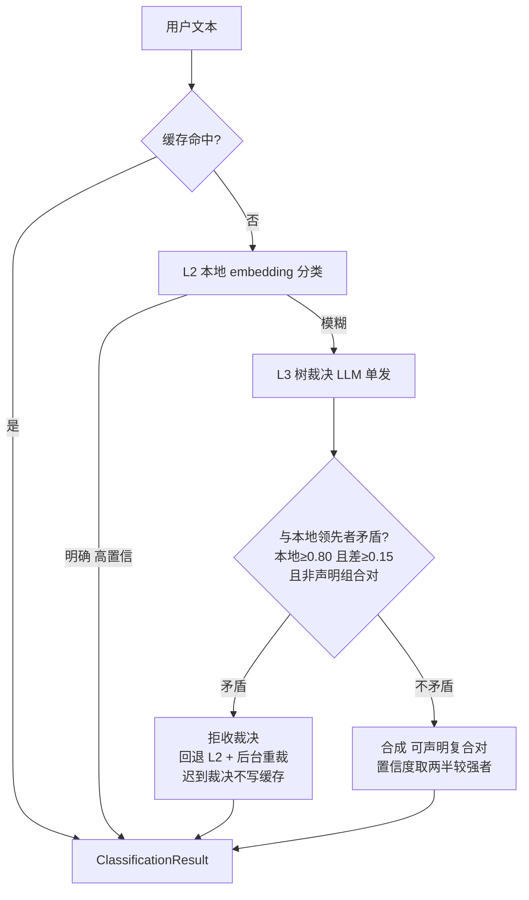
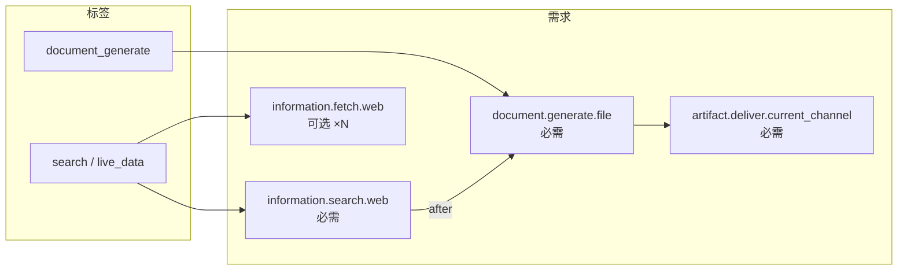
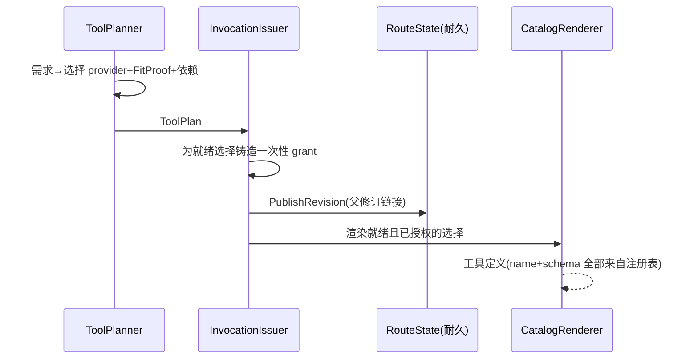
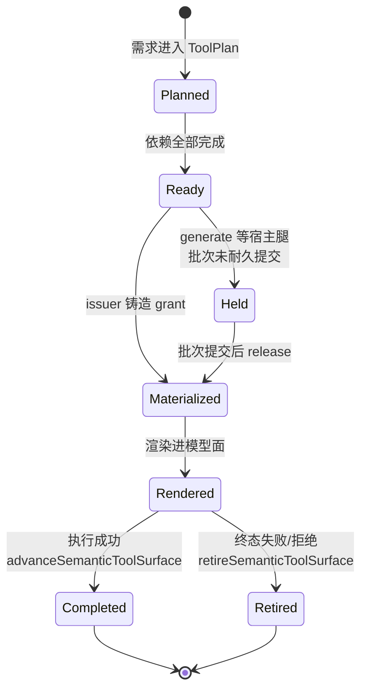
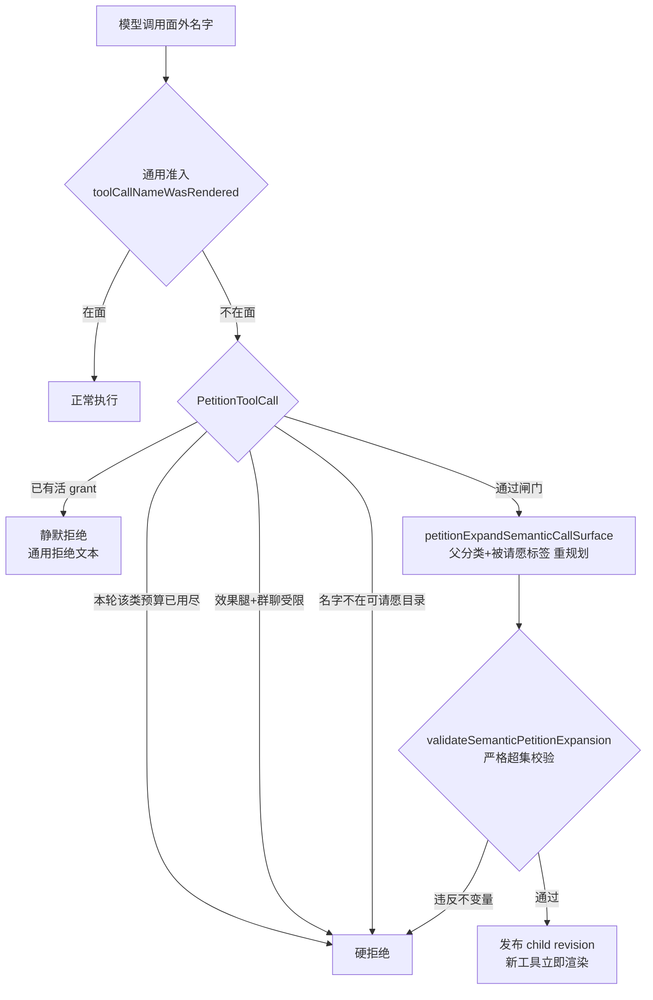
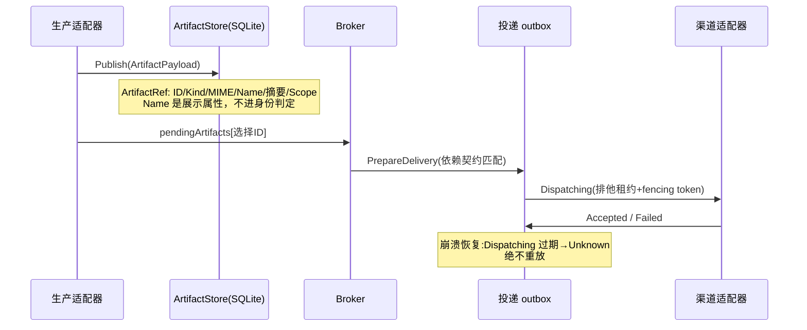
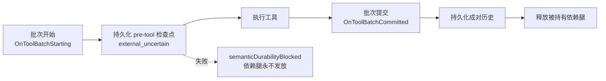

# 语义工具路由技术原理（2026-08-28）

> 定位：本文是语义工具路由（semantic tool routing）子系统的**原理性总览**，
> 面向需要理解、评审或修改该子系统的工程师。事故驱动的逐项细节见
> `semantic-tool-routing-determinism-and-flexibility-zh.md`（下称《事故编年》），
> 本文引用其章节号而不重复展开。

## 1. 设计哲学

MaClaw GUI 是 agent 的 **harness**：agent（模型）决定做什么、怎么做，harness
只提供确定性安全边界。这条主线推出全部架构决策：

- **分类只决定"能力结果"，不决定工具名。** 模型可见的工具名、参数 schema、
  授权令牌全部来自宿主可信注册表与规划器，模型输出（包括它报出的函数名）
  永远是非可信输入。
- **面（surface）是渲染出来的，不是配置出来的。** 每轮模型看到的工具列表是
  该轮计划（ToolPlan）的投影，随执行推进确定性地推进、消耗、退役。
- **fail-closed。** 任何一步无法证明授权有效，结果是拒绝而不是放行；
  模型收到的永远是可行动的领域语言（"先产出工件再投递"），而不是存储层
  内脏（"sql: no rows"）。
- **模型有自救通道。** 规划漏渲染的能力可通过请愿（petition）扩面获得，
  请愿本身走确定性校验器与预算，而不是放开白名单。

## 2. 总体架构

一轮消息从进来到应答，经过五个层次。每层只信任上一层的**可信产物**。

关键不变量：模型在任何一层都碰不到授权决策。它能做的只有三件事——
调用面内工具、调用 tools_search 发现名字、请愿面外能力。

## 3. 第一层：意图分类

分类器是多层结构，核心原则是**本地信号与 LLM 裁决互相证伪**，
而不是任何一方覆盖另一方（《事故编年》§4.1）。

### 3.1 置信度地板体系

分类结果能不能"铸造"工具需求，由一组**语义各不相同的地板**决定，
这是历轮事故最常踩的边界：

| 地板 | 值 | 语义 | 低于它的后果 |
|------|----|------|--------------|
| resolver/L2 写授权地板 | 0.78 | L2 早退与"可铸写"的线 | 进入低线判定 |
| 信号地板 | 0.70 | 树裁决（layer 3/23）与只读 hint 的"信号足够真"线 | 弱信号不落 |
| 低线规划通道 | — | 白名单形状：只读 hint / office hint / 声明的 lookup+generate/visual 复合 / **低线受管只读分类** | 不在白名单 → 本轮不规划 |

2026-08-28 修复后，低线通道新增 `semanticSubFloorGovernedReadOnlyClassification`
分支：**非 Degraded、非树裁决层、声明标签全部是受管只读标签**的分类，
经投影抬升后规划其只读腿。这保证"分类器只认出 search（0.69）"的轮次
仍获得托管面与请愿能力，而不是跌回 legacy 名字路由面（那里既没有
generate_pdf，请愿也因 `semanticSurface==nil` 静默失效）。
效应标签（generate/office/bash 等）低于地板仍然不落，Degraded 永远不落。

## 4. 第二层：需求解析

分类标签经规则集 `imSemanticIntentRuleSet` 展开为**能力需求**（capability
need），每条需求带必需/可选属性、qualifier（如 freshness=current）与
依赖边（deliver 依赖 generate,generate 依赖 search）。

两条重要旁路：

- **任务原型束**（《事故编年》§4.2）：大类任务恒带可选伴随能力束，
  避免"东边修完西边坏"——模型可以忽略可选腿，但腿必须在场。
- **会话复用丢弃**（`semanticNeedsForReusableConversationLookup`）：
  同主题会话已有查找事实时，fresh 查找腿被摘掉。该丢弃事实会记入
  replan 输入（`ConversationLookupReused`)，请愿扩面重规划时镜像同一丢弃——
  否则空 userText 的重规划会复活被丢弃的腿，被校验器正确拒绝
  （2026-08-28 重庆轮事故）。

## 5. 第三层：计划与授权

规划器把需求解析为 ToolPlan：每条需求选出 provider、绑定 FitProof
（匹配能力+qualifier 绑定）、记录依赖。随后 InvocationIssuer 为每个
就绪选择铸造**一次性授权**（InvocationGrant)，计划以 RouteRevision
形式发布进 RouteState（耐久存储，支持父子修订）。

grant 的语义：**一次调用、一个选择、绑定 scope**。用毕即消耗，
消耗后同名工具的再次调用收到的是"已消费"专用拒绝文本
（`consumedGrantToolCallDeniedMessage`)，避免模型把"已用完"误读为
"动作失败"。

## 6. 第四层：工具面生命周期

`semanticCallSurface` 持有五张表：`grants`（已授权）、`retiredGrants`
（已退役）、`materialized`（已物化）、`completed`（已完成）、`rendered`
（已渲染）。模型可见列表 = 授权 ∩ 就绪 ∩ 未完成 的投影。

### 6.1 依赖腿的"持有-释放"（dependant hold）

generate 这类宿主自有腿即使依赖已满足，也要等**产生证据的那个工具批次
耐久提交**后才对模型可见（`OnToolBatchStarting` 置持有，
`OnToolBatchCommitted` 落盘后 `releaseSemanticDependantIssue`)。
原理：工具的可见性是一种授权；授权不能派生自恢复时仍属"外部不确定"
的批次。持有期间 refresh 会跳过宿主腿（`refreshSemanticCallSurfaceSkipping
(hostOwnedGenerateSelection)`)，但**已发放的 grant 不会被摘除**——
可见性投影永远从 grants 表重算。

### 6.2 推进与退役的原子性

每次执行成功后，`advanceSemanticToolSurface` 在一个事务里完成：
标记完成 → 刷新就绪集（可能发放新 grant) → 用可见性投影整体替换
模型面。禁止分支局部 append/remove——那是历史上"工具神秘消失"
类 bug 的来源。推进失败时保留工具的成功结果
（`semanticAdvanceAfterSuccess`)，绝不把已发布的 PDF 说成未授权。

## 7. 第五层：请愿扩面

请愿是模型对规划遗漏的**结构化自救**，不是白名单开口。

可请愿目录 `semanticPetitionableCapabilities` 覆盖全部稳定模型可见名
（含 bash、write_file、delegate_task 等效应腿——这是 agent 的通用自救
手段）。安全由三道确定性闸门承担，而不是靠目录短：

1. **预算**：只读类与效应类每轮各一次请愿；
2. **群聊策略门**：效应腿在群聊受限上下文直接拒绝；
3. **严格超集校验器**：子计划必须保留父计划全部授权不变（允许 provider
   绑定刷新），新增的每条选择必须是被请愿标签规则模板内的需求，
   且不得有 unmet need。

请愿重规划只使用**可信输入**：原分类 + 单个标签 + 宿主记录的规划观察
（如会话复用丢弃标记）。模型散文、工具参数、prompt 文本一律不进重规划。

## 8. 工件与投递

大内容（PDF、图片、办公文档）不走模型上下文，走工件存储：

- **ArtifactRef.Name**(2026-08-28 引入）：宿主物化落盘时的语义化文件名
  （"南京天气报告.pdf" 而非 attachment.pdf)。展示属性，不进
  `sameArtifactIdentity`，旧库经 `ALTER TABLE ... DEFAULT ''` 迁移自动兼容。
- **投递状态语义**：返回值即确认。`DeliveryAccepted` 只表示渠道适配器收到
  成功响应，不声称人类已读；准备记录是 outbox 意图，不是远程 API 的调用许可。
- **族语义**：草稿-修订轮次中，投递绑定到**族**而非单次调用——同族最新
  工件是同一含义的最新修订，应被送达（《事故编年》§4.11)。

## 9. 耐久性与恢复

原理：任何"批次已执行但历史未落盘"的窗口都是崩溃后的重放歧义区。
检查点把窗口显式化；落盘失败则 fail-closed（持有不释放），
而不是赌它没发生。

## 10. 预算与熔断

| 机制 | 位置 | 语义 |
|------|------|------|
| 请愿预算 | 每轮每类（只读/效应）一次 | 防止请愿变成第二工具面 |
| 检索调用预算 | 每轮每能力 | 用毕收到"已消费≠不可用"文本 |
| tools_search 上限 | 每轮 N 次 | 发现不授权；超限后明确告知 |
| 无进展熔断 | 循环内 | 连续无进展停止空转 |
| 交付完成干净收尾 | `semanticTurnDeliveryComplete` | 必需腿全完成且已投递 → 不再付一次收尾 LLM 延迟 |

## 11. 安全不变量（刻意不改）

1. 模型输出（函数名、参数、散文）永非授权输入。
2. 未渲染名字的调用在核心循环统一拒绝，任何回调不能复活幻觉函数。
3. grant 一次性；已消费 grant 的重放收到专用拒绝文本。
4. 请愿扩面是严格超集：父授权不变、新增必在被请愿标签模板内。
5. 投递三态分离：prepared（意图）/ dispatching（租约）/ accepted（渠道回执）;
   过期租约恢复为 unknown，绝不重放。
6. Degraded 分类永不铸造写腿；弱效应信号低于地板不落。
7. 工件内容永不渲染进模型工具定义，不经模型可控参数传递。

## 12. 故障 → 机制映射（速查）

| 症状 | 根因层 | 机制修复 |
|------|--------|----------|
| "PDF 工具不可用"（分类器裁出复合但被地板杀） | 低线白名单漏复合对 | 声明复合直接进入低线通道（§3.1,《事故编年》§4.18/§4.20） |
| "PDF 工具不可用"（分类器只认出 search 0.69） | 跌回 legacy 面，请愿静默失效 | 低线受管只读分类保有托管面（§3.1) |
| 请愿 web_search 扩展被拒 | 重规划空 userText 复活已丢弃查找腿 | 复用丢弃记入 replan 输入并镜像（§4) |
| 工具"被消耗"后模型误读为失败 | 缺专用拒绝语义 | 已消费≠不可用文本（§5、§10) |
| 草稿修订后 send_file 看不到新工件 | 依赖绑定单次调用 | 族语义：同族取最新（§8) |
| 模型收到 "sql: no rows" | 存储错误漏到模型面 | broker 边界翻译为领域拒绝（fail-closed 原则） |
| 落盘文件叫 attachment.pdf | ArtifactRef 无展示名 | Name 贯穿，不进身份（§8) |

完整编年与每项的 pin 测试见《事故编年》§4 各节与 §6 映射表。

## 13. 术语表

- **面（surface)**：一轮中模型可见工具定义的集合，由计划投影而来。
- **选择（selection)**：ToolPlan 中一条需求的具体化（provider+FitProof+依赖）。
- **grant**：一次性调用授权，绑定选择与 scope。
- **腿（leg)**：计划中的一条能力需求及其选择，如"检索腿""生成腿""投递腿"。
- **请愿（petition)**：模型对未渲染能力的扩面请求，经预算+校验器裁决。
- **低线通道**：低于 0.78 resolver 地板但仍允许规划的白名单形状集合。
- **Degraded**：分类器降级（超时/跳过树）标记，永不铸造写腿。
