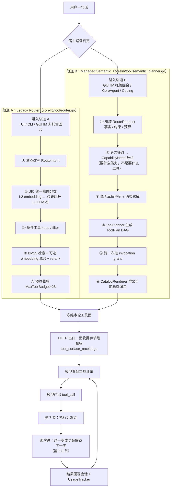
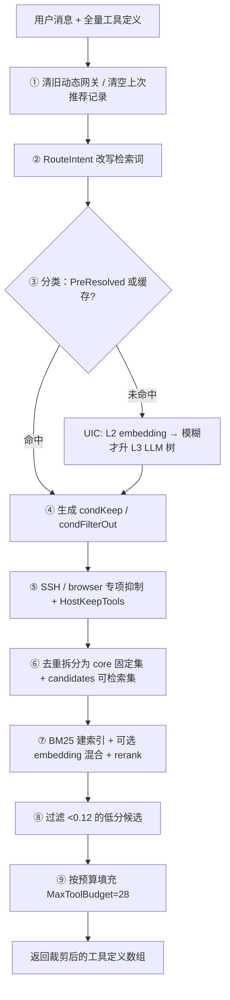
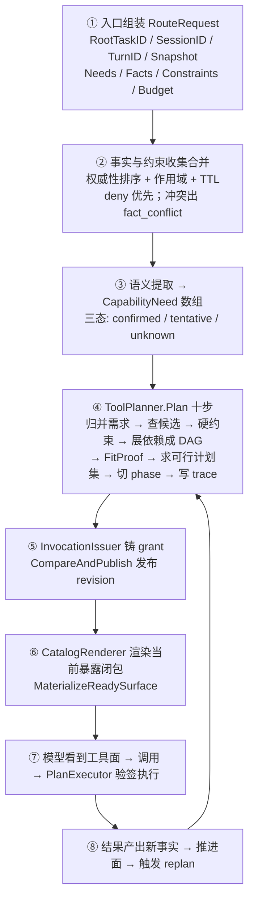
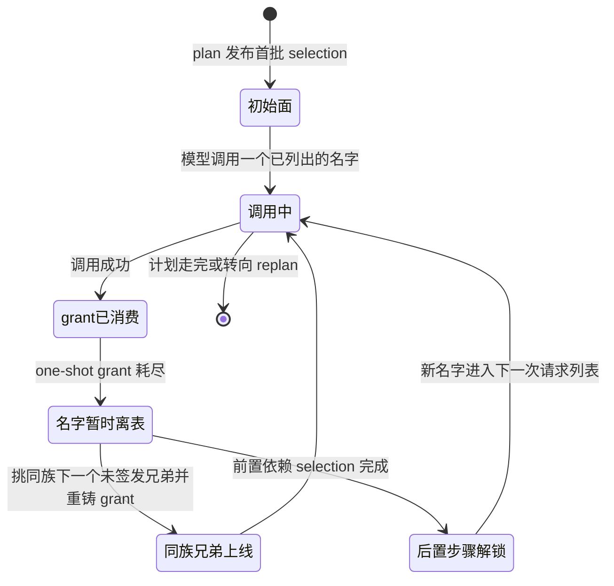
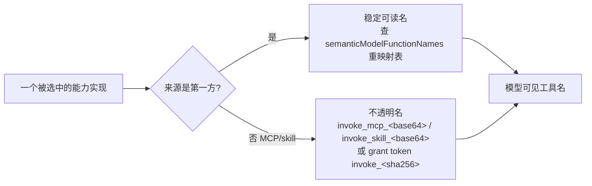
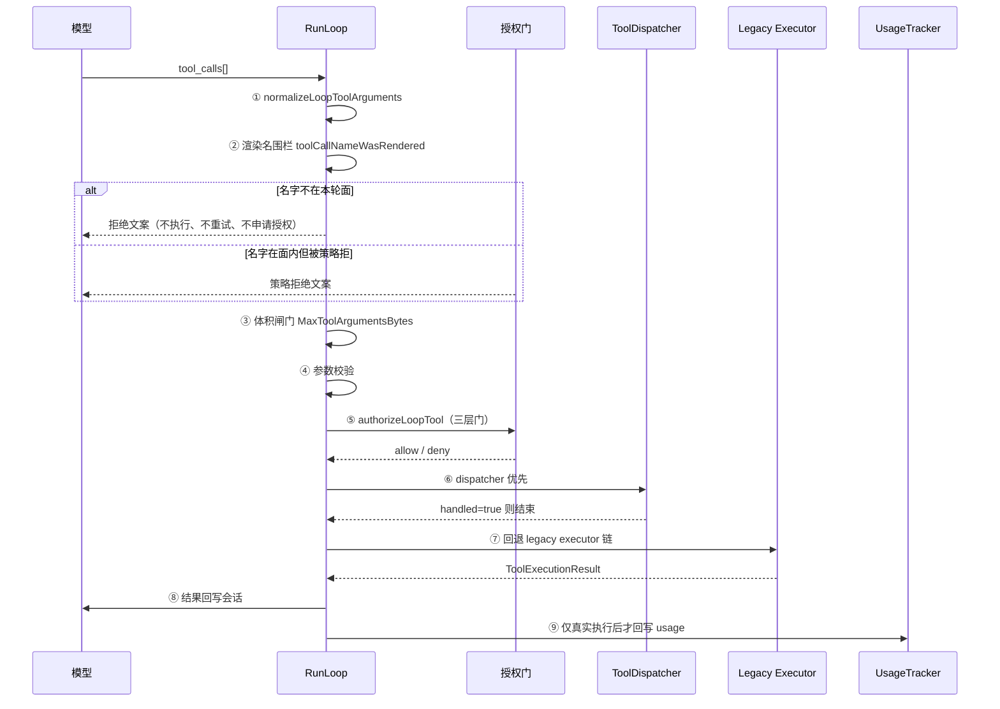

# 工具路由原理详解（当前实现，2026-09）

> 面向对象：第一次接触本仓库工具系统的工程师 / 需要改动工具面的开发者
> 事实基准：2026-09 代码快照。**本文中所有行号、常量、字符串均已逐个 grep 复核**
> 上位文档：[统一语义工具路由设计](./semantic-tool-routing-design-zh.md)｜[改进计划与阶段](./tool-routing-improvement-plan-zh.md)｜[Phase 0 基线](./tool-routing-phase0-baseline-zh.md)
> 本文定位：**把散落在十几份设计文档与上万行代码里的"工具是怎么被选出来、怎么被执行"讲成一条能从头读到尾的主线**。不替代上位设计，不做新提案。
> 第 2 轮代码复审已补入：工具面状态机语义、tools_search 七态、petition 双路径、floor exemption 真实阈值、权限引擎内部（`docs/design` 里此前没有单篇覆盖这些）。

---

## 0. 先建立正确的心智模型

问"工具路由"时，人们通常把三件不同的事混在一起。**分开看，答案立刻清晰**：

| 层 | 真正在问什么 | 本仓库的答案 |
|---|---|---|
| **L0 选择** | 模型怎么决定用哪个工具？ | **模型说了算**。工具清单（名字 + 描述 + JSON Schema）进 prompt，模型自回归产出 `tool_call{name}`。代码**不做任何语义判断**去替模型挑工具 |
| **L1 候选集构造** | 给模型看哪些工具、描述怎么写？ | **这才是工程重心，也是本文的主体**。两套机制并存：Legacy 文本检索裁剪、Managed Semantic 能力规划 |
| **L2 解析执行** | 名字 → 真实实现？ | 渲染名围栏 → 授权 → 参数校验 → 执行偏好链（dispatcher → legacy executor）→ 结果回写 |

> ⚠️ **先想清楚 L0**：系统永远不"替模型选工具"，它只决定**模型能看到哪些工具**以及**哪些调用会被拒绝**。
> 一切"路由"工作都发生在**模型开口之前**（构造清单）和**模型开口之后**（校验与派发）两个窗口里。

### 三个贯穿全文的类比

- 工具面（surface）＝ **发给模型的一次性菜单**
- 授权令牌（grant）＝ **菜单上每道菜的取餐券，撕了就没了**
- 渲染名围栏 ＝ **服务员只认本轮菜单上的菜名，菜单外的名字一律回绝**
- 面收据（receipt）＝ **菜单送到模型手上之前，先在网络出口处按字节复查一遍没被篡改**

⚠️ **但第三个类比有个重要修正**，请读完第 5.8 节后修正心智模型：在受管语义面上，**菜单不是一次性的静态清单，而是随每一次调用演进的状态机**。

---

## 1. 为什么需要"路由"？

三个无法回避的矛盾：

1. **工具太多，装不下**：第一方工具约 49 个（`corelib/agent/tool_register_core.go:135-140`），加上 MCP server、skill 适配器后可达上百个。全量塞进 prompt 会吃掉大量上下文，且互相干扰。
2. **有些工具不该被随便看到**：`ssh`、`browser`、`screenshot`、`record_audio`、知识库写工具——一旦误触就是高权限副作用或外部影响。
3. **上下文成本是真金白银**：实测语义面相对全量面 **token 节省 46.11%**（`tool-routing-phase0-baseline-zh.md` §3）。

于是"路由"= **在正确的时间，把最小的、安全的、够用的工具面交给模型**。

---

## 2. 总览：一次对话里工具是怎么出现在模型面前的



> 注意图中最后一环：**执行结果会反过来改变工具面**。这是受管语义面与 Legacy 面的本质区别之一。

---

## 3. 现状核心事实：两套路由并存

**这是理解本仓库工具系统最重要的一条事实**。不要假设只有一套。

| 维度 | 轨道 A：Legacy 文本检索 | 轨道 B：Managed Semantic 能力规划 |
|---|---|---|
| 入口 | `Router.RouteWithOptions`（`corelib/tool/router.go:1432`） | `ToolPlanner.Plan` + `MaterializeReadySurface`（`corelib/tool/semantic_planner.go:536`、`corelib/tool/semantic_surface_host.go:470`） |
| 决策依据 | **文本相似度**：这句话像哪个工具的描述？ | **能力需求**：这句话要达成什么结果？ |
| 中间产物 | 一份打分排序的工具数组 | 不可变 `ToolPlan` 有向图（需求 / 选择 / 适配证明 / 缺失 / 决策 / 追踪） |
| 授权模型 | 无令牌，靠静态白名单 + 运行时门 | **一次性 invocation grant**，绑定 plan/task/session/turn + 重放计数 |
| 面在回合内是否变化 | 否，一次算完 | **是，状态机**（见 §5.8） |
| 动态工具（MCP/skill） | 明文名 + `discover_tool` 开放式网关 | 不透明适配器名 + HMAC 一次性令牌名；**开放式网关被禁**（§5.6） |
| 完整性保护 | 无 | **面收据**：HTTP 边界字节级 digest 校验 |
| 谁在用 | TUI 全族（7 个回调站点）、GUI IM 非托管回合 | GUI IM 托管回合、agentservice CoreAgent、Coding 子代理 |
| 演进定位 | 将被迁移、最终降级为"need 推导器的一个输入" | 目标终态（上位设计阶段 C） |

**分流点在哪**：GUI IM 侧由 `semanticManaged` 标志决定（`guiapp/im_agent_loop_dispatcher.go:43`）；托管回合会**硬阻断** legacy 路由（`guiapp/im_handler_wiring.go:1204-1213`，谓词 `loopContextBlocksLegacyToolRouter` 定义于 `guiapp/semantic_tool_routing.go:857`）——两者**不 union，严格互斥**。

### 3.6 为什么分托管与非托管：一条迁移闸门

这是全篇最容易被误读的一处。"托管/非托管"**不是两种产品模式或能力档位**，而是迁移期内的一条**覆盖率闸门**：这一轮的意图有没有被人工评审过的规则表覆盖。

**判据只有一处**（所有宿主共用，不能各自解释）：

```go
// corelib/agentservice/dynamic_semantic_routing.go:243-250
// IntentRuleCoverage is the migration gate for one classification against an
// owner-published intent→need table. Managed and Unmapped are independent:
// a search+unmigrated secondary is both managed and unmapped, so hosts fail
// closed instead of planning only the migrated subset.
type IntentRuleCoverage struct {
    Managed  bool
    Unmapped intent.IntentLabel
}
```

`IntentRuleCoverageFromClassification`（`dynamic_semantic_routing.go:256`）逐个遍历 `result.Labels()`：

| 情况 | 结果 |
|---|---|
| 该 label 在规则表里有条目 | `Managed = true` |
| 无条目，且不是通用标签（`IsNonCapabilityLabel`，`corelib/intent/types.go:213`） | 记入 `Unmapped`（只记第一个） |
| 无条目，但是通用标签（`non_coding` / `continuation` / `unknown` / `ambiguous`） | **不算缺口**，忽略 |

规则表本体是 `IMSemanticIntentCapabilityNeedRules()`（`corelib/agentservice/intent_capability_rules.go:40`，当前 44 个 label 条目），每条写死"这个意图需要哪些能力、哪个 `Required`、可重复调用几次 `MaxInvocations`"。

#### 为什么 `Managed` 与 `Unmapped` 必须互相独立

如果只看 `Managed`，一个「搜索 + 某个尚未迁移的次要意图」的请求会被判为托管，Planner 会老老实实按规则表规划出**搜索那一半**，产出一个形式上闭合、实际残缺的工具面。而它是闭合的——连 `tools_search` 补救路径都不会提示模型缺了什么。这比 legacy 的宽面**更糟**。

所以规则是：**存在 `Unmapped` ⇒ 整轮退回轨道 A**，不做半迁移。

#### 三个组合的出口

| `Managed` | `Unmapped` | 出口 | 理由 |
|---|---|---|---|
| ✓ | 空 | **轨道 B**（托管语义面） | 全线覆盖，可以闭合 |
| ✓ | 非空 | **轨道 A**（fail closed） | 有半边没覆盖，不给残缺的闭包 |
| ✗ | — | **轨道 A**（兜底） | 完全未覆盖，走 BM25 宽面 |

#### 为什么未覆盖时不能让语义面硬撑

受管语义面的巨大优势（token −46.11%、无开放式 discover 网关、一次性 grant、面收据）全部建立在**"这张表对这句话是对的"**之上。未覆盖的回合走进去，等于拿一个尚未被人类背书的前提去换 token。`routingarch/baseline.go:38` 给 legacy 路由打的理由因此是：

```go
ReasonLegacyNameRouter Reason = "legacy name router, unmanaged turns only; delete with design C-2"
```

**它是迁移标的，不是常态实体。** 规则表每加一个 family，就有一批回合从非托管变成托管，直到退场。

#### 毛边：三种"伪托管"也阻断 legacy

`loopContextBlocksLegacyToolRouter`（`semantic_tool_routing.go:857`）里除了 `semanticManaged`，还有三种情况同样阻断：

| 谓词 | 场景 | 为什么阻断 |
|---|---|---|
| `loopContextTurnAnswerOnly`（`:853`） | 纯问答，不需要工具 | 面为空即可 |
| `loopContextIsVisionFallthrough` | 视觉兜底 | 保面最小化 |
| `loopContextHasClassificationProtocolFailure`（`:877`） | L3 契约违约 | 注释明写：重回 legacy 会产生零工具请求；保留边界直到宿主返回可重试的控制面错误 |

反向的例外是 `leftoverKeepsRemoteHostClassification`（`:846`）：**未绑定的 UIC `LabelSSH` 回合不按遮断处理**，而留给 leftover 里的内置 ssh 工具——因为受管 SSH 是 bound-session adapter，遮掉就真的连不上远程主机了。

> 设计启示：**先问"这一轮的事实有没有被信任的表覆盖"，再问"用哪套算法"**。覆盖率是 eligibility，不是可降级的优化项。

### 3.7 是中间状态吗：退场条件已经写死在代码里

是。三重证据都指向"这是迁移期过渡态"，而且**每一条都是可执行的、不是愿景**。

#### 证据一：注释直接写了删除触发器

```go
// corelib/tool/routingarch/baseline.go:34-38
// ReasonLegacyNameRouter marks the legacy keyword/name routing surface.
// A capability-managed turn no longer reaches it. Deleted by design C-2
// once the remaining unmapped families (coding, bug_fix, maintenance,
// workflow_task) and the generic Q&A surface are migrated.
```

退场清单 = **4 个 family + 通用 Q&A 面**，触发器是 design C-2。

#### 证据二：清单已过半——实测只剩 1 个 family

注释提到的四个 family，在规则表里的实际状况（`intent_capability_rules.go:182-184`）：

```go
intent.LabelCoding:      coding,
intent.LabelBugFix:      coding,
intent.LabelMaintenance: coding,
```

**`coding` / `bug_fix` / `maintenance` 三个已经迁移**（都指向 `ReviewedCodingCapabilityNeedRule()`）。

唯一没有规则的是 **`workflow_task`**。但它的缺口性质与另外三个**不同**，不能简单说"漏补了"：

它在 `corelib/intent/definitions.go:518-522` 的定义里带着 `MayTriggerWorkflow: true` 与一长串 `WorkflowTypes`（`product_design` / `business_plan` / `literature_review` / `grant_proposal` …），是一个**多阶段工作流触发器**，产物由 V2 工作流引擎（`guiapp/workflow_v2_integration.go`，`isWorkflowV2Active` `:1606`）按执行阶段分批提供。

##### ⭐ 最终定论（2026-09-26 第 3 轮复审）：这是 owner 登记的**永久豁免**，不是待迁移缺口

豁免不是口头决定，是四件套，全部落在代码里：

1. **inventory 测试登记**：`guiapp/semantic_intent_rule_inventory_test.go:22-25` 写明理由——*"multi-turn workflow loop owns the route; a single-turn capability plan is the wrong unit for it"*。谁给规则表加了 workflow_task 条目，`TestSemanticIntentRuleCoverageInventory` 直接报错。
2. **专属用户文案**：普通聊天回合命中 workflow_task 时返回 HostReject + 指引（`semantic_tool_routing.go:3000-3006`，`semantic_workflow_entry_required`）——*"这类多阶段任务要从工作流发起……用 /workflow 或工作流面板开始"*。**产品语义是拒绝并指引，不是给一张工具面。**
3. **阶段回合标签剥离**：工作流回合里的 workflow_task 是分类器在复述本轮路由，`semanticClassificationForWorkflowLoop`（`semantic_workflow_phase_route.go:30-57`）主动剥离；纯 workflow_task 阶段 fallthrough 到 legacy（与 document_generate 阶段同路）。
4. **独立回路**：阶段执行走 `WorkflowAgentLoop`（`workflow_v2_integration.go:823`），工具面由 phase `ToolPolicy` 在 name 层 + 能力层约束管理。

> ⚠️ **方案史**：本节曾推演"给一组宽泛 Need、由 phase ToolPolicy 收紧"的做法——机制分析正确，但**方案本身被第 3 轮复审否定**：阶段回合根本不看规则表（回路独立 + 标签剥离），普通聊天回合不该给面（应拒绝并指引），且 inventory 测试会 fail。多轮工作流的正确单元是工作流回路本身。**headless 侧行为**：`coverage.Unmapped != ""` → 退轨道 A（`dynamic_semantic_routing.go:435-444`），无专属指引文案（headless 无工作流面板，宿主差异合理）。

##### ⭐ 补录二：`ToolPolicyNone` 不是逃逸口，是 sentinel（易误读）

这条链路里有一个**极易被读错**的值。`state.go` 里 `ToolPolicyNone` 的注释（更正前写在 `:38`，原文 `// no tool restrictions`）很容易让人认为"存在一个全放行的档位，与全托管冲突"。实测并非如此：

**没有任何 phase 主动选择 `none`。** `templates.go` 的 153 个 Phase 字面量全部显式设档（DocOnly 134 / Full 36 / Planning 1 / OpsControlled 1，未设置 **0**）。`ToolPolicyNone` 只出现在**函数返回值**位置，四种身份：

| 身份 | 出处 | 语义 |
|---|---|---|
| ① 注释名义 | `state.go:52` | ~~无效注释~~ **已更正**（2026-09-26）：现为 "sentinel: no workflow decision available" |
| ② 不适用 / 拿不到 | `v2/engine.go:1290,1293,1297` | 无工作流 / 待审核 / 模板匹配失败 → `apply=false`，不施加约束 |
| ③ 默认值 | `service_messaging.go:783` | ~~metadata 未声明借用 `None`~~ **已改**（2026-09-26）：默认值改为 `ToolFilterFull`，等价性经三个消费点复核（`types.go:245`/default 分支/`types.go:270`），"未声明"不再借用 sentinel |
| ④ 执行被封信号 | `im_agent_loop_tools.go:781` | 唯一 `apply=true` 分支 → `imSemanticWorkflowPolicyState` → `Blocked` → deny all |

**真正的 `all tools` 敞口是 `ToolPolicyFull`（36 个 phase 主动选择）**，它在 `v2/types.go:245`（原 `:236`，P2 实施后漂移）与 `None` 一并被 `return tools` 原样放行——名字会撒谎，这行里 `None` 只是陪衬，主角是 `Full`。其能力层上界已在 P2 实施（`imSemanticPolicyStateExecution` deny 三接管家族），name 层放行处也已加注释声明将被能力层取代。

> 方法论留痕：我据此一度把它当成需要产品拍板的冲突项。**核对"谁把这个值赋出去"比读它的注释可靠得多**——一个从未出现在赋值位置的枚举值，通常是 sentinel。

同一份注释还给出了比我以为的更强的保证（`semantic_capability_policy.go:188-190`）：执行期 legacy 关口原样保留，因此规划期的近似只能**收紧**、绝不能放宽——不依赖两份实现同步演化，比"同一个 policy 对象"更稳。

**详见 `docs/design/tool-routing-full-migration-plan-zh.md` P2 章节。**

> ⚠️ 顺带修正一个容易过度推断的点：`isV2WorkflowLoop`（`guiapp/im_system_prompt.go:128`）与 `loopContextIsSemanticManaged` **在 System prompt 构建里是并列的判断维度**，但前者只决定是否追加 `desktopWorkflowDocOverride` 这类 prompt 片段，**并不供应工具面**。所以本文"两套路由并存"的框架仍然成立，不存在第三套路由。

> ⚠️ 所以 `baseline.go:38` 那段注释本身**属于过时注释**：它列的"未迁移四件套"里三个已经落地。判断进度**以规则表为准，不要以注释为准**——这是本轮核实中最值得留的一条经验。

#### 证据三：有一条会 fail CI 的倒计时表

`TestLegacySurfaceDoesNotGrow`（`routingarch_test.go:87`）钉了四条天花板，任何一条上升就测试失败：

| 遗留原因 | 当前 | 天花板 | 余量 |
|---|---|---|---|
| `ReasonLegacyNameRouter` | 11 | 13 | 2 |
| `ReasonLegacyPolicyFilter` | **28** | 28 | **顶格** |
| `ReasonProviderNameCallLegacy` | 9 | 10 | 1 |
| `ReasonInstalledDefinitionStep` | **4** | 4 | **顶格** |

（当前数为 `Baseline` 实测，共 101 条分布在 5 个 `Rule` 类别、14 种 `Reason` 下。）

天花板不是摆设——测试注释里记着一次真实触顶：

> "maxLegacyPolicyFilter read 25 until the 2026-09-09 `gui/` → `guiapp/` monolith move. The scanner kept watching `gui/` while the desktop host…"

一次目录重构就把 25 推到 28 直接顶格。**这说明天花板是被真实感知的**：中间态不是自由漂移，是带着配额在走。

#### 那终态长什么样

| 组件 | 现在 | 终态 |
|---|---|---|
| `Router.RouteWithOptions`（轨道 A） | 非托管回合的全权入口 | **删除**（design C-2） |
| BM25 检索能力 | 决定给模型哪些工具 | 降格为需求推导的输入信号之一（**该提法本轮未在上位设计文档中找到出处，标注未核实**） |
| 规则表 | 决定"托管与否"的闸门 | 覆盖率追平后闸门消失，表本身固化为能力本体的一部分 |

> 一句话：**"中间"指的是它是待清的过渡债，不是指它会被整体替换。** 留下的是轨道 B 的骨架（plan / grant / 收据），退场的是 legacy 那条此刻还握着决策权的入口。

### 3.8 能不能变成唯一的路由路径

**结论：能，但要付的代价不在代码行数，在失败语义。** 先说好消息，再说那条写死的禁令，最后是切换顺序。

#### 好消息：工程缺口比看上去小

| 宿主路径 | 是否接入语义面宿主 | 证据 |
|---|---|---|
| GUI IM 托管回合 | ✅ | `semanticManaged` 闸门（§3.6） |
| CoreAgent | ✅ | 静态 specs + 受管语义面 |
| Coding 子代理 | ✅ | 自有 catalog + 角色 allowlist |
| maclaw-cli / ACP | ✅（继承） | 二者都在 GUI IM 下游，不自带面 |
| **TUI 全族（7 站）** | ❌ | 面的来源是 `app.toolRegistry.BuildDefinitions()`（`tui/needle_logging.go:67`），**静态全量，不做任何选择** |

也就是说，**真正需要新建接线的只有 TUI 一家**；family 层面只剩 `workflow_task`，而它已以**永久豁免**形态闭合（§3.7 定论：多轮工作流回路拥有其路由，单轮 plan 是错误单元）。

#### 那条写死的禁令：不许用开放式网关补这个洞

全托管最诱人的捷径是"补一个兜底工具，没匹配上就给模型一个万能入口"。代码里明确封死了：

```go
// corelib/tool/semantic_planner.go:611-620
// No candidate from an incomplete/stale lifecycle snapshot does not
// prove that this capability is infeasible. Preserve the distinction
// so a caller can wait for its bounded refresh or ask for
// clarification; it must never compensate by exposing a free
// Skill/MCP gateway.
```

**"must never compensate by exposing a free Skill/MCP gateway"** —— 这正是 §5.6 从正门禁掉的东西。所以全托管不能靠加一个逃生口来达成，那样等于把开放式 discover 网关从后门请回来。

#### 真正的代价：fail-closed 的含义会变

| | 今天 | 全托管之后 |
|---|---|---|
| 规则表没覆盖这句话 | 退轨道 A 的宽面 | **工具缺失** |
| 失败形态 | 降级（笨，但模型有事可做） | 失败 |
| 兜底机制 | 宽面本身就是兜底 | 只能靠 missing 可见 + 请愿恢复 |

这是一次**质变**：`fail closed` 从"降级运行"变成"直接失败"。

> **✅ 本轮更正（2026-09-26）：我先前判断"missing 可观测性要先建设"是错的，它已经相当扎实。** 追查 `plan.Unmet` / `plan.Omitted` 的消费点后发现五道已经落地的保障，各有出处：
>
> | 保障 | 位置 | 作用 |
> |---|---|---|
> | 结构化分类 | `semantic_planner.go:588-594` | `record()` 按 `need.Required \|\| unmetIsAuthoringFault(code)`（`:381`）分流 Unmet / Omitted |
> | fail-closed 回退 | `agentservice/dynamic_semantic_routing.go:1389`、`:1558` | `if err != nil \|\| len(plan.Unmet) > 0 { return true }` —— 有缺失即回退 |
> | 受控请愿恢复 | `agentservice/semantic_petition.go:81` | `ValidatePetitionExpansion`：child 有 Unmet 直接拒绝；且要求**严格超集**（父 selection 原样存活、新增只能来自该 label 的规则模板） |
> | HTTP 边界签名 | `agent/tool_surface_receipt.go:1067-1096` | `Omitted` 进面收据并被规范化去重，和 digest 一起受保护 |
> | 评测与快照 | `routingeval/runner.go:477-482`、`agentservice/semantic_behavior_snapshot.go:110-115` | Unmet 是一等断言对象；Unmet/Omitted 落行为快照 |
>
> 结论随之翻转：**全托管的真门槛只剩"规则表覆盖"与"TUI 接线"两项**，见 §3.9 计划。

#### 一个容易被忽略的反例：纯问答不需要面

`loopContextTurnAnswerOnly`（`semantic_tool_routing.go:853`）判定的回合，正确行为是**给一张空面**。这类流量走"语义规划"纯属开销。另外前文记录的 **token −46.11% 是在受控种子集上测得**（`tool-routing-phase0-baseline-zh.md` §3，种子集 meanRecall 1.000），全流量口径下会被稀释——**拿它预测全托管收益属于高估**。

#### 建议的切换顺序

1. **先把 missing 做结实**：`UnavailabilityReason` 的覆盖面、`tools_search` 的可发现性、petition 的成功率。原则是**先具备可观测与可恢复，再谈迁移**。
2. ~~补 `workflow_task` 规则~~ **已完成（豁免形态）**：owner 已用 inventory 测试 + 专属文案 + 阶段标签剥离显式记录它为何不适配 owner-reviewed 表（§3.7 定论），规则表覆盖就此闭合。
3. **TUI 接 `SemanticSurfaceHost`**，或明确接受"TUI 保留静态全量面"作为一个写进文档的例外。
4. **最后**才按 design C-2 删 `RouteWithOptions`。

> 反过来做（先删 legacy、再补规则）会把"偶尔短路一下"变成"工具凭空消失"。这也解释了为什么 `TestLegacySurfaceDoesNotGrow` 要死盯配额——**它是防止有人把捷径算进配额的守门人。**

---

## 4. 轨道 A：Legacy 文本检索路由

### 4.1 流程



> 注意顺序：**条件过滤发生在检索之前**（`router.go:1721-1757`），不是"检索完再过滤"。

### 4.2 步骤与出处

| # | 步骤 | 位置 | 说明 |
|---|---|---|---|
| ① | 意图改写 | `corelib/tool/route_intent.go:22-53` | 把原始消息改写成更适合检索的查询串 |
| ② | 分类查询 | `router.go:1251-1282` | 优先 PreResolved / 缓存，否则走 UIC |
| ③ | 条件 keep/filter | `router.go:1528-1612` | 见 §4.5 |
| ④ | 敏感族抑制 | `router.go:1623-1684` | SSH/browser 专项；`HostKeepTools` 强制保留 |
| ⑤ | 拆分 core / candidates | `router.go:1721-1757` | core 常驻，candidates 参与检索竞争 |
| ⑥ | BM25 + 混合 + rerank | `router.go:1766-1926` | 见 §4.4 |
| ⑦ | 低分截断 | `router.go:1940-2024` | 分数 < 0.12 的候选直接跳过 |
| ⑧ | 预算裁剪 | `router.go:1311-1397, 1928-1979` | 见 §4.6 |

### 4.3 UIC 统一意图分类（`corelib/intent/classifier.go`）

**⚠️ 常见误解纠正**：很多文档写"L2 embedding ∥ L3 LLM 树并行融合"，**当前生产入口不是并行**。

| 项 | 事实 | 出处 |
|---|---|---|
| 生产入口 | `ClassifyContext`（`classifier.go:328`）：**先跑 L2**，高置信直接返回；模糊时才**串行**升级到 L3 树 | `classifier.go:362-440` |
| 并行融合版本 | `classifyWithFusion` 仍然存在，但源码明确注释 "**has NO production callers (tests only)**" | `classifier.go:1475` |
| 融合截止线 | 指 L2 跑完后**等待 L3 的截止时间**，默认 12 秒且不超过 `LLMTimeout`；超时走降级结果 | `classifier.go:18-31, 148-154, 417-425` |
| 阈值 | L2 普通：分数 ≥ 0.78 且间隔 ≥ 0.10；只读 lookup 放宽至 **0.70** / 0.05 | `corelib/intent/layer2.go:260-296` |
| 只读 lookup 地板 | `EmbeddingLookupMinScore = 0.70` | `corelib/intent/layer2.go:296` |
| **fail-closed** | 降级 / unknown / ambiguous **不能激活任何工具**；UIC 不可用时 `ssh`、`browser` 等继续被过滤 | `router.go:1203-1214, 1552-1571` |

一句话：**分类器说不清，工具就不出现**——这是 Legacy 轨道最重要的安全性质。

### 4.4 BM25 检索

| 项 | 事实 | 出处 |
|---|---|---|
| 实现 | 标准 BM25，`k1=1.2, b=0.75` | `corelib/bm25/bm25.go:81-85, 242-290` |
| 索引文本 | 工具名 + 描述 + tags + enrichment / synthetic / 宿主附加词 | `router.go:1070-1094` |
| embedding 文本 | 仅"名称 + 描述" | `router.go:1766-1788` |
| 混合权重 | 默认 `0.6×BM25 + 0.4×cosine` | `corelib/tool/hybrid.go:582-659` |
| reranker | 可选，对 top-20 用 LLM 重排 | `router.go:1862-1925` |
| `scoreEligible` | **不是函数**，是规则字段；标记某条件工具**可以**凭检索分数入面 | `router.go:83-96, 1121-1137` |

> 澄清：`corelib/agent/search_index.go` 是**本地文件内容的 trigram 倒排预筛索引**，不是工具 BM25（`search_index.go:28-40`）。别找错文件。

### 4.5 条件工具（conditional tools）

**为什么存在**：有些工具默认不进 prompt，避免误触高权限或外部副作用；只有分类器命中才 `keep`。

| 类别 | 例子 | 规则 |
|---|---|---|
| 严格 fail-closed | `ssh`、`record_audio`、`screenshot`、`mis_data`、`craft_tool`、知识库写族、browser 族、computer_use 族 | 分类器未命中 → 不出现（`router.go:134-164`） |
| 可凭分数竞争（`scoreEligible: true`） | `web_search`、`office`、`generate_pdf` | 不扩权，可凭检索分数正常入面 |

> 代码注释里有一个真实事故注记：`computer_use` 族曾因"融合噪声 + routing-hint 新近度"把 10 个 `computer_*` 工具塞满预算，导致"生成 markdown"这种普通请求让模型调了 `computer_observe`（`router.go:145-150`）。这就是条件工具存在的现实意义。

### 4.6 预算裁剪

- `MaxToolBudget = 28`（`router.go:25`）；动态工具另限 18。
- **不是纯分数截断**：先按 `mustKeep → condKeep → bootstrap → 其他` 裁剪 core，再用候选分数**降序填满**剩余槽位（`router.go:1311-1397`）。
- 推荐 hint 满额时，替换最低优先的可选项。

### 4.7 `discover_tool`：漏召回的兜底

| 项 | 事实 | 出处 |
|---|---|---|
| 定位 | 兼容 fallback，在 BM25 之前就进入 core 集 | `router.go:1327-1347` |
| 上限 | **4 次 / turn** | `guiapp/tool_discover.go:14-18` |
| 机制 | 内部对普通 / deferred / MCP 工具建 BM25；**仅显式提到的名字**获得 loop-scoped grant，在**下一次**模型请求中出现 | `guiapp/tool_discover.go:55-137, 152-171` |
| 抑制 | 浏览器专用路由会抑制它 | `router.go:1652-1668` |
| 另一重身份 | 它同时是 §5.6 所说的三个 **legacy 动态网关**之一，在受管面上被禁 | `corelib/tool/semantic_legacy_gateway.go:26` |

---

## 5. 轨道 B：Managed Semantic 语义路由（目标终态）

### 5.1 核心思想：从"选工具"变成"要能力"

Legacy 轨道问的是"这句话像哪个工具"；语义轨道问的是"**这句话要达成什么结果**"。

- 结果 ≠ 工具。`information.fetch.web`（抓网页）可以由内置 provider 满足，也可以由某个 MCP provider 满足——**模型不该关心是哪个**。
- 一旦以"能力"为中间层，授权、审计、替换、降级都有了稳定的锚点。

### 5.2 概念速查表

| 概念 | 一句话定义 | 出处 |
|---|---|---|
| **Capability** | 对用户有意义的**原子结果**（不是工具名），可由多个实现满足 | 设计 §4.1，`semantic-tool-routing-design-zh.md:97` |
| **CapabilityNeed** | 本回合需要的能力 + 对象 + 范围 + 确定性；带 `Polarity`（require / avoid / inquire / simulate），**没有工具名字段** | `semantic_planner.go:21`，设计 `:99,104-117` |
| **能力本体 CapabilityRegistry** | 版本化的能力目录：ID / 版本 / Owner / QualifierSchema / EffectClass + 每条能力的语义契约。5 条治理规则 + CI 交叉校验 | `corelib/tool/capability_ontology.go`，设计 `:150-177` |
| **ToolPlan** | 裁决后的**不可变有向执行图**：Needs / Selections / FitProofs / Missing / Decisions / Trace | `semantic_planner.go:431` |
| **FitProof** | 某个 provider 为什么配得上这条 need 的证明 | `semantic_planner.go:269` |
| **PlannedSelection** | 计划里被选中的一个"能力 × 实现"绑定 | `semantic_planner.go:278` |
| **InvocationGrant** | 一次性调用授权：不可猜测、短时，绑定 tenant/principal/session/turn/task/plan/revision + 过期 + 重放计数 | `corelib/tool/semantic_invocation.go` |
| **CatalogRenderer** | **唯一**能把 selection 渲染为 LLM function definition 的组件 | `corelib/tool/semantic_renderer.go:35,42` |
| **暴露闭包 / surface** | 与"计划闭包"分离：计划闭包含全部已知节点，暴露闭包只含**当前 phase 可执行**的 selection | 设计 `:525`,`2397` |
| **MaterializeReadySurface** | 把就绪 selection 铸成 grant 并渲染成模型可见函数列表的一次完整动作 | `corelib/tool/semantic_surface_host.go:470` |
| **ProviderBinding** | 实现身份：builtin / skill / mcp + ProviderID + SchemaDigest + Health + 作用域 | 设计 `:184-194` |

### 5.3 端到端七阶段



**每步的输入 / 输出**

| 阶段 | 输入 | 输出 | 代码落点 |
|---|---|---|---|
| ① 组装 | 宿主上下文 | `RouteRequest`（`semantic_planner.go:256-267`） | — |
| ② 事实/约束 | 多来源事实 | 合并后的 `RoutingFact[]` / `RoutingConstraint[]` | `semantic_planner.go:211,225` |
| ③ 需求提取 | 用户意图 | `CapabilityNeed[]` | `semantic_planner.go:21` |
| ④ 规划 | RouteRequest | `ToolPlan`（不可变 DAG） | `ToolPlanner.Plan` `semantic_planner.go:536` |
| ⑤ 授权 | ToolPlan + Scope + TTL | `InvocationGrant` 集 | `IssueAndBindReadySurface` `semantic_surface_host.go:487` |
| ⑥ 渲染 | plan + grants + schemas | `[]map[string]interface{}`（OpenAI function 列表） | `MaterializeReadySurface` `semantic_surface_host.go:470` → `RenderReady` `semantic_renderer.go:42` |
| ⑦ 执行 | grant + 参数 | 结构化结果 + receipt | `semantic_plan_executor.go` |
| ⑧ 重规划 | 新事实 | 新的 plan revision | `semantic_replan.go` |

### 5.4 能力本体：能力长什么样

能力 ID 是**点分命名**，前缀即领域。真实样例（`corelib/tool/capability_ontology.go:15-39`）：

| 能力 ID | 含义 |
|---|---|
| `shell.execute.local` / `shell.execute.remote_host` | 本地 / 远程 shell 执行 |
| `fs.read.local` / `fs.read.remote` / `fs.write.local` | 文件读写（远程为 shadow-only，见 §13） |
| `repo.inspect.vcs` / `repo.inspect.remote` / `repo.mutate.vcs` | 仓库检查 / 变更 |
| `document.write.office` / `document.render.pdf` | 文档生成 |
| `information.fetch.web` / `information.search.*` / `information.current_time` | 信息获取 |
| `computer.control.desktop` / `browser.control.web` | 桌面 / 浏览器控制 |
| `audio.capture.microphone` / `audio.transcribe.speech` / `audio.render.speech` | 音频 |
| `message.send.im` / `schedule.manage.local` / `schedule.dispatch.channel` | 通信与调度 |

**语义模型不得凭空造 capability**——只能从注册表中查（`registry.Lookup`，`semantic_planner.go:597`），查不到就记为 `unknown_capability` 的 unmet need。

### 5.5 计划是怎么算出来的（`ToolPlanner.Plan`）

`semantic_planner.go:536-645` 的真实逻辑顺序：

1. 校验：registry 非空、RootTaskID 非空、**目录快照版本必须匹配**（不匹配直接报错，防止目录漂移）；
2. 计算 `CatalogDigest` / `SnapshotDigest`，`Plan.ID = "plan:" + SnapshotDigest[:24]`；
3. need 按 ID 稳定排序，去重，缺省 `Polarity = require`；
4. `inquire` → 记为 `clarification_required`；
5. 逐个 need：
   - 查本体 → 不存在或已废弃 → `unknown_capability`
   - `validateNeed` → `invalid_capability_need`
   - `constraintDeniesNeed` → `policy_denied`
   - `bestProvider` 选最优实现 → 无 → `no_feasible_provider`（若目录快照不完整，记录 `UnavailabilityReason`，**不降级为"不可能"**）
   - 生成 `PlannedSelection`，带 `FitProof`、effects、phase、consumes/produces
6. 挂接 artifact 依赖（`attachArtifactDependencies` 等 7 个挂钩，含 lookup→generate、capture→deliver 等跨能力边）；
7. `applyPlanningBudget`（`MaxSelections` / `MaxSchemaTokens`）；
8. `recordExplainTrace` 写可解释追踪。

> 设计细节：optional need 与 required need **规划方式完全相同**，只在"不可满足时意味着什么"上不同。早期实现跳过 optional，导致"可选"与"缺席"等价，任何条件挂载的 provider 家族都无法迁移（`semantic_planner.go:583-591` 的注释）。

### 5.6 受管面的闭包语义与 legacy 动态网关

**三个 legacy 动态网关**必须永不出现在受管语义面上（`corelib/tool/semantic_legacy_gateway.go:26`）：

```
legacyDynamicGatewayNames = {"call_mcp_tool", "manage_skill", "discover_tool"}
```

它们是**开放式 provider 选择器**：模型写个 server+tool 或 skill+action，宿主就去跑。受管面的存在意义正是取代它（`:13-19`）。保留工具本身是因为未迁移路径尚无替代，所以改为**在建闭面处禁止**。

> ⚠️ **两套名单并存**：semantic 侧是 3 个（含 `discover_tool`）；router 侧的 `IsLegacyModelDynamicGateway`（`corelib/tool/legacy_adapter_catalog.go:170-177`）**只有 2 个，缺 `discover_tool`**。改这两处时要同时考虑。

`ClosedManagedDefinitions`（`semantic_legacy_gateway.go:52`）——"**closed**"= 对**当前 grant 表**求闭包：

| 分支 | 行为 |
|---|---|
| `grants != nil && len(grants) == 0` | 直接返回 `nil`（`:56-57`）——**空授权表 = 空面，绝不退化成全开** |
| 名字为空或是网关名 | 跳过（`:62`） |
| `grants != nil` 且名字不在 grant 表 | 跳过（`:65-68`） |
| `grants == nil` | headless 未迁移路径，只掉网关、保留全量（`:51`） |

三个变体的调用时机：

| 变体 | 时机 | 调用点 |
|---|---|---|
| `ClosedManagedDefinitions`(`:52`) | GUI 迁移面 | `guiapp/semantic_tool_routing.go:3296`；headless 未迁移传 nil：`corelib/agentservice/dynamic_semantic_routing.go:1272` |
| `ClosedManagedDefinitionsForProfile`(`:112`) | loop 起始 / 建面时 | headless `corelib/agentservice/core_agent_executor.go:1890`；GUI `guiapp/semantic_tool_routing.go:3307` |
| `FilterLightPromptSafeDefinitions`(`:94`) | light profile 二次过滤 | 被上面 `:117` 调用；宿主也可单独预滤 |

**轻量安全性怎么判断不透明名**（`GrantSelectionIsLightPromptSafe` `:78`）：链路是 **名字 → grant → plan selection → effect class**，空名 / 未知名 fail closed（`:76-77, :83-86`）。判定落在 `IsLightPromptSafeSelection`（`semantic_planner.go:307-317`）：需要确认 → false；`effectsAreReadOnly` → true。**明确不看适配器名、不看 grant token**（`:303-306`）。

### 5.7 授权 grant 与幂等

- grant **一次性**：消费即失效；重放返回专用"已消费"文本。
- **渲染名 = 活 grant 载体**，同名不 rebound。
- 幂等账本在 SQLite 协调器（`guiapp` 的 `semantic-routing/semantic-execution.db`）。
- 并发批内一次性工具**仅首次成功**。

> ⚠️ 这里有个表面矛盾需要澄清：给模型的系统提示明确写了 "**lookup tools (search, fetch) are expected to be used several times**"。一次性 grant 怎么能多次调用？答案在下一节——**grant 不续期，而是换兄弟节点重发**。

### 5.8 工具面是状态机（本轮复审补入，最重要的一节）

受管语义面**不是一次性静态清单**。给模型的原话是：

> "the list is a **state machine**, not a static catalog — every result changes what is listed next"



**机制要点**（全部在 `corelib/tool/semantic_repeat.go`）：

| 机制 | 事实 | 出处 |
|---|---|---|
| 预算即计划节点 | 可重复 need 在**计划发布时**就展开成兄弟 selection：`RepeatSiblingNeedID`（后缀 `#02`）与 `RepeatFamilyID` 归族 | `:35`, `:46` |
| 每族预算上限 | `RepeatSiblingBudgetLimit = 32`；`RepeatSiblingBudget(maxInvocations)` 做钳制 | `:29`, `:72-78` |
| 只有首个是必需 | 只有 index 0 为 Required，其余是"暴露上限" | `RepeatSiblingRequired` `:85` |
| **一族同时只暴露一个** | 防止模型批量并行调用同族 | `:331-341` |
| 已 completed 不重入；有未结算兄弟则**整族挂起** | `repeatFamilyIsUnsettled` | `:324`, `:352` |
| 续期方式 | 不是给旧 grant 续期，而是 `NextRepeatSelections`（`:314`）挑下一个未 granted 兄弟，重新签发 | `semantic_surface_host.go:484,487` |
| 预算耗尽提示 | 附在**成功结果**上：`RepeatFamilySpentBudgetNote` | `:378-400` |

**为什么要求"一次响应只调一个工具"**：因为批处理第二次调用会和第一次的结果抢跑（"a batched second call races the first call's outcome and is rejected"）。系统侧也做了兜底：`staleEpochSameFamilyContinuation`（`guiapp/semantic_tool_routing.go:243-259`，设计说明 `:220-242`）用四条证据（epoch 快照、plan 修订未变、名字仍有 LIVE grant、`RepeatFamilyID` 同族）**重新证明绑定**，把陈旧的同族调用救回来——它不扩大授权，只是重新证明。

**重规划是另一条轴**：`semantic_replan.go:11` **只对** `*_binding_stale` / `*_bound_execution_unavailable` 开子回合，由 `ValidateReplanSubset`（`:48`）与 `ReplanIsBindingOnlyReplacement`（`:75`）保证权限不扩大。

### 5.9 渲染：模型看到的只有函数定义

`CatalogRenderer` 是**唯一**渲染者（设计不变量 #1）。它把 `PlannedSelection` + grant + schema 变成 OpenAI 风格 function 定义。**schema 与文案全部来自受治理目录，渲染器不得注入动态元数据**（上位 §4.4）。

宿主还可以传 `RenderedNames` 做**增量渲染**——已经展示过的函数保留在模型上下文中，不再重复出现；此分支在没有任何新待渲染 ID 时直接返回 `nil`（`semantic_surface_host.go:498-507`）。

### 5.10 面收据（wire 级完整性）

`corelib/agent/tool_surface_receipt.go:23` 定义 `ToolSurfaceReceipt`：

| 字段 | 作用 |
|---|---|
| `ManifestDigest` / `WirePayloadDigest` / `AuditDigest` | 三类摘要：清单 / 线上负载 / 审计 |
| `ExpectedToolCount` / `WireToolCount` | 数量校验 |
| `ReplacementMode` / `Verified` / `Failure` / `FailureKind` / `Handoff` | 状态与失败分类 |

工作方式（`:1161` RoundTripper）：

1. 在 HTTP 出口读最终 JSON body；
2. 重算 wire definitions + invocation policy 的 digest 并比对；
3. **不等就 reject，字节不外发**（`:1199-1200`）；
4. 显式禁止重定向（`:1148-1150`），并置 `request.GetBody = nil`（`:1217`）阻断标准库重放；
5. 传输错误标 `Handoff=ambiguous`。

> 它保护的是渲染名的**完整性**，不是内容的**可信性**——这也是第三方工具名必须保持不透明的原因（见 §6）。

---

## 6. 模型看到的"工具名"是两条规则拼出来的



| 规则 | 机制 | 出处 |
|---|---|---|
| **第一方：稳定名重映射** | `SemanticModelFunctionName` 先查表再回落白名单 | `corelib/tool/semantic_model_name.go:12-24`，表在 `:79-113` |
| 映射示例 | `semantic_search_trusted_web → web_search`（:80）；`semantic_read_trusted_clock → current_datetime`（:82）；`semantic_execute_trusted_shell → bash`（:87）；`semantic_control_trusted_desktop → computer_use`（:90） | 同上 |
| 原名保护 | `semanticIdentityHostAdapters`（`:59-70`）与 remap 值在 `init()` 合并，**重名直接 panic**（`:49`），防表征漂移 | 同上 |
| **MCP：不透明适配器名** | `"invoke_mcp_" + base64(12 字节 crypto/rand)`，最多 3 次重试防碰撞 | `corelib/agentservice/mcp_integration.go:528-540` |
| **Skill** | 同形 `invoke_skill_<base64>` | `corelib/agentservice/skill_integration.go:1068-1080` |
| **一次性授权令牌名** | `"invoke_" + base64(sha256(签名载荷)[:18])` | `corelib/tool/semantic_invocation.go:492-493` |

**为什么第三方工具保持不透明名（安全决策 R1/R2，改进计划 §5）**：

1. MCP 工具名是**服务端控制的不可信字符串**。明文 `server__tool` 命名会把攻击者可影响的文本放进模型可见命名空间（prompt injection、与宿主名混淆）。
2. 若给动态工具稳定名，第二次调用只能：① 同名 rebind（违反碰撞防护），或 ② 把令牌变成模型参数（违反"签名载荷永不暴露为模型可控参数"）。
3. 因此：**第一方走稳定可读名，动态第三方维持 grant-token 名**。
4. 代码边界注释：`boundMCPCallSurface` 只认本次快照渲染出的 adapter，明确"no lookup-by-provider API"（`mcp_integration.go:72-76`）。

---

## 7. 模型发出 `tool_call` 之后：执行分发链

这是 **L2 解析层**。全部集中在 `corelib/agent/loop.go`。



### 7.1 完整步骤表

| # | 步骤 | 函数 | 位置 |
|---|---|---|---|
| 0 | 建立执行上下文（surface epoch / protocol / connectionID） | `beginToolCallExecutionContext` | `loop.go:3319` |
| 0 | 冻结本轮渲染面 | `buildToolsForModelRequest` | `loop.go:3335` |
| 0 | 挂上 receipt RoundTripper | `newToolSurfaceReceiptHTTPClientWithLifecycleEvents` | `loop.go:1531` |
| ① | 参数规范化 | `normalizeLoopToolArguments` | `loop.go:3123`，调用点 `:2391` |
| ② | **渲染名围栏** | `toolCallNameWasRendered` | `loop.go:3014`，调用点 `:2403` |
| ③ | 体积闸门（超 `MaxToolArgumentsBytes` → HardExit） | — | `loop.go:2450` |
| ④ | 参数校验（非 JSON object 即拒） | `validateLoopToolArguments` | `loop.go:3130`，调用点 `:2468` |
| ⑤ | 授权（三层门） | `authorizeLoopTool` | `loop.go:3162`，调用点 `:2484` |
| ⑥ | 轻量 profile 一次性重试 | `tryLightProfileToolRetry` | `loop.go:3257` |
| ⑦ | **执行偏好链** | `executeAuthorizedLoopToolCallWithContext` | `loop.go:3368`，调用点 `:2496-2497` |
| ⑧ | 结果回写会话 | `projectLoopToolResult` | `loop.go:2645` |
| ⑨ | Usage 回写 | `recordLoopToolUsage` | `loop.go:2585-2587`，接口 `:49` |
| ⑩ | 批次提交 + 面刷新 | `OnToolBatchCommitted` / `RefreshAfterToolExecution` | `loop.go:2687 / 2723-2733` |

### 7.2 渲染名围栏（最关键的一道）

模型**只能调用本轮渲染面里出现过的名字**。真实拒绝文案（`loop.go:3027-3033`）：

> `Error: tool %q was not available in this request's rendered tool surface. Do not retry %q and do not ask the user to re-authorize tools; continue with the tools rendered in this request or answer from what you already have.`

另有一条"已消费 grant"变体（`loop.go:3040-3045`），它明确告诉模型：**前面那次已经成功了，别把它当成失败重做**。

> 这就是"**列表即真相**"原则：模型看到的工具清单＝本轮授权的全部真相。被拒不是"参数错了再试"，而是"用面内已有的工具完成，或用已有信息直接作答"。
> 推论：**禁止在未知工具错误里回显合法名字列表**——那与"列表即真相"直接冲突，合法名的发现交给 `tools_search` / petition。
> 但请注意 §5.8：这个"列表"在受管语义面里是**会变的**——"错过"常常只是"还没到那一步"。

### 7.3 授权三层门 + 权限对拍

`authorizeLoopTool`（`loop.go:3162-3207`）内三层：

1. `ToolAuthorizer.IsToolAllowed`（`:3168`）——执行策略门，拒绝文案 `"...is not allowed by the current execution policy. Use a tool available in this turn; do not ask the user to re-authorize tools."`（`:3209/3218`）
2. 轻量 profile 白名单 + `lightDeniedDatabaseWrite`（`:3175-3192`）
3. `ToolCallAuthorizer.IsToolCallAllowed`（`:3193`）

**权限对拍（Phase 1 双跑机制）**：`resolveDualEvalDecision`（`corelib/agent/permission_dual_eval.go:62`）取新 `corelib/permission` 快照裁决，与 legacy 判定比对，**只在有具体规则分歧时打点，绝不改变判定**（`permission_dual_eval.go:15-17`）。这是"对拍零差异跑稳 2 周后才能翻转"的度量基座。

### 7.4 执行偏好链（dispatcher 优先）

`executeAuthorizedLoopToolCallWithContext`（`loop.go:3368-3419`）依次尝试：

```
ToolDispatcherProvider (loop.go:3372)   ← 新收敛目标，优先
  ↓ handled=false
ToolCallContextExecutor (loop.go:3392)  ← epoch 感知
  ↓
ToolCallExecutor (loop.go:3400)         ← 带 callID
  ↓
StructuredToolExecutor (loop.go:3408)
  ↓
cb.ExecuteTool (loop.go:3416)           ← 兜底
```

`ToolDispatcher` 接口定义于 `corelib/agent/tool_dispatcher.go:22-31`：

- `NameDispatcher` 支持**按名**和**按规范 ID**两种注册；解析顺序：**name → ID（装了 resolver 且有 ID-keyed handler）→ name-keyed → 未处理**。
- **dispatcher 永不替未知名编造拒绝**：`handled=false` 就交给下层（`tool_dispatcher.go:27-29`）。
- **只服务第一方名字**；MCP/skill 不透明名走既有 R1/R2 绑定路径（`tool_dispatcher.go:19-21`）。
- 重名注册**直接报错**（防止一个宿主的 switch 悄悄遮蔽另一个宿主的 handler，`tool_dispatcher.go:79-81`）。

**当前是试点状态**：`corelib/agentservice/tool_dispatcher_pilot.go`

- kill switch `MACLAW_TOOL_DISPATCHER`（`:47-56`），**默认 OFF**；
- 试点注册 20 个名字（`:124-145`），全部以 `core:<name>` 规范 ID 注册（`:168-170`）；
- 每个 handler 都走 `executeToolCallLegacy`——**与 legacy 路径逐字节相同**，唯一差别是优先级（`:148-160`）；
- 注册时断言每个试点名都在 legacy switch 的名字域内，越界则跳过并记日志，绝不 crash（`:190-194`）。
- 五宿主试点规模：agentservice 20、IM 11、TUI 9、coding 8、remote coding 5。

### 7.5 Usage 回写

- 仅在**真实 dispatcher 执行后**回写；policy 拒绝 / 参数拒绝 / replan 跳过**都不喂**（`loop.go:2585-2587`）。
- 以 BM25 top-5 用户 token + 成败 outcome 异步回写 `Router.scoreEligible` 的经验分。
- 失败为有限轻负权（-0.3），**不触发连续失败抑制**。
- 2026-09-19 前，所有 `agent.RunLoop` 宿主（shared IM、coding、/loop、TUI 各站点）在这条线上是**静默**的——只有 legacy IM 执行层在喂。现已补齐。

---

## 8. 宿主路径接线

### 8.1 总表

| 路径 | 工具面来源 | 过滤层 | 分发 | 持久化 |
|---|---|---|---|---|
| **TUI 主会话** | 静态 `CoreToolRegistry`（`tui/app.go:231`） | 只读子代理过滤 + 轻量 profile + 每调用工作流策略 | `ExecuteCtx` | 仅会话历史 JSON，无 grant 状态 |
| **GUI IM（legacy）** | `Router.RouteWithOptions`（`guiapp/tool_router.go:29` → `tool.NewRouter(nil)`） | UIC + BM25 预算裁剪；托管回合硬阻断 legacy（`im_handler_wiring.go:1204-1213`） | `executeAgentLoopToolCall`（`im_tool_execution.go:66`） | SQLite 协调器 `semantic-execution.db` |
| **GUI IM（托管）** | `MaterializeReadySurface` 增量渲染（渲染点 `im_agent_loop_shared.go:1973`） | `ClosedManagedDefinitionsForProfile` + light 二次过滤 | 同上 + `PetitionToolCall` | 同上 |
| **agentservice CoreAgent** | 静态 specs（`core_agent_executor.go:1731`）+ `ClosedManagedDefinitionsForProfile`（`:1890`） | 能力投影 + 只读子代理 + 远程 ssh-only + 轻量 profile | `CoreAgentExecutor` 回调 + dispatcher 试点 | `OpenDynamicSemanticRoutingResources` |
| **Coding 子代理** | 静态兼容面 或 `ToolPlanner` 语义面；动态别名表**尚未接产** | 角色 allowlist + 写集冲突 fail-closed | `ExecuteToolCallWithContext` | 同 guiapp SQLite 协调器 |
| **ACP 宿主** | 由被桥接的宿主决定（协议层不造面） | `acpPermissionRegistry` + 出域审批 | 走 GUI IM 的 loop 回调 | 同 GUI |
| **maclaw-cli** | **不自造面**——它是 GUI IM 网关的 HTTP 客户端 | 随 GUI | 转发到 GUI IM agent loop | 无本地持久化 |

### 8.2 TUI 变体差异（Phase 3 迁移的完整清单）

| 回调 | 位置 | 与主 TUI 的差异 |
|---|---|---|
| `tuiCallbacks` | `tui/app.go:3581` | 基准（有轻量过滤） |
| `tuiBtwCallbacks` | `tui/app.go:4038` | 请求级最小集；memory 工具 recall-only 在 Execute 强制 |
| `tuiLoopCycleCallbacks` | `tui/loop_command.go:286` | **硬编码 5 工具清单，不经注册表**——孤岛，收敛时需显式注册 |
| `pipeCallbacks` | `tui/pipe_mode.go:335` | 轻量过滤仅 `MACLAW_PROMPT_PROFILE` 全局强制时生效；只读子代理过滤结构性缺席 |
| `rpcCallbacks` | `tui/rpc_mode.go:398` | 同上；`IsToolAllowed` 恒 true（信任调用方） |
| `tuiWeixinCallbacks` | `tui/weixin_gateway.go:456` | 同 pipe |
| `tuiSchedulerCallbacks` | `tui/agent_tools_schedule.go:372` | 同 pipe |

> **关键发现**：`tui/` 目录**零** `RouteWithOptions` / `NewRouter` 引用。TUI 的"路由"＝静态全量注册表 + 轻量过滤，正是 Phase 3 要迁移的对象。

**轻量 profile（R4 处置）**

- 允许清单是**定义而非负担**：与轻量 system prompt 一一对应，"加工具要改代码"正是保持轻量面最小化的人工评审闸（`light_tools.go:11-40`）。
- 已修复原 fail-open：过滤结果为空时**回退到 5 个核心只读工具**（`LightTurnCoreFallbackTools`，`light_tools.go:42-53`），而不是放开全量面。
- 语义面的不透明名无法用静态清单分类，改走 `FilterToolDefinitionsForPromptProfile` + `PromptProfileToolAuthorizer`（`light_tools.go:129-140`）。

### 8.3 Coding 子代理

**工具面来源与切换**（`guiapp/coding_dynamic_surface.go`）：

| 来源 | 状态 |
|---|---|
| 静态兼容面 | 生产在用。`filterCodingToolsForRole`（`coding_subagent.go:1738, 1906-1927`）→ `filterCodingStaticCompatibilitySurface`（`:1740`）；语义侧来自 `ToolPlanner`（`coding_static_catalog.go:287`） |
| 内存别名表 `codingDynamicSurface`（`:19`） | **尚未接产**：`render`（`:147`）用于生成 `skill_NN_` / `mcp_NN_` 不透明别名，但在**非测试代码中无调用点**；`:29-31` 注释写明动态别名 fail-closed，等 ToolPlan/coordinator 落地 |

切换点在 `BeginToolSurfaceEpoch`（`:401-410`）：有 `dynamicLifecycleRelaySnapshot()` 且 kill switch 未关 → 走 `"coding-dynamic:"+nonce` epoch；否则走静态 epoch。`ExecuteToolCallWithContext`（`:412-418`）在有 relay 时**绝不回落**到名字派发器。

**三种角色（本仓没有 "sandbox" 角色）**

| 角色 | 工具差异 | 出处 |
|---|---|---|
| **explorer** | `Glob / ripgrep / read_file / list_directory / code_navigation / report_localization / git_diff / web_search / web_fetch / current_datetime / coding_knowledge_search / knowledge_search`；**无 bash、无 spawn** | `coding_subagent_spawn.go:42-47` |
| **reviewer** | explorer 集合 **+ bash**（受 `reviewerShellInvocationAllowed` 只读白名单约束） | `:48-58` |
| **worker** | allowlist 为 nil → `toolAllowedForRole`（`:91-93`）直接 true，即**全量面**；spawn 另受 `canSpawnCodingAgent`（`:66-80`，depth<1 且 role==worker）限制 | `:59` |

> 澄清：`corelib/agent/definition.go:40` 的 `Sandbox`（full/readonly/none）是**子代理 YAML 定义**的字段，不是 coding 角色。coding 的"只读"由 `Role.ReadOnly()`（`corelib/codingagent/codingagent.go:43`）+ `IsToolCallAllowed`（`:103-124`）体现：`bash/shell/ssh_bash` 走 reviewer 命令白名单（`:111`）；`web_fetch` 的 `save_path/output/dest/path/filename` 参数一律拒（`:116-121`）。

**渲染期 + 分发期双保险**：渲染期只看名字（`coding_subagent.go:1906` → `FilterToolDefinitions` `codingagent.go:78`）；分发期 **带 args**（`toolCallAllowedForRole` `spawn.go:106-123`，调用点 `coding_subagent.go:2299`），能拦住"观测型工具的写型参数"（`spawn.go:102-105`）。

**并行 writer 准入**（`corelib/codingruntime/write_set.go`）

`CanAdmitParallelWriters`（`:65-79`）四道门槛，**比重叠检测更严**：

1. 同 scope（`:66`）
2. 声明重叠（`:69`）
3. **双方都需隔离工作区**（`:72-74`，"isolated workspace required"）
4. **final diff gate**（`:75-77`）

`WriteSet{Scope, Claims, Unknown}`（`:34-38`）里 **`Unknown` 直接判冲突**（`ConflictsWith` `:414-416`）：并行 writer 的正确性依赖"可证明互不相交"，Unknown 表示无法证明，这时放行等于用一个未声明的范围并发改写同一工作区。GUI 侧调用固定传 `(true,true,true)` 且限定恰好 2 个 worker（`spawn.go:404-405`）；每个 worker 必须声明具体 files，Unknown / 空 claim 直接报错（`:384-386`）。

### 8.4 ACP：协议层不判权限

- `corelib/acpagent/` **只管协议与传输**：`Bridge`（`bridge.go:40`）、`ServeStdio`（`:101`）、`jsonrpc.go:10-30`、`transport.go:22`、`GatewayClient`（`gateway.go:29`，打 GUI 第三方 IM 网关 loopback HTTP）。它**不做权限判定**，只发 `session/request_permission` 反向 RPC。
- **宿主在 guiapp 侧**：`acpPermissionRegistry`（`acp_permission.go:86-91`）、`check`（`:111-127`）；门在 `acp_host.go:955` 按 requestID 注册到 `requestClientPermission`（`acp_permission.go:145`）。
- 与 core loop 的对接点在 `guiapp/im_tool_execution.go:186` 与 `im_agent_loop_shared.go:2786`——注意 `authorizeLoopTool` 本身在 `corelib/agent/loop.go:3162`，ACP 门是在其**之后的宿主回调**里再收一层。
- **只收窄不放宽**：`check` 对未注册门 / 非 ACP requestID / 非敏感工具**一律 allow**（`:113-125`），只有显式 deny 才拦截；`acpPermissionDualEval`（`:45-68`）与注释（`:37`）明示 "Never changes the check outcome"；写工具在 cwd 内自动放行、越界才问（`:168-176`）。

### 8.5 maclaw-cli（本轮更正）

> ⚠️ 上一版文档把它写成"corelib 下的独立入口"是**错的**。

- 真实位置：**仓库根 `maclaw-cli/main.go:174`**（`corelib/maclaw-cli` 不存在）。
- 它**不是 agent loop，不自己造工具面**：本质是第三方 IM 网关的 HTTP 客户端，baseURL `http://127.0.0.1:18777/api/im-gateway/v1`（`main.go:34`），协议 `coreim.ThirdPartyProtocolVersion`（`:204`），handshake `:711-718`。invoke / send / poll / ack 最终**落到 GUI 侧的 IM agent loop**。
- 所以它吃的工具面 = GUI IM 的面，路由行为随 GUI 的 managed / legacy 分流而定。
- 它的"shared-loop"是另一回事：运维开关 + 自适应 prompt 统计（`main.go:1049-1075`、`:1476-1500`；`corelib/doctor/shared_loop.go:31,99`）。

---

## 9. 权限策略引擎（Phase 1，本轮新增）

新包 `corelib/permission` 只有 4 个源文件，职责严格限定为**规则解析 + 合并 + 快照发布**，六个消费门保持独立实现（决策 R3）。

### 9.1 数据模型（`permission.go`）

| 项 | 事实 | 出处 |
|---|---|---|
| `Rule` 字段 | `Tool` / `Effect` / `Kind` / `When` / `Subject` / `Reason` / `Source` | `:24-31` |
| `Effect` 取值 | 仅 `deny` / `ask` / `allow` | `:46-116` |
| `When` | `*ArgsPredicate`，含 `Field` / `Equals` / `In` / `Prefix` / `InFold`，各匹配器之间为 **OR** | `:118-132` |
| `Prefix` 陷阱 | 原始 `HasPrefix`，**无路径边界语义**——作者须自带尾分隔符，否则前缀规则会误伤同前缀名 | `:179-184` |
| `InFold` | 两端 trim 后忽略大小写 | 同上 |
| `Subject` | `""` / `"*"` = 全局；具体字符串仅匹配 `DecideFor(subject, ...)` 的调用 | `:118-132` |

### 9.2 求值顺序是硬编码的

真实入口 `Snapshot.DecideFor`（`:184-246`），候选由 `ruleBeats` 比较。关键是 **`effectRank` 硬编码 `deny=3 / ask=2 / allow=1`**：

> **文件顺序、来源顺序都不能改变效果优先级**。来源顺序只在"效果 + 具体度完全相同"时作为 tie-break。**低来源的 deny 依然胜过高来源的 allow**。

### 9.3 规则来源与 fail-closed

`Load`（`:421-488, 550-609`）顺序：`ManagedRules → loadUserConfigRules → loadProjectRules → loadClaudeRules`。

| 情况 | 行为 | 出处 |
|---|---|---|
| JSON 错误 / 非法规则 / 源不可读 | `failClosed` → 返回 `DenyAllSnapshot + error` | `:429-493, 536-547` |
| 缺失或空文件 | 视为不存在（**不是 fail-closed**） | 同上 |
| 当前宿主实际加载哪些源 | **尚无 managed 源**，且 `TrustProject=false` ⇒ **项目级与 Claude 回退实际被跳过** | `guiapp/permission_snapshot.go:68-97` |

### 9.4 Snapshot 的生命周期（有坑）

| 宿主 | 持有者 | 出处 |
|---|---|---|
| GUI | `App` | `guiapp/permission_snapshot.go:42-65` |
| agentservice | `CoreAgentExecutor` | `corelib/agentservice/permission_snapshot.go:43-60` |
| TUI | 进程级 | `tui/permission_snapshot.go:45-73` |

- 均为**首次访问时 `sync.Once` 构建**，**无 TTL / 无刷新**：改配置或改专家定义需重启进程。
- 加载失败后双跑层会**永久置 nil 并跳过对拍**（`guiapp/permission_snapshot.go:46-63, 77-80`）——已知的待办技术债。
- `HasArgsRules`（`:151-162`）快路径：扫描是否存在 `When`，为 false 时调用方不解析参数 JSON（避免热路径每调用全量 JSON 解析）。

### 9.5 存量兼容（`compat.go`）

| 存量表面 | 规则表示 | 单一事实源 |
|---|---|---|
| 专家工具白名单 | per-expert allow 规则，`Subject` = trim 后的专家 ID 原值，`Source="expert-definitions"` | `guiapp/expert_permission_rules.go:105-134` |
| database 写动作 | `Rule{Tool: "database"/"database_query", Effect: deny, When: DatabaseWritePredicate()}`，用 `InFold` 大小写不敏感匹配 | `corelib/database/actions.go:5-24` |
| `.claude/settings.json` | 无谓词规则，provenance `"claude-fallback"` | `permission.go:395-401` |

### 9.6 Ask 的"超时即拒"语义：一半已实现

- **现有宿主行为已是超时即拒**：10 秒定时器最终调 `remoteScopeApprovalTimeoutDecision`，**无条件返回 `ScopeApprovalDeny`**；未知响应也落 deny（`guiapp/coding_subagent_scope_approval.go:35-38, 495-535, 631-640`；`guiapp/remote_coding_subagent.go:3652-3653`）。凭证闸同理（`guiapp/im_credential_gate.go:385-401`）。
- ⚠️ **但尚未编码为新引擎的规则属性**：Phase 1 引擎只产出 `EffectAsk`，`on_timeout: "deny"` 仍是待办。迁移前这条语义靠宿主硬编码兜着，不是规则层保证。

### 9.7 六层门回顾（历史现状 → 迁移目标）

| 门 | 时机 | 性质 |
|---|---|---|
| 工作流相位策略 | 分发期 | 按相位动态。**决策：推迟到 Phase 3**，直接收敛为 planner 约束，不进规则层 |
| 专家白名单 | 面渲染期 + 分发期 | `Subject=expertID` 的 per-expert allow |
| ACP 权限注册表 | 分发期 | allow/deny 映射；ask 在客户端轮询不可见 |
| 凭证闸（密钥扫描） | 分发期 | **按参数载荷决策**；超时即拒 |
| 出域访问审批 | 分发期 | ask 规则的 UI 实现 |
| 轻量 profile 硬编码清单 | 面渲染期 | 枚举清单保留（R4），已修 fail-open |

> 六门**相互独立**（一层出 bug，其余仍关闭），且**时机不同**：面渲染期＝模型根本看不见；分发期＝调用中途被拒，两者自愈语义不同。
> 其中三个门是**按调用参数**决策（同名工具按 action 拒、按载荷密钥拒），不是按工具名静态分类。

---

## 10. 漏召回怎么办：有界回退契约

语义路由可能"该给的没给"。回退必须**有界**——不能一漏就退回全量面（那等于放弃路由）。

### 10.1 通道总览

| 通道 | 是什么 | 预算 / 约束 |
|---|---|---|
| **`tools_search`** | 只读发现元工具，**发现不授权** | **4 次 / 轮**（`semanticToolsSearchMaxPerTurn`，`im_agent_loop_shared.go:2912`） |
| **`petition`（托管面）** | 模型调用已登记但未渲染的名字，宿主可当场扩面 | 每轮每类（read-only / effectful）**各 1 次** |
| **`legacyPetitionAllows`** | 遗留门：特定名字即使未渲染也直接放行 | 随 turn 内状态，**无独立次数限制** |
| **`discover_tool`**（legacy 侧） | 文本检索兜底 | 4 次 / turn |
| **floor exemption** | 置信度低于地板仍允许某能力入面 | 见 §10.4，**当前仅 ssh** |
| **leftoverKeeps** | 路由 miss 时保留在回露面的残留 | 服务于远程 SSH，见 §10.4 |

### 10.2 `tools_search`：发现不授权，且会明确标注状态

定义 `guiapp/semantic_tools_search.go:22-42`，参数 `query / scope_id / catalog_digest / needs / page_token`（全部可选，`additionalProperties: false`）。文件首行注释就是契约：**"Discovery is not authorization"**（`:19`）。

它给模型的每条结果都带一个状态标记（`semanticToolsSearchStatus` `:700-738`），这是模型判断"能不能直接用"的唯一依据：

| 标记 | 含义 |
|---|---|
| `[已在当前工具面]` | 直接调用 |
| `[可请愿：直接调用一次]` | 未列出但可请愿，调用一次宿主会当场授权 |
| `[已列入本轮计划：前置步骤完成后自动出现在列表，不要直接调用]` | 别急，等 |
| `[本轮授权已用尽，不要调用]` | 一次性额度用完 |
| `[本轮请愿机会已用完，不要调用]` | petition 预算耗尽 |
| `[此名请愿未通过，不要重试；同类其它「可请愿」名字仍可调用]` | 被拒，但有同类可选 |
| `[本轮不可用：不要调用，用已列出的工具完成]` | 彻底不可用 |

超限文案（`im_agent_loop_shared.go:2920`）：

> `"[system] %s reached its limit of %d calls for this turn and is no longer available. Discovery cannot change this turn's tool surface; finish with the tools already listed, and state plainly what remains unfinished."`

### 10.3 Petition：两条路径，行为不同（本轮更正）

**⚠️ 上一版文档只写了一条，实际是两条，语义相反。**

| 路径 | 触发 | 行为 | 出处 |
|---|---|---|---|
| **托管语义面** `PetitionToolCall` | 模型调用了一个"真实在册但本轮未渲染"的名字 | **不是同轮重分发**。`Outcome` 仍是 `ToolExecutionOutcomeError`（`loop.go:2423`），只是把拒绝文案换成 `semanticPetitionGrantedMessage`（`im_agent_loop_shared.go:2138` → `corelib/agentruntime/semantic_outcomes.go:17`）："工具 %s 已由主机授权并加入当前工具面，请立即重新发起对 %s 的调用（参数不变）。"由下一次迭代的请求重建观察到扩面（`loop.go:513` 注释明写） | `loop.go:506-515`、`:2411-2419`；核心扩面 `petitionExpandSemanticCallSurface`（`:2105`）→ `setVisibleToolDefinitions`（`:2119`） |
| **遗留门** `legacyPetitionAllows` | 名字在 `c.legacyPetitionTools`（`im_agent_loop_shared.go:1296`）map 里（大小写不敏感），由 `grantLegacySQLDatabasePetition`（`:2431`）与 `maybeOverlayDocumentContinuationForTurn`（`:2231`）动态填入 | **同轮立刻执行**——`ExecuteTool:2569-2574`、`executeToolCallWithExecutionContext:2624-2625` 直接 `ExecuteToolStructured` | `:2173-2187` |

预算（`:2093-2102`，声明 `:1336-1337`）：`semanticEffectfulPetitionConsumed` / `semanticPetitionConsumed`，**每轮每类各 1 次**；authority 不匹配时退款（`notePetitionAuthorityMiss` `:2153-2166`）。真正的可请愿目录是硬编码 map：`semanticPetitionableCapabilities`（`guiapp/semantic_tool_routing.go:3903-3945`）。

### 10.4 floor exemption：真实阈值（上一版标"未找到"，本轮已定位）

意图必须先过**主闸**（`semanticClassificationMeetsResolverFloor`，`semantic_tool_routing.go:963`）：

```
!Degraded && Confidence >= imSemanticMinimumConfidence
imSemanticMinimumConfidence = agentservice.ReviewedIntentMinimumConfidence = 0.78
                                    （corelib/agentservice/intent_capability_rules.go:10）
```

过不了主闸时，还有**豁免闸** `semanticClassificationPlansBelowResolverFloor`（`:1016-1027`），两条子路径：

| 子条件 | 判据 | 出处 |
|---|---|---|
| `semanticSubFloorGovernedReadOnlyClassification`（`:1039`） | 非 Degraded、非 layer3/23、**全部标签为 read-only** | `:1039` |
| `semanticTreeConfirmedClassification`（`:977`） | layer 3/23 且 `>= 0.70` | `:977`；`semanticLookupHintFloor = intent.EmbeddingLookupMinScore = 0.70`（`:426`，`corelib/intent/layer2.go:296`） |

**唯一的能力级豁免是 `ssh`**（`:2094-2109`）：degraded 或低分的 ssh 分类仍参与规划，投影函数 `semanticSSHDegradedPlanningClassification`（`:1157-1169`）会清掉 Degraded 标记、把置信度提到 0.78、**只保留 ssh + read-only 标签**；RunnerUp 提升要求 `>= 0.70`（`:2012-2018`）。

> `leftoverKeepsRemoteHostClassification`（`:846-851`）**本身不是豁免**：`Degraded || Confidence < EmbeddingLookupMinScore` 时直接返回 false。它的作用是决定"路由 miss 后回露面里保留哪些远程 SSH 残留"。

### 10.5 有界性的硬约束

（`semantic-routing-miss-fallback-zh.md`）未命中解锁的遗留面**必须剥掉** `bash`、`write_file`、`edit_file`、`call_mcp_tool`、`manage_skill`、`craft_tool`、`task` 等扩权工具，只留读 / 列 / 检索 / 取网页 / 记忆。leftover 标志**不跨轮**。

---

## 11. 模型侧契约：那段被拼进 system prompt 的原话

理解这套系统，一定要读这段原文。它是**模型与路由层之间的契约**，也解释了为什么很多"看起来不合理"的行为其实是设计如此。

- 完整版：`SemanticGrantPromptFence`（`corelib/agentruntime/prompt_sections.go:137`）
- 精简版：`lightSemanticGrantPromptFence`（同文件 `:121`）
- 幂等拼接：`EnsureSemanticGrantPromptFence`（`:141`，判据 `strings.Contains(prompt, "Governed tools:")`）
- 调用点：`corelib/agentservice/core_agent_executor.go:1501`、`guiapp/im_agent_loop_start.go:229`、`guiapp/im_agent_loop_shared.go:5969`；GUI 别名 `guiapp/semantic_tool_routing.go:2939-2942`；轻量版挂接 `guiapp/im_system_prompt.go:166`

**逐句拆解**（原文要点 → 它约束的其实是哪段代码）：

| 原文要点 | 对应的实现 |
|---|---|
| "the live tool list is the ground truth" | 渲染名围栏 `loop.go:3014` |
| "call any listed name, and call it again while it stays listed" | 兄弟节点续新 grant（`semantic_repeat.go:314`） |
| "a name may briefly leave the list and reappear for a later step" | 同上 + phase 间依赖 |
| "lookup tools are expected to be used several times" | `RepeatSiblingBudgetLimit = 32`（`semantic_repeat.go:29`） |
| "Call ONE tool per response … a batched second call races the first call's outcome and is rejected" | 一族同时只暴露一个（`:331-341`）+ `staleEpochSameFamilyContinuation`（`semantic_tool_routing.go:243-259`） |
| "a name it marks 可请愿 (petitionable) … may be called once even though unlisted" | `PetitionToolCall`（`loop.go:506-515`）+ `semanticPetitionableCapabilities`（`semantic_tool_routing.go:3903`） |
| "a name it marks planned or unavailable stays invalid" | `tools_search` 七态里的两条（`semantic_tools_search.go:700-738`） |
| "when a render or delivery tool is listed, call it immediately and do not say please wait" | 依赖边：前置 selection 完成后后置步骤解锁（`attachLookupGenerateDependencies` 等） |
| "Do not invent previous_turn_tool or reuse leftover invoke_* names" | 渲染名围栏 + 已消费 grant 变体文案（`loop.go:3040-3045`） |
| "truncated=true is a host budget cut, not a parse failure" | host 预算裁剪（`applyPlanningBudget`、`MaxToolBudget`） |

---

## 12. 度量与评估设施

| 设施 | 位置 | 内容 |
|---|---|---|
| 路由埋点 | `corelib/tool/routing_stats.go` | 8 项指标（调用/面大小/条件激活/未渲染拒绝/已耗 grant 拒绝/petition 救援/discover_tool 命中）；防抖持久化到 `~/.maclaw/data/stats/routing.json` |
| 权限对拍埋点 | `corelib/tool/routing_dual_eval_stats.go` | 16 槽 + overflow 桶的分歧计数 |
| 轻量 profile 统计 | `corelib/agent/prompt_profile_stats.go` | 轻量 turn 占比、按工具的轻量拒绝数、light→full 升级数 |
| 离线面评估 | `corelib/tool/surfaceeval/` | 召回率 / 面大小 / token vs 全量基线；种子集 12 样本 |
| 任务成功率评估 | `corelib/tool/taskeval/` | 录制转录回放，评分 `surface_adequacy`；已接 2 个数据源 |
| 规划器正确性 | `corelib/tool/routingeval/` | **40 个** JSON 场景，断言 needs/selections/artifact 边（无运行时指标） |
| 架构迁移清单 | `corelib/tool/routingarch/` | 见下 |

### routingarch：AST 扫描器 + 双向校验（本轮补确切规模）

- **共 101 条**（`corelib/tool/routingarch/baseline.go`，实测计数）：

| 规则 | 条数 |
|---|---|
| `RuleToolSurfaceMutation` | 43 |
| `RuleProviderNameCall` | 27 |
| `RuleInvocationGrantMint` | 11 |
| `RuleArtifactRefAuthoring` | 10 |
| `RuleRoutingFactAuthoring` | 10 |

- **数据结构**：`map[Rule]map[string]Reason`（`:100`），key 是 `"相对路径:符号"` 即 `Finding.Key()`（`routingarch.go:87`）。`Finding` 有 `Line` 字段（`routingarch.go:83`）但**刻意不入 key**（`:76-78`），否则每次插入行都要更新所有点位。
- **没有独立的"删除条件"字段**——删除条件写在各 `Reason` 常量的文档注释里，例如 `ReasonLegacyNameRouter`（`:38`，delete with design C-2）。
- **怎么 fail CI**：靠 **Go test**（`routingarch_test.go`）——新点位未在 baseline 里 → fail（`:40`）；baseline 有但扫描不到（陈旧）→ 必须删除（`:58`）；另有增长上限测试 `TestLegacySurfaceDoesNotGrow`（`:87`），四条天花板（`:89-92`）：name router 13 / policy filter 28 / provider-name legacy 10 / definition step 4；`:163`、`:195` 守卫检测器本身不失明。
- 另有 `scripts/check-agent-architecture.mjs`（`:384-395`）只做 requireText **文本门禁**（要求这些函数存在且被调用），不做 AST 扫描。

**已测得的基线**（`tool-routing-phase0-baseline-zh.md` §3）：种子集首跑 meanRecall=0.700，暴露三个真实缺口（无 UIC 时 ssh fail-closed、小写 `glob` 无 provision、中英混合查询下 `web_search` BM25 得 0）。三缺口关闭后：**meanRecall=1.000，均面 13.00，token 节省 46.11%**。

---

## 13. 演进路线：Phase 0 → 4 现状

| 阶段 | 主题 | 状态 |
|---|---|---|
| **Phase 0** | 度量基线 | ✅ 埋点 / 评估 harness / 路径现状图 / TUI 持久化降级设计 四项交付完成 |
| **Phase 1** | 权限策略层统一 | 🟡 引擎 ✅；loop 对拍 ✅；宿主接线 3/3 族；门迁移 5/6（工作流相位推迟到 Phase 3）；**回滚开关未做**；Snapshot 无 TTL（§9.4） |
| **Phase 2** | 命名空间与分发收敛 | 🟡 `corelib/toolid` ✅；双注册表 ID 化 ✅；五宿主 dispatcher 试点（50 名，默认 OFF）；注册债已清偿；**petition 同轮升级被冻结契约阻断** |
| **Phase 3** | 语义面全端默认 | 🟡 CodingSubAgent 整改切片 1 ✅；切片 5 远程只读 specs（`fs.read.remote` / `repo.inspect.remote`）shadow-only ✅，**无 cutover**；切片 2 未开始 |
| **Phase 4** | 精细化 | 🟡 埋点回写 UsageTracker ✅（2026-09-19）；元工具合并、mutation scope 泛化排在 Phase 3 验收后 |

**迁移闸门**：所有**模型可见面变更**（含改名、可见集变化）一律逐能力过 `managed-surface-migration-checklist-zh.md` 的四问闸门，**不设"纯重构豁免"**。这是 2026-09-18 ssh 事故链后设立的硬规矩。

---

## 14. 冻结不变量速查（改代码前必读）

| # | 不变量 | 含义 |
|---|---|---|
| 1 | **单一决策点** | `ToolPlanner` 是唯一能作出 selection 决策者；`CatalogRenderer` 是唯一渲染者。其他模块不得 append / ensure / remove / 按名过滤 |
| 2 | **模型可见名即一次性 grant 载体** | 同名不 rebound |
| 3 | **并发批内一次性工具仅首次成功** | 重放收专用"已消费"文本 |
| 4 | **列表即真相** | 拒绝文案固定为 "Do not retry…continue with the tools rendered in this request"；禁止在错误里回显合法名列表 |
| 5 | **未渲染名一律核心循环拒绝** | 不执行、不进任何 executor |
| 6 | **leftover 标志不跨轮** | 漏召回豁免不累积 |
| 7 | **规则源不可读 → 快照 fail-closed** | 权限层不可用即关闭，不静默放行 |
| 8 | **发现不授权** | `tools_search` 不给 grant，不消耗面预算 |
| 9 | **对拍只记录不改判定** | `permission_dual_eval.go:15-17` |

---

## 15. 常见误解 FAQ

**Q：代码里有没有"关键字检索工具"这种东西？**
有，但只在**候选集大到装不进 prompt** 时出现。形态：`tools_search`（语义侧，4 次/轮，发现不授权，还会明确标注七种状态）与 `discover_tool`（legacy 侧，4 次/turn）。第一方工具是有界集合（~49），主体仍是全量进面 + 裁剪。

**Q：UIC 是 L2 ∥ L3 并行融合吗？**
**不是**。生产入口 `ClassifyContext`（`classifier.go:328`）是 L2 优先、模糊才串行升 L3；并行版注释写明 "has NO production callers (tests only)"（`:1475`）。

**Q：`search_index.go` 是工具检索索引吗？**
不是，是**本地文件内容**的 trigram 倒排预筛索引。工具 BM25 在 `corelib/bm25/`。

**Q：MCP 工具为什么叫 `invoke_mcp_xxxx` 这种怪名字？**
刻意的不可信输入隔离边界。MCP 工具名由服务端控制，明文命名会把攻击者可影响的文本放进模型命名空间。详见 §6。

**Q：模型想用没给的工具，是不是下轮就能补授权？**
**分两条路**（见 §10.3）：托管面的 `PetitionToolCall` 是**下一轮**（返回"已加入工具面，请重新发起"）；但 `legacyPetitionAllows` 的名字是**同轮立刻执行**。另有 `tools_search` 标记的 `[可请愿：直接调用一次]` 可以直接尝试一次。

**Q：TUI 也走 Router 吗？**
不走。`tui/` 零 `RouteWithOptions` 引用，TUI 全族是静态注册表 + 轻量过滤，这是 Phase 3 的迁移对象。

**Q：`ToolDispatcher` 现在生效吗？**
默认**不生效**。kill switch `MACLAW_TOOL_DISPATCHER` 默认 OFF，试点 handler 与 legacy 逐字节相同，只为验证等价性。

**Q：一次性 grant 只能调一次，那"多轮搜索"怎么做？**
grant 不续期，而是**换兄弟节点重发**。可重复 need 在计划发布时就展开成一族兄弟 selection（`RepeatSiblingNeedID` 后缀 `#02`），预算上限 32；一个花掉后 `NextRepeatSelections` 挑该族下一个未签发的兄弟重新铸 grant。所以模型看到"名字变了但能力没变"是设计如此。

**Q：为什么提示词要求"一次响应只调一个工具"？**
因为每步结果都会改变下一步的面，批量调用会和第一个结果抢跑而被拒。这不是性能限制，是**状态机的因果要求**（§5.8）。

**Q：maclaw-cli 有自己一套路由吗？**
**没有**。它是 GUI IM 网关的 HTTP 客户端（`127.0.0.1:18777`），工具面完全来自 GUI。

**Q：`call_mcp_tool` 为什么在有些面上看不到？**
它是三个 legacy 动态网关之一，受管语义面上被 `ClosedManagedDefinitions` 剔除（`semantic_legacy_gateway.go:26`）。注意网关名单有两套版本（§5.6）。

---

## 16. 文件索引

| 关注点 | 文件 |
|---|---|
| 第一方工具注册 + 定义 + 执行（老注册表） | `corelib/agent/tool_registry.go`、`tool_register_core.go`、`tool_definitions.go` |
| 新分发收敛目标 | `corelib/agent/tool_dispatcher.go`、`corelib/toolid/toolid.go`、`corelib/agentservice/tool_dispatcher_pilot.go` |
| 主循环与执行链 | `corelib/agent/loop.go`（4367 行） |
| 面完整性收据 | `corelib/agent/tool_surface_receipt.go` |
| Legacy 路由器 | `corelib/tool/router.go`（2521 行）、`route_intent.go`、`hybrid.go`、`reranker.go`、`legacy_adapter_catalog.go` |
| 意图分类 | `corelib/intent/classifier.go`、`layer2.go`；能力阈值 `corelib/agentservice/intent_capability_rules.go` |
| 语义规划器 | `corelib/tool/semantic_planner.go`（1841 行）、`capability_ontology.go` |
| 能力目录与渲染 | `corelib/tool/semantic_catalog.go`、`semantic_renderer.go` |
| 面物化 | `corelib/tool/semantic_surface_host.go`（`MaterializeReadySurface`:470） |
| **受管面闭包 / legacy 网关** | `corelib/tool/semantic_legacy_gateway.go`（118 行） |
| **重复调用与兄弟节点** | `corelib/tool/semantic_repeat.go`、`semantic_replan.go` |
| 授权与执行 | `corelib/tool/semantic_invocation.go`、`semantic_plan_executor.go`、`semantic_execution_coordinator.go` |
| 模型可见名 | `corelib/tool/semantic_model_name.go` |
| **模型侧契约文案** | `corelib/agentruntime/prompt_sections.go:121,137`、`corelib/agentruntime/semantic_outcomes.go` |
| 权限层（Phase 1） | `corelib/permission/permission.go`、`compat.go`；快照 `*/permission_snapshot.go` |
| 轻量 profile | `corelib/agent/light_tools.go` |
| 并行写集冲突 | `corelib/codingruntime/write_set.go` |
| Coding 子代理 | `guiapp/coding_subagent.go`、`coding_subagent_spawn.go`、`coding_dynamic_surface.go`、`coding_static_catalog.go` |
| **发现与请愿** | `guiapp/semantic_tools_search.go`、`im_agent_loop_shared.go`、`semantic_tool_routing.go`（`semanticPetitionableCapabilities`:3903） |
| ACP | `corelib/acpagent/`（协议）；`guiapp/acp_permission.go`、`acp_host.go`（宿主） |
| maclaw-cli | **仓库根 `maclaw-cli/main.go`** |
| 度量与评估 | `corelib/tool/routing_stats.go`、`surfaceeval/`、`taskeval/`、`routingeval/`、`routingarch/` |

---

## 17. 仍然开放的问题（诚实标注）

以下内容**未核实或未找到**，不要在决策中当作事实引用：

1. **petition 的"每轮 1 次"里"类"的精确划分边界**：只读类 / 有副作用类由 `semanticPetitionableCapabilities` 的哪些字段决定，未逐项核实。
2. `MaterializeReadySurface` 在上位设计正文中无独立定义，仅见于改进计划的术语映射表；另有同名不同物的方法版 `corelib/tool/semantic_execution_coordinator.go:342`（签名不同）。
3. 上位设计 22 条不变量的**完整逐条清单**本文只摘录了与设计直接相关的 9 条，完整版见 `semantic-tool-routing-design-zh.md:29-54`。
4. **`routingarch` 的 101 条是本次按行计数得出**，与任何文档中的历史数字如有出入，以代码为准。
5. Coding 动态别名面（`codingDynamicSurface`）虽已就绪但**非测试代码零调用点**，接产时间取决于切片 2 的 cutover，本文不作预测。
6. 未逐条追踪 `semanticPetitionableCapabilities`（`guiapp/semantic_tool_routing.go:3903-3945`）的完整清单。

### 本轮（第 2 轮）代码复审关闭的盲区

上一版标注的三处"未找到 / 浅层"现已查实并写入正文：

- ✅ **floor exemption 数值**：主闸 0.78、lookup 地板 0.70、唯一能力级豁免为 ssh（§10.4）
- ✅ **ACP 路径**：协议层不判权限，宿主在 guiapp，只收窄不放宽（§8.4）
- ✅ **maclaw-cli 路径**：不在 `corelib/`，仓库根 `maclaw-cli/main.go`，是 GUI IM 网关客户端（§8.5）

本轮新增（上一版完全缺失）的内容：

- ➕ **工具面是状态机**（§5.8）——最大的一处认知修正
- ➕ **受管面闭包语义与三个 legacy 动态网关**（§5.6）
- ➕ **权限策略引擎内部**（§9）：effectRank 硬编码、Snapshot 无 TTL、fail-closed 分支、兼容映射
- ➕ **tools_search 七种状态标记**（§10.2）
- ➕ **petition 双路径**（§10.3）——托管式下一轮 vs 遗留门同轮
- ➕ **Coding 三角色 allowlist 与写集四道门槛**（§8.3）
- ➕ **routingarch 确切规模 101 条 + 4 条增长上限**（§12）
- ➕ **模型侧契约原文逐句拆解**（§11）
- ➕ 全文行号、常量、字符串二次 grep 复核
