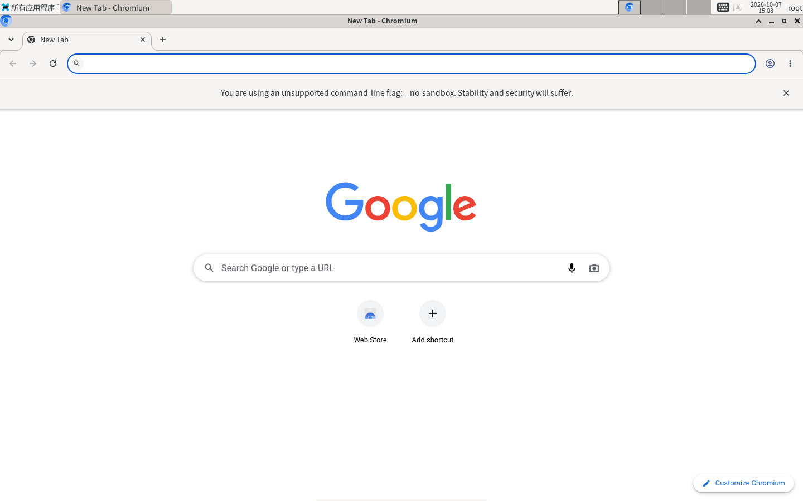
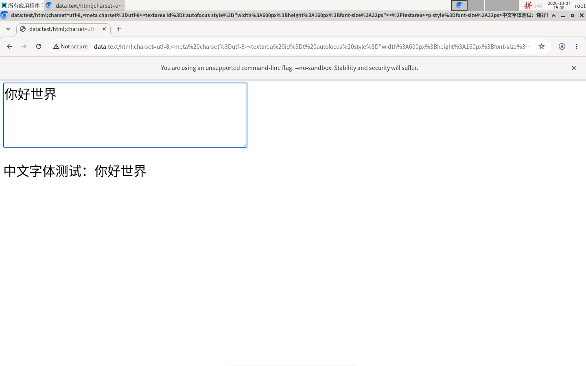

# Docker 桌面 maclaw-gui:2 使用与运维手册

`maclaw-gui:2` 是 desktopd 为每个 `tenant+user` 启动的新版桌面镜像:
完整 XFCE 桌面 + Chromium + fcitx5 中文拼音,纯 CPU 渲染,不需要 GPU。
Agent(CDP、xdotool、截图)和人(noVNC)用同一个桌面。

本文覆盖镜像能力、架构、构建、部署(Windows / Linux)、Hub 配置、
从 `maclaw-gui:1` 迁移、截图 API、验证、回滚、已知问题与安全建议。
desktopd 服务本身的说明见 [desktopd/README.md](../desktopd/README.md)。



## 公开镜像(快速开始)

`maclaw-gui:2` 有公开的预构建镜像,**匿名即可拉取**,不需要登录 GHCR:

| 镜像 | 说明 |
| --- | --- |
| `ghcr.io/rapidai/maclaw-gui:2` | 当前 v2,随 main 上 `desktopd/image/**` 的改动更新 |
| `ghcr.io/rapidai/maclaw-gui:2-<短sha>` | 固定到某次提交(如 `2-cc24156`),不会再变 |
| `ghcr.io/rapidai/maclaw-gui:latest` | 与 main 上最新的 `2` 相同 |
| `ghcr.io/rapidai/maclaw-gui@sha256:<digest>` | 按内容固定,docker 拉取时校验 |

由 `.github/workflows/desktop-image.yml` 构建(`debian:bookworm` + deb.debian.org,仅 linux/amd64),
推送前先过镜像契约检查和镜像文件系统的密钥扫描。包页面:
<https://github.com/orgs/RapidAI/packages/container/package/maclaw-gui>。
首个公开版本:`2-cc24156` = `sha256:4078a47c8712c61486702e7c5623a77166b9551b1fe31407809bff936afbfed6`
(压缩后约 783MB,解压约 1.85GB)。

```sh
docker pull ghcr.io/rapidai/maclaw-gui:2
docker tag ghcr.io/rapidai/maclaw-gui:2 maclaw-gui:2      # desktopd 和 Hub 配置用的本地名
# 固定 digest(生产推荐;digest 见包页面或 docker inspect --format '{{index .RepoDigests 0}}')
docker pull ghcr.io/rapidai/maclaw-gui@sha256:4078a47c8712c61486702e7c5623a77166b9551b1fe31407809bff936afbfed6
```

验证匿名拉取(不需要任何凭据,返回 `HTTP 200` 和 `docker-content-digest`):

```sh
T=$(curl -s "https://ghcr.io/token?scope=repository:rapidai/maclaw-gui:pull" | python3 -c 'import sys,json;print(json.load(sys.stdin)["token"])')
curl -sI -H "Authorization: Bearer $T" \
  -H 'Accept: application/vnd.docker.distribution.manifest.v2+json,application/vnd.oci.image.index.v1+json' \
  https://ghcr.io/v2/rapidai/maclaw-gui/manifests/2 | grep -Ei '^HTTP|docker-content-digest'
```

**desktopd 自动拉取**:desktopd 发现本机没有 `maclaw-gui:2` 时(启动时在后台检查一次,打开桌面时
按需再检查),会拉取 `DESKTOPD_IMAGE_SOURCE`(默认 `ghcr.io/rapidai/maclaw-gui:2`),跑一遍镜像契约检查,
通过后再打成本地 tag `maclaw-gui:2`。本机**已有**这个镜像时什么都不做:不会重新拉取,也不会自动替换。
关闭:`DESKTOPD_IMAGE_SOURCE=off`。细节见 [3.1](#31-desktopd-自动拉取与部署脚本的镜像来源)。

**中国大陆**:从 ghcr.io 拉取可能很慢甚至超时。可以:

- 继续在主机上构建(生产做法,腾讯云自动使用腾讯镜像源,见第 3 节);
- 把 `DESKTOPD_IMAGE_SOURCE` 指向可访问的 ghcr.io 代理/镜像仓库(例如自建的 registry,内容按 digest
  固定以防被替换),如 `DESKTOPD_IMAGE_SOURCE=registry.example.cn/rapidai/maclaw-gui@sha256:<digest>`;
- 在海外机器上 `docker pull` 后 `docker save ghcr.io/rapidai/maclaw-gui:2 | zstd > gui2.tar.zst`,传到主机
  `zstd -dc gui2.tar.zst | docker load`,再 `docker tag` 成 `maclaw-gui:2`。

## 1. 镜像提供什么

| 能力 | 说明 |
| --- | --- |
| 桌面 | Debian 12 + XFCE(面板、Thunar、xfce4-terminal、Mousepad),`startxfce4` 启动;没有 XFCE 的旧镜像自动回退 fluxbox |
| 浏览器 | Chromium,CDP 端口经 token gate 暴露;登录态写在每用户 profile 卷里 |
| 共用浏览器 | 面板/底部 dock 的“网络浏览器”、应用菜单、`xdg-open`/`exo-open`、`x-www-browser` 都进入**同一个**受监管 Chromium(同 profile、同登录态、带 CDP):有窗口就恢复并激活(含最小化窗口),带链接就作为新标签打开;浏览器被关掉/崩溃时只重启浏览器(恢复 CDP 与登录态),不会再起第二套桌面。实现见 `desktop_supervisor.py browser` 与 `/usr/bin/maclaw-browser`、`/etc/chromium.d/zz-maclaw-shared-browser` |
| 中文输入 | fcitx5 + 拼音,默认输入法列表 `keyboard-us` + `pinyin`,**Ctrl+Space** 切换;`GTK_IM_MODULE/QT_IM_MODULE/XMODIFIERS=fcitx`,`LANG=zh_CN.UTF-8` |
| 字体 | Noto Sans/Serif CJK SC(fontconfig 默认中文字体),emoji 字体 |
| 软件安装 | 容器内是 root,可以 `apt-get install`;装到 `/opt`、`/usr/local` 的东西在每用户卷里,重建容器也保留 |
| apt 源 | 镜像只带 `deb.debian.org`(构建用的 `APT_MIRROR` 不进成品)。每次打开桌面,supervisor 在后台测 `deb.debian.org` 与 `mirrors.tencent.com`(直连与经 `HTTP(S)_PROXY` 各一次),把更快的写进 `/etc/apt/sources.list.d/debian.sources`,有出口代理时写 `/etc/apt/apt.conf.d/90maclaw-proxy`(选中的源若直连更快则对它 `DIRECT`),并让 sudo 保留代理变量(`/etc/sudoers.d/maclaw-proxy-env`);结果在 `/var/lib/maclaw/apt-mirror.json`,24 小时或代理变化后重测。容器环境变量 `MACLAW_APT_MIRROR` 覆盖:主机名/URL(多个用逗号分隔则在其中测速)、`off` 保留自己的源。手动重测:`python3 /desktop_supervisor.py apt-mirror`。用户自己改成其他镜像站的 debian.sources 不会被覆盖 |
| 分辨率 | 默认 `1440x900x24`;容器环境变量 `MACLAW_DESKTOP_GEOMETRY=1920x1080x24` 覆盖(格式 `宽x高[x色深]`,非法值回退默认) |
| 工具 | noVNC/websockify、x11vnc、xdotool、ImageMagick `import`、scrot、at-spi2(无障碍树) |



## 2. 架构

```
Hub / MaClawSrv ──HTTP Bearer DESKTOPD_TOKEN──> desktopd (127.0.0.1:18081,对外经 nginx 反代)
                                                   │ docker run / exec
                                                   ▼
                      容器 maclaw-desktop-<key>(--restart unless-stopped)
                      desktop_supervisor.py(每个 display 一套进程,pid 记在 pids.json)
                        ├─ Xvfb :20  (1440x900x24)
                        ├─ dbus-daemon  unix:path=/tmp/.maclaw-dbus-20   ← XFCE/fcitx5/Chromium 共用
                        ├─ startxfce4(xfwm4、xfce4-panel、xfdesktop…)
                        ├─ fcitx5 -d
                        ├─ Chromium  --remote-debugging-port=18000+display(只监听容器内)
                        ├─ x11vnc  localhost:5900  →  websockify 127.0.0.1:6081
                        ├─ gate 19020/tcp  → Chromium CDP(要求 Bearer gate token)
                        └─ gate 6080/tcp   → noVNC/websockify(要求 Bearer gate token)
```

- **端口**:容器只发布 `19020/tcp`(CDP gate)和 `6080/tcp`(noVNC gate),映射到宿主机随机端口;
  desktopd 用 `docker port` 查出端口,拼成 `cdp_url` / `novnc_url` 返回(主机名是
  `DESKTOPD_ADVERTISE_HOST`)。Chromium 调试端口、x11vnc、websockify 都只在容器内。
- **CDP / noVNC 鉴权**:每个容器一个随机 gate token,以 URL userinfo 形式放在
  `http://desktop:<token>@host:port` 里分发;客户端要转成 `Authorization: Bearer <token>`
  (MaClawSrv 的 CDP 客户端、Hub 的 noVNC 代理会自动做)。无 token 或 token 错误直接拒绝。
  Chromium 的 `/json` 拒绝 Host 为域名的请求,手动调试时用 IP 或 localhost 访问
  (`desktopd/scripts/cdp.py` 默认 `--host 127.0.0.1`)。
- **D-Bus 会话共享**:supervisor 为每个 display 启一个 `dbus-daemon --session`,地址固定为
  `unix:path=/tmp/.maclaw-dbus-<display>`,XFCE、fcitx5、Chromium 都用它。否则每个程序各自
  autolaunch 一个 bus,fcitx5 在 Chromium 里不可用。调试时:
  `docker exec -e DISPLAY=:20 -e DBUS_SESSION_BUS_ADDRESS=unix:path=/tmp/.maclaw-dbus-20 <容器> fcitx5-remote`
  (返回 2 = 拼音激活,1 = 英文)。
- **close_range 垫片**:Docker 20.10 + libseccomp < 2.5.2 的默认 seccomp 对 `close_range`
  返回 `EPERM`(而不是 `ENOSYS`),GLib ≥ 2.74 因此认为 spawn 失败,XFCE 组件、Thunar、
  终端都起不来。镜像里的 `close_range_shim.c` 编译成 `/usr/local/lib/...` 下的 so,并写进
  `/etc/ld.so.preload`,把 `EPERM` 改成 `ENOSYS`,GLib 回退到逐个 close 的路径。仅 x86_64;
  Docker ≥ 23 / libseccomp ≥ 2.5.2 的主机不需要,但留着无害。
- **残留 X 锁清理**:`docker stop` 超时后会 SIGKILL Xvfb,留下 `/tmp/.X20-lock` 与
  `/tmp/.X11-unix/X20`,下次启动 Xvfb 报 "Server is already active",而残留 socket 又让
  display 看起来已就绪。supervisor 的 `clear_stale_display()` 只在锁里的 pid 不是存活的
  Xvfb 时删除这两个文件。
- **每用户持久化**:4 个私有卷 `maclaw-desktops-<key>`(`/desktops`,profile 与日志)、
  `maclaw-home-<key>`(`/home/desktop`)、`maclaw-opt-<key>`(`/opt`)、
  `maclaw-local-<key>`(`/usr/local`)。容器层(apt 装的软件)在停止/迁移时 commit 成
  `maclaw-desktop-user-<key>:state`。

## 3. 构建镜像

构建上下文是 `desktopd/image`,Dockerfile 是 `Dockerfile.v2`。build args:

| 参数 | 默认 | 说明 |
| --- | --- | --- |
| `BASE_IMAGE` | `debian:bookworm` | 无法访问 Docker Hub 时换成镜像站 |
| `APT_MIRROR` | 空(deb.debian.org) | 只写主机名,如 `mirrors.tencentyun.com`;只用于构建,成品镜像的源恢复为 deb.debian.org(内网源在其他主机和出口代理后不可达) |

```sh
# 能访问 Docker Hub
docker build -f desktopd/image/Dockerfile.v2 -t maclaw-gui:2 desktopd/image

# 腾讯云(生产主机,无 Docker Hub)
docker build -f desktopd/image/Dockerfile.v2 \
  --build-arg BASE_IMAGE=mirror.ccs.tencentyun.com/library/debian:bookworm \
  --build-arg APT_MIRROR=mirrors.tencentyun.com \
  -t maclaw-gui:2 desktopd/image
```

部署脚本(`desktopd/remote_deploy.sh`)会在主机上先构建到临时 tag,检查镜像契约后才打
`maclaw-gui:2`,失败不覆盖旧镜像;能访问腾讯云元数据服务时自动用上面的腾讯镜像源。
覆盖变量:`DESKTOPD_BASE_IMAGE`、`DESKTOPD_APT_MIRROR`(`none` = deb.debian.org)、
`DESKTOPD_SKIP_IMAGE_BUILD=1`;不想构建时用公开镜像(`DESKTOPD_IMAGE_FROM=pull|auto`,见 3.1)。不要删除或重新打 tag `maclaw-gui:1`,迁移和回滚都依赖它。

### 3.1 desktopd 自动拉取与部署脚本的镜像来源

**desktopd 运行时**(`desktopd/image_source.go`):

| 变量 | 默认 | 说明 |
| --- | --- | --- |
| `DESKTOPD_IMAGE_SOURCE` | `ghcr.io/rapidai/maclaw-gui:2` | 本地 `maclaw-gui:2` 缺失时从哪里拉。可写 `@sha256:` digest;`off`/`none` 关闭;多个镜像用 `本地名=引用,...`,如 `maclaw-gui:2=ghcr.io/rapidai/maclaw-gui:2-cc24156` |
| `DESKTOPD_IMAGE_PULL_TIMEOUT` | `30m` | 单次拉取超时(Go duration,如 `45m`) |

- 启动时在后台检查(不阻塞 `/v1/health` 和管理面板);打开桌面(含迁移重建前的“新镜像必须存在”检查)
  时按需检查。同一镜像同时只有一个拉取,其他请求等待同一个结果;调用方超时(Hub 约 2 分钟)不会
  中断拉取,下次请求直接用拉好的镜像。
- 顺序:`docker pull <source>` → 契约检查(与 `remote_deploy.sh` 相同的工具清单)→ 再确认本地仍没有
  `maclaw-gui:2`(期间有人构建了就保留本地的)→ `docker tag <镜像ID> maclaw-gui:2`。
- 失败(网络不通、超时、契约不通过):不打 tag、不碰现有容器,迁移不会开始,用户的旧桌面保持原样;
  1 分钟内不重复拉取;日志提示改为在主机上构建。配置了来源的镜像不会再退回 `docker pull maclaw-gui:2`
  (那会去 Docker Hub)。没有配置来源的其他镜像名保持原来的直接 `docker pull`。
- 管理面板“镜像来源”一行显示状态:本地已有或未触发 / 拉取中 / 已拉取 / 拉取失败(含原因)。
- 日志关键字:`image maclaw-gui:2 is missing; pulling`、`ready from`、`failed after`、`is present; not pulling`。

**部署脚本**(`remote_deploy.sh`、`deploy_desktopd.cmd`、`deploy/linux/rollout_*`):

| 变量 | 默认 | 说明 |
| --- | --- | --- |
| `DESKTOPD_IMAGE_FROM` | `build` | `build`:主机上 `docker build`(生产默认,不变);`pull`:拉 `DESKTOPD_IMAGE_SOURCE`、契约检查、打 tag,失败则部署失败且旧镜像不变;`auto`:先拉(受超时限制),失败再构建 |
| `DESKTOPD_IMAGE_SOURCE` | `ghcr.io/rapidai/maclaw-gui:2` | 同上;显式传入时同时写进主机 `.env`,desktopd 运行时也用它 |
| `DESKTOPD_IMAGE_PULL_TIMEOUT` | `30m` | 脚本里用 coreutils `timeout`(`30m`、`1800s`);显式传入时写进 `.env` |
| `DESKTOPD_SKIP_IMAGE_BUILD` | `0` | `1` = 不构建也不拉取,要求镜像已存在 |

```sh
# 海外/能访问 ghcr 的主机:直接用公开镜像,按 digest 固定
DESKTOPD_IMAGE_FROM=pull \
DESKTOPD_IMAGE_SOURCE=ghcr.io/rapidai/maclaw-gui@sha256:4078a47c8712c61486702e7c5623a77166b9551b1fe31407809bff936afbfed6 \
  deploy/linux/rollout_desktop_gui2.sh deploy-desktopd
# 先试拉 10 分钟,不行再构建
DESKTOPD_IMAGE_FROM=auto DESKTOPD_IMAGE_PULL_TIMEOUT=10m deploy/linux/rollout_desktop_gui2.sh deploy-desktopd
```

```bat
:: Windows
set DESKTOPD_IMAGE_FROM=pull
deploy_desktopd.cmd docker-host.example
```

与构建一样,部署脚本的 `pull`/`auto` 是运维显式操作,会把 `maclaw-gui:2` 指向新拉的镜像;desktopd
运行时只补缺失的镜像,从不替换。desktopd 比较的是镜像**名**:`maclaw-gui:2` 指向新内容后,已有用户
不会因此重建,只有新建/重建的容器用新内容;要让所有人换新版,用新的镜像名并修改 Hub 配置(第 6 节)。

## 4. 部署

一台 Docker 主机上同时跑 desktopd、Hub、MaClawSrv 时,按顺序部署:
**备份 → desktopd(含镜像构建)→ Hub → MaClawSrv → 验证 → 冒烟 → 切换 Hub 镜像**。
在 Hub 配置切换之前,已有用户继续用 `maclaw-gui:1`,不会被迁移。

### 4.1 Windows(原有脚本)

```bat
deploy_desktopd.cmd      :: 编译 desktopd、打包 image/,上传并执行 desktopd/remote_deploy.sh
deploy_all.cmd           :: Hub(deploy/deploy_all_ha.ps1 deploy_hub)
deploy_maclawsrv.cmd     :: MaClawSrv
```

### 4.2 Linux / macOS(`deploy/linux/rollout_desktop_gui2.sh`)

本地脚本负责交叉编译、打包、断点续传上传;主机端步骤在 `deploy/linux/rollout_remote.sh`,
工具脚本在 `desktopd/scripts/`(一起上传到 `$REMOTE_TMP/scripts`)。依赖:go、git、xz、
rsync、ssh(用密码登录时再加 `sshpass`)。

```sh
export REMOTE_HOST=hubs.example.com          # 必填
export GOTOOLCHAIN=go1.26.5                  # 可选:与生产二进制一致
# 用密码登录时只通过环境变量传:read -rs SSHPASS; export SSHPASS(不要写进文件/历史)

deploy/linux/rollout_desktop_gui2.sh build upload     # 编译 + 上传(rsync --partial,断线自动续传)
deploy/linux/rollout_desktop_gui2.sh backup           # 记下输出里的时间戳 <ts>
deploy/linux/rollout_desktop_gui2.sh deploy-desktopd  # 主机上后台执行,轮询日志
deploy/linux/rollout_desktop_gui2.sh deploy-hub deploy-maclawsrv
HUB_PUBLIC_URL=https://hub.example.com deploy/linux/rollout_desktop_gui2.sh verify
deploy/linux/rollout_desktop_gui2.sh smoke            # 测试用户冒烟(见第 8 节)
CONFIRM=1 deploy/linux/rollout_desktop_gui2.sh switch-image   # 改 Hub 配置为 maclaw-gui:2
```

`all` = `build upload backup deploy-desktopd deploy-hub deploy-maclawsrv verify`(不含切换)。
`ONLY="desktopd"` 只编译/上传部分组件。常用变量:

| 变量 | 默认 | 说明 |
| --- | --- | --- |
| `REMOTE_HOST` / `REMOTE_USER` / `REMOTE_PORT` | — / `root` / `22` | SSH 目标;复用 ControlMaster 连接,连接被重置(exit 255)自动重试 |
| `REMOTE_TMP` | `/tmp/maclaw_gui2_rollout` | 主机上的上传目录 |
| `DESKTOPD_ADVERTISE_HOST` | `REMOTE_HOST` | 仅首次部署写入 `.env`;已有值保留 |
| `DESKTOPD_BASE_IMAGE` / `DESKTOPD_APT_MIRROR` / `DESKTOPD_SKIP_IMAGE_BUILD` | 自动 | 同第 3 节 |
| `DESKTOPD_IMAGE_FROM` / `DESKTOPD_IMAGE_SOURCE` / `DESKTOPD_IMAGE_PULL_TIMEOUT` | `build` / ghcr / `30m` | 镜像来源,见 3.1 |
| `DESKTOP_IMAGE` / `DESKTOP_MEMORY` / `DESKTOP_CPUS` / `DESKTOP_SHM` | `maclaw-gui:2` / `3g` / `1.5` / `1g` | `switch-image` 写入 Hub 的值 |
| `DESKTOP_SERVER_ID` | 空 = 全部服务 | 只切换某一个 Docker 服务 |
| `BACKUP_TS` | 上次 backup 的时间戳 | `rollback` 用 |

主机端目录默认 `/data/soft/maclaw_desktopd`、`/data/soft/hub`、`/data/soft/maclaw_srv`,
可用 `DESKTOPD_DEPLOY_DIR`、`HUB_DIR`、`MACLAWSRV_DEPLOY_DIR` 覆盖(直接在主机上运行
`rollout_remote.sh` 时)。各步骤说明:

- `backup`:`<目录>.bak.<ts>`(desktopd 的 bin/image/.env/state 和容器里的 supervisor,
  Hub 的二进制/start.sh/configs/web 和桌面服务配置,MaClawSrv 的二进制/.env/start.sh/unit),
  以及 `/data/soft/backups/gui2-rollout-<ts>/`(服务状态、容器/镜像/卷列表、inspect、md5)。
  目录权限 700,文件 600(含 `.env` 副本)。
- `deploy-desktopd`:调用未改动的 `desktopd/remote_deploy.sh`(与 Windows 相同)。
- `deploy-hub`:替换二进制、`meeting_asr_worker`、`start.sh`、`config.example.yaml`,web 目录先
  在旁边暂存并用 sha256 清单校验再整体替换;**保留 `configs/config.yaml`**;`./start.sh` 重启后
  轮询 `/healthz`。
- `deploy-maclawsrv`:要求主机上已有 `.env`(只补缺失键,不覆盖);写 `start.sh` 与 systemd unit
  (示例见 `deploy/linux/systemd/`),重启后打印 `/health`、`/version`。

nginx 反代示例:`desktopd/deploy/nginx-dockerd.conf.example`(只反代 desktopd API,
不暴露容器端口)。

### 4.3 新主机只部署 desktopd(能访问 ghcr.io)

已验证于 Ubuntu 24.04 + Docker 29(主机上已有 nginx 与通配证书,另有 Hub 在跑也不受影响):

```sh
export REMOTE_HOST=hubs.example.com GOTOOLCHAIN=go1.26.5 ONLY=desktopd
deploy/linux/rollout_desktop_gui2.sh build upload
DESKTOPD_ADVERTISE_HOST=dockerd.example.com DESKTOPD_IMAGE_FROM=pull \
  deploy/linux/rollout_desktop_gui2.sh deploy-desktopd     # 镜像解压后约 2.7GB,境外主机约 2 分钟
```

- 首次部署在 `/data/soft/maclaw_desktopd/.env`(600)生成新的 `DESKTOPD_TOKEN`,不要复用其他实例的。
- `DESKTOPD_ADVERTISE_HOST` 要填对外域名:它出现在返回给 Hub 的 `cdp_url`/`novnc_url` 里。
- nginx:按 `desktopd/deploy/nginx-dockerd.conf.example` 改 `server_name` 和证书路径,放进
  `/etc/nginx/conf.d/`,`nginx -t && systemctl reload nginx`;不带 token 访问
  `https://dockerd.example.com/v1/health` 应返回 401。
- 冒烟:`TEST_USER=deploy-test MIGRATE=0 DESKTOPD_URL=https://dockerd.example.com sh $REMOTE_TMP/scripts/smoke_gui2.sh`
  (新主机没有 maclaw-gui:1,必须 `MIGRATE=0`),结束后用 `dapi.sh POST /v1/desktops/stop` 停掉测试桌面。
- 防火墙:每个桌面的 CDP/noVNC gate 端口由 Docker 发布在随机高位端口(如 32768+),Docker 的
  iptables 规则绕过 ufw,所以 ufw 不放行也能从公网访问;这些端口只靠每桌面 token 保护。
  需要收紧时在 `DOCKER-USER` 链限制来源,而不是改 ufw。

## 5. Hub 配置

Hub 把 Docker 桌面服务存在 `system_settings` 表的 `desktop_service` 键(多租户为
`tenant:<id>:desktop_service`),每次请求都读,改完立即生效、不用重启。结构示例:
`desktopd/deploy/desktop_service.settings.example.json`。

| 字段 | 推荐值 | 说明 |
| --- | --- | --- |
| `base_url` | `https://dockerd.example.com` | desktopd 地址 |
| `access_token` | desktopd 的 `DESKTOPD_TOKEN` 或面板里的额外 key | 不会在 API 返回里回显 |
| `image` | `maclaw-gui:2` | 改这个字段触发迁移(见第 6 节) |
| `memory` / `cpus` / `shm_size` | `3g` / `1.5` / `1g` | XFCE + Chromium 低于 2g 容易 OOM |

修改方式(三选一):

1. Hub 管理页 → "桌面服务" → 编辑服务。
2. Admin API(租户管理员登录态):
   ```sh
   curl -X PATCH https://hub.example.com/api/admin/desktop-services/<server_id> \
     -H "Authorization: Bearer <admin-session-token>" -H 'Content-Type: application/json' \
     -d '{"name":"docker-desktop-1","base_url":"https://dockerd.example.com","image":"maclaw-gui:2","memory":"3g","cpus":"1.5","shm_size":"1g"}'
   ```
   不带 `access_token` 字段时保留原 token。
3. 在 Hub 主机上直接改库(rollout 用的方式,先备份):
   ```sh
   export HUB_DB=/data/soft/hub/data/codeclaw-hub.db
   python3 desktopd/scripts/hub_desktop_settings.py show                 # token 已打码
   python3 desktopd/scripts/hub_desktop_settings.py backup /root/desktop_service.json
   python3 desktopd/scripts/hub_desktop_settings.py set --image maclaw-gui:2 --memory 3g --cpus 1.5 --shm 1g --dry-run
   python3 desktopd/scripts/hub_desktop_settings.py set --image maclaw-gui:2 --memory 3g --cpus 1.5 --shm 1g
   python3 desktopd/scripts/hub_desktop_settings.py restore /root/desktop_service.json   # 撤销
   ```
   `--server-id` 只改一个服务,`--tenant <id>` 改租户级配置。

Hub 的 `/api/v1/desktop-services/*`(MaClawSrv 远程调用、截图)需要 Hub 进程环境变量
`MACLAW_DESKTOP_API_TOKEN`,MaClawSrv 的 `.env` 里配同一个值和 `MACLAW_HUB_URL`;未设置时
这些接口一律返回 401。

## 6. 从 maclaw-gui:1 迁移

- **懒迁移**:改 Hub 配置不会重建任何容器。只有用户下次**打开桌面**(Hub 管理页创建/查看、
  机器人消息触发桌面、`/api/v1/desktop-services/session`)时,desktopd 发现容器标签
  `maclaw.image`(旧容器没有标签,视为 `maclaw-gui:1`)与请求镜像不同,才重建这一个容器。
  内存/shm 变化或私有卷未挂载同样触发重建。
- **重建过程**:Chromium 落盘登录态 → `docker stop` → 容器层 commit 为
  `maclaw-desktop-user-<key>:state`(带旧 `maclaw.image` 标签)→ 删除容器 → 用新镜像重建,
  4 个私有卷原样挂回。
- **`:state` 与 `:prev`**:`:state` 只在标签与新镜像一致时作为启动镜像;不一致时改名为
  `maclaw-desktop-user-<key>:prev`(只保留一代),用户从干净的 `maclaw-gui:2` 开始。
- **保留**:浏览器登录态与 profile、`/home/desktop`、`/opt`、`/usr/local`、`/desktops`。
- **不保留**:apt 装进旧镜像层的软件(在 `:prev` 里,需要时手动找回或重新安装)、
  旧桌面(fluxbox)的窗口布局、`/tmp`。
- 比较的是镜像**名**:原地重建 `maclaw-gui:2` 不会让大家重建;要强制全员换新镜像,用新 tag
  (如 `maclaw-gui:3`)并改 Hub 配置。

查看迁移状态:

```sh
docker ps -a --filter name=maclaw-desktop- --format '{{.Names}}\t{{.Image}}\t{{.Label "maclaw.image"}}\t{{.Status}}'
docker images 'maclaw-desktop-user-*'
journalctl -u maclaw-desktopd | grep -E 'recreating|keeping it as'
```

## 7. 截图 API

三层接口都返回整个桌面的 PNG(只截已运行的桌面,不会因此启动容器)。

**desktopd**(Bearer `DESKTOPD_TOKEN`,直接返回 `image/png`):

```sh
curl -fsS -H "Authorization: Bearer $DESKTOPD_TOKEN" \
  "https://dockerd.example.com/v1/desktops/screenshot?tenant_id=tenant_default&user_id=<user_id>" -o desk.png
curl -fsS -X POST -H "Authorization: Bearer $DESKTOPD_TOKEN" -H 'Content-Type: application/json' \
  -d '{"tenant_id":"tenant_default","user_id":"<user_id>","display":":20"}' \
  https://dockerd.example.com/v1/desktops/screenshot -o desk.png
# 在 desktopd 主机上(从 .env 读 token,不打印):
desktopd/scripts/dapi.sh GET '/v1/desktops/screenshot?tenant_id=tenant_default&user_id=<user_id>' > desk.png
```

**Hub**(Bearer `MACLAW_DESKTOP_API_TOKEN`,返回 JSON):

```sh
curl -fsS -X POST -H "Authorization: Bearer $MACLAW_DESKTOP_API_TOKEN" -H 'Content-Type: application/json' \
  -d '{"tenant_id":"tenant_default","user_id":"<user_id>"}' \
  https://hub.example.com/api/v1/desktop-services/screenshot | python3 -c \
  'import sys,json,base64; d=json.load(sys.stdin); open("desk.png","wb").write(base64.b64decode(d["image_base64"])); print(d["mime"], d["bytes"])'
```

**Agent**:MaClawSrv 的 `desktop` 工具 `{"action":"screenshot"}`。配置了 `MACLAW_HUB_URL` +
`MACLAW_DESKTOP_API_TOKEN` 时走 Hub,否则截本机 `maclaw-gui` 容器;图片附给支持视觉的模型
(过大时转 JPEG),对话历史里只有尺寸说明,像素坐标与 `app_run` 点击坐标一致。

## 8. 验证与冒烟

部署后(`rollout_desktop_gui2.sh verify` 会做前 3 项):

1. `systemctl is-active maclaw-desktopd maclawsrv`;`desktopd/scripts/dapi.sh GET /v1/health`;
   `curl 127.0.0.1:9399/healthz`;`curl 127.0.0.1:18080/health`。
2. `docker image inspect maclaw-gui:2`,`maclaw-gui:1` 仍存在。
3. 容器列表里已有用户仍是 `maclaw-gui:1`(切换前)。
4. 测试用户冒烟(只动测试用户的容器、卷、镜像):
   ```sh
   # 主机上,root
   TEST_USER=rollout-test-gui2 MIGRATE=1 STOP_AFTER=1 sh desktopd/scripts/smoke_gui2.sh
   # 只测新镜像
   TEST_USER=rollout-test-gui2b MIGRATE=0 sh desktopd/scripts/smoke_gui2.sh
   ```
   覆盖:v1 建桌面并在 4 个卷写标记 → v2 打开 → 标签、`:prev`、卷与标记保留、资源;
   desktopd 截图 PNG;XFCE/fcitx5/Xvfb/x11vnc 进程;CDP 经 gate 可用、无 token 被拒;CJK 字体;
   在 Chromium 里用拼音输入 "nihao shijie" 得到 "你好世界";desktopd 日志无错误。
   输出(截图、session.json 不保留)在 `OUT_DIR=/tmp/maclaw-gui2-smoke`,失败时退出码非 0。
5. 手动 CDP:`dapi.sh POST /v1/desktops/session '{"tenant_id":"tenant_default","user_id":"rollout-test-gui2"}' > s.json`,
   然后 `python3 desktopd/scripts/cdp.py --session s.json version|list|eval '<js>'|navigate '<url>'`
   (`s.json` 含 gate token,用完删除)。
6. 人工:Hub 管理页"桌面服务"打开测试用户的 noVNC,确认 XFCE 面板、Ctrl+Space 切拼音、终端可 `apt-get install`。

清理测试用户(确认名字后再执行):

```sh
desktopd/scripts/dapi.sh POST /v1/desktops/stop '{"tenant_id":"tenant_default","user_id":"rollout-test-gui2"}'
docker ps -a --filter label=maclaw.user=rollout-test-gui2 -q    # 找到容器后 docker rm,
# 再按容器名里的 <key> 删除 maclaw-{desktops,home,opt,local}-<key> 卷和 maclaw-desktop-user-<key>:* 镜像
```

## 9. 回滚

1. **先回滚 Hub 配置**(阻止更多用户迁移):
   `python3 desktopd/scripts/hub_desktop_settings.py restore /data/soft/hub.bak.<ts>/desktop_service.settings.json`,
   或 `CONFIRM=1 DESKTOP_IMAGE=maclaw-gui:1 DESKTOP_MEMORY=2500m DESKTOP_SHM=512m rollout_desktop_gui2.sh switch-image`。
2. **二进制**:`BACKUP_TS=<ts> deploy/linux/rollout_desktop_gui2.sh rollback`(按顺序恢复 Hub 配置、
   desktopd 二进制与 image 目录、Hub 二进制/worker/start.sh/web、MaClawSrv 二进制,并重启)。
   Windows 部署的环境同样可以手动从 `<目录>.bak.<ts>` 复制回去。
3. **已迁移到 v2 的用户**:Hub 配置回到 `maclaw-gui:1` 后,下次打开会再次按标签重建为 v1
   (卷保留)。自动重建时 v2 的容器层会被改名为 `:prev`,**覆盖**迁移前 v1 的 `:prev`。
   要找回迁移前 v1 容器层(apt 装的软件),在用户重新打开桌面**之前**执行:
   ```sh
   docker image inspect --format '{{index .Config.Labels "maclaw.image"}}' maclaw-desktop-user-<key>:prev  # 应为 maclaw-gui:1 或空
   docker stop maclaw-desktop-<key> && docker rm maclaw-desktop-<key>     # 命名卷不受影响
   docker tag maclaw-desktop-user-<key>:prev maclaw-desktop-user-<key>:state
   ```
   之后用户打开桌面时 desktopd 直接用这个 `:state` 建 v1 容器(标签一致)。
   注意 v2 期间 apt 装进容器层的软件因此丢弃;卷里的数据都在。
4. `maclaw-gui:1` 镜像和用户卷不要删除;回滚不需要重建镜像。

## 10. 已知问题

- **桌面以 root 运行**:Chromium 带 `--no-sandbox`(页面顶部有提示条),依赖容器隔离;容器内用户
  可以 apt 安装软件,也就能改动自己容器里的一切。
- **close_range 垫片仅 x86_64**:ARM 主机构建会跳过/失败,需要 Docker ≥ 23 或 libseccomp ≥ 2.5.2。
- **Ubuntu 18.04 / Docker 20.10 主机**:默认 seccomp 拦 `close_range`(见垫片);systemd 237 不支持
  `StandardOutput=append:`,日志看 `journalctl -u maclaw-desktopd` / `-u maclawsrv`;sqlite 3.22 没有
  UPSERT,`hub_desktop_settings.py` 用 UPDATE/INSERT。
- **上行慢的部署机**:二进制压缩后仍有几十 MB。用 `rollout_desktop_gui2.sh upload`(rsync `--partial`
  断点续传)或在离主机近的机器上编译;镜像在主机上构建或从 ghcr.io 拉取,不要上传镜像。
- **新主机首次启动 desktopd**:本机没有 `maclaw-gui:2` 时会在后台从 ghcr.io 拉取约 800MB;大陆主机可能
  很慢,在拉完之前打开桌面会返回“still being pulled”。不需要时设 `DESKTOPD_IMAGE_SOURCE=off` 并在主机上构建。
- **Hub 未设 `MACLAW_DESKTOP_API_TOKEN`**:`/api/v1/desktop-services/*` 全部 401,MaClawSrv 远程截图
  和远程桌面会失败;Hub 管理页不受影响。
- **旧镜像建出的容器里任务栏浏览器打不开**(“无法执行默认网络浏览器/输入输出错误”):原因是 XFCE 默认浏览器
  走 `sensible-browser → /usr/bin/chromium`,以 root 且无 `--no-sandbox` 直接退出,即使启动也是另一个无登录、
  无 CDP 的 profile。已修复:新 supervisor 在每次 `ensure`(打开桌面)时写入共用浏览器配置,所以已有容器只需
  按正常部署 `docker cp` 新 supervisor,下次打开桌面即生效,无需重建容器;新建容器用重建后的镜像。
- **停止后再打开,noVNC 反复“桌面 → Connecting → 桌面”**:docker start 后第一次 `ensure` 若被打断
  (desktopd 重启、请求中断、Chromium 启动超时),会留下没记进 `pids.json` 的 Xvfb/XFCE/x11vnc/websockify;
  `pids.json` 在卷上跨 docker stop 保留,重启后旧 pid 又可能被别的进程复用。下一次打开会再起一套桌面,新的
  websockify 绑不上 6081,watcher 每 2 秒杀掉正在用的 x11vnc 重来,于是每 4–5 秒断一次。已修复:supervisor
  按命令行认领容器里实际在跑的桌面进程,`pids.json` 带容器启动标记(重启前的记录作废)、启动中逐步写入,
  watcher 回收僵尸进程,部署新 supervisor 后旧 watcher 在下次打开时被替换。已在运行的容器 `docker cp` 新
  supervisor 后,下次打开桌面(无需停止)即收敛。
- **停止再打开后 Google 网站显示已退出,其他网站仍登录**:Hub 的停止路径是优雅的(supervisor `flush` →
  CDP `Browser.close` → `exit_type` Normal → docker stop),cookie 都在盘上。原因是 Chromium 的
  “允许 Chromium 登录”(`signin.allowed`):没有 Google API key 的 Linux 构建开着它时,每次浏览器启动都会让
  Google 网站登出。已修复:`install-browser`/`ensure` 写入托管策略
  `/etc/chromium/policies/managed/maclaw-browser-signin.json`(`{"BrowserSignin": 0}`),supervisor 启动浏览器前
  把 Preferences 的 `signin.allowed`/`allowed_on_next_startup` 设为 false。下一次浏览器启动生效,此后需重新
  登录 Google 一次。每次停止/启动在 `desktop.log` 记录 Google 登录 cookie 的数量
  (`[maclaw] stop: before quit: google sign-in cookies browser=N disk=M`,只有数量)便于排查。
- 截图只截已在运行的 display;桌面没开时返回错误而不是启动桌面。
- 重建会断开该用户当前的 noVNC/CDP 连接;迁移发生在打开桌面时,首次约 10–30 秒。

## 11. 安全建议

- `DESKTOPD_TOKEN`、`MACLAW_DESKTOP_API_TOKEN`、gate token(`cdp_url`/`novnc_url` 里的 userinfo)都是
  凭据:不要贴进工单/聊天,日志里用 `sed -E 's/desktop:[0-9a-f]{16,}@/desktop:<redacted>@/g'` 打码。
  `.env` 权限 600,备份目录 700。
- desktopd 只监听 127.0.0.1,公网只经 nginx(HTTPS)暴露 `/v1/*`;容器发布的随机端口建议用云安全组
  /防火墙只放行 Hub、MaClawSrv 所在地址(gate 已强制 token,这是纵深防御)。
- SSH:改为密钥登录并禁用 root 密码登录,配合 fail2ban 或安全组限制来源(生产 sshd 长期被扫描,
  表现为握手被重置)。部署脚本只从 `SSHPASS` 环境变量读密码,不要写进文件或命令历史。
- 定期轮换 `DESKTOPD_TOKEN`(管理面板可先加新 key、改 Hub、再删旧 key)。
- 不要在共享主机上把 `maclaw-desktop-user-*:state/:prev` 镜像推到任何仓库:里面有用户的数据。

## 12. 相关文件

| 路径 | 用途 |
| --- | --- |
| `desktopd/image/Dockerfile.v2` | maclaw-gui:2 镜像 |
| `desktopd/image_source.go` | 缺失镜像时从公开来源拉取、检查、打 tag |
| `desktopd/deploy/desktopd.env.example` | desktopd `.env` 全部变量示例 |
| `.github/workflows/desktop-image.yml` | CI 构建、检查并发布 `ghcr.io/rapidai/maclaw-gui` |
| `desktopd/image/desktop_supervisor.py` | 容器内 supervisor(XFCE/fcitx5/D-Bus/gate) |
| `desktopd/image/close_range_shim.c` | close_range EPERM→ENOSYS 垫片 |
| `desktopd/image/fcitx5-profile` | fcitx5 默认输入法(keyboard-us + pinyin) |
| `desktopd/remote_deploy.sh` | 主机端 desktopd 部署(Windows/Linux 共用) |
| `desktopd/deploy/nginx-dockerd.conf.example` | desktopd 的 nginx 反代示例 |
| `desktopd/deploy/desktop_service.settings.example.json` | Hub `desktop_service` 配置示例 |
| `desktopd/scripts/dapi.sh` | 主机上调用 desktopd API(从 .env 读 token) |
| `desktopd/scripts/cdp.py` | 通过 gate 调 CDP(version/list/eval/navigate) |
| `desktopd/scripts/hub_desktop_settings.py` | 查看/备份/恢复/修改 Hub 桌面服务配置 |
| `desktopd/scripts/smoke_gui2.sh` | 测试用户端到端冒烟(迁移、截图、拼音、CDP) |
| `deploy/linux/rollout_desktop_gui2.sh` | Linux 本地:编译、打包、上传、逐步执行 |
| `deploy/linux/rollout_remote.sh` | 主机端:备份、部署、验证、切换、回滚 |
| `deploy/linux/systemd/*.service.example` | maclaw-desktopd / maclawsrv systemd unit |
