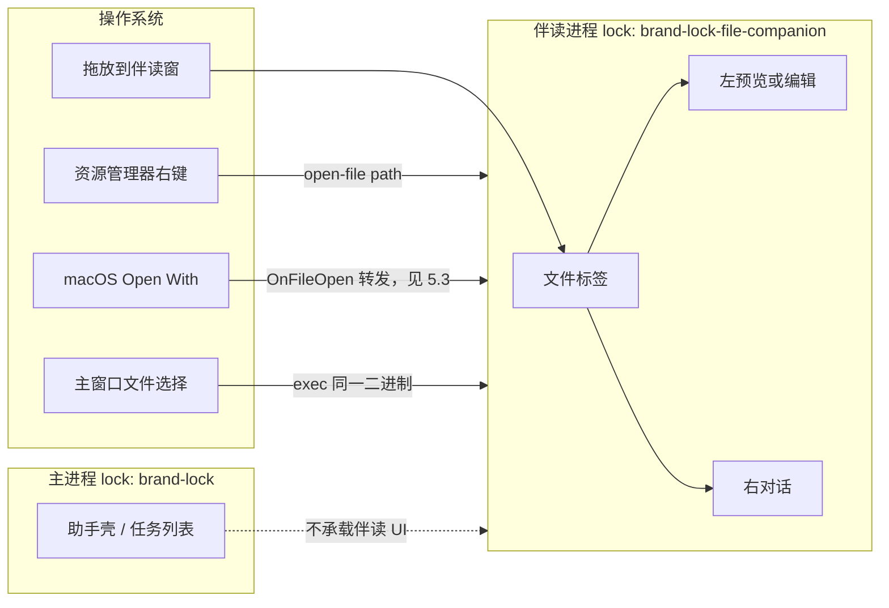
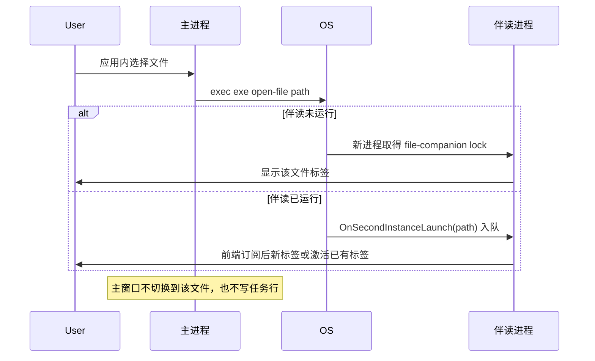

# 独立文件伴读窗口设计

| 项 | 值 |
| --- | --- |
| 作者 | 待填 |
| 日期 | 2026-10-09 |
| 状态 | Draft |
| 范围 | MaClaw / TigerClaw / MetaStaff 桌面端 v1 |
| 相关模块 | `guiapp`、`build/windows/installer/multiarch.nsi`、`build/darwin/Info.plist`、`build_maclinux.sh` |

## 1. 概述

用户在系统文件管理器里对本地文件选择「用本产品打开」后，应出现一个独立窗口：左侧是该文件本身，右侧是只讨论这个文件的对话。窗口可以有多个文件标签，每个文件一份对话；切换标签即切换对话。这些对话不进入主助手任务列表，也不要求用户先选编码工作区、把文件拷进 agent 工作区或粘贴路径。

Wails v2.11.0（`go.mod`）一个进程只有一个原生窗口，主进程又已经在 `guiapp/main.go` 持有 `SingleInstanceLock`。因此伴读不能做成主窗口里的第二扇原生窗，也不能复用主进程的 lock。v1 把同一个已安装可执行文件的一种启动模式做成伴读进程：参数选定模式，独立 lock 保证全局只有一个伴读窗口，后续打开变成标签。本地预览和本地编辑不调用 LLM。对话轮次走现有桌面 LLM 栈，不新加准入：只有 Hub 路由的供应商才经过 Hub 额度报价；直连供应商不增加 Hub 检查。

## 2. 背景与动机

今天桌面端打开一个任意本地文件，只能绕进编码工作台、任务预览或文稿库上传。这三条路都和「文件就在原地，助手坐在旁边」相反。

- `GetCodingWorkbenchFilePreview`（`guiapp/coding_workbench_browser.go`）要求编码任务的 project root 加相对路径，本地或远程工作区之外的文件进不去。
- 主窗口的 `OnSecondInstanceLaunch` 只处理 `init`、`autostart`、`maclaw://` 邀请、云端工作区共享和积分礼品码，然后把主窗口拉到前台。裸文件路径今天会被忽略。Darwin 的文档打开是另一条回调：`mac.Options.OnFileOpen` 今天为 nil，Apple Event 里的路径会被丢掉。
- 助手预览里的 `PreviewFileActions` 已能把当前路径交给 `ImportMobileDocumentFromPath`，但那是编码任务预览上的图标，没有「导入知识库」，也不能独立于任务存在。
- `trustedPrincipalBoundWorkspace`（`guiapp/im_tools_local.go`）会把语义工具收进某个工作区目录。若把打开文件的父目录当成工作区，同一目录下的其他文件就会变成可写范围。v1 不能这么做。

桌面宠物（`desktop-pet` + `ConversationMemory.UseSeparateSessionFile`）证明了「另一份对话可以不进主任务列表」。宠物跑在主进程里。伴读做不到这一点：主进程的那一个原生窗口已经被助手壳占住。

## 3. 目标与非目标

### 目标

- Windows 资源管理器右键、应用内文件选择，以及把文件拖到伴读窗口，都打开同一扇伴读窗。
- 多选文件时，每个路径一个标签、一份对话。一次对话不能同时引用多个文件。
- Markdown、HTML、纯文本在左栏编辑并写回原路径。Markdown 输入标题标记后渲染该标题；编辑自动保存；选中段落后让模型翻译或改写，结果追加进文件。
- 图片、PDF、Office（doc/docx、xls/xlsx、ppt/pptx）v1 以预览为主。宿主只对当前 `.xlsx` / `.pptx` 做整文件替换，成功后刷新实际挂载的预览面板。`.xls` / `.ppt` / doc/docx 只预览。
- 两个独立按钮：导入现有桌面知识库（owner `desktop-user`），或上传到现有云盘（Mobile 文稿库）。本地原件留在原地。
- 对话按绝对路径恢复，仍不出现在主任务列表。
- 安装器平台由安装包注册右键项；Linux 由 GUI 写用户目录。三种品牌的 lock 和右键项互不覆盖。不接管任何类型的双击默认程序。

### 非目标（v1 不做）

- 不替换编码工作台，也不替换终端 / TUI agent。
- 不做 Word / Excel / PPT 的人机双写 WYSIWYG。
- 不做文件夹右键。动词可以覆盖普通文件；不支持的类型给出预览降级，不崩溃。
- 不做 Skills、`@` 引用其他文件、跨文件的一轮对话。
- 不新建个人网盘，不走 `guiapp/cloud_workspace_sync.go` 的编码云工作区。
- 不把伴读注册成任何扩展名的默认 `shell\open` 或 Launch Services Owner。
- 不在 v1 用 GUI 写 HKCU 来弥补「未经过安装器的绿色版」。绿色版仍可用应用内入口和拖放。

## 4. 已经关闭的产品决定

下面五项不再作为开放问题，也不在备选方案里重开：

1. v1 编辑深度如上。Office 的完整协同编辑明确后置。
2. 外发只有两个按钮，分别走 `KnowledgeImportFiles` 和 `ImportMobileDocumentFromPath`。
3. v1 的打开方式是右键、应用内选择、拖到伴读窗。不接管双击。
4. 一个伴读窗、多标签、一文件一对话。资源管理器多选仍是分开的对话。这些对话不是主任务行。
5. Windows / macOS 的注册在安装包里；Linux 由 GUI 在用户目录注册，不依赖发行版 `postinst`。菜单文案和注册表 / desktop id 跟随当前品牌。

## 5. 方案

### 5.1 进程模型

`guiapp.Main` 在构造 `options.App` 之前解析参数。命中伴读条件时，整次 `wails.Run` 使用另一套选项：

- 标题用当前文件名加 `brand.Current().WindowTitle`，不渲染主助手壳。
- `SingleInstanceLock.UniqueId` 为 `fileCompanionLockID()`，见下文。
- 两种回调分开实现，不要把文档打开写进 `OnSecondInstanceLaunch`。`OnSecondInstanceLaunch` 只服务真正输掉 lock 的第二进程：伴读进程把路径放进宿主队列；主进程沿用现有的 `init` / `autostart` / `maclaw://` 等分支。文件路径不得调用 `WindowShow`。Darwin 的文档打开走 `mac.Options.OnFileOpen`，见 5.3。
- `DragAndDrop.EnableFileDrop` 保持开启（主窗口今天已开，`guiapp/main.go` 约 166–170 行）。
- Windows `WebviewUserDataPath` 不得复用 `defaultWebviewUserDataPath()`。该目录按品牌落在 `%AppData%\MaClaw.exe`、`TigerClaw.exe` 或 `MetaStaff.exe`，两个进程同时写同一份 WebView2 配置会损坏缓存。伴读使用同级目录 `filepath.Join(configDir, webviewProfileFolder()+".file-companion")`，即 `%AppData%\MaClaw.file-companion`（TigerClaw / MetaStaff 同样用 `webviewProfileFolder()+".file-companion"`）。卸载必须删这个目录，见第 11 节。不要用 `MaClaw*` 通配去删主配置。
- 伴读使用自己的 `OnStartup` / `OnDomReady`，不复用 `App.startup` 和 `App.domReady`。上一稿写「只跑配置加载、Hub 客户端和 IM handler」，但现有 `App.startup`（`guiapp/app.go`）还会启动配置监视的全部副作用、MCP、TinyTeX、Computer Use 预热、`ensureACPHost`（绑定 loopback 端口）、`PetEnabled` 时的宠物、`initWorkflowV2`、模型下载和 `SetWorkspaceDir`。`App.domReady` 总会调用 `CheckEnvironment(false)` 和 `startBackgroundUpdateChecks`。这些都不能在伴读进程里跑。伴读启动只做四件事：读一次配置；监视 `config.json` 的唯一目的是作废已发布的 `configSnap`（调用与 `invalidateConfigCacheLocked` 相同的失效，不跑 `refreshPowerOptimization`、`syncIMGateways` 等监视器副作用）；准备 Hub 客户端；用第 5.6 节的私有 memory 构造 IM handler。明确不调用：`setupTray`、`CheckEnvironment`、更新检查、`ensureACPHost`、宠物 / `ensureFloatingAssistant`、MCP、`ensureLatexTinyTeX`、Computer Use 预热、workflow v2、`SetWorkspaceDir` 的写、模型下载、IM gateway、steering、TTS、项目标签清理、`IsInitMode`、开机自启隐藏、`injectStartupRecoveryCard`、`ensureConversationMemory`。
- macOS 上除了现有的主 lock 清理，还要清理伴读 lock 文件。`cleanStaleLock`（`guiapp/clean_lock_darwin.go`）今天只删 `singleInstanceUniqueID()+".lock"`。伴读进程崩溃后，Wails 会在 lock 文件还在时 `os.Exit(0)`，窗口不再出现。Windows 的 lock 是命名 mutex，进程退出即释放；非 Darwin 的 `cleanStaleLock` 仍是空操作。

主进程里的「打开文件」不在主 WebView 里挂伴读 UI。它 `exec` 同一可执行文件并带上伴读参数。这样无论主窗口是否已运行，都只有一个伴读窗。



### 5.2 参数与单实例

现有位置参数是 `init`、`autostart`、`tui` / `ui`、`remote-smoke`、`generate-mobile-pwa-shell`、`generate-android-pwa-shell`，外加 `maclaw://` URL。伴读使用子命令，避免和这些模式抢 `args[1]`：

```text
<exe> open-file <path> [more paths...]
```

`open-file` 必须是第一个用户参数。它后面的每个参数都是一个路径，不再解析成别的子命令。安装器、Linux desktop 和应用内启动都传这个形式。

Launch Services 冷启动的 Open With 不把文档放进 argv。它发送 `odoc` Apple Event。Wails v2.11.0 不把该事件抄进 `os.Args`：`AppDelegate.m` 的 `application:openFile:` 只调用 `HandleOpenFile`，路径进入 `openFilepathBuffer`，`ProcessOpenFileEvent` 在 `wails.Run` 已经进入 `NSApp` 运行循环之后才调 `mac.Options.OnFileOpen`。因此不能写「Launch Services 通常只把文件路径放进 argv」。上一稿用 argv 里的裸路径识别冷启动 Open With，那个进程实际看到的是空参数，会拿主 lock。

Darwin 谓词只决定 lock，不决定窗口是否已经可以显示。它只看 `os.Args[1:]`，并且只适用于进程真的被带上了参数（终端启动，或我们自己的 `exec open-file`）。谓词：

1. 只考察 `os.Args[1:]`。丢掉空字符串和以 `-psn` 开头的参数（旧式 Launch Services 进程序列号）。不看 `argv[0]`。
2. 过滤后的切片若为空，留在主 lock。这包括 Finder / Dock 的普通启动，也包括冷启动 Open With。它不是伴读 lock。
3. 切片里只要有已知子命令（`init`、`autostart`、`tui`、`ui`、`remote-smoke`、`generate-mobile-pwa-shell`、`generate-android-pwa-shell`）或 `maclaw://` URL，就不是伴读。相对路径上的 `init` 仍是环境检测，不因为当前目录里碰巧有同名文件而改变。
4. 其余情况下，切片非空，且每一项都是已存在的非目录文件，才是伴读启动。有一项不是这种文件，则整次启动仍是主应用。这条只覆盖 argv 里真有文件的启动，不覆盖 `odoc`。

空切片留在主 lock 之后，Darwin 还不能跑主启动链，也不能把窗口置前。`applicationWillFinishLaunching` 在 `startHidden` 为假时调用 `makeKeyAndOrderFront`。`guiapp/main.go` 今天只在 `app.IsAutoStart` 时把 `options.App.StartHidden` 设为真。`Frontend.Run` 又在 `mainWindow.Run`（`C.Run`，NSApp 运行循环）之前用 goroutine 调用 `OnStartup`。文档事件要等运行循环才到，所以一进 `OnStartup` 就调用 `App.startup` 已经太晚：主窗口会被置前，主启动链也已经开始。`OnFileOpen` 里的「转发且不 `WindowShow`」补不上这次置前。

Darwin 上过滤后参数为空的启动（`[exe]` 或只剩 `-psn*`）使用下面的门闩，而不是立即显示主窗口：

- `options.App.StartHidden` 为真，使 `applicationWillFinishLaunching` 不把窗口置前。`autostart` 本来就会隐藏，但它的参数不是空切片，不走这道门闩。
- `OnStartup` 只把门闩武装起来并返回。它不调用 `app.startup`，不调用 `WindowShow`，也不往 Cocoa 主队列投递「现在就看宿主队列」的块。`OnStartup` 早于 `C.Run`，这时 `odoc` 还没投递。
- `options.App.OnDomReady` 仍然是 `app.domReady`。门闩不替换这个回调，也不让替换持续到进程的后半段。门闩还开着时，`app.domReady` 在 `CheckEnvironment` 和 `startBackgroundUpdateChecks` 之前返回。`CheckEnvironment(false)` 和 `startBackgroundUpdateChecks` 只活在 `app.domReady`，不在 `app.startup`。
- 两条队列不是同一条。`HandleOpenFile` 只做 `openFilepathBuffer <- path` 就返回。`OnFileOpen` 的类型是 `func(filePath string)`，`guiapp` 读不到未导出的缓冲。`applicationDidFinishLaunching` 今天不回调 Go，它只激活应用并注册第二实例观察者。在那一时刻看宿主队列是空的，或者从 `OnStartup` 里、`C.Run` 之前 `dispatch_async` 到主队列，都不能提交成主应用，也不能 `WindowShow`。这两条禁令保持不变。
- 现有的 `startFileOpenProcessor` 是 `NewFrontend` 里、`Frontend.Run` 之前启动的 `for range openFilepathBuffer`。通道没有空闲信号。Dock 或双击图标不会调用 `application:openFile:`，循环体不跑，也不会自己安排后续动作。不能把这个 `for range` 写成 Dock 启动的调度者。
- 在 Wails v2.11.0 的 Darwin 前端加一个小钩子，由改过的 `startFileOpenProcessor` 调用，而且只在 `NSApp` 已经进入 `applicationDidFinishLaunching` 之后跑。`AppDelegate.m` 的该方法增加一次 Go 导出，只关闭这个等待；该导出不调用 `app.startup`，也不读宿主队列。钩子这时对 `openFilepathBuffer` 做一次非阻塞排空。缓冲为空就调用没有文档的提交。缓冲里有路径就把整批一次性交给 `mac.Options.OnLaunchFileBatch(paths []string)`，不按路径逐个 `os.Exit`。排空之后，原来的 `for range` 仍处理启动之后才到来的文件。这个改动放在依赖的 Wails 源码上（`internal/frontend/desktop/darwin/frontend.go`、`AppDelegate.m`、`pkg/options/mac/mac.go`），用 `replace` 指向这份补丁。不要改模块缓存里的那一份当作唯一副本。
- 门闩开着时，`OnFileOpen` 只把这一条路径追加进宿主队列并返回。它不 `os.Exit`，也不 `exec`。否则第一次回调就会丢掉缓冲里其余的路径。
- `OnLaunchFileBatch` 拿到的那一整份切片才是冷启动的决定。切片里的每一条路径合成一次 `exec <exe> open-file <paths...>`（`Start`，不等待伴读退出），然后本进程退出，不 `WindowShow`，不调用 `app.startup`。
- 切片为空才是没有文档。那时调用 `app.startup`，再 `WindowShow`。HTML 就绪后仍要跑现有的 `app.domReady`（`CheckEnvironment(false)` 和 `startBackgroundUpdateChecks`），并且只跑一次。隐藏等待期间若页面已经触发过 `domReady`，提交时补上这一次；若还没有，就等原来的回调。门闩已经退出或尚未提交时，那次补跑不得发生。`OnDomReady` 始终是 `app.domReady`。
- 门闩只存在于 Darwin 的空参数主 lock。Windows 和 Linux 的右键 argv 自带 `open-file`，直接进伴读 lock，不用 `StartHidden` 等 Apple Event。

Windows 和 Linux 的注册入口始终带 `open-file`，不依赖 Darwin 的窄规则，也不依赖这道门闩。

显式 `open-file` 但路径是目录、不存在或不可读：仍然进入伴读进程，对应标签显示错误，进程不退出。这样多选里夹了一个坏路径不会把整批丢掉。没有任何路径的 `open-file` 打开空伴读窗，空状态提示拖放或选择文件。

Lock id 与主应用并列，并继续按品牌切开。`singleInstanceUniqueID()` 今天对默认品牌返回历史值 `maclaw-lock`，其他品牌是 `brand.Current().ID + "-lock"`（`qianxin-lock`、`metastaff-lock`）。伴读不改这个历史值：

```text
fileCompanionLockID() = singleInstanceUniqueID() + "-file-companion"
```

即 `maclaw-lock-file-companion`、`qianxin-lock-file-companion`、`metastaff-lock-file-companion`。TigerClaw 的品牌 id 是 `qianxin`，不是显示名 TigerClaw。

第二次及以后的启动不创建窗口。Wails 把第二进程的 `os.Args` 交给已持有同一 lock 的进程的 `OnSecondInstanceLaunch`，然后第二进程退出。这条回调和 Darwin 的 `OnFileOpen` 不是同一个队列：Wails v2.11.0 的 `secondInstanceBuffer` 在 Windows、Darwin、Linux 上容量都是 1，Windows 的 `WM_COPYDATA` 会堵到这个槽被取走；Darwin 文档打开走另一条 `openFilepathBuffer`（容量 100），见 5.3。

现有主进程回调在 `app.ctx == nil` 时直接返回，启动完成前到达的路径会被丢掉。`MultiSelectModel=Document` 对每个选中文件起一个进程，冷启动多选正好撞上这个窗口。伴读（以及主进程上的文件转发）不能照搬这个早退。

宿主在 `ctx` 存在之前就把路径追加进进程内队列。回调只入队并马上返回，不调用 `WindowShow`，也不等前端。`GetFileCompanionBoot` 返回本次 argv 里的路径，加上自进程启动以来入队、尚未交给前端的路径。`file-companion:open` 只在前端声明已订阅之后发送；订阅前到达的路径只出现在 `GetFileCompanionBoot` 里，不补发第二遍。之后到达的路径才发事件。argv、`OnFileOpen` 和第二次启动按 `fileCompanionCanonicalPath` 去重。前端对每个路径：已有同一规范路径的标签则激活，否则新建标签和空对话（磁盘上若有历史则恢复）。

测试要覆盖两次 `open-file` 在进程启动重叠时到达：两条路径都出现在 boot 或随后的事件里，不能只留下先拿到 lock 的那一条。

### 5.3 主进程、伴读进程、两者同时存在

| 状态 | 用户动作 | 结果 |
| --- | --- | --- |
| 都没运行 | Windows / Linux 右键 | argv 自带 `open-file`。新进程走伴读 lock，打开伴读窗。主窗口不出现。 |
| 都没运行 | macOS Open With | argv 不含路径，进程拿主 lock，`StartHidden` 为真，不跑 `App.startup`。`OnFileOpen` 只追加路径。`applicationDidFinishLaunching` 放开之后，`OnLaunchFileBatch` 一次拿到缓冲里的全部路径，一次 `exec` 后退出，不 `WindowShow`。主窗口不出现。随后的伴读进程才打开这些文件。 |
| 都没运行 | macOS 点 Dock 或双击应用图标 | 与上一行同一 argv。先隐藏并等待。同一钩子在 `applicationDidFinishLaunching` 之后看到空缓冲，才跑 `app.startup`、`WindowShow`，并在 HTML 就绪时跑 `app.domReady`（含 `CheckEnvironment`）。不是 `for range` 循环体在调度这次启动。 |
| 只有主进程 | Windows / Linux 右键 | 新进程发现伴读 lock 空闲，自己成为伴读进程。主窗口保持原样，不被 `WindowShow`。 |
| 只有主进程 | macOS 把文档 Apple Event 送给已运行的 bundle | 事件落在 `mac.Options.OnFileOpen`，不是 `OnSecondInstanceLaunch`。主进程 `exec` `open-file`，并且不调用 `WindowShow`。子进程再按 Windows / Linux 那一行进入伴读。主进程这次已经显示过，门闩不再次隐藏它。 |
| 只有伴读 | 再次打开文件 | Windows/Linux 命中伴读 lock，`OnSecondInstanceLaunch` 入队。macOS 若没起新进程，则落在伴读进程的 `OnFileOpen`，加标签或激活已有标签。 |
| 只有伴读 | 用户双击应用图标 | 过滤后的 `os.Args[1:]` 为空，走主 lock 的隐藏门闩。`OnLaunchFileBatch` 收到空列表后主窗口出现，并跑 `app.domReady`。伴读留在原地。 |
| 两者都在 | 打开文件 | Windows/Linux 直接进伴读 lock。macOS 上两个进程共用 bundle id `com.wails.MaClaw`，Launch Services 只会挑一个 NSApplication。收到 `OnFileOpen` 的若是伴读进程，则加标签；若是主进程，则 `exec` `open-file` 且不 `WindowShow`。`OnSecondInstanceLaunch` 只表示真的有第二个进程输掉了 lock。 |
| 两者都在 | 关闭伴读窗 | 只结束伴读进程和它的 lock。主进程、托盘、任务列表不动。 |
| 两者都在 | 关闭主窗口 | 伴读继续。它不依赖主进程的内存。 |

两个进程的 `mac.Options` 今天都只有标题栏和透明度，`OnFileOpen` 是 nil。回调是 nil 时 `openFilepathBuffer` 里的路径被丢掉。加上 `CFBundleDocumentTypes` 之后，已经在跑的 bundle 会优先收到后续文档事件；冷启动的第一下则是上面的隐藏门闩，不是「argv 里已经有路径」。我们自己 `exec` 出去的伴读进程 argv 含 `open-file` 和路径，若运行中的 bundle 再收到同一次 `OnFileOpen`，按 `fileCompanionCanonicalPath` 去重。测试要断言：argv `[exe]` 和 `[exe, -psn_…]` 留在主 lock，`StartHidden` 为真。没有文档的用例直接驱动新的 `OnLaunchFileBatch(nil)`（在 `applicationDidFinishLaunching` 信号之后），不依赖永远不会进入的 `for range` 循环体；它调用 `app.startup`，并在 HTML 就绪时调用 `CheckEnvironment`。多文件用例在钩子之前把两个路径送进缓冲，钩子只被调用一次，唯一次 `exec` 带上这两个路径，进程退出且不 `WindowShow`。门闩开着时即便调用了 `OnFileOpen`，也只追加并返回，不在第一条路径上 `os.Exit`。`applicationDidFinishLaunching` 时宿主队列为空仍然不算提交。`OnFileOpen` 不是 `OnSecondInstanceLaunch`。

应用内入口与右键共用 `open-file`。主窗口增加一个明确动作（文件菜单或助手里的「用伴读打开」），用 `runtime.OpenMultipleFilesDialog` 取路径，然后启动伴读进程。不要把这些路径塞进当前助手会话。



macOS 在 bundle 已经运行时不走上面的第二进程分支。文档 Apple Event 进入当前 NSApplication 的 `OnFileOpen`：主进程转发且不显示主窗，伴读进程入队。

### 5.4 窗口布局

伴读前端不挂 `App` 里的助手壳。`App.tsx` 在读完启动绑定后，若模式是伴读，只渲染 `FileCompanionWindow`，不挂 `SidebarTaskManagement`，也不恢复 `ai_assistant_ui_state.json`。

```text
┌ 标题栏：文件名 · 品牌标题 · 窗口按钮 ─────────────────────┐
│ [文件 A] [文件 B *] [+]          已保存 / 未保存 / 冲突    │
├──────────────────────────────┬───────────────────────────┤
│ 左：预览或编辑器              │ 右：该文件的对话           │
│                              │                            │
│                              │ 输入框（无 Skills、无 @）   │
├──────────────────────────────┴───────────────────────────┤
│ [导入知识库] [上传到云盘]              Ctrl/Cmd+S 状态     │
└──────────────────────────────────────────────────────────┘
```

- 标签条显示文件名。同名不同目录时 tooltip 用完整路径。可编辑且有未落盘变更时显示 `*`。
- 关闭最后一个标签不退出进程，留下可拖放、可再选择的空状态。用户关窗才退出。这样下一次右键不必再付一次进程启动。
- 拖进窗口的路径走现有 Wails `OnFileDrop`。目录丢弃并提示「暂不支持文件夹」，不新建标签。
- 默认逻辑尺寸 1280×800。工作区更小时缩到工作区内，不盖住任务栏。不走主窗口为环境检测准备的那套小窗尺寸。
- 沿用现有浅色壳和钢蓝主操作。失败和覆盖确认才用红色。按钮同时有文字，不只用图标。
- `PreviewFileActions` 不直接放进这个窗口。它绑定的是助手预览（上传、复制路径、在文件夹中显示），没有知识库按钮，也会把伴读和编码任务预览耦在一起。伴读使用自己的两个按钮；「在文件夹中显示」可以调用现有 `ShowItemInFolder`，但是次要动作。

### 5.5 左栏：预览、编辑、保存

分类复用 `guiapp/frontend/src/components/preview/filePreviewKind.ts` 的扩展名判断，但伴读自己决定哪些种类可写。`FilePreviewView` 在助手里会把 Markdown 和 HTML 让给外层源码视图（`yieldToParent` / `isAssistantSourcePreview`），所以不能假设它已经是编辑器。

| 种类 | 左栏 | 写回 |
| --- | --- | --- |
| `.md` / `.markdown` | 以 Markdown 源为真源的渲染编辑器。已完成的 ATX 标题用现有 `CodePreviewMarkdown` 的块渲染显示；正在输入的那一行保持纯文本，这样键入 `# ` 后该行会渲染成标题。不引入 Milkdown / Tiptap。 | 自动保存 + Ctrl/Cmd+S，直接写原路径 |
| `.html` / `.htm` | 源码编辑，可切到现有 `HtmlPreviewPanel` 查看。不是可视化 HTML 编辑器。 | 同上 |
| `.txt` / `.text` / `.log`，以及无扩展名且通过 `isCodePreviewTextContent` 的 UTF-8 文件 | 纯文本编辑器 | 同上 |
| `.docx` | 现有 `DocxPreviewPanel`，它调用 `PreviewTaskResultFile` | 只预览。没有 docx 写动作，刷新也不要去改这个面板的 key |
| `.pptx` | 现有 `PptxPreviewPanel` → `PptxPreviewEnsure` | 仅整文件替换，见 Office 写入 |
| `.pdf`、图片、音视频 | 现有 `PdfPreviewPanel`、`ImagePreviewPanel`、`MediaPreviewPanel` | 不写回 |
| `.xlsx` | `filePreviewKind` 为 `office`，挂在 `OfficePreviewPanel`（`FilePreviewView.tsx` 的 `kind === 'office'` 分支）。面板经 `PreviewTaskResultFile` 取文本抽取 | 仅整文件替换，见 Office 写入 |
| `.doc` `.xls` `.ppt` 及其他 Office 扩展名 | 同样走 `OfficePreviewPanel` 的文本抽取 | 只读。拒绝宿主写入 |
| 其他、以及识别为二进制的文件 | 固定降级文案「此文件类型暂不支持预览」，展示文件名和大小 | 不写回 |

这些预览组件已经按本地绝对路径读文件。伴读把标签上的路径传进去，不调用 `GetCodingWorkbenchFilePreview`。`PptxPreviewEnsure` 会在源文件旁写 `<name>_preview` 缓存，这是现有预览器的行为，v1 不改缓存位置。

可编辑文件的读入不能用会截断的预览缓冲再保存。`readCodingWorkbenchBrowserTextFile` 的上限是 `codingWorkbenchBrowserMaxRunes`（400000）和 `codingWorkbenchBrowserMaxReadBytes`（该值乘以 `utf8.UTFMax`）。超过这个上限的文本以只读截断预览打开，保存按钮禁用，并说明「文件过大，为避免截断写回，已禁止保存」。等于或小于上限的全文读入编辑器。

`PreviewTaskResultFile` 对大于 `agent.MaxOfficeReadFileBytes`（32 MiB，`corelib/agent/tools_office_read.go`）的文件直接拒绝。伴读把这个错误显示在左栏，不另写一套 Office/PDF 读取器。

空文件：可编辑类型打开空编辑器，允许输入并保存。预览类型显示「文件是空的」。知识库导入和云盘上传仍会失败，按钮点击后说明原因（上传 API 已拒绝空文件）。

文件不存在：标签保留，左栏「找不到文件」，对话不附带正文。不创建文件。

目录：错误标签「不支持打开文件夹」。右键注册本身不挂到目录类。

无读权限：左栏「没有读取权限」，两个外发按钮禁用。无写权限但可读：编辑器只读，自动保存关闭，说明「没有写入权限」。

#### 自动保存与冲突

可编辑标签在输入停止 600ms 后保存，Ctrl/Cmd+S 立即保存。保存是写回用户打开的那个路径，不另存，不复制一份到工作区。

打开时记录 `mtime`、`size` 和内容 SHA-256。每次保存前重新 `Stat`。若大小或 mtime 与记录不同，再哈希磁盘内容：

- 哈希仍与载入时一致：只是时间戳被触碰，可以写。
- 哈希不同：这是外部修改。停止自动保存，左栏显示「文件在磁盘上已被修改」，并给出两个动作：「重新加载」丢弃内存中的编辑；「覆盖保存」必须再确认一次。冲突未解决时不静默覆盖。
- 符号链接在每次保存时重新 `EvalSymlinks`。若目标相对授权时变了，按冲突处理，不跟着写到新目标。

选区改写不是替换选区。用户在 Markdown 或纯文本里选中一段并要求翻译或改写时，对话把该段作为本轮焦点；模型返回后，宿主把结果追加到选区之后，中间空一行。没有选区则追加到文件末尾。原文保留。追加走同一条保存路径，因此也会做冲突检测。HTML 的选区追加同样追加源码，不改 DOM。

#### Office 写入后的刷新

现有能力边界以代码为准，而不是文章里的人机双写：

- `IMMessageHandler.toolOffice` 的写动作只有 `write_excel`、`write_pptx` / `generate_pptx`。没有 docx 写动作。
- `writeTrustedOffice` 在 payload 含 `slides` 时调用 `agent.WritePPTXDetailed`，否则调用 `agent.WriteExcelDetailed`。
- 受审动态目录 `ProjectReviewedHostOfficeWriteProvider` 只发布 spreadsheet，注释写明 Word 和演示文稿在那条目录上不发布。

上一稿把 `write_excel` 开放给 `.xlsx` 和 `.xls`，把 `write_pptx` 开放给 `.pptx` 和 `.ppt`，并假定路径替换能穿过共享工具循环。代码不是这样：

- `excel.WriteFile`（`corelib/excel/write.go`）按给定路径整文件覆盖成一份 XLSX。对 `.xls` 授权会把 BIFF 换成 OOXML，文件名仍是 `.xls`。
- `pptx.WriteFile`（`corelib/pptx/write.go`）在扩展名不是 `.pptx` 时执行 `path += ".pptx"`。强制去写 `deck.ppt` 会在旁边新建 `deck.ppt.pptx`，原文件还在。这破坏「其他路径一律拒绝，不能落盘」。
- 两个写入器都是用模型 payload 替换整个文件，不是补丁。`WriteFileRange` 不是伴读路径。
- 注入预算是 `defaultAutoInjectMaxRunesPerFile`（80000 rune），截断会标在提示里。截断之后若仍允许写，大表会被可见前缀整份换掉。
- `.xlsx` 的预览面板是 `OfficePreviewPanel`，不是 `DocxPreviewPanel`。给 Docx 面板换 key 不会刷新一次表格写入。

因此 v1 的宿主写入只接受当前授权的 `.xlsx` 和 `.pptx`。`.xls`、`.ppt`、doc/docx，以及抽取被标成截断的文件，一律拒绝，不落盘。写入是 `file_companion_chat.go` 里的宿主动作：路径必须等于本进程授权表里的规范路径，然后直接调用 `agent.WriteExcelDetailed` 或 `agent.WritePPTXDetailed`。这个动作在 agent loop 之外。它不是 `toolOffice` 的一条 case，也不进 `prepareAgentLoopTools` 或 `resolveOfficeFilePathForOwner`，更不把父目录放进 `trustedPrincipalBoundWorkspace`。模型请求里没有对应的工具定义。模型若仍然发出工具调用，按 5.6 拒绝，并且不写文件。

`setPetCompanionToolMode(..., "chat")` 会通过 `petCompanionToolsDisabled` 关掉宠物那一轮的工具，但不能借来表达伴读的 Office 例外，本设计不调用它。模型若要改表或改幻灯片，只能由宿主在循环外提交整份工作簿或整份 deck payload。动作实现放在伴读包里，不加入主助手的共享工具表。其他路径、兄弟文件、主工作区里的另一个文件，都拒绝，并且不写主工作区。

成功后发 `file-companion:preview-reload`。前端按实际挂载的面板换 key：`.xlsx` 换 `OfficePreviewPanel` 的 key，让它重新 `PreviewTaskResultFile`；`.pptx` 换 `PptxPreviewPanel` 的 key。不换 `DocxPreviewPanel` 的 key。

### 5.6 对话运行时

伴读复用 `IMMessageHandler.HandleIMMessage` 和共享 agent loop，不新建一套 agent。它不调用 `SendAIAssistantMessage`。那个入口会按 `ProjectPath` 合成 `desktop-user:<path>`，并在 `isDesktopCodingWorkbenchSession` 为真时发放 coding task ingress，任务索引随后可能出现在侧栏。

每个文件一个 owner。比较和哈希使用同一个规范键 `fileCompanionCanonicalPath`，函数放在 `fileCompanionLockID` 旁边：

1. `filepath.Abs`，再 `filepath.EvalSymlinks`。解析失败时保留 Abs 的结果，并在该标签上标明未能解析符号链接。
2. Windows 上把整条路径做稳定的大小写折叠后再参与比较和哈希。折叠是整路径的 `strings.ToLower`，不只是盘符。`EvalSymlinks` 不会把 Windows 路径改成小写。`normalizeProjectSessionPath`（`guiapp/app_project_search.go`）只把盘符改成大写，不能当作这个键：`D:\Notes\A.md` 和 `d:\notes\a.md` 是同一个文件，必须得到同一个 `sessionID`。卷 GUID 和 8.3 短名不在 v1 的规范化里。
3. 其他系统保持 `EvalSymlinks` 之后的大小写。

```text
canonical = fileCompanionCanonicalPath(path)
sessionID = "fc_" + hex(sha256(canonical)[:16])
userID    = "file-companion:" + sessionID
```

这个 id 故意不是 `desktop-user`，也不是 `desktop-user:` 前缀。因此：

- `trustedDesktopPrincipal` / `knowledgeOwnerScope` 不会把它收成桌面用户的工作区身份。这只说明知识库 owner 映射不会认这个前缀。它不是工作区沙箱：`trustedPrincipalBoundWorkspace` 并不看 `desktop-user` 前缀，其他非空 principal 会落到 `corelib.EffectiveWorkspaceDir()`。伴读轮次因此根本不进入那条函数，见下面的工具面。
- `conversationSessionEvictExempt` 的桌面家族豁免不会套到它身上；它的存续由独立文件负责，而不是主会话的 TTL 豁免。
- 主进程不打开 `data/file-companion/`。伴读进程不调用 `injectStartupRecoveryCard`，也不打开主转录，所以未完成槽不会投到主助手时间线，也不会在伴读窗里被投影出来。
- 不调用 `createTaskRecord`，不写 `task_management` / `task_user_created` 标签。`visibleTaskRows` 看不到这些对话。

本轮消息使用 `Platform: "file-companion"`、`NoWorkflowInterception: true`，并带一个只描述当前文件的 `AssistantBinding`。不传 `ProjectPath`。

IM handler 不能用 `NewIMMessageHandler` 或 `NewIMMessageHandlerWithRuntime`。后者在 `guiapp/im_handler_wiring.go` 里总会调用 `ensureConversationMemory()`，而 `ensureConversationMemory`（`guiapp/app.go`）会 `NewPersistentConversationMemory(GetDataDir()/ai_assistant_conversation.json)` 并 `attachPetConversationFile`。`UseSeparateSessionFile` 只把一个 userID 移出那份快照；其余会话仍会被载入并在 `saveToDisk` 时整文件写回。伴读若走这个构造函数，会读进主转录，并可能丢掉主进程已经保存的轮次。

伴读在 `package guiapp` 里调用已有的 `newIMMessageHandler`，传入调用方拥有的 memory：存储路径是 `GetDataDir()/file-companion/conversations.json`。每个文件会话在第一次 flush 之前调用 `UseSeparateSessionFile(userID, sessions/<sessionID>.json)`。不调用 `ensureConversationMemory()`。主进程的 `ensureConversationMemory` 继续只打开 `ai_assistant_conversation.json`，不扫描 `data/file-companion/`。测试断言一次伴读轮次既不创建也不修改 `ai_assistant_conversation.json`。

工具面。跳过 `prepareAgentLoopTools` 并不会拿掉工具。`startAgentLoop`（`guiapp/im_agent_loop_start.go`）先调用 `semanticCallSurfaceForSharedTurnWithContextAndAttachments`。那条路径处理了轮次时会把 `semanticHandled` 设为真并装上该 surface 的工具；`prepareAgentLoopTools` 只在 `if !semanticHandled` 的回退里运行。`BuildToolsForModelRequest`（`guiapp/im_agent_loop_shared.go`）在 `c.semanticSurface != nil` 时返回 `visibleSemanticCallSurfaceDefinitions`，同样不经过 `prepareAgentLoopTools`。今天真正把工具列表留空的分支只有 `petCompanionToolsDisabled` 和 `loopContextTurnAnswerOnly`。`file-companion:` 不是这两个函数的条件。只跳过 `prepareAgentLoopTools`，或让语义路由接住这一轮，发出去的仍是共享工具面。

在 `semanticCallSurfaceForSharedTurnWithContextAndAttachments` 之前，紧挨 `petCompanionToolsDisabled` 检查，增加伴读自己的分支。判断是 `fileCompanionTurnWithoutTools`：`userID` 具有前缀 `file-companion:`，或 `Platform` 为 `"file-companion"`。命中时把 `semanticHandled` 设为真，并把 `tools` 和 `baseTools` 设为 nil，然后不再调用语义 surface。不调用 `setPetCompanionToolMode`，也不把这一轮标成 `loopContextTurnAnswerOnly`（那是桌面任务打开时的社交轮次，不是伴读）。同一函数后面对 `attachVisionFallthroughExecutionTools` 的条件今天排除了宠物和 answer-only；伴读分支必须同样被排除，否则空列表会被视觉回退工具重新填上。

`BuildToolsForModelRequest` 在读取 `c.semanticSurface` 之前用同一个 userID 前缀判断，命中则像宠物分支那样把 `semanticSurface` 清掉、`setVisibleToolDefinitions(nil)` 并返回 nil。`im_tool_execution.go` 在宠物拒绝的旁边用同一判断拒绝模型工具调用：返回 `toolOutcomeFailed` 和 `toolFailurePolicyRejected`，文案说明这一轮不能使用工具，不要复用宠物的「闲聊」句子。宿主的 `.xlsx` / `.pptx` 整文件替换留在这个循环之外，不因为拒绝了工具调用而改走 `toolOffice`。

因此这一轮发给模型的定义是空的。没有 `write_file`、`bash`、仓库、知识库写入、shell、delegate，也没有共享的 `write_excel` / `write_pptx`。不进入 `trustedPrincipalBoundWorkspace`。
- 打开的文件以隐式上下文进入本轮，而不是让模型自己去读盘。文本、HTML、Markdown 以及 PDF/Office 抽取复用 `ExpandUserSelectedFilePaths` 的预算：单文件 `defaultAutoInjectMaxRunesPerFile`（80000 rune），读取上限 `MaxOfficeReadFileBytes`（32 MiB）。超出部分在提示里标明已截断。被标成截断的抽取不能再走 5.5 的宿主写入。
- 图片使用 `buildOpenAIVisionContent` / `buildAnthropicVisionContent`（`guiapp/im_attachment.go`）把该图片作为 `image_url` 或 Anthropic image block 附在用户消息上。是否真的是视觉模型看当前桌面 LLM 配置的 `SupportsVision`。不支持时不发图片字节，对话里说明当前模型不能看图，只保留文件名；不为此新做 OCR 管线。
- `.xlsx` / `.pptx` 的整文件替换是宿主动作，规则在 5.5。模型给出的其他路径一律拒绝，不能落盘，主工作区也不写。
- 选区翻译/改写由 UI 发起一轮无工具对话，宿主追加结果。模型没有「随便写相邻文件」的工具。

本地预览、编辑、自动保存、重新加载都不构造 LLM 请求，既不走 Hub，也不走直连供应商。

对话轮次使用现有桌面 LLM 栈，不新加检查。Hub 官方供应商仍走 Hub 里已有的 `prepareLLMPricingQuote` / `reserveLLMRequestPricing`（`hub/internal/httpapi/llm_credit_billing.go`）；额度不足时展示现有错误 `LLM_SERVICE_CREDITS_INSUFFICIENT_FOR_REQUEST`，不自动重试。自带 URL 和密钥的供应商走 `doOpenAILLMRequest` / `doAnthropicLLMRequest`，到不了那次报价，也不为此补一次 Hub 准入；它们消耗的是供应商自己的配额。上一稿写「准入仍在 Hub」对后一种配置不成立。

未登录或未配置 LLM 时，左栏仍可用。右栏输入框禁用，说明需要先在主窗口登录并配置模型。登录成功后主进程若写了 `config.json`，伴读在下一次发送前必须看到新文件。`loadConfigSnapshot`（`guiapp/config_txn.go`）在 `configSnap` 已发布时直接返回内存，不再读盘。因此发送前要丢掉这份快照，或先 `Stat` 再在变化时失效并重载。不能把再次调用 `LoadConfig` 理解成一定会读磁盘。伴读不写第二套账号。

### 5.7 两个外发按钮

两者都只作用于当前标签的路径，都由用户点击触发，都不经过工作区沙箱。包装方法会检查授权路径；这还不够，因为 Wails 绑定的是整个 `App`。伴读模式下现有的 `KnowledgeImportFiles` 和 `ImportMobileDocumentFromPath` 也要拒绝不在授权表里的路径，签名和主进程行为不变，见第 6 节和第 9 节。

导入知识库调用现有：

```go
app.KnowledgeImportFiles(knowledge.DirectoryImportRequest{
    OwnerID:   desktopUserID,                 // "desktop-user"
    SaveScope: knowledge.SaveScopePersonal,   // "personal"
    RootPath:  "",
}, []string{grantedPath})
```

`KnowledgeImportFiles` 自己不会盖章 owner。`normalizeKnowledgeImportRequest` 在 personal scope 下会清空 `ProjectPath`，这正是要的：文件不进当前编码项目。`knowledgeOwnerScope` 只对 `desktop-user` 家族生效；伴读聊天 principal 不是这个家族，所以 owner 必须在请求里显式写成 `desktop-user`。存储仍是 `GetDataDir()/knowledge.db`，也就是主窗口那个库。成功后提示已进入桌面知识库，不打开主窗口的任务。

上传云盘调用 `ImportMobileDocumentFromPath(grantedPath)`。它把原始字节 POST 到 `{RemoteHubURL}/api/mobile/documents/upload`，使用 `RemoteViewerToken`。这是 Mobile 文稿库，不是编码云工作区。本地文件不移动、不删除。

该函数已有的拒绝（`guiapp/mobile_documents.go`）：

- 目录：`path is a directory`
- 空文件：`file is empty`
- `size > mobileDocumentMaxStoredBytes*4`，其中 `mobileDocumentMaxStoredBytes = 100 << 20`。注释说明 Hub 在压缩之后按 100 MiB 限制；客户端在压缩前拒绝大约 400 MiB 以上的文件，错误文案是 `file too large to compress safely`。
- 未登录：`MaClaw Hub login is required to share documents to Mobile`

按钮行为：大于 400 MiB 时禁用并说明原因，不去打 Hub。100 MiB 到 400 MiB 仍允许点击，因为压缩后可能放得下；Hub 拒绝则展示返回的 HTTP 错误。空文件和目录展示上述原因。成功文案沿用现有「已上传到云盘」，并说明手机端「文档」可打开。不把按钮叫做「移动文稿库」。

两个按钮各自独立，互不为对方的前置条件。进行中禁用重复点击。失败不改变左栏文件。

### 5.8 壳层注册

品牌规则：动词键、desktop 文件名、菜单里的产品名跟随当前安装包或 `brand.Current()`。不写进共享的 `Software\Classes\maclaw`。那段 URL Protocol 是公开链接契约，注释要求各 OEM 共用 `maclaw://`，和文件动词不是一回事。

#### Windows

安装器是机器级的：`RequestExecutionLevel admin`，`InstallDir "$PROGRAMFILES64\..."`，安装段 `SetShellVarContext all` 且 `SetRegView 64`。`SetRegView 32` 只出现在查找旧卸载字符串的升级探测里，不是每用户安装。未发现 HKCU 安装路径，因此动词同样写 HKLM 的 64 位视图。

放在现有 `Software\Classes\maclaw` 块旁边（`build/windows/installer/multiarch.nsi` 约 391–397 行），但是另一把键：

```text
HKLM\Software\Classes\*\shell\${INFO_PROJECTNAME}.FileCompanion
  MUIVerb = 用 ${INFO_PRODUCTNAME} 打开
  MultiSelectModel = Document
  Icon = "$INSTDIR\${PRODUCT_EXECUTABLE},0"
HKLM\Software\Classes\*\shell\${INFO_PROJECTNAME}.FileCompanion\command
  = "$INSTDIR\${PRODUCT_EXECUTABLE}" open-file "%1"
```

`INFO_PROJECTNAME` / `INFO_PRODUCTNAME` 已由 `build_win.bat`、`build_win_tiger.bat`、`build_win.metastaff.bat` 按产品写成 MaClaw、TigerClaw、MetaStaff。因此三个安装器不会互相覆盖动词。不写 `Software\Classes\Directory`。不修改 `*\shell\open` 或任何扩展名的默认 open 命令，双击行为不变。

`MultiSelectModel=Document` 让资源管理器对每个选中文件起一个进程。每个进程带 `open-file "%1"`，由伴读 lock 收成多个标签。静态动词的 `%1` 不可靠地一次传入全部路径，所以不依赖 Player 模型。

卸载段在删除 `Software\Classes\maclaw` 的旁边，只 `DeleteRegKey` 本产品的 `*\shell\${INFO_PROJECTNAME}.FileCompanion`。不要删除整个 `*\shell`。64 位视图必删；32 位视图再删一次同一键，只为清掉误写，不表示我们会去 32 位视图注册。

升级安装会重写 command 里的 `$INSTDIR`。用户若把安装目录手动挪走，右键会启动失败，修复安装即可恢复。安装中途失败时，卸载或下一次安装的卸载段会删掉已写入的动词。

#### macOS

有两份 plist，职责不同，必须一起改。只改其中一份不会作用到对应的启动路径。

- `build/darwin/Info.plist` 和 `Info.dev.plist` 是 Wails 模板。`CFBundleDocumentTypes` 包在 `{{if .Info.FileAssociations}}` 里，且模板没有 `LSHandlerRank`。`wails.json` 只有 `protocols`（`maclaw`），没有 `fileAssociations`。所以今天 `wails build` 的 bundle 不声明文档类型。模板字段也不够：即使往 `wails.json` 加 associations，生成结果仍可能被系统当成可争取默认处理程序的声明。
- `build_maclinux.sh` 的 `create_app_bundle` 用 heredoc 重写 `Contents/Info.plist`（约 271–310 行），然后 `pkgbuild` 打这个 bundle。这段 heredoc 没有 `CFBundleDocumentTypes`，也没有 URL types。用户安装的 pkg 走的是这段，不是 Wails 模板。脚本里的 `APP_NAME` 和 `IDENTIFIER` 目前固定是 `MaClaw` / `com.wails.MaClaw`。仓库里没有第二份 TigerClaw 的 mac 打包脚本。

两处都增加同一份声明，且 rank 固定为 Alternate：

```xml
<key>CFBundleDocumentTypes</key>
<array>
  <dict>
    <key>CFBundleTypeName</key>
    <string>${APP_NAME} File</string>
    <key>CFBundleTypeRole</key>
    <string>Viewer</string>
    <key>LSHandlerRank</key>
    <string>Alternate</string>
    <key>LSItemContentTypes</key>
    <array>
      <string>public.data</string>
    </array>
  </dict>
</array>
```

`public.data` 是文件数据，不是 `public.folder`，避免把文件夹放进 Open With。`LSHandlerRank=Alternate` 使应用出现在「打开方式」里，而不要写成 `Owner` 或 `Default`。Role 用 Viewer，避免系统把它理解成该类型的编辑所有者。不设置会覆盖用户现有默认应用的 `LSHandlerRank`。Wails 模板里若保留 `{{if .Info.FileAssociations}}` 块，不要用它来声明这批类型，以免和 Alternate 块重复、或由 Role `Editor` 抢默认。

`build/scripts_x64`、`build/scripts_arm64`、`build/scripts_universal` 里只有 `preinstall` 和 `postinstall`。`postinstall` 对 `/Applications/MaClaw.app` 执行 `lsregister -f`，没有卸载脚本，也不会执行 `lsregister -u`。`postinstall` 的 `-f` 不能用来去掉已经声明过的文档类型。仓库里也没有 TigerClaw / MetaStaff 的 mac 打包脚本，`APP_NAME` 和 `IDENTIFIER` 固定是 `MaClaw` / `com.wails.MaClaw`。

v1 不新增卸载脚本。操作者在删掉已安装的 `.app` 之后执行 `lsregister -u` 指向该 bundle，这是去掉 Open With 缓存的唯一机制，和第 11 节的回滚是同一条命令。v1 不把 MaClaw 注册成任何 UTI 的默认处理程序，因此这条命令不必改用户的默认应用列表。

Darwin 上裸路径 argv 的规则见 5.2。已运行进程收到的文档事件走 `OnFileOpen`，按 5.3 处理，不走 `OnSecondInstanceLaunch`。

#### Linux

`build_maclinux.sh` 第 172 行 `cp "build/linux/maclaw.desktop"`。该文件不在 `build/linux/` 下。目录里实际是 `AppRun.sh`、`package_appimage.sh`、hub 辅助脚本、`README.md` 和 `smoke_gui.sh`。AppImage 打包复制这一步今天会失败。伴读注册不依赖这个缺失文件，也不新增由 root 安装到 `/usr/share/applications` 的副本。

GUI 在 Linux 启动时，以及可执行路径与已写入的 `Exec` 不同时，把用户级 desktop 文件写成：

```text
$XDG_DATA_HOME/applications/<brandID>-file-companion.desktop
```

`XDG_DATA_HOME` 为空则用 `~/.local/share`。`brandID` 用 `brand.Current().ID`：`maclaw-file-companion.desktop`、`qianxin-file-companion.desktop`、`metastaff-file-companion.desktop`。TigerClaw 不会覆盖 MaClaw 的文件。

文件内容要点：

- `Name=用 <DisplayName> 打开`，`DisplayName` 来自 `brand.Current().DisplayName`（MaClaw / TigerClaw / MetaStaff）。
- `Exec=<abs-exe> open-file %F`
- `TryExec=<abs-exe>`。用户直接删掉应用后，desktop 环境会因为 `TryExec` 失败而隐藏菜单项。
- `MimeType=` 使用下面这一整行，不从缺失的 `maclaw.desktop` 抄，也不把 `mimeTypeForFile` 里的 `text/x-go` 等代码类型写进来。那些扩展名在 `filePreviewKind.ts` 里落到 `code`，不是独立预览种类。`filePreviewKind.ts` 按扩展名分类，没有 MIME 表；这一行是按那些预览扩展名对应的类型写成的。不写 `~/.config/mimeapps.list` 的 `[Default Applications]`，因此不成为默认程序。

```text
MimeType=text/markdown;text/plain;text/html;text/x-tex;application/pdf;application/rtf;application/msword;application/vnd.openxmlformats-officedocument.wordprocessingml.document;application/vnd.openxmlformats-officedocument.wordprocessingml.template;application/vnd.ms-word.document.macroEnabled.12;application/vnd.oasis.opendocument.text;application/wps;application/wpt;application/vnd.ms-excel;application/vnd.openxmlformats-officedocument.spreadsheetml.sheet;application/vnd.ms-excel.sheet.macroEnabled.12;application/vnd.ms-excel.sheet.binary.macroEnabled.12;application/vnd.oasis.opendocument.spreadsheet;application/et;application/ett;application/vnd.ms-powerpoint;application/vnd.openxmlformats-officedocument.presentationml.presentation;application/vnd.openxmlformats-officedocument.presentationml.slideshow;application/vnd.ms-powerpoint.presentation.macroEnabled.12;application/vnd.oasis.opendocument.presentation;application/dps;application/dpt;image/png;image/jpeg;image/gif;image/webp;image/bmp;image/svg+xml;image/vnd.microsoft.icon;image/tiff;image/heic;video/mp4;video/webm;video/quicktime;video/x-msvideo;video/x-matroska;video/x-m4v;audio/mpeg;audio/wav;audio/ogg;audio/mp4;audio/aac;audio/flac;application/octet-stream;
```

扩展名对应关系，同一类型只出现一次：`.md` / `.markdown` → `text/markdown`；`.txt` / `.text` / `.log` → `text/plain`；`.html` / `.htm` → `text/html`；`.tex` / `.latex` / `.ltx` → `text/x-tex`；`.pdf` → `application/pdf`；`.rtf` → `application/rtf`；`.doc` / `.dot` → `application/msword`；`.docx` → `application/vnd.openxmlformats-officedocument.wordprocessingml.document`；`.dotx` → `application/vnd.openxmlformats-officedocument.wordprocessingml.template`；`.docm` → `application/vnd.ms-word.document.macroEnabled.12`；`.odt` → `application/vnd.oasis.opendocument.text`；`.wps` / `.wpt` → `application/wps` / `application/wpt`（`OFFICE_EXT` 里的厂商类型，不是 IANA，也不要用 `application/vnd.ms-works` 代替）；`.xls` → `application/vnd.ms-excel`；`.xlsx` → `application/vnd.openxmlformats-officedocument.spreadsheetml.sheet`；`.xlsm` → `application/vnd.ms-excel.sheet.macroEnabled.12`；`.xlsb` → `application/vnd.ms-excel.sheet.binary.macroEnabled.12`；`.ods` → `application/vnd.oasis.opendocument.spreadsheet`；`.et` / `.ett` → `application/et` / `application/ett`；`.ppt` / `.pps` → `application/vnd.ms-powerpoint`；`.pptx` → `application/vnd.openxmlformats-officedocument.presentationml.presentation`；`.ppsx` → `application/vnd.openxmlformats-officedocument.presentationml.slideshow`；`.pptm` → `application/vnd.ms-powerpoint.presentation.macroEnabled.12`；`.odp` → `application/vnd.oasis.opendocument.presentation`；`.dps` / `.dpt` → `application/dps` / `application/dpt`；图片、音视频按上面的 `image/*`、`video/*`、`audio/*`（`.jpg`/`.jpeg` 都是 `image/jpeg`，`.tif`/`.tiff` 都是 `image/tiff`，`.ogg`/`.oga` 都是 `audio/ogg`，`.m4a` 是 `audio/mp4`）。最后的 `application/octet-stream` 让文件管理器仍把类型不明的文件放进「打开方式」。与 `mimeTypeForFile`、`contentTypeForMobileImport` 重叠的 Office / PDF / 常见图片字符串和那两个函数一致。
- `NoDisplay=false`，`Terminal=false`，`StartupNotify=true`。
- 写入是幂等的：内容相同则不碰 mtime。目录不可写时打日志并继续启动，右键项缺失，应用内入口仍可用。

提供绑定 `UnregisterFileCompanionLinuxDesktop()`，只删除本品牌那一个文件。设置里放一个「移除右键打开项」即可；v1 不要求发行版卸载脚本。主进程和伴读进程都可以在启动时刷新，因为写入按内容比较，两个进程不会来回改写。

Linux 没有「所有 MIME」的等价物。不支持的类型仍会打开伴读并走降级预览，这和「动词可以面向普通文件」一致。文件管理器若按每个文件启动一次，伴读 lock 收成多个标签；若一次传入多个路径，`%F` 会落在同一次 `open-file` 后面，解析器按多个路径处理。

### 5.9 与主应用共享的数据

伴读和主应用是两个进程、一个用户数据目录，不是第二个账号。

| 数据 | 路径 | 伴读 |
| --- | --- | --- |
| 配置、Hub URL、viewer token、LLM | `config.json` | 只读，不写设置。`configfile.AtomicWriteJSON` 保证读到的是完整旧文件或完整新文件。已发布的 `configSnap` 不会因为再次 `LoadConfig` 而重读磁盘；发送前先失效快照，见 5.6。监视器只做这次失效。 |
| 知识库 | `GetDataDir()/knowledge.db` | 仅导入按钮写入，且路径必须在伴读授权表里。库已是 WAL，`PRAGMA busy_timeout=5000`，单连接 `SetMaxOpenConns(1)`。锁冲突走现有 `openKnowledgeStoreWithRetry`。 |
| 主对话 | `GetDataDir()/ai_assistant_conversation.json` | 伴读不打开、不创建、不回写。构造 handler 时不调用 `ensureConversationMemory`。 |
| 伴读对话 | `GetDataDir()/file-companion/` | 只有伴读进程打开。主进程不把这个目录载入 memory。 |
| WebView2 | `%AppData%\<webviewProfileFolder>.file-companion` | 与主窗口的 `<folder>.exe` 分开。卸载删除本产品这一目录，见第 11 节。 |
| 日志 | `corelib.MaclawLogsDir()` 的 `maclaw.log` | 共用，前缀 `[file-companion]`。 |

`getMaclawBaseDir()` 继续由已有配置决定。不调用 `SetMaclawBaseDir` 做第二份 home。

## 6. 接口

新增的 Wails 绑定只服务伴读和主窗口的启动动作。不改 `SendAIAssistantMessage`、`KnowledgeImportFiles`、`ImportMobileDocumentFromPath` 的签名。后两个方法在伴读模式下增加授权表检查，主进程不走这张表。

```go
// FileCompanionBoot 是伴读窗第一屏要的事实。主进程调用时 Mode 为空。
// Paths 是本次 argv 加上启动以来入队、尚未交给前端的路径。
type FileCompanionBoot struct {
    Mode  string   `json:"mode,omitempty"` // "file-companion" 或空
    Paths []string `json:"paths,omitempty"`
}

func (a *App) GetFileCompanionBoot() FileCompanionBoot

// FileCompanionUIReady 由伴读前端在订阅 file-companion:open 之后调用。
// 在此之前到达的路径只留在 GetFileCompanionBoot，不提前发事件。
func (a *App) FileCompanionUIReady()

// LaunchFileCompanion 由主窗口调用。它启动同一可执行文件的 open-file，
// 不在主进程创建窗口。
func (a *App) LaunchFileCompanion(paths []string) error

// 文本保存。granted 必须是本进程当前打开的那个规范路径。
type FileCompanionSaveResult struct {
    Saved    bool   `json:"saved"`
    Conflict bool   `json:"conflict"`
    Error    string `json:"error,omitempty"`
}

func (a *App) FileCompanionSaveText(path, content, loadedHash string) (FileCompanionSaveResult, error)

// 追加模型结果。冲突语义与保存相同。
func (a *App) FileCompanionAppendText(path, insertion, loadedHash string) (FileCompanionSaveResult, error)

type FileCompanionTurnRequest struct {
    Path      string `json:"path"`
    Text      string `json:"text"`
    Selection string `json:"selection,omitempty"`
    RequestID string `json:"request_id,omitempty"`
    Lang      string `json:"lang,omitempty"`
}

func (a *App) SendFileCompanionMessage(req FileCompanionTurnRequest) error
func (a *App) FileCompanionImportKnowledge(path string) (knowledge.DirectoryImportResult, error)
func (a *App) FileCompanionUploadCloud(path string) (*MobileDocumentDraftSummary, error)
```

`FileCompanionImportKnowledge` 和 `FileCompanionUploadCloud` 检查 `path` 等于当前授权文件，然后调用第 5.7 节的现有 API。包装方法只约束新按钮。Wails 绑定整个 `App`，所以 `KnowledgeImportFiles` 和 `ImportMobileDocumentFromPath` 仍可被直接调用。伴读模式（`GetFileCompanionBoot().Mode == "file-companion"`）下，这两个现有方法在做原来的工作之前，用 `fileCompanionCanonicalPath` 对照进程内授权表；不在表里就返回错误，不导入、不上传。签名不变。主进程模式不查这张表，任意本地路径的现有行为保持不变。授权表允许的是用户已经打开的那个路径，不是工作区沙箱，也不把拒绝扩大到主窗口。

前端事件：

| 事件 | 方向 | 作用 |
| --- | --- | --- |
| `file-companion:open` | 宿主 → 窗 | 第二实例或拖放之外的新路径 |
| `file-companion:preview-reload` | 宿主 → 窗 | Office 写回后刷新左栏 |
| `ai-assistant-progress` / 最终响应事件 | 复用现有流 | `session_key` 使用 `file-companion:<sessionID>`，前端按标签过滤 |

流式事件复用 `aiAssistantStreamEventEmitter`，不新做传输。伴读窗忽略 `session_key` 不属于已打开标签的事件。

## 7. 数据模型

不改 Hub schema，不改 `knowledge.db` 的表，不改 `ai_assistant_conversation.json` 的形状。

伴读只在本地数据目录下新增：

```text
<MaclawBaseDir>/data/file-companion/sessions/<sessionID>.json
<MaclawBaseDir>/data/file-companion/conversations.json
```

`sessionID` 由 `fileCompanionCanonicalPath` 的 SHA-256 前 16 字节十六进制决定。比较授权和计算哈希用的是同一个字符串，所以 `D:\Notes\A.md` 与 `d:\notes\a.md` 是一次会话，而不是两次。不能先按 `EqualFold` 判断相等、再对未折叠的 `Abs`+`EvalSymlinks` 做哈希。`conversations.json` 是交给 `newIMMessageHandler` 的 `NewPersistentConversationMemory` 存储，不是 `ensureConversationMemory` 打开的那份主文件。每个文件会话在第一次 flush 之前 `UseSeparateSessionFile`，侧文件才是转录；`conversations.json` 保持空壳，一次 flush 不会把所有文件的对话写回去。伴读进程不创建、不修改 `ai_assistant_conversation.json`。

侧文件的 JSON 就是现有 `memorySnapshot`（`corelib/agent/conversation_memory.go` 已有的 sessions/entries 结构）。不发明第二种转录格式。主进程的 `ensureConversationMemory` 继续只指向 `ai_assistant_conversation.json`，不加载 `data/file-companion/`。

进程内授权表不落盘：

```go
type fileCompanionGrant struct {
    UserPath    string
    Canonical   string
    Editable    bool
    LoadedMod   time.Time
    LoadedSize  int64
    LoadedHash  string
}
```

卸载安装器时默认保留 `.maclaw/data`（现有卸载文案已经保留 data）。伴读历史随用户数据留下，主任务列表仍然看不到它。这不是迁移，旧版本没有这个目录。

## 8. 备选方案

### 在主进程里再开一个原生窗口

Wails v2 做不到。`options.App` 只有一个窗口，`SingleInstanceLock` 还会把第二次启动折回主进程。若以后升级到支持多窗口的运行时，再评估把伴读收进主进程；v1 不把产品行为绑在这次升级上。

### 把父目录设成 `trustedPrincipalBoundWorkspace`

这样可以复用 `write_file` 和 `toolOffice` 的现有路径检查，但授权会扩大到同目录的所有文件，和「只打开这一个文件」相反。v1 用精确路径相等，而不是目录包含（`resolvePathInsideWorkspace` / `pathContainedInBase` 是目录语义，伴读保存不用它们）。

### 把伴读会话放进 `ai_assistant_conversation.json` 并用单独 userID 隐藏

宠物可以这么做，因为它和主界面是同一进程，而且它的侧文件是在已经打开主转录之后拆出去的。伴读是第二个进程。`NewIMMessageHandlerWithRuntime` 总会打开 `ai_assistant_conversation.json`，`saveToDisk` 会重写整个 snapshot。`UseSeparateSessionFile` 只挪走一个 userID，挡不住这次加载和回写。两个进程轮流写主转录文件会丢对话。伴读必须从 `newIMMessageHandler` 起就使用 `data/file-companion/conversations.json`。这是隔离写入，不是第二套账号。

### 用编码云工作区或新网盘接收「上传到云盘」

与已关闭的产品决定冲突。`cloud_workspace_sync.go` 同步的是编码工作区缓存，不是手机「文档」页。不采用。

## 9. 安全与隐私

打开文件是用户对那一个路径的显式授权：可读；若是可编辑文本，还可写该路径。授权不扩展到父目录、兄弟文件或用户稍后在对话里打出来的路径。

| 威胁 | 严重性 | 处理 |
| --- | --- | --- |
| 模型通过工具读写工作区外或相邻文件 | 高 | 伴读分支在 `semanticCallSurfaceForSharedTurnWithContextAndAttachments` 之前把轮次标成已处理，`tools` 为 nil。`BuildToolsForModelRequest` 返回 nil。`im_tool_execution.go` 拒绝模型工具调用。不调用 `setPetCompanionToolMode`。跳过 `prepareAgentLoopTools` 本身不是控制手段。`file-companion:` 前缀只让 `knowledgeOwnerScope` 不认它，不能当成沙箱。`.xlsx` / `.pptx` 仅由循环外的宿主动作整文件替换；兄弟路径和主工作区以外的路径都拒绝，主工作区不被写入。 |
| 截断缓冲被保存，毁掉大文件 | 高 | 超过 `codingWorkbenchBrowserMaxReadBytes` 的文本禁止保存。 |
| 外部修改被自动保存覆盖 | 高 | 哈希不一致则停自动保存，必须显式覆盖。 |
| 符号链接在授权后被换目标 | 中 | 保存前重新解析，目标变化视为冲突。 |
| 伴读 WebView 调用导入/上传指向别的路径 | 中 | 包装方法要求路径等于当前授权。伴读模式下 `KnowledgeImportFiles` 和 `ImportMobileDocumentFromPath` 对不在授权表中的路径直接拒绝。主进程不查这张表。 |
| 右键动词被写成默认打开程序 | 高 | 不写 `shell\open`；macOS rank 只用 Alternate；Linux 不写默认 MIME。 |
| 一个品牌的注册或 lock 吞掉另一个品牌 | 高 | lock、注册表键、desktop 文件名都带品牌 id 或 `INFO_PROJECTNAME`。 |
| 伴读对话出现在主任务列表或恢复卡，或伴读改写主转录 | 高 | 独立 userID、不调用 `createTaskRecord`、不调用 `ensureConversationMemory`。伴读只打开 `data/file-companion/`。主进程不加载该目录，伴读不跑 `injectStartupRecoveryCard`。 |
| 未登录上传或把本地路径发给 Hub 以外的服务 | 中 | 只走现有 Hub 客户端和 viewer token。日志不写文件正文、选区或模型输出。 |
| 多进程同时写 `knowledge.db` | 低 | 沿用 WAL 和 busy timeout。导入失败对用户可见，可重试。 |
| 安装器动词指向已移动的二进制 | 中 | 修复安装重写 command。Linux 用 `TryExec` 加启动时刷新。 |

路径拒绝 NUL（与 `ImportMobileDocumentFromPath` 一致）。不跟随用户提供的 `..` 去「解释」出一个未打开的文件：比较的是打开时的规范路径和本次调用的规范路径是否同一文件。

预览和编辑不上传内容，也不调用 Hub 或直连 LLM。对话轮次会把截断后的抽取文本或图片数据 URL 发给已配置的桌面 LLM 端点，供应商配置与主助手相同。只有 Hub 路由的供应商才做 Hub 额度报价；直连供应商不新增 Hub 检查。不把文件复制进云工作区缓存。

## 10. 可观测性

桌面端没有单独的指标系统。伴读写现有 `maclaw.log`，前缀 `[file-companion]`。每条日志带品牌 id、模式（main 转发或伴读进程）、动作和结果码，不带文件内容。

要记录的动作：进程模式选择、入队的路径数量（argv、`OnFileOpen`、第二实例分开计数）、标签打开失败原因（不存在、目录、权限、空、过大）、保存、冲突、覆盖确认、知识库导入计数（沿用现有 `[knowledge] ImportFiles` 行）、云盘上传的 HTTP 状态、对话轮次开始和结束。额度拒绝码只在该轮确实走了 Hub 报价时记录；直连供应商的失败记供应商错误，不记成 Hub 额度拒绝。

不新增告警通道。额度不足、Hub 未登录、保存冲突都是界面状态，不是崩溃。伴读进程启动失败仍走现有 `bootLog`。

## 11. 发布与回滚

没有远程功能开关。能力按安装包和进程参数出现。

1. 先合并进程模式、窗口、预览、编辑和对话（PR 1–6）。此时只有应用内入口和拖放，资源管理器还没有动词。回滚只是不调用 `LaunchFileCompanion`。
2. 再合并 Windows 动词、macOS plist、Linux desktop（PR 7–9）。这一步才让右键生效。PR 7–9 依赖 PR 5，因此依赖预览、保存和对话都已经在将要发布的分支上。不在空壳进程上注册壳层入口。
3. Windows 回滚：卸载或装回旧安装器。卸载段删除本产品动词键，不碰其他品牌，也不改默认 open。同一卸载段删除 `"$APPDATA\${INFO_PROJECTNAME}.file-companion"`。三个安装器的 `INFO_PROJECTNAME` 分别是 MaClaw、TigerClaw、MetaStaff，与 `webviewProfileFolder()` 的三个返回值一致。每个安装器只删自己的目录。不要用 `MaClaw*` 一类通配，那会带上主配置 `%AppData%\MaClaw.exe`。现有的 `RMDir /r "$APPDATA\${PRODUCT_EXECUTABLE}"` 继续只删主配置，不代替伴读目录。
4. macOS 回滚：安装不含 Alternate 文档类型的旧 pkg。操作者对该 bundle 执行 `lsregister -u`。没有卸载脚本会做这件事；`postinstall` 里的 `lsregister -f` 也不会清掉旧的文档声明。
5. Linux 回滚：调用注销绑定，或删除本品牌的 `*-file-companion.desktop`。`TryExec` 在二进制消失后让菜单自行隐藏。不改 `[Default Applications]`。
6. `data/file-companion/` 可以留在磁盘。旧主程序不读它，任务列表不会冒出历史对话。不需要数据迁移。

修复安装是 Windows 动词指向错误路径时的恢复手段。Linux 则是下一次 GUI 启动重写 `Exec`。

## 12. 测试

Go：

- 扩展 `guiapp/main_webview_cache_test.go`。它已经断言默认 `singleInstanceUniqueID()` 为 `maclaw-lock`。补上伴读 id 是该值加 `-file-companion`，且不改变历史主 lock。
- 新增 `guiapp/file_companion_args_test.go`，风格对齐 `guiapp/referral_handoff_test.go` 和 `guiapp/credit_gift_handoff_test.go`：`open-file` 的多路径、已知子命令不被抢走、Darwin 裸文件路径、目录不触发隐式伴读、没有额外参数时留在主 lock、只带 `-psn*` 时留在主 lock、相对路径 `init` 仍是 init。`fileCompanionCanonicalPath` 对 `D:\Notes\A.md` 和 `d:\notes\a.md` 得到同一个字符串和同一个 `sessionID`。
- 同包再覆盖交接：argv `[exe]` 和 `[exe, -psn_…]` 留在主 lock，并且这次启动 `StartHidden` 为真。没有文档的用例驱动 `OnLaunchFileBatch` 的空切片，不把「`for range` 循环体跑过了」当作前提；提交后调用 `app.startup`，HTML 就绪时调用 `CheckEnvironment`（`app.domReady` 里的那次）。多文件用例在钩子之前向缓冲送入两个路径，断言钩子一次收到两条，且只有一次 `exec` 同时带上它们，主窗口保持隐藏。门闩开着时 `OnFileOpen` 只追加并返回。不得把 `applicationDidFinishLaunching` 时的空宿主队列，或 `C.Run` 之前排上的主队列块，当成没有文档。`OnDomReady` 在提交之后仍然是 `app.domReady`。`OnFileOpen` 不是 `OnSecondInstanceLaunch`。伴读的 `OnFileOpen` 只入队。两次 `open-file` 在 `ctx` 还是 nil 时重叠，两条路径都进入 `GetFileCompanionBoot` 或订阅之后的事件。回调在入队后返回，不堵住 `secondInstanceBuffer`。
- 伴读 `OnStartup` / `OnDomReady` 不调用 `CheckEnvironment`、`startBackgroundUpdateChecks`、`ensureACPHost`、宠物、MCP、TinyTeX、Computer Use、workflow v2、`SetWorkspaceDir`。发送前若 `configSnap` 已发布，再次 `LoadConfig` 本身不读盘；失效之后才读到主进程写下的新配置。
- 扩展 `guiapp/im_local_file_save_test.go`。保存必须拒绝授权路径以外的目标，包括同目录的兄弟文件和换过目标的符号链接；冲突哈希不一致时不写。这里不要把父目录放进 `trustedPrincipalBoundWorkspace` 再断言「允许」。Office 宿主动作另有负例：兄弟路径、主工作区以外的路径都拒绝，主工作区里的文件字节不变；`.xls` / `.ppt` 拒绝且不生成 `*.ppt.pptx`；抽取被截断时拒绝写入；成功路径只调用 `WriteExcelDetailed` / `WritePPTXDetailed`。
- 伴读一轮对话不创建、不修改 `ai_assistant_conversation.json`。构造走 `newIMMessageHandler` 和 `data/file-companion/conversations.json`，并在首次 flush 前 `UseSeparateSessionFile`。主进程启动后该目录不被 `ensureConversationMemory` 打开。
- 伴读轮次的模型请求没有工具定义。断言的是 `BuildToolsForModelRequest` 返回 nil，而不是「`prepareAgentLoopTools` 不是组装函数」。`semanticCallSurfaceForSharedTurnWithContextAndAttachments` 不被调用。伪造的工具调用在 `im_tool_execution.go` 被拒绝，且不写文件、不写主工作区。不调用 `setPetCompanionToolMode`。宿主 `.xlsx` / `.pptx` 写入仍只走循环外的 `WriteExcelDetailed` / `WritePPTXDetailed`。
- 扩展 `guiapp/tools_knowledge_test.go` 里已有的 `KnowledgeImportFiles(..., SaveScopePersonal)` 用例，覆盖伴读请求的 `OwnerID == desktop-user`、空 `RootPath`、单文件。另测伴读模式下直接调用未包装的 `KnowledgeImportFiles` 和 `ImportMobileDocumentFromPath`：路径不在授权表中则拒绝；主进程模式下同一调用不被这张表拒绝。上传拒绝目录、空文件和超限的行为已经在 `ImportMobileDocumentFromPath`。
- 新增 `guiapp/installer_shell_verb_test.go`，读取 `build/windows/installer/multiarch.nsi`。仓库里没有现成的 NSIS 测试。断言：动词键含 `${INFO_PROJECTNAME}.FileCompanion`，command 含 `open-file`，`MultiSelectModel` 为 `Document`，卸载段删除该键，文件中不把该动词写进 `shell\open`，注册位于 HKLM 且安装段在 `SetRegView 64` 之后。卸载段还删除 `"$APPDATA\${INFO_PROJECTNAME}.file-companion"`，且不含 `MaClaw*` 通配。
- Linux desktop 文本用纯函数测试：文件名含品牌 id，`Exec` 以 `open-file %F` 结束，`TryExec` 是当前二进制，`MimeType=` 与第 5.8 节那一整行相同（含 `application/octet-stream`，含上面的 OpenXML 类型），字符串里没有 `[Default Applications]`。

前端：

- 新增 `guiapp/frontend/src/components/filecompanion/FileCompanionWindow.test.tsx`。切换标签会切换可见对话和输入目标；一个标签的消息不会出现在另一个标签。两个按钮分别调用知识库包装和 `ImportMobileDocumentFromPath`，且传入的是当前标签路径。
- 拖放测试按 `guiapp/frontend/src/components/layout/__tests__/MobileDocumentsPanel.nativedrop.test.tsx` 的 `OnFileDrop` 替身来写。目录不产生标签。
- 预览种类继续以 `filePreviewKind.test.ts` 和 `FilePreviewView.test.tsx` 为准。伴读测试只断言它把 pptx/docx/pdf 交给现有面板的 props，而不是再实现一个渲染器。`aiAssistantMarkdown.test.tsx` 里「上传到云盘」覆盖的是助手卡片上的 `PreviewFileActions`，不要把伴读按钮塞进那个用例。

## 13. 风险

| 风险 | 严重性 | 缓解 |
| --- | --- | --- |
| macOS 冷启动 Open With 的 argv 为空，主窗口在文档事件到达前被置前，或只转发了缓冲里的第一个路径 | 高 | 空参数走主 lock，`StartHidden` 为真。`OnFileOpen` 在门闩开着时只追加。`OnLaunchFileBatch` 在 `applicationDidFinishLaunching` 之后一次交出整批缓冲；空批才显示主窗口并跑 `CheckEnvironment`。有路径则一次 `exec` 后退出。宿主队列在 `applicationDidFinishLaunching` 时为空，仍然不能用来显示主窗口。 |
| macOS 在两个进程共用 `com.wails.MaClaw` 时把 `OnFileOpen` 送给不确定的一方 | 中 | 两边都设置 `OnFileOpen`：伴读入队，主进程 `exec` 且不 `WindowShow`。`OnSecondInstanceLaunch` 不承担文档打开。已经显示过的主进程不再走隐藏门闩。 |
| `PptxPreviewEnsure` 在源文件旁写预览目录，用户认为原目录被改了 | 低 | v1 接受现有预览器行为，不在伴读里换缓存根。界面不把该目录当成用户文档。 |
| 渲染式 Markdown 与源码往返不一致 | 中 | 真源始终是 Markdown 字符串。只有已完成的块用现有渲染器显示，活动行是纯文本。不引入第二套文档模型。 |
| 32 MiB 以上的 PDF 今天就无法用 `PreviewTaskResultFile` | 低 | 显示现有错误，不在 v1 提高上限。 |
| AppImage 打包仍会在缺失的 `build/linux/maclaw.desktop` 上失败 | 低 | 与伴读无关。不在本功能里假装那个文件存在，也不把注册建立在它上面。 |
| 伴读进程复用 `App.startup` / `App.domReady`，出现第二托盘、环境检测窗，或和主进程抢 ACP 端口 | 高 | 伴读用单独的 `OnStartup` / `OnDomReady`，不调用 `setupTray`、`CheckEnvironment`、更新检查和 `ensureACPHost`。由第 12 节的启动测试覆盖。 |

## 14. 开放问题

没有仍待产品决定的事项。参数名、会话 id、冲突交互、可编辑扩展名和 Linux `MimeType=` 整行都是工程默认，记在 Key Decisions。第 4 节的五项决定保持关闭。macOS 去掉 Open With 缓存的 v1 机制是操作者执行 `lsregister -u`，不另开「要不要做卸载脚本」的产品问题。

## 15. 参考

- `guiapp/main.go`：`Main`、`SingleInstanceLock`、`singleInstanceUniqueID`、`defaultWebviewUserDataPath`；今天的 `mac.Options` 没有 `OnFileOpen`
- Wails v2.11.0：`AppDelegate.m` 的 `application:openFile:`、`applicationWillFinishLaunching`（仅当 `startHidden` 为假才 `makeKeyAndOrderFront`）、`applicationDidFinishLaunching`（今天不回调 Go）；`frontend.go` 的 `HandleOpenFile` / `startFileOpenProcessor`（`for range`，无空闲信号）/ `ProcessOpenFileEvent`；`OnStartup` 在 `mainWindow.Run` 之前启动；`pkg/options/mac` 的 `OnFileOpen func(string)`；`secondInstanceBuffer` 容量 1；Windows `WM_COPYDATA`
- `guiapp/im_agent_loop_start.go`：`petCompanionToolsDisabled`、`loopContextTurnAnswerOnly`、`semanticCallSurfaceForSharedTurnWithContextAndAttachments`、`prepareAgentLoopTools`
- `guiapp/im_agent_loop_shared.go`：`BuildToolsForModelRequest`
- `guiapp/im_tool_execution.go`：宠物闲聊轮次对工具调用的拒绝
- `guiapp/clean_lock_darwin.go`：Darwin 上过期 lock 文件会导致后续启动直接退出
- `guiapp/app.go`：`startup`、`domReady`、`ensureConversationMemory`
- `guiapp/config_txn.go`：`loadConfigSnapshot` 在快照已发布时不读盘
- `guiapp/im_handler_wiring.go`：`NewIMMessageHandlerWithRuntime` 总会打开主转录；`newIMMessageHandler` 接受调用方的 memory
- `guiapp/app_project_search.go`：`normalizeProjectSessionPath` 只放大写盘符
- `guiapp/desktop_identity.go`：`desktopUserID`、`knowledgeOwnerScope`
- `guiapp/app_knowledge.go`：`KnowledgeImportFiles`、`knowledgeDBPath`
- `guiapp/mobile_documents.go`：`ImportMobileDocumentFromPath`、`mobileDocumentMaxStoredBytes`
- `guiapp/im_tools_local.go`：`trustedPrincipalBoundWorkspace`
- `guiapp/trusted_fs_path.go`：目录包含语义，伴读保存不使用
- `guiapp/im_tools_office.go`：`toolOffice` 的写动作
- `guiapp/semantic_office_write.go`：`writeTrustedOffice`
- `corelib/agentservice/dynamic_host_officewrite.go`：受审 Office 写入只覆盖表格
- `corelib/excel/write.go`：`WriteFile` 整文件覆盖为 XLSX；`corelib/pptx/write.go`：扩展名不是 `.pptx` 时把 `.pptx` 接到路径后面
- `guiapp/app_ve_attachment.go`：`mimeTypeForFile`，Linux 行里与之重叠的类型保持一致
- `guiapp/task_result_preview.go`、`guiapp/pptx_preview.go`
- `guiapp/frontend/src/components/preview/FilePreviewView.tsx`、`filePreviewKind.ts`
- `guiapp/frontend/src/components/ai/PreviewFileActions.tsx`、`CodePreviewMarkdown.tsx`、`PdfPreviewPanel.tsx`、`DocxPreviewPanel.tsx`、`PptxPreviewPanel.tsx`
- `guiapp/im_attachment.go`：视觉 content block
- `corelib/agent/file_path_expand.go`：抽取预算
- `corelib/agent/conversation_memory.go`：`UseSeparateSessionFile`
- `guiapp/pet_companion_session.go`：同进程的旁路对话，不能照搬进程模型
- `guiapp/app_wails_bindings.go`：`SendAIAssistantMessage` 与 coding task ingress
- `guiapp/frontend/src/components/ai/codingTaskMode.ts`：`visibleTaskRows`
- `hub/internal/httpapi/llm_credit_billing.go`：额度准入
- `build/windows/installer/multiarch.nsi`
- `build/darwin/Info.plist`、`build/darwin/Info.dev.plist`、`wails.json`
- `build_maclinux.sh`：`create_app_bundle` 的 plist heredoc，以及对缺失 `build/linux/maclaw.desktop` 的复制
- `corelib/brand/brand.go` 与 `brand_default.go` / `brand_qianxin.go` / `brand_metastaff.go`

## Key Decisions

1. **伴读是同一二进制的 `open-file` 模式，而不是主进程的第二窗口。** Wails v2.11.0 只有一个原生窗口，主 lock 也不能用来接收文件。独立 lock `singleInstanceUniqueID()+"-file-companion"` 保证一个品牌只有一扇伴读窗，同时不改变历史值 `maclaw-lock`。
2. **macOS 文档打开走 `OnFileOpen` 和启动批次钩子，冷启动先隐藏，主进程转发时不显示主窗口。** Launch Services 不把文档放进 argv。过滤后的 `os.Args[1:]` 为空（含只剩 `-psn*`）留在主 lock，并设置 `StartHidden`，使 `applicationWillFinishLaunching` 不置前窗口。`HandleOpenFile` 只把路径送进 `openFilepathBuffer`。现有 `for range` 没有空闲信号，Dock 启动不会进入循环体，不能靠它提交主应用。Wails 侧新增 `OnLaunchFileBatch`，由 `startFileOpenProcessor` 在 `applicationDidFinishLaunching` 的新信号之后调用：空切片提交主应用，非空切片一次交给 `guiapp`。门闩开着时 `OnFileOpen` 只追加并返回，不在第一条路径上 `os.Exit`。批次钩子之后才一次 `exec` 全部路径并退出，且不 `WindowShow`。不能把 `applicationDidFinishLaunching` 时的空宿主队列，或 `C.Run` 之前排上的主队列块，当成证据；`didFinishLaunching` 的新导出只放开钩子。提交成主应用时调用 `app.startup` 和 `WindowShow`，HTML 就绪后仍跑现有 `app.domReady`（`CheckEnvironment`、`startBackgroundUpdateChecks`）。门闩不替换 `OnDomReady`。两个模式都设置 `OnFileOpen`。`OnSecondInstanceLaunch` 只处理真正的第二进程。两个进程共用 `com.wails.MaClaw`。argv 里真有文件路径时才用隐式伴读谓词。Windows 和 Linux 的注册入口总会带 `open-file`，直接竞争伴读 lock。
3. **会话 id 是同一条规范路径的哈希，userID 前缀是 `file-companion:`。** `fileCompanionCanonicalPath` 做 Abs、EvalSymlinks，Windows 上再对整条路径 `strings.ToLower`。比较和哈希都用这个字符串。不能用 `desktop-user:<path>`。转录由 `newIMMessageHandler` 写到 `data/file-companion/`，每个会话在首次 flush 前 `UseSeparateSessionFile`。不调用 `ensureConversationMemory`，因此不打开 `ai_assistant_conversation.json`。主进程不加载 `data/file-companion/`。
4. **文本保存是精确路径授权，冲突时不覆盖。** 载入时记下 size、mtime 和 SHA-256。磁盘哈希变化则停下自动保存，直到用户重新加载或确认覆盖。超过 `codingWorkbenchBrowserMaxReadBytes` 的文本只读，防止截断写回。自动保存 debounce 600ms，另加 Ctrl/Cmd+S。
5. **可编辑类型只有 Markdown、HTML 和纯文本。** 扩展名是 `.md`、`.markdown`、`.html`、`.htm`、`.txt`、`.text`、`.log`，以及无扩展名且判定为文本的文件。Markdown 真源是字符串，完成的标题块用现有渲染器显示，不引入新的富文本框架。选区的模型结果追加在选区之后，不替换原文。
6. **Office 写入是循环外的宿主动作，只针对当前 `.xlsx` 和 `.pptx`，并且整文件替换。** 伴读轮次在 `semanticCallSurfaceForSharedTurnWithContextAndAttachments` 之前被标成已处理，`tools` 为 nil；`BuildToolsForModelRequest` 返回 nil；模型工具调用按宠物分支的拒绝形状被丢掉。不调用 `setPetCompanionToolMode`，也不把跳过 `prepareAgentLoopTools` 当成空工具面。宿主直接调用 `WriteExcelDetailed` / `WritePPTXDetailed`。`.xls` 会被 `excel.WriteFile` 换成 OOXML 仍留旧名；`.ppt` 会被 `pptx.WriteFile` 旁边写成 `.ppt.pptx`。这两种以及 doc/docx、截断抽取都拒绝。成功后 `.xlsx` 刷新 `OfficePreviewPanel`，`.pptx` 刷新 `PptxPreviewPanel`。不刷新 `DocxPreviewPanel`。
7. **知识库导入显式使用 `OwnerID: desktop-user` 和 `SaveScope: personal`。** `KnowledgeImportFiles` 不会从伴读聊天 principal 推断 owner。云盘就是 `ImportMobileDocumentFromPath`，400 MiB 以上（`100MiB * 4`）在点击前禁用。伴读模式下这两个现有方法拒绝不在授权表里的路径；主进程不查表。签名不变。
8. **右键注册按平台拆开，且都不改默认打开程序。壳层注册晚于能显示文件的窗口。** Windows 在 HKLM 64 位视图写 `*\shell\${INFO_PROJECTNAME}.FileCompanion`，`MultiSelectModel=Document`。macOS 在 Wails 模板和 `build_maclinux.sh` 的 heredoc 两边都写 `LSHandlerRank=Alternate` 的 `public.data`，因为 pkg 实际安装的是 heredoc。去掉 Open With 缓存的 v1 手段是操作者执行 `lsregister -u`；现有 pkg 没有卸载脚本，`postinstall` 的 `lsregister -f` 不清声明。Linux 不使用缺失的 `build/linux/maclaw.desktop`，而由 GUI 写 `$XDG_DATA_HOME/applications/<brandID>-file-companion.desktop`。`MimeType=` 是第 5.8 节那一整行，末尾包括 `application/octet-stream`。不写 `[Default Applications]`。`TryExec` 在二进制被删除后隐藏入口。
9. **伴读 WebView2 用户数据目录与主窗口分开，伴读进程不跑主应用启动链。** 目录是 `webviewProfileFolder()+".file-companion"`。卸载删除 `"$APPDATA\${INFO_PROJECTNAME}.file-companion"`，不用 `MaClaw*` 通配。伴读有自己的 `OnStartup` / `OnDomReady`：加载配置、只为失效 `configSnap` 而监视 `config.json`、准备 Hub 客户端、用私有 memory 建 IM handler。不调用托盘、宠物、`CheckEnvironment`、更新检查、`ensureACPHost`、MCP、TinyTeX、Computer Use、workflow v2 或 `SetWorkspaceDir`。关窗即退出伴读进程。
10. **对话轮次才调用 LLM，并且不新增准入。** 预览、编辑、保存不构造 LLM 请求。轮次走现有桌面供应商：Hub 路由的供应商保持现有额度报价，不足时仍是 `LLM_SERVICE_CREDITS_INSUFFICIENT_FOR_REQUEST`；直连供应商不增加 Hub 检查。图片只在 `SupportsVision` 为真时附带 `image_url`。发送前先丢掉已发布的 `configSnap` 再加载，因为 `LoadConfig` 在快照存在时不读盘。

## PR Plan

九个 PR 按下面的依赖审查。它们不是都可以在用户能看见文件之前独立合并。进程模式、窗口、预览、保存和对话先落地；壳层注册依赖这条已经能显示文件并对话的切片。这和第 11 节的发布顺序一致。

### PR 1 — File-companion argument parsing and lock id

- Files/components: `guiapp/main.go`，新的 `guiapp/file_companion_args.go`（含 `fileCompanionLockID` 和 `fileCompanionCanonicalPath`），`guiapp/main_webview_cache_test.go`，新的 `guiapp/file_companion_args_test.go`
- Dependencies: 无
- Description: 增加 `open-file` 解析，以及 Darwin 谓词：只看过滤掉空字符串和 `-psn*` 之后的 `os.Args[1:]`，列表必须非空且全是已存在的非目录文件，不能含已知子命令或 `maclaw://`。没有额外参数的启动留在主 lock，不当成伴读。谓词不声称 Launch Services 会把文档放进 argv。规范路径在 Windows 上折叠整条路径的大小写，两种大小写得到同一个 `sessionID`。本 PR 只算出模式标志并覆盖测试，还不显示伴读 UI，也不实现隐藏门闩。主 lock 的历史 id 保持不变。

### PR 2 — Companion process shell, startup, and path queue

- Files/components: `guiapp/main.go`（两种模式都设置 `mac.Options.OnFileOpen`，Darwin 空参数门闩再设置 `OnLaunchFileBatch`），`guiapp/clean_lock_darwin.go`，伴读专用 `OnStartup` / `OnDomReady`（不复用 `App.startup` / `App.domReady`），`guiapp/config_txn.go` 的快照失效，`guiapp/frontend/src/App.tsx`，新的 `FileCompanionWindow` 空壳，`GetFileCompanionBoot` / `FileCompanionUIReady` / `LaunchFileCompanion`，Wails v2.11.0 Darwin 补丁（`startFileOpenProcessor`、`applicationDidFinishLaunching` 的等待信号、`pkg/options/mac` 的 `OnLaunchFileBatch`）经 `replace` 引入
- Dependencies: PR 1
- Description: 伴读进程使用独立 lock、独立 WebView2 目录，以及窄启动：读配置、只为失效 `configSnap` 而监视 `config.json`、准备 Hub 客户端。启动函数留出 IM handler 的构造位置，但不调用 `NewIMMessageHandlerWithRuntime` 或 `ensureConversationMemory`；私有 memory 由 PR 5 接上。不建托盘，不跑环境检测、更新检查、ACP、宠物、MCP、TinyTeX、Computer Use、workflow 或 `SetWorkspaceDir`。宿主队列在 `ctx` 之前接收路径。`GetFileCompanionBoot` 返回 argv 加上已入队路径；`file-companion:open` 在 `FileCompanionUIReady` 之后才发。Darwin 空参数主 lock 设置 `StartHidden`。`OnStartup` 只武装门闩。`OnDomReady` 保持 `app.domReady`；门闩开着时它先返回，提交成主应用且 HTML 就绪后仍执行 `CheckEnvironment` 和 `startBackgroundUpdateChecks`。`OnFileOpen` 在门闩开着时只追加并返回。`OnLaunchFileBatch` 在 `applicationDidFinishLaunching` 信号之后由改过的 `startFileOpenProcessor` 调用：空切片提交主应用；非空切片一次 `exec` 全部路径后退出，不 `WindowShow`。不把现有 `for range` 当作 Dock 启动的调度，也不看 `applicationDidFinishLaunching` 时的宿主队列。已经在跑的主进程收到 `OnFileOpen` 时转发且不 `WindowShow`，不再隐藏。`OnSecondInstanceLaunch` 只处理真正的第二进程，回调入队后立即返回。Darwin 同时清理伴读 lock 文件。应用内文件选择走同一启动。本 PR 的窗口还是空壳，不包含授权表。

### PR 3 — Tabs, local preview, and the in-memory grant table

- Files/components: `FileCompanionWindow`，进程内 `fileCompanionGrant`，复用 `FilePreviewView`、`PdfPreviewPanel`、`DocxPreviewPanel`、`PptxPreviewPanel`、`OfficePreviewPanel`、`ImagePreviewPanel`，`filePreviewKind.ts` 只读使用，新的前端测试
- Dependencies: PR 2
- Description: 多标签、一路径一标签、拖放、不支持类型的降级、空文件、缺失、目录、权限错误、超过 `PreviewTaskResultFile` 32 MiB 上限时的错误。授权表用 `fileCompanionCanonicalPath` 做键，供 PR 4–6 共用。不调用 `GetCodingWorkbenchFilePreview`。关闭最后一个标签留下空状态而不杀进程。`.xlsx` 预览走 `OfficePreviewPanel`，`.pptx` 走 `PptxPreviewPanel`。

### PR 4 — Text edit, autosave, and conflict handling

- Files/components: 新的 `guiapp/file_companion_save.go`，`FileCompanionSaveText` / `FileCompanionAppendText`，Markdown/HTML/纯文本编辑器，`guiapp/im_local_file_save_test.go` 旁的保存测试（扩展该文件或在同包新增保存用例）
- Dependencies: PR 3
- Description: 可编辑类型写回原路径。600ms 自动保存和 Ctrl/Cmd+S。外部修改检测、符号链接目标变化、超大文本禁止保存。选区结果由宿主追加，不替换原文。保存目标必须等于授权表中的规范路径。

### PR 5 — Per-file chat runtime

- Files/components: 新的 `guiapp/file_companion_chat.go`，`SendFileCompanionMessage`，`guiapp/im_handler_wiring.go` 的 `newIMMessageHandler` 调用，`guiapp/app.go` 的 `ensureConversationMemory` 保持只服务主进程，`guiapp/im_agent_loop_start.go`，`guiapp/im_agent_loop_shared.go` 的 `BuildToolsForModelRequest`，`guiapp/im_tool_execution.go`，前端右栏，伴读转录测试
- Dependencies: PR 3、PR 4
- Description: 用调用方拥有的 `data/file-companion/conversations.json` 构造 handler，不调用 `ensureConversationMemory` 或 `NewIMMessageHandlerWithRuntime`。每个文件会话在首次 flush 前 `UseSeparateSessionFile`。测试保证不创建、不修改 `ai_assistant_conversation.json`。轮次走 `HandleIMMessage`。在 `semanticCallSurfaceForSharedTurnWithContextAndAttachments` 之前把伴读轮次标成已处理且 `tools == nil`，`BuildToolsForModelRequest` 返回 nil，工具调用按宠物分支的形状拒绝。不调用 `setPetCompanionToolMode`，也不把「不调用 `prepareAgentLoopTools`」写成空工具面。文本按 `ExpandUserSelectedFilePaths` 的预算钉住，图片走 `im_attachment.go` 的视觉块。`.xlsx` / `.pptx` 由循环外的宿主动作整文件替换，拒绝 `.xls` / `.ppt`、截断抽取、兄弟路径和主工作区外路径，成功后按实际面板发预览刷新。不调用 `SendAIAssistantMessage`，不写任务行。选区追加使用 PR 4 的保存。Hub 额度行为与现有桌面栈一致，不为直连供应商加 Hub 检查。

### PR 6 — Knowledge import and cloud upload buttons

- Files/components: `FileCompanionImportKnowledge`、`FileCompanionUploadCloud`，`guiapp/app_knowledge.go` 的 `KnowledgeImportFiles`，`guiapp/mobile_documents.go` 的 `ImportMobileDocumentFromPath`，伴读底栏，`guiapp/tools_knowledge_test.go`，`FileCompanionWindow.test.tsx`
- Dependencies: PR 3
- Description: 两个按钮分别调用 `KnowledgeImportFiles`（owner `desktop-user`，personal scope）和 `ImportMobileDocumentFromPath`。伴读模式下这两个现有方法拒绝不在 PR 3 授权表里的路径，签名和主进程不变。测试直接调用未包装的方法。400 MiB 以上禁用上传。失败文案使用现有 API 的错误。不经过云工作区同步。

### PR 7 — Windows Explorer verb

- Files/components: `build/windows/installer/multiarch.nsi`，新的 `guiapp/installer_shell_verb_test.go`
- Dependencies: PR 5
- Description: 在预览、保存和对话都已在将要发布的分支上之后，才在 HKLM 64 位视图、现有 `maclaw://` 块旁注册 `*\shell\${INFO_PROJECTNAME}.FileCompanion`，命令为 `open-file "%1"`，`MultiSelectModel=Document`。卸载删除该键，并删除 `"$APPDATA\${INFO_PROJECTNAME}.file-companion"`。不修改 `shell\open`，不用 `MaClaw*` 通配。

### PR 8 — macOS Open With entry

- Files/components: `build/darwin/Info.plist`，`build/darwin/Info.dev.plist`，`build_maclinux.sh` 的 `create_app_bundle` heredoc
- Dependencies: PR 5
- Description: 在同一条用户可见切片之后，两边都声明 `public.data`、`CFBundleTypeRole=Viewer`、`LSHandlerRank=Alternate`。不通过 `wails.json` 的 `fileAssociations` 生成这份声明，因为模板写不出 rank，而且 pkg 根本不使用那份生成结果。不把应用设为默认处理程序。不新增卸载脚本。文档写明操作者对已安装 `.app` 执行 `lsregister -u`；不把 `postinstall` 的 `lsregister -f` 写成会清除声明。`APP_NAME` / `IDENTIFIER` 仍是 MaClaw / `com.wails.MaClaw`。

### PR 9 — Linux user desktop entry

- Files/components: 新的 `guiapp/file_companion_linux.go`（非 Linux 为空实现），启动时调用，注销绑定，纯函数测试
- Dependencies: PR 5
- Description: 在同一条用户可见切片之后，幂等写入 `$XDG_DATA_HOME/applications/<brandID>-file-companion.desktop`。`Exec` 指向当前二进制和 `open-file %F`，带 `TryExec`。`MimeType=` 等于第 5.8 节的整行。可执行路径变化时重写。不写系统目录，不写 `[Default Applications]`，不依赖缺失的 `build/linux/maclaw.desktop`。提供只删除本品牌文件的注销。
