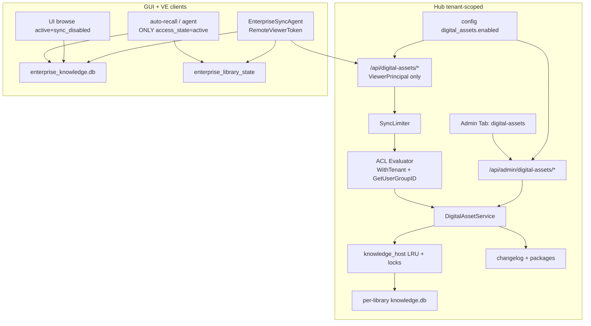

# Hub 租户企业数字资产管理（Digital Assets）+ 客户端单向同步 + 权限

| 字段 | 值 |
| --- | --- |
| 文档标题 | Hub 租户企业数字资产管理（Digital Assets）设计 |
| 作者 | （待填） |
| 日期 | 2026-08-08 |
| 状态 | Implemented（v1 已落地：Hub Admin 数字资产、ACL、GUI 企业知识库 Tab + 用户同步开关、MaClawSrv/agentservice 同步与自动召回/检索合并、OpenAPI 路由） |
| 范围 | Hub 租户侧企业知识库管理、ACL、Admin UI、maclaw GUI / 数字员工（VE）企业知识库本地存储、Hub→客户端单向增量同步 |
| 关联文档 | `docs/maclaw-knowledge-brain-design-zh.md`、`docs/knowledge-export-share-and-hub-import-design-zh.md`、`docs/maclaw-hub-multitenancy-design-zh.md`、`docs/maclaw-hub-enterprise-management-design-zh.md`、`docs/knowledge-auto-recall-design.md`、`docs/iworker/iworker-memory-sync-and-offline-architecture-v1.md` |

---

## Overview

企业在 Hub **租户**下需要集中管理**可版本化、可权限控制、可向客户端下发**的知识库（制度、手册、产品资料等）。本设计引入 **数字资产库（Digital Asset Library）**：

- 租户管理员在 Hub Admin **「数字资产」** 入口导入文档、**浏览器端目录**、**压缩包（包内文档）**、Hub 服务器本地目录、**或知识分享链接**，并支持删除、检索；
- 每个库独立 ACL（`all_members` 或 `restricted` 下指定部门及其子部门）；
- **库合并**：可将多个库合并为一个，便于统一 ACL 与库级策略管理；
- **库级导出/导入（备份）**：支持整库备份包下载与恢复导入；
- 授权主体（maclaw **GUI** 与 **数字员工 VE**）使用 **Viewer Token**，**单向**从 Hub 增量同步到本地独立库 `enterprise_knowledge.db`；
- 部门 ACL **支持祖先继承**（选中父部门则子部门成员可见）；
- ACL 撤销后 **保留本地磁盘、停止更新、隐藏检索**（默认不 purge）；
- 租户级 / 库级可关闭同步：停止 pull，**允许只读浏览本地缓存**，auto-recall 仅 `active`；
- 客户端分步错开 + 服务端 `SyncLimiter` 抑制惊群。

**与 Knowledge Share 的消费关系（单向）**

- **允许**：管理员把已发布的 **Knowledge Share 包**（分享链接 / 知识 ID）**导入**到某个企业数字资产库 → 成为企业真源的一部分 → 再经 Digital Assets 同步下发。
- **禁止**：企业库内容 **反向** 发布为 Knowledge Share（防泄漏策略不变）。
- Share 与 Assets **仍是两套产品**；本能力只是 Assets 的一种 **导入源**，不合并表/API。

### 三类「知识 + Hub」产品边界（必须分清）

| 产品 | 所有者 | 方向 | 路径 / 存储 | 权限模型 |
| --- | --- | --- | --- | --- |
| **Knowledge Share（知识分享）** | 发布用户 | 一次发布 → 他人主动导入 | `/api/knowledge/shares`、`knowledge_shares`；Admin `knowledge` tab | 归一化可见性 `public\|private\|hub\|tenant\|users`（代码 `normalizeKnowledgeVisibilityScope`）；**无部门 ACL、无持续同步** |
| **Knowledge Sync（个人知识云同步）** | 个人用户 | 用户包 **上/下** 载，多端个人库 | `/api/knowledge/sync/*`（`knowledge_sync_handler.go`）；`{data}/knowledge-sync/` | Viewer 身份；**用户私有包**，非租户企业库 |
| **Digital Assets（本设计）** | **租户** | **仅 Hub → GUI/VE**（内容下发）；管理端可 **从 Share 导入** 作内容摄取 | `/api/digital-assets/*`、`/api/admin/digital-assets/*`；`{data}/digital_assets/` | 每库 ACL（含部门祖先继承）+ 租户开关；**禁止**复用 share/sync 的 handler/目录；**允许**只读消费 Share 包 |

命名约束：Admin/GUI 文案使用 **「数字资产 / Digital Assets」「企业知识库」**，避免单独写「同步知识库」造成与个人 Knowledge Sync 混淆。

---

## Background & Motivation

### 当前状态（已对照代码）

| 能力 | 路径 / 模块 | 局限 / 注意 |
| --- | --- | --- |
| 本地个人知识库 | `gui/app_knowledge.go` → `{GetDataDir()}/knowledge.db`；`corelib/knowledge` | 个人数据，无企业中心真源 |
| 编码经验独立库 | `gui/app_coding_knowledge.go` → `coding_knowledge.db`；`coding_store.go` | 已验证独立 DB 隔离模式 |
| 知识分享 | `KnowledgeShare`、`knowledge_shares`、`knowledge-management-tab.js`、`KnowledgeShareToHub` | 可见性实际为 **`public\|private\|hub\|tenant\|users`**（`global` 会归一成 `public`）；无部门 ACL、无持续同步 |
| **个人知识同步** | `/api/knowledge/sync/*`、`knowledge_sync_handler.go`、router 注册 `knowledge-sync` 目录 | 用户私有包 up/down；**不是**企业数字资产 |
| 安全组 / 部门 | `security_groups`、`security_group_members(tenant_id,email)`；`GetUserGroupID`；**须** `security.WithTenant(ctx, tenantID)` | **每 email 仅一个 group**（UPSERT 单组不变量）；空 group **无 root 回退** |
| 租户管理员角色 | `hub/internal/auth/admin_service.go` `normalizedTenantAdminRole` | 真实角色仅 **`tenant_owner` / `tenant_admin`**（另有 `global_owner` / `global_admin`）；**无** `tenant_operator` / `tenant_viewer` |
| 用户侧鉴权先例 | `requireKnowledgeShareViewer` → `authenticateViewerRequest`；GUI/客户端 `cfg.RemoteViewerToken` + `Authorization: Bearer` | Knowledge HTTP **主路径是 Viewer Token**，不是 machine token 直接打 REST |
| VE / 机器身份 | `MachinePrincipal`（`AuthenticateMachine`）；WS 鉴权后 `IssueViewerTokenForUser`（`identity_service.go`） | 机器仅绑定 `user_id`；数字资产 REST **仍用** 该用户的 ViewerPrincipal（含 email） |
| 配置字段 | `corelib.AppConfig.RemoteViewerToken` / `RemoteMachineToken`（`app_config.go`）；agentservice 远程调用同模式 | GUI、MaClawSrv/VE 进程均可持有同一套 remote 凭据 |
| Hub embed knowledge | `mobile_knowledge.go` | 证明可 embed store；但仅为 **单进程单库** mobile agent，**不是**多库 host 先例 |
| 限流组件 | `workflow.RateLimiter` | **仅** per-client token bucket RPM + 固定 Retry-After；**不能**直接当同步并发槽 |
| 导出格式 | `ExportOptions.Format`：`jsonl`（默认快照）或 `package`（JSON）；GUI 对 `mckb` 为包格式别名，**非**原生 zip 导出原语 | 同步包应基于 **scoped jsonl**，不要假设 `mckb.zip` API |

### 痛点

1. 企业资料散落在个人库、个人云同步包或一次性分享链接中，无统一治理。
2. 无法按部门/人员控制可见库，权限收缩后仍可能被 agent 召回本地残留。
3. 管理员发布后客户端同时全量拉取会打爆 Hub。
4. 与 Knowledge Share / Knowledge Sync 混淆会导致错误复用 handler 与存储。

---

## Goals & Non-Goals

### Goals

1. Hub Admin 左侧导航新增 **「数字资产」**（与「知识管理 / Knowledge Share」并列，且不碰 Knowledge Sync UI）。
2. 管理能力（均 **仅管理员**）：
   - 导入单/多文件；
   - **浏览器端目录上传**（管理员本机文件夹，非 Hub 服务器盘）；
   - 导入压缩包（zip，包内文档资料）；
   - 导入 Hub 服务器本地目录（路径白名单，运维向）；
   - 通过知识分享链接 / 知识 ID 导入；
   - 删除、检索（FTS，对标 GUI 体验）。
3. 每个数字资产库独立 ACL：**两模式** — `acl_mode=all_members` **或** `acl_mode=restricted` 且 grants = `departments`；部门维度 **支持祖先继承**。
4. **库合并**：同租户内将源库内容合并进目标库，源库归档/软删，便于统一 ACL、`sync_enabled` 等库级策略。
5. **备份导出/导入**：整库（或批量）导出备份包；可导入到同租户新库或已有库（恢复/迁移）。
6. 客户端（**GUI + VE**）同步到本地 **企业知识库**（独立 DB），**仅 Hub → 客户端单向**；增量优先；错开同步；租户与库级可关同步。
7. 列表、Hub 检索、同步、管理写操作均强制 ACL；进入模型上下文的企业读路径 **必须** 仅 `access_state=active`；`revoked` 隐藏检索；`sync_disabled` 允许 UI 只读浏览。
8. 复用 `corelib/knowledge`；同步包 scoped jsonl；客户端 `ImportSnapshot` **禁止** `ReplaceAll`。
9. ACL 收缩：**keep_local**（停更 + 隐藏检索 + 磁盘保留；可手动 purge）。
10. **Share → Assets 导入（仅管理员）**；普通用户 / Viewer / VE 无此入口。

### Non-Goals（v1）

- 客户端 / VE → Hub **写回**知识内容（单向不变）。
- 双向冲突合并（指 GUI↔Hub 内容双向；**库合并是 Admin 侧库级操作，见下**）。
- 跨 Hub / HubCenter 联邦（跨 Hub 分享不可解析则拒绝）。
- 单条 card/fact ACL。
- **替代或合并** Knowledge Share / Knowledge Sync 产品形态。
- **普通用户** 自助投稿 / 浏览器目录导入 / 备份导入导出（**全部仅管理员**）。
- 实时目录 watch（浏览器目录为一次性选择上传，非持续监听）。
- 独立向量库服务。
- 撤销时自动 purge 本地。
- 引入新的 admin 角色枚举。
- 导入 Share 后与原分享 **自动双向联动更新**。
- 库合并时自动「智能」合并冲突文档语义（仅 ID 命名空间 + 物理合并）。

---

## Proposed Design

### 概念模型

```text
Tenant
  └── Digital Asset Library  1..N
        ├── metadata + sync_enabled + status
        ├── ACL: acl_mode + departments[]
        ├── Per-library knowledge.db (Hub)
        ├── Changelog (rev, package_status, package_ref)
        └── Package artifacts (jsonl snapshot / delta)
```

| 术语 | 含义 |
| --- | --- |
| Library | 租户拥有的企业知识库容器 |
| content_rev | 库内容单调版本；仅在 **包 ready 后** 对客户端可见 tip 推进（见包就绪策略） |
| Sync Cursor | 客户端 `(library_id, last_rev, content_hash)` |
| access_state | 本地库状态：`active` \| `revoked` \| `sync_disabled` \| `archived` |
| acl_fingerprint | 规范 ACL JSON 的 sha256（wire 与本地均使用） |

### 总体架构



---

### Hub 侧知识处理与 knowledge_host

**存储布局**

```text
{hub_data}/digital_assets/{tenant_id}/{library_id}/
  knowledge.db
  packages/
    rev_{N}.jsonl          # scoped or full snapshot
    rev_{N}.sha256
```

**knowledge_host 生命周期（多库运行时）**

`mobile_knowledge.go` 仅证明可打开 **一个** store；本特性需要 **N 库**。实现 `hub/internal/digitalasset/knowledge_host.go`：

| 规则 | 说明 |
| --- | --- |
| 打开 | `singleflight` 按 `library_id` 打开；失败缓存短 TTL 防惊群 |
| 缓存 | LRU，默认 **max_open_libraries=16**（可配置）；淘汰时 `Close()` |
| 写锁 | 每库 `sync.Mutex`：**import / 推进 rev / 构建 package** 互斥 |
| 读 | Search / Export 在持有库读语义下进行；导出可与写互斥（简单起见 v1 与写共用锁） |
| 导入并发 | **每租户同时 running import job ≤ 1** |
| 关闭 | 进程退出 `CloseAll`；库删除时强制 evict + 删目录 |

**导入管线（五种摄取来源 + 备份恢复，均仅管理员）**

```text
A. Upload 单/多文件（管理员浏览器选文件）
E. BrowserDir 浏览器端目录上传（管理员本机文件夹，webkitdirectory）
D. ArchiveImport 压缩包 zip（包内文档资料）
B. PathImport Hub 服务器本地目录（local_dir allowlist，运维）
C. KnowledgeShareImport 分享链接 / knowledge_id（知识快照）
F. BackupImport 备份包导入（见「备份导出/导入」）
        │
        v
  digital_asset_import_jobs
    (kind = upload | browser_dir | archive | local_dir | knowledge_share | backup)
        │
        v
  knowledge_host.WithLibraryWrite(library_id)  // 或 merge/create 新库
        │
        ├─ A/E:  落盘保留 relative_path → ImportFiles / 等价目录导入
        ├─ D:    安全解压 → ImportDirectory
        ├─ B:    ImportDirectory(服务器路径)
        ├─ C:    Share package → ImportPackageSources|ImportSnapshot
        └─ F:    备份包 → 恢复元数据+内容（见备份节）
        │
        v
  更新 source_count / byte_size；provenance；包构建 → content_rev++
```

| 来源 | 数据从哪来 | 典型场景 |
| --- | --- | --- |
| **A 上传文件** | 管理员浏览器 | 少量文档 |
| **E 浏览器目录** | 管理员 **本机** 文件夹（非 Hub 盘） | 批量导入办公资料树 |
| **D 压缩包** | 浏览器上传 zip | 已有打包好的资料包 |
| **B 服务器目录** | Hub **机器本地路径**（白名单） | 运维挂载盘/NFS 扫描 |
| **C 知识分享** | Hub 上已发布的 share 包 | 沉淀用户分享到企业库 |
| **F 备份导入** | 管理员下载的备份包 | 灾难恢复 / 迁移 |

**B 与 E 必须文案区分**：UI 分别叫 **「本机文件夹」** 与 **「服务器路径」**，避免管理员把本机路径填进 B 导致 404/路径非法。

#### 来源 E：浏览器端目录上传（管理员本机）

**浏览器能力（结论：支持，作为 v1 正式能力）**

| API | 用途 | 兼容性 |
| --- | --- | --- |
| `<input type="file" webkitdirectory directory multiple>` | 选择文件夹，得到 `File[]`，每文件带 `webkitRelativePath` | Chromium / Edge / Firefox / Safari 现行版本均可用 |
| 拖放 + `DataTransferItem.webkitGetAsEntry()` | 可选增强 | 同左；实现可 v1.1 |

说明：无统一标准名 `directory` 属性时以 `webkitdirectory` 为准；Safari 需实测大目录内存占用。

**产品语义**：管理员在 **自己电脑** 上选一个文件夹，浏览器把其中文件（保留相对路径）上传到 Hub，写入当前企业库。
**不是** Hub 服务器 `local_dir`（来源 B）；**不需要** 管理员把资料拷到服务器。

**推荐实现策略（两档，默认 A）**

| 策略 | 行为 | 适用 |
| --- | --- | --- |
| **A. 分片多文件上传（默认）** | 前端按批（如 20 文件或 32MB）`multipart` 上传；服务端写入 `…/_tmp/{job}/tree/` 保持 `webkitRelativePath` 目录结构；全部到齐后 `ImportDirectory` | 中小目录；进度细 |
| **B. 浏览器侧打包 zip 再走 archive** | 前端用 JSZip（或原生 CompressionStream 若可用）打 zip，再 `import/archive` | 文件极多、HTTP 连接数受限时的可选路径；v1 可不强制 |

v1 锁定 **策略 A**；若单次选择文件数 > `max_browser_dir_files`（默认 2000）或总字节 > `max_browser_dir_bytes`（默认 500MB），提示改用 zip 压缩包导入。

**API**

```http
POST /api/admin/digital-assets/libraries/{id}/import/browser-dir
Content-Type: multipart/form-data

# 首次创建 job（可无文件）：
#   action=start&root_name=制度汇编
# 续传批次：
#   action=append&job_id=...&files=<多个 File，字段名 files>
#   每个 File 附带 form 字段 relative_paths[] 与 webkitRelativePath 对齐
# 收尾：
#   action=commit&job_id=...
```

或简化为单次请求（小目录）：`files` 多 part + `relative_path` 元数据 JSON。

```text
1. Admin 鉴权；创建 job kind=browser_dir, phase=receiving
2. 每批 append：校验扩展名白/黑名单、单文件大小、累计配额；按 relative_path 落盘（防 path traversal）
3. commit：目录齐全后 ImportDirectory(tmp_tree)；provenance enterprise_import_kind=browser_dir
4. 包构建 → content_rev++；清理 tmp
```

**前端 UI**

- 按钮「选择本机文件夹」：`input[webkitdirectory][multiple]`
- 展示：根文件夹名、文件数、总大小；超限警告
- 进度：上传批次 N/M → 服务端导入 → 同步包就绪
- **不支持** 的浏览器：隐藏入口，引导改用「上传压缩包」

**安全**

- relative_path 规范化，拒绝 `..` 与绝对路径
- 与 archive 相同扩展名黑名单
- 仅 admin；不落用户端 API

#### 来源 D：压缩包导入（包内文档资料）

**产品语义**：管理员上传一个 **压缩包**，包内是制度/手册/说明等 **原始文档文件**（可含子目录）。Hub 解压后按 **目录批量导入** 写入企业库（与 GUI「导入目录」体验对齐），再进入企业同步下发。
**不是** `maclaw.knowledge.package` 知识快照包（那是来源 C）；也不是用户自解压后上传零散文件（那是来源 A）。

**支持格式（v1）**

| 格式 | 支持 | 说明 |
| --- | --- | --- |
| `.zip` | **必须** | 主路径；`archive/zip` |
| `.tar.gz` / `.tgz` | 可选 v1.1 | 若实现成本低可一并做；否则文档写「v1 仅 zip」 |
| `.rar` / `.7z` | **不做** | 依赖与安全面大 |

**API**

```http
POST /api/admin/digital-assets/libraries/{id}/import/archive
Content-Type: multipart/form-data
file: <archive.zip>
```

可选字段：

```json
{
  "topic_hint": "制度汇编",
  "include_globs": ["**/*.{pdf,docx,md,txt,xlsx,pptx,html}"],
  "exclude_globs": ["**/~$*", "**/.DS_Store", "**/__MACOSX/**"]
}
```

响应：`202 { "job_id": "..." }`。

**服务端步骤**

```text
1. Admin 鉴权；library 本租户 active
2. 校验：
   - Content-Type / 魔数：ZIP (PK\x03\x04)
   - 压缩包体积 ≤ max_archive_upload_bytes（默认 200MB，可配）
   - 扩展名 .zip
3. 落盘到临时路径：
   {hub_data}/digital_assets/_tmp/{tenant_id}/{job_id}/upload.zip
4. 安全解压到：
   {hub_data}/digital_assets/_tmp/{tenant_id}/{job_id}/extract/
   安全规则（必须全部满足，否则 job failed）：
   - Zip Slip：每个 entry 规范化后必须仍在 extract 根下（禁 ../）
   - 拒绝 symlink / hardlink entry
   - 解压后总字节 ≤ max_archive_extracted_bytes（默认 1GB）
   - 文件数 ≤ max_archive_file_count（默认 5000）
   - 单文件 ≤ max_single_file_bytes（与 upload 一致，如 50MB）
   - 跳过可执行扩展名：.exe .dll .so .bat .cmd .ps1 .sh …（黑名单）
5. 对 extract 根调用 corelib：
   store.ImportDirectory(ctx, DirectoryImportRequest{
     Root: extractDir,
     // include/exclude 来自请求或租户默认
     // 与 GUI KnowledgeStartImportDirectory 语义对齐
   })
6. provenance：
   - enterprise_import_kind = archive
   - archive_name = 原始文件名
   - relative_path = 包内相对路径（写入 source.RelativePath / metadata）
7. 配额检查 max_library_bytes；成功则包构建 → content_rev++
8. defer 清理 _tmp/{job_id}（成功/失败均删；失败可保留短 TTL 供排障，默认 24h 后 GC）
```

**与 GUI 目录导入对齐**

- 解析器、蒸馏、跳过已存在 content_hash 等行为复用 `corelib/knowledge` 的 `ImportDirectory` / `ImportFiles`（见 `import_prepare.go`、`import_parallel.go`）。
- Admin UI 进度展示：扫描中 → 导入 N/M → 打包同步就绪（复用 `import/jobs` 的 `progress_json`）。

**settings 建议默认值**（写入租户 `digital_assets` 设置）

```json
{
  "max_archive_upload_bytes": 209715200,
  "max_archive_extracted_bytes": 1073741824,
  "max_archive_file_count": 5000,
  "archive_include_extensions": [".pdf",".docx",".doc",".md",".txt",".xlsx",".xls",".pptx",".ppt",".html",".htm",".csv"],
  "archive_deny_extensions": [".exe",".dll",".so",".bat",".cmd",".ps1",".sh",".msi",".dmg"]
}
```

**非目标（压缩包）**

- 包内嵌套 zip 递归解压（v1 **不**自动展开内层压缩包；可跳过或仅作为二进制忽略）。
- 加密 zip（无密码则失败，提示「不支持加密压缩包」）。
- 把 zip 当 knowledge snapshot 解析（那是 knowledge-share / package 路径）。

#### 库合并（Library Merge）

**动机**：多库拆分后 ACL、`sync_enabled`、检索范围难管；管理员需要把「产品手册 v1 + v2 + 补充」合并成一个库，只维护 **一套库级策略**。

**产品规则**

| 项 | 规则 |
| --- | --- |
| 权限 | 仅 `tenant_owner` / `tenant_admin` |
| 范围 | **同租户**；源库与目标库均 `status=active`；禁止自己合并自己 |
| 方向 | 一或多个 **源库** → 一个 **目标库**（目标可已有内容） |
| 内容 | 源库全部 source 子图拷入目标库；ID 使用前缀 `merge_{srcLibId}_` 避免碰撞（对齐 merge_namespace） |
| ACL / 元数据 | **以目标库为准**；源库 ACL **丢弃**（合并目的就是统一策略） |
| 源库归宿 | 默认 `status=archived` + `tombstone` changelog（客户端最终 revoked/不再出现在 manifest）；可选 `delete_sources_after_merge` 清源库 store（默认归档保留 30 天后 GC） |
| 同步 | 目标库 `content_rev++`（replace 或大增量）；客户端对源 library_id 走 tombstone；对目标 pull 新 rev |
| 并发 | 占用租户 import 槽；合并期间锁定参与库写操作 |

**API**

```http
POST /api/admin/digital-assets/libraries/merge
```

```json
{
  "target_library_id": "lib_main",
  "source_library_ids": ["lib_a", "lib_b"],
  "archive_sources": true,
  "topic_hint_prefix": true
}
```

响应：`202 { "job_id": "..." }`；`kind=library_merge`。

**步骤**

```text
1. 校验租户、库状态、配额（合并后 byte_size ≤ max_library_bytes）
2. 按序打开 source stores（只读）+ target 写锁
3. 对每个 source：ExportSnapshot(jsonl 全量) → 重写 ID 前缀 → ImportSnapshot 入 target
   （或直接 SQL/API 拷贝子图；实现选成本低者）
4. provenance: enterprise_import_kind=library_merge, from_library_id=...
5. target 包构建 ready → content_rev++
6. source: status=archived；changelog op=tombstone_library
7. 审计 digital_asset.library_merge
```

**UI**：库列表多选 →「合并到…」选目标库 → 二次确认文案：「源库将归档，ACL 以目标库为准」。

**非目标**

- 跨租户合并。
- 合并后保留「虚拟子库」视图（v1 物理合并即可）。
- 自动拆库（split）—— 可用备份导入到新库手工拆。

#### 备份导出 / 导入（Disaster Recovery）

**动机**：租户迁移、误删恢复、离线归档；**不是** 给终端用户同步用的路径（同步仍走 Digital Assets sync 协议）。

**备份包格式 `digital_asset_backup_v1`**

```text
backup.zip
  manifest.json          # format, version, tenant_id, exported_at, libraries[]
  libraries/
    {library_id}/
      meta.json          # name, description, acl, sync_enabled, content_rev, counts
      knowledge.jsonl    # ExportSnapshot 全量（与 corelib 一致）
      # 可选：packages/ 最新 tip 包副本
```

`manifest.json` 关键字段：

```json
{
  "format": "digital_asset_backup_v1",
  "tenant_id": "t_xxx",
  "exported_at": "2026-08-08T12:00:00Z",
  "libraries": [
    {"id": "lib_a", "name": "制度", "content_rev": 12, "sha256": "..."}
  ]
}
```

**导出（Admin）**

| API | 说明 |
| --- | --- |
| `POST /api/admin/digital-assets/export` | body: `{ "library_ids": ["..."] }` 或 `"all": true` |
| `GET /api/admin/digital-assets/export/jobs/{id}` | 进度 |
| `GET /api/admin/digital-assets/export/jobs/{id}/download` | 下载 backup.zip |

- 异步 job：`kind=export_backup`；大库流式写 zip。
- 仅本租户库；ACL 原文写入 meta（恢复时可选择是否恢复 ACL）。
- 导出 **不** 改变 content_rev；只读 knowledge_host。

**导入 / 恢复（Admin）**

| API | 说明 |
| --- | --- |
| `POST /api/admin/digital-assets/import/backup` | multipart backup.zip |

```json
{
  "mode": "new_libraries",
  "restore_acl": true,
  "id_policy": "new_ids"
}
```

| mode | 行为 |
| --- | --- |
| `new_libraries`（默认） | 每个备份库 **新建** library_id；内容导入；可选恢复 ACL |
| `into_library` | 指定 `target_library_id`，内容 merge_namespace 并入（类似合并） |
| `replace_library` | 指定目标库：清空后恢复（二次确认） |

| id_policy | 行为 |
| --- | --- |
| `new_ids` | 新 library_id，避免与现网冲突（**推荐**） |
| `preserve_ids` | 仅当目标租户无同 id 时保留；否则失败 |

- 校验 `manifest.tenant_id` 与当前 admin 租户一致（跨租户恢复需显式 `allow_cross_tenant_restore` 默认 **false**）。
- 成功后各库包构建 → 客户端可同步。
- **禁止** 把备份包当成 Knowledge Share 发布；**禁止** 普通用户下载。

**与日常同步包的区别**

| | 同步包 (jsonl rev) | 备份包 (backup.zip) |
| --- | --- | --- |
| 消费者 | GUI/VE EnterpriseSyncAgent | 仅 Admin 备份/恢复 |
| 含 ACL 元数据 | manifest 仅 fingerprint | meta.json 完整 ACL |
| 多库 | 按库 pull | 可打包多库 |
| 方向 | Hub→客户端增量 | Admin 下载 / 上传 |

#### 来源 C：通过知识分享链接 / 知识 ID 导入

**产品语义**：把用户（或同事）已发布到 Hub 的 **Knowledge Share 快照**，**拷贝**进租户企业数字资产库，之后由企业 ACL + 单向同步治理，而不是让企业客户端去拉分享链接。

**输入形态（Admin UI 同一输入框解析）**

| 输入 | 解析 |
| --- | --- |
| 分享页 URL | `https://<hub>/k/<knowledge_id>` 或 `/hub/knowledge/shares/<id>` 等现有人类链接 |
| Agent/API 链接 | `/api/knowledge/shares/<id>?intent=import` |
| 包链接 | `/api/knowledge/shares/<id>/package` |
| 纯 `knowledge_id` | 视为本 Hub 条目 ID |

解析失败 → `400 invalid_share_ref`。

**服务端步骤（Admin only）**

```text
1. 鉴权：tenant_owner | tenant_admin；目标 library 属本 tenant 且 status=active
2. 解析 knowledge_id；读 KnowledgeShare 元数据（store.KnowledgeShareRepository）
3. 可见性校验（见下「Share 访问策略」）
4. 通过现有包存储读取 package 字节
   - 复用 packageDir + DownloadKnowledgeSharePackage 同源逻辑
   - 内部直接读磁盘/storage_ref，避免 Admin 再走 Viewer 绕圈
   - 格式：maclaw.knowledge.package（JSON）或导出 jsonl；与 GUI 导入兼容
5. 创建 import_job(kind=knowledge_share, status=running)
6. knowledge_host.WithLibraryWrite:
   a. 将 package 导入 library 的 knowledge.db
      - 优先：corelib knowledge ImportPackage / ImportSnapshot 等价路径
      - Overwrite: true；ReplaceAll: false；SkipSafetyBackup: true
      - 若 package 内 source ID 与库内已有 ID 冲突：按 import_mode 处理（见下）
   b. 为导入的 source 写入 provenance 元数据（metadata/labels）：
      - enterprise_import_kind = knowledge_share
      - source_knowledge_id = <kid>
      - source_share_title / imported_at / imported_by
   c. 配额检查 max_library_bytes / max_sources
7. 包构建 pending→ready，推进 content_rev（与 upload/local-dir 相同）
8. job 完成；可选 IncrementCounters(import) 记入原分享统计（与用户导入计数一致，便于运营）
```

**import_mode（API 字段，默认 `merge`）**

| 模式 | 行为 |
| --- | --- |
| `merge`（默认） | 与现有库合并；同 ID Overwrite；不同 ID 新增 |
| `merge_namespace` | 导入前将 package 内所有 ID 加前缀 `ks_<knowledge_id>_`，避免与库内 ID 碰撞（**推荐默认可升为该模式** 若实测冲突多） |
| `replace_library` | **仅当** Admin 显式确认：先清空该 library 全部 source 再导入（库级 replace_snapshot 语义）——危险，UI 需二次确认 |

v1 实现建议：**默认 `merge_namespace`**，降低用户包与企业已有资料 ID 碰撞风险。

**Share 访问策略（谁能把分享灌进企业库）**

| 规则 | 说明 |
| --- | --- |
| 角色 | **仅** `tenant_owner` / `tenant_admin`；路由挂在 `/api/admin/digital-assets/*`，**不**暴露 `/api/digital-assets/*` 用户面 |
| 非管理员 | Viewer / 普通成员 / VE：**403**；GUI/VE **无**「导入到企业库」操作 |
| 租户边界 | Share 的 `tenant_id` 必须与目标 library 的 `tenant_id` **相同**；跨租户拒绝 `403 cross_tenant_share`（即使 visibility=public） |
| 可见性 | 在同租户前提下：`public` / `hub` / `tenant` 允许；`users`/`private` **仅当** 分享所有者邮箱 == 当前 admin **或** 当前 admin 在 selected_users 中，**或** 显式配置 `allow_admin_import_private_shares=true`（默认 **true** 于企业治理场景：租户 admin 可治理本租户内已发布分享；若合规要求收紧可关） |
| 过期 / 下架 | `expires_at` 已过、已取消/删除的分享 → `410 share_unavailable` |
| 包缺失 | storage 无包 → job failed，不推进 rev |

**与日常同步的关系**

- 导入成功后内容在 **企业库 store**；客户端只走 Digital Assets sync，**不会**再访问原 share package_url。
- 原分享后续被删除/改可见性 **不影响** 已导入的企业副本（快照语义）。
- 再次粘贴同一 knowledge_id 导入：按 `merge_namespace` 为幂等更新（同前缀 Overwrite）或生成新前缀版本——v1 用 **固定前缀 `ks_<kid>_`** 实现幂等重导。

**审计**

- 记 admin audit：`digital_asset.import.knowledge_share`，字段含 library_id、knowledge_id、import_mode、source_count、bytes、actor。

---

### 数据模型（Hub 主库 migration）

```sql
CREATE TABLE IF NOT EXISTS digital_asset_libraries (
  id              TEXT PRIMARY KEY,
  tenant_id       TEXT NOT NULL,
  name            TEXT NOT NULL,
  description     TEXT NOT NULL DEFAULT '',
  status          TEXT NOT NULL DEFAULT 'active', -- active|archived|deleted
  sync_enabled    INTEGER NOT NULL DEFAULT 1,
  acl_mode        TEXT NOT NULL DEFAULT 'all_members', -- all_members|restricted
  acl_departments_json TEXT NOT NULL DEFAULT '[]',
  acl_users_json       TEXT NOT NULL DEFAULT '[]', -- legacy column; always written as []
  content_rev     INTEGER NOT NULL DEFAULT 0,  -- 仅 ready 包对应的 tip
  content_hash    TEXT NOT NULL DEFAULT '',
  store_path      TEXT NOT NULL DEFAULT '',
  source_count    INTEGER NOT NULL DEFAULT 0,
  card_count      INTEGER NOT NULL DEFAULT 0,
  byte_size       INTEGER NOT NULL DEFAULT 0,
  created_by      TEXT NOT NULL DEFAULT '',
  updated_by      TEXT NOT NULL DEFAULT '',
  created_at      TEXT NOT NULL,
  updated_at      TEXT NOT NULL,
  deleted_at      TEXT
);
CREATE INDEX IF NOT EXISTS idx_dal_tenant ON digital_asset_libraries(tenant_id, status, updated_at DESC);

CREATE TABLE IF NOT EXISTS digital_asset_changelog (
  tenant_id       TEXT NOT NULL,
  library_id      TEXT NOT NULL,
  rev             INTEGER NOT NULL,
  op              TEXT NOT NULL, -- upsert_sources|delete_sources|replace_snapshot|acl_meta|tombstone_library
  package_status  TEXT NOT NULL DEFAULT 'pending', -- pending|ready|failed
  package_ref     TEXT NOT NULL DEFAULT '',
  package_sha256  TEXT NOT NULL DEFAULT '',
  package_bytes   INTEGER NOT NULL DEFAULT 0,
  payload_json    TEXT NOT NULL DEFAULT '{}',
  content_hash    TEXT NOT NULL DEFAULT '',
  error_message   TEXT NOT NULL DEFAULT '',
  created_at      TEXT NOT NULL,
  ready_at        TEXT,
  PRIMARY KEY (tenant_id, library_id, rev)
);

CREATE TABLE IF NOT EXISTS digital_asset_import_jobs (
  id            TEXT PRIMARY KEY,
  tenant_id     TEXT NOT NULL,
  library_id    TEXT NOT NULL,
  kind          TEXT NOT NULL,
  -- upload | browser_dir | archive | local_dir | knowledge_share
  -- | library_merge | export_backup | backup
  status        TEXT NOT NULL, -- queued|running|succeeded|failed
  progress_json TEXT NOT NULL DEFAULT '{}',
  error_message TEXT NOT NULL DEFAULT '',
  created_by    TEXT NOT NULL DEFAULT '',
  created_at    TEXT NOT NULL,
  updated_at    TEXT NOT NULL
);
-- progress_json 示例（knowledge_share）:
-- {"share_ref":"https://hub/k/kn_xxx","knowledge_id":"kn_xxx","import_mode":"merge_namespace",
--  "source_count":12,"bytes":1048576,"phase":"importing|packaging"}
-- progress_json 示例（archive）:
-- {"archive_name":"policies.zip","phase":"extracting|scanning|importing|packaging",
--  "extracted_files":120,"imported":95,"skipped":25,"bytes":52428800}

CREATE TABLE IF NOT EXISTS digital_asset_sync_cursors (
  tenant_id    TEXT NOT NULL,
  library_id   TEXT NOT NULL,
  user_id      TEXT NOT NULL,
  device_id    TEXT NOT NULL,
  last_rev     INTEGER NOT NULL DEFAULT 0,
  last_sync_at TEXT NOT NULL,
  last_status  TEXT NOT NULL DEFAULT '',
  PRIMARY KEY (tenant_id, library_id, user_id, device_id)
);
```

**content_hash**

```text
content_hash = hex(sha256( canonical_json(
  sort_by_source_id([ { "id": source_id, "hash": source_content_hash_or_mtime_size } ... ])
  + "|rev=" + tip_rev
)))
```

若无 per-source hash 字段，则用 store 导出 tip jsonl 文件的 sha256 作为 tip `content_hash`（实现二选一，changelog 与 library 行保持一致）。

**changelog GC 默认（单一保留谓词，锁定）**

配置默认：`changelog_keep_revs=50`，`changelog_keep_days=30`。

对每条 `package_status=ready` 的 changelog 行，**保留**当且仅当：

```text
retain =
  (tip_rev - rev < changelog_keep_revs)          // 窗口内最近 N 个 rev（按 rev 距离 tip）
  OR (now_utc - ready_at < changelog_keep_days)  // 或仍在时间窗口内
  OR (该 library 中最新的 op=replace_snapshot 全量包，始终保留 1 份)
```

- **删除**仅当上述三者皆不满足（即：rev 过旧 **且** ready_at 过期 **且** 不是最新 replace_snapshot）。
- 例：rev 51 且昨天 ready → 因时间谓词保留；rev 10 且 40 天前 → 若距 tip ≥ 50 则删除。
- `pending`/`failed` 行：超过 7 天可清理（与 ready 保留无关）。
- 间隙：客户端 `since_rev` 不在仍保留的 ready rev 集合内 → pull 返回 `op=replace_snapshot`。

**租户设置**（`tenants.settings_json.digital_assets`）与 **Hub 配置**

```yaml
# hub config（进程级总开关 — 所有 API 门闩）
digital_assets:
  enabled: false
  max_open_libraries: 16
```

```json
{
  "digital_assets": {
    "sync_enabled": true,
    "max_libraries": 50,
    "max_library_bytes": 2147483648,
    "max_package_bytes": 104857600,
    "local_dir_allowlist": ["/data/enterprise-docs"],
    "quiet_hours": { "enabled": false, "start_hhmm": "00:00", "end_hhmm": "06:00", "timezone": "Asia/Shanghai" },
    "sync_rate": {
      "per_user_rpm": 30,
      "per_tenant_concurrent_pulls": 20,
      "max_delta_sources_per_pull": 50,
      "max_package_bytes_per_pull": 52428800
    },
    "revoke_policy": "stop_updates_keep_local",
    "changelog_keep_revs": 50,
    "changelog_keep_days": 30
  }
}
```

> `revoke_policy`：**产品锁定** `stop_updates_keep_local`（保留本地、停更、隐藏检索）。`purge_local` 仅作未来/高级策略预留，v1 默认不启用。
> `changelog_keep_revs` / `changelog_keep_days`：GC **并集保留**（见上文谓词）；行同时过旧且过期才删。

- **进程开关** `digital_assets.enabled`：为 false 时 **所有** `/api/digital-assets*` 与 `/api/admin/digital-assets*` 返回 **404**（含已注册路由短路）。
- **租户开关** `settings.digital_assets.sync_enabled`：关闭后 pull 返回 HTTP **200** + `reason=tenant_sync_disabled`（见状态机）；客户端进入 `sync_disabled`。

---

### ACL 模型

#### 两模式 + 并集 grants（全文统一）

```go
type DigitalAssetACL struct {
    Mode        string   `json:"mode"`         // "all_members" | "restricted"
    Departments []string `json:"departments"`  // security group IDs；仅 restricted 生效
}
```

- **`all_members`**：本租户任意 bound user（及可映射到 ViewerPrincipal 的 VE）可读/可同步。
- **`restricted`**：用户所属 group 的 **祖先链** 与 `departments` 有交集（见下）。
- **`restricted` 且 departments 为空**：**拒绝所有普通用户/VE**（仅 admin 管理接口可操作该库）。
- 产品话术与 Goals 均使用「全体成员 / 指定部门及子部门」两种模式；指定部门只能从组织机构树中选择。

#### 写权限矩阵（真实 Hub 角色）

| 角色 | 来源 | 数字资产权限 |
| --- | --- | --- |
| `tenant_owner` | `normalizedTenantAdminRole` | 本租户全部管理（CRUD、ACL、导入、删除、设置） |
| `tenant_admin` | 同上 | 本租户全部管理（与 owner 同权 v1；若后续收紧需改 AdminService，**不**发明 operator） |
| `global_owner` / `global_admin` | 全局 admin | 默认 **不可** 读写正文；仅在明确排障审计流程下只读；**不得**静默跨租户改 ACL |
| 普通用户 / VE `ViewerPrincipal` | Identity | 仅 ACL 允许的 list/search/sync |

**不使用** `tenant_operator` / `tenant_viewer`（代码中不存在）。

#### 部门解析、祖先继承与租户上下文（强制）

**产品决策：父部门授权始终覆盖子孙部门成员**；该行为不提供租户级开关。

产品语义：「ACL 中选中**父部门** ⇒ **子部门成员**也可见」。等价于：用户所属 group 是某个 ACL department 的**后代**（或自身）则命中。

**实现选用 (b) 向上展开用户 group（推荐）**——对齐现有 `parent_id` 链（`SecurityStore.GetGroupByID` / `GetGroupDepth`），大组织下比向下展开全部子孙更便宜：

```text
ctx = security.WithTenant(ctx, library.TenantID)   // 必须

func Authorize(principal, library) bool:
  if library.tenant_id != principal.TenantID: deny
  if library.status != active: deny
  if library.acl_mode == all_members: allow

  email = lower(principal.Email)  // VE 须解析出可用 email，见「VE 同步」节
  G = GetUserGroupID(ctx, email)   // 单组；空串则无部门命中
  if G == "": deny

  // 祖先链：G, parent(G), parent(parent)... 直至 parent_id=="" 的 root（含 root）
  chain = []
  cur = G
  for depth 0..maxDepth(10):        // 与 security 树深度上限一致
    chain.append(cur)
    g = GetGroupByID(ctx, cur)
    if g == nil or g.ParentID == "": break
    cur = g.ParentID

  if chain ∩ library.acl_departments ≠ ∅: allow
  else: deny
```

| 规则 | 说明 |
| --- | --- |
| WithTenant | ACL 与一切 group 查询 **必须** 注入；缺省会落到 default tenant 导致错判 |
| 单组不变量 | `security_group_members` 每 `(tenant_id, email)` 一行；用户 **仅** 属于一个 group |
| 空 group | `GetUserGroupID` 返回 `""` 且 **无 root 回退** → 仅 `all_members` 或显式 `users` 命中才授权 |
| 祖先继承 | **默认 ON**：用户 group 向上 walk `parent_id`，与 `acl_departments` 求交 |
| 不采用 (a) 默认路径 | 不在 eval 时向下展开 ACL 部门全部子孙（可后续做缓存优化，非 v1 必选） |
| 跨租户同邮箱 | 测试：tenant_a / tenant_b 同 email 不同 group，ACL 不得串租户 |

**必测用例**

| 场景 | 期望 |
| --- | --- |
| ACL departments=[父]，用户在子部门 | **允许** |
| ACL departments=[父]，用户在兄弟部门 | **拒绝** |
| ACL departments=[子]，用户在父部门 | **拒绝**（向上展开不反向） |
| 用户 group 即 ACL 中部门自身 | **允许** |
| 用户无 group | **拒绝**（非 all_members） |
| `parent_id=""` root 在 chain 末端 | walk 终止；root 在 ACL 则全树成员命中（若产品把 root 当「全公司」需慎用） |

#### `acl_fingerprint`（wire + 本地）

```text
canonical = json.Marshal({
  "mode": mode,
  "departments": sorted(departments),
  "users": sorted(lower(users))
})  // 紧凑、键序固定
acl_fingerprint = hex(sha256(canonical))
```

Manifest 每个 library 下发 `acl_fingerprint`；**不**混入 `content_rev`（内容变更不改变 fingerprint）。

---

### 包就绪策略（消除 async 竞态）

采用 **「同步构建或 pending 不可见」** 组合，禁止 pull 返回未就绪包：

1. 内容变更在写锁内完成后，分配 `next_rev = tip+1`，插入 changelog：`package_status=pending`。
2. **同一写锁内** 或紧随的包构建 worker（单 flight per library）：
   - 成功：写 `packages/rev_{N}.jsonl`，填 `package_sha256` / bytes，`package_status=ready`，`library.content_rev = N`，更新 `content_hash`。
   - 失败：`package_status=failed`，`content_rev` **不**推进；import job 标记 failed；Admin 可见错误。
3. **Manifest / pull 只暴露 `package_status=ready` 的 rev**；pending/failed 对客户端不可见。
4. 可选优化：pull 时对「已写入 store 但包丢失」做 **on-demand 构建 + singleflight**，仍等 ready 再返回。
5. 客户端下载 404：不推进 cursor；`retry_after_ms` 退避。

**增量包格式（绑定实现）**

- 优先：`ExportSnapshot` + `ExportOptions{ Format: "jsonl", SourceIDs: [...] }`（scoped 已存在）。
- 全量 bootstrap：`Format: "jsonl"` 无 SourceIDs（或全量 source 列表）。
- **不**依赖不存在的 `mckb.zip` 原生导出 API；若传输需要压缩，用 **gzip 包装 jsonl**（`Content-Encoding` 或 `.jsonl.gz`），manifest 声明 `package_format: "knowledge_snapshot_jsonl_v1"`。
- `package` JSON 格式可用于小包人工交换，**不是** v1 同步主路径。

---

### 同步协议（Hub → Client，Viewer 鉴权）

#### 鉴权（固定）

| API 面 | 鉴权 |
| --- | --- |
| `/api/admin/digital-assets/*` | Admin JWT；租户 admin 自动限制 `tenant_id` |
| `/api/digital-assets/*` | **`authenticateViewerRequest` / `ViewerPrincipal`**（与 knowledge share / knowledge sync 一致） |
| GUI | `cfg.RemoteViewerToken` + Hub base URL 解析（同 `KnowledgeShareToHub`） |

**v1 不接受 machine token 作为数字资产主鉴权**。若未来 headless 需要，须单独立项：machine → 映射 `user_id/email/tenant_id` + 测试矩阵；本设计不实现。

#### 序列

```mermaid
sequenceDiagram
  participant GUI as GUI EnterpriseSyncAgent
  participant Hub as UserAPI + SyncLimiter
  participant ACL as ACL WithTenant
  participant Host as knowledge_host

  GUI->>GUI: jitter = fnv32(user+device+UTC_date) % 10m
  GUI->>Hub: GET manifest Authorization Bearer viewer
  Hub->>ACL: filter libraries
  Hub-->>GUI: libs + tenant_sync_enabled + acl_fingerprint

  alt tenant_sync_enabled false
    GUI->>GUI: access_state=sync_disabled; stop pulls
  else
    loop libraries sequential max_in_flight=1
      GUI->>Hub: POST pull since_rev
      Hub->>Hub: AllowPull + AcquireSlot
      Hub->>ACL: library ACL
      Hub->>Host: ready changelog only
      Hub-->>GUI: ops or 200 reason or 429
      GUI->>GUI: apply ImportSnapshot safe opts
    end
  end
```

#### API 草案

**Admin**

| Method | Path | 说明 |
| --- | --- | --- |
| GET/POST | `/api/admin/digital-assets/libraries` | 列表 / 创建 |
| PATCH/DELETE | `/api/admin/digital-assets/libraries/{id}` | 元数据 ACL sync_enabled / 软删 |
| POST | `.../import/upload` | 导入单/多文件 |
| POST | `.../import/browser-dir` | **浏览器本机文件夹**（webkitdirectory） |
| POST | `.../import/archive` | 压缩包（包内文档，v1=zip） |
| POST | `.../import/local-dir` | **Hub 服务器**本地路径（白名单） |
| POST | `.../import/knowledge-share` | 分享链接 / 知识 ID |
| POST | `.../import/backup` | **备份包恢复导入** |
| POST | `/api/admin/digital-assets/libraries/merge` | **库合并** |
| POST | `/api/admin/digital-assets/export` | **备份导出**（异步 job） |
| GET | `.../export/jobs/{id}`、`.../export/jobs/{id}/download` | 导出进度 / 下载 |
| GET | `.../import/jobs/{job_id}` | 导入/合并/备份 job 进度 |
| DELETE | `.../sources/{source_id}` | 删来源 |
| GET | `.../search?q=` | Hub FTS |
| GET/PUT | `/api/admin/digital-assets/settings` | 租户 digital_assets 设置 |

**`POST /api/admin/digital-assets/libraries/{id}/import/knowledge-share`**

```json
{
  "share_ref": "https://hub.example.com/k/kn_abc123",
  "import_mode": "merge_namespace"
}
```

响应：`202 { "job_id": "...", "knowledge_id": "kn_abc123" }`；进度走既有 jobs API。

**User（Viewer）**

| Method | Path | 说明 |
| --- | --- | --- |
| GET | `/api/digital-assets/libraries` | 可见库 |
| GET | `/api/digital-assets/libraries/{id}/search?q=` | 在线检索（可选） |
| GET | `/api/digital-assets/sync/manifest` | tip rev、hash、flags、acl_fingerprint |
| POST | `/api/digital-assets/sync/pull` | delta |
| GET | `/api/digital-assets/sync/packages/{ref}` | 下包（计入限流） |
| POST | `/api/digital-assets/sync/ack` | 可选遥测 |

**pull 请求**

```json
{
  "library_id": "dal_...",
  "since_rev": 12,
  "device_id": "dev_...",
  "client_max_bytes": 52428800,
  "client_max_ops": 50
}
```

**pull 响应（成功有数据）**

```json
{
  "library_id": "dal_...",
  "tenant_sync_enabled": true,
  "library_sync_enabled": true,
  "acl_fingerprint": "…",
  "base_rev": 12,
  "tip_rev": 18,
  "complete": false,
  "package_format": "knowledge_snapshot_jsonl_v1",
  "ops": [
    {
      "rev": 13,
      "op": "upsert_sources",
      "package_status": "ready",
      "package_url": "/api/digital-assets/sync/packages/...",
      "package_sha256": "...",
      "bytes": 1200000,
      "source_ids": ["src_a"]
    }
  ],
  "retry_after_ms": 0,
  "reason": ""
}
```

**稳定 reason（HTTP 语义锁定）**

| 场景 | HTTP | body |
| --- | --- | --- |
| 功能总开关关闭 | **404** | 无详情 |
| 租户 `sync_enabled=false` | **200** | `ops=[]`, `reason=tenant_sync_disabled`, `complete=true` |
| 库 `sync_enabled=false` | **200** | `reason=library_sync_disabled` |
| 库 archived/deleted 对用户 | **404** | （防探测） |
| ACL 拒绝 | **404** | |
| 限流 | **429** | `Retry-After` 秒 + `retry_after_ms` |
| rev 断层 | **200** | `op=replace_snapshot` 单包 |
| 无新 ready rev | **200** | `ops=[]`, `complete=true` |

---

### 客户端状态机（撤销 / 禁用 / 归档）— 产品锁定

| 服务端条件 | 客户端 `access_state` | 调度 | UI 只读浏览 | Search API（显式） | auto-recall / agent 注入 |
| --- | --- | --- | --- | --- | --- |
| manifest 含库 + ACL 通过 + tenant/library sync on | `active` | 按 cursor pull | 是 | 是 | **是** |
| manifest 含库但 `library_sync_enabled=false` | `sync_disabled` | 不 pull | **是**（本地缓存） | 可选 UI 内检索缓存 | **否** |
| 租户 `sync_enabled=false`（`tenant_sync_disabled`） | 各库 → `sync_disabled` | 停止全部 pull | **是**（本地缓存） | 同左；排除 `revoked` | **否**（仅 active） |
| 曾同步过的库 **不再** 出现在 manifest（ACL 移除/收缩） | **立即** `revoked` | 停止 pull | **否**（列表隐藏） | **否** | **否** |
| pull 单库 404（ACL/删除） | `revoked` | 停止 | 否 | 否 | 否 |
| 库 tombstone / deleted | `revoked` | 停止 | 否 | 否 | 否 |

**ACL 撤销 / 收缩（产品锁定）**

- `revoke_policy = stop_updates_keep_local`（默认且 v1 唯一启用行为）。
- 行为：`access_state=revoked`；**不 pull**；Search / auto-recall / agent **不可见**；**磁盘数据保留**直至用户在 UI **手动 purge** 或未来管理员启用 `purge_local` 策略。
- **不**在 revoke 时自动删库文件或 `DeleteSource` 整库（避免误伤与合规窗口争议）。

**检测撤销**：以 **manifest 省略** 为主信号；辅以 pull **404**。不得仅依赖 UI 隐藏。

**Search / auto-recall 不变量（Goal 5，产品锁定）**

```text
UI 列表 / 只读打开:
  access_state IN ('active', 'sync_disabled')   // revoked 隐藏

EnterpriseKnowledgeSearch / auto-recall / agent 工具注入:
  access_state == 'active' ONLY

磁盘:
  revoked 行与 mapped sources 默认保留（keep_local）
  提供用户手动「清除已撤销企业库」→ 删 map + DeleteSource + 删 state 行

NEVER scan raw enterprise_knowledge.db without joining enterprise_library_state
```

---

### 数字员工（VE）同步（v1 必做）

**产品决策：v1 支持 VE / 无头数字员工同步企业数字资产**（与 GUI 同协议、同单向、同错开）。

#### 代码中的身份链路（须复用，勿另造 machine REST 鉴权）

| 环节 | 路径 |
| --- | --- |
| 机器注册 / 绑定用户 | Hub 用户设备 enrollment；`MachinePrincipal{TenantID, UserID, MachineID}`（`identity_service.go` `AuthenticateMachine`） |
| 机器 → Viewer | WS 机器鉴权后 `IssueViewerTokenForUser(ctx, userID)`，写入/下发 viewer token（注释明确：仅有 machine_token 的客户端可获 viewer_token 而不用重 enroll） |
| REST 调用数字资产 | 与 GUI 相同：`Authorization: Bearer <RemoteViewerToken>` → `AuthenticateViewer` → `ViewerPrincipal{TenantID, UserID, Email}` |
| 客户端配置 | `corelib.AppConfig.RemoteViewerToken` / `RemoteMachineToken` / hub URL（`corelib/app_config.go`）；GUI、`agentservice`、MaClawSrv 类 VE 进程共用 |
| 租户 VE 授权配额 | `tenant_digital_employee_authorizations` / center `digital_employee_authorization`（配额与启用，**不是** ACL 主体） |
| 审批等场景的 DE 主体 | `subjectType=digital_employee`（`approval_roles`）；与本同步的 Viewer 身份是不同切面 |

**结论**：VE 同步 **不**用 machine token 直接打 `/api/digital-assets/*`；必须持有绑定用户的 **Viewer Token**。ACL 评估输入与人类用户相同：`(tenant_id, email, user_id)`。

#### Principal 映射（ACL 可用）

```text
VE 运行时
  → 已 enroll 的 machine（绑定 owner user）
  → RemoteViewerToken 对应 ViewerPrincipal
  → ACL 用 principal.Email 解析所属部门，并通过 GetUserGroupID 评估部门权限
```

| 情况 | 处理 |
| --- | --- |
| VE 机器绑定的用户有正常 email | 直接使用；将用户加入目标安全组即可 |
| VE 使用「服务账号」用户 | 为该用户配置真实/合成 email（如 `ve-finance@tenant.local`），并：① 加入目标安全组，或 ② 使用 `all_members` |
| 需要按部门授权 VE | 将服务账号 **AssignUser** 到对应 `security_groups`（单组不变量仍适用） |
| 无 email / 空 email | **拒绝** restricted 下的部门命中；Admin 引导配置「ACL 身份邮箱」：建议在用户档案保证 `User.Email` 非空，或扩展 VE 配置项 `enterprise_acl_email` 仅用于 ACL 查询（仍映射到同一 user_id 的 Viewer） |

Admin UI（可选 v1.1）：数字员工详情页展示「企业知识 ACL 身份」= 绑定用户 email + 所属部门。

#### 同步行为

- **方向**：仅 Hub → VE 本地 `enterprise_knowledge.db`（路径同 GUI：`GetDataDir()/enterprise_knowledge.db` 或 VE 数据根下同名文件）。
- **协议**：同一 `manifest` / `pull` / package；同一 apply（delete-first upsert）。
- **错开**：`device_id` 用 VE machine_id；jitter 与 GUI 相同算法， naturally 打散。
- **召回**：VE agent 循环中 auto-recall **仅** `access_state=active` 的企业库（与 Goal 5 一致）。
- **禁止**：VE 将企业知识写回 Hub；禁止经 Knowledge Share 发布企业库内容。

#### 实现落点

| 组件 | 说明 |
| --- | --- |
| 共享库 | 将 `EnterpriseSyncAgent` + apply 抽到可被 GUI 与 agentservice/MaClawSrv 共用的包（如 `corelib/enterpriseknowledge` 或 `gui` 可引用的 internal），避免两套协议 |
| GUI | PR7 |
| VE / headless | PR7b：在 VE/MaClawSrv 启动路径挂载同一 agent；使用已有 `RemoteViewerToken` |

---

### 客户端多库 apply（单 `enterprise_knowledge.db`）

**决策：v1 单文件 + ID 命名空间 + map**（非 per-library 本地多文件；见 Alternatives F）。

#### 元数据表

```sql
CREATE TABLE IF NOT EXISTS enterprise_library_state (
  library_id       TEXT PRIMARY KEY,
  tenant_id        TEXT NOT NULL,
  name             TEXT NOT NULL,
  last_rev         INTEGER NOT NULL DEFAULT 0,
  content_hash     TEXT NOT NULL DEFAULT '',
  acl_fingerprint  TEXT NOT NULL DEFAULT '',
  access_state     TEXT NOT NULL DEFAULT 'active',
  last_sync_at     TEXT,
  last_error       TEXT NOT NULL DEFAULT ''
);

CREATE TABLE IF NOT EXISTS enterprise_source_map (
  library_id        TEXT NOT NULL,
  remote_source_id  TEXT NOT NULL,
  local_source_id   TEXT NOT NULL,
  PRIMARY KEY (library_id, remote_source_id)
);
CREATE UNIQUE INDEX IF NOT EXISTS idx_esm_local ON enterprise_source_map(local_source_id);
```

#### ID 命名空间

```text
local_source_id  = "dal_" + library_id + "_" + remote_source_id
local_card/node/fact id = 同上前缀规则，或导入时重写所有记录 ID
```

Hub 导出包内仍是 **远程 ID**；客户端 apply 前 **重写** jsonl 中 source/card/node/fact 及相关外键为 namespaced local ID，并更新 `enterprise_source_map`。

#### Apply 算法（禁止 ReplaceAll；upsert 必须先删后导）

**背景（ImportSnapshot 真实行为）**：`Overwrite:true` 仅按 **稳定 ID** 做 source/card/node/fact 的 upsert；**不会**删除「同 source 下已不在包中的旧派生行」。Hub 重蒸馏后 card/node/fact ID 常变，若增量路径直接 Import，本地会残留孤儿行并污染 Search/auto-recall。

**Hub 包约定**：`upsert_sources` 的 scoped `ExportSnapshot{SourceIDs}` 必须导出触及 source 的 **当前完整子图**（source + 现有 nodes/cards/facts 等）。客户端 **禁止** 在未 delete-first 时对派生行做 partial-merge。

**API 名称**：使用 `(*knowledge.SQLiteStore).DeleteSource(ctx, id)`（内部级联删除派生行；设计中不发明 `DeleteSourceCascade`）。

```text
1. 下载 package，校验 sha256；将 jsonl 内 ID 重写为 namespaced local ID

2. 若 op=delete_sources:
     for remote_id in source_ids:
       local_id = map[remote_id]  // 或 dal_{library_id}_{remote_id}
       if local exists: store.DeleteSource(ctx, local_id)  // 级联 cards/nodes/facts
       delete enterprise_source_map row

3. 若 op=upsert_sources:                    // 与 replace 一样：先清触及源再导入
     touched = op.source_ids ∪ package 内全部 remote source id
     for remote_id in touched:
       local_id = map[remote_id] or namespaced(remote_id)
       if store 中已存在 local_id:
         store.DeleteSource(ctx, local_id)  // 清掉旧派生图，避免孤儿
         // map 行可暂留或删后重建
     ImportSnapshot(SnapshotImportOptions{
       InputPath: ...,
       Overwrite: true,
       ReplaceAll: false,         // 严禁 true（会清空整个 enterprise DB）
       SkipSafetyBackup: true,
       AbortOnError: true,
     })
     对 touched 重建 / upsert enterprise_source_map

4. 若 op=replace_snapshot（库级 bootstrap / rev 断层）:
     a. 删除该 library_id 下 map 中 **全部** local sources：
          for each map row: DeleteSource(local_id); clear map
     b. ImportSnapshot（同上安全选项，仍 ReplaceAll=false）
     c. 重建该库全部 enterprise_source_map

5. 更新 enterprise_library_state.last_rev / content_hash / acl_fingerprint / access_state=active

6. 禁止对 enterprise store 调用 PurgeAll / ReplaceAll=true
```

**必测**：同一 `remote_source_id` 先同步含 card_A，Hub 重蒸馏后包内仅 card_B（新 ID）→ apply upsert 后本地 **无** card_A，仅 card_B。

#### 防泄漏：导出 / 分享（方向不对称）

| 路径 | 行为 |
| --- | --- |
| `KnowledgeShareToHub` / 个人导出 | **只**打开 `knowledge.db`；**永不**打开 `enterprise_knowledge.db` |
| Agent 知识导出工具 | 仅绑定 personal store |
| 企业 UI | v1 **无**「导出到分享」按钮 |
| 若用户从企业检索结果「复制到个人库」 | v1 **禁止**；仅允许阅读 |
| **Share → 企业库导入** | **允许**（Admin only，见「来源 C」）；这是消费分享快照，不是企业内容外发 |

---

### 分步错开同步与 SyncLimiter

#### 客户端

```text
day_bucket = time.Now().UTC().Format("2006-01-02")
jitter_ms  = fnv32a(user_id + ":" + device_id + ":" + day_bucket) % (10 * 60 * 1000)
library_offset_ms = fnv32a(library_id) % 60000
max_in_flight_pulls = 1   // 进程内默认串行
base_interval = 15m
backoff = min(2^n * 30s + jitter, 1h) on 429/5xx
```

- 登录/唤醒：**先** manifest，再按 jitter 串行 pull。
- quiet hours：大包 pull 推迟（遵守租户设置）。

#### 服务端 `digitalasset.SyncLimiter`

**不**直接把 `workflow.RateLimiter` 当完整方案；可复用其 token bucket 实现思想，封装：

```go
type SyncLimiter interface {
    // RPM: key = tenant_id + ":" + user_id
    AllowPull(tenantID, userID string) (ok bool, retryAfter time.Duration)
    // 并发槽: per-tenant streaming/pulls
    AcquireSlot(tenantID string) (release func(), err error) // err = ErrLimited
    // 包下载可走同一 AllowPull 或独立字节预算
    AllowPackageGET(tenantID, userID string) (ok bool, retryAfter time.Duration)
}
```

| 参数默认 | 值 |
| --- | --- |
| per_user_rpm | 30（含 pull + package GET） |
| per_tenant_concurrent_pulls | 20；Acquire 超时立即 429 |
| max_package_bytes_per_pull | 50MiB |
| max_delta_sources_per_pull | 50 |

Metrics：`digital_assets_pull_total`、`rate_limited_total`、`slot_wait`、`package_build_fail`。

---

### Agent 召回集成（与 Goal 5 对齐）

| 阶段 | 内容 | 过滤 |
| --- | --- | --- |
| **v1 / PR7** | UI 可列 `active`+`sync_disabled`；**Search/Wails 注入路径强制 `active`** | 硬过滤 |
| **PR7b** | VE 同库同过滤 | 硬过滤 |
| **PR8** | GUI/VE auto-recall 并行查 enterprise（仅 active）；来源标记「企业知识」 | 硬过滤；token 预算独立 |
| 在线 Hub search | 可选兜底，ACL 服务端强制 | — |

Goal 5 在 v1 即成立：**凡是会进入模型上下文的企业内容，必须经过 `access_state=active` 过滤**。`sync_disabled` 仅 UI 只读；`revoked` 全面隐藏但磁盘 keep。

---

### Admin UI

遵循 `hub/web/admin/MODULES.md` 模式，**完整清单**：

1. 新建 `hub/web/admin/digital-assets-tab.js`（ASCII 源码；CJK 仅 i18n）。
2. `AdminTabRegistry.registerTab({ id: 'digital-assets', ... })`。
3. `index.html`：导航按钮 `data-tab="digital-assets"` + 面板 `#tab-digital-assets` + script 标签顺序。
4. `validate-admin-modules.js`：模块文件名 + 导出函数（如 `loadDigitalAssetLibraries`）。
5. **`MODULES.md` 增加 domain 条目**（现网 knowledge-management 也可能未列全，本特性必须写入）。
6. Feature flag 关闭时：导航隐藏 + API 404。

**部门多选数据源**

- `GET /api/admin/security/groups` 或 root：`GET /api/admin/security/groups/root`（见 `security-tab.js` / `ve-tab.js`）。
- 成员预览：`GET /api/admin/security/groups/{id}/members`。

**库详情 · 导入区（均仅管理员）**

| 入口 | UI |
| --- | --- |
| 上传文件 | 多文件选择 |
| **本机文件夹** | `webkitdirectory`；展示文件数/大小；分批上传进度 |
| **上传压缩包** | `.zip`；解压 → 导入 → 同步就绪 |
| **服务器路径** | 路径输入 + allowlist 提示（运维向，与「本机文件夹」文案严格区分） |
| **从知识分享导入** | 链接 / 知识 ID；`merge_namespace`；快照脱钩说明 |
| **从备份恢复** | 选择 backup.zip；mode=new_libraries / into_library |

**库列表级操作**

| 操作 | UI |
| --- | --- |
| **合并库** | 多选源库 → 选目标库 → 确认「ACL 以目标为准，源库归档」 |
| **导出备份** | 单库或全选 → 异步导出 → 下载 backup.zip |

导入成功后：来源列表可按 `enterprise_import_kind` 筛选（`upload` / `browser_dir` / `archive` / `local_dir` / `knowledge_share` / `library_merge` / `backup`）。

---

### Hub 包结构与引导

```text
hub/internal/digitalasset/
  types.go, service.go, acl.go, sync.go, limiter.go, knowledge_host.go,
  package_build.go,
  import_share.go,    // Share → 企业库
  import_archive.go,  // zip 文档包
  import_browser_dir.go,
  library_merge.go,
  backup_export.go, backup_import.go
hub/internal/httpapi/
  digital_asset_admin_handler.go
  digital_asset_user_handler.go
  digital_asset_sync_handler.go
  router.go  // 注册；enabled 门闩
hub/internal/store/sqlite/migrations.go
hub/internal/app/bootstrap.go  // 注入 repo + KnowledgeShares 只读依赖（导入用）
hub/web/admin/digital-assets-tab.js
gui/app_enterprise_knowledge.go
gui/enterprise_sync_agent.go
```

---

## API / Interface Changes

见上文。GUI Wails：

```go
EnterpriseKnowledgeStats() (EnterpriseKBStats, error)
EnterpriseKnowledgeListLibraries() ([]EnterpriseLibraryView, error) // 含 access_state
EnterpriseKnowledgeSearch(q, libraryID string) ([]SearchHit, error) // 默认仅 active；UI 浏览缓存可用独立 List/Browse
EnterpriseSyncNow() (EnterpriseSyncResult, error)
EnterpriseSyncStatus() (EnterpriseSyncStatus, error)
EnterpriseSetSyncPaused(paused bool) error // 仅本地 pause，不能覆盖租户禁用
EnterprisePurgeRevokedLibrary(libraryID string) error // 用户手动清除 keep_local 残留
```

错误码：`digital_assets_tenant_sync_disabled`、`library_sync_disabled`、`rate_limited`、`rev_reset`、`path_not_allowed`、`quota_exceeded`、`feature_disabled`（404）。

---

## Data Model Changes

见 Hub SQL + 客户端 `enterprise_*` 表。纯增量 migration；无历史迁移。配额在 **导入路径** 强制 `max_library_bytes` / `max_libraries`（非延后到运维 PR）。

---

## Alternatives Considered

| 方案 | 结论 | 理由 |
| --- | --- | --- |
| A. 扩展 Knowledge Share 承载企业库 | **拒绝** | 语义与 ACL/持续同步模型不匹配；**允许** Share 仅作 Assets 导入源 |
| B. 纯在线查 Hub | **拒绝** 作主路径 | 离线与延迟；仅可选兜底 |
| C. 合并进 `knowledge.db` | **拒绝** | 撤销/误导出风险 |
| D. 全局单 DB 多租户行级 | **拒绝** v1 | 隔离与删除粒度差 |
| E. 扩展 `/api/knowledge/sync` 塞企业包 | **拒绝** | 个人 up/down 与租户下发模型冲突；易权限串 |
| F. 本地 per-library 多 SQLite | **v1 不用** | 隔离更简单但多连接/召回合并成本高；单库+namespace 已够；若 map 故障率高可升 F |
| G. 复用 iWorker 双向 L1/L2 | **拒绝** | 本特性强制单向；避免引入写回状态机 |

---

## Security & Privacy Considerations

| 风险 | 严重度 | 缓解 |
| --- | --- | --- |
| 路径穿越 local-dir | 高 | allowlist + 绝对路径 + 禁 symlink |
| **Zip Slip / 解压炸弹** | 高 | 路径钳制在 extract 根；解压总字节/文件数/单文件上限；禁 symlink；超时 |
| 浏览器目录 path traversal | 高 | relative_path 规范化；拒绝 `..`；配额与扩展名黑名单 |
| 备份包跨租户恢复 | 高 | 默认校验 tenant_id；cross_tenant 显式开关默认关 |
| 库合并误操作 | 中 | 二次确认；源归档可追溯；审计 |
| 越权同步 | 高 | Viewer + ACL + 404；WithTenant |
| 撤销后 agent 仍召回 | 高 | **revoked 隐藏**；模型路径仅 active |
| 企业内容进 Share | 高 | 导出/分享只绑 personal DB；无企业导出 API |
| Share→Assets 越权导入 | 高 | 仅租户 admin；强制同 tenant；private 可配置；审计 |
| 压缩包夹带可执行文件 | 中 | 扩展名黑名单；仅文档扩展进入 ImportDirectory |
| Share 包格式注入/过大 | 中 | 校验 package format；单 job 配额；与 upload 同 max bytes |
| VE 无 email 绕过/误拒 | 中 | 强制 ACL 身份邮箱；Admin 引导服务账号入组 |
| 多租户串数据 | 高 | tenant_id 路径与查询 |
| 同步打爆（GUI+VE 双客户端） | 中 | jitter + SyncLimiter；device_id 区分 |
| 包未就绪 404 风暴 | 中 | pending 不对客户端暴露 |
| machine token 误用 | 中 | REST 仅 Viewer；machine 只换发 token |

---

## Observability

- 日志前缀 `[digital-assets]` / `[enterprise-sync]`。
- Metrics：pull、bytes、duration、rate_limit、acl_deny、package_build_fail、import_jobs、open_library_gauge。
- 告警：5xx、包失败率、磁盘用量、import 卡死。

---

## Rollout Plan

1. `digital_assets.enabled=false` 默认；**所有** digital-assets API 404。
2. **Release train PR5–PR7/PR7b**（GUI + VE）联调全绿后再开 flag。
3. 回滚：关 flag；客户端停止调度；本地 keep（含 revoked 残留）。
4. 不影响 Knowledge Share / Knowledge Sync / 个人 knowledge.db。

---

## Open Questions

1. 存储配额默认值是否需按套餐区分。
2. Hub 检索是否启用 embedding（默认 FTS-only）。
3. 全局 admin 排障是否允许只读正文（默认否）。
4. VE 服务账号是否强制合成 email 规范（如 `ve-{id}@{tenant-slug}.ve.local`）——实现可用绑定用户 email，规范可后置。
5. 手动 purge 是否需二次确认与审计日志文案（建议要，交互细节可实现时定）。

**已锁定（产品 + 技术，不再开放）**

| 项 | 锁定值 |
| --- | --- |
| ACL 撤销/收缩 | **keep_local**：停更 + 隐藏检索 + 磁盘保留；默认非 purge |
| 部门祖先继承 | **ON**（用户 group 向上 walk ∩ departments） |
| VE 同步 | **v1 必做**；ViewerPrincipal；单向；同错开 |
| 租户关同步 | HTTP **200** + `tenant_sync_disabled`；本地 **`sync_disabled` 可 UI 只读**；auto-recall **仅 active** |
| 用户鉴权 | **Viewer Token only**（machine 仅用于换发 viewer） |
| ACL 形状 | 两模式 + grants 并集；空 restricted = 全拒 |
| 包格式 | jsonl snapshot v1；禁止 ReplaceAll；upsert 先 DeleteSource |
| Admin 角色 | tenant_owner / tenant_admin |
| Share→企业库导入 | **允许且仅管理员**；同租户快照拷贝；默认 merge_namespace；无用户投稿/审批；无自动双向更新 |
| 压缩包导入 | **允许且仅管理员**；v1=zip；包内文档 → 安全解压 + DirectoryImport |
| 浏览器本机目录 | **允许且仅管理员**；webkitdirectory；与服务器 local_dir 分离 |
| 库合并 | **支持**；同租户；ACL 跟目标；源归档 + 客户端 tombstone |
| 备份导出/导入 | **支持**；`digital_asset_backup_v1`；仅 Admin；默认同租户 |

---

## Risks

| 风险 | 严重度 | 缓解 |
| --- | --- | --- |
| 与 Share/Sync 混用 | 高 | 独立前缀/目录/清单测试 |
| ImportSnapshot 误用 ReplaceAll | 高 | 代码审查 + 单测禁止 |
| knowledge_host 泄漏连接 | 中 | LRU + CloseAll 测试 |
| Windows DB 锁 | 中 | 重试打开；短事务 apply |
| 大目录导入 CPU | 中 | 每租户 1 job |

---

## Key Decisions

### 产品与架构

| 决策 | 选择 | 理由 |
| --- | --- | --- |
| 企业 KB vs 个人 KB | 独立 `enterprise_knowledge.db` | 对齐 coding 隔离；防误导出 |
| 同步方向 | Hub → **GUI/VE** 单向 | 企业真源；无写回 |
| 三产品边界 | Share / Sync / Assets **表与 API 分离**；Assets **可消费** Share 包作导入源 | 避免混用 handler，又允许「用户分享 → 企业沉淀」 |
| Share→Assets | **仅管理员**粘贴链接/ID 导入快照；默认 `merge_namespace`；同租户；不双向联动；无用户投稿 | 复用 `knowledge_shares` 包存储；企业真源由治理方把关 |
| 压缩包导入 | **仅管理员**；v1=`.zip`；包内文档；安全解压 + `ImportDirectory` | 对齐 GUI 目录导入 |
| 浏览器目录 | **仅管理员**；`webkitdirectory` 本机文件夹；非服务器盘 | 现代浏览器均支持；与 local_dir 文案分离 |
| 库合并 | 同租户多源→一目标；ACL 跟目标；源归档 tombstone | 便于统一库级 ACL/策略 |
| 备份导出/导入 | `digital_asset_backup_v1` zip；仅 Admin；默认同租户 | 灾难恢复/迁移；非客户端同步通道 |
| ACL | **两模式** all_members \| restricted(departments) | 匹配 Admin UX；空 restricted = 全拒 |
| 部门继承 | **祖先 ON**：用户 group 向上 ∩ ACL depts | 选中父部门则子部门成员可见；实现 (b) 更便宜 |
| ACL 撤销 | **keep_local**：停更+隐藏检索+磁盘保留 | 产品决策；手动 purge |
| VE 同步 | **v1 做**：ViewerPrincipal + 同协议 | machine 只换 viewer；服务账号 email/组绑定 |
| 租户关同步客户端 | `sync_disabled`：**UI 可只读**；auto-recall 否 | 产品决策 |
| 错开同步 | 客户端 fnv jitter + 串行 pull；服务端 SyncLimiter | 抑制惊群 |
| Admin 角色 | **tenant_owner / tenant_admin** | 与 `admin_service.go` 一致 |
| 用户鉴权 | **ViewerPrincipal / RemoteViewerToken** | 对齐 knowledge share/sync；VE 同 |
| 本地多库 | 单 DB + ID namespace + map | apply 可控；禁 ReplaceAll |
| 增量 upsert | **先 `DeleteSource` 触及源，再 ImportSnapshot** | 防重蒸馏孤儿派生行 |
| changelog GC | retain if `(tip-rev < N) OR (age < D days) OR latest replace_snapshot` | 单一并集谓词 |
| 包格式 | scoped **jsonl** `knowledge_snapshot_jsonl_v1` | 匹配 ExportSnapshot 原语 |
| 包构建 | pending 不可见；ready 后才进 tip | 消除竞态 |
| 关同步 HTTP | **200 + reason** | 避免 403 重试风暴 |
| 撤销读路径 | revoked 隐藏；active 才进模型 | 防 agent 泄密 |
| Feature flag | hub config `digital_assets.enabled` 门闩全部 API | 无通用 flag 框架时用 config |
| ungrouped 用户 | 仅 all_members 或 users 列表 | GetUserGroupID 无 root 回退 |
| knowledge_host | LRU + 每库写锁 + 每租户 1 import | 多库安全运行 |

---

## PR Plan

> 说明：PR1–PR4 可独立 merge 且 flag 关闭无用户影响。**PR5–PR7/PR7b 为 release train**（含 VE），需联调后开 flag。所有 API 自第一天起检查 `digital_assets.enabled`。

### PR1：Schema + repository 骨架

- **标题**：`feat(hub): digital asset libraries schema and repository`
- **影响**：`migrations.go`、store 接口、repo 实现、单测 tenant 隔离
- **依赖**：无
- **说明**：表结构；无 HTTP

### PR2：ACL 评估器（含祖先继承）

- **标题**：`feat(hub): digital asset ACL with ancestor department match`
- **影响**：`digitalasset/acl.go`；`WithTenant`；向上 parent walk；单组/空组/跨租户同邮箱；父子/兄弟用例；`acl_fingerprint`
- **依赖**：PR1
- **说明**：两种模式；父部门授权覆盖子部门成员；必测父 ACL→子用户 allow、兄弟 deny

### PR3a：Admin CRUD + knowledge_host（无导入 job）

- **标题**：`feat(hub): digital assets admin CRUD and knowledge_host`
- **影响**：`knowledge_host` LRU/锁；Admin list/create/patch/delete；router + bootstrap；**flag 门闩**；配额字段校验
- **依赖**：PR1–PR2
- **说明**：可创建空库与 ACL；search 空库

### PR3b：导入 jobs + 包构建 + 配额强制

- **标题**：`feat(hub): digital assets import jobs and package build readiness`
- **影响**：upload、local-dir allowlist、import jobs、changelog pending→ready、`max_library_bytes` 在导入路径强制
- **依赖**：PR3a
- **说明**：包未 ready 不推进客户端 tip

### PR3c：压缩包（zip）文档导入

- **标题**：`feat(hub): digital assets archive zip import`
- **影响**：`import_archive.go`；`POST .../import/archive`；Zip Slip 单测；`ImportDirectory`；tmp GC
- **依赖**：PR3b
- **说明**：v1 仅 zip；包内原始文档

### PR3d：浏览器本机目录上传

- **标题**：`feat(hub): digital assets browser directory import`
- **影响**：`import_browser_dir.go`；`POST .../import/browser-dir`；relative_path 安全；分批接收 + commit
- **依赖**：PR3b
- **说明**：非服务器 local_dir；与 GUI 目录导入语义对齐

### PR3e：从 Knowledge Share 导入企业库

- **标题**：`feat(hub): import knowledge share package into digital asset library`
- **影响**：`import_share.go`；`POST .../import/knowledge-share`；同租户/可见性/审计
- **依赖**：PR3b
- **说明**：仅 Admin；快照脱钩

### PR3f：库合并

- **标题**：`feat(hub): digital asset library merge`
- **影响**：`library_merge.go`；`POST .../libraries/merge`；源归档 tombstone；目标 content_rev；客户端 manifest 去掉源库
- **依赖**：PR3b + 包构建
- **说明**：ACL 以目标库为准；ID 前缀防碰撞

### PR3g：备份导出 / 导入

- **标题**：`feat(hub): digital asset library backup export import`
- **影响**：`backup_export.go` / `backup_import.go`；export job + download；`import/backup`；格式 `digital_asset_backup_v1`
- **依赖**：PR3b
- **说明**：灾难恢复；默认同租户；非同步协议

### PR4：Admin UI

- **标题**：`feat(hub-admin): digital assets tab`
- **影响**：`digital-assets-tab.js`、`index.html`、`validate-admin-modules.js`、`MODULES.md`、i18n
- **依赖**：PR3a（导入/合并/备份 UI 跟 3b–3g）
- **说明**：导入区：**文件 / 本机文件夹 / zip / 服务器路径 / 分享 / 备份**；库列表：**合并、导出备份**

### PR5：Sync API + SyncLimiter + ACL 强制

- **标题**：`feat(hub): digital assets sync protocol and SyncLimiter`
- **影响**：manifest/pull/package/ack；`SyncLimiter`；**依赖 PR2 ACL**；router
- **依赖**：**PR2 + PR3b**
- **说明**：即使用户无客户端，API 亦受 flag 与 ACL 保护

### PR6：共享 enterprise store + GUI UI + 安全 Search

- **标题**：`feat: enterprise_knowledge.db store apply helpers and GUI browser`
- **影响**：共享 apply（delete-first upsert）、`enterprise_library_state`/`source_map`、GUI UI 只读、`sync_disabled` 可浏览、`revoked` 隐藏 + 手动 purge
- **依赖**：协议字段与 PR5 对齐
- **说明**：导出/分享不触碰 enterprise DB；优先把 apply 放可共享包供 VE 复用

### PR7：GUI EnterpriseSyncAgent（staggered + 状态机）

- **标题**：`feat(gui): staggered enterprise sync agent`
- **影响**：ViewerToken、jitter、状态机（含 tenant_sync_disabled / revoked keep_local）、apply
- **依赖**：PR5 + PR6
- **说明**：与 PR5 组成 train；开 flag 条件之一

### PR7b：VE / headless 同步挂载

- **标题**：`feat(ve): enterprise digital assets one-way sync agent`
- **影响**：MaClawSrv/agentservice 启动挂载同一 sync agent；`RemoteViewerToken`；VE 数据目录下 `enterprise_knowledge.db`；服务账号 email/组文档
- **依赖**：PR5 + PR6（共享 apply）；可与 PR7 并行
- **说明**：v1 产品要求；无写回；限流与 GUI 共用 SyncLimiter

### PR8：Auto-recall 合并（仅 active，GUI + VE）

- **标题**：`feat: enterprise knowledge auto-recall with access_state filter`
- **依赖**：PR7 与/或 PR7b
- **说明**：来源标记「企业知识」；`sync_disabled`/`revoked` 不注入

### PR9：观测、changelog GC、文档

- **标题**：`chore(digital-assets): metrics package GC and ops docs`
- **依赖**：PR5+
- **说明**：GC 默认 50 rev / 30 天；含 VE 同步指标标签 `client_kind=gui|ve`

---

## References

- `hub/internal/auth/admin_service.go` — `normalizedTenantAdminRole`：`tenant_owner` / `tenant_admin`
- `hub/internal/auth/identity_service.go` — `AuthenticateViewer`、`IssueViewerTokenForUser`、`AuthenticateMachine` / `ViewerPrincipal`
- `hub/internal/httpapi/knowledge_share_user_handler.go` — Viewer 鉴权、可见性归一化 `public|private|hub|tenant|users`、`DownloadKnowledgeSharePackageHandler`、package 存储
- `hub/internal/httpapi/knowledge_sync_handler.go`、`router.go` — 个人 `/api/knowledge/sync/*`
- `hub/internal/security/service.go` / `store.go` — `GetUserGroupID`、`GetGroupByID`、`WithTenant`、单组成员、`parent_id` 树
- `corelib/app_config.go` — `RemoteViewerToken` / `RemoteMachineToken`
- `corelib/knowledge/types.go` — `ExportOptions`、`SnapshotImportOptions`（`ReplaceAll`/`SkipSafetyBackup`）
- `corelib/knowledge/export.go` / `store.go` — scoped `SourceIDs` 导出；`DeleteSource`
- `gui/app_knowledge.go`、`gui/app_coding_knowledge.go` — ViewerToken 与独立 DB
- `hub/internal/httpapi/mobile_knowledge.go` — 单库 embed 先例（非多库 host）
- `hub/internal/workflow/api_middleware.go` — token bucket 参考（SyncLimiter 独立封装）
- `hub/web/admin/security-tab.js` — `/api/admin/security/groups*`
- `hub/web/admin/MODULES.md`、`admin-tabs.js`、`knowledge-management-tab.js`
- `hub/internal/store/sqlite/migrations.go` — `tenant_digital_employee_authorizations`
