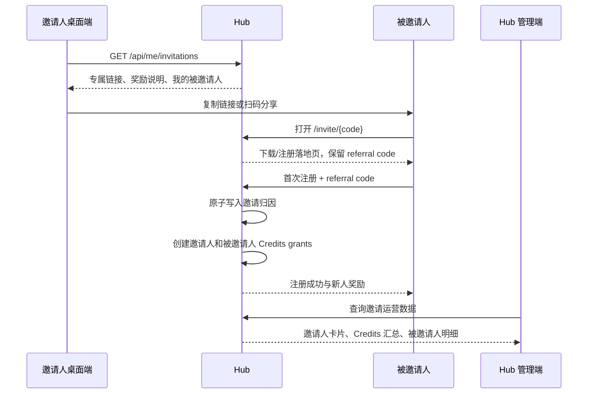
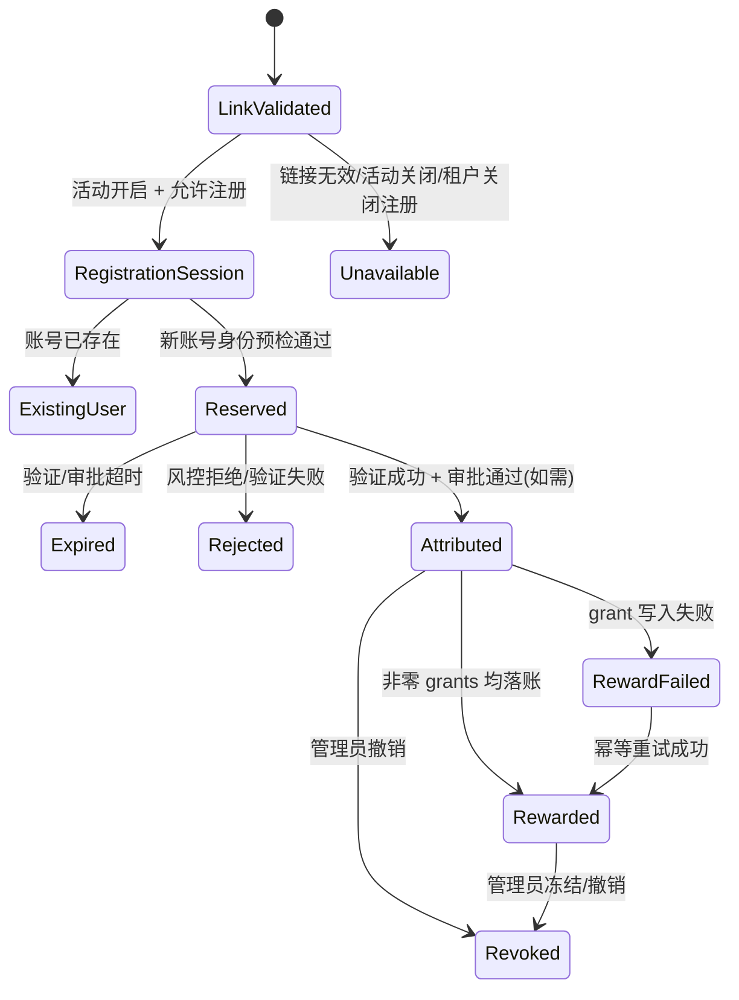

# Hub 用户邀请与奖励机制设计

## 1. 目标与范围

在 MaClaw 桌面端左侧导航栏最下方的“排名”按钮下新增醒目的“邀请”入口。已登录 Hub 的用户可复制专属邀请链接或展示二维码；新用户通过链接完成首次注册后，邀请人和被邀请人均获得可用于 Token 计费的 Credits。

本设计同时新增 Hub 管理端的邀请开关、奖励规则和运营统计页面。邀请功能按租户隔离。

不复用现有“邀请码”功能：现有邀请码用于准入控制，且不记录邀请人；本功能需要稳定归因、奖励台账和可审计的 Credits 消费归属。

## 2. 已确认的产品决策

| 项目 | 决策 |
| --- | --- |
| 客户端入口 | 桌面端左侧导航栏底部，紧接“排名”勋章按钮之后；不是 Hub 网页排行榜。 |
| 可用条件 | 租户开启“用户邀请”，且桌面端已具备有效的 Hub viewer token；任一条件不满足时桌面端不显示邀请入口。 |
| 归因时点 | 被邀请人首次完成注册并成为激活用户时。仅点击、下载、发起注册都不计奖励。 |
| 邀请人奖励 | 管理员配置的 `inviter_credits`。 |
| 被邀请人奖励 | 默认等于邀请人奖励的 50%，管理员可独立配置。 |
| 有效期 | 仅从**受邀用户注册成功**的时刻起计算；每笔邀请奖励默认 30 天，管理员按天配置。 |
| 累积规则 | 每次有效邀请在注册成功时为双方各产生一笔独立 grant；每笔 grant 独立起止、互不覆盖，同一用户可拥有多笔未过期邀请奖励。 |
| 展示数量 | 管理端邀请人列表每页 20 人；详情弹窗每行 5 张被邀请人卡片、每页 20 张。桌面端“我的邀请”采用同样每页 20 条。 |
| 租户边界 | 邀请链接、注册归因、奖励、列表和统计均不可跨租户。 |

## 3. 用户流程



### 3.3 端到端状态与决策矩阵



| 决策点 | 结果 | 用户可见结果 | 是否创建/发放 |
| --- | --- | --- | --- |
| 链接、邀请开关、租户状态、`allow_user_registration` | 任一不满足 | 不可注册页；仍可显示通用下载区，但不显示奖励 | 不创建会话/归因/奖励 |
| 账号预检 | 当前租户已有 email/phone 身份 | “已注册，仅限新用户”；显示下载与登录入口 | 不创建归因/奖励 |
| 验证或审批 | 未完成/失败 | 等待、失败或超时提示 | `reserved`，不发放 |
| 风控 | 自动规则命中 | 通用处理提示，不泄露规则 | `rejected` 或待人工，暂不发放 |
| 注册成功 | 通过所有验证与审批 | 注册成功、奖励和下载/打开客户端指引 | 一次 `attributed`，再幂等发放非零 grants |
| 奖励落账失败 | registry/存储暂时失败 | 注册仍成功；不向用户承诺已到账 | `reward_failed`，后台/管理员重试 |

“注册成功”是本流程的唯一业务时钟：它必须在用户记录已持久化、必需身份验证完成、审批（若启用）已通过之后产生；以同一 UTC `registered_at` 同时写入 referral 快照与双方 grant 的 `starts_at`。不要将 HTTP 返回成功、机器注册成功或首次 Token 消费混作注册成功。

### 3.1 桌面端

1. 用户点击左侧底部排名勋章下方的“邀请”按钮（礼物/用户加号图标）。
2. 桌面端先读取邀请状态；当租户开关关闭、Hub 未配置或 viewer token 无效时，左侧栏**完全不渲染**“邀请”按钮及分隔线，也不展示禁用态或提示弹窗。
3. 功能开启后，弹窗顶部显示奖励文案，例如“好友注册成功，你得 1,000 Credits；好友得 500 Credits”。
4. 中部显示只读邀请链接、复制按钮及二维码。二维码内容与链接完全一致。
5. 底部为“我邀请的用户”卡片区：卡片显示用户名（优先昵称；无昵称时显示邮箱或脱敏手机号）和“受邀高峰时间”。这里的高峰时间定义为**注册完成时间**；接口字段仍命名为 `registered_at`，避免歧义。
6. 每页最多 20 张卡片，桌面宽度下自适应为 4–5 列；无记录时显示空状态。

### 3.2 注册与奖励

1. 邀请链接为 `https://{hub-public-url}/invite/{referral_code}`。用户点击后必须打开 Hub 托管的**邀请注册页**，该页复用桌面端 onboarding 中“用户注册”的身份认证能力与文案（邮箱 / 手机号、验证码或邮件验证、租户注册规则），而不是直接下载或仅展示静态说明。
2. 注册页页首必须清晰显示租户信息，例如 `当前租户：Acme（acme）`、租户 Logo（若已配置）及“你将在此租户下注册新用户”。同时显示 `邀请人 ID：u_ab•••••9x`，帮助受邀者确认邀请来源；只显示服务端生成的**中间脱敏 ID**，不显示邀请人的姓名、邮箱、手机号或完整内部 ID。租户 ID 仅作为内部字段，不向用户展示；展示名称、slug 和品牌资产均由 referral code 在服务端解析得到，前端 URL 参数不能覆盖。
3. 注册表单的“注册方式”明确显示为 `邮箱注册`、`手机号注册` 或 `邮箱 / 手机号注册`，并严格按当前租户管理员配置的 registration-auth 设置渲染：
   - `email`：仅显示邮箱与邮件验证码/验证链接流程；
   - `phone`：仅显示手机号与短信验证码流程；
   - `mixed`：让用户选择邮箱或手机号，进入各自验证流程；
   - 若租户关闭新用户注册、邀请活动关闭或 referral code 不可用：显示不可注册原因，不展示注册表单。
4. 注册页先校验 referral code、租户状态、`allow_user_registration` 与邀请开关；三者任一不满足时只显示统一的“当前不可注册”页。**邀请注册链接不得绕过 `allow_user_registration`**：现有准入邀请码可绕过该开关的行为不适用于 referral，实施时必须修正这一分支。
5. 通过校验后，服务端创建一个短时、一次性的 `referral_registration_token`（与 referral、解析出的 `tenant_id`、注册方式和浏览器会话绑定），并以 `HttpOnly`、`Secure`、`SameSite=Lax` Cookie 保存；后续发送验证码、验证和完成注册均只使用该 token，不反复传递原始 code。归因声明在**首次用户创建之前**以“规范化邮箱或 E.164 手机号的带密钥哈希”原子占位，避免并发注册把同一账号归因给不同邀请人。
6. 安装器下载不能可靠地把浏览器 Cookie/sessionStorage 传给新安装的桌面端，因此不承诺“下载安装后自动恢复”。注册成功页与邀请页的“打开 MaClaw”按钮调用 `maclaw://onboarding?referral_handoff=<opaque-token>`；该 handoff token 单次使用、默认 30 分钟有效、不可反查邀请码，桌面端在 onboarding 首次注册请求中提交它。未安装或系统未注册深链时，用户回到同一浏览器页继续注册；下载链接本身不携带 referral。桌面端也可解析同一 `referral_handoff`，不得直接信任任意 `ref`/`tenant_id` 参数。
7. 注册页在注册表单下方提供“下载 MaClaw”区域，根据访问设备优先推荐对应操作系统和 CPU 架构的安装器，同时保留全部平台下载入口。下载地址由所属租户的系统设置配置，以支持 OEM 品牌和分发渠道。
8. 归因占位不等于发奖。邮箱路径须在邮箱验证完成后、手机路径须在短信验证完成后才进入 `attributed` 并发奖；审批模式还须等待管理员审批通过。验证失败、超时或被拒绝的占位会过期释放，已有用户重新安装、再次注册、换设备或再次打开链接均不得产生奖励。若管理员将某一方奖励设为 `0`，该方不创建 grant，但另一方的非零奖励仍可正常发放并使 referral 进入 `rewarded`。
9. 同一被邀请账号最多归因一个邀请人；邀请人不能邀请自己。邀请人或租户被禁用、邀请链接被撤销、跨租户和风控拒绝均不能归因。邀请链接默认长期有效；“30 天”仅指每笔奖励 Credits 的有效期，链接失效由关闭活动、轮换或撤销控制。
10. **仅限新用户**：在发送验证码和创建用户前，服务端以当前邀请链接解析出的租户查询规范化邮箱/手机号及其身份绑定；发现该租户下已存在账号时，不创建 `user_referrals` 占位、不发放任一方奖励，也不把该次访问计入邀请人数。页面显示“该邮箱/手机号已在当前租户注册，本邀请仅适用于新用户”，并保留当前租户的 MaClaw 客户端软件下载区及“返回登录/打开已安装 MaClaw”的入口；不得为了使页面看起来成功而继续走新用户注册或验证码流程。
11. 注册流程中的邮箱/手机号**身份查重范围**以租户为准：同一租户中任一已绑定 email 或 phone 的用户均不是新用户；不同租户是否允许相同身份由既有身份路由/租户策略决定，但不得以本租户邀请链接绕过既有跨租户路由。`mixed` 方式中用户先选定一种方式创建占位，随后绑定另一身份不会产生第二次奖励或改变归因；邮箱大小写、Unicode 规范化、手机号国家码/E.164 归一化必须在查重与哈希前完成。
12. **机器与注册解耦**：Web 邀请注册页只创建/激活用户和归因，不要求提交 `machine_name`、`platform`、`client_id`，也不签发机器或 viewer token。用户在下载并打开 MaClaw 后，按既有 onboarding/登录流程绑定首台机器；机器绑定失败、延后或多设备绑定不能撤销已完成的用户注册与邀请奖励。若当前 Hub 的注册实现仍由 `/api/enroll/start` 同时创建用户和机器，实施时必须拆出“身份注册完成”服务，或允许该接口在无机器信息时完成身份注册，避免网页注册被错误地伪装成一台设备。
13. **认证凭证的边界**：`referral_registration_token` 只授权当前租户、当前身份和一次注册完成，不能当登录 token、viewer token 或机器 token 使用；验证邮件/短信回跳时必须恢复同一注册会话，不允许浏览器替换身份、租户或邀请人。会话因开关关闭、链接撤销、密码轮换或到期失效后，须清除 Cookie 并要求重新打开有效链接。

## 4. Hub 管理端设计

### 4.1 系统设置：用户邀请开关

在 Hub 管理端“系统设置”增加卡片：

```text
用户邀请
允许用户生成并分享自己的邀请链接；新用户注册成功后按奖励规则发放 Credits。

[开关：关闭/开启]    [保存]
```

- 默认关闭，关闭后立即拒绝创建新的注册会话、停止未完成归因和新奖励发放；已完成 grant 不受影响。
- 已发出的链接在关闭期间展示“活动未开启”，不会消耗或奖励；重新开启后只有新创建的注册会话可使用，关闭前未完成的注册会话不得恢复。链接本身若未轮换/撤销仍可继续作为入口。
- 此开关为租户级设置，租户管理员只能编辑自己的租户。
- 开关与规则职责分离：开关只控制能否新建邀请注册会话；规则卡控制金额、期限和服务组。保存规则不自动开启活动；关闭活动不清空规则或邀请码。管理员应在保存前看到“将影响之后注册成功的用户”的确认文案。

### 4.1.1 系统设置：邀请下载地址（OEM）

“用户邀请”开关卡下方增加“邀请注册页下载地址”卡片。该配置同样为租户级；访问邀请链接时只读取该租户配置，绝不读取全局或其他租户的 OEM 地址。

```text
邀请注册页下载地址
用于邀请注册链接内的 MaClaw 安装器下载；留空时自动使用 MaClaw 官方默认地址。

Windows x64    [ https://... ]
Windows ARM64  [ https://... ]
macOS Intel    [ https://... ]
macOS Apple Silicon [ https://... ]
Linux x64      [ https://... ]
Linux ARM64    [ https://... ]
                                      [恢复官方默认] [保存下载地址]
```

- 配置值必须是绝对 `https://` URL；允许同一 OEM CDN URL 复用到多种平台。
- 任一字段为空时，服务器为该字段返回官方默认地址。不会将空字段解释为“不提供下载”。
- `恢复官方默认` 清空本租户覆盖值；变更只影响之后加载或刷新的邀请注册页，不修改已复制的邀请链接。
- 该配置仅控制邀请注册页的下载按钮，不影响已有应用内更新、普通官网或其他下载入口。

### 4.2 用户与组织：用户邀请 Tab

在“用户与组织”分组添加独立的“用户邀请”Tab，位于“用户管理/治理”之后、邀请码之前（若保留邀请码 Tab）。内容分为规则卡和邀请人列表。

### 4.3 用户管理中的受邀用户标识

在现有 Hub“用户管理”用户列表卡片中，为通过用户邀请完成注册的用户增加固定、可识别的来源标记，便于管理员在不进入“用户邀请”Tab 的情况下快速筛选和核对。

```text
李四 / l***@example.com                    [🎁 受邀]
注册时间 2026-08-12 10:35
邀请人：张三 / z***@example.com
```

- 标记使用礼物图标加“受邀”文字（英文界面为 `Referred`），颜色使用与邀请入口一致的强调色；不能只依赖颜色传达含义。
- 鼠标悬停/键盘聚焦时显示来源提示：`由 张三 邀请，于 2026-08-12 10:35 注册`；邀请人身份遵循当前管理员的数据可见权限与脱敏策略。
- 卡片数据源新增 `referral` 摘要：`referral_id`、`inviter_user_id`、`inviter_display_name`、`registered_at`、`reward_status`。普通用户查询自身数据时不暴露他人的完整联系方式。
- 用户管理筛选项新增“注册来源”：`全部 / 常规注册 / 受邀注册`，默认“全部”。搜索和分页保持原有行为。
- 只有 `user_referrals.status IN ('attributed','rewarded','reward_failed')` 的被邀请人展示该标记；归因撤销后保留审计记录，但从默认用户卡片移除“受邀”展示，可在审计/邀请详情中查看历史。

#### 规则卡

```text
邀请奖励规则
邀请人奖励 Credits [ 1000 ]
被邀请人奖励 Credits [ 500 ]
奖励有效期        [ 30 ] 天
适用模型服务组    [ 默认新用户服务组 v ]

说明：仅在受邀用户注册成功时，双方各生成一笔独立 Credits grant。每笔从该次注册成功时刻起按设置的天数独立有效；有效期内可累积，扣费时优先消耗**最早发放**且仍可用的邀请奖励。
                                                [保存规则]
```

- 默认值：邀请人 1,000 Credits、被邀请人 500 Credits、30 天。
- 数值边界：Credits 必须为有限、非负、最多 2 位小数且不超过平台定义的单笔上限；有效期为整数天，范围 `1–3650`。规则保存时必须同时校验服务组仍存在、可向用户授予且未停用；服务组后续被停用不会静默改写历史 grant，而是按现有账本停用/替代策略展示原因。
- `invitee_credits` 初始填入 `inviter_credits / 2`；之后可人工覆盖，并显示“已自定义”。
- 奖励为 0 时表示该一方不奖励；两方都为 0 时不允许保存。
- 服务组必须是存在且 `grant_required` 的模型服务组；默认选择现有默认新用户服务组中的第一个可用组。
- 修改规则只影响**之后**完成注册的邀请，不回溯调整历史 reward/grant。

#### 邀请人卡片列表

列表按最近一次成功邀请时间倒序；每页 20 位邀请人。每张卡片显示：

```text
张三 / z***@example.com
成功邀请人数        12（可点击）
获得积分总数        12,000 Credits
已消费              4,280 Credits
可用 / 已过期        6,720 / 1,000 Credits
最近邀请             2026-08-12 10:35
```

“成功邀请人数”是可点击控件，打开“被邀请人明细”对话框：

- 标题含邀请人身份、成功邀请数、总奖励和已消费。
- 5 列卡片网格，每页 20 张；窄屏降为 2 列、手机为 1 列。
- 每张卡片展示：被邀请人名称、邮箱/手机号（隐私权限策略后展示）、注册/受邀时间、给双方发放的 Credits、当前奖励状态（有效/用尽/过期）。
- “成功邀请人数”只统计 `rewarded`，以及已完成注册但处于可重试 `reward_failed` 的记录；`reserved`、`rejected`、`expired` 和 `revoked` 不计入。卡片的“获得积分总数”统计实际已落账的邀请人 grant 总额；“已消费/可用/已过期”分别从这些 grant 的账本快照聚合，不能把尚未落账的规则快照计为已获奖励。
- 使用独立分页，关闭并重新打开时回到第 1 页。

## 5. 数据模型与迁移

新增 SQLite 表，不将归因关系塞入 `invitation_codes` 或 LLM registry JSON。

```sql
CREATE TABLE user_referral_codes (
  id TEXT PRIMARY KEY,
  tenant_id TEXT NOT NULL,
  inviter_user_id TEXT NOT NULL,
  code_hash TEXT NOT NULL, -- HMAC-SHA-256(server referral secret, normalized code)
  code_ciphertext BLOB, -- AES-GCM；仅为认证后的“我的邀请”重复展示所需
  status TEXT NOT NULL DEFAULT 'active', -- active/revoked
  created_at TEXT NOT NULL,
  revoked_at TEXT,
  UNIQUE (tenant_id, code_hash)
);

CREATE UNIQUE INDEX ux_user_referral_codes_active_inviter
  ON user_referral_codes(tenant_id, inviter_user_id) WHERE status = 'active';

CREATE TABLE user_referrals (
  id TEXT PRIMARY KEY,
  tenant_id TEXT NOT NULL,
  referral_code_id TEXT NOT NULL,
  inviter_user_id TEXT NOT NULL,
  invitee_user_id TEXT NOT NULL DEFAULT '', -- 归因占位阶段允许为空
  invitee_account_hash TEXT NOT NULL,
  invitee_account_masked TEXT NOT NULL DEFAULT '',
  inviter_reward_credits REAL NOT NULL,
  invitee_reward_credits REAL NOT NULL,
  duration_days INTEGER NOT NULL,
  service_group_id TEXT NOT NULL,
  status TEXT NOT NULL DEFAULT 'reserved', -- reserved/attributed/rewarded/reward_failed/revoked/rejected/expired
  status_reason TEXT NOT NULL DEFAULT '',
  reserved_expires_at TEXT, -- 验证/审批前的归因占位过期时间
  registered_at TEXT,
  reward_started_at TEXT, -- 必须等于注册成功时刻
  reward_expires_at TEXT, -- reward_started_at + duration_days，仅作查询索引/展示快照
  inviter_grant_id TEXT NOT NULL DEFAULT '',
  invitee_grant_id TEXT NOT NULL DEFAULT '',
  created_at TEXT NOT NULL,
  updated_at TEXT NOT NULL,
  CHECK (duration_days >= 1),
  CHECK (inviter_reward_credits >= 0),
  CHECK (invitee_reward_credits >= 0),
  CHECK (status IN ('reserved','attributed','rewarded','reward_failed','revoked','rejected','expired')),
  UNIQUE (tenant_id, invitee_account_hash),
  CHECK (invitee_user_id <> '' OR status IN ('reserved','rejected','expired'))
);

-- 避免多个尚未创建用户的 reserved 行都使用空 user_id 时发生误冲突。
CREATE UNIQUE INDEX ux_user_referrals_invitee_user
  ON user_referrals(tenant_id, invitee_user_id) WHERE invitee_user_id <> '';

CREATE INDEX idx_user_referrals_inviter_registered
  ON user_referrals(tenant_id, inviter_user_id, registered_at DESC);
CREATE INDEX idx_user_referrals_invitee
  ON user_referrals(tenant_id, invitee_user_id);
```

`code` 的原文不入普通列、不进入日志、审计或错误消息：生成时只在认证用户的响应中返回一次；为了让同一用户日后仍能获取**稳定**链接，密文以租户/服务端 KMS 密钥 AES-GCM 加密保存，解密只在 `GET /api/me/invitations` 的授权路径中进行。以 `code_hash` 查询，常量时间比较；轮换时在一个事务内将旧码置 `revoked`、创建新码，历史记录保留。密钥不可用时不得新发邀请码或展示旧链接，返回可审计的服务错误。

外键语义：迁移应为 `user_referral_codes(id)` 建 `referral_code_id REFERENCES user_referral_codes(id) ON DELETE RESTRICT`；用户表目前主键是全局 `id`，故 `inviter_user_id`、最终的 `invitee_user_id` 由应用层验证“存在且 tenant_id 相同”，并在 repository 层的事务中完成。SQLite 迁移须启用并验证 `PRAGMA foreign_keys=ON`。因用户清理是软删/清理流程，生产表采用 `ON DELETE RESTRICT`，先进入 `revoked` 并由受控清理任务处理，不允许级联删除奖励审计。`invitee_account_hash` 的唯一约束覆盖“用户 ID 尚未创建”的并发窗口；补齐 user ID 时再次校验部分唯一索引 `(tenant_id, invitee_user_id)`。

状态机固定为：`reserved`（已锁定新账号，等待验证/审批）→ `attributed`（注册成功，等待应发 grant 落账）→ `rewarded`（所有**非零**奖励的 grant 均已幂等写入；奖励为 0 的一方无 grant）；任一应发 grant 写入失败进入 `reward_failed`，补偿任务重试。验证拒绝/风控拒绝进入 `rejected`，占位超时进入 `expired`，管理员撤销有效归因进入 `revoked`。`registered_at`、`reward_started_at`、`reward_expires_at` 在进入 `attributed` 时一次性写入，后两者分别等于注册成功时刻和其加上 `duration_days`；不得由随后修改的设置重算。状态变更采用 `WHERE status IN (...)` compare-and-set，并写入状态历史/审计事件。

租户级设置存入既有 tenant-scoped settings：`user_invitation_settings_v1`。

```json
{
  "enabled": false,
  "inviter_credits": 1000,
  "invitee_credits": 500,
  "duration_days": 30,
  "service_group_id": "coding-basic",
  "downloads": {
    "windows_amd64": "",
    "windows_arm64": "",
    "darwin_amd64": "",
    "darwin_arm64": "",
    "linux_amd64": "",
    "linux_arm64": ""
  },
  "updated_at": "2026-08-12T00:00:00Z"
}
```

设置保存使用 `updated_at` 进行乐观并发：`PUT` 请求必须带回上次读取的 `updated_at`，不匹配返回 `409 INVITATION_SETTINGS_CONFLICT` 与最新设置。旧租户迁移时默认写入 `enabled=false`；不回填历史用户/邀请码/旧奖励，也不改变现有 `invitation_codes` 的含义。

未配置（字段为空）时使用以下官方默认地址：

| 平台 | 官方默认安装器 |
| --- | --- |
| Windows x64 | `https://github.com/RapidAI/MaClaw/releases/latest/download/Ins-maclaw-windows-amd64.exe` |
| Windows ARM64 | `https://github.com/RapidAI/MaClaw/releases/latest/download/Ins-maclaw-windows-arm64.exe` |
| macOS Intel | `https://github.com/RapidAI/MaClaw/releases/latest/download/Ins-maclaw-darwin-amd64` |
| macOS Apple Silicon | `https://github.com/RapidAI/MaClaw/releases/latest/download/Ins-maclaw-darwin-arm64` |
| Linux x64 | `https://github.com/RapidAI/MaClaw/releases/latest/download/Ins-maclaw-linux-amd64` |
| Linux ARM64 | `https://github.com/RapidAI/MaClaw/releases/latest/download/Ins-maclaw-linux-arm64` |

`llmservice.Grant` 增加可选 `ReferralID` 字段，或以 `source=user_referral` 且 `card_id=referral_id` 作为兼容实现。首选新增 `ReferralID`，使审计、汇总和回滚无需依赖字符串约定。

## 6. Credits 发放与消费规则

### 6.1 发放

新增 `GrantUserReferralBenefitForUserID`：

- `source = "user_referral"`；
- 仅在受邀用户注册成功（且完成所需验证/审批）时发放，`starts_at = registered_at`，`expires_at = registered_at + duration_days`；这里的 `registered_at` 是该用户成为可用新用户的最终完成时刻（审批模式为审批通过时刻），不得以点击链接、创建注册会话、下载客户端或发起验证码的时刻作为有效期起点；
- 每笔 referral 以 `referral_id + beneficiary_user_id` 去重；
- 写入 `credits_total`，初始 `credits_used = 0`；
- 必须保留原始奖励快照，管理端不可用当前规则重算历史。

### 6.2 累积与扣减

邀请奖励不像当前“续期卡”那样顺延开始日期：每笔均从对应受邀用户的注册成功时刻立即生效，拥有独立有效期，故可以真正累积。计费选择 grant 时增加确定性优先级：

1. 在**同一服务组**、已开始、未到期、可计费且尚有余额的 `user_referral` grant 候选集中，严格按 `starts_at ASC, created_at ASC, id ASC` 消耗，即先消耗**最早发放**的独立奖励；已过期、未开始或余额为零的 grant 跳过；
2. 不改变既有无限免费 grant、排队 grant 的提前启用、购卡和系统赠送 grant 的既有可用性/排序语义；当选中邀请奖励作为消费来源时，必须使用上述“最早发放优先”顺序，不能改按最早到期排序；
3. 任何 grant 的使用量都不允许超过 `credits_total`。

**账本实现约束**：当前 `llmservice.applyCreditUsageToRegistry` 对同服务组所有可计费 grant 按到期时间排序；仅新增 `source=user_referral` 并不能满足“最早发放优先”。实施必须在该候选排序点显式比较：若两个候选都是 `user_referral`，使用 `StartsAt → CreatedAt → ID`；若只有一个是邀请奖励，则按既有非邀请 grant 优先级规则决定，不得让邀请奖励绕过无限/排队 grant 的既有逻辑。该行为必须由单元测试覆盖，不能只写在管理端统计逻辑中。

管理端“已消费”由该邀请人所有 `user_referral` grants 的 `credits_used` 汇总；不得把其他来源（购卡、新用户赠送、邀请码）的消费混入。

### 6.3 一致性与补偿

用户创建与 referral 归因采用 SQLite transaction；两笔 grant 写入既有 registry 的过程不能完全与 SQLite 同事务时，使用 `status=attributed` → 写 grant → `status=rewarded` 的可恢复状态机。

- 每次服务启动及管理员手动“重试失败奖励”均扫描 `attributed/reward_failed`；`reserved` 由验证完成或审批通过的事件推进，超时后转 `expired`。
- grant 写入可按 `referral_id + beneficiary` 幂等重放。
- 发生用户删除/邀请撤销时不自动扣回已消费 Credits；管理员需执行单独、审计化的补偿动作。
- **可用性原则**：注册成功不能因奖励账本短暂故障而回滚用户创建；前端成功页只有在 `rewarded` 后才显示“Credits 已到账”。若为 `attributed/reward_failed`，显示“注册成功，奖励正在发放中”，并通过下次打开客户端/用户中心刷新结果；不得把后台奖励失败伪装成零奖励或静默吞掉。
- **双边原子语义**：当邀请人和被邀请人奖励都非零时，目标是“两个 grant 都存在或都可恢复”；失败重试不得重复创建已有一边。允许短暂的 `reward_failed` 中间态，但管理端须展示哪一边失败、grant ID 与最近错误时间；任何人工撤销先冻结未消费余额，再按审计补偿处理，不能删除 grant 记录。

## 7. API 设计

所有 `me` 接口使用既有 `Authorization: Bearer <viewer token>`；所有 admin 接口遵循既有租户管理员中间件。

| 方法 | 路径 | 用途 |
| --- | --- | --- |
| GET | `/api/me/invitations` | 返回当前用户专属链接、奖励文案、汇总和我的被邀请人分页列表。 |
| POST | `/api/me/invitations/code/rotate` | 撤销旧链接并生成新链接；默认不在首版 UI 展示，预留风控能力。 |
| GET | `/invite/{code}` | 匿名邀请落地页；验证状态，保留 referral code，不泄露邀请人身份。 |
| GET | `/api/public/invitations/{code}/registration` | 供邀请注册页读取活动状态、租户安全展示信息、注册认证方式和解析后的下载地址。 |
| POST | `/api/public/invitations/{code}/registration/session` | 校验 code/开关/租户注册许可，创建短时注册会话并设置 HttpOnly Cookie。 |
| POST | `/api/public/invitations/registration/account-check` | 对锁定租户和认证方式预检账号；已存在账号返回不可归因的既有用户结果，且不会创建 referral 占位。 |
| POST | `/api/public/invitations/registration/send-code` | 使用注册会话发送邮箱/短信验证码；服务端只允许该会话锁定的认证方式。 |
| POST | `/api/public/invitations/registration/verify` | 验证邮箱/短信，并创建或推进 referral 归因与奖励状态。 |
| POST | `/api/public/invitations/registration/complete` | 审批/多步骤注册完成后的幂等完成入口；不接受客户端 tenant、inviter 或原始 code。 |
| GET | `/api/public/invitations/registration/status` | 查询当前注册会话的安全状态：继续注册、审批中、已注册/奖励发放中、已注册/奖励到账或不可继续。 |
| GET | `/api/admin/user-invitations/settings` | 读取本租户开关和奖励规则。 |
| PUT | `/api/admin/user-invitations/settings` | 更新开关与规则，校验 service group 和数值范围。 |
| GET | `/api/admin/user-invitations/inviters?page=1&page_size=20&query=` | 邀请人汇总卡片分页。 |
| GET | `/api/admin/user-invitations/inviters/{userId}/invitees?page=1&page_size=20` | 单位邀请人的被邀请人卡片分页。 |
| POST | `/api/admin/user-invitations/referrals/{id}/retry` | 对失败的奖励执行幂等重试。 |
| POST | `/api/admin/user-invitations/referrals/{id}/decision` | 对风控待处理记录批准、拒绝或撤销；请求必须含 `action` 与 `reason`。 |

现有用户管理列表接口补充查询参数 `registration_source=all|direct|referral`，并为每个用户返回可选 `referral` 摘要；避免前端额外逐用户请求邀请接口。

`GET /api/me/invitations` 响应示例：

```json
{
  "enabled": true,
  "invite_url": "https://hub.example/invite/rf_A8K2...",
  "inviter_reward_credits": 1000,
  "invitee_reward_credits": 500,
  "duration_days": 30,
  "summary": { "invitee_count": 12, "credits_total": 12000, "credits_used": 4280 },
  "invitees": [
    { "user_id": "u_2", "display_name": "李四", "account": "l***@example.com", "registered_at": "2026-08-12T10:35:00Z" }
  ],
  "page": 1,
  "page_size": 20,
  "total": 12
}
```

`GET /api/public/invitations/registration/status` 只返回当前 Cookie/深链 handoff 所属会话的最小状态，不接受 user ID 查询：

```json
{
  "registration_status": "registered_reward_pending",
  "reward_status": "reward_failed",
  "downloads": { "items": [] },
  "can_continue_registration": false
}
```

浏览器和桌面端必须使用该状态接口恢复中断流程；不要由客户端猜测“注册是否成功”或根据是否拿到机器 token 判断。

现有 `/api/enroll/start` 不应接收或持久化原始 `referral_code`，以免与既有准入邀请码 `invitation_code` 混淆，也避免其进入现有日志。邀请注册页和桌面端 onboarding 均只提交短时 `referral_handoff`/注册会话 Cookie；服务端将其解析为已锁定的 referral、租户和认证方式。服务端仅在“新用户第一次创建”链路接受该凭证，凭证不可覆盖已保存归因，也不可用于已有用户重绑。

所有分页接口的 `page` 从 1 开始，`page_size` 默认/最大均为 20；非法页码返回 `400 INVALID_PAGINATION`。邀请人列表唯一排序为 `last_successful_referral_at DESC, inviter_user_id ASC`，详情为 `registered_at DESC, id ASC`，确保分页稳定。`query` 最大 128 字符且按权限进行邮箱/手机号脱敏搜索。`GET /api/me/invitations` 在功能关闭时返回 `{"enabled":false}`（不返回链接、奖励或用户列表）；未认证为 401。

公开接口对无效、撤销、关闭和不存在的邀请码统一返回 `404 INVITATION_UNAVAILABLE`，避免枚举；受限注册返回 `409 REGISTRATION_DISABLED`，注册会话过期返回 `410 REFERRAL_REGISTRATION_SESSION_EXPIRED`，同账号已归因返回幂等成功或 `409 REFERRAL_ALREADY_ATTRIBUTED`（取决于是否是同一会话）。已有账号在受允许展示的场景返回 `409 EXISTING_USER_NOT_ELIGIBLE` 和 `downloads`/`login_hint`，绝不返回邀请人或奖励信息；匿名场景沿用现有防账号枚举策略返回通用结果。每个改变状态的公开请求还必须使用 10 分钟 `Idempotency-Key`，同一键同一 payload 重放原响应、同键不同 payload 返回 409。管理员的设置更新、链接轮换、重试、撤销和风控处置均写入 admin audit event，审计字段只保留 code 前缀与 referral ID。

匿名注册页的配置响应示例：

```json
{
  "enabled": true,
  "tenant": {
    "name": "Acme",
    "slug": "acme",
    "logo_url": "https://cdn.example.com/acme-logo.svg"
  },
  "inviter": {
    "masked_id": "u_ab•••••9x"
  },
  "registration": {
    "method": "email",
    "label": "邮箱注册"
  },
  "rewards": { "invitee_credits": 500, "duration_days": 30 },
  "downloads": {
    "recommended": { "platform": "windows", "arch": "amd64", "url": "https://github.com/RapidAI/MaClaw/releases/latest/download/Ins-maclaw-windows-amd64.exe" },
    "items": [
      { "platform": "windows", "arch": "amd64", "label": "Windows x64", "url": "https://..." },
      { "platform": "windows", "arch": "arm64", "label": "Windows ARM64", "url": "https://..." }
    ]
  }
}
```

## 8. 桌面端实现落点

当前排名按钮位于 `gui/frontend/src/components/layout/SidebarNavRail.tsx`，通过 `GetHubUserRanking()` 和 `BrowserOpenURL()` 与 Hub 交互。首版新增：

1. Go bridge：`gui/app_hub_user_invitation.go`，实现 `GetHubUserInvitations()`，复用配置中的 `RemoteHubURL`、`RemoteTenantID`、`RemoteViewerToken`。
2. Wails binding：生成 `GetHubUserInvitations` 对应 TypeScript 声明和模型。
3. React 对话框：`gui/frontend/src/components/HubInvitationDialog.tsx`，使用现有 `qrcode.react` 生成二维码，不上传二维码图片。
4. 导航入口：在 `SidebarNavRail.tsx` 的排名勋章后插入邀请按钮；前端仅在 `/api/me/invitations` 返回 `enabled: true` 时渲染该按钮，Hub 所属租户开关关闭时按钮、图标和与其关联的分隔线均不渲染。图标建议使用“礼物 + 用户加号”的线性 SVG，主色使用 `--theme-primary`，旁加小红点/“NEW”徽标以保证醒目。
5. 在 `SidebarNavRail` 内管理 `invitationDialogOpen`，不跳转浏览器；仅邀请落地页使用浏览器。

### 8.1 邀请注册页实现

新增静态页面目录 `hub/web/invite-registration/`，由 `GET /invite/{code}` 解析后渲染。页面采用 onboarding 的注册组件/接口契约，确保以下行为和已安装桌面端 onboarding 一致：

- 页面首屏显示租户品牌、租户名称/slug、`你将在此租户下注册` 提示、邀请人中间脱敏 ID，以及由租户管理员设置决定的注册方式；不得默认或猜测邮箱/手机号方式。`logo_url` 必须为已验证的 `https` 地址，长度最多 2048，生产环境应限制到租户已登记的品牌/CDN 域名并使用服务端图片代理/尺寸上限和缓存；加载失败回退为租户名称文字，不阻断注册；
- 租户注册认证方式为 email、phone 或 mixed 时，显示对应的输入、验证码发送及验证步骤；
- 浏览器提交注册时不得信任客户端提供的 `tenant_id`、`registration_method` 或 `referral_code` 归属。服务端必须从 referral code 查得 tenant，再载入该 tenant 的 registration-auth 配置并完成校验；邀请流程覆盖 email、phone、mixed 以及审批注册：三种认证方式均在验证成功后再发奖，审批注册在审批通过后才发奖，手工创建/管理员绑定不自动携带 referral，除非管理员在受审计的专门操作中显式关联；
- 注册时自动携带并锁定 referral code，用户无需手工填写；
- 输入邮箱或手机号后，在发送验证码前调用受注册会话保护的账号预检接口。若账号已存在，表单切换为“已注册用户”结果态：清楚说明该邀请仅适用于新用户、不展示邀请奖励，不发送注册验证码；仍展示所有 OEM/官方回退的 Windows、macOS、Linux 安装器链接，并提供“返回登录/在客户端登录”引导。为避免账号枚举，匿名预检和发送验证码对外返回统一的受限结果，具体“已注册”文案只在已完成挑战（例如验证码证明账号控制权）或由现有注册防枚举策略允许时展示；
- 注册成功页显示被邀请人可得的 Credits、有效期和“下载/打开 MaClaw”引导；
- URL 中不显示邀请人名称、邮箱、手机号和完整奖励台账；
- 根据 `navigator.userAgentData`（可用时）和 `navigator.userAgent` 推荐一个安装器；检测失败时只展示“选择你的平台”，不得错误假设架构；
- 每个下载链接使用 `rel="noopener noreferrer"`，跨站 OEM 下载以新标签页打开。

入口交互线框：

```text
左侧栏底部
  系统
  关于
  排名 🏆
  ─────────
  邀请 🎁   ← 仅租户已开启用户邀请时显示；点击打开应用内对话框

邀请好友                                       [×]
好友注册成功，你得 1,000 Credits；好友得 500 Credits
[ https://hub.example/invite/rf_...             ][复制]
                         [二维码]
我邀请的用户                         共 12 人
[李四 / l***@example.com | 2026-08-12 10:35] × 5
                                                  [上一页] 1 / 1 [下一页]
```

## 9. 安全、隐私和风控

- referral code 使用至少 128 位随机熵，固定以 `HMAC-SHA-256` 哈希索引、AES-GCM 密文保存用于授权后的重复展示；原文只在生成/授权读取的内存响应中出现。反向代理访问日志必须对 `/invite/{code}` 和公开 API 中的 code 路径脱敏，禁止将原 URL 查询串写入分析、异常追踪或 admin audit。
- 仅在认证后的“我的邀请”接口返回完整邀请链接；匿名 `/invite` 仅返回活动是否可用。
- 匿名邀请注册页仅返回 `inviter.masked_id`：按 Unicode code point 计算，长度不足 6 时返回固定 `•••`；否则保留首 3、末 2 个 code point，中间以不少于 5 个 `•` 替换。禁止以可逆方式泄露完整 ID，更不得借此字段返回邀请人邮箱、手机号、姓名或头像。
- OEM 下载 URL 仅允许 `https`、最大长度 2048，并在保存时拒绝包含用户名密码、控制字符和非 HTTP(S) scheme 的地址；渲染下载锚点时仍进行 HTML 转义。
- 公开邀请页设置 `Referrer-Policy: no-referrer`，外部 OEM 下载链接亦使用该策略，避免把 `/invite/{code}` 作为 Referer 泄露给下载站；响应设置适配静态注册页面的 CSP（脚本、图片和连接仅允许 Hub 自身及经验证的品牌/OEM 域名），禁止第三方分析脚本读取注册会话。
- 被邀请人列表对普通用户脱敏邮箱和手机号；管理员按照现有用户管理权限展示身份。
- 强制唯一约束 `(tenant_id, invitee_user_id)`；不信任 cookie、URL 参数或桌面端传来的 inviter ID。
- 限流匿名落地页和注册接口；推荐默认阈值：单 IP 每小时 60 次落地/10 次发送验证码、单设备每日 3 个有效受邀注册、单邀请人每日 20 个奖励、单账号终身仅 1 次受邀奖励。阈值租户可配置但不能关闭基础限流；同 IP/设备只作为风控信号，不能单独判定作弊。
- 发奖前至少要求邮箱或手机验证成功；当同设备、同付款/设备指纹、异常代理、邀请人自邀或批量短时注册命中规则时，状态进入 `reserved`/`rejected`，不自动发奖。管理员可在邀请详情中“批准、拒绝、撤销、重试”，每项都需理由并生成不可篡改审计事件；人工批准仍需已验证身份。
- 邀请人、被邀请人被禁用或删除后，链接不可再使用且未消费奖励冻结；历史已发奖励、撤销金额、失败原因和操作人必须保留可审计。已消费 Credits 不自动追扣；退款/封禁/确认作弊通过单独补偿/冲正流程处理，禁止把 grant 直接删除。
- 管理端的邀请人和被邀请人数据仅限本租户具备用户管理权限的管理员访问；导出能力不纳入首版。若未来新增导出，必须异步生成、按同一脱敏/权限策略执行、设置下载有效期并记录审计事件。

## 10. 测试与验收

### 后端

- 未开启时不能生成可用链接或归因；开启后当前用户拥有且仅拥有一个活跃 code。
- 点击 `/invite/{code}` 显示邀请注册页并保留 code；关闭、无效、撤销和跨租户 code 不暴露注册表单或下载地址。
- referral 必须遵循 `allow_user_registration`；覆盖现有邀请码可绕过关闭注册的回归用例，验证邀请开关或注册开关任一关闭时公开页不显示表单、`/api/enroll/start` 也不能创建用户。
- 轮换码后旧码不可用、新码可重复读取；数据库和代理/审计日志中均找不到邀请码原文。密钥不可用时安全失败，不泄露存量 code。
- 已注册账号预检不会创建 referral 占位或发放奖励，显示“仅限新用户”和客户端软件下载区；在防账号枚举场景下不得仅凭未验证的输入暴露账号是否存在。
- 注册页的 email/phone/mixed 流程复用 onboarding 的认证规则；下载安装、刷新页面、注册验证跳转后 referral code 不丢失。
- 覆盖注册会话与深链 handoff：Cookie 丢失、30 分钟 handoff 过期、重复使用、伪造 token、安装器下载后回到浏览器均不会错归因；成功的深链路径只能恢复同一 referral，不能接受伪造 tenant/ref 参数。
- 注册页正确展示 referral code 所属租户的名称、slug 和可选 Logo；管理员分别配置 email、phone、mixed 后，页面只显示对应注册方式，且伪造 tenant/method 参数不能改变实际注册租户或认证方式。
- 注册页展示邀请人中间脱敏 ID，且所有长度边界（短 ID、Unicode、空 ID）均不泄露完整值或个人联系方式。
- 下载设置留空时精确回退到 6 个官方 URL；覆盖后仅替换对应平台架构；非法 URL 被拒绝且不会输出到匿名页。
- 链接注册成功后，仅生成一条 `user_referrals`，两笔 reward grant 均幂等；验证完整状态机 `reserved → attributed → rewarded/reward_failed`，并验证 `rejected`、`expired` 与 `revoked` 的不可逆审计和可允许转移。
- 覆盖邮箱验证、短信验证、mixed、审批通过、验证失败/超时、管理员手工建用户：只有符合条件的首次验证/审批成功路径发放一次双向奖励；同账号并发注册时只有一个 `reserved` 可成功落账。
- 同一新用户二次注册、换设备、并发注册、自邀、跨租户、过期/撤销 code 均不奖励。
- 验证受邀用户注册成功前不创建有效 grant；从注册成功时间起满 30 天后该笔独立奖励到期；多笔奖励累积时按最早发放顺序扣减，并正确跳过已过期/用尽 grant；邀请人“获得/已消费”汇总正确。
- 邀请 grant 仅在同服务组且可计费的候选集内参与排序，不改变现有无限 grant、购卡或队列 grant 的选择；冻结、撤销和补偿不会删除原审计记录。
- 覆盖 `mixed` 身份绑定、邮箱大小写/Unicode 规范化、手机号 E.164、同租户已有 email/phone、跨租户身份路由和两个并发注册会话，确保不重复归因或绕过已有账户检查。
- 覆盖 `Idempotency-Key` 的超时重放和同键不同 payload；账号预检、发码、验证和完成接口在所有错误响应中均不泄露 code、邀请人或账户存在性。
- 修改规则不影响历史 referral 的 credits、期限及服务组快照。
- admin 分页严格每页最多 20；详情接口只返回目标邀请人和当前租户的数据。
- 用户管理列表对有效归因用户返回 `referral` 摘要；“受邀注册”筛选、卡片礼物标记、悬浮提示和归因撤销后的显示规则均正确。
- Web 注册不依赖机器字段或机器 token；注册完成后首次/多次机器绑定均不会再次发奖或改变 `registered_at`。奖励账本失败时，状态接口返回“注册成功、奖励发放中/失败”，成功页不提前承诺到账。
- 邀请关闭、链接撤销、会话到期、验证邮件/短信回跳、审批通过和深链 handoff 发生在不同顺序时，系统只允许状态机规定的转移；所有无效会话 Cookie 被清理，不能在重新开启后复活。

### 桌面端

- 排名按钮下存在“邀请”入口，具有图标、可访问名称与键盘焦点。
- 配置不存在、viewer token 失效、租户功能关闭或首次状态请求失败时，邀请按钮不渲染，且不影响排名按钮；弹窗内的网络失败保留明确错误状态。
- 复制成功可见反馈；二维码内容等于接口 `invite_url`。
- 用户列表按注册完成时间倒序，20 条分页；窄屏布局不溢出。

### 管理端

- 系统设置可打开/关闭邀请；“用户邀请”Tab 可编辑双方奖励、期限和服务组。
- 系统设置可为 Windows x64/ARM64、macOS Intel/Apple Silicon、Linux x64/ARM64 分别配置 OEM 下载 URL，并支持恢复官方默认地址。
- 邀请人卡片展示人数、获得积分、已消费；点击人数打开 5 列卡片详情，20 条分页。
- 用户管理卡片能醒目显示“🎁 受邀”来源标签，并可按受邀注册筛选。
- 规则保存、错误输入、权限不足和奖励重试均记录 admin audit event。
- 设置并发更新返回 409 且不会覆盖另一管理员的新配置；邀请人列表与详情分页稳定、最大 20 条，风控拒绝、人工批准/拒绝/撤销以及失败原因均可审计。
- 开关与规则可独立保存：保存规则不启用活动，关闭活动不丢失规则或使已发奖励失效；页面明确展示变更只影响未来注册成功用户。

## 11. 分期建议

1. **基础闭环**：表迁移、设置、归因、双向 grant、viewer/admin API、桌面端弹窗与复制链接。
2. **运营可见性**：管理端邀请人列表、详情卡片、消费汇总、失败奖励重试。
3. **增强**：二维码落地页深链、链接轮换、风险检测、邀请排行榜与消息通知。

## 12. 实施前置决策

- **推荐首期范围**：完成注册页、归因、双向 grant、桌面端入口/弹窗、管理设置和可查看的统计；管理员的人工风控审批/撤销仅保留数据状态与 API，不在首版强制暴露复杂运营工作台。若业务要求上线即人工审核，需将该工作台提升到一期。
- **邀请奖励与既有免费福利的关系**：邀请 grant 与 `new_user_email_confirmed`、`new_user_phone_verified`、准入邀请码福利可并存；它们是独立来源，不合并、不相互延长有效期。产品文案须分别说明，避免把“注册验证奖励”和“邀请奖励”误认为同一笔 Credits。
- **配置变更生效点**：开关关闭后停止新注册会话、未完成归因和新 grant；已完成的 grant 按原快照继续有效，除非管理员发起审计化冻结/撤销。重新打开只允许新会话归因，已关闭期间过期的注册会话不可恢复。
- **可观测性**：新增按租户的指标：邀请页访问、注册会话创建、账号已存在、验证成功、归因成功、发奖失败、风控拒绝、奖励使用/到期；所有指标使用聚合 ID，不含 code、邮箱、手机号和设备原文。`reward_used`/`reward_expired` 的单位是发生过使用/到期的**奖励 grant 批次**，不是 Credits 数额；Credits 金额以邀请人卡片的已发放/已消费/可用/已过期账本汇总为准。对 `reward_failed` 设置告警和补偿任务积压阈值。
