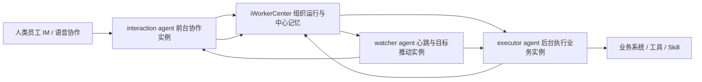

# iWorker 多 Agent 实例运行架构 v1

## 核心结论

为了同时满足自动处理业务、与人类员工协作、接收 iWorkerCenter push、以及避免单条 LLM 推理链卡死，`iWorker` 不应被实现为单一 agent 实例。

更合理的模型是：一个逻辑上的数字员工身份，对应多个可并行运行的 agent 实例。它们共享同一个 `worker_id`、`tenant_id`、`org_unit_id` 与中心侧记忆，但各自承担不同的运行职责。

简单说：`iWorker` 是数字员工身份，不是单个对话进程。

## 为什么至少需要两个实例

如果只有一个 agent 实例，系统会同时面对几类互相抢占的工作：

- 人类员工通过 IM / 语音随时发起协作、追问、确认和打断。
- 后台业务任务可能需要长时间执行工具调用、等待外部系统、生成复杂报告。
- iWorkerCenter 的 GoalWatch 可能定时推送停滞任务，要求 iWorker 恢复执行或说明阻塞。
- 多个 iWorker 之间可能通过 A2A 协议讨论方案、形成局部决策。

这些工作如果挤在一个实例里，会产生三个问题：

- 前台协作会被后台任务阻塞，人类感觉数字员工“失联”。
- 后台任务会被即时聊天打断，长链路执行容易丢上下文。
- LLM 一旦停止、工具失败或会话超时，没有独立实例负责发现和拉起。

因此，最小可用形态至少需要两个实例：

- `interaction agent`：面向人类员工，处理 IM、语音、澄清、通知、确认、阻塞说明。
- `executor agent`：面向业务执行，处理长任务、工具调用、流程步骤、结果写回。

工程上建议再加一个轻量的 `watcher agent`：

- `watcher agent`：负责心跳、GoalWatch push 拉取、本地缓存刷新、任务停滞提醒。

## 推荐运行模型

同一个逻辑 iWorker 下，多个实例应当共享：

- `worker_id`：数字员工身份。
- `tenant_id`：所属企业租户。
- `org_unit_id`：虚拟组织单元 / 能力域 / 记忆域。
- 公司记忆、组织单元记忆、个人记忆。
- iWorkerCenter 下发的技能、权限、路由策略、任务目标。

多个实例不应盲目共享：

- 当前推理链的临时 token 上下文。
- 某个会话中的未确认草稿。
- 某个工具调用的临时凭据。
- 尚未提交到中心的局部假设。

也就是说，中心记忆是共享事实层；实例上下文是运行态工作区。

## 三层记忆与并行协作

iWorker 的记忆权威必须在注册的 `iWorkerCenter` 上，本地只做缓存。

记忆分为三级：

- 公司记忆：企业级规则、客户知识、产品知识、流程制度、经营策略。
- 组织单元记忆：虚拟部门 / 能力域内的经验、指标、案例、协作约定。
- 个人记忆：某个 iWorker 的偏好、长期任务、历史经验、与人类伙伴的协作习惯。

并行实例通过中心记忆协作，而不是通过本地文件互相偷读状态。

典型链路：

1. `interaction agent` 接到人类语音请求，完成澄清并创建任务。
2. 任务进入 `iWorkerCenter`，绑定目标、上下文、权限和记忆范围。
3. `executor agent` 拉取任务，读取中心记忆，调用工具执行业务。
4. `watcher agent` 定时检查任务是否停滞，必要时响应 GoalWatch push。
5. 执行结果写回中心，沉淀为个人记忆、组织单元记忆或公司记忆。
6. `interaction agent` 向人类员工解释结果、请求确认或继续追问。

## 与 iWorkerCenter 的关系

`iWorkerCenter` 不是老板控制台，而是 AI Native 组织的运行中枢。

在这个模型下，iWorkerCenter 负责：

- 保存权威记忆，避免数字员工能力只沉淀在某台本地电脑。
- 注册和识别多个 agent 实例，知道它们属于同一个逻辑 iWorker。
- 分发任务、目标、权限、技能和模型路由策略。
- 通过 GoalWatch 发现停滞并 push 给对应 iWorker。
- 通过 A2A 协议支持 iWorker 之间讨论、协商和形成局部方案。

老板 / 董事会仍然是重大经营决策者，但不应该成为所有任务的实时控制中心。日常运行应由 iWorkerCenter 组织 iWorker、人类员工和业务工具自行完成。

## 与人类员工的关系

人类员工不是被排除在 AI Native 组织之外，而是作为高价值的判断节点、工具和 skill 存在。

在多实例模型中，人类协作主要进入 `interaction agent`：

- 人类给出目标、约束、偏好和业务判断。
- iWorker 将人类输入结构化为任务、决策、例外或记忆。
- 后台执行不依赖人类持续盯着电脑。
- 人类本地电脑更像 iWorker 的身体 / 容器，以及必要时连接现实世界工具的终端。

这意味着企业不会因为某个真人员工离开就停止运行。人类经验应持续被整理、验证并沉淀到 iWorkerCenter 的中心记忆与流程系统中。

## 当前代码落点

当前 `iWorker` 已建立本地运行时快照模型：

- `AgentRoleInteraction`：前台人类协作实例。
- `AgentRoleExecutor`：后台业务执行实例。
- `AgentRoleWatcher`：目标推动、心跳与缓存刷新实例。
- `AgentRuntimeSnapshot`：描述一个逻辑 iWorker 下的多实例状态。
- `GetAgentRuntimeSnapshot`：暴露给 GUI 的运行态查询入口。

这个阶段先稳定架构契约，不急着把三个实例都做成真实长驻 goroutine。下一步可以继续做：

- 在 GUI 上展示“数字员工运行舱”：前台协作、后台执行、目标守护三个实例状态。
- 让 watcher 拉取 `/client/goalwatch/pushes`，并把 push 分派给 interaction 或 executor。
- 为 executor 增加任务队列与中心记忆读写闭环。
- 将 agent instance heartbeat 注册到 iWorkerCenter，使中心知道每个实例是否在线。