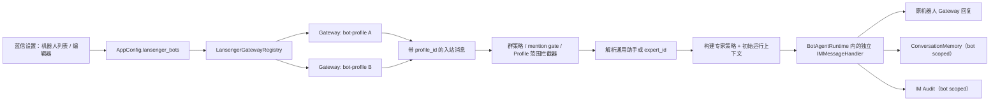
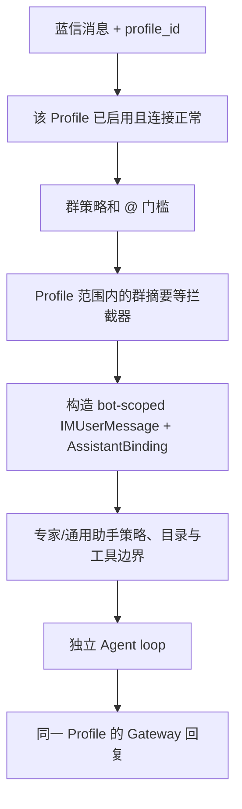

# 蓝信多机器人与 AI 专家绑定设计

| 字段 | 内容 |
| --- | --- |
| 状态 | Implemented（本机多 Bot 路径） |
| 日期 | 2026-08-10 |
| 范围 | MaClaw Desktop GUI、`corelib/app_config`、`gui/lansenger_gateway`、IM 审计与专家会话 |
| 不在本期范围 | 蓝信交互卡片、多平台复用、Hub 端统一托管多个蓝信凭据 |

## 1. 目标

蓝信通道支持同时绑定多个机器人。每个机器人是一个独立的运行单元，具备独立的：

- 蓝信 App 凭据与 WebSocket 连接；
- 默认 AI 助手或指定 AI 专家；
- 初始运行上下文（补充提示词、工作目录、文档检索目录）；
- 独立的 Agent 实例及其循环、任务、确认和取消状态；
- 对话记忆、未完成任务、确认状态和 IM 审计历史；
- 群聊策略、知识库/本地目录/Web 检索等权限。

创建机器人时默认绑定“通用 AI 助手”。管理员可将其切换为某个已存在的 AI 专家。典型场景是把机器人配置成客服：绑定“客服专家”，把产品源码目录设为工作目录、把帮助文档目录设为可检索文档目录，并在初始提示词中写明产品范围、回答风格和升级人工的规则。

## 2. 产品边界与核心决策

### 2.1 术语

| 术语 | 含义 |
| --- | --- |
| 机器人配置（Bot Profile） | 本机保存的一条蓝信机器人绑定，含凭据、策略与上下文。 |
| 通用助手 | 不绑定专家，沿用当前 IM 助手能力与主助手模型配置。 |
| 专家 | 现有 `ExpertDefinition`，决定 system prompt、工具和技能白名单。 |
| 初始运行上下文 | 对某个机器人每一轮都生效的附加约束，不是一次性欢迎语。 |
| 会话 | 一个机器人与一个蓝信对话目标的逻辑对话；群聊仍按“群 + 发言人”隔离。 |

### 2.2 决策

1. 使用**多条 Bot Profile**替代现有单一 `LansengerAppID/AppSecret` 配置；原字段只作为一次性迁移来源。
2. `bot_profile_id` 是本地稳定 UUID，不使用可变的 App ID 或机器人名称作为历史主键。
3. 专家是“策略模板”，机器人绑定时引用 `expert_id`；机器人会话不复用桌面专家 Tab 的会话 ID。
4. 初始上下文由后端根据绑定生成，位于用户文本之前，且不能由蓝信消息覆盖或伪造。
5. 文档目录不是“任意路径提示”。它会转换为该机器人专属的检索范围；未授权目录不得通过工具读取。
6. 所有历史与审计都带 `bot_profile_id`。同一蓝信用户在不同机器人下绝不共享上下文或在历史界面混显。
7. 当前蓝信群聊的最小权限原则保持不变；每个机器人各自配置群策略和权限。通用助手不因此获得专家机器人配置的目录权限。
8. **一个 Bot Profile 对应一个独立 Agent 实例**。不得把所有机器人接入同一个 `IMMessageHandler` 后仅靠 `UserID` 字符串区分；会话 key 是第二道隔离，而不是唯一隔离措施。

## 3. 端到端架构



网关注册表持有多个 `*lansenger.Gateway`。每个实例构造回调时闭包捕获 `bot_profile_id`，因而从接收、路由、回复到审计均无需从外部消息猜测“属于哪个机器人”。

### 3.1 独立 Agent 实例边界

每个启用的 profile 创建一个 `BotAgentRuntime`。它是该机器人唯一的 Agent 宿主，并拥有一个独立的 `IMMessageHandler`：

```go
type BotAgentRuntime struct {
    ProfileID string
    Handler   *IMMessageHandler // 每个 profile 单独构造，不能共享
    Binding   AssistantBinding
}
```

### 3.2 每机器人 FIFO 请求队列与群聊默认 @

每个 `BotAgentRuntime` 额外拥有一条 FIFO turn queue 和一个 worker。来自多个用户的消息按该机器人收到的先后顺序依次进入 Agent loop；不得因用户不同而并发执行，否则会造成回复交错、模型资源争用和确认状态难以解释。不同机器人之间仍可并行，底层全局 LLM 调度器继续负责总并发上限。

机器人停用、删除或修改专家/目录/提示词时，先停止队列并取消运行中的会话，再销毁旧 runtime；队列中尚未执行的请求不再发送回复。新 runtime 只接受重新生效后的新消息。

`AutoMentionReply` 使用 `*bool`：`nil` 表示新 profile 的默认值 `true`，即群聊中的正常回答默认通过平台原生提醒 `@` 提问者；`false` 是管理员显式关闭。私聊不添加 `@`。从旧单机器人迁移时必须把旧布尔值显式复制，避免升级改变既有行为。错误、健康状态等系统通知不自动 @。

以下内存态必须实例级隔离：`sessionLoops`、`workflowV2Adapters`、`currentLoopCtx` 兼容状态、任务编排器引用、待确认/待追问状态、进度过滤器、上下文压缩计数、Agent trace/trajectory 的 owner 与 request trace。每次配置更新导致专家、工作目录、权限或初始提示词变化时，注册表以有序方式取消该 profile 的活动轮次、销毁旧 runtime，再创建新的 runtime；其他 profile 的 Agent 不重启。

`ConversationMemory` 可使用同一个持久化实现，但必须由 profile-scoped key 存取；如果其实现包含进程内缓存，则缓存同样需要以完整会话 key 分区。全局 LLM 调度器、模型客户端连接池和只读专家定义缓存可以共享，它们是受资源上限保护的基础设施，不构成 Agent 状态共享。

## 4. 配置与数据模型

### 4.1 `AppConfig` 配置

新增字段（JSON 命名保持现有风格）：

```go
type LansengerBotProfile struct {
    ID                    string   `json:"id"`                    // UUID，创建后不可修改
    Name                  string   `json:"name"`                  // 管理界面名称
    Enabled               bool     `json:"enabled"`
    AppID                 string   `json:"app_id"`
    AppSecret             string   `json:"app_secret"`           // 复用现有配置加密/脱敏路径
    GatewayURL            string   `json:"gateway_url,omitempty"`
    WSSURL                string   `json:"wss_url,omitempty"`

    AssistantMode         string   `json:"assistant_mode"`        // "general" | "expert"
    ExpertID              string   `json:"expert_id,omitempty"`   // expert 时必填
    InitialPrompt         string   `json:"initial_prompt,omitempty"`
    WorkingDirectory      string   `json:"working_directory,omitempty"`
    DocumentDirectories   []string `json:"document_directories,omitempty"`
    KnowledgeSourceIDs    []string `json:"knowledge_source_ids,omitempty"`

    GroupPolicy           string   `json:"group_policy,omitempty"`
    AllowedGroupIDs       []string `json:"allowed_group_ids,omitempty"`
    IgnoredGroupIDs       []string `json:"ignored_group_ids,omitempty"`
    RequireMention        *bool    `json:"require_mention,omitempty"`
    RespondToAtAll        bool     `json:"respond_to_at_all,omitempty"`
    AutoMentionReply      bool     `json:"auto_mention_reply,omitempty"`
    AutoQuoteReply        bool     `json:"auto_quote_reply,omitempty"`
    AllowWebSearch        bool     `json:"allow_web_search,omitempty"`
    AllowAllDirectories   bool     `json:"allow_all_directories,omitempty"`
    AllowedDirectories    []string `json:"allowed_directories,omitempty"`
}

// AppConfig
LansengerBots []LansengerBotProfile `json:"lansenger_bots,omitempty"`
```

约束：`ID` 全局唯一；启用项的 `AppID/AppSecret` 必填；同一 `AppID` 不允许重复启用；`assistant_mode=expert` 时 `expert_id` 必须指向可解析的专家；路径以规范化后的绝对路径去重；`DocumentDirectories` 必须是 `AllowedDirectories` 的子集，或系统自动把它们加入该机器人允许目录。设置页从当前本机可用的 AI 专家目录加载下拉选项（名称与简介），管理员只能选择，不能手工输入 Expert ID；保存接口仍以专家存储为准复核，已删除或不可用的专家一律拒绝绑定。

### 4.2 初始运行上下文

初始上下文不是把路径原样拼接给模型，而是固定结构的可信 prompt block：

```text
[机器人绑定运行上下文]
- 机器人：产品客服（bot_profile_id=...）
- 工作目录：D:\product\server
- 文档检索目录：D:\product\docs；D:\product\help
- 已授权知识库：产品知识库
- 专家模式：客服专家
- 管理员补充要求：仅回答本产品问题；无法确认时说明限制并建议联系人工。

规则：仅在上述授权目录和知识库中检索/读取。不得声称已经读取未实际检索到的文档。
```

构建规则：

1. 先加载专家 system prompt（通用助手则使用现有默认 system prompt）。
2. 再注入绑定运行上下文和不可突破的目录/知识库范围。
3. 最后添加蓝信群聊上下文与用户消息。
4. 工具层同步执行相同范围限制；prompt 只帮助模型理解，不能替代授权判断。

`WorkingDirectory` 是该机器人所有工具、临时产物和相对路径解释的基准。`DocumentDirectories` 仅用于检索/读取，不自动赋予写入权限。若客服需要写入工单或源代码，须在专家工具白名单和目录写权限中单独授权。

### 4.3 路径安全

- 保存时调用 `filepath.Abs`、`EvalSymlinks`（存在时）和平台大小写规范化；拒绝空路径、工作区根/磁盘根等过宽路径，除非管理员二次确认。
- 目录不存在时可以保存为“待恢复”，但机器人不能启动；设置页展示明确诊断。
- 目录删除、移动或权限变化后，运行时拒绝该工具调用并在状态中记录原因，不回退到全局目录。
- 密钥不进入审计日志、Wails 读取 DTO 或导出文件；编辑已有配置时只显示“已保存”。

## 5. 会话、记忆与历史查看

### 5.1 会话键

现有蓝信群聊会话已按“群 + 用户”隔离，扩展时在最前面加入机器人 ID：

```text
私聊：lansenger:<botProfileID>:p2p:<fromUserID>
群聊：lansenger:<botProfileID>:group:<len(groupID)>:<groupID>:user:<len(fromUserID)>:<fromUserID>
```

该 key 在对应的 `BotAgentRuntime.Handler` 内用于 `ConversationMemory`、`sessionLoops`、待确认状态、工作流适配器、任务槽和取消控制。绝不能用裸 `FromUserID`、机器人 App ID 或专家 ID 作为会话 key。

### 5.2 专家解析

不能把 IM 机器人会话伪装成现有 `desktop-user:expert:<expertId>`：那会错误地与桌面专家 Tab 共享历史。新增 `SessionPolicy`/`AssistantBinding` 元数据：

```go
type AssistantBinding struct {
    BotProfileID string
    Mode         string // general | expert
    ExpertID     string
    WorkingDir   string
    DocumentDirs []string
}
```

`IMUserMessage` 携带该 binding；`IMMessageHandler` 在每轮根据 binding 获取专家定义、过滤工具与技能，并应用工作目录和检索范围。`expertDefForUserID` 保持为桌面兼容入口，新增按 binding 解析的路径，避免依赖特殊 UserID 前缀。

### 5.3 审计历史

`im_audit_messages` 增加 `bot_profile_id TEXT NOT NULL DEFAULT ''`，新增索引：

```sql
CREATE INDEX IF NOT EXISTS idx_im_audit_bot_user_ts
  ON im_audit_messages(bot_profile_id, user_id, timestamp, id);
```

`IMAuditMessage`、查询、CSV 导出和 Wails DTO 均加入 `bot_profile_id`。蓝信设置页的“聊天记录”入口默认传入当前机器人；历史面板顶部展示机器人名称，并可在“全部机器人 / 某机器人”之间筛选。删除/保留策略应同时按机器人范围操作，并明确显示影响的记录数量。

迁移期间旧记录 `bot_profile_id=''` 归入“旧版默认机器人历史”，不悄悄混入新机器人。

## 6. 网关与路由改造

### 6.1 注册表替换单例

当前 `lansengerGatewayManager` 持有一个 gateway、一个惰性共享的 `localHandler` 和一组全局蓝信配置。改为：

```go
type lansengerGatewayRegistry struct {
    app     *App
    bots    map[string]*lansengerGatewayManager // profile ID -> manager
    runtimes map[string]*BotAgentRuntime         // profile ID -> 独立 Agent 实例
    syncMu  sync.Mutex
}
```

每个 manager 只读取自己的 profile，并只引用对应的 `BotAgentRuntime`；删除现有 `ensureLocalHandler()` 复用单例的模式。`SyncFromConfig` 做 diff：新增/修改/删除/禁用 profile 分别创建、重建、停止或销毁 gateway + runtime。停止某机器人只取消该机器人的未完成请求，不影响其他机器人。

所有下列方法都显式接受或持有 `botProfileID`：`onIncomingMessage`、`handleLocalMessage`、`forwardToHub`、`sendAgentResponse`、群摘要/文件审计与健康状态事件。

### 6.2 入站决策顺序



现有“群聊强制本地执行以保持权限边界”的原则继续有效。若将来允许 Hub 执行，必须随请求传递不可篡改的 profile binding、目录授权摘要和工具策略，Hub 不得自行放宽它们。

### 6.3 既有全局侧车功能的隔离边界

群摘要的缓冲、cursor 和执行中标记以 `bot_profile_id + group_id` 作为存储范围；群文件审计的本地附件路径也以 profile 分目录保存。兼容单 Bot 实例仍使用旧的原始 `group_id`，从而不隐藏升级前的摘要历史。

问卷 Hub 协议与“盯人”服务目前均仅按平台/群/用户识别，没有可验证的 `bot_profile_id`。为避免同群多 Bot 之间的问卷会话、盯人任务、花名册或自动回复串线，profile Bot 不调用这两个共享通道；此时消息依然进入该 Bot 自身的 Agent。仅旧单 Bot 兼容实例保留原有问卷与盯人行为。要将其开放给 profile Bot，必须先为该两类协议和存储增加强制的 profile 维度，并使出站路由返回同一个 Bot gateway。

如果一个 profile 的私有 runtime 无法创建或已停止，交付层必须明确拒绝该消息并返回“运行环境不可用”的提示；不得回退到旧的 App 共享 `IMMessageHandler`。这保证运行时初始化异常也不会突破 Bot 间的会话、确认和工具状态边界。

主动推送的“最后私聊对象”同样是 profile 级状态：新建 profile 不会继承旧单 Bot 或其他 Bot 的对象；每个 profile 只持久化和读取自己的最后对象。迁移后的默认 profile 可以使用旧字段作为一次性兼容回退，但日后的写入必须落在 profile 维度。

### 6.3 默认通用助手与异常处理

- 新建 profile 默认 `assistant_mode=general`，不要求创建专家。
- 指定的专家被删除、同步失败或禁用时，机器人进入 `degraded`，拒绝处理并回复“该机器人绑定的专家不可用，请联系管理员”；**不自动降级为通用助手**，避免客服机器人突然以错误角色回答。
- 目录不可用同样进入 `degraded`；只有不依赖该目录的配置不能绕过该状态。
- 通用助手使用当前主助手模型；专家仍沿用专家自己的 prompt、工具/技能白名单，再叠加 profile 的最小权限集合（取交集）。

## 7. 管理界面与 Wails API

蓝信设置页改为“机器人”列表，不再是一组全局 App ID/App Secret 输入框。

### 7.1 页面

1. 列表：名称、App ID 脱敏、助手类型、专家名称、连接状态、群数、最近活动、操作。
2. 新建/编辑抽屉：
   - 基础连接：名称、App ID、App Secret、Gateway、WS Gateway、启用状态；
   - AI 绑定：通用助手 / 指定专家；专家下拉只显示可用项；
   - 初始运行上下文：补充提示词、工作目录、文档检索目录、知识库；
   - 群策略与最小权限：沿用现有界面，但配置归属到 profile；
   - 历史与诊断：打开该机器人的聊天记录、测试目录访问、查看连接日志。
3. 删除需要二次确认：可选择“仅删除配置，保留审计”或“删除配置并按保留策略清理审计”；默认保留。

初始提示词编辑器应清楚提示：它会作用于该机器人的每一次对话；不要填密码、令牌、个人隐私或未经授权的目录。

### 7.2 后端 API

建议新增 Wails 方法，前端不直接读写整个 `AppConfig`：

```go
ListLansengerBots() ([]LansengerBotSummary, error)
GetLansengerBot(id string) (LansengerBotProfileDTO, error)
SaveLansengerBot(input LansengerBotProfileInput) (LansengerBotProfileDTO, error)
DeleteLansengerBot(id string, options DeleteLansengerBotOptions) error
TestLansengerBotContext(id string) (LansengerBotContextDiagnostic, error)
QueryIMAuditMessagesForBot(botID, userID, keyword string, page int) (*IMAuditQueryResult, error)
GetLansengerBotStatus(id string) (LansengerBotStatus, error)
```

输入 DTO 不回显 `AppSecret`；保存时空 secret 表示保留旧值，明确 `clear_secret=true` 才能清空。`SaveLansengerBot` 应原子校验、持久化并触发 registry diff，不让半配置实例短暂启动。

## 8. 兼容迁移

首次启动如果 `LansengerBots` 为空且旧版 `LansengerEnabled/AppID/AppSecret` 有效：

1. 生成固定 UUID 的“默认蓝信机器人” profile；
2. 复制旧连接、群策略、群权限、知识库和本地目录配置；
3. 绑定通用助手；
4. 标记 `lansenger_bots_migrated=true` 后原子写入；
5. 旧字段仅保留一个版本用于回滚读取，后续发布移除 UI 与运行时依赖。

迁移不改变旧 `ConversationMemory` key，因此旧内存不可安全地自动归属到新 profile。旧会话作为历史隔离区保留，不在新 profile 中续用；审计历史通过 `bot_profile_id=''` 可查看。这样避免不同机器人的历史串线。

## 9. 实施状态与验收

已落地：profile 配置迁移与密钥脱敏、registry 差量启停、每 Bot 独立 Agent/FIFO/持久化历史、专家与目录 binding、bot-scoped 群策略、审计查询/CSV 隔离、设置页 CRUD 与机器人历史入口。专家删除后，已绑定 profile 的列表与状态接口返回 `degraded` 及不泄露配置的诊断文案；运行中的回合保留入场时快照的限制策略，后续回合拒绝执行，绝不降级为通用助手。

### 9.1 主动发送与定时任务的出站边界

`im_message` 及 `manage_schedule` 在 profile Bot 的 Agent 中执行时，后端从该私有 `IMMessageHandler` 注入 `bot_profile_id`，而不是采信模型参数。该标识会持久化在 `TaskDelivery`，因此定时任务重启后仍能：

- 仅从同一 profile 的群目录解析 `group_name`，且目录缓存以 `lansenger:<bot_profile_id>` 分槽；
- 仅用该 profile 的 Gateway / App ID / App Secret 发送文字和文件；连接不可用时可使用该 profile 的短生命周期 REST 客户端；
- `user_id=self` 仅解析该 profile 的最后私聊对象；不会读取默认 Bot 或通用 scheduled-delivery state；
- profile 被删除、停用或 runtime 不可用时失败关闭，绝不退回默认 Bot Gateway 或桌面 Agent；
- 任务正文同样通过所属 profile 的独立 Agent 执行，从而保留专家、初始提示词和目录授权边界。

后台任务的执行 owner 还必须包含 `bot_profile_id + scheduled_task_id`。这是 Agent 生命周期、临时 assistant binding、活动状态和未完成任务 bookkeeping 的运行时作用域；不可复用历史常量 `scheduled_task`，否则多个 Bot（或同一 Bot 的并发任务）会在同一进程内互相覆盖专家和目录授权上下文。

该隔离 owner 虽然不再等于旧字面量 `scheduled_task`，仍必须被运行时分类为 system/scheduler Actor；否则执行画像、审计/轨迹和后台 QoS 会误把它当作普通 IM 对话。

入站私聊的非图片附件同样必须按 `lansenger/<bot_profile_id>/` 暂存；不能只用平台、用户或展示文件名作为目录/文件名。即使同一用户同时向两个 Bot 发送同名文件，两个独立 Agent 也不得共享或覆盖临时文件。

同一条边界也覆盖 Agent 产物的 `send_file` / `send_to_im` 本地转发。文件完成物化后，profile runtime 以私有 handler 身份注入可信 `bot_profile_id`；该值不在模型工具参数或 Hub payload 中暴露。文件和截图先落到 `<data>/lansenger/bots/<bot_profile_id>/artifacts/{files,screenshots}/`，而不是共享的全局产物目录。profile 文件转发必须指定蓝信目标，群名称仅可在该 Bot 的群目录中解析，`user_id=self` 仅使用该 Bot 的最近私聊对象。若 Bot 已删除、目标不属于蓝信、Gateway 不可用或上传失败，立即失败关闭，不会经默认 Bot、微信本地通道或 Hub 广播回退。

旧任务中缺少 `bot_profile_id` 的投递仍按历史默认/兼容路径执行，保证升级不改变原有单 Bot 行为。

### 9.2 Hub 模式边界

多 Bot profile 当前强制在本机处理，即使全局蓝信通道设置为 Hub 模式也不会把 profile 消息转发到 Hub。原因是现有 `im.gateway_message` / `im.gateway_reply` 协议只有平台与用户标识，缺少不可伪造的 `bot_profile_id`；转发会导致不同机器人的同一用户会话、专家和回复路由发生串线。旧单机器人兼容模式仍保留 Hub 路由。

后续若要支持多 Bot Hub 路由，必须先扩展 claim、入站和回复协议，将 `bot_profile_id` 作为路由与审计的强制字段，并在 Hub 端验证所属网关和权限摘要；完成前不得解除本机处理限制。

### 9.3 开发拆分

### Phase 1：领域与迁移

- 增加 profile DTO、校验、路径规范化、旧配置迁移和单元测试。
- 将 gateway 单例改为 registry；先保证多连接、状态和独立重启。

### Phase 2：路由、专家与上下文

- 给入站消息、`IMUserMessage`、Agent loop、出站回复和审计写入传递 `bot_profile_id`。
- 实现 `AssistantBinding`，专家工具/技能过滤与 profile 权限取交集。
- 实现可信初始上下文、工作目录和文档检索目录限制。

### Phase 3：历史与管理 UI

- 审计 schema 迁移、机器人过滤查询和 CSV 导出。
- 完成机器人列表、编辑器、上下文诊断、连接状态和机器人历史入口。

### Phase 4：回归与灰度

- 首次迁移、单机器人兼容、两个机器人并发、禁用/重启/删除的恢复测试。
- 先通过功能开关 `lansenger_multi_bot_enabled` 灰度；关闭时只运行迁移生成的默认 profile。

### 必须通过的验收场景

1. 配置 A 为通用助手、B 为客服专家；同一用户分别与 A/B 私聊，B 不见 A 的记忆、任务或审计记录。
2. A、B 同时运行长任务时，各自有独立的 Agent loop、取消、确认和进度状态；取消 B 不影响 A。二者只在全局 LLM 调度队列中竞争受控的模型资源。
3. 同一群内 @A 和 @B，各自只由被 @ 的机器人回复；两个 bot 的群策略独立生效。
4. B 的客服专家只能在其工作目录和文档目录/授权知识库中检索；访问其他本地目录被工具层拒绝。
5. B 的专家缺失或目录失效时不降级为通用助手，并在管理页显示可诊断原因。
6. 管理员在 B 的历史页只看到 `bot_profile_id=B` 的记录；导出不混入 A 或旧版默认历史。
7. 停止或编辑 B 不会中断 A 正在执行的对话；B 的旧 WebSocket 与后台任务被有序取消。
8. 旧单机器人用户升级后无需重新填写凭据，原群策略和权限等效生效。

## 10. 风险与后续演进

多机器人会放大本地 LLM 并发、文件检索与外部平台限流，应继续复用全局 LLM 调度器；会话可并行，但同一 provider 的前台请求有界。后续如需跨设备管理，可把**不含 App Secret 的 profile 元数据、专家引用和上下文策略**同步至 Hub；蓝信 Secret 与本机目录仍应留在持有网关的设备上，或进入单独的企业密钥托管方案。
