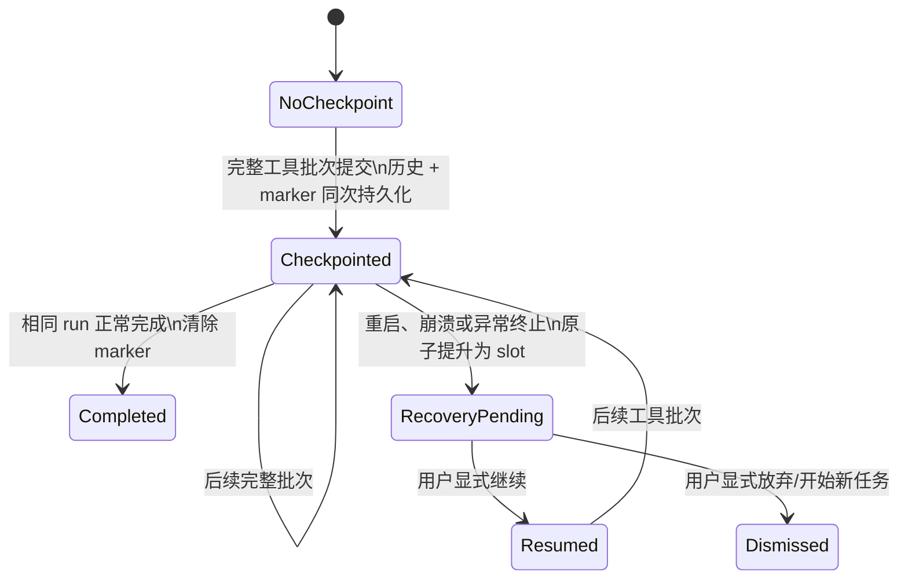
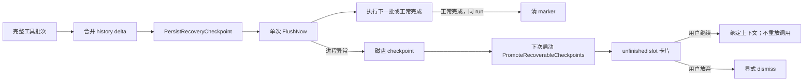

# MaClaw GUI 本地 Agent Loop 持久化与异常恢复设计

## 1. 背景与范围

MaClaw GUI 的本地 shared agent loop 在工具调用完成后的会话历史与异常恢复标记之间存在持久化缺口：进程被强制结束时，已发生的工具副作用可能无法形成可见、可审阅的恢复入口。本设计把近期止血修复和完整的批次检查点方案一起纳入交付计划。

本设计仅覆盖 GUI 本地 agent loop、`ConversationMemory`、unfinished-task slot 和已有恢复卡片。`GoalWatch` / iWorker 在 GUI 构建中是禁用兼容层，不参与本方案。

### 实施状态（2026-08-13）

- 一期、二期的核心链路均已落地：shared loop 在完整工具批次配对后同步持久化 history 与 checkpoint；启动、租约过期和正常关闭均可转换为 unfinished slot。
- `FlushNow()` 现作为写盘完成屏障串行化，避免并发 flush 在实际磁盘写入完成前提前返回。
- 仍明确不承诺断电级 durability；tmp + rename 之外的文件/目录 `fsync` 方案保留为独立的后续可靠性工作。

### 目标

1. 异常退出后，用户能在重启后的原会话中看见明确恢复选项。
2. 恢复记录绝不宣称拥有尚未持久化的工具结果或历史。
3. 旧 loop 不得清除新 loop 的恢复状态。
4. 已发生的外部副作用不得被自动重放。
5. 正常关闭、异常崩溃、租约过期三条恢复路径必须幂等，不产生重复 slot。

### 非目标

- 不实现工具调用事务或回滚；本地文件、终端和远端服务本身并不具备统一事务能力。
- 不自动重跑中断前的 tool call。
- 不重做前端恢复 UI；现有 unfinished-slot card 和 `__resume_unfinished__` / `__dismiss_unfinished__` 指令继续复用。

## 2. 当前设计复审

### 已有有效基础

- `ConversationMemory` 已保存 conversation history、`inFlightTask`、project path、set time、run ID 和 unfinished slot，写盘采用临时文件加 rename。
- GUI 已有 graceful shutdown 快照：活跃 loop 会转为 `app_exit` unfinished slot。
- 前端已有 unfinished slot 卡及恢复/放弃动作，不必从零增加页面或 Wails 通道。
- `SetInFlightTaskForRun` / `ClearInFlightTaskForRun` 已提供 run-scoped 的 memory API。

### 缺口与风险

| 问题 | 当前表现 | 风险 |
| --- | --- | --- |
| shared loop 未接入 lifecycle | `RunLoopWithUserContent` 前后没有建立或清理 in-flight marker | 强杀 shared loop 后没有恢复入口 |
| legacy lifecycle 未传 run ID | 生命周期记录了 `loopID`，但使用旧的无 run ID set/clear 调用 | 旧 loop 的 cleanup 可能删除新 loop marker |
| `OnToolExecuted` 时机错误 | 回调发生时 tool result 仅在 `RunLoop` 内部 history delta 中 | 若此处写 marker，会产生 marker 已落盘、恢复历史未落盘的伪一致状态 |
| marker 到 slot 的转换太晚 | 目前在用户下一次发消息时才消费 marker | 重启后没有即时可见的恢复提示；用户不发消息就不知道可恢复 |
| 转换不是单一公开原子操作 | handler 先 Consume，再 Upsert | 崩溃窗口中可能只清 marker 或重复生成 slot |
| durability 边界未明示 | tmp + rename 防止 JSON 半写，但没有 fsync 协议 | 不能把它表述为断电级持久化保证 |
| 隐式丢弃语义有风险 | 非“continue”的自然语言可能被解释为新任务并 dismiss 恢复 slot | 用户可能无意丢失待审阅恢复上下文 |

## 3. 一致性模型与状态机

### 3.1 恢复不变量

1. **历史先于恢复声明**：post-batch checkpoint 中 marker 指向的 history revision 必须已经包含对应完整工具批次；pre-tool checkpoint 只能指向最后一个 provider-valid 前缀，待执行工具仅留在诊断 metadata。
2. **按 run 清理**：只有相同 `runID` 的正常结束能清理其 marker。
3. **一个待决入口**：每个用户同时最多一个需要用户决定的 unfinished slot；新恢复信息不得覆盖它。
4. **原子提升**：遗留 checkpoint 转 recovery slot、清 marker、标记 dirty 必须在同一用户 shard lock 内完成。
5. **显式恢复**：crash-recovery slot 默认由 UI action/command 决定；兼容“继续”等明确续接语义时，它只能绑定同一 slot。其他非空自然语言明确按新任务处理，并在同一转移中 dismiss 旧 recovery slot，避免把不相关的新请求混入中断任务。
6. **副作用保守**：恢复的是上下文与检查证据，不是对过去工具调用的重试许可。

### 3.2 状态图



### 3.3 副作用分类

| `sideEffectState` | 示例 | 恢复策略 |
| --- | --- | --- |
| `none` | 读文件、搜索、列表 | 可直接恢复上下文，但不重放旧调用 |
| `local_committed` | 写文件、本地终端 | 必须审阅；展示工作区检查提示，确认已有 diff/输出后才能继续 |
| `external_uncertain` | 网络请求、发送、上传、远程 shell | 必须审阅；禁止自动执行或重试中断前调用 |

分类初期应宁可偏保守。无法可靠识别的工具统一按 `external_uncertain` 处理。

## 4. 持久化记录与 API

### 4.1 统一 checkpoint

不要让各 loop 散布 `Save history`、`Set marker`、`FlushNow`。新增 handler/memory 所属的单一 API，例如：

```go
type RecoveryCheckpoint struct {
    UserID          string
    RunID           string
    Task            string
    ProjectPath     string
    History         []ConversationEntry
    HistoryRevision uint64
    Sequence        uint64
    LastToolName    string
    LastCheckpointAt time.Time
    SideEffectState SideEffectState
}

func (h *IMMessageHandler) PersistRecoveryCheckpoint(cp RecoveryCheckpoint) error
```

实现约束：

1. 验证 `UserID`、`RunID`、history revision 和 sequence。
2. 在同一 memory mutation 边界更新历史与 checkpoint marker。
3. 只调用一次同步 `FlushNow()`。
4. 失败时不得把当前批次标记为可恢复。
5. API 返回错误必须传播到 loop 控制面，而非仅日志记录。

`in_flight_task` 可在兼容期保留名称，但持久化结构需要增补下列字段：`historyRevision`、`checkpointSequence`、`lastToolName`、`lastCheckpointAt`、`sideEffectState`。恢复时校验 revision，校验失败则生成 `requires_review` slot，不宣称可无缝继续。

### 4.2 durability 级别

当前临时文件 + rename 能确保应用层快照不会成为半段 JSON；它不是严格的断电一致性协议。设计和 UI 文案只承诺“已成功 FlushNow 的应用级检查点”。

如产品要求断电级目标，后续独立评估：临时文件 `Sync`、rename 后文件 sync、父目录 sync，以及 Windows 上对应语义和性能。该工作不阻塞两期的逻辑一致性修复，但必须作为 durability 验证项记录。

## 5. 一期：立即止血（安全、可独立上线）

一期不改变 core loop hook 协议，目标是补齐 shared 路径的最后完整结果检查点并修正跨 run 清理。

### 5.1 run-scoped lifecycle 修正

修改 `imInFlightLifecycle`：

- `SetOnce()` 使用 `SetInFlightTaskForRun(userID, task, projectPath, loopID)`。
- `Cleanup()` 使用 `ClearInFlightTaskForRun(userID, loopID)`。
- 新 GUI loop 的 `loopID` 为空属于异常，记录结构化告警；兼容旧调用时不得静默扩大清理范围。

### 5.2 shared loop 的最低安全 checkpoint

在 shared `RunLoopWithUserContent` 返回后：

1. 先把 `HistoryDelta` 合并成 `outHistory`。
2. 仅当历史保存成功且本轮执行过工具时，通过 `PersistRecoveryCheckpoint` 落盘 history + marker。
3. 若 loop 正常完成，则使用同一 `runID` 清 marker；取消、模型错误、max-rounds 等不应误清最后成功 checkpoint。

这覆盖“`RunLoop` 返回后、GUI 响应/收尾尚未完成”期间的崩溃。它**不能**覆盖“某工具已经执行但 `RunLoop` 尚未返回便被 SIGKILL”的窗口；该缺口由二期消除，不能在一期验收中隐瞒。

### 5.3 启动即时提升

新增 `ConversationMemory.PromoteRecoverableCheckpoints(now)`：

- app/memory 加载完成后立刻调用，不等待 in-flight lease；新进程不存在活跃 owner。
- 对每个用户，在同一 shard lock 内：若有 marker 且没有 pending slot，创建 `source=in_flight_recovery` slot，清 marker，设置 evidence scope，并标记 dirty。
- 若已存在 pending slot，只保留原 slot，并保守清理/记录遗留 marker，避免覆盖。
- 完成后统一 `FlushNow()`；第二次启动不得重复生成 slot。
- App 只刷新/推送已有 UI 数据，不发送 LLM 请求。

### 5.4 交互收紧

- crash-recovery slot 默认由 `__resume_unfinished__`、`__dismiss_unfinished__` 或明确 API 字段决定。
- 如兼容“继续”等强续接语义，必须只绑定已有 slot；其他非空自然语言明确隐式为 `StartNewTask + Dismiss`，并保留 UI action/API 字段优先级。
- 建议把 `app_exit` 自动 bind 也调整为显式卡片操作；如果保留，必须仅限恢复的原 tab，并在产品文档中接受“第一条消息视为继续”的行为取舍。

## 6. 二期：每完整工具批次的强一致检查点

一期之后，修改 `corelib/agent.LoopHooks`，增加独立于 `OnToolExecuted` 的 hook，例如：

```go
type ToolBatchMetadata struct {
    Sequence        uint64
    LastToolName    string
    SideEffectState SideEffectState
}

type LoopHooks interface {
    // existing hooks
    OnToolBatchCommitted(delta []ConversationEntry, meta ToolBatchMetadata) error
}
```

### 6.1 正确的触发位置

`OnToolBatchCommitted` 必须在以下条件都成立后调用：

1. 一个并行工具批次的全部 tool call 和 tool result 已成对写入内部 `historyDelta`。
2. interactive pause 的特殊 tool result 已按协议配对。
3. 提交给 host 的 `delta` 是可独立拼接为有效 provider conversation 的完整增量。

仅有这个 post-batch hook 仍不够：若进程在第一个 tool 执行期间异常退出，该轮没有完整 batch 可写。因此 core 还提供可选的 `OnToolBatchStarting(delta, meta)`：它在第一个 tool 执行之前，同步写入**已合法的 history 前缀**，并把即将运行的首个工具名仅作为 marker 诊断证据。`delta` 中的 assistant tool-call 声明尚没有配对 result，绝不能直接持久化为下次 provider 请求的 history；严格 provider 会拒绝该结构。marker 强制 `sideEffectState = external_uncertain`；它只表示“可能已产生效应”，恢复时必须审阅且绝不重放。若此同步写入失败，不执行该 batch 的任何 tool。

若 batch 中的 interactive tool 使 loop 在同批次其他 tool 运行前暂停，core 调用 `OnToolBatchAbandoned(meta)` 通知 host。它**不能立即清 marker**：host 必须先将配对后的 interactive history 与清 marker 作为一次 memory-level 持久化转换写盘，否则两次独立 mutation 之间崩溃仍会生成重复 recovery 卡。这些未执行 sibling 不能作为崩溃恢复证据。

若这次原子转换失败，GUI 必须**失败关闭**：不发布本次新的 `ask_user` / `record_audio` pending state，且不展示可操作的提问或录音卡片；此前已经有效的 pending state 不得被误删。否则用户可以在未持久化的历史上作答，重启后该答案无法和原始 tool call 安全配对。Memory 层还必须回滚这次失败写盘的内存候选状态，保留原 run 的 marker（或 run mismatch 时保留更新的 marker），向用户提示重试；应用重启后由既有恢复卡提供安全入口。

checkpoint 不保留无限历史：每次落盘前使用现有 `TrimHistory`。它以 assistant tool-call 与所有对应 tool result 为不可分割组进行裁剪，因而同时控制恢复文件体积并保证 provider conversation 结构合法。

不得从 `OnToolExecuted` 直接持久化，因为该回调仅适合指标、进度和模型升级；当时 host history 尚未提交。

### 6.2 GUI hook 的职责

每次 batch hook：

1. 将增量合并到已提交 history。
2. 生成递增 sequence/revision 及副作用分类。
3. 调用 `PersistRecoveryCheckpoint`，一次完成 history、marker、flush。
4. 仅在 API 成功后继续模型下一轮或执行下一工具批次。

若 checkpoint 写入失败，core loop 应停止继续执行可能有副作用的工具，并返回明确的安全错误，例如“无法安全持久化执行进度，已停止自动执行”。不要把未写盘状态标为可恢复。

### 6.3 恢复语义

恢复 slot 应带有：

- `EvidenceScopeKey = in_flight_run:<runID>`；
- 最后检查点时间和工具名；
- history revision/sequence；
- `sideEffectState`；
- `recoveryMode = resume_context | requires_review`。

恢复操作只绑定保存的上下文，将下一次模型调用作为新的前向决策；不重放旧 tool call。`external_uncertain` 及 revision 失配一律走 `requires_review`：UI 呈现风险与工作区检查入口，同时恢复后的系统上下文会明确要求先检查当前状态，禁止仅因恢复而重试旧工具调用。

## 7. 启动、关闭与并发协调



- graceful shutdown 继续创建 `app_exit` slot，但必须与 checkpoint 提升共用“已有 pending slot 不覆盖”规则。
- shutdown 写入 slot 与清 marker 应通过同一 memory-level 事务 API，消除两次独立 mutation 的中间窗口。
- lease expiry 保留为运行期 stuck-loop 兜底；启动路径不依赖 lease。两者必须使用相同 evidence scope 和幂等条件。
- session serialization 仍负责同一用户前台请求互斥，但不应被当作跨进程恢复原子性的替代品。

## 8. 验收测试

### 一期

- legacy：run A cleanup 不会清除 run B marker。
- shared：`HistoryDelta` 保存与 marker 同一持久化快照，不出现 marker-only。
- `RunLoop` 返回后模拟异常：重载 memory 后即时仅产生一个恢复 slot。
- 连续两次启动：不重复生成 slot。
- 已有 pending slot：启动提升与 shutdown snapshot 都不得覆盖它。
- graceful shutdown：`app_exit` 与 crash marker 不生成重复 slot。
- crash-recovery 自然语言不触发隐式 dismiss；显式 resume/dismiss 指令保持可用。

### 二期

- 首个完整工具批次 checkpoint 后崩溃，恢复历史包含完整 tool-call/tool-result 配对。
- 并行工具只在全组完成后触发一次 checkpoint，不写入半组结果。
- interactive pause 的 tool result 依旧形成合法历史。
- checkpoint flush 失败后不继续下一批有副作用工具，并返回安全错误。
- `external_uncertain` slot 不能自动执行或重试旧调用。
- revision/sequence 失配转为 `requires_review`，不自动 continue。
- 恢复卡前端动作端到端：继续、放弃、工作区检查提示及状态更新。

建议先运行定向单元测试（`corelib/agent` 和 `gui` 中相关文件），再运行 `go test ./corelib/agent ./gui`；前端补充 unfinished slot action 的组件与 hook 测试。

## 9. 发布顺序与完成标准

1. 先发布一期，包含指标：checkpoint 成功/失败、启动提升数、slot 重复抑制数、run mismatch cleanup 尝试数。
2. 用真实强杀测试和小流量 telemetry 验证 recovery slot 可见性与误恢复率。
3. 再发布二期 core hook 和批次 checkpoint；在 feature flag 下观察 flush failure、批次延迟与副作用风险分类。
4. 二期通过所有批次、并行、重启、关闭和失败路径测试后，才把“本地 agent loop 支持异常退出后的持久化恢复”定义为完成。

一期完成表示 shared loop 已具备**最后完整结果**的恢复能力；二期完成才表示工具执行过程中可在**每个完整批次**形成可靠恢复检查点。
