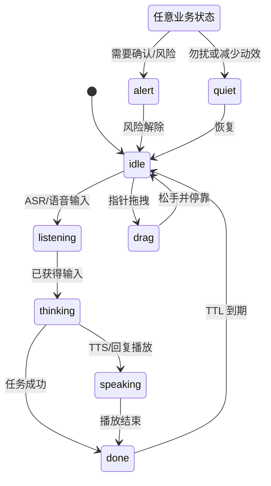
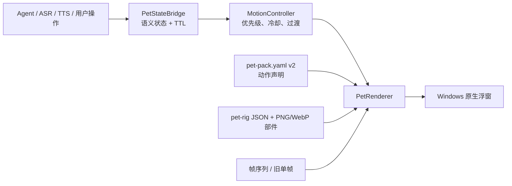

# MaClaw 宠物系统 2.0：连续动画、骨骼动作与宠物包设计

> 状态：**首期已落地（2026-08）。**
>
> 本文承接 [宠物系统设计](maclaw-pet-system-design.md) 与 [显示质量升级及宠物插件系统设计](maclaw-pet-visual-upgrade-and-plugin-system-design-zh.md)。后两篇中与 2.0 冲突的“静态状态帧即最终呈现”假设，以本文为准。
>
> 落地摘要：Windows 原生桌宠骨骼动画/状态过渡/点击拖拽反馈已上线；官方仅维护 ClawMate（Mini/Dev/Focus Claw 及 WebView 伴侣窗遗留代码已移除）；设置页已提供“动画能力 / 降级原因 / 动作预览”；`alert` 状态与 `long_idle` 事件已接入真实触发源；macOS/Linux 仍为静态回退（stub），设置 UI 按平台隐藏音效/动作项。

## 1. 结论与目标

宠物系统 2.0 将桌宠从“按业务状态替换一张图片”升级为“持续运行、可被业务状态打断和衔接的角色动画”。首期采用**双轨 2D 动画运行时**：

1. **骨骼动画为主路径**：新宠物包可声明骨骼、部件贴图、关键帧和动作片段；运行时在原生浮窗中连续合成动作。
2. **帧序列为兼容/降级路径**：现有静态帧包和未来的帧序列包无需重做即可运行；缺少某个动作时回退到同状态静态帧或 idle。

这样既能在首期同步交付顺滑的骨骼动作，又不要求已有四套官方皮肤或第三方包一次性重制。2.0 不引入 3D 模型、可执行脚本、远程资源或 WebView 作为 Windows 生产桌宠渲染器。

## 2. 范围

### 2.1 首期交付

- Windows 原生桌宠支持连续骨骼动画、状态过渡和点击/拖拽反馈。
- 保留现有 `idle`、`listening`、`thinking`、`speaking`、`done`、`alert`、`quiet` 语义，并补充动作阶段。
- 仅保留官方默认 `ClawMate` 作为完整骨骼动作的打样包，并默认开启桌宠；其他形象由用户自定义宠物包提供，并继续可走兼容路径显示。
- 宠物包 manifest 升级为 v2，并保持 v1 读取、安装和导出兼容。
- 设置页提供“动画能力 / 降级原因 / 动作预览”信息；保留 `pet_reduced_motion`。
- 同步发布宠物包构建指南 2.0（本地文档、Hub 的 `/pet-pack-help` 页面及包模板）。

### 2.2 不在首期范围

- 3D、物理模拟、联网下载动作资源、包内 JS/WASM。
- Live2D、Spine 或 Rive 的专有二进制运行时；后续可通过独立 renderer adapter 评估。
- macOS/Linux 原生骨骼渲染（先保持当前桌宠行为，接口对齐后单独实施）。
- 让动作替代业务反馈：确认、报错和高风险操作仍以可读 UI 为准，宠物仅作辅助提示。

## 3. 核心决策

| 决策 | 采用方案 | 原因 |
| --- | --- | --- |
| 动画技术 | 原生 2D 骨骼 + 部件贴图 + 关键帧（`pet-rig`） | 适配现有 Windows 原生浮窗，不受第三方商业 SDK、WebView 与网络资源约束。 |
| 兼容策略 | 骨骼优先，帧序列/单帧回退 | 可渐进迁移官方和第三方包，安装包永不因缺少新动作而失效。 |
| 动作组织 | `enter → loop → exit` 片段 + 可中断混合 | 状态切换自然，避免“每次切状态都从第一帧跳起”。 |
| 状态优先级 | `alert > drag > speaking > thinking > listening > done > idle` | 高风险提示和直接操作始终抢占装饰性动作。 |
| 资源安全 | 仅 YAML/JSON/PNG/WebP；不执行包代码 | 延续 Pet Pack 声明式、安全边界。 |
| 动作编排 | 业务事件只发语义状态；动画表由包决定 | UI/Agent 无需知道每个皮肤的动作文件，避免硬编码。 |
| 默认形象 | 具像的小型机械螃蟹工作助手 | 与 MaClaw 命名建立直观联系，默认开启时也比抽象符号更亲和、易理解。 |

## 4. 用户体验与动作模型

### 4.0 默认宠物：ClawMate 小螃蟹

`ClawMate` 不再使用抽象圆形、纯几何或仅靠发光轮廓的形象。它是一个**具像的小型机械螃蟹工作助手**：圆润金属甲壳、两只短小钳子、短腿、可表达的眼睛，以及低亮度钢蓝状态灯。在 56–120px 尺寸下，用户应一眼看出“这是一只小螃蟹”，而不是一个 logo、球体或抽象机器人。

- **气质**：安静、可靠、带一点好奇，像桌面上的精巧工具；避免幼态、夸张卖萌或强拟人化表情。
- **配色**：石墨/冷灰甲壳配钢蓝状态灯；低饱和青绿只表达完成；红色仅用于真正的 `alert`。禁止糖果色、粉紫渐变、大面积霓虹和装饰性光环。
- **动作语汇**：眼睛方向、钳子轻合、甲壳俯仰和短腿重心变化承担表达；不使用无意义粒子、弹跳或持续闪烁。
- **默认开启但不打扰**：首次贴边停靠，idle 低频静音，不自动弹气泡、不覆盖主工作区；用户可拖拽、关闭，或随时启用静态/减少动效。
- **资产验收**：官方包必须提供 256px 审查图、56/88/120px 缩放检查图、完整骨骼部件及静态回退帧，不能只以大尺寸概念图验收。

### 4.1 角色行为

| 语义状态 | 动作片段 | 用户感受 | 结束方式 |
| --- | --- | --- |
| `idle` | 呼吸、眨眼、轻微重心移动；冷却后随机观察/伸展 | 有生命感但不分散注意 | 可被任意高优先级状态打断 |
| `listening` | 转向输入源、聚焦姿势、轻循环等待 | 正在听你说 | 转写/取消后退出 |
| `thinking` | 视线游移、短促观察或低幅度踱步 | 正在处理，不制造焦虑 | 首个回复/失败/取消时退出 |
| `speaking` | 身体节奏和可选口型/发光节律 | 正在答复 | TTS/文本流结束后退出 |
| `done` | 180–350ms 的确认小动作 | 已完成且可继续工作 | 一次播放后自动回 idle，TTL 1.2–1.8s |
| `alert` | 收束姿势与克制的提醒动作 | 需要注意或确认 | 由业务解除，不能被 idle 抢占 |
| `quiet` | 静态或极低频呼吸 | 勿扰，仍可辨认 | 退出勿扰时恢复 |
| `drag` | 跟随指针、松手缓入停靠姿势 | 直接、可控的拖拽反馈 | 松手后回到当前语义状态 |

### 4.2 过渡规则

- 常规状态切换的混合时长为 **160–220ms**；`alert` 进入可缩短至 100–140ms，拖拽跟随不使用滞后动画。
- 每段动作定义 `enter`、`loop`、`exit`。若下一状态在 `enter` 或 `exit` 期间到来，运行时从当前骨骼姿势直接混合到目标 `enter`，不强制播完。
- `done`、点击回应、松手回弹等 one-shot 动作只能在冷却期外触发；同一动作不得连续重复。
- 自主 idle 动作随机选择，间隔建议 12–35 秒；鼠标正在拖拽、开启勿扰、减少动效、窗口失焦或系统忙碌时不触发。
- `pet_reduced_motion=true` 或 `pet_motion_enabled=false` 时，直接选择稳定姿势/单帧，不播放补间、随机 idle 或动作音效。`quiet` 同时禁用动作音效。

### 4.3 状态机



`PetStateBridge` 继续只传递业务语义状态和 TTL；新增的 `drag`、点击及 idle 随机动作由原生浮窗本地处理，不反向污染 Agent/ASR/TTS 状态。

## 5. 动画运行时架构



### 5.1 新模块

| 模块 | 职责 |
| --- | --- |
| `gui/petpack/rig.go` | 读取与校验 `pet-rig`：骨骼层级、槽位、贴图和动作轨道。 |
| `gui/petpack/motion_controller.go` | 接收语义状态，计算优先级、动作片段、随机 idle、冷却及混合。 |
| `gui/petpack/rig_renderer.go` | 对骨骼变换插值，按层级将 PNG/WebP 部件合成为 `image.NRGBA`。 |
| `gui/floating_windows.go` | 每个动画 tick 请求当前渲染帧；保持现有帧缓存和过程式回退。 |
| `gui/frontend/src/components/PetSettingsPanel.tsx` | 显示 pack 是否支持骨骼、动作预览、减少动效和回退说明；默认引导用户安装或制作自定义宠物包。 |

原 `FrameCache` 扩展为 `MotionFrameCache`：缓存解码贴图、预乘 alpha 部件与常用尺寸的合成结果；不把每一 tick 的完整帧无限缓存。

### 5.2 性能和资源预算

- 正常模式目标 **30 FPS**；活动状态可短暂升至 **60 FPS**，静态、失焦或 quiet 降至 0 FPS。
- 默认 88px 桌宠的单 tick 预算为 **≤ 4ms**，连续 CPU 占用目标 **< 2% 单核心**。
- 首期每个 rig 最多 24 根骨骼、32 个可见槽位、12 张部件贴图；单部件最大 512×512。
- 启动/换肤时预解码 idle、listening、thinking、speaking 的贴图；失败、内存紧张或超预算时立刻降为帧序列/静态图并记录可诊断原因。

## 6. 宠物包 v2 规范

### 6.1 兼容性

- `schema_version: 1`：按现有 `assets.native.<state>` 解析，属于帧/静态路径。
- `schema_version: 2`：可声明 `renderer: native-skeleton` 与 `assets.rig`。若设备或平台不支持，则按 `assets.native` 回退。
- v2 包**必须**提供 `preview` 和 `assets.native.idle`；建议提供四个基础状态的静态回退图。骨骼资产损坏不得阻止安装或选择该包。

### 6.2 manifest 示例

```yaml
schema_version: 2
id: clawmate
name: ClawMate
version: 2.0.0
author: MaClaw Official
license: proprietary
renderer: native-skeleton
preview: preview.png
default_size: 88

assets:
  preview: preview.png
  native:                       # 强制的降级路径
    idle: native/idle.png
    listening: native/listening.png
    thinking: native/thinking.png
    speaking: native/speaking.png
  rig:
    definition: rig/clawmate.pet-rig.json
    textures:
      - rig/body.png
      - rig/claw.png
      - rig/eyes.png

motion:
  transition_ms: 180
  idle_cooldown_ms: [12000, 35000]
  clips:
    idle:       { enter: idle_in, loop: idle_loop, exit: idle_out }
    listening:  { enter: listen_in, loop: listen_loop, exit: listen_out }
    thinking:   { enter: think_in, loop: think_loop, exit: think_out }
    speaking:   { enter: speak_in, loop: speak_loop, exit: speak_out }
    done:       { one_shot: done }
    alert:      { enter: alert_in, loop: alert_loop, exit: alert_out }
    drag:       { loop: drag_follow, exit: drag_release }
  idle_variants: [idle_look, idle_stretch]
```

### 6.3 `pet-rig` 文件边界

`*.pet-rig.json` 是 MaClaw 受限的、可验证的 JSON，不是脚本格式。它只允许：

- 骨骼父子关系、初始位置/旋转/缩放；
- 槽位与本地 PNG/WebP 贴图的绑定、绘制层级和锚点；
- 以毫秒表示的位移、旋转、缩放、透明度关键帧；
- 片段循环、动作标记及安全上限。

禁止表达式、网络地址、事件回调、外部字体、滤镜脚本和任意文件读取。插值仅支持 `linear`、`ease-out`、`ease-in-out`；每个轨道必须单调递增，关键帧不得超过 240 个。包校验器应在导入和导出时给出具体错误位置。

## 7. 配置、设置与可访问性

新增或明确的配置字段：

```json
{
  "pet_animation_mode": "auto",
  "pet_motion_enabled": true,
  "pet_reduced_motion": false,
  "pet_interaction_mode": "balanced"
}
```

- `auto`：优先骨骼，失败则帧序列/单帧；`static`：始终单帧；`skeleton`：仅在支持时使用，否则以明显说明回退到 `auto`。
- 设置页不展示技术名词作为唯一信息，而展示“连续动作 / 兼容动作 / 静态动作”及原因；预览区可播放单个动作，不自动循环抢占用户注意。
- `prefers-reduced-motion` 首次进入时只建议开启，用户配置优先；焦点、错误及高风险状态不得只依赖颜色或动作表达。
- 动作音效继续遵循用户 `pet_motion_sound_preset` 优先、quiet/reduced-motion 禁音的既有规则。

## 8. 宠物包构建指南 2.0（同步更新）

构建指南是 2.0 的正式交付物，而非附录。应新增/更新以下内容，并由设置页“宠物包创建指南”跳转到同一版本：

1. **快速开始**：v1 静态/帧包和 v2 骨骼包的选择表；明确“先准备可用的静态回退，再制作骨骼”。
2. **目录模板**：`pet-pack.yaml`、`preview.png`、`native/`、`rig/` 的完整最小可运行示例。
3. **骨骼制作规范**：坐标系、锚点、命名、层级、动作片段、循环闭合、透明边界及 88/120px 视觉检查。
4. **动作清单**：必做 `idle/listening/thinking/speaking`，推荐 `done/alert/drag`；每个动作的进入、循环、退出和时长建议。
5. **导出与校验**：manifest/rig schema 校验、资源预算、缩放预览、减少动效和静态回退验证。
6. **打包发布**：安全文件白名单、Zip 结构、版本号、授权与市场发布前检查。
7. **故障排除**：缺贴图、非法骨骼引用、动作无法过渡、超过预算、平台回退的可操作提示。

交付位置：仓库内新增 `docs/maclaw-pet-pack-building-guide-zh.md`，HubCenter 新增或更新 `/pet-pack-help` 静态页面，并在 `gui/petpack/bundled/` 提供一个可验证的 v2 模板包。两处正文共享同一源文件或构建产物，避免规则漂移。

## 9. 分阶段实施与验收

| 阶段 | 内容 | 验收标准 |
| --- | --- | --- |
| A | schema v2、`pet-rig` 校验、v1 适配、模板与构建指南 | v1 包保持可安装；非法 rig 有明确报错；指南可构建最小包。 |
| B | Windows MotionController、骨骼合成器、缓存与降级 | ClawMate 可连续 idle/listening/thinking/speaking；状态切换无闪烁、无跳回首帧。 |
| C | 业务状态桥接、点击/拖拽、设置预览、减少动效 | 任务事件映射正确；拖拽不破坏状态；开启减少动效后无持续 tick。 |
| D | 官方包迁移、性能/无障碍/视觉验收 | 88/120px 截图与性能达标；所有皮肤均有可解释回退；构建指南与实际校验器一致。 |

### 9.1 必测场景

- `thinking → speaking → done → idle` 连续切换，任意时点插入 `alert`，无闪帧和卡死。
- 拖拽中出现 `alert`，松手后恢复 alert，而不是错误回 idle。
- v1 包、缺少某状态的 v2 包、损坏 rig 包均能保持安全可用的回退。
- `pet_reduced_motion`、`pet_motion_enabled=false`、quiet 三种模式热更新后停止连续动画及音效。
- 连续运行 30 分钟无 goroutine/timer 累积、内存缓存无无界增长。
- 指南中的最小 v2 示例可通过同一校验器、打包、安装、预览和导出。

## 10. 风险与控制

| 风险 | 控制措施 |
| --- | --- |
| 骨骼动作制作成本高 | 只要求默认包首发完整骨骼；其余包走兼容路径；提供模板和校验器。 |
| 原生合成影响 CPU | 小尺寸、受限骨骼/关键帧预算、失焦降频、缓存与静态降级。 |
| schema 漂移导致指南失效 | 指南示例进入自动化测试，使用产品内同一 manifest/rig 校验库。 |
| 动作干扰工作 | 小幅度、冷却、明确优先级、quiet/减少动效和禁音。 |
| 第三方格式兼容压力 | 本期固定 `pet-rig` JSON；Rive/Live2D/Spine 只作为后续 adapter 提案。 |

## 11. 已确认的产品边界

- 官方宠物只保留一个 `ClawMate`：它既是默认桌宠，也是骨骼动画与宠物包 v2 的质量打样。
- 桌宠默认开启；`ClawMate` 固定为具像、亲和的小型机械螃蟹助手，不能继续使用抽象图形作为正式默认形象。
- `Mini Claw`、`Dev Claw`、`Focus Claw` 不再作为官方 2.0 皮肤维护、升级或继续扩展；用户需要不同形象时，通过本地安装、导入或市场获取自定义宠物包。
- 官方不以多皮肤数量作为 2.0 完成标准；完成标准是一个高质量默认骨骼宠物，以及稳定、安全、文档完善的自定义包创作与运行链路。
- 技术路线确定为 `pet-rig` 原生 2D 骨骼动画 + 原有帧图兼容回退；不在首期接入 Live2D、Rive 或 Spine。
- 宠物市场与桌面安装器必须执行同一 v2 manifest 与 rig 校验，构建指南和模板是发布门槛。
