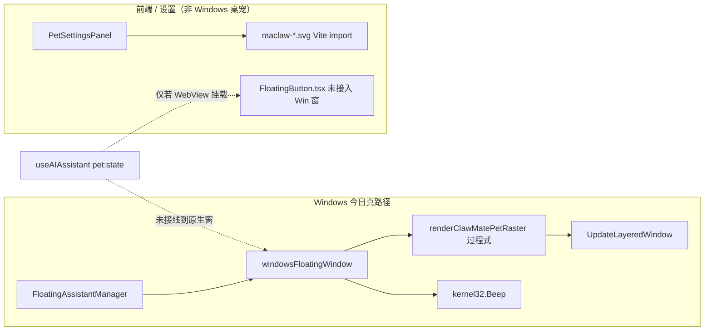
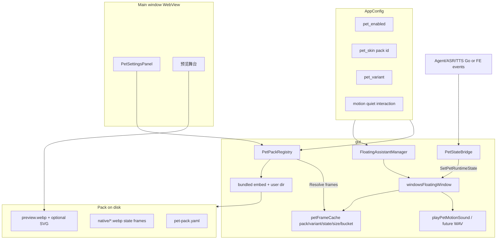
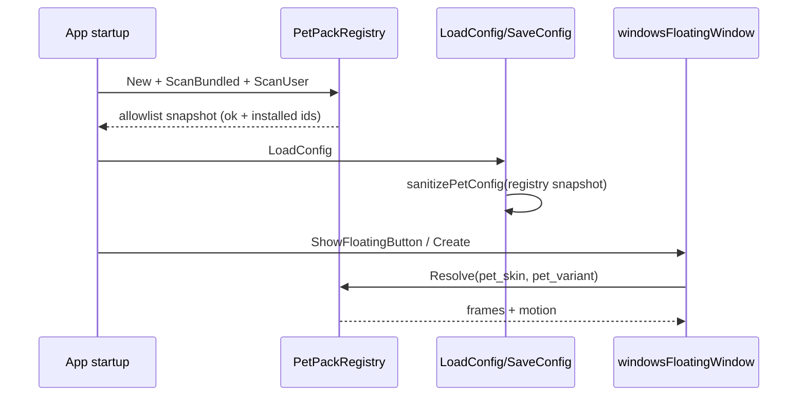

# MaClaw 桌面宠物显示质量升级 + 宠物插件系统设计

| 字段 | 值 |
| --- | --- |
| 文档标题 | MaClaw 桌面宠物显示质量升级 + 宠物插件系统 |
| 作者 | TBD |
| 日期 | 2026-07-21 |
| 状态 | Draft（Rev 3 — 配置默认/音效/reduced-motion 一致性） |
| 相关文档 | `docs/maclaw-pet-system-design.md`, `docs/maclaw-plugin-system-zh.md` |
| 主要代码入口 | **`gui/floating_windows.go`**（Windows 真宠物）、`gui/floating_assistant.go`、`gui/floating_darwin.go` / `floating_linux.go`、`gui/frontend/src/components/PetSettingsPanel.tsx`、`petSkins.ts`、`FloatingButton.tsx`（非 Windows 生产路径）、`corelib/app_config.go`、`corelib/plugin/*` |

---

## Overview

当前 MaClaw 桌面宠物已具备配置、设置页、四皮肤与（Windows 上）原生动画/音效，但：

1. **显示质量**：Windows 真宠物由 **`gui/floating_windows.go` 的过程式光栅绘制**（`renderClawMatePetRaster` → `UpdateLayeredWindow`，~20 FPS）呈现，观感仍偏抽象；前端线稿 SVG 主要服务设置预览，**不是** Windows 上用户看到的桌面宠物。
2. **可扩展性**：皮肤 ID、配色、音高仍硬编码在 Go 过程式绘制与前端 `petSkins.ts` 中，缺少可安装的宠物包（Pet Pack）机制。

本设计以 **Key Decision K0** 为中枢：

> **MVP 呈现面 = 包驱动的 Windows 原生光栅**  
> （PNG/WebP 状态帧装入 `petFrameCache`；`renderClawMatePetRaster` 演进为「优先画包帧 + 过程式回落」）  
> **完整 WebView 伴侣窗（`floating.html` / `FloatingButton.tsx`）延后**，仅作可选未来路径。  
> **macOS/Linux 具象化显式后置**（MVP 不破坏现有 logo 窗，不承诺 figurative 对等）。

同时交付 **Pet Pack** 声明式资源包（专用 `PetPackRegistry`，与能力 `PluginRegistry` 分离），让官方/第三方皮肤无需改过程式绘制主循环即可扩展。

---

## Background & Motivation

### 真实呈现面（已核实，Rev 2 纠正）

| 平台 | 真宠物实现 | 资产形态 | 状态/音效 |
| --- | --- | --- | --- |
| **Windows（主路径）** | `ShowFloatingButton` → `windowsFloatingWindow.Create`（`//go:build windows`）→ 定时器 50ms → `renderFrame` → **`UpdateLayeredWindow`** | **过程式** `renderClawMatePetRaster` + `petFrameCache`；`petEnabled` 时画爪伴，否则 `renderCircularLogo`（embed PNG） | **无** `pet:state` 消费；动画仅 `haloPhase` + `petFacePoseForPhase(interactionMode)`；音效 **`kernel32.Beep`**（`playPetMotionSound`） |
| macOS | `floating_darwin.go`：NSWindow + **embed logo PNG** + halo CABasicAnimation | 非 ClawMate 光栅皮肤管线 | 无 ASR/LLM 态 |
| Linux | `floating_linux.go`：GTK + **embed logo PNG** + cairo | 同上 | 同上 |
| 前端 `FloatingButton.tsx` / `floating.html` / `floating.tsx` | 存在；Vite **单页**（`vite.config.ts` 无 `floating.html` multi-entry）；Windows Create **不加载** WebView | 设置预览主要用 `petSkins.ts` SVG；`PetSettingsPanel` 预览舞台 | `EventsEmit('pet:state')` 仅若该 React 树被挂载才有效 — **当前不驱动 Windows 桌宠** |



### 其他已核实现状

| 层 | 路径 / 符号 | 现状 |
| --- | --- | --- |
| 皮肤目录（前端） | `petSkins.ts` | 硬编码 4 ID；Vite import `maclaw-*.svg`（~2.7–3.7KB，viewBox 240） |
| 设置 UI | `PetSettingsPanel.tsx` | 卡片 + 预览态；`skinDescription` 等仍 per-id switch |
| Go 过程式皮肤 | `renderClawMatePetRaster` switch `mini-claw`/`dev-claw`/`focus-claw` | 配色与几何硬编码 |
| 帧缓存 | `petFrameCacheKey{Size,Skin,Mode,Bucket}`，72 buckets | 避免每 tick 超采样重绘 |
| 配置 | `corelib.AppConfig` `pet_*` | `sanitizePetConfig` **四 ID 白名单**；未知 → `clawmate` |
| 外观刷新 | `floatingAppearanceChanged` | 比较 enabled/skin/size/motion/quiet/interaction — **无 variant** |
| 能力插件 | `corelib/plugin` | mcp/local_mcp/nlskill/native/script；`~/.maclaw/plugins`；**无 pet 类型** |
| reduced-motion | `FloatingButton.css` | **无** pet 相关 `prefers-reduced-motion`；原生窗 **无** OS reduced-motion 钩子 |

### 痛点

1. 用户看到的 Windows 宠物是过程式圆头体块，小尺寸辨识度与「具象伙伴」预期有差距。
2. 前端 SVG 升级**不会**改善 Windows 桌宠（除非改呈现面）。
3. `pet:state` 未进入原生窗，listening/thinking/speaking 仅存在于产品设计与（未接线的）React 路径。
4. 皮肤/音效双轨（Go Beep vs 前端 Web Audio）且均硬编码。
5. Phase 3 皮肤包装载机制未设计；不能把「能力插件」当视觉包用。

### 产品约束

- 浮窗常驻 56–120px（默认 88；原生 `normalizeFloatingNativeSize` 窗尺寸 72–136，含边距）。
- 交互：点击、拖拽、菜单、配置驱动的 motion/quiet 保持。
- 品牌：机械爪工作伙伴，专业克制。
- **MVP 平台**：**Windows figurative 必达**；macOS/Linux 不回归、logo/现行为可接受，figurative 对等后置。

---

## Goals & Non-Goals

### Goals

1. **Windows 真宠物**达到 figurative 可读质量（64/88/120px 金样验收）。
2. 建立 **Pet Pack**（manifest、发现、安装校验、Registry），驱动原生帧与设置预览。
3. 将 **AI/ASR/TTS 运行时态** 桥接到 Windows 原生窗（state → 帧/pose）。
4. 音效：**MVP 原生 Beep**；**用户 `pet_motion_sound_preset` 优先**，pack 仅 pitch/推荐；可选短 WAV 后置。
5. 配置兼容：`pet_skin` 作 pack id；`pet_variant` 全链路 + **K18 无静默 figurative 升级**；sanitize/registry 初始化顺序正确。
6. 可独立合并的 PR 计划，**先打到原生面再做安装 UI 锦上添花**。

### Non-Goals

- MVP 不迁移 Windows 桌宠到 WebView（`floating.html` 保持可选未来）。
- MVP 不做 Live2D / 默认 Lottie / 公开 Marketplace。
- MVP 不把 pet pack 注册进 `PluginRegistry` / 不执行 pack JS。
- MVP 不承诺 macOS/Linux figurative 对等。
- 不重做 ASR/TTS 协议本身。

---

## Key Decision K0 — 呈现面策略（架构中枢）

| 选项 | 说明 | 结论 |
| --- | --- | --- |
| **A. 包驱动原生光栅（Windows）** | 官方/用户包提供 PNG/WebP 状态帧；加载进 `petFrameCache`；无帧时回落现有过程式绘制 | **采纳为 MVP** |
| B. WebView 伴侣窗 | 接线 `floating.html` multi-entry + 真 WebView 浮窗，使 SVG/CSS 路径成为生产 | **延后**（工作量大：CSP、拖拽/分层窗、始终驻留内存） |
| C. 双轨：仅设置预览 figurative | 用户桌宠不变，仅设置页变好看 | **拒绝作为「显示质量升级」主叙事**；预览可并行改善 |

**理由（选 A）：**

- 与现有 `UpdateLayeredWindow` + `petFrameCache` + 20 FPS 管线一致，风险最低。
- 过程式绘制已证明可常驻；光栅帧替换不引入 WebView 进程与 CSP 问题。
- 设置预览仍可用 WebP/SVG（主窗 WebView），与桌宠资产同源或双交付。

**对设计的约束：**

- 「显示质量升级」验收标准 = **Windows 桌面分层窗截图**，不是仅 `PetSettingsPanel`。
- 包 **必须** 携带原生可用光栅（见 A.2）；SVG 可选、主服务设置/未来 WebView。
- 前端 `PetRuntime`/`PetRenderer` **不是** Windows 桌宠主渲染器；可作设置预览与未来表面。

---

## Proposed Design

### 总体架构（Rev 2）



### A. 显示质量升级（锚定原生面）

#### A.1 艺术方向：Figurative Visual Tier

| Tier | 描述 | 交付物 |
| --- | --- | --- |
| `classic` | 今日过程式绘制 / 线稿预览 | 保留为回落与 variant |
| `figurative` | 清晰剪影、面部、2–3 材质分区、软阴影 | **Windows 原生状态帧 + 设置预览** |
| `advanced` | 未来 Rive/WebView | 非 MVP |

造型语言（ClawMate）：圆润壳 + 机械爪/靴 + 信号天线；64px 可辨；专业不幼齿；强调色与现过程式一致（indigo `#6366F1`、slate 眼、爪绿灰）。

#### A.2 资产管线（按表面）

| 表面 | MVP 格式 | 说明 |
| --- | --- | --- |
| **Windows 桌宠** | **PNG 或 WebP 状态帧**（推荐 WebP 透明度） | 每状态至少 1 张；可选 2–4 帧微循环；解码后写入 `petFrameCache` |
| **设置预览 / 主窗** | 同套 WebP **或** 可选 SVG | 通过 ListPetPacks 的 preview URL / 本地路径；**不**依赖 Vite 才能看到新包 |
| 未来 WebView | SVG/Rive | 可选，非 MVP |

**官方包双交付策略：**

```text
gui/pet-packs/clawmate/
  pet-pack.yaml
  preview.webp                 # 256×256 设置卡
  native/
    idle.webp                  # 源 256×256，运行时缩放到窗尺寸
    listening.webp
    thinking.webp
    speaking.webp
    done.webp                  # 可选
    alert.webp                 # 可选
    quiet.webp                 # 可选
  preview_vector/              # 可选 SVG，仅 UI/未来
    base.svg
```

- **单一真源艺术**：设计师出 256（或 512）具象定稿 → 导出 WebP 状态差分；设置预览直接用同一 WebP。
- **不**以「仅 SVG + 运行时 Go 光栅化 SVG」为 MVP 依赖（库体积/模糊/复杂度）；若日后加 `image/svg` 解码可为 advanced。
- 过程式 `renderClawMatePetRaster` **保留为回落**：包缺帧、解码失败、classic variant。

#### A.3 状态 → 视觉映射（拆分两表面）

**表面 1 — Windows 桌宠（目标）**

| 状态 | 来源（目标） | 视觉 | 今日 |
| --- | --- | --- | --- |
| `idle` | 默认 / TTL 结束 | idle 帧 + 轻 pose 或静态 | 仅 phase 动画，无语义态 |
| `listening` | ASR 开始 | listening 帧 / 眼亮 pose | **未接线** |
| `thinking` | Agent/LLM 进行 | thinking 帧 | **未接线** |
| `speaking` | TTS 播放 | speaking 帧 + 嘴部 | **未接线** |
| `done` | 任务终态短时 | done 帧 1.2–1.8s → idle | **未接线** |
| `alert` | 确认/风险 | alert 帧 | **未接线** |
| `quiet` | `pet_quiet_mode` | quiet 帧或降幅 | quiet 降 pose/静音已有部分 |

实现：`windowsFloatingWindow` 增加 `runtimeState PetRuntimeState`；`cachedPetFrame` key 扩展为含 **pack, variant, state**（见 C.5）；优先 `packLoader.Frame(state)`，否则过程式 + `petFacePoseForPhase`。

**表面 2 — 设置预览**

- 继续用 `PetSettingsPanel` 本地 `previewState` 切换四态图片；**不**声称等于桌宠接线完成。

#### A.4 资产规格（原生优先）

| 项 | 规格 |
| --- | --- |
| 原生帧画布 | **256×256**（推荐）或 512；sRGB；透明底 |
| 运行时显示 | 56–120 逻辑宠物区；窗 `size+16` clamp 72–136 |
| 金样验收 | **Windows 分层窗** 截图 @ **64 / 88 / 120** px 宠物区 |
| 单帧体积 | WebP ≤ **40KB**；PNG ≤ 80KB |
| 每皮肤状态 | MVP 至少 idle/listening/thinking/speaking；done/alert/quiet 可选 |
| 整包（四官方 figurative） | 未压缩 ≤ **1.5MB** / 皮肤；zip ≤ 2MB |
| 调色板 | 与现过程式对齐：壳浅、线 `#2D3748`、爪 `#6F7D5C`、强调 `#6366F1`、暖 `#F59E0B` |
| 动画 | 原生仍 ~20 FPS；状态帧可静态 + 轻微整体 scale（现有 `renderFrame` sin），避免每帧解码 |
| 艺术生产（**K13**） | 官方四皮肤：**设计规范 + 程序化/内部出图 pass**（先改进过程式配色几何作 classic 增强，再出 figurative WebP）；不阻塞 Registry 工程 |

#### A.5 无障碍（净新增）

- **不**声称现有 pet CSS 已覆盖 reduced-motion（`FloatingButton.css` 无规则；原生无钩子）。
- **净新增**：
  - 配置项 `pet_reduced_motion`（bool，默认 false）**或**读取 Windows「动画效果」策略（`SPI_GETCLIENTAREAANIMATION` / 注册表）—— MVP 优先 **显式设置开关**（可靠、可测）。
  - 开启后：固定 idle 静态帧、禁用 halo 脉冲与 Beep、`effectiveMotion` 强制 static。
- 高对比：可选 `native/hc/*.webp`；无则加强描边过程式回落。

#### A.6 向后兼容

- 无包或 classic variant → 现有 `renderClawMatePetRaster`。
- `pet_skin` 仍为四官方 id；新包 id 经 registry 放行。
- 一个版本内 **双持** Vite 内 classic SVG 与 embed 包，避免设置预览 404（见 Rollout）。

---

### B. 宠物插件（Pet Pack）系统

#### B.1 与能力插件边界

- **专用 `PetPackRegistry`**（K3）；禁止在 `plugin.yaml` 使用 `type: pet`（校验直接拒绝）。
- 未来「带工具的角色」：**角色包引用** `pet_skin` id + 独立 skill/plugin id，**不共享 Registry**（一句话桥接，非 MVP）。

#### B.2 Manifest Schema（`pet-pack.yaml`）

```yaml
schema_version: 1
id: clawmate                    # ^[a-z][a-z0-9-]{1,63}$
name: ClawMate
version: 1.1.0                  # semver；比较用 Masterminds/semver 或等价
author: MaClaw Official
license: proprietary
description: "Workbench companion"
tier: figurative                # classic | figurative | advanced
min_maclaw_version: "0.0.0"     # 空=不限；Compare(appVer, min) < 0 → unsupported

label:
  en: ClawMate
  zh-Hans: 爪伴
  zh-Hant: 爪伴
description_i18n:
  en: "..."
  zh-Hans: "..."
preview: preview.webp
default_size: 88
tone: balanced                  # enum: balanced | compact | developer | focus
tags: ["official", "default"]

renderer: native-raster         # MVP 主：native-raster | procedural-fallback
# 预留：static-svg | rive | lottie（仅未来 WebView / advanced）

face_overlay: false             # 仅影响设置预览 CSS 假脸；原生忽略

assets:
  preview: preview.webp
  native:
    idle: native/idle.webp
    listening: native/listening.webp
    thinking: native/thinking.webp
    speaking: native/speaking.webp
    # done / alert / quiet 可选
  # optional_vector: 仅 UI
  #   base: preview_vector/base.svg

variants:
  - id: default
    tier: figurative
    assets:
      native: { idle: native/idle.webp, listening: ..., thinking: ..., speaking: ... }
  - id: classic
    tier: classic
    renderer: procedural-fallback   # 使用内置过程式 + 可选预览 SVG
    face_overlay: true

motion:
  idle_ms: 4000
  listening_ms: 1200
  thinking_ms: 1800
  speaking_ms: 950
  amplitude: 0.85               # 0–1
  sound_profile: classic        # enum: classic|bubble|chime|synth|soft
  pitch: 1.0

capabilities:                   # 仅资产存在性提示，不单独驱动逻辑
  supports_done_state: true     # true 仅当 assets.native.done 存在时有意义
  supports_alert_state: true

integrity:
  algorithm: sha256
  files: { "native/idle.webp": "hex..." }
```

**Go 结构草图：**

```go
type PetPackManifest struct {
    SchemaVersion     int               `yaml:"schema_version" json:"schema_version"`
    ID                string            `yaml:"id" json:"id"`
    Name              string            `yaml:"name" json:"name"`
    Version           string            `yaml:"version" json:"version"`
    Author            string            `yaml:"author" json:"author"`
    Tier              string            `yaml:"tier" json:"tier"`
    MinMaclawVersion  string            `yaml:"min_maclaw_version" json:"min_maclaw_version"`
    Label             map[string]string `yaml:"label" json:"label"`
    DescriptionI18n   map[string]string `yaml:"description_i18n" json:"description_i18n"`
    Preview           string            `yaml:"preview" json:"preview"`
    DefaultSize       int               `yaml:"default_size" json:"default_size"`
    Tone              string            `yaml:"tone" json:"tone"`
    Renderer          string            `yaml:"renderer" json:"renderer"`
    FaceOverlay       bool              `yaml:"face_overlay" json:"face_overlay"`
    Assets            PetPackAssets     `yaml:"assets" json:"assets"`
    Variants          []PetPackVariant  `yaml:"variants" json:"variants"`
    Motion            PetPackMotion     `yaml:"motion" json:"motion"`
    Capabilities      PetPackCaps       `yaml:"capabilities" json:"capabilities"`
    Integrity         *PetPackIntegrity `yaml:"integrity" json:"integrity"`
    // runtime:
    Dir   string `yaml:"-" json:"dir"`
    Scope string `yaml:"-" json:"scope"` // bundled | user
}

type PetPackMotion struct {
    IdleMs        int     `yaml:"idle_ms" json:"idle_ms"`
    ListeningMs   int     `yaml:"listening_ms" json:"listening_ms"`
    ThinkingMs    int     `yaml:"thinking_ms" json:"thinking_ms"`
    SpeakingMs    int     `yaml:"speaking_ms" json:"speaking_ms"`
    Amplitude     float64 `yaml:"amplitude" json:"amplitude"`
    SoundProfile  string  `yaml:"sound_profile" json:"sound_profile"` // classic|bubble|chime|synth|soft
    Pitch         float64 `yaml:"pitch" json:"pitch"`
}
```

`min_maclaw_version`：使用 semver 比较；解析失败视为不限制；app 版本低于 min → `status=unsupported`，不可设为 active。

`capabilities.*`：**仅 UI/校验提示**（缺 done 帧则忽略 done 请求并回落 idle）；不单独成为状态机输入。

#### B.3 发现路径与 **bundled embed 策略**

| 优先级 | 路径 | Scope |
| --- | --- | --- |
| 1 | `{MaclawBaseDir}/pet-packs/<id>/` | user |
| 2 | **go:embed** `gui/petpack/bundled/...` 映射的只读虚拟树 | bundled |

**构建 / 运行契约（K14）：**

```go
// gui/petpack/embed.go
//go:embed all:bundled
var bundledFS embed.FS // bundled/clawmate/pet-pack.yaml, native/*.webp, ...
```

| 模式 | 行为 |
| --- | --- |
| 生产 | Registry 直接 `embed.FS` 读 bundled；**或**首次启动解压到 `{MaclawBaseDir}/pet-packs-bundled-cache/`（若需真实路径给部分解码器）—— **推荐直接 embed 读 + `image.Decode`**，避免解压漂移 |
| `wails dev` | 同 embed（随编译刷新）；额外可选 env `MACLAW_PET_PACKS_DIR` 覆盖 user 扫描根，便于本地换包 |
| 用户包 | 仅真实文件系统 `{MaclawBaseDir}/pet-packs` |

**不**扫描 `plugins/`。project 级默认关闭。

前端 classic SVG：`petSkins.ts` Vite import 作为 **`builtinFallback` 预览**，与 embed 包 **双持至少一个发布周期**。

#### B.4 生命周期与 **sanitize / 初始化顺序**



**规则（规范文本）：**

1. **Registry 在首次 `sanitizePetConfig` 之前完成至少一次扫描**（`App` 初始化或 `LoadConfig` 入口懒加载 `sync.Once` 扫描）。
2. **Allowlist（SaveConfig 保留用）** 包含：
   - 所有 `status=ok` 的 pack id；以及
   - 目录仍存在、manifest 可解析且 id 合法、但 `status=invalid`（例如缺帧、完整性失败）的 **已安装** pack id。  
   **行为：** 用户当前 `pet_skin` 若在 allowlist 内，**不得**在 SaveConfig 时被抹成 `clawmate`。若 active 包为 `invalid`：运行时回落过程式 / clawmate 帧，设置页展示错误，id 仍保留直至用户更换或卸载。  
   **完全未知**（不在 registry、磁盘无目录）的 id → `clawmate`。
3. **Registry 未就绪**（极端竞态）：sanitize **不得**把「非四官方内置 id」的字符串抹掉；记录 `pendingSanitize`，扫描完成后若仍未知再回落。必测：
   - 已安装第三方 id 在多次 SaveConfig 后保留  
   - 未知 id → clawmate  
   - registry 未就绪不摧毁 user pack id  
4. 安装 zip：原子写入 user 目录 → 刷新 snapshot → emit `pet:packs-changed`。  
5. 卸载：不可卸最后 bundled 回落；卸当前 active → `pet_skin=clawmate`、`pet_variant` 按迁移规则重写（见 B.7）。

#### B.5 安全附录（具体常量）

| 常量 | 值 |
| --- | --- |
| 单 zip 内最大文件数 | **64** |
| 单文件最大 | **512 KiB** |
| 未压缩合计最大 | **2 MiB** |
| 压缩比上限（uncomp/comp） | **12:1**（zip bomb） |
| 单路径最大长度 | **180** 字符 |
| 并发安装 | **1**（互斥锁） |
| 允许扩展名（第三方 v1） | `.webp`, `.png`, `.yaml`, `.yml`, `.json`, `.txt`, `.md`；**可选** `.svg` 仅当通过 SVG 扫描 |
| 禁止扩展名 | `.js`, `.mjs`, `.cjs`, `.wasm`, `.exe`, `.dll`, `.so`, `.dylib`, `.bat`, `.cmd`, `.ps1`, `.html`, `.htm` |

**路径 / 符号链接：**

- Zip 内路径必须相对、`Clean` 后不以 `..` 逃逸；拒绝绝对路径。
- 用户 `pet-packs` 扫描与 Asset 服务：**不跟随 symlink / reparse point**（`os.Lstat`，ModeSymlink 跳过；Windows 可额外拒绝 reparse）。
- 解压目标不得覆盖 registry 外路径。

**SVG deny-list（若允许 SVG）：**

- `<script`, 事件属性 `on*`，`javascript:`  
- 外部 `http:`, `https:`, `//` 的 `href` / `xlink:href` / `src`  
- `foreignObject`  
- 实体扩展风险：禁止 `<!ENTITY` / DOCTYPE 子集  
- CSS `url(` 非 `data:`  
- SMIL 事件 `begin="...click"` 等交互 handler（MVP 可整段禁用 `<animate` 若过严则仅禁 event）

**第三方 v1 推荐：仅光栅**（WebP/PNG）；SVG 限官方 bundled。

**完整性：** 安装时计算并写入 `integrity.files`（若缺失则生成）；加载可选校验；失败 → invalid。

**AssetServer（主窗预览，非桌宠主路径）：**

```text
GET /pet-pack-assets/{id}/...rel
  1. id ∈ registry
  2. root := pack.Dir 或 embed 虚拟根
  3. full := safeJoin(root, rel)  // 拒绝 .. 与 symlink
  4. Content-Type by ext; Cache-Control: no-store（与现 middleware 一致可接受）
```

若未来 WebView 桌宠：CSP 必须收紧为 `default-src 'self'; img-src 'self' data:; script-src 'self';`（**禁止** 现 `floating.html` 的 unsafe-eval 用于生产）。

#### B.6 运行时加载（原生主，前端辅）

**Go（主）：**

| 模块 | 职责 |
| --- | --- |
| `gui/petpack/registry.go` | 扫描、allowlist、Resolve |
| `gui/petpack/manifest.go` | YAML + validate |
| `gui/petpack/install.go` | zip 安全安装 |
| `gui/petpack/frames.go` | 解码 WebP/PNG → `*image.NRGBA`，按 size 缩放缓存 |
| `gui/floating_windows.go` | `cachedPetFrame` 优先 pack 帧；过程式回落 |
| `gui/pet_state_bridge.go` | 运行时态 → 浮窗 |

**前端（辅 — 设置预览）：**

| 模块 | 职责 |
| --- | --- |
| `pet/PetPackLoader.ts` | ListPetPacks / preview URL |
| `PetSettingsPanel` | 包网格、导入 zip、variant、i18n 来自 manifest |
| `petSkins.ts` | 兼容 facade + builtinFallback SVG |

**不**把 `FloatingButton.tsx` 描述为 Windows 生产渲染器。

#### B.7 配置、`pet_variant` 迁移与全链路（与 **K18** 一致）

| 字段 | 变更 |
| --- | --- |
| `pet_skin` | 保留 = pack id |
| `pet_variant` | **新增** `string`，`json:"pet_variant,omitempty"`；合法值含 `classic` / `default`（figurative）/ 包声明的其它 variant id |
| `pet_figurative_upgrade_prompt_pending` | **可选 bool**；升级提示用，接受后清 false |
| `pet_reduced_motion` | **新增** bool，默认 false（见 A.5 / 下方刷新清单） |

##### Resolve 规则（运行时选帧）

```text
ResolveVariant(cfg, pack):
  if cfg.PetVariant != "" && pack has that variant id:
    return cfg.PetVariant
  if cfg.PetVariant != "" && pack missing that id:
    // illegal — fall through after sanitize would have cleared/fixed
    return classic_or_procedural_fallback
  // PetVariant empty: MUST NOT auto-pick pack "default" (figurative) for legacy users.
  // After migration (below), empty should be rare; if still empty, treat as classic.
  return "classic"   // or procedural-fallback when no classic assets
```

**禁止：** 将「配置里缺少 `pet_variant` 字段」与「新用户选择 pack 的 default/figurative」等同处理。

##### 迁移算法（PR-C 引入 figurative 双 variant 时，**K18**）

在 **LoadConfig / 首次 SaveConfig after figurative ship** 执行一次（可配合 config schema 版本或 `pet_variant_migrated` 内部标记）：

| 用户类型 | 判定 | 写入 |
| --- | --- | --- |
| **既有安装** | 配置文件在升级前已存在（或历史上曾持久化过任意 `pet_*` / 完整 config），且 `pet_variant` 缺省或 `""` | **强制写入 `pet_variant=classic`**；可选 `pet_figurative_upgrade_prompt_pending=true` 以在设置页展示「升级外观」 |
| **全新安装** | 无既有 config（首次创建默认配置） | 写入 `pet_variant=default`（figurative，若 pack 提供；否则 classic） |
| **用户显式选择** | `pet_variant` 已为非空合法值 | 不改写；接受升级提示时写 `default` 并清 prompt 标志 |

**单测（必做）：**

- 仅含 `pet_skin=clawmate`、无 `pet_variant` 的预 R2 配置 → 迁移后 `pet_variant=classic`，桌宠仍 classic/过程式帧，**不**静默 figurative。  
- 全新默认配置 → `pet_variant=default`（figurative 可用时）。  
- 用户接受升级 → `pet_variant=default`，`prompt_pending=false`，appearance refresh。

##### 必须同步修改的字段清单

**`pet_variant`：**

1. `corelib.AppConfig.PetVariant`  
2. `app.go` `PatchConfigFields` case `"pet_variant"` + `petChanged`  
3. `sanitizePetConfig`：非法 variant → 按迁移/回落规则写成 `classic` 或 pack 内合法 id（**不要**静默写成 figurative default）  
4. **`floatingAppearanceChanged`：加入 `PetVariant` 比较**  
5. 前端预览配置相等性（若使用）  
6. Wails 模型再生  
7. 测试：variant 变更触发 appearance changed  

**`pet_reduced_motion`（K19 / Issue 3）：**

1. `corelib.AppConfig.PetReducedMotion`（bool，json `pet_reduced_motion`）  
2. `PatchConfigFields` case `"pet_reduced_motion"`  
3. **优先** `floatingAppearanceChanged` 包含该字段（与 motion/quiet 同类，触发 `RefreshAppearance` **或** 更轻量的内存更新）  
4. **推荐** 增加 `floatingWindow.UpdateMotionConfig(reducedMotion, motionEnabled, quiet, interactionMode)`（类比 `UpdateSoundConfig`），避免仅为减动画而整窗 Destroy/Create；若实现成本高，MVP 可仅走 `floatingAppearanceChanged`  
5. Create 时读入 window 字段；`renderFrame` / Beep 路径读取最新值  
6. 测试：运行中切换 reduced-motion → 停止 halo 脉冲与 Beep，无需重启进程  

**`pet_motion_sound_preset`：** 已存在；PR-F 保持设置 UI 与 `floatingSoundChanged` 路径；见 C.2 与用户预设优先规则。

---

### C. 状态桥接、音效、Motion 优先级

#### C.1 PetStateBridge（**K11**）

```text
来源 A（推荐 MVP）：Go 侧已有任务/ASR/TTS 钩子处直接调用
  FloatingAssistantManager.SetPetRuntimeState(state, source, ttl)
来源 B：主窗前端 EventsEmit('pet:state') → 已有 Wails 事件
  → App 订阅并转发到 Manager（镜像，避免仅 React 消费）

windowsFloatingWindow:
  atomic/mutex runtimeState
  TTL timer → idle（与 FE ttlMs 对齐）
  renderFrame / cachedPetFrame 读取 state 选帧
```

**done / alert 发射源（K15）：**

- **`done`**：`useAIAssistant`（及对等 Go agent 完成路径）在任务 **terminal success** 时 emit；TTL 1.2–1.8s。  
- **`alert`**：需用户确认/风险提示的现有 UI 入口（权限、危险工具）emit；无则暂不发。  
- 原生桥 **镜像** 同一事件，不单独发明第二套语义。

#### C.2 音效双后端（**K12**）与 **用户预设 vs pack profile 优先级（K21）**

| 后端 | 位置 | MVP |
| --- | --- | --- |
| **Native Beep** | `playPetMotionSound` + `kernel32.Beep` | **Windows 桌宠唯一生效 SFX**；tone 表键 = 下方 `effectiveSoundProfile` 结果；**pitch** 见下 |
| Web Audio | `FloatingButton` / 设置预览按钮 | 仅预览或未来 WebView；**不**声称驱动桌宠 |
| pack `sounds/*.wav` | 可选 | **延期**；若做则 Go 短 PCM 播放，不经 Web Audio |

##### `effectiveSoundProfile`（规范）

```text
// userPreset = sanitize 后的 pet_motion_sound_preset ∈ {classic,bubble,chime,synth,soft}
// packProfile = pack.motion.sound_profile（同枚举；缺省 classic）
// packPitch   = pack.motion.pitch（缺省 1.0）

effectiveSoundProfile(userPreset, packMotion) → { profile, pitch }

1. profile = userPreset
   // 用户配置始终胜出：设置里选了 chime，则无论 pack 写 soft 都播 chime 表。
2. pitch = packMotion.pitch   // 包提供音色音高微调；无则 1.0
   // 另乘 interactionMode==active 时的既有 1.12（与今日 playPetMotionSound 一致）
3. pack.motion.sound_profile 的用途（MVP）：
   a. 设置页「推荐音效」展示 / 包详情文案；
   b. **可选** 在用户「切换 pet_skin 且当前 preset 仍为出厂 classic、且用户从未显式改过 preset」
      时 one-shot 提示「使用该宠物推荐音效？」——默认 **不自动写入** user config（避免偷改）。
   c. **不**在每次 render/Beep 时覆盖 userPreset。
4. 删除 per-skin tone 硬编码后：tone 表只按 profile 选取；skin 差异仅通过 pack pitch
   （及用户 preset）表达。
```

**必测：**

- `pet_motion_sound_preset=chime` + pack `sound_profile=soft` → Beep 使用 **chime** 表，pitch 用 pack。  
- 用户从未改 preset（classic）+ pack `bubble` → 仍播 **classic**，除非用户在 UI 接受推荐。  
- PR-F 文件清单包含 `pet_motion_sound_preset` 设置项与 `floatingSoundChanged` / `UpdateSoundConfig` 回归。

#### C.3 `effectiveMotion` 纯函数（**K16**）

```text
effectiveMotion(packMotion, interactionMode, quietMode, reducedMotion, runtimeState) →
  { durations, amplitude, soundAllowed, useStaticFrame }

1. base ← packMotion (缺省用内置表)
2. if reducedMotion OR quietMode:
     amplitude = 0
     soundAllowed = false
     useStaticFrame = true
     durations = max(base, slow caps)  // 或忽略动画 tick 进阶
3. else if interactionMode == "active":
     durations *= ~0.72
     amplitude = min(1, base.amplitude * 1.25)
     soundAllowed = motionSoundEnabled && !quiet
4. else if interactionMode == "quiet":  // 非 DND 的 quiet 交互风
     durations *= ~1.5
     amplitude *= 0.45
5. else balanced: base
6. quietMode（DND）始终覆盖 pack amplitude 与 sound（已有 isMotionSoundAllowed 精神）
7. runtimeState 只选帧，不反向改 interactionMode
8. sound **profile** 不由本函数决定 → 见 effectiveSoundProfile（C.2）
```

**`pet_reduced_motion` 热更新：** 必须进入 live window（B.7 清单）；`effectiveMotion(..., reducedMotion=true)` 在下一 `renderFrame` 生效。

前端若有预览动画，复用同一文档化公式，避免两套语义。

#### C.4 帧缓存与切换（防 thrash）

扩展 key：

```go
type petFrameCacheKey struct {
    Size, Bucket int
    Pack, Variant, State, Mode string
}
```

- 包帧：按 state 取图，**可选** 对 idle 做 1–2 桶微位移；避免 `key=skin+state+burst` 式强制重建。  
- 预解码：Resolve 时预载四态到内存；resize 缓存 per size。  
- 过程式路径保留 72-bucket pose 缓存。

#### C.5 设置 UI 标签解耦

- `PetSettingsPanel` 删除 `skinDescription(id)` / `skinToneLabel` 硬编码 switch；改读 `label` / `description_i18n` / `tone`。  
- 列在 PR-D 文件清单。

#### C.6 平台范围（**K17**）

| 平台 | MVP | 后续 |
| --- | --- | --- |
| Windows | figurative 包帧 + 状态桥 + Beep（用户 preset 优先） | WAV、更多状态 |
| macOS | 保持 logo PNG 浮窗；不破坏 Create/Show | 独立 PR：共享 `petpack/frames` 填 NSImageView |
| Linux | 同上 GTK | 独立 PR：cairo 贴帧 |

---

## API / Interface Changes

### 配置

```json
{
  "pet_enabled": true,
  "pet_skin": "clawmate",
  "pet_variant": "classic",
  "pet_figurative_upgrade_prompt_pending": true,
  "pet_size": 88,
  "pet_motion_sound_preset": "chime",
  "pet_reduced_motion": false
}
```

说明：上例为**既有用户迁移后**形态（`classic` + 可选升级提示）。全新安装的 `pet_variant` 为 `default`（figurative），且无 prompt。播放音效用 `pet_motion_sound_preset`（用户优先，见 K21），与 pack `motion.sound_profile` 独立。

### Go API

```go
func (a *App) ListPetPacks() ([]PetPackInfo, error)
func (a *App) GetPetPack(id string) (PetPackDetail, error)
func (a *App) InstallPetPackZip(zipPath string) (PetPackInfo, error)
func (a *App) UninstallPetPack(id string) error
func (a *App) RefreshPetPacks() ([]PetPackInfo, error)
func (a *App) SetPetRuntimeState(state string, source string, ttlMs int) // 供 FE 转发
// Manager / window:
func (m *FloatingAssistantManager) SetPetRuntimeState(...)
```

### 事件

- `pet:state`：主窗 FE →（桥）→ 原生窗；字段 `{ state, source?, ttlMs? }`。  
- `pet:packs-changed`：安装卸载后刷新设置列表。

---

## Data Model Changes

| 存储 | 变更 |
| --- | --- |
| `config.json` | `pet_variant`, `pet_figurative_upgrade_prompt_pending`（可选）, `pet_reduced_motion` |
| embed FS | `gui/petpack/bundled/<id>/` |
| user FS | `{MaclawBaseDir}/pet-packs/<id>/` |

---

## Alternatives Considered

### 1. 仅重绘 / 仅改进过程式几何配色

- 优点：无包系统。  
- 缺点：扩展性零。  
- **可作 classic 增强子集**，不能替代 pack。

### 2. `type: pet` 并入 PluginRegistry

- 否决：Tool/Hook 生命周期与安全模型不匹配；并 **forbid** 该 type。

### 3. MVP 上 Rive / Live2D

- 否决默认；advanced 预留。

### 4. Inline SVG / `<object>` 驱动

- 对第三方 XSS 面大；原生路径也不需要。

### 5. 废弃 `pet_skin` 换 `pet_pack_id`

- 否决；保留 `pet_skin` 降迁移成本。

### 6. **WebView 伴侣窗作为 MVP 生产桌宠**（新增）

- 优点：与前端 SVG/CSS 设计一致、易做状态表情。  
- 缺点：需 multi-entry 构建、真 WebView 浮窗、CSP（现 floating.html unsafe-eval 不可用）、拖拽/透明/always-on-top 与现 Win32 分层窗对等、内存常驻更高；**且 mac/linux 又是另一套**。  
- **结论：延后**；作为 Phase 后选项，不阻塞 figurative。

### 7. **包驱动原生光栅**（新增，**采纳**）

- 优点：命中真路径、复用 `petFrameCache`/`UpdateLayeredWindow`、安全（数据帧）。  
- 缺点：艺术需出多状态位图；微动画不如矢量图层灵活。  
- **结论：MVP 主路径**。

### 8. 仅设置预览 figurative

- 否决作为主交付叙事。

---

## Security & Privacy Considerations

见 **B.5**。摘要：声明式数据、zip 限额、无 symlink、第三方偏光栅、AssetServer safeJoin、无 pack 代码执行、安装展示 author/大小。

---

## Observability

- `[pet-pack] loaded/reject/install` 日志  
- `[pet-state] bridge state=...`  
- 设置页 invalid 包错误  
- 回落过程式时 Warn  

---

## Rollout Plan

1. **R0**：Registry + embed classic 元数据 + sanitize 顺序（桌宠外观可不变）。  
2. **R1**：原生装载包帧 + 过程式回落；外观仍可 classic。  
3. **R2**：官方 figurative WebP + variant；**Windows 金样**；既有用户迁移写 `pet_variant=classic` + **升级提示**（**禁止**空 variant → figurative 静默升级，见 B.7 / K18）。  
4. **R3**：状态桥 + listening/thinking/speaking。  
5. **R4**：zip 安装 UI；Beep 完全 profile 映射。  
6. **R5**：macOS/Linux 贴帧 PR（可选）。  

**回滚：**

- `pet_variant=classic` 或缺帧 → 过程式。  
- 一版本内 **双持** Vite SVG + embed 包。  
- feature flag `pet_native_pack_frames=false` 强制过程式。  
- 二进制回滚时，user 目录多余包无害。

---

## Risks

| 风险 | 严重度 | 缓解 |
| --- | --- | --- |
| 误把前端当生产面继续开发 | 高 | K0；PR 验收截图必须 Win 分层窗 |
| 状态桥遗漏导致「有包无表情」 | 高 | PR-E 独立；测试模拟 SetPetRuntimeState |
| 大图每 tick 解码 | 中 | 预解码 + cache key |
| sanitize 抹掉第三方 id | 中 | 初始化顺序 + 测试 |
| 艺术产能不足 | 中 | K13 程序化+设计 pass；classic 过程式增强垫档 |
| 平台观感分裂 | 低 | K17 明示 MVP 范围 |

---

## Open Questions（剩余）

| ID | 问题 | 状态 |
| --- | --- | --- |
| Q2 | 是否允许 project 级 pet-packs？ | 默认 **关闭**；需产品点头再开 |
| Q4 | 官方包 ed25519 签名？ | 市场前 **不做** |
| Q6 | TUI `petpack` 命令？ | 非 MVP |

已决议（见 Key Decisions）：Q1、Q3、Q5、呈现面、音效、平台范围。

---

## References

- `gui/floating_windows.go` — `renderClawMatePetRaster`, `cachedPetFrame`, `playPetMotionSound`, `UpdateLayeredWindow`  
- `gui/floating_window.go` — `floatingWindow` 接口  
- `gui/floating_darwin.go`, `gui/floating_linux.go` — logo PNG 浮窗  
- `gui/floating_assistant.go` — `sanitizePetConfig`, `floatingAppearanceChanged`  
- `gui/frontend/src/components/FloatingButton.tsx` — 非 Win 生产路径；Web Audio  
- `gui/frontend/floating.html`, `vite.config.ts` — 未 multi-entry  
- `docs/maclaw-pet-system-design.md`, `docs/maclaw-plugin-system-zh.md`  
- `corelib/plugin/types.go`, `discovery.go`  

---

## Key Decisions

| # | 决策 | 理由 |
| --- | --- | --- |
| **K0** | **MVP 呈现面 = Windows 包驱动原生光栅**；WebView 桌宠延后 | 命中真路径 `UpdateLayeredWindow`；避免未接线 WebView 工程 |
| **K1** | figurative 目标层级；classic/过程式回落 | 可感知升级 + 安全回退 |
| **K2** | MVP 资产 = **WebP/PNG 状态帧**；SVG 可选 UI；Rive/Lottie 非默认 | 原生可解码、可控体积 |
| **K3** | 专用 `PetPackRegistry`；**forbid** `type: pet` 于能力插件 | 数据 vs 工具分离 |
| **K4** | 声明式 pack；v1 无 JS；第三方偏光栅 | XSS/供应链 |
| **K5** | 保留 `pet_skin`；新增 `pet_variant` **全链路** | 迁移与双 tier |
| **K6** | 桌宠加载 = **Go 读 embed/FS 解码**；AssetServer/`` 仅主窗预览 | 纠正「桌宠靠 AssetServer img」 |
| **K7** | 发现：user `pet-packs` + **go:embed bundled** | 可复现构建 |
| **K8** | 过程式绘制保留回落；motion/sound 参数进 manifest 并由 Go 消费 | 扩展不改主循环结构 |
| **K9** | zip 本地安装 MVP；市场后置 | 无服务端 |
| **K10** | `face_overlay` 仅设置预览 | 原生无 CSS 假脸 |
| **K11** | **PetStateBridge**：FE/Go 事件 → `FloatingAssistantManager` → 原生窗 | 否则状态映射无效 |
| **K12** | **Windows SFX = Beep**；tone 表按 **用户** `pet_motion_sound_preset`；pack 仅提供 pitch + 推荐文案（见 K21） | 对齐 `playPetMotionSound` 且不覆盖用户设置 |
| **K13** | 官方艺术：设计规范 + 内部/程序化出图 pass | 关闭原 Q3 阻塞 |
| **K14** | bundled = `//go:embed`；dev 可 env 覆盖 user 根 | 关闭打包空洞 |
| **K15** | done/alert 由 assistant 终态/风险入口 emit；原生镜像 | 关闭原 Q5 |
| **K16** | `effectiveMotion(...)` 纯函数；quiet/reduced 覆盖 pack | 行为一致 |
| **K17** | MVP figurative **仅 Windows 必达**；darwin/linux 后置 PR | 诚实范围 |
| **K18** | **禁止静默 figurative 升级**：既有 config 空 `pet_variant` → 迁移写 **`classic`** + 可选升级提示；**仅全新安装** 默认 `default`（figurative）；Resolve 空 variant 当 classic，**不**映射 pack default | 与 B.7 迁移算法一致 |
| **K19** | reduced-motion = **净新增**；经 PatchConfig + appearance/UpdateMotionConfig **热更新** live 窗 | 纠正错误现状；避免重启才生效 |
| **K20** | Registry 先于 sanitize；未就绪不抹 user id | 第三方 id 存活 |
| **K21** | **`effectiveSoundProfile`：用户 `pet_motion_sound_preset` 始终优先**；pack `sound_profile` 不作播放覆盖；pitch 用 pack | 关闭 preset vs profile 歧义 |

---

## PR Plan

验收原则：**涉及「显示质量」的 PR 必须以 Windows 分层窗截图/测试为准**；纯设置预览 PR 必须在标题/描述标明 scope。

### PR-A: PetPackRegistry + sanitize 初始化顺序

- **标题**：`feat(pet): PetPackRegistry, embed bundled manifests, safe sanitize allowlist`
- **影响**：`gui/petpack/*`（manifest/registry/embed）、`floating_assistant.go` sanitize、`app` 启动 Once 扫描、单测（第三方 id 保留 / 未知回落 / 未就绪不摧毁）
- **依赖**：无
- **说明**：可仍无可见 figurative；过程式外观不变。classic 四 id 登记为 bundled（可先无 WebP，renderer procedural-fallback）。

### PR-B: 包帧装入原生 `petFrameCache`

- **标题**：`feat(pet): load pack native frames into windowsFloatingWindow`
- **影响**：`petpack/frames.go`、`floating_windows.go`（`cachedPetFrame` key 扩展、优先 blit 包帧）、Create 时 Resolve skin/variant、回落过程式
- **依赖**：PR-A
- **说明**：**Windows 真路径**首次可换肤到包帧；提供 1 套占位 WebP 或继续过程式直到 PR-C。

### PR-C: 官方 figurative 光栅资产（Windows 金样）

- **标题**：`feat(pet): figurative WebP assets for official skins (Windows native)`
- **影响**：`gui/petpack/bundled/*/native/*.webp`、manifest variants、`pet_variant` 配置全链路（AppConfig、PatchConfigFields、`floatingAppearanceChanged`、测试）、**B.7 迁移**（既有→`classic`、新装→`default`、`pet_figurative_upgrade_prompt_pending`）、设置页 variant + 升级提示
- **依赖**：PR-B
- **说明**：用户可感知桌宠画质；**K18 无静默升级**——单测预 R2 配置保持 classic；金样 64/88/120。

### PR-D: 设置页包列表 + zip 安装/卸载 + 文案解耦

- **标题**：`feat(pet): settings pack browser, zip install, manifest i18n labels`
- **影响**：`install.go`+安全常量、Wails API、AssetServer 预览路由、`PetSettingsPanel`（去 per-id switch）、`petSkins` facade
- **依赖**：PR-A（B/C 并行可，预览图更完整需 C）
- **说明**：标明 **不单独等于桌宠升级**；与 PR-C 可叠。

### PR-E: PetStateBridge（listening/thinking/speaking/done）

- **标题**：`feat(pet): bridge pet runtime state to native floating window`
- **影响**：`pet_state_bridge.go`、`FloatingAssistantManager.SetPetRuntimeState`、App 订阅/导出、`useAIAssistant`/`useVoiceInput` 转发、窗 `runtimeState`+TTL、选帧
- **依赖**：PR-B（有帧或过程式 pose 增强）
- **说明**：关闭「有动画无语义态」缺口。

### PR-F: motion/sound 声明化（Go）+ reduced-motion 开关

- **标题**：`feat(pet): effectiveMotion; effectiveSoundProfile; reduced-motion live update`
- **影响**：
  - `playPetMotionSound`：按 **`effectiveSoundProfile(userPreset, pack)`** 选 tone 表 + pack pitch；删 per-skin 硬编码分支
  - `pet_motion_sound_preset` 设置 UI / `floatingSoundChanged` / `UpdateSoundConfig` 回归
  - `effectiveMotion` 公式与单测
  - `pet_reduced_motion`：AppConfig、PatchConfigFields、`floatingAppearanceChanged` **或** `UpdateMotionConfig`、live 窗停 halo/Beep 测试
- **依赖**：PR-B；E 可并行
- **说明**：用户 preset **永不**被 pack `sound_profile` 覆盖（K21）；Web Audio 仅预览。

### PR-G（可选后置）: macOS/Linux 包帧贴图

- **标题**：`feat(pet): apply pack frames on darwin/linux floating windows`
- **影响**：`floating_darwin.go`、`floating_linux.go`、共享 frames API
- **依赖**：PR-B/C
- **说明**：平台对等。

### PR-H（可选远期）: WebView 伴侣窗实验

- **标题**：`experiment(pet): optional WebView floating companion`
- **依赖**：CSP 收紧、vite multi-entry、K0 再评估
- **说明**：**非** figurative MVP 前置。

### 合并节奏

```text
PR-A → PR-B → PR-C → 用户可见 Windows 画质
              ↘ PR-E → 语义态
              ↘ PR-F → 音效/motion
         PR-D（设置/zip）可与 C 并行
         PR-G / PR-H 后置
```
