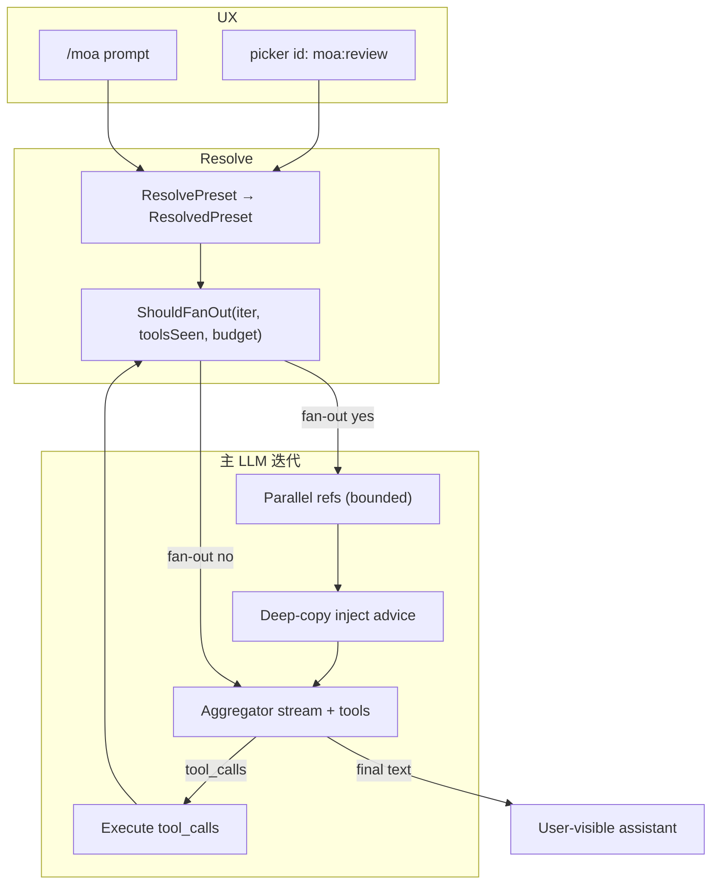
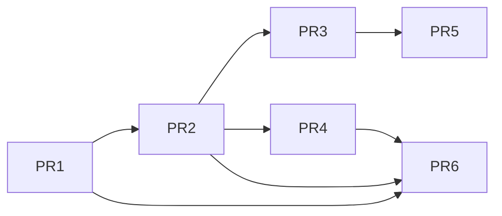

# MaClaw Mixture of Agents（MoA）技术设计

| 字段 | 值 |
| --- | --- |
| 文档标题 | MaClaw / aicoder — Mixture of Agents（Hermes 启发）设计 |
| 作者 | （待填） |
| 日期 | 2026-07-13 |
| 状态 | Draft（评审修订稿；可入库 docs，作者字段合入前补齐） |
| 项目 | MaClaw / aicoder（CodeClaw monorepo） |
| 建议入库路径 | `docs/moa-mixture-of-agents-design-zh.md` |
| 参考 | [Hermes Mixture of Agents](https://hermes-agent.nousresearch.com/docs/user-guide/features/mixture-of-agents)（外部文档） |
| 修订 | 2026-07-13：review 闭合 + K21 仅 max tokens；产品拍板 Q2/Q3 → K22/K23 |

---

## Overview

Hermes Agent 的 **Mixture of Agents（MoA）** 把「多模型并行参谋 + 单模型带工具聚合」包装成**可选虚拟模型**：用户选中一个 MoA preset 后，主 agent-loop 在**限定次数**的 LLM 调用前先 fan-out 到若干 **reference models（参谋，无工具）**，再把参谋意见作为**私有上下文**注入 **aggregator（行动模型，全量 system prompt + tools）**，由 aggregator 产出真正的 assistant 回复与 tool calls。

MaClaw **不 1:1 移植 Hermes「每轮工具迭代都全量 MoA」**。默认策略为：

- **仅在 fan-out 预算内**（默认 `fanout_max_iterations=1`，且默认 `only_before_first_tool=true`）跑 reference；
- 后续工具迭代 **aggregator-only**，避免 20 轮工具 × (3+1) 次 LLM 的费用/时延爆炸。

集成方式：

1. 配置层：`AppConfig.moa` 命名 preset，引用现有 provider / `ModelRoutes` / primary·aux，**不硬编码**前沿模型。
2. 执行层：`corelib/agent.RunLoop` **loop 自持编排**（`doMoAOrLLMRequest` + `moa.Runner`）；宿主只提供 selection + 已解析 preset。
3. 产品层：虚拟模型选择项 `moa:<preset>` + `/moa` one-shot + Turn chip。

---

## Background & Motivation

### Hermes MoA 机制摘要（外部事实源）

| 要素 | 行为 |
| --- | --- |
| 形态 | 虚拟 provider `moa` 下的命名 preset |
| reference | 并行、**无 tools / 无完整 system prompt**，仅对话 user/assistant 文本 |
| aggregator | 读参谋私有上下文；**全 tools + system**；写最终回复与 tool_calls |
| 循环 | Hermes：每轮主模型调用均 fan-out（**MaClaw 默认收紧，见 K11**） |
| UX | `/model <preset> --provider moa`；`/moa <prompt>` 单次后恢复 |
| 缓存 | 参谋意见追加在**最新 user turn 尾部**，保护 prefix cache |
| 约束 | 禁止递归 MoA；单参谋失败不中止；成本 = N reference + 1 aggregator / 有 fan-out 的迭代 |
| 调优 | `reference_max_tokens` 压低参谋输出与墙钟时延 |
| 基准（外部） | **按 Hermes 文档宣称**：HermesBench 上 Opus aggregator + GPT reference 约优于单模型 ~6 分；**本仓库未复测**，不得作为 MaClaw 产品承诺，待 Phase 5 自有评测 |

### MaClaw 现状（与 MoA 相关的已验证底座）

| 能力 | 位置 | 与 MoA 关系 |
| --- | --- | --- |
| LLM 配置 | `corelib.MaclawLLMConfig`（`corelib/types.go`） | aggregator / reference 的完整运行时载体（含 WireAPI、Thinking、Timeout 等） |
| Provider 列表 | `AppConfig.MaclawLLMProviders` + `MaclawLLMProvider`（OAuth/WireAPI/AgentType 等） | preset **优先按名加载完整 provider → MaclawLLMConfig** |
| 任务路由 | `corelib/llm/model_router.go`：`TaskType` + `ModelRoute` + 导出的 `Route` / `RouteWithAux` | TaskRoute 覆盖用 **`router.Route(task, primary)`**（`applyRoute` 为包内私有，**禁止**跨包调用） |
| 回合分类 | `corelib/llm/classify_turn.go`：`ClassifyTurn`（**从不调模型**） | auto 策略输入 |
| 成本分层 | `corelib/llm/cost_route.go`：C0–C3，`MACLAW_COST_ROUTE` off\|shadow\|on | 观测仍跑；MoA 覆盖模型 apply 时 chip 仍可显示 tier |
| 共享主循环 | `corelib/agent/loop.go`：`RunLoop` / `RunLoopWithUserContent` → 每迭代 `GetLLMConfig()` 刷新 → `doLLMRequestWithToolsStream` → `recordUsage(resp)` | **唯一真源挂载点** |
| Mid-loop escalate | GUI shared：`maybeEscalateAfterTools` 改 `c.llmCfg`（light/aux → reasoning） | 与 `use_primary` aggregator 交互见 §11 |
| GUI legacy 循环 | `gui/im_agent_loop_*.go` | MoA **不**静默降级；见 §7.2 |
| 回合路由应用 | `gui`：`applyTurnModelRoute`；`tui`：`routeTurn` / `TurnRouter` | session MoA 与 turn 路由合成 |
| Turn chip | `corelib/agent/turn_usage.go`：`RouteDecision` + **`FormatTurnMetaOpts`** | 必须改 formatter 才显示 moa 标签；`TurnUsage.Add` **保留首次 Model** |
| 旁路子代理 | `/btw`、`CodingSubAgent` | **正交** |
| Aux 配置 | `AppConfig.AuxiliaryLLM` / `corelib/llm/auxiliary.go` | **仅作 `UseAux` 配置源**；reference **不**走 `AuxiliaryCaller.ChatCall`（其消息类型/协议/max_tokens 与 agent loop 不对齐） |

### 痛点

1. **单模型盲区**：架构评审、方案对比等需要多视角综合，手动切模型成本高。
2. **cost-route 只选一个模型**：强度升级 ≠ 多视角。
3. **子代理是拆任务 / 纯 context**，不是同题多议。
4. **平行栈**会重复 provider/重试/计费，违背 agent 统一。

### MoA vs 现有多模型能力

| 能力 | 问题形态 | 输出 |
| --- | --- | --- |
| Cost-route C0–C3 | 本回合该多贵/多强 | 选 1 个模型 + thinking |
| ModelRoutes | 任务类型 → 模型覆盖 | 选 1 个端点 |
| Coding / BTW 子代理 | 子任务 / 侧查询 / 纯 context | 独立 loop |
| MoA（本设计） | 同一决策需要多视角 | N 参谋 + 1 带工具聚合（**有界 fan-out**） |

**决策策略（产品默认）：**

| 场景 | 推荐 |
| --- | --- |
| 寒暄 / intent / summary | 单模型 C0–C1，**禁止** auto MoA |
| 常规工具轮 | 单模型 C2 + cost-route |
| 复杂编码执行 | CodingSubAgent / reasoning；**默认不用 MoA** |
| 侧查询 | `/btw` |
| 架构/方案/高风险分析 / 用户要求多模型 | **显式 MoA 或 `/moa`** |
| C3 或 TaskReasoning 且 `allow_auto` | 可选 auto（默认关） |

---

## Goals & Non-Goals

### Goals

1. Hermes 风格：**并行 reference（无工具）+ aggregator（全工具）**，MaClaw 默认**有界 fan-out**。
2. 与 `MaclawLLMConfig` / providers / `ModelRoutes` / cost-route / shared `RunLoop` **最小侵入**集成。
3. 参谋意见**私有**：不进持久 transcript / 用户可见消息 / tool history；审计点可测。
4. 成本/时延可控：`max_references`、`reference_max_tokens`、`fanout_max_iterations`、`only_before_first_tool`、超时、部分失败、预算预检。
5. 计费与 `recordUsage` / `OnLLMUsage` 对齐：**每次** ref + aggregator 单独记账；chip 主模型 = aggregator。
6. 分阶段可合并 PR。

### Non-Goals

1. 多层递归 MoA。
2. 完整移植 Hermes CLI/Dashboard/`config.yaml`。
3. 默认每 turn / 每 tool 迭代全量 MoA。
4. 替代 subagent / workflow / cost-route。
5. reference 流式进主气泡。
6. Phase 1：VE 群聊、workflow-doc loop、Responses-WS 作 reference 的专项优化（**Responses-WS 作 ref 直接拒绝**，见 §3.4）。
7. MoA 作为用户/agent 可调用 tool。
8. 单模型多样本 self-critique 作为 Phase 1 形态（见 Alternatives A5）。

---

## Key Decisions

| # | 决策 | 选择 | 理由 |
| --- | --- | --- | --- |
| K1 | 集成形态 | **虚拟 preset** + `/moa` one-shot | 对齐 Hermes UX；可配置多组参谋 |
| K2 | Provider 模型 | **不**造 upstream `provider=moa`；选择项 id = `moa:<preset>` | 适配现有 multi-provider 列表 |
| K3 | 挂载与 API | **Loop 自持编排**：`doMoAOrLLMRequest` + `moa.Runner`；宿主仅 `MoAContextProvider` 返回 `(Selection, ResolvedPreset, ok)` | 单一实现；消灭双 API |
| K4 | 注入 | 请求深拷贝 tail 注入；持久化路径永不写 advice | cache + transcript 安全 |
| K5 | reference 消息 | 无 tools；短顾问 system；**仅 user/assistant 文本**（工具轮不把 tool result 给 ref） | Hermes 对齐 + 与 K11 组合降低无用 fan-out |
| K6 | cost-route | 显式 MoA 时 **行动模型由 preset 定**（`use_primary` 除外）；cost-route **推荐仍计算**供 chip/shadow | 可预期叠加 |
| K7 | subagent | Phase 1 仅主 chat shared loop | 控 blast radius |
| K8 | 失败 | 单 ref 失败不 abort；全失败仍跑 aggregator | 可用性 |
| K9 | 开关 | 三道门：**`MACLAW_MOA` env**（`moa.EnvAllows()`）+ `moa.enabled` + selection；**loop 与 host 双重检查** env=off 强制关 | 防 host 漏检；对齐 cost-route 运维 |
| K10 | 默认 preset | 空；示例不绑死付费模型 | 无硬编码 |
| K11 | 多迭代 fan-out | 默认 **`fanout_max_iterations=1`** + **`only_before_first_tool=true`**；之后 aggregator-only | 避免工具长环费用爆炸 |
| K12 | Session 持久化 | **不**跨应用重启持久化 MoA 选择 | 防呆锁死高成本 |
| K13 | Auto 条件 | `AllowAuto && (tier==c3 \|\| task==TaskReasoning) && task∉{fast,intent,summary}` | 关闭 Q5 歧义 |
| K14 | VE / 群聊 / workflow-doc | **排除**直至单独 phase 显式启用 | 关闭 Q6；Phase 1 非目标升格为决策 |
| K15 | Hub 官方卡作 ref | **允许但 UI/Doctor 警告数据出境**；不默认选中 | 合规可见；细节 Q 保留为运维策略 |
| K16 | Light prompt | MoA active 时 **强制 full profile**（禁止 light） | 避免参谋+瘦 prompt 双重浪费 |
| K17 | Shared loop 门禁 | 用户显式选 MoA 但 shared 不可用 → **明确错误**，禁止静默单模型 | UX 诚实 |
| K18 | Inline Key | Phase 1 **不鼓励**；Doctor warn；优先 provider/task_route/use_* | 防密钥散落 |
| K19 | Provider 物化 | **Host 物化**（复用/抽取 `GetMaclawLLMConfig` 同类路径：CredentialStore、OAuth JWT、OAuth 默认 `WireAPI=responses-ws`）；`moa.ResolvePreset` **只**收 `ProviderLookup` / 已物化 map，**禁止**在 `moa` 包内再实现一套 OAuth | 避免与 GUI 权威路径分叉 |
| K20 | Runner 调用边界 | PR1：`Runner` **DI** `CallRef` only（由 `agent` 注入 `doLLMRequestWithTools`）；aggregator 流式仍在 agent 内直接调 `doLLMRequestWithToolsStream`；**禁止** `moa`↔`agent` 循环 import | 最小 blast radius |
| K21 | 输出长度旋钮 | Phase 1 **仅** `reference_max_tokens` / `max_tokens`(aggregator) → 写入 `MaclawLLMConfig.MaxOutputTokens`（走现有 `ensureMaxOutputTokens`）。**不**做 temperature：`MaclawLLMConfig` 无该字段，冻结 `CallFunc` 也无法传 `ExtraBody`/`PassThrough` | 只承诺可接线能力；避免幽灵配置 |
| K22 | `/moa` 语法 | Phase 1：`/moa <prompt>` + `default_preset`；**Phase 2 已实现** `/moa @preset <prompt>`（`moa.ParseSlash`）。会话 sticky / 选择器 `moa:<name>` 仍可用 | 产品拍板 Q2；共享 parser 避免 GUI/TUI 方言 |
| K23 | 参谋 UI 深度 | Phase 1：progress **仅文案**（如「正在征询 N 个参谋模型…」/ "consulting N models…"）；**不**在主聊天展示完整 reference 输出，**不**做可折叠参谋块 | 产品拍板 Q3；避免泄漏私有 advice、控 UI 范围 |

---

## Proposed Design

### 1. 总体架构



### 2. 单次迭代时序（含 usage）

```mermaid
sequenceDiagram
  participant Loop as agent.RunLoop
  participant Host as MoAContextProvider
  participant MoA as moa.Runner
  participant Agg as Aggregator LLM
  participant Rec as recordUsage path

  Loop->>Host: MoAForIteration(iter)
  Host-->>Loop: Selection, ResolvedPreset, ok
  alt fan-out allowed
    Loop->>MoA: RunReferences(deep copy msgs)
    MoA-->>Loop: RefResults + per-ref Usage
    Loop->>Rec: OnLLMUsage each ref (ref CFG)
    Loop->>Loop: InjectAdvice(request clone only)
  end
  Loop->>Agg: stream + tools (aggregator CFG)
  Agg-->>Loop: Response
  Loop->>Rec: OnLLMUsage aggregator; force usage.Model=agg
  Note over Loop: conversation durable slice NEVER mutated by inject
```

### 3. 配置模型

#### 3.1 `AppConfig` 字段

```go
// corelib/app_config.go
type AppConfig struct {
    // ...
    MoA MoAConfig `json:"moa,omitempty"`
}

type MoAConfig struct {
    Enabled       bool   `json:"enabled"`
    DefaultPreset string `json:"default_preset,omitempty"`
    AllowAuto     bool   `json:"allow_auto,omitempty"` // default false
    // MaxReferences global hard cap; 0 → 3.
    MaxReferences int `json:"max_references,omitempty"`
    // ReferenceTimeoutSec per-ref; 0 → 45.
    ReferenceTimeoutSec int `json:"reference_timeout_sec,omitempty"`
    // FanoutMaxIterations: how many main-loop iterations may run references.
    // 0 → default 1. After budget exhausted → aggregator-only.
    FanoutMaxIterations int `json:"fanout_max_iterations,omitempty"`
    // OnlyBeforeFirstTool: when true (default true if unset via Effective*),
    // skip fan-out once any tool result exists in conversation.
    // Use pointer to distinguish unset vs explicit false.
    OnlyBeforeFirstTool *bool `json:"only_before_first_tool,omitempty"`
    Presets map[string]MoAPresetConfig `json:"presets,omitempty"`
}

type MoAPresetConfig struct {
    Enabled               bool          `json:"enabled"` // false → aggregator-only even when selected
    ReferenceModels       []MoAModelRef `json:"reference_models"`
    Aggregator            MoAModelRef   `json:"aggregator"`
    // ReferenceMaxTokens caps advisor completion via MaclawLLMConfig.MaxOutputTokens (K21).
    // Recommend 600. 0 = provider/EffectiveMaxOutputTokens default path.
    ReferenceMaxTokens int `json:"reference_max_tokens,omitempty"`
    // AggregatorMaxTokens optional; 0 = leave aggregator cfg max-output unchanged / Effective default.
    AggregatorMaxTokens int `json:"max_tokens,omitempty"`
    // NOTE (Phase 1): reference_temperature / aggregator_temperature are NOT in the
    // active schema. MaclawLLMConfig has no Temperature; CallFunc cannot pass ExtraBody.
    // Phase 2+ may reintroduce via CallRefOpts or request PassThrough if product needs it.
    // Optional per-preset overrides of global fan-out policy; 0/nil = inherit MoAConfig.
    FanoutMaxIterations int    `json:"fanout_max_iterations,omitempty"`
    OnlyBeforeFirstTool *bool  `json:"only_before_first_tool,omitempty"`
    DisplayName         string `json:"display_name,omitempty"`
}

// MoAModelRef — prefer named provider / task_route / use_primary|use_aux.
// Inline Key is discouraged (K18); Doctor warns if Key non-empty.
type MoAModelRef struct {
    Provider   string `json:"provider,omitempty"`    // MaclawLLMProviders[].Name
    TaskRoute  string `json:"task_route,omitempty"` // ModelRoutes key
    Model      string `json:"model,omitempty"`       // optional model overlay after base resolve
    URL        string `json:"url,omitempty"`         // discouraged except custom; prefer Provider
    Key        string `json:"key,omitempty"`         // discouraged (Phase 1 Doctor warn)
    Protocol   string `json:"protocol,omitempty"`
    WireAPI    string `json:"wire_api,omitempty"`    // optional overlay; empty keep base
    UsePrimary bool   `json:"use_primary,omitempty"`
    UseAux     bool   `json:"use_aux,omitempty"`
}
```

#### 3.2 有效默认值

| 字段 | 未设置时的 Effective 默认 |
| --- | --- |
| `MaxReferences` | 3 |
| `ReferenceTimeoutSec` | 45 |
| `FanoutMaxIterations` | **1** |
| `OnlyBeforeFirstTool` | **true** |
| `ReferenceMaxTokens`（preset） | 推荐配置 600；0 = 不截断 completion |

#### 3.3 Provider 物化 vs `moa` 解析（K19 — 职责拆分）

**事实（已核实）：** 权威的 named-provider → 可调用 `MaclawLLMConfig` 路径在 GUI：

- `App.GetMaclawLLMConfig()`（`gui/app_maclaw_llm.go`）：经 `GetMaclawLLMProviders()`，OAuth 时 `resolveProviderKeyFromStore` / CredentialStore，缺省 `WireAPI=responses-ws`，Codex JWT / Copilot 特例。
- **今天没有**单一导出的 `corelib` “GUI-identical materialize” helper。

因此 **禁止**在 `corelib/llm/moa` 内复制半套 OAuth。冻结契约：

| 层 | 包/位置 | 职责 |
| --- | --- | --- |
| **Host materializer** | GUI：从 `GetMaclawLLMConfig` **抽取** `MaterializeProviderByName(name) (MaclawLLMConfig, error)`（PR3；可选同时抽到双方可 import 的小包，但 **逻辑同源**）；TUI 对称 | CredentialStore、OAuth、WireAPI 默认、timeout 规范化 |
| **`moa.ResolvePreset`** | `corelib/llm/moa` | **纯**合成：primary/aux + `ProviderLookup` + `ModelRouter` + overlays + 校验；**零** CredentialStore 依赖 |
| **PR1 单测** | fake `ProviderLookup` | 不测真实 OAuth |
| **PR3** | 注入真实 GUI materializer | 命名 provider ref 才“活” |

```go
// Injected by host — never implemented inside moa with partial OAuth.
type ProviderLookup func(providerName string) (corelib.MaclawLLMConfig, error)

type ResolveInput struct {
    AppMoA    MoAConfig // or full AppConfig slice needed
    Primary   corelib.MaclawLLMConfig // already materialised current primary
    Aux       corelib.AuxiliaryLLMConfig
    Router    *llm.ModelRouter
    Lookup    ProviderLookup // required if any MoAModelRef.Provider != ""
    PresetName string
}
```

#### 3.4 `ResolveMoAModelRef`（在已物化 base 上叠加）

输入：`ResolveInput` 字段、`MoAModelRef`、角色（`ref` \| `agg`）。

**互斥校验（invalid）：**

- `UsePrimary && UseAux`
- aggregator 未解析出非空 URL+Model
- 任意 ref 解析结果 `Model` 以 `moa:` 开头或指向虚拟 MoA
- `UsePrimary` 与 `Provider`/`TaskRoute` 同时置位 → invalid（必须单一基座策略）
- `Provider != ""` 且 `Lookup == nil` → invalid（`provider_lookup_required`）

**解析步骤（严格顺序，命中即定 base）：**

1. **Base 选择（唯一）：**
   - `UsePrimary` → `primary` 的**完整拷贝**（host 已物化：含 WireAPI、AgentType、TimeoutSec、Thinking*、已解析 key）。
   - `UseAux` → 从 `AuxiliaryLLM` 构造 `MaclawLLMConfig{URL,Key,Model,Protocol}`；缺配置 → error。
   - `Provider != ""` → **`Lookup(Provider)` 一次**得到完整 `MaclawLLMConfig`（host 负责 OAuth/Store）。`moa` **不得**只读 `AppConfig.MaclawLLMProviders` 四字段拼装。
   - 否则 base = `primary` 拷贝，再应用 TaskRoute/inline。
2. **TaskRoute overlay（可选）：** 若 `TaskRoute != ""`，调用 **`router.Route(TaskType(task), base)`**（不是未导出的 `applyRoute`）。`ModelRoutes` 仅覆盖 Model/URL/Key/Protocol/ProviderName；其余字段保留 base。
3. **Inline overlay：** 非空 `Model`/`URL`/`Key`/`Protocol`/`WireAPI` 覆盖对应字段（Key 触发 Doctor warn，K18）。
4. **角色约束：**
   - 若角色 = `ref` 且 `cfg.IsResponsesWebSocket()` → **拒绝**该 ref（error：`responses-ws not supported for MoA reference`）。常见：默认 OpenAI OAuth 物化后 WireAPI 常为 `responses-ws` → **不能**作 reference，除非用户改 wire 或选 chat 端点；UI 应在配置 preset 时提示。
   - 若角色 = `ref` 且 `IsResponsesAPI()`（非 WS）：**允许** best-effort 无 tools 调用；失败记入 RefResult.Error，不 abort 全局。
   - aggregator 允许 Responses / WS（与今日 agent loop 一致；`use_primary` 可继续用当前 OAuth 主模型）。
5. **Timeout：** ref 请求使用 `min(cfg.TimeoutSec, ReferenceTimeoutSec)` 派生 context。
6. **输出长度（K21）：** 见 §3.5 — resolve 只落地 **max tokens** 到 `MaclawLLMConfig.MaxOutputTokens`（与 `corelib/llm` 的 `ensureMaxOutputTokens` 路径对齐）。

**错误串：** 不得包含 API key / refresh token / oauth token 原文（截断为 `auth_failed` / `http_401`）。

#### 3.5 Phase 1 可接线旋钮：仅 max tokens（禁止 temperature 幽灵配置）

**核实：** `MaclawLLMConfig` **无** `Temperature` 字段；OpenAI body 的 `temperature` 仅能经 `OpenAIChatRequestOptions.PassThrough` / `ExtraBody` 进入。冻结的 `CallFunc` 签名与 `doLLMRequestWithTools` **不**接受 ExtraBody。因此 Phase 1 **不得**声称 temperature 会发往 upstream。

| 配置字段 | Phase 1 | 写入位置 |
| --- | --- | --- |
| `ReferenceMaxTokens` | **应用** | 每个 ref：`Config.MaxOutputTokens = n`（n>0）→ `ensureMaxOutputTokens` |
| `AggregatorMaxTokens` / `max_tokens` | **应用** | `Aggregator.MaxOutputTokens`（>0）；`use_primary` 时在 iter 上 `ApplyAggregatorMaxTokens(outerCFG, preset)` |
| `reference_temperature` / `aggregator_temperature` | **不在 schema** | 忽略未知 JSON 字段即可；**不**写入 ResolvedPreset；Doctor 若见旧字段可 warn “ignored until Phase 2” |

```go
// Apply max-token caps only (K21). No temperature.
func ApplyReferenceMaxTokens(cfg corelib.MaclawLLMConfig, maxTok int) corelib.MaclawLLMConfig {
    if maxTok > 0 {
        cfg.MaxOutputTokens = maxTok
    }
    return cfg
}
func ApplyAggregatorMaxTokens(cfg corelib.MaclawLLMConfig, maxTok int) corelib.MaclawLLMConfig {
    if maxTok > 0 {
        cfg.MaxOutputTokens = maxTok
    }
    return cfg
}
```

**Phase 2 可选（非本 PR）：** 扩展 `CallRefOpts{Temperature *float64, ExtraBody map}` 或给 `MaclawLLMConfig` 增加可选 Temperature 并改 request builders — 需单独 blast-radius 评审。

PR1 单测：resolve 后 ref/agg 的 `MaxOutputTokens` 正确；**不**断言 temperature 请求体字段。

#### 3.6 示例配置（无 inline key）

```json
{
  "moa": {
    "enabled": true,
    "default_preset": "review",
    "allow_auto": false,
    "max_references": 3,
    "reference_timeout_sec": 45,
    "fanout_max_iterations": 1,
    "only_before_first_tool": true,
    "presets": {
      "review": {
        "enabled": true,
        "display_name": "方案评审",
        "reference_models": [
          { "provider": "OpenAI", "model": "gpt-4.1" },
          { "task_route": "reasoning" }
        ],
        "aggregator": { "use_primary": true },
        "reference_max_tokens": 600
      },
      "cheap-council": {
        "enabled": true,
        "reference_models": [
          { "use_aux": true },
          { "task_route": "fast" }
        ],
        "aggregator": { "task_route": "reasoning" },
        "reference_max_tokens": 400
      }
    }
  }
}
```

### 4. 运行时类型与单一 Hook API（冻结）

包路径：`corelib/llm/moa/`。

#### 4.1 完整结构体

```go
package moa

type Selection struct {
    Active     bool
    PresetName string
    OneShot    bool   // /moa: host restores after turn
    Source     string // "session" | "slash" | "auto"
}

// ResolvedPreset is fully materialised by host+ResolvePreset before the loop.
// Loop never calls CredentialStore. AggregatorUsePrimary re-reads GetLLMConfig only.
type ResolvedPreset struct {
    Name                 string
    DisplayName          string
    FanOutEnabled        bool // preset.Enabled && len(References)>0
    References           []ResolvedRef
    Aggregator           corelib.MaclawLLMConfig // if !AggregatorUsePrimary; MaxOutputTokens applied when set
    AggregatorUsePrimary bool
    ReferenceMaxTokens   int // stamped onto each References[i].Config.MaxOutputTokens when >0
    AggregatorMaxTokens  int // stamped onto Aggregator or applied each iter for use_primary
    // No temperature fields in Phase 1 (K21) — not wireable via CallFunc/MaclawLLMConfig.
    ReferenceTimeout    time.Duration
    FanoutMaxIterations int  // effective ≥1
    OnlyBeforeFirstTool bool // effective
    MaxInFlightRefs     int  // default 3 — semaphore in Runner
}

type ResolvedRef struct {
    Label  string // "provider:OpenAI/gpt-4.1" or "route:reasoning"
    Config corelib.MaclawLLMConfig // fully materialised + overlays + max tokens
}

type RefResult struct {
    Label  string
    OK     bool
    Text   string
    Error  string // redacted, never secrets
    Usage  *llm.Usage
    Config corelib.MaclawLLMConfig // for TurnUsageFromLLM
}

// CallMeta is returned to RunLoop for accounting (Issue 2).
type CallMeta struct {
    FanOutRan      bool
    PresetName     string
    Source         string
    RefOK          int
    RefFailed      int
    // Calls in order: all references (if any), then aggregator.
    Calls []AccountedCall
    // AggregatorCFG actually used this iteration (after use_primary refresh).
    AggregatorCFG corelib.MaclawLLMConfig
    // InjectedAdvice only when MACLAW_MOA_DEBUG; empty in production path return preferred.
    InjectedAdvice string
    PartialErrors  []string
    WallTime       time.Duration
}

type AccountedCall struct {
    Role   string // "reference" | "aggregator"
    Label  string
    Config corelib.MaclawLLMConfig
    Usage  *llm.Usage // may be nil on hard fail
}

// ShouldFanOut decides reference fan-out for this iteration (pure).
func ShouldFanOut(p ResolvedPreset, iteration int, toolsAlreadyInConversation bool, fanoutsAlreadyRan int) bool {
    if !p.FanOutEnabled {
        return false
    }
    if p.OnlyBeforeFirstTool && toolsAlreadyInConversation {
        return false
    }
    if fanoutsAlreadyRan >= p.FanoutMaxIterations {
        return false
    }
    // iteration is 0-based; fanoutsAlreadyRan tracks successful/attempted fan-outs this loop.
    return true
}

// ShouldActivateAuto is pure policy for PR6 (golden tests in PR1).
func ShouldActivateAuto(allowAuto bool, task llm.TaskType, tier llm.CostTier) bool {
    if !allowAuto {
        return false
    }
    switch task {
    case llm.TaskFast, llm.TaskIntent, llm.TaskSummary:
        return false
    }
    if tier == llm.CostTierC3 || task == llm.TaskReasoning {
        return true
    }
    return false
}

// EnvAllows reads MACLAW_MOA (K9). Default false (off) when unset.
// off|0|false → false; on|1|true → true; unknown → false.
func EnvAllows() bool { /* pure env parse */ }

// EffectiveEnabled = EnvAllows() && cfg.Enabled  (selection still required)
func EffectiveEnabled(cfg MoAConfig) bool {
    return EnvAllows() && cfg.Enabled
}
```

#### 4.2 宿主接口（唯一；删除 MoAExecution 方案）

```go
// corelib/agent/loop.go

// MoAContextProvider — optional LoopCallbacks extension.
// Host returns selection + already-resolved preset; loop owns orchestration.
// Host MUST build ResolvedPreset via moa.ResolvePreset(ResolveInput{
//   Lookup: host.MaterializeProviderByName, // same path as GetMaclawLLMConfig (K19)
//   Primary: host.GetMaclawLLMConfig(), ...
// })
// so OAuth/CredentialStore never enters package moa.
type MoAContextProvider interface {
    // ok=false → single-model path. Host returns ok=false when !moa.EffectiveEnabled.
    MoAForIteration(iteration int) (sel moa.Selection, preset moa.ResolvedPreset, ok bool)
}
```

**禁止**第二种 API（`MoAExecution.Run`）。

可选扩展：

```go
type MoAProgressSink interface {
    OnMoAProgress(text string)
}
```

#### 4.3 `doMoAOrLLMRequest` 端到端伪代码（含 env 门闩 + 失败记账）

```go
type llmRoundResult struct {
    Resp    *llm.Response
    Meta    moa.CallMeta
    UsedMoA bool
}

// loop-local sticky chip after first fan-out (Issue residual #6)
// var chip moaChipState

func doMoAOrLLMRequest(
    ctx context.Context,
    cb LoopCallbacks,
    outerCFG corelib.MaclawLLMConfig,
    conversation []interface{},
    tools []map[string]interface{},
    httpClient *http.Client,
    onToken llm.TokenCallback,
    iteration int,
    toolsSeen bool,
    fanoutsRan *int,
    runner *moa.Runner, // DI CallRef — §4.5
) (llmRoundResult, error) {
    // 0) Defense-in-depth kill switch (K9) — loop enforces even if host forgot
    if !moa.EnvAllows() {
        resp, err := doLLMRequestWithToolsStream(ctx, outerCFG, conversation, tools, httpClient, onToken)
        return llmRoundResult{Resp: resp}, err
    }

    mprov, has := cb.(MoAContextProvider)
    if !has {
        resp, err := doLLMRequestWithToolsStream(ctx, outerCFG, conversation, tools, httpClient, onToken)
        return llmRoundResult{Resp: resp}, err
    }
    sel, preset, ok := mprov.MoAForIteration(iteration)
    if !ok || !sel.Active {
        resp, err := doLLMRequestWithToolsStream(ctx, outerCFG, conversation, tools, httpClient, onToken)
        return llmRoundResult{Resp: resp}, err
    }

    aggCFG := preset.Aggregator
    if preset.AggregatorUsePrimary {
        aggCFG = outerCFG
    }
    aggCFG = moa.ApplyAggregatorMaxTokens(aggCFG, preset.AggregatorMaxTokens) // K21 max tokens only

    meta := moa.CallMeta{PresetName: preset.Name, Source: sel.Source, AggregatorCFG: aggCFG}
    reqConversation := conversation // never mutate durable conversation

    if moa.ShouldFanOut(preset, iteration, toolsSeen, *fanoutsRan) {
        *fanoutsRan++
        meta.FanOutRan = true
        if ps, ok := cb.(MoAProgressSink); ok {
            ps.OnMoAProgress(fmt.Sprintf("正在征询 %d 个参谋模型…", len(preset.References)))
        }
        refMsgs := moa.BuildReferenceMessages(conversation)
        results := runner.RunReferences(ctx, preset, refMsgs, httpClient)
        for _, r := range results {
            meta.Calls = append(meta.Calls, moa.AccountedCall{
                Role: "reference", Label: r.Label, Config: r.Config, Usage: r.Usage,
            })
            if r.OK {
                meta.RefOK++
            } else {
                meta.RefFailed++
                meta.PartialErrors = append(meta.PartialErrors, r.Error)
            }
        }
        reqConversation = moa.InjectAdvice(conversation, moa.FormatAdviceBlock(results))
        if os.Getenv("MACLAW_MOA_DEBUG") == "1" {
            meta.InjectedAdvice = truncate(moa.FormatAdviceBlock(results), 2<<10)
        }
    }

    if ps, ok := cb.(MoAProgressSink); ok && meta.FanOutRan {
        ps.OnMoAProgress("聚合模型生成中…")
    }
    resp, err := doLLMRequestWithToolsStream(ctx, aggCFG, reqConversation, tools, httpClient, onToken)
    if resp != nil {
        meta.Calls = append(meta.Calls, moa.AccountedCall{
            Role: "aggregator", Label: aggCFG.Model, Config: aggCFG, Usage: resp.Usage,
        })
    }
    // UsedMoA true even when err != nil if we entered MoA path (refs may be in Calls)
    return llmRoundResult{Resp: resp, Meta: meta, UsedMoA: true}, err
}
```

**Loop 内记账顺序（强制）：**

```go
round, err := doMoAOrLLMRequest(...)

// 1) ALWAYS fold Meta.Calls into usage + OnLLMUsage BEFORE handling err / retries.
//    Refs that already billed the network must hit CostTracker if aggregator fails.
if round.UsedMoA {
    accountMoACalls(&usage, cb, round.Meta)
    updateMoARouteSticky(&route, &chip, round.Meta)
    usage.Model = round.Meta.AggregatorCFG.Model
    usage.Provider = round.Meta.AggregatorCFG.ProviderName
    route.Model = round.Meta.AggregatorCFG.Model
} else if round.Resp != nil {
    recordUsage(round.Resp)
}

// 2) Then handle err. Aggregator retries (if any) do NOT re-run refs;
//    successful retry appends another aggregator AccountedCall only.
if err != nil { /* existing retry on aggregator only */ }
```

```go
type moaChipState struct {
    Preset, Source string
    RefOK, RefN    int
    EverFanOut     bool
}

func updateMoARouteSticky(route *RouteDecision, st *moaChipState, meta moa.CallMeta) {
    route.MoAPreset = meta.PresetName
    route.MoASource = meta.Source
    if meta.FanOutRan {
        st.EverFanOut = true
        st.Preset, st.Source = meta.PresetName, meta.Source
        st.RefOK, st.RefN = meta.RefOK, meta.RefOK+meta.RefFailed
        route.MoAFanOut = true
        route.MoARefOK, route.MoAReferences, route.MoARefFailed = meta.RefOK, st.RefN, meta.RefFailed
        return
    }
    // Aggregator-only after budget: never show moa=review 0/0
    route.MoAFanOut = false
    if st.EverFanOut {
        route.MoARefOK, route.MoAReferences = st.RefOK, st.RefN
    }
}
```

**PR2 单测：**

1. N refs + 1 agg 成功 → `OnLLMUsage` = N+1，`usage.Model == aggregator`。
2. **N refs 成功 + aggregator hard-fail** → 仍 **N** 次 ref `OnLLMUsage`（入账在 `err` 分支之前）。
3. fan-out 后第 2 迭代 aggregator-only → chip **不是** `moa=… 0/0`。

#### 4.4 `RunReferences` 并发与取消

- `errgroup` + 信号量 `MaxInFlightRefs`（默认 **3**）。
- 每 ref：`context.WithTimeout(parent, ReferenceTimeout)`。
- Parent cancel：保留已完成；未完成 `cancelled`。
- 429/5xx：单 ref 失败；可选 1 次短退避。
- Runner 自带 in-flight 上限（无进程级 agent-chat 全局信号量）。

#### 4.5 调用实现与包边界（K20 — 防 import cycle）

`doLLMRequestWithTools` / `Stream` 为 **`package agent` 未导出**。`moa` import `agent` 且 `agent` import `moa` → **循环依赖**。

**PR1 冻结：DI（推荐）：**

```go
// corelib/llm/moa/runner.go
type CallFunc func(ctx context.Context, cfg corelib.MaclawLLMConfig, messages []interface{}, tools []map[string]interface{}, httpClient *http.Client) (*llm.Response, error)

type Runner struct {
    CallRef     CallFunc // non-stream; tools forced nil by caller
    MaxInFlight int
}

func (r *Runner) RunReferences(...) []RefResult {
    // uses r.CallRef; MaxOutputTokens already on ResolvedRef.Config (K21)
    // no temperature / ExtraBody — CallFunc cannot carry them in Phase 1
}
```

```go
// corelib/agent wires DI (moa never imports agent):
runner := &moa.Runner{
    CallRef: func(ctx context.Context, cfg corelib.MaclawLLMConfig, messages []interface{}, _ []map[string]interface{}, httpClient *http.Client) (*llm.Response, error) {
        return doLLMRequestWithTools(ctx, cfg, messages, nil, httpClient)
    },
    MaxInFlight: 3,
}
```

- PR1 单测只注入 fake `CallRef`；**不**在 `moa` 内复制 OAuth 或协议分发。
- Aggregator 流式留在 `agent` 内调 `doLLMRequestWithToolsStream`。
- **不要** `AuxiliaryCaller.ChatCall`。
- 可选后续：抽 `corelib/llm` 导出非流式 API；**非 PR1 范围**。

### 5. 顾问 system prompt

```text
You are a private advisor to another acting agent. Analyze the conversation and give:
1) key risks / unknowns 2) recommended approach 3) what to verify with tools if any.
Be concise. Do not address the end user. Do not pretend to call tools.
Language: match the user's language.
```

### 6. `BuildReferenceMessages` 与工具可见性（产品明确）

**Phase 1 决策（Hermes 对齐 + K11）：**

| 规则 | 行为 |
| --- | --- |
| 剥离 | 去掉 `role=system`、`role=tool`、带 `tool_calls` 的 assistant 消息、tool 结果 |
| 保留 | `role=user` 文本；`role=assistant` **纯文本**回复（无 tool_calls） |
| 工具结果 | **不**提供给 reference（dialogue-only advisors） |
| 与 K11 | 默认 fan-out 仅第 1 次主调用且工具尚未出现 → ref 通常**只见用户题面 + 历史对话文本**，不在「已跑工具却瞎参谋」上浪费钱 |
| 若用户把 `only_before_first_tool=false` 且 `fanout_max_iterations>1` | ref 在后续迭代仍**看不见** tool results；文档/UI 警告「后续参谋无工具证据，性价比低」 |
| Phase 2 可选 | `include_tool_digest=true`：把最近 K 条 tool result 截断摘要（如每条 500 runes）注入 ref 视图——**非** Phase 1 |

**单测：** 构造含 system + user + assistant(tool_calls) + tool + user 的 conversation → ref 消息仅顾问 system + 允许的 user/assistant 文本。

### 7. 注入与 Transcript 卫生

#### 7.1 注入格式

Append 到**请求副本**最新 user content 尾部：

```text

<maclaw_moa_advice private="true" nonce="{random}">
The following are private advisor notes. They are not user messages. Use them to improve your plan and tool use. Do not quote them verbatim unless useful.

### advisor: {label} (ok)
...

### advisor: {label} (error)
{redacted error}

</maclaw_moa_advice>
```

`nonce` 降低用户伪关闭标签的碰撞概率。

#### 7.2 深拷贝要求

`InjectAdvice` **必须**：

1. 新建 `[]interface{}` 顶层 slice；
2. 拷贝至最后一条 user 之前的元素（map 浅拷贝可接受若只读）；
3. 最后一条 user：**新 map** + content 为新 string，或 multimodal array 为**新 array + 新 text part**（禁止与原 array 共享底层 slice）。

**测试：** inject 后修改 clone 的 user content，assert 原 `conversation` 字节级不变。

#### 7.3 持久化 / 审计 Sink 清单（验收必测）

| Sink | 必须不含 advice |
| --- | --- |
| `LoopResult.HistoryDelta` 中的 user 条目 | 原始 `userContent` |
| GUI `runAgentLoopShared` → `outHistory` 合并 | 同上 |
| `ConversationMemory` Save/Append | 同上 |
| Trajectory / request recorder 默认字段 | 默认不存完整 aggregator body；若记 body 则 **strip** `<maclaw_moa_advice…>` 或仅 debug |
| `MACLAW_MOA_DEBUG` 日志 | 可截断 advice；默认关闭 |
| 前端主气泡 / token stream | 只来自 aggregator `OnToken`；progress 文案不得含 advice 正文 |
| Compaction / `TransformConversation` | 只见 durable `conversation`（无 inject）；**禁止**从「上次请求副本」回收 user 文本 |

### 8. 挂载点与 Session

#### 8.1 Shared `RunLoop`（真源）

见 §4.3。额外 loop 状态：

```go
fanoutsRan := 0
toolsSeen := false // set true after any tool executed in this loop
// each iteration: toolsSeen |= (totalToolCalls > 0)
```

#### 8.2 Legacy GUI loop（K17）

- Phase 1 **不**实现 legacy 双轨 MoA。
- 若 session/slash MoA active 且 `shouldUseSharedAgentLoop` == false：
  - **返回用户可见错误**（中英）：「MoA 需要启用共享 Agent 循环（Settings / `shared_agent_loop_enabled`）。已取消本次 MoA，未静默降级为单模型。」
  - Doctor：`moa_blocked_legacy_loop`
  - **禁止** fail-open 成单模型却显示仍在 MoA。

可选：PR3 在用户确认后临时 `SharedAgentLoopEnabled=true` 仅本 session——产品可选，默认先错误提示。

#### 8.3 Session 状态与合成顺序

| 宿主 | 状态 |
| --- | --- |
| GUI | `moaSession Selection`；picker id `moa:<name>` → `SetSessionMoAPreset`；**不写盘**（K12） |
| TUI | 同进程字段；共享 slash 解析 |
| `/moa` | `OneShot=true`，turn `defer` 恢复；**允许 tools**（完整 agent loop，非只读） |
| agentservice | Phase 6（已实现）：请求级 `ExecuteRequest.MoAPreset` / `metadata.moa_preset` / `allow_auto`；结果 metadata 含 `moa_preset` |

**Turn-start 顺序：**

```text
1. ClassifyTurn + DecideCostRoute（始终算 tier/thinking 推荐 → chip 可显示）
2. ApplyCostTierConfig if mode=on → turnCFG（shadow 不算 applied）
3. If MoA session/slash/auto:
     resolve ResolvedPreset
     if aggregator.use_primary → AggregatorUsePrimary=true (agg follows GetLLMConfig each iter)
     else aggCFG = resolved fixed aggregator (thinking: see §11)
4. Light profile: if MoA active → force full prompt profile (K16)
5. Daily budget precheck (PR3): estimate ≥ (FanoutMaxIterations * N_ref + expected_agg_rounds) — conservative;
   if remaining budget insufficient → block with clear message
```

### 9. UX

#### 9.1 模型选择

- Virtual entry **id**：`moa:<presetKey>`（例 `moa:review`）。
- 展示名：`MoA: {display_name||key}`。
- Wails：`ListMoAPresets`、`GetSessionMoA`、`SetSessionMoA(presetKey string)`（空串清除）。
- **不**修改 `MaclawLLMCurrentProvider` 密钥行；并行 session 标志 `ActiveModelKind=moa`。

#### 9.2 `/moa`（GUI + TUI 共享解析）

抽 `corelib/llm/moa/slash.go`（或 `corelib/agent/moa_slash.go`）：

| 输入 | 行为 |
| --- | --- |
| `/moa` | 用法 + default preset 名 + list（只读帮助） |
| `/moa <prompt>` | one-shot **`default_preset`**；**完整 tool-using** aggregator loop；结束恢复 |
| `/moa @review <prompt>` | **Phase 2（已实现）**：one-shot 使用命名 preset；解析在 `corelib/llm/moa.ParseSlash` |
| `/moa sticky …` / `/moa stats` | sticky 会话 / 运行计数（TUI 完整；GUI sticky 走侧栏） |

GUI 与 TUI **禁止**两套方言；共享 parser：`corelib/llm/moa/slash.go`。

#### 9.3 Progress / Chip

Progress（**K23** — 仅文案，无参谋正文）：

- `正在征询 N 个参谋模型…` / `consulting N models…`
- 随后 `聚合模型生成中…` / `aggregating…`

**禁止（Phase 1）：**

- 主气泡 / transcript 展示完整 reference 输出
- 可折叠「参谋意见」面板、逐模型流式气泡
- progress 回调中附带 advice 正文或截断摘要

（私有 advice 仅注入 aggregator 请求副本；debug 仍受 `MACLAW_MOA_DEBUG` 约束。）

**`RouteDecision` 扩展 + `FormatTurnMetaOpts` 必改：**

```go
// RouteDecision additions
MoAPreset     string `json:"moa_preset,omitempty"`
MoAReferences int    `json:"moa_references,omitempty"`
MoARefOK      int    `json:"moa_ref_ok,omitempty"`
MoARefFailed  int    `json:"moa_ref_failed,omitempty"`
MoASource     string `json:"moa_source,omitempty"`
MoAFanOut     bool   `json:"moa_fanout,omitempty"` // this iteration ran refs
```

在 `FormatTurnMetaOpts` 中（禁止 `moa=review 0/0`）：

```go
if p := strings.TrimSpace(route.MoAPreset); p != "" {
    switch {
    case route.MoAFanOut && route.MoAReferences > 0:
        parts = append(parts, fmt.Sprintf("moa=%s %d/%d", p, route.MoARefOK, route.MoAReferences))
    case route.MoAReferences > 0: // sticky prior fan-out on agg-only iter
        parts = append(parts, fmt.Sprintf("moa=%s %d/%d(agg)", p, route.MoARefOK, route.MoAReferences))
    default:
        parts = append(parts, "moa="+p) // session MoA, no fan-out counts yet
    }
}
```

仅扩展 struct **不够**；PR2 必须改 formatter + 单测（含 agg-only 标签形态）。

### 10. 成本 / 时延控制

| 控制项 | 默认 | 说明 |
| --- | --- | --- |
| `max_references` | 3 | 全局硬顶 |
| `reference_max_tokens` | 600 推荐 | 墙钟≈最慢参谋 |
| `reference_timeout_sec` | 45 | 单 ref |
| `fanout_max_iterations` | **1** | 之后 aggregator-only |
| `only_before_first_tool` | **true** | 工具出现后不再 fan-out |
| in-flight semaphore | 3 | Runner 内 |
| Partial failure | 继续 | |
| Daily budget | PR3 起 MoA 预检 | 非可选 Phase 2 |
| 取消 | parent ctx | |

**多工具轮验收：** 配置 2 refs，模拟 5 次 tool 迭代 → **最多 2 次** reference HTTP（=1 轮 fan-out × 2），aggregator 调用 = 迭代次数。

### 11. cost-route / escalate / thinking 矩阵

| 场景 | Aggregator CFG 来源 | Mid-loop escalate（`GetLLMConfig` 变强） | ThinkingMode / ReasoningEffort |
| --- | --- | --- | --- |
| Session MoA，**固定** aggregator | `ResolvedPreset.Aggregator`（每 iter 可原样重用；**不** overlay turnCFG） | **忽略**；chip 可标 `escalated(ignored_under_moa)` 若 host 检测到 escalate 标志 | 解析时：preset 未指定则 **清空/不强制** thinking（保留 provider 默认）；**不**自动套用 cost-route thinking，除非后续为 aggregator ref 增加显式字段 |
| Session MoA，`use_primary` | **每 iter** `GetLLMConfig()` / `outerCFG` | **跟随** escalate（iter2+ 用升级后模型） | **继承** cost-route `ApplyThinkingPolicy` 已写在 turnCFG 上的字段 |
| Auto MoA | 同 default preset 规则 | 同上两行 | 同上 |
| MoA off | 现有路径 | 现有 | 现有 |
| MoA fan-out 耗尽后 | 仍用上表 aggregator 规则，**不再**跑 refs | 同左 | 同左 |

**Cost-route 观测：**

- 即使 MoA 覆盖了行动模型，`DecideCostRoute` **仍运行**；chip 可同时显示 `tier=c3` + `moa=review`。
- `CostRouteApplied`：当 MoA 固定 aggregator 时，模型 apply 视为被 MoA 覆盖——建议 `CostRouteApplied=false` 或增加 `CostRouteSupersededBy=moa`（实现选一，单测锁行为）。**推荐**：保留 tier/think 推荐字段；`Applied` 仅表示 cost-route 是否改写了 **非 MoA** 路径的 cfg。

**Turn-start auto：**

- 使用 **post-ClassifyTurn** 的 task + **RecommendCostTier**（不必等 Apply 后的模型名）。
- Auto 失败（preset 缺失）→ 回退单模型 turnCFG，chip `moa` 不出现。

### 12. Security & Privacy

| 风险 | 严重度 | 缓解 |
| --- | --- | --- |
| advice 进 transcript | 中 | 深拷贝 + sink 清单测试 |
| 多供应商数据 fan-out | 高 | UI 列出 ref 目标；Hub 卡警告（K15） |
| 伪标签注入 | 中 | nonce 边界 |
| 费用放大 | 高 | K11 默认；预算预检；禁止 MoA tool |
| 密钥散落 | 中 | K18 禁鼓励 inline key；error 脱敏 |
| Debug body 泄漏 | 低 | 默认 strip；`MACLAW_MOA_DEBUG` 门闩 |

### 13. Observability

- 日志：`[moa] preset=… fanout=1/1 refs=2/2 wall=…`
- Stats：`moa_turns_total`、`moa_ref_calls_total{status}`、tokens
- Chip：`moa=review 2/2` via **FormatTurnMetaOpts**
- 计费：§4.3 每 call `TurnUsageFromLLM(callCFG, u)` + 强制 `usage.Model=aggregator`

### 14. Rollout

| 阶段 | 内容 |
| --- | --- |
| 0 | 本文档 API/策略冻结 |
| 1 | `corelib/llm/moa` + 纯策略/解析/inject 测试 |
| 2 | `RunLoop` 挂载 + usage + FormatTurnMeta |
| 3 | GUI picker + `/moa` + shared-loop 错误 + **预算预检** |
| 4 | TUI 共享 slash + doctor + stats |
| 5 | Settings CRUD |
| 6 | `AllowAuto` + agentservice（默认 auto 仍关） |
| 7 | 自有评测；可选 tool digest / 多轮 fan-out 实验 |

回滚：`MACLAW_MOA=off`（**loop 强制**）或 `moa.enabled=false`；清 session MoA。

**启用条件：** `EnvAllows()==true` **且** `moa.enabled` **且**（session selection \| `/moa` \| auto）。

- `MACLAW_MOA=off` → 强制关（kill switch，loop + host 双重检查）
- `MACLAW_MOA=on` 或 **unset** → 允许（是否启用跟 `moa.enabled`；产品默认 UI 关闭即可）

---

## API / Interface Changes

- **唯一** `MoAContextProvider`（§4.2）
- `RouteDecision` + `FormatTurnMetaOpts` MoA 标签
- Wails：`ListMoAPresets` / `GetSessionMoA` / `SetSessionMoA`
- 共享 slash parser
- 无破坏：未配置时零行为变化

---

## Data Model Changes

- `AppConfig.moa` JSON
- Session selection **内存 only**（K12）
- History **无** advice 字段
- Trajectory 可选 `moa_meta`（无 advice 全文）

---

## Alternatives Considered

### A1. 纯 Flag

固定 primary+aux 作 MoA — 拒绝：不可配置多 preset。

### A2. MoA 作为 Tool

费用失控 + 污染 history — 拒绝。

### A3. 多完整 Agent 进程再裁判

工具副作用与统一 loop 冲突 — 非本设计。

### A4. 仅 legacy GUI 实现

与 shared loop 统一冲突 — 拒绝。

### A5. 单模型多样本 / 自批判合成（新增）

- **做法：** 同一 endpoint 采样 N 次再自聚合；或单模型顺序 self-critique，无多供应商。
- **优点：** 实现简单、无多供应商隐私 fan-out、密钥不扩散。
- **缺点：** 缺**跨模型**视角多样性（Hermes 增益的核心假设）；与「Mixture of Agents」产品叙事不符；仍有 N 倍费用。
- **结论：** Phase 1 **不做**；可作为未来「廉价议会」preset 实验，不替代跨模型 MoA。

### 选定

Virtual preset + **loop-owned** hook + **有界 fan-out** + 私有 tail inject。

---

## Open Questions（已收敛部分移入 Key Decisions）

| 原问题 | 状态 |
| --- | --- |
| Q1 session 跨重启 | **已决 K12：不持久化** |
| Q2 `/moa @preset` | **已决 K22：Phase 2**；Phase 1 仅 `/moa <prompt>` + `default_preset`；preset 切换只走模型选择器 |
| Q3 参谋 UI 深度 | **已决 K23：Phase 1 仅 progress 文案**；主聊天不展示完整 reference 输出 / 无可折叠参谋块 |
| Q5 auto 条件 | **已决 K13** |
| Q6 VE/群聊 | **已决 K14：排除至显式 phase** |
| Q4 Hub 官方卡 | **K15 允许+警告**；是否默认禁止由合规后续收紧 |

---

## References

- Hermes MoA 文档（外部）：https://hermes-agent.nousresearch.com/docs/user-guide/features/mixture-of-agents
- `corelib/agent/loop.go` — `RunLoopWithUserContent`、`doLLMRequestWithToolsStream`、每 iter `GetLLMConfig`、`recordUsage`
- `corelib/agent/turn_usage.go` — `TurnUsage.Add`（首模型粘滞）、`FormatTurnMetaOpts`
- `corelib/llm/model_router.go` — 导出 `Route`；`applyRoute` 未导出
- `corelib/llm/cost_route.go` — `ApplyCostTierConfig` / thinking
- `corelib/types.go` — `MaclawLLMConfig`、`MaclawLLMProvider`（OAuth/WireAPI）
- `gui/im_agent_loop_shared.go` — `maybeEscalateAfterTools`
- `docs/cost-route-phase1.md`、`docs/btw-subagent-design.md`

---

## PR Plan

### PR1 — Config + pure `corelib/llm/moa`（**冻结 API 与策略**）

- **Title:** `feat(moa): config, resolve via ProviderLookup, inject, policy, Runner DI`
- **Files:** `corelib/app_config.go`；`corelib/llm/moa/{config,resolve,messages,runner,policy,slash,env}.go` + tests
- **Dependencies:** 无
- **Must include:**
  - `ResolvedPreset`：`ReferenceMaxTokens` / `AggregatorMaxTokens` 写入 `MaxOutputTokens`（K21；**无** temperature 字段）
  - `ResolvePreset(ResolveInput{Lookup})` — **无** CredentialStore/OAuth；`Lookup==nil` + `Provider` → error
  - Responses-WS ref 拒绝；inline Key doctor-warn 纯函数
  - `ShouldFanOut` / `ShouldActivateAuto` / `EnvAllows` / `EffectiveEnabled` golden tests
  - `Runner{CallRef}` DI；PR1 仅 fake CallRef
  - 深拷贝 inject 测试
  - **不**挂 loop；**不** reimplement `GetMaclawLLMConfig`；**不**扩展 CallFunc 传 temperature

### PR2 — RunLoop hook + usage + chip formatter

- **Title:** `feat(moa): doMoAOrLLMRequest, multi-call usage, FormatTurnMeta moa tags`
- **Files:** `corelib/agent/loop.go`；`turn_usage.go` + tests；wire `Runner.CallRef` → `doLLMRequestWithTools`
- **Dependencies:** PR1
- **Must include:**
  - §4.3 记账顺序：**err 前** account Calls
  - 测试：refs OK + agg fail → N× OnLLMUsage
  - `fanoutsRan`/`toolsSeen`；多 tool 迭代 ref 次数上界
  - `moa.EnvAllows()` loop 短接
  - FormatTurnMeta：无 `0/0`；`(agg)` sticky 形态

### PR3 — GUI materializer + session + `/moa` + 门禁 + 预算

- **Title:** `feat(moa): GUI MaterializeProviderByName, picker, /moa, legacy error, budget`
- **Files:** `gui/app_maclaw_llm.go`（抽取 materializer）；`gui/moa_session.go`；slash；frontend；budget gate
- **Dependencies:** PR2
- **Must include:**
  - **抽取** `MaterializeProviderByName` 与 `GetMaclawLLMConfig` 同源（CredentialStore/OAuth/WireAPI 默认）
  - 注入 `ProviderLookup` 到 `ResolvePreset`
  - K17 错误；K16 full profile；one-shot 允许 tools
  - **K22：** `/moa <prompt>` only（default_preset）；**无** `@preset` 解析；preset 切换仅 picker
  - **K23：** progress **仅文案**（consulting N models…）；**无**主聊天 reference 全文、**无**可折叠参谋块
  - OAuth 默认 `responses-ws` provider 作 ref 时配置期/运行期清晰错误
### PR4 — TUI + Doctor + stats

- **Title:** `feat(moa): TUI shared slash, doctor, stats`
- **Files:** tui；`corelib/doctor`；stats
- **Dependencies:** PR2（slash 包在 PR1）；建议 PR3 后合以统一文案
- **Must include:** 与 GUI **同一** slash parser

### PR5 — Settings CRUD

- **Title:** `feat(moa): settings editor for presets`
- **Dependencies:** PR3
- **Must include:** 展示 ref 出境目标；阻止递归；warn inline key

### PR6 — AllowAuto + agentservice

- **Title:** `feat(moa): allow_auto policy wiring and agentservice passthrough`
- **Dependencies:** PR2 + PR4；策略函数已在 PR1 冻结
- **Must include:** 默认 `allow_auto=false`；K13 金测

### 依赖图



---

## 附录 A：与 Hermes 差异

| 项 | Hermes | MaClaw |
| --- | --- | --- |
| 每 tool 迭代全量 MoA | 是 | **默认否**（K11） |
| 虚拟 provider | `provider=moa` | `moa:<preset>` session id |
| 默认模型 | 文档示例 frontier | **不内置** |
| 基准数字 | HermesBench 外部宣称 | 不作家宣；Phase 5 自测 |

## 附录 B：验收清单

- [ ] 未配置 MoA：行为与 token 路径零回归
- [ ] history / HistoryDelta / ConversationMemory **无** advice
- [ ] inject 深拷贝单测
- [ ] 单 ref 超时，aggregator 仍产出
- [ ] 5 轮 tool：`fanout_max_iterations=1` 时 ref HTTP ≤ N
- [ ] `usage.Requests` 与 OnLLMUsage 覆盖 N_ref+N_agg；`usage.Model==aggregator`
- [ ] `FormatTurnMetaOpts` 含 `moa=`
- [ ] `MACLAW_MOA=off` / unset 时 loop 与 host 均无法 fan-out
- [ ] 递归 preset / Responses-WS ref 拒绝
- [ ] `/moa` 结束恢复；tools 可用；**仅** default_preset（无 `@preset`）
- [ ] MoA + legacy loop → 明确错误非静默
- [ ] Light profile 在 MoA 下被强制 full
- [ ] resolve 后 ReferenceMaxTokens / AggregatorMaxTokens 写入 `MaxOutputTokens`（无 temperature 请求体断言）
- [ ] ProviderLookup fake：PR1；真实 GetMaclawLLMConfig 同源 materializer：PR3
- [ ] Runner 仅 DI CallRef；无 moa→agent import
- [ ] refs 成功 + agg fail 仍记 N 次 ref usage
- [ ] agg-only 迭代 chip 非 `moa=… 0/0`
- [ ] progress 仅文案；主 UI/history **无** reference 全文与可折叠参谋块
